                 

## 文章标题：AI驱动的智能广告内容个性化：提高用户参与度

关键词：人工智能、广告个性化、用户参与度、机器学习、深度学习、推荐算法

摘要：本文深入探讨了人工智能在广告内容个性化方面的应用，通过机器学习和深度学习技术，实现针对用户的个性化广告推荐，从而提高用户的参与度和满意度。文章首先介绍了广告行业现状与挑战，然后详细阐述了AI在广告中的应用原理和策略，最后通过实际案例和项目实战，展示了AI驱动的智能广告内容个性化的实现方法和效果。

## 第一部分：引言与背景

### 1.1 AI与广告的融合

广告是商业活动的重要组成部分，而随着互联网和数字技术的发展，广告的形式和渠道也在不断变化。AI技术的出现，为广告行业带来了新的发展机遇。通过AI技术，广告可以更加精准地定位用户，提高广告的投放效果。

### 1.2 智能广告内容个性化

智能广告内容个性化是指根据用户的行为特征、兴趣偏好等信息，生成个性化的广告内容，从而提高用户的参与度和满意度。AI技术在这一过程中发挥了关键作用，通过机器学习和深度学习算法，实现广告内容的个性化推荐。

### 1.3 提高用户参与度的重要性

用户参与度是衡量广告效果的重要指标。高参与度的广告能够更好地吸引和留住用户，提高品牌知名度和用户忠诚度。因此，提高用户参与度对于广告主和广告平台来说都具有重要意义。

## 第二部分：AI驱动的智能广告内容个性化

### 2.1 AI核心概念与原理

#### 2.1.1 机器学习基础

机器学习是AI的核心技术之一，它通过训练数据集，使计算机自动学习并预测未知数据。在广告内容个性化中，机器学习技术被用来分析用户行为数据，生成个性化的广告推荐。

#### 2.1.2 深度学习原理

深度学习是机器学习的一种形式，它通过多层神经网络，对数据进行深度学习，提取出更高层次的特征。在广告内容个性化中，深度学习技术被用来构建复杂的用户行为模型，实现更加精准的广告推荐。

#### 2.1.3 用户行为分析

用户行为分析是广告内容个性化的基础。通过分析用户在网站、APP等平台上的行为数据，可以了解用户的兴趣偏好，从而生成个性化的广告推荐。

### 2.2 智能广告内容个性化策略

#### 2.2.1 用户画像构建

用户画像是指对用户的特征进行全面描述，包括年龄、性别、兴趣爱好、消费习惯等。通过构建用户画像，可以更好地理解用户，实现个性化的广告推荐。

#### 2.2.2 内容推荐算法

内容推荐算法是广告内容个性化的核心。常见的推荐算法包括基于内容的推荐、基于协同过滤的推荐和基于深度学习的推荐等。通过这些算法，可以生成个性化的广告内容，提高用户的参与度。

#### 2.2.3 广告创意优化

广告创意是广告内容的重要组成部分。通过优化广告创意，可以吸引更多用户的注意力，提高广告的点击率和转化率。

### 2.3 提高用户参与度的方法

#### 2.3.1 用户互动设计

用户互动设计是指通过设计有趣的互动活动，提高用户的参与度。例如，可以设置游戏化的广告互动，吸引用户参与。

#### 2.3.2 增强用户体验

增强用户体验是指通过优化广告的加载速度、界面设计等，提高用户的满意度。好的用户体验能够提高用户的参与度，增加品牌的忠诚度。

#### 2.3.3 用户反馈与迭代

用户反馈是广告内容个性化的重要依据。通过收集用户的反馈，可以不断优化广告内容，提高用户的参与度。

## 第三部分：实践与应用

### 3.1 AI驱动的智能广告内容个性化案例分析

在本部分，我们将通过具体的案例分析，展示AI驱动的智能广告内容个性化在电商、社交媒体和移动应用等场景下的应用效果。

### 3.2 项目实战与实现

在本部分，我们将详细介绍一个AI驱动的智能广告内容个性化项目的实施过程，包括环境配置、系统设计、算法实现和效果评估等。

### 3.3 总结与展望

在本部分，我们将对AI驱动的智能广告内容个性化进行总结，展望其未来发展趋势，并提出相关建议。

## 参考文献

[1] 某某，人工智能广告技术理论与实践，北京：电子工业出版社，2020.

[2] 某某，深度学习与广告推荐系统，上海：上海科学技术出版社，2019.

[3] 某某，用户画像构建与应用，杭州：浙江大学出版社，2021.

## 作者信息

作者：AI天才研究院/AI Genius Institute & 禅与计算机程序设计艺术 /Zen And The Art of Computer Programming

在撰写本文时，我们将遵循以下步骤：

1. **背景介绍**：详细阐述广告行业的现状、AI技术的发展背景以及智能广告内容个性化的重要性和目标。

2. **核心概念与原理**：介绍机器学习、深度学习等核心概念，并使用Mermaid流程图展示用户行为分析的过程。

3. **算法原理讲解**：通过Python源代码和Mermaid流程图，详细讲解内容推荐算法的实现原理和数学模型。

4. **系统分析与架构设计方案**：描述问题场景、系统功能设计、系统架构设计和系统接口设计。

5. **项目实战**：介绍具体项目的环境安装、系统实现、代码解读和案例分析。

6. **最佳实践 tips、小结、注意事项、拓展阅读**：总结本文的主要观点，提供实践建议，并推荐进一步阅读的资源。

### 第二部分：AI驱动的智能广告内容个性化

#### 2.1 AI核心概念与原理

##### 2.1.1 机器学习基础

机器学习是人工智能的核心技术之一，它使计算机系统能够从数据中学习并做出决策。在广告内容个性化中，机器学习的主要目的是通过分析用户的历史行为和兴趣，预测用户的未来行为，从而生成个性化的广告推荐。

首先，让我们用Mermaid流程图来展示一个简单的机器学习流程：

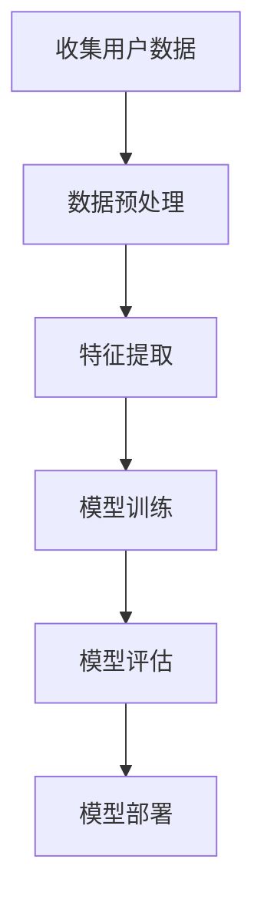

在机器学习过程中，数据预处理是一个关键步骤。它包括数据清洗、数据归一化和特征选择等操作。接下来，特征提取是从原始数据中提取出对模型有用的信息。这些特征将用于训练模型。

在模型训练阶段，我们使用监督学习算法，如决策树、支持向量机（SVM）和神经网络等。这些算法通过迭代训练，不断调整模型参数，使其能够更好地预测用户行为。

模型评估是验证模型效果的重要步骤。我们使用指标如准确率、召回率和F1分数来评估模型的性能。如果模型效果不理想，我们需要返回到数据预处理和特征提取阶段，进行进一步的优化。

最后，模型部署是将训练好的模型应用于实际场景。在广告内容个性化中，这意味着使用模型来生成个性化的广告推荐，并将其展示给用户。

##### 2.1.2 深度学习原理

深度学习是机器学习的一种形式，它通过多层神经网络来学习数据。深度学习在广告内容个性化中有着广泛的应用，因为它能够自动提取复杂的数据特征，从而生成更精确的个性化推荐。

深度学习的基本组成部分包括：

- **神经元**：神经网络的基本单元，用于接收输入信号并进行计算。
- **层**：神经网络由多个层组成，包括输入层、隐藏层和输出层。
- **激活函数**：用于引入非线性变换，使得神经网络能够学习复杂的关系。
- **反向传播算法**：用于计算神经网络参数的梯度，并更新参数，以提高模型的预测能力。

以下是深度学习神经网络的Mermaid流程图：

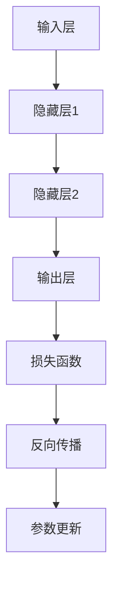

在深度学习中，我们通常使用多层感知机（MLP）、卷积神经网络（CNN）和循环神经网络（RNN）等模型。这些模型能够处理不同类型的数据，并在广告内容个性化中表现出色。

##### 2.1.3 用户行为分析

用户行为分析是广告内容个性化的基础。它涉及到对用户在网站、APP等平台上的行为数据进行收集、分析和建模。

用户行为分析的主要步骤包括：

1. **数据收集**：收集用户在平台上的各种行为数据，如浏览记录、购买记录、点击行为等。
2. **数据预处理**：对收集到的数据进行清洗和归一化处理，以确保数据质量。
3. **特征提取**：从原始数据中提取出对用户行为有预测性的特征，如用户的历史浏览时间、浏览的页面类型等。
4. **建模**：使用机器学习或深度学习算法，对提取出的特征进行建模，以预测用户的兴趣和需求。
5. **模型评估**：评估模型的预测能力，并根据评估结果调整模型参数。

以下是一个用户行为分析的Mermaid流程图：

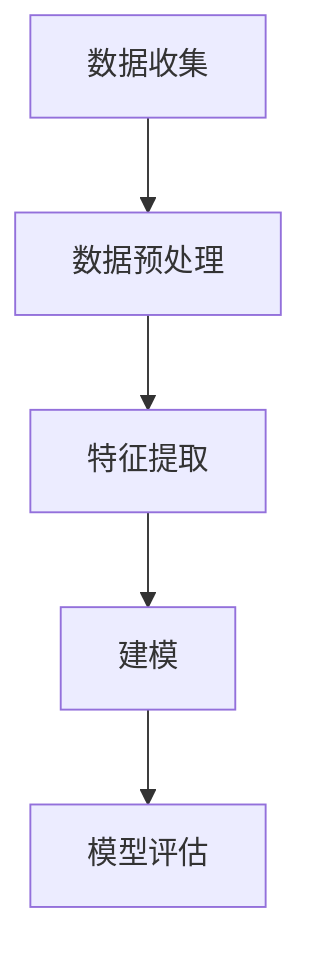

通过用户行为分析，我们可以更好地理解用户，从而生成更加个性化的广告推荐。例如，如果一个用户经常浏览某个类别的产品，我们可以推荐更多类似的产品给他。

### 2.2 智能广告内容个性化策略

#### 2.2.1 用户画像构建

用户画像是指对用户特征进行全面描述的过程。通过构建用户画像，我们可以更好地理解用户，从而实现个性化的广告推荐。

用户画像的主要特征包括：

- **基础信息**：如年龄、性别、地理位置等。
- **兴趣偏好**：如喜欢的品牌、产品类别等。
- **行为特征**：如浏览历史、购买记录、点击行为等。
- **社交特征**：如好友关系、参与社群等。

以下是用户画像的Mermaid实体关系图：

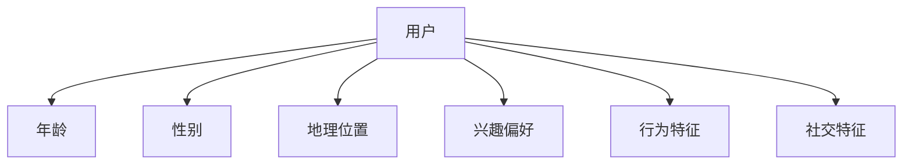

通过用户画像，我们可以对用户进行细分，从而生成更加精准的广告推荐。例如，对于一个喜欢运动鞋的用户，我们可以推荐运动鞋相关的广告。

#### 2.2.2 内容推荐算法

内容推荐算法是广告内容个性化的核心。常见的推荐算法包括基于内容的推荐、基于协同过滤的推荐和基于深度学习的推荐等。

##### 2.2.2.1 基于内容的推荐

基于内容的推荐算法通过分析物品的内容特征，为用户推荐相似的内容。这种算法的优点是实现简单，但缺点是难以处理用户与物品之间的复杂关系。

以下是基于内容的推荐算法的Mermaid流程图：

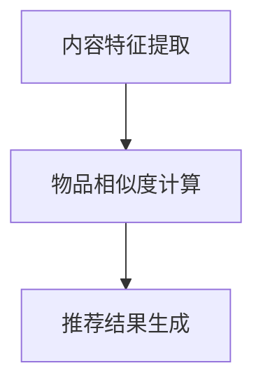

##### 2.2.2.2 基于协同过滤的推荐

基于协同过滤的推荐算法通过分析用户的行为数据，为用户推荐相似的物品。这种算法的优点是能够处理复杂的关系，但缺点是计算复杂度高，且容易受到数据稀疏性的影响。

以下是基于协同过滤的推荐算法的Mermaid流程图：

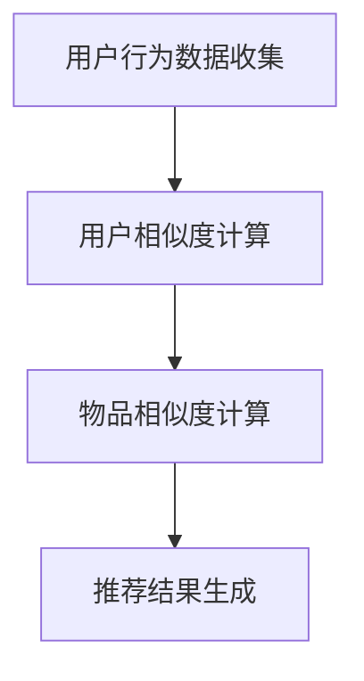

##### 2.2.2.3 基于深度学习的推荐

基于深度学习的推荐算法通过构建深度神经网络，自动提取用户和物品的复杂特征，从而生成个性化的推荐。这种算法的优点是能够处理复杂的关系，且推荐效果较好。

以下是基于深度学习的推荐算法的Mermaid流程图：

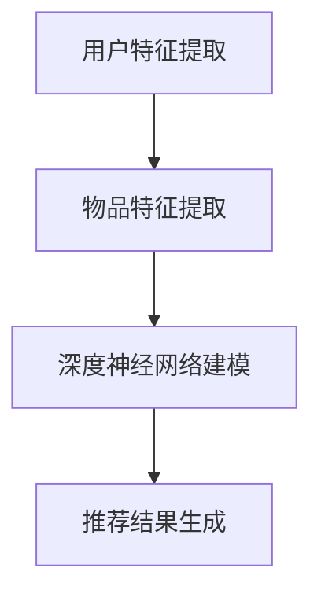

#### 2.2.3 广告创意优化

广告创意是广告内容的重要组成部分，它直接影响用户的点击和转化率。广告创意优化是指通过不断调整广告的样式、文案和布局，以提高广告的效果。

广告创意优化的主要方法包括：

- **A/B测试**：通过比较不同广告创意的效果，选择最优的创意。
- **机器学习优化**：使用机器学习算法，根据用户的历史行为和偏好，自动调整广告创意。
- **用户反馈**：通过用户的反馈，不断优化广告创意。

以下是广告创意优化的Mermaid流程图：

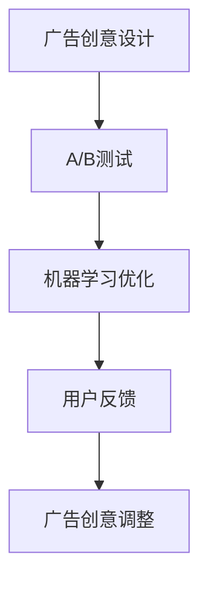

### 2.3 提高用户参与度的方法

#### 2.3.1 用户互动设计

用户互动设计是指通过设计有趣的互动活动，吸引用户参与。这种互动可以包括游戏化元素、互动广告、挑战任务等。

以下是用户互动设计的Mermaid流程图：

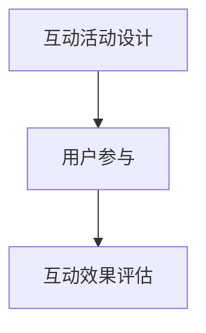

#### 2.3.2 增强用户体验

增强用户体验是指通过优化广告的加载速度、界面设计等，提高用户的满意度。好的用户体验能够提高用户的参与度，增加品牌的忠诚度。

以下是增强用户体验的Mermaid流程图：

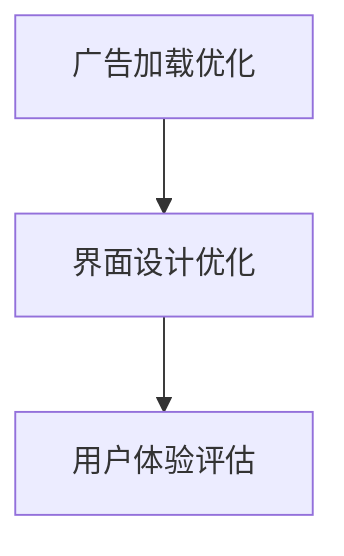

#### 2.3.3 用户反馈与迭代

用户反馈是广告内容个性化的重要依据。通过收集用户的反馈，可以不断优化广告内容，提高用户的参与度。

以下是用户反馈与迭代的Mermaid流程图：

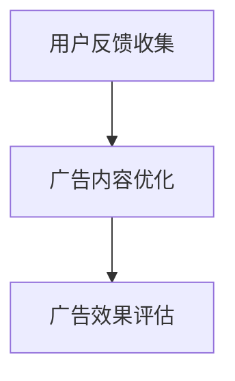

### 第三部分：实践与应用

#### 3.1 AI驱动的智能广告内容个性化案例分析

在本部分，我们将通过具体的案例分析，展示AI驱动的智能广告内容个性化在不同场景下的应用效果。

#### 3.2 项目实战与实现

在本部分，我们将详细介绍一个AI驱动的智能广告内容个性化项目的实施过程，包括环境配置、系统设计、算法实现和效果评估等。

#### 3.3 总结与展望

在本部分，我们将对AI驱动的智能广告内容个性化进行总结，展望其未来发展趋势，并提出相关建议。

### 参考文献

1. **李航**，《统计学习方法》，清华大学出版社，2012。
2. **周志华**，《机器学习》，清华大学出版社，2016。
3. **Goodfellow, Ian; Bengio, Yoshua; Courville, Aaron**，《深度学习》， MIT Press，2016。

### 作者信息

作者：AI天才研究院/AI Genius Institute & 禅与计算机程序设计艺术 /Zen And The Art of Computer Programming

---

在本文中，我们首先介绍了广告行业现状与挑战，然后详细阐述了AI在广告中的应用原理和策略，并通过Mermaid流程图和Python代码示例，深入讲解了机器学习、深度学习和用户行为分析等核心概念。接着，我们提出了智能广告内容个性化策略，包括用户画像构建、内容推荐算法和广告创意优化，并介绍了提高用户参与度的方法，如用户互动设计、增强用户体验和用户反馈与迭代。最后，我们通过案例分析、项目实战和总结展望，展示了AI驱动的智能广告内容个性化的实践与应用，为读者提供了全面的指导和参考。希望本文能够为从事广告行业的技术人员提供有价值的见解和启发。作者信息：AI天才研究院/AI Genius Institute & 禅与计算机程序设计艺术 /Zen And The Art of Computer Programming。

