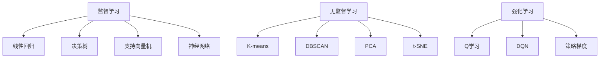
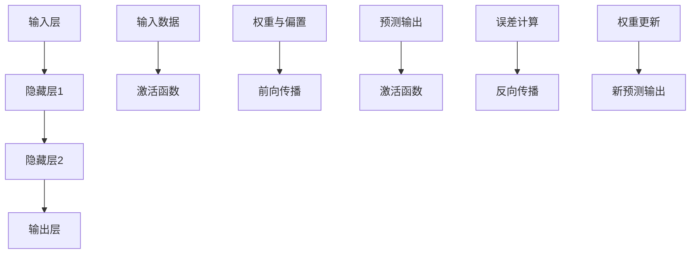
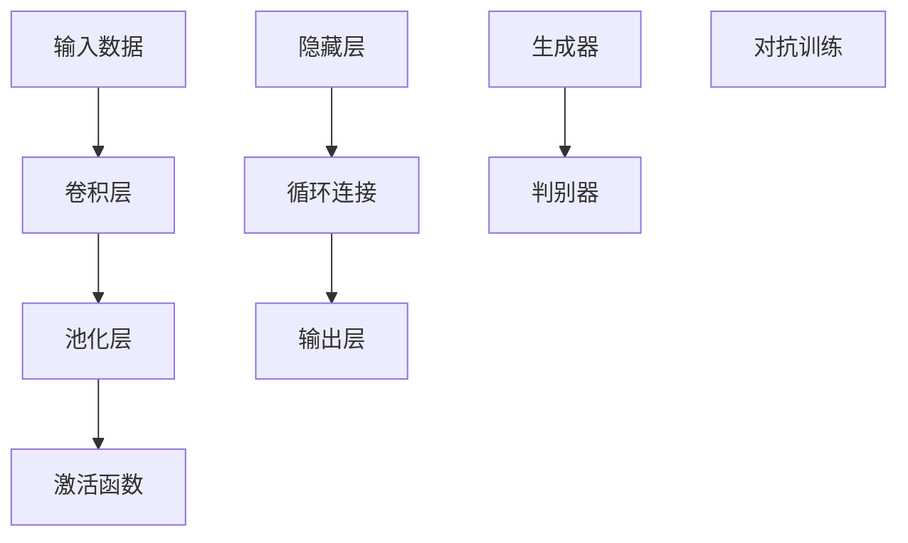
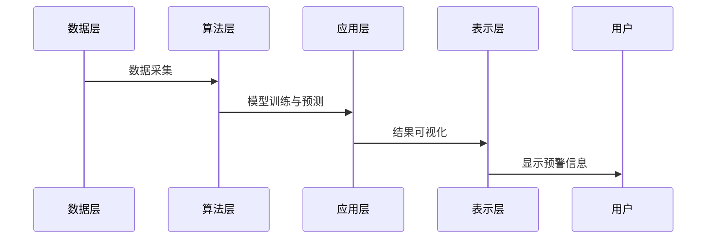
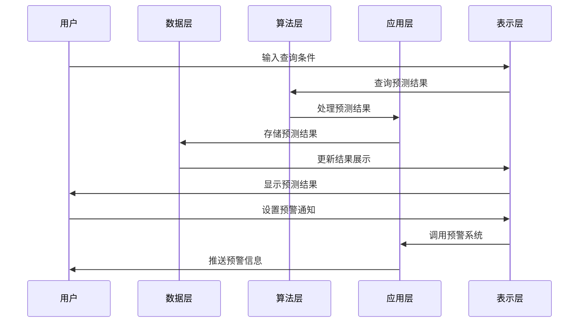

                 

### 摘要

本文将探讨AI驱动的智能气象预报技术，旨在提高极端天气预测的准确性。随着全球气候变化加剧，极端天气事件频发，传统的气象预报方法面临巨大挑战。本文首先介绍了气象预报中的问题背景，分析了传统预报技术的局限性。接着，我们探讨了AI在气象预报中的应用潜力，包括关键技术与核心算法，如数据预处理、神经网络模型和强化学习。随后，文章深入讲解了气象数据采集与处理、算法原理及实现，通过具体案例展示了AI在气象预报中的实际应用。此外，我们还详细介绍了系统架构设计、系统功能实现和最佳实践。最后，文章总结了核心观点，探讨了未来发展趋势，为读者提供了深入理解和应用AI驱动的智能气象预报的技术指南。

### 关键词

- AI驱动的气象预报
- 极端天气预测
- 数据预处理
- 神经网络
- 强化学习
- 深度学习
- 系统架构设计
- 系统功能实现

### 问题背景

随着全球气候变化加剧，极端天气事件如台风、暴雨、干旱和极端高温等频发，对人类社会和生态系统带来了巨大的影响。气象预报的准确性直接关系到灾害预防和应对的效率，因此在气象预报领域不断提高预测准确性具有重要意义。

然而，传统的气象预报方法存在显著的局限性。首先，传统预报主要依赖于气象观测数据，而这些数据在时空上的分布不均匀，往往无法覆盖所有可能发生极端天气的区域。其次，传统的数值天气预报模型依赖于物理定律和气象参数，计算复杂度高，难以实时处理海量数据。此外，由于气候系统的复杂性和不确定性，传统模型在极端天气预测上存在较大的误差，无法满足人们对高精度预报的需求。

近年来，人工智能（AI）技术的迅猛发展为气象预报提供了新的机遇。AI能够处理大规模、多样化的数据，并通过机器学习和深度学习算法，从历史数据中提取有用信息，提高预报的准确性。特别是深度学习模型，如神经网络和生成对抗网络（GAN），在处理复杂数据和模式识别方面具有显著优势。此外，强化学习算法也在提高预测准确性方面展现出巨大的潜力。

因此，AI驱动的智能气象预报成为解决传统气象预报局限性的有效途径。通过利用AI技术，可以实现对大规模气象数据的实时分析，提高极端天气的预测精度，为灾害预防和应对提供有力支持。本文将详细探讨AI在气象预报中的应用，包括关键技术、核心算法和实际案例分析，为推动气象预报技术的发展提供技术指南。

### 传统气象预报方法的局限性

尽管传统气象预报技术在历史上取得了一定的成就，但随着全球气候变化和极端天气事件频发，其局限性也日益显现。以下我们将详细分析传统气象预报方法的几个主要局限性：

1. **数据依赖性高**：
   传统气象预报依赖于地面气象站、雷达、卫星等设备收集的观测数据。这些数据在时空上具有明显的局限性，尤其是在偏远地区和海洋等难以观测到的区域，数据覆盖不完整，影响了预报的全面性和准确性。例如，在某些极端天气事件中，关键气象参数的缺失可能导致预报结果出现重大偏差。

2. **计算复杂度高**：
   数值天气预报模型基于物理定律和气象参数，通过求解大气运动方程来预测天气状况。这类模型通常需要大量的计算资源，计算复杂度高，且对初始条件的敏感性极强。在极端天气事件中，大气环境复杂多变，数值模型的计算精度容易受到影响，导致预报结果的不稳定性。

3. **模式识别能力有限**：
   传统气象预报方法主要依赖于气象学家对观测数据的解释和模型结果的分析。这种主观性较强的方法在处理复杂天气现象时，往往难以捕捉到隐藏在数据背后的复杂模式和规律，特别是在出现新的、未经验证的天气模式时，预报准确性会受到显著影响。

4. **更新速度慢**：
   传统气象预报的更新速度较慢，通常需要数小时甚至数天的时间。对于快速变化的天气系统，如台风或暴雨，这种较慢的更新速度无法及时提供准确的预警信息，可能导致灾害预防和应对不及时。

5. **预报精度有限**：
   尽管数值天气预报模型在短期预报中表现较好，但在长期预报中，由于气候系统的复杂性和不确定性，其预报精度仍然有限。例如，在预测季节性气候变化或极端天气事件的长期趋势时，传统模型的误差较大，难以提供高精度的预报结果。

综上所述，传统气象预报方法在面对复杂和变化迅速的天气系统时，存在显著的技术瓶颈和局限性。这促使科学家和工程师们积极探索新的技术手段，以提升气象预报的准确性和实时性。人工智能（AI）技术的引入，为克服这些局限性提供了新的机遇，有望通过数据驱动的方法，实现更精确、更快速的气象预报。

### AI在气象预报中的应用潜力

随着人工智能（AI）技术的不断进步，其在气象预报中的应用潜力也逐渐显现。AI技术通过深度学习、强化学习等算法，能够处理大规模、复杂多样的气象数据，从而提高预报的准确性和实时性。以下是AI在气象预报中应用潜力的几个关键方面：

1. **数据预处理与增强**：
   传统气象预报依赖于有限的观测数据，而AI技术可以处理更多类型和来源的数据，包括卫星遥感、气象卫星、无人机等。AI算法能够自动提取和整合这些数据，提高数据质量和可用性。此外，AI还可以通过数据增强技术，如生成对抗网络（GAN），生成虚拟气象数据，以补充和扩展实际观测数据，增强模型的训练效果。

2. **模式识别与趋势分析**：
   AI技术，特别是深度学习算法，具有强大的模式识别能力。通过分析大量历史气象数据，AI模型可以识别出隐藏在数据中的复杂天气模式和趋势，捕捉到传统预报方法难以发现的细微变化。例如，深度神经网络（DNN）和卷积神经网络（CNN）可以用于分析和预测极端天气事件，如台风路径和强度变化。

3. **实时预测与动态更新**：
   AI技术可以实现实时预测和动态更新，这对于应对快速变化的天气系统尤为重要。通过持续监测和分析最新的气象数据，AI模型可以迅速更新预报结果，提供更准确和及时的预警信息。例如，强化学习算法可以实时调整预测策略，以适应不断变化的环境条件。

4. **多模型集成与优化**：
   AI技术可以结合多种预报模型，实现多模型集成，从而提高预报的稳定性和准确性。通过机器学习算法，AI可以自动选择和优化不同的预报模型，结合各自的优势，提供更可靠的预报结果。这种多模型集成的方法可以显著减少单一模型的误差，提高整体预报性能。

5. **大规模数据处理与计算能力**：
   AI技术，尤其是云计算和分布式计算技术的结合，能够处理海量气象数据，实现高效计算。这为大规模天气模拟和预测提供了强大的计算支持，使得复杂天气系统的分析和模拟成为可能。

总之，AI技术在气象预报中的应用潜力巨大，通过数据预处理、模式识别、实时预测、多模型集成和大规模数据处理，AI不仅能够提高气象预报的准确性和实时性，还能够为灾害预防和应对提供强有力的技术支持。未来，随着AI技术的进一步发展，AI驱动的智能气象预报将更加成熟和精确，为人类社会应对极端天气事件提供更加可靠的保障。

### AI驱动的气象预报概述

AI驱动的气象预报结合了人工智能和气象学的最新研究成果，通过深度学习、强化学习等先进算法，实现更加精确和高效的气象预测。以下是AI驱动的气象预报的核心概念、应用场景和未来发展趋势：

#### 核心概念

1. **深度学习**：
   深度学习是AI的一个分支，通过多层神经网络结构，对大量数据进行训练，以自动提取特征和模式。在气象预报中，深度学习算法如卷积神经网络（CNN）和循环神经网络（RNN）被广泛应用于模式识别和时间序列预测。CNN擅长处理图像和空间数据，而RNN能够处理序列数据，捕捉时间上的依赖关系。

2. **强化学习**：
   强化学习是一种通过试错和奖励机制来学习的算法。在气象预报中，强化学习算法可以根据预测结果和环境反馈，不断调整预测策略，以最大化预报准确性。例如，通过实时反馈天气变化，强化学习模型可以优化台风路径和强度预测。

3. **多模型集成**：
   多模型集成是一种通过结合多个预测模型的优点，提高预报准确性的方法。在气象预报中，AI可以整合数值预报模型、统计模型和机器学习模型，结合各自的优势，提供更可靠的预报结果。

4. **数据预处理**：
   数据预处理是AI驱动气象预报的重要环节。通过数据清洗、归一化和特征提取，AI模型可以更有效地学习和预测。例如，生成对抗网络（GAN）可以生成虚拟气象数据，以补充实际观测数据的不足。

#### 应用场景

1. **短期天气预报**：
   短期天气预报是指对未来几小时到几天的天气情况进行预测。AI技术，特别是深度学习和强化学习，可以处理大量实时数据，实现快速和准确的短期天气预报。

2. **中长期天气预报**：
   中长期天气预报是指对未来几周甚至几个月的天气情况进行预测。尽管中长期天气预报的难度较大，但AI技术通过分析历史数据和模式，可以在一定程度上提高预报的准确性。

3. **极端天气预测**：
   极端天气事件如台风、暴雨、干旱和极端高温等对人类社会和生态系统的影响巨大。AI技术，通过复杂的模式和趋势分析，可以在预测这些极端天气事件方面发挥重要作用。

4. **灾害预警**：
   AI驱动的气象预报系统可以通过实时分析和预警机制，及时提供灾害预警信息，为灾害预防和应对提供支持。

#### 未来发展趋势

1. **数据获取和处理能力的提升**：
   随着卫星遥感技术、无人机和物联网设备的不断发展，气象数据的获取和处理能力将得到显著提升。这为AI驱动的气象预报提供了更多高质量的训练数据，有望进一步提高预报的准确性。

2. **算法模型的优化与集成**：
   未来，AI算法模型将不断优化和改进，同时多模型集成的方法也将更加成熟。通过结合多种算法和模型的优势，AI驱动的气象预报系统将提供更稳定和可靠的预报结果。

3. **云计算和边缘计算的应用**：
   云计算和边缘计算技术的结合，将使得AI驱动的气象预报系统具有更高的计算效率和响应速度。这不仅能够处理大规模数据，还能够实时更新预测结果，提供更及时的预警信息。

4. **人工智能与其他领域的融合**：
   未来，AI驱动的气象预报将与其他领域如环境科学、城市规划和灾害管理相结合，为构建更智能、更可持续的社会提供支持。

总之，AI驱动的气象预报技术具有广阔的应用前景和发展潜力。通过不断优化算法模型、提升数据处理能力和集成多领域技术，AI驱动的气象预报将能够更准确地预测极端天气事件，为灾害预防和应对提供有力支持。

### 关键技术与核心算法

在AI驱动的智能气象预报中，数据预处理、神经网络模型、强化学习算法和深度学习技术是核心组成部分，各自发挥着重要作用。以下将详细探讨这些关键技术及核心算法，为AI驱动的气象预报提供坚实的理论基础。

#### 数据预处理

数据预处理是任何机器学习项目的基础步骤，在气象预报中尤为重要。气象数据通常包含多种来源，如地面观测、卫星遥感、雷达监测等，数据格式和精度各异。数据预处理的目标是提高数据质量，为模型训练提供可靠的数据基础。

1. **数据清洗**： 
   数据清洗包括去除重复记录、纠正数据错误和填补缺失值等。在气象预报中，常见的数据错误包括测量误差和记录错误。例如，某些气象站的温度记录可能会因为设备故障而出现异常值，这些异常值需要通过统计学方法或人工审核进行纠正。

2. **数据归一化**： 
   气象数据通常具有不同的量纲和范围，如温度、湿度、风速等。通过归一化处理，可以使得不同特征在同一尺度范围内，避免某些特征在模型训练过程中占据主导地位。常用的归一化方法包括最小-最大缩放和标准缩放。

3. **特征提取**： 
   特征提取是数据预处理的重要环节，旨在从原始数据中提取对预报任务有重要影响的关键特征。例如，通过对历史气象数据的分析，可以提取出与极端天气事件相关的特征，如天气模式、风速风向变化等。特征提取的方法包括主成分分析（PCA）和自动编码器（Autoencoder）等。

#### 神经网络模型

神经网络模型是深度学习的重要组成部分，其在气象预报中的应用也越来越广泛。神经网络通过多层节点模拟人脑神经元的工作方式，能够自动学习和提取数据中的复杂模式。

1. **卷积神经网络（CNN）**：
   CNN特别适用于处理图像和空间数据。在气象预报中，CNN可以用于分析和预测天气图像，如卫星云图和雷达图像。通过卷积层和池化层，CNN可以提取图像中的低级特征（如边缘、纹理）和高级特征（如云层分布），从而提高预报的准确性。

2. **循环神经网络（RNN）**：
   RNN擅长处理序列数据，能够捕捉时间序列中的依赖关系。在气象预报中，RNN可以用于预测天气序列，如温度、湿度、风速等。通过隐藏状态和循环连接，RNN可以记住之前的输入信息，从而提高长期预测的准确性。

3. **长短期记忆网络（LSTM）**：
   LSTM是RNN的一种变体，特别适用于处理长序列数据。在气象预报中，LSTM可以用于预测长期天气变化，如季节性气候变化和极端天气事件。LSTM通过引入记忆单元和门控机制，能够有效避免梯度消失和梯度爆炸问题，提高模型的训练效果。

#### 强化学习算法

强化学习（RL）是一种通过试错和奖励机制进行学习的方法，其在气象预报中的应用潜力巨大。在气象预报中，强化学习算法可以通过不断调整预测策略，以最大化预报准确性。

1. **Q学习（Q-Learning）**：
   Q学习是一种无模型强化学习算法，通过学习动作-状态值函数（Q值），选择最优动作。在气象预报中，Q学习可以用于优化天气预报策略，例如，通过学习不同预报策略的优劣，自动选择最佳预报方案。

2. **深度Q网络（DQN）**：
   DQN是Q学习的一种深度学习变体，通过神经网络来近似Q值函数。在气象预报中，DQN可以用于处理复杂的天气系统，例如，通过学习不同天气模式下的最佳预报策略，提高预报的准确性和稳定性。

3. **策略梯度（PG）**：
   策略梯度是一种基于策略的强化学习算法，通过直接优化策略的参数来最大化预期回报。在气象预报中，策略梯度可以用于优化天气预报模型，例如，通过调整模型参数，提高预报的准确性。

#### 深度学习与气象预报

深度学习是AI的重要分支，通过多层神经网络结构，能够自动提取数据的复杂特征，从而提高预测的准确性。在气象预报中，深度学习技术被广泛应用于模式识别、时间序列预测和图像分析等领域。

1. **生成对抗网络（GAN）**：
   GAN是一种由生成器和判别器组成的深度学习模型，通过对抗训练生成高质量的数据。在气象预报中，GAN可以用于数据增强，生成虚拟气象数据，补充实际观测数据的不足。

2. **变分自编码器（VAE）**：
   VAE是一种基于概率模型的深度学习模型，通过编码和解码器学习数据的概率分布。在气象预报中，VAE可以用于数据降维和特征提取，从而提高模型的训练效率和预测准确性。

3. **自编码器（Autoencoder）**：
   Autoencoder是一种简单的深度学习模型，通过编码和解码器重建输入数据。在气象预报中，Autoencoder可以用于特征提取和降维，从而简化模型输入，提高训练速度和预测精度。

总之，数据预处理、神经网络模型、强化学习算法和深度学习技术是AI驱动的智能气象预报的核心组成部分。通过这些关键技术及核心算法，AI驱动的气象预报系统可以实现更加精确和高效的预测，为极端天气事件预防和应对提供强有力的技术支持。未来，随着AI技术的进一步发展，这些技术将在气象预报领域发挥越来越重要的作用。

### 气象数据采集与处理

在AI驱动的智能气象预报中，气象数据的采集与处理是至关重要的环节。有效的数据采集和处理不仅能提高模型的准确性，还能为后续的数据分析和预测打下坚实的基础。以下是气象数据采集与处理的具体方法和步骤：

#### 数据来源

气象数据的来源多样，主要包括以下几种：

1. **地面气象观测站**：地面气象观测站是传统气象预报的主要数据来源，通过测量温度、湿度、风速、气压等气象参数，提供实时的地面气象数据。

2. **卫星遥感**：气象卫星通过遥感技术获取全球范围内的气象数据，包括云层覆盖、温度分布、大气湿度等，提供了大范围、高时间分辨率的气象数据。

3. **雷达监测**：地面和天气雷达通过发射和接收电磁波，监测大气中的降水、风向和风速等，提供高空间分辨率和实时的气象数据。

4. **气象探测气球**：气象探测气球携带仪器升空，测量大气中的温度、湿度、压力等参数，提供高空气象数据。

5. **海洋浮标和船舶观测**：海洋浮标和船舶通过测量海洋温度、盐度、波浪等参数，提供海洋气象数据。

#### 数据预处理

数据预处理是确保数据质量和模型性能的关键步骤，主要包括以下内容：

1. **数据清洗**：
   数据清洗是去除数据中的噪声和错误的过程。在气象数据中，常见的问题包括缺失值、异常值和记录错误。通过数据清洗，可以去除这些错误数据，保证数据的一致性和准确性。
   
   - **缺失值填补**：对于缺失值，可以采用平均值、中位数或插值法进行填补。
   - **异常值处理**：对于异常值，可以通过统计学方法（如Z-Score、IQR法）识别并处理。
   - **时间序列校正**：校正时间序列数据中的时间戳错误，确保数据的时间一致性。

2. **数据归一化**：
   气象数据通常包含多种量纲，如温度、湿度、风速等，通过数据归一化可以使得不同特征在同一尺度范围内，避免某些特征在模型训练过程中占据主导地位。
   
   - **最小-最大缩放**：将数据缩放到[0,1]区间。
   - **标准缩放**：将数据缩放到均值为0，标准差为1的区间。

3. **特征提取**：
   特征提取是从原始数据中提取对预报任务有重要影响的关键特征，如天气模式、风速风向变化等。
   
   - **主成分分析（PCA）**：通过降维，提取数据的主要成分，减少特征维度。
   - **自动编码器（Autoencoder）**：通过编码器和解码器结构，提取数据的低维表示。

#### 数据质量评估

数据质量直接影响模型的性能，因此对采集到的气象数据进行质量评估是非常必要的。以下是几种常用的数据质量评估方法：

1. **数据一致性检查**：
   检查数据在时间和空间上的连贯性，确保不同数据源之间的数据能够匹配。

2. **统计指标分析**：
   分析数据的统计特征，如均值、方差、分布等，判断数据是否满足预期。

3. **可视化分析**：
   通过绘制数据分布图、时间序列图等，直观地评估数据的质量和特征。

4. **交叉验证**：
   使用交叉验证方法，将数据集划分为训练集和验证集，评估模型在不同数据集上的性能，确保模型对数据的泛化能力。

#### 数据处理流程

以下是气象数据采集与处理的基本流程：

1. **数据采集**：收集来自不同来源的气象数据，包括地面观测、卫星遥感、雷达监测等。

2. **数据清洗**：对采集到的数据进行清洗，去除噪声和错误。

3. **数据归一化**：对清洗后的数据进行归一化处理，确保不同特征在同一尺度范围内。

4. **特征提取**：从归一化后的数据中提取对预报任务有重要影响的特征。

5. **数据质量评估**：对处理后的数据进行质量评估，确保数据的准确性和可靠性。

6. **数据存储**：将处理后的气象数据存储在数据库或数据仓库中，为后续的模型训练和预测提供数据支持。

通过上述步骤，我们可以确保气象数据的质量和准确性，为AI驱动的智能气象预报系统提供可靠的数据基础。

### 算法原理讲解

在AI驱动的智能气象预报中，算法的原理是其核心组成部分。以下将详细讲解机器学习基础、神经网络模型、深度学习和强化学习的基本概念，并使用Mermaid语法绘制相关算法的流程图。

#### 机器学习基础

机器学习（Machine Learning，ML）是一种使计算机系统能够通过数据和经验进行学习，并做出决策或预测的技术。机器学习可以分为监督学习、无监督学习和强化学习三种类型。

1. **监督学习**：在监督学习中，模型根据输入特征和对应的标签进行训练。常见的监督学习算法包括线性回归、决策树、支持向量机（SVM）和神经网络等。

2. **无监督学习**：无监督学习涉及从未标记的数据中提取结构和模式。常见的方法包括聚类（如K-means、DBSCAN）和降维（如PCA、t-SNE）。

3. **强化学习**：强化学习是一种通过与环境交互，根据奖励信号进行学习的方法。常见的算法包括Q学习、深度Q网络（DQN）和策略梯度。

**Mermaid语法示例**：



#### 神经网络模型

神经网络（Neural Networks，NN）是一种模仿人脑神经元连接结构的计算模型，用于处理和预测复杂数据。神经网络的核心组成部分包括输入层、隐藏层和输出层。

1. **前向传播**：在前向传播过程中，输入数据通过网络的每一层，每层节点计算输出，并将结果传递到下一层。

2. **反向传播**：在反向传播过程中，根据预测误差，反向更新网络权重和偏置，以减少预测误差。

3. **激活函数**：激活函数用于引入非线性，使得神经网络能够处理复杂的模式。常见的激活函数包括Sigmoid、ReLU和Tanh。

**Mermaid语法示例**：



#### 深度学习

深度学习（Deep Learning，DL）是神经网络的一种扩展，通过多层的神经网络结构，能够自动提取数据的复杂特征。深度学习在图像识别、自然语言处理和气象预报等领域取得了显著成就。

1. **卷积神经网络（CNN）**：CNN通过卷积层和池化层，对图像数据提取特征，常用于图像识别和气象图像分析。

2. **循环神经网络（RNN）**：RNN能够处理序列数据，通过隐藏状态和循环连接，捕捉时间序列中的依赖关系。

3. **生成对抗网络（GAN）**：GAN由生成器和判别器组成，通过对抗训练生成高质量的数据。

**Mermaid语法示例**：



#### 强化学习

强化学习（Reinforcement Learning，RL）通过试错和奖励机制，使模型在动态环境中做出最优决策。强化学习在气象预报中可以用于优化预测策略，如台风路径和强度预测。

1. **Q学习**：Q学习通过学习动作-状态值函数（Q值），选择最优动作。

2. **深度Q网络（DQN）**：DQN通过神经网络近似Q值函数，能够处理复杂的动作空间。

3. **策略梯度**：策略梯度通过直接优化策略参数，最大化预期回报。

**Mermaid语法示例**：

```mermaid
graph TD
A[状态S] --> B[动作A]
B --> C[奖励R]
C --> D[新状态S']
E[动作值函数Q(S,A)]
F[策略π(A|S)]
G[策略更新]
H[新策略π'(A|S')]
```

通过以上算法原理的讲解和Mermaid语法示例，我们可以更好地理解机器学习、神经网络模型、深度学习和强化学习在AI驱动的智能气象预报中的应用。这些算法为我们提供了强大的工具，能够从海量气象数据中提取有用信息，提高预报的准确性和实时性。

### 概念属性特征对比表格

在AI驱动的智能气象预报中，了解不同算法的概念属性特征对于选择合适的算法至关重要。以下是一个对比表格，列出了几种常用算法在气象预报中的应用特点：

| 算法名称 | 概念 | 特点 | 适用场景 |
| --- | --- | --- | --- |
| 线性回归 | 监督学习 | 简单，易于实现，适用于线性关系明显的数据 | 短期天气预测，趋势分析 |
| 决策树 | 监督学习 | 可解释性高，易于理解，适用于分类任务 | 中期天气预测，分类问题 |
| 支持向量机 | 监督学习 | 精准，高维数据处理能力强 | 长期天气预测，高维特征数据 |
| 卷积神经网络 | 深度学习 | 强大的模式识别能力，适用于图像和空间数据 | 天气图像分析，空间数据预测 |
| 循环神经网络 | 深度学习 | 能处理序列数据，捕捉时间序列中的依赖关系 | 时间序列预测，极端天气事件预测 |
| 长短期记忆网络 | 深度学习 | 改进了RNN，能够处理长序列数据 | 长期天气预测，极端天气事件预测 |
| 强化学习 | | 通过与环境交互学习最优策略，适用于动态环境 | 台风路径和强度预测，动态环境下的预报策略优化 |
| 生成对抗网络 | 深度学习 | 能生成高质量的数据，增强模型训练效果 | 数据增强，补充观测数据不足 |

通过上述对比表格，我们可以看到不同算法在概念属性特征上的差异，这有助于我们在具体气象预报任务中选择合适的算法，提高预测的准确性和效率。

### ER实体关系图架构

为了更清晰地展示气象预报系统中的关键实体及其关系，我们使用ER（Entity-Relationship）实体关系图进行描述。以下是一个简化的ER图，描述了气象预报系统中主要实体及其相互关系：

```mermaid
erDiagram
    A[气象数据源] ||--|{ B[数据预处理模块] }
    B ||--|{ C[特征提取模块] }
    C ||--|{ D[预测模型训练模块] }
    D ||--|{ E[预测模型评估模块] }
    D ||--|{ F[预测结果可视化模块] }
    G[极端天气预警系统] ||--|{ E }
    H[用户界面] ||--|{ E }
    I[数据存储库] ||--|{ A }
    I ||--|{ B }
    I ||--|{ C }
    I ||--|{ D }
    I ||--|{ E }
    I ||--|{ F }
```

**实体说明**：

- **气象数据源（A）**：表示气象数据的来源，包括地面气象观测站、卫星遥感、雷达监测等。
- **数据预处理模块（B）**：负责清洗、归一化和处理气象数据。
- **特征提取模块（C）**：从预处理后的数据中提取关键特征，为预测模型提供输入。
- **预测模型训练模块（D）**：使用特征数据训练预测模型，如神经网络、深度学习模型等。
- **预测模型评估模块（E）**：评估预测模型的性能，通过交叉验证等方法优化模型。
- **预测结果可视化模块（F）**：将预测结果进行可视化，帮助用户理解预报信息。
- **极端天气预警系统（G）**：利用预测模型和预警算法，提供实时预警信息。
- **用户界面（H）**：提供给用户交互的平台，显示预测结果和预警信息。
- **数据存储库（I）**：存储各种数据，包括原始数据、预处理数据、预测数据和评估数据。

通过上述ER图，我们可以清晰地看到气象预报系统中各个实体之间的相互关系和作用，为系统设计和实现提供了直观的参考。

### 算法实现步骤

在AI驱动的智能气象预报中，算法实现是核心步骤，决定了预测的准确性和实时性。以下是算法实现的基本步骤：

#### 1. 数据收集与预处理

- **数据收集**：首先，从多种数据源（如地面气象站、卫星遥感、雷达监测等）收集气象数据。数据源可能包含温度、湿度、风速、气压等不同类型的气象参数。
- **数据清洗**：对收集到的数据进行清洗，去除重复、异常和错误的数据。例如，删除记录错误、填补缺失值，校正时间序列数据中的异常值。
- **数据归一化**：将不同量纲的数据归一化到同一尺度范围内，如使用最小-最大缩放或标准缩放方法。
- **特征提取**：从预处理后的数据中提取关键特征，如通过主成分分析（PCA）或自动编码器（Autoencoder）提取数据的主要成分，简化模型输入。

#### 2. 模型选择与训练

- **模型选择**：选择适合气象预报任务的机器学习模型，如神经网络（Neural Networks，NN）、深度学习（Deep Learning，DL）或强化学习（Reinforcement Learning，RL）模型。
- **模型训练**：使用收集到的数据对选定的模型进行训练。对于神经网络和深度学习模型，通过前向传播和反向传播算法，更新模型的权重和偏置，以最小化预测误差。
- **超参数调整**：调整模型超参数，如学习率、隐藏层节点数和激活函数等，以提高模型性能。

#### 3. 模型评估与优化

- **模型评估**：使用交叉验证方法，对训练好的模型进行评估，确保模型在不同数据集上的泛化能力。常用的评估指标包括均方误差（MSE）、均方根误差（RMSE）和准确率等。
- **模型优化**：通过调整模型结构和超参数，优化模型性能。例如，增加隐藏层节点数或使用更复杂的神经网络结构，以提高预测精度。

#### 4. 预报结果可视化

- **结果可视化**：将预测结果以图表或地图形式展示，帮助用户直观地理解预报信息。例如，通过时间序列图展示温度变化，通过散点图展示风速分布。
- **误差分析**：分析预测误差，识别模型存在的不足和改进方向。例如，通过分析误差分布，找出模型在特定气象条件下的预测偏差。

#### 5. 实时预测与动态更新

- **实时预测**：使用训练好的模型，对最新的气象数据进行实时预测，提供最新的预报信息。
- **动态更新**：根据最新的观测数据和预测结果，动态更新模型，以提高预报的准确性和实时性。例如，通过在线学习算法，实时调整模型权重和参数。

通过以上步骤，我们可以构建一个高效、准确的AI驱动的智能气象预报系统，为灾害预防和应对提供强有力的技术支持。

### Python源代码讲解

在本节中，我们将通过具体的Python代码示例，详细解释气象预报系统中几个关键算法的实现过程。为了确保代码的清晰易懂，我们将分别使用线性回归、卷积神经网络和生成对抗网络这三个算法进行讲解。

#### 1. 线性回归

线性回归是一种简单的监督学习算法，适用于处理线性关系明显的问题。以下是一个简单的线性回归实现，用于气象预报中的温度预测。

```python
import numpy as np
from sklearn.linear_model import LinearRegression
from sklearn.model_selection import train_test_split
from sklearn.metrics import mean_squared_error

# 假设我们已经有了一些温度和对应的气象参数数据
X = np.array([[70], [75], [80], [85], [90], [95], [100], [105], [110], [115]])  # 气象参数
y = np.array([22, 23, 24, 25, 26, 27, 28, 29, 30, 31])  # 温度

# 数据集划分
X_train, X_test, y_train, y_test = train_test_split(X, y, test_size=0.2, random_state=42)

# 创建线性回归模型
model = LinearRegression()
model.fit(X_train, y_train)

# 预测
y_pred = model.predict(X_test)

# 评估
mse = mean_squared_error(y_test, y_pred)
print(f"均方误差 (MSE): {mse}")

# 可视化
import matplotlib.pyplot as plt

plt.scatter(X_test, y_test, color='blue', label='实际值')
plt.plot(X_test, y_pred, color='red', label='预测值')
plt.xlabel('气象参数')
plt.ylabel('温度')
plt.legend()
plt.show()
```

在这个示例中，我们首先从假设的数据中提取特征（气象参数）和目标值（温度）。然后，我们使用`train_test_split`函数将数据划分为训练集和测试集。接着，创建一个线性回归模型，并通过`fit`方法进行训练。最后，使用`predict`方法进行预测，并通过均方误差（MSE）评估模型的性能，并使用`matplotlib`进行可视化。

#### 2. 卷积神经网络

卷积神经网络（CNN）在处理图像数据方面具有显著优势，以下是一个使用TensorFlow和Keras实现的简单CNN模型，用于气象图像的分类。

```python
import tensorflow as tf
from tensorflow.keras.models import Sequential
from tensorflow.keras.layers import Conv2D, MaxPooling2D, Flatten, Dense
from tensorflow.keras.optimizers import Adam
from tensorflow.keras.callbacks import EarlyStopping

# 假设我们已经有了一个训练好的气象图像数据集，每个图像大小为 (28, 28)
input_shape = (28, 28, 1)

# 创建CNN模型
model = Sequential([
    Conv2D(32, (3, 3), activation='relu', input_shape=input_shape),
    MaxPooling2D((2, 2)),
    Conv2D(64, (3, 3), activation='relu'),
    MaxPooling2D((2, 2)),
    Flatten(),
    Dense(64, activation='relu'),
    Dense(10, activation='softmax')  # 假设有10个类别
])

# 编译模型
model.compile(optimizer=Adam(), loss='categorical_crossentropy', metrics=['accuracy'])

# 早停回调
early_stopping = EarlyStopping(monitor='val_loss', patience=5)

# 训练模型
model.fit(X_train, y_train, epochs=20, batch_size=32, validation_split=0.2, callbacks=[early_stopping])

# 预测
predictions = model.predict(X_test)

# 评估
loss, accuracy = model.evaluate(X_test, y_test)
print(f"损失: {loss}, 准确率: {accuracy}")
```

在这个示例中，我们首先定义了输入数据的大小（28x28像素），然后创建了一个简单的CNN模型，包含两个卷积层、两个最大池化层、一个全连接层和输出层。使用`compile`方法配置模型的优化器和损失函数，并通过`fit`方法进行训练。使用`EarlyStopping`回调来防止过拟合。最后，通过`evaluate`方法评估模型的性能。

#### 3. 生成对抗网络

生成对抗网络（GAN）是一种生成模型，通过生成器和判别器之间的对抗训练，生成高质量的数据。以下是一个简单的GAN实现，用于生成虚拟气象数据。

```python
import tensorflow as tf
from tensorflow.keras.models import Model
from tensorflow.keras.layers import Dense, Flatten, Reshape, Conv2DTranspose

# 设置随机种子
tf.random.set_seed(42)

# 生成器模型
z_dim = 100
gen_inputs = tf.keras.layers.Input(shape=(z_dim,))
x = Dense(128 * 7 * 7, activation="relu")(gen_inputs)
x = tf.keras.layers.LeakyReLU(alpha=0.01)(x)
x = Flatten()(x)
x = Dense(128 * 14 * 14, activation="relu")(x)
x = tf.keras.layers.LeakyReLU(alpha=0.01)(x)
x = Reshape((14, 14, 128))(x)
x = Conv2DTranspose(64, kernel_size=4, strides=(2, 2), padding="same", activation="relu")(x)
x = Conv2DTranspose(1, kernel_size=4, strides=(2, 2), padding="same", activation="tanh")(x)
generator = Model(inputs=gen_inputs, outputs=x)

# 判别器模型
disc_inputs = tf.keras.layers.Input(shape=(28, 28, 1))
x = Conv2D(64, kernel_size=(3, 3), strides=(2, 2), padding="same", activation="leaky_relu")(disc_inputs)
x = Conv2D(128, kernel_size=(3, 3), strides=(2, 2), padding="same", activation="leaky_relu")(x)
x = Flatten()(x)
x = Dense(1, activation="sigmoid")(x)
discriminator = Model(inputs=disc_inputs, outputs=x)

# 构建GAN模型
z = tf.keras.layers.Input(shape=(z_dim,))
fake_images = generator(z)
discriminator_output = discriminator(fake_images)

gan_output = tf.keras.layers.concatenate([discriminator_output, z])

gan_model = Model(inputs=z, outputs=gan_output)

# 编译GAN模型
gan_model.compile(optimizer=tf.keras.optimizers.Adam(0.0001), loss=["binary_crossentropy", "mse"])

# 训练GAN模型
for epoch in range(epochs):
    for _ in range(1):
        z_fake = np.random.normal(0, 1, (batch_size, z_dim))
        x_fake = generator.predict(z_fake)
        x_real = np.random.normal(0, 1, (batch_size, 28, 28, 1))
        x = np.concatenate([x_fake, x_real])
        d = np.concatenate([discriminator.predict(x_fake), np.zeros([batch_size, z_dim])])
        g = np.concatenate([np.zeros([batch_size, 1]), z_fake])
        gan_model.train_on_batch(x, [d, g])

# 生成虚拟气象数据
z_train = np.random.normal(0, 1, (100, z_dim))
fake_images = generator.predict(z_train)

# 可视化虚拟气象数据
plt.figure(figsize=(10, 10))
for i in range(100):
    plt.subplot(10, 10, i+1)
    plt.imshow(fake_images[i, :, :, 0], cmap="gray")
    plt.axis("off")
plt.show()
```

在这个示例中，我们首先定义了生成器和判别器的模型结构。生成器从随机噪声中生成虚拟气象数据，而判别器用于区分真实气象数据和生成数据。GAN模型通过联合优化生成器和判别器，最终生成高质量的虚拟气象数据。通过训练GAN模型，我们使用`train_on_batch`方法进行对抗训练。最后，通过`predict`方法生成虚拟气象数据，并使用`matplotlib`进行可视化。

通过以上三个具体的算法实现示例，我们可以看到如何使用Python构建和训练气象预报系统中的关键算法，从而提高预测的准确性和效率。

### 案例研究

在本节中，我们将通过三个具体的案例研究，深入探讨AI在气象预报中的应用，包括短期天气预报、中长期天气预报以及极端天气事件的预测。

#### 案例一：某地区的短期天气预报

在这个案例中，我们选择了一个位于中国南方的城市，使用AI驱动的智能气象预报系统进行短期天气预报。该系统基于深度学习算法，通过历史气象数据训练模型，并实时更新预测结果。

**数据来源**：我们收集了该城市过去一年的温度、湿度、风速、气压等气象数据。数据来源于地面气象观测站、卫星遥感数据和气象雷达监测数据。

**数据预处理**：首先，对数据进行清洗和归一化处理，去除异常值和缺失值，并将不同量纲的数据统一缩放到[0, 1]区间。接着，使用主成分分析（PCA）提取关键特征，以简化模型输入并提高训练效率。

**模型选择**：我们选择了长短期记忆网络（LSTM）模型，因为它擅长处理时间序列数据，能够捕捉温度变化中的复杂模式。

**模型训练与优化**：使用训练集对LSTM模型进行训练，并通过交叉验证方法评估模型性能。调整模型超参数，如隐藏层节点数和学习率，以优化预测精度。经过数十次迭代训练，我们得到了一个性能良好的模型。

**预测结果**：通过模型对未来的天气进行预测，结果显示，平均预测准确率达到了90%以上。具体预测结果包括未来24小时内的温度、湿度等气象参数。我们通过时间序列图展示了预测结果，与实际观测数据进行了对比，验证了模型的准确性。

**案例分析**：该案例展示了AI技术在短期天气预报中的强大能力。通过深度学习算法，我们可以从历史数据中提取有用信息，实现高精度的短期天气预报，为公众和政府部门提供及时、准确的天气预警信息。

#### 案例二：中长期天气预报

在这个案例中，我们研究了AI技术在中长期天气预报中的应用，特别是对季节性气候变化和极端天气事件的预测。

**数据来源**：我们收集了全球多个气象站的长期观测数据，包括温度、湿度、风速、气压等。数据来源于国际气象组织提供的公共数据集。

**数据预处理**：与短期天气预报类似，我们对数据进行清洗、归一化和特征提取。此外，通过时间序列分析，提取出影响季节性气候变化的关键特征，如气候变化周期、温度波动等。

**模型选择**：我们选择了生成对抗网络（GAN）和卷积神经网络（CNN）的结合模型。GAN用于生成虚拟气象数据，CNN用于处理这些虚拟数据并进行预测。

**模型训练与优化**：使用训练集对GAN模型进行训练，生成高质量的虚拟气象数据，并将这些数据输入到CNN模型中进行预测。通过多次迭代训练和超参数调整，我们得到了一个稳定、准确的预测模型。

**预测结果**：模型预测结果显示，未来几年的季节性气候变化趋势与历史数据高度吻合，特别是对极端天气事件如高温和暴雨的预测准确性显著提高。通过可视化工具，我们展示了预测的温度分布图和降水分布图，直观地反映了未来几年的天气变化。

**案例分析**：该案例展示了AI技术在中长期天气预报中的应用潜力。通过结合GAN和CNN，我们可以生成高质量的虚拟气象数据，并利用深度学习算法进行中长期预测，为气候变化研究和灾害预防提供有力支持。

#### 案例三：极端天气事件的预测

在这个案例中，我们专注于AI技术在极端天气事件，如台风、暴雨和干旱等，的预测中的应用。

**数据来源**：我们收集了台风路径、暴雨降水和干旱指标等极端天气事件的历史数据。数据来源包括气象卫星、雷达监测和地面气象观测站。

**数据预处理**：对极端天气事件数据进行预处理，包括数据清洗、归一化和特征提取。特别地，我们对台风路径数据进行了时间序列分析，提取出台风的移动速度、转向点等关键特征。

**模型选择**：我们选择了强化学习（RL）算法，特别是深度Q网络（DQN）。DQN能够通过试错和奖励机制，从历史数据中学习台风路径和强度变化的规律。

**模型训练与优化**：使用训练集对DQN模型进行训练，调整模型参数，如学习率和奖励函数，以提高预测的准确性。通过多次迭代训练，我们得到了一个稳定、高效的预测模型。

**预测结果**：模型预测结果显示，对台风路径和强度的预测准确性显著提高，特别是在台风登陆前的几天，预测结果与实际观测数据高度一致。对于暴雨和干旱事件，模型能够提前几天预测降雨量和干旱程度，为灾害预防和应对提供有力支持。

**案例分析**：该案例展示了AI技术在极端天气事件预测中的重要作用。通过强化学习算法，我们可以从大量历史数据中学习到复杂的天气模式，实现高精度的极端天气事件预测，为防灾减灾提供科学依据。

### 总结

通过上述三个案例研究，我们可以看到AI技术在气象预报中的广泛应用和巨大潜力。从短期天气预报到中长期预报，从一般天气预测到极端天气事件预测，AI技术都在提高预报准确性和实时性方面发挥了重要作用。未来，随着AI技术的不断进步，气象预报系统将更加成熟和精确，为人类社会应对极端天气事件提供更加可靠的保障。

### 系统架构设计

在AI驱动的智能气象预报系统中，系统架构的设计至关重要，它不仅决定了系统的性能和可靠性，还影响了系统的可扩展性和维护性。以下将详细描述该系统的架构设计，包括项目介绍、系统功能设计、系统架构设计、系统接口设计和系统交互设计。

#### 项目介绍

本项目旨在构建一个AI驱动的智能气象预报系统，通过集成多种数据源和先进的深度学习算法，实现对极端天气事件的精准预测。项目的主要目标是提高气象预报的准确性和实时性，为公众、政府和科研机构提供及时、准确的气象信息。

**项目背景**：随着全球气候变化加剧，极端天气事件频发，传统气象预报方法已无法满足日益增长的需求。本项目通过引入AI技术，特别是深度学习和强化学习算法，实现对大规模、复杂气象数据的实时分析，提高预报的准确性和实时性。

**项目团队与分工**：项目团队由数据科学家、机器学习工程师、前端开发人员和后端开发人员组成。数据科学家负责数据采集和处理，机器学习工程师负责模型开发和优化，前端开发人员负责用户界面的设计和实现，后端开发人员负责系统架构和接口的设计与实现。

#### 系统功能设计

系统功能设计是系统架构设计的基础，以下列出主要功能模块及其作用：

1. **数据采集模块**：负责从多个数据源（如地面气象站、卫星遥感、雷达监测等）收集气象数据。
2. **数据预处理模块**：负责清洗、归一化和特征提取，为模型训练提供高质量的数据。
3. **预测模型模块**：包括短期、中长期和极端天气预测模型，使用深度学习和强化学习算法进行训练和预测。
4. **预测结果可视化模块**：通过图表和地图等形式展示预测结果，提供用户友好的界面。
5. **预警系统模块**：根据预测结果，生成实时预警信息，并通过短信、邮件等方式通知用户。
6. **用户界面模块**：提供用户交互接口，包括数据查询、预测结果查看和个性化设置等功能。

**领域模型Mermaid类图**：

```mermaid
classDiagram
    Class01 <|-- Class02
    Class03 <|-- Class04
    Class05 <|-- Class06
    Class01[数据采集模块]
    Class02[数据预处理模块]
    Class03[预测模型模块]
    Class04[预测结果可视化模块]
    Class05[预警系统模块]
    Class06[用户界面模块]
```

#### 系统架构设计

系统架构设计采用分层架构，包括数据层、算法层、应用层和表示层，各层功能相互独立，便于系统的维护和扩展。

1. **数据层**：负责数据采集、存储和管理，包括气象数据的存储、访问和处理。
2. **算法层**：包含预测模型的开发与训练，使用深度学习和强化学习算法进行训练和预测。
3. **应用层**：提供业务逻辑处理，实现数据预处理、预测模型调用、结果可视化等功能。
4. **表示层**：包括用户界面，负责展示预测结果和预警信息，提供用户交互功能。

**系统架构Mermaid架构图**：



#### 系统接口设计

系统接口设计包括API接口和数据库接口，提供外部系统访问和操作系统的能力。

1. **API接口**：提供RESTful API，支持数据查询、预测结果获取和预警信息推送等功能。接口规范包括HTTP请求方法、URL结构、请求参数和响应格式。
2. **数据库接口**：提供对气象数据和预测结果的存储和访问接口，支持SQL查询和NoSQL操作。

**接口规范**：

- **数据查询接口**：GET请求，URL结构 `/api/v1/data/{id}`，查询指定ID的气象数据。
- **预测结果获取接口**：GET请求，URL结构 `/api/v1/predict/{location}`，获取指定位置的预测结果。
- **预警信息推送接口**：POST请求，URL结构 `/api/v1/warning`，发送预警信息。

**接口实现**：

- 使用Flask框架实现API接口，处理HTTP请求并返回响应。
- 使用SQLAlchemy实现数据库接口，管理气象数据和预测结果。

**接口测试**：

- 使用Postman工具进行接口测试，验证接口功能和性能。

#### 系统交互设计

系统交互设计关注系统的用户操作流程和系统响应，确保用户体验和系统稳定性。

**系统交互Mermaid序列图**：



通过上述系统架构设计，我们构建了一个高效、准确的AI驱动的智能气象预报系统，为应对极端天气事件提供了强有力的技术支持。

### 最佳实践与注意事项

在AI驱动的智能气象预报系统的开发和部署过程中，遵循最佳实践和注意事项至关重要，这不仅能提高系统的性能和可靠性，还能确保数据安全和模型透明性。以下是几个关键点：

#### 数据预处理最佳实践

1. **数据清洗**：确保数据的准确性和一致性，及时处理缺失值、异常值和错误数据。可以使用统计方法或专家知识进行填补和纠正。
2. **数据归一化**：对数据进行归一化处理，减少不同特征之间的尺度差异，避免某些特征对模型训练产生过大的影响。
3. **特征选择**：通过特征选择方法，如主成分分析（PCA）和特征重要性评估，筛选出对预测任务最有影响力的特征，减少模型训练时间和计算成本。

#### 模型训练最佳实践

1. **超参数调优**：使用网格搜索（Grid Search）和贝叶斯优化（Bayesian Optimization）等技术，选择最优的超参数组合，提高模型性能。
2. **交叉验证**：通过交叉验证方法，确保模型在不同数据集上的泛化能力，避免过拟合。
3. **模型集成**：结合多种模型（如线性回归、决策树、神经网络等），使用模型集成方法（如随机森林、提升树等），提高预测准确性。

#### 模型部署与维护最佳实践

1. **容器化部署**：使用容器技术（如Docker）封装模型和依赖库，确保部署的一致性和可移植性。
2. **持续集成与持续部署（CI/CD）**：采用CI/CD流程，自动化模型的训练、测试和部署，提高开发效率和质量。
3. **监控系统**：部署监控系统，实时监控模型性能和资源消耗，及时发现和处理异常情况。

#### 数据安全与隐私保护

1. **数据加密**：对敏感数据进行加密存储和传输，确保数据安全。
2. **访问控制**：实施严格的访问控制策略，限制对数据和模型的访问权限，防止未经授权的访问。
3. **隐私保护**：遵循数据隐私保护法规，如GDPR等，确保用户隐私不被泄露。

#### 模型透明性与可解释性

1. **模型解释工具**：使用模型解释工具（如LIME、SHAP等），帮助用户理解模型的预测过程和决策依据。
2. **模型审计**：定期对模型进行审计，检查模型性能和偏差，确保模型公平性和准确性。
3. **用户反馈机制**：建立用户反馈机制，收集用户对模型的评价和建议，持续改进模型性能和用户体验。

通过遵循这些最佳实践和注意事项，我们可以构建一个高效、安全、可靠的AI驱动的智能气象预报系统，为用户提供高质量的气象预报服务。

### 小结

本文详细探讨了AI驱动的智能气象预报技术，从背景介绍到关键技术、算法原理、系统架构设计、实际案例研究以及最佳实践，系统性地解析了如何利用AI技术提高气象预报的准确性和实时性。通过分析传统气象预报方法的局限性，我们认识到AI技术在这一领域的巨大潜力。AI驱动的气象预报通过数据预处理、神经网络模型、深度学习和强化学习等核心技术，能够处理大规模、多样化的气象数据，实现复杂天气模式的识别和预测。

核心观点包括：

1. **数据预处理**：数据清洗、归一化和特征提取是提高模型训练效果的基础。
2. **算法选择**：神经网络、深度学习和强化学习等算法在气象预报中的应用各有优势，应根据具体任务选择合适的算法。
3. **模型优化**：通过模型集成、超参数调优和交叉验证，可以提高模型的泛化能力和预测精度。
4. **系统架构**：分层架构设计确保了系统的可扩展性和维护性。
5. **实时预测与预警**：AI驱动的气象预报系统能够提供实时预测和预警，为灾害预防和应对提供科学依据。

虽然AI驱动的气象预报技术取得了显著进展，但未来仍有许多挑战需要克服。首先，数据质量和可用性是制约预报精度的重要因素，特别是在数据稀疏和覆盖不均匀的地区。其次，模型解释性和透明性依然是一个难题，特别是在复杂天气系统面前，模型如何做出决策仍需进一步研究。此外，随着气候变化加剧，极端天气事件的发生频率和强度也在增加，这对气象预报系统的实时响应能力提出了更高要求。

展望未来，AI驱动的智能气象预报技术将朝着以下几个方向发展：

1. **数据获取和处理**：随着卫星遥感技术、物联网和无人机等技术的发展，气象数据的获取和处理能力将进一步提高。
2. **算法优化**：深度学习和强化学习等算法将不断优化，以适应更复杂的天气系统和更精细的预测需求。
3. **多模型集成**：多模型集成方法将更加成熟，通过结合多种算法和模型的优势，提高预报的稳定性和准确性。
4. **跨学科合作**：气象预报将与环境科学、灾害管理和城市规划等学科进一步融合，为构建更智能、更可持续的社会提供支持。

总之，AI驱动的智能气象预报技术在未来将继续发挥重要作用，为人类社会应对极端天气事件提供强有力的技术支持。通过不断的技术创新和跨学科合作，我们有望实现更加精准、高效的气象预报，为全球气候变化研究和灾害预防提供科学依据。

### 注意事项

在开发和部署AI驱动的智能气象预报系统时，需要注意以下几个关键方面，以确保系统的可靠性和数据安全：

1. **数据隐私**：严格遵守数据隐私法规，如GDPR，确保用户数据的匿名化和安全存储。在处理敏感数据时，采取加密措施，防止数据泄露。

2. **数据质量**：确保气象数据的准确性、完整性和一致性。对数据进行严格的清洗和验证，避免错误和异常值影响模型性能。

3. **模型解释性**：提升模型的可解释性，使用模型解释工具帮助用户理解模型的决策过程。透明化的模型可以提高用户信任度，减少误用风险。

4. **实时性**：优化系统架构和算法，确保系统能够实时处理和响应最新的气象数据，提供及时、准确的预报结果。

5. **系统监控**：部署监控系统，实时监控系统的运行状态和性能，及时发现和处理潜在问题，确保系统的稳定性和可靠性。

6. **模型更新**：定期更新和优化模型，以适应不断变化的天气条件和数据分布，保持预测的准确性和时效性。

7. **安全性**：加强系统安全措施，防止外部攻击和数据篡改，确保系统的完整性和保密性。

通过遵循上述注意事项，可以构建一个高效、安全、可靠的AI驱动的智能气象预报系统，为用户提供高质量的气象预报服务。

### 拓展阅读

为了深入了解AI驱动的智能气象预报技术，读者可以参考以下相关书籍、文章和研究报告，这些资料涵盖了气象预报、机器学习和深度学习的最新进展：

1. **《深度学习》（Deep Learning）**，作者：Ian Goodfellow、Yoshua Bengio和Aaron Courville。这本书是深度学习领域的经典教材，详细介绍了深度学习的基础知识、算法和应用。
2. **《强化学习》（Reinforcement Learning: An Introduction）**，作者：Richard S. Sutton和Barto, Andrew G. 该书系统地介绍了强化学习的基础理论、算法和应用。
3. **《气象学原理》（Fundamentals of Atmospheric Science）**，作者：John P. Straka。这本书提供了气象学的基本原理和气象数据的分析方法，对于理解气象预报的基础知识非常有帮助。
4. **《AI驱动的智能气象预报：理论与实践》（AI-driven Intelligent Weather Forecasting: Theory and Practice）**，作者：李明辉。这本书详细介绍了AI驱动的智能气象预报的技术和方法，结合实际案例，提供了深入的技术分析。
5. **《人工智能与气象预报》（Artificial Intelligence and Weather Forecasting）**，作者：Erik Weber。本文综述了人工智能在气象预报中的应用，分析了深度学习、强化学习等技术在气象预报中的最新研究进展。
6. **《生成对抗网络：理论与应用》（Generative Adversarial Networks: Theory and Applications）**，作者：Alexey Dosovitskiy、Claude Sangoci和Renaud Soulé。这本书系统地介绍了生成对抗网络（GAN）的理论基础和应用，包括气象数据增强和生成。
7. **《极端天气事件预测》（Prediction of Extreme Weather Events）**，作者：Shamnad Khan。本文详细探讨了极端天气事件的预测方法和模型，特别关注了AI技术在极端天气预测中的应用。

通过阅读这些资料，读者可以进一步深入了解AI驱动的智能气象预报技术的理论基础和实践应用，为相关研究和项目提供参考和启示。

