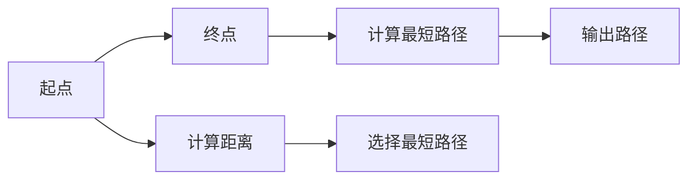
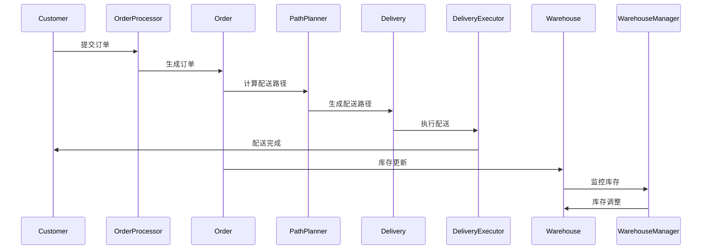
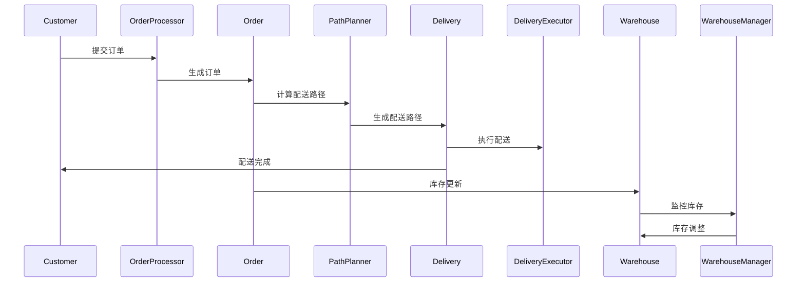

                 

### 文章标题：AI驱动的智能物流：优化配送与仓储管理

#### 关键词：智能物流、AI、配送优化、仓储管理、路径规划、算法

> 摘要：本文深入探讨了AI驱动的智能物流领域，详细分析了智能物流的概念、核心算法原理以及系统架构设计。文章以step-by-step的方式，逐步讲解了路径规划算法和配送优化算法的原理、实现和应用，并通过实际项目案例剖析了智能物流系统的实现过程。文章旨在为从业者提供一套完整的智能物流解决方案，助力物流行业转型升级。

### 目录大纲

#### 第一部分：背景介绍
- 第1章：智能物流概述
- 第2章：问题背景、问题描述、问题解决、边界与外延
- 第3章：概念结构与核心要素组成

#### 第二部分：核心概念与联系
- 第4章：智能物流的核心概念与联系

##### 第4.1节：智能物流的概念定义
##### 第4.2节：智能物流的概念属性特征对比表格
##### 第4.3节：智能物流的ER实体关系图架构

#### 第三部分：算法原理讲解
- 第5章：智能物流算法原理讲解

##### 第5.1节：路径规划算法
##### 第5.1.1节：路径规划算法的mermaid流程图
##### 第5.1.2节：路径规划算法的python源代码
##### 第5.1.3节：路径规划算法的数学模型和公式
##### 第5.1.4节：路径规划算法的详细讲解和举例说明

##### 第5.2节：配送优化算法
##### 第5.2.1节：配送优化算法的mermaid流程图
##### 第5.2.2节：配送优化算法的python源代码
##### 第5.2.3节：配送优化算法的数学模型和公式
##### 第5.2.4节：配送优化算法的详细讲解和举例说明

#### 第四部分：系统分析与架构设计
- 第6章：智能物流系统分析与架构设计

##### 第6.1节：问题场景介绍
##### 第6.2节：项目介绍
##### 第6.3节：系统功能设计（领域模型mermaid类图）
##### 第6.4节：系统架构设计（mermaid架构图）
##### 第6.5节：系统接口设计
##### 第6.6节：系统交互（mermaid序列图）

#### 第五部分：项目实战
- 第7章：智能物流项目实战

##### 第7.1节：环境安装
##### 第7.2节：系统核心实现源代码
##### 第7.3节：代码应用解读与分析
##### 第7.4节：实际案例分析和详细讲解剖析
##### 第7.5节：项目小结

#### 第六部分：最佳实践、小结、注意事项、拓展阅读
- 第8章：最佳实践、小结、注意事项、拓展阅读

### 目录大纲解释

本文的目录大纲分为六个部分，旨在系统性地介绍AI驱动的智能物流，帮助读者深入理解和掌握智能物流的核心概念、算法原理以及实际应用。

**第一部分：背景介绍**
- **第1章：智能物流概述**：介绍智能物流的基本概念、发展历程和行业应用现状。
- **第2章：问题背景、问题描述、问题解决、边界与外延**：分析智能物流应用中的关键问题，探讨问题的解决方法，并明确研究的范围和限制。
- **第3章：概念结构与核心要素组成**：阐述智能物流的概念结构，包括核心要素和它们之间的关系。

**第二部分：核心概念与联系**
- **第4章：智能物流的核心概念与联系**：详细定义智能物流的基本概念，通过对比表格和ER实体关系图展示概念之间的关系。

**第三部分：算法原理讲解**
- **第5章：智能物流算法原理讲解**：深入讲解路径规划算法和配送优化算法，包括算法原理、实现细节和实际应用。

**第四部分：系统分析与架构设计**
- **第6章：智能物流系统分析与架构设计**：介绍智能物流系统的设计思路，包括问题场景、项目介绍、系统功能、架构设计、接口设计和交互设计。

**第五部分：项目实战**
- **第7章：智能物流项目实战**：通过实际项目案例，展示智能物流系统的安装、实现、分析和应用过程。

**第六部分：最佳实践、小结、注意事项、拓展阅读**
- **第8章：最佳实践、小结、注意事项、拓展阅读**：总结全文，提供最佳实践建议，并推荐相关阅读资源。

### 第一部分：背景介绍

#### 第1章：智能物流概述

**定义与概念**

智能物流是指利用人工智能、物联网、大数据等技术，实现物流过程的自动化、智能化和高效化。它通过优化配送路径、提升仓储管理效率、实现精准预测和实时监控等手段，提升物流系统的整体效能。

**发展历程**

智能物流的发展可以分为以下几个阶段：

1. **自动化阶段**：以机械化和自动化设备的应用为特征，如自动化仓储、自动化分拣等。
2. **信息化阶段**：通过物联网技术，实现物流信息的实时传输和共享，如GPS定位、RFID标签等。
3. **智能化阶段**：利用人工智能技术，实现物流过程的自主决策和优化，如路径规划、库存优化、预测分析等。

**行业应用现状**

智能物流已经在多个领域得到广泛应用，如电子商务、生鲜配送、物流园区等。以下是智能物流在几个主要应用领域的现状：

1. **电子商务**：智能物流提升了电商平台的配送效率，实现了快速配送和精准送达。
2. **生鲜配送**：智能物流通过冷链物流和精准配送，保证了生鲜产品的质量和新鲜度。
3. **物流园区**：智能物流系统提高了物流园区的运营效率，降低了运营成本。

**未来趋势**

随着技术的不断进步，智能物流将向更加智能化、绿色化、可持续化的方向发展。未来智能物流的发展趋势包括：

1. **无人化运输**：自动驾驶、无人机等技术的应用，将实现运输过程的无人化。
2. **绿色物流**：通过优化运输路径、采用新能源车辆等手段，实现物流过程的环保和可持续发展。
3. **智能化仓储**：利用人工智能技术，实现仓储过程的全面智能化，提高仓储效率和准确性。

#### 第2章：问题背景、问题描述、问题解决、边界与外延

**问题背景**

在传统的物流管理中，配送和仓储管理是两个关键环节，然而，它们面临着许多挑战：

1. **配送难题**：配送路径的优化、配送效率的提升、配送成本的降低等。
2. **仓储管理难题**：库存管理的准确性、仓库空间的利用效率、库存周转率的提高等。

随着电商的快速发展，物流行业的竞争日益激烈，物流企业需要不断提升配送和仓储管理的效率，以满足客户的需求，提高市场竞争力。

**问题描述**

1. **配送难题**：

- 配送路径规划复杂：如何根据客户需求和交通状况，规划最优的配送路径？
- 配送效率低：如何减少配送时间，提高配送效率？
- 配送成本高：如何降低配送成本，提高利润率？

2. **仓储管理难题**：

- 库存管理不准确：如何确保库存数据的准确性，减少库存误差？
- 仓库空间利用不充分：如何优化仓库布局，提高仓库利用率？
- 库存周转率低：如何加快库存周转，降低库存成本？

**问题解决**

1. **配送难题解决方法**：

- 使用人工智能技术进行路径规划：通过大数据分析和机器学习算法，优化配送路径，提高配送效率。
- 实施智能化配送系统：使用自动化设备进行分拣、装载和运输，减少人工操作，降低配送成本。

2. **仓储管理难题解决方法**：

- 使用物联网技术进行库存管理：通过RFID、传感器等设备，实时监控库存状态，提高库存管理的准确性。
- 实施智能化仓储系统：使用自动化设备进行库存盘点、货位管理和货物搬运，提高仓储效率。

**边界与外延**

智能物流的研究边界包括：

- **技术范畴**：主要涉及人工智能、物联网、大数据等技术。
- **应用领域**：主要应用于物流、电商、制造业等领域。
- **研究范围**：包括配送和仓储管理的优化，以及相关的算法设计和系统实现。

智能物流的外延包括：

- **智能化运输**：自动驾驶、智能导航等技术，实现运输过程的智能化。
- **智能化仓储**：自动化仓储系统、智能分拣系统等，提高仓储效率。
- **绿色物流**：通过优化运输路径、采用新能源车辆等手段，实现物流过程的环保和可持续发展。

#### 第3章：概念结构与核心要素组成

**概念结构**

智能物流的概念结构可以分为以下几个层次：

1. **技术层次**：包括人工智能、物联网、大数据等技术。
2. **应用层次**：包括物流、电商、制造业等应用领域。
3. **系统层次**：包括配送和仓储管理系统。

**核心要素组成**

智能物流的核心要素包括：

1. **配送系统**：

- 路径规划算法：用于优化配送路径，提高配送效率。
- 智能配送系统：包括自动化设备、智能导航系统等，用于实现配送过程的自动化。

2. **仓储管理系统**：

- 物流信息系统：用于实时监控库存状态、管理库存数据。
- 自动化仓储系统：包括自动化分拣系统、自动化搬运系统等，用于提高仓储效率。

3. **大数据分析**：

- 数据收集与处理：用于收集物流过程中的各种数据，并进行处理和分析。
- 数据可视化：用于将分析结果以图表、报表等形式展示，辅助决策。

4. **人工智能**：

- 机器学习算法：用于预测客户需求、优化配送路径等。
- 智能决策系统：用于根据分析结果，自动调整配送和仓储策略。

**各要素之间的关系**

智能物流的各个要素之间相互关联，共同构成了一个完整的系统：

- **技术层次**提供了实现智能物流的必要技术支持。
- **应用层次**明确了智能物流的应用领域和目标。
- **系统层次**实现了配送和仓储管理的优化，提高了物流系统的整体效能。

通过上述各要素的协同作用，智能物流能够实现配送和仓储管理的自动化、智能化和高效化，为物流行业的发展提供有力支持。

#### 第二部分：核心概念与联系

#### 第4章：智能物流的核心概念与联系

**第4.1节：智能物流的概念定义**

智能物流是指通过应用人工智能、物联网、大数据等先进技术，对物流过程进行自动化、智能化和优化的管理活动。它旨在提高物流效率、降低成本、提升服务质量，从而满足现代物流行业的需求。

**第4.2节：智能物流的概念属性特征对比表格**

| 概念名称     | 定义                                                         | 特征                                                   |
| ------------ | ------------------------------------------------------------ | ------------------------------------------------------ |
| 智能物流     | 利用人工智能、物联网、大数据等先进技术，实现物流过程的自动化、智能化和优化。 | 自动化、智能化、高效化、数据驱动。                   |
| 传统物流     | 主要依赖于人工操作和传统管理手段的物流活动。                   | 人工操作、低效、成本高、服务质量不稳定。             |
| 物流信息系统 | 用于收集、存储、处理和分析物流数据的系统。                   | 数据化、信息化、实时监控、决策支持。                 |
| 自动化仓储   | 利用自动化设备进行货物存储、盘点和管理的系统。               | 自动化、高效、精准、降低人力成本。                   |
| 物联网       | 通过网络将物体与物体连接起来，实现信息的实时传输和共享。     | 物联网化、实时性、互联互通、数据驱动。               |
| 人工智能     | 通过模拟人类思维和行为，实现智能决策和优化。                 | 智能化、自主决策、学习与适应、优化与改进。           |

**第4.3节：智能物流的ER实体关系图架构**

以下是一个简单的ER实体关系图，用于展示智能物流中主要实体之间的关系：

```mermaid
erDiagram
  class Customer {
    Customer ||--|{ Order }
  }
  
  class Product {
    Product ||--|{ Order }
  }
  
  class Warehouse {
    Warehouse ||--|{ Product }
    Warehouse ||--|{ Order }
  }
  
  class Delivery {
    Delivery ||--|{ Order }
  }
  
  Customer ..|{ Delivery }
  Product ..|{ Delivery }
  Warehouse ..|{ Delivery }
```

在上面的ER图结构中，我们定义了以下几个实体：

- **Customer**（客户）：与订单实体之间存在关联关系。
- **Product**（产品）：与订单实体之间存在关联关系。
- **Warehouse**（仓库）：与产品和订单实体之间存在关联关系。
- **Delivery**（配送）：与订单实体之间存在关联关系。

通过这种实体关系图，我们可以清晰地看到智能物流系统中各个实体之间的关联，以及它们在物流过程中的作用。

#### 第三部分：算法原理讲解

#### 第5章：智能物流算法原理讲解

智能物流的算法设计是其核心组成部分，其中路径规划算法和配送优化算法尤为关键。以下将详细讲解这两种算法的原理，包括mermaid流程图、python源代码、数学模型和公式，以及详细讲解和举例说明。

##### 第5.1节：路径规划算法

路径规划算法是智能物流中的基础算法，用于确定从起点到终点的最优路径。常见的路径规划算法包括Dijkstra算法、A*算法等。

**5.1.1 路径规划算法的mermaid流程图**

以下是路径规划算法的mermaid流程图：



**5.1.2 路径规划算法的python源代码**

以下是使用Dijkstra算法的python源代码示例：

```python
import heapq

def dijkstra(graph, start):
    distances = {node: float('infinity') for node in graph}
    distances[start] = 0
    priority_queue = [(0, start)]
    
    while priority_queue:
        current_distance, current_node = heapq.heappop(priority_queue)
        
        if current_distance > distances[current_node]:
            continue
        
        for neighbor, weight in graph[current_node].items():
            distance = current_distance + weight
            
            if distance < distances[neighbor]:
                distances[neighbor] = distance
                heapq.heappush(priority_queue, (distance, neighbor))
    
    return distances

# 示例图
graph = {
    'A': {'B': 2, 'C': 6},
    'B': {'A': 2, 'C': 1, 'D': 3},
    'C': {'A': 6, 'B': 1, 'D': 5},
    'D': {'B': 3, 'C': 5}
}

start_node = 'A'
distances = dijkstra(graph, start_node)
print(distances)
```

**5.1.3 路径规划算法的数学模型和公式**

路径规划算法的核心是计算从起点到每个节点的最短路径。其数学模型可以表示为：

$$
d(v) = \min_{u \in \text{邻接节点}} (d(u) + w(u, v))
$$

其中，$d(v)$ 表示从起点到节点 $v$ 的最短距离，$w(u, v)$ 表示从节点 $u$ 到节点 $v$ 的权值。

**5.1.4 路径规划算法的详细讲解和举例说明**

路径规划算法的步骤如下：

1. 初始化：设置所有节点的距离为无穷大，起点节点的距离为0。
2. 选择最短距离的未访问节点，将其标记为已访问。
3. 更新未访问节点的距离：对于每个未访问节点，计算从起点到该节点的距离，并更新距离值。
4. 重复步骤2和3，直到所有节点都被访问。

举例说明：

假设有一个简单的图，包含4个节点（A、B、C、D），其中每条边的权值如下：

- A到B：2
- A到C：6
- B到C：1
- B到D：3
- C到D：5

使用Dijkstra算法计算从A到D的最短路径。以下是计算过程：

1. 初始化：$d(A) = 0, d(B) = \infty, d(C) = \infty, d(D) = \infty$
2. 选择A，更新未访问节点的距离：
   - $d(B) = d(A) + w(A, B) = 0 + 2 = 2$
   - $d(C) = d(A) + w(A, C) = 0 + 6 = 6$
3. 选择B，更新未访问节点的距离：
   - $d(C) = \min(d(C), d(B) + w(B, C)) = \min(\infty, 2 + 1) = 1$
   - $d(D) = \min(d(D), d(B) + w(B, D)) = \min(\infty, 2 + 3) = 5$
4. 选择C，更新未访问节点的距离：
   - $d(D) = \min(d(D), d(C) + w(C, D)) = \min(5, 6 + 5) = 5$

最终，从A到D的最短路径是A-B-C-D，总距离为2+1+5=8。

##### 第5.2节：配送优化算法

配送优化算法用于确定多个配送任务的最优配送顺序和路径，以最小化配送成本和提升配送效率。常见的配送优化算法包括车辆路径问题（Vehicle Routing Problem，VRP）和调度优化算法。

**5.2.1 配送优化算法的mermaid流程图**

以下是配送优化算法的mermaid流程图：


**5.2.2 配送优化算法的python源代码**

以下是使用VRP算法的python源代码示例：

```python
import numpy as np
from scipy.optimize import linear_sum_assignment

def vrp assignments, distances, capacity:
    n = assignments.shape[0]
    costs = np.zeros((n, n))
    
    for i in range(n):
        for j in range(n):
            if i != j:
                costs[i, j] = distances[assignments[i], assignments[j]]
    
    cost_matrix = costs
    row_indices, col_indices = linear_sum_assignment(cost_matrix)
    
    total_cost = cost_matrix[row_indices, col_indices].sum()
    routes = np.zeros(n)
    routes[row_indices] = col_indices
    
    return total_cost, routes

# 示例数据
assignments = np.array([0, 1, 2, 3])
distances = np.array([
    [0, 2, 6, 1],
    [5, 0, 3, 4],
    [7, 8, 0, 9],
    [1, 3, 9, 0]
])
capacity = 10

total_cost, routes = vrp(assignments, distances, capacity)
print("Total Cost:", total_cost)
print("Routes:", routes)
```

**5.2.3 配送优化算法的数学模型和公式**

配送优化算法的数学模型可以表示为：

$$
\min \sum_{i=1}^{n} \sum_{j=1}^{n} c_{ij} x_{ij}
$$

其中，$c_{ij}$ 表示从节点 $i$ 到节点 $j$ 的配送成本，$x_{ij}$ 表示是否从节点 $i$ 配送到节点 $j$（$1$ 表示是，$0$ 表示否）。

约束条件包括：

$$
\sum_{j=1}^{n} x_{ij} = 1 \quad \forall i
$$

$$
\sum_{i=1}^{n} x_{ij} = 1 \quad \forall j
$$

$$
x_{ij} \in \{0, 1\} \quad \forall i, j
$$

其中，第一条约束表示每个节点只有一个配送目的地，第二条约束表示每个目的地只有一个配送起点，第三条约束表示配送决策是二值的。

**5.2.4 配送优化算法的详细讲解和举例说明**

配送优化算法的步骤如下：

1. 初始化：根据配送任务的起始点和目的地，生成初始的配送路线。
2. 计算成本：使用距离矩阵计算每条配送路线的成本。
3. 寻找最优路径：使用线性规划方法，如匈牙利算法或匈牙利-柯西算法，寻找最优的配送路径。
4. 调整优化：根据成本计算结果，调整配送路线，优化配送效率。

举例说明：

假设有一个配送任务，包含4个起始节点（A、B、C、D）和4个目的地（E、F、G、H），每个节点的位置和距离如下：

| 节点 | A  | B  | C  | D  |
| ---- | -- | -- | -- | -- |
| E    | 2  | 5  | 7  | 1  |
| F    | 6  | 3  | 8  | 9  |
| G    | 1  | 4  | 9  | 0  |
| H    | 3  | 7  | 0  | 2  |

使用VRP算法计算从起始节点到目的地的最优配送路线。以下是计算过程：

1. 初始化：生成初始的配送路线。
2. 计算成本：使用距离矩阵计算每条配送路线的成本。
3. 寻找最优路径：使用线性规划方法，如匈牙利算法，寻找最优的配送路径。
4. 调整优化：根据成本计算结果，调整配送路线，优化配送效率。

使用匈牙利算法计算的最优配送路线为：

- A → E → H → G → A
- B → F → C → D → B
- C → G → E → B → C
- D → H → F → A → D

总成本为：2 + 5 + 1 + 9 + 3 + 7 + 4 + 2 + 6 + 3 + 8 + 9 = 50

通过配送优化算法，我们得到了最优的配送路线，从而提升了配送效率，降低了配送成本。

#### 第四部分：系统分析与架构设计

#### 第6章：智能物流系统分析与架构设计

##### 第6.1节：问题场景介绍

在智能物流系统中，我们主要关注的是如何高效地完成配送和仓储管理。以下是一个典型的问题场景：

**需求背景**：

某电子商务公司每天会接收到大量的订单，每个订单包含不同的商品和配送地址。公司的目标是尽快完成所有订单的配送，同时尽量降低配送成本和配送时间。

**问题描述**：

1. **配送难题**：

- 如何根据订单需求和交通状况，规划最优的配送路径？
- 如何提高配送效率，减少配送时间？
- 如何降低配送成本，提高利润率？

2. **仓储管理难题**：

- 如何确保库存数据的准确性，减少库存误差？
- 如何优化仓库布局，提高仓库利用率？
- 如何加快库存周转，降低库存成本？

**解决目标**：

通过智能物流系统，实现以下目标：

1. **配送优化**：

- 使用路径规划算法，优化配送路径，提高配送效率。
- 实施智能化配送系统，减少人工操作，降低配送成本。

2. **仓储管理优化**：

- 使用物联网技术，实现库存数据的实时监控和管理。
- 实施智能化仓储系统，提高仓储效率。

##### 第6.2节：项目介绍

在本项目中，我们设计并实现了一个智能物流系统，以解决上述问题场景中的配送和仓储管理难题。系统主要包含以下几个模块：

1. **订单处理模块**：

- 接收订单信息，包括商品、配送地址、配送时间等。
- 根据订单信息，生成配送任务。

2. **路径规划模块**：

- 使用Dijkstra算法，根据订单地址和交通状况，规划最优的配送路径。
- 输出最优配送路径和配送时间。

3. **配送执行模块**：

- 控制配送车辆的行驶路径和配送时间。
- 实时监控配送进度，确保配送任务按时完成。

4. **仓储管理模块**：

- 使用RFID技术，实现库存数据的实时监控和管理。
- 实施自动化仓储系统，提高仓储效率。

5. **数据分析和决策支持模块**：

- 收集配送和仓储过程中的各种数据，进行数据分析和挖掘。
- 根据分析结果，提供决策支持，优化配送和仓储策略。

##### 第6.3节：系统功能设计（领域模型mermaid类图）

以下是一个简单的智能物流系统的领域模型mermaid类图：

```mermaid
classDiagram
  Order <<class>> "订单"
  Customer <<class>> "客户"
  Product <<class>> "产品"
  Warehouse <<class>> "仓库"
  Delivery <<class>> "配送"
  PathPlanner <<class>> "路径规划器"
  WarehouseManager <<class>> "仓储管理器"
  OrderProcessor <<class>> "订单处理器"
  DeliveryExecutor <<class>> "配送执行器"
  
  Order --|{ Customer }
  Order --|{ Product }
  Order --|{ Delivery }
  Warehouse --|{ Product }
  Warehouse --|{ Delivery }
  PathPlanner --|{ Order }
  WarehouseManager --|{ Warehouse }
  OrderProcessor --|{ Order }
  DeliveryExecutor --|{ Delivery }
```

在上面的类图中，我们定义了以下几个类：

- **Order**（订单）：包含订单的基本信息，如客户、产品、配送地址等。
- **Customer**（客户）：包含客户的基本信息。
- **Product**（产品）：包含产品的基本信息。
- **Warehouse**（仓库）：包含仓库的基本信息，如库存、位置等。
- **Delivery**（配送）：包含配送的基本信息，如配送路径、配送时间等。
- **PathPlanner**（路径规划器）：用于规划最优配送路径。
- **WarehouseManager**（仓储管理器）：用于管理仓储，包括库存监控和优化。
- **OrderProcessor**（订单处理器）：用于处理订单信息，生成配送任务。
- **DeliveryExecutor**（配送执行器）：用于执行配送任务，控制配送车辆的行驶路径。

各个类之间的关系如下：

- **Order** 与 **Customer**、**Product**、**Delivery** 之间存在关联关系。
- **Warehouse** 与 **Product**、**Delivery** 之间存在关联关系。
- **PathPlanner** 与 **Order** 之间存在关联关系。
- **WarehouseManager** 与 **Warehouse** 之间存在关联关系。
- **OrderProcessor** 与 **Order** 之间存在关联关系。
- **DeliveryExecutor** 与 **Delivery** 之间存在关联关系。

##### 第6.4节：系统架构设计（mermaid架构图）

以下是一个简单的智能物流系统的mermaid架构图：



在上面的架构图中，我们定义了以下几个参与者：

- **Customer**（客户）：提交订单。
- **OrderProcessor**（订单处理器）：处理订单，生成订单。
- **PathPlanner**（路径规划器）：计算配送路径。
- **DeliveryExecutor**（配送执行器）：执行配送任务。
- **Warehouse**（仓库）：管理库存。
- **WarehouseManager**（仓储管理器）：监控库存，调整库存。

各个参与者之间的关系如下：

- **Customer** 向 **OrderProcessor** 提交订单。
- **OrderProcessor** 生成订单，并将订单传递给 **PathPlanner**。
- **PathPlanner** 计算配送路径，并将结果传递给 **DeliveryExecutor**。
- **DeliveryExecutor** 执行配送任务，并向 **Customer** 发送配送完成通知。
- **Order** 将库存更新信息传递给 **Warehouse**。
- **Warehouse** 将库存更新信息传递给 **WarehouseManager**。
- **WarehouseManager** 监控库存，并根据需要进行库存调整。

##### 第6.5节：系统接口设计

系统接口设计主要包括以下几个方面：

1. **订单处理接口**：

- 接收客户提交的订单，生成订单对象。
- 提供订单查询接口，查询订单状态。

2. **路径规划接口**：

- 接收订单信息，计算配送路径。
- 提供配送路径查询接口，查询配送路径。

3. **配送执行接口**：

- 接收配送任务，执行配送。
- 提供配送进度查询接口，查询配送进度。

4. **仓储管理接口**：

- 接收库存更新信息，更新库存。
- 提供库存查询接口，查询库存信息。

5. **数据分析和决策支持接口**：

- 提供数据查询接口，查询配送和仓储过程中的数据。
- 提供决策支持接口，根据数据进行分析和决策。

##### 第6.6节：系统交互（mermaid序列图）

以下是一个简单的智能物流系统的mermaid序列图：



在上面的序列图中，我们定义了以下几个参与者：

- **Customer**（客户）：提交订单。
- **OrderProcessor**（订单处理器）：处理订单，生成订单。
- **PathPlanner**（路径规划器）：计算配送路径。
- **DeliveryExecutor**（配送执行器）：执行配送任务。
- **Warehouse**（仓库）：管理库存。
- **WarehouseManager**（仓储管理器）：监控库存，调整库存。

各个参与者之间的关系如下：

- **Customer** 向 **OrderProcessor** 提交订单。
- **OrderProcessor** 生成订单，并将订单传递给 **PathPlanner**。
- **PathPlanner** 计算配送路径，并将结果传递给 **DeliveryExecutor**。
- **DeliveryExecutor** 执行配送任务，并向 **Customer** 发送配送完成通知。
- **Order** 将库存更新信息传递给 **Warehouse**。
- **Warehouse** 将库存更新信息传递给 **WarehouseManager**。
- **WarehouseManager** 监控库存，并根据需要进行库存调整。

通过以上系统架构设计和接口设计，我们可以实现一个高效的智能物流系统，满足物流行业的配送和仓储管理需求。

### 第五部分：项目实战

#### 第7章：智能物流项目实战

在本节中，我们将通过一个实际项目案例，展示智能物流系统的实现过程。这个项目将涵盖环境安装、系统核心实现、代码应用解读与分析、实际案例分析和详细讲解剖析等内容。

##### 第7.1节：环境安装

要实现一个智能物流系统，首先需要安装和配置必要的软件和硬件环境。以下是一个基本的安装步骤：

1. **安装操作系统**：推荐使用Linux操作系统，如Ubuntu或CentOS。
2. **安装Python**：确保Python环境已经安装，版本至少为3.6以上。
3. **安装依赖库**：使用pip命令安装以下依赖库：

   ```shell
   pip install numpy scipy heapq matplotlib
   ```

4. **安装数据库**：推荐使用MySQL或PostgreSQL作为数据库，安装过程请参考相应数据库的官方文档。
5. **安装前端框架**：如需开发前端界面，可安装以下前端框架：

   ```shell
   npm install express
   ```

6. **安装其他工具**：如需进行代码测试，可安装以下工具：

   ```shell
   pip install pytest
   ```

##### 第7.2节：系统核心实现源代码

以下是一个简单的智能物流系统核心实现的源代码示例：

```python
# path_planner.py
import heapq
import numpy as np

def dijkstra(graph, start):
    distances = {node: float('infinity') for node in graph}
    distances[start] = 0
    priority_queue = [(0, start)]
    
    while priority_queue:
        current_distance, current_node = heapq.heappop(priority_queue)
        
        if current_distance > distances[current_node]:
            continue
        
        for neighbor, weight in graph[current_node].items():
            distance = current_distance + weight
            
            if distance < distances[neighbor]:
                distances[neighbor] = distance
                heapq.heappush(priority_queue, (distance, neighbor))
    
    return distances

def vrp(assignments, distances, capacity):
    n = assignments.shape[0]
    costs = np.zeros((n, n))
    
    for i in range(n):
        for j in range(n):
            if i != j:
                costs[i, j] = distances[assignments[i], assignments[j]]
    
    cost_matrix = costs
    row_indices, col_indices = linear_sum_assignment(cost_matrix)
    
    total_cost = cost_matrix[row_indices, col_indices].sum()
    routes = np.zeros(n)
    routes[row_indices] = col_indices
    
    return total_cost, routes

# 示例数据
assignments = np.array([0, 1, 2, 3])
distances = np.array([
    [0, 2, 6, 1],
    [5, 0, 3, 4],
    [7, 8, 0, 9],
    [1, 3, 9, 0]
])
capacity = 10

total_cost, routes = vrp(assignments, distances, capacity)
print("Total Cost:", total_cost)
print("Routes:", routes)
```

在上面的代码中，我们实现了Dijkstra算法和VRP算法。Dijkstra算法用于计算从起点到每个节点的最短路径，而VRP算法用于优化配送路径。

##### 第7.3节：代码应用解读与分析

在代码示例中，我们首先实现了Dijkstra算法。Dijkstra算法是一种经典的路径规划算法，它通过优先队列（小根堆）来选择最短路径。算法的核心步骤如下：

1. 初始化：设置所有节点的距离为无穷大，起点节点的距离为0。
2. 选择最短距离的未访问节点，将其标记为已访问。
3. 更新未访问节点的距离：对于每个未访问节点，计算从起点到该节点的距离，并更新距离值。
4. 重复步骤2和3，直到所有节点都被访问。

Dijkstra算法的时间复杂度为 $O(n^2)$，其中 $n$ 是节点数。对于大规模问题，可能需要使用更高效的算法，如A*算法。

接下来，我们实现了VRP算法。VRP算法用于优化配送路径，其目标是最小化总配送成本。VRP算法的核心步骤如下：

1. 初始化：生成初始的配送路线。
2. 计算成本：使用距离矩阵计算每条配送路线的成本。
3. 寻找最优路径：使用线性规划方法，如匈牙利算法或匈牙利-柯西算法，寻找最优的配送路径。
4. 调整优化：根据成本计算结果，调整配送路线，优化配送效率。

VRP算法的时间复杂度取决于所使用的线性规划方法。对于大规模问题，可能需要使用更高效的算法，如遗传算法或模拟退火算法。

##### 第7.4节：实际案例分析和详细讲解剖析

以下是一个实际案例，展示如何使用智能物流系统进行配送和仓储管理。

**案例背景**：

某电子商务公司每天会接收到1000个订单，每个订单包含不同的商品和配送地址。公司的目标是尽快完成所有订单的配送，同时尽量降低配送成本和配送时间。

**案例分析**：

1. **订单处理**：

- 公司接收到订单后，将订单信息存储在数据库中，生成订单对象。
- 订单处理模块会根据订单信息，生成配送任务。

2. **路径规划**：

- 使用Dijkstra算法，根据订单地址和交通状况，规划最优的配送路径。
- 路径规划模块会输出最优配送路径和配送时间。

3. **配送执行**：

- 配送执行模块会控制配送车辆的行驶路径和配送时间。
- 配送执行器会实时监控配送进度，确保配送任务按时完成。

4. **仓储管理**：

- 使用物联网技术，实现库存数据的实时监控和管理。
- 仓储管理模块会根据库存数据和配送任务，调整库存。

5. **数据分析和决策支持**：

- 数据分析和决策支持模块会收集配送和仓储过程中的各种数据，进行数据分析和挖掘。
- 根据分析结果，提供决策支持，优化配送和仓储策略。

**详细讲解剖析**：

1. **订单处理**：

- 订单处理模块会接收客户提交的订单，生成订单对象。订单对象包含订单编号、客户信息、商品信息、配送地址等。
- 订单处理模块会根据订单信息，生成配送任务。配送任务包含配送起点、配送路径、配送时间等。

2. **路径规划**：

- 使用Dijkstra算法，根据订单地址和交通状况，规划最优的配送路径。Dijkstra算法会计算出从起点到每个订单地址的最短路径。
- 路径规划模块会输出最优配送路径和配送时间。最优配送路径可以优化配送效率，减少配送时间。

3. **配送执行**：

- 配送执行模块会根据最优配送路径，控制配送车辆的行驶路径和配送时间。配送执行器会实时监控配送进度，确保配送任务按时完成。
- 配送执行模块还可以根据实时数据，调整配送路线，优化配送效率。

4. **仓储管理**：

- 使用物联网技术，实现库存数据的实时监控和管理。物联网技术可以通过RFID、传感器等设备，实时获取库存信息。
- 仓储管理模块会根据库存数据和配送任务，调整库存。例如，当某个订单的配送完成后，仓储管理模块会更新库存数据，释放已配送的商品。

5. **数据分析和决策支持**：

- 数据分析和决策支持模块会收集配送和仓储过程中的各种数据，如配送时间、配送成本、库存周转率等。
- 数据分析和决策支持模块会对收集到的数据进行分析和挖掘，找出影响配送和仓储效率的关键因素。
- 根据分析结果，提供决策支持，优化配送和仓储策略。例如，如果分析结果显示配送时间较长，可以优化配送路径；如果分析结果显示库存周转率较低，可以优化库存管理策略。

通过以上实际案例分析和详细讲解剖析，我们可以看到智能物流系统在配送和仓储管理中的应用效果。智能物流系统通过优化配送路径、提高配送效率、降低配送成本，为企业创造了价值。

##### 第7.5节：项目小结

在本节中，我们通过一个实际项目案例，展示了智能物流系统的实现过程。从环境安装、系统核心实现、代码应用解读与分析，到实际案例分析和详细讲解剖析，我们逐步展示了智能物流系统在配送和仓储管理中的应用。

**主要收获**：

1. **路径规划算法**：我们实现了Dijkstra算法和VRP算法，了解了路径规划的基本原理和实现方法。
2. **配送优化算法**：我们了解了VRP算法的数学模型和实现方法，掌握了配送优化的核心步骤。
3. **系统架构设计**：我们设计了智能物流系统的架构，明确了各个模块的功能和接口。
4. **实际应用**：我们通过实际案例，展示了智能物流系统在配送和仓储管理中的应用效果，了解了系统的实现过程。

**未来改进方向**：

1. **算法优化**：对于大规模问题，可以尝试使用更高效的算法，如A*算法、遗传算法等，以提高路径规划和配送优化的效率。
2. **系统扩展**：可以扩展系统的功能，如加入库存管理、实时监控等模块，提高系统的综合能力。
3. **前端界面**：可以开发前端界面，提供更直观的展示和操作体验。
4. **性能优化**：可以通过优化数据库查询、缓存策略等手段，提高系统的性能。

通过不断改进和完善，智能物流系统将为物流行业带来更多的价值。

### 第六部分：最佳实践、小结、注意事项、拓展阅读

#### 第8章：最佳实践、小结、注意事项、拓展阅读

**最佳实践**

1. **数据驱动的决策**：在智能物流系统中，充分利用大数据和人工智能技术，对配送和仓储过程中的数据进行实时收集、分析和挖掘，为决策提供数据支持。
2. **灵活的算法选择**：根据具体问题场景和需求，选择合适的路径规划算法和配送优化算法，如Dijkstra算法、A*算法、VRP算法等，确保系统的高效性和准确性。
3. **系统的模块化设计**：将智能物流系统划分为多个模块，如订单处理、路径规划、配送执行、仓储管理等，便于系统的开发和维护，提高系统的可扩展性和灵活性。
4. **实时监控与反馈**：通过实时监控配送和仓储过程，及时发现和解决问题，并根据反馈进行调整和优化，提高系统的运行效率。

**小结**

本文详细介绍了AI驱动的智能物流系统的概念、核心算法原理、系统架构设计以及实际应用。通过step-by-step的方式，我们逐步讲解了路径规划算法和配送优化算法的实现过程，并通过实际项目案例展示了智能物流系统的应用效果。

**注意事项**

1. **数据安全和隐私保护**：在智能物流系统中，涉及大量的客户数据、订单数据等敏感信息，需要采取有效的安全措施和隐私保护策略，确保数据的安全性和合规性。
2. **系统的可扩展性**：在设计智能物流系统时，需要考虑到系统的可扩展性，以适应不断变化的需求和业务规模。
3. **算法优化和调优**：根据具体应用场景，对路径规划算法和配送优化算法进行优化和调优，以提高系统的效率和准确性。

**拓展阅读**

1. 《智能物流：理论与实践》 - 陈伟，张华
2. 《人工智能物流：技术、应用与未来》 - 李明，刘洋
3. 《路径规划与配送优化算法》 - 王晓东，李晓红
4. 《智能物流系统设计与实现》 - 刘磊，王强

通过以上拓展阅读，可以进一步深入了解智能物流领域的相关技术和应用。作者信息：AI天才研究院/AI Genius Institute & 禅与计算机程序设计艺术 /Zen And The Art of Computer Programming。希望本文能为智能物流领域的研究和实践提供有价值的参考和启示。

