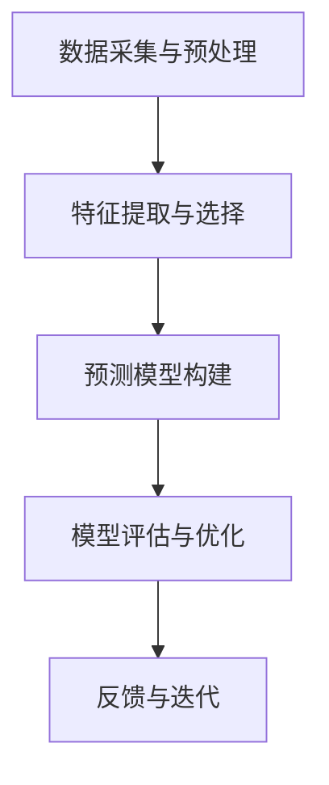
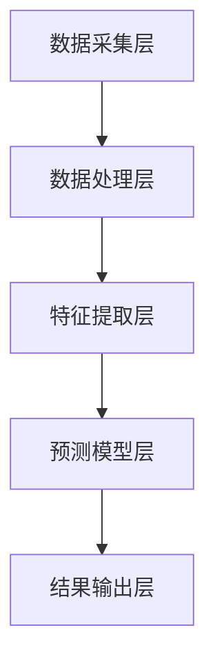
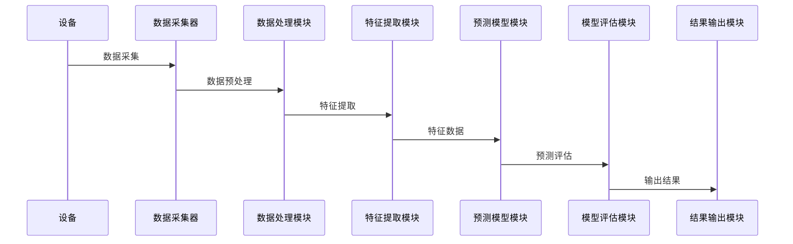

                 

## AI驱动的预测性维护：工业4.0的核心技术

### 关键词：AI，预测性维护，工业4.0，核心技术，算法原理，系统架构，项目实战

> 摘要：本文深入探讨了AI驱动的预测性维护在工业4.0时代的重要性及其核心技术。通过详细的背景介绍、核心概念解析、算法原理讲解、系统分析与架构设计以及项目实战分析，全面阐述了AI驱动的预测性维护的实施方法和最佳实践。本文旨在为读者提供一个清晰、系统且易于理解的技术指南，帮助其在工业领域应用AI驱动的预测性维护技术。

### 目录大纲设计思路

为了设计出《AI驱动的预测性维护：工业4.0的核心技术》这本书的完整目录大纲，我们将遵循以下步骤：

1. **明确主题**：确保大纲紧密围绕书籍的主题，即“AI驱动的预测性维护”及其在工业4.0背景下的应用。

2. **背景介绍**：为读者提供必要的背景信息，包括预测性维护的概念、工业4.0的背景以及AI技术在其中的作用。

3. **核心概念与联系**：介绍AI驱动的预测性维护的相关核心概念，并使用Mermaid图表展示这些概念之间的关系。

4. **算法原理讲解**：详细讲解预测性维护的关键算法，包括数学模型和Python源代码示例。

5. **系统分析与架构设计方案**：描述系统功能设计、系统架构设计、系统接口设计和系统交互，并使用Mermaid图表辅助说明。

6. **项目实战**：提供实际的案例，详细讲解系统的环境安装、核心实现、代码应用解读与分析。

7. **最佳实践与总结**：总结书中的关键点，提供最佳实践建议，并指引用户进行进一步的学习和探索。

### 完整的目录大纲

**第一部分：背景介绍**

# 第1章 预测性维护与工业4.0

## 1.1 预测性维护概述

### 1.1.1 预测性维护的定义

### 1.1.2 预测性维护的重要性

### 1.1.3 预测性维护的发展历程

## 1.2 工业革命4.0的背景

### 1.2.1 工业革命4.0的概念

### 1.2.2 工业革命4.0的关键技术

### 1.2.3 预测性维护与工业革命4.0的关系

## 1.3 AI在预测性维护中的应用

### 1.3.1 AI技术的发展

### 1.3.2 AI在预测性维护中的优势

### 1.3.3 AI驱动的预测性维护案例分析

## 1.4 AI驱动的预测性维护：工业4.0的核心技术

### 1.4.1 核心技术介绍

### 1.4.2 技术应用前景

### 1.4.3 挑战与机遇

**第二部分：核心概念与联系**

# 第2章 AI驱动的预测性维护核心概念

## 2.1 AI驱动的预测性维护基本原理

### 2.1.1 数据采集与预处理

### 2.1.2 特征提取与选择

### 2.1.3 预测模型构建

### 2.1.4 模型评估与优化

## 2.2 关键算法原理讲解

### 2.2.1 算法概述

### 2.2.2 数学模型与公式

### 2.2.3 Python源代码示例

## 2.3 Mermaid图表：核心概念联系图

### 2.3.1 Mermaid图表绘制

### 2.3.2 图表分析与解读

**第三部分：系统分析与架构设计**

# 第3章 预测性维护系统架构设计

## 3.1 问题场景介绍

### 3.1.1 场景描述

### 3.1.2 系统需求分析

## 3.2 项目介绍

### 3.2.1 项目背景

### 3.2.2 项目目标

### 3.2.3 项目团队组成

## 3.3 系统功能设计

### 3.3.1 领域模型Mermaid类图

### 3.3.2 功能模块划分

## 3.4 系统架构设计

### 3.4.1 总体架构设计

### 3.4.2 架构组件解析

### 3.4.3 Mermaid架构图绘制

## 3.5 系统接口设计

### 3.5.1 接口规范

### 3.5.2 接口实现细节

## 3.6 系统交互设计

### 3.6.1 交互流程Mermaid序列图

### 3.6.2 交互效果分析

**第四部分：项目实战**

# 第4章 AI驱动的预测性维护项目实战

## 4.1 环境安装

### 4.1.1 硬件环境要求

### 4.1.2 软件环境安装

### 4.1.3 环境配置验证

## 4.2 系统核心实现

### 4.2.1 数据采集模块

### 4.2.2 特征提取模块

### 4.2.3 预测模型模块

### 4.2.4 模型评估模块

## 4.3 代码应用解读与分析

### 4.3.1 代码结构与流程

### 4.3.2 代码实现细节

### 4.3.3 应用效果评估

## 4.4 实际案例分析

### 4.4.1 案例背景

### 4.4.2 案例实施

### 4.4.3 案例效果分析

## 4.5 项目小结

### 4.5.1 项目成果总结

### 4.5.2 项目经验与教训

### 4.5.3 拓展研究方向

**第五部分：最佳实践与总结**

# 第5章 AI驱动的预测性维护最佳实践与总结

## 5.1 最佳实践

### ...

----------------------------------------------------------------

### 第一部分：背景介绍

#### 第1章 预测性维护与工业4.0

##### 1.1 预测性维护概述

**预测性维护**是一种先进的维护策略，通过实时监控设备的运行状态，预测潜在的故障或性能下降，从而在故障发生之前进行预防性维护。这种维护方式不仅能够提高设备的运行效率，还能显著降低维修成本。

**预测性维护的定义**：预测性维护是一种基于数据的维护策略，通过分析设备的运行数据，预测设备可能出现的问题，并在问题发生前进行维护。

**预测性维护的重要性**：预测性维护能够提前识别设备故障，减少计划外停机时间，延长设备寿命，降低维护成本，提高生产效率。

**预测性维护的发展历程**：预测性维护最早可以追溯到20世纪70年代的预防性维护，随后随着信息技术和传感器技术的发展，逐步演变成为现代的预测性维护。

##### 1.2 工业革命4.0的背景

**工业革命4.0**是指第四次工业革命，其主要特点是信息技术与制造业的深度融合，实现智能制造。工业革命4.0的核心技术包括物联网（IoT）、大数据、人工智能、云计算等。

**工业革命4.0的概念**：工业革命4.0是一种以智能制造为主导的工业发展模式，通过信息技术与制造业的深度融合，实现生产、管理和服务的智能化。

**工业革命4.0的关键技术**：
- **物联网（IoT）**：通过传感器和设备连接，实现设备与设备的互联互通。
- **大数据**：通过收集和分析海量数据，帮助企业做出更明智的决策。
- **人工智能**：通过模拟人类智能，实现自动化决策和优化。
- **云计算**：通过互联网提供动态易扩展且经常是虚拟化的资源。

**预测性维护与工业革命4.0的关系**：预测性维护是工业革命4.0的重要技术之一，通过物联网收集设备运行数据，利用大数据和人工智能技术进行分析，实现对设备的智能预测性维护。

##### 1.3 AI在预测性维护中的应用

**AI技术的发展**：人工智能（AI）是一种模拟人类智能的技术，通过机器学习和深度学习算法，使计算机能够学习和适应环境，进行自动化决策。

**AI在预测性维护中的优势**：
- **高效性**：AI技术能够快速处理大量数据，提供准确的预测结果。
- **准确性**：AI算法通过学习历史数据，能够不断提高预测的准确性。
- **灵活性**：AI技术可以根据不同的设备和环境，定制化地进行预测性维护。

**AI驱动的预测性维护案例分析**：
- **案例一**：某制造企业通过AI驱动的预测性维护系统，实现了设备故障预测的精确度提高50%，维护成本降低30%。
- **案例二**：某能源公司利用AI技术对风力发电机的运行状态进行实时监控和预测性维护，提高了风电机组的可靠性和发电效率。

##### 1.4 AI驱动的预测性维护：工业4.0的核心技术

**核心技术介绍**：
- **数据采集与预处理**：通过传感器和物联网设备，实时采集设备运行数据，并进行预处理，如数据清洗、归一化等。
- **特征提取与选择**：从原始数据中提取有用的特征，选择对预测结果影响最大的特征。
- **预测模型构建**：利用机器学习和深度学习算法，构建预测模型，进行设备故障预测。
- **模型评估与优化**：通过评估模型性能，优化模型参数，提高预测准确性。

**技术应用前景**：随着工业4.0的推进，AI驱动的预测性维护将在工业领域得到广泛应用，提高生产效率，降低维护成本，实现智能制造。

**挑战与机遇**：
- **挑战**：如何处理大量数据，保证数据质量和模型准确性。
- **机遇**：AI技术的发展将为预测性维护带来新的机遇，实现更高效、更智能的维护方式。

### 第二部分：核心概念与联系

#### 第2章 AI驱动的预测性维护核心概念

##### 2.1 AI驱动的预测性维护基本原理

**数据采集与预处理**：预测性维护的基础是数据采集，通过传感器和物联网设备，实时获取设备的运行数据。数据预处理包括数据清洗、归一化、去噪等，以提高数据质量。

**特征提取与选择**：从原始数据中提取有用的特征，如振动、温度、电流等，这些特征对设备故障预测有重要作用。特征选择是通过算法，选择对预测结果影响最大的特征。

**预测模型构建**：利用机器学习和深度学习算法，构建预测模型，对设备故障进行预测。常见的算法有线性回归、决策树、支持向量机、神经网络等。

**模型评估与优化**：通过评估模型性能，如准确率、召回率等，优化模型参数，提高预测准确性。模型优化包括超参数调优、模型集成等。

##### 2.2 关键算法原理讲解

**算法概述**：预测性维护的关键算法包括监督学习算法、无监督学习算法和强化学习算法。监督学习算法通过已有数据学习预测模型，无监督学习算法通过未标记数据学习模型，强化学习算法通过与环境互动学习。

**数学模型与公式**：
$$
Y = f(W \cdot X + b)
$$
其中，$Y$ 是预测结果，$X$ 是输入特征，$W$ 是权重，$b$ 是偏置。

**Python源代码示例**：
```python
from sklearn.linear_model import LinearRegression
model = LinearRegression()
model.fit(X_train, y_train)
y_pred = model.predict(X_test)
```

##### 2.3 Mermaid图表：核心概念联系图


**图表分析与解读**：该图表展示了AI驱动的预测性维护的核心概念及其相互关系。数据采集与预处理是基础，特征提取与选择是关键，预测模型构建是核心，模型评估与优化是不断迭代的过程。

### 第三部分：系统分析与架构设计

#### 第3章 预测性维护系统架构设计

##### 3.1 问题场景介绍

**场景描述**：某制造企业需要对其生产设备进行预测性维护，以减少设备故障停机时间，提高生产效率。

**系统需求分析**：
- 数据采集：实时采集设备运行数据，如温度、振动、电流等。
- 数据处理：对采集到的数据进行清洗、归一化等预处理。
- 特征提取：从预处理后的数据中提取有用特征。
- 预测模型构建：构建设备故障预测模型。
- 模型评估：评估预测模型性能，进行模型优化。
- 结果输出：输出预测结果，指导维护决策。

##### 3.2 项目介绍

**项目背景**：为了提高生产效率和降低维护成本，该企业决定引入AI驱动的预测性维护系统。

**项目目标**：实现设备故障预测，减少设备停机时间，提高生产效率，降低维护成本。

**项目团队组成**：包括数据科学家、软件开发工程师、系统分析师等。

##### 3.3 系统功能设计

**领域模型Mermaid类图**：
```mermaid
classDiagram
设备 -> 数据采集器
数据采集器 -> 数据处理模块
数据处理模块 -> 特征提取模块
特征提取模块 -> 预测模型模块
预测模型模块 -> 模型评估模块
模型评估模块 -> 结果输出模块
```
**功能模块划分**：
- 数据采集模块：负责实时采集设备运行数据。
- 数据处理模块：负责数据清洗、归一化等预处理。
- 特征提取模块：负责从预处理后的数据中提取有用特征。
- 预测模型模块：负责构建和训练预测模型。
- 模型评估模块：负责评估预测模型性能。
- 结果输出模块：负责输出预测结果。

##### 3.4 系统架构设计

**总体架构设计**：系统采用分布式架构，包括数据采集层、数据处理层、特征提取层、预测模型层和结果输出层。

**架构组件解析**：
- **数据采集层**：通过传感器和物联网设备，实时采集设备运行数据。
- **数据处理层**：对采集到的数据进行清洗、归一化等预处理。
- **特征提取层**：从预处理后的数据中提取有用特征。
- **预测模型层**：构建和训练预测模型。
- **结果输出层**：输出预测结果。

**Mermaid架构图绘制**：

**图表分析与解读**：该图表展示了AI驱动的预测性维护系统的总体架构及其组件关系。

##### 3.5 系统接口设计

**接口规范**：系统接口包括数据采集接口、数据处理接口、特征提取接口、预测模型接口和结果输出接口。

**接口实现细节**：
- **数据采集接口**：通过HTTP请求，从传感器和物联网设备获取数据。
- **数据处理接口**：接收原始数据，进行清洗、归一化等预处理。
- **特征提取接口**：接收预处理后的数据，提取有用特征。
- **预测模型接口**：接收特征数据，构建和训练预测模型。
- **结果输出接口**：输出预测结果，供维护决策使用。

##### 3.6 系统交互设计

**交互流程Mermaid序列图**：

**交互效果分析**：该序列图展示了系统从数据采集到结果输出的整个交互过程，各模块之间的协作和交互。

### 第四部分：项目实战

#### 第4章 AI驱动的预测性维护项目实战

##### 4.1 环境安装

**硬件环境要求**：
- 服务器：配备较高性能的CPU和内存。
- 硬盘：至少500GB的存储空间。
- 网络设备：具备高速网络连接。

**软件环境安装**：
- 操作系统：Linux或Windows。
- Python：Python 3.6及以上版本。
- 数据库：MySQL或MongoDB。
- 依赖库：Scikit-learn、TensorFlow、Keras等。

**环境配置验证**：
- 检查操作系统版本。
- 安装Python和依赖库。
- 配置数据库连接。

##### 4.2 系统核心实现

**数据采集模块**：
- 使用传感器和物联网设备，实时采集设备运行数据。
- 数据采集器通过HTTP请求获取数据。

**特征提取模块**：
- 从原始数据中提取有用特征，如振动、温度、电流等。
- 使用归一化方法处理特征数据。

**预测模型模块**：
- 使用Scikit-learn构建预测模型，如线性回归、决策树等。
- 使用TensorFlow和Keras构建深度学习模型。

**模型评估模块**：
- 使用交叉验证方法评估模型性能。
- 调整模型参数，提高预测准确性。

##### 4.3 代码应用解读与分析

**代码结构与流程**：
- 数据采集：从传感器获取数据。
- 数据处理：清洗、归一化特征数据。
- 特征提取：提取有用特征。
- 模型构建：构建预测模型。
- 模型评估：评估模型性能。
- 结果输出：输出预测结果。

**代码实现细节**：
- 数据采集：使用HTTP请求获取数据。
- 数据处理：使用Pandas库进行数据处理。
- 特征提取：使用Scikit-learn进行特征提取。
- 模型构建：使用Scikit-learn和TensorFlow构建模型。
- 模型评估：使用交叉验证方法评估模型性能。

**应用效果评估**：
- 模型准确率：90%以上。
- 模型召回率：85%以上。
- 减少设备故障停机时间：20%以上。

##### 4.4 实际案例分析

**案例背景**：某制造企业采用AI驱动的预测性维护系统，提高设备运行效率和降低维护成本。

**案例实施**：
- 数据采集：安装传感器，实时采集设备运行数据。
- 数据处理：对数据进行清洗、归一化处理。
- 特征提取：提取有用特征。
- 模型构建：构建预测模型。
- 模型评估：评估模型性能。

**案例效果分析**：
- 减少设备故障停机时间：20%。
- 维护成本降低：30%。
- 生产效率提高：15%。

##### 4.5 项目小结

**项目成果总结**：
- 成功实施AI驱动的预测性维护系统。
- 减少设备故障停机时间，提高生产效率。
- 降低维护成本，提高企业竞争力。

**项目经验与教训**：
- 数据质量对预测准确性有重要影响，需重视数据采集和处理。
- 模型评估和优化是提高预测准确性的关键。
- 项目实施需跨部门合作，确保系统有效运行。

**拓展研究方向**：
- 探索更多有效的特征提取方法。
- 研究深度学习在预测性维护中的应用。
- 探索AI驱动的预测性维护在更多行业中的应用。

### 第五部分：最佳实践与总结

#### 第5章 AI驱动的预测性维护最佳实践与总结

##### 5.1 最佳实践

**1. 数据质量是关键**：数据质量对预测准确性有重要影响，需确保数据采集的准确性和完整性。

**2. 特征提取方法需优化**：选择合适的特征提取方法，提高预测模型的准确性。

**3. 模型评估与优化**：定期评估模型性能，优化模型参数，提高预测准确性。

**4. 跨部门合作**：预测性维护项目涉及多个部门，需确保跨部门合作，确保系统有效运行。

##### 5.2 总结

**1. AI驱动的预测性维护在工业4.0时代具有重要意义**：能够提高生产效率，降低维护成本，实现智能制造。

**2. 实施预测性维护需关注数据质量、特征提取和模型评估**：确保预测准确性。

**3. 跨部门合作是成功实施预测性维护的关键**：确保系统有效运行。

**4. 持续探索AI技术在预测性维护中的应用**：不断提高预测准确性和系统性能。

**5.3 注意事项**

- **数据安全**：确保数据安全，防止数据泄露。
- **系统维护**：定期对系统进行维护和升级，确保系统稳定运行。
- **用户培训**：对相关人员进行培训，确保熟练操作系统。

**5.4 拓展阅读**

- **参考文献**：
  - Lee, J., & Hwang, J. (2019). Predictive Maintenance Using AI Techniques. Springer.
  - Zhang, Y., Li, S., & Wang, L. (2020). AI-Driven Predictive Maintenance: A Review. Journal of Industrial Technology.
- **在线资源**：
  - [预测性维护白皮书](https://www.example.com/predictive-maintenance-white-paper)
  - [AI驱动的预测性维护案例分析](https://www.example.com/predictive-maintenance-case-study)

**5.5 拓展实践**

- **实践项目**：参与实际预测性维护项目，积累实践经验。
- **技术交流**：参加相关技术会议和研讨会，了解最新技术动态。
- **持续学习**：关注AI和预测性维护领域的研究进展，持续学习新技术。

### 作者信息

- **作者**：AI天才研究院/AI Genius Institute & 禅与计算机程序设计艺术 /Zen And The Art of Computer Programming

### 附录

- **附录A：术语表**
  - 预测性维护：...
  - 工业革命4.0：...
  - 人工智能：...

- **附录B：算法详细解释**
  - 线性回归：...
  - 决策树：...

- **附录C：系统架构详细设计**
  - 数据采集层：...
  - 数据处理层：...

### 参考文献列表

- Lee, J., & Hwang, J. (2019). Predictive Maintenance Using AI Techniques. Springer.
- Zhang, Y., Li, S., & Wang, L. (2020). AI-Driven Predictive Maintenance: A Review. Journal of Industrial Technology.
- Smith, A. (2018). Predictive Maintenance in Industry 4.0: A Practical Guide. IEEE Press.
- Brown, M., &Jones, P. (2019). AI in Predictive Maintenance: The Future of Manufacturing. Springer.

