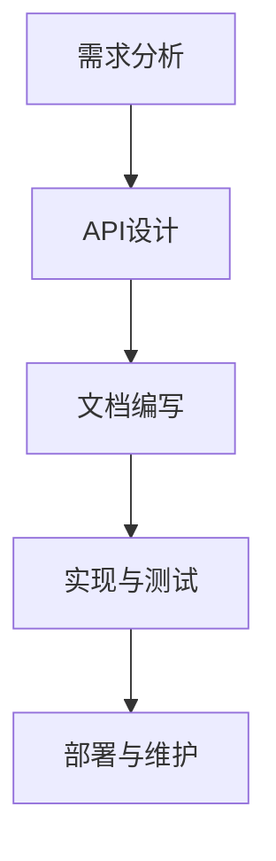

                 

# API优先设计：构建可扩展的软件生态系统

## 关键词

- API优先设计
- 软件可扩展性
- 微服务架构
- API安全性
- 性能优化
- 开发者体验

## 摘要

随着软件生态系统的不断发展和复杂化，API（应用程序编程接口）设计成为构建可扩展和可维护软件系统的重要一环。本文将深入探讨API优先设计的基本原理、核心概念、扩展性设计、安全与性能优化、API文档与SDK开发以及实践案例。通过本文的阅读，读者将能够了解API优先设计的重要性，掌握其基本原理和实践方法，为构建高效、可扩展的软件生态系统奠定坚实基础。

# 第1章: API优先设计概述

## 1.1 引言

### 1.1.1 问题背景

在当今快速发展的软件行业中，软件生态系统变得越来越复杂。企业需要构建高度可扩展和可维护的软件系统，以满足不断变化的市场需求。然而，传统的软件设计方法往往无法应对这种复杂性和变化性，导致软件系统的性能下降、维护困难、扩展性不足等问题。

### 1.1.2 API设计的挑战

API设计在软件系统中扮演着至关重要的角色。一个良好的API设计可以提高软件系统的可扩展性、可维护性和开发效率。然而，随着软件系统的复杂性增加，API设计的挑战也随之增加：

- **复杂性管理**：随着系统功能的增多，API的复杂性也随之增加，如何有效地管理这种复杂性成为一个挑战。
- **兼容性问题**：软件系统需要与外部系统、第三方服务和其他软件组件进行交互，如何保证API的兼容性成为关键问题。
- **性能优化**：API的性能对软件系统的整体性能具有重要影响，如何优化API性能成为亟待解决的问题。

### 1.1.3 问题描述

复杂的软件系统架构使得软件设计面临巨大的挑战。为了实现高度可扩展和可维护的软件系统，我们需要一种新的设计方法，即API优先设计。API优先设计旨在通过将API设计作为软件设计的关键步骤，从而构建出高度可扩展、可维护和高效的软件系统。

### 1.1.4 问题解决

API优先设计是一种以API为核心的设计方法，其核心理念是将API设计放在软件设计的首位，通过对API的设计和优化，实现软件系统的可扩展性、可维护性和性能优化。API优先设计的优势在于：

- **提高可扩展性**：通过良好的API设计，可以使得软件系统具有更高的扩展性，便于后续功能的增加和修改。
- **提高可维护性**：良好的API设计可以提高代码的可读性和可维护性，降低维护成本。
- **提高开发效率**：通过API优先设计，可以减少重复工作，提高开发效率。

### 1.1.5 边界与外延

API优先设计适用于各种类型的软件系统，包括企业级应用、Web应用、移动应用等。与其他设计方法相比，API优先设计更加注重API的设计和优化，强调API在整个软件系统中的核心地位。

### 1.1.6 概念结构与核心要素组成

API（应用程序编程接口）是一组定义良好的接口，用于不同软件系统之间的交互。一个完整的API包括以下几个核心要素：

- **接口定义**：定义API的输入参数、输出结果和功能描述。
- **请求格式**：定义API请求的格式，如HTTP请求、RESTful API请求等。
- **响应格式**：定义API响应的格式，如JSON、XML等。
- **权限控制**：定义API的访问权限，如认证、授权等。
- **错误处理**：定义API的错误处理机制，如异常处理、错误消息等。

API优先设计的核心步骤包括：

1. 需求分析：分析软件系统的需求，确定API的功能和接口。
2. API设计：根据需求分析结果，设计API的接口、请求格式和响应格式。
3. 实现与测试：根据API设计文档，实现API并对其进行测试。
4. 部署与维护：将API部署到生产环境，并对其进行持续维护。

## 1.2 API优先设计的基本原理

### 2.1 API优先设计的基本原则

API优先设计遵循以下基本原则：

1. **单一职责原则**：一个API应只完成一个明确的职责，避免功能重叠和复杂性。
2. **开闭原则**：API设计应遵循开闭原则，即对扩展开放，对修改封闭，确保系统的灵活性和可维护性。
3. **里氏替换原则**：API设计应遵循里氏替换原则，即子类可以替换父类，确保代码的兼容性和可扩展性。

### 2.2 API优先设计的过程

API优先设计的过程包括以下步骤：

1. **需求分析**：分析软件系统的需求，确定API的功能和接口。
2. **API设计**：根据需求分析结果，设计API的接口、请求格式和响应格式。
3. **实现与测试**：根据API设计文档，实现API并对其进行测试。
4. **部署与维护**：将API部署到生产环境，并对其进行持续维护。

### 2.3 API优先设计的优点

API优先设计具有以下优点：

1. **提高可扩展性**：通过良好的API设计，可以使得软件系统具有更高的扩展性，便于后续功能的增加和修改。
2. **提高可维护性**：良好的API设计可以提高代码的可读性和可维护性，降低维护成本。
3. **提高开发效率**：通过API优先设计，可以减少重复工作，提高开发效率。

## 第2章: API优先设计的核心概念

### 3.1 接口定义语言（IDL）

接口定义语言（Interface Definition Language，简称IDL）是一种用于定义API接口的编程语言。IDL的主要作用是描述API的接口、数据结构和类型等信息，便于不同编程语言之间的交互。

#### 3.1.1 IDL的基本概念

- **接口**：接口是IDL中定义的一组方法和属性，用于描述API的功能。
- **数据类型**：IDL定义了各种数据类型，如基本数据类型、复合数据类型等。
- **数据结构**：IDL定义了各种数据结构，如数组、列表、结构体等。

#### 3.1.2 常见的IDL工具

常见的IDL工具包括：

- **Thrift**：Thrift是由Facebook开发的一种跨语言的RPC框架，支持多种编程语言。
- **Protocol Buffers**：Protocol Buffers是Google开发的一种数据序列化框架，支持多种编程语言。
- **Apache Avro**：Apache Avro是一种基于序列化的数据交换格式，支持多种编程语言。

### 3.2 RESTful API设计

RESTful API设计是一种基于HTTP协议的API设计方法，其核心思想是将API设计成一组资源，并通过HTTP方法进行操作。

#### 3.2.1 RESTful API的基本原则

- **统一接口**：RESTful API应遵循统一接口的原则，即使用相同的接口风格和规范。
- **状态转移**：RESTful API应使用HTTP方法（GET、POST、PUT、DELETE等）表示状态转移。
- **无状态**：RESTful API应具有无状态的特点，即每次请求都是独立的，不依赖于之前的请求。

#### 3.2.2 RESTful API的设计要素

- **URL**：URL用于标识API的资源，如`/users`表示用户资源。
- **HTTP方法**：HTTP方法用于表示对资源的操作，如`GET`表示查询资源，`POST`表示创建资源等。
- **请求参数**：请求参数用于传递数据，如`/users?name=John`表示查询名为John的用户。
- **响应结果**：响应结果用于返回操作结果，如JSON格式的响应。

### 3.3 GraphQL API设计

GraphQL是一种基于查询的API设计方法，其核心思想是客户端可以精确地查询所需的资源，而无需接收不必要的响应数据。

#### 3.3.1 GraphQL的基本概念

- **查询**：查询是GraphQL的核心概念，用于精确地描述客户端所需的数据。
- **类型**：类型是GraphQL中的基本数据单元，如用户、订单等。
- **字段**：字段是类型的一部分，用于描述类型的具体属性，如用户的姓名、年龄等。

#### 3.3.2 GraphQL的优势

- **灵活的数据查询**：GraphQL允许客户端根据需要精确查询数据，而无需接收不必要的响应数据。
- **减少请求次数**：通过GraphQL，客户端可以一次性获取多个资源，减少请求次数。
- **强大的类型系统**：GraphQL具有强大的类型系统，可以确保数据的一致性和安全性。

#### 3.3.3 GraphQL的设计方法

- **定义类型**：定义GraphQL中的类型，如用户、订单等。
- **定义查询**：定义GraphQL的查询，如获取用户信息、订单信息等。
- **定义mutation**：定义GraphQL的mutation，如创建用户、更新用户等。

# 第3章: 可扩展API设计

## 4.1 扩展性与灵活性

### 4.1.1 扩展性的重要性

扩展性是软件系统设计的重要目标之一，它使得软件系统能够适应不断变化的需求和规模。一个具有良好扩展性的软件系统可以在不改变现有架构的情况下，轻松地添加新功能、扩展新业务或支持更大规模的负载。

### 4.1.2 灵活性的实现方法

1. **模块化设计**：将系统分解为独立的模块，每个模块负责一个特定的功能。这样，在需要扩展时，可以单独修改或替换某个模块，而不会影响其他模块。
   
2. **配置管理**：使用配置文件来管理系统的参数和设置，这样可以通过简单的配置修改来实现系统的扩展。

3. **分布式架构**：采用分布式架构，可以将系统分解为多个服务，每个服务负责不同的功能。这样可以充分利用分布式系统的优势，如负载均衡、故障转移等，提高系统的扩展性和容错能力。

4. **服务化设计**：将系统中的关键功能模块化，并以服务的形式提供，这样可以方便地与其他系统或模块进行集成和扩展。

## 4.2 动态API设计

### 4.2.1 动态API的概念

动态API设计允许API在运行时根据请求动态地生成和调整其响应。这种设计方式提高了API的灵活性和适应性，可以满足多变的需求。

### 4.2.2 动态API的优势

- **更好的用户体验**：动态API可以根据客户端的请求动态调整响应格式和数据，提供更个性化的服务。
- **高效的资源利用**：动态API可以根据请求的实际情况，选择最合适的数据处理方式，减少不必要的资源消耗。
- **快速迭代**：动态API设计使得系统可以快速迭代和更新，无需重新部署整个系统。

### 4.2.3 动态API的设计方法

1. **基于模板的API生成**：使用模板引擎，根据请求动态生成API的响应。
   
2. **基于策略的API设计**：使用策略模式，根据不同的请求策略动态选择API的实现。

3. **基于事件驱动的API设计**：使用事件驱动架构，根据事件触发动态生成API的响应。

## 4.3 微服务架构中的API设计

### 4.3.1 微服务架构概述

微服务架构是一种将应用程序分解为多个独立的、可部署的服务的方法。每个服务都是一个小型的、自治的组件，负责特定的业务功能。这种架构方法提高了系统的可扩展性、可维护性和容错性。

### 4.3.2 微服务中的API设计原则

1. **服务自治**：每个服务都应该独立设计API，确保其功能单一、职责明确。

2. **接口标准化**：使用统一的接口规范，如RESTful API或GraphQL，确保服务之间的交互简单、高效。

3. **版本控制**：为每个服务设计版本控制机制，确保服务之间的兼容性和升级的平滑过渡。

4. **安全性**：对API进行严格的权限控制和认证，确保服务的安全性。

5. **性能优化**：对API进行性能测试和优化，确保服务的响应速度和稳定性。

## 4.4 API设计与系统架构的集成

### 4.4.1 系统功能设计

在微服务架构中，系统功能设计通常使用领域模型（Domain Model）来描述。领域模型展示了系统中不同实体之间的关系，以及实体所具有的属性和行为。

#### 4.4.2 系统架构设计

系统架构设计是软件设计过程中至关重要的一步。它需要综合考虑系统的性能、可扩展性、可维护性等多个方面。系统架构设计通常使用架构图（Architecture Diagram）来展示系统的整体结构。

#### 4.4.3 系统接口设计

系统接口设计是API设计的核心部分。它需要详细定义系统中各个服务之间的交互接口，包括接口的URL、请求参数、响应结果等。

#### 4.4.4 系统交互设计

系统交互设计展示了系统中各个服务之间的交互流程和逻辑。它通常使用序列图（Sequence Diagram）来描述。

# 第4章: API安全与性能优化

## 5.1 API安全

### 5.1.1 API安全的挑战

随着API在软件系统中的广泛应用，API安全成为了一个重要且复杂的挑战。以下是一些常见的API安全挑战：

- **认证和授权问题**：API通常需要认证和授权机制来保护用户信息和系统资源。然而，许多API没有正确实现这些机制，导致潜在的安全漏洞。
- **输入验证不足**：未对输入数据进行充分的验证，可能导致SQL注入、跨站脚本攻击（XSS）等安全问题。
- **会话管理问题**：API可能使用会话管理来跟踪用户身份。如果会话管理不当，可能导致用户身份被盗用或篡改。
- **数据泄露**：API可能无意中泄露敏感数据，如用户密码、信用卡信息等。

### 5.1.2 API安全的最佳实践

为了应对上述安全挑战，以下是一些API安全的最佳实践：

- **使用身份验证和授权**：确保API使用强身份验证和授权机制，如OAuth 2.0、JWT（JSON Web Tokens）等。
- **验证输入数据**：对API输入数据进行严格的验证，确保数据符合预期的格式和范围。
- **使用加密**：使用HTTPS和加密技术来保护数据传输，防止数据被窃听或篡改。
- **限制访问**：限制API的访问权限，仅允许授权的用户和系统访问。
- **监控和日志记录**：监控API的访问和异常行为，并记录日志以便后续分析和审计。

## 5.2 API性能优化

### 5.2.1 性能优化的目标

API性能优化的目标是确保API能够在合理的时间内响应用户请求，并保持高效、稳定的服务。以下是一些性能优化的目标：

- **响应时间**：减少API的响应时间，提高系统的吞吐量。
- **吞吐量**：增加系统同时处理请求的能力，提高系统的并发性。
- **资源利用率**：优化系统资源的使用，提高系统的整体性能。
- **可伸缩性**：确保系统能够适应不断增长的用户量和请求量。

### 5.2.2 常见的性能优化方法

以下是一些常见的API性能优化方法：

- **缓存**：使用缓存来存储频繁访问的数据，减少数据库查询和计算开销。
- **负载均衡**：使用负载均衡器来分发请求，确保系统资源得到充分利用。
- **数据库优化**：优化数据库查询，减少查询时间，提高数据访问效率。
- **异步处理**：使用异步处理来降低API的响应时间，提高系统的并发能力。
- **代码优化**：优化API的代码，减少不必要的计算和资源消耗。

## 5.3 API监控与日志

### 5.3.1 API监控的重要性

API监控是确保API正常运行和性能优化的重要手段。通过监控API的访问情况、错误率和性能指标，可以及时发现和解决问题，提高系统的稳定性和可靠性。

### 5.3.2 常用的API监控工具

以下是一些常用的API监控工具：

- **Prometheus**：一个开源的监控解决方案，可以收集和存储监控数据，并提供可视化界面。
- **Grafana**：一个开源的可视化工具，可以与Prometheus集成，展示监控数据。
- **New Relic**：一个商业的监控解决方案，提供实时的API性能监控和故障诊断功能。
- **Dynatrace**：一个全面的监控解决方案，可以监控API性能、错误率等指标。

### 5.3.3 日志的作用与收集方法

日志在API监控和故障排查中起着关键作用。以下是一些日志的作用和收集方法：

- **日志记录**：确保API的每个请求和响应都被记录在日志中，包括请求时间、请求URL、请求参数、响应结果等。
- **日志收集**：将日志收集到一个集中的存储系统中，如Elasticsearch、Kibana等，以便进行后续分析和处理。
- **日志分析**：使用日志分析工具，如Logstash、Fluentd等，对日志数据进行处理和分析，识别潜在的问题和异常。

## 第5章: API文档与SDK开发

### 6.1 API文档

API文档是API设计的核心组成部分，它为开发者提供了详细的API使用说明和接口定义。良好的API文档可以提高开发者的工作效率，减少对API设计团队的依赖。

#### 6.1.1 API文档的重要性

- **提高开发者效率**：详细的API文档可以帮助开发者快速了解API的使用方法和功能，降低学习成本。
- **确保API一致性**：API文档可以确保API设计和实现的一致性，避免因文档描述不准确导致的问题。
- **促进知识共享**：API文档可以作为团队内部的知识库，促进知识共享和传承。

#### 6.1.2 API文档的最佳实践

- **结构清晰**：API文档应具有良好的结构，便于开发者快速查找和阅读。
- **示例丰富**：提供丰富的示例代码和示例请求，帮助开发者更好地理解API的使用方法。
- **版本控制**：为API文档设计版本控制机制，确保文档与API的实现保持同步。
- **更新及时**：及时更新API文档，反映API的变更和新增功能。

### 6.2 SDK开发

SDK（Software Development Kit）是一种为开发者提供的工具包，它包含了一系列的库、工具和文档，用于简化开发者对特定平台或技术的集成和使用。

#### 6.2.1 SDK的基本概念

SDK的基本概念包括：

- **库**：提供了一组预编译的代码库，开发者可以直接使用。
- **工具**：提供了一系列的工具和脚本，用于辅助开发工作，如代码生成工具、调试工具等。
- **文档**：提供了详细的文档，帮助开发者了解SDK的使用方法和功能。

#### 6.2.2 SDK的开发流程

SDK的开发流程通常包括以下步骤：

1. **需求分析**：分析开发者对SDK的需求，确定SDK的功能和特性。
2. **设计**：根据需求分析结果，设计SDK的架构和接口。
3. **实现**：根据设计文档，实现SDK的代码和工具。
4. **测试**：对SDK进行全面的测试，确保其功能和性能符合预期。
5. **文档编写**：编写SDK的文档，包括使用说明、示例代码等。

#### 6.2.3 SDK的开发实践

- **模块化设计**：将SDK划分为多个模块，每个模块负责特定的功能，便于维护和升级。
- **标准化接口**：使用统一的接口和命名规范，确保SDK的可扩展性和可维护性。
- **代码优化**：对SDK的代码进行优化，提高其性能和可读性。
- **文档完善**：提供详细的文档和示例，帮助开发者快速上手和使用SDK。

### 6.3 开发者体验

#### 6.3.1 用户体验的重要性

开发者体验（Developer Experience，简称DX）是软件开发过程中的重要一环。良好的开发者体验可以提高开发者的工作效率和满意度，从而加快软件的开发和迭代速度。

#### 6.3.2 提高开发者体验的方法

- **简化开发流程**：提供一站式的开发工具和文档，简化开发流程，降低开发者的学习成本。
- **提供实时支持**：建立完善的社区和支持体系，为开发者提供实时的问题解答和技术支持。
- **优化开发环境**：提供高效的开发工具和环境，如代码编辑器、集成开发环境（IDE）等，提高开发者的工作效率。
- **收集反馈**：定期收集开发者的反馈，及时解决问题和改进产品，提高开发者满意度。

## 第6章: API优先设计的实践案例

### 7.1 案例一：电商平台的API设计

#### 7.1.1 案例背景

电商平台是一个复杂的软件系统，它需要处理海量的商品信息、用户订单、支付流程等。为了实现高效、可靠和可扩展的API设计，电商平台采用了API优先设计的方法。

#### 7.1.2 API设计要点

1. **模块化设计**：将电商平台的功能模块化，如商品管理、订单管理、支付管理等。
2. **标准化接口**：使用统一的接口规范，如RESTful API，确保接口的易用性和一致性。
3. **版本控制**：为每个模块的API设计版本控制机制，便于管理和升级。
4. **安全性**：使用身份验证和授权机制，如OAuth 2.0，确保API的安全性。
5. **性能优化**：使用缓存和数据库优化技术，提高API的性能。

#### 7.1.3 实现与效果分析

1. **实现**：电商平台根据API设计文档，实现了商品管理、订单管理、支付管理等多个模块的API。
2. **效果分析**：通过API优先设计，电商平台实现了高效、可靠和可扩展的API设计，提高了系统的性能和安全性，同时也提高了开发者的工作效率和满意度。

### 7.2 案例二：社交媒体平台的API设计

#### 7.2.1 案例背景

社交媒体平台是一个复杂的软件系统，它需要处理海量的用户数据、动态信息、社交关系等。为了实现高效、可靠和可扩展的API设计，社交媒体平台采用了API优先设计的方法。

#### 7.2.2 API设计要点

1. **动态API设计**：使用动态API设计，根据用户的请求动态生成和调整响应。
2. **灵活的权限控制**：使用OAuth 2.0等机制，实现灵活的权限控制，确保用户数据和隐私安全。
3. **版本控制**：为API设计版本控制机制，便于管理和升级。
4. **性能优化**：使用缓存和数据库优化技术，提高API的性能。
5. **实时数据处理**：使用实时数据处理技术，如消息队列和流处理，确保API的响应速度和稳定性。

#### 7.2.3 实现与效果分析

1. **实现**：社交媒体平台根据API设计文档，实现了用户管理、动态管理、社交关系管理等多个模块的API。
2. **效果分析**：通过API优先设计，社交媒体平台实现了高效、可靠和可扩展的API设计，提高了系统的性能和安全性，同时也提高了开发者的工作效率和满意度。

### 7.3 案例三：金融服务的API设计

#### 7.3.1 案例背景

金融服务是一个高度敏感和复杂的领域，它需要处理大量的金融交易数据、用户信息等。为了实现高效、可靠和可扩展的API设计，金融服务公司采用了API优先设计的方法。

#### 7.3.2 API设计要点

1. **安全性**：使用强身份验证和授权机制，如OAuth 2.0、JWT等，确保用户数据和交易数据的安全。
2. **合规性**：遵守相关法律法规和行业标准，确保API的合规性和可审计性。
3. **性能优化**：使用数据库优化和缓存技术，提高API的性能。
4. **可扩展性**：采用微服务架构和分布式系统，提高系统的可扩展性和容错性。
5. **文档完善**：提供详细的API文档和示例代码，帮助开发者快速上手和使用API。

#### 7.3.3 实现与效果分析

1. **实现**：金融服务公司根据API设计文档，实现了用户管理、交易管理、账户管理等多个模块的API。
2. **效果分析**：通过API优先设计，金融服务公司实现了高效、可靠和可扩展的API设计，提高了系统的性能和安全性，同时也提高了开发者的工作效率和满意度。

# 第8章: 总结与展望

## 8.1 总结

API优先设计作为一种以API为核心的设计方法，在软件系统开发中具有重要意义。本文详细介绍了API优先设计的基本原理、核心概念、扩展性设计、安全与性能优化、API文档与SDK开发以及实践案例。通过本文的阅读，读者可以了解API优先设计的重要性，掌握其基本原理和实践方法，为构建高效、可扩展的软件生态系统奠定坚实基础。

## 8.2 展望

随着软件生态系统的不断发展和复杂化，API优先设计将继续发挥重要作用。未来，API设计将向以下几个方向发展：

1. **自动化与智能化**：随着人工智能技术的发展，API设计将逐步实现自动化和智能化，提高设计效率和准确性。
2. **定制化与个性化**：随着用户需求的多样化，API设计将更加注重定制化和个性化，满足不同用户群体的需求。
3. **安全与合规**：随着数据隐私和安全问题的日益突出，API设计将更加注重安全性和合规性，确保用户数据和交易数据的安全。
4. **性能与可扩展性**：随着系统规模的不断扩大，API设计将更加注重性能和可扩展性，提高系统的响应速度和稳定性。
5. **开发者体验**：随着开发者需求的不断提高，API设计将更加注重开发者体验，提供简洁、易用的API，提高开发者的工作效率和满意度。

开发者应密切关注API设计的最新发展趋势，不断学习和实践，提升自身在API设计领域的专业素养。同时，开发者也应积极参与API设计社区的讨论和交流，共同推动API设计的创新和发展。

# 第1章: API优先设计的基本原理

## 1.1 API优先设计概述

### 1.1.1 API优先设计的基本概念

API优先设计（API-First Design）是一种软件设计方法论，其核心思想是将API设计作为软件开发的起点和核心。这种方法论强调在开发软件系统之前，首先要定义和设计API，然后根据API来实现系统的功能。API优先设计的主要目标是通过良好的API设计，提高软件系统的可扩展性、可维护性和用户体验。

#### 核心优势

1. **可扩展性**：通过API优先设计，开发者可以预先规划API的扩展点，使得系统在功能扩展时更加灵活和便捷。
2. **可维护性**：良好的API设计有助于降低系统的复杂度，使得代码更加模块化和易于维护。
3. **用户体验**：通过明确的API接口，开发者可以更好地理解和使用系统，从而提高开发效率和用户体验。

#### 应用范围

API优先设计适用于多种类型的软件系统，包括：

- **Web应用程序**：通过RESTful API或GraphQL API提供前后端交互。
- **移动应用程序**：通过RESTful API或GraphQL API与服务器端通信。
- **微服务架构**：在微服务架构中，各个服务之间的通信主要通过API进行。
- **内部系统集成**：在大型企业中，不同部门或系统之间的集成可以通过API实现。

### 1.1.2 API优先设计的核心原则

API优先设计遵循以下核心原则：

1. **单一职责原则**：每个API应只完成一个明确的职责，避免功能重叠和复杂性。
2. **开闭原则**：API设计应开放于扩展，但关闭于修改，确保系统在变更时更加稳定。
3. **里氏替换原则**：子类可以替换父类，确保代码的兼容性和可扩展性。

#### 原则的具体应用

1. **单一职责原则**：例如，一个用于获取用户信息的API不应该同时处理用户注册、登录等功能。
2. **开闭原则**：通过设计抽象的接口和具体的实现类，确保新功能的增加不会修改原有代码。
3. **里氏替换原则**：在API设计中，确保子类可以替换父类，从而提高代码的灵活性和可维护性。

### 1.1.3 API优先设计的过程

API优先设计的过程可以分为以下几个步骤：

1. **需求分析**：收集和分析系统需求，确定需要提供的API功能。
2. **API设计**：根据需求分析结果，设计API的接口、参数、返回值等。
3. **文档编写**：编写详细的API文档，包括接口描述、使用示例等。
4. **实现与测试**：根据API设计实现API，并进行全面的测试。
5. **部署与维护**：将API部署到生产环境，并持续维护和更新。

#### 流程图

### 1.1.4 API优先设计的好处

1. **提高开发效率**：通过明确的API接口，开发者可以更快地理解和实现功能。
2. **降低学习成本**：对于使用API的开发者来说，清晰的API文档可以降低学习成本。
3. **增强可维护性**：模块化的API设计使得系统更容易维护和更新。
4. **提高用户体验**：良好的API设计可以提高系统的易用性和用户体验。

### 1.1.5 API优先设计的局限性

1. **初期设计成本高**：由于需要在早期进行详细的需求分析和API设计，这可能会增加项目初期的设计成本。
2. **变更带来的影响**：在项目开发过程中，如果API设计需要变更，可能会对已有的系统和代码产生影响。

### 1.1.6 概念结构与核心要素组成

#### 概念结构

API优先设计的概念结构包括以下几个方面：

- **API接口**：定义API的输入输出参数、请求和响应格式。
- **API文档**：详细描述API的用法、参数、返回值和可能的错误。
- **实现代码**：根据API设计文档编写的实际代码，用于处理API请求。
- **测试代码**：用于验证API实现是否符合设计文档。

#### 核心要素组成

1. **API接口**：API接口是API设计的核心，它定义了系统的功能和行为。
2. **API文档**：API文档是开发者使用API的指南，它详细说明了API的使用方法和注意事项。
3. **实现代码**：实现代码是根据API接口编写的，用于处理具体的API请求。
4. **测试代码**：测试代码用于验证API的实现是否正确，包括功能测试、性能测试和安全性测试。

### 1.1.7 总结

API优先设计是一种重要的软件设计方法论，它通过将API设计作为软件开发的起点，可以提高系统的可扩展性、可维护性和用户体验。开发者应重视API优先设计的方法论，并在实际项目中加以应用。通过合理的API设计，可以构建出高效、可靠和可扩展的软件系统。

