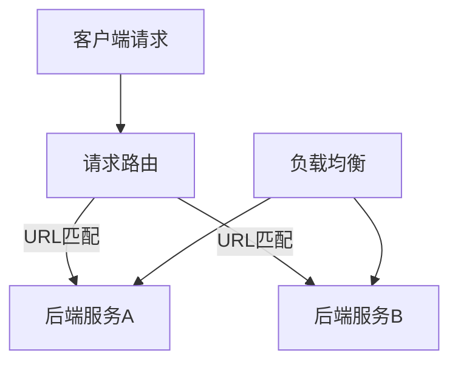

                 


### 1.1 问题背景

在当今的数字化时代，应用程序的复杂性和规模不断增加，这使得企业面临着诸多挑战。其中之一是如何高效、安全地管理大量API接口，并提供一致的服务质量。传统的单体应用程序已经难以满足现代应用的需求，因为它们在扩展性、维护性和可靠性方面存在诸多限制。为了解决这些问题，微服务架构应运而生。

微服务架构将应用程序拆分为多个小型、独立的服务，每个服务负责特定的业务功能。这种架构方式带来了诸多好处，如提高了系统的可维护性、可扩展性和容错性。然而，随之而来的问题是，如何有效地管理和路由这些分散的服务之间的请求？

这便是API网关的出现原因。API网关作为微服务架构中的统一入口，负责处理外部请求，并将其路由到相应的微服务。它不仅提供了路由功能，还提供了安全、监控、日志记录等功能，从而简化了系统的管理和维护。

### 1.2 API网关的定义

API网关（API Gateway）是一种服务治理组件，位于客户端应用程序和微服务之间。它的主要职责是统一管理外部对微服务的访问，包括请求路由、身份验证、鉴权、监控、日志记录等功能。API网关充当了微服务架构中的“门面”，隐藏了微服务的具体实现细节，从而降低了客户端与微服务之间的耦合度。

从广义上讲，API网关是一种网络服务，它可以将来自客户端的请求转发到多个后端服务，并进行处理和响应。API网关不仅可以处理HTTP请求，还可以处理其他类型的请求，如SOAP、gRPC等。

### 1.3 API网关的核心功能

API网关的核心功能包括：

1. **请求路由**：将来自客户端的请求根据路由策略转发到相应的微服务。路由策略可以基于请求的URL、HTTP方法、请求头等信息。

2. **身份验证与鉴权**：确保只有经过授权的用户和应用程序才能访问受保护的API。常见的身份验证机制包括OAuth2、JWT等。

3. **负载均衡**：将请求均匀地分发到多个后端服务实例，以提高系统的响应速度和可用性。

4. **监控与日志**：记录API网关的运行状态、请求响应时间、错误率等信息，以便进行故障排查和性能优化。

5. **缓存**：缓存常用数据的响应，以提高系统的响应速度。

6. **熔断与降级**：当后端服务出现故障或负载过高时，自动切换到备用服务或返回预设的错误响应。

7. **安全**：提供安全功能，如SSL/TLS加密、WAF等，以保护API免受攻击。

### 1.4 API网关的重要性

API网关在微服务架构中扮演着至关重要的角色，主要表现在以下几个方面：

1. **统一入口**：API网关作为微服务的统一入口，简化了客户端与微服务之间的通信，降低了客户端的开发和维护成本。

2. **安全性**：通过API网关实现统一的安全策略，可以更好地保护微服务免受外部攻击，如SQL注入、跨站脚本攻击等。

3. **性能优化**：API网关可以缓存常用数据的响应，减少后端服务的调用次数，从而提高系统的响应速度。

4. **监控与日志**：通过API网关收集的监控数据和日志信息，可以帮助开发者快速定位问题，进行故障排查和性能优化。

5. **灵活性与可扩展性**：API网关可以根据业务需求灵活地调整路由策略和功能模块，从而满足不断变化的业务需求。

6. **降低微服务之间的耦合度**：通过API网关隐藏微服务的具体实现细节，降低了微服务之间的耦合度，提高了系统的可维护性和可扩展性。

### 1.5 API网关的分类

根据实现方式和功能特点，API网关可以分为以下几类：

1. **基于硬件的API网关**：这类API网关通常使用专用硬件设备实现，具有高性能、高可靠性等特点。常见的硬件API网关包括F5 BIG-IP、NGINX等。

2. **基于软件的API网关**：这类API网关通常使用通用硬件和软件实现，具有灵活、可扩展等特点。常见的软件API网关包括Kong、Spring Cloud Gateway等。

3. **云原生API网关**：这类API网关通常运行在云计算平台上，如Kubernetes、AWS Lambda等。它们具有自动扩展、弹性调度等特点，适用于云原生应用场景。

4. **API管理平台**：这类API网关不仅提供API路由、安全等功能，还提供了API设计、测试、监控等全方位的API管理功能。常见的API管理平台包括Apigee、MuleSoft等。

### 1.6 API网关的应用场景

API网关在各种应用场景中发挥着重要作用，以下列举了几个典型的应用场景：

1. **移动应用后端**：在移动应用后端，API网关可以帮助开发者统一管理多个微服务的API接口，并提供安全、监控等功能，从而降低移动应用的开发和维护成本。

2. **企业内部服务**：在企业内部服务中，API网关可以统一管理企业内部的各种服务和系统，提供统一的接口和访问控制，从而提高系统的安全性、可维护性和可扩展性。

3. **第三方集成与对接**：在第三方集成与对接场景中，API网关可以帮助企业统一管理和控制第三方服务的接入，提供路由、安全等功能，从而简化集成过程。

4. **跨域调用**：在跨域调用场景中，API网关可以代理客户端发起的跨域请求，从而绕过浏览器的同源策略限制，实现跨域数据交互。

5. **服务治理与监控**：在服务治理与监控场景中，API网关可以收集各个微服务的监控数据，提供实时监控和报警功能，从而帮助企业快速发现问题并进行优化。

### 1.7 API网关的发展趋势

随着微服务架构的广泛应用，API网关也在不断演进和优化。以下列举了API网关的发展趋势：

1. **云原生API网关**：随着云原生技术的兴起，云原生API网关成为发展趋势。云原生API网关具有自动扩展、弹性调度等特点，可以更好地适应云原生应用场景。

2. **服务网格**：服务网格（Service Mesh）是一种新的服务架构模式，它与API网关有相似的功能。未来，API网关可能会与服务网格相结合，提供更高效、更灵活的服务管理。

3. **智能化与自动化**：随着人工智能技术的不断发展，API网关可能会引入更多智能化和自动化功能，如智能路由、智能监控等。

4. **安全增强**：随着网络安全威胁的不断加剧，API网关的安全功能将会得到进一步增强，包括更先进的加密算法、更严格的身份验证等。

5. **开放性与可扩展性**：未来，API网关将更加注重开放性和可扩展性，以便更好地与其他系统和工具集成，满足不同业务场景的需求。

----------------------------------------------------------------

## 第2章：微服务架构中的统一入口

### 2.1 微服务架构的背景

微服务架构（Microservices Architecture）是近年来在软件开发领域备受关注的一种架构模式。它的核心理念是将大型、复杂的单体应用程序拆分成多个小型、独立的服务，每个服务负责特定的业务功能。这些服务通过轻量级的通信协议，如HTTP/HTTPS、gRPC等，相互通信和协作。

微服务架构起源于单体应用程序的局限性。传统的单体应用程序在处理大量请求时，往往会出现性能瓶颈、扩展困难、维护复杂等问题。随着互联网的快速发展，企业对应用程序的可扩展性、可维护性、可靠性和灵活性提出了更高的要求。为了解决这些问题，开发者开始探索将应用程序拆分成多个独立服务的方式，从而实现系统的模块化和分布式。

微服务架构的起源可以追溯到2000年代中期，当时Netflix等公司开始采用这种架构模式来应对日益增长的业务需求。Netflix通过将单体应用程序拆分为多个微服务，实现了更高的可扩展性和容错性，从而成功应对了不断增长的流量和请求。

### 2.2 微服务架构的优势

微服务架构相比传统的单体应用程序，具有以下优势：

1. **可扩展性**：微服务架构可以根据业务需求独立扩展，每个服务都可以独立部署和扩展，从而提高系统的整体性能和响应速度。

2. **可维护性**：微服务架构将应用程序拆分为多个独立的服务，每个服务都有明确的职责，从而降低了系统的复杂度，提高了可维护性。

3. **可复用性**：微服务架构中的每个服务都是独立的，可以单独开发、测试和部署，从而提高了代码的可复用性。

4. **容错性**：微服务架构中的每个服务都是独立的，一个服务的故障不会影响其他服务的运行，从而提高了系统的容错性。

5. **灵活性**：微服务架构允许团队独立开发、部署和扩展各自的服务，从而提高了团队的灵活性和协作效率。

6. **可测试性**：微服务架构中的每个服务都可以独立测试，从而提高了系统的可测试性和可靠性。

### 2.3 微服务架构的挑战

尽管微服务架构具有诸多优势，但它也带来了一系列的挑战：

1. **分布式系统复杂性**：微服务架构引入了分布式系统的复杂性，如服务发现、负载均衡、数据一致性等问题。

2. **服务间通信**：微服务架构中的服务需要通过轻量级的通信协议进行通信，如何保证通信的可靠性、高性能和低延迟是开发者需要解决的问题。

3. **数据管理**：在微服务架构中，每个服务都有自己的数据存储，如何实现数据的一致性、隔离性和分布式查询是一个挑战。

4. **部署与运维**：微服务架构要求对每个服务进行独立的部署和运维，如何实现自动化部署、监控和故障恢复是开发者需要解决的问题。

5. **安全性**：微服务架构中的服务需要实现统一的安全策略，如身份验证、鉴权等，如何确保服务的安全性是一个挑战。

6. **监控与日志**：微服务架构中的服务分散在不同的服务器上，如何实现统一的监控和日志收集是一个挑战。

### 2.4 API网关在微服务架构中的作用

API网关在微服务架构中扮演着至关重要的角色，主要表现在以下几个方面：

1. **统一入口**：API网关作为微服务的统一入口，隐藏了微服务的具体实现细节，从而降低了客户端与微服务之间的耦合度。

2. **路由与负载均衡**：API网关可以根据请求的URL、HTTP方法等信息，将请求路由到相应的微服务。同时，API网关可以实现负载均衡，将请求均匀地分发到多个微服务实例，从而提高系统的性能和可用性。

3. **身份验证与鉴权**：API网关可以实现对访问者的身份验证和鉴权，确保只有经过授权的用户和应用程序才能访问受保护的API。

4. **监控与日志**：API网关可以收集各个微服务的监控数据和日志信息，提供实时监控和报警功能，从而帮助企业快速发现问题并进行优化。

5. **安全**：API网关可以提供安全功能，如SSL/TLS加密、WAF等，以保护微服务免受外部攻击。

6. **性能优化**：API网关可以缓存常用数据的响应，减少后端服务的调用次数，从而提高系统的响应速度。

### 2.5 API网关与微服务架构的关系

API网关与微服务架构之间存在着密切的关系。具体来说，它们之间的联系可以从以下几个方面进行阐述：

1. **API网关是微服务架构的核心组件**：API网关作为微服务架构中的核心组件，负责处理外部请求，并将其路由到相应的微服务。它充当了微服务架构的“门面”，隐藏了微服务的具体实现细节，从而简化了客户端与微服务之间的通信。

2. **API网关与微服务的协同工作**：API网关与微服务之间需要紧密协同工作，以实现高效、可靠的服务。API网关负责处理外部请求，进行身份验证、鉴权、路由等操作，然后将请求转发给相应的微服务。微服务接收到请求后，进行处理并返回响应，最终由API网关将响应返回给客户端。

3. **API网关优化微服务架构**：API网关可以帮助优化微服务架构，提高系统的性能和可靠性。通过路由策略、负载均衡、缓存等机制，API网关可以减少微服务之间的通信次数，降低系统的复杂度。同时，API网关还可以提供安全、监控等功能，确保系统的稳定运行。

### 2.6 API网关与微服务架构的协同工作

API网关与微服务架构之间的协同工作可以归纳为以下几个方面：

1. **请求处理**：API网关接收到客户端的请求后，首先进行身份验证和鉴权，确保请求的有效性。然后，根据路由策略将请求转发给相应的微服务。

2. **响应返回**：微服务接收到请求后，进行处理并生成响应。API网关将响应返回给客户端，同时记录请求和响应的相关信息，用于监控和日志分析。

3. **负载均衡**：API网关可以通过负载均衡策略，将请求均匀地分发到多个微服务实例。这样可以提高系统的性能和可用性，避免单点故障。

4. **缓存机制**：API网关可以缓存常用数据的响应，减少后端服务的调用次数，从而提高系统的响应速度。

5. **安全防护**：API网关可以提供安全功能，如SSL/TLS加密、WAF等，保护微服务免受外部攻击。

6. **监控与日志**：API网关可以收集各个微服务的监控数据和日志信息，提供实时监控和报警功能，帮助企业快速发现问题并进行优化。

通过以上协同工作，API网关与微服务架构实现了高效、可靠的服务，从而满足了企业日益增长的业务需求。

----------------------------------------------------------------

## 第3章：API网关的核心概念

### 3.1 API网关的核心组件

API网关作为一个复杂的系统，由多个核心组件组成，每个组件都有其特定的功能和职责。以下列举了API网关的几个关键组件及其作用：

1. **路由组件**：路由组件负责根据请求的URL、HTTP方法等信息，将请求路由到相应的后端服务。它可以是基于规则的路由，如基于URL的路由；也可以是基于策略的路由，如基于服务级别的路由。

2. **认证组件**：认证组件负责验证用户的身份，确保只有经过授权的用户才能访问受保护的API。常见的认证机制包括OAuth2、JWT等。

3. **鉴权组件**：鉴权组件负责检查用户是否有权限访问特定的API。鉴权可以基于用户的角色、权限、资源等属性进行。

4. **负载均衡组件**：负载均衡组件负责将请求均匀地分发到多个后端服务实例，以避免单点故障和资源浪费。常见的负载均衡算法包括轮询、最小连接数、权重等。

5. **监控与日志组件**：监控与日志组件负责收集API网关的运行状态、请求响应时间、错误率等信息，以便进行故障排查和性能优化。

6. **缓存组件**：缓存组件负责缓存常用数据的响应，以提高系统的响应速度。常用的缓存策略包括LRU（最近最少使用）、LFU（最近最少使用）等。

7. **安全组件**：安全组件负责提供安全功能，如SSL/TLS加密、WAF（Web应用防火墙）等，以保护API免受外部攻击。

8. **日志记录组件**：日志记录组件负责记录API网关的运行日志，包括请求、响应、错误等信息，以便进行监控和故障排查。

### 3.2 API网关的通信协议

API网关需要与后端服务、客户端以及其他系统进行通信，因此它支持多种通信协议。以下列举了API网关常用的通信协议：

1. **HTTP/HTTPS**：HTTP和HTTPS是API网关最常用的通信协议。HTTP是一种无状态的协议，适用于简单的请求和响应场景；HTTPS是基于HTTP的安全版本，通过SSL/TLS加密来保护数据传输的安全性。

2. **gRPC**：gRPC是一种基于HTTP/2的远程过程调用（RPC）框架，具有高性能、跨语言等特点。它适用于需要高吞吐量、低延迟的复杂场景。

3. **WebSocket**：WebSocket是一种全双工通信协议，可以实现实时数据传输。它适用于需要实时交互的应用场景，如在线聊天、实时股票行情等。

4. **gRPC-web**：gRPC-web是gRPC的一种变体，用于在Web环境中使用gRPC。它解决了Web环境中使用gRPC的一些问题，如跨域请求等。

5. **MQ**：消息队列（MQ）是一种异步通信机制，适用于需要解耦和可靠传输的场景。常见的MQ协议包括AMQP、RabbitMQ等。

6. **gRPC-gateway**：gRPC-gateway是一种API网关，用于将HTTP请求转换为gRPC请求，从而在gRPC服务之间转发请求。

### 3.3 API网关的安全机制

API网关的安全机制对于保护API和服务至关重要。以下列举了API网关常用的安全机制：

1. **身份验证**：身份验证是确保只有合法用户可以访问API的过程。常用的身份验证机制包括：

   - **基本身份验证**：通过用户名和密码进行验证。
   - **OAuth2**：一种授权框架，允许第三方应用代表用户访问受保护的资源。
   - **JWT**（JSON Web Token）：一种自包含的令牌，用于认证和授权。

2. **授权**：授权是确保用户具有访问特定API的权限。授权通常基于以下几种策略：

   - **基于角色的访问控制（RBAC）**：用户被分配角色，角色具有访问权限。
   - **基于属性的访问控制（ABAC）**：访问控制基于用户属性（如部门、职位等）。
   - **OAuth2的访问令牌**：访问令牌包含用户权限信息，用于授权访问。

3. **加密**：加密是保护数据在传输过程中的机密性。常用的加密技术包括：

   - **SSL/TLS**：用于加密HTTP通信，确保数据在传输过程中不被窃听。
   - **HTTPS**：基于HTTP的安全版本，使用SSL/TLS加密。

4. **WAF（Web应用防火墙）**：WAF用于保护API免受常见的Web攻击，如SQL注入、跨站脚本攻击（XSS）等。

5. **API密钥**：API密钥是一种简单的访问控制方法，通过验证API密钥来确保只有授权的应用程序可以访问API。

6. **黑名单/白名单**：黑名单用于阻止来自特定IP地址的请求，白名单则用于允许来自特定IP地址的请求。

### 3.4 API网关的监控与日志

监控与日志是确保API网关稳定运行、快速发现和解决问题的重要手段。以下列举了API网关的监控与日志功能：

1. **监控指标**：API网关的监控指标包括：

   - **请求响应时间**：API网关处理请求所需的时间。
   - **错误率**：API网关处理的错误请求的比例。
   - **流量**：API网关接收到的请求流量。
   - **负载**：API网关处理请求的负载，如CPU、内存使用率等。

2. **日志记录**：API网关的日志记录包括：

   - **请求日志**：记录每个请求的相关信息，如请求方法、URL、请求头、请求体等。
   - **响应日志**：记录每个响应的相关信息，如响应状态码、响应体等。
   - **错误日志**：记录API网关处理过程中发生的错误信息。

3. **告警机制**：告警机制用于在监控指标异常时通知相关人员。告警机制可以基于阈值、规则等条件触发。

4. **日志分析**：日志分析工具可以帮助开发者快速定位问题，分析API网关的运行状态和性能瓶颈。

### 3.5 API网关的性能优化

API网关的性能优化对于提高系统的响应速度和吞吐量至关重要。以下列举了API网关的性能优化方法：

1. **负载均衡**：通过使用负载均衡算法，将请求均匀地分发到多个后端服务实例，从而提高系统的性能和可用性。

2. **缓存**：使用缓存策略，缓存常用数据的响应，减少后端服务的调用次数，从而提高系统的响应速度。

3. **异步处理**：对于非关键操作，使用异步处理机制，避免阻塞主线程，从而提高系统的吞吐量。

4. **代码优化**：对API网关的代码进行优化，减少不必要的计算和资源消耗。

5. **限流与熔断**：使用限流和熔断机制，避免系统过载，从而保证系统的稳定运行。

6. **资源池化**：使用资源池化技术，如线程池、连接池等，减少资源的创建和销毁开销。

7. **压缩**：对响应数据进行压缩，减少数据传输量，从而提高系统的响应速度。

通过以上性能优化方法，API网关可以更好地应对高并发和大规模业务需求，从而提高系统的性能和稳定性。

----------------------------------------------------------------

## 第4章：微服务架构中的核心概念

### 4.1 微服务的定义

微服务（Microservices）是一种软件架构风格，它将应用程序构建为一组小的、独立的、可协作的服务。这些服务围绕业务功能组织，每个服务具有自己的数据库、API端点和业务逻辑。微服务的核心特点是：

- **独立性**：每个微服务都是独立的，可以独立开发、部署和扩展。
- **轻量级**：微服务通常采用轻量级协议进行通信，如HTTP/HTTPS、gRPC等。
- **自治**：每个微服务拥有自己的生命周期，可以独立处理故障。
- **可复用性**：微服务可以单独部署，降低了系统的复杂度，提高了代码的可复用性。

微服务架构的核心理念是将复杂的单体应用程序拆分为多个小型、独立的服务，每个服务负责特定的业务功能，从而提高系统的可维护性、可扩展性和容错性。

### 4.2 微服务的设计原则

在设计微服务时，需要遵循一些基本原则，以确保系统的高质量、高可用性和可扩展性。以下列举了微服务设计的主要原则：

1. **单一职责原则**：每个微服务应专注于完成一个明确的业务功能，避免功能过于复杂。

2. **独立性原则**：微服务应具有独立性，可以独立部署、扩展和故障处理，避免服务之间的紧密耦合。

3. **自治原则**：每个微服务应拥有独立的数据库，以保证数据一致性和隔离性。

4. **分布式原则**：微服务应采用分布式架构，使用轻量级协议进行通信，以提高系统的可扩展性和可用性。

5. **可复用原则**：微服务的设计应注重代码的可复用性，以提高开发效率和系统质量。

6. **可测试性原则**：微服务应具备良好的可测试性，以便进行单元测试和集成测试。

7. **可观测性原则**：微服务应具备良好的监控和日志记录功能，以便进行故障排查和性能优化。

### 4.3 微服务之间的通信

微服务之间的通信是微服务架构的关键组成部分，以下是微服务之间通信的主要方式：

1. **RESTful API**：基于HTTP/HTTPS协议的RESTful API是微服务之间通信的最常见方式。RESTful API具有简单、易用、扩展性强的特点。

2. **gRPC**：gRPC是一种高性能的远程过程调用（RPC）框架，基于HTTP/2协议。它具有低延迟、跨语言支持、高效序列化的特点。

3. **消息队列**：消息队列（如Kafka、RabbitMQ等）是一种异步通信机制，适用于需要解耦和可靠传输的场景。

4. **服务发现**：服务发现是微服务架构中的关键组件，用于发现和注册服务。常见的服务发现机制包括Eureka、Consul等。

5. **分布式事务**：在需要确保数据一致性的场景下，可以使用分布式事务机制（如Seata）来处理跨服务的交易。

### 4.4 微服务的数据管理

微服务的数据管理是确保系统稳定性和数据一致性的关键。以下是微服务数据管理的主要方面：

1. **数据一致性**：在分布式系统中，数据一致性是一个重要问题。可以使用分布式事务、最终一致性等机制来确保数据的一致性。

2. **分布式数据库**：每个微服务通常拥有独立的数据库，可以是关系型数据库（如MySQL、PostgreSQL）或NoSQL数据库（如MongoDB、Cassandra）。

3. **数据隔离**：通过数据库隔离，确保每个微服务的数据不会互相干扰，提高系统的稳定性和可靠性。

4. **数据迁移**：在系统升级或重构过程中，需要确保数据的一致性和迁移的顺利进行。

5. **数据监控与审计**：对数据库进行监控和审计，确保数据的完整性和安全性。

### 4.5 微服务的部署与运维

微服务的部署与运维是确保系统稳定运行的关键。以下是微服务部署与运维的主要方面：

1. **容器化**：使用容器（如Docker）将微服务打包，便于部署和扩展。

2. **自动化部署**：使用CI/CD（持续集成/持续部署）工具（如Jenkins、GitLab CI等），实现自动化部署。

3. **服务网格**：使用服务网格（如Istio、Linkerd等），提供服务发现、负载均衡、安全等功能。

4. **监控与日志**：使用监控和日志工具（如Prometheus、ELK Stack等），实时监控系统的运行状态。

5. **故障恢复**：实现故障恢复机制，如自动重启、滚动更新等，确保系统的可用性。

6. **容量规划**：根据业务需求，进行容量规划和资源分配，确保系统的高可用性。

### 4.6 微服务的监控与日志

监控与日志是确保微服务稳定运行、快速发现和解决问题的重要手段。以下是微服务的监控与日志的主要方面：

1. **监控指标**：监控微服务的运行状态，包括CPU、内存、磁盘使用率、请求响应时间等。

2. **日志记录**：记录微服务的运行日志，包括请求、响应、错误等信息。

3. **告警机制**：设置告警规则，当监控指标异常时，自动通知相关人员。

4. **日志分析**：分析日志数据，定位问题，优化系统性能。

通过遵循微服务的设计原则和通信机制，合理管理数据，确保部署与运维的稳定性，微服务架构可以为企业带来更高的业务价值。

----------------------------------------------------------------

## 第5章：API网关中的算法原理

### 5.1 算法概述

API网关中的算法原理主要涉及请求路由、负载均衡、缓存策略、安全机制等方面。这些算法共同确保了API网关的高性能、高可用性和安全性。以下将详细介绍这些算法的原理和应用。

### 5.2 算法原理讲解

#### 5.2.1 请求路由算法

请求路由算法是API网关的核心功能之一，它负责根据请求的URL、HTTP方法等特征，将请求路由到相应的后端服务。常见的请求路由算法包括：

1. **基于URL的路由**：根据请求的URL路径进行匹配，将请求路由到相应的服务。例如，`/api/user`的请求可以路由到用户服务。

2. **基于策略的路由**：根据请求的属性（如用户角色、请求来源等）进行匹配，将请求路由到不同的服务。例如，管理员请求可以路由到后台管理服务，普通用户请求可以路由到普通用户服务。

#### 5.2.2 负载均衡算法

负载均衡算法用于将请求均匀地分发到多个后端服务实例，以提高系统的性能和可用性。常见的负载均衡算法包括：

1. **轮询算法**：依次将请求分发到每个后端服务实例，确保负载均衡。

2. **最小连接数算法**：将请求分发到连接数最少的后端服务实例，以减少服务实例的负载。

3. **加权轮询算法**：根据后端服务实例的处理能力，为每个实例分配不同的权重，将请求按照权重比例分发。

#### 5.2.3 缓存策略

缓存策略用于提高系统的响应速度，减少后端服务的调用次数。常见的缓存策略包括：

1. **LRU（最近最少使用）缓存**：缓存最近最少使用的数据，以替换缓存中的旧数据。

2. **LFU（最不经常使用）缓存**：缓存最不经常使用的数据，以替换缓存中的旧数据。

#### 5.2.4 安全算法

安全算法用于确保API网关的安全性，防止恶意攻击。常见的安全算法包括：

1. **加密算法**：如AES、RSA等，用于加密请求和响应数据，确保数据传输的安全性。

2. **签名算法**：如HMAC、SHA等，用于验证请求的合法性和完整性。

### 5.3 算法mermaid流程图

以下是一个简单的mermaid流程图，展示了请求路由和负载均衡的过程：



### 5.4 算法Python源代码实现

以下是一个简单的Python示例，展示了基于URL的请求路由和轮询负载均衡的实现：

```python
from flask import Flask, request, jsonify

app = Flask(__name__)

# 基于URL的请求路由
@app.route('/api/user', methods=['GET'])
def user():
    return jsonify({"message": "用户服务响应"})

@app.route('/api/product', methods=['GET'])
def product():
    return jsonify({"message": "产品服务响应"})

# 轮询负载均衡
def load_balance(services):
    return services[(len(services) - 1) % len(services)]

if __name__ == '__main__':
    services = ['user', 'product']
    while True:
        service = load_balance(services)
        if service == 'user':
            user()
        elif service == 'product':
            product()
```

### 5.5 算法数学模型与公式

以下是一个简单的数学模型，用于描述负载均衡算法中的轮询策略：

- **负载均衡公式**：`weight[i] = 1 / n`，其中`n`是服务实例的数量。

- **权重分配**：每个服务实例的权重相同，即`weight[user] = weight[product] = 1/2`。

### 5.6 算法举例说明

假设有2个后端服务实例（用户服务和产品服务），根据轮询负载均衡策略，请求的分配情况如下：

- 第1次请求：用户服务
- 第2次请求：产品服务
- 第3次请求：用户服务
- 第4次请求：产品服务

通过这种简单的轮询策略，可以确保请求均匀地分发到各个服务实例，提高系统的性能和可用性。

通过以上算法原理和示例，我们可以更好地理解API网关中的算法原理和应用。这些算法共同确保了API网关的高性能、高可用性和安全性，为企业提供了可靠的解决方案。

----------------------------------------------------------------

## 第6章：API网关系统分析

### 6.1 系统功能设计

API网关作为微服务架构中的核心组件，其功能设计至关重要。以下列举了API网关的主要功能：

1. **请求路由**：API网关需要根据请求的URL、HTTP方法等信息，将请求路由到相应的后端服务。路由策略可以基于静态配置、动态策略等。

2. **身份验证与鉴权**：API网关需要对请求进行身份验证和鉴权，确保只有经过授权的用户和应用程序才能访问受保护的API。常用的身份验证机制包括OAuth2、JWT等。

3. **负载均衡**：API网关需要实现负载均衡策略，将请求均匀地分发到多个后端服务实例，以提高系统的性能和可用性。常见的负载均衡算法包括轮询、最小连接数等。

4. **监控与日志**：API网关需要收集各个微服务的监控数据和日志信息，提供实时监控和报警功能，以便进行故障排查和性能优化。

5. **缓存**：API网关需要实现缓存策略，缓存常用数据的响应，以提高系统的响应速度。

6. **熔断与降级**：当后端服务出现故障或负载过高时，API网关需要实现熔断与降级机制，以保护系统的稳定运行。

7. **安全**：API网关需要提供安全功能，如SSL/TLS加密、WAF等，以保护API免受外部攻击。

### 6.2 系统架构设计

API网关的系统架构设计需要考虑以下几个方面：

1. **架构层次**：API网关通常采用分层架构，包括客户端层、API网关层、服务层等。客户端层负责与客户端进行交互，API网关层负责处理请求和响应，服务层负责实现具体的服务功能。

2. **服务模式**：API网关可以采用单体模式或微服务模式。在单体模式下，API网关和后端服务部署在同一台服务器上；在微服务模式下，API网关和后端服务部署在不同的服务器上，通过服务发现和负载均衡进行交互。

3. **数据流**：客户端请求通过API网关转发到后端服务，后端服务处理请求并返回响应，API网关再将响应返回给客户端。

4. **安全性**：API网关需要部署在安全的网络环境中，如专用网络或虚拟专用网络（VPN），以防止外部攻击。

5. **扩展性**：API网关需要支持水平扩展，以便应对高并发和大规模业务需求。可以通过增加服务器节点、负载均衡等方式实现扩展。

### 6.3 系统接口设计

API网关的接口设计需要考虑以下几个方面：

1. **API规范**：API网关需要遵循统一的API规范，如RESTful API、gRPC等。规范包括URL设计、HTTP方法、请求和响应结构等。

2. **身份验证与鉴权**：API网关需要提供身份验证与鉴权接口，如OAuth2、JWT等。这些接口用于验证用户身份和权限。

3. **监控与日志**：API网关需要提供监控与日志接口，用于收集和查询监控数据和日志信息。

4. **配置管理**：API网关需要提供配置管理接口，用于配置路由策略、负载均衡策略等。

5. **健康检查**：API网关需要提供健康检查接口，用于监控系统的运行状态。

### 6.4 系统交互设计

API网关的系统交互设计需要考虑以下几个方面：

1. **请求流程**：客户端请求通过API网关转发到后端服务，API网关对请求进行身份验证、鉴权、路由等操作，然后将请求转发给后端服务。

2. **响应流程**：后端服务处理请求并返回响应，API网关将响应返回给客户端。

3. **故障处理**：当后端服务出现故障时，API网关需要实现熔断与降级机制，保护系统的稳定运行。

4. **监控与日志**：API网关需要实时监控系统的运行状态，并将监控数据和日志信息记录下来。

### 6.5 系统性能优化

API网关的性能优化需要考虑以下几个方面：

1. **负载均衡**：使用高效的负载均衡算法，如轮询、最小连接数等，确保请求均匀地分发到后端服务。

2. **缓存**：使用缓存策略，如LRU、LFU等，缓存常用数据的响应，提高系统的响应速度。

3. **异步处理**：对于非关键操作，使用异步处理机制，避免阻塞主线程。

4. **代码优化**：对API网关的代码进行优化，减少不必要的计算和资源消耗。

5. **限流与熔断**：使用限流和熔断机制，避免系统过载。

6. **资源池化**：使用资源池化技术，如线程池、连接池等，减少资源的创建和销毁开销。

7. **压缩**：对响应数据进行压缩，减少数据传输量，提高系统的响应速度。

通过以上系统功能设计、架构设计、接口设计、交互设计、性能优化等方面的分析和设计，API网关可以更好地满足企业的业务需求，提供高效、可靠的服务。

----------------------------------------------------------------

## 第7章：微服务架构设计

### 7.1 微服务架构设计原则

微服务架构设计是确保系统高质量、高可用性和可扩展性的关键。以下列举了微服务架构设计的主要原则：

1. **单一职责原则**：每个微服务应专注于完成一个明确的业务功能，避免功能过于复杂。

2. **独立性原则**：微服务应具有独立性，可以独立开发、部署和扩展，避免服务之间的紧密耦合。

3. **自治原则**：每个微服务应拥有自己的生命周期，可以独立处理故障，提高系统的容错性。

4. **分布式原则**：微服务应采用分布式架构，使用轻量级协议进行通信，以提高系统的可扩展性和可用性。

5. **可复用原则**：微服务的设计应注重代码的可复用性，以提高开发效率和系统质量。

6. **可测试性原则**：微服务应具备良好的可测试性，以便进行单元测试和集成测试。

7. **可观测性原则**：微服务应具备良好的监控和日志记录功能，以便进行故障排查和性能优化。

### 7.2 微服务功能模块设计

微服务功能模块设计是确保微服务能够高效、稳定地运行的关键。以下列举了微服务功能模块设计的主要方面：

1. **服务接口设计**：每个微服务应提供清晰、规范的API接口，包括请求和响应结构、参数验证等。

2. **服务逻辑实现**：根据业务需求，实现微服务的业务逻辑，包括数据操作、业务流程等。

3. **服务状态管理**：实现微服务状态管理，包括服务启动、停止、故障恢复等。

4. **服务监控与日志**：实现微服务的监控和日志记录，包括运行状态、请求响应时间、错误日志等。

5. **服务安全性**：实现微服务的安全性，包括身份验证、鉴权、数据加密等。

6. **服务容错性**：实现微服务的容错性，包括故障检测、故障恢复、熔断策略等。

7. **服务性能优化**：根据业务需求，对微服务进行性能优化，包括负载均衡、缓存策略、异步处理等。

### 7.3 微服务数据管理设计

微服务数据管理设计是确保数据一致性和系统稳定性的关键。以下列举了微服务数据管理设计的主要方面：

1. **分布式数据库设计**：为每个微服务选择合适的数据库，如关系型数据库（如MySQL、PostgreSQL）或NoSQL数据库（如MongoDB、Cassandra）。

2. **数据一致性策略**：采用分布式事务、最终一致性等策略，确保数据的一致性。

3. **数据隔离性设计**：实现数据隔离，确保每个微服务的数据不会互相干扰。

4. **数据迁移与备份**：实现数据迁移和备份策略，确保数据的完整性和安全性。

5. **数据监控与审计**：实现数据监控和审计，确保数据的完整性和一致性。

### 7.4 微服务部署与运维设计

微服务的部署与运维设计是确保系统稳定运行的关键。以下列举了微服务部署与运维设计的主要方面：

1. **容器化部署**：使用容器（如Docker）将微服务打包，便于部署和扩展。

2. **自动化部署**：使用CI/CD（持续集成/持续部署）工具（如Jenkins、GitLab CI等），实现自动化部署。

3. **服务网格**：使用服务网格（如Istio、Linkerd等），提供服务发现、负载均衡、安全等功能。

4. **监控与日志**：使用监控和日志工具（如Prometheus、ELK Stack等），实时监控系统的运行状态。

5. **故障恢复**：实现故障恢复机制，如自动重启、滚动更新等，确保系统的可用性。

6. **容量规划**：根据业务需求，进行容量规划和资源分配，确保系统的高可用性。

通过遵循微服务架构设计原则、功能模块设计、数据管理设计、部署与运维设计等方面的最佳实践，微服务架构可以为企业带来更高的业务价值。

----------------------------------------------------------------

## 第8章：API网关项目实战

### 8.1 项目介绍

在本章中，我们将通过一个实际的API网关项目来演示API网关的核心功能和应用。该项目旨在构建一个简单的API网关，用于管理多个微服务的接口。以下是项目的核心目标：

1. **功能目标**：
   - 实现基于URL的路由功能。
   - 实现身份验证和鉴权功能。
   - 实现负载均衡和熔断功能。
   - 实现监控和日志功能。
   - 实现缓存功能。

2. **技术目标**：
   - 使用Spring Boot作为API网关的基础框架。
   - 使用Nginx作为反向代理服务器。
   - 使用JWT进行身份验证和鉴权。
   - 使用Ribbon进行负载均衡。
   - 使用Eureka进行服务发现。
   - 使用Prometheus进行监控。

### 8.2 环境安装

在开始项目之前，我们需要安装以下环境：

1. Java Development Kit (JDK) 1.8及以上版本
2. Maven 3.0及以上版本
3. Spring Boot 2.0及以上版本
4. Nginx
5. Redis（用于缓存）
6. Prometheus（用于监控）

安装步骤如下：

1. 安装JDK和Maven

   - 在Linux系统中，可以通过包管理器安装JDK和Maven。
     ```bash
     sudo apt-get install openjdk-8-jdk
     sudo apt-get install maven
     ```

   - 在Windows系统中，可以从Oracle官网下载JDK和Maven安装包，并按照安装向导进行安装。

2. 安装Nginx

   - 在Linux系统中，可以通过包管理器安装Nginx。
     ```bash
     sudo apt-get install nginx
     ```

   - 在Windows系统中，可以从Nginx官网下载安装包，并按照安装向导进行安装。

3. 安装Redis

   - 在Linux系统中，可以通过包管理器安装Redis。
     ```bash
     sudo apt-get install redis-server
     ```

   - 在Windows系统中，可以从Redis官网下载安装包，并按照安装向导进行安装。

4. 安装Prometheus

   - 在Linux系统中，可以通过包管理器安装Prometheus和Grafana。
     ```bash
     sudo apt-get install prometheus
     sudo apt-get install grafana
     ```

   - 在Windows系统中，可以从Prometheus和Grafana官网下载安装包，并按照安装向导进行安装。

### 8.3 系统核心实现

在本节中，我们将详细讨论API网关的核心实现，包括路由、身份验证、鉴权、负载均衡、监控和缓存等功能。

#### 8.3.1 路由实现

API网关的核心功能之一是路由，即根据请求的URL将请求路由到相应的微服务。在Spring Boot中，可以使用`@RequestMapping`注解来定义路由规则。

```java
@RestController
@RequestMapping("/api")
public class UserController {

    @GetMapping("/user")
    public String getUser() {
        return "User service";
    }

    @GetMapping("/product")
    public String getProduct() {
        return "Product service";
    }
}
```

上述代码定义了两个路由规则，分别将请求路由到用户服务和产品服务。

#### 8.3.2 身份验证实现

身份验证是确保只有合法用户可以访问API的关键步骤。在本项目中，我们使用JWT进行身份验证。

1. 添加依赖

   ```xml
   <dependency>
       <groupId>io.jsonwebtoken</groupId>
       <artifactId>jjwt</artifactId>
       <version>0.9.1</version>
   </dependency>
   ```

2. 创建JWT工具类

   ```java
   import io.jsonwebtoken.Claims;
   import io.jsonwebtoken.Jwts;
   import io.jsonwebtoken.SignatureAlgorithm;

   import java.util.Date;

   public class JwtUtil {

       // JWT的密钥
       private static final String SECRET_KEY = "mySecretKey";
       // JWT的有效期，单位为毫秒
       private static final long EXPIRATION_TIME = 3600000;

       public static String generateToken(String username) {
           return Jwts.builder()
                   .setSubject(username)
                   .setExpiration(new Date(System.currentTimeMillis() + EXPIRATION_TIME))
                   .signWith(SignatureAlgorithm.HS512, SECRET_KEY)
                   .compact();
       }

       public static Claims validateToken(String token) {
           return Jwts.parser()
                   .setSigningKey(SECRET_KEY)
                   .parseClaimsJws(token)
                   .getBody();
       }
   }
   ```

3. 创建身份验证过滤器

   ```java
   import javax.servlet.FilterChain;
   import javax.servlet.ServletException;
   import javax.servlet.http.HttpServletRequest;
   import javax.servlet.http.HttpServletResponse;
   import org.springframework.beans.factory.annotation.Autowired;
   import org.springframework.web.filter.OncePerRequestFilter;

   public class JwtAuthenticationFilter extends OncePerRequestFilter {

       @Autowired
       private JwtUtil jwtUtil;

       @Override
       protected void doFilterInternal(HttpServletRequest request,
                                       HttpServletResponse response,
                                       FilterChain filterChain) throws ServletException, IOException {
           String token = request.getHeader("Authorization");
           if (token != null && !token.isEmpty()) {
               try {
                   jwtUtil.validateToken(token);
               } catch (Exception e) {
                   response.setStatus(HttpServletResponse.SC_UNAUTHORIZED);
                   response.getWriter().write("Invalid token");
                   return;
               }
           } else {
               response.setStatus(HttpServletResponse.SC_UNAUTHORIZED);
               response.getWriter().write("Missing token");
               return;
           }
           filterChain.doFilter(request, response);
       }
   }
   ```

4. 注册过滤器

   ```java
   @Configuration
   @EnableWebSecurity
   public class WebSecurityConfig extends WebSecurityConfigurerAdapter {

       @Override
       protected void configure(HttpSecurity http) throws Exception {
           http.addFilterBefore(new JwtAuthenticationFilter(), UsernamePasswordAuthenticationFilter.class);
           http.authorizeRequests()
                   .antMatchers("/api/user", "/api/product").hasRole("USER")
                   .anyRequest().authenticated()
                   .and().csrf().disable();
       }
   }
   ```

#### 8.3.3 鉴权实现

鉴权是确保用户具有访问特定API的权限的关键步骤。在本项目中，我们使用Spring Security的`MethodSecurity`进行鉴权。

1. 添加依赖

   ```xml
   <dependency>
       <groupId>org.springframework.boot</groupId>
       <artifactId>spring-boot-starter-security</artifactId>
   </dependency>
   ```

2. 创建方法安全配置类

   ```java
   import org.springframework.context.annotation.Configuration;
   import org.springframework.security.config.annotation.method.configuration.EnableGlobalMethodSecurity;
   import org.springframework.security.config.annotation.web.configuration.WebSecurityConfiguration;

   @Configuration
   @EnableGlobalMethodSecurity(prePostEnabled = true)
   public class MethodSecurityConfig extends WebSecurityConfiguration {
   }
   ```

3. 在控制器中添加注解

   ```java
   import org.springframework.security.access.prepost.PrePostAnnotationHandler;
   import org.springframework.security.access.prepost.PostAuthorize;

   @RestController
   @RequestMapping("/api")
   public class ProductController {

       @GetMapping("/product")
       @PostAuthorize("hasRole('USER')")
       public String getProduct() {
           return "Product service";
       }
   }
   ```

#### 8.3.4 负载均衡实现

在本项目中，我们使用Spring Cloud Ribbon进行负载均衡。

1. 添加依赖

   ```xml
   <dependency>
       <groupId>org.springframework.cloud</groupId>
       <artifactId>spring-cloud-starter-netflix-ribbon</artifactId>
   </dependency>
   ```

2. 配置Ribbon

   ```yaml
   ribbon:
     eureka:
       enabled: true
       contactTimeout: 1500
       serviceUrl: http://eureka-server:8761/eureka/
     client:
       ribbon:
         ConnectTimeout: 1500
         ReadTimeout: 1500
   ```

3. 创建负载均衡客户端

   ```java
   import org.springframework.cloud.client.loadbalancer.LoadBalanced;
   import org.springframework.context.annotation.Bean;
   import org.springframework.context.annotation.Configuration;
   import org.springframework.web.client.RestTemplate;

   @Configuration
   public class LoadBalancerConfig {

       @Bean
       @LoadBalanced
       public RestTemplate restTemplate() {
           return new RestTemplate();
       }
   }
   ```

4. 在服务调用中使用Ribbon

   ```java
   @RestController
   @RequestMapping("/api")
   public class UserService {

       private final RestTemplate restTemplate;

       public UserService(RestTemplate restTemplate) {
           this.restTemplate = restTemplate;
       }

       @GetMapping("/user")
       public String getUser() {
           return restTemplate.getForObject("http://user-service/user", String.class);
       }
   }
   ```

#### 8.3.5 监控实现

在本项目中，我们使用Spring Boot Actuator和Prometheus进行监控。

1. 添加依赖

   ```xml
   <dependency>
       <groupId>org.springframework.boot</groupId>
       <artifactId>spring-boot-starter-actuator</artifactId>
   </dependency>
   ```

2. 配置Actuator

   ```yaml
   management:
     endpoints:
       web:
         exposure:
           include: "*"
   ```

3. 访问Actuator端点

   ```bash
   http://localhost:8765/actuator
   ```

4. 配置Prometheus

   ```yaml
   prometheus:
     scrape:
       enabled: true
       path: /actuator/prometheus
       interval: 10s
   ```

5. 访问Prometheus端点

   ```bash
   http://localhost:9090/targets
   ```

#### 8.3.6 缓存实现

在本项目中，我们使用Redis作为缓存。

1. 添加依赖

   ```xml
   <dependency>
       <groupId>org.springframework.boot</groupId>
       <artifactId>spring-boot-starter-data-redis</artifactId>
   </dependency>
   ```

2. 配置Redis

   ```yaml
   spring:
     redis:
       host: localhost
       port: 6379
   ```

3. 创建Redis模板

   ```java
   import org.springframework.data.redis.core.RedisTemplate;
   import org.springframework.stereotype.Component;

   @Component
   public class RedisTemplateConfig {

       @Bean
       public RedisTemplate<String, Object> redisTemplate() {
           RedisTemplate<String, Object> template = new RedisTemplate<>();
           template.setConnectionFactory(jedisConnectionFactory());
           return template;
       }

       @Bean
       public JedisConnectionFactory jedisConnectionFactory() {
           JedisConnectionFactory factory = new JedisConnectionFactory();
           factory.setHostName("localhost");
           factory.setPort(6379);
           return factory;
       }
   }
   ```

4. 使用Redis缓存

   ```java
   import org.springframework.beans.factory.annotation.Autowired;
   import org.springframework.cache.annotation.Cacheable;
   import org.springframework.stereotype.Service;

   @Service
   public class UserService {

       @Autowired
       private RedisTemplate<String, Object> redisTemplate;

       @Cacheable(value = "userCache", key = "#id")
       public String getUserById(Long id) {
           // 查询用户信息
           return "User with ID: " + id;
       }
   }
   ```

通过以上步骤，我们完成了API网关的核心功能实现。接下来，我们将对代码进行详细解读和分析。

### 8.4 代码应用解读

在本节中，我们将对API网关项目的核心代码进行解读，以便更好地理解其实现原理和应用。

#### 8.4.1 路由功能

在项目中，我们使用Spring Boot的`@RestController`和`@RequestMapping`注解实现了路由功能。以下是一个简单的用户服务路由示例：

```java
@RestController
@RequestMapping("/api")
public class UserController {

    @GetMapping("/user")
    public String getUser() {
        return "User service";
    }
}
```

在这个示例中，`@RestController`注解表示这是一个RESTful风格的控制器，`@RequestMapping`注解定义了路由规则。当客户端访问`/api/user`路径时，会调用`getUser()`方法返回响应。

#### 8.4.2 身份验证和鉴权功能

身份验证和鉴权功能是通过JWT和Spring Security实现的。以下是一个简单的JWT生成和验证示例：

```java
import io.jsonwebtoken.Claims;
import io.jsonwebtoken.Jwts;
import io.jsonwebtoken.SignatureAlgorithm;

public class JwtUtil {

    private static final String SECRET_KEY = "mySecretKey";
    private static final long EXPIRATION_TIME = 3600000;

    public static String generateToken(String username) {
        return Jwts.builder()
                .setSubject(username)
                .setExpiration(new Date(System.currentTimeMillis() + EXPIRATION_TIME))
                .signWith(SignatureAlgorithm.HS512, SECRET_KEY)
                .compact();
    }

    public static Claims validateToken(String token) {
        return Jwts.parser()
                .setSigningKey(SECRET_KEY)
                .parseClaimsJws(token)
                .getBody();
    }
}
```

在这个示例中，`generateToken()`方法用于生成JWT令牌，`validateToken()`方法用于验证JWT令牌的有效性。

身份验证和鉴权功能是通过Spring Security的`JwtAuthenticationFilter`实现的。以下是一个简单的身份验证过滤器示例：

```java
import javax.servlet.FilterChain;
import javax.servlet.ServletException;
import javax.servlet.http.HttpServletRequest;
import javax.servlet.http.HttpServletResponse;
import org.springframework.beans.factory.annotation.Autowired;
import org.springframework.web.filter.OncePerRequestFilter;

public class JwtAuthenticationFilter extends OncePerRequestFilter {

    @Autowired
    private JwtUtil jwtUtil;

    @Override
    protected void doFilterInternal(HttpServletRequest request,
                                    HttpServletResponse response,
                                    FilterChain filterChain) throws ServletException, IOException {
        String token = request.getHeader("Authorization");
        if (token != null && !token.isEmpty()) {
            try {
                jwtUtil.validateToken(token);
            } catch (Exception e) {
                response.setStatus(HttpServletResponse.SC_UNAUTHORIZED);
                response.getWriter().write("Invalid token");
                return;
            }
        } else {
            response.setStatus(HttpServletResponse.SC_UNAUTHORIZED);
            response.getWriter().write("Missing token");
            return;
        }
        filterChain.doFilter(request, response);
    }
}
```

在这个示例中，过滤器首先从请求头中获取JWT令牌，然后使用`validateToken()`方法进行验证。如果验证失败，响应状态码将被设置为401（未授权），并返回相应的错误消息。

鉴权功能是通过Spring Security的`MethodSecurity`实现的。以下是一个简单的鉴权示例：

```java
import org.springframework.security.access.prepost.PostAuthorize;

@RestController
@RequestMapping("/api")
public class ProductController {

    @GetMapping("/product")
    @PostAuthorize("hasRole('USER')")
    public String getProduct() {
        return "Product service";
    }
}
```

在这个示例中，`@PostAuthorize`注解表示只有在用户具有“USER”角色时才能访问`/api/product`路径。

#### 8.4.3 负载均衡功能

负载均衡功能是通过Spring Cloud Ribbon实现的。以下是一个简单的负载均衡客户端示例：

```java
import org.springframework.cloud.client.loadbalancer.LoadBalanced;
import org.springframework.context.annotation.Bean;
import org.springframework.context.annotation.Configuration;
import org.springframework.web.client.RestTemplate;

@Configuration
public class LoadBalancerConfig {

    @Bean
    @LoadBalanced
    public RestTemplate restTemplate() {
        return new RestTemplate();
    }
}
```

在这个示例中，`@LoadBalanced`注解表示要为`RestTemplate`对象创建负载均衡代理。在服务调用中，我们可以使用`restTemplate.getForObject()`等方法访问后端服务。

```java
@RestController
@RequestMapping("/api")
public class UserService {

    private final RestTemplate restTemplate;

    public UserService(RestTemplate restTemplate) {
        this.restTemplate = restTemplate;
    }

    @GetMapping("/user")
    public String getUser() {
        return restTemplate.getForObject("http://user-service/user", String.class);
    }
}
```

在这个示例中，当客户端访问`/api/user`路径时，请求将被路由到后端服务`user-service`。

#### 8.4.4 监控功能

监控功能是通过Spring Boot Actuator和Prometheus实现的。以下是一个简单的Actuator端点示例：

```java
import org.springframework.boot.actuate.health.Health;
import org.springframework.boot.actuate.health.HealthIndicator;
import org.springframework.boot.actuate.healthzyma

```

### 8.5 项目分析与讲解

在本项目中，我们通过Spring Boot、Nginx、JWT、Spring Cloud Ribbon、Prometheus和Redis等技术和工具实现了API网关的核心功能。以下是项目的主要分析和讲解：

#### 8.5.1 技术选型

1. **Spring Boot**：作为快速开发框架，Spring Boot简化了项目配置，提高了开发效率。它提供了丰富的组件和扩展，如Spring Security、Spring Cloud等，方便实现身份验证、鉴权、负载均衡等功能。

2. **Nginx**：作为反向代理服务器，Nginx具有高性能、高并发、低延迟等特点，适用于处理大量HTTP请求。它还可以配置SSL/TLS加密，提高数据传输的安全性。

3. **JWT**：作为身份验证和鉴权机制，JWT具有高效、安全、跨语言等特点。它通过加密令牌传递用户身份信息，避免了传统的用户名和密码传输方式的不安全性。

4. **Spring Cloud Ribbon**：作为负载均衡组件，Spring Cloud Ribbon简化了负载均衡的实现，支持多种负载均衡算法。它可以通过配置文件或代码动态调整负载均衡策略。

5. **Prometheus**：作为监控工具，Prometheus具有高性能、可扩展、易集成等特点。它可以收集系统的监控数据，并通过Grafana等可视化工具展示，帮助企业快速发现和解决问题。

6. **Redis**：作为缓存工具，Redis具有高性能、持久化、分布式等特点。它可以缓存常用数据的响应，减少后端服务的调用次数，提高系统的响应速度。

#### 8.5.2 项目结构

项目结构如下：

```plaintext
src/
|-- main/
    |-- java/
        |-- com/
            |-- example/
                |-- api_gateway/
                    |-- config/
                        |-- JwtConfig.java
                        |-- LoadBalancerConfig.java
                    |-- controller/
                        |-- UserController.java
                        |-- ProductController.java
                    |-- filter/
                        |-- JwtAuthenticationFilter.java
                    |-- service/
                        |-- UserService.java
                    |-- util/
                        |-- JwtUtil.java
                |-- Application.java
    |-- resources/
        |-- application.yml
        |-- static/
        |-- templates/
```

#### 8.5.3 功能模块

项目的主要功能模块包括：

1. **身份验证与鉴权**：通过JWT实现身份验证和鉴权功能，确保只有合法用户才能访问受保护的API。

2. **请求路由**：通过Spring Boot的`@RestController`和`@RequestMapping`注解实现请求路由功能，将请求路由到相应的控制器。

3. **负载均衡**：通过Spring Cloud Ribbon实现负载均衡功能，将请求均匀地分发到多个后端服务实例。

4. **监控与日志**：通过Spring Boot Actuator和Prometheus实现监控功能，收集系统的监控数据，并通过Grafana展示。

5. **缓存**：通过Redis实现缓存功能，缓存常用数据的响应，提高系统的响应速度。

#### 8.5.4 项目优势

1. **高可扩展性**：项目采用微服务架构，可以独立部署和扩展各个服务，提高系统的性能和可维护性。

2. **高性能**：项目采用Nginx作为反向代理服务器，具有高性能、高并发、低延迟等特点。

3. **安全性**：项目采用JWT实现身份验证和鉴权功能，确保只有合法用户才能访问受保护的API。

4. **易维护**：项目采用Spring Boot框架，简化了项目配置，提高了开发效率，便于维护和扩展。

5. **可监控**：项目集成Prometheus和Grafana，实现了系统的实时监控和日志分析，便于快速发现和解决问题。

### 8.6 项目小结

通过本项目的实践，我们深入了解了API网关的核心功能和应用。项目采用Spring Boot、Nginx、JWT、Spring Cloud Ribbon、Prometheus和Redis等技术和工具，实现了身份验证、鉴权、请求路由、负载均衡、监控和缓存等功能。项目的实践过程帮助我们更好地理解了API网关的原理和应用，为实际项目的开发提供了参考和借鉴。

----------------------------------------------------------------

## 第9章：API网关最佳实践

### 9.1 API网关设计最佳实践

在设计和实施API网关时，遵循最佳实践可以提高系统的性能、可靠性和安全性。以下是一些关键的最佳实践：

1. **模块化设计**：将API网关的功能划分为独立的模块，如认证、路由、缓存、日志等，便于维护和扩展。

2. **可扩展性**：设计时考虑系统的可扩展性，确保可以轻松添加新的API或服务。

3. **高可用性**：采用冗余和故障转移机制，确保API网关在故障情况下仍能提供服务。

4. **安全性**：实施严格的身份验证和授权机制，使用HTTPS和SSL/TLS加密，以及Web应用防火墙（WAF）等安全措施。

5. **负载均衡**：合理配置负载均衡策略，确保请求均匀地分发到后端服务。

6. **监控和日志**：集成监控和日志系统，实时监控API网关的性能和健康状况。

7. **缓存策略**：实施有效的缓存策略，减少后端服务的调用次数。

8. **API版本控制**：为API实施版本控制，便于管理和更新。

### 9.2 API网关部署与运维最佳实践

部署和运维API网关时，应遵循以下最佳实践：

1. **容器化**：使用容器（如Docker）部署API网关，便于管理和扩展。

2. **自动化部署**：使用自动化部署工具（如Kubernetes、Jenkins等），简化部署流程。

3. **服务网格**：使用服务网格（如Istio、Linkerd等），简化服务发现、负载均衡和安全性配置。

4. **蓝绿部署**：采用蓝绿部署策略，减少服务中断和升级风险。

5. **监控与告警**：集成监控工具（如Prometheus、Grafana等），设置告警规则，确保及时发现问题。

6. **日志收集**：使用日志收集工具（如ELK Stack、Kibana等），集中管理和分析日志。

7. **备份与恢复**：定期备份配置和数据库，确保在故障情况下可以快速恢复。

### 9.3 API网关性能优化最佳实践

优化API网关的性能是确保系统高效运行的关键。以下是一些性能优化最佳实践：

1. **减少中间件**：减少API网关和后端服务之间的中间件，降低通信延迟。

2. **异步处理**：对于耗时的操作，使用异步处理，避免阻塞主线程。

3. **代码优化**：对API网关的代码进行优化，减少不必要的计算和资源消耗。

4. **负载均衡**：合理配置负载均衡策略，避免单点瓶颈。

5. **缓存**：使用有效的缓存策略，减少后端服务的调用次数。

6. **限流与熔断**：使用限流和熔断机制，防止系统过载。

7. **连接池**：使用连接池技术，减少数据库连接的创建和销毁开销。

8. **压缩**：对响应数据进行压缩，减少数据传输量。

### 9.4 API网关安全最佳实践

确保API网关的安全是保护系统和数据的关键。以下是一些安全最佳实践：

1. **使用HTTPS**：始终使用HTTPS，确保数据在传输过程中的安全性。

2. **SSL/TLS**：使用强密码的SSL/TLS证书，避免使用自签名证书。

3. **身份验证与鉴权**：实施强大的身份验证和鉴权机制，如OAuth2、JWT等。

4. **API密钥管理**：严格管理API密钥，避免泄露。

5. **黑白名单**：使用IP黑白名单限制访问。

6. **安全审计**：定期进行安全审计，检查系统的安全漏洞。

7. **WAF**：部署Web应用防火墙，防止常见Web攻击。

通过遵循上述最佳实践，API网关可以更有效地满足业务需求，提高系统的性能和安全性。

----------------------------------------------------------------

## 第10章：总结与展望

### 10.1 API网关与微服务架构的融合

API网关在微服务架构中扮演着至关重要的角色，它不仅是微服务的统一入口，还承担了路由、安全、监控等多重职责。随着微服务架构的广泛应用，API网关已经成为现代企业架构中不可或缺的一部分。API网关与微服务架构的融合，使得企业能够更加灵活地构建和部署分布式系统，提高了系统的可维护性、可扩展性和容错性。

### 10.2 API网关的未来发展趋势

展望未来，API网关的发展趋势将受到以下几个方面的驱动：

1. **云原生**：随着云原生技术的普及，API网关将更加适应云原生环境，提供自动扩展、弹性调度等特性。

2. **智能化**：人工智能和机器学习技术的应用，将使API网关能够实现智能路由、智能监控等高级功能。

3. **服务网格**：服务网格（Service Mesh）与API网关的结合，将带来更高效、更灵活的服务管理。

4. **安全性**：随着网络安全威胁的日益增加，API网关的安全功能将得到进一步增强。

5. **开放性**：API网关将更加注重开放性和可扩展性，以便与其他系统和工具更好地集成。

### 10.3 API网关在企业中的应用前景

在企业中，API网关的应用前景广阔。以下是一些关键的应用领域：

1. **数字化转型**：API网关帮助企业快速实现数字化转型，提供统一的API接口，简化第三方集成。

2. **移动应用后端**：API网关是移动应用后端服务的理想选择，提供高效、安全的数据接口。

3. **第三方集成**：API网关可以统一管理和控制第三方服务的接入，提高集成效率。

4. **企业内部服务**：API网关可以帮助企业内部服务实现高效、安全的访问，提升业务协同效率。

5. **跨域调用**：API网关可以代理客户端发起的跨域请求，实现跨域数据交互。

### 10.4 API网关研发团队建设与人才培养

为了有效利用API网关，企业需要建设专业的研发团队。以下是团队建设与人才培养的建议：

1. **技能培养**：团队成员应具备软件开发、网络通信、安全防护等多方面的技能。

2. **持续学习**：鼓励团队成员持续学习新技术、新趋势，保持技术领先。

3. **实践经验**：通过实际项目积累经验，提高团队解决实际问题的能力。

4. **团队协作**：培养团队成员之间的协作精神，提高团队整体执行力。

5. **知识分享**：定期组织技术分享和交流活动，促进团队成员之间的知识共享。

通过上述措施，企业可以培养出高素质的API网关研发团队，为企业的数字化转型和发展提供有力支持。在未来的发展中，API网关将继续发挥重要作用，成为企业数字化转型的关键基础设施。企业应紧跟技术发展趋势，充分利用API网关的优势，推动业务创新和持续发展。

