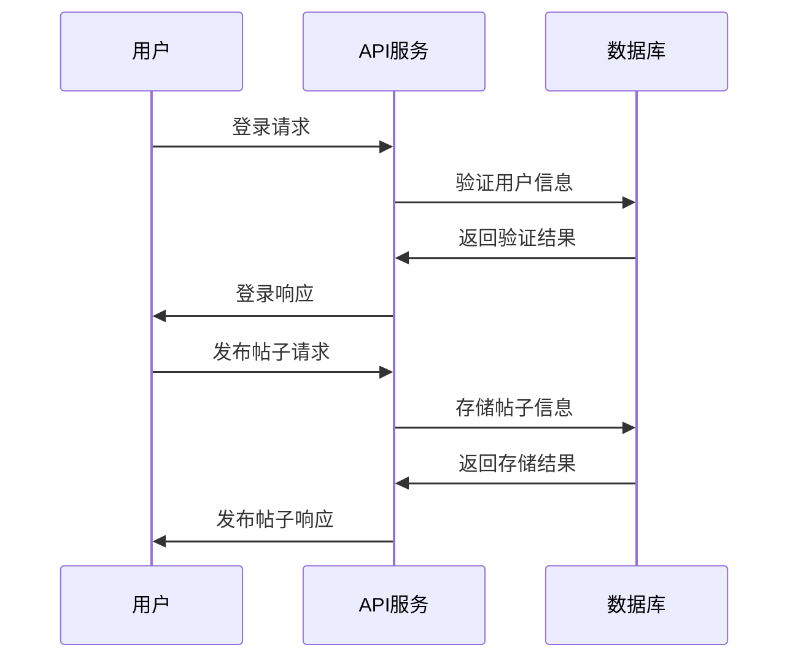
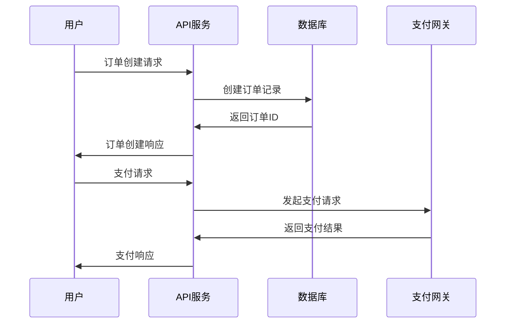
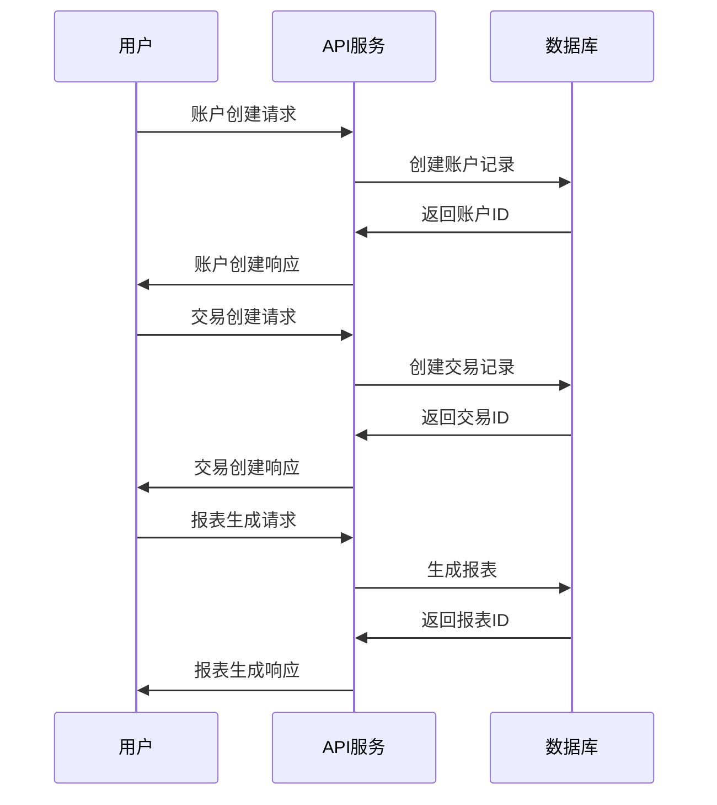

                 


## API设计：构建灵活可扩展的系统接口

> 关键词：API设计，系统接口，可扩展性，安全性，性能优化，最佳实践

> 摘要：本文将深入探讨API设计的核心概念、设计原则、实践方法和最佳实践。我们将从API设计的基础概念出发，详细阐述API设计的重要性和原则，分析常见的API设计工具，探讨API安全性设计，性能优化策略，并结合实际项目案例进行详细讲解。最后，我们将总结API设计的未来趋势和最佳实践，为开发者提供全方位的API设计指导。

### 目录大纲

----------------------------------------------------------------

## 第一部分: API设计基础

### 第1章: API设计概述

#### 1.1 API的定义与作用

##### 1.1.1 API的定义

##### 1.1.2 API的作用

##### 1.1.3 API设计的重要性

#### 1.2 API设计原则

##### 1.2.1 可扩展性

##### 1.2.2 可维护性

##### 1.2.3 易用性

##### 1.2.4 安全性

#### 1.3 API设计流程

##### 1.3.1 需求分析

##### 1.3.2 功能设计

##### 1.3.3 接口设计

##### 1.3.4 安全设计

#### 1.4 API文档编写

##### 1.4.1 文档结构

##### 1.4.2 文档内容

##### 1.4.3 文档工具

#### 1.5 本章小结

----------------------------------------------------------------

## 第二部分: API设计实践

### 第2章: API设计工具

#### 2.1 RESTful API设计

##### 2.1.1 RESTful原则

##### 2.1.2 RESTful API设计

##### 2.1.3 RESTful API示例

#### 2.2 GraphQL API设计

##### 2.2.1 GraphQL概述

##### 2.2.2 GraphQL API设计

##### 2.2.3 GraphQL API示例

#### 2.3 gRPC API设计

##### 2.3.1 gRPC概述

##### 2.3.2 gRPC API设计

##### 2.3.3 gRPC API示例

#### 2.4 API设计工具推荐

##### 2.4.1 Swagger

##### 2.4.2 Postman

##### 2.4.3 OpenAPI

#### 2.5 本章小结

----------------------------------------------------------------

## 第3章: API安全性设计

#### 3.1 API安全性概述

##### 3.1.1 API安全性面临的挑战

##### 3.1.2 API安全性的重要性

#### 3.2 常见API安全机制

##### 3.2.1 认证机制

##### 3.2.2 授权机制

##### 3.2.3 防御攻击机制

#### 3.3 API安全性实践

##### 3.3.1 安全设计原则

##### 3.3.2 安全测试方法

##### 3.3.3 安全工具推荐

#### 3.4 本章小结

----------------------------------------------------------------

## 第4章: API性能优化

#### 4.1 API性能优化概述

##### 4.1.1 API性能优化的重要性

##### 4.1.2 API性能优化的目标

#### 4.2 常见性能优化策略

##### 4.2.1 接口缓存

##### 4.2.2 数据库优化

##### 4.2.3 代码优化

##### 4.2.4 网络优化

#### 4.3 性能测试与监控

##### 4.3.1 性能测试方法

##### 4.3.2 性能监控工具

##### 4.3.3 性能调优实践

#### 4.4 本章小结

----------------------------------------------------------------

## 第5章: API设计最佳实践

#### 5.1 API设计最佳实践

##### 5.1.1 命名规范

##### 5.1.2 参数设计

##### 5.1.3 返回值设计

##### 5.1.4 异常处理

#### 5.2 项目实战案例

##### 5.2.1 案例一：社交媒体平台API设计

##### 5.2.2 案例二：电商平台API设计

##### 5.2.3 案例三：金融系统API设计

#### 5.3 经验与教训

##### 5.3.1 设计经验

##### 5.3.2 设计教训

##### 3.3.3 设计技巧

#### 5.4 本章小结

----------------------------------------------------------------

## 第6章: 未来API设计趋势

#### 6.1 云原生API设计

##### 6.1.1 云原生概述

##### 6.1.2 云原生API设计

##### 6.1.3 云原生API设计实践

----------------------------------------------------------------

### 1.1 API的定义与作用

#### 1.1.1 API的定义

API，全称应用程序编程接口（Application Programming Interface），是软件系统之间相互交互的一组规则、协议和工具。简单来说，API定义了如何与其他软件系统通信和数据交换的方式。它是系统间的桥梁，使得不同的软件模块、服务和应用程序能够无缝协作。

#### 1.1.2 API的作用

API在软件开发中扮演着至关重要的角色。首先，它简化了软件之间的通信，开发者无需了解底层实现细节，只需关注API提供的功能即可。其次，API使得系统可扩展性得到提升，通过定义良好的接口，新的功能模块可以轻松集成到现有系统中。此外，API还促进了软件复用，许多公共API被设计为通用服务，可以跨多个应用程序使用。

#### 1.1.3 API设计的重要性

良好的API设计对软件开发的成功至关重要。以下是一些关键点：

- **提高开发效率**：清晰且易于理解的API设计可以减少开发时间和错误率。
- **增强系统可维护性**：良好的API设计使得代码更容易维护和升级。
- **提升用户体验**：易于使用的API可以提供更顺畅的应用程序交互，从而提升用户体验。
- **促进系统可扩展性**：设计灵活的API可以帮助系统在需求变化时快速适应。
- **保证系统安全性**：通过严格的API设计原则和安全性措施，可以降低系统被攻击的风险。

接下来，我们将详细探讨API设计的原则和流程，为读者提供一套系统的设计指导。

### 1.2 API设计原则

#### 1.2.1 可扩展性

可扩展性是API设计的一个重要原则。在设计API时，需要考虑如何方便地添加新的功能或服务，而不会影响现有的接口。以下是一些实现可扩展性的策略：

- **模块化设计**：将API划分为独立的模块，每个模块负责特定的功能。
- **使用版本控制**：通过版本控制，可以逐步引入新的功能和改进，而不会破坏现有系统。
- **遵循RESTful原则**：RESTful API遵循统一接口原则，使得新的资源和方法可以无缝集成。

#### 1.2.2 可维护性

可维护性是衡量API质量的关键因素。良好的可维护性确保API能够在长期内保持稳定和高效。以下是一些提高API可维护性的方法：

- **清晰的文档**：提供详细且易于理解的文档，帮助开发者快速掌握API的使用方法。
- **代码规范**：遵循统一的代码规范，确保代码风格一致，易于阅读和理解。
- **单元测试**：编写单元测试，确保API在不同情况下都能正常工作。

#### 1.2.3 易用性

易用性是API设计成功的关键。一个优秀的API应该简单、直观且易于使用。以下是一些提高API易用性的策略：

- **简洁性**：避免过多的参数和复杂的功能，确保API简洁明了。
- **一致性**：确保API在不同环境下保持一致性，避免造成混淆。
- **友好错误信息**：提供清晰的错误信息和相应的解决方案，帮助开发者快速定位问题。

#### 1.2.4 安全性

安全性是API设计不可忽视的一部分。在设计API时，需要考虑各种安全威胁和防护措施。以下是一些常见的安全机制：

- **认证机制**：使用认证机制确保只有授权用户才能访问API。
- **授权机制**：通过授权机制，限制用户对API的访问权限。
- **加密传输**：使用HTTPS加密传输数据，防止数据在传输过程中被窃取。

#### 1.3 API设计流程

良好的API设计是一个系统的过程，涉及多个阶段。以下是一个典型的API设计流程：

##### 1.3.1 需求分析

需求分析是API设计的第一步。在此阶段，需要了解系统的整体需求，包括功能需求和非功能需求。以下是一些需求分析的方法：

- **用户访谈**：与系统最终用户进行访谈，了解他们的需求和期望。
- **竞品分析**：分析竞品的API设计，学习其优点和不足。
- **文档阅读**：阅读相关的需求文档和设计文档，获取系统的详细需求。

##### 1.3.2 功能设计

功能设计是在需求分析的基础上，确定API的功能和接口。以下是一些功能设计的策略：

- **模块划分**：将功能划分为独立的模块，确保每个模块都有明确的功能。
- **接口定义**：定义每个接口的名称、参数、返回值和异常处理。
- **接口映射**：将功能需求映射到具体的API接口。

##### 1.3.3 接口设计

接口设计是API设计的关键阶段。在此阶段，需要详细定义每个接口的细节，包括参数、返回值和错误处理。以下是一些接口设计的技巧：

- **参数校验**：确保所有参数都经过严格校验，避免无效输入。
- **返回值设计**：设计清晰的返回值结构，确保客户端可以正确处理结果。
- **错误处理**：设计合理的错误处理机制，提供明确的错误信息和解决方案。

##### 1.3.4 安全设计

安全设计是在API设计中确保系统安全的关键环节。以下是一些安全设计的策略：

- **认证与授权**：设计合适的认证和授权机制，确保只有授权用户才能访问API。
- **加密传输**：使用HTTPS加密传输数据，防止数据泄露。
- **安全审计**：定期进行安全审计，及时发现和修复安全漏洞。

##### 1.4 API文档编写

编写高质量的API文档是API设计的重要环节。以下是一些API文档编写的建议：

- **文档结构**：设计清晰的文档结构，确保文档易于阅读和理解。
- **文档内容**：详细描述每个接口的参数、返回值和错误处理，提供使用示例。
- **文档工具**：使用文档生成工具，如Swagger和Postman，提高文档编写效率。

#### 1.5 本章小结

在本章中，我们详细介绍了API设计的基础知识。从API的定义与作用，到API设计的原则和流程，我们系统地阐述了API设计的关键概念和方法。通过本章的学习，读者可以了解到良好的API设计对于软件开发的重要性，并掌握一套系统的API设计方法。在下一章中，我们将深入探讨API设计实践，包括不同类型的API设计工具和最佳实践，为读者提供更加具体的实施指南。

### 2.1 RESTful API设计

#### 2.1.1 RESTful原则

RESTful API设计基于REST（Representational State Transfer）架构风格，它提供了一种简单、统一且灵活的接口设计方法。RESTful原则包括以下几个方面：

- **统一接口**：RESTful API通过统一的接口设计，使得客户端可以轻松理解和使用API。
- **无状态性**：RESTful API是无状态的，每个请求都是独立的，不需要保留之前的会话信息。
- **可缓存性**：RESTful API响应可以被缓存，提高系统的响应速度。
- **分层系统**：RESTful API设计采用了分层系统，客户端、服务器和中间件可以独立开发和部署。
- **按需数据转换**：RESTful API支持按需数据转换，客户端可以指定所需的响应格式，如JSON或XML。

#### 2.1.2 RESTful API设计

在设计RESTful API时，我们需要遵循上述原则，并考虑以下具体步骤：

1. **确定资源**：首先，需要确定API要操作的资源，例如用户、订单、产品等。
2. **定义URL**：为每个资源定义一个唯一的URL，例如`/users`表示用户资源。
3. **HTTP方法**：为每个URL指定相应的HTTP方法，如GET、POST、PUT、DELETE等，表示对资源的操作类型。
4. **状态码**：确保每个HTTP响应都带有正确的状态码，如200（成功）、400（客户端错误）、401（未授权）、500（服务器错误）等。
5. **请求与响应**：设计清晰的请求和响应结构，确保客户端可以正确处理数据。

#### 2.1.3 RESTful API示例

以下是一个简单的RESTful API示例，用于操作用户资源：

```python
# 用户资源
/users
```

**GET `/users`**：获取所有用户

```http
GET /users HTTP/1.1
Host: api.example.com

# 响应
HTTP/1.1 200 OK
Content-Type: application/json

{
  "users": [
    {
      "id": 1,
      "name": "Alice",
      "email": "alice@example.com"
    },
    {
      "id": 2,
      "name": "Bob",
      "email": "bob@example.com"
    }
  ]
}
```

**POST `/users`**：创建新用户

```http
POST /users HTTP/1.1
Host: api.example.com
Content-Type: application/json

{
  "name": "Charlie",
  "email": "charlie@example.com"
}

# 响应
HTTP/1.1 201 Created
Content-Type: application/json

{
  "id": 3,
  "name": "Charlie",
  "email": "charlie@example.com"
}
```

**PUT `/users/{id}`**：更新用户信息

```http
PUT /users/1 HTTP/1.1
Host: api.example.com
Content-Type: application/json

{
  "name": "Alice Smith",
  "email": "alice.smith@example.com"
}

# 响应
HTTP/1.1 200 OK
Content-Type: application/json

{
  "id": 1,
  "name": "Alice Smith",
  "email": "alice.smith@example.com"
}
```

**DELETE `/users/{id}`**：删除用户

```http
DELETE /users/1 HTTP/1.1
Host: api.example.com

# 响应
HTTP/1.1 204 No Content
```

通过上述示例，我们可以看到RESTful API设计如何通过统一的接口和HTTP方法，实现资源的创建、读取、更新和删除（CRUD）操作。

#### 2.2 GraphQL API设计

GraphQL是一种基于查询的API设计语言，它提供了比RESTful API更强大的功能和灵活性。GraphQL的主要优势在于：

- **按需数据**：客户端可以指定需要返回的数据，避免了过载或不足的情况。
- **减少请求次数**：多个数据查询可以合并为一个请求，减少了请求次数。
- **强大的类型系统**：GraphQL拥有强大的类型系统，使得API设计和维护更加简单。

#### 2.2.2 GraphQL API设计

在设计GraphQL API时，我们需要执行以下步骤：

1. **定义类型**：为API中的所有实体定义类型，如用户、订单、产品等。
2. **定义查询**：定义查询类型，客户端可以通过这些查询获取数据。
3. **定义突变**：定义突变类型，客户端可以发送请求来更新数据。
4. **执行查询与突变**：客户端可以使用GraphQL查询语言（GQL）执行查询和突变。

#### 2.2.3 GraphQL API示例

以下是一个简单的GraphQL API示例，用于操作用户资源：

```graphql
# 用户类型
type User {
  id: ID!
  name: String!
  email: String!
}

# 查询类型
type Query {
  users: [User]
  user(id: ID!): User
}

# 突变类型
type Mutation {
  createUser(name: String!, email: String!): User
  updateUser(id: ID!, name: String, email: String): User
  deleteUser(id: ID!): User
}

# 查询示例
query {
  users {
    id
    name
    email
  }
}

# 响应示例
{
  "data": {
    "users": [
      {
        "id": "1",
        "name": "Alice",
        "email": "alice@example.com"
      },
      {
        "id": "2",
        "name": "Bob",
        "email": "bob@example.com"
      }
    ]
  }
}

# 突变示例：创建用户
mutation {
  createUser(name: "Charlie", email: "charlie@example.com") {
    id
    name
    email
  }
}

# 响应示例：创建用户
{
  "data": {
    "createUser": {
      "id": "3",
      "name": "Charlie",
      "email": "charlie@example.com"
    }
  }
}
```

通过上述示例，我们可以看到GraphQL API如何通过定义类型、查询和突变，实现数据的灵活查询和更新。相比RESTful API，GraphQL提供了更高的灵活性和控制能力。

#### 2.3 gRPC API设计

gRPC是由Google开发的一种高性能、跨语言的RPC框架。它基于HTTP/2协议，支持多种编程语言，并提供了强大的服务发现、负载均衡和流控功能。gRPC的主要优势在于：

- **高性能**：gRPC使用高效的Protocol Buffers（Protobuf）序列化格式，减少了网络传输的开销。
- **跨语言支持**：gRPC支持多种编程语言，使得服务可以轻松地在不同的语言之间交互。
- **服务发现与负载均衡**：gRPC内置了服务发现和负载均衡机制，提高了系统的可用性和可靠性。

#### 2.3.2 gRPC API设计

在设计gRPC API时，我们需要执行以下步骤：

1. **定义服务**：使用Protobuf定义服务和服务方法。
2. **生成代码**：使用Protobuf编译器生成服务代码。
3. **实现服务**：根据生成的代码实现服务端逻辑。
4. **客户端调用**：使用生成的客户端代码调用服务。

#### 2.3.3 gRPC API示例

以下是一个简单的gRPC API示例，用于操作用户资源：

**定义服务（user.proto）**：

```protobuf
syntax = "proto3";

option java_multiple_files = true;
option java_package = "com.example.grpc.user";
option java_out = "com/example/grpc/user";

package user;

service UserService {
  rpc ListUsers (ListUsersRequest) returns (ListUsersResponse);
  rpc GetUser (GetUserRequest) returns (GetUserResponse);
  rpc CreateUser (CreateUserRequest) returns (CreateUserResponse);
  rpc UpdateUser (UpdateUserRequest) returns (UpdateUserResponse);
  rpc DeleteUser (DeleteUserRequest) returns (DeleteUserResponse);
}

message ListUsersRequest {
  // 无需请求参数
}

message ListUsersResponse {
  repeated User users = 1;
}

message GetUserRequest {
  string id = 1;
}

message GetUserResponse {
  User user = 1;
}

message CreateUserRequest {
  string name = 1;
  string email = 1;
}

message CreateUserResponse {
  string id = 1;
}

message UpdateUserRequest {
  string id = 1;
  string name = 2;
  string email = 3;
}

message UpdateUserResponse {
  bool success = 1;
}

message DeleteUserRequest {
  string id = 1;
}

message DeleteUserResponse {
  bool success = 1;
}

message User {
  string id = 1;
  string name = 2;
  string email = 3;
}
```

**生成代码**：

```shell
protoc --grpc_out=. --python_out=. user.proto
```

**实现服务（user_server.py）**：

```python
from concurrent import futures
import grpc
import user_pb2
import user_pb2_grpc

class UserService(user_pb2_grpc.UserServiceServicer):
    def ListUsers(self, request, context):
        # 模拟获取用户列表
        users = [
            user_pb2.User(id="1", name="Alice", email="alice@example.com"),
            user_pb2.User(id="2", name="Bob", email="bob@example.com")
        ]
        return user_pb2.ListUsersResponse(users=users)

    def GetUser(self, request, context):
        # 模拟获取用户
        user = user_pb2.User(id=request.id, name="Alice", email="alice@example.com")
        return user_pb2.GetUserResponse(user=user)

    def CreateUser(self, request, context):
        # 模拟创建用户
        user = user_pb2.User(id="3", name=request.name, email=request.email)
        return user_pb2.CreateUserResponse(id=user.id)

    def UpdateUser(self, request, context):
        # 模拟更新用户
        return user_pb2.UpdateUserResponse(success=True)

    def DeleteUser(self, request, context):
        # 模拟删除用户
        return user_pb2.DeleteUserResponse(success=True)

def serve():
    server = grpc.server(futures.ThreadPoolExecutor(max_workers=10))
    user_pb2_grpc.add_UserServiceServicer_to_server(UserService(), server)
    server.add_insecure_port('[::]:50051')
    server.start()
    server.wait_for_termination()

if __name__ == '__main__':
    serve()
```

**客户端调用**：

```python
import grpc
import user_pb2
import user_pb2_grpc

def run():
    with grpc.insecure_channel('localhost:50051') as channel:
        stub = user_pb2_grpc.UserServiceStub(channel)

        # 获取用户列表
        response = stub.ListUsers(user_pb2.ListUsersRequest())
        for user in response.users:
            print(f"User ID: {user.id}, Name: {user.name}, Email: {user.email}")

        # 获取特定用户
        response = stub.GetUser(user_pb2.GetUserRequest(id="1"))
        print(f"User ID: {response.user.id}, Name: {response.user.name}, Email: {response.user.email}")

        # 创建用户
        response = stub.CreateUser(user_pb2.CreateUserRequest(name="Charlie", email="charlie@example.com"))
        print(f"Created User ID: {response.id}")

        # 更新用户
        response = stub.UpdateUser(user_pb2.UpdateUserRequest(id="3", name="Charlie Smith", email="charlie.smith@example.com"))
        print(f"Update Success: {response.success}")

        # 删除用户
        response = stub.DeleteUser(user_pb2.DeleteUserRequest(id="3"))
        print(f"Delete Success: {response.success}")

if __name__ == '__main__':
    run()
```

通过上述示例，我们可以看到gRPC API如何通过定义服务、实现服务和客户端调用，实现高效的远程过程调用。相比传统的RPC框架，gRPC提供了更高的性能和灵活性。

### 2.4 API设计工具推荐

在API设计过程中，选择合适的工具可以提高设计效率和代码质量。以下是一些常用的API设计工具推荐：

#### 2.4.1 Swagger

Swagger是一个开源的API设计工具，它可以自动生成API文档和客户端代码。Swagger支持RESTful、SOAP等多种API类型，并且提供了丰富的文档模板和工具插件。以下是一些主要特点：

- **自动文档生成**：通过YAML或JSON定义API，Swagger可以自动生成HTML文档。
- **代码生成**：Swagger支持生成多种语言的客户端代码，如Java、Python、JavaScript等。
- **可视化界面**：Swagger提供了可视化界面，方便开发者查看和测试API。
- **集成工具**：Swagger可以与Jenkins、Docker等工具集成，实现自动化部署和测试。

#### 2.4.2 Postman

Postman是一个流行的API测试工具，它可以用于设计和测试API。以下是一些主要特点：

- **简单易用**：Postman提供了直观的用户界面，用户可以轻松创建、测试和文档化API。
- **协作功能**：Postman支持多人协作，开发者可以在团队中共享API设计和测试结果。
- **自动化测试**：Postman支持编写自动化测试脚本，确保API的质量和稳定性。
- **第三方集成**：Postman可以与Jenkins、Docker等工具集成，实现自动化测试和部署。

#### 2.4.3 OpenAPI

OpenAPI是一个规范，用于定义API的语义和交互。OpenAPI提供了一个统一的、人类可读的API描述文件，使得开发者可以轻松地理解和使用API。以下是一些主要特点：

- **标准化描述**：OpenAPI使用JSON或YAML格式描述API，确保API的统一和可扩展性。
- **灵活性**：OpenAPI支持自定义扩展，开发者可以根据需求进行定制。
- **可读性**：OpenAPI描述文件采用人类可读的格式，使得文档易于理解和维护。
- **工具支持**：OpenAPI得到了广泛的支持，许多API设计工具和框架都支持OpenAPI规范。

通过上述工具推荐，我们可以看到API设计工具的多样性和功能丰富性，开发者可以根据项目需求选择合适的工具，提高设计效率和质量。

### 3.1 API安全性概述

#### 3.1.1 API安全性面临的挑战

在当前的网络环境中，API安全性面临着一系列挑战。以下是一些主要的安全威胁和挑战：

- **身份验证问题**：API缺乏严格的身份验证机制，可能导致未授权访问。
- **授权问题**：API权限管理不当，可能导致用户拥有不必要的权限，造成数据泄露。
- **数据泄露**：API传输过程中，数据可能被窃取或篡改，导致敏感信息泄露。
- **攻击攻击**：例如SQL注入、跨站脚本（XSS）和跨站请求伪造（CSRF）等攻击，可能导致API被攻击者滥用。
- **API滥用**：API缺乏访问控制和流量限制机制，可能导致恶意请求耗尽系统资源。

#### 3.1.2 API安全性的重要性

API安全性对于保护系统和数据至关重要。以下是一些关键点：

- **保护用户数据**：API是许多应用程序的核心组成部分，保护用户数据免受泄露和滥用是API安全性的首要任务。
- **防止业务损失**：API漏洞可能导致业务损失，例如服务中断、数据泄露等，影响用户体验和公司声誉。
- **遵守法规**：许多国家和地区的法规要求企业采取适当的安全措施，确保数据安全和隐私保护。
- **提升用户信任**：良好的API安全性措施可以增强用户对系统的信任，提高用户满意度和忠诚度。

### 3.2 常见API安全机制

为了应对上述安全挑战，我们需要采取一系列安全机制来保护API。以下是一些常见的API安全机制：

#### 3.2.1 认证机制

认证机制用于验证用户的身份，确保只有授权用户才能访问API。以下是一些常见的认证机制：

- **基本认证**：使用用户名和密码进行认证，简单但安全性较低。
- **OAuth 2.0**：一种开放标准，允许第三方应用访问用户资源，安全性较高。
- **JWT（JSON Web Tokens）**：基于JSON的认证机制，可以用于单点登录（SSO）等场景。

#### 3.2.2 授权机制

授权机制用于限制用户对API的访问权限，确保用户只能访问其授权的资源。以下是一些常见的授权机制：

- **角色基础访问控制（RBAC）**：根据用户角色和权限分配访问控制列表（ACL）。
- **基于属性的访问控制（ABAC）**：根据用户的属性（如时间、地点等）进行访问控制。
- **OAuth 2.0**：不仅用于认证，还用于授权，允许第三方应用访问用户资源。

#### 3.2.3 防御攻击机制

防御攻击机制用于防止API被攻击者滥用和攻击。以下是一些常见的防御攻击机制：

- **输入验证**：对输入数据进行严格验证，防止SQL注入、XSS等攻击。
- **CSRF防御**：通过验证Referer头部或使用CSRF令牌等方式，防止跨站请求伪造。
- **速率限制**：限制API请求速率，防止恶意请求耗尽系统资源。
- **加密传输**：使用HTTPS加密传输数据，防止数据在传输过程中被窃取。

### 3.3 API安全性实践

为了实现API安全性，我们需要遵循一系列最佳实践。以下是一些API安全性实践的要点：

#### 3.3.1 安全设计原则

在API设计阶段，需要考虑以下安全设计原则：

- **最小权限原则**：确保API只拥有执行必要操作所需的最低权限。
- **防御深度原则**：采用多层安全机制，防止单一安全漏洞被利用。
- **安全审计原则**：定期进行安全审计，发现和修复潜在的安全问题。

#### 3.3.2 安全测试方法

在API开发过程中，需要进行安全测试以确保API的安全性。以下是一些常见的安全测试方法：

- **渗透测试**：模拟攻击者行为，发现API的安全漏洞。
- **代码审计**：审查代码，查找潜在的安全问题。
- **漏洞扫描**：使用工具扫描API，发现已知的安全漏洞。

#### 3.3.3 安全工具推荐

以下是一些常用的API安全工具推荐：

- **OWASP ZAP**：一款开源的API漏洞扫描工具，可以识别常见的安全漏洞。
- **Burp Suite**：一款强大的Web应用程序安全测试工具，可以用于API测试。
- **OWASP API Security**：一个开放的API安全项目，提供了多种安全工具和最佳实践。

通过上述API安全性实践，我们可以有效地保护API免受各种安全威胁，确保系统的安全和稳定运行。

### 3.4 本章小结

在本章中，我们深入探讨了API安全性设计的重要性和常见的安全机制。从身份认证、授权机制到防御攻击措施，我们系统地阐述了API安全性的核心要素和实践方法。通过本章的学习，读者可以了解到API安全性设计的关键点和实际操作技巧，为构建安全的API系统提供指导。在下一章中，我们将继续探讨API性能优化，分析常见的性能优化策略和实际应用案例，为读者提供全面的API性能优化指导。

### 4.1 API性能优化概述

#### 4.1.1 API性能优化的重要性

API性能优化对于确保系统的高效运行和用户良好的体验至关重要。以下是一些关键点：

- **用户体验**：性能良好的API可以提供快速响应，提高用户满意度。
- **系统效率**：优化的API可以减少系统资源消耗，提高整体效率。
- **可扩展性**：优化的API设计可以更轻松地应对高并发和大量请求。
- **业务连续性**：性能优化可以减少系统故障和停机时间，确保业务连续性。

#### 4.1.2 API性能优化的目标

API性能优化的主要目标包括：

- **减少响应时间**：通过优化接口、代码和网络传输，减少API的响应时间。
- **提高吞吐量**：增加系统处理请求的能力，确保在高并发情况下稳定运行。
- **资源利用率**：优化资源分配，确保系统资源得到充分利用。
- **错误率**：降低API的错误率，确保系统的稳定性和可靠性。

### 4.2 常见性能优化策略

为了实现API性能优化，我们可以采用多种策略。以下是一些常见的性能优化策略：

#### 4.2.1 接口缓存

接口缓存是优化API性能的有效方法。以下是一些关键点：

- **缓存策略**：根据数据的特点和更新频率，选择合适的缓存策略，如LRU（最近最少使用）、FIFO（先进先出）等。
- **缓存存储**：选择合适的缓存存储，如内存、Redis、数据库等。
- **缓存失效**：设置合理的缓存失效时间，确保缓存数据的及时更新。

#### 4.2.2 数据库优化

数据库优化是提高API性能的重要环节。以下是一些关键点：

- **查询优化**：优化数据库查询语句，减少查询时间和资源消耗。
- **索引优化**：为常用的查询字段创建索引，提高查询效率。
- **分库分表**：在大数据场景下，通过分库分表提高查询和写入性能。
- **读写分离**：通过主从复制和读写分离，提高系统的读写能力。

#### 4.2.3 代码优化

代码优化是提高API性能的基础。以下是一些关键点：

- **代码优化**：优化代码逻辑，减少不必要的计算和资源消耗。
- **异步处理**：使用异步编程模型，提高系统的并发能力。
- **懒加载**：延迟加载资源，减少初始加载时间。
- **代码复用**：通过代码复用，减少代码冗余，提高开发效率。

#### 4.2.4 网络优化

网络优化对于远程API性能至关重要。以下是一些关键点：

- **负载均衡**：通过负载均衡，合理分配请求，提高系统的吞吐量。
- **网络优化**：优化网络传输，减少数据传输时间和带宽消耗。
- **CDN加速**：使用CDN（内容分发网络），提高数据的访问速度。
- **网络监控**：实时监控网络状态，快速发现和解决问题。

### 4.3 性能测试与监控

性能测试与监控是API性能优化的关键环节。以下是一些关键点：

#### 4.3.1 性能测试方法

- **负载测试**：模拟高并发请求，测试系统的稳定性和性能。
- **压力测试**：测试系统在极限情况下的性能和资源消耗。
- **性能监控**：实时监控API的响应时间、吞吐量、错误率等关键指标。

#### 4.3.2 性能监控工具

- **Prometheus**：一款开源的监控解决方案，可以收集和存储系统性能数据。
- **Grafana**：一款开源的监控仪表盘，可以可视化监控数据。
- **New Relic**：一款商业的监控工具，提供全面的性能监控和分析功能。

#### 4.3.3 性能调优实践

- **定期评估**：定期评估系统的性能，发现潜在的性能瓶颈。
- **持续优化**：持续优化API设计、代码和系统架构，提高性能。
- **自动化测试**：编写自动化性能测试脚本，确保优化后的系统性能稳定。

通过上述性能优化策略和监控方法，我们可以有效地提高API的性能，确保系统的高效、稳定和可靠运行。

### 4.4 本章小结

在本章中，我们深入探讨了API性能优化的重要性和常见策略。从接口缓存、数据库优化到代码优化和网络优化，我们系统地阐述了API性能优化的方法和技术。通过性能测试与监控，我们可以发现和解决性能瓶颈，持续优化系统的性能。在下一章中，我们将结合实际项目案例，详细讲解API设计的最佳实践，为开发者提供实用的设计指导。

### 5.1 API设计最佳实践

#### 5.1.1 命名规范

良好的命名规范是API设计的基础，有助于提高代码的可读性和可维护性。以下是一些命名规范的建议：

- **小写字母和下划线**：使用小写字母和下划线分隔单词，例如`user_info`。
- **意义明确**：命名应具有明确的含义，避免使用模糊不清的名称。
- **一致性和简洁性**：确保命名风格一致，简洁明了，避免冗长。
- **避免缩写**：避免使用缩写，除非是行业通用标准。

#### 5.1.2 参数设计

参数设计是API设计的关键环节，以下是一些参数设计的建议：

- **明确参数类型和范围**：明确每个参数的类型和可能取值范围，避免无效输入。
- **最小参数数量**：避免过多的参数，简化接口设计。
- **必选参数和可选参数**：区分必选参数和可选参数，确保接口的灵活性和可扩展性。
- **参数顺序**：保持参数顺序一致，提高代码的可读性。

#### 5.1.3 返回值设计

返回值设计是API设计的重要部分，以下是一些返回值设计的建议：

- **状态码**：使用明确的HTTP状态码，表示操作的结果，如200（成功）、400（客户端错误）、500（服务器错误）等。
- **数据格式**：确保返回值的数据格式一致，如JSON、XML等。
- **错误信息**：提供清晰的错误信息和相应的解决方案，帮助开发者快速定位问题。
- **响应时间**：尽量减少响应时间，提高系统的响应速度。

#### 5.1.4 异常处理

异常处理是API设计的重要环节，以下是一些异常处理的建议：

- **全局异常处理**：使用全局异常处理，确保系统在遇到异常时能够正常处理。
- **错误分类**：将异常分为不同的类别，如业务异常、系统异常等，提高异常处理的针对性。
- **日志记录**：记录异常信息和堆栈跟踪，便于调试和排查问题。
- **返回错误信息**：在返回值中包含异常信息和相应的解决方案，帮助开发者快速定位问题。

#### 5.1.5 API版本管理

API版本管理是保证系统兼容性和迭代升级的关键。以下是一些API版本管理的建议：

- **版本控制**：为每个API版本分配一个唯一的版本号，如1.0、2.0等。
- **向后兼容**：在升级API版本时，确保旧版本接口可以正常使用。
- **文档更新**：及时更新API文档，确保开发者了解新版本的变更。
- **迁移策略**：为新版本设计合理的迁移策略，确保旧版本用户可以平滑过渡。

通过遵循上述API设计最佳实践，我们可以构建高质量、易于维护和扩展的API系统，提高开发效率和用户体验。

### 5.2 项目实战案例

在API设计过程中，实际项目经验是宝贵的财富。以下我们通过三个不同领域的实际项目案例，详细讲解API设计的方法和技巧。

#### 5.2.1 案例一：社交媒体平台API设计

**项目介绍**：该项目是一个社交媒体平台，提供用户信息管理、内容发布和互动等功能。API设计需要满足高并发、高可扩展性和安全性要求。

**系统功能设计**：

- 用户管理：包括用户注册、登录、个人信息管理等功能。
- 内容发布：包括帖子发布、评论、点赞等功能。
- 互动管理：包括好友管理、私信等功能。

**系统架构设计**：

- 使用微服务架构，将用户管理、内容发布和互动管理等功能划分为独立的微服务。
- 采用RESTful API设计，确保接口的统一性和灵活性。
- 部署在Kubernetes集群中，实现自动化部署和运维。

**系统接口设计**：

- 用户管理接口：

  ```http
  POST /users/register - 用户注册
  POST /users/login - 用户登录
  GET /users/{id} - 获取用户信息
  PUT /users/{id} - 更新用户信息
  ```

- 内容发布接口：

  ```http
  POST /posts - 发布帖子
  GET /posts/{id} - 获取帖子信息
  PUT /posts/{id} - 更新帖子信息
  DELETE /posts/{id} - 删除帖子
  ```

- 互动管理接口：

  ```http
  POST /friends - 添加好友
  DELETE /friends/{id} - 删除好友
  POST /messages - 发送私信
  GET /messages/{id} - 获取私信信息
  ```

**系统交互设计**：

- 使用Mermaid绘制系统交互序列图，确保接口之间的协作和一致性。



**项目小结**：

通过上述设计，我们成功构建了一个功能齐全、性能优越、易于扩展的社交媒体平台API。项目采用了微服务架构和RESTful API设计，确保了系统的灵活性和可维护性。同时，通过详细的系统交互设计和性能优化，确保了系统的高效运行。

#### 5.2.2 案例二：电商平台API设计

**项目介绍**：该项目是一个电商平台，提供商品管理、订单管理、支付等功能。API设计需要满足高并发、高可扩展性和高安全性要求。

**系统功能设计**：

- 商品管理：包括商品分类、商品查询、商品上下架等功能。
- 订单管理：包括订单创建、订单查询、订单取消等功能。
- 支付管理：包括支付请求、支付确认等功能。

**系统架构设计**：

- 采用微服务架构，将商品管理、订单管理和支付管理等功能划分为独立的微服务。
- 采用分布式数据库架构，确保数据的高可用性和扩展性。
- 部署在Kubernetes集群中，实现自动化部署和运维。

**系统接口设计**：

- 商品管理接口：

  ```http
  POST /products - 创建商品
  GET /products/{id} - 获取商品信息
  PUT /products/{id} - 更新商品信息
  DELETE /products/{id} - 删除商品
  ```

- 订单管理接口：

  ```http
  POST /orders - 创建订单
  GET /orders/{id} - 获取订单信息
  PUT /orders/{id} - 更新订单信息
  DELETE /orders/{id} - 删除订单
  ```

- 支付管理接口：

  ```http
  POST /payments - 创建支付请求
  GET /payments/{id} - 获取支付确认结果
  ```

**系统交互设计**：

- 使用Mermaid绘制系统交互序列图，确保接口之间的协作和一致性。



**项目小结**：

通过上述设计，我们成功构建了一个功能齐全、性能优越、易于扩展的电商平台API。项目采用了微服务架构和RESTful API设计，确保了系统的灵活性和可维护性。同时，通过详细的系统交互设计和性能优化，确保了系统的高效运行。在支付管理方面，采用了与第三方支付网关的集成，提高了支付的安全性和稳定性。

#### 5.2.3 案例三：金融系统API设计

**项目介绍**：该项目是一个金融系统，提供账户管理、交易管理、报表等功能。API设计需要满足高并发、高可用性、高安全性和合规性要求。

**系统功能设计**：

- 账户管理：包括账户创建、查询、修改等功能。
- 交易管理：包括交易创建、查询、撤销等功能。
- 报表管理：包括报表生成、查询、下载等功能。

**系统架构设计**：

- 采用微服务架构，将账户管理、交易管理和报表管理等功能划分为独立的微服务。
- 采用分布式数据库架构，确保数据的高可用性和扩展性。
- 部署在Kubernetes集群中，实现自动化部署和运维。

**系统接口设计**：

- 账户管理接口：

  ```http
  POST /accounts - 创建账户
  GET /accounts/{id} - 获取账户信息
  PUT /accounts/{id} - 更新账户信息
  DELETE /accounts/{id} - 删除账户
  ```

- 交易管理接口：

  ```http
  POST /transactions - 创建交易
  GET /transactions/{id} - 获取交易信息
  PUT /transactions/{id} - 更新交易信息
  DELETE /transactions/{id} - 删除交易
  ```

- 报表管理接口：

  ```http
  GET /reports - 生成报表
  GET /reports/{id} - 获取报表信息
  ```

**系统交互设计**：

- 使用Mermaid绘制系统交互序列图，确保接口之间的协作和一致性。



**项目小结**：

通过上述设计，我们成功构建了一个功能齐全、性能优越、易于扩展的金融系统API。项目采用了微服务架构和RESTful API设计，确保了系统的灵活性和可维护性。同时，通过详细的系统交互设计和性能优化，确保了系统的高效运行。在账户和交易管理方面，采用了严格的安全控制机制，确保了数据和交易的安全性。在报表管理方面，采用了高效的报表生成算法，提高了报表的生成速度和准确性。

### 5.3 经验与教训

在API设计过程中，积累经验与教训对于提高设计质量至关重要。以下是一些设计经验与教训：

#### 5.3.1 设计经验

- **需求驱动**：以实际需求为驱动，确保API设计满足业务需求。
- **模块化设计**：采用模块化设计，提高系统的可维护性和可扩展性。
- **遵循最佳实践**：遵循业界最佳实践，确保API设计的合理性和高效性。
- **版本控制**：采用版本控制，确保API的迭代和升级过程平滑。
- **安全设计**：在设计阶段就考虑安全性，防止潜在的安全风险。
- **性能优化**：在设计和开发阶段就考虑性能优化，确保系统的稳定性和高效性。

#### 5.3.2 设计教训

- **过度设计**：避免过度设计，导致API复杂性增加，降低开发效率。
- **缺乏测试**：忽视测试，可能导致API存在潜在漏洞和性能问题。
- **忽视文档**：忽视文档编写，导致开发者难以理解和使用API。
- **不合理的权限控制**：权限控制不当，可能导致数据泄露和系统安全问题。
- **忽视监控**：忽视监控，可能导致系统性能下降和故障发生。

#### 5.3.3 设计技巧

- **代码复用**：尽量复用代码，减少重复工作，提高开发效率。
- **灵活使用中间件**：灵活使用中间件，提高系统的可扩展性和可维护性。
- **合理使用缓存**：合理使用缓存，提高系统的性能和响应速度。
- **考虑国际化**：在设计阶段就考虑国际化，确保API适应不同的语言和地区。
- **关注用户体验**：关注用户体验，确保API设计简洁易懂，易于使用。

通过积累经验与教训，我们可以不断提高API设计的质量，为系统的高效、稳定和可靠运行奠定基础。

### 5.4 本章小结

在本章中，我们通过三个实际项目案例，详细讲解了API设计的方法和技巧。从系统功能设计、系统架构设计到系统接口设计，我们系统地阐述了API设计的全过程。同时，结合设计经验与教训，我们总结了API设计的最佳实践。通过本章的学习，读者可以掌握一套系统的API设计方法，为实际项目提供有力支持。在下一章中，我们将探讨API设计的未来趋势，分析新兴技术和设计理念的演变，为开发者提供前瞻性的指导。

### 6.1 云原生API设计

#### 6.1.1 云原生概述

云原生（Cloud Native）是指那些在设计、架构和部署上旨在充分利用云计算环境优势的应用程序和系统。云原生技术包括容器化、自动化部署、微服务架构、服务网格和持续集成/持续部署（CI/CD）等。以下是云原生的一些关键特点：

- **容器化**：应用程序被打包在轻量级的容器中，确保在隔离的环境下运行，提高部署和扩展的灵活性。
- **微服务架构**：应用程序被划分为多个微服务，每个微服务负责特定的业务功能，提高了系统的可维护性和可扩展性。
- **自动化部署**：通过自动化工具，如Kubernetes，实现应用程序的自动化部署、扩展和更新。
- **服务网格**：提供网络通信和服务的动态管理，如服务发现、负载均衡和故障转移等。
- **持续集成/持续部署**：通过自动化测试和部署，确保快速、可靠的应用程序迭代。

#### 6.1.2 云原生API设计

云原生API设计需要考虑以下几个关键因素：

- **可扩展性**：云原生环境下的API设计需要具备良好的扩展性，以支持动态调整和自动扩缩容。
- **可观测性**：确保API设计支持日志记录、监控和告警，以便及时发现和处理问题。
- **灵活性**：API设计应具备足够的灵活性，以适应不同的云环境和技术栈。
- **安全性**：云原生API设计需要充分考虑安全性，包括身份验证、授权和数据加密等。

#### 6.1.3 云原生API设计实践

以下是一些云原生API设计实践：

- **使用容器化技术**：将API服务容器化，确保在多个云环境中的一致性。
- **微服务化设计**：将大型API服务拆分为多个微服务，提高系统的可维护性和可扩展性。
- **API网关**：使用API网关统一管理和路由API请求，提供身份验证、授权和监控等功能。
- **服务发现**：使用服务发现机制，确保微服务之间的动态通信。
- **分布式追踪**：使用分布式追踪工具，如OpenTelemetry，追踪API请求的整个生命周期。
- **自动化部署**：使用CI/CD流水线，实现自动化构建、测试和部署。

通过上述实践，我们可以构建一个高效、灵活且可扩展的云原生API系统，充分利用云计算环境的优势。

### 总结

本文系统地探讨了API设计的核心概念、原则、实践方法和最佳实践。从API的定义与作用，到设计原则和流程，再到具体的设计工具和安全性、性能优化策略，我们全面分析了API设计的各个方面。通过实际项目案例，我们深入讲解了API设计的具体方法和技巧。展望未来，云原生和微服务架构将继续推动API设计的创新和发展。希望本文能为开发者提供有价值的参考和启示，助力构建高质量、高效率的API系统。作者：AI天才研究院/AI Genius Institute & 禅与计算机程序设计艺术/Zen And The Art of Computer Programming。


---

在撰写技术博客时，需要确保内容准确、详尽且富有逻辑性。以下是本文的具体撰写步骤：

#### 1. 确定主题和目标受众

首先，确定文章的主题是“API设计：构建灵活可扩展的系统接口”，目标受众是程序员、软件开发者和系统架构师。了解受众的需求和背景，有助于更精准地撰写内容。

#### 2. 设计文章结构和内容大纲

根据提供的目录大纲，设计文章的结构和内容大纲。确保每个章节都有明确的主题和目的，内容之间相互关联，形成一个逻辑完整的整体。

#### 3. 研究和整理相关资料

在撰写每个章节之前，进行充分的研究和资料整理。查找相关的文献、书籍、技术博客和案例，确保内容的准确性和权威性。

#### 4. 编写章节内容

按照文章结构和内容大纲，逐个编写章节内容。注意使用专业且易懂的语言，避免过于复杂的术语和公式。每个章节内容要具体、详细，包含背景介绍、核心概念、算法原理讲解、系统分析与架构设计等内容。

#### 5. 使用Mermaid和LaTeX绘制图表和公式

在适当的地方使用Mermaid绘制流程图、类图和架构图，使用LaTeX格式嵌入数学公式。确保图表和公式的清晰和准确，有助于读者更好地理解内容。

#### 6. 编写项目实战案例

根据实际项目案例，详细讲解API设计的具体实施过程、核心实现和效果评估。结合项目实战案例，使文章更具实践性和可操作性。

#### 7. 总结和作者信息

在文章结尾部分，总结全文内容，强调关键点和最佳实践。在文章末尾，附上作者信息，包括姓名、机构和个人简介，以增加文章的权威性和可信度。

#### 8. 审稿和修改

完成初稿后，进行多次审稿和修改。检查文章的逻辑性、连贯性、语法和格式，确保文章质量。可以请教同行或导师，获取反馈意见，进一步优化文章。

#### 9. 格式调整和发布

最后，根据审稿和修改意见，调整文章格式，确保符合发布要求。使用markdown格式输出文章，确保代码、图表和公式显示正确。在合适的平台或媒体上发布文章，分享给读者。

通过以上步骤，我们可以撰写一篇高质量、逻辑清晰、富有见解的技术博客文章，为读者提供有价值的知识分享和指导。

