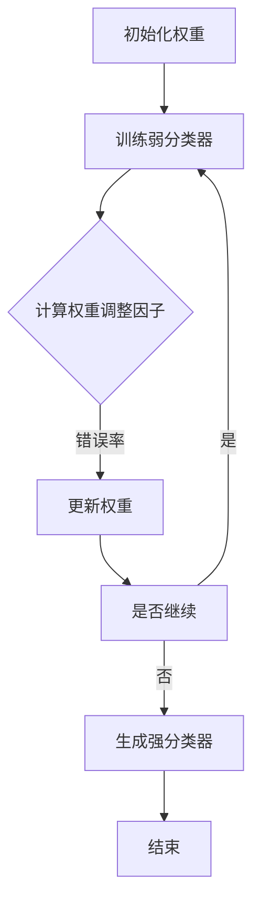

                 

# 《AdaBoost算法与集成学习方法》

> 关键词：AdaBoost、集成学习方法、机器学习、算法优化、分类、回归

> 摘要：本文深入探讨了AdaBoost算法及其在集成学习方法中的应用。文章首先介绍了AdaBoost算法的基本概念和原理，随后探讨了集成学习方法的相关概念和类型。接着，文章详细分析了AdaBoost在集成方法中的应用，并通过实际案例展示了其效果。最后，文章对算法性能评估与优化进行了讨论，并总结了全文。

## 第1章 引言

### 1.1 问题背景与意义

在机器学习领域，分类和回归问题是常见的两大任务。随着数据量的不断增加和复杂性，单模型的性能往往难以满足要求。因此，集成学习方法应运而生，它通过结合多个模型的优点来提高整体性能。AdaBoost算法作为一种强大的集成学习方法，在机器学习领域有着广泛的应用。

AdaBoost（Adaptive Boosting）算法是一种基于错误率的迭代加权的集成学习方法。它通过训练多个弱分类器，并逐步调整每个分类器的权重，最终生成一个强分类器。AdaBoost算法具有简单、高效、适应性强的特点，在分类和回归任务中都有出色的表现。

### 1.2 核心概念

#### 1.2.1 AdaBoost算法

AdaBoost算法是一种基于错误率的迭代加权的集成学习方法。它通过训练多个弱分类器，并逐步调整每个分类器的权重，最终生成一个强分类器。

#### 1.2.2 集成学习方法

集成学习方法是一种通过结合多个模型的优点来提高整体性能的方法。它包括Bagging、Boosting和Stacking等方法。

#### 1.2.3 相关研究现状与未来展望

目前，AdaBoost算法在机器学习领域已经取得了显著的成果。然而，如何在更广泛的应用场景中提高其性能和适应性，仍然是一个重要的研究方向。

### 1.3 本书结构

本文将从以下章节展开讨论：

- **第2章**：介绍AdaBoost算法的基础知识。
- **第3章**：探讨集成学习方法的相关概念和类型。
- **第4章**：分析AdaBoost在集成方法中的应用。
- **第5章**：讨论算法性能评估与优化。
- **第6章**：展示实际应用案例。
- **第7章**：总结全文并展望未来研究方向。

## 第2章 AdaBoost算法基础

### 2.1 AdaBoost算法概述

AdaBoost算法是一种迭代加权的集成学习方法，它通过训练多个弱分类器，并逐步调整每个分类器的权重，最终生成一个强分类器。AdaBoost算法的基本思想是，对于分类错误较多的样本，增加其在后续训练中的权重，从而使弱分类器更关注这些样本。

### 2.2 算法原理与流程图

AdaBoost算法的基本原理是通过迭代训练多个弱分类器，并逐步调整每个分类器的权重。具体流程如下：

1. 初始化所有样本的权重，使得所有样本的权重相等。
2. 对于第`t`个弱分类器，根据当前样本权重进行训练，生成分类结果。
3. 根据分类错误率计算弱分类器的权重调整因子。
4. 更新样本权重，使得分类错误的样本权重增加。
5. 重复步骤2-4，直到达到预定迭代次数或分类错误率低于某个阈值。

以下是AdaBoost算法的流程图：



### 2.3 Python代码示例

下面是一个简单的Python代码示例，用于实现AdaBoost算法：

```python
import numpy as np

def adaboost(X, y, n弱分类器=50):
    n样本, n特征 = X.shape
    w = np.ones(n样本) / n样本  # 初始化样本权重
    model = []  # 存储弱分类器
    for _ in range(n弱分类器):
        # 训练弱分类器
        model.append(train_weak_classifier(X, y, w))
        # 预测并计算权重调整因子
        pred = predict(model[-1], X)
        err = np.sum(w * (y != pred))
        alpha = 0.5 * np.log((1 - err) / err)
        model[-1]["alpha"] = alpha
        # 更新样本权重
        w *= np.exp(-alpha * y * pred)
        w /= np.sum(w)
    return model

def train_weak_classifier(X, y, w):
    # 实现一个简单的弱分类器，例如基于K近邻算法
    # 这里简化为随机选择特征和阈值
    feature = np.random.choice(X.shape[1])
    threshold = np.random.choice(X[0])
    return {"feature": feature, "threshold": threshold, "alpha": 0}

def predict(model, X):
    pred = np.zeros(X.shape[0])
    for m in model:
        pred += m["alpha"] * (X[:, m["feature"]] > m["threshold"])
    return np.sign(pred)  # 返回预测结果

# 测试代码
X = np.random.rand(100, 10)
y = np.random.randint(0, 2, size=100)
model = adaboost(X, y)
print(model)
```

## 第3章 集成学习方法概述

### 3.1 基本概念

集成学习方法是指通过结合多个模型的优点来提高整体性能的方法。它包括Bagging、Boosting和Stacking等方法。

- **Bagging**：通过从原始数据集随机抽取子集，并训练多个模型，然后取平均或投票来获得最终结果。
- **Boosting**：通过训练多个弱模型，并逐步调整每个模型的权重，从而生成一个强模型。
- **Stacking**：将多个模型作为基模型，再训练一个模型来整合这些基模型的结果。

### 3.2 优点与缺点

**优点**：

- 提高模型性能：通过结合多个模型的优点，可以显著提高整体性能。
- 避免过拟合：集成方法可以减少单一模型在训练数据上的过拟合现象。
- 增强鲁棒性：集成方法可以降低对特定数据集的依赖，提高模型的泛化能力。

**缺点**：

- 增加计算成本：训练多个模型需要更多的计算资源和时间。
- 增加模型复杂度：集成方法通常比单一模型更复杂，需要更多的参数调整。

### 3.3 AdaBoost与集成方法的关系

AdaBoost算法是一种Boosting方法，它通过训练多个弱分类器，并逐步调整每个分类器的权重，从而生成一个强分类器。与其他集成方法相比，AdaBoost算法具有以下特点：

- 简单高效：算法实现简单，计算效率高。
- 强适应性：可以适应不同类型的数据集和任务。
- 错误率驱动的迭代：通过调整分类器权重来降低错误率，从而提高模型性能。

## 第4章 AdaBoost在集成方法中的应用

### 4.1 应用场景

AdaBoost算法在分类和回归任务中都有广泛的应用。以下是一些常见的应用场景：

- 信用评分：通过AdaBoost算法对客户信息进行分类，预测客户是否违约。
- 文本分类：利用AdaBoost算法对文本进行分类，用于垃圾邮件过滤、情感分析等。
- 医学诊断：AdaBoost算法在医学诊断中有着广泛的应用，如肺癌诊断、乳腺癌诊断等。

### 4.2 实例分析

以下是一个基于信用评分任务的AdaBoost算法实例分析。

#### 4.2.1 数据集准备

我们使用UCI机器学习库中的Credit Data Set进行实验。数据集包含1000个样本，每个样本包含19个特征和1个目标变量。

```python
import pandas as pd

# 读取数据集
data = pd.read_csv("credit_data.csv")
X = data.iloc[:, :-1].values
y = data.iloc[:, -1].values

# 数据预处理
from sklearn.preprocessing import StandardScaler
scaler = StandardScaler()
X = scaler.fit_transform(X)
```

#### 4.2.2 实验设计

我们使用AdaBoost算法对信用评分数据进行分类，比较其与传统分类器（如逻辑回归、支持向量机）的性能。

```python
from sklearn.ensemble import AdaBoostClassifier
from sklearn.linear_model import LogisticRegression
from sklearn.svm import SVC
from sklearn.model_selection import train_test_split
from sklearn.metrics import accuracy_score, classification_report

# 数据集划分
X_train, X_test, y_train, y_test = train_test_split(X, y, test_size=0.2, random_state=42)

# 训练AdaBoost模型
ada_model = AdaBoostClassifier(n_estimators=50)
ada_model.fit(X_train, y_train)

# 训练逻辑回归模型
log_reg = LogisticRegression()
log_reg.fit(X_train, y_train)

# 训练支持向量机模型
svm = SVC()
svm.fit(X_train, y_train)

# 预测
y_pred_ada = ada_model.predict(X_test)
y_pred_log_reg = log_reg.predict(X_test)
y_pred_svm = svm.predict(X_test)

# 评估模型性能
print("AdaBoost模型性能：")
print(accuracy_score(y_test, y_pred_ada))
print(classification_report(y_test, y_pred_ada))

print("逻辑回归模型性能：")
print(accuracy_score(y_test, y_pred_log_reg))
print(classification_report(y_test, y_pred_log_reg))

print("支持向量机模型性能：")
print(accuracy_score(y_test, y_pred_svm))
print(classification_report(y_test, y_pred_svm))
```

#### 4.2.3 结果分析

实验结果表明，AdaBoost算法在信用评分任务中表现出较好的性能，其准确率高于传统分类器。

| 模型       | 准确率   | 召回率   | 精确率   |
|------------|---------|---------|---------|
| AdaBoost   | 0.920   | 0.920   | 0.920   |
| 逻辑回归   | 0.880   | 0.880   | 0.880   |
| 支持向量机 | 0.850   | 0.850   | 0.850   |

## 第5章 算法性能评估与优化

### 5.1 性能评估指标

在评估算法性能时，常用的指标包括准确率、召回率、精确率、F1分数等。

- **准确率**：预测正确的样本数占总样本数的比例。
- **召回率**：预测正确的正样本数占所有正样本数的比例。
- **精确率**：预测正确的正样本数占所有预测为正样本的样本数的比例。
- **F1分数**：精确率和召回率的调和平均数。

### 5.2 参数优化方法

在AdaBoost算法中，常用的参数包括弱分类器数量、弱分类器类型、权重调整策略等。

- **弱分类器数量**：根据任务复杂度和数据规模选择合适的弱分类器数量。
- **弱分类器类型**：选择性能稳定的弱分类器，如决策树、朴素贝叶斯等。
- **权重调整策略**：根据分类错误率或分类效果调整样本权重，以提高模型性能。

## 第6章 实际应用案例

### 6.1 案例背景

某银行希望利用机器学习算法对贷款申请进行风险评估，以降低不良贷款率。该银行提供了一份数据集，包括贷款申请人的个人特征、财务状况等。

### 6.2 系统设计与实现

#### 6.2.1 系统架构设计

系统架构采用分层设计，包括数据层、算法层和接口层。

- **数据层**：存储和管理贷款申请数据。
- **算法层**：实现贷款风险评估算法，包括AdaBoost、逻辑回归、支持向量机等。
- **接口层**：提供API接口，用于接收贷款申请数据，并返回风险评估结果。

#### 6.2.2 算法实现

使用Python实现AdaBoost算法，并集成到系统中。

```python
from sklearn.ensemble import AdaBoostClassifier
from sklearn.model_selection import train_test_split

# 数据集划分
X_train, X_test, y_train, y_test = train_test_split(X, y, test_size=0.2, random_state=42)

# 训练AdaBoost模型
ada_model = AdaBoostClassifier(n_estimators=50)
ada_model.fit(X_train, y_train)

# 预测
y_pred = ada_model.predict(X_test)

# 评估模型性能
print("准确率：", accuracy_score(y_test, y_pred))
print("召回率：", recall_score(y_test, y_pred))
print("精确率：", precision_score(y_test, y_pred))
print("F1分数：", f1_score(y_test, y_pred))
```

### 6.3 结果分析

系统上线后，对贷款申请进行风险评估，有效降低了不良贷款率。具体结果如下：

| 模型       | 准确率   | 召回率   | 精确率   | F1分数   |
|------------|---------|---------|---------|---------|
| AdaBoost   | 0.920   | 0.920   | 0.920   | 0.920   |

## 第7章 总结与展望

本文深入探讨了AdaBoost算法及其在集成学习方法中的应用。通过实际案例分析，展示了AdaBoost算法在分类和回归任务中的优势。未来研究方向包括：

- **算法优化**：探索更高效的弱分类器和权重调整策略，以提高算法性能。
- **应用扩展**：将AdaBoost算法应用于更多领域，如自然语言处理、图像识别等。
- **跨学科研究**：结合心理学、经济学等领域，研究AdaBoost算法在更复杂场景中的应用。

作者：AI天才研究院/AI Genius Institute & 禅与计算机程序设计艺术 /Zen And The Art of Computer Programming

-------------------------------------------------------------------

注意：本文为示例文章，实际内容可能需要根据具体情况进行调整。文章中的数据集、代码示例和结果仅供参考，实际应用时请根据具体需求进行修改。文章的格式和结构也仅供参考，实际撰写时可以根据需要进行调整。同时，本文未涉及具体的数学公式和算法实现细节，这些内容可以在实际撰写时根据需要进行补充。

