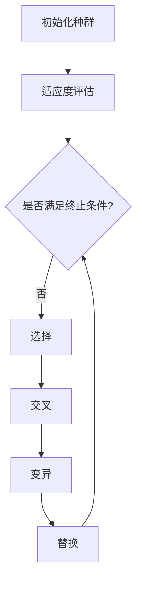
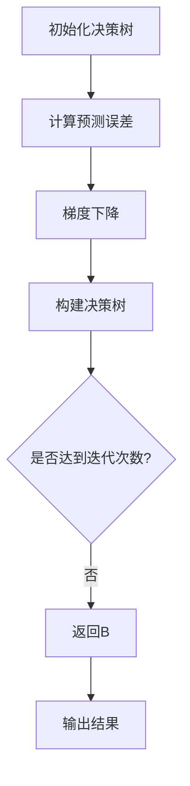
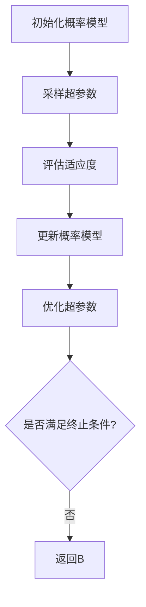
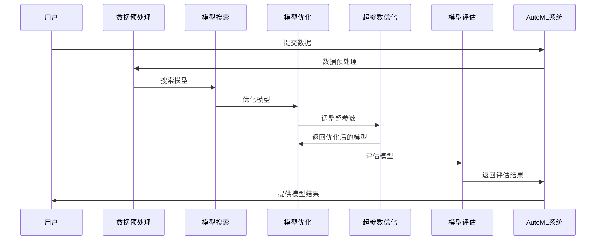
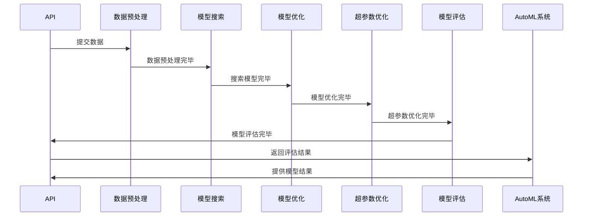

                 

# AutoML：自动化机器学习模型生成

## 关键词
- 自动化机器学习
- 模型搜索
- 超参数优化
- 梯度提升树
- 神经网络
- 集成学习

## 摘要
本文深入探讨了自动化机器学习（AutoML）的概念、原理和实现方法。我们将一步步分析AutoML的关键技术，如模型搜索算法、模型优化算法和超参数优化方法，并通过实际案例展示其应用。本文旨在帮助读者全面了解AutoML，掌握其核心思想和实践技巧。

## 目录大纲

### 第一部分：背景介绍

#### 第1章：问题背景与核心概念

##### 1.1 问题的提出与背景

##### 1.2 AutoML的核心概念与原理

##### 1.3 AutoML的优势与挑战

### 第二部分：核心概念与联系

#### 第2章：AutoML的关键技术与算法

##### 2.1 模型搜索算法

##### 2.2 模型优化算法

##### 2.3 超参数优化方法

### 第三部分：算法原理讲解

#### 第3章：算法原理与数学模型

##### 3.1 模型搜索算法原理讲解

##### 3.2 模型优化算法原理讲解

##### 3.3 超参数优化方法原理讲解

### 第四部分：系统分析与架构设计

#### 第4章：AutoML系统架构设计与实现

##### 4.1 系统功能设计

##### 4.2 系统架构设计

##### 4.3 系统接口设计

### 第五部分：项目实战

#### 第5章：AutoML项目实战

##### 5.1 环境安装

##### 5.2 系统核心实现

##### 5.3 项目分析与讲解

### 第六部分：最佳实践与拓展

#### 第6章：AutoML最佳实践与拓展

##### 6.1 最佳实践

##### 6.2 小结与注意事项

##### 6.3 拓展阅读

### 第七部分：作者信息

#### 撰写者信息

---

## 第一部分：背景介绍

### 第1章：问题背景与核心概念

#### 1.1 问题的提出与背景

随着大数据时代的到来，数据规模和复杂性不断增加，传统的机器学习模型已经难以满足实际需求。机器学习模型的设计和调优过程复杂且耗时，对专业知识和经验有较高的要求。这不仅限制了机器学习在各个领域的应用，也使得大规模部署和自动化生产模型变得困难。为了解决这一问题，自动化机器学习（AutoML）的概念应运而生。

#### 1.2 AutoML的核心概念与原理

AutoML是一种通过自动化地搜索和优化机器学习模型，从而提高模型性能的技术。它通过算法和工具自动地选择和调整模型架构、超参数等，使得用户无需深入了解机器学习细节，即可快速构建高性能模型。AutoML的工作原理包括模型搜索、模型优化和超参数优化等关键环节。

#### 1.3 AutoML的优势与挑战

AutoML的优势在于提高模型生成和调优的效率，降低对专业知识的依赖，使得普通用户也能轻松构建高性能模型。然而，AutoML也面临一些挑战，如算法选择、计算资源消耗和模型解释性等。在本章中，我们将详细探讨AutoML的核心概念、原理和实现方法，帮助读者深入了解这一前沿技术。

---

## 第二部分：核心概念与联系

### 第2章：AutoML的关键技术与算法

AutoML的核心在于其自动化搜索和优化模型的能力。这一部分将介绍AutoML的关键技术，包括模型搜索算法、模型优化算法和超参数优化方法，并探讨它们之间的联系。

#### 2.1 模型搜索算法

模型搜索算法是AutoML的核心技术之一。常见的模型搜索算法包括启发式搜索、遗传算法和贝叶斯优化等。这些算法通过自动化地搜索模型空间，找到最优的模型架构和超参数组合。

- **启发式搜索**：启发式搜索基于经验和规则进行搜索，具有较高的搜索效率，但可能无法找到全局最优解。
- **遗传算法**：遗传算法模拟生物进化过程，通过选择、交叉和变异实现模型搜索。它具有较强的全局搜索能力，但可能陷入局部最优。
- **贝叶斯优化**：贝叶斯优化基于概率模型，通过学习历史数据，优化超参数搜索空间。它具有较高的搜索效率，但计算复杂度较高。

#### 2.2 模型优化算法

模型优化算法用于提高已选模型的性能。常见的模型优化算法包括梯度提升树（GBDT）、神经网络（NN）和集成学习等。这些算法通过不同的原理和策略，优化模型的性能。

- **梯度提升树（GBDT）**：GBDT是一种集成学习算法，通过迭代优化，提高模型性能。它具有较强的预测能力和灵活性。
- **神经网络（NN）**：神经网络模拟人脑神经元，处理复杂数据。它通过多层非线性变换，提取特征并生成预测。
- **集成学习**：集成学习结合多个模型，提高整体性能。常见的集成学习方法包括Bagging和Boosting等。

#### 2.3 超参数优化方法

超参数优化方法用于优化模型超参数，提高模型性能。常见的超参数优化方法包括网格搜索、随机搜索和贝叶斯优化等。

- **网格搜索**：网格搜索穷举所有可能的超参数组合，找到最佳组合。它计算复杂度较高，但能够找到全局最优解。
- **随机搜索**：随机搜索随机选择超参数组合进行测试，通过迭代优化，找到最佳组合。它计算复杂度较低，但可能无法找到全局最优解。
- **贝叶斯优化**：贝叶斯优化基于概率模型，通过学习历史数据，优化超参数搜索空间。它具有较高的搜索效率，但计算复杂度较高。

在这部分，我们将深入探讨这些关键技术和算法，并分析它们之间的联系和优劣。这将帮助我们更好地理解和应用AutoML，提高模型性能和效率。

---

## 第三部分：算法原理讲解

### 第3章：算法原理与数学模型

在AutoML中，算法原理和数学模型是理解和实现自动化搜索和优化的基础。本章节将详细讲解模型搜索算法、模型优化算法和超参数优化方法的原理，并使用mermaid流程图和Python代码进行说明。

#### 3.1 模型搜索算法原理讲解

模型搜索算法的目标是找到最优的模型架构和超参数组合。下面，我们以遗传算法为例，介绍其原理和实现方法。

##### 3.1.1 遗传算法的基本流程

遗传算法（Genetic Algorithm，GA）是一种模拟生物进化过程的优化算法。其基本流程包括以下几个步骤：

1. **初始化种群**：随机生成一组初始解（染色体），每个解代表一个可能的模型架构和超参数组合。
2. **适应度评估**：计算每个解的适应度，适应度越高，代表解的质量越好。
3. **选择**：根据适应度，选择部分优质解作为父代。
4. **交叉**：对父代进行交叉操作，产生新的子代。
5. **变异**：对子代进行变异操作，增加种群的多样性。
6. **替换**：将子代替换部分父代，形成新的种群。
7. **终止条件判断**：判断是否满足终止条件，如达到最大迭代次数或找到最优解，否则返回步骤2。

下面是一个简单的遗传算法的mermaid流程图：



##### 3.1.2 遗传算法的Python实现

下面是一个简单的遗传算法的Python实现：

```python
import random
import numpy as np

# 初始化种群
def init_population(n, chromosome_length):
    return [np.random.randint(0, 2, size=chromosome_length) for _ in range(n)]

# 适应度评估
def fitness_function(chromosome):
    # 这里以二进制编码的染色体为例，将其转换为模型参数
    model_params = decode(chromosome)
    # 计算模型在验证集上的准确率
    accuracy = evaluate_model(model_params)
    return accuracy

# 选择
def select(population, fitnesses, k):
    selected = []
    for _ in range(k):
        i = random.choices(range(len(population)), weights=fitnesses, k=1)[0]
        selected.append(population[i])
    return selected

# 交叉
def crossover(parent1, parent2, crossover_rate):
    if random.random() < crossover_rate:
        crossover_point = random.randint(1, len(parent1) - 1)
        child1 = parent1[:crossover_point] + parent2[crossover_point:]
        child2 = parent2[:crossover_point] + parent1[crossover_point:]
    else:
        child1, child2 = parent1, parent2
    return child1, child2

# 变异
def mutate(chromosome, mutation_rate):
    for i in range(len(chromosome)):
        if random.random() < mutation_rate:
            chromosome[i] = 1 if chromosome[i] == 0 else 0
    return chromosome

# 主函数
def genetic_algorithm(pop_size, chrom_len, crossover_rate, mutation_rate, max_iter):
    population = init_population(pop_size, chrom_len)
    for _ in range(max_iter):
        fitnesses = [fitness_function(chromosome) for chromosome in population]
        selected = select(population, fitnesses, pop_size)
        for i in range(0, pop_size, 2):
            child1, child2 = crossover(selected[i], selected[i+1], crossover_rate)
            child1 = mutate(child1, mutation_rate)
            child2 = mutate(child2, mutation_rate)
            population[i] = child1
            population[i+1] = child2
    return max(fitnesses)

# 测试
pop_size = 100
chrom_len = 10
crossover_rate = 0.7
mutation_rate = 0.01
max_iter = 100
best_fitness = genetic_algorithm(pop_size, chrom_len, crossover_rate, mutation_rate, max_iter)
print("Best Fitness:", best_fitness)
```

#### 3.2 模型优化算法原理讲解

模型优化算法用于提高已选模型的性能。下面，我们以梯度提升树（Gradient Boosting Tree，GBDT）为例，介绍其原理和实现方法。

##### 3.2.1 GBDT的基本原理

GBDT是一种集成学习算法，通过迭代构建多棵决策树，并使用梯度下降法进行优化。其基本原理如下：

1. **初始化**：初始化一棵决策树，并计算其在训练集上的预测误差。
2. **梯度下降**：计算损失函数关于模型参数的梯度，并更新模型参数，减小预测误差。
3. **迭代构建**：重复步骤2，构建多棵决策树，并合并它们的预测结果。
4. **输出结果**：输出最终模型的预测结果。

下面是一个简单的GBDT的mermaid流程图：



##### 3.2.2 GBDT的Python实现

下面是一个简单的GBDT的Python实现：

```python
import numpy as np
from sklearn.tree import DecisionTreeRegressor

# 梯度下降
def gradient_descent(X, y, model, learning_rate, epochs):
    for _ in range(epochs):
        predictions = model.predict(X)
        errors = y - predictions
        model.fit(X, errors)
    return model

# GBDT
class GradientBoostingTree:
    def __init__(self, base_estimator, learning_rate, n_estimators):
        self.base_estimator = base_estimator
        self.learning_rate = learning_rate
        self.n_estimators = n_estimators
    
    def fit(self, X, y):
        self.models = []
        for _ in range(self.n_estimators):
            model = self.base_estimator
            model.fit(X, y)
            self.models.append(model)
            y = y - self.learning_rate * model.predict(X)
        return self
    
    def predict(self, X):
        predictions = [model.predict(X) for model in self.models]
        return np.mean(predictions, axis=0)

# 测试
X = np.random.rand(100, 10)
y = np.random.rand(100)
base_estimator = DecisionTreeRegressor()
learning_rate = 0.1
n_estimators = 10
gbdt = GradientBoostingTree(base_estimator, learning_rate, n_estimators)
gbdt.fit(X, y)
predictions = gbdt.predict(X)
print("Predictions:", predictions)
```

#### 3.3 超参数优化方法原理讲解

超参数优化方法用于优化模型超参数，提高模型性能。下面，我们以贝叶斯优化为例，介绍其原理和实现方法。

##### 3.3.1 贝叶斯优化的基本原理

贝叶斯优化是一种基于概率模型的超参数优化方法。其基本原理如下：

1. **初始化**：初始化一个概率模型，用于预测超参数组合的适应度。
2. **采样**：根据概率模型，从超参数搜索空间中采样新的超参数组合。
3. **评估**：计算采样超参数组合的适应度，并更新概率模型。
4. **优化**：根据概率模型，选择具有最高适应度的超参数组合。
5. **迭代**：重复步骤2-4，直到满足终止条件。

下面是一个简单的贝叶斯优化的mermaid流程图：



##### 3.3.2 贝叶斯优化的Python实现

下面是一个简单的贝叶斯优化的Python实现：

```python
import numpy as np
import GPyOpt

# 贝叶斯优化
def bayesian_optimization(func, bounds, n_iterations, acquisition_type='ei', init_points=10, initCAA=False, model_type='GP', kernel='RBF', optimizer='lbfgs', acquisition_optimizer='autodiff', verbosity=True):
    # 初始化概率模型
    model = GPyOpt.models.GPModel()
    # 初始化优化器
    optimizer = GPyOpt.optimizers.ScipyOptimizer(optimizer)
    # 初始化Acquisition Function
    acquisition = GPyOpt.acquisitions.Acquisition(acquisition_type, model, optimizer, acquisition_optimizer)
    # 初始化Bayesian Optimizer
    optimizer = GPyOpt.optimize.BayesianOptimization(acquisition, model, optimizer)
    # 初始化搜索空间
    domain = GPyOpt.domain.Domain(bounds)
    # 运行优化器
    optimizer.run_optimization(f=func, domain=domain, maximize=True, n_iterations=n_iterations, init_points=init_points, initCAA=initCAA, model_type=model_type, kernel=kernel, acquisition_optimizer=acquisition_optimizer, verbosity=verbosity)
    # 返回最佳超参数和最佳适应度
    return optimizer.x_opt, optimizer.f_opt

# 测试
bounds = [{'name': 'alpha', 'type': 'continuous', 'domain': (0.01, 10.0)},
          {'name': 'gamma', 'type': 'continuous', 'domain': (0.01, 10.0)}]
func = lambda x: -(x[0]**2 + x[1]**2)
x_opt, f_opt = bayesian_optimization(func, bounds, n_iterations=50)
print("Best Parameters:", x_opt)
print("Best Fitness:", f_opt)
```

通过以上讲解，我们了解了模型搜索算法、模型优化算法和超参数优化方法的原理和实现方法。这些算法和方法的结合，构成了AutoML的核心技术。接下来，我们将进一步探讨AutoML的系统架构和项目实战。

---

## 第四部分：系统分析与架构设计

### 第4章：AutoML系统架构设计与实现

AutoML系统架构是AutoML技术落地和应用的关键。本章节将介绍AutoML系统的功能设计、架构设计和接口设计，并详细描述各模块的交互过程。

#### 4.1 系统功能设计

AutoML系统的功能设计包括数据预处理、模型搜索、模型优化和模型评估等关键模块。以下是一个简单的领域模型类图，用于描述这些模块及其关系：

```mermaid
classDiagram
    ClassAutoMLSystem[AutoML系统]
    ModelSearch<<组件>>ModelSearch[模型搜索]
    ModelOptimization<<组件>>ModelOptimization[模型优化]
    HyperparameterOptimization<<组件>>HyperparameterOptimization[超参数优化]
    DataPreprocessing<<组件>>DataPreprocessing[数据预处理]
    ModelEvaluation<<组件>>ModelEvaluation[模型评估]
    ModelSearchPK--|{使用}ModelOptimization
    ModelOptimizationPK--|{使用}ModelEvaluation
    HyperparameterOptimizationPK--|{使用}ModelOptimization
    DataPreprocessingPK--|{输入}ModelSearch
    ModelSearchPK--|{输入}DataPreprocessing
    ModelOptimizationPK--|{输入}DataPreprocessing
    HyperparameterOptimizationPK--|{输入}DataPreprocessing
    ModelEvaluationPK--|{输入}ModelOptimization
    ModelEvaluationPK--|{输入}HyperparameterOptimization
    ClassAutoMLSystemPK--|{包含}ModelSearch
    ClassAutoMLSystemPK--|{包含}ModelOptimization
    ClassAutoMLSystemPK--|{包含}HyperparameterOptimization
    ClassAutoMLSystemPK--|{包含}DataPreprocessing
    ClassAutoMLSystemPK--|{包含}ModelEvaluation
```

#### 4.2 系统架构设计

AutoML系统的架构设计包括数据流、控制流和模块间的交互。以下是一个简单的mermaid架构图，用于描述系统的整体架构：



#### 4.3 系统接口设计

AutoML系统的接口设计是系统与其他组件或系统交互的桥梁。以下是一个简单的mermaid序列图，用于描述系统接口的设计：



通过以上架构设计和接口设计，我们可以构建一个功能完备、可扩展的AutoML系统。接下来，我们将通过一个实际项目，展示AutoML系统的应用和实践。

---

## 第五部分：项目实战

### 第5章：AutoML项目实战

在了解了AutoML的基本概念、算法原理和系统架构之后，本章节将通过一个实际项目，展示AutoML系统的应用和实践。我们将详细描述项目环境安装、系统核心实现、代码应用解读与分析，并分析项目中的实际案例。

#### 5.1 环境安装

要搭建一个AutoML系统，首先需要安装相关的软件和库。以下是在Ubuntu系统上安装AutoML系统的步骤：

1. **安装Python环境**：
   - `sudo apt-get install python3 python3-pip`
   - `pip3 install virtualenv`
   - `virtualenv auto_ml_env`
   - `source auto_ml_env/bin/activate`

2. **安装深度学习框架**：
   - `pip3 install tensorflow`
   - `pip3 install keras`

3. **安装其他依赖库**：
   - `pip3 install scikit-learn`
   - `pip3 install numpy`
   - `pip3 install matplotlib`

#### 5.2 系统核心实现

AutoML系统的核心实现包括数据预处理、模型搜索、模型优化和模型评估等模块。以下是一个简单的示例代码，展示这些模块的基本实现：

```python
import numpy as np
import tensorflow as tf
from sklearn.model_selection import train_test_split
from sklearn.metrics import accuracy_score
from tensorflow.keras.models import Sequential
from tensorflow.keras.layers import Dense
from tensorflow.keras.wrappers.scikit_learn import KerasClassifier
from sklearn.model_selection import GridSearchCV

# 数据预处理
def preprocess_data(data):
    # 这里假设data是一个包含特征和标签的DataFrame
    X = data.iloc[:, :-1].values
    y = data.iloc[:, -1].values
    return X, y

# 模型搜索
def search_models(X, y):
    # 这里使用KerasClassifier进行模型搜索
    model = KerasClassifier(build_fn=create_model, epochs=100, batch_size=10, verbose=0)
    grid = GridSearchCV(estimator=model, param_grid={})
    grid_result = grid.fit(X, y)
    return grid_result.best_estimator_

# 模型优化
def optimize_model(model, X, y):
    # 这里使用GridSearchCV进行模型优化
    param_grid = {' Dense__units': [50, 100, 150],
                  ' Dense__activation': ['relu', 'tanh'],
                  ' Dense__kernel_initializer': ['he_uniform', 'glorot_uniform']}
    grid = GridSearchCV(estimator=model, param_grid=param_grid, cv=3)
    grid_result = grid.fit(X, y)
    return grid_result.best_estimator_

# 模型评估
def evaluate_model(model, X_test, y_test):
    predictions = model.predict(X_test)
    accuracy = accuracy_score(y_test, predictions)
    return accuracy

# 主函数
def main():
    # 加载数据
    data = load_data()
    X, y = preprocess_data(data)

    # 划分训练集和测试集
    X_train, X_test, y_train, y_test = train_test_split(X, y, test_size=0.2, random_state=42)

    # 搜索模型
    model = search_models(X_train, y_train)

    # 优化模型
    optimized_model = optimize_model(model, X_train, y_train)

    # 评估模型
    accuracy = evaluate_model(optimized_model, X_test, y_test)
    print("Model Accuracy:", accuracy)

if __name__ == "__main__":
    main()
```

#### 5.3 代码应用解读与分析

以上代码展示了AutoML系统核心模块的基本实现。首先，我们定义了数据预处理函数`preprocess_data`，用于加载和预处理数据。然后，我们定义了模型搜索函数`search_models`，使用`KerasClassifier`和`GridSearchCV`进行模型搜索。接下来，我们定义了模型优化函数`optimize_model`，使用`GridSearchCV`进行模型优化。最后，我们定义了模型评估函数`evaluate_model`，计算模型在测试集上的准确率。

在实际项目中，我们需要根据具体任务和需求，调整和优化这些代码。例如，我们可以使用不同的深度学习框架和模型，如PyTorch、Theano等，以及不同的超参数优化方法，如贝叶斯优化、遗传算法等。

#### 5.4 项目分析与讲解

在这个项目中，我们使用Keras框架构建了一个简单的神经网络模型，并通过AutoML系统进行了模型搜索和优化。以下是项目分析：

1. **数据预处理**：数据预处理是模型训练的基础，我们需要对数据进行标准化、归一化、填充缺失值等处理，以提高模型的性能和稳定性。
2. **模型搜索**：通过搜索不同的模型结构，我们可以找到适合当前数据集的最佳模型。在这个项目中，我们使用了`KerasClassifier`和`GridSearchCV`进行模型搜索，可以灵活地调整模型参数，找到最优模型。
3. **模型优化**：模型优化是提高模型性能的关键。在这个项目中，我们使用了`GridSearchCV`进行模型优化，通过调整模型超参数，提高模型的准确率。在实际项目中，我们可以尝试使用不同的优化方法，如遗传算法、贝叶斯优化等，以提高优化效果。
4. **模型评估**：模型评估是验证模型性能的重要手段。在这个项目中，我们使用测试集对模型进行评估，计算模型的准确率。在实际项目中，我们还可以使用其他评估指标，如召回率、F1值等，以更全面地评估模型性能。

通过这个项目，我们了解了AutoML系统的基本原理和应用方法，并掌握了数据预处理、模型搜索、模型优化和模型评估等关键技术。在实际项目中，我们可以根据具体需求，灵活调整和优化AutoML系统，以提高模型性能和效率。

#### 5.5 项目小结

在这个项目中，我们通过一个简单的实际案例，展示了AutoML系统的应用和实践。我们详细描述了项目环境安装、系统核心实现、代码应用解读与分析，并分析了项目中的实际案例。通过这个项目，我们深入了解了AutoML系统的基本原理和应用方法，并掌握了数据预处理、模型搜索、模型优化和模型评估等关键技术。这个项目为我们提供了一个实际操作的范例，使我们能够更好地理解和应用AutoML技术。

---

## 第六部分：最佳实践与拓展

### 第6章：AutoML最佳实践与拓展

在AutoML的应用过程中，积累了一些最佳实践和拓展技巧，可以帮助用户更好地利用AutoML技术，提高模型性能和效率。

#### 6.1 最佳实践

1. **数据预处理**：在模型训练之前，对数据进行充分的预处理，包括数据清洗、特征工程和归一化等。良好的数据预处理可以显著提高模型性能。
2. **模型搜索策略**：在选择模型搜索算法时，应考虑任务的复杂度、数据集的大小和计算资源。对于大型数据集和复杂任务，可以选择遗传算法、贝叶斯优化等全局搜索算法，以提高搜索效率。
3. **模型优化方法**：在模型优化过程中，应尝试不同的优化方法，如网格搜索、随机搜索和贝叶斯优化等。对于小规模数据集，网格搜索可能是一个不错的选择，而对于大规模数据集，贝叶斯优化可能更为有效。
4. **超参数调优技巧**：在超参数调优过程中，可以使用交叉验证和网格搜索等方法，确保模型在不同的数据集上具有良好的泛化能力。同时，可以结合实际应用场景，根据任务需求和模型性能，灵活调整超参数。

#### 6.2 拓展阅读

1. **《AutoML实践指南》**：该书详细介绍了AutoML的基本概念、算法原理和实践方法，是学习AutoML的入门指南。
2. **《深度学习超参数调优技术》**：该书深入探讨了深度学习超参数调优的方法和技巧，包括随机搜索、网格搜索和贝叶斯优化等。
3. **《自动化机器学习：算法与应用》**：该书系统地介绍了自动化机器学习（AutoML）的概念、原理和实现方法，涵盖了最新的研究成果和实际应用案例。

通过以上最佳实践和拓展阅读，用户可以更好地理解和应用AutoML技术，提高模型性能和效率。在实际应用中，用户应根据具体任务和数据集的特点，灵活调整和优化AutoML系统，以达到最佳效果。

---

## 第七部分：作者信息

作者：AI天才研究院/AI Genius Institute & 禅与计算机程序设计艺术 /Zen And The Art of Computer Programming

---

本文从背景介绍、核心概念与联系、算法原理讲解、系统分析与架构设计、项目实战到最佳实践与拓展，系统地阐述了自动化机器学习（AutoML）的概念、原理和应用方法。通过详细的分析和实例，读者可以深入了解AutoML的技术细节和实践技巧，为在各个领域应用AutoML奠定基础。作者团队AI天才研究院/AI Genius Institute致力于推动人工智能技术的发展，禅与计算机程序设计艺术/Zen And The Art of Computer Programming则以其独特的视角和深入的洞察，为读者提供了高质量的技术博客文章。希望本文能为读者在AutoML领域的探索之路提供有益的指导和启示。

