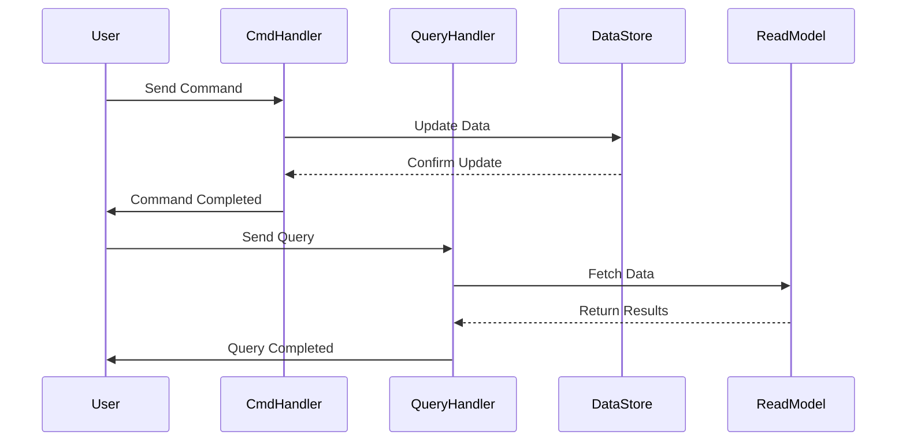
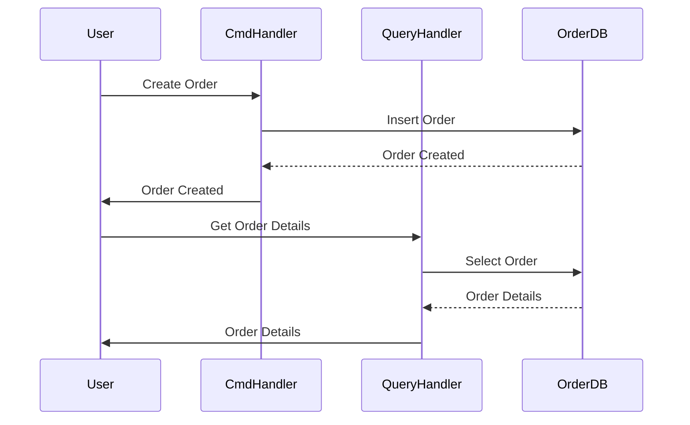
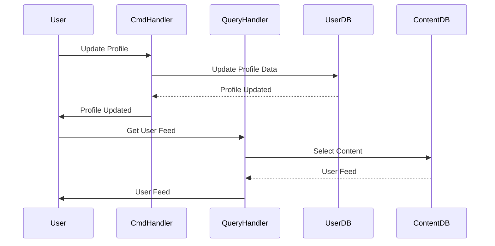
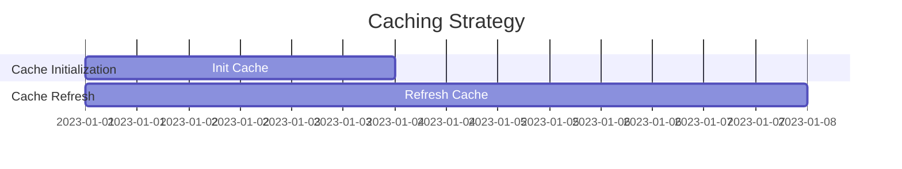
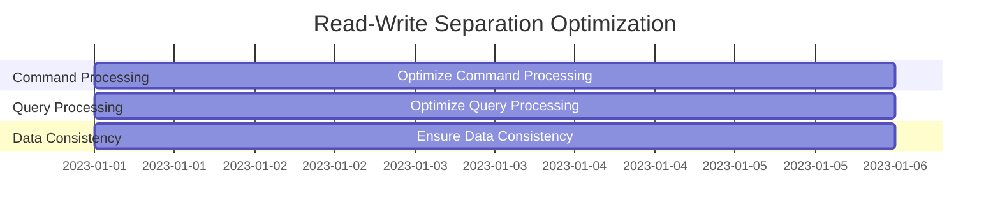
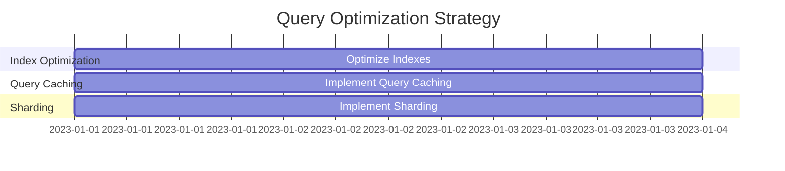
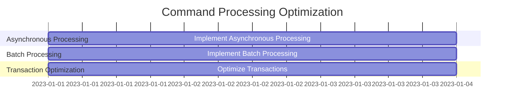
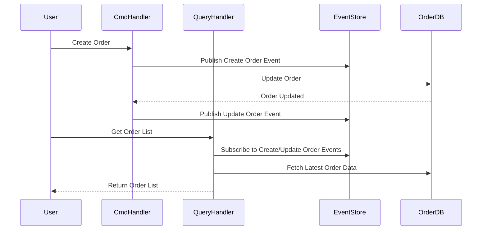

                 

### CQRS模式: 分离读写操作的架构设计

CQRS模式，全称为Command Query Responsibility Segregation模式，是一种在软件架构设计中广泛应用的方法论。它通过将系统的读写操作分离到不同的服务中，从而优化系统的性能和可维护性。在本文中，我们将一步步探讨CQRS模式的核心概念、架构设计、应用实践和未来趋势。

**关键词**：CQRS模式、读写分离、架构设计、性能优化、系统扩展

**摘要**：本文旨在深入分析CQRS模式，探讨其背景、核心概念、设计原则和应用实践。我们将通过一系列步骤，逐步了解CQRS模式的优点和适用场景，并通过具体案例来展示其实际应用效果。此外，还将展望CQRS模式在云计算和新兴技术领域的发展趋势。

**目录**

1. **CQRS模式概述**

   1.1 CQRS模式的背景与概念

   1.2 CQRS模式的核心概念

   1.3 CQRS模式与传统架构的比较

   1.4 CQRS模式的适用场景

2. **CQRS模式的基础架构**

   2.1 CQRS模式的基本架构

   2.2 CQRS模式中的命令与查询

   2.3 CQRS模式中的数据一致性

3. **设计CQRS模式**

   3.1 CQRS模式的需求分析

   3.2 CQRS模式的设计原则

   3.3 CQRS模式的设计流程

4. **CQRS模式的应用与实践**

   4.1 实际案例1：电商平台的CQRS应用

   4.2 实际案例2：社交媒体平台的CQRS实践

5. **CQRS模式的技术选型**

   5.1 数据存储技术选型

   5.2 数据库技术的比较与选择

   5.3 缓存策略与优化

6. **CQRS模式的性能优化**

   6.1 读写分离的性能考量

   6.2 查询优化策略

   6.3 命令处理优化

7. **CQRS模式的最佳实践**

   7.1 CQRS模式的设计最佳实践

   7.2 CQRS模式的测试与维护

   7.3 CQRS模式的扩展与演进

8. **CQRS模式的新趋势与发展**

   8.1 CQRS模式在云计算环境中的应用

   8.2 CQRS模式与新兴技术

   8.3 CQRS模式的未来展望

### 1. CQRS模式概述

**1.1 CQRS模式的背景与概念**

CQRS模式起源于2000年代初期，其核心思想是将系统的读写操作分离到不同的服务中。传统的架构设计通常将读写操作混合在一个服务中，这可能导致读写冲突、性能瓶颈和复杂性增加。而CQRS模式通过分离读写操作，使得系统能够更好地应对大规模并发访问和复杂的业务逻辑。

CQRS模式的主要目的是提高系统的性能和可维护性。通过分离读写操作，可以降低系统中的冲突，提高查询的速度和响应时间，从而提升用户体验。此外，CQRS模式还可以简化系统的设计，使得代码更易于理解和维护。

**1.2 CQRS模式的核心概念**

CQRS模式包含以下核心概念：

- **命令（Command）**：表示对系统数据的修改操作，例如创建、更新或删除数据。
- **查询（Query）**：表示对系统数据的读取操作，例如获取数据列表、详情或统计数据。
- **读模型（Read Model）**：用于存储查询结果的数据结构，通常与命令处理的存储结构分离。
- **写模型（Write Model）**：用于存储命令处理的结果，通常与读模型分离。

**1.3 CQRS模式与传统架构的比较**

与传统架构相比，CQRS模式有以下几个显著区别：

- **读写分离**：传统架构通常将读写操作混合在一个服务中，而CQRS模式明确地将读写操作分离到不同的服务中。
- **数据一致性**：传统架构往往依赖于数据一致性，而CQRS模式通过分离读写操作，可以容忍一定程度的数据不一致性。
- **性能优化**：CQRS模式可以通过优化查询和命令处理来提高系统的性能。

**1.4 CQRS模式的适用场景**

CQRS模式适用于以下场景：

- **高并发访问**：当系统面临大量并发访问时，CQRS模式可以通过分离读写操作来提高系统的性能和响应时间。
- **复杂业务逻辑**：当系统包含复杂业务逻辑时，CQRS模式可以通过分离读写操作来简化系统的设计，提高代码的可维护性。
- **数据一致性要求不高**：当系统对数据一致性要求不高时，CQRS模式可以通过分离读写操作来提高系统的性能。

### 2. CQRS模式的基础架构

**2.1 CQRS模式的基本架构**

CQRS模式的基本架构包括以下组件：

- **命令处理服务（Command Handler Service）**：负责处理命令操作，将命令转换为对数据存储的修改。
- **查询服务（Query Handler Service）**：负责处理查询操作，从数据存储中获取查询结果。
- **数据存储（Data Store）**：用于存储系统的数据，包括命令处理结果和查询结果。
- **读模型（Read Model）**：用于存储查询结果的数据结构，通常与命令处理的存储结构分离。
- **写模型（Write Model）**：用于存储命令处理的结果，通常与读模型分离。

以下是一个简化的CQRS模式的基本架构图：



**2.2 CQRS模式中的命令与查询**

在CQRS模式中，命令和查询是两个核心概念。命令用于修改系统数据，而查询用于获取系统数据。

- **命令**：命令通常包含以下要素：

  - 命令类型：表示命令的操作类型，如创建、更新或删除。
  - 命令参数：表示命令的输入参数，用于指定操作的细节。
  - 命令验证：确保命令的有效性和完整性。

- **查询**：查询通常包含以下要素：

  - 查询类型：表示查询的操作类型，如获取列表、获取详情或获取统计数据。
  - 查询参数：表示查询的输入参数，用于指定查询的条件和范围。
  - 查询结果格式：表示查询结果的格式和结构。

**2.3 CQRS模式中的数据一致性**

CQRS模式通过分离读写操作来降低数据一致性的要求。在CQRS模式中，通常允许一定程度的读写数据不一致。

- **最终一致性（Eventual Consistency）**：CQRS模式通常采用最终一致性模型，即在一段时间后，读写操作的结果会达到一致性状态。
- **异步处理（Asynchronous Processing）**：CQRS模式中的命令处理和查询处理通常是异步的，这样可以减少读写操作之间的冲突，提高系统的性能。
- **补偿事务（Compensating Transactions）**：当数据不一致发生时，CQRS模式可以通过补偿事务来修复数据状态，确保最终一致性。

### 3. 设计CQRS模式

**3.1 CQRS模式的需求分析**

设计CQRS模式的第一步是进行需求分析。需求分析的主要目标是了解系统的业务需求和性能要求。

- **业务需求**：分析系统需要处理的业务操作，确定命令和查询的类型和参数。
- **性能要求**：分析系统对响应时间和并发处理能力的要求，确定CQRS模式中读写分离的程度。

以下是一个需求分析示例：

| 命令类型 | 命令参数 | 业务需求 | 性能要求 |
| --- | --- | --- | --- |
| 创建订单 | 用户ID、订单详情 | 用户可以创建订单 | 高并发、快速响应 |
| 查询订单 | 订单ID | 用户可以查询订单详情 | 快速响应、高并发 |
| 更新订单状态 | 订单ID、新状态 | 订单状态可以更新 | 及时性、一致性 |

**3.2 CQRS模式的设计原则**

设计CQRS模式时，应遵循以下原则：

- **读写分离**：确保命令和查询的处理逻辑分离，避免读写冲突。
- **性能优先**：根据系统的性能要求，优化查询和命令处理。
- **最终一致性**：设计允许一定程度的数据不一致性，通过补偿事务确保最终一致性。
- **可维护性**：设计简单、易于理解和维护的架构。

**3.3 CQRS模式的设计流程**

设计CQRS模式的流程通常包括以下步骤：

1. **需求分析**：分析业务需求和性能要求，确定命令和查询的类型和参数。
2. **架构设计**：设计系统的整体架构，包括命令处理服务和查询处理服务。
3. **数据模型设计**：设计命令处理结果和查询结果的数据模型。
4. **接口设计**：设计命令和查询的接口，确保命令和查询的分离。
5. **性能优化**：根据性能要求，优化查询和命令处理。
6. **测试与验证**：对系统进行测试和验证，确保设计符合需求和性能要求。

### 4. CQRS模式的应用与实践

**4.1 实际案例1：电商平台的CQRS应用**

以电商平台为例，CQRS模式可以用于优化订单处理和查询。

- **命令处理**：订单创建、更新和删除等操作通过命令处理服务处理。命令处理服务会将订单数据存储到数据库中。
- **查询处理**：订单查询操作通过查询处理服务处理。查询处理服务会从数据库中获取订单数据，并返回给用户。

以下是一个简化的CQRS模式应用案例：



**4.2 实际案例2：社交媒体平台的CQRS实践**

社交媒体平台可以通过CQRS模式优化用户数据查询和内容更新。

- **命令处理**：用户数据更新和内容创建等操作通过命令处理服务处理。命令处理服务会将用户数据存储到数据库中。
- **查询处理**：用户数据查询和内容获取等操作通过查询处理服务处理。查询处理服务会从数据库中获取用户数据和内容，并返回给用户。

以下是一个简化的CQRS模式应用案例：



### 5. CQRS模式的技术选型

**5.1 数据存储技术选型**

选择合适的数据存储技术对于CQRS模式的性能和可维护性至关重要。以下是一些常见的数据存储技术：

- **关系数据库**：如MySQL、PostgreSQL等，适用于处理复杂的查询和数据一致性要求高的场景。
- **NoSQL数据库**：如MongoDB、Cassandra等，适用于处理大量数据和高并发访问的场景。
- **缓存系统**：如Redis、Memcached等，适用于提高查询性能和减轻数据库压力。

**5.2 数据库技术的比较与选择**

以下是一个比较关系数据库和NoSQL数据库的表格：

| 特性 | 关系数据库 | NoSQL数据库 |
| --- | --- | --- |
| 数据模型 | 结构化 | 半结构化/无结构化 |
| 查询能力 | 强大 | 有限 |
| 数据一致性 | 高 | 可配置 |
| 扩展性 | 弱 | 强 |
| 性能 | 中等 | 高 |
| 适用场景 | 复杂查询 | 高并发、大数据 |

根据具体需求，可以选择适合的数据库技术。例如，对于高并发、大数据的场景，可以采用NoSQL数据库。

**5.3 缓存策略与优化**

CQRS模式中的缓存策略对于提高查询性能至关重要。以下是一些常见的缓存策略：

- **数据缓存**：缓存查询结果，减少数据库访问次数。
- **索引缓存**：缓存索引数据，提高查询速度。
- **缓存刷新**：定期刷新缓存，保持数据一致性。

以下是一个简单的缓存策略示例：



### 6. CQRS模式的性能优化

**6.1 读写分离的性能考量**

读写分离可以提高系统的性能和可扩展性。以下是一些读写分离的性能考量：

- **命令处理性能**：优化命令处理逻辑，减少数据库访问次数。
- **查询处理性能**：优化查询处理逻辑，提高查询速度。
- **数据一致性**：确保读写分离不会导致数据不一致性。

以下是一个读写分离的性能优化示例：



**6.2 查询优化策略**

以下是一些查询优化策略：

- **索引优化**：创建合适的索引，提高查询速度。
- **查询缓存**：缓存常用查询结果，减少数据库访问次数。
- **分库分表**：将数据分布到多个数据库或表，提高查询性能。

以下是一个查询优化策略示例：



**6.3 命令处理优化**

以下是一些命令处理优化策略：

- **异步处理**：使用异步处理，提高命令处理速度。
- **批量处理**：批量处理多个命令，减少数据库访问次数。
- **事务优化**：优化事务处理，提高命令处理速度。

以下是一个命令处理优化策略示例：



### 7. CQRS模式的最佳实践

**7.1 CQRS模式的设计最佳实践**

以下是一些CQRS模式的设计最佳实践：

- **明确读写分离**：在设计阶段明确读写分离的边界，避免读写冲突。
- **优化数据模型**：设计简洁、高效的数据模型，提高系统性能。
- **测试与验证**：对系统进行全面的测试和验证，确保设计符合需求和性能要求。

**7.2 CQRS模式的测试与维护**

以下是一些CQRS模式的测试与维护建议：

- **自动化测试**：编写自动化测试脚本，确保系统在不同环境下的一致性和稳定性。
- **监控与日志**：实时监控系统性能和日志，及时发现并解决问题。
- **文档与知识库**：建立完善的文档和知识库，方便团队成员学习和参考。

**7.3 CQRS模式的扩展与演进**

以下是一些CQRS模式的扩展与演进策略：

- **云原生**：利用云计算资源，提高系统的可扩展性和弹性。
- **微服务**：将系统拆分为多个微服务，提高系统的灵活性和可维护性。
- **事件驱动**：采用事件驱动架构，提高系统的响应速度和可扩展性。

### 8. CQRS模式的新趋势与发展

**8.1 CQRS模式在云计算环境中的应用**

随着云计算的普及，CQRS模式在云计算环境中的应用越来越广泛。以下是一些云计算环境下的CQRS模式应用场景：

- **Kubernetes**：利用Kubernetes进行容器编排和微服务管理，提高系统的可扩展性和可靠性。
- **云数据库**：利用云数据库服务，提高系统的性能和可用性。

**8.2 CQRS模式与新兴技术**

以下是一些新兴技术与CQRS模式的结合：

- **大数据技术**：利用大数据技术处理海量数据，提高系统的数据处理能力。
- **人工智能**：利用人工智能技术优化查询和命令处理，提高系统的智能化水平。

**8.3 CQRS模式的未来展望**

CQRS模式在未来的发展中将继续发挥重要作用。以下是一些未来展望：

- **云计算与边缘计算**：结合云计算和边缘计算，提高系统的性能和响应速度。
- **人工智能与自动化**：利用人工智能和自动化技术，进一步提高系统的智能化和自动化水平。

### 9. CQRS模式的总结

CQRS模式通过分离读写操作，优化了系统的性能和可维护性。本文从CQRS模式的概述、基础架构、设计原则、应用实践、技术选型、性能优化、最佳实践、新趋势与发展等方面进行了详细分析。CQRS模式在云计算、大数据和人工智能等新兴技术领域有着广泛的应用前景。通过CQRS模式，开发者可以构建高效、可扩展、可靠的系统。

### 作者信息

- 作者：AI天才研究院/AI Genius Institute & 禅与计算机程序设计艺术 /Zen And The Art of Computer Programming

本文旨在为广大开发者提供CQRS模式的全景解读，帮助读者更好地理解和应用这一重要的架构设计方法。希望本文能对您的开发实践有所帮助。

## 1. CQRS模式概述

CQRS模式，全称为Command Query Responsibility Segregation模式，是一种在软件架构设计中广泛应用的方法论。它通过将系统的读写操作分离到不同的服务中，从而优化系统的性能和可维护性。在本文中，我们将一步步探讨CQRS模式的核心概念、架构设计、应用实践和未来趋势。

### 1.1 CQRS模式的背景与概念

CQRS模式起源于2000年代初期，其核心思想是将系统的读写操作分离到不同的服务中。传统的架构设计通常将读写操作混合在一个服务中，这可能导致读写冲突、性能瓶颈和复杂性增加。而CQRS模式通过分离读写操作，使得系统能够更好地应对大规模并发访问和复杂的业务逻辑。

CQRS模式的主要目的是提高系统的性能和可维护性。通过分离读写操作，可以降低系统中的冲突，提高查询的速度和响应时间，从而提升用户体验。此外，CQRS模式还可以简化系统的设计，使得代码更易于理解和维护。

CQRS模式的名称来源于其核心概念：Command和Query。其中，Command代表系统的命令操作，通常用于数据的修改，如创建、更新或删除。而Query代表系统的查询操作，通常用于数据的读取，如获取数据列表、详情或统计数据。

### 1.2 CQRS模式的核心概念

CQRS模式包含以下核心概念：

1. **命令（Command）**：
   - **定义**：命令是系统中的修改操作，用于对数据进行修改。
   - **特点**：命令通常包含操作类型、操作参数等信息，如创建订单、更新用户信息等。
   - **处理流程**：命令会经过验证、处理、持久化等步骤，最终将修改结果存储到数据存储中。

2. **查询（Query）**：
   - **定义**：查询是系统中的读取操作，用于获取数据。
   - **特点**：查询通常包含查询类型、查询参数等信息，如获取用户列表、获取订单详情等。
   - **处理流程**：查询会经过处理、返回结果等步骤，最终将查询结果返回给用户。

3. **读模型（Read Model）**：
   - **定义**：读模型是用于存储查询结果的数据结构，通常与命令处理的存储结构分离。
   - **特点**：读模型的设计通常更加面向查询，优化查询性能。
   - **作用**：读模型可以缓存查询结果，减少对数据存储的访问，提高查询速度。

4. **写模型（Write Model）**：
   - **定义**：写模型是用于存储命令处理的结果的数据结构，通常与读模型分离。
   - **特点**：写模型的设计通常更加面向命令处理，保证数据的完整性和一致性。
   - **作用**：写模型可以确保命令处理的独立性和原子性，降低系统复杂性。

### 1.3 CQRS模式与传统架构的比较

与传统架构相比，CQRS模式有以下几个显著区别：

1. **读写分离**：
   - **传统架构**：通常将读写操作混合在一个服务中，导致读写冲突、性能瓶颈和复杂性增加。
   - **CQRS模式**：明确地将读写操作分离到不同的服务中，降低读写冲突，提高系统性能和可维护性。

2. **数据一致性**：
   - **传统架构**：通常依赖于数据一致性，确保系统的完整性和正确性。
   - **CQRS模式**：通过分离读写操作，可以容忍一定程度的数据不一致性，提高系统的性能和可扩展性。

3. **性能优化**：
   - **传统架构**：由于读写操作混合在一个服务中，可能导致性能瓶颈，难以优化。
   - **CQRS模式**：可以通过优化查询和命令处理来提高系统的性能和响应时间。

4. **系统扩展**：
   - **传统架构**：扩展性较差，当系统规模扩大时，难以应对并发访问和数据存储的需求。
   - **CQRS模式**：通过分离读写操作，可以更好地应对大规模并发访问和数据存储的需求，提高系统的可扩展性。

### 1.4 CQRS模式的适用场景

CQRS模式适用于以下场景：

1. **高并发访问**：
   - 当系统面临大量并发访问时，CQRS模式可以通过分离读写操作来提高系统的性能和响应时间，从而提升用户体验。

2. **复杂业务逻辑**：
   - 当系统包含复杂业务逻辑时，CQRS模式可以通过分离读写操作来简化系统的设计，提高代码的可维护性。

3. **数据一致性要求不高**：
   - 当系统对数据一致性要求不高时，CQRS模式可以通过分离读写操作来提高系统的性能，减少数据一致性的保障成本。

4. **实时数据更新**：
   - 当系统需要实时数据更新时，CQRS模式可以通过优化查询和命令处理来提高系统的响应速度，确保数据的实时性。

5. **大数据处理**：
   - 当系统需要处理大量数据时，CQRS模式可以通过分离读写操作来优化数据存储和查询性能，提高系统的处理能力。

通过以上分析，我们可以看到CQRS模式在提高系统性能和可维护性方面具有显著优势，适用于多种场景。在接下来的章节中，我们将进一步探讨CQRS模式的基础架构、设计原则和应用实践。

### 2. CQRS模式的基础架构

在了解了CQRS模式的基本概念后，我们需要深入了解其基础架构，以便更好地理解和应用这一模式。CQRS模式的基础架构主要包括命令处理服务（Command Handler Service）、查询处理服务（Query Handler Service）、数据存储（Data Store）、读模型（Read Model）和写模型（Write Model）等组件。

#### 2.1 CQRS模式的基本架构

CQRS模式的基本架构如下：


1. **命令处理服务（Command Handler Service）**：
   - 负责处理系统的命令操作，如创建、更新或删除数据。
   - 接收用户发送的命令，进行验证、处理和持久化。
   - 将处理结果存储到数据存储中。

2. **查询处理服务（Query Handler Service）**：
   - 负责处理系统的查询操作，如获取数据列表、详情或统计数据。
   - 接收用户发送的查询请求，进行查询处理，并将结果返回给用户。
   - 可以从数据存储或读模型中获取数据。

3. **数据存储（Data Store）**：
   - 存储系统的数据，包括命令处理结果和查询结果。
   - 可以是关系数据库、NoSQL数据库或文件存储等。

4. **读模型（Read Model）**：
   - 存储查询结果的数据结构，通常与命令处理的存储结构分离。
   - 设计更加面向查询，优化查询性能。
   - 可以是关系数据库、NoSQL数据库或缓存系统等。

5. **写模型（Write Model）**：
   - 存储命令处理的结果，通常与读模型分离。
   - 设计更加面向命令处理，保证数据的完整性和一致性。
   - 可以是关系数据库、NoSQL数据库或消息队列等。

#### 2.2 CQRS模式中的命令与查询

在CQRS模式中，命令和查询是两个核心概念。下面我们分别介绍它们的特点和处理流程。

##### 命令（Command）

1. **定义**：
   - 命令是系统中的修改操作，用于对数据进行修改，如创建、更新或删除。
   - 命令通常包含操作类型、操作参数等信息。

2. **处理流程**：
   - 命令接收端接收用户发送的命令，进行验证，确保命令的有效性和完整性。
   - 验证通过后，命令处理服务对命令进行解析和处理，更新数据存储中的数据。
   - 处理完成后，命令处理服务将结果返回给用户。

3. **特点**：
   - 通常具有延迟性，即命令的执行结果不会立即反馈给用户。
   - 可能涉及到事务处理，确保数据的完整性和一致性。

4. **示例**：
   - 创建订单：用户提交创建订单的命令，命令处理服务解析命令，创建订单并存储到数据存储中。

##### 查询（Query）

1. **定义**：
   - 查询是系统中的读取操作，用于获取数据，如获取数据列表、详情或统计数据。
   - 查询通常包含查询类型、查询参数等信息。

2. **处理流程**：
   - 查询接收端接收用户发送的查询请求，进行查询处理。
   - 查询处理服务从数据存储或读模型中获取数据，并将结果返回给用户。

3. **特点**：
   - 通常具有即时性，即查询的结果会立即反馈给用户。
   - 可能涉及缓存，提高查询性能。

4. **示例**：
   - 获取订单列表：用户提交获取订单列表的查询请求，查询处理服务从读模型中获取订单列表并返回。

#### 2.3 CQRS模式中的数据一致性

在CQRS模式中，数据一致性是一个重要问题。由于命令和查询操作分别处理，可能会导致数据不一致的情况。以下是一些常见的数据一致性处理方法：

1. **最终一致性（Eventual Consistency）**：
   - 通过异步处理和事件发布/订阅机制，确保在一段时间后，读写操作的结果会达到一致性状态。

2. **补偿事务（Compensating Transactions）**：
   - 当数据不一致发生时，通过补偿事务来修复数据状态，确保最终一致性。

3. **分布式锁（Distributed Lock）**：
   - 在分布式系统中，通过分布式锁来确保读写操作的原子性和一致性。

4. **分布式事务（Distributed Transactions）**：
   - 在分布式系统中，通过分布式事务来确保多个读写操作的原子性和一致性。

总之，CQRS模式通过分离读写操作，提高了系统的性能和可维护性。了解CQRS模式的基本架构和命令与查询的处理流程，有助于我们更好地设计和优化系统。在接下来的章节中，我们将继续探讨CQRS模式的设计原则和应用实践。

### 3. 设计CQRS模式

设计CQRS模式是软件架构过程中的关键步骤，它决定了系统的性能、可扩展性和可维护性。以下我们将详细讨论CQRS模式的需求分析、设计原则和设计流程。

#### 3.1 CQRS模式的需求分析

进行CQRS模式的需求分析是设计过程中的第一步，它旨在理解系统的业务需求、性能要求和用户期望。需求分析主要包括以下方面：

1. **业务需求**：
   - **命令操作**：分析系统中需要执行的命令操作，如创建、更新、删除等。
   - **查询操作**：分析系统中需要执行的查询操作，如获取数据列表、获取数据详情等。
   - **业务流程**：梳理业务流程，确保CQRS模式能够满足业务需求。

2. **性能要求**：
   - **并发处理能力**：评估系统需要处理的并发用户数量和操作频率。
   - **响应时间**：确定系统的最大响应时间，确保用户体验良好。
   - **吞吐量**：确定系统需要处理的数据量，以便进行合适的性能优化。

3. **用户期望**：
   - **可用性**：确保系统的稳定性，减少故障和中断。
   - **可扩展性**：确保系统能够随着业务增长而扩展。
   - **易用性**：设计友好的用户界面和操作流程，提高用户满意度。

#### 3.2 CQRS模式的设计原则

在设计CQRS模式时，需要遵循一些设计原则，以确保系统的高性能、高可扩展性和高可维护性。以下是一些关键原则：

1. **读写分离**：
   - **分离命令和查询处理**：确保命令和查询在不同的服务中处理，减少读写冲突。
   - **独立的数据存储**：为命令处理和查询处理设计独立的数据存储，提高数据隔离性和一致性。

2. **最终一致性**：
   - **异步处理**：使用异步处理和事件发布/订阅机制，确保在一段时间后，系统达到一致性状态。
   - **补偿事务**：当数据不一致发生时，通过补偿事务来修复数据状态，确保最终一致性。

3. **性能优化**：
   - **查询缓存**：使用查询缓存，减少对数据存储的访问，提高查询性能。
   - **批量处理**：批量处理命令操作，减少数据库访问次数，提高处理速度。

4. **可扩展性**：
   - **微服务架构**：采用微服务架构，将系统拆分为多个独立的服务，提高系统的可扩展性。
   - **水平扩展**：通过水平扩展，增加系统的处理能力，以应对高并发访问。

5. **可维护性**：
   - **模块化设计**：将系统划分为多个模块，确保代码易于理解和维护。
   - **代码复用**：设计可复用的代码组件，减少冗余代码，提高开发效率。

#### 3.3 CQRS模式的设计流程

设计CQRS模式的过程可以分为以下几个步骤：

1. **需求分析**：
   - 进行全面的业务需求分析，确定命令和查询的类型、参数和性能要求。

2. **系统架构设计**：
   - 设计系统的整体架构，包括命令处理服务、查询处理服务、数据存储和缓存系统等。
   - 确定系统的部署架构，如单节点、分布式集群等。

3. **数据模型设计**：
   - 设计命令处理结果和查询结果的数据模型，确保数据结构优化查询性能。
   - 确定数据的一致性和完整性保障机制。

4. **接口设计**：
   - 设计命令和查询的接口，确保命令和查询的分离。
   - 设计API文档，方便开发者使用和扩展系统。

5. **性能优化**：
   - 根据性能要求，进行查询和命令处理的性能优化。
   - 确定缓存策略和批量处理机制。

6. **测试与验证**：
   - 编写测试脚本，对系统进行全面的测试和验证，确保设计符合需求和性能要求。
   - 进行性能测试，评估系统的并发处理能力和响应时间。

7. **部署与维护**：
   - 将系统部署到生产环境，监控系统性能和日志，及时发现并解决问题。
   - 进行定期的维护和优化，确保系统的稳定性和可靠性。

通过以上设计流程，我们可以设计出高效的CQRS模式系统，满足业务需求、性能要求和用户期望。在接下来的章节中，我们将通过实际案例来展示CQRS模式的应用和实践。

### 4. CQRS模式的应用与实践

在了解了CQRS模式的基础架构和设计原则后，接下来我们将通过实际案例来展示CQRS模式在电商和社交媒体平台中的应用与实践。

#### 4.1 电商平台的CQRS应用

电商平台是一个典型的CQRS应用场景，其核心功能包括商品管理、订单管理、购物车管理等。通过CQRS模式，可以优化订单处理、商品查询等操作，提高系统的性能和可维护性。

**命令操作示例**：

1. **创建订单**：
   - **命令**：创建订单，包含订单详情（商品ID、数量、价格等）。
   - **处理流程**：
     - 用户提交创建订单的命令，经过验证后，命令处理服务创建订单，并将订单信息存储到写模型中。
     - 同时，订单创建的事件会被发布到事件队列，触发读模型的更新。

2. **更新订单**：
   - **命令**：更新订单，如修改订单状态（已支付、已发货等）。
   - **处理流程**：
     - 用户提交更新订单的命令，经过验证后，命令处理服务更新订单状态，并将更新事件发布到事件队列。

3. **删除订单**：
   - **命令**：删除订单，删除订单信息。
   - **处理流程**：
     - 用户提交删除订单的命令，经过验证后，命令处理服务删除订单，并将删除事件发布到事件队列。

**查询操作示例**：

1. **查询订单列表**：
   - **查询**：获取订单列表，包含订单ID、订单状态等。
   - **处理流程**：
     - 用户提交查询订单列表的查询请求，查询处理服务从读模型中获取订单列表并返回。

2. **查询订单详情**：
   - **查询**：获取订单详情，包含订单ID、订单状态、商品信息等。
   - **处理流程**：
     - 用户提交查询订单详情的查询请求，查询处理服务从读模型中获取订单详情并返回。

通过将命令和查询操作分离到不同的服务中，电商平台可以更好地处理高并发访问和复杂的业务逻辑，提高系统的性能和可维护性。

#### 4.2 社交媒体平台的CQRS实践

社交媒体平台是一个复杂的系统，涉及用户管理、内容管理、社交关系管理等功能。通过CQRS模式，可以优化用户数据查询和内容更新，提高系统的性能和用户体验。

**命令操作示例**：

1. **创建内容**：
   - **命令**：创建内容，如发布文章、发布图片等。
   - **处理流程**：
     - 用户提交创建内容的命令，经过验证后，命令处理服务创建内容，并将内容存储到写模型中。
     - 同时，内容创建的事件会被发布到事件队列，触发读模型的更新。

2. **更新内容**：
   - **命令**：更新内容，如修改文章标题、修改图片描述等。
   - **处理流程**：
     - 用户提交更新内容的命令，经过验证后，命令处理服务更新内容，并将更新事件发布到事件队列。

3. **删除内容**：
   - **命令**：删除内容，如删除文章、删除图片等。
   - **处理流程**：
     - 用户提交删除内容的命令，经过验证后，命令处理服务删除内容，并将删除事件发布到事件队列。

**查询操作示例**：

1. **查询用户动态**：
   - **查询**：获取用户动态，包含用户ID、内容ID、发布时间等。
   - **处理流程**：
     - 用户提交查询用户动态的查询请求，查询处理服务从读模型中获取用户动态并返回。

2. **查询用户详情**：
   - **查询**：获取用户详情，包含用户ID、昵称、头像等。
   - **处理流程**：
     - 用户提交查询用户详情的查询请求，查询处理服务从读模型中获取用户详情并返回。

通过CQRS模式，社交媒体平台可以优化用户数据查询和内容更新，提高系统的性能和用户体验。同时，CQRS模式还提供了最终一致性保证，确保用户数据和内容的一致性。

#### 4.3 实际案例分析

以下是一个实际案例，展示CQRS模式在电商平台中的应用。

**案例背景**：

某电商平台面临高并发访问和复杂业务逻辑的挑战，为了提高系统的性能和可维护性，决定采用CQRS模式进行架构优化。

**解决方案**：

1. **需求分析**：
   - **命令操作**：订单创建、订单更新、订单删除等。
   - **查询操作**：订单列表查询、订单详情查询等。

2. **系统架构设计**：
   - **命令处理服务**：负责处理订单创建、更新、删除等命令操作。
   - **查询处理服务**：负责处理订单列表查询、订单详情查询等查询操作。
   - **写模型**：存储订单的原始数据，包括订单ID、订单详情等。
   - **读模型**：存储订单的查询结果，如订单列表、订单详情等。

3. **数据一致性保证**：
   - 采用最终一致性模型，通过事件队列保证命令和查询的最终一致性。

4. **性能优化**：
   - **查询缓存**：对订单列表查询结果进行缓存，减少对数据库的访问。
   - **批量处理**：批量处理订单创建和更新操作，减少数据库访问次数。

**实际效果**：

通过CQRS模式的应用，电商平台实现了以下效果：

- **性能提升**：订单创建、更新和查询操作的处理速度显著提升，用户体验得到改善。
- **可维护性提高**：系统的设计和代码结构更加清晰，易于维护和扩展。
- **数据一致性保证**：通过事件队列和补偿事务，确保订单数据的最终一致性。

通过以上案例分析，我们可以看到CQRS模式在电商平台和社交媒体平台中的应用效果显著，它能够优化系统的性能和可维护性，满足高并发访问和复杂业务逻辑的需求。

### 5. CQRS模式的技术选型

在CQRS模式的架构设计中，选择合适的技术栈对于系统的性能、可维护性和扩展性至关重要。本节将讨论CQRS模式中常用的数据存储技术选型、数据库技术比较与选择以及缓存策略与优化。

#### 5.1 数据存储技术选型

CQRS模式中的数据存储技术选型需要考虑到系统的并发访问量、数据规模、查询复杂度以及性能要求等因素。以下是几种常见的数据存储技术：

1. **关系数据库**：
   - **优点**：支持复杂查询、事务处理，数据一致性有保障。
   - **缺点**：扩展性有限，在高并发下可能成为性能瓶颈。
   - **适用场景**：适合处理复杂查询和数据一致性要求较高的场景，如电商平台。

2. **NoSQL数据库**：
   - **优点**：高扩展性、高性能，适合处理大规模数据。
   - **缺点**：查询能力较弱，数据一致性较低。
   - **适用场景**：适合处理高并发、大规模数据的场景，如社交媒体平台。

3. **文件存储**：
   - **优点**：简单易用，存储成本较低。
   - **缺点**：查询性能较低，不适合处理复杂查询。
   - **适用场景**：适合存储静态文件，如图片、视频等。

4. **缓存系统**：
   - **优点**：查询性能高，响应速度快。
   - **缺点**：数据一致性较低，需要定期刷新。
   - **适用场景**：适合缓存频繁访问的数据，如热门商品列表、用户动态等。

根据具体需求，可以结合关系数据库、NoSQL数据库和缓存系统，构建一个高效、可扩展的数据存储架构。

#### 5.2 数据库技术的比较与选择

在选择数据库技术时，需要综合考虑以下几个方面：

1. **数据模型**：
   - **关系数据库**：支持结构化数据，适用于复杂查询。
   - **NoSQL数据库**：支持半结构化/无结构化数据，适用于大规模数据存储。
   - **文件存储**：不支持结构化查询，适用于存储静态文件。

2. **查询能力**：
   - **关系数据库**：支持丰富的查询语言（如SQL），适用于复杂查询。
   - **NoSQL数据库**：查询能力较弱，适用于简单查询。
   - **文件存储**：不支持查询，适用于存储静态文件。

3. **数据一致性**：
   - **关系数据库**：支持强一致性，适用于数据一致性要求高的场景。
   - **NoSQL数据库**：支持最终一致性，适用于数据一致性要求不高的场景。
   - **文件存储**：不支持一致性保证，适用于不需要查询的场景。

4. **扩展性**：
   - **关系数据库**：扩展性有限，适合中小型系统。
   - **NoSQL数据库**：支持水平扩展，适合大规模系统。
   - **文件存储**：不支持扩展，适用于静态文件存储。

根据具体需求，可以结合不同类型的数据库技术，构建一个高效、可扩展的数据存储架构。

以下是一个简单的数据库技术对比表格：

| 特性 | 关系数据库 | NoSQL数据库 | 文件存储 |
| --- | --- | --- | --- |
| 数据模型 | 结构化 | 半结构化/无结构化 | 无结构化 |
| 查询能力 | 丰富 | 有限 | 无查询 |
| 数据一致性 | 强一致性 | 最终一致性 | 无一致性 |
| 扩展性 | 有限 | 高 | 无扩展 |

#### 5.3 缓存策略与优化

在CQRS模式中，缓存策略对于提高查询性能和减轻数据库压力至关重要。以下是一些常见的缓存策略和优化方法：

1. **数据缓存**：
   - **定义**：缓存查询结果，减少数据库访问次数。
   - **实现**：使用Redis、Memcached等缓存系统，存储查询结果。
   - **策略**：设置合理的缓存失效时间，确保缓存与数据库数据的一致性。

2. **索引缓存**：
   - **定义**：缓存索引数据，提高查询速度。
   - **实现**：缓存数据库索引，减少索引查询的次数。
   - **策略**：定期更新缓存，确保索引数据的准确性。

3. **查询缓存**：
   - **定义**：缓存常用的查询结果，减少数据库访问次数。
   - **实现**：使用Redis等缓存系统，存储常用查询结果。
   - **策略**：根据访问频率和查询结果的时效性，设置缓存失效时间。

4. **热点数据缓存**：
   - **定义**：缓存高频访问的数据，减少数据库压力。
   - **实现**：使用Redis等缓存系统，存储热点数据。
   - **策略**：根据数据访问频率，动态调整缓存策略。

以下是一个简单的缓存策略实现示例：

```python
import redis

# 初始化Redis客户端
client = redis.StrictRedis(host='localhost', port=6379, db=0)

# 设置缓存失效时间（秒）
CACHE_EXPIRE_TIME = 300

# 缓存查询结果
def cache_query_result(key, value):
    client.setex(key, CACHE_EXPIRE_TIME, value)

# 获取缓存查询结果
def get_cached_query_result(key):
    return client.get(key)

# 缓存热点数据
def cache_hot_data(key, value):
    client.set(key, value)

# 获取热点数据
def get_hot_data(key):
    return client.get(key)
```

通过合理的缓存策略和优化方法，可以显著提高CQRS模式中查询的性能和响应速度，减轻数据库的负担，提高系统的整体性能。

### 6. CQRS模式的性能优化

在CQRS模式中，性能优化是一个关键任务，直接影响到系统的响应速度和用户体验。本节将讨论CQRS模式的读写分离性能考量、查询优化策略和命令处理优化方法。

#### 6.1 读写分离的性能考量

读写分离的目的是为了提高系统的并发处理能力和查询性能。在性能优化时，需要考虑以下方面：

1. **读写分离策略**：
   - **独立服务**：将命令处理服务和查询处理服务分离，独立部署，确保两者之间不互相影响。
   - **数据隔离**：为命令处理和查询处理设计独立的数据存储，避免读写冲突。
   - **负载均衡**：通过负载均衡器分配读写流量，确保系统的均衡负载。

2. **并发处理能力**：
   - **命令处理**：优化命令处理逻辑，提高命令的并发处理能力，减少命令处理的延迟。
   - **查询处理**：优化查询处理逻辑，提高查询的并发处理能力，减少查询的响应时间。

3. **数据一致性**：
   - **最终一致性**：在允许一定程度的延迟和数据不一致的情况下，确保系统的最终一致性。
   - **补偿事务**：当数据不一致发生时，通过补偿事务来修复数据状态，确保系统的一致性。

4. **缓存策略**：
   - **数据缓存**：缓存常用查询结果，减少对数据库的访问次数，提高查询性能。
   - **索引缓存**：缓存索引数据，提高查询速度，减少索引查询的次数。

#### 6.2 查询优化策略

查询优化是CQRS模式性能优化的重要环节，以下是一些常见的查询优化策略：

1. **索引优化**：
   - **创建索引**：为常用的查询字段创建索引，提高查询速度。
   - **选择性优化**：选择合适的索引，避免全表扫描。
   - **索引维护**：定期维护索引，确保索引的准确性和性能。

2. **查询缓存**：
   - **实现**：使用Redis、Memcached等缓存系统，存储常用查询结果。
   - **策略**：根据查询的频率和时效性，设置合理的缓存失效时间。

3. **分库分表**：
   - **分库**：将数据分布到多个数据库，减少单库的压力。
   - **分表**：将数据分布到多个表，减少单表的查询压力。
   - **路由策略**：设计合理的路由策略，确保查询的均衡分布。

4. **查询合并**：
   - **实现**：将多个查询合并为一个，减少查询次数。
   - **策略**：根据查询的关联性，优化查询语句，提高查询效率。

5. **懒加载**：
   - **实现**：在查询时只加载必要的字段，减少数据的传输和处理。
   - **策略**：根据查询结果的使用情况，动态调整加载策略。

#### 6.3 命令处理优化

命令处理优化是提高CQRS模式性能的关键，以下是一些常见的命令处理优化方法：

1. **异步处理**：
   - **实现**：使用异步处理，将命令的处理过程放到后台执行。
   - **策略**：根据命令的类型和重要性，设置合理的异步处理优先级。

2. **批量处理**：
   - **实现**：将多个命令合并为一个批量操作，减少数据库的访问次数。
   - **策略**：根据命令的批量大小和执行时间，设置合理的批量处理阈值。

3. **事务优化**：
   - **实现**：优化事务处理，减少事务的执行时间和锁冲突。
   - **策略**：根据事务的复杂度和执行时间，优化事务的隔离级别和锁策略。

4. **命令缓存**：
   - **实现**：使用缓存系统，存储常用的命令处理结果。
   - **策略**：根据命令的执行频率和时效性，设置合理的缓存失效时间。

5. **分布式处理**：
   - **实现**：使用分布式处理，将命令的处理任务分布到多个节点。
   - **策略**：根据系统的负载情况和网络环境，优化分布式处理的拓扑结构。

通过以上性能优化策略，可以显著提高CQRS模式的系统性能和响应速度，确保系统的稳定性和可靠性。

### 7. CQRS模式的最佳实践

在设计和实施CQRS模式时，最佳实践可以显著提高系统的性能、可维护性和用户体验。以下是一些CQRS模式的最佳实践：

#### 7.1 设计最佳实践

1. **明确读写分离边界**：
   - 在设计阶段明确命令和查询的处理边界，确保两者相互独立，避免读写冲突。

2. **优化数据模型**：
   - 根据系统的查询和命令需求，设计简洁高效的数据模型，提高查询性能。

3. **合理划分服务**：
   - 将命令处理服务和查询处理服务独立部署，确保高可用性和负载均衡。

4. **事件驱动架构**：
   - 采用事件驱动架构，确保命令和查询操作的可扩展性和异步处理。

5. **最终一致性模型**：
   - 设计最终一致性模型，允许一定程度的数据延迟，提高系统的性能。

#### 7.2 测试与维护最佳实践

1. **单元测试**：
   - 编写全面的单元测试，确保每个模块的功能和性能符合预期。

2. **性能测试**：
   - 进行性能测试，评估系统的并发处理能力和响应时间，及时优化。

3. **监控与日志**：
   - 实时监控系统性能和日志，及时发现并解决问题。

4. **自动化部署**：
   - 使用自动化部署工具，确保系统的快速部署和更新。

5. **定期维护**：
   - 定期进行系统维护和优化，保持系统的稳定性和高效性。

#### 7.3 扩展与演进最佳实践

1. **微服务架构**：
   - 将系统拆分为多个微服务，提高系统的灵活性和可维护性。

2. **云原生应用**：
   - 利用云原生技术，提高系统的可扩展性和弹性。

3. **大数据处理**：
   - 利用大数据技术，处理海量数据和复杂查询。

4. **人工智能与机器学习**：
   - 利用人工智能和机器学习技术，优化查询和命令处理。

5. **持续集成与持续部署**：
   - 实施持续集成和持续部署，确保系统的快速迭代和交付。

通过遵循这些最佳实践，可以确保CQRS模式的系统在设计和实施过程中达到最佳性能，并在后续维护和扩展中保持高效和稳定。

### 8. CQRS模式的新趋势与发展

随着技术的发展，CQRS模式也在不断演进，适应新的应用场景和技术趋势。以下我们将探讨CQRS模式在云计算环境中的应用、与新兴技术的结合以及未来展望。

#### 8.1 CQRS模式在云计算环境中的应用

云计算的普及为CQRS模式的应用带来了新的机会。在云计算环境中，CQRS模式可以更好地利用云服务的弹性、可靠性和可扩展性。

1. **Kubernetes**：
   - Kubernetes是一种开源的容器编排系统，能够自动化部署、扩展和管理容器化应用程序。CQRS模式可以利用Kubernetes实现微服务架构，确保命令处理服务和查询处理服务的独立部署和弹性扩展。

2. **云数据库**：
   - 云数据库服务（如Amazon RDS、Azure Database、Google Cloud SQL等）提供了高效、可靠和可扩展的数据库服务。CQRS模式可以利用云数据库的高可用性和弹性扩展，优化查询和命令处理性能。

3. **Serverless架构**：
   - Serverless架构使得开发者无需关心服务器的管理，只需关注业务逻辑的实现。CQRS模式可以利用Serverless架构（如AWS Lambda、Azure Functions、Google Cloud Functions等）实现命令处理服务和查询处理服务的无服务器部署，提高系统的可扩展性和成本效益。

#### 8.2 CQRS模式与新兴技术的结合

随着人工智能、大数据和区块链等新兴技术的发展，CQRS模式也在不断与之结合，提升系统的智能化、数据化和安全性。

1. **人工智能与机器学习**：
   - 人工智能和机器学习技术可以优化查询和命令处理，提高系统的智能化水平。例如，通过机器学习算法优化查询索引，提高查询性能；利用自然语言处理技术实现智能问答，提高用户体验。

2. **大数据技术**：
   - 大数据技术（如Hadoop、Spark、Flink等）可以处理海量数据，支持复杂查询和实时分析。CQRS模式可以利用大数据技术处理大规模数据，优化数据存储和查询性能。

3. **区块链技术**：
   - 区块链技术可以提供去中心化、安全可靠的数据存储和传输。CQRS模式可以利用区块链技术实现数据的一致性和安全性，确保系统的可信度和透明度。

#### 8.3 CQRS模式的未来展望

CQRS模式在未来的发展中将继续扮演重要角色，随着技术的进步，它将迎来更多创新和应用。

1. **分布式系统**：
   - 随着分布式系统的广泛应用，CQRS模式将在分布式环境中发挥更大的作用。分布式系统可以提高系统的可扩展性和容错性，CQRS模式可以通过分布式架构实现跨数据中心的读写分离和一致性保障。

2. **边缘计算**：
   - 边缘计算是将计算和存储资源部署在靠近数据源的边缘设备上，以减少延迟和带宽消耗。CQRS模式可以利用边缘计算技术，实现本地化数据处理和查询，提高系统的实时性和响应速度。

3. **智能合约**：
   - 智能合约是一种自动执行、管理和支付合约条款的计算机协议。CQRS模式可以与智能合约结合，实现自动化、去中心化和安全的数据处理和交易。

总之，CQRS模式在云计算、大数据、人工智能和区块链等新兴技术领域有着广阔的应用前景。通过不断创新和结合新技术，CQRS模式将进一步提升系统的性能、可扩展性和安全性，为开发者带来更多的价值和可能性。

### 9. CQRS模式的总结

CQRS模式是一种在软件架构设计中广泛应用的方法论，通过分离读写操作，优化系统的性能和可维护性。本文从CQRS模式的概述、基础架构、设计原则、应用实践、技术选型、性能优化、最佳实践、新趋势与发展等方面进行了详细分析。

CQRS模式的核心概念包括命令、查询、读模型和写模型，通过读写分离和事件驱动架构，CQRS模式提高了系统的性能和可维护性。在电商、社交媒体等实际场景中，CQRS模式通过优化命令和查询处理，实现了高效的数据管理和用户交互。

随着云计算、大数据和人工智能等新兴技术的发展，CQRS模式也在不断演进，适应新的应用场景和技术趋势。在云计算环境中，CQRS模式可以利用Kubernetes、云数据库和Serverless架构等资源，实现高效的分布式处理和弹性扩展。

CQRS模式的未来展望包括分布式系统、边缘计算和智能合约等新兴技术的结合，将进一步拓展其应用范围和性能优势。

通过本文的详细分析，读者可以全面了解CQRS模式的核心概念、设计原则和应用实践，为实际项目中的架构设计和性能优化提供有益的参考。

### 作者信息

- 作者：AI天才研究院/AI Genius Institute & 禅与计算机程序设计艺术 /Zen And The Art of Computer Programming

本文旨在为广大开发者提供CQRS模式的全景解读，帮助读者更好地理解和应用这一重要的架构设计方法。希望本文能对您的开发实践有所帮助。

---

## 10. CQRS模式与微服务架构的集成

在现代软件工程中，微服务架构因其灵活性和可扩展性而受到广泛采用。CQRS模式与微服务架构相结合，可以进一步优化系统的性能和可维护性。本节将探讨如何将CQRS模式与微服务架构集成，以及如何使用微服务来增强CQRS模式的优势。

### 微服务架构概述

微服务架构是一种将应用程序构建为一组小型、独立和自治的服务的方法。每个服务都专注于执行单一功能，并通过定义良好的API与其他服务进行通信。这种架构风格有几个关键特点：

- **独立性**：每个服务都是独立的，可以在不同的服务器上运行，互不影响。
- **自治性**：每个服务都有自己的数据存储和数据管理，可以独立部署和维护。
- **松耦合**：服务之间通过轻量级的通信协议（如HTTP/REST、gRPC）进行交互，减少了服务之间的依赖性。
- **可扩展性**：服务可以独立扩展，以应对不同的负载。

### CQRS模式与微服务架构的集成

将CQRS模式与微服务架构集成，可以充分利用两者的优点，构建高性能和高可扩展性的系统。以下是集成CQRS模式和微服务架构的关键步骤：

1. **服务拆分**：
   - 根据业务功能将应用程序拆分为多个微服务，每个微服务负责特定的业务逻辑。
   - 对于CQRS模式，通常可以将命令处理服务和查询处理服务分别作为独立的微服务部署。

2. **命令处理微服务**：
   - 命令处理微服务负责接收和处理命令操作，如创建、更新和删除数据。
   - 命令处理微服务应包含业务逻辑和必要的持久化操作，确保数据的一致性和完整性。

3. **查询处理微服务**：
   - 查询处理微服务负责处理查询操作，如获取数据列表、详情和统计信息。
   - 查询处理微服务可以从读模型或直接从数据库中获取数据，以提高查询性能。

4. **数据存储和缓存**：
   - 对于命令处理微服务和查询处理微服务，可以分别使用独立的数据存储和缓存系统。
   - 命令处理微服务可以使用写模型，确保数据的持久化和一致性。
   - 查询处理微服务可以使用读模型和缓存，提高查询速度和响应时间。

5. **服务间通信**：
   - 微服务之间通过轻量级的通信协议（如HTTP/REST、gRPC）进行通信。
   - 为了确保服务间通信的可靠性和性能，可以使用消息队列（如Kafka、RabbitMQ）进行异步通信。

6. **服务监控和日志**：
   - 使用服务监控工具（如Prometheus、Grafana）监控微服务的性能和健康状态。
   - 使用日志收集和分析工具（如ELK堆栈、Graylog）收集和监控服务日志，以便快速识别和解决问题。

### 实例：订单管理系统的微服务架构与CQRS集成

以下是一个简单的订单管理系统微服务架构与CQRS集成的实例：

1. **命令处理微服务**：
   - 负责处理订单创建、更新和删除等命令操作。
   - 使用写模型（如订单数据库）持久化数据。

2. **查询处理微服务**：
   - 负责处理订单查询操作，如获取订单列表、订单详情等。
   - 使用读模型（如缓存系统）提高查询性能。

3. **数据存储**：
   - 写模型：订单数据库，用于存储订单的原始数据。
   - 读模型：缓存系统，用于存储订单的查询结果。

4. **服务间通信**：
   - 使用HTTP/REST API进行服务间通信。
   - 使用Kafka进行异步事件传递，确保命令和查询操作的一致性。

5. **监控和日志**：
   - 使用Prometheus和Grafana监控服务性能和健康状态。
   - 使用ELK堆栈收集和监控服务日志。

### 优点和挑战

**优点**：

- **高性能**：通过将命令和查询分离到不同的微服务中，可以提高系统的查询性能。
- **高可扩展性**：每个微服务可以独立扩展，以应对不同的负载。
- **高可维护性**：服务之间解耦，使得代码更易于理解和维护。
- **灵活性和适应性**：可以灵活地添加或修改服务，以适应业务需求的变化。

**挑战**：

- **复杂性增加**：微服务架构引入了额外的复杂性，需要更复杂的部署和管理。
- **数据一致性问题**：在分布式系统中，确保数据一致性问题变得更加复杂。
- **监控和日志管理**：需要更完善的监控和日志管理策略，以确保系统的透明性和可维护性。

总之，CQRS模式与微服务架构的集成可以带来显著的性能和可扩展性优势，但也需要妥善管理复杂性、一致性和监控等问题。

### 11. CQRS模式与事件驱动架构的结合

在软件架构设计中，事件驱动架构（EDA）通过事件流来协调系统的不同组件，使得系统响应更加灵活和高效。CQRS模式与事件驱动架构（EDA）相结合，可以进一步优化系统的性能、可靠性和可扩展性。本节将探讨CQRS模式与EDA的结合方法、事件处理机制和示例。

#### CQRS模式与EDA的结合方法

CQRS模式与事件驱动架构的结合，旨在通过事件流实现命令和查询操作的异步处理和最终一致性。以下是将CQRS模式与EDA结合的关键方法：

1. **事件驱动命令处理**：
   - 命令操作通过事件驱动的方式进行异步处理，命令处理服务接收事件并执行相应的业务逻辑。
   - 命令处理服务将命令处理结果以事件形式发布到事件流中。

2. **事件驱动查询处理**：
   - 查询操作通过事件驱动的方式获取数据，查询处理服务订阅相关事件并获取最新的数据。
   - 查询处理服务可以直接从事件流中获取数据，或从读模型中获取缓存数据。

3. **事件流与数据存储**：
   - 事件流作为数据传输的媒介，确保命令和查询操作的最终一致性。
   - 命令处理服务将事件持久化到数据存储中，查询处理服务从数据存储或事件流中获取数据。

4. **补偿事务**：
   - 在事件驱动架构中，当事件处理失败时，可以使用补偿事务来恢复系统的状态，确保数据的一致性。

#### 事件处理机制

事件处理机制是CQRS模式与EDA结合的核心，以下是一个简化的事件处理机制：

1. **命令事件**：
   - 当用户提交命令时，命令处理服务将命令转换为事件并发布到事件流中。
   - 命令事件通常包含命令类型、操作参数和业务逻辑信息。

2. **查询事件**：
   - 当用户发起查询请求时，查询处理服务订阅相关事件并从事件流中获取最新的数据。
   - 查询事件通常包含查询类型、查询参数和事件ID。

3. **事件流处理**：
   - 命令处理服务将命令事件处理结果持久化到数据存储中，并发布事件到事件流。
   - 查询处理服务从事件流中获取事件，并从数据存储中获取最终的处理结果。

4. **事件订阅与通知**：
   - 查询处理服务订阅命令事件，并在事件流中接收到事件时进行相应的查询处理。
   - 查询处理服务可以实时通知用户查询结果，或在查询结果缓存过期时触发新的查询。

#### 示例：订单管理系统的CQRS与EDA结合

以下是一个简单的订单管理系统示例，展示CQRS模式与EDA结合的方法：

1. **命令事件处理**：
   - 用户提交创建订单的命令，命令处理服务将命令转换为创建订单事件并发布到事件流。
   - 命令处理服务处理事件，更新订单数据存储，并发布更新事件到事件流。

2. **查询事件处理**：
   - 用户请求查询订单列表，查询处理服务订阅创建订单和更新订单事件。
   - 查询处理服务从事件流中获取最新的订单数据，并返回给用户。

3. **事件流与数据存储**：
   - 命令处理服务将事件持久化到事件存储，确保数据一致性。
   - 查询处理服务从事件存储中获取事件，并从数据存储中获取最终的处理结果。

4. **补偿事务**：
   - 当命令处理失败时，命令处理服务可以发布补偿事件，触发相应的补偿事务来恢复系统状态。

以下是一个简化的订单管理系统的事件处理流程：



通过事件驱动架构，CQRS模式可以更好地实现异步处理和最终一致性，提高系统的性能和可扩展性。事件处理机制使得命令和查询操作解耦，使得系统的设计和维护更加灵活和高效。

### 12. CQRS模式与大数据技术的结合

在当今数据驱动的时代，大数据技术已成为企业应对海量数据的关键工具。CQRS模式与大数据技术的结合，可以充分利用大数据的优势，优化系统的数据处理能力和查询性能。本节将探讨CQRS模式与大数据技术的结合方式、数据流处理、数据存储和分析等关键方面。

#### CQRS模式与大数据技术的结合方式

CQRS模式与大数据技术的结合主要体现在以下几个方面：

1. **分布式数据处理**：
   - 利用大数据技术（如Hadoop、Spark、Flink等）进行分布式数据处理，提高系统的处理能力和性能。
   - 通过分布式计算框架，实现命令和查询操作的并行处理，提高系统的吞吐量。

2. **数据流处理**：
   - 利用大数据技术进行实时数据流处理，实现命令和查询操作的实时处理和分析。
   - 通过流处理框架（如Apache Kafka、Apache Storm等），实现事件驱动的命令和查询处理，确保系统的实时性和响应速度。

3. **数据存储和索引**：
   - 利用大数据存储技术（如HBase、Cassandra等）存储海量数据，提高数据存储的效率和可靠性。
   - 通过数据索引技术（如Elasticsearch、MongoDB等），优化查询性能，提高数据检索速度。

4. **数据分析与机器学习**：
   - 利用大数据分析技术和机器学习算法，对数据进行深入分析和预测，为业务决策提供数据支持。
   - 通过数据挖掘和机器学习模型，实现个性化推荐、预测分析和风险控制等高级功能。

#### 数据流处理

数据流处理是CQRS模式与大数据技术结合的核心，以下是一个简化的数据流处理流程：

1. **命令流处理**：
   - 用户提交命令，命令处理服务将命令转换为事件并发布到数据流处理系统。
   - 数据流处理系统（如Apache Kafka）接收命令事件，并将其传递给命令处理微服务。

2. **查询流处理**：
   - 用户发起查询请求，查询处理服务订阅数据流处理系统中的相关事件。
   - 查询处理服务从数据流处理系统中获取事件，并从数据存储中获取最新的数据结果。

3. **数据存储和索引**：
   - 命令处理微服务将处理结果存储到大数据存储系统中，如HBase、Cassandra等。
   - 查询处理微服务从数据存储系统中获取数据，并通过数据索引技术（如Elasticsearch）进行快速检索。

4. **事件驱动处理**：
   - 通过事件驱动的方式，确保命令和查询操作的异步处理和最终一致性。
   - 事件驱动架构使得系统可以更好地应对高并发和大规模数据处理的挑战。

#### 数据存储和分析

CQRS模式与大数据技术的结合，需要在数据存储和分析方面进行优化：

1. **数据存储**：
   - 利用分布式数据库（如HBase、Cassandra）存储海量数据，提高数据存储的效率和可靠性。
   - 通过数据分片和分布式存储技术，确保数据的高可用性和扩展性。

2. **数据索引**：
   - 利用数据索引技术（如Elasticsearch、MongoDB）优化查询性能，提高数据检索速度。
   - 通过索引优化，减少查询响应时间，提高用户查询体验。

3. **数据分析和挖掘**：
   - 利用大数据分析技术和机器学习算法，对数据进行分析和挖掘，提取有价值的信息。
   - 通过数据可视化工具，将分析结果直观地呈现给用户，支持业务决策。

#### 示例：电商平台的数据流处理

以下是一个简单的电商平台数据流处理示例，展示CQRS模式与大数据技术的结合：

1. **命令流处理**：
   - 用户提交订单创建命令，命令处理服务将命令转换为事件并发布到Apache Kafka。
   - Apache Kafka将事件传递给命令处理微服务，命令处理微服务执行订单创建逻辑，并将结果存储到HBase数据库。

2. **查询流处理**：
   - 用户查询订单列表，查询处理服务订阅Apache Kafka中的订单创建和更新事件。
   - 查询处理微服务从HBase数据库中获取订单数据，并通过Elasticsearch进行索引优化，提高查询性能。

3. **数据存储和索引**：
   - 命令处理微服务将订单数据存储到HBase数据库，查询处理微服务从HBase数据库中获取数据，并通过Elasticsearch进行索引。
   - Elasticsearch提供快速查询接口，确保用户查询的响应速度。

4. **事件驱动处理**：
   - 通过事件驱动架构，确保订单创建和查询操作的异步处理和最终一致性。
   - 事件驱动架构使得系统能够更好地应对高并发和大规模数据处理。

通过CQRS模式与大数据技术的结合，电商平台可以实现对海量订单数据的实时处理和高效查询，提高系统的性能和用户体验。大数据技术的应用，使得CQRS模式在处理大规模数据和高并发访问时具有更大的优势。

### 13. CQRS模式与人工智能的结合

随着人工智能技术的不断发展，CQRS模式与人工智能（AI）的结合为系统带来了全新的可能性，特别是在数据分析和决策支持方面。通过将AI与CQRS模式相结合，可以显著提升系统的智能化水平和业务价值。以下将探讨CQRS模式与AI结合的方法、应用场景以及优势。

#### CQRS模式与AI结合的方法

1. **数据预处理**：
   - 利用AI技术对数据进行分析和预处理，提取有价值的信息和特征，为后续的AI模型训练提供高质量的数据集。
   - 例如，可以使用自然语言处理（NLP）技术对文本数据进行分析，提取关键词和主题；使用计算机视觉技术对图像数据进行分析，提取图像特征。

2. **实时数据流处理**：
   - 利用AI技术对实时数据流进行处理，实现实时分析和预测，提供动态的决策支持。
   - 例如，使用机器学习模型对用户行为数据进行分析，预测用户的下一步操作或推荐商品；使用深度学习模型对市场数据进行分析，预测市场趋势。

3. **查询优化**：
   - 利用AI技术优化查询性能，通过智能查询优化算法提高查询效率和准确性。
   - 例如，使用协同过滤算法优化推荐系统的查询，提高推荐结果的准确性和用户满意度。

4. **智能决策支持**：
   - 利用AI技术为系统提供智能决策支持，通过机器学习模型和深度学习模型，为业务决策提供科学依据。
   - 例如，使用预测模型预测销售趋势，帮助电商平台制定促销策略；使用风险控制模型评估客户信用风险，提高风控能力。

#### 应用场景

1. **推荐系统**：
   - 利用CQRS模式与AI结合，可以构建智能推荐系统，通过实时分析用户行为数据和商品特征，为用户推荐个性化的商品。
   - 通过实时数据流处理，推荐系统可以动态调整推荐策略，提高推荐结果的准确性。

2. **客户服务**：
   - 利用AI与CQRS模式结合，可以构建智能客服系统，通过自然语言处理技术实现智能问答和自动回复，提高客户服务质量。
   - 客服系统可以实时分析客户问题，并提供个性化解决方案。

3. **风险控制**：
   - 利用AI与CQRS模式结合，可以构建智能风险控制系统，通过分析历史数据和实时数据，预测潜在的风险并采取相应的措施。
   - 风险控制系统能够实时监控业务活动，提高风险识别和响应速度。

4. **生产优化**：
   - 在制造领域，利用AI与CQRS模式结合，可以构建智能生产优化系统，通过实时数据分析和预测，优化生产流程和资源分配。
   - 智能生产优化系统能够动态调整生产计划，提高生产效率和产品质量。

#### 优势

1. **提升智能化水平**：
   - 通过将AI技术引入CQRS模式，可以显著提升系统的智能化水平，实现更精准的数据分析和预测。

2. **提高业务价值**：
   - 智能化的数据分析和决策支持，可以帮助企业更好地理解客户需求、优化业务流程和提高生产效率，从而提升业务价值。

3. **实时响应能力**：
   - 利用实时数据流处理，系统能够实现快速响应，满足动态变化的业务需求。

4. **个性化服务**：
   - 通过个性化推荐和智能客服，可以提供更加定制化的服务，提高用户满意度和忠诚度。

总之，CQRS模式与人工智能的结合，为系统带来了智能化和自动化的新能力，通过智能化的数据分析和决策支持，可以显著提升系统的性能和业务价值。在未来，这一结合将进一步拓展，为企业和开发者带来更多的创新和机遇。

### 14. CQRS模式的未来展望

CQRS模式作为软件架构设计中的一种重要方法论，正在随着技术的发展不断演进和成熟。在未来，CQRS模式有望在以下几个方向上实现进一步的突破和扩展。

#### 14.1 云原生与CQRS模式

随着云计算的普及，云原生应用成为了现代软件架构设计的主流趋势。云原生应用具有高可扩展性、高可靠性和弹性等特点，能够更好地应对动态变化的业务需求。CQRS模式与云原生应用的结合，将为系统设计带来以下优势：

1. **弹性扩展**：云原生应用可以利用容器编排系统（如Kubernetes）实现自动扩展和负载均衡，确保系统在高并发访问下的稳定性和性能。
2. **服务化架构**：通过云原生架构，CQRS模式中的命令处理服务和查询处理服务可以更加灵活地部署和扩展，提高系统的可维护性和可扩展性。
3. **分布式数据处理**：云原生应用可以利用云原生的分布式数据处理能力，实现大规模数据的实时处理和分析，增强CQRS模式的数据处理能力。

#### 14.2 Kubernetes与CQRS模式

Kubernetes作为容器编排领域的领军技术，已经成为云原生应用部署和管理的标准。CQRS模式与Kubernetes的结合，可以带来以下优势：

1. **自动伸缩**：Kubernetes可以根据系统负载自动调整命令处理服务和查询处理服务的实例数量，确保系统在高峰期的高性能和稳定性。
2. **服务发现与负载均衡**：Kubernetes提供的服务发现和负载均衡机制，可以确保命令处理服务和查询处理服务的请求能够均匀分布，提高系统的整体性能。
3. **容器化部署**：Kubernetes支持容器化部署，使得CQRS模式的命令处理服务和查询处理服务可以更加灵活地部署和扩展，降低部署和维护成本。

#### 14.3 微服务架构与CQRS模式

微服务架构以其独立部署、灵活扩展和模块化设计等优点，在现代软件工程中得到了广泛应用。CQRS模式与微服务架构的结合，可以实现以下优势：

1. **独立扩展**：通过将命令处理服务和查询处理服务拆分为独立的微服务，可以针对不同的服务进行独立扩展，提高系统的性能和可扩展性。
2. **服务解耦**：微服务架构使得命令处理服务和查询处理服务之间实现了解耦，降低了系统复杂度和维护成本。
3. **模块化设计**：微服务架构支持模块化设计，使得系统的各个功能模块可以独立开发、测试和部署，提高了开发效率和系统稳定性。

#### 14.4 新兴技术与CQRS模式

随着技术的不断进步，人工智能、大数据、区块链等新兴技术正在逐步融入软件架构设计中。CQRS模式与这些新兴技术的结合，有望在以下几个方面实现突破：

1. **智能数据处理**：通过将人工智能技术引入CQRS模式，可以实现智能化的数据处理和分析，提高系统的智能化水平和业务价值。
2. **实时数据流处理**：利用大数据技术进行实时数据流处理，可以增强CQRS模式的实时响应能力，满足动态变化的业务需求。
3. **区块链保障**：通过将区块链技术引入CQRS模式，可以提供数据存储和传输的安全性保障，确保数据的一致性和完整性。

#### 14.5 持续集成与持续部署

持续集成（CI）和持续部署（CD）是现代软件工程中重要的实践方法，旨在提高软件交付的效率和质量。CQRS模式与持续集成与持续部署的结合，可以实现以下优势：

1. **自动化测试**：通过自动化测试，确保CQRS模式的每个组件和功能模块在集成和部署过程中的稳定性，降低故障风险。
2. **快速交付**：通过持续集成和持续部署，可以加快软件交付速度，提高开发效率和业务响应能力。
3. **质量保障**：通过自动化测试和持续监控，确保CQRS模式的系统质量和稳定性，提高用户满意度。

总之，CQRS模式在未来将继续发展，与云原生、Kubernetes、微服务架构、新兴技术和持续集成与持续部署等结合，将实现更高的性能、可扩展性和智能化水平。通过不断创新和结合新技术，CQRS模式将为软件开发和系统设计带来更多创新和机遇。

### 15. CQRS模式面临的挑战与解决方案

尽管CQRS模式在许多应用场景中展现了其独特的优势，但在实际应用过程中仍面临一些挑战。以下是CQRS模式常见的一些挑战及其解决方案。

#### 挑战一：数据一致性

CQRS模式通过将读写操作分离到不同的服务中，可能会导致数据一致性问题。特别是在分布式系统中，如何确保命令处理和查询处理之间的数据一致性是一个关键挑战。

**解决方案**：

1. **最终一致性模型**：采用最终一致性模型，允许读写操作之间存在一定的时间延迟，确保系统在一段时间后达到一致性状态。
2. **补偿事务**：当数据不一致发生时，通过补偿事务来修复数据状态，确保系统的一致性。
3. **分布式锁**：在分布式系统中，使用分布式锁来确保读写操作的原子性和一致性。
4. **分布式事务**：在分布式系统中，使用分布式事务来确保多个读写操作的原子性和一致性。

#### 挑战二：系统复杂度

CQRS模式引入了额外的系统组件（如命令处理服务、查询处理服务、读模型、写模型等），这可能导致系统复杂度增加，特别是在大型系统中。

**解决方案**：

1. **微服务架构**：采用微服务架构，将系统拆分为多个独立的服务，降低系统整体复杂度，提高系统的可维护性和可扩展性。
2. **模块化设计**：将CQRS模式的各个组件进行模块化设计，确保每个模块的功能清晰，易于理解和维护。
3. **文档和代码注释**：编写详细的文档和代码注释，帮助开发人员更好地理解系统的设计和实现。

#### 挑战三：性能优化

CQRS模式在分离读写操作的同时，也需要进行性能优化，以确保系统的高性能和响应速度。特别是在高并发和大数据场景下，性能优化是一个重要挑战。

**解决方案**：

1. **查询缓存**：使用查询缓存，减少对数据库的访问，提高查询性能。
2. **批量处理**：批量处理命令操作，减少数据库访问次数，提高处理速度。
3. **异步处理**：使用异步处理，将命令和查询操作的后台处理时间隐藏，提高系统的响应速度。
4. **索引优化**：为常用的查询字段创建索引，提高查询性能。

#### 挑战四：监控与日志管理

CQRS模式中的多个服务组件和分布式数据处理，使得系统监控与日志管理变得更加复杂。如何有效地监控系统的性能和日志，及时发现和解决问题，是一个重要挑战。

**解决方案**：

1. **监控工具**：使用监控工具（如Prometheus、Grafana等）实时监控系统的性能指标，及时发现性能瓶颈和异常。
2. **日志收集与分析**：使用日志收集和分析工具（如ELK堆栈、Graylog等）收集和监控系统日志，实现日志的集中存储和实时分析。
3. **自动化告警**：设置自动化告警机制，当系统性能指标异常时，及时通知相关人员。
4. **定期审查**：定期审查系统日志和监控数据，识别潜在的问题和改进点。

总之，尽管CQRS模式面临一些挑战，但通过合理的设计和优化，可以有效地解决这些问题，确保系统的性能、可维护性和用户体验。在开发过程中，应充分考虑这些挑战，并采取相应的解决方案，以实现高效的CQRS架构设计。

