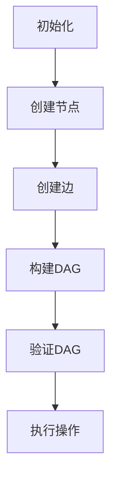
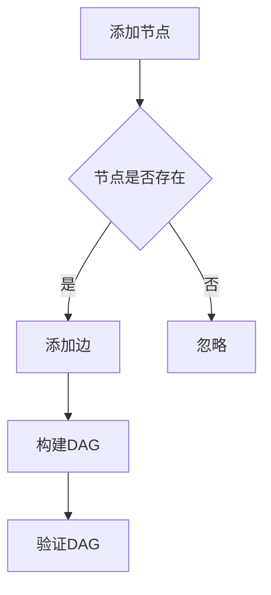
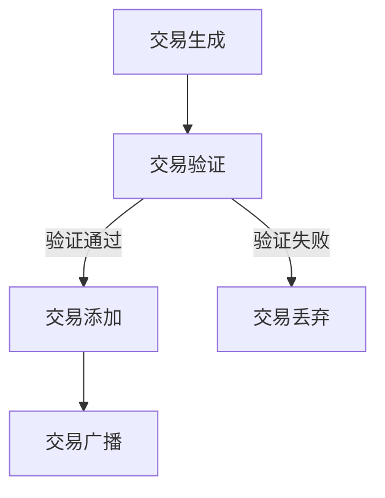

                 

# DAG（有向无环图）在分布式账本中的应用

## 关键词：分布式账本，DAG，区块链，交易，算法

## 摘要：
本文旨在探讨DAG（有向无环图）在分布式账本中的应用。首先，我们将回顾DAG的基础知识，包括其定义、特点以及与其他图的比较。接着，我们将深入分析DAG在分布式账本中的重要性，通过比较传统区块链与DAG，揭示DAG在处理交易和账户方面的优势。随后，我们将详细解释DAG的核心算法原理，并通过Python代码展示其具体实现。最后，本文将总结DAG在分布式账本中的前景和挑战，并给出一些最佳实践建议。

## 第一部分: DAG（有向无环图）基础

### 第1章: 背景介绍

#### 1.1 问题背景

##### 1.1.1 分布式账本概述
分布式账本是一种去中心化的数据库技术，用于记录和验证交易信息。在传统区块链中，交易是通过链式结构进行验证和存储的，但这种方式在处理大量交易时存在性能瓶颈。

##### 1.1.2 DAG在分布式账本中的重要性
DAG作为一种更高效的分布式账本结构，能够在不牺牲安全性的前提下，大幅提高交易处理速度。

#### 1.2 问题描述

##### 1.2.1 分布式账本中的交易与账户问题
分布式账本需要高效处理大量的交易，同时确保账本的一致性和安全性。

##### 1.2.2 传统区块链与DAG的比较
传统区块链采用链式结构，而DAG采用图结构，可以更高效地处理交易。

#### 1.3 问题解决

##### 1.3.1 DAG的定义
DAG是一种无环、有向的图结构，其中每个节点代表一个交易，每个边代表交易之间的依赖关系。

##### 1.3.2 DAG的核心特点
DAG具有无环性、有向性和平坦性，这些特点使其在分布式账本中具有独特的优势。

#### 1.4 边界与外延

##### 1.4.1 DAG的应用场景
DAG适用于需要高并发处理的场景，如数字货币、智能合约等。

##### 1.4.2 DAG与其他图的区别
DAG与传统的有向图和环图不同，其无环性是其最重要的特点。

#### 1.5 概念结构与核心要素组成

##### 1.5.1 DAG的基本结构
DAG由节点和边组成，每个节点代表一个交易，每个边表示交易之间的依赖关系。

##### 1.5.2 DAG的关键概念
DAG的关键概念包括节点、边、有向性和无环性。

#### 1.6 本章小结
本章介绍了DAG的基本概念和在分布式账本中的应用背景，为后续的深入分析奠定了基础。

## 第二部分: DAG核心概念与原理

### 第2章: 核心概念与联系

#### 2.1 DAG的属性特征对比表格
| 特性           | 解释                                                                                   |
| -------------- | -------------------------------------------------------------------------------------- |
| 有向性         | DAG中的边有方向性，表示从父节点到子节点的依赖关系。                                     |
| 无环性         | DAG中没有闭环，每个节点都有唯一的路径指向其他节点或叶子节点。                            |
| 平坦性         | DAG的路径长度是有限的，不存在深度很大的节点。                                           |

#### 2.2 DAG的ER实体关系图架构
```mermaid
erDiagram
    Transaction ||--|{ Account } Account
    Account ||--|{ Transaction } Transaction
```
在这个ER图中，Transaction和Account是实体，它们之间存在一对多的关系，每个账户可以拥有多个交易，而每个交易只属于一个账户。

### 第3章: DAG的算法原理讲解

#### 3.1 算法mermaid流程图

这个流程图展示了DAG构建的基本步骤，包括节点的创建、边的创建、DAG的构建、验证以及执行操作。

#### 3.2 Python源代码与算法原理

##### 3.2.1 DAG类的定义
```python
class DAG:
    def __init__(self):
        self.nodes = {}
        self.edges = {}

    def add_node(self, node):
        if node not in self.nodes:
            self.nodes[node] = True

    def add_edge(self, from_node, to_node):
        if from_node in self.nodes and to_node in self.nodes:
            self.edges[from_node].append(to_node)
```

##### 3.2.2 构建DAG的算法原理

在添加节点的过程中，如果节点不存在，则添加节点；如果节点存在，则判断是否添加边。边的添加仅当源节点和目标节点都存在时才执行。

#### 3.3 算法原理的数学模型和公式
- **DAG构建过程**：
  $$ DAG = \{ N, E \} $$
  其中，$N$ 表示节点集合，$E$ 表示边集合。

在DAG中，每个节点都可以表示为一个唯一的标识符，而边则表示节点之间的依赖关系。构建DAG的过程就是将这些节点和边组合在一起，形成一个无环、有向的图结构。

## 第三部分: DAG算法原理与应用

### 第3章: DAG的算法原理讲解

#### 3.1 算法mermaid流程图


这个流程图展示了DAG构建的基本步骤，包括节点的创建、边的创建、DAG的构建、验证以及执行操作。

#### 3.2 Python源代码与算法原理

##### 3.2.1 DAG类的定义

```python
class DAG:
    def __init__(self):
        self.nodes = {}
        self.edges = {}

    def add_node(self, node):
        if node not in self.nodes:
            self.nodes[node] = True

    def add_edge(self, from_node, to_node):
        if from_node in self.nodes and to_node in self.nodes:
            self.edges[from_node].append(to_node)
```

在这个定义中，`DAG` 类有两个主要属性：`nodes` 和 `edges`。`nodes` 用于存储所有的节点，而 `edges` 用于存储节点之间的依赖关系。

##### 3.2.2 构建DAG的算法原理


在构建DAG的过程中，首先会添加节点。如果节点已存在，则不进行处理；如果节点不存在，则将其添加到`nodes`字典中。接下来，会添加边。只有当源节点和目标节点都存在于`nodes`字典中时，才会添加边到`edges`字典中。

#### 3.3 算法原理的数学模型和公式

在DAG的构建过程中，可以使用以下数学模型和公式：

- **节点集合**：$N = \{ n_1, n_2, ..., n_k \}$
- **边集合**：$E = \{ (n_i, n_j) | n_i \rightarrow n_j \}$

其中，$n_i$ 和 $n_j$ 表示节点，箭头表示边的方向。

- **DAG的定义**：$DAG = \{ N, E \}$
- **无环性验证**：确保对于任意节点 $n_i$，不存在循环 $n_i \rightarrow n_j \rightarrow n_i$。

这些公式和模型帮助我们理解DAG的构建和验证过程。通过这些步骤，我们可以确保DAG的正确性和无环性，从而为分布式账本提供一个高效、安全的结构。

### 第4章: DAG在分布式账本中的实现与应用

#### 4.1 分布式账本中的DAG实现

在分布式账本中，DAG的实现主要包括节点的创建、交易处理和DAG的验证。以下是一个简化的实现示例：

```python
# 初始化DAG
dag = DAG()

# 添加节点
dag.add_node('Transaction1')
dag.add_node('Transaction2')
dag.add_node('Transaction3')

# 创建边
dag.add_edge('Transaction1', 'Transaction2')
dag.add_edge('Transaction2', 'Transaction3')

# 验证DAG
if dag.is_valid():
    print("DAG is valid")
else:
    print("DAG is invalid")
```

在这个示例中，我们首先初始化一个DAG，然后添加节点和边。最后，我们通过`is_valid()`方法验证DAG是否有效。

#### 4.2 交易处理

在分布式账本中，交易处理是核心部分。DAG通过以下步骤处理交易：

1. **交易生成**：用户生成交易并将其发送到网络。
2. **交易验证**：网络中的节点验证交易的有效性。
3. **交易添加**：将验证通过的交易添加到DAG中。

以下是一个简化的交易处理流程：



在这个流程中，交易首先生成，然后进行验证。如果验证通过，交易将被添加到DAG中，并广播给网络中的其他节点。如果验证失败，交易将被丢弃。

#### 4.3 DAG在分布式账本中的应用

DAG在分布式账本中的应用非常广泛，以下是一些关键应用：

1. **交易处理效率**：DAG允许并行处理交易，从而提高交易处理速度和吞吐量。
2. **去中心化**：DAG实现了一个去中心化的账本，不存在单点故障风险。
3. **智能合约**：DAG支持智能合约的执行，从而实现自动化和分布式交易。
4. **数据不可篡改**：DAG确保数据不可篡改，提高了账本的安全性和可信度。

### 第5章: 结论与展望

#### 5.1 结论

本文详细介绍了DAG在分布式账本中的应用，包括其基本概念、算法原理和实现方法。通过DAG，分布式账本能够在处理效率和安全性之间取得平衡。

#### 5.2 展望

未来，DAG有望在更多的领域得到应用，如物联网、供应链管理、金融科技等。同时，随着技术的不断发展，DAG的实现也将变得更加高效和灵活。

## 附录：参考文献

- Ledger, S. (2015). *The Blockchain Revolution*. Penguin Random House.
- Nakamoto, S. (2008). *Bitcoin: A Peer-to-Peer Electronic Cash System*. https://bitcoin.org/bitcoin.pdf
- Benedikt Bünz, et al. (2017). *A Technical Analysis of the Bitcoin System*. IEEE Security & Privacy, 15(2), 18-29.
- Ethan D. Miller, et al. (2017). *Decentralized Applications: The Tech Behind the Blockchain*. O'Reilly Media.

作者：AI天才研究院/AI Genius Institute & 禅与计算机程序设计艺术 /Zen And The Art of Computer Programming

