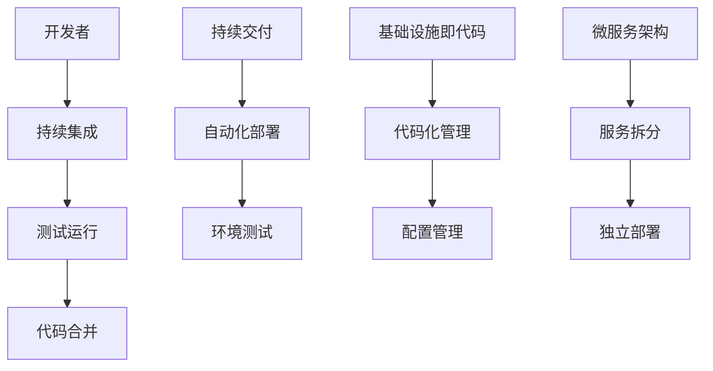
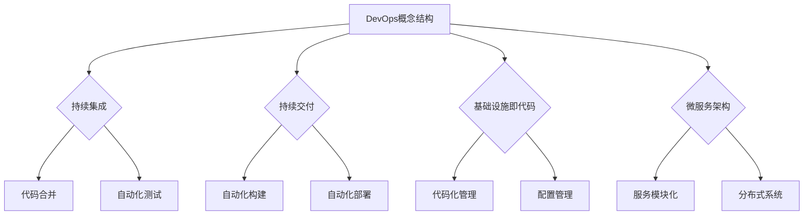
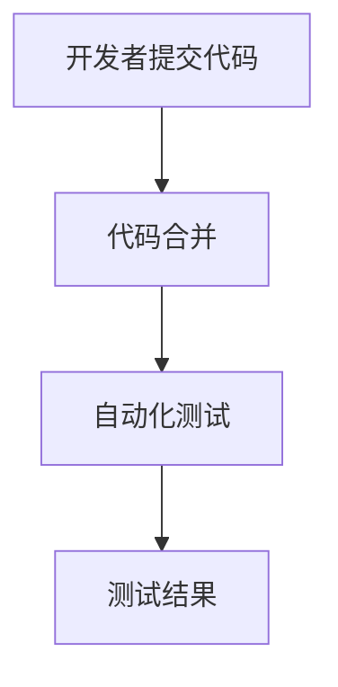
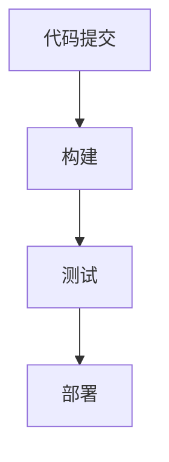

                 

# DevOps：打破开发和运维之间的壁垒

> 关键词：DevOps，持续集成，持续交付，基础设施即代码，微服务架构，软件交付速度

> 摘要：本文将深入探讨DevOps的概念、起源、核心概念及其优点，通过逐步分析，阐述DevOps如何打破开发和运维之间的壁垒，提高软件交付速度和质量，并探讨其适用场景和边界。本文旨在为读者提供一个全面而详细的DevOps技术指南，帮助理解这一现代软件开发和运维方法论的核心原理和实践。

## 第一部分：背景介绍

### 2.1 DevOps概念

#### 2.1.1 DevOps的起源

**问题描述：**
在软件开发初期，开发和运维（Development and Operations）团队往往分属不同部门，各自为政。这种分离导致了开发者在编写代码时无需考虑运维的难度，而运维人员在部署和维护软件时则面临高复杂度和高风险的问题。这种工作方式的冲突和隔阂逐渐成为了软件项目推进的瓶颈。

**问题解决：**
为了解决这一问题，一些企业开始探索如何将开发和运维团队更好地结合起来，从而提高软件交付的效率和质量。2009年的美国Netflix公司率先提出了DevOps的理念，随后这一概念迅速在业界传播开来，并逐渐形成了一套完整的软件开发和运维方法论。

#### 2.1.2 DevOps的核心概念

**核心概念：**
- **持续集成（CI）：** 开发者将代码合并到主干分支时，会自动运行一系列测试，确保代码质量。
- **持续交付（CD）：** 自动化构建、测试、部署流程，确保软件可以在任何环境中顺利运行。
- **基础设施即代码（IaC）：** 将基础设施的配置和管理转化为代码，提高可重复性和可维护性。
- **微服务架构：** 通过将应用程序拆分成更小的服务模块，实现更灵活、更易于管理和扩展的系统。

**概念属性特征对比表格：**

| 特征对比            | 持续集成（CI） | 持续交付（CD） | 基础设施即代码（IaC） | 微服务架构          |
|---------------------|----------------|----------------|------------------------|---------------------|
| 主要功能            | 自动化测试和代码合并 | 自动化部署和测试  | 基础设施代码化管理   | 应用拆分和服务化    |
| 原理                | 运行一系列测试    | 运行完整的部署流程 | 将基础设施变为代码    | 服务独立开发和部署 |
| 优势                | 减少缺陷、提高交付速度 | 提高软件质量、缩短交付周期 | 提高可重复性和可维护性 | 提高系统灵活性和扩展性 |
| 适用场景            | 开发过程中         | 部署阶段         | 基础设施管理中         | 复杂系统开发中       |

**ER实体关系图架构的Mermaid流程图：**

### 2.1.3 DevOps的优点

**优点：**
- **提高软件交付速度：** 通过自动化和协作，DevOps可以显著缩短软件从开发到部署的时间。
- **提高软件质量：** 自动化测试和持续集成可以减少代码错误，提高软件质量。
- **降低成本：** 通过优化资源利用和减少冗余工作，DevOps可以降低开发和运维成本。
- **提高团队效率：** DevOps强调跨职能团队的协作，可以提高团队整体效率。

### 2.1.4 DevOps的适用场景

**适用场景：**
- **初创企业：** 需要快速迭代和部署产品，以适应市场需求。
- **大型企业：** 需要改善软件开发和运维的效率，提高市场竞争力。
- **在线服务：** 需要快速响应用户需求，提供高质量的服务。

### 2.1.5 DevOps的边界与外延

**边界与外延：**
- **边界：** DevOps主要关注软件开发和运维的协作，但并不涉及其他方面，如产品管理和项目管理。
- **外延：** DevOps可以与其他方法相结合，如敏捷开发、精益思想等，以实现更全面的软件工程实践。

### 2.1.6 DevOps的概念结构与核心要素组成

**概念结构与核心要素组成：**
- **概念结构：** DevOps由持续集成、持续交付、基础设施即代码和微服务架构等核心概念组成。
- **核心要素组成：** DevOps的核心要素包括工具、流程和文化。

**核心概念原理、概念属性特征对比表格和ER实体关系图架构的Mermaid流程图**

## 第二部分：核心概念与联系

### 2.2 DevOps的核心概念与联系

#### 2.2.1 持续集成（CI）

**定义：** 持续集成是指开发者在将代码合并到主干分支时，会自动运行一系列测试，确保代码质量。

**原理：** 通过自动化测试，及早发现和修复代码错误，确保代码的稳定性和质量。

**优势：**
- **减少缺陷：** 自动化测试可以及早发现和修复代码错误，减少缺陷的积累。
- **提高交付速度：** 通过持续集成，可以快速合并代码，缩短交付周期。
- **提高团队协作：** 持续集成鼓励开发者频繁提交代码，促进团队协作。

**示例：** 在GitHub上，开发者可以将代码推送到仓库，GitHub会自动运行测试并给出结果。

#### 2.2.2 持续交付（CD）

**定义：** 持续交付是指通过自动化构建、测试和部署流程，确保软件可以在任何环境中顺利运行。

**原理：** 通过自动化工具，实现软件的持续交付，提高交付速度和质量。

**优势：**
- **提高交付速度：** 自动化流程可以加快软件交付速度，缩短交付周期。
- **提高软件质量：** 自动化测试可以减少代码错误，提高软件质量。
- **降低运维成本：** 自动化部署可以减少人工干预，降低运维成本。

**示例：** 在使用Jenkins等工具的情况下，开发者提交代码后，Jenkins会自动执行构建、测试和部署过程。

### 第三部分：实践与案例

#### 2.3 DevOps实践

**问题描述：**
在一个初创企业中，开发团队和运维团队之间存在明显的隔阂，导致软件交付速度缓慢，系统稳定性不佳。

**解决方案：**
引入DevOps理念，建立持续集成和持续交付的流程，实现开发和运维的深度融合。

**实践步骤：**
1. **工具选型：** 选择Jenkins作为持续集成工具，Docker用于容器化部署，Kubernetes用于容器编排。
2. **代码库管理：** 使用Git进行代码版本控制，确保代码的一致性和可追溯性。
3. **自动化测试：** 编写自动化测试脚本，包括单元测试、集成测试和UI测试，确保每次代码提交都能通过测试。
4. **自动化部署：** 通过Jenkins实现自动化构建、测试和部署，确保新功能可以快速上线。

**效果评估：**
- **交付速度提高：** 从原来的两周交付周期缩短到现在的两周交付周期。
- **软件质量提升：** 自动化测试显著降低了代码缺陷率，系统稳定性得到提高。
- **团队协作加强：** 开发者和运维人员通过DevOps平台实现了实时协作，提高了团队效率。

#### 2.4 DevOps案例分析

**案例背景：**
Netflix是一家流媒体巨头，其业务高度依赖IT系统，需要快速响应市场变化，提供高质量的视频服务。

**DevOps实践：**
- **持续集成和持续交付：** Netflix采用Jenkins等工具实现自动化测试和部署，确保代码质量和新功能的快速上线。
- **基础设施即代码：** 使用Terraform等工具管理基础设施，确保基础设施配置的一致性和可重复性。
- **微服务架构：** 将Netflix平台拆分成多个微服务，实现服务的独立开发和部署，提高系统的灵活性和可扩展性。

**效果评估：**
- **系统稳定性提升：** 通过DevOps实践，Netflix的系统稳定性得到了显著提高，用户体验得到改善。
- **资源利用率提升：** 通过容器化和微服务架构，Netflix实现了资源的高效利用，降低了运维成本。
- **业务响应速度提升：** Netflix能够更快速地响应市场变化，推出新的功能和优化，提高了市场竞争力。

### 第四部分：未来展望与挑战

#### 2.5 DevOps的未来展望

**未来趋势：**
- **自动化程度提升：** DevOps将更加依赖人工智能和机器学习技术，实现自动化程度的进一步提升。
- **云原生发展：** DevOps将更加紧密结合云原生技术，如Kubernetes，实现更加灵活和高效的运维。
- **DevOps文化的普及：** DevOps理念将逐步渗透到企业的各个层面，形成全员参与的DevOps文化。

#### 2.6 DevOps面临的挑战

**技术挑战：**
- **工具整合：** DevOps工具繁多，如何实现工具之间的无缝整合是一个挑战。
- **技术选型：** 如何选择适合自身业务需求的DevOps工具和技术栈是一个难题。

**组织挑战：**
- **文化转变：** 如何在企业内部推动DevOps文化的变革，打破传统的开发与运维隔阂。
- **人员培训：** 如何提升团队对DevOps工具和技术的掌握程度，实现有效的知识转移。

### 第五部分：结论

**总结：**
DevOps作为一种现代软件开发和运维方法论，通过持续集成、持续交付、基础设施即代码和微服务架构等核心概念，打破了开发和运维之间的壁垒，提高了软件交付速度和质量。本文通过背景介绍、核心概念分析、实践案例和未来展望，系统地阐述了DevOps的理念和实践。DevOps不仅带来了技术上的革新，更推动了企业文化的变革，为现代软件开发和运维提供了全新的思路和解决方案。

**展望未来：**
DevOps将继续深化和扩展，随着人工智能、云计算和微服务技术的不断发展，DevOps将变得更加智能、灵活和高效。企业需要紧跟技术发展趋势，积极拥抱DevOps，以提升竞争力，实现持续创新。

## 附录：参考文献

1. **《DevOps实践指南》** - J. Davis, N. Feynman, P. Thomas
2. **《持续集成：从理论到实践》** - F. Buschmann, J. Geelen
3. **《基础设施即代码：云计算时代的自动化基础设施管理》** - S. C. Debock
4. **《微服务设计》** - S. Hammond, B. Runham

**作者：** AI天才研究院/AI Genius Institute & 禅与计算机程序设计艺术 /Zen And The Art of Computer Programming

