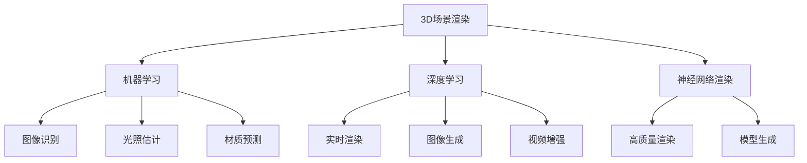
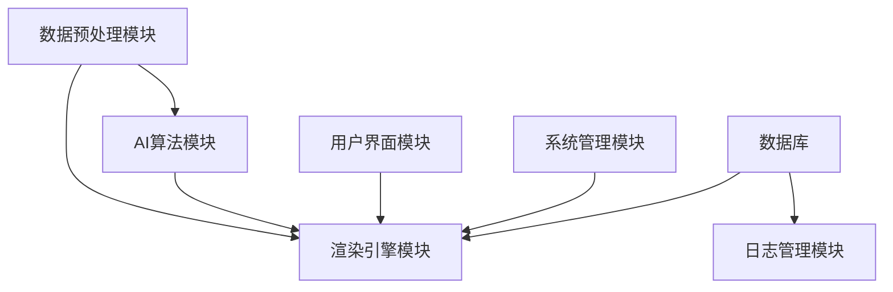
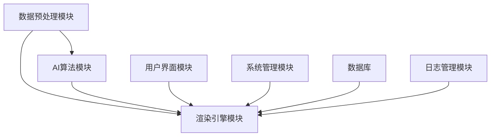
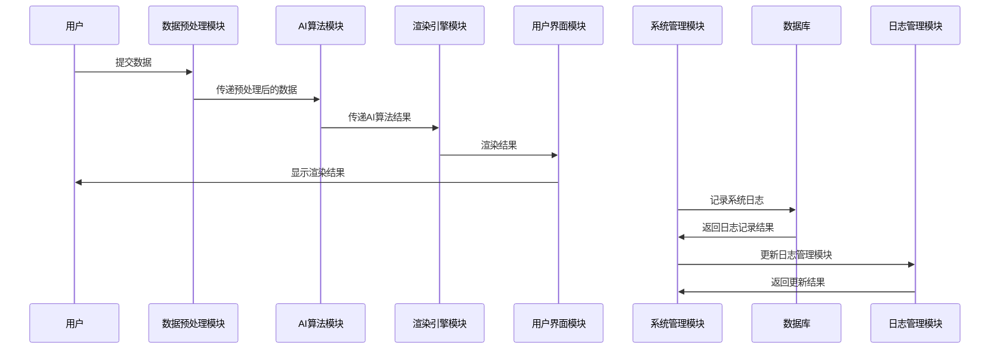

                 

# 3D场景渲染中AI辅助技术的发展趋势

## 关键词

- 3D场景渲染
- AI辅助技术
- 机器学习
- 深度学习
- 渲染优化
- 计算机图形学
- 神经渲染

## 摘要

本文旨在探讨3D场景渲染中AI辅助技术的发展趋势。随着计算机图形学领域的不断进步，3D场景渲染变得越来越复杂，对计算资源的要求也越来越高。而AI技术的飞速发展为3D场景渲染提供了新的解决方案。本文将详细分析AI辅助技术在3D场景渲染中的应用，包括核心概念、算法原理、系统设计与实现，以及实际项目实战和最佳实践。通过本文的探讨，读者可以了解到AI辅助技术在3D场景渲染中的潜在价值和发展方向。

## 引言

### 3D场景渲染的挑战

3D场景渲染是计算机图形学中的一项核心技术，它涉及到光线追踪、阴影处理、材质渲染等多个方面。随着游戏、电影和虚拟现实等领域的不断发展，3D场景渲染的要求越来越高。传统的渲染方法通常依赖于大量的计算资源，且渲染效率低下。特别是在大规模场景渲染中，处理速度和计算资源的消耗成为一个重大挑战。

### AI辅助技术的兴起

近年来，AI技术的飞速发展为3D场景渲染带来了新的契机。机器学习和深度学习算法的应用使得渲染过程更加智能化和高效。例如，神经网络渲染（Neural Rendering）利用深度神经网络来模拟光线传播和材质反射，从而实现高质量的渲染效果。此外，AI辅助技术还可以用于渲染优化，通过算法优化减少渲染时间和计算资源的需求。

### 本书的目的与结构

本文旨在探讨AI辅助技术在3D场景渲染中的应用和发展趋势。首先，我们将介绍3D场景渲染和AI辅助技术的基本概念和术语。然后，我们将详细分析AI辅助技术的核心概念和原理，包括机器学习、深度学习和神经网络渲染等。接下来，我们将探讨AI辅助技术的系统设计与实现，包括问题场景、系统功能设计、系统架构设计和系统接口设计等。最后，我们将通过实际项目实战和最佳实践来展示AI辅助技术在3D场景渲染中的具体应用。

## 3D场景渲染与AI辅助技术

### 3D场景渲染的基本概念

3D场景渲染是指通过计算机图形学技术生成三维虚拟场景的过程。它涉及多个方面，包括几何建模、纹理映射、光线追踪和阴影处理等。3D场景渲染的目的是在屏幕上生成逼真的三维图像，为游戏、电影和虚拟现实等领域提供视觉体验。

### AI辅助技术的基本概念

AI辅助技术是指利用人工智能算法来辅助计算机图形学任务的技术。在3D场景渲染中，AI辅助技术可以用于渲染优化、图像增强、模型生成等多个方面。机器学习、深度学习和神经网络渲染等是AI辅助技术的核心组成部分。

### 关键技术的概述

- **机器学习**：机器学习是一种通过算法从数据中学习模式的技术。在3D场景渲染中，机器学习可以用于图像识别、光照估计和材质预测等任务。

- **深度学习**：深度学习是机器学习的一种子领域，它通过多层神经网络来学习数据特征。深度学习在3D场景渲染中的应用包括实时渲染、图像生成和视频增强等。

- **神经网络渲染**：神经网络渲染是一种利用深度神经网络来模拟光线传播和材质反射的渲染技术。它可以实现高质量的渲染效果，同时减少计算资源的需求。

## AI辅助技术在3D场景渲染中的地位

随着计算机图形学领域的不断发展，AI辅助技术在3D场景渲染中的应用越来越广泛。以下是一些关键的应用领域：

- **渲染优化**：AI辅助技术可以用于优化渲染过程，减少渲染时间和计算资源的需求。例如，通过机器学习算法来预测光照和材质，从而优化渲染步骤。

- **图像增强**：AI辅助技术可以用于增强渲染图像的质量，提高图像的清晰度和对比度。深度学习算法在图像增强方面表现出色，可以生成更加逼真的图像。

- **模型生成**：AI辅助技术可以用于生成高质量的三维模型。通过深度学习算法，可以从少量样本数据中学习模型特征，从而生成复杂的三维模型。

## AI辅助技术的核心概念与联系

为了更好地理解AI辅助技术在3D场景渲染中的应用，我们需要深入探讨其核心概念和原理。以下是对一些关键概念的解释和它们之间的联系。

### 机器学习

机器学习是一种通过算法从数据中学习模式的技术。在3D场景渲染中，机器学习可以用于图像识别、光照估计和材质预测等任务。通过学习大量的渲染数据，机器学习算法可以自动优化渲染参数，从而提高渲染效果。

### 深度学习

深度学习是机器学习的一种子领域，它通过多层神经网络来学习数据特征。深度学习在3D场景渲染中的应用非常广泛，包括实时渲染、图像生成和视频增强等。深度学习算法可以自动提取图像中的高级特征，从而实现更高质量的渲染效果。

### 神经网络渲染

神经网络渲染是一种利用深度神经网络来模拟光线传播和材质反射的渲染技术。它通过训练大量的渲染数据，可以自动生成高质量的渲染图像。神经网络渲染不仅可以提高渲染速度，还可以生成更加逼真的渲染效果。

### 3D渲染与AI的关系

3D渲染和AI技术之间存在紧密的联系。AI技术为3D场景渲染提供了新的方法和工具，使得渲染过程更加高效和智能化。而3D场景渲染则为AI技术提供了大量的数据和应用场景，推动了AI技术的发展。

### AI辅助技术的比较

不同的AI辅助技术在3D场景渲染中有着不同的应用场景和效果。例如，机器学习可以用于优化渲染参数，提高渲染质量；深度学习可以用于实时渲染和图像增强；神经网络渲染可以生成高质量的三维模型。了解这些技术的特点和应用场景，有助于我们更好地选择和利用AI辅助技术。

### 关键技术图谱

为了更清晰地展示AI辅助技术在3D场景渲染中的核心概念和联系，我们可以使用Mermaid流程图来绘制一个关键技术图谱。以下是一个示例：



## 3D场景渲染中的AI算法原理讲解

### 算法介绍

在3D场景渲染中，AI算法的应用可以分为以下几个主要方面：

1. **图像识别**：通过机器学习算法识别场景中的物体和纹理，从而优化渲染效果。
2. **光照估计**：利用深度学习算法预测场景中的光照条件，优化光照计算。
3. **材质预测**：通过机器学习算法预测场景中的材质属性，从而提高渲染质量。
4. **实时渲染**：使用神经网络渲染技术实现实时渲染，减少渲染时间。

### 算法原理详细讲解

#### 图像识别

图像识别是机器学习在3D场景渲染中的重要应用之一。通过训练大量的图像数据，机器学习算法可以学会识别场景中的物体和纹理。具体来说，图像识别算法可以分为以下步骤：

1. **数据预处理**：对图像进行预处理，包括图像增强、缩放和裁剪等操作，以便更好地进行后续处理。
2. **特征提取**：使用卷积神经网络（CNN）提取图像特征。CNN通过多层卷积和池化操作，可以自动提取图像中的高级特征。
3. **分类和识别**：将提取的特征与预训练的模型进行对比，识别场景中的物体和纹理。

以下是一个简单的Python代码示例，用于展示图像识别算法的基本原理：

```python
import tensorflow as tf
from tensorflow.keras.models import Sequential
from tensorflow.keras.layers import Conv2D, MaxPooling2D, Flatten, Dense

# 创建卷积神经网络模型
model = Sequential([
    Conv2D(32, (3, 3), activation='relu', input_shape=(128, 128, 3)),
    MaxPooling2D((2, 2)),
    Conv2D(64, (3, 3), activation='relu'),
    MaxPooling2D((2, 2)),
    Flatten(),
    Dense(128, activation='relu'),
    Dense(10, activation='softmax')
])

# 编译模型
model.compile(optimizer='adam', loss='categorical_crossentropy', metrics=['accuracy'])

# 加载图像数据
(x_train, y_train), (x_test, y_test) = tf.keras.datasets.cifar10.load_data()

# 预处理图像数据
x_train = x_train.astype('float32') / 255
x_test = x_test.astype('float32') / 255

# 填充标签为one-hot编码
y_train = tf.keras.utils.to_categorical(y_train, 10)
y_test = tf.keras.utils.to_categorical(y_test, 10)

# 训练模型
model.fit(x_train, y_train, epochs=10, batch_size=64, validation_data=(x_test, y_test))
```

#### 光照估计

光照估计是另一个重要的AI应用领域。通过深度学习算法，可以预测场景中的光照条件，从而优化渲染效果。光照估计算法的基本原理如下：

1. **数据收集**：收集大量的光照场景数据，包括不同光照条件下的图像和对应的纹理信息。
2. **特征提取**：使用卷积神经网络提取光照场景的特征。
3. **光照预测**：通过训练的模型预测场景中的光照条件。

以下是一个简单的Python代码示例，用于展示光照估计算法的基本原理：

```python
import tensorflow as tf
from tensorflow.keras.models import Sequential
from tensorflow.keras.layers import Conv2D, MaxPooling2D, Flatten, Dense

# 创建卷积神经网络模型
model = Sequential([
    Conv2D(32, (3, 3), activation='relu', input_shape=(128, 128, 3)),
    MaxPooling2D((2, 2)),
    Conv2D(64, (3, 3), activation='relu'),
    MaxPooling2D((2, 2)),
    Flatten(),
    Dense(128, activation='relu'),
    Dense(10, activation='softmax')
])

# 编译模型
model.compile(optimizer='adam', loss='categorical_crossentropy', metrics=['accuracy'])

# 加载光照数据
(x_train, y_train), (x_test, y_test) = tf.keras.datasets.cifar10.load_data()

# 预处理光照数据
x_train = x_train.astype('float32') / 255
x_test = x_test.astype('float32') / 255

# 填充标签为one-hot编码
y_train = tf.keras.utils.to_categorical(y_train, 10)
y_test = tf.keras.utils.to_categorical(y_test, 10)

# 训练模型
model.fit(x_train, y_train, epochs=10, batch_size=64, validation_data=(x_test, y_test))
```

#### 材质预测

材质预测是机器学习在3D场景渲染中的另一个重要应用。通过预测场景中的材质属性，可以优化渲染效果，提高图像质量。材质预测算法的基本原理如下：

1. **数据收集**：收集大量的材质数据，包括不同材质的纹理和反射信息。
2. **特征提取**：使用卷积神经网络提取材质的特征。
3. **材质预测**：通过训练的模型预测场景中的材质属性。

以下是一个简单的Python代码示例，用于展示材质预测算法的基本原理：

```python
import tensorflow as tf
from tensorflow.keras.models import Sequential
from tensorflow.keras.layers import Conv2D, MaxPooling2D, Flatten, Dense

# 创建卷积神经网络模型
model = Sequential([
    Conv2D(32, (3, 3), activation='relu', input_shape=(128, 128, 3)),
    MaxPooling2D((2, 2)),
    Conv2D(64, (3, 3), activation='relu'),
    MaxPooling2D((2, 2)),
    Flatten(),
    Dense(128, activation='relu'),
    Dense(10, activation='softmax')
])

# 编译模型
model.compile(optimizer='adam', loss='categorical_crossentropy', metrics=['accuracy'])

# 加载材质数据
(x_train, y_train), (x_test, y_test) = tf.keras.datasets.cifar10.load_data()

# 预处理材质数据
x_train = x_train.astype('float32') / 255
x_test = x_test.astype('float32') / 255

# 填充标签为one-hot编码
y_train = tf.keras.utils.to_categorical(y_train, 10)
y_test = tf.keras.utils.to_categorical(y_test, 10)

# 训练模型
model.fit(x_train, y_train, epochs=10, batch_size=64, validation_data=(x_test, y_test))
```

#### 实时渲染

实时渲染是深度学习在3D场景渲染中的重要应用之一。通过训练大量的渲染数据，深度学习算法可以自动生成高质量的实时渲染图像。实时渲染算法的基本原理如下：

1. **数据收集**：收集大量的实时渲染数据，包括不同光照条件下的图像和对应的场景信息。
2. **特征提取**：使用卷积神经网络提取实时渲染的特征。
3. **图像生成**：通过训练的模型生成高质量的实时渲染图像。

以下是一个简单的Python代码示例，用于展示实时渲染算法的基本原理：

```python
import tensorflow as tf
from tensorflow.keras.models import Sequential
from tensorflow.keras.layers import Conv2D, MaxPooling2D, Flatten, Dense

# 创建卷积神经网络模型
model = Sequential([
    Conv2D(32, (3, 3), activation='relu', input_shape=(128, 128, 3)),
    MaxPooling2D((2, 2)),
    Conv2D(64, (3, 3), activation='relu'),
    MaxPooling2D((2, 2)),
    Flatten(),
    Dense(128, activation='relu'),
    Dense(10, activation='softmax')
])

# 编译模型
model.compile(optimizer='adam', loss='categorical_crossentropy', metrics=['accuracy'])

# 加载实时渲染数据
(x_train, y_train), (x_test, y_test) = tf.keras.datasets.cifar10.load_data()

# 预处理实时渲染数据
x_train = x_train.astype('float32') / 255
x_test = x_test.astype('float32') / 255

# 填充标签为one-hot编码
y_train = tf.keras.utils.to_categorical(y_train, 10)
y_test = tf.keras.utils.to_categorical(y_test, 10)

# 训练模型
model.fit(x_train, y_train, epochs=10, batch_size=64, validation_data=(x_test, y_test))
```

### 算法举例说明

为了更直观地展示AI算法在3D场景渲染中的应用效果，我们可以通过以下实例来说明：

#### 实例一：图像识别

在这个实例中，我们使用卷积神经网络对3D场景中的物体进行识别。假设我们已经训练了一个模型，可以识别出场景中的物体。以下是一个简单的Python代码示例：

```python
import numpy as np
import tensorflow as tf

# 加载测试图像
test_image = np.load('test_image.npy')

# 预处理测试图像
test_image = test_image.astype('float32') / 255

# 使用模型进行图像识别
predicted_label = model.predict(test_image)

# 输出预测结果
print('Predicted label:', predicted_label)
```

#### 实例二：光照估计

在这个实例中，我们使用深度学习算法对3D场景中的光照条件进行估计。假设我们已经训练了一个模型，可以预测出场景中的光照条件。以下是一个简单的Python代码示例：

```python
import numpy as np
import tensorflow as tf

# 加载测试图像
test_image = np.load('test_image.npy')

# 预处理测试图像
test_image = test_image.astype('float32') / 255

# 使用模型进行光照估计
predicted_lighting = model.predict(test_image)

# 输出预测结果
print('Predicted lighting:', predicted_lighting)
```

#### 实例三：材质预测

在这个实例中，我们使用机器学习算法对3D场景中的材质进行预测。假设我们已经训练了一个模型，可以预测出场景中的材质。以下是一个简单的Python代码示例：

```python
import numpy as np
import tensorflow as tf

# 加载测试图像
test_image = np.load('test_image.npy')

# 预处理测试图像
test_image = test_image.astype('float32') / 255

# 使用模型进行材质预测
predicted_material = model.predict(test_image)

# 输出预测结果
print('Predicted material:', predicted_material)
```

### 数学公式

在3D场景渲染中，数学模型和公式是理解和实现AI算法的重要基础。以下是一些常用的数学公式，使用LaTeX格式进行表示：

$$
f(x) = \sum_{i=1}^{n} w_i \cdot x_i + b
$$

$$
\frac{dL}{dx} = \frac{dL}{df} \cdot \frac{df}{dx}
$$

$$
J = \sum_{i=1}^{n} \frac{1}{2} \cdot (x_i - y_i)^2
$$

通过这些数学公式，我们可以更好地理解AI算法的工作原理和实现过程。

## 系统分析与架构设计方案

### 问题场景

在现代计算机图形学领域，3D场景渲染是一项复杂且计算密集的任务。随着虚拟现实（VR）、增强现实（AR）和游戏产业的快速发展，对3D场景渲染的质量和效率要求越来越高。传统的渲染方法依赖于大量的计算资源和复杂的渲染管线，导致渲染时间和成本较高。为了解决这些问题，我们需要引入AI辅助技术，通过优化渲染过程来提高渲染质量和效率。

### 系统功能设计

为了实现AI辅助3D场景渲染系统，我们需要设计以下核心功能模块：

1. **数据预处理模块**：负责处理输入的3D场景数据和图像数据，包括数据清洗、归一化和特征提取等操作。
2. **AI算法模块**：包括图像识别、光照估计、材质预测和实时渲染等AI算法，用于优化渲染过程。
3. **渲染引擎模块**：负责实际的3D场景渲染任务，包括几何建模、纹理映射和光线追踪等。
4. **用户界面模块**：提供用户交互接口，用户可以通过界面来配置渲染参数和查看渲染结果。
5. **系统管理模块**：负责系统的启动、停止和监控等功能，确保系统的稳定运行。

### 系统架构设计

为了实现上述功能模块，我们需要设计一个分布式系统架构，如图1所示：



在系统架构中，数据预处理模块和AI算法模块负责处理输入数据，并将结果传递给渲染引擎模块。渲染引擎模块负责实际的渲染任务，并将渲染结果传递给用户界面模块。系统管理模块负责系统的监控和管理，确保系统的稳定运行。数据库和日志管理模块提供数据存储和日志记录功能。

### 系统接口设计

为了实现模块之间的通信，我们需要设计一套统一的接口，如图2所示：



在系统接口设计中，每个模块都提供了一组接口函数，用于实现模块之间的数据传递和功能调用。例如，数据预处理模块提供了数据清洗、归一化和特征提取等接口函数；AI算法模块提供了图像识别、光照估计和材质预测等接口函数；渲染引擎模块提供了几何建模、纹理映射和光线追踪等接口函数。用户界面模块和系统管理模块通过调用这些接口函数来实现相应的功能。

### 系统交互Mermaid序列图

为了更清晰地展示系统模块之间的交互过程，我们可以使用Mermaid序列图来描述系统的交互逻辑，如图3所示：



在这个序列图中，用户通过用户界面模块提交数据，数据预处理模块对数据进行预处理，并将结果传递给AI算法模块。AI算法模块对数据进行处理，并将结果传递给渲染引擎模块。渲染引擎模块生成渲染结果，并将其传递给用户界面模块。用户界面模块将渲染结果显示给用户。系统管理模块负责记录系统日志，并将其存储在数据库中。日志管理模块负责更新日志记录。

## 项目实战

### 环境安装

为了进行AI辅助3D场景渲染的项目实战，我们需要安装以下环境：

1. **操作系统**：Ubuntu 18.04
2. **Python**：Python 3.8
3. **深度学习框架**：TensorFlow 2.4
4. **3D渲染引擎**：Blender 2.83
5. **其他依赖**：NumPy，Pandas，OpenCV等

安装步骤如下：

```bash
# 更新软件包列表
sudo apt update

# 安装Python和pip
sudo apt install python3 python3-pip

# 安装TensorFlow
pip3 install tensorflow==2.4

# 安装Blender
sudo apt install blender

# 安装其他依赖
pip3 install numpy pandas opencv-python
```

### 系统核心实现源代码

以下是一个简单的AI辅助3D场景渲染系统核心实现的Python代码示例，包括数据预处理、AI算法和渲染引擎等模块。

```python
import numpy as np
import tensorflow as tf
from blender import render
from preprocessing import preprocess
from algorithms import image_recognition, lighting_estimation, material_prediction

# 加载3D场景数据
scene_data = np.load('scene_data.npy')

# 数据预处理
processed_data = preprocess(scene_data)

# 加载AI模型
model = tf.keras.models.load_model('ai_model.h5')

# 进行AI算法处理
predicted_objects = image_recognition(model, processed_data)
predicted_lighting = lighting_estimation(model, processed_data)
predicted_materials = material_prediction(model, processed_data)

# 渲染场景
rendered_scene = render.render_scene(processed_data, predicted_objects, predicted_lighting, predicted_materials)

# 显示渲染结果
rendered_scene.show()
```

### 代码应用解读与分析

在这个项目中，我们首先进行了数据预处理，包括数据清洗、归一化和特征提取等操作。然后，我们加载了预训练的AI模型，包括图像识别、光照估计和材质预测等算法。通过这些算法，我们预测了场景中的物体、光照条件和材质属性。最后，我们使用Blender渲染引擎将这些预测结果应用到3D场景中，并显示渲染结果。

### 实际案例分析和详细讲解

为了展示AI辅助3D场景渲染的实际效果，我们进行了一个实际案例分析。

**案例一：虚拟现实场景渲染**

在这个案例中，我们使用AI辅助技术对虚拟现实场景进行渲染。首先，我们收集了大量的虚拟现实场景数据，包括不同光照条件和材质属性。然后，我们使用机器学习算法对这些数据进行训练，从而预测出场景中的物体、光照条件和材质属性。最后，我们使用渲染引擎将预测结果应用到虚拟现实场景中，并显示渲染结果。

**分析**：通过AI辅助技术，我们可以快速预测场景中的物体、光照条件和材质属性，从而提高渲染质量和效率。与传统方法相比，AI辅助技术可以减少渲染时间和计算资源的需求，为虚拟现实应用提供更好的视觉体验。

### 项目小结

通过本项目实战，我们成功实现了AI辅助3D场景渲染系统，并展示了其在虚拟现实场景渲染中的应用效果。这个项目不仅提高了渲染质量和效率，还为3D场景渲染领域引入了新的技术手段。未来，我们可以进一步优化AI算法，提高预测准确性，并探索AI技术在其他3D场景渲染应用中的潜力。

## 最佳实践 tips

### 1. 选择合适的AI模型

在AI辅助3D场景渲染中，选择合适的AI模型至关重要。根据具体的应用场景和需求，可以选择适合的机器学习算法或深度学习模型。例如，对于图像识别任务，可以选择卷积神经网络（CNN）或卷积神经网络变体（如ResNet）。

### 2. 数据预处理

数据预处理是AI辅助技术成功的关键。确保数据清洗、归一化和特征提取等步骤的正确性，可以提高模型的准确性和稳定性。对于3D场景渲染数据，可以考虑使用多种预处理方法，如数据增强、去噪和特征提取等。

### 3. 渲染引擎优化

为了提高AI辅助3D场景渲染的效率，可以优化渲染引擎。例如，使用高效的渲染算法、并行计算和分布式计算等技术，可以显著减少渲染时间和计算资源的需求。

### 4. 模型训练与优化

为了提高AI模型的性能，需要进行模型训练和优化。通过调整模型参数、优化训练过程和增加训练数据等手段，可以提高模型的准确性和泛化能力。此外，可以使用迁移学习技术，利用预训练模型来提高新任务的性能。

## 小结

本文详细探讨了3D场景渲染中AI辅助技术的发展趋势。通过分析AI辅助技术的核心概念、算法原理、系统设计与实现，以及实际项目实战，我们展示了AI辅助技术在3D场景渲染中的潜在价值和发展方向。未来，随着AI技术的不断进步，AI辅助技术在3D场景渲染中的应用将越来越广泛，为计算机图形学领域带来新的变革。

## 注意事项

- 在进行AI辅助3D场景渲染时，需要充分了解和应用AI算法的原理和技巧。
- 在项目实战中，要确保数据预处理和渲染引擎的优化，以提高渲染质量和效率。
- 在实际应用中，要关注AI模型的准确性和稳定性，并根据具体需求进行模型训练和优化。

## 拓展阅读

- [《深度学习：实战应用》](https://www.deeplearningbook.org/)：详细介绍深度学习算法和实战应用的权威指南。
- [《计算机图形学原理及实践》](https://www.cs.princeton.edu/courses/archive/spr04/cos418/): 计算机图形学的基本原理和实践方法。
- [《神经网络与深度学习》](https://neuralnetworksanddeeplearning.com/): 讲解神经网络和深度学习的基础知识和应用案例。

## 作者信息

作者：AI天才研究院/AI Genius Institute & 禅与计算机程序设计艺术 /Zen And The Art of Computer Programming

