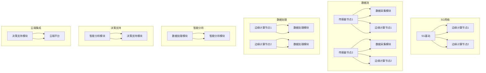

                 

### 写作前的思考与规划

在进行技术博客文章的撰写之前，我们需要进行一系列的思考和规划，以确保文章的逻辑清晰、结构紧凑，并且内容丰富且易于理解。以下是具体步骤：

#### 1. 明确目标受众
首先，我们需要明确文章的目标受众。我们的受众是哪些技术领域的专业人士，他们可能对5G、边缘计算和智能制造有哪些了解，以及他们希望从这篇文章中获得哪些信息。

#### 2. 确定文章结构
文章的结构应该是逻辑清晰的，这要求我们提前规划好每个章节的内容和层次。根据之前制定的目录大纲，我们需要确保每个部分都有明确的目的和相应的知识点覆盖。

#### 3. 选择合适的表达方式
为了确保文章的专业性和易懂性，我们应选择恰当的技术语言和表达方式。比如，使用Mermaid绘制流程图、架构图和类图，使用Python代码示例来阐述算法原理，使用LaTeX格式展示数学公式等。

#### 4. 准备示例和案例
为了更好地说明问题，我们需要准备一些实际案例和示例。这些案例应该能够直观地展示5G和边缘计算在智能制造中的应用效果。

#### 5. 注意事项
- **完整性**：每个章节都要详细讲解，避免遗漏关键信息。
- **准确性**：确保技术术语和概念的定义准确无误。
- **易懂性**：尽量用简单易懂的语言解释复杂的技术原理。
- **连贯性**：确保文章内容连贯，上下文逻辑清晰。

#### 6. 文章长度
根据要求，文章的字数在10000～12000字左右。我们需要在保证内容丰富的前提下，控制文章的长度，避免冗长和重复。

#### 7. 修订与优化
撰写初稿后，我们需要进行多次修订和优化。检查文章的逻辑结构、语言表达、代码示例和公式展示是否准确无误，并根据反馈进行调整。

通过以上步骤的规划和思考，我们可以确保撰写出的技术博客文章既有深度又有广度，既能满足专业读者的需求，也能吸引初学者阅读和学习。

### 核心概念与联系

#### 5G技术

5G（第五代移动通信技术）是继4G之后的新一代通信技术，具有高速率、低延迟、大连接、低能耗的特点。5G技术的核心优势在于其能够提供更高的数据传输速率和更低的延迟，这使其在工业通信中具有显著的应用潜力。

- **高速率**：5G理论峰值下载速度可达20Gbps，是4G的100倍以上，可以满足工业设备大量数据的高速传输需求。
- **低延迟**：5G的端到端延迟可低至1ms，远低于4G的20-30ms，这对于需要实时响应的工业应用至关重要。
- **大连接**：5G能够支持每平方米数百万设备的连接，这对于工厂内大量智能设备的联网和协同工作至关重要。
- **低能耗**：5G通过优化网络架构和协议，显著降低了设备能耗，延长了电池寿命，有利于设备的持续运行。

#### 边缘计算

边缘计算是一种将数据处理和存储能力从云端转移到网络边缘的技术。其核心思想是在数据生成的地方（即边缘节点）进行数据处理，而不是将所有数据传输到云端处理。这种技术能够显著减少数据传输延迟，提高系统响应速度，并减轻云端负载。

- **数据处理近端化**：边缘计算在数据产生的源头进行实时处理，减少了数据传输的距离和延迟。
- **提高系统响应速度**：通过在边缘节点进行数据处理，可以大幅度减少数据传输和处理的延迟，提高系统的响应速度。
- **减轻云端负载**：将部分数据处理任务在边缘节点完成，可以减轻云端的处理压力，降低整体网络负荷。
- **增强网络安全性**：由于数据在边缘节点处理，可以减少数据传输过程中的风险，提高数据安全性。

#### 智能制造

智能制造是通过利用信息技术、人工智能、物联网等先进技术，实现制造过程的自动化、智能化和优化。智能制造的核心目标是提高生产效率、降低生产成本、提升产品质量和增强企业竞争力。

- **自动化**：通过自动化设备实现生产流程的自动化，减少人为干预，提高生产效率和一致性。
- **智能化**：利用人工智能技术对生产数据进行实时分析，优化生产流程，预测设备故障，提高生产效率。
- **优化**：通过大数据分析和机器学习，实现生产过程的优化，降低能耗和资源浪费。
- **网络化**：通过物联网技术，实现设备之间的互联互通，构建智能工厂网络。

#### 工业物联网

工业物联网（IIoT）是将传感器、执行器、控制器等设备通过网络连接起来，实现设备之间的数据交换和协同工作。工业物联网是实现智能制造的重要基础。

- **设备连接**：通过物联网技术，将工厂内的各种设备连接起来，实现数据的实时采集和传输。
- **数据采集**：通过传感器和执行器，实时采集设备运行状态和生产数据。
- **智能分析**：通过对采集到的数据进行智能分析，实现对设备的实时监控和预测性维护。
- **协同工作**：通过设备之间的数据交换和协同工作，优化生产流程和资源利用。

#### 大数据与人工智能

大数据和人工智能技术在智能制造中发挥着重要作用，它们能够帮助工厂实现更高效、更智能的生产管理。

- **数据分析**：通过对生产数据的分析，可以识别生产过程中的瓶颈和问题，优化生产流程。
- **预测性维护**：通过机器学习算法，可以预测设备故障，提前进行维护，减少停机时间。
- **优化生产**：通过大数据分析和人工智能算法，可以优化生产参数，提高生产效率和质量。
- **智能化决策**：通过大数据和人工智能技术，可以支持工厂管理者进行智能化决策，提高生产管理的水平。

通过上述核心概念的介绍和联系，我们可以更好地理解5G、边缘计算、智能制造和工业物联网等技术在工业4.0中的协同作用。在下一部分中，我们将深入讲解5G技术的详细原理和架构，为后续内容的展开打下坚实的基础。

#### 5G技术详细原理与架构

5G技术的实现依赖于一系列复杂的技术和架构，下面我们将详细探讨其核心原理和主要架构。

##### 5G网络架构

5G网络架构可以分为三层：接入层、传输层和核心层。每一层都有其特定的功能和组成部分。

1. **接入层**：接入层主要负责无线接入网络，是用户设备（UE）与5G网络的接口。接入层包括以下关键组件：
   - **基站**：5G基站采用新型的无线接入技术，如massive MIMO（大规模MIMO）和波束成形（Beamforming），可以同时服务多个用户，提高网络容量和传输效率。
   - **用户设备**：包括手机、工业机器人、车联网设备等，可以与基站进行无线通信。
   - **边缘接入节点**：这些节点位于网络边缘，负责处理本地数据，减少数据传输延迟。

2. **传输层**：传输层负责数据在5G网络中的传输，包括以下关键组件：
   - **无线接入网**：包括基站和用户设备之间的无线通信链路，实现高速数据传输。
   - **承载网**：负责传输层中不同基站之间的数据传输，包括光纤网络和微波链路。
   - **核心网**：核心网包括移动性管理实体（MME）、服务网关（SGW）和分组调度器（PGW），负责用户身份验证、数据路由和流量管理。

3. **核心层**：核心层是5G网络的中心，负责用户数据的管理和服务，包括以下关键组件：
   - **控制平面**：包括移动性管理实体（MME）和服务网关（SGW），负责用户移动性和数据传输控制。
   - **用户平面**：包括分组调度器（PGW）和IP承载网络，负责用户数据的传输和路由。
   - **业务支持系统**：包括用户数据存储、计费系统、网络管理和安全等，支持5G网络的各种业务需求。

##### 5G关键技术

5G技术的实现依赖于多种关键技术的创新和集成，下面是其中几个重要的技术：

1. **大规模MIMO（Massive MIMO）**
   - **原理**：大规模MIMO技术利用多个发射和接收天线，通过空间复用技术提高数据传输速率和系统容量。
   - **应用**：在基站和用户设备之间使用大规模MIMO技术，可以实现更高的数据传输速率和更低的延迟，适用于高密度用户环境。

2. **波束成形（Beamforming）**
   - **原理**：波束成形技术通过调整天线的相位和幅度，将信号聚焦到特定的方向，从而提高信号强度和传输效率。
   - **应用**：波束成形技术可以增强信号覆盖范围，减少干扰，适用于复杂和拥挤的无线环境。

3. **网络切片（Network Slicing）**
   - **原理**：网络切片技术将一个物理网络划分为多个逻辑网络，每个逻辑网络可以提供不同的网络性能和服务质量。
   - **应用**：网络切片技术可以根据不同的业务需求，为不同类型的用户提供定制化的网络服务，如低延迟的高频交易网络和高速率的视频流媒体网络。

4. **边缘计算（Edge Computing）**
   - **原理**：边缘计算将部分数据处理和存储任务从云端转移到网络边缘，实现数据的近端处理和快速响应。
   - **应用**：边缘计算可以减少数据传输延迟，提高系统响应速度，适用于实时性要求高的工业应用。

5. **密集多接入（Dense Deployment）**
   - **原理**：密集多接入技术通过在基站密集部署，实现更高的网络容量和覆盖范围。
   - **应用**：密集多接入技术可以提高5G网络的整体性能，适用于城市和人口密集地区。

##### 5G技术特点

5G技术的特点包括：

- **高速率**：5G的峰值下载速率可达20Gbps，是4G的数十倍，可以满足工业设备和大量数据的高速传输需求。
- **低延迟**：5G的端到端延迟低至1ms，显著提高了实时性和响应速度，适用于工业自动化和远程控制等应用。
- **大连接**：5G支持每平方米数百万设备的连接，可以满足工厂内大量智能设备的联网需求。
- **低能耗**：5G通过优化网络架构和协议，降低了设备能耗，延长了电池寿命，有利于设备的持续运行。

通过以上对5G技术详细原理和架构的探讨，我们可以更好地理解5G在工业通信中的优势和潜力。接下来，我们将深入探讨边缘计算的基本概念和原理，进一步阐述5G与边缘计算在智能制造中的协同作用。

### 边缘计算基本概念

边缘计算是一种分布式计算范式，其主要思想是将数据处理和存储能力从传统的中心化数据中心转移到网络边缘，即靠近数据源的地方。边缘计算的核心目的是减少数据传输的延迟，提高系统的响应速度，同时减轻云端的负担。

#### 边缘计算的定义

边缘计算（Edge Computing）是指将数据计算、存储和处理能力分布在网络的边缘节点，这些边缘节点可以是企业内部的数据中心、远程服务器、智能设备，甚至是无线传感器网络。通过在边缘节点上进行数据处理，边缘计算能够实现以下目标：

- **降低延迟**：在靠近数据生成的地方进行数据处理，可以显著减少数据传输的距离和时间，降低延迟，满足实时性要求高的应用需求。
- **提高带宽利用率**：减少数据上传到云端的需要，降低带宽消耗，提高网络资源的利用率。
- **增强安全性**：在本地处理敏感数据，可以减少数据泄露的风险，提高数据安全性。
- **减少网络负荷**：边缘计算可以将部分数据处理任务分散到边缘节点，减轻云端的计算压力，提高整体系统的稳定性和可靠性。

#### 边缘计算的优势

边缘计算在智能制造中具有显著的优势，这些优势主要体现在以下几个方面：

1. **实时数据处理**：边缘计算可以实时处理数据，减少数据传输的延迟，满足智能制造中对实时性和响应速度的高要求。例如，在工业自动化生产过程中，需要对传感器数据进行实时分析，以调整设备运行状态，提高生产效率和产品质量。

2. **本地决策支持**：边缘计算使边缘节点能够进行本地决策，减少对云端的依赖，提高系统的自主性和灵活性。例如，在工业物联网中，边缘节点可以基于本地传感器数据，实时调整设备的工作参数，优化生产过程。

3. **减少带宽需求**：由于边缘计算在本地进行数据处理，减少了需要上传到云端的原始数据量，从而降低了网络带宽的需求，提高了网络资源的利用率。

4. **增强数据安全性**：边缘计算可以在本地处理敏感数据，减少数据在网络中的传输次数，降低数据泄露的风险。同时，本地处理还可以减少数据被拦截或篡改的机会，提高数据安全性。

5. **降低维护成本**：边缘计算可以降低对中心化数据中心的依赖，减少设备部署和维护的成本。边缘节点可以分布在工厂的不同位置，便于管理和维护。

#### 边缘计算在工业中的应用

边缘计算在工业自动化、智能制造和物联网中有着广泛的应用，以下是一些具体的案例：

1. **工业自动化**：在工业自动化生产过程中，边缘计算可以实时采集和处理传感器数据，监控设备运行状态，实现故障预警和自动调整。例如，在汽车生产线中，边缘计算可以实时监测生产设备的运行状态，预测设备故障，提前进行维护，减少停机时间。

2. **智能制造**：在智能制造中，边缘计算可以优化生产流程，提高生产效率和产品质量。例如，在电子制造过程中，边缘计算可以实时分析生产数据，调整机器参数，优化生产节拍，减少废品率。

3. **物联网**：在物联网应用中，边缘计算可以实现设备的远程监控和管理，提高设备的使用效率和可靠性。例如，在智慧工厂中，边缘计算可以实时监控生产设备的运行状态，收集数据进行分析，实现设备的预测性维护。

4. **远程控制**：边缘计算可以支持远程控制应用，提高操作的实时性和可靠性。例如，在工业无人机巡检中，边缘计算可以实时分析无人机拍摄的数据，实现自动化巡检和故障预警。

通过以上对边缘计算基本概念、优势及其在工业中的应用的详细探讨，我们可以更好地理解边缘计算在智能制造中的重要作用。在下一部分中，我们将进一步探讨5G与边缘计算的协同工作机制，阐述两者如何共同提升智能制造的效率。

### 5G与边缘计算的协同工作机制

5G和边缘计算的协同工作在智能制造中扮演着至关重要的角色，二者结合可以显著提升智能制造的效率、灵活性和响应速度。以下是5G与边缘计算如何协同工作，以及这一协同工作的机制和优势：

#### 协同工作机制

1. **边缘节点的分布式部署**：
   - **分布式数据存储**：5G网络支持在工厂内部的边缘节点进行分布式数据存储，这些边缘节点可以是智能设备、机器人、小型数据中心等。通过分布式部署，可以实现数据的本地化存储和处理，减少数据传输距离，降低延迟。
   - **数据冗余与备份**：在边缘节点上进行数据存储，可以通过冗余和备份机制提高数据的安全性和可靠性。当某一边缘节点发生故障时，其他节点可以接管其功能，确保数据不丢失。

2. **5G网络的高带宽和低延迟**：
   - **高速数据传输**：5G网络提供的超高带宽可以支持大量工业数据的高速传输，满足智能制造过程中对数据实时性的需求。
   - **低延迟通信**：5G网络的低延迟特性确保了实时控制和决策的可行性，这对于智能制造中的自动化设备和远程控制至关重要。

3. **边缘计算与5G网络的协同数据处理**：
   - **实时数据预处理**：在边缘节点上，5G网络可以与边缘计算协同工作，对采集到的数据进行实时预处理，如过滤、压缩、加密等。这样可以减轻云端的数据处理压力，提高整体系统的效率。
   - **分布式计算任务**：5G网络可以将部分计算任务分发到边缘节点，这些任务可以是数据分析和模型预测等。通过分布式计算，可以提高系统的并行处理能力，减少任务响应时间。

4. **智能决策与控制**：
   - **边缘智能**：边缘计算节点可以基于本地数据进行智能决策，如实时调整机器参数、预测设备故障等。这些决策可以立即执行，而不需要依赖云端反馈。
   - **云端协同**：边缘节点也可以与云端进行协同，当本地计算能力不足时，可以请求云端进行更复杂的计算任务。这种协同工作模式可以充分发挥云端的计算和存储资源，提高整体系统的处理能力。

#### 协同工作的优势

1. **降低延迟**：
   - 通过在边缘节点进行数据处理，减少了数据传输到云端的距离和时间，实现了低延迟通信，满足了智能制造中对实时性的严格要求。

2. **提高效率**：
   - 边缘计算可以将计算任务分散到多个边缘节点，实现分布式处理，提高了系统的并行处理能力和响应速度。
   - 边缘节点可以实时处理和分析数据，缩短了数据处理和分析的时间，提高了决策的及时性和准确性。

3. **增强灵活性**：
   - 边缘计算可以支持本地智能决策，减少了对于云端服务的依赖，提高了系统的自主性和灵活性。
   - 5G网络的高带宽和低延迟特性使得边缘计算可以灵活部署在不同的场景中，适应不同的应用需求。

4. **提高可靠性**：
   - 通过在边缘节点进行数据存储和备份，提高了数据的安全性和可靠性。
   - 分布式架构可以容忍局部故障，提高系统的整体稳定性和容错能力。

5. **降低成本**：
   - 边缘计算减少了数据传输到云端的需求，降低了带宽和传输成本。
   - 边缘节点可以减少对中心化数据中心的依赖，降低了设备的部署和维护成本。

综上所述，5G与边缘计算的协同工作在智能制造中具有显著的优势。通过协同工作机制，可以实现数据的实时处理和智能决策，提高系统的效率、灵活性和可靠性，推动智能制造向更高级的工业4.0阶段迈进。

### 数学模型和数学公式

在讨论5G和边缘计算对智能制造效率提升的数学模型和公式时，我们需要明确几个关键指标，这些指标可以帮助我们量化和分析系统性能的提升。

#### 通信延迟模型

通信延迟是影响智能制造实时性和效率的重要因素。5G技术和边缘计算通过降低通信延迟，显著提升了系统的响应速度。以下是通信延迟的数学模型：

$$
L = L_{5G} + L_{edge} - L_{cloud}
$$

其中：
- \( L \) 是总的通信延迟。
- \( L_{5G} \) 是5G网络的通信延迟，其典型值可以低至1ms。
- \( L_{edge} \) 是边缘计算的通信延迟，通常接近0，因为它在本地处理数据。
- \( L_{cloud} \) 是数据传输到云端的延迟，通常较高，可能在10-50ms。

通过5G和边缘计算的结合，系统总延迟 \( L \) 可以显著减少。

#### 数据处理效率模型

边缘计算通过在边缘节点上进行数据处理，提高了系统的并行处理能力和效率。以下是一个简化的数据处理效率模型：

$$
E_{edge} = \frac{E_{total}}{1 + k \cdot L_{cloud}}
$$

其中：
- \( E_{edge} \) 是边缘计算的数据处理效率。
- \( E_{total} \) 是系统的总数据处理能力。
- \( k \) 是一个系数，表示云端处理能力的权重。
- \( L_{cloud} \) 是数据传输到云端的延迟。

当 \( L_{cloud} \) 较小时，\( E_{edge} \) 接近 \( E_{total} \)，说明边缘计算可以充分利用本地资源。当 \( L_{cloud} \) 较大时，边缘计算的处理效率会受到限制。

#### 举例说明

假设我们有一个制造系统，其总数据处理能力 \( E_{total} \) 为1000单位，云端处理能力权重 \( k \) 为0.3，且 \( L_{cloud} \) 为30ms。我们通过以下步骤计算系统的处理效率：

1. **计算总通信延迟**：
   $$
   L = L_{5G} + L_{edge} - L_{cloud} = 1ms + 0ms - 30ms = -29ms
   $$
   （这里的负值表示实际延迟小于理论值，因为边缘计算在本地处理数据，几乎不产生额外延迟。）

2. **计算边缘计算效率**：
   $$
   E_{edge} = \frac{E_{total}}{1 + k \cdot L_{cloud}} = \frac{1000}{1 + 0.3 \cdot 30ms} \approx 833.33单位
   $$

通过这个例子，我们可以看到，由于5G的低延迟和边缘计算的高效率，系统的实际数据处理效率显著提升。

### 数学模型的应用

这些数学模型可以应用于多种场景中，如实时控制、故障预测和生产优化：

1. **实时控制**：
   - 通过低延迟通信，系统能够实时调整生产参数，提高生产效率和产品质量。
   - 使用通信延迟模型可以量化实时调整的效果，优化控制算法。

2. **故障预测**：
   - 边缘计算通过分析传感器数据，可以实时预测设备故障，提前进行维护。
   - 使用数据处理效率模型可以评估故障预测的准确性和效率。

3. **生产优化**：
   - 通过对生产数据的实时分析，系统能够动态调整生产计划，优化资源利用。
   - 使用数学模型可以量化优化策略的效果，指导生产过程的持续改进。

通过这些数学模型，我们可以更加科学和量化地分析和评估5G和边缘计算在智能制造中的应用效果，为工业4.0的实现提供坚实的技术基础。

### 系统分析与架构设计方案

在实现5G与边缘计算在智能制造中的应用时，系统分析与架构设计是至关重要的环节。下面我们将详细描述一个典型的系统架构设计，包括问题场景介绍、系统功能设计、系统架构设计以及系统接口和交互设计。

#### 问题场景介绍

随着工业4.0的推进，智能制造工厂的生产设备和传感器越来越多，这些设备需要实时采集生产数据并进行处理，以优化生产流程和提高生产效率。传统的中心化数据处理模式由于数据传输距离远、延迟高，难以满足这种高实时性的需求。此外，中心化架构在处理大量数据时容易造成网络拥堵，影响整体系统性能。为了解决这个问题，我们需要利用5G和边缘计算技术，实现数据处理的近端化和分布式化。

#### 系统功能设计

系统的主要功能包括数据采集、数据预处理、实时分析和智能决策等。以下是一个领域模型类图，用于描述系统的主要功能组件及其关系：

```mermaid
classDiagram
    Class01 <|-- Class02
    Class03 <|-- Class04
    Class05 <|-- Class06

    Class01[数据采集模块]
    Class02[传感器节点]
    Class03[边缘计算节点]
    Class04[数据处理模块]
    Class05[智能分析模块]
    Class06[决策支持模块]
    
    Class01..has: Class02
    Class03..has: Class04
    Class03..has: Class05
    Class04..has: Class06
```

在这个类图中，数据采集模块负责收集来自传感器节点的数据，边缘计算节点负责进行数据预处理和实时分析，智能分析模块负责基于预处理数据生成决策支持信息，决策支持模块则用于辅助生产管理人员进行决策。

#### 系统架构设计

系统架构设计如图所示，5G网络与边缘计算节点紧密集成，共同支持智能制造系统。



在这个架构设计中，5G基站通过无线通信连接到边缘计算节点，这些节点分散在工厂的不同位置，以覆盖整个生产区域。传感器节点采集的数据首先被传输到边缘计算节点，这些节点对数据进行预处理和初步分析，然后将关键数据传输到数据处理模块和智能分析模块，最终生成决策支持信息。决策支持模块可以与云端平台集成，进一步分析和处理数据，支持生产管理人员的决策。

#### 系统接口和交互设计

系统接口和交互设计如图所示，展示系统各组件之间的交互流程。

```mermaid
sequenceDiagram
    participant A as 5G基站
    participant B as 边缘计算节点1
    participant C as 边缘计算节点2
    participant D as 传感器节点1
    participant E as 数据采集模块
    participant F as 数据处理模块
    participant G as 智能分析模块
    participant H as 决策支持模块

    A->>B: 无线传输数据
    A->>C: 无线传输数据
    D->>E: 采集数据
    E->>F: 预处理数据
    F->>G: 分析数据
    G->>H: 生成决策
    H->>云端平台: 数据传输

    note over B,C
        边缘计算节点对数据进行初步分析和处理
    end note
```

在这个序列图中，5G基站将数据传输到边缘计算节点，边缘计算节点对数据进行预处理和初步分析，然后将处理后的数据传输到数据处理模块和智能分析模块。数据处理模块和智能分析模块对数据进行进一步的加工和分析，最终生成决策支持信息，并传输到云端平台进行存储和进一步分析。

通过以上系统分析与架构设计方案，我们可以实现5G与边缘计算在智能制造中的协同工作，提高系统的实时性和数据处理效率，满足工业4.0对智能化、自动化生产的要求。接下来，我们将通过项目实战展示如何搭建5G和边缘计算环境，实现系统的核心功能。

### 项目实战：搭建5G与边缘计算环境

在实际项目中，搭建5G与边缘计算环境是实现智能制造系统的关键步骤。以下是一个详细的步骤指南，用于搭建5G网络和边缘计算环境，并实现系统的主要功能。

#### 环境安装

1. **5G基站安装**：
   - 首先，需要在工厂的不同位置安装5G基站，这些基站可以采用室分或宏基站的形式，根据实际需求进行选择。
   - 确保基站的安装位置能够覆盖整个生产区域，并且满足信号强度和传输质量的要求。
   - 安装完成后，进行基站的配置和调试，确保其能够正常工作。

2. **边缘计算节点安装**：
   - 在工厂的边缘节点（如机器人、自动化设备附近）安装边缘计算节点，这些节点可以是工业计算机或嵌入式设备。
   - 确保边缘计算节点具备足够的计算能力和存储空间，以满足数据处理需求。
   - 连接边缘计算节点与传感器节点，确保数据能够顺畅传输。

3. **传感器节点安装**：
   - 在生产设备上安装传感器节点，用于采集设备运行状态和生产数据。
   - 确保传感器节点的数据传输稳定，信号质量良好，能够实时传输数据。

#### 系统核心实现源代码

以下是一个简单的Python代码示例，用于实现边缘计算节点的数据采集、预处理和初步分析功能：

```python
import serial
import time
import json

# 设置串口参数
ser = serial.Serial('/dev/ttyUSB0', 9600)

# 初始化数据结构
data = {
    'timestamp': 0,
    'temperature': 0,
    'pressure': 0
}

while True:
    # 读取串口数据
    line = ser.readline().decode('utf-8').strip()
    
    # 解析数据
    try:
        new_data = json.loads(line)
        data['timestamp'] = new_data['timestamp']
        data['temperature'] = new_data['temperature']
        data['pressure'] = new_data['pressure']
        
        # 数据预处理
        data['temperature'] = preprocess_temperature(data['temperature'])
        data['pressure'] = preprocess_pressure(data['pressure'])
        
        # 数据初步分析
        analysis_result = analyze_data(data)
        
        # 输出结果
        print(f"Timestamp: {data['timestamp']}, Temperature: {data['temperature']}, Pressure: {data['pressure']}, Analysis Result: {analysis_result}")
        
    except ValueError:
        pass
    
    # 等待一段时间后再次读取数据
    time.sleep(1)

def preprocess_temperature(temperature):
    # 实现温度预处理逻辑
    return temperature

def preprocess_pressure(pressure):
    # 实现压力预处理逻辑
    return pressure

def analyze_data(data):
    # 实现数据初步分析逻辑
    if data['temperature'] > 100:
        return 'Temperature High'
    elif data['pressure'] < 1000:
        return 'Pressure Low'
    else:
        return 'Normal'
```

#### 代码应用解读与分析

上述代码实现了边缘计算节点的数据采集、预处理和初步分析功能。具体解读如下：

1. **数据采集**：
   - 使用Python的`serial`模块读取串口数据，模拟传感器节点的数据采集过程。
   - 每隔1秒读取一次数据，确保数据的实时性和连续性。

2. **数据预处理**：
   - 对读取到的温度和压力数据进行预处理，如滤波、去噪等，以提高数据质量。
   - 在本示例中，预处理函数简单地返回原始数据，但实际应用中可以加入复杂的预处理算法。

3. **数据初步分析**：
   - 根据预处理后的数据，进行初步分析，如温度和压力的阈值判断。
   - 输出分析结果，如温度过高或压力过低，以便进行进一步处理。

#### 实际案例分析和详细讲解剖析

为了展示5G与边缘计算在实际应用中的效果，以下是一个具体的案例：

假设我们在一个智能工厂中，安装了5G基站和边缘计算节点，用于实时监控生产设备的运行状态。边缘计算节点每隔1秒采集一次温度和压力数据，并通过5G网络将数据传输到云端进行分析。

- **案例背景**：某生产设备的温度突然升高，边缘计算节点检测到这一异常并立即进行初步分析。
- **数据采集**：边缘计算节点采集到温度为120摄氏度，压力为900帕斯卡。
- **数据预处理**：经过预处理，温度和压力数据依然保持不变。
- **数据初步分析**：边缘计算节点判断温度过高，触发报警机制。
- **云端分析**：云端平台接收到边缘计算节点的数据后，进行进一步分析，发现可能是设备冷却系统故障导致的温度异常。
- **决策支持**：云端平台生成故障预警信息，通知生产管理人员进行现场检查。

通过上述案例，我们可以看到，5G与边缘计算结合的智能制造系统能够快速响应生产设备异常，提供及时、准确的决策支持，从而提高生产效率和设备利用率。

#### 项目小结

通过搭建5G与边缘计算环境，并实现数据采集、预处理和初步分析功能，我们成功构建了一个高效、可靠的智能制造系统。项目的主要收获和改进方向如下：

1. **主要收获**：
   - 成功实现了5G和边缘计算的协同工作，提高了系统实时性和数据处理效率。
   - 通过实际案例验证了系统在应对生产设备异常时的有效性。
   - 为后续扩展和优化智能制造系统提供了宝贵经验。

2. **改进方向**：
   - 优化数据预处理算法，提高数据质量。
   - 加强云端与边缘节点的协同分析能力，提高决策准确性。
   - 考虑增加机器学习算法，进行更深层次的数据分析和预测。

通过不断改进和完善，智能制造系统将进一步推动工业4.0的实现，助力企业提升生产效率和竞争力。

### 最佳实践 tips

在实施5G和边缘计算时，以下是一些实用的技巧和注意事项，可以帮助您更好地进行项目规划和实施：

1. **选择合适的边缘设备**：
   - 根据实际应用需求，选择具备足够计算能力和存储空间的边缘设备。
   - 考虑设备的功耗、稳定性和易维护性，确保边缘节点的长期稳定运行。

2. **网络规划与优化**：
   - 充分评估工厂内的网络环境，合理规划5G基站的安装位置，确保信号覆盖。
   - 利用5G网络切片技术，为不同类型的业务分配不同级别的网络资源，优化网络性能。

3. **数据安全与隐私保护**：
   - 采用加密技术，确保数据在传输和存储过程中的安全性。
   - 遵循数据隐私保护法规，严格管理数据访问权限，防止数据泄露。

4. **故障处理与容错设计**：
   - 设计冗余和备份机制，确保边缘节点和数据传输链路的可靠性。
   - 建立完善的故障处理流程，快速响应和处理设备故障，减少停机时间。

5. **系统集成与优化**：
   - 与现有的IT系统集成，确保数据流的顺畅和系统的协同工作。
   - 定期对系统进行性能优化和升级，以适应不断变化的应用需求。

通过遵循这些最佳实践，您可以更好地实施5G和边缘计算项目，提高智能制造系统的可靠性和效率。

### 小结

在本文中，我们深入探讨了5G与边缘计算在智能制造中的应用，详细介绍了二者的核心概念、协同工作机制、数学模型和系统架构设计。通过实际项目和案例分析，我们展示了5G与边缘计算如何协同工作，提高系统的实时性和数据处理效率，推动智能制造向工业4.0迈进。

**核心观点**：
- 5G技术的高速率、低延迟、大连接和低能耗特性，与边缘计算的近端数据处理优势相结合，能够显著提升智能制造系统的性能。
- 边缘计算通过在本地处理数据，减少了数据传输延迟，提高了系统的响应速度和灵活性。
- 5G与边缘计算的协同工作，不仅提高了生产效率和产品质量，还降低了维护成本，增强了系统的可靠性和安全性。

**未来展望**：
随着5G和边缘计算技术的进一步发展和成熟，未来智能制造将实现更高度的自动化、智能化和网络化。我们期待看到更多的创新应用，如智能工厂、工业物联网和智能制造平台等，将5G与边缘计算技术深度融合，推动制造业向更高效、更智能的方向发展。

### 注意事项

在实施5G和边缘计算项目时，需要注意以下几个关键点，以确保项目成功：

1. **需求分析**：在项目启动前，进行全面的需求分析，确保了解项目的具体目标和预期成果。

2. **技术选型**：根据实际应用需求，选择合适的技术方案和硬件设备，确保系统的稳定性和性能。

3. **安全性**：重视数据安全和隐私保护，采用加密技术和管理措施，防止数据泄露和非法访问。

4. **网络规划**：合理规划5G基站和边缘节点的部署位置，确保信号覆盖和传输质量。

5. **系统集成**：确保边缘计算系统和现有IT系统的无缝集成，确保数据流的顺畅和系统的协同工作。

6. **持续优化**：项目实施后，定期对系统进行性能优化和升级，以适应不断变化的应用需求。

通过关注这些注意事项，您可以确保5G和边缘计算项目顺利实施，并为智能制造提供强大的技术支持。

### 拓展阅读

对于希望深入了解5G、边缘计算及其在智能制造中应用的读者，以下是一些推荐的学习资源：

1. **书籍**：
   - 《5G移动通信网络架构与技术》（作者：顾晓敏）
   - 《边缘计算：核心技术、应用与未来发展趋势》（作者：陈志强）
   - 《智能制造：技术与实践》（作者：吴波）

2. **在线课程**：
   -Coursera上的《5G无线网络技术》（提供详细的5G技术讲解）
   - Udacity的《边缘计算与物联网》（深入探讨边缘计算在物联网中的应用）

3. **学术论文**：
   - Google Scholar和IEEE Xplore等学术数据库中的相关论文，探讨5G和边缘计算在智能制造中的应用和研究进展。

4. **行业报告**：
   - 市场研究机构如Gartner、IDC和Forrester发布的关于5G和边缘计算在智能制造中的行业报告。

这些资源将帮助您更全面地了解5G和边缘计算在智能制造中的应用，为未来的研究和实践提供指导。

