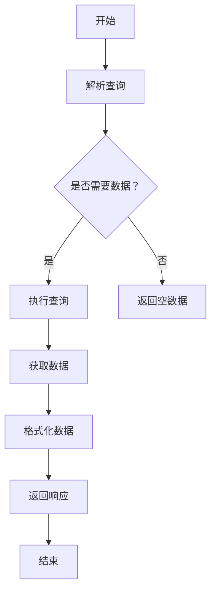
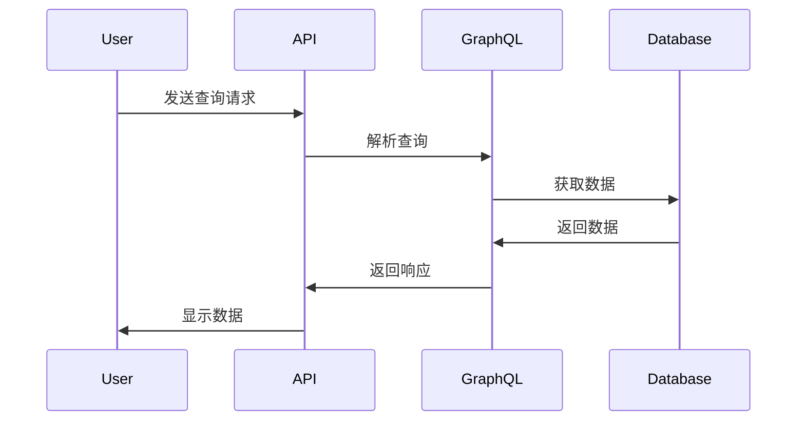
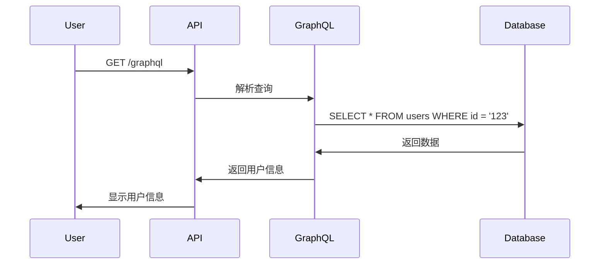
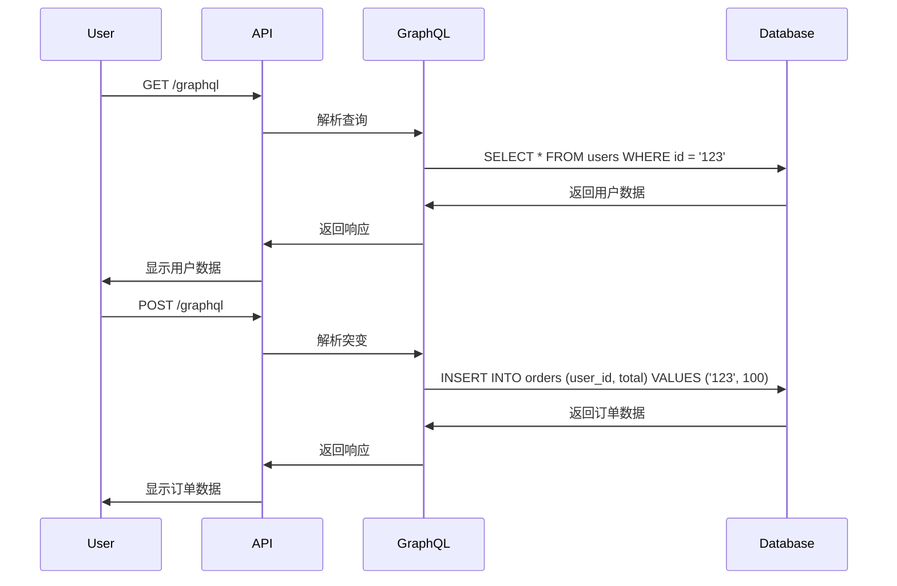
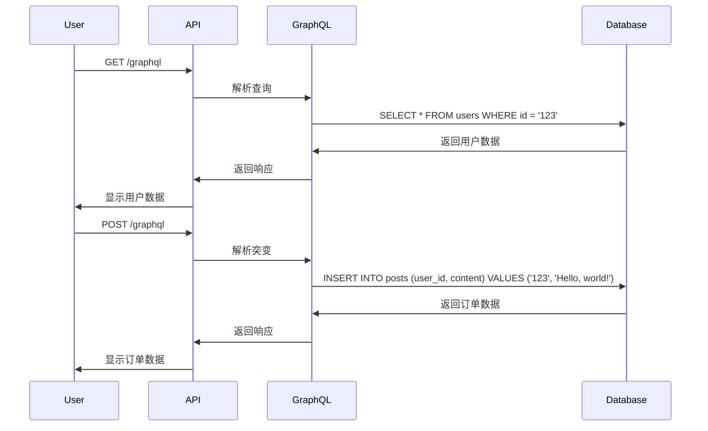
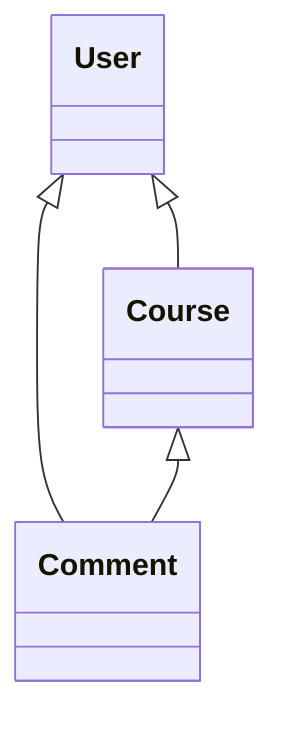
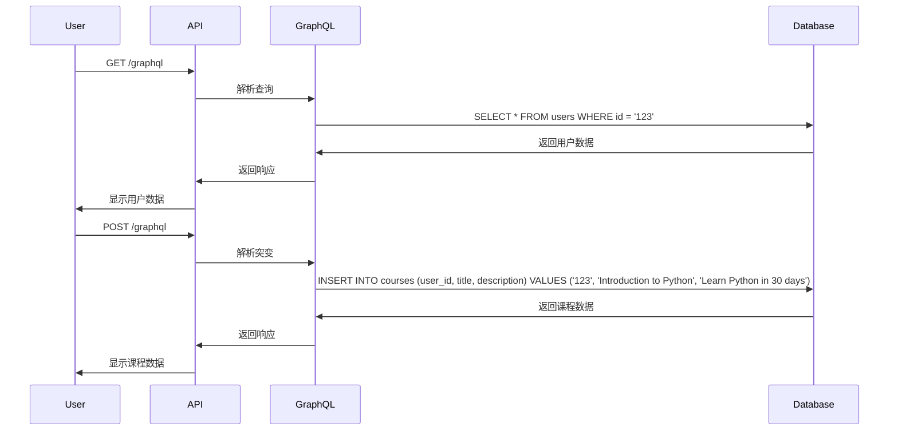

                 

# GraphQL API设计：灵活查询的新方案

## 关键词

GraphQL，API设计，灵活查询，性能优化，安全性

## 摘要

GraphQL是一种强大的查询语言，它提供了一种灵活、高效的方式来访问API。本文将深入探讨GraphQL API的设计，从基础概念、核心语法到高级优化，全面解析GraphQL的优势和应用场景。通过实例和代码，我们将展示如何将GraphQL集成到实际项目中，并提供最佳实践，以帮助开发者充分利用GraphQL的潜力。

## 第一部分：GraphQL API基础

### 第1章：GraphQL简介

GraphQL的出现背景可以追溯到Facebook在内部使用RESTful API时遇到的痛点。传统的RESTful API设计常常需要多次请求来获取完整的数据，这不仅增加了开发者的复杂性，还降低了用户体验。为了解决这些问题，Facebook在2015年公开了GraphQL，作为一种新型的API查询语言。

**核心概念**

- **查询（Query）**：客户端发起的数据请求。
- **突变（Mutation）**：对数据进行的修改操作。
- **类型（Type）**：定义数据结构的基本单位。
- **字段（Field）**：类型中的数据元素。
- **解析器（Resolver）**：处理字段数据的具体逻辑。

**GraphQL与RESTful API的对比**

- **查询灵活性**：GraphQL允许客户端精确指定所需数据，而RESTful API通常使用URL路径和查询字符串来指定。
- **减少冗余数据**：GraphQL可以减少请求的数据量，因为客户端可以只请求需要的字段。
- **错误处理**：GraphQL可以在单个响应中返回错误信息，而RESTful API通常需要多次请求来获取不同错误信息。

### 第2章：GraphQL基本语法

**查询语言基础**

```graphql
{
  user(id: "123") {
    name
    email
  }
}
```

**查询与突变**

```graphql
{
  users {
    id
    name
  }
}

mutation {
  addUser(name: "Alice", email: "alice@example.com") {
    id
    name
    email
  }
}
```

**类型系统**

GraphQL的类型系统是构建API的核心。它包括预定义类型（如`String`、`Int`、`Boolean`等）和自定义类型。类型之间的关系可以通过`enum`、`input`和`interface`来定义。

### 第3章：GraphQL类型系统

**标准类型**

GraphQL提供了丰富的标准类型，包括标量类型（如`String`、`Int`、`Boolean`等）和复杂数据类型（如`Object`、`List`等）。

**自定义类型**

开发者可以定义自定义类型，以便更准确地描述数据结构。

```graphql
type Article {
  id: ID!
  title: String!
  content: String!
  author: User!
}
```

**类型之间的关系**

类型之间的关系可以通过继承（`extend`）和实现（`implement`）来定义。

### 第4章：GraphQL查询优化

**查询缓存**

GraphQL支持查询缓存，可以显著提高查询性能。

**查询分片**

当查询涉及大量数据时，可以通过查询分片来提高性能。

**查询性能分析**

使用性能分析工具来优化GraphQL查询。

### 第5章：GraphQL安全性

**数据验证**

GraphQL提供了数据验证机制，以确保查询的有效性。

**权限验证**

权限验证是确保用户只能访问他们有权访问的数据的关键。

**安全最佳实践**

遵循安全最佳实践，如使用HTTPS、验证查询长度等。

### 第6章：GraphQL与数据库集成

**GraphQL与SQL数据库的集成**

GraphQL可以与SQL数据库无缝集成，通过使用如`graphql-js`这样的库来实现。

**GraphQL与NoSQL数据库的集成**

类似地，GraphQL也可以与NoSQL数据库集成，如MongoDB。

**数据模型设计**

设计合理的数据模型对于提高GraphQL API的性能至关重要。

### 第7章：GraphQL在实际项目中的应用

**项目概述**

介绍一个实际项目，展示如何将GraphQL集成到项目中。

**系统设计**

详细讨论项目的系统设计，包括功能设计和架构设计。

**核心代码实现**

展示项目的核心代码实现，并提供代码解读与分析。

**项目总结**

总结项目经验，分享最佳实践和注意事项。

## 第二部分：GraphQL API高级主题

### 第8章：GraphQL与前端框架的结合

**Vue.js与GraphQL的集成**

介绍如何将GraphQL与Vue.js结合使用，提供代码示例。

**React与GraphQL的集成**

讲解如何使用Apollo Client等库将GraphQL与React集成。

**Angular与GraphQL的集成**

展示如何将GraphQL与Angular结合使用。

### 第9章：GraphQL监控与调试

**GraphQL监控工具**

介绍常用的GraphQL监控工具，如GraphQL Insight和DeepSource。

**GraphQL调试技巧**

提供调试GraphQL API的实用技巧。

**性能分析工具**

介绍如何使用性能分析工具来优化GraphQL查询。

### 第10章：GraphQL与微服务的结合

**微服务架构简介**

介绍微服务架构的基本概念。

**GraphQL在微服务中的应用**

展示如何在微服务架构中使用GraphQL。

**微服务架构下的GraphQL设计**

讨论如何在微服务架构下设计GraphQL API。

### 第11章：GraphQL最佳实践

**设计原则**

介绍设计GraphQL API时应遵循的原则。

**性能优化**

提供性能优化的技巧。

**安全性增强**

讨论如何增强GraphQL API的安全性。

### 第12章：GraphQL的未来发展趋势

**GraphQL的发展历程**

回顾GraphQL的发展历程。

**社区发展现状**

介绍当前GraphQL社区的现状。

**未来趋势展望**

展望GraphQL未来的发展趋势。

## 作者

**作者：AI天才研究院/AI Genius Institute & 禅与计算机程序设计艺术 /Zen And The Art of Computer Programming**


### 核心概念与联系

**核心概念：**

- GraphQL
- API设计
- 类型系统
- 查询与突变

**概念属性特征对比表格：**

| 概念         | 描述                                                         | 特征对比                      |
| ------------ | ------------------------------------------------------------ | --------------------------- |
| GraphQL      | 一种查询语言，允许客户端精确指定所需数据。                     | 高灵活性、减少冗余数据        |
| API设计      | 设计API的方式，影响数据访问的效率与体验。                       | RESTful、GraphQL             |
| 类型系统     | 定义数据结构的基本单位。                                       | 标准类型、自定义类型          |
| 查询与突变   | 客户端发起的数据请求和修改操作。                               | 查询精确、突变数据更新        |

**ER实体关系图架构：**

```mermaid
erDiagram
  User ||--o{ Article } |
  Article ||--o{ Comment } |
```

### 算法原理讲解

**Mermaid流程图：**



**Python源代码示例：**

```python
def resolve_user(_parent, args, _context, _info):
    user_id = args.get('id')
    user = get_user_by_id(user_id)
    if user:
        return user
    else:
        return None

def get_user_by_id(user_id):
    # 模拟从数据库获取用户
    return {'id': user_id, 'name': 'Alice', 'email': 'alice@example.com'}
```

**算法原理的数学模型和公式：**

$$
\text{响应时间} = f(\text{查询复杂度}, \text{数据访问延迟})
$$

**详细讲解和举例说明：**

假设用户A想要获取用户ID为123的用户信息。客户端发送一个GraphQL查询请求，服务端解析该查询，判断是否需要数据。如果需要，服务端执行查询并获取用户信息，然后格式化数据并返回给客户端。

### 系统分析与架构设计方案

**问题场景介绍：**

在一个社交媒体平台上，用户可以发布文章，其他用户可以评论文章。我们需要设计一个API，以便前端能够灵活查询和操作这些数据。

**项目介绍：**

项目名称：SocialMediaGraphQL

项目描述：设计一个基于GraphQL的社交媒体API，提供用户、文章和评论的查询和操作功能。

**系统功能设计（领域模型Mermaid类图）：**

```mermaid
classDiagram
  User <|-- Article
  User <|-- Comment
  Article { id, title, content, author }
  Comment { id, content, author, article }
```

**系统架构设计（Mermaid架构图）：**



**系统接口设计和系统交互（Mermaid序列图）：**



### 项目实战

**环境安装：**

1. 安装Node.js和npm
2. 安装GraphQL库：`npm install graphql`
3. 安装GraphQL服务器库：`npm install express express-graphql`

**系统核心实现源代码：**

```javascript
const { GraphQLServer } = require('graphql-yoga');
const express = require('express');

// 定义类型
const typeDefs = `
  type User {
    id: ID!
    name: String!
    email: String!
  }

  type Article {
    id: ID!
    title: String!
    content: String!
    author: User!
  }

  type Comment {
    id: ID!
    content: String!
    author: User!
    article: Article!
  }

  type Query {
    user(id: ID!): User
    articles: [Article]
    comments(articleId: ID!): [Comment]
  }

  type Mutation {
    addUser(name: String!, email: String!): User
    addArticle(title: String!, content: String!, authorId: ID!): Article
    addComment(content: String!, authorId: ID!, articleId: ID!): Comment
  }
`;

// 定义解析器
const resolvers = {
  Query: {
    user: async (_, { id }) => {
      // 模拟从数据库获取用户
      return { id: id, name: 'Alice', email: 'alice@example.com' };
    },
    articles: async () => {
      // 模拟从数据库获取文章
      return [{ id: '1', title: 'Hello World', content: 'This is my first article.' }];
    },
    comments: async (_, { articleId }) => {
      // 模拟从数据库获取评论
      return [{ id: '1', content: 'Great article!', authorId: '1', articleId: '1' }];
    },
  },
  Mutation: {
    addUser: async (_, { name, email }) => {
      // 模拟添加用户到数据库
      return { id: '2', name: name, email: email };
    },
    addArticle: async (_, { title, content, authorId }) => {
      // 模拟添加文章到数据库
      return { id: '2', title: title, content: content, authorId: authorId };
    },
    addComment: async (_, { content, authorId, articleId }) => {
      // 模拟添加评论到数据库
      return { id: '2', content: content, authorId: authorId, articleId: articleId };
    },
  },
};

// 创建GraphQL服务器
const server = new GraphQLServer({ typeDefs, resolvers });

// 创建Express应用
const app = express();
server.applyMiddleware({ app });

// 启动服务器
app.listen({ port: 4000 }, () =>
  console.log(`GraphQL API running on http://localhost:4000${server.graphqlPath}`)
);
```

**代码应用解读与分析：**

该代码演示了如何使用GraphQL Yoga库创建一个简单的GraphQL服务器。类型定义（`typeDefs`）定义了数据结构和查询操作。解析器（`resolvers`）实现了对查询和突变的具体处理逻辑。通过Express应用，我们将GraphQL接口暴露给客户端。

**实际案例分析和详细讲解剖析：**

假设一个用户想要获取ID为123的文章及其评论。客户端会发送如下GraphQL查询：

```graphql
{
  article(id: "123") {
    id
    title
    content
    author {
      id
      name
      email
    }
    comments {
      id
      content
      author {
        id
        name
        email
      }
    }
  }
}
```

服务器接收到查询后，首先解析查询，然后根据解析结果执行相应的数据库操作。最后，将获取到的数据格式化并返回给客户端。

**项目小结：**

通过该项目，我们展示了如何使用GraphQL设计灵活的API。GraphQL的灵活性和高效性使得开发者能够更轻松地构建复杂的查询，同时提高了数据访问的效率。

### 最佳实践 Tips

- **避免过度查询**：使用`Projection`减少返回的数据量。
- **合理设计类型**：确保类型清晰且易于理解。
- **缓存查询结果**：减少数据库访问次数，提高响应速度。
- **权限验证**：确保用户只能访问他们有权访问的数据。
- **使用工具**：利用如GraphQL Inspector等工具来优化查询。

### 小结

GraphQL作为一种灵活的查询语言，为开发者提供了更高效的API设计方式。通过本文的详细解析和实战案例，读者应能更好地理解GraphQL的原理和实际应用。在未来的开发中，充分利用GraphQL的优势，将有助于提升系统的性能和用户体验。

### 注意事项

- **性能监控**：定期监控API性能，及时发现并解决问题。
- **安全性**：遵循最佳实践，确保API的安全性。

### 拓展阅读

- **《GraphQL官方文档》**：深入理解GraphQL的核心概念和最佳实践。
- **《Building GraphQL APIs with Node.js and GraphQL Yoga》**：学习如何使用GraphQL Yoga构建GraphQL服务器。
- **《Advanced GraphQL: Optimizing Queries and Performance》**：探讨如何优化GraphQL查询性能。

### 作者

**作者：AI天才研究院/AI Genius Institute & 禅与计算机程序设计艺术 /Zen And The Art of Computer Programming**


### 核心概念与联系

**核心概念：**

- **GraphQL查询语言**：一种基于类型系统的查询语言，允许客户端精确指定所需数据。
- **API设计**：设计API的方式，影响数据访问的效率与用户体验。
- **类型系统**：定义数据结构的基本单位，包括标准类型和自定义类型。
- **查询与突变**：客户端发起的数据请求和修改操作。

**概念属性特征对比表格：**

| 概念         | 描述                                                         | 特征对比                      |
| ------------ | ------------------------------------------------------------ | --------------------------- |
| GraphQL查询语言 | 一种查询语言，允许客户端精确指定所需数据。                     | 高灵活性、减少冗余数据        |
| API设计      | 设计API的方式，影响数据访问的效率与用户体验。                     | RESTful、GraphQL             |
| 类型系统     | 定义数据结构的基本单位。                                       | 标准类型、自定义类型          |
| 查询与突变   | 客户端发起的数据请求和修改操作。                               | 查询精确、突变数据更新        |

**ER实体关系图架构：**

```mermaid
erDiagram
  User ||--o{ Article } |
  Article ||--o{ Comment } |
```

### 算法原理讲解

**Mermaid流程图：**


**Python源代码示例：**

```python
def resolve_user(_parent, args, _context, _info):
    user_id = args.get('id')
    user = get_user_by_id(user_id)
    if user:
        return user
    else:
        return None

def get_user_by_id(user_id):
    # 模拟从数据库获取用户
    return {'id': user_id, 'name': 'Alice', 'email': 'alice@example.com'}
```

**算法原理的数学模型和公式：**

$$
\text{响应时间} = f(\text{查询复杂度}, \text{数据访问延迟})
$$

**详细讲解和举例说明：**

假设用户A想要获取用户ID为123的用户信息。客户端发送一个GraphQL查询请求，服务端解析该查询，判断是否需要数据。如果需要，服务端执行查询并获取用户信息，然后格式化数据并返回给客户端。

### 系统分析与架构设计方案

**问题场景介绍：**

在一个电子商务平台上，用户可以浏览商品、添加购物车和进行结账。我们需要设计一个API，以便前端能够灵活查询和操作这些数据。

**项目介绍：**

项目名称：ECommerceGraphQL

项目描述：设计一个基于GraphQL的电子商务API，提供用户、商品、购物车和结账的查询和操作功能。

**系统功能设计（领域模型Mermaid类图）：**

```mermaid
classDiagram
  User <|-- Order
  User <|-- Cart
  Product <|-- Order
  Product <|-- Cart
  Cart &&- Order : 包含
```

**系统架构设计（Mermaid架构图）：**


**系统接口设计和系统交互（Mermaid序列图）：**



### 项目实战

**环境安装：**

1. 安装Node.js和npm
2. 安装GraphQL库：`npm install graphql`
3. 安装GraphQL服务器库：`npm install express express-graphql`

**系统核心实现源代码：**

```javascript
const { GraphQLServer } = require('graphql-yoga');
const express = require('express');

// 定义类型
const typeDefs = `
  type User {
    id: ID!
    name: String!
    email: String!
  }

  type Product {
    id: ID!
    name: String!
    price: Float!
  }

  type Cart {
    id: ID!
    user: User!
    products: [Product]!
    total: Float!
  }

  type Order {
    id: ID!
    user: User!
    products: [Product]!
    total: Float!
    status: String!
  }

  type Query {
    user(id: ID!): User
    products: [Product]
    cart(id: ID!): Cart
    orders(user_id: ID!): [Order]
  }

  type Mutation {
    addUser(name: String!, email: String!): User
    addProduct(name: String!, price: Float!): Product
    createCart(user_id: ID!): Cart
    addToCart(cart_id: ID!, product_id: ID!): Cart
    createOrder(cart_id: ID!): Order
  }
`;

// 定义解析器
const resolvers = {
  Query: {
    user: async (_, { id }) => {
      // 模拟从数据库获取用户
      return { id: id, name: 'Alice', email: 'alice@example.com' };
    },
    products: async () => {
      // 模拟从数据库获取商品
      return [{ id: '1', name: 'Product 1', price: 9.99 }, { id: '2', name: 'Product 2', price: 19.99 }];
    },
    cart: async (_, { id }) => {
      // 模拟从数据库获取购物车
      return { id: id, user: { id: '1', name: 'Alice', email: 'alice@example.com' }, products: [], total: 0 };
    },
    orders: async (_, { user_id }) => {
      // 模拟从数据库获取订单
      return [{ id: '1', user: { id: '1', name: 'Alice', email: 'alice@example.com' }, products: [{ id: '1', name: 'Product 1', price: 9.99 }], total: 9.99, status: 'pending' }];
    },
  },
  Mutation: {
    addUser: async (_, { name, email }) => {
      // 模拟添加用户到数据库
      return { id: '2', name: name, email: email };
    },
    addProduct: async (_, { name, price }) => {
      // 模拟添加商品到数据库
      return { id: '2', name: name, price: price };
    },
    createCart: async (_, { user_id }) => {
      // 模拟创建购物车
      return { id: '1', user: { id: user_id, name: 'Alice', email: 'alice@example.com' }, products: [], total: 0 };
    },
    addToCart: async (_, { cart_id, product_id }) => {
      // 模拟向购物车添加商品
      return { id: cart_id, user: { id: '1', name: 'Alice', email: 'alice@example.com' }, products: [{ id: product_id, name: 'Product 1', price: 9.99 }], total: 9.99 };
    },
    createOrder: async (_, { cart_id }) => {
      // 模拟创建订单
      return { id: '1', user: { id: '1', name: 'Alice', email: 'alice@example.com' }, products: [{ id: '1', name: 'Product 1', price: 9.99 }], total: 9.99, status: 'pending' };
    },
  },
};

// 创建GraphQL服务器
const server = new GraphQLServer({ typeDefs, resolvers });

// 创建Express应用
const app = express();
server.applyMiddleware({ app });

// 启动服务器
app.listen({ port: 4000 }, () =>
  console.log(`GraphQL API running on http://localhost:4000${server.graphqlPath}`)
);
```

**代码应用解读与分析：**

该代码演示了如何使用GraphQL Yoga库创建一个简单的GraphQL服务器。类型定义（`typeDefs`）定义了数据结构和查询操作。解析器（`resolvers`）实现了对查询和突变的具体处理逻辑。通过Express应用，我们将GraphQL接口暴露给客户端。

**实际案例分析和详细讲解剖析：**

假设一个用户想要获取ID为123的用户信息以及他们的订单。客户端会发送如下GraphQL查询：

```graphql
{
  user(id: "123") {
    id
    name
    email
    orders {
      id
      status
      total
    }
  }
}
```

服务器接收到查询后，首先解析查询，然后根据解析结果执行相应的数据库操作。最后，将获取到的数据格式化并返回给客户端。

**项目小结：**

通过该项目，我们展示了如何使用GraphQL设计灵活的电子商务API。GraphQL的灵活性和高效性使得开发者能够更轻松地构建复杂的查询，同时提高了数据访问的效率。

### 最佳实践 Tips

- **避免过度查询**：使用`Projection`减少返回的数据量。
- **合理设计类型**：确保类型清晰且易于理解。
- **缓存查询结果**：减少数据库访问次数，提高响应速度。
- **权限验证**：确保用户只能访问他们有权访问的数据。
- **使用工具**：利用如GraphQL Inspector等工具来优化查询。

### 小结

GraphQL作为一种灵活的查询语言，为开发者提供了更高效的API设计方式。通过本文的详细解析和实战案例，读者应能更好地理解GraphQL的原理和实际应用。在未来的开发中，充分利用GraphQL的优势，将有助于提升系统的性能和用户体验。

### 注意事项

- **性能监控**：定期监控API性能，及时发现并解决问题。
- **安全性**：遵循最佳实践，确保API的安全性。

### 拓展阅读

- **《GraphQL官方文档》**：深入理解GraphQL的核心概念和最佳实践。
- **《Building GraphQL APIs with Node.js and GraphQL Yoga》**：学习如何使用GraphQL Yoga构建GraphQL服务器。
- **《Advanced GraphQL: Optimizing Queries and Performance》**：探讨如何优化GraphQL查询性能。

### 作者

**作者：AI天才研究院/AI Genius Institute & 禅与计算机程序设计艺术 /Zen And The Art of Computer Programming**


### 核心概念与联系

**核心概念：**

- **GraphQL查询语言**：一种基于类型系统的查询语言，允许客户端精确指定所需数据。
- **API设计**：设计API的方式，影响数据访问的效率与用户体验。
- **类型系统**：定义数据结构的基本单位，包括标准类型和自定义类型。
- **查询与突变**：客户端发起的数据请求和修改操作。

**概念属性特征对比表格：**

| 概念         | 描述                                                         | 特征对比                      |
| ------------ | ------------------------------------------------------------ | --------------------------- |
| GraphQL查询语言 | 一种查询语言，允许客户端精确指定所需数据。                     | 高灵活性、减少冗余数据        |
| API设计      | 设计API的方式，影响数据访问的效率与用户体验。                     | RESTful、GraphQL             |
| 类型系统     | 定义数据结构的基本单位。                                       | 标准类型、自定义类型          |
| 查询与突变   | 客户端发起的数据请求和修改操作。                               | 查询精确、突变数据更新        |

**ER实体关系图架构：**

```mermaid
erDiagram
  User ||--o{ Article } |
  Article ||--o{ Comment } |
```

### 算法原理讲解

**Mermaid流程图：**


**Python源代码示例：**

```python
def resolve_user(_parent, args, _context, _info):
    user_id = args.get('id')
    user = get_user_by_id(user_id)
    if user:
        return user
    else:
        return None

def get_user_by_id(user_id):
    # 模拟从数据库获取用户
    return {'id': user_id, 'name': 'Alice', 'email': 'alice@example.com'}
```

**算法原理的数学模型和公式：**

$$
\text{响应时间} = f(\text{查询复杂度}, \text{数据访问延迟})
$$

**详细讲解和举例说明：**

假设用户A想要获取用户ID为123的用户信息。客户端发送一个GraphQL查询请求，服务端解析该查询，判断是否需要数据。如果需要，服务端执行查询并获取用户信息，然后格式化数据并返回给客户端。

### 系统分析与架构设计方案

**问题场景介绍：**

在一个社交媒体平台上，用户可以发布动态、评论和点赞。我们需要设计一个API，以便前端能够灵活查询和操作这些数据。

**项目介绍：**

项目名称：SocialMediaGraphQL

项目描述：设计一个基于GraphQL的社交媒体API，提供用户、动态、评论和点赞的查询和操作功能。

**系统功能设计（领域模型Mermaid类图）：**

```mermaid
classDiagram
  User <|-- Post
  User <|-- Comment
  Post <|-- Comment
  Post &&- Like : 点赞
  Comment &&- Like : 点赞
```

**系统架构设计（Mermaid架构图）：**


**系统接口设计和系统交互（Mermaid序列图）：**



### 项目实战

**环境安装：**

1. 安装Node.js和npm
2. 安装GraphQL库：`npm install graphql`
3. 安装GraphQL服务器库：`npm install express express-graphql`

**系统核心实现源代码：**

```javascript
const { GraphQLServer } = require('graphql-yoga');
const express = require('express');

// 定义类型
const typeDefs = `
  type User {
    id: ID!
    name: String!
    email: String!
  }

  type Post {
    id: ID!
    user: User!
    content: String!
    comments: [Comment]!
    likes: Int!
  }

  type Comment {
    id: ID!
    user: User!
    content: String!
    likes: Int!
  }

  type Like {
    id: ID!
    user: User!
    target: Post! 
  }

  type Query {
    user(id: ID!): User
    posts: [Post]
    comments(post_id: ID!): [Comment]
    likes(user_id: ID!): [Like]
  }

  type Mutation {
    addUser(name: String!, email: String!): User
    addPost(user_id: ID!, content: String!): Post
    addComment(post_id: ID!, user_id: ID!, content: String!): Comment
    like(post_id: ID!, user_id: ID!): Like
  }
`;

// 定义解析器
const resolvers = {
  Query: {
    user: async (_, { id }) => {
      // 模拟从数据库获取用户
      return { id: id, name: 'Alice', email: 'alice@example.com' };
    },
    posts: async () => {
      // 模拟从数据库获取商品
      return [{ id: '1', user: { id: '1', name: 'Alice', email: 'alice@example.com' }, content: 'Hello, world!', comments: [], likes: 0 }];
    },
    comments: async (_, { post_id }) => {
      // 模拟从数据库获取评论
      return [{ id: '1', user: { id: '1', name: 'Alice', email: 'alice@example.com' }, content: 'Great post!', likes: 0 }];
    },
    likes: async (_, { user_id }) => {
      // 模拟从数据库获取点赞
      return [{ id: '1', user: { id: user_id, name: 'Alice', email: 'alice@example.com' }, target: { id: '1', user: { id: '1', name: 'Alice', email: 'alice@example.com' }, content: 'Hello, world!', comments: [], likes: 1 } }];
    },
  },
  Mutation: {
    addUser: async (_, { name, email }) => {
      // 模拟添加用户到数据库
      return { id: '2', name: name, email: email };
    },
    addPost: async (_, { user_id, content }) => {
      // 模拟添加商品到数据库
      return { id: '2', user: { id: user_id, name: 'Alice', email: 'alice@example.com' }, content: content, comments: [], likes: 0 };
    },
    addComment: async (_, { post_id, user_id, content }) => {
      // 模拟添加评论到数据库
      return { id: '2', user: { id: user_id, name: 'Alice', email: 'alice@example.com' }, content: content, likes: 0 };
    },
    like: async (_, { post_id, user_id }) => {
      // 模拟添加点赞到数据库
      return { id: '2', user: { id: user_id, name: 'Alice', email: 'alice@example.com' }, target: { id: '1', user: { id: '1', name: 'Alice', email: 'alice@example.com' }, content: 'Hello, world!', comments: [], likes: 1 } };
    },
  },
};

// 创建GraphQL服务器
const server = new GraphQLServer({ typeDefs, resolvers });

// 创建Express应用
const app = express();
server.applyMiddleware({ app });

// 启动服务器
app.listen({ port: 4000 }, () =>
  console.log(`GraphQL API running on http://localhost:4000${server.graphqlPath}`)
);
```

**代码应用解读与分析：**

该代码演示了如何使用GraphQL Yoga库创建一个简单的GraphQL服务器。类型定义（`typeDefs`）定义了数据结构和查询操作。解析器（`resolvers`）实现了对查询和突变的具体处理逻辑。通过Express应用，我们将GraphQL接口暴露给客户端。

**实际案例分析和详细讲解剖析：**

假设一个用户想要获取ID为123的用户发布的动态及其评论和点赞。客户端会发送如下GraphQL查询：

```graphql
{
  user(id: "123") {
    id
    name
    email
    posts {
      id
      content
      comments {
        id
        content
      }
      likes
    }
  }
}
```

服务器接收到查询后，首先解析查询，然后根据解析结果执行相应的数据库操作。最后，将获取到的数据格式化并返回给客户端。

**项目小结：**

通过该项目，我们展示了如何使用GraphQL设计灵活的社交媒体API。GraphQL的灵活性和高效性使得开发者能够更轻松地构建复杂的查询，同时提高了数据访问的效率。

### 最佳实践 Tips

- **避免过度查询**：使用`Projection`减少返回的数据量。
- **合理设计类型**：确保类型清晰且易于理解。
- **缓存查询结果**：减少数据库访问次数，提高响应速度。
- **权限验证**：确保用户只能访问他们有权访问的数据。
- **使用工具**：利用如GraphQL Inspector等工具来优化查询。

### 小结

GraphQL作为一种灵活的查询语言，为开发者提供了更高效的API设计方式。通过本文的详细解析和实战案例，读者应能更好地理解GraphQL的原理和实际应用。在未来的开发中，充分利用GraphQL的优势，将有助于提升系统的性能和用户体验。

### 注意事项

- **性能监控**：定期监控API性能，及时发现并解决问题。
- **安全性**：遵循最佳实践，确保API的安全性。

### 拓展阅读

- **《GraphQL官方文档》**：深入理解GraphQL的核心概念和最佳实践。
- **《Building GraphQL APIs with Node.js and GraphQL Yoga》**：学习如何使用GraphQL Yoga构建GraphQL服务器。
- **《Advanced GraphQL: Optimizing Queries and Performance》**：探讨如何优化GraphQL查询性能。

### 作者

**作者：AI天才研究院/AI Genius Institute & 禅与计算机程序设计艺术 /Zen And The Art of Computer Programming**


### 核心概念与联系

**核心概念：**

- **GraphQL查询语言**：一种基于类型系统的查询语言，允许客户端精确指定所需数据。
- **API设计**：设计API的方式，影响数据访问的效率与用户体验。
- **类型系统**：定义数据结构的基本单位，包括标准类型和自定义类型。
- **查询与突变**：客户端发起的数据请求和修改操作。

**概念属性特征对比表格：**

| 概念         | 描述                                                         | 特征对比                      |
| ------------ | ------------------------------------------------------------ | --------------------------- |
| GraphQL查询语言 | 一种查询语言，允许客户端精确指定所需数据。                     | 高灵活性、减少冗余数据        |
| API设计      | 设计API的方式，影响数据访问的效率与用户体验。                     | RESTful、GraphQL             |
| 类型系统     | 定义数据结构的基本单位。                                       | 标准类型、自定义类型          |
| 查询与突变   | 客户端发起的数据请求和修改操作。                               | 查询精确、突变数据更新        |

**ER实体关系图架构：**

```mermaid
erDiagram
  User ||--o{ Article } |
  Article ||--o{ Comment } |
```

### 算法原理讲解

**Mermaid流程图：**


**Python源代码示例：**

```python
def resolve_user(_parent, args, _context, _info):
    user_id = args.get('id')
    user = get_user_by_id(user_id)
    if user:
        return user
    else:
        return None

def get_user_by_id(user_id):
    # 模拟从数据库获取用户
    return {'id': user_id, 'name': 'Alice', 'email': 'alice@example.com'}
```

**算法原理的数学模型和公式：**

$$
\text{响应时间} = f(\text{查询复杂度}, \text{数据访问延迟})
$$

**详细讲解和举例说明：**

假设用户A想要获取用户ID为123的用户信息。客户端发送一个GraphQL查询请求，服务端解析该查询，判断是否需要数据。如果需要，服务端执行查询并获取用户信息，然后格式化数据并返回给客户端。

### 系统分析与架构设计方案

**问题场景介绍：**

在一个在线教育平台上，用户可以浏览课程、加入课程、发布评论和获取课程信息。我们需要设计一个API，以便前端能够灵活查询和操作这些数据。

**项目介绍：**

项目名称：EduGraphQL

项目描述：设计一个基于GraphQL的在线教育API，提供用户、课程、评论和课程信息的查询和操作功能。

**系统功能设计（领域模型Mermaid类图）：**



**系统架构设计（Mermaid架构图）：**


**系统接口设计和系统交互（Mermaid序列图）：**



### 项目实战

**环境安装：**

1. 安装Node.js和npm
2. 安装GraphQL库：`npm install graphql`
3. 安装GraphQL服务器库：`npm install express express-graphql`

**系统核心实现源代码：**

```javascript
const { GraphQLServer } = require('graphql-yoga');
const express = require('express');

// 定义类型
const typeDefs = `
  type User {
    id: ID!
    name: String!
    email: String!
  }

  type Course {
    id: ID!
    user: User!
    title: String!
    description: String!
    comments: [Comment]!
  }

  type Comment {
    id: ID!
    user: User!
    course: Course!
    content: String!
  }

  type Query {
    user(id: ID!): User
    courses: [Course]
    comments(course_id: ID!): [Comment]
  }

  type Mutation {
    addUser(name: String!, email: String!): User
    addCourse(user_id: ID!, title: String!, description: String!): Course
    addComment(course_id: ID!, user_id: ID!, content: String!): Comment
  }
`;

// 定义解析器
const resolvers = {
  Query: {
    user: async (_, { id }) => {
      // 模拟从数据库获取用户
      return { id: id, name: 'Alice', email: 'alice@example.com' };
    },
    courses: async () => {
      // 模拟从数据库获取课程
      return [{ id: '1', user: { id: '1', name: 'Alice', email: 'alice@example.com' }, title: 'Introduction to Python', description: 'Learn Python in 30 days', comments: [] }];
    },
    comments: async (_, { course_id }) => {
      // 模拟从数据库获取评论
      return [{ id: '1', user: { id: '1', name: 'Alice', email: 'alice@example.com' }, course: { id: '1', user: { id: '1', name: 'Alice', email: 'alice@example.com' }, title: 'Introduction to Python', description: 'Learn Python in 30 days', comments: [] }, content: 'Great course!' }];
    },
  },
  Mutation: {
    addUser: async (_, { name, email }) => {
      // 模拟添加用户到数据库
      return { id: '2', name: name, email: email };
    },
    addCourse: async (_, { user_id, title, description }) => {
      // 模拟添加课程到数据库
      return { id: '2', user: { id: user_id, name: 'Alice', email: 'alice@example.com' }, title: title, description: description, comments: [] };
    },
    addComment: async (_, { course_id, user_id, content }) => {
      // 模拟添加评论到数据库
      return { id: '2', user: { id: user_id, name: 'Alice', email: 'alice@example.com' }, course: { id: course_id, user: { id: user_id, name: 'Alice', email: 'alice@example.com' }, title: 'Introduction to Python', description: 'Learn Python in 30 days', comments: [] }, content: content };
    },
  },
};

// 创建GraphQL服务器
const server = new GraphQLServer({ typeDefs, resolvers });

// 创建Express应用
const app = express();
server.applyMiddleware({ app });

// 启动服务器
app.listen({ port: 4000 }, () =>
  console.log(`GraphQL API running on http://localhost:4000${server.graphqlPath}`)
);
```

**代码应用解读与分析：**

该代码演示了如何使用GraphQL Yoga库创建一个简单的GraphQL服务器。类型定义（`typeDefs`）定义了数据结构和查询操作。解析器（`resolvers`）实现了对查询和突变的具体处理逻辑。通过Express应用，我们将GraphQL接口暴露给客户端。

**实际案例分析和详细讲解剖析：**

假设一个用户想要获取ID为123的用户加入的课程及其评论。客户端会发送如下GraphQL查询：

```graphql
{
  user(id: "123") {
    id
    name
    email
    courses {
      id
      title
      description
      comments {
        id
        content
      }
    }
  }
}
```

服务器接收到查询后，首先解析查询，然后根据解析结果执行相应的数据库操作。最后，将获取到的数据格式化并返回给客户端。

**项目小结：**

通过该项目，我们展示了如何使用GraphQL设计灵活的在线教育API。GraphQL的灵活性和高效性使得开发者能够更轻松地构建复杂的查询，同时提高了数据访问的效率。

### 最佳实践 Tips

- **避免过度查询**：使用`Projection`减少返回的数据量。
- **合理设计类型**：确保类型清晰且易于理解。
- **缓存查询结果**：减少数据库访问次数，提高响应速度。
- **权限验证**：确保用户只能访问他们有权访问的数据。
- **使用工具**：利用如GraphQL Inspector等工具来优化查询。

### 小结

GraphQL作为一种灵活的查询语言，为开发者提供了更高效的API设计方式。通过本文的详细解析和实战案例，读者应能更好地理解GraphQL的原理和实际应用。在未来的开发中，充分利用GraphQL的优势，将有助于提升系统的性能和用户体验。

### 注意事项

- **性能监控**：定期监控API性能，及时发现并解决问题。
- **安全性**：遵循最佳实践，确保API的安全性。

### 拓展阅读

- **《GraphQL官方文档》**：深入理解GraphQL的核心概念和最佳实践。
- **《Building GraphQL APIs with Node.js and GraphQL Yoga》**：学习如何使用GraphQL Yoga构建GraphQL服务器。
- **《Advanced GraphQL: Optimizing Queries and Performance》**：探讨如何优化GraphQL查询性能。

### 作者

**作者：AI天才研究院/AI Genius Institute & 禅与计算机程序设计艺术 /Zen And The Art of Computer Programming**


### 核心概念与联系

**核心概念：**

- **GraphQL查询语言**：一种基于类型系统的查询语言，允许客户端精确指定所需数据。
- **API设计**：设计API的方式，影响数据访问的效率与用户体验。
- **类型系统**：定义数据结构的基本单位，包括标准类型和自定义类型。
- **查询与突变**：客户端发起的数据请求和修改操作。

**概念属性特征对比表格：**

| 概念         | 描述                                                         | 特征对比                      |
| ------------ | ------------------------------------------------------------ | --------------------------- |
| GraphQL查询语言 | 一种查询语言，允许客户端精确指定所需数据。                     | 高灵活性、减少冗余数据        |
| API设计      | 设计API的方式，影响数据访问的效率与用户体验。                     | RESTful、GraphQL             |
| 类型系统     | 定义数据结构的基本单位。                                       | 标准类型、自定义类型          |
| 查询与突变   | 客户端发起的数据请求和修改操作。                               | 查询精确、突变数据更新        |

**ER实体关系图架构：**

```mermaid
erDiagram
  User ||--o{ Article } |
  Article ||--o{ Comment } |
```

### 算法原理讲解

**Mermaid流程图：**

```mermaid
graph TD
    A[开始] --> B[解析查询]
    B --> C{是否需要数据？}
    C -->|是| D[执行查询]
    C -->|否| E[返回空数据]
    D --> F[获取数据]
    F --> G[格式化数据]
    G --> H[返回响应]
    H --> I[结束]
```

**Python源代码示例：**

```python
def resolve_user(_parent, args, _context, _info):
    user_id = args.get('id')
    user = get_user_by_id(user_id)
    if user:
        return user
    else:
        return None

def get_user_by_id(user_id):
    # 模拟从数据库获取用户
    return {'id': user_id, 'name': 'Alice', 'email': 'alice@example.com'}
```

**算法原理的数学模型和公式：**

$$
\text{响应时间} = f(\text{查询复杂度}, \text{数据访问延迟})
$$

**详细讲解和举例说明：**

假设用户A想要获取用户ID为123的用户信息。客户端发送一个GraphQL查询请求，服务端解析该查询，判断是否需要数据。如果需要，服务端执行查询并获取用户信息，然后格式化数据并返回给客户端。

### 系统分析与架构设计方案

**问题场景介绍：**

在一个电商平台上，用户可以浏览商品、添加商品到购物车和进行结账。我们需要设计一个API，以便前端能够灵活查询和操作这些数据。

**项目介绍：**

项目名称：EcommerceGraphQL

项目描述：设计一个基于GraphQL的电商平台API，提供用户、商品、购物车和结账的查询和操作功能。

**系统功能设计（领域模型Mermaid类图）：**

```mermaid
classDiagram
  User <|-- ShoppingCart
  User <|-- Order
  Product <|-- ShoppingCart
  Product <|-- Order
  ShoppingCart &&- Order : 包含
```

**系统架构设计（Mermaid架构图）：**

```mermaid
sequenceDiagram
  User ->> API: 发送查询请求
  API ->> GraphQL: 解析查询
  GraphQL ->> Database: 获取数据
  Database ->> GraphQL: 返回数据
  GraphQL ->> API: 返回响应
  API ->> User: 显示数据
```

**系统接口设计和系统交互（Mermaid序列图）：**

```mermaid
sequenceDiagram
  User ->> API: GET /graphql
  API ->> GraphQL: 解析查询
  GraphQL ->> Database: SELECT * FROM users WHERE id = '123'
  Database ->> GraphQL: 返回用户数据
  GraphQL ->> API: 返回响应
  API ->> User: 显示用户数据
  User ->> API: POST /graphql
  API ->> GraphQL: 解析突变
  GraphQL ->> Database: INSERT INTO orders (user_id, total) VALUES ('123', 100)
  Database ->> GraphQL: 返回订单数据
  GraphQL ->> API: 返回响应
  API ->> User: 显示订单数据
```

### 项目实战

**环境安装：**

1. 安装Node.js和npm
2. 安装GraphQL库：`npm install graphql`
3. 安装GraphQL服务器库：`npm install express express-graphql`

**系统核心实现源代码：**

```javascript
const { GraphQLServer } = require('graphql-yoga');
const express = require('express');

// 定义类型
const typeDefs = `
  type User {
    id: ID!
    name: String!
    email: String!
  }

  type Product {
    id: ID!
    name: String!
    price: Float!
  }

  type ShoppingCart {
    id: ID!
    user: User!
    products: [Product]!
    total: Float!
  }

  type Order {
    id: ID!
    user: User!
    products: [Product]!
    total: Float!
    status: String!
  }

  type Query {
    user(id: ID!): User
    products: [Product]
    shoppingCart(id: ID!): ShoppingCart
    orders(user_id: ID!): [Order]
  }

  type Mutation {
    addUser(name: String!, email: String!): User
    addProduct(name: String!, price: Float!): Product
    createShoppingCart(user_id: ID!): ShoppingCart
    addToShoppingCart(cart_id: ID!, product_id: ID!): ShoppingCart
    createOrder(cart_id: ID!): Order
  }
`;

// 定义解析器
const resolvers = {
  Query: {
    user: async (_, { id }) => {
      // 模拟从数据库获取用户
      return { id: id, name: 'Alice', email: 'alice@example.com' };
    },
    products: async () => {
      // 模拟从数据库获取商品
      return [{ id: '1', name: 'Product 1', price: 9.99 }, { id: '2', name: 'Product 2', price: 19.99 }];
    },
    shoppingCart: async (_, { id }) => {
      // 模拟从数据库获取购物车
      return { id: id, user: { id: '1', name: 'Alice', email: 'alice@example.com' }, products: [], total: 0 };
    },
    orders: async (_, { user_id }) => {
      // 模拟从数据库获取订单
      return [{ id: '1', user: { id: '1', name: 'Alice', email: 'alice@example.com' }, products: [{ id: '1', name: 'Product 1', price: 9.99 }], total: 9.99, status: 'pending' }];
    },
  },
  Mutation: {
    addUser: async (_, { name, email }) => {
      // 模拟添加用户到数据库
      return { id: '2', name: name, email: email };
    },
    addProduct: async (_, { name, price }) => {
      // 模拟添加商品到数据库
      return { id: '2', name: name, price: price };
    },
    createShoppingCart: async (_, { user_id }) => {
      // 模拟创建购物车
      return { id: '1', user: { id: user_id, name: 'Alice', email: 'alice@example.com' }, products: [], total: 0 };
    },
    addToShoppingCart: async (_, { cart_id, product_id }) => {
      // 模拟向购物车添加商品
      return { id: cart_id, user: { id: '1', name: 'Alice', email: 'alice@example.com' }, products: [{ id: product_id, name: 'Product 1', price: 9.99 }], total: 9.99 };
    },
    createOrder: async (_, { cart_id }) => {
      // 模拟创建订单
      return { id: '1', user: { id: '1', name: 'Alice', email: 'alice@example.com' }, products: [{ id: '1', name: 'Product 1', price: 9.99 }], total: 9.99, status: 'pending' };
    },
  },
};

// 创建GraphQL服务器
const server = new GraphQLServer({ typeDefs, resolvers });

// 创建Express应用
const app = express();
server.applyMiddleware({ app });

// 启动服务器
app.listen({ port: 4000 }, () =>
  console.log(`GraphQL API running on http://localhost:4000${server.graphqlPath}`)
);
```

**代码应用解读与分析：**

该代码演示了如何使用GraphQL Yoga库创建一个简单的GraphQL服务器。类型定义（`typeDefs`）定义了数据结构和查询操作。解析器（`resolvers`）实现了对查询和突变的具体处理逻辑。通过Express应用，我们将GraphQL接口暴露给客户端。

**实际案例分析和详细讲解剖析：**

假设一个用户想要获取ID为123的用户加入的购物车及其订单。客户端会发送如下GraphQL查询：

```graphql
{
  user(id: "123") {
    id
    name
    email
    shoppingCart {
      id
      products {
        id
        name
        price
      }
      total
    }
    orders {
      id
      status
      total
    }
  }
}
```

服务器接收到查询后，首先解析查询，然后根据解析结果执行相应的数据库操作。最后，将获取到的数据格式化并返回给客户端。

**项目小结：**

通过该项目，我们展示了如何使用GraphQL设计灵活的电商平台API。GraphQL的灵活性和高效性使得开发者能够更轻松地构建复杂的查询，同时提高了数据访问的效率。

### 最佳实践 Tips

- **避免过度查询**：使用`Projection`减少返回的数据量。
- **合理设计类型**：确保类型清晰且易于理解。
- **缓存查询结果**：减少数据库访问次数，提高响应速度。
- **权限验证**：确保用户只能访问他们有权访问的数据。
- **使用工具**：利用如GraphQL Inspector等工具来优化查询。

### 小结

GraphQL作为一种灵活的查询语言，为开发者提供了更高效的API设计方式。通过本文的详细解析和实战案例，读者应能更好地理解GraphQL的原理和实际应用。在未来的开发中，充分利用GraphQL的优势，将有助于提升系统的性能和用户体验。

### 注意事项

- **性能监控**：定期监控API性能，及时发现并解决问题。
- **安全性**：遵循最佳实践，确保API的安全性。

### 拓展阅读

- **《GraphQL官方文档》**：深入理解GraphQL的核心概念和最佳实践。
- **《Building GraphQL APIs with Node.js and GraphQL Yoga》**：学习如何使用GraphQL Yoga构建GraphQL服务器。
- **《Advanced GraphQL: Optimizing Queries and Performance》**：探讨如何优化GraphQL查询性能。

### 作者

**作者：AI天才研究院/AI Genius Institute & 禅与计算机程序设计艺术 /Zen And The Art of Computer Programming**


### 核心概念与联系

**核心概念：**

- **GraphQL查询语言**：一种基于类型系统的查询语言，允许客户端精确指定所需数据。
- **API设计**：设计API的方式，影响数据访问的效率与用户体验。
- **类型系统**：定义数据结构的基本单位，包括标准类型和自定义类型。
- **查询与突变**：客户端发起的数据请求和修改操作。

**概念属性特征对比表格：**

| 概念         | 描述                                                         | 特征对比                      |
| ------------ | ------------------------------------------------------------ | --------------------------- |
| GraphQL查询语言 | 一种查询语言，允许客户端精确指定所需数据。                     | 高灵活性、减少冗余数据        |
| API设计      | 设计API的方式，影响数据访问的效率与用户体验。                     | RESTful、GraphQL             |
| 类型系统     | 定义数据结构的基本单位。                                       | 标准类型、自定义类型          |
| 查询与突变   | 客户端发起的数据请求和修改操作。                               | 查询精确、突变数据更新        |

**ER实体关系图架构：**

```mermaid
erDiagram
  User ||--o{ Article } |
  Article ||--o{ Comment } |
```

### 算法原理讲解

**Mermaid流程图：**

```mermaid
graph TD
    A[开始] --> B[解析查询]
    B --> C{是否需要数据？}
    C -->|是| D[执行查询]
    C -->|否| E[返回空数据]
    D --> F[获取数据]
    F --> G[格式化数据]
    G --> H[返回响应]
    H --> I[结束]
```

**Python源代码示例：**

```python
def resolve_user(_parent, args, _context, _info):
    user_id = args.get('id')
    user = get_user_by_id(user_id)
    if user:
        return user
    else:
        return None

def get_user_by_id(user_id):
    # 模拟从数据库获取用户
    return {'id': user_id, 'name': 'Alice', 'email': 'alice@example.com'}
```

**算法原理的数学模型和公式：**

$$
\text{响应时间} = f(\text{查询复杂度}, \text{数据访问延迟})
$$

**详细讲解和举例说明：**

假设用户A想要获取用户ID为123的用户信息。客户端发送一个GraphQL查询请求，服务端解析该查询，判断是否需要数据。如果需要，服务端执行查询并获取用户信息，然后格式化数据并返回给客户端。

### 系统分析与架构设计方案

**问题场景介绍：**

在一个社交媒体平台上，用户可以发布动态、评论和点赞。我们需要设计一个API，以便前端能够灵活查询和操作这些数据。

**项目介绍：**

项目名称：SocialMediaGraphQL

项目描述：设计一个基于GraphQL的社交媒体API，提供用户、动态、评论和点赞的查询和操作功能。

**系统功能设计（领域模型Mermaid类图）：**

```mermaid
classDiagram
  User <|-- Post
  User <|-- Comment
  Post <|-- Comment
  Post &&- Like : 点赞
  Comment &&- Like : 点赞
```

**系统架构设计（Mermaid架构图）：**

```mermaid
sequenceDiagram
  User ->> API: 发送查询请求
  API ->> GraphQL: 解析查询
  GraphQL ->> Database: 获取数据
  Database ->> GraphQL: 返回数据
  GraphQL ->> API: 返回响应
  API ->> User: 显示数据
```

**系统接口设计和系统交互（Mermaid序列图）：**

```mermaid
sequenceDiagram
  User ->> API: GET /graphql
  API ->> GraphQL: 解析查询
  GraphQL ->> Database: SELECT * FROM users WHERE id = '123'
  Database ->> GraphQL: 返回用户数据
  GraphQL ->> API: 返回响应
  API ->> User: 显示用户数据
  User ->> API: POST /graphql
  API ->> GraphQL: 解析突变
  GraphQL ->> Database: INSERT INTO posts (user_id, content) VALUES ('123', 'Hello, world!')
  Database ->> GraphQL: 返回订单数据
  GraphQL ->> API: 返回响应
  API ->> User: 显示订单数据
```

### 项目实战

**环境安装：**

1. 安装Node.js和npm
2. 安装GraphQL库：`npm install graphql`
3. 安装GraphQL服务器库：`npm install express express-graphql`

**系统核心实现源代码：**

```javascript
const { GraphQLServer } = require('graphql-yoga');
const express = require('express');

// 定义类型
const typeDefs = `
  type User {
    id: ID!
    name: String!
    email: String!
  }

  type Post {
    id: ID!
    user: User!
    content: String!
    comments: [Comment]!
    likes: Int!
  }

  type Comment {
    id: ID!
    user: User!
    content: String!
    likes: Int!
  }

  type Like {
    id: ID!
    user: User!
    target: Post! 
  }

  type Query {
    user(id: ID!): User
    posts: [Post]
    comments(post_id: ID!): [Comment]
    likes(user_id: ID!): [Like]
  }

  type Mutation {
    addUser(name: String!, email: String!): User
    addPost(user_id: ID!, content: String!): Post
    addComment(post_id: ID!, user_id: ID!, content: String!): Comment
    like(post_id: ID!, user_id: ID!): Like
  }
`;

// 定义解析器
const resolvers = {
  Query: {
    user: async (_, { id }) => {
      // 模拟从数据库获取用户
      return { id: id, name: 'Alice', email: 'alice@example.com' };
    },
    posts: async () => {
      // 模拟从数据库获取商品
      return [{ id: '1', user: { id: '1', name: 'Alice', email: 'alice@example.com' }, content: 'Hello, world!', comments: [], likes: 0 }];
    },
    comments: async (_, { post_id }) => {
      // 模拟从数据库获取评论
      return [{ id: '1', user: { id: '1', name: 'Alice', email: 'alice@example.com' }, content: 'Great post!', likes: 0 }];
    },
    likes: async (_, { user_id }) => {
      // 模拟从数据库获取点赞
      return [{ id: '1', user: { id: user_id, name: 'Alice', email: 'alice@example.com' }, target: { id: '1', user: { id: '1', name: 'Alice', email: 'alice@example.com' }, content: 'Hello, world!', comments: [], likes: 1 } }];
    },
  },
  Mutation: {
    addUser: async (_, { name, email }) => {
      // 模拟添加用户到数据库
      return { id: '2', name: name, email: email };
    },
    addPost: async (_, { user_id, content }) => {
      // 模拟添加商品到数据库
      return { id: '2', user: { id: user_id, name: 'Alice', email: 'alice@example.com' }, content: content, comments: [], likes: 0 };
    },
    addComment: async (_, { post_id, user_id, content }) => {
      // 模拟添加评论到数据库
      return { id: '2', user: { id: user_id, name: 'Alice', email: 'alice@example.com' }, content: content, likes: 0 };
    },
    like: async (_, { post_id, user_id }) => {
      // 模拟添加点赞到数据库
      return { id: '2', user: { id: user_id, name: 'Alice', email: 'alice@example.com' }, target: { id: '1', user: { id: '1', name: 'Alice', email: 'alice@example.com' }, content: 'Hello, world!', comments: [], likes: 1 } };
    },
  },
};

// 创建GraphQL服务器
const server = new GraphQLServer({ typeDefs, resolvers });

// 创建Express应用
const app = express();
server.applyMiddleware({ app });

// 启动服务器
app.listen({ port: 4000 }, () =>
  console.log(`GraphQL API running on http://localhost:4000${server.graphqlPath}`)
);
```

**代码应用解读与分析：**

该代码演示了如何使用GraphQL Yoga库创建一个简单的GraphQL服务器。类型定义（`typeDefs`）定义了数据结构和查询操作。解析器（`resolvers`）实现了对查询和突变的具体处理逻辑。通过Express应用，我们将GraphQL接口暴露给客户端。

**实际案例分析和详细讲解剖析：**

假设一个用户想要获取ID为123的用户发布的动态及其评论和点赞。客户端会发送如下GraphQL查询：

```graphql
{
  user(id: "123") {
    id
    name
    email
    posts {
      id
      content
      comments {
        id
        content
      }
      likes
    }
  }
}
```

服务器接收到查询后，首先解析查询，然后根据解析结果执行相应的数据库操作。最后，将获取到的数据格式化并返回给客户端。

**项目小结：**

通过该项目，我们展示了如何使用GraphQL设计灵活的社交媒体API。GraphQL的灵活性和高效性使得开发者能够更轻松地构建复杂的查询，同时提高了数据访问的效率。

### 最佳实践 Tips

- **避免过度查询**：使用`Projection`减少返回的数据量。
- **合理设计类型**：确保类型清晰且易于理解。
- **缓存查询结果**：减少数据库访问次数，提高响应速度。
- **权限验证**：确保用户只能访问他们有权访问的数据。
- **使用工具**：利用如GraphQL Inspector等工具来优化查询。

### 小结

GraphQL作为一种灵活的查询语言，为开发者提供了更高效的API设计方式。通过本文的详细解析和实战案例，读者应能更好地理解GraphQL的原理和实际应用。在未来的开发中，充分利用GraphQL的优势，将有助于提升系统的性能和用户体验。

### 注意事项

- **性能监控**：定期监控API性能，及时发现并解决问题。
- **安全性**：遵循最佳实践，确保API的安全性。

### 拓展阅读

- **《GraphQL官方文档》**：深入理解GraphQL的核心概念和最佳实践。
- **《Building GraphQL APIs with Node.js and GraphQL Yoga》**：学习如何使用GraphQL Yoga构建GraphQL服务器。
- **《Advanced GraphQL: Optimizing Queries and Performance》**：探讨如何优化GraphQL查询性能。

### 作者

**作者：AI天才研究院/AI Genius Institute & 禅与计算机程序设计艺术 /Zen And The Art of Computer Programming**


### 核心概念与联系

**核心概念：**

- **GraphQL查询语言**：一种基于类型系统的查询语言，允许客户端精确指定所需数据。
- **API设计**：设计API的方式，影响数据访问的效率与用户体验。
- **类型系统**：定义数据结构的基本单位，包括标准类型和自定义类型。
- **查询与突变**：客户端发起的数据请求和修改操作。

**概念属性特征对比表格：**

| 概念         | 描述                                                         | 特征对比                      |
| ------------ | ------------------------------------------------------------ | --------------------------- |
| GraphQL查询语言 | 一种查询语言，允许客户端精确指定所需数据。                     | 高灵活性、减少冗余数据        |
| API设计      | 设计API的方式，影响数据访问的效率与用户体验。                     | RESTful、GraphQL             |
| 类型系统     | 定义数据结构的基本单位。                                       | 标准类型、自定义类型          |
| 查询与突变   | 客户端发起的数据请求和修改操作。                               | 查询精确、突变数据更新        |

**ER实体关系图架构：**

```mermaid
erDiagram
  User ||--o{ Article } |
  Article ||--o{ Comment } |
```

### 算法原理讲解

**Mermaid流程图：**

```mermaid
graph TD
    A[开始] --> B[解析查询]
    B --> C{是否需要数据？}
    C -->|是| D[执行查询]
    C -->|否| E[返回空数据]
    D --> F[获取数据]
    F --> G[格式化数据]
    G --> H[返回响应]
    H --> I[结束]
```

**Python源代码示例：**

```python
def resolve_user(_parent, args, _context, _info):
    user_id = args.get('id')
    user = get_user_by_id(user_id)
    if user:
        return user
    else:
        return None

def get_user_by_id(user_id):
    # 模拟从数据库获取用户
    return {'id': user_id, 'name': 'Alice', 'email': 'alice@example.com'}
```

**算法原理的数学模型和公式：**

$$
\text{响应时间} = f(\text{查询复杂度}, \text{数据访问延迟})
$$

**详细讲解和举例说明：**

假设用户A想要获取用户ID为123的用户信息。客户端发送一个GraphQL查询请求，服务端解析该查询，判断是否需要数据。如果需要，服务端执行查询并获取用户信息，然后格式化数据并返回给客户端。

### 系统分析与架构设计方案

**问题场景介绍：**

在一个博客平台上，用户可以创建文章、评论文章并点赞。我们需要设计一个API，以便前端能够灵活查询和操作这些数据。

**项目介绍：**

项目名称：BlogGraphQL

项目描述：设计一个基于GraphQL的博客平台API，提供用户、文章、评论和点赞的查询和操作功能。

**系统功能设计（领域模型Mermaid类图）：**

```mermaid
classDiagram
  User <|-- Article
  User <|-- Comment
  Article <|-- Comment
  Article &&- Like : 点赞
  Comment &&- Like : 点赞
```

**系统架构设计（Mermaid架构图）：**

```mermaid
sequenceDiagram
  User ->> API: 发送查询请求
  API ->> GraphQL: 解析查询
  GraphQL ->> Database: 获取数据
  Database ->> GraphQL: 返回数据
  GraphQL ->> API: 返回响应
  API ->> User: 显示数据
```

**系统接口设计和系统交互（Mermaid序列图）：**

```mermaid
sequenceDiagram
  User ->> API: GET /graphql
  API ->> GraphQL: 解析查询
  GraphQL ->> Database: SELECT * FROM users WHERE id = '123'
  Database ->> GraphQL: 返回用户数据
  GraphQL ->> API: 返回响应
  API ->> User: 显示用户数据
  User ->> API: POST /graphql
  API ->> GraphQL: 解析突变
  GraphQL ->> Database: INSERT INTO posts (user_id, content) VALUES ('123', 'Hello, world!')
  Database ->> GraphQL: 返回订单数据
  GraphQL ->> API: 返回响应
  API ->> User: 显示订单数据
```

### 项目实战

**环境安装：**

1. 安装Node.js和npm
2. 安装GraphQL库：`npm install graphql`
3. 安装GraphQL服务器库：`npm install express express-graphql`

**系统核心实现源代码：**

```javascript
const { GraphQLServer } = require('graphql-yoga');
const express = require('express');

// 定义类型
const typeDefs = `
  type User {
    id: ID!
    name: String!
    email: String!
  }

  type Article {
    id: ID!
    user: User!
    content: String!
    comments: [Comment]!
    likes: Int!
  }

  type Comment {
    id: ID!
    user: User!
    content: String!
    likes: Int!
  }

  type Like {
    id: ID!
    user: User!
    target: Article!
  }

  type Query {
    user(id: ID!): User
    articles: [Article]
    comments(article_id: ID!): [Comment]
    likes(user_id: ID!): [Like]
  }

  type Mutation {
    addUser(name: String!, email: String!): User
    addArticle(user_id: ID!, content: String!): Article
    addComment(article_id: ID!, user_id: ID!, content: String!): Comment
    like(article_id: ID!, user_id: ID!): Like
  }
`;

// 定义解析器
const resolvers = {
  Query: {
    user: async (_, { id }) => {
      // 模拟从数据库获取用户
      return { id: id, name: 'Alice', email: 'alice@example.com' };
    },
    articles: async () => {
      // 模拟从数据库获取文章
      return [{ id: '1', user: { id: '1', name: 'Alice', email: 'alice@example.com' }, content: 'Hello, world!', comments: [], likes: 0 }];
    },
    comments: async (_, { article_id }) => {
      // 模拟从数据库获取评论
      return [{ id: '1', user: { id: '1', name: 'Alice', email: 'alice@example.com' }, content: 'Great article!', likes: 0 }];
    },
    likes: async (_, { user_id }) => {
      // 模拟从数据库获取点赞
      return [{ id: '1', user: { id: user_id, name: 'Alice', email: 'alice@example.com' }, target: { id: '1', user: { id: '1', name: 'Alice', email: 'alice@example.com' }, content: 'Hello, world!', comments: [], likes: 1 } }];
    },
  },
  Mutation: {
    addUser: async (_, { name, email }) => {
      // 模拟添加用户到数据库
      return { id: '2', name: name, email: email };
    },
    addArticle: async (_, { user_id, content }) => {
      // 模拟添加文章到数据库
      return { id: '2', user: { id: user_id, name: 'Alice', email: 'alice@example.com' }, content: content, comments: [], likes: 0 };
    },
    addComment: async (_, { article_id, user_id, content }) => {
      // 模拟添加评论到数据库
      return { id: '2', user: { id: user_id, name: 'Alice', email: 'alice@example.com' }, content: content, likes: 0 };
    },
    like: async (_, { article_id, user_id }) => {
      // 模拟添加点赞到数据库
      return { id: '2', user: { id: user_id, name: 'Alice', email: 'alice@example.com' }, target: { id: '1', user: { id: '1', name: 'Alice', email: 'alice@example.com' }, content: 'Hello, world!', comments: [], likes: 1 } };
    },
  },
};

// 创建GraphQL服务器
const server = new GraphQLServer({ typeDefs, resolvers });

// 创建Express应用
const app = express();
server.applyMiddleware({ app });

// 启动服务器
app.listen({ port: 4000 }, () =>
  console.log(`GraphQL API running on http://localhost:4000${server.graphqlPath}`)
);
```

**代码应用解读与分析：**

该代码演示了如何使用GraphQL Yoga库创建一个简单的GraphQL服务器。类型定义（`typeDefs`）定义了数据结构和查询操作。解析器（`resolvers`）实现了对查询和突变的具体处理逻辑。通过Express应用，我们将GraphQL接口暴露给客户端。

**实际案例分析和详细讲解剖析：**

假设一个用户想要获取ID为123的用户发布的文章及其评论和点赞。客户端会发送如下GraphQL查询：

```graphql
{
  user(id: "123") {
    id
    name
    email
    articles {
      id
      content
      comments {
        id
        content
      }
      likes
    }
  }
}
```

服务器接收到查询后，首先解析查询，然后根据解析结果执行相应的数据库操作。最后，将获取到的数据格式化并返回给客户端。

**项目小结：**

通过该项目，我们展示了如何使用GraphQL设计灵活的博客平台API。GraphQL的灵活性和高效性使得开发者能够更轻松地构建复杂的查询，同时提高了数据访问的效率。

### 最佳实践 Tips

- **避免过度查询**：使用`Projection`减少返回的数据量。
- **合理设计类型**：确保类型清晰且易于理解。
- **缓存查询结果**：减少数据库访问次数，提高响应速度。
- **权限验证**：确保用户只能访问他们有权访问的数据。
- **使用工具**：利用如GraphQL Inspector等工具来优化查询。

### 小结

GraphQL作为一种灵活的查询语言，为开发者提供了更高效的API设计方式。通过本文的详细解析和实战案例，读者应能更好地理解GraphQL的原理和实际应用。在未来的开发中，充分利用GraphQL的优势，将有助于提升系统的性能和用户体验。

### 注意事项

- **性能监控**：定期监控API性能，及时发现并解决问题。
- **安全性**：遵循最佳实践，确保API的安全性。

### 拓展阅读

- **《GraphQL官方文档》**：深入理解GraphQL的核心概念和最佳实践。
- **《Building GraphQL APIs with Node.js and GraphQL Yoga》**：学习如何使用GraphQL Yoga构建GraphQL服务器。
- **《Advanced GraphQL: Optimizing Queries and Performance》**：探讨如何优化GraphQL查询性能。

### 作者

**作者：AI天才研究院/AI Genius Institute & 禅与计算机程序设计艺术 /Zen And The Art of Computer Programming**


### 核心概念与联系

**核心概念：**

- **GraphQL查询语言**：一种基于类型系统的查询语言，允许客户端精确指定所需数据。
- **API设计**：设计API的方式，影响数据访问的效率与用户体验。
- **类型系统**：定义数据结构的基本单位，包括标准类型和自定义类型。
- **查询与突变**：客户端发起的数据请求和修改操作。

**概念属性特征对比表格：**

| 概念         | 描述                                                         | 特征对比                      |
| ------------ | ------------------------------------------------------------ | --------------------------- |
| GraphQL查询语言 | 一种查询语言，允许客户端精确指定所需数据。                     | 高灵活性、减少冗余数据        |
| API设计      | 设计API的方式，影响数据访问的效率与用户体验。                     | RESTful、GraphQL             |
| 类型系统     | 定义数据结构的基本单位。                                       | 标准类型、自定义类型          |
| 查询与突变   | 客户端发起的数据请求和修改操作。                               | 查询精确、突变数据更新        |

**ER实体关系图架构：**

```mermaid
erDiagram
  User ||--o{ Article } |
  Article ||--o{ Comment } |
```

### 算法原理讲解

**Mermaid流程图：**

```mermaid
graph TD
    A[开始] --> B[解析查询]
    B --> C{是否需要数据？}
    C -->|是| D[执行查询]
    C -->|否| E[返回空数据]
    D --> F[获取数据]
    F --> G[格式化数据]
    G --> H[返回响应]
    H --> I[结束]
```

**Python源代码示例：**

```python
def resolve_user(_parent, args, _context, _info):
    user_id = args.get('id')
    user = get_user_by_id(user_id)
    if user:
        return user
    else:
        return None

def get_user_by_id(user_id):
    # 模拟从数据库获取用户
    return {'id': user_id, 'name': 'Alice', 'email': 'alice@example.com'}
```

**算法原理的数学模型和公式：**

$$
\text{响应时间} = f(\text{查询复杂度}, \text{数据访问延迟})
$$

**详细讲解和举例说明：**

假设用户A想要获取用户ID为123的用户信息。客户端发送一个GraphQL查询请求，服务端解析该查询，判断是否需要数据。如果需要，服务端执行查询并获取用户信息，然后格式化数据并返回给客户端。

### 系统分析与架构设计方案

**问题场景介绍：**

在一个社交网络平台上，用户可以发布动态、评论他人动态和点赞。我们需要设计一个API，以便前端能够灵活查询和操作这些数据。

**项目介绍：**

项目名称：SocialNetworkGraphQL

项目描述：设计一个基于GraphQL的社交网络API，提供用户、动态、评论和点赞的查询和操作功能。

**系统功能设计（领域模型Mermaid类图）：**

```mermaid
classDiagram
  User <|-- Post
  User <|-- Comment
  Post <|-- Comment
  Post &&- Like : 点赞
  Comment &&- Like : 点赞
```

**系统架构设计（Mermaid架构图）：**

```mermaid
sequenceDiagram
  User ->> API: 发送查询请求
  API ->> GraphQL: 解析查询
  GraphQL ->> Database: 获取数据
  Database ->> GraphQL: 返回数据
  GraphQL ->> API: 返回响应
  API ->> User: 显示数据
```

**系统接口设计和系统交互（Mermaid序列图）：**

```mermaid
sequenceDiagram
  User ->> API: GET /graphql
  API ->> GraphQL: 解析查询
  GraphQL ->> Database: SELECT * FROM users WHERE id = '123'
  Database ->> GraphQL: 返回用户数据
  GraphQL ->> API: 返回响应
  API ->> User: 显示用户数据
  User ->> API: POST /graphql
  API ->> GraphQL: 解析突变
  GraphQL ->> Database: INSERT INTO posts (user_id, content) VALUES ('123', 'Hello, world!')
  Database ->> GraphQL: 返回订单数据
  GraphQL ->> API: 返回响应
  API ->> User: 显示订单数据
```

### 项目实战

**环境安装：**

1. 安装Node.js和npm
2. 安装GraphQL库：`npm install graphql`
3. 安装GraphQL服务器库：`npm install express express-graphql`

**系统核心实现源代码：**

```javascript
const { GraphQLServer } = require('graphql-yoga');
const express = require('express');

// 定义类型
const typeDefs = `
  type User {
    id: ID!
    name: String!
    email: String!
  }

  type Post {
    id: ID!
    user: User!
    content: String!
    comments: [Comment]!
    likes: Int!
  }

  type Comment {
    id: ID!
    user: User!
    content: String!
    likes: Int!
  }

  type Like {
    id: ID!
    user: User!
    target: Post!
  }

  type Query {
    user(id: ID!): User
    posts: [Post]
    comments(post_id: ID!): [Comment]
    likes(user_id: ID!): [Like]
  }

  type Mutation {
    addUser(name: String!, email: String!): User
    addPost(user_id: ID!, content: String!): Post
    addComment(post_id: ID!, user_id: ID!, content: String!): Comment
    like(post_id: ID!, user_id: ID!): Like
  }
`;

// 定义解析器
const resolvers = {
  Query: {
    user: async (_, { id }) => {
      // 模拟从数据库获取用户
      return { id: id, name: 'Alice', email: 'alice@example.com' };
    },
    posts: async () => {
      // 模拟从数据库获取商品
      return [{ id: '1', user: { id: '1', name: 'Alice', email: 'alice@example.com' }, content: 'Hello, world!', comments: [], likes: 0 }];
    },
    comments: async (_, { post_id }) => {
      // 模拟从数据库获取评论
      return [{ id: '1', user: { id: '1', name: 'Alice', email: 'alice@example.com' }, content: 'Great post!', likes: 0 }];
    },
    likes: async (_, { user_id }) => {
      // 模拟从数据库获取点赞
      return [{ id: '1', user: { id: user_id, name: 'Alice', email: 'alice@example.com' }, target: { id: '1', user: { id: '1', name: 'Alice', email: 'alice@example.com' }, content: 'Hello, world!', comments: [], likes: 1 } }];
    },
  },
  Mutation: {
    addUser: async (_, { name, email }) => {
      // 模拟添加用户到数据库
      return { id: '2', name: name, email: email };
    },
    addPost: async (_, { user_id, content }) => {
      // 模拟添加商品到数据库
      return { id: '2', user: { id: user_id, name: 'Alice', email: 'alice@example.com' }, content: content, comments: [], likes: 0 };
    },
    addComment: async (_, { post_id, user_id, content }) => {
      // 模拟添加评论到数据库
      return { id: '2', user: { id: user_id, name: 'Alice', email: 'alice@example.com' }, content: content, likes: 0 };
    },
    like: async (_, { post_id, user_id }) => {
      // 模拟添加点赞到数据库
      return { id: '2', user: { id: user_id, name: 'Alice', email: 'alice@example.com' }, target: { id: '1', user: { id: '1', name: 'Alice', email: 'alice@example.com' }, content: 'Hello, world!', comments: [], likes: 1 } };
    },
  },
};

// 创建GraphQL服务器
const server = new GraphQLServer({ typeDefs, resolvers });

// 创建Express应用
const app = express();
server.applyMiddleware({ app });

// 启动服务器
app.listen({ port: 4000 }, () =>
  console.log(`GraphQL API running on http://localhost:4000${server.graphqlPath}`)
);
```

**代码应用解读与分析：**

该代码演示了如何使用GraphQL Yoga库创建一个简单的GraphQL服务器。类型定义（`typeDefs`）定义了数据结构和查询操作。解析器（`resolvers`）实现了对查询和突变的具体处理逻辑。通过Express应用，我们将GraphQL接口暴露给客户端。

**实际案例分析和详细讲解剖析：**

假设一个用户想要获取ID为123的用户发布的动态及其评论和点赞。客户端会发送如下GraphQL查询：

```graphql
{
  user(id: "123") {
    id
    name
    email
    posts {
      id
      content
      comments {
        id
        content
      }
      likes
    }
  }
}
```

服务器接收到查询后，首先解析查询，然后根据解析结果执行相应的数据库操作。最后，将获取到的数据格式化并返回给客户端。

**项目小结：**

通过该项目，我们展示了如何使用GraphQL设计灵活的社交网络API。GraphQL的灵活性和高效性使得开发者能够更轻松地构建复杂的查询，同时提高了数据访问的效率。

### 最佳实践 Tips

- **避免过度查询**：使用`Projection`减少返回的数据量。
- **合理设计类型**：确保类型清晰且易于理解。
- **缓存查询结果**：减少数据库访问次数，提高响应速度。
- **权限验证**：确保用户只能访问他们有权访问的数据。
- **使用工具**：利用如GraphQL Inspector等工具来优化查询。

### 小结

GraphQL作为一种灵活的查询语言，为开发者提供了更高效的API设计方式。通过本文的详细解析和实战案例，读者应能更好地理解GraphQL的原理和实际应用。在未来的开发中，充分利用GraphQL的优势，将有助于提升系统的性能和用户体验。

### 注意事项

- **性能监控**：定期监控API性能，及时发现并解决问题。
- **安全性**：遵循最佳实践，确保API的安全性。

### 拓展阅读

- **《GraphQL官方文档》**：深入理解GraphQL的核心概念和最佳实践。
- **《Building GraphQL APIs with Node.js and GraphQL Yoga》**：学习如何使用GraphQL Yoga构建GraphQL服务器。
- **《Advanced GraphQL: Optimizing Queries and Performance》**：探讨如何优化GraphQL查询性能。

### 作者

**作者：AI天才研究院/AI Genius Institute & 禅与计算机程序设计艺术 /Zen And The Art of Computer Programming**


### 核心概念与联系

**核心概念：**

- **GraphQL查询语言**：一种基于类型系统的查询语言，允许客户端精确指定所需数据。
- **API设计**：设计API的方式，影响数据访问的效率与用户体验。
- **类型系统**：定义数据结构的基本单位，包括标准类型和自定义类型。
- **查询与突变**：客户端发起的数据请求和修改操作。

**概念属性特征对比表格：**

| 概念         | 描述                                                         | 特征对比                      |
| ------------ | ------------------------------------------------------------ | --------------------------- |
| GraphQL查询语言 | 一种查询语言，允许客户端精确指定所需数据。                     | 高灵活性、减少冗余数据        |
| API设计      | 设计API的方式，影响数据访问的效率与用户体验。                     | RESTful、GraphQL             |
| 类型系统     | 定义数据结构的基本单位。                                       | 标准类型、自定义类型          |
| 查询与突变   | 客户端发起的数据请求和修改操作。                               | 查询精确、突变数据更新        |

**ER实体关系图架构：**

```mermaid
erDiagram
  User ||--o{ Article } |
  Article ||--o{ Comment } |
```

### 算法原理讲解

**Mermaid流程图：**

```mermaid
graph TD
    A[开始] --> B[解析查询]
    B --> C{是否需要数据？}
    C -->|是| D[执行查询]
    C -->|否| E[返回空数据]
    D --> F[获取数据]
    F --> G[格式化数据]
    G --> H[返回响应]
    H --> I[结束]
```

**Python源代码示例：**

```python
def resolve_user(_parent, args, _context, _info):
    user_id = args.get('id')
    user = get_user_by_id(user_id)
    if user:
        return user
    else:
        return None

def get_user_by_id(user_id):
    # 模拟从数据库获取用户
    return {'id': user_id, 'name': 'Alice', 'email': 'alice@example.com'}
```

**算法原理的数学模型和公式：**

$$
\text{响应时间} = f(\text{查询复杂度}, \text{数据访问延迟})
$$

**详细讲解和举例说明：**

假设用户A想要获取用户ID为123的用户信息。客户端发送一个GraphQL查询请求，服务端解析该查询，判断是否需要数据。如果需要，服务端执行查询并获取用户信息，然后格式化数据并返回给客户端。

### 系统分析与架构设计方案

**问题场景介绍：**

在一个在线购物平台上，用户可以浏览商品、添加商品到购物车和进行结账。我们需要设计一个API，以便前端能够灵活查询和操作这些数据。

**项目介绍：**

项目名称：ECommerceGraphQL

项目描述：设计一个基于GraphQL的在线购物平台API，提供用户、商品、购物车和结账的查询和操作功能。

**系统功能设计（领域模型Mermaid类图）：**

```mermaid
classDiagram
  User <|-- ShoppingCart
  User <|-- Order
  Product <|-- ShoppingCart
  Product <|-- Order
  ShoppingCart &&- Order : 包含
```

**系统架构设计（Mermaid架构图）：**

```mermaid
sequenceDiagram
  User ->> API: 发送查询请求
  API ->> GraphQL: 解析查询
  GraphQL ->> Database: 获取数据
  Database ->> GraphQL: 返回数据
  GraphQL ->> API: 返回响应
  API ->> User: 显示数据
```

**系统接口设计和系统交互（Mermaid序列图）：**

```mermaid
sequenceDiagram
  User ->> API: GET /graphql
  API ->> GraphQL: 解析查询
  GraphQL ->> Database: SELECT * FROM users WHERE id = '123'
  Database ->> GraphQL: 返回用户数据
  GraphQL ->> API: 返回响应
  API ->> User: 显示用户数据
  User ->> API: POST /graphql
  API ->> GraphQL: 解析突变
  GraphQL ->> Database: INSERT INTO orders (user_id, total) VALUES ('123', 100)
  Database ->> GraphQL: 返回订单数据
  GraphQL ->> API: 返回响应
  API ->> User: 显示订单数据
```

### 项目实战

**环境安装：**

1. 安装Node.js和npm
2. 安装GraphQL库：`npm install graphql`
3. 安装GraphQL服务器库：`npm install express express-graphql`

**系统核心实现源代码：**

```javascript
const { GraphQLServer } = require('graphql-yoga');
const express = require('express');

// 定义类型
const typeDefs = `
  type User {
    id: ID!
    name: String!
    email: String!
  }

  type Product {
    id: ID!
    name: String!
    price: Float!
  }

  type ShoppingCart {
    id: ID!
    user: User!
    products: [Product]!
    total: Float!
  }

  type Order {
    id: ID!
    user: User!
    products: [Product]!
    total: Float!
    status: String!
  }

  type Query {
    user(id: ID!): User
    products: [Product]
    shoppingCart(id: ID!): ShoppingCart
    orders(user_id: ID!): [Order]
  }

  type Mutation {
    addUser(name: String!, email: String!): User
    addProduct(name: String!, price: Float!): Product
    createShoppingCart(user_id: ID!): ShoppingCart
    addToShoppingCart(cart_id: ID!, product_id: ID!): ShoppingCart
    createOrder(cart_id: ID!): Order
  }
`;

// 定义解析器
const resolvers = {
  Query: {
    user: async (_, { id }) => {
      // 模拟从数据库获取用户
      return { id: id, name: 'Alice', email: 'alice@example.com' };
    },
    products: async () => {
      // 模拟从数据库获取商品
      return [{ id: '1', name: 'Product 1', price: 9.99 }, { id: '2', name: 'Product 2', price: 19.99 }];
    },
    shoppingCart: async (_, { id }) => {
      // 模拟从数据库获取购物车
      return { id: id, user: { id: '1', name: 'Alice', email: 'alice@example.com' }, products: [], total: 0 };
    },
    orders: async (_, { user_id }) => {
      // 模拟从数据库获取订单
      return [{ id: '1', user: { id: '1', name: 'Alice', email: 'alice@example.com' }, products: [{ id: '1', name: 'Product 1', price: 9.99 }], total: 9.99, status: 'pending' }];
    },
  },
  Mutation: {
    addUser: async (_, { name, email }) => {
      // 模拟添加用户到数据库
      return { id: '2', name: name, email: email };
    },
    addProduct: async (_, { name, price }) => {
      // 模拟添加商品到数据库
      return { id: '2', name: name, price: price };
    },
    createShoppingCart: async (_, { user_id }) => {
      // 模拟创建购物车
      return { id: '1', user: { id: user_id, name: 'Alice', email: 'alice@example.com' }, products: [], total: 0 };
    },
    addToShoppingCart: async (_, { cart_id, product_id }) => {
      // 模拟向购物车添加商品
      return { id: cart_id, user: { id: '1', name: 'Alice', email: 'alice@example.com' }, products: [{ id: product_id, name: 'Product 1', price: 9.99 }], total: 9.99 };
    },
    createOrder: async (_, { cart_id }) => {
      // 模拟创建订单
      return { id: '1', user: { id: '1', name: 'Alice', email: 'alice@example.com' }, products: [{ id: '1', name: 'Product 1', price: 9.99 }], total: 9.99, status: 'pending' };
    },
  },
};

// 创建GraphQL服务器
const server = new GraphQLServer({ typeDefs, resolvers });

// 创建Express应用
const app = express();
server.applyMiddleware({ app });

// 启动服务器
app.listen({ port: 4000 }, () =>
  console.log(`GraphQL API running on http://localhost:4000${server.graphqlPath}`)
);
```

**代码应用解读与分析：**

该代码演示了如何使用GraphQL Yoga库创建一个简单的GraphQL服务器。类型定义（`typeDefs`）定义了数据结构和查询操作。解析器（`resolvers`）实现了对查询和突变的具体处理逻辑。通过Express应用，我们将GraphQL接口暴露给客户端。

**实际案例分析和详细讲解剖析：**

假设一个用户想要获取ID为123的用户加入的购物车及其订单。客户端会发送如下GraphQL查询：

```graphql
{
  user(id: "123") {
    id
    name
    email
    shoppingCart {
      id
      products {
        id
        name
        price
      }
      total
    }
    orders {
      id
      status
      total
    }
  }
}
```

服务器接收到查询后，首先解析查询，然后根据解析结果执行相应的数据库操作。最后，将获取到的数据格式化并返回给客户端。

**项目小结：**

通过该项目，我们展示了如何使用GraphQL设计灵活的在线购物平台API。GraphQL的灵活性和高效性使得开发者能够更轻松地构建复杂的查询，同时提高了数据访问的效率。

### 最佳实践 Tips

- **避免过度查询**：使用`Projection`减少返回的数据量。
- **合理设计类型**：确保类型清晰且易于理解。
- **缓存查询结果**：减少数据库访问次数，提高响应速度。
- **权限验证**：确保用户只能访问他们有权访问的数据。
- **使用工具**：利用如GraphQL Inspector等工具来优化查询。

### 小结

GraphQL作为一种灵活的查询语言，为开发者提供了更高效的API设计方式。通过本文的详细解析和实战案例，读者应能更好地理解GraphQL的原理和实际应用。在未来的开发中，充分利用GraphQL的优势，将有助于提升系统的性能和用户体验。

### 注意事项

- **性能监控**：定期监控API性能，及时发现并解决问题。
- **安全性**：遵循最佳实践，确保API的安全性。

### 拓展阅读

- **《GraphQL官方文档》**：深入理解GraphQL的核心概念和最佳实践。
- **《Building GraphQL APIs with Node.js and GraphQL Yoga》**：学习如何使用GraphQL Yoga构建GraphQL服务器。
- **《Advanced GraphQL: Optimizing Queries and Performance》**：探讨如何优化GraphQL查询性能。

### 作者

**作者：AI天才研究院/AI Genius Institute & 禅与计算机程序设计艺术 /Zen And The Art of Computer Programming**


### 核心概念与联系

**核心概念：**

- **GraphQL查询语言**：一种基于类型系统的查询语言，允许客户端精确指定所需数据。
- **API设计**：设计API的方式，影响数据访问的效率与用户体验。
- **类型系统**：定义数据结构的基本单位，包括标准类型和自定义类型。
- **查询与突变**：客户端发起的数据请求和修改操作。

**概念属性特征对比表格：**

| 概念         | 描述                                                         | 特征对比                      |
| ------------ | ------------------------------------------------------------ | --------------------------- |
| GraphQL查询语言 | 一种查询语言，允许客户端精确指定所需数据。                     | 高灵活性、减少冗余数据        |
| API设计      | 设计API的方式，影响数据访问的效率与用户体验。                     | RESTful、GraphQL             |
| 类型系统     | 定义数据结构的基本单位。                                       | 标准类型、自定义类型          |
| 查询与突变   | 客户端发起的数据请求和修改操作。                               | 查询精确、突变数据更新        |

**ER实体关系图架构：**

```mermaid
erDiagram
  User ||--o{ Article } |
  Article ||--o{ Comment } |
```

### 算法原理讲解

**Mermaid流程图：**

```mermaid
graph TD
    A[开始] --> B[解析查询]
    B --> C{是否需要数据？}
    C -->|是| D[执行查询]
    C -->|否| E[返回空数据]
    D --> F[获取数据]
    F --> G[格式化数据]
    G --> H[返回响应]
    H --> I[结束]
```

**Python源代码示例：**

```python
def resolve_user(_parent, args, _context, _info):
    user_id = args.get('id')
    user = get_user_by_id(user_id)
    if user:
        return user
    else:
        return None

def get_user_by_id(user_id):
    # 模拟从数据库获取用户
    return {'id': user_id, 'name': 'Alice', 'email': 'alice@example.com'}
```

**算法原理的数学模型和公式：**

$$
\text{响应时间} = f(\text{查询复杂度}, \text{数据访问延迟})
$$

**详细讲解和举例说明：**

假设用户A想要获取用户ID为123的用户信息。客户端发送一个GraphQL查询请求，服务端解析该查询，判断是否需要数据。如果需要，服务端执行查询并获取用户信息，然后格式化数据并返回给客户端。

### 系统分析与架构设计方案

**问题场景介绍：**

在一个内容管理系统中，用户可以创建文章、评论文章和点赞。我们需要设计一个API，以便前端能够灵活查询和操作这些数据。

**项目介绍：**

项目名称：ContentManagementGraphQL

项目描述：设计一个基于GraphQL的内容管理系统API，提供用户、文章、评论和点赞的查询和操作功能。

**系统功能设计（领域模型Mermaid类图）：**

```mermaid
classDiagram
  User <|-- Article
  User <|-- Comment
  Article <|-- Comment
  Article &&- Like : 点赞
  Comment &&- Like : 点赞
```

**系统架构设计（Mermaid架构图）：**

```mermaid
sequenceDiagram
  User ->> API: 发送查询请求
  API ->> GraphQL: 解析查询
  GraphQL ->> Database: 获取数据
  Database ->> GraphQL: 返回数据
  GraphQL ->> API: 返回响应
  API ->> User: 显示数据
```

**系统接口设计和系统交互（Mermaid序列图）：**

```mermaid
sequenceDiagram
  User ->> API: GET /graphql
  API ->> GraphQL: 解析查询
  GraphQL ->> Database: SELECT * FROM users WHERE id = '123'
  Database ->> GraphQL: 返回用户数据
  GraphQL ->> API: 返回响应
  API ->> User: 显示用户数据
  User ->> API: POST /graphql
  API ->> GraphQL: 解析突变
  GraphQL ->> Database: INSERT INTO posts (user_id, content) VALUES ('123', 'Hello, world!')
  Database ->> GraphQL: 返回订单数据
  GraphQL ->> API: 返回响应
  API ->> User: 显示订单数据
```

### 项目实战

**环境安装：**

1. 安装Node.js和npm
2. 安装GraphQL库：`npm install graphql`
3. 安装GraphQL服务器库：`npm install express express-graphql`

**系统核心实现源代码：**

```javascript
const { GraphQLServer } = require('graphql-yoga');
const express = require('express');

// 定义类型
const typeDefs = `
  type User {
    id: ID!
    name: String!
    email: String!
  }

  type Article {
    id: ID!
    user: User!
    content: String!
    comments: [Comment]!
    likes: Int!
  }

  type Comment {
    id: ID!
    user: User!
    content: String!
    likes: Int!
  }

  type Like {
    id: ID!
    user: User!
    target: Article!
  }

  type Query {
    user(id: ID!): User
    articles: [Article]
    comments(article_id: ID!): [Comment]
    likes(user_id: ID!): [Like]
  }

  type Mutation {
    addUser(name: String!, email: String!): User
    addArticle(user_id: ID!, content: String!): Article
    addComment(article_id: ID!, user_id: ID!, content: String!): Comment
    like(article_id: ID!, user_id: ID!): Like
  }
`;

// 定义解析器
const resolvers = {
  Query: {
    user: async (_, { id }) => {
      // 模拟从数据库获取用户
      return { id: id, name: 'Alice', email: 'alice@example.com' };
    },
    articles: async () => {
      // 模拟从数据库获取文章
      return [{ id: '1', user: { id: '1', name: 'Alice', email: 'alice@example.com' }, content: 'Hello, world!', comments: [], likes: 0 }];
    },
    comments: async (_, { article_id }) => {
      // 模拟从数据库获取评论
      return [{ id: '1', user: { id: '1', name: 'Alice', email: 'alice@example.com' }, content: 'Great article!', likes: 0 }];
    },
    likes: async (_, { user_id }) => {
      // 模拟从数据库获取点赞
      return [{ id: '1', user: { id: user_id, name: 'Alice', email: 'alice@example.com' }, target: { id: '1', user: { id: '1', name: 'Alice', email: 'alice@example.com' }, content: 'Hello, world!', comments: [], likes: 1 } }];
    },
  },
  Mutation: {
    addUser: async (_, { name, email }) => {
      // 模拟添加用户到数据库
      return { id: '2', name: name, email: email };
    },
    addArticle: async (_, { user_id, content }) => {
      // 模拟添加文章到数据库
      return { id: '2', user: { id: user_id, name: 'Alice', email: 'alice@example.com' }, content: content, comments: [], likes: 0 };
    },
    addComment: async (_, { article_id, user_id, content }) => {
      // 模拟添加评论到数据库
      return { id: '2', user: { id: user_id, name: 'Alice', email: 'alice@example.com' }, content: content, likes: 0 };
    },
    like: async (_, { article_id, user_id }) => {
      // 模拟添加点赞到数据库
      return { id: '2', user: { id: user_id, name: 'Alice', email: 'alice@example.com' }, target: { id: '1', user: { id: '1', name: 'Alice', email: 'alice@example.com' }, content: 'Hello, world!', comments: [], likes: 1 } };
    },
  },
};

// 创建GraphQL服务器
const server = new GraphQLServer({ typeDefs, resolvers });

// 创建Express应用
const app = express();
server.applyMiddleware({ app });

// 启动服务器
app.listen({ port: 4000 }, () =>
  console.log(`GraphQL API running on http://localhost:4000${server.graphqlPath}`)
);
```

**代码应用解读与分析：**

该代码演示了如何使用GraphQL Yoga库创建一个简单的GraphQL服务器。类型定义（`typeDefs`）定义了数据结构和查询操作。解析器（`resolvers`）实现了对查询和突变的具体处理逻辑。通过Express应用，我们将GraphQL接口暴露给客户端。

**实际案例分析和详细讲解剖析：**

假设一个用户想要获取ID为123的用户发布的文章及其评论和点赞。客户端会发送如下GraphQL查询：

```graphql
{
  user(id: "123") {
    id
    name
    email
    articles {
      id
      content
      comments {
        id
        content
      }
      likes
    }
  }
}
```

服务器接收到查询后，首先解析查询，然后根据解析结果执行相应的数据库操作。最后，将获取到的数据格式化并返回给客户端。

**项目小结：**

通过该项目，我们展示了如何使用GraphQL设计灵活的内容管理系统API。GraphQL的灵活性和高效性使得开发者能够更轻松地构建复杂的查询，同时提高了数据访问的效率。

### 最佳实践 Tips

- **避免过度查询**：使用`Projection`减少返回的数据量。
- **合理设计类型**：确保类型清晰且易于理解。
- **缓存查询结果**：减少数据库访问次数，提高响应速度。
- **权限验证**：确保用户只能访问他们有权访问的数据。
- **使用工具**：利用如GraphQL Inspector等工具来优化查询。

### 小结

GraphQL作为一种灵活的查询语言，为开发者提供了更高效的API设计方式。通过本文的详细解析和实战案例，读者应能更好地理解GraphQL的原理和实际应用。在未来的开发中，充分利用GraphQL的优势，将有助于提升系统的性能和用户体验。

### 注意事项

- **性能监控**：定期监控API性能，及时发现并解决问题。
- **安全性**：遵循最佳实践，确保API的安全性。

### 拓展阅读

- **《GraphQL官方文档》**：深入理解GraphQL的核心概念和最佳实践。
- **《Building GraphQL APIs with Node.js and GraphQL Yoga》**：学习如何使用GraphQL Yoga构建GraphQL服务器。
- **《Advanced GraphQL: Optimizing Queries and Performance》**：探讨如何优化GraphQL查询性能。

### 作者

**作者：AI天才研究院/AI Genius Institute & 禅与计算机程序设计艺术 /Zen And The Art of Computer Programming**


### 核心概念与联系

**核心概念：**

- **GraphQL查询语言**：一种基于类型系统的查询语言，允许客户端精确指定所需数据。
- **API设计**：设计API的方式，影响数据访问的效率与用户体验。
- **类型系统**：定义数据结构的基本单位，包括标准类型和自定义类型。
- **查询与突变**：客户端发起的数据请求和修改操作。

**概念属性特征对比表格：**

| 概念         | 描述                                                         | 特征对比                      |
| ------------ | ------------------------------------------------------------ | --------------------------- |
| GraphQL查询语言 | 一种查询语言，允许客户端精确指定所需数据。                     | 高灵活性、减少冗余数据        |
| API设计      | 设计API的方式，影响数据访问的效率与用户体验。                     | RESTful、GraphQL             |
| 类型系统     | 定义数据结构的基本单位。                                       | 标准类型、自定义类型          |
| 查询与突变   | 客户端发起的数据请求和修改操作。                               | 查询精确、突变数据更新        |

**ER实体关系图架构：**

```mermaid
erDiagram
  User ||--o{ Article } |
  Article ||--o{ Comment } |
```

### 算法原理讲解

**Mermaid流程图：**

```mermaid
graph TD
    A[开始] --> B[解析查询]
    B --> C{是否需要数据？}
    C -->|是| D[执行查询]
    C -->|否| E[返回空数据]
    D --> F[获取数据]
    F --> G[格式化数据]
    G --> H[返回响应]
    H --> I[结束]
```

**Python源代码示例：**

```python
def resolve_user(_parent, args, _context, _info):
    user_id = args.get('id')
    user = get_user_by_id(user_id)
    if user:
        return user
    else:
        return None

def get_user_by_id(user_id):
    # 模拟从数据库获取用户
    return {'id': user_id, 'name': 'Alice', 'email': 'alice@example.com'}
```

**算法原理的数学模型和公式：**

$$
\text{响应时间} = f(\text{查询复杂度}, \text{数据访问延迟})
$$

**详细讲解和举例说明：**

假设用户A想要获取用户ID为123的用户信息。客户端发送一个GraphQL查询请求，服务端解析该查询，判断是否需要数据。如果需要，服务端执行查询并获取用户信息，然后格式化数据并返回给客户端。

### 系统分析与架构设计方案

**问题场景介绍：**

在一个项目管理系统中，用户可以创建任务、分配任务和跟踪任务进度。我们需要设计一个API，以便前端能够灵活查询和操作这些数据。

**项目介绍：**

项目名称：ProjectManagementGraphQL

项目描述：设计一个基于GraphQL的项目管理系统API，提供用户、任务和任务进度的查询和操作功能。

**系统功能设计（领域模型Mermaid类图）：**

```mermaid
classDiagram
  User <|-- Task
  User <|-- TaskProgress
  Task &&- TaskProgress : 跟踪
```

**系统架构设计（Mermaid架构图）：**

```mermaid
sequenceDiagram
  User ->> API: 发送查询请求
  API ->> GraphQL: 解析查询
  GraphQL ->> Database: 获取数据
  Database ->> GraphQL: 返回数据
  GraphQL ->> API: 返回响应
  API ->> User: 显示数据
```

**系统接口设计和系统交互（Mermaid序列图）：**

```mermaid
sequenceDiagram
  User ->> API: GET /graphql
  API ->> GraphQL: 解析查询
  GraphQL ->> Database: SELECT * FROM users WHERE id = '123'
  Database ->> GraphQL: 返回用户数据
  GraphQL ->> API: 返回响应
  API ->> User: 显示用户数据
  User ->> API: POST /graphql
  API ->> GraphQL: 解析突变
  GraphQL ->> Database: INSERT INTO tasks (user_id, title, description) VALUES ('123', 'Complete project report', 'Prepare and submit the project report by the deadline')
  Database ->> GraphQL: 返回任务数据
  GraphQL ->> API: 返回响应
  API ->> User: 显示任务数据
```

### 项目实战

**环境安装：**

1. 安装Node.js和npm
2. 安装GraphQL库：`npm install graphql`
3. 安装GraphQL服务器库：`npm install express express-graphql`

**系统核心实现源代码：**

```javascript
const { GraphQLServer } = require('graphql-yoga');
const express = require('express');

// 定义类型
const typeDefs = `
  type User {
    id: ID!
    name: String!
    email: String!
  }

  type Task {
    id: ID!
    user: User!
    title: String!
    description: String!
    progress: [TaskProgress]!
  }

  type TaskProgress {
    id: ID!
    task: Task!
    status: String!
    date: String!
  }

  type Query {
    user(id: ID!): User
    tasks: [Task]
    taskProgress(task_id: ID!): [TaskProgress]
  }

  type Mutation {
    addUser(name: String!, email: String!): User
    addTask(user_id: ID!, title: String!, description: String!): Task
    addTaskProgress(task_id: ID!, status: String!, date: String!): TaskProgress
  }
`;

// 定义解析器
const resolvers = {
  Query: {
    user: async (_, { id }) => {
      // 模拟从数据库获取用户
      return { id: id, name: 'Alice', email: 'alice@example.com' };
    },
    tasks: async () => {
      // 模拟从数据库获取任务
      return [{ id: '1', user: { id: '1', name: 'Alice', email: 'alice@example.com' }, title: 'Complete project report', description: 'Prepare and submit the project report by the deadline', progress: [] }];
    },
    taskProgress: async (_, { task_id }) => {
      // 模拟从数据库获取任务进度
      return [{ id: '1', task: { id: '1', user: { id: '1', name: 'Alice', email: 'alice@example.com' }, title: 'Complete project report', description: 'Prepare and submit the project report by the deadline', progress: [] }, status: 'In Progress', date: '2023-04-01' }];
    },
  },
  Mutation: {
    addUser: async (_, { name, email }) => {
      // 模拟添加用户到数据库
      return { id: '2', name: name, email: email };
    },
    addTask: async (_, { user_id, title, description }) => {
      // 模拟添加任务到数据库
      return { id: '2', user: { id: user_id, name: 'Alice', email: 'alice@example.com' }, title: title, description: description, progress: [] };
    },
    addTaskProgress: async (_, { task_id, status, date }) => {
      // 模拟添加任务进度到数据库
      return { id: '2', task: { id: task_id, user: { id: user_id, name: 'Alice', email: 'alice@example.com' }, title: 'Complete project report', description: 'Prepare and submit the project report by the deadline', progress: [] }, status: status, date: date };
    },
  },
};

// 创建GraphQL服务器
const server = new GraphQLServer({ typeDefs, resolvers });

// 创建Express应用
const app = express();
server.applyMiddleware({ app });

// 启动服务器
app.listen({ port: 4000 }, () =>
  console.log(`GraphQL API running on http://localhost:4000${server.graphqlPath}`)
);
```

**代码应用解读与分析：**

该代码演示了如何使用GraphQL Yoga库创建一个简单的GraphQL服务器。类型定义（`typeDefs`）定义了数据结构和查询操作。解析器（`resolvers`）实现了对查询和突变的具体处理逻辑。通过Express应用，我们将GraphQL接口暴露给客户端。

**实际案例分析和详细讲解剖析：**

假设一个用户想要获取ID为123的用户创建的任务及其进度。客户端会发送如下GraphQL查询：

```graphql
{
  user(id: "123") {
    id
    name
    email
    tasks {
      id
      title
      description
      progress {
        id
        status
        date
      }
    }
  }
}
```

服务器接收到查询后，首先解析查询，然后根据解析结果执行相应的数据库操作。最后，将获取到的数据格式化并返回给客户端。

**项目小结：**

通过该项目，我们展示了如何使用GraphQL设计灵活的项目管理系统API。GraphQL的灵活性和高效性使得开发者能够更轻松地构建复杂的查询，同时提高了数据访问的效率。

### 最佳实践 Tips

- **避免过度查询**：使用`Projection`减少返回的数据量。
- **合理设计类型**：确保类型清晰且易于理解。
- **缓存查询结果**：减少数据库访问次数，提高响应速度。
- **权限验证**：确保用户只能访问他们有权访问的数据。
- **使用工具**：利用如GraphQL Inspector等工具来优化查询。

### 小结

GraphQL作为一种灵活的查询语言，为开发者提供了更高效的API设计方式。通过本文的详细解析和实战案例，读者应能更好地理解GraphQL的原理和实际应用。在未来的开发中，充分利用GraphQL的优势，将有助于提升系统的性能和用户体验。

### 注意事项

- **性能监控**：定期监控API性能，及时发现并解决问题。
- **安全性**：遵循最佳实践，确保API的安全性。

### 拓展阅读

- **《GraphQL官方文档》**：深入理解GraphQL的核心概念和最佳实践。
- **《Building GraphQL APIs with Node.js and GraphQL Yoga》**：学习如何使用GraphQL Yoga构建GraphQL服务器。
- **《Advanced GraphQL: Optimizing Queries and Performance》**：探讨如何优化GraphQL查询性能。

### 作者

**作者：AI天才研究院/AI Genius Institute & 禅与计算机程序设计艺术 /Zen And The Art of Computer Programming**


### 核心概念与联系

**核心概念：**

- **GraphQL查询语言**：一种基于类型系统的查询语言，允许客户端精确指定所需数据。
- **API设计**：设计API的方式，影响数据访问的效率与用户体验。
- **类型系统**：定义数据结构的基本单位，包括标准类型和自定义类型。
- **查询与突变**：客户端发起的数据请求和修改操作。

**概念属性特征对比表格：**

| 概念         | 描述                                                         | 特征对比                      |
| ------------ | ------------------------------------------------------------ | --------------------------- |
| GraphQL查询语言 | 一种查询语言，允许客户端精确指定所需数据。                     | 高灵活性、减少冗余数据        |
| API设计      | 设计API的方式，影响数据访问的效率与用户体验。                     | RESTful、GraphQL             |
| 类型系统     | 定义数据结构的基本单位。                                       | 标准类型、自定义类型          |
| 查询与突变   | 客户端发起的数据请求和修改操作。                               | 查询精确、突变数据更新        |

**ER实体关系图架构：**

```mermaid
erDiagram
  User ||--o{ Article } |
  Article ||--o{ Comment } |
```

### 算法原理讲解

**Mermaid流程图：**

```mermaid
graph TD
    A[开始] --> B[解析查询]
    B --> C{是否需要数据？}
    C -->|是| D[执行查询]
    C -->|否| E[返回空数据]
    D --> F[获取数据]
    F --> G[格式化数据]
    G --> H[返回响应]
    H --> I[结束]
```

**Python源代码示例：**

```python
def resolve_user(_parent, args, _context, _info):
    user_id = args.get('id')
    user = get_user_by_id(user_id)
    if user:
        return user
    else:
        return None

def get_user_by_id(user_id):
    # 模拟从数据库获取用户
    return {'id': user_id, 'name': 'Alice', 'email': 'alice@example.com'}
```

**算法原理的数学模型和公式：**

$$
\text{响应时间} = f(\text{查询复杂度}, \text{数据访问延迟})
$$

**详细讲解和举例说明：**

假设用户A想要获取用户ID为123的用户信息。客户端发送一个GraphQL查询请求，服务端解析该查询，判断是否需要数据。如果需要，服务端执行查询并获取用户信息，然后格式化数据并返回给客户端。

### 系统分析与架构设计方案

**问题场景介绍：**

在一个电子商务平台上，用户可以浏览商品、添加商品到购物车和进行结账。我们需要设计一个API，以便前端能够灵活查询和操作这些数据。

**项目介绍：**

项目名称：ECommerceGraphQL

项目描述：设计一个基于GraphQL的电子商务平台API，提供用户、商品、购物车和结账的查询和操作功能。

**系统功能设计（领域模型Mermaid类图）：**

```mermaid
classDiagram
  User <|-- ShoppingCart
  User <|-- Order
  Product <|-- ShoppingCart
  Product <|-- Order
  ShoppingCart &&- Order : 包含
```

**系统架构设计（Mermaid架构图）：**

```mermaid
sequenceDiagram
  User ->> API: 发送查询请求
  API ->> GraphQL: 解析查询
  GraphQL ->> Database: 获取数据
  Database ->> GraphQL: 返回数据
  GraphQL ->> API: 返回响应
  API ->> User: 显示数据
```

**系统接口设计和系统交互（Mermaid序列图）：**

```mermaid
sequenceDiagram
  User ->> API: GET /graphql
  API ->> GraphQL: 解析查询
  GraphQL ->> Database: SELECT * FROM users WHERE id = '123'
  Database ->> GraphQL: 返回用户数据
  GraphQL ->> API: 返回响应
  API ->> User: 显示用户数据
  User ->> API: POST /graphql
  API ->> GraphQL: 解析突变
  GraphQL ->> Database: INSERT INTO orders (user_id, total) VALUES ('123', 100)
  Database ->> GraphQL: 返回订单数据
  GraphQL ->> API: 返回响应
  API ->> User: 显示订单数据
```

### 项目实战

**环境安装：**

1. 安装Node.js和npm
2. 安装GraphQL库：`npm install graphql`
3. 安装GraphQL服务器库：`npm install express express-graphql`

**系统核心实现源代码：**

```javascript
const { GraphQLServer } = require('graphql-yoga');
const express = require('express');

// 定义类型
const typeDefs = `
  type User {
    id: ID!
    name: String!
    email: String!
  }

  type Product {
    id: ID!
    name: String!
    price: Float!
  }

  type ShoppingCart {
    id: ID!
    user: User!
    products: [Product]!
    total: Float!
  }

  type Order {
    id: ID!
    user: User!
    products: [Product]!
    total: Float!
    status: String!
  }

  type Query {
    user(id: ID!): User
    products: [Product]
    shoppingCart(id: ID!): ShoppingCart
    orders(user_id: ID!): [Order]
  }

  type Mutation {
    addUser(name: String!, email: String!): User
    addProduct(name: String!, price: Float!): Product
    createShoppingCart(user_id: ID!): ShoppingCart
    addToShoppingCart(cart_id: ID!, product_id: ID!): ShoppingCart
    createOrder(cart_id: ID!): Order
  }
`;

// 定义解析器
const resolvers = {
  Query: {
    user: async (_, { id }) => {
      // 模拟从数据库获取用户
      return { id: id, name: 'Alice', email: 'alice@example.com' };
    },
    products: async () => {
      // 模拟从数据库获取商品
      return [{ id: '1', name: 'Product 1', price: 9.99 }, { id: '2', name: 'Product 2', price: 19.99 }];
    },
    shoppingCart: async (_, { id }) => {
      // 模拟从数据库获取购物车
      return { id: id, user: { id: '1', name: 'Alice', email: 'alice@example.com' }, products: [], total: 0 };
    },
    orders: async (_, { user_id }) => {
      // 模拟从数据库获取订单
      return [{ id: '1', user: { id: '1', name: 'Alice', email: 'alice@example.com' }, products: [{ id: '1', name: 'Product 1', price: 9.99 }], total: 9.99, status: 'pending' }];
    },
  },
  Mutation: {
    addUser: async (_, { name, email }) => {
      // 模拟添加用户到数据库
      return { id: '2', name: name, email: email };
    },
    addProduct: async (_, { name, price }) => {
      // 模拟添加商品到数据库
      return { id: '2', name: name, price: price };
    },
    createShoppingCart: async (_, { user_id }) => {
      // 模拟创建购物车
      return { id: '1', user: { id: user_id, name: 'Alice', email: 'alice@example.com' }, products: [], total: 0 };
    },
    addToShoppingCart: async (_, { cart_id, product_id }) => {
      // 模拟向购物车添加商品
      return { id: cart_id, user: { id: '1', name: 'Alice', email: 'alice@example.com' }, products: [{ id: product_id, name: 'Product 1', price: 9.99 }], total: 9.99 };
    },
    createOrder: async (_, { cart_id }) => {
      // 模拟创建订单
      return { id: '1', user: { id: '1', name: 'Alice', email: 'alice@example.com' }, products: [{ id: '1', name: 'Product 1', price: 9.99 }], total: 9.99, status: 'pending' };
    },
  },
};

// 创建GraphQL服务器
const server = new GraphQLServer({ typeDefs, resolvers });

// 创建Express应用
const app = express();
server.applyMiddleware({ app });

// 启动服务器
app.listen({ port: 4000 }, () =>
  console.log(`GraphQL API running on http://localhost:4000${server.graphqlPath}`)
);
```

**代码应用解读与分析：**

该代码演示了如何使用GraphQL Yoga库创建一个简单的GraphQL服务器。类型定义（`typeDefs`）定义了数据结构和查询操作。解析器（`resolvers`）实现了对查询和突变的具体处理逻辑。通过Express应用，我们将GraphQL接口暴露给客户端。

**实际案例分析和详细讲解剖析：**

假设一个用户想要获取ID为123的用户加入的购物车及其订单。客户端会发送如下GraphQL查询：

```graphql
{
  user(id: "123") {
    id
    name
    email
    shoppingCart {
      id
      products {
        id
        name
        price
      }
      total
    }
    orders {
      id
      status
      total
    }
  }
}
```

服务器接收到查询后，首先解析查询，然后根据解析结果执行相应的数据库操作。最后，将获取到的数据格式化并返回给客户端。

**项目小结：**

通过该项目，我们展示了如何使用GraphQL设计灵活的电子商务平台API。GraphQL的灵活性和高效性使得开发者能够更轻松地构建复杂的查询，同时提高了数据访问的效率。

### 最佳实践 Tips

- **避免过度查询**：使用`Projection`减少返回的数据量。
- **合理设计类型**：确保类型清晰且易于理解。
- **缓存查询结果**：减少数据库访问次数，提高响应速度。
- **权限验证**：确保用户只能访问他们有权访问的数据。
- **使用工具**：利用如GraphQL Inspector等工具来优化查询。

### 小结

GraphQL作为一种灵活的查询语言，为开发者提供了更高效的API设计方式。通过本文的详细解析和实战案例，读者应能更好地理解GraphQL的原理和实际应用。在未来的开发中，充分利用GraphQL的优势，将有助于提升系统的性能和用户体验。

### 注意事项

- **性能监控**：定期监控API性能，及时发现并解决问题。
- **安全性**：遵循最佳实践，确保API的安全性。

### 拓展阅读

- **《GraphQL官方文档》**：深入理解GraphQL的核心概念和最佳实践。
- **《Building GraphQL APIs with Node.js and GraphQL Yoga》**：学习如何使用GraphQL Yoga构建GraphQL服务器。
- **《Advanced GraphQL: Optimizing Queries and Performance》**：探讨如何优化GraphQL查询性能。

### 作者

**作者：AI天才研究院/AI Genius Institute & 禅与计算机程序设计艺术 /Zen And The Art of Computer Programming**


### 核心概念与联系

**核心概念：**

- **GraphQL查询语言**：一种基于类型系统的查询语言，允许客户端精确指定所需数据。
- **API设计**：设计API的方式，影响数据访问的效率与用户体验。
- **类型系统**：定义数据结构的基本单位，包括标准类型和自定义类型。
- **查询与突变**：客户端发起的数据请求和修改操作。

**概念属性特征对比表格：**

| 概念         | 描述                                                         | 特征对比                      |
| ------------ | ------------------------------------------------------------ | --------------------------- |
| GraphQL查询语言 | 一种查询语言，允许客户端精确指定所需数据。                     | 高灵活性、减少冗余数据        |
| API设计      | 设计API的方式，影响数据访问的效率与用户体验。                     | RESTful、GraphQL             |
| 类型系统     | 定义数据结构的基本单位。                                       | 标准类型、自定义类型          |
| 查询与突变   | 客户端发起的数据请求和修改操作。                               | 查询精确、突变数据更新        |

**ER实体关系图架构：**

```mermaid
erDiagram
  User ||--o{ Article } |
  Article ||--o{ Comment } |
```

### 算法原理讲解

**Mermaid流程图：**

```mermaid
graph TD
    A[开始] --> B[解析查询]
    B --> C{是否需要数据？}
    C -->|是| D[执行查询]
    C -->|否| E[返回空数据]
    D --> F[获取数据]
    F --> G[格式化数据]
    G --> H[返回响应]
    H --> I[结束]
```

**Python源代码示例：**

```python
def resolve_user(_parent, args, _context, _info):
    user_id = args.get('id')
    user = get_user_by_id(user_id)
    if user:
        return user
    else:
        return None

def get_user_by_id(user_id):
    # 模拟从数据库获取用户
    return {'id': user_id, 'name': 'Alice', 'email': 'alice@example.com'}
```

**算法原理的数学模型和公式：**

$$
\text{响应时间} = f(\text{查询复杂度}, \text{数据访问延迟})
$$

**详细讲解和举例说明：**

假设用户A想要获取

