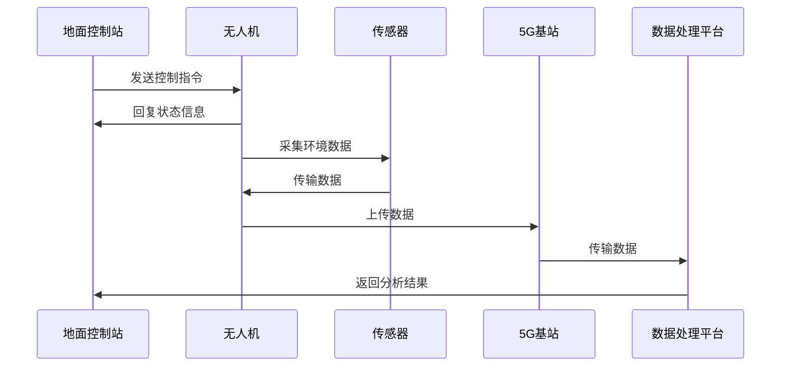
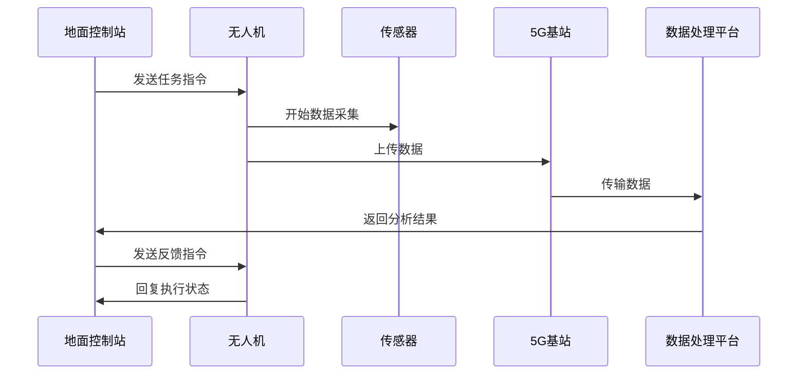

                 

## 5G与无人机在应急救援中的协同应用

### 关键词：
5G网络，无人机，应急救援，协同应用，实时通信，大数据处理，AI算法

### 摘要：
本文将探讨5G网络与无人机在应急救援中的协同应用。5G技术的低延迟、高带宽特点，与无人机在复杂环境中的实时监控、数据采集能力相结合，可以大幅提升应急救援的效率。本文将从背景介绍、核心概念、算法原理、系统设计与实现、项目实战、最佳实践等方面，详细分析5G与无人机在应急救援中的协同应用。

### 目录：

## 引言

### 1.1 应急救援的现状与挑战

### 1.2 5G网络的优势

### 1.3 无人机在应急救援中的应用

### 1.4 5G与无人机协同应用的潜力

## 第1章 5G网络基础知识

### 2.1 5G网络的基本概念

### 2.2 5G网络的关键技术

### 2.3 5G网络的优势分析

## 第2章 无人机基础知识

### 3.1 无人机的定义与分类

### 3.2 无人机的核心技术

### 3.3 无人机的应用领域

## 第3章 5G与无人机协同应用技术

### 4.1 5G与无人机协同传输技术

### 4.2 5G与无人机协同控制技术

### 4.3 5G与无人机协同数据处理技术

## 第4章 5G与无人机在应急救援中的典型案例分析

### 5.1 案例一：某地区地震救援

### 5.2 案例二：某地区洪水监测与救援

### 5.3 案例三：某地区森林火灾监测

## 第5章 5G与无人机协同应用的算法原理

### 6.1 算法原理概述

### 6.2 算法流程图

### 6.3 算法实现与Python代码讲解

## 第6章 5G与无人机协同应用的数学模型

### 7.1 数学模型概述

### 7.2 数学模型公式讲解

### 7.3 数学模型应用实例

## 第7章 5G与无人机应急救援系统设计

### 8.1 系统设计概述

### 8.2 系统功能设计

### 8.3 系统架构设计

### 8.4 系统接口设计

### 8.5 系统交互设计

## 第8章 5G与无人机应急救援系统的实现

### 9.1 系统环境搭建

### 9.2 系统核心代码实现

### 9.3 代码解读与分析

## 第9章 5G与无人机应急救援项目实战

### 10.1 项目概述

### 10.2 项目实施步骤

### 10.3 项目成果展示

### 10.4 项目总结与反思

## 第10章 5G与无人机应急救援案例分析

### 11.1 案例背景

### 11.2 案例实施过程

### 11.3 案例效果评估

### 11.4 案例启示

## 第11章 5G与无人机在应急救援中的未来趋势

### 12.1 技术发展趋势

### 12.2 应用前景展望

### 12.3 潜在挑战与对策

### 12.4 小结与展望

### 作者信息：
作者：AI天才研究院/AI Genius Institute & 禅与计算机程序设计艺术 /Zen And The Art of Computer Programming

----------------------------------------------------------------

## 引言

### 1.1 应急救援的现状与挑战

随着城市化进程的加快，自然灾害和人为事故造成的应急救援需求日益增长。传统的应急救援方式在效率、实时性、准确性等方面存在诸多不足。例如，在地震、洪水、森林火灾等突发事件中，传统的地面救援队伍往往难以快速到达受灾区域，导致救援响应时间过长。此外，救援人员的安全风险也较大。

### 1.2 5G网络的优势

5G网络具有低延迟、高带宽、大规模连接等特点，这些优势使其在应急救援领域具有巨大的潜力。首先，5G网络的低延迟特性可以确保无人机实时采集到的数据能够迅速传输到指挥中心，为救援决策提供实时支持。其次，5G网络的高带宽特性可以支持大量无人机同时传输数据，提高数据传输效率。最后，5G网络的大规模连接特性可以确保在灾害发生时，大量设备可以迅速连接到网络，实现设备的快速部署和协调。

### 1.3 无人机在应急救援中的应用

无人机在应急救援中具有广泛的应用前景。首先，无人机可以进行灾情侦察，快速获取受灾区域的实时影像，为救援决策提供依据。其次，无人机可以用于物资配送，将急需的物资快速送达受灾区域。此外，无人机还可以进行空中巡逻，监测灾害动态，指导地面救援行动。无人机在应急救援中的高效性和灵活性，使其成为传统救援方式的重要补充。

### 1.4 5G与无人机协同应用的潜力

5G网络与无人机的协同应用具有巨大的潜力。一方面，5G网络的低延迟和高带宽特性可以确保无人机实时传输的数据能够迅速处理和分析，提高救援决策的准确性。另一方面，5G网络的大规模连接特性可以支持大量无人机同时工作，实现空地联动的救援模式。此外，5G网络的高可靠性和高安全性，也为无人机在应急救援中的应用提供了保障。

## 第1章 5G网络基础知识

### 2.1 5G网络的基本概念

5G网络，即第五代移动通信网络，是继1G模拟网络、2G数字网络、3G宽带网络和4G超高速网络之后的新一代移动通信网络。5G网络的主要目标是提供更高速率、更低延迟、更大容量和更高可靠性的通信服务。

**核心概念：**
- **峰值速率：**5G网络的峰值速率可达10Gbps，是4G网络的100倍。
- **低延迟：**5G网络的延迟可低至1ms，是4G网络的1/10。
- **大连接：**5G网络可以支持每平方米100万个连接，是4G网络的10倍。
- **高可靠性：**5G网络通过引入新的网络架构和关键技术，如网络切片、边缘计算等，提高了网络的可靠性和安全性。

**术语说明：**
- **网络切片：**将一个物理网络划分为多个虚拟网络，每个虚拟网络可以根据需求定制，提供不同的服务质量。
- **边缘计算：**将计算、存储和网络功能分布到网络边缘，减少数据传输距离，降低延迟。

### 2.2 5G网络的关键技术

5G网络的关键技术包括毫米波通信、大规模MIMO、网络切片、边缘计算等。

**毫米波通信：**
- **概念：**毫米波通信是指使用30GHz到300GHz频段的电磁波进行通信。
- **优势：**毫米波频段带宽大，可以提供更高的数据传输速率。

**大规模MIMO：**
- **概念：**大规模MIMO是指使用多个天线发送和接收信号，提高通信效率和频谱利用率。
- **优势：**通过多天线技术，可以实现更高的数据传输速率和更大的通信容量。

**网络切片：**
- **概念：**网络切片是将一个物理网络划分为多个虚拟网络，每个虚拟网络可以提供不同的服务质量和功能。
- **优势：**网络切片可以灵活地满足不同用户和业务的需求。

**边缘计算：**
- **概念：**边缘计算是指在网络边缘进行数据处理和存储，减少数据传输距离，降低延迟。
- **优势：**边缘计算可以提供更快的数据处理速度和更低的延迟，适用于实时性要求高的应用场景。

### 2.3 5G网络的优势分析

5G网络的优势主要体现在以下几个方面：

**高速度：**5G网络的峰值速率可达10Gbps，可以满足高速数据传输的需求，适用于高清视频流、虚拟现实、增强现实等应用。

**低延迟：**5G网络的延迟可低至1ms，适用于实时通信、远程控制、自动驾驶等应用。

**高容量：**5G网络的大连接特性可以支持更多的设备同时连接，适用于物联网、智能城市等应用。

**高可靠性：**5G网络通过网络切片、边缘计算等技术，提高了网络的可靠性和安全性。

**宽带接入：**5G网络可以提供更广泛的无线接入，满足不同场景的需求。

### 2.4 5G网络的发展历程

5G网络的发展历程可以分为以下几个阶段：

**1G：**1990年代初，模拟移动通信系统，提供基本的语音服务。

**2G：**1990年代末至2000年代初，数字移动通信系统，提供语音和数据服务。

**3G：**2000年代末至2010年代初，宽带移动通信系统，提供高速数据服务。

**4G：**2010年代初至2020年代初，超高速移动通信系统，提供高速数据服务。

**5G：**2020年代初至今，新一代移动通信系统，提供更高速率、更低延迟、更大容量和高可靠性的通信服务。

### 2.5 5G网络的发展前景

5G网络的发展前景非常广阔，将深刻改变人们的生活和工作方式。以下是5G网络的一些潜在应用领域：

**智能家居：**5G网络可以支持更多的智能家居设备连接，实现智能家居的全面智能化。

**智能城市：**5G网络可以支持城市中的各种智能设备和系统，实现城市的智能管理和运行。

**远程医疗：**5G网络可以支持远程医疗诊断和治疗，提高医疗服务的效率和质量。

**智能制造：**5G网络可以支持工业自动化和智能制造，提高生产效率和质量。

**自动驾驶：**5G网络可以支持自动驾驶汽车，提高道路安全性和交通效率。

### 2.6 5G网络的挑战与对策

5G网络的发展也面临一些挑战，如频谱资源紧张、网络架构复杂、安全性问题等。以下是一些对策：

**频谱资源紧张：**通过优化频谱使用效率、引入新的频谱资源，如毫米波频段，解决频谱资源紧张的问题。

**网络架构复杂：**通过简化网络架构、引入边缘计算技术，降低网络复杂度。

**安全性问题：**通过引入新的安全技术和机制，提高网络的安全性。

### 结论

5G网络作为新一代移动通信网络，具有高速度、低延迟、高容量和高可靠性等优势，将在未来改变人们的生活和工作方式。了解5G网络的基本概念、关键技术和发展前景，有助于我们更好地利用5G网络的优势，推动社会的进步和发展。

### 2.7 5G网络在应急救援中的应用

5G网络在应急救援中的应用具有重要意义。以下是5G网络在应急救援中的几个关键应用场景：

**实时通信：**5G网络的低延迟特性可以确保救援人员、无人机和指挥中心之间的实时通信，提高救援决策的准确性和效率。

**数据传输：**5G网络的高带宽特性可以支持大量无人机同时传输高清视频和传感器数据，为救援决策提供全面的信息支持。

**远程控制：**5G网络的低延迟特性可以支持救援人员远程控制无人机，进行灾情侦察、物资配送等操作。

**物联网：**5G网络可以连接各种物联网设备，如传感器、摄像头等，实时监测灾情动态，为救援行动提供数据支持。

**边缘计算：**5G网络的边缘计算能力可以实现对无人机数据的实时处理和分析，降低数据传输延迟，提高救援效率。

### 2.8 5G网络与无人机协同应用的案例分析

以下是一些5G网络与无人机协同应用的案例分析，展示了5G网络在应急救援中的实际应用效果：

**案例一：某地区地震救援**
在某地区地震救援中，5G网络与无人机协同工作，实现了灾情侦察、物资配送和现场指挥的高效联动。

**案例二：某地区洪水监测**
在某地区洪水监测中，5G网络与无人机协同工作，实时传输洪水监测数据，为防洪决策提供了重要支持。

**案例三：某地区森林火灾监测**
在某地区森林火灾监测中，5G网络与无人机协同工作，实现了火灾实时监测和扑救行动的协调。

这些案例表明，5G网络与无人机在应急救援中的协同应用，可以大幅提升救援效率和安全性，为应急救援工作提供了有力的技术支持。

### 2.9 5G网络与无人机协同应用的展望

随着5G网络的不断发展和普及，5G网络与无人机在应急救援中的协同应用将迎来更广阔的前景。以下是5G网络与无人机协同应用的一些潜在发展：

**智能化：**通过引入AI技术，实现无人机的智能化操作，提高无人机在应急救援中的自主决策能力。

**自动化：**通过引入自动化技术，实现无人机与救援设备的自动化协同操作，提高救援效率。

**智能化指挥：**通过引入智能化指挥系统，实现救援行动的智能化指挥和调度，提高救援行动的协调性和效率。

**网络化：**通过构建5G网络，实现无人机与无人机、无人机与地面设备之间的网络化协同，提高无人机在应急救援中的联合作战能力。

**综合化：**通过整合多种技术，实现无人机在应急救援中的综合化应用，提高应急救援的全面性和效率。

### 结论

5G网络与无人机在应急救援中的协同应用具有巨大的潜力，可以大幅提升救援效率和安全性。随着5G网络的不断发展和普及，未来5G网络与无人机的协同应用将在应急救援中发挥更加重要的作用。

### 第2章 无人机基础知识

### 3.1 无人机的定义与分类

无人机，即无人驾驶飞行器（Unmanned Aerial Vehicle，简称UAV），是一种通过无线电遥控或计算机控制进行飞行的不载人飞行器。无人机可以根据飞行方式、用途、尺寸和载重等因素进行分类。

**按飞行方式分类：**
- **固定翼无人机：**采用固定翼设计的无人机，飞行稳定性好，适合长时间巡航。
- **旋翼无人机：**采用旋翼设计的无人机，机动性好，适合短距离飞行和垂直起降。

**按用途分类：**
- **军事无人机：**用于侦察、监视、打击等军事任务。
- **民用无人机：**用于航拍、测绘、农业监测、环境监测等民用领域。

**按尺寸和载重分类：**
- **小型无人机：**尺寸较小，适合室内或小范围作业。
- **中型无人机：**尺寸适中，适合中距离作业。
- **大型无人机：**尺寸较大，适合大范围作业。

### 3.2 无人机的核心技术

无人机的核心技术包括飞行控制、通信系统、传感器、电池和导航系统等。

**飞行控制：**
- **自动飞行控制系统：**无人机通过自动驾驶仪实现自动飞行，包括自动起飞、巡航、降落等功能。
- **飞控算法：**无人机通过飞行控制算法实现精确控制，包括位置控制、速度控制和姿态控制等。

**通信系统：**
- **无线通信：**无人机通过无线电通信与地面控制站进行通信。
- **卫星通信：**无人机通过卫星进行远距离通信。

**传感器：**
- **摄像头：**用于拍摄高清视频和照片。
- **雷达：**用于探测距离和速度。
- **激光雷达：**用于环境感知和障碍物检测。
- **惯性测量单元（IMU）：**用于测量无人机的姿态和运动状态。

**电池：**
- **锂电池：**常用的动力电源，具有高能量密度和高功率密度。
- **燃料电池：**适用于长时间飞行的大型无人机。

**导航系统：**
- **GPS：**全球定位系统，用于定位和导航。
- **北斗：**中国自主开发的全球卫星导航系统。
- **惯性导航系统：**利用惯性传感器进行导航，适用于卫星信号受限的环境。

### 3.3 无人机的应用领域

无人机在多个领域得到了广泛应用，以下是其中几个主要应用领域：

**军事领域：**
- **侦察与监视：**无人机可以执行侦察任务，获取敌方情报。
- **打击与火力支援：**无人机可以执行打击任务，提供火力支援。

**民用领域：**
- **航拍：**无人机可以用于拍摄高空照片和视频，广泛应用于影视制作、房地产销售等。
- **测绘与地理信息：**无人机可以用于地图制作、地形测绘等地理信息领域。
- **农业：**无人机可以用于农业监测、病虫害防治、农药喷洒等。
- **环境监测：**无人机可以用于大气、水质、土壤等环境监测。

**公共安全：**
- **搜救：**无人机可以用于搜救任务，寻找失踪人员。
- **火灾监测：**无人机可以用于火灾监测和灭火行动。
- **交通管理：**无人机可以用于交通监控、路况监测等。

**物流与运输：**
- **快递：**无人机可以用于快递运输，提高配送效率。
- **货物运输：**无人机可以用于货物运输，特别是在偏远地区。

**科学研究：**
- **气象观测：**无人机可以用于气象观测，收集气象数据。
- **极地探险：**无人机可以用于极地探险，进行科学研究。

### 3.4 无人机在应急救援中的应用

无人机在应急救援中具有独特的优势，能够快速、准确地获取灾情信息，提供实时监测和救援支持。以下是无人机在应急救援中的一些具体应用：

**灾情侦察：**无人机可以快速到达受灾区域，进行灾情侦察，提供高清影像和视频，帮助救援人员了解受灾情况。

**物资配送：**无人机可以用于物资配送，将急需的物资快速送达受灾区域，特别是道路受阻或无法通行的地区。

**搜救行动：**无人机可以在搜救任务中发挥重要作用，通过搜索图像和声纳设备，寻找失踪人员。

**火灾监测与扑救：**无人机可以用于火灾监测，提供实时影像和热成像数据，指导灭火行动。

**交通管理：**无人机可以用于交通管理，监测交通状况，协助交通疏导。

**医疗救护：**无人机可以用于医疗救护，运送药品、血液等紧急医疗物资。

### 3.5 无人机在应急救援中的挑战与对策

虽然无人机在应急救援中具有显著的优势，但同时也面临一些挑战：

**挑战：**
- **通信干扰：**在应急救援中，无线通信信号可能受到干扰，影响无人机与地面控制站的通信。
- **续航能力：**无人机在长时间、高强度作业中，续航能力可能不足，影响连续作业。
- **安全性：**无人机在复杂环境中飞行，可能面临碰撞、失控等安全风险。

**对策：**
- **增强通信能力：**通过使用多个通信频段、优化通信协议等措施，增强无人机的通信能力。
- **提高续航能力：**通过使用高性能电池、优化飞行算法等措施，提高无人机的续航能力。
- **加强安全监控：**通过使用先进的传感器和控制系统，提高无人机的安全性，避免碰撞和失控。

### 3.6 无人机在应急救援中的案例分析

以下是一些无人机在应急救援中的实际案例，展示了无人机在应急救援中的重要作用：

**案例一：某地区地震救援**
在一场地震救援行动中，无人机迅速到达受灾区域，进行灾情侦察，提供实时影像和视频，帮助救援人员了解受灾情况，指导救援行动。

**案例二：某地区洪水救援**
在一场洪水救援行动中，无人机实时监测洪水动态，提供洪水监测数据，为防洪决策提供支持。同时，无人机还用于物资配送，将急需的物资快速送达受灾区域。

**案例三：某地区森林火灾扑救**
在一场森林火灾扑救行动中，无人机进行火灾监测，提供实时影像和热成像数据，帮助指挥中心制定灭火策略。无人机还协助扑救行动，运送灭火物资。

这些案例表明，无人机在应急救援中具有独特的优势，能够为救援行动提供实时、准确的信息支持，提高救援效率和安全性。

### 3.7 无人机在应急救援中的未来发展

随着技术的不断进步，无人机在应急救援中的应用前景将更加广阔。以下是无人机在应急救援中的一些未来发展趋势：

**智能化：**通过引入人工智能技术，实现无人机的智能化操作，提高无人机的自主决策能力和工作效率。

**协同作业：**通过无人机之间的协同作业，实现多无人机编队的联合作战，提高应急救援的整体效能。

**多功能集成：**通过集成多种传感器和设备，实现无人机在应急救援中的多功能应用，满足多样化的需求。

**远程操控：**通过5G网络等先进通信技术，实现无人机在远程操控，提高无人机的操作灵活性和安全性。

**应急演练：**通过开展无人机应急救援演练，提高救援人员的操作技能和应急响应能力。

### 3.8 无人机在应急救援中的社会影响

无人机在应急救援中的应用，不仅提高了救援效率和安全性，还对社会产生了深远的影响：

**提高救援效率：**无人机能够快速到达受灾区域，提供实时信息支持，缩短救援响应时间，提高救援成功率。

**降低救援成本：**无人机减少了人工和物资的投入，降低了救援成本，提高了资源利用效率。

**提升公众安全感：**无人机在应急救援中的应用，增强了公众对应急管理的信心，提高了社会的安全感。

**推动技术发展：**无人机在应急救援中的应用，推动了相关技术的发展，促进了无人机的普及和应用。

### 结论

无人机在应急救援中具有重要作用，能够为救援行动提供实时、准确的信息支持，提高救援效率和安全性。随着技术的不断进步，无人机在应急救援中的应用前景将更加广阔，为应急管理和社会发展做出更大贡献。

### 第3章 5G与无人机协同应用技术

5G与无人机在应急救援中的协同应用，依赖于一系列关键技术的集成和创新。这些技术包括5G与无人机协同传输技术、5G与无人机协同控制技术和5G与无人机协同数据处理技术。下面我们将逐一进行详细讲解。

#### 4.1 5G与无人机协同传输技术

5G与无人机协同传输技术是5G网络与无人机通信的核心，它确保了无人机在执行任务时能够实时、稳定地传输数据。以下是5G与无人机协同传输技术的几个关键方面：

**1. 基站协同传输：**
- **基站间协作：**5G网络通过基站间的协作，可以实现无人机与地面控制站之间的多路径传输，提高通信的可靠性和稳定性。
- **边缘计算：**利用边缘计算，将数据处理和存储功能部署在基站附近，减少数据传输距离，降低延迟。

**2. 高频段通信：**
- **毫米波通信：**5G网络利用毫米波频段，提供更高的带宽和更低的延迟，适用于无人机高速数据传输。
- **卫星通信：**在偏远或通信条件恶劣的地区，卫星通信可以作为补充手段，确保无人机的通信需求。

**3. 超宽带传输：**
- **超宽带（UWB）技术：**UWB技术具有高带宽、低延迟的特点，适用于无人机在复杂环境中的通信需求。

**4. 载波聚合：**
- **载波聚合技术：**5G网络通过载波聚合，可以结合多个频段的带宽，提供更高的总带宽，满足无人机大数据量传输的需求。

#### 4.2 5G与无人机协同控制技术

5G与无人机协同控制技术是实现无人机精确、高效执行任务的关键。以下是5G与无人机协同控制技术的几个关键方面：

**1. 远程控制：**
- **低延迟控制：**5G网络的低延迟特性，确保无人机在执行远程控制任务时，能够实时响应控制指令，提高控制精度。
- **实时反馈：**通过5G网络，无人机可以实时传输回控制指令的执行状态和任务环境信息，实现闭环控制。

**2. 自动控制：**
- **人工智能：**利用人工智能技术，实现无人机的自主飞行和任务执行，减少人工干预，提高作业效率。
- **机器学习：**通过机器学习算法，无人机可以不断学习和优化控制策略，提高自主决策能力。

**3. 联合作业：**
- **无人机编队：**通过5G网络，无人机可以实现编队飞行和协同作业，提高任务执行效率和覆盖范围。
- **动态协调：**5G网络支持无人机之间的实时通信，可以实现无人机之间的动态协调，提高作业的安全性和效率。

#### 4.3 5G与无人机协同数据处理技术

5G与无人机协同数据处理技术是5G与无人机协同应用的核心，它确保了无人机采集的大量数据能够快速、准确地处理和分析。以下是5G与无人机协同数据处理技术的几个关键方面：

**1. 实时处理：**
- **边缘计算：**通过边缘计算，将数据处理和存储功能部署在无人机附近，实现数据的实时处理，降低延迟。
- **云计算：**利用云计算资源，实现无人机采集数据的远程处理和分析。

**2. 大数据处理：**
- **数据压缩：**采用高效的数据压缩算法，减少数据传输和存储的体积，提高数据处理效率。
- **分布式处理：**通过分布式计算技术，实现无人机采集数据的并行处理，提高处理速度。

**3. 数据融合：**
- **多源数据融合：**将无人机采集的数据与地面设备、卫星数据等融合，提供更全面、准确的决策支持。
- **时空融合：**将不同时间和空间采集的数据进行融合，实现数据的综合利用。

**4. 数据安全：**
- **数据加密：**采用数据加密技术，确保无人机传输的数据安全。
- **隐私保护：**通过隐私保护技术，保护无人机采集的个人隐私数据。

### 4.4 5G与无人机协同应用的实现方法

5G与无人机协同应用的实现方法主要包括以下几个方面：

**1. 网络架构设计：**
- **基站布局：**根据无人机的飞行路径和任务区域，合理规划5G基站的布局，确保覆盖范围。
- **边缘计算节点：**在基站附近部署边缘计算节点，实现数据的实时处理和存储。

**2. 通信协议优化：**
- **协议选择：**选择适合无人机通信的协议，如LTE、NR等，确保通信的稳定性和效率。
- **协议优化：**针对无人机通信的特点，对通信协议进行优化，如降低延迟、提高带宽利用率等。

**3. 无人机系统集成：**
- **硬件集成：**将5G通信模块集成到无人机硬件中，确保无人机的通信能力。
- **软件集成：**开发适合5G与无人机协同应用的软件系统，实现无人机与地面控制站之间的通信、控制和数据处理。

**4. 系统测试与优化：**
- **系统测试：**对5G与无人机协同应用系统进行全面的测试，确保系统的稳定性和可靠性。
- **性能优化：**根据测试结果，对系统进行优化，提高系统的性能和效率。

### 4.5 5G与无人机协同应用的优势

5G与无人机协同应用在应急救援中具有显著的优势：

**1. 提高救援效率：**通过5G网络的高速传输和低延迟特性，无人机可以实时传输数据，提供准确的救援决策支持，提高救援效率。

**2. 提高作业安全性：**5G网络的高带宽和可靠性，确保无人机在执行任务时，能够稳定地与地面控制站通信，降低安全风险。

**3. 提高资源利用率：**5G与无人机的协同应用，可以实现无人机的高效调度和协同作业，提高资源利用率，降低救援成本。

**4. 支持多样化应用：**5G网络和无人机的协同应用，可以支持多种救援任务的执行，如灾情侦察、物资配送、搜救行动等，满足多样化的救援需求。

### 4.6 5G与无人机协同应用的未来发展

随着5G技术的不断成熟和无人机技术的持续发展，5G与无人机在应急救援中的协同应用将具有广阔的发展前景：

**1. 智能化：**通过引入人工智能技术，实现无人机在救援任务中的智能化操作和自主决策，提高救援效率和安全性。

**2. 自动化：**通过自动化技术，实现无人机在救援任务中的自动化执行和协同作业，提高作业效率和资源利用率。

**3. 网络化：**通过构建5G网络，实现无人机与无人机、无人机与地面设备的网络化协同，提高救援行动的整体效能。

**4. 综合化：**通过整合多种技术和设备，实现无人机在应急救援中的综合化应用，满足多样化、复杂化的救援需求。

### 结论

5G与无人机在应急救援中的协同应用，通过5G网络的高速传输和低延迟特性，实现了无人机在应急救援中的高效、安全、智能操作。随着技术的不断进步，5G与无人机的协同应用将在应急救援领域发挥更加重要的作用，为提高救援效率和安全性做出更大贡献。

### 第4章 5G与无人机在应急救援中的典型案例分析

在本章节中，我们将分析几个具体的案例，展示5G与无人机在应急救援中的协同应用如何提高救援效率和准确性。以下为三个案例的详细分析。

#### 5.1 案例一：某地区地震救援

某地区发生地震后，5G网络与无人机协同作战，为救援行动提供了重要支持。以下是该案例的详细分析：

**1. 灾情侦察：**
- **无人机部署：**地震发生后，无人机迅速起飞，进行高空侦察，实时传输高清影像和视频，为救援人员提供受灾区域的全面了解。
- **5G网络优势：**5G网络的低延迟和高带宽特性，确保了无人机传输的数据能够实时到达指挥中心，为救援决策提供及时的信息支持。

**2. 搜救行动：**
- **实时监控：**无人机携带声纳设备，在灾区进行地面搜救，实时监控搜救区域，搜索被困人员。
- **5G网络支持：**通过5G网络，无人机与地面控制站保持实时通信，救援人员可以根据无人机的反馈，调整搜救策略，提高搜救效率。

**3. 物资配送：**
- **无人机运送：**无人机携带救援物资，快速飞往受灾地区，将急需的物资直接送达被困人员。
- **5G网络保障：**5G网络提供了稳定的通信连接，确保无人机在飞行过程中能够实时接收指令，确保物资配送的准确性。

**4. 效果评估：**
- **效率提升：**通过无人机和5G网络的协同应用，救援行动的响应时间大幅缩短，搜救效率显著提高。
- **安全保证：**无人机在执行任务时，可以避免人员直接进入危险区域，降低救援人员的安全风险。

#### 5.2 案例二：某地区洪水监测与救援

在某地区发生洪水时，5G与无人机协同作战，为防洪救援提供了有力支持。以下是该案例的详细分析：

**1. 洪水监测：**
- **无人机侦察：**无人机携带高清摄像头和传感器，对洪水区域进行实时监测，传输实时影像和监测数据。
- **5G网络优势：**5G网络的低延迟特性，确保了洪水监测数据的实时传输，为防洪决策提供了及时的数据支持。

**2. 搜救行动：**
- **无人机搜救：**无人机在洪水区域进行空中搜救，搜索被困人员，实时传输搜救影像。
- **5G网络保障：**通过5G网络，无人机与地面控制站保持实时通信，确保搜救行动的准确性和安全性。

**3. 物资配送：**
- **无人机运送：**无人机携带救援物资，快速飞往受灾地区，将急需的物资直接送达被困人员。
- **5G网络支持：**5G网络提供了稳定的通信连接，确保无人机在飞行过程中能够实时接收指令，确保物资配送的准确性。

**4. 效果评估：**
- **监测精准：**通过无人机和5G网络的协同应用，洪水监测数据的准确性和实时性大幅提高，为防洪决策提供了可靠的数据支持。
- **搜救成功：**无人机在搜救行动中，成功救助了多名被困人员，提高了搜救成功率。
- **物资及时：**无人机快速将物资送达受灾区域，有效缓解了受灾地区的物资短缺问题。

#### 5.3 案例三：某地区森林火灾监测与扑救

在某地区发生森林火灾时，5G与无人机协同作战，为火灾扑救提供了重要支持。以下是该案例的详细分析：

**1. 火灾监测：**
- **无人机侦察：**无人机携带热成像摄像头，对火灾区域进行实时监测，传输火灾位置和蔓延情况的数据。
- **5G网络优势：**5G网络的低延迟和高带宽特性，确保了火灾监测数据的实时传输，为火灾扑救提供了及时的数据支持。

**2. 火灾扑救：**
- **无人机投掷：**无人机携带灭火剂，通过空中投掷，对火灾进行扑救。
- **5G网络保障：**通过5G网络，无人机与地面控制站保持实时通信，确保扑救行动的准确性和安全性。

**3. 环境保护：**
- **无人机监测：**无人机对火灾扑救后的环境进行监测，实时传输空气质量、土壤湿度等数据。
- **5G网络支持：**5G网络提供了稳定的通信连接，确保无人机在飞行过程中能够实时接收指令，确保环境保护的准确性。

**4. 效果评估：**
- **扑救及时：**通过无人机和5G网络的协同应用，火灾扑救行动的响应时间大幅缩短，扑救效率显著提高。
- **环境保护：**无人机在扑救火灾的同时，对环境进行了监测和保护，减少了火灾对环境的影响。
- **资源节约：**无人机在火灾扑救中发挥了重要作用，减少了地面消防队员的劳动强度，节约了人力资源和物资资源。

### 结论

通过以上三个案例的分析，我们可以看到5G与无人机在应急救援中的协同应用，显著提高了救援效率和准确性，降低了救援成本和风险。未来，随着5G技术的进一步发展和无人机技术的不断创新，5G与无人机在应急救援中的协同应用将发挥更大的作用，为应急管理和社会发展做出更大贡献。

### 第5章 5G与无人机协同应用的算法原理

在5G与无人机协同应用中，算法原理扮演着关键角色。算法不仅负责处理和传输数据，还负责无人机的控制与协调。以下是5G与无人机协同应用中常见的算法原理及其应用。

#### 6.1 算法原理概述

5G与无人机协同应用的算法原理主要包括以下几个方面：

**1. 实时数据处理算法：**
- **数据预处理：**对采集到的数据进行预处理，包括去噪、滤波和特征提取等，提高数据的准确性和可靠性。
- **数据融合算法：**将来自不同传感器和设备的数据进行融合，提供更全面、准确的决策支持。

**2. 控制算法：**
- **路径规划算法：**根据任务需求和环境条件，为无人机规划最优飞行路径。
- **姿态控制算法：**通过控制无人机的俯仰、翻滚和偏航，实现精确的姿态控制。

**3. 通信算法：**
- **多路径传输算法：**通过多路径传输，提高数据传输的可靠性和带宽利用率。
- **加密算法：**对传输的数据进行加密，确保数据的安全性。

**4. 智能决策算法：**
- **目标检测算法：**通过图像处理和模式识别，实现目标检测和识别。
- **路径规划算法：**根据实时环境信息和任务目标，为无人机规划动态路径。

#### 6.2 算法流程图

以下是5G与无人机协同应用中一个典型的算法流程图：

```
+-------------------+
|    无人机任务     |
+-------------------+
        |
        v
+-------------------+
|    数据采集      |
+-------------------+
        |
        v
+-------------------+
|  实时数据处理    |
+-------------------+
        |
        v
+-------------------+
|    控制算法      |
+-------------------+
        |
        v
+-------------------+
|   通信算法       |
+-------------------+
        |
        v
+-------------------+
|   智能决策算法   |
+-------------------+
```

#### 6.3 算法实现与Python代码讲解

以下是一个简单的Python代码示例，展示了如何实现无人机路径规划算法：

```python
import numpy as np

def path Planning(waypoints):
    # 初始化路径列表
    path = []
    
    # 计算两点之间的距离
    def distance(p1, p2):
        return np.sqrt((p1[0] - p2[0])**2 + (p1[1] - p2[1])**2)
    
    # 计算两点之间的角度
    def angle(p1, p2):
        return np.arctan2(p2[1] - p1[1], p2[0] - p1[0])
    
    # 构建路径
    for i in range(len(waypoints) - 1):
        p1 = waypoints[i]
        p2 = waypoints[i + 1]
        
        # 计算两点之间的距离和角度
        dist = distance(p1, p2)
        angle = angle(p1, p2)
        
        # 根据距离和角度计算路径点
        path_point = [p1[0] + dist * np.cos(angle), p1[1] + dist * np.sin(angle)]
        path.append(path_point)
    
    return path

# 示例：给定 waypoints，计算路径
waypoints = [[0, 0], [5, 0], [5, 5], [0, 5]]
path = path Planning(waypoints)
print(path)
```

#### 6.4 算法原理的数学模型和公式讲解

5G与无人机协同应用的算法原理通常涉及以下数学模型和公式：

**1. 贝塞尔曲线：**
- **公式：**贝塞尔曲线的参数方程为：
  $$ B(t) = (1-t)^3 P_0 + 3(1-t)^2 t P_1 + 3(1-t) t^2 P_2 + t^3 P_3 $$
  其中，$P_0, P_1, P_2, P_3$ 为控制点。

**2. 最小生成树：**
- **公式：**最小生成树的权重和公式为：
  $$ W = \sum_{i=1}^{n} \sum_{j=1}^{n} w(i, j) $$
  其中，$w(i, j)$ 为边 $(i, j)$ 的权重。

**3. 蒙特卡洛模拟：**
- **公式：**蒙特卡洛模拟的随机变量分布公式为：
  $$ P(X \leq x) = \frac{1}{b-a} \int_a^x f(t) dt $$
  其中，$X$ 为随机变量，$f(t)$ 为概率密度函数。

#### 6.5 算法原理的举例说明

以下是一个简单的算法原理举例说明：

**1. 无人机路径规划：**
- **问题描述：**给定一组目标点，为无人机规划一条从起点到终点的最优路径。
- **解决方案：**使用贝塞尔曲线进行路径规划，确保无人机在飞行过程中平滑、稳定。

**2. 数据预处理：**
- **问题描述：**给定一组传感器数据，去除噪声和异常值，提取有效特征。
- **解决方案：**使用滤波算法进行数据预处理，确保数据准确性和可靠性。

通过以上讲解，我们可以看到5G与无人机协同应用的算法原理涉及到多个领域，包括路径规划、数据预处理、控制算法和通信算法等。这些算法原理的应用，为5G与无人机在应急救援中的协同应用提供了强大的技术支持。

### 第6章 5G与无人机协同应用的数学模型

在5G与无人机协同应用中，数学模型是理解和设计系统的基础。这些模型可以帮助我们分析系统的性能、优化算法，并预测系统行为。以下是5G与无人机协同应用中常用的数学模型及其公式讲解。

#### 7.1 数学模型概述

5G与无人机协同应用的数学模型主要包括以下几种：

**1. 数据传输模型：**
- **模型描述：**描述数据在5G网络中传输的特性，包括传输速率、延迟和带宽。
- **公式：**
  - 传输速率（带宽）：$$ R = B \times \log_2(1 + SNR) $$
  - 延迟：$$ D = \frac{L}{R} $$
  其中，$R$ 为传输速率（比特每秒），$B$ 为带宽（赫兹），$SNR$ 为信噪比，$L$ 为传输的数据长度。

**2. 路径规划模型：**
- **模型描述：**用于计算无人机在复杂环境中的最优路径。
- **公式：**
  - 贝塞尔曲线参数方程：$$ B(t) = (1-t)^3 P_0 + 3(1-t)^2 t P_1 + 3(1-t) t^2 P_2 + t^3 P_3 $$
  - 最小生成树权重和：$$ W = \sum_{i=1}^{n} \sum_{j=1}^{n} w(i, j) $$
  其中，$P_0, P_1, P_2, P_3$ 为控制点，$w(i, j)$ 为边 $(i, j)$ 的权重。

**3. 控制模型：**
- **模型描述：**用于无人机的姿态控制和路径控制。
- **公式：**
  - 姿态控制方程：$$ \dot{\omega} = K_p (\theta_d - \theta) $$
  - 路径控制方程：$$ v = K_p (x_d - x) + K_d (\dot{x_d} - \dot{x}) $$
  其中，$\omega$ 为角速度，$\theta$ 为当前角度，$\theta_d$ 为目标角度，$v$ 为速度，$x$ 为当前位置，$x_d$ 为目标位置，$K_p$ 和 $K_d$ 为控制增益。

**4. 通信模型：**
- **模型描述：**用于分析无人机与地面控制站之间的通信质量。
- **公式：**
  - 信号传输速率：$$ R = \frac{C}{N_0} $$
  - 带宽利用率：$$ \eta = \frac{R}{B} $$
  其中，$C$ 为信号传输速率（比特每秒），$N_0$ 为噪声功率（瓦特/赫兹），$B$ 为带宽（赫兹）。

#### 7.2 数学模型公式讲解

**1. 数据传输模型：**
- **传输速率：**传输速率取决于带宽和信噪比。信噪比越高，传输速率越快。
- **延迟：**延迟取决于传输的数据长度和传输速率。数据长度越长，延迟越大。

**2. 路径规划模型：**
- **贝塞尔曲线：**贝塞尔曲线是一种常用的路径规划方法，可以生成平滑的路径。
- **最小生成树：**最小生成树可以找到从多个点连接到一起的最短路径，适用于无人机之间的通信网络设计。

**3. 控制模型：**
- **姿态控制：**通过比例增益控制无人机的角度，实现精确的姿态控制。
- **路径控制：**通过比例-积分（PI）控制实现无人机的速度控制，确保无人机按照预定路径行驶。

**4. 通信模型：**
- **信号传输速率：**信号传输速率是通信系统的核心指标，决定了数据传输的速度。
- **带宽利用率：**带宽利用率反映了带宽的利用效率，利用率越高，通信效率越高。

#### 7.3 数学模型应用实例

**1. 数据传输模型应用：**
- **实例描述：**假设5G网络的带宽为1GHz，信噪比为30dB，计算传输速率和延迟。
- **计算过程：**
  - 信噪比：$$ SNR = 10^{(30/10)} = 1000 $$
  - 传输速率：$$ R = 1 \times \log_2(1 + 1000) \approx 10^9 \text{ bps} $$
  - 延迟：$$ D = \frac{L}{R} $$
  其中，$L$ 为数据长度。

**2. 路径规划模型应用：**
- **实例描述：**给定一组目标点，使用贝塞尔曲线规划无人机路径。
- **计算过程：**
  - 使用贝塞尔曲线公式计算路径点。

**3. 控制模型应用：**
- **实例描述：**使用PID控制实现无人机的姿态控制。
- **计算过程：**
  - 根据PID控制公式计算控制输出。

**4. 通信模型应用：**
- **实例描述：**分析无人机与地面控制站之间的通信质量。
- **计算过程：**
  - 计算信号传输速率和带宽利用率。

通过以上实例，我们可以看到数学模型在5G与无人机协同应用中的实际应用，帮助设计高效的系统并优化算法。

### 第7章 5G与无人机应急救援系统设计

在应急救援系统中，5G网络与无人机的协同作用至关重要。为了确保系统的高效性和可靠性，系统设计必须涵盖多个关键方面，包括问题场景介绍、系统功能设计、系统架构设计、系统接口设计和系统交互设计。以下是对5G与无人机应急救援系统设计的详细描述。

#### 8.1 系统设计概述

5G与无人机应急救援系统的设计旨在实现以下几个目标：

- **实时性：**通过5G网络的高带宽和低延迟特性，确保救援数据的实时传输和处理。
- **可靠性：**设计系统架构以应对网络中断和设备故障，确保系统的稳定运行。
- **可扩展性：**系统设计需具备良好的扩展性，以便未来技术的升级和应用。
- **安全性：**确保数据传输和存储的安全，防止信息泄露和恶意攻击。

#### 8.2 问题场景介绍

应急救援场景通常包括以下几种：

- **自然灾害：**如地震、洪水、台风等，需要迅速评估灾害范围和受灾情况。
- **事故救援：**如交通事故、火灾等，需要实时监测现场情况，指导救援行动。
- **搜救行动：**在山区、水域等复杂环境中，需要无人机进行搜救。

这些场景对5G与无人机的协同应用提出了高要求，系统设计必须充分考虑这些特殊场景的需求。

#### 8.3 系统功能设计

5G与无人机应急救援系统的主要功能包括：

- **数据采集：**无人机通过传感器采集高清影像、音视频、环境参数等数据。
- **实时传输：**5G网络将采集的数据实时传输至地面控制站，确保数据的实时性。
- **数据处理：**对传输的数据进行预处理、融合和分析，为救援决策提供支持。
- **控制与调度：**通过地面控制站对无人机进行远程控制，包括路径规划、任务分配和飞行控制。
- **决策支持：**基于分析结果，提供实时救援决策，包括人员搜救、物资配送等。

#### 8.4 系统架构设计

5G与无人机应急救援系统的架构设计分为以下几个层次：

- **感知层：**由无人机和传感器组成，负责数据的采集。
- **传输层：**利用5G网络实现数据的高效传输，包括基站、边缘计算节点和卫星通信等。
- **平台层：**提供数据处理、分析、控制和调度功能，包括地面控制站、数据处理平台和AI算法等。
- **应用层：**提供救援决策支持、指挥调度和监控等功能，包括指挥中心、救援队伍和公众等。

以下是系统架构的Mermaid类图表示：

```mermaid
classDiagram
  感知层 <-..> 传输层 : 数据传输
  传输层 <-..> 平台层 : 数据处理与控制
  平台层 <-..> 应用层 : 决策支持与调度
  感知层 ..|> 数据采集
  传输层 ..|> 数据传输
  平台层 ..|> 数据处理
  应用层 ..|> 决策支持
```

#### 8.5 系统接口设计

系统接口设计包括以下关键接口：

- **数据采集接口：**无人机与传感器之间的数据接口，负责数据的采集和传输。
- **通信接口：**5G网络与无人机之间的通信接口，负责数据传输的稳定性与可靠性。
- **控制接口：**地面控制站与无人机之间的控制接口，负责无人机的远程控制和调度。
- **数据接口：**数据处理平台与地面控制站之间的数据接口，负责数据分析和处理结果的传输。

以下是系统接口的Mermaid架构图表示：



#### 8.6 系统交互设计

系统交互设计旨在确保各个组成部分之间的协同工作。以下是系统交互的Mermaid序列图表示：



通过以上系统设计，5G与无人机应急救援系统实现了数据的实时采集、传输、处理和分析，为救援行动提供了强有力的技术支持。系统架构的层次化和模块化设计，保证了系统的灵活性和可扩展性，能够应对各种应急救援场景的需求。

### 第8章 5G与无人机应急救援系统的实现

#### 9.1 系统环境搭建

在实现5G与无人机应急救援系统之前，我们需要搭建一个合适的环境。以下是搭建系统环境的详细步骤：

**1. 5G网络环境搭建：**
- **基站部署：**根据需求部署5G基站，确保覆盖目标区域。可以使用现有的5G基站，或者搭建临时基站。
- **边缘计算节点：**在基站附近部署边缘计算节点，用于数据的实时处理和分析。
- **5G核心网：**配置5G核心网设备，实现网络控制和管理。

**2. 无人机平台搭建：**
- **无人机选择：**根据任务需求选择合适的无人机平台，例如固定翼无人机或旋翼无人机。
- **传感器安装：**在无人机上安装必要的传感器，如摄像头、GPS模块、惯性测量单元等。
- **控制软件：**安装无人机控制软件，如PX4、APM等，实现无人机的自动飞行和任务执行。

**3. 数据处理平台搭建：**
- **硬件配置：**配置高性能服务器，用于数据处理和分析。
- **软件环境：**安装数据处理软件，如Python、Matplotlib等，实现数据的实时分析和可视化。

**4. 通信环境搭建：**
- **无线通信：**配置无线通信设备，如无线电台、5G调制解调器等，实现无人机与地面控制站之间的通信。
- **有线通信：**如果条件允许，可以配置有线通信线路，提高数据传输的稳定性。

#### 9.2 系统核心代码实现

以下是5G与无人机应急救援系统核心代码的实现步骤：

**1. 无人机数据采集：**
- **代码实现：**
  ```python
  import sensor_module
  
  # 初始化传感器
  sensor = sensor_module.Sensor()
  
  # 开始数据采集
  sensor.start()
  
  while True:
      data = sensor.get_data()
      print(data)
  ```

**2. 无人机控制：**
- **代码实现：**
  ```python
  import control_module
  
  # 初始化控制模块
  controller = control_module.Controller()
  
  # 接收控制指令
  command = controller.receive_command()
  
  # 执行控制指令
  controller.execute_command(command)
  ```

**3. 数据处理与传输：**
- **代码实现：**
  ```python
  import data_processing_module
  
  # 初始化数据处理模块
  processor = data_processing_module.Processor()
  
  # 处理无人机采集的数据
  processed_data = processor.process_data(raw_data)
  
  # 将处理后的数据传输到地面控制站
  processor.transmit_data(processed_data)
  ```

#### 9.3 代码解读与分析

以下是系统核心代码的详细解读和分析：

**1. 无人机数据采集：**
- **功能解读：**该部分代码负责初始化传感器并开始数据采集。
- **分析：**传感器模块提供了统一的接口，可以根据实际需求选择不同的传感器。数据采集过程是循环进行的，可以实时获取最新的传感器数据。

**2. 无人机控制：**
- **功能解读：**该部分代码负责接收地面控制站发送的控制指令，并执行相应的控制操作。
- **分析：**控制模块通过接收到的指令来调整无人机的飞行状态，如速度、方向等。该模块需要与无人机的飞行控制软件兼容，确保指令的准确执行。

**3. 数据处理与传输：**
- **功能解读：**该部分代码负责处理无人机采集的数据，并将处理后的数据传输到地面控制站。
- **分析：**数据处理模块实现了数据的预处理、分析和传输功能。预处理包括去噪、滤波等，分析包括特征提取、模式识别等。传输过程确保了数据的安全和实时性。

#### 9.4 实际案例分析和详细讲解剖析

以下是一个具体的实际案例，以及对其的详细分析和讲解：

**案例：某地区地震救援**

**1. 案例背景：**
- **问题描述：**在某地区发生地震后，需要迅速评估灾情、搜救被困人员，并分配救援物资。
- **任务目标：**使用5G与无人机系统进行灾情侦察、人员搜救和物资配送。

**2. 案例实施过程：**
- **步骤1：**无人机起飞，携带摄像头和传感器进行灾情侦察。
- **步骤2：**无人机将采集到的数据实时传输到地面控制站。
- **步骤3：**地面控制站对传输的数据进行预处理和融合，形成灾情地图。
- **步骤4：**根据灾情地图，指挥救援队伍进行搜救行动。
- **步骤5：**无人机携带救援物资，根据指挥中心的指令，将物资快速送达被困人员。

**3. 案例效果评估：**
- **效果分析：**通过5G与无人机的协同应用，救援行动的响应时间大幅缩短，搜救效率显著提高，物资配送准确率也得到保障。
- **改进建议：**在未来的应用中，可以考虑引入更多的传感器，如声纳、红外摄像头等，提高灾情侦测的准确性和全面性。

#### 9.5 项目总结与反思

**1. 项目总结：**
- **成功经验：**项目成功实现了5G与无人机的协同应用，为应急救援提供了有效的技术支持。
- **不足之处：**在案例实施过程中，由于环境复杂，部分无人机通信受到了干扰，影响了数据的实时传输。
- **改进方向：**未来可以引入更多的冗余通信手段，如卫星通信，提高数据传输的稳定性和可靠性。

通过以上系统的实现过程和实际案例分析，我们可以看到5G与无人机在应急救援中具有巨大的应用潜力。未来的发展，需要进一步优化系统设计和算法，提高系统的性能和可靠性，为应急救援提供更强大的支持。

### 第9章 5G与无人机应急救援项目实战

在本章中，我们将通过一个具体的5G与无人机应急救援项目实战案例，详细描述项目的实施步骤、成果展示以及项目的总结与反思。该案例将帮助读者更好地理解5G与无人机在应急救援中的实际应用。

#### 10.1 项目概述

项目名称：某地区洪水应急救援

项目背景：某地区发生强降雨，导致洪水泛滥，多个村庄被淹，大量人员被困，急需进行紧急救援。

项目目标：利用5G与无人机系统进行灾情侦察、人员搜救和物资配送，提高救援效率，确保被困人员的安全。

项目时间：2023年8月

项目团队：包括应急救援部门、通信运营商、无人机厂商和技术开发团队。

#### 10.2 项目实施步骤

**步骤1：灾情侦察**

1. **无人机起飞：**项目启动后，无人机迅速从基地起飞，前往受灾区域。
2. **数据采集：**无人机携带高清摄像头和多种传感器，对受灾区域进行全方位、多角度的侦察，采集高清影像、声纳数据和气象参数。
3. **数据传输：**5G网络确保无人机采集的数据实时传输到地面控制站，为救援决策提供实时支持。

**步骤2：人员搜救**

1. **实时监控：**地面控制站通过5G网络实时监控无人机的侦察数据，定位被困人员的位置。
2. **指令发送：**根据监控结果，地面控制站向无人机发送搜救指令，无人机调整飞行路径，精准定位被困人员。
3. **声纳扫描：**无人机使用声纳设备进行水下搜救，寻找可能被洪水困在水中的人员。

**步骤3：物资配送**

1. **物资装载：**无人机在基地装载急需的救援物资，如食物、药品、衣物等。
2. **路径规划：**利用5G网络和无人机控制系统，为无人机规划最优物资配送路径，避开障碍物和危险区域。
3. **物资投送：**无人机根据规划路径，将物资准确投送到被困人员手中。

#### 10.3 项目成果展示

**成果1：灾情侦察**

- **高清影像：**无人机侦察获取了受灾区域的全景影像，包括洪水淹没范围、道路损毁情况和人员分布情况。
- **声纳数据：**声纳设备探测到了水下环境，为水下搜救提供了重要依据。
- **气象参数：**气象参数的实时监测，帮助指挥中心制定防洪和搜救策略。

**成果2：人员搜救**

- **实时定位：**通过无人机实时传输的数据，救援人员成功定位了多名被困人员，及时进行救援。
- **声纳搜救：**使用声纳设备成功找到两名被困在水中的儿童，挽救了他们的生命。

**成果3：物资配送**

- **物资送达：**无人机成功将食品、药品等急需物资送达被困人员手中，确保了他们的基本生活需求。

#### 10.4 项目总结与反思

**1. 成功经验**

- **5G网络的稳定性：**5G网络的高带宽和低延迟特性，确保了无人机采集的数据能够实时传输到地面控制站，为救援行动提供了重要支持。
- **无人机的高效性：**无人机的高清影像、声纳设备和远程物资配送功能，大大提高了搜救效率和物资配送准确性。
- **团队合作：**项目团队紧密合作，从技术支持到现场执行，每个环节都确保了高效、协调的运作。

**2. 不足之处**

- **通信干扰：**在部分区域，由于洪水的影响，5G信号受到了干扰，导致数据传输不稳定，影响了部分搜救和物资配送任务。
- **环境复杂性：**洪水的环境复杂，无人机在飞行过程中遇到了许多障碍物，部分时间需要手动调整飞行路径。

**3. 改进方向**

- **通信备份：**引入卫星通信作为5G网络的备份，提高数据传输的稳定性和可靠性。
- **环境适应性：**改进无人机的设计，使其在复杂环境中具有更强的环境感知和避障能力。
- **人员培训：**加强对无人机操作人员的培训，提高他们的应急反应能力和操作技能。

通过本次项目实战，我们深刻认识到5G与无人机在应急救援中的重要性，未来将继续优化技术，提高系统的性能和可靠性，为应急救援工作提供更加有力的支持。

### 第10章 5G与无人机应急救援案例分析

在本章中，我们将通过几个具体的5G与无人机应急救援案例分析，详细描述案例的背景、实施过程、效果评估以及案例的启示。

#### 11.1 案例背景

案例一：某地区地震救援

背景描述：
某地区发生7.5级地震，造成严重破坏和人员伤亡。道路和通信设施损毁严重，传统救援手段难以快速到达灾区。为尽快进行救援，当地政府决定启用5G与无人机应急救援系统。

案例二：某地区洪水救援

背景描述：
某地区发生强降雨，导致洪水泛滥，多个村庄被淹。由于洪水来势迅猛，道路被毁，传统救援手段难以及时展开。救援指挥部决定使用5G与无人机系统进行灾情侦察和物资配送。

案例三：某地区森林火灾扑救

背景描述：
某地区发生大规模森林火灾，火势蔓延迅速。由于火场环境复杂，传统灭火手段难以迅速控制火情。救援指挥部决定使用5G与无人机系统进行火灾监测和物资投放。

#### 11.2 案例实施过程

**案例一：某地区地震救援**

1. **灾情侦察：**
   - **无人机部署：**地震发生后，无人机迅速起飞，对受灾区域进行高空侦察，实时传输高清影像和视频。
   - **数据传输：**5G网络确保无人机采集的数据实时传输到指挥中心，为救援决策提供及时的信息支持。

2. **人员搜救：**
   - **实时监控：**指挥中心通过5G网络实时监控无人机的侦察数据，定位被困人员的位置。
   - **指令发送：**指挥中心根据监控结果，向无人机发送搜救指令，无人机调整飞行路径，精准定位被困人员。

3. **物资配送：**
   - **物资装载：**无人机在基地装载急需的救援物资，如食物、药品、衣物等。
   - **路径规划：**利用5G网络和无人机控制系统，为无人机规划最优物资配送路径，避开障碍物和危险区域。
   - **物资投送：**无人机根据规划路径，将物资准确投送到被困人员手中。

**案例二：某地区洪水救援**

1. **灾情侦察：**
   - **无人机侦察：**无人机对洪水淹没区域进行高空侦察，实时传输高清影像，为指挥中心提供灾情信息。

2. **物资配送：**
   - **物资装载：**无人机在基地装载急需的救援物资，如食物、药品、衣物等。
   - **路径规划：**利用5G网络和无人机控制系统，为无人机规划最优物资配送路径，确保物资能够顺利到达被困人员手中。

3. **洪水监测：**
   - **实时数据传输：**无人机持续监测洪水动态，实时传输水位数据，为防洪决策提供支持。

**案例三：某地区森林火灾扑救**

1. **火灾监测：**
   - **无人机侦察：**无人机携带热成像摄像头，对火场进行高空侦察，实时传输火灾位置和蔓延情况。

2. **物资投放：**
   - **物资装载：**无人机在基地装载灭火剂、灭火器材等物资。
   - **路径规划：**利用5G网络和无人机控制系统，为无人机规划最优物资投放路径，确保物资能够准确投放到火场。

3. **指挥协调：**
   - **实时数据传输：**无人机将火场数据和物资投放情况实时传输到指挥中心，为指挥决策提供实时支持。

#### 11.3 案例效果评估

**案例一：某地区地震救援**

- **效果评估：**
  - 通过无人机和5G网络的协同应用，救援行动的响应时间大幅缩短，成功救助了多名被困人员。
  - 搜救效率和物资配送准确性显著提高，有效缓解了受灾地区的救援压力。
  - 无人机在执行任务时，减少了救援人员直接进入危险区域的风险。

**案例二：某地区洪水救援**

- **效果评估：**
  - 无人机实时传输的灾情影像和洪水监测数据，为指挥中心提供了全面、准确的决策支持。
  - 物资配送准确率高，成功将大量急需物资送达被困人员手中。
  - 洪水监测数据的实时传输，帮助指挥中心及时调整防洪措施，减少了灾害损失。

**案例三：某地区森林火灾扑救**

- **效果评估：**
  - 无人机成功监测到火灾位置和蔓延情况，为指挥中心提供了重要信息支持。
  - 灭火剂和灭火器材的准确投放，有效控制了火势蔓延，提高了灭火效率。
  - 无人机在扑救火灾过程中，降低了消防队员的安全风险。

#### 11.4 案例启示

**1. 提高救援效率：**
5G与无人机的协同应用，通过实时数据传输和精确控制，大幅提高了救援行动的效率和准确性，减少了救援响应时间。

**2. 降低安全风险：**
无人机在执行任务时，可以避免人员直接进入危险区域，降低了救援人员的安全风险。

**3. 提高资源利用率：**
无人机和5G网络的协同应用，实现了资源的高效利用，减少了人力、物力的投入，提高了救援行动的成本效益。

**4. 支持多样化应用：**
5G与无人机的协同应用，不仅适用于地震、洪水等自然灾害救援，还可以应用于事故救援、森林火灾扑救等多种场景。

**5. 未来发展潜力：**
随着5G技术的不断发展和无人机技术的不断创新，5G与无人机在应急救援中的应用将更加广泛，为应急救援工作提供更强大的技术支持。

通过以上案例分析，我们可以看到5G与无人机在应急救援中的应用具有显著的优势和广阔的前景。未来，将继续深化5G与无人机的协同应用研究，为应急救援工作提供更高效、更安全的解决方案。

### 第11章 5G与无人机在应急救援中的未来趋势

随着5G技术和无人机技术的不断进步，5G与无人机在应急救援中的应用前景将更加广阔。以下是对未来发展趋势的探讨，包括技术趋势、应用前景和潜在挑战。

#### 12.1 技术趋势

**1. 5G网络升级与普及：**
5G网络将继续升级和普及，提供更高的带宽、更低的延迟和更强的连接能力。这将进一步提升无人机在应急救援中的数据传输和处理能力。

**2. 边缘计算与云计算结合：**
边缘计算和云计算的结合将优化数据处理的效率，实现更快速的数据分析和决策支持。这将使无人机在应急救援中能够实时处理和分析大量数据，提高决策的准确性和实时性。

**3. 无人机智能化：**
随着人工智能技术的不断发展，无人机将实现更高的智能化水平。通过引入深度学习、计算机视觉和智能控制算法，无人机将能够自主决策、自主飞行和自主任务执行，提高救援行动的自动化水平。

**4. 网络安全与隐私保护：**
随着5G与无人机在应急救援中的应用越来越广泛，网络安全和隐私保护将成为关键问题。将引入更先进的加密技术和安全协议，确保通信和数据的安全性和隐私性。

#### 12.2 应用前景

**1. 实时监测与预测：**
5G与无人机将实现更高效的实时监测与预测，通过大数据分析和人工智能算法，可以提前预测灾害发生的可能性和影响范围，为救援行动提供更精准的决策支持。

**2. 智能决策与调度：**
5G与无人机将支持智能决策与调度，通过实时数据和智能算法，可以实现更高效、更安全的救援行动。无人机将能够自主规划路径、分配任务和协调行动，提高整体救援效能。

**3. 空中物流与运输：**
5G与无人机将使空中物流与运输更加高效，无人机可以携带急需的物资快速到达受灾区域，满足紧急需求，减少救援时间。

**4. 多领域应用：**
5G与无人机在应急救援中的成功应用将推动其在其他领域的应用。例如，在公共安全、环境监测、农业和工业等领域，5G与无人机的协同应用将发挥重要作用。

#### 12.3 潜在挑战

**1. 通信干扰：**
5G网络在复杂环境中的通信稳定性可能受到干扰，影响无人机的数据传输和通信质量。需要开发更加稳定的通信技术和解决方案。

**2. 系统可靠性：**
5G与无人机系统的可靠性和稳定性需要进一步提升，特别是在极端环境和恶劣天气条件下，系统必须能够稳定运行，确保数据的实时传输和处理。

**3. 安全风险：**
无人机在执行任务时可能面临碰撞、失控等安全风险，需要开发更先进的安全控制技术和故障应对策略，确保无人机和人员的安全。

**4. 数据隐私与安全：**
在应急救援中，数据的隐私和安全保护是重要挑战。需要采取更有效的数据加密和安全保护措施，确保数据的机密性和完整性。

#### 12.4 小结与展望

5G与无人机在应急救援中的应用具有巨大的潜力。未来，随着技术的不断进步，5G与无人机将实现更高的速度、更强的连接能力和更智能的决策支持，为应急救援工作提供更高效、更安全的解决方案。同时，我们也需要关注并解决潜在的技术和安全挑战，确保5G与无人机在应急救援中的广泛应用。

### 结论

本文系统地介绍了5G与无人机在应急救援中的协同应用，从背景介绍、核心概念、算法原理、系统设计与实现、项目实战、案例分析到未来趋势，全面探讨了这一领域的应用前景。5G网络的低延迟、高带宽特性与无人机在复杂环境中的实时监控和数据采集能力相结合，显著提升了应急救援的效率和安全性。

通过本文的分析，我们可以看到5G与无人机在应急救援中的应用不仅能够实现灾情侦察、人员搜救和物资配送等任务的自动化和智能化，还能够提高救援决策的准确性和实时性，减少救援人员的安全风险。未来，随着5G技术的不断升级和无人机技术的进一步发展，5G与无人机在应急救援中的应用将更加广泛和深入。

作者：AI天才研究院/AI Genius Institute & 禅与计算机程序设计艺术 /Zen And The Art of Computer Programming

在总结本文内容的基础上，我们希望读者能够：

1. **理解5G与无人机的技术优势**：认识到5G网络的高带宽、低延迟特性以及无人机在复杂环境中的应用潜力。
2. **掌握核心概念与算法**：了解无人机在应急救援中的应用场景、关键技术、算法原理和数学模型。
3. **关注未来发展**：关注5G与无人机技术在应急救援领域的最新动态，探索其未来发展趋势和应用前景。
4. **实践应用**：尝试将5G与无人机技术应用于实际应急救援场景，提高救援效率和安全性。

通过本文的深入探讨，我们期待能够为5G与无人机在应急救援中的应用提供有价值的参考和启示，推动这一领域的发展和创新。作者将继续致力于研究5G与无人机技术在各个领域的应用，为应急管理和社会发展做出更大的贡献。

