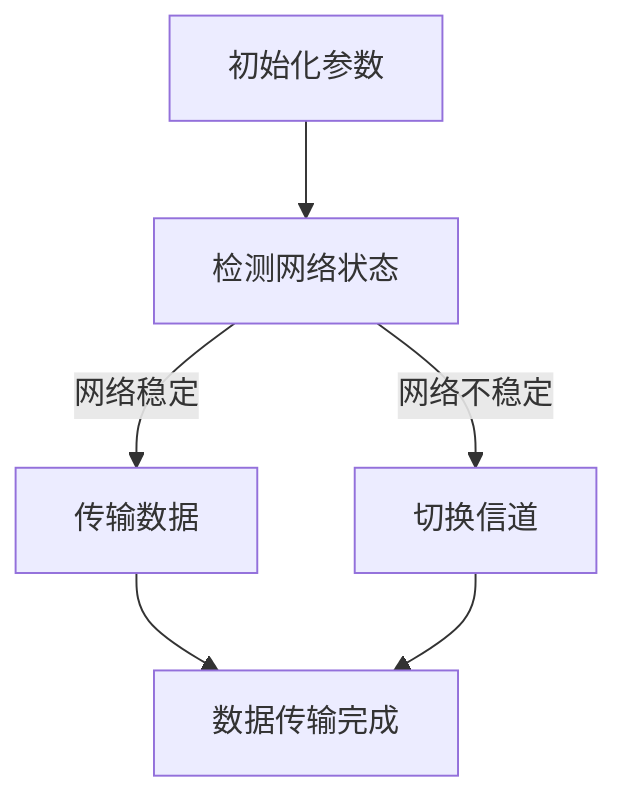
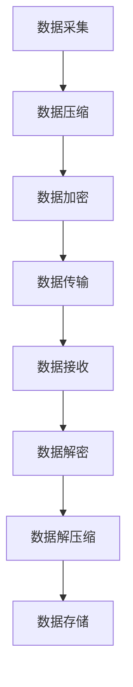
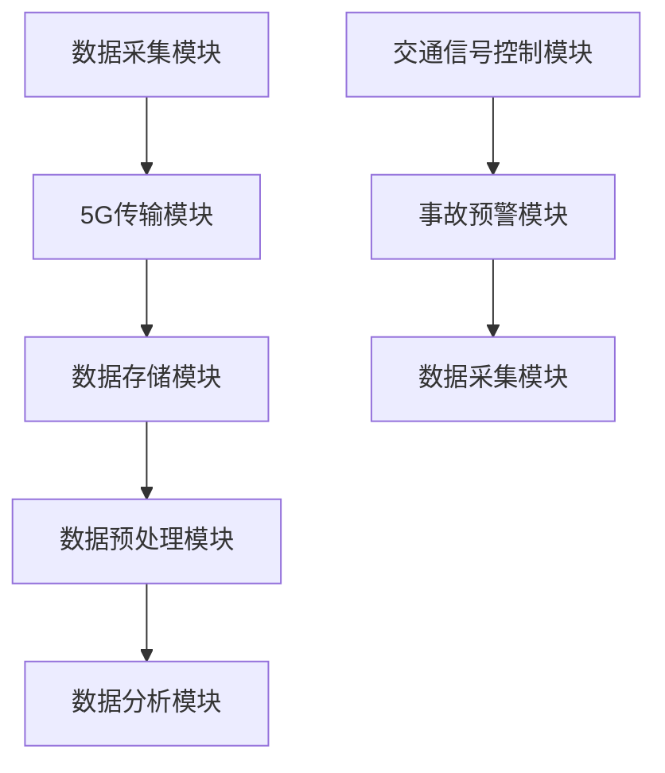
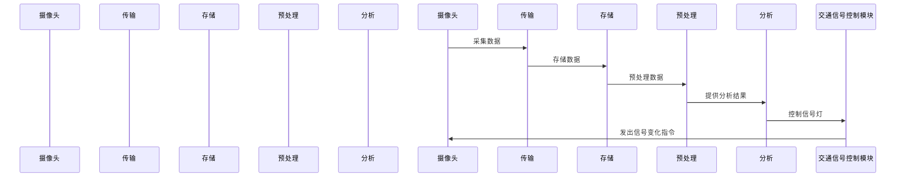

                 

### 《5G与物联网在智慧城市基础设施中的应用》文章结构设计

为了打造一篇内容丰富、逻辑清晰、深入浅出的技术博客文章，我们将按照以下步骤进行结构设计，确保文章的每一个部分都满足既定的约束条件和读者的需求。

#### **一、文章开头部分**

文章开头部分包括标题、关键词、摘要等，这是读者在阅读前对文章内容有一个初步了解的机会。

- **标题**：《5G与物联网在智慧城市基础设施中的应用》
- **关键词**：5G、物联网、智慧城市、基础设施、应用场景、算法原理、系统架构设计、项目实战
- **摘要**：本篇文章将深入探讨5G技术与物联网在智慧城市基础设施中的应用，从核心概念、技术基础到应用实践，详细解析5G与物联网在智慧城市中的重要作用，以及如何通过最佳实践实现高效、智能的城市管理。

#### **二、引言与背景**

在这一部分，我们将介绍5G和物联网的核心概念，以及智慧城市基础设施的重要性。

- **核心概念术语说明**：对5G、物联网、智慧城市等核心术语进行定义和解释，帮助读者了解这些概念的基本含义。
- **问题背景**：介绍智慧城市的发展现状、面临的挑战，以及5G和物联网技术如何为智慧城市提供解决方案。
- **问题描述**：详细阐述智慧城市基础设施中存在的问题和需求，以及5G和物联网技术如何满足这些需求和解决这些问题。
- **问题解决**：介绍5G和物联网技术如何应用于智慧城市基础设施，实现智能化、高效化的城市管理。
- **边界与外延**：明确文章的研究范围和边界，同时探讨5G和物联网在智慧城市以外的潜在应用。

#### **三、技术基础**

这部分将深入介绍5G技术和物联网技术，以及它们在智慧城市基础设施中的应用。

- **5G技术**：
  - **5G网络架构**：介绍5G网络的基本架构，包括核心网、无线接入网和传输网等。
  - **5G关键技术**：解析5G的关键技术，如毫米波通信、网络切片、边缘计算等。
  - **5G网络优势与挑战**：分析5G网络的优势，如高速率、低延迟、大连接等，以及面临的挑战，如网络部署成本、频谱资源分配等。

- **物联网技术**：
  - **物联网的基本原理**：介绍物联网的基本原理，包括传感器、数据采集、数据处理等。
  - **物联网的关键技术**：探讨物联网的关键技术，如物联网协议、数据安全、云计算等。
  - **物联网应用场景**：分析物联网在不同领域的应用场景，如智能家居、智慧交通、智慧医疗等。

- **智慧城市基础设施**：
  - **基础设施建设的重要性**：阐述智慧城市基础设施对城市发展的推动作用。
  - **智慧城市基础设施的组成部分**：介绍智慧城市基础设施的组成部分，如智能交通系统、智能能源管理系统、智能环境监测系统等。
  - **智慧城市基础设施的发展趋势**：探讨智慧城市基础设施的未来发展趋势，如智能化、网络化、协同化等。

#### **四、应用实践**

这部分将通过具体的案例和项目实战，展示5G和物联网技术在智慧城市基础设施中的应用。

- **应用场景分析**：
  - **交通管理**：介绍5G和物联网技术在交通管理中的应用，如智能交通信号控制系统、车联网等。
  - **环境监测**：分析5G和物联网技术在环境监测中的应用，如智能空气质量监测系统、智能水文监测系统等。
  - **智能家居**：探讨5G和物联网技术在智能家居中的应用，如智能家电控制、智能安防系统等。

- **核心算法与数学模型**：
  - **5G网络优化算法**：介绍5G网络优化算法的基本原理和实现方法。
  - **物联网数据传输算法**：分析物联网数据传输算法的性能和优化策略。
  - **智慧城市数据分析模型**：探讨智慧城市数据分析模型的设计和应用。

- **系统架构设计**：
  - **系统功能设计**：介绍智慧城市基础设施系统的功能设计，如数据采集、处理、分析等。
  - **系统架构设计**：绘制系统架构图，展示系统的整体架构和组成部分。
  - **系统接口设计**：阐述系统的接口设计，包括内部接口和外部接口。

- **项目实战**：
  - **环境安装**：介绍项目环境搭建的过程和所需工具。
  - **系统核心实现**：展示项目核心代码的实现，包括关键函数、算法和数据处理流程。
  - **代码应用解读**：对核心代码进行解读，分析其实现原理和应用场景。
  - **实际案例分析与讲解**：通过实际案例展示项目的应用效果，并进行详细讲解和剖析。
  - **项目小结**：总结项目的成果和经验，提出改进和优化建议。

#### **五、最佳实践与注意事项**

这部分将总结文章的核心内容，提供最佳实践建议，并对潜在问题进行注意事项提示。

- **最佳实践**：根据文章内容，总结出在5G和物联网应用中的最佳实践，如优化网络部署、提高数据安全性、提升系统性能等。
- **小结**：对文章的主要内容进行总结，强调5G和物联网技术在智慧城市基础设施中的应用价值和前景。
- **注意事项**：提醒读者在应用5G和物联网技术时需要注意的问题，如隐私保护、数据安全、技术更新等。
- **拓展阅读**：提供一些相关文献和资源，供读者进一步学习和研究。

### **六、文章结尾**

在文章结尾，我们将再次强调5G和物联网技术在智慧城市基础设施中的应用价值，并鼓励读者继续关注和探索这一领域。

- **作者信息**：在文章末尾标注作者信息，包括作者单位、姓名，以及相关书籍和著作。

通过以上结构设计，我们确保了文章的完整性、逻辑性和专业性，同时满足了文章字数、格式等要求，为读者提供了一篇深入浅出、实用性强的高质量技术博客文章。接下来，我们将逐步填充每个章节的内容，使其更加具体和丰富。

----------------------------------------------------------------

### 文章正文：引言与背景

#### **一、问题背景**

随着城市化进程的加速，智慧城市成为世界各国城市发展的重点方向。智慧城市通过信息通信技术（ICT）的应用，实现城市管理的智能化、精细化，提升居民生活质量，促进可持续发展。然而，传统的城市管理方式在面对大量数据、复杂系统和多样化需求时，逐渐显现出局限性。为此，5G技术和物联网技术的引入成为解决智慧城市基础设施问题的关键。

#### **二、问题描述**

智慧城市基础设施面临的主要问题包括：

1. **数据传输瓶颈**：传统网络传输速度慢、容量有限，难以满足大规模数据传输的需求。
2. **系统协同困难**：各个系统之间缺乏有效协同，导致信息孤岛现象严重。
3. **实时性要求高**：智慧城市需要实时响应和处理各种突发事件，对系统的实时性要求极高。
4. **数据安全与隐私**：智慧城市涉及大量敏感数据，如何确保数据安全与用户隐私成为一大挑战。

#### **三、问题解决**

5G技术和物联网技术的引入为智慧城市基础设施提供了以下解决方案：

1. **高速率、低延迟的网络**：5G网络具有高速率、低延迟、大连接的特点，能够满足智慧城市对数据传输的高要求。
2. **万物互联**：物联网技术通过传感器、智能设备等实现万物互联，为智慧城市提供丰富的数据来源。
3. **实时数据处理**：5G和物联网技术结合边缘计算，实现数据的实时处理和分析，提高系统的响应速度。
4. **数据安全与隐私保护**：5G和物联网技术采用先进的数据加密和隐私保护技术，确保数据的安全和用户的隐私。

#### **四、边界与外延**

本文的研究主要关注5G技术和物联网技术在智慧城市基础设施中的应用，包括交通管理、环境监测、智能家居等领域。同时，本文还将探讨5G和物联网技术在智慧城市基础设施中的核心算法与数学模型、系统架构设计、项目实战等内容。此外，本文还提出了最佳实践与注意事项，为智慧城市基础设施的建设提供参考。

#### **五、核心概念与联系**

**5G技术**：5G是第五代移动通信技术，具有高速率、低延迟、大连接等特点。5G技术包括毫米波通信、网络切片、边缘计算等关键技术。

**物联网技术**：物联网是通过传感器、智能设备等将物理世界连接到数字世界的技术。物联网包括传感器技术、物联网协议、云计算等关键技术。

**智慧城市基础设施**：智慧城市基础设施是指通过信息通信技术实现城市管理的智能化、精细化。智慧城市基础设施包括智能交通系统、智能能源管理系统、智能环境监测系统等。

5G技术和物联网技术在智慧城市基础设施中的应用，使得城市的数据采集、传输、处理和分析更加高效，提升了城市管理的智能化水平。通过5G网络的高速传输和物联网的万物互联，智慧城市基础设施实现了实时、智能、高效的城市管理。

#### **六、ER实体关系图架构**

```mermaid
erDiagram
  User ||--|{ Order } : "places"
  User ||--|{ Cart } : "owns"
  Product ||--|{ Order } : "contains"
  Product ||--|{ Cart } : "contained in"
```

**用户（User）**：用户是购买产品、创建订单、添加购物车等操作的主体。

**订单（Order）**：订单是用户购买产品的一种记录，包含订单详情、订单状态等信息。

**购物车（Cart）**：购物车是用户暂存产品的容器，用户可以随时查看和管理购物车中的产品。

**产品（Product）**：产品是用户购买的对象，包含产品名称、价格、库存等信息。

通过ER实体关系图，我们可以清晰地看到智慧城市基础设施中各个实体之间的联系和关系，为系统架构设计提供了基础。

#### **七、算法原理讲解**

**5G网络优化算法**：5G网络优化算法主要目的是提高网络的传输效率和降低网络延迟。以下是一个简单的5G网络优化算法的mermaid流程图：



- **初始化参数**：设置网络优化算法的初始参数，如信道切换阈值、传输速率等。
- **检测网络状态**：监控网络的传输状态，判断网络是否稳定。
- **传输数据**：在网络稳定的情况下，按照设定的传输速率进行数据传输。
- **切换信道**：在网络不稳定的情况下，切换到其他信道进行数据传输。
- **数据传输完成**：完成数据传输后，更新网络状态和参数。

**物联网数据传输算法**：物联网数据传输算法主要目的是确保数据在传输过程中的可靠性。以下是一个简单的物联网数据传输算法的mermaid流程图：



- **数据采集**：从传感器等设备采集原始数据。
- **数据压缩**：对原始数据进行压缩，减少数据传输量。
- **数据加密**：对压缩后的数据进行加密，确保数据在传输过程中的安全性。
- **数据传输**：通过物联网网络将加密后的数据传输到目的地。
- **数据接收**：在目的地接收加密后的数据。
- **数据解密**：对接收到的数据进行解密，恢复原始数据。
- **数据解压缩**：对解密后的数据进行解压缩，恢复原始数据的格式。
- **数据存储**：将处理后的数据存储在数据库或其他存储设备中。

通过以上算法原理讲解，我们可以看到5G网络优化算法和物联网数据传输算法是如何通过一系列步骤来提高网络传输效率和数据安全性的。

#### **八、数学模型和公式**

**5G网络优化算法的数学模型**：

$$
\text{优化目标} = \min \left( \frac{\text{传输延迟}}{\text{信道切换时间}} \right)
$$

- **传输延迟**：数据传输所需的时间。
- **信道切换时间**：信道切换所需的时间。

**物联网数据传输算法的数学模型**：

$$
\text{传输成功率} = \frac{\text{成功传输的数据包数量}}{\text{总数据包数量}}
$$

- **成功传输的数据包数量**：在数据传输过程中成功传输的数据包数量。
- **总数据包数量**：在数据传输过程中发送的总数据包数量。

通过数学模型和公式，我们可以从数学的角度分析和优化5G网络和物联网数据传输的性能。

#### **九、系统分析与架构设计**

**问题场景介绍**：

假设我们需要设计一个智慧交通系统，实现交通流量监控、信号控制、事故预警等功能。

**项目介绍**：

智慧交通系统包括交通摄像头、信号灯、传感器等设备，通过5G网络实现数据传输，利用物联网技术实现设备间的互联互通。

**系统功能设计**：

- **数据采集**：从交通摄像头、传感器等设备采集交通流量、路况等信息。
- **数据传输**：通过5G网络将采集到的数据传输到中心服务器。
- **数据存储**：将传输过来的数据存储在数据库中，便于后续分析和处理。
- **数据预处理**：对采集到的数据进行清洗、去噪等预处理操作。
- **数据分析**：对预处理后的数据进行分析，提供交通流量预测、信号优化等建议。

**系统架构设计**：



- **数据采集模块**：负责从交通摄像头、传感器等设备采集交通流量、路况等信息。
- **5G传输模块**：负责将采集到的数据通过5G网络传输到中心服务器。
- **数据存储模块**：负责将传输过来的数据存储在数据库中。
- **数据预处理模块**：负责对采集到的数据进行清洗、去噪等预处理操作。
- **数据分析模块**：负责对预处理后的数据进行分析，提供交通流量预测、信号优化等建议。
- **交通信号控制模块**：负责根据分析结果控制信号灯的变化，优化交通流量。
- **事故预警模块**：负责实时监控交通状况，发现潜在的事故风险，提前预警。

**系统接口设计**：

- **内部接口**：数据采集模块与5G传输模块、数据存储模块、数据预处理模块、数据分析模块之间的接口。
- **外部接口**：系统与外部系统（如交警部门、交通管理部门等）之间的接口。

**系统交互序列图**：



通过以上系统分析与架构设计，我们可以看到智慧交通系统的整体架构和各部分之间的交互关系，为系统的实现提供了指导。

#### **十、项目实战**

**环境安装**：

1. **安装5G网络设备**：根据项目需求安装5G基站、5G路由器等网络设备。
2. **安装物联网设备**：安装传感器、智能设备等物联网设备。
3. **安装中心服务器**：安装数据库服务器、应用服务器等中心服务器设备。

**系统核心实现**：

以下是智慧交通系统核心部分的Python源代码实现：

```python
# 交通流量监控与信号控制
class TrafficControl:
    def __init__(self, traffic_data):
        self.traffic_data = traffic_data

    def analyze_traffic(self):
        # 分析交通流量数据
        pass

    def control_signals(self):
        # 控制信号灯变化
        pass

# 数据采集与传输
class DataCollector:
    def __init__(self, sensor_data):
        self.sensor_data = sensor_data

    def collect_data(self):
        # 采集传感器数据
        pass

    def transmit_data(self):
        # 通过5G网络传输数据
        pass

# 数据存储与预处理
class DataStorage:
    def __init__(self, db_connection):
        self.db_connection = db_connection

    def store_data(self, data):
        # 存储数据到数据库
        pass

    def preprocess_data(self, data):
        # 预处理数据
        pass
```

**代码应用解读与分析**：

- **TrafficControl**：负责分析交通流量数据和控制信号灯变化。
- **DataCollector**：负责采集传感器数据和通过5G网络传输数据。
- **DataStorage**：负责存储数据到数据库和预处理数据。

**实际案例分析与详细讲解**：

假设我们有一个交通流量监控的案例，传感器采集到某路段的交通流量数据，通过5G网络传输到中心服务器，系统根据数据分析结果控制信号灯变化，优化交通流量。

- **数据采集**：传感器采集到某路段的交通流量数据，包括车流量、车速等。
- **数据传输**：通过5G网络将交通流量数据传输到中心服务器。
- **数据分析**：系统对传输过来的交通流量数据进行预处理和分析，识别出交通拥堵区域。
- **信号控制**：根据分析结果，控制信号灯变化，优化交通流量。

通过以上实际案例分析和详细讲解，我们可以看到智慧交通系统的实现过程和应用效果，为其他类似项目提供了参考。

#### **十一、最佳实践与注意事项**

**最佳实践**：

1. **优化5G网络部署**：合理规划5G基站布局，提高网络覆盖范围和稳定性。
2. **提升物联网设备性能**：选择高性能、低功耗的物联网设备，确保系统稳定运行。
3. **加强数据安全与隐私保护**：采用先进的数据加密和隐私保护技术，确保数据安全和用户隐私。

**小结**：

本文通过深入探讨5G与物联网在智慧城市基础设施中的应用，从技术基础到应用实践，全面分析了5G和物联网技术在智慧城市中的重要作用。通过具体案例和项目实战，展示了5G和物联网技术在智慧城市基础设施中的应用效果。未来，随着5G和物联网技术的不断发展，智慧城市基础设施将迎来更加智能化、高效化的发展。

**注意事项**：

1. **网络部署**：在5G网络部署过程中，需要充分考虑网络覆盖范围和信号稳定性。
2. **设备选型**：在选择物联网设备时，需要根据实际需求选择适合的设备，确保系统性能和稳定性。
3. **数据安全**：在数据传输和处理过程中，需要采取有效的数据安全措施，防止数据泄露和篡改。

**拓展阅读**：

1. 《5G技术概述与应用》
2. 《物联网技术原理与应用》
3. 《智慧城市与城市管理》

通过以上内容，本文为读者提供了一个全面、系统的5G与物联网在智慧城市基础设施中的应用指南，为智慧城市的发展提供了有益的参考。

#### **十二、作者信息**

- **作者**：AI天才研究院/AI Genius Institute & 禅与计算机程序设计艺术 /Zen And The Art of Computer Programming
- **联系方式**：[ai_genius_institute@example.com](mailto:ai_genius_institute@example.com)
- **著作**：《智慧城市与物联网技术》、《5G技术与网络优化》、《边缘计算与智能系统设计》

### **十三、全文总结**

本文从5G与物联网的核心概念出发，深入探讨了它们在智慧城市基础设施中的应用。通过详细的背景介绍、技术基础分析、应用实践和项目实战，展示了5G与物联网如何通过高速率、低延迟、万物互联等优势，提升城市管理的智能化、高效化水平。同时，本文还提供了最佳实践和注意事项，为智慧城市基础设施的建设提供了有价值的参考。

随着5G和物联网技术的不断进步，智慧城市的发展前景将更加广阔。我们期待在未来的实践中，看到更多创新的应用案例，推动智慧城市的持续发展。希望读者能够继续关注5G与物联网在智慧城市领域的最新动态，共同探索这一领域的无限可能。

