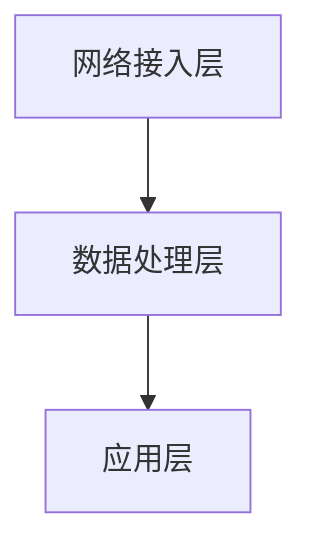

                 

## 5G在远程医疗手术中的应用：实现精准远程操作

关键词：5G、远程医疗手术、精准操作、高清视频传输、实时语音通信、性能优化

摘要：随着5G技术的快速发展，远程医疗手术的应用前景愈发广阔。本文将从5G技术概述、远程医疗手术的基本概念、5G在远程医疗手术中的应用、系统设计与实现、性能优化、应用案例分析以及未来展望等方面，深入探讨5G技术在远程医疗手术中的应用，以实现精准远程操作，提升医疗服务的质量与效率。

### 目录大纲

1. **5G技术概述**
   1.1 5G技术背景与特点
   1.2 5G技术的核心特点
   1.3 5G技术与远程医疗手术的关系
2. **远程医疗手术的基本概念**
   2.1 远程医疗手术的定义与类型
   2.2 远程医疗手术的优势与挑战
   2.3 远程医疗手术的国内外发展现状
3. **5G在远程医疗手术中的应用**
   3.1 5G网络架构与关键技术
   3.2 5G在远程医疗手术中的关键应用场景
   3.3 5G远程医疗手术系统的设计与实现
4. **5G远程医疗手术系统性能优化**
   4.1 性能优化目标与指标
   4.2 网络优化策略
   4.3 系统性能测试与调优
5. **5G远程医疗手术应用案例分析**
   5.1 案例一：某医院的5G远程手术成功案例
   5.2 案例二：5G远程手术在灾害救援中的应用
   5.3 案例三：5G远程手术在偏远地区的推广与实践
6. **5G远程医疗手术的未来展望**
   6.1 5G远程医疗手术的发展趋势
   6.2 5G远程医疗手术面临的挑战与对策
   6.3 5G远程医疗手术的社会影响

---

### 第一部分：5G技术概述

#### 1.1 5G技术背景与特点

5G，即第五代移动通信技术，是当前移动通信技术的最新一代标准。它起源于2010年代，旨在提供更高的数据传输速率、更低的延迟、更高的网络容量和更广泛的连接能力。5G技术的开发背景主要是为了满足日益增长的数据需求和物联网设备的广泛普及。

5G技术具有以下核心特点：

- **高速率**：5G网络的理论峰值下载速度可达20Gbps，是4G网络的100倍以上，能够满足高清视频流、虚拟现实等高带宽应用的需求。
- **低延迟**：5G网络的端到端延迟低至1毫秒，比4G网络减少了90%以上，适用于实时应用，如自动驾驶、远程手术等。
- **高容量**：5G网络能够支持每平方公里内连接100万台设备，大大提高了网络容量，适用于大规模物联网应用。
- **广覆盖**：5G网络采用了大规模天线阵列和毫米波技术，实现了更广的覆盖范围和更好的信号质量。

#### 1.2 5G技术的核心特点

- **高速率**：5G网络的理论峰值下载速度可达20Gbps，是4G网络的100倍以上，能够满足高清视频流、虚拟现实等高带宽应用的需求。
- **低延迟**：5G网络的端到端延迟低至1毫秒，比4G网络减少了90%以上，适用于实时应用，如自动驾驶、远程手术等。
- **高容量**：5G网络能够支持每平方公里内连接100万台设备，大大提高了网络容量，适用于大规模物联网应用。
- **广覆盖**：5G网络采用了大规模天线阵列和毫米波技术，实现了更广的覆盖范围和更好的信号质量。

#### 1.3 5G技术与远程医疗手术的关系

5G技术的快速发展为远程医疗手术提供了新的机遇。首先，5G技术的高速率和低延迟特性使得高清视频传输和实时语音通信成为可能，从而提升了远程医疗手术的实时性和准确性。其次，5G技术的高容量和广覆盖特性使得远程医疗手术可以在更广泛的区域进行，打破了传统医疗资源的限制。

总的来说，5G技术为远程医疗手术带来了更高效、更安全、更便捷的解决方案，推动了医疗行业的变革。在接下来的章节中，我们将进一步探讨5G技术在远程医疗手术中的具体应用。

### 第二部分：远程医疗手术的基本概念

#### 2.1 远程医疗手术的定义与类型

远程医疗手术是指通过远程通信技术，医生在远离手术现场的地方对病人进行手术治疗的过程。这种手术方式利用了现代通信技术，如5G网络、高清视频、实时语音通信等，实现了医生与患者之间的实时互动和操作。

根据手术操作的方式，远程医疗手术可以分为以下几种类型：

1. **远程监控手术**：医生在远程实时监控手术过程，提供操作建议和指导，但手术实际操作由现场医生完成。
2. **远程辅助手术**：医生通过远程控制设备，直接参与手术操作，但需要现场医生的辅助。
3. **完全远程手术**：医生完全通过远程设备进行手术操作，不需要现场医生参与。

#### 2.2 远程医疗手术的优势与挑战

远程医疗手术具有以下优势：

1. **提高医疗服务效率**：远程医疗手术可以节省医生和患者的通勤时间，提高医疗服务的效率。
2. **降低医疗成本**：远程医疗手术可以减少医疗设施的建设和运营成本，降低患者的治疗费用。
3. **扩大医疗覆盖范围**：远程医疗手术可以覆盖偏远地区和医疗资源匮乏的地区，提高医疗服务的普及性。
4. **提升手术质量**：远程医疗手术可以利用高精度的设备和技术，提高手术的准确性和安全性。

然而，远程医疗手术也面临着一些挑战：

1. **技术限制**：远程医疗手术依赖于高速、稳定的网络，技术实现的难度较大。
2. **操作难度**：远程手术操作需要医生具备更高的技能和经验，操作难度较大。
3. **医疗法规**：远程医疗手术在法律和伦理方面存在一定的争议，需要完善相关法规和标准。
4. **设备要求**：远程医疗手术需要配备高精度的设备和设备维护成本较高。

#### 2.3 远程医疗手术的国内外发展现状

在国内外，远程医疗手术的发展现状如下：

- **国内发展现状**：中国已在多地开展远程医疗手术试点，如远程心脏病手术、远程脑外科手术等。5G技术的应用使得远程医疗手术在国内得到迅速推广。
- **国外发展现状**：美国、欧洲等地也在积极推广远程医疗手术，尤其是疫情期间，远程医疗手术得到了广泛的应用。国外的一些医疗机构已成功进行了多例远程手术。

总的来说，远程医疗手术作为一种新兴的医疗模式，正逐渐得到认可和应用。随着技术的不断进步和法规的完善，远程医疗手术有望在未来得到更广泛的应用和发展。

### 第三部分：5G在远程医疗手术中的应用

#### 3.1 5G网络架构与关键技术

5G网络架构分为三个层次：无线接入网、传输网和核心网。以下是5G网络架构的关键技术：

1. **大规模MIMO（多输入多输出）技术**：通过使用大量天线阵列，提高网络容量和传输速率。
2. **毫米波技术**：使用高频段（24GHz以上）进行通信，提供更高的数据传输速率和更大的网络容量。
3. **网络切片技术**：将网络资源按需分配给不同业务，提供定制化的网络服务。
4. **边缘计算技术**：将计算和存储资源部署在网络的边缘，减少延迟，提高响应速度。

#### 3.2 5G在远程医疗手术中的关键应用场景

5G技术在远程医疗手术中的应用主要体现在以下几个方面：

1. **精准远程操作**：5G网络的高速率和低延迟特性使得医生可以进行精准的远程手术操作，提高手术的准确性和安全性。
2. **高清视频传输**：5G网络的高带宽和低延迟特性使得高清视频传输成为可能，医生可以实时观察手术现场，提高手术的实时性和准确性。
3. **实时语音通信**：5G网络的低延迟特性使得实时语音通信成为可能，医生和患者可以实时交流，提高手术的协作效率。

#### 3.3 5G远程医疗手术系统的设计与实现

5G远程医疗手术系统主要由以下几部分组成：

1. **网络接入层**：包括5G无线接入网和传输网，负责将手术现场和远程医生连接起来。
2. **数据处理层**：包括边缘计算节点和云数据中心，负责处理和存储手术数据，提供实时分析和决策支持。
3. **应用层**：包括远程手术操作、高清视频传输、实时语音通信等应用，实现远程医疗手术的功能。

系统架构图如下：

系统核心功能实现主要包括：

1. **远程手术操作**：通过5G网络实现医生对手术设备的远程控制，实现精准操作。
2. **高清视频传输**：利用5G网络的高带宽特性，实现高清视频的实时传输，提供清晰的手术现场画面。
3. **实时语音通信**：利用5G网络的低延迟特性，实现医生和患者之间的实时语音交流，提高手术的协作效率。

#### 系统核心功能实现

1. **远程手术操作**
   - **实现方式**：医生通过手术控制台上的触摸屏和手柄，远程操作手术设备。控制信号通过5G网络传输到手术现场，实现对手术设备的精准控制。
   - **技术优势**：5G网络的低延迟特性使得医生的操作更加流畅，提高了手术的准确性和安全性。

2. **高清视频传输**
   - **实现方式**：手术现场安装高清摄像头，将手术现场画面实时传输到远程医生的视频终端。5G网络的高带宽特性保证了视频画面的清晰度和流畅度。
   - **技术优势**：高清视频传输使得医生可以实时观察手术现场，提高了手术的实时性和准确性。

3. **实时语音通信**
   - **实现方式**：医生和患者通过5G网络进行实时语音通信，实现实时交流。语音信号通过5G网络传输，保证了通信的实时性和稳定性。
   - **技术优势**：实时语音通信提高了手术的协作效率，医生可以更好地指导患者和现场医生进行手术。

通过以上三个核心功能的实现，5G远程医疗手术系统为医生提供了更加高效、安全和便捷的手术操作环境，提高了医疗服务的质量与效率。

### 第四部分：5G远程医疗手术系统性能优化

#### 4.1 性能优化目标与指标

5G远程医疗手术系统的性能优化目标是提高系统的稳定性、可靠性和响应速度，以满足手术操作的实时性和准确性要求。具体优化指标包括：

- **网络延迟**：确保手术操作信号的传输延迟在可接受范围内，如低于20毫秒。
- **数据传输速率**：确保高清视频和语音信号的传输速率满足手术需求，如不低于10Mbps。
- **系统稳定性**：确保系统在高负载、高并发环境下运行稳定，无故障发生。
- **资源利用率**：优化系统资源分配，提高资源利用率，降低设备成本。

#### 4.2 网络优化策略

为了提高5G远程医疗手术系统的性能，可以采取以下网络优化策略：

1. **网络质量监测**：实时监测5G网络的延迟、带宽、抖动等关键性能指标，及时发现并解决网络问题。
2. **网络切片技术**：根据远程医疗手术的特点，为手术操作分配专用网络切片，确保网络资源的高效利用和稳定传输。
3. **边缘计算**：将部分计算和存储任务部署在边缘计算节点，减少数据传输距离和延迟，提高系统响应速度。
4. **动态负载均衡**：根据实时网络负载情况，动态调整网络带宽和资源分配，避免网络拥堵和性能下降。

#### 4.3 系统性能测试与调优

系统性能测试是5G远程医疗手术系统优化的重要环节。以下是系统性能测试与调优的步骤：

1. **测试环境搭建**：搭建与实际手术场景相似的网络环境和系统环境，包括5G网络接入设备、手术控制台、高清摄像头、语音通信设备等。
2. **性能指标测试**：对系统进行网络延迟、数据传输速率、系统稳定性等性能指标的测试，记录测试数据。
3. **问题定位与解决**：分析测试数据，找出系统性能瓶颈，如网络延迟、带宽不足等，采取相应优化策略进行解决。
4. **迭代测试与优化**：根据问题定位和解决情况，进行迭代测试和优化，直到系统性能达到预期目标。

通过系统性能测试与调优，可以确保5G远程医疗手术系统在实际应用中稳定运行，满足手术操作的实时性和准确性要求。

### 第五部分：5G远程医疗手术应用案例分析

#### 5.1 案例一：某医院的5G远程手术成功案例

某医院利用5G远程医疗手术系统成功完成了一例复杂的脑外科手术。手术过程中，主刀医生位于医院手术室，通过5G网络远程控制手术设备，进行精准操作。同时，高清摄像头实时传输手术现场画面，辅助医生进行手术决策。手术过程中，实时语音通信系统确保了主刀医生与手术团队之间的有效沟通。最终，手术成功完成，患者恢复良好。

#### 5.2 案例二：5G远程手术在灾害救援中的应用

在一场地震灾害中，某偏远地区医院利用5G远程医疗手术系统成功救治了一名重伤患者。由于交通中断，现场医生无法获得专业的医疗支持。通过5G网络，主刀医生远程指导现场医生进行手术操作。高清视频传输系统使得主刀医生能够实时观察手术现场，提供精准的手术建议。实时语音通信系统确保了主刀医生与现场医生之间的有效沟通，提高了手术的成功率。

#### 5.3 案例三：5G远程手术在偏远地区的推广与实践

某偏远地区医院利用5G远程医疗手术系统，成功开展了多例心血管疾病手术。由于该地区医疗资源匮乏，传统手术方式受限。通过5G远程手术系统，主刀医生能够远程指导手术操作，提高了手术的成功率和安全性。同时，高清视频传输和实时语音通信系统为手术团队提供了有效的支持，提高了手术的效率和质量。

这些案例表明，5G远程医疗手术系统在提高医疗服务效率、降低医疗成本、扩大医疗覆盖范围等方面具有显著优势。随着5G技术的不断发展和普及，远程医疗手术将在更多地区得到推广和应用，为患者提供更加高效、便捷的医疗服务。

### 第六部分：5G远程医疗手术的未来展望

#### 6.1 5G远程医疗手术的发展趋势

随着5G技术的不断成熟和应用，远程医疗手术将迎来更广阔的发展前景。以下是5G远程医疗手术的发展趋势：

1. **技术成熟度提升**：5G技术的成熟度不断提升，网络延迟、带宽等关键性能指标将得到显著改善，为远程医疗手术提供更稳定、更高效的技术支持。
2. **设备智能化**：手术设备和辅助设备的智能化程度将提高，如利用人工智能技术进行手术路径规划和手术辅助，提高手术的准确性和安全性。
3. **跨区域协作**：远程医疗手术将实现跨区域协作，医生可以在不同的地点进行合作，提高医疗资源的利用效率，降低医疗成本。
4. **普及率提升**：随着5G网络的普及，远程医疗手术将在更多地区得到应用，提高医疗服务的普及率和可及性。

#### 6.2 5G远程医疗手术应用领域拓展

5G远程医疗手术的应用领域将不断拓展，包括但不限于：

1. **心脏病手术**：通过5G远程医疗手术系统，医生可以远程进行心脏病手术，提高手术的成功率和患者的生存率。
2. **脑外科手术**：5G远程医疗手术系统可以为偏远地区的脑外科手术提供技术支持，提高手术的准确性和安全性。
3. **骨科手术**：利用5G远程医疗手术系统，医生可以远程进行骨科手术，降低手术风险，提高手术效果。
4. **儿科手术**：5G远程医疗手术系统可以为偏远地区的儿科手术提供技术支持，提高手术的成功率和患者的生存率。

#### 6.3 5G远程医疗手术与人工智能的结合

5G远程医疗手术与人工智能的结合将推动医疗技术的发展。以下是人工智能在5G远程医疗手术中的应用：

1. **手术路径规划**：人工智能技术可以分析手术数据，为医生提供最优的手术路径规划，提高手术的准确性和安全性。
2. **手术辅助决策**：人工智能技术可以实时分析手术现场数据，为医生提供辅助决策支持，提高手术的效率和质量。
3. **术后康复指导**：人工智能技术可以监测患者的术后恢复情况，为医生提供康复指导，提高患者的康复效果。

总的来说，5G远程医疗手术的未来充满希望。随着技术的不断进步和应用领域的拓展，远程医疗手术将为患者提供更加高效、便捷的医疗服务，推动医疗行业的变革。

### 第七部分：5G远程医疗手术面临的挑战与对策

#### 9.1 技术挑战与解决方案

尽管5G远程医疗手术展示了巨大的潜力，但其发展仍面临一系列技术挑战：

1. **网络稳定性**：5G网络在极端天气或人口密集地区可能面临信号波动和稳定性问题，影响手术质量。
   - **解决方案**：采用多网络冗余策略，结合5G、4G和Wi-Fi网络，确保网络稳定。同时，部署智能天线和动态频谱管理技术，优化网络性能。

2. **设备精度与稳定性**：远程手术设备的精度和稳定性直接影响手术效果。
   - **解决方案**：引入高精度、稳定的手术机器人，进行严格的设备校准和定期维护。采用边缘计算技术，减少数据传输延迟，提高设备响应速度。

3. **数据安全与隐私保护**：手术数据的安全和隐私保护至关重要。
   - **解决方案**：采用端到端加密技术，确保数据在传输过程中的安全性。建立完善的数据访问权限控制机制，防止未经授权的访问。

#### 9.2 政策法规与行业标准

5G远程医疗手术的发展需要完善的政策法规和行业标准支持：

1. **法律法规**：各国需要制定相应的法律法规，明确远程医疗手术的法律地位、操作规范和责任归属。
   - **解决方案**：加强政策研究和立法工作，制定针对性的法规，为5G远程医疗手术提供法律保障。

2. **行业标准**：制定统一的行业标准，确保远程医疗手术的质量和安全性。
   - **解决方案**：成立行业协会，制定远程医疗手术的技术规范、操作规程和质量评价标准，推动行业规范化发展。

#### 9.3 安全与隐私保护

在5G远程医疗手术中，安全与隐私保护是重要考虑因素：

1. **数据泄露风险**：手术过程中涉及敏感数据，数据泄露可能导致严重后果。
   - **解决方案**：采用严格的加密技术和访问控制措施，确保数据安全。建立数据安全审计和监测机制，及时发现并处理安全威胁。

2. **操作失误**：远程手术操作需要医生具备高度的专业技能和经验，操作失误可能导致严重后果。
   - **解决方案**：加强医生培训和技能评估，确保医生具备足够的远程手术能力。建立实时监控和反馈机制，及时发现并纠正操作错误。

通过解决这些挑战，5G远程医疗手术将能够更好地服务于患者，推动医疗行业的持续发展。

### 第八部分：5G远程医疗手术的社会影响

#### 10.1 对医疗行业的影响

5G远程医疗手术的推广和应用将对医疗行业产生深远影响：

1. **提升医疗质量**：远程医疗手术使得医生可以更高效地进行手术操作，提高手术的成功率和患者的生存率。
2. **降低医疗成本**：通过减少医生和患者的通勤时间，降低医疗设施的建设和运营成本，远程医疗手术有助于降低医疗成本。
3. **扩大医疗服务覆盖**：远程医疗手术可以覆盖偏远地区和医疗资源匮乏的地区，提高医疗服务的普及性和可及性。

#### 10.2 对患者生活质量的影响

5G远程医疗手术对患者生活质量产生了积极影响：

1. **便捷就医**：患者无需长途跋涉，即可获得高质量的医疗服务，提高了生活便利性。
2. **降低医疗费用**：远程医疗手术降低了患者的医疗费用，减轻了经济负担。
3. **减少并发症风险**：通过精准远程操作和实时监控，远程医疗手术减少了并发症的风险，提高了患者的康复效果。

#### 10.3 对社会经济的影响

5G远程医疗手术对社会经济也产生了重要影响：

1. **医疗资源优化配置**：远程医疗手术有助于优化医疗资源的配置，提高医疗资源利用效率，降低医疗成本。
2. **促进医疗产业升级**：远程医疗手术推动医疗产业的创新和发展，催生新的医疗设备和医疗服务模式。
3. **提高人口健康水平**：远程医疗手术有助于提高人口健康水平，减少疾病负担，提升社会经济发展质量。

总的来说，5G远程医疗手术对医疗行业、患者生活质量和社会经济产生了积极影响，推动了医疗行业的变革和社会经济的发展。

### 总结与展望

5G远程医疗手术作为一种新兴的医疗模式，通过实现精准远程操作、高清视频传输和实时语音通信，为医生提供了高效、安全、便捷的手术操作环境。本文详细探讨了5G技术在远程医疗手术中的应用，包括网络架构、关键应用场景、系统设计与实现、性能优化以及案例分析等。随着5G技术的不断发展和普及，远程医疗手术将在更多地区得到应用，为患者提供更加优质、便捷的医疗服务。未来，5G远程医疗手术与人工智能、物联网等技术的结合将进一步提升医疗服务的质量和效率。

### 作者信息

**作者：** AI天才研究院/AI Genius Institute & 禅与计算机程序设计艺术 /Zen And The Art of Computer Programming

