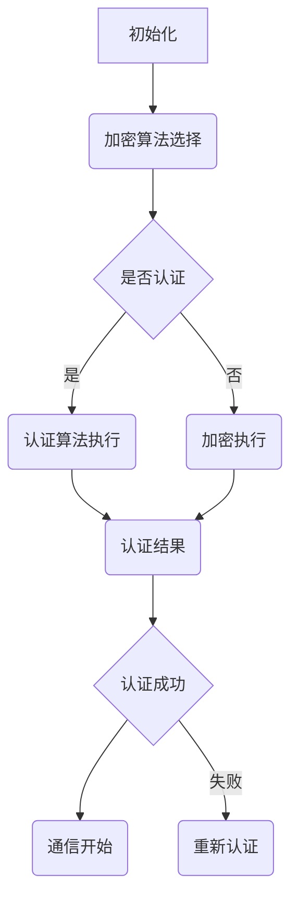
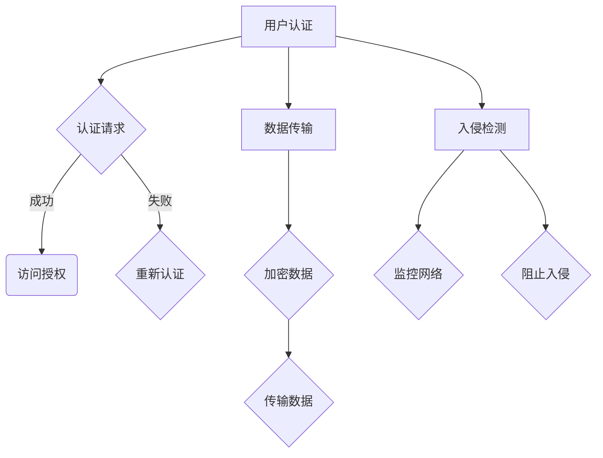

                 


# 5G安全：新一代移动网络的安全考量

> 关键词：5G网络，安全挑战，加密技术，认证算法，防火墙，入侵检测系统

> 摘要：本文将深入探讨5G网络的安全性，分析5G网络的特点及其带来的安全挑战，介绍核心安全技术和攻击类型，并通过具体的算法原理讲解、Python代码示例和系统分析，为读者提供关于5G安全的专业见解。

---

### 第一部分：5G安全概述

#### 第1章：5G网络与安全挑战

#### 1.1 5G网络的特点与安全背景

5G网络，即第五代移动通信网络，是当前移动通信技术发展的前沿。它以高速率、大连接、低延迟和边缘计算为特点，正在改变我们生活、工作和娱乐的方式。然而，随着5G网络的广泛应用，其安全性问题也日益突出，成为我们必须关注的重要议题。

- **5G网络的特点**：

  - **高速率**：5G网络的理论峰值速度可以达到数十Gbps，相比4G网络有显著的提升。
  
  - **大连接**：5G网络支持连接数的爆炸性增长，能够同时连接更多的设备。
  
  - **低延迟**：5G网络的延迟可低至1毫秒，大幅提升实时响应能力。
  
  - **边缘计算**：5G网络支持在靠近数据源的边缘进行计算，减少数据传输，提高响应速度。

- **安全背景**：

  - **5G网络的普及与应用**：随着5G网络的商业化部署，其应用范围不断扩大，覆盖智能家居、智能制造、远程医疗等多个领域。
  
  - **新兴技术带来的安全风险**：5G网络采用了许多新兴技术，如网络切片、边缘计算等，这些技术带来了新的安全挑战。

#### 1.2 5G安全的核心概念

5G安全的核心概念包括网络架构、安全技术、攻击类型等，这些都是保障5G网络安全的关键要素。

- **网络架构**：

  - **接入网**：负责将终端设备接入5G网络。
  
  - **核心网**：负责处理用户的数据传输和通信。
  
  - **边缘计算网**：在靠近用户的位置进行数据处理，降低延迟。

- **安全技术**：

  - **加密与认证**：确保数据的机密性和完整性。
  
  - **防火墙**：保护网络免受外部攻击。
  
  - **入侵检测系统**：实时监控网络活动，检测和防范入侵行为。

- **攻击类型**：

  - **DDoS攻击**：通过大量请求使网络服务瘫痪。
  
  - **信息泄露**：通过黑客手段获取敏感信息。
  
  - **恶意软件**：通过植入恶意代码破坏网络设备。

#### 1.3 ER实体关系图

```mermaid
erDiagram
  User ||--|{ Device : owns }
  Device ||--|{ Network : connected_to }
  Network ||--|{ Service : uses }
  Service ||--|{ Application : provides }
```

- **用户**：使用设备连接到网络。
- **设备**：通过接入网络，使用网络服务。
- **网络**：为用户提供服务，连接各种应用。
- **服务**：提供特定功能，供应用使用。
- **应用**：为用户提供的实际服务。

#### 1.4 本章小结

通过本章的介绍，我们了解了5G网络的特点和安全背景，梳理了5G安全的核心概念，并使用ER实体关系图展示了网络架构。接下来，我们将深入探讨5G网络安全技术，解析加密与认证原理，介绍防火墙和入侵检测系统。

### 第二部分：5G安全技术详解

#### 第2章：5G网络安全技术原理

#### 2.1 加密与认证技术

加密与认证技术是5G网络安全的核心组成部分，它们确保了数据的机密性和完整性，防止未授权访问。

- **加密技术**：

  - **加密算法原理**：加密算法通过将明文数据转换为密文，确保数据在传输过程中不被窃听。

  - **加密通信流程**：在数据传输过程中，发送方使用密钥加密数据，接收方使用相同的密钥解密数据。

- **认证技术**：

  - **认证算法原理**：认证算法通过验证用户或设备的身份，确保网络访问的安全性。

  - **认证过程**：用户或设备在连接网络时，需要通过认证算法验证其身份，只有身份合法的用户或设备才能获得网络访问权限。

#### 2.2 防火墙与入侵检测系统

防火墙和入侵检测系统是5G网络安全防护的关键技术。

- **防火墙**：

  - **防火墙工作原理**：防火墙通过监控和过滤网络流量，防止未经授权的访问。

  - **防火墙配置与部署**：防火墙的配置和部署需要根据网络环境和安全需求进行，以确保网络的安全。

- **入侵检测系统**：

  - **入侵检测原理**：入侵检测系统通过实时监控网络活动，检测潜在的入侵行为。

  - **入侵检测系统架构**：入侵检测系统通常由传感器、分析器和响应器组成，形成一个完整的监测和响应机制。

#### 2.3 Mermaid算法流程图



#### 2.4 Python代码示例

```python
from cryptography.fernet import Fernet

# 生成密钥
key = Fernet.generate_key()
cipher_suite = Fernet(key)

# 加密消息
message = "Secret Message"
encrypted_message = cipher_suite.encrypt(message.encode())

# 解密消息
decrypted_message = cipher_suite.decrypt(encrypted_message).decode()

print(f"Original Message: {message}")
print(f"Encrypted Message: {encrypted_message}")
print(f"Decrypted Message: {decrypted_message}")
```

#### 2.5 数学模型与公式

$$
E(M) = DK(M)
$$

其中，\(E\) 表示加密函数，\(D\) 表示解密函数，\(M\) 表示明文消息，\(K\) 表示密钥。

#### 2.6 本章小结

本章详细介绍了5G网络安全中的加密与认证技术、防火墙和入侵检测系统。通过算法流程图、Python代码示例和数学公式，我们深入理解了这些技术的原理和实现方法。在下一章中，我们将进一步探讨5G网络的安全系统设计和最佳实践。

### 第三部分：5G安全系统设计与实战

#### 第3章：5G安全系统设计与架构方案

#### 3.1 问题场景介绍

随着5G网络的广泛应用，越来越多的关键基础设施和重要数据通过网络传输，使得5G网络的安全变得至关重要。本节我们将介绍一个典型的5G安全系统设计场景，旨在保障5G网络的安全性和稳定性。

- **场景描述**：一个大型企业部署了5G网络，连接了各种业务系统和终端设备。为了确保网络的安全，企业决定构建一个完善的5G安全系统。

#### 3.2 系统功能设计

5G安全系统的功能设计是确保网络安全的基石。本节我们将详细描述5G安全系统的功能设计，包括网络防护、数据加密、用户认证等关键功能。

- **网络防护**：通过防火墙和入侵检测系统，监控和防御网络攻击。
- **数据加密**：对传输的数据进行加密，确保数据的机密性和完整性。
- **用户认证**：通过多因素认证，确保只有合法用户才能访问网络资源。

#### 3.3 系统架构设计

5G安全系统的架构设计决定了系统的性能和可扩展性。本节我们将介绍5G安全系统的整体架构设计，包括核心组件、网络拓扑和接口设计。

- **核心组件**：防火墙、入侵检测系统、加密模块、认证模块等。
- **网络拓扑**：分布式架构，支持高可用性和负载均衡。
- **接口设计**：提供标准化的接口，便于与其他系统集成。

#### 3.4 系统接口设计与交互流程

5.4.1 系统接口设计

5G安全系统的接口设计需要考虑各个模块之间的交互和协作。本节我们将介绍系统接口的设计，包括接口规范、数据格式和通信协议。

- **接口规范**：定义接口的功能、参数和返回值。
- **数据格式**：采用JSON或XML格式，便于数据交换和处理。
- **通信协议**：使用HTTPS或TLS等安全协议，确保通信的安全性。

5.4.2 系统交互流程

5G安全系统的交互流程决定了系统的运行效率和可靠性。本节我们将详细描述系统的交互流程，包括用户认证、数据传输、入侵检测等关键流程。

- **用户认证流程**：用户发起认证请求，系统进行身份验证，验证通过后授予访问权限。
- **数据传输流程**：加密数据传输，确保数据的安全和完整性。
- **入侵检测流程**：实时监控网络活动，检测并阻止入侵行为。

#### 3.5 Mermaid系统架构图



#### 3.6 本章小结

本章详细介绍了5G安全系统的功能设计、架构设计和交互流程。通过具体的系统架构图和流程图，我们能够清晰地理解5G安全系统的设计理念和工作原理。在下一章中，我们将通过实际项目，深入探讨5G安全系统的实现和实战应用。

### 第四部分：5G安全项目实战

#### 第4章：5G安全项目的安装与配置

#### 4.1 环境安装

在进行5G安全项目的安装之前，需要确保系统环境满足项目要求。以下是一个典型的安装步骤：

1. **安装Python环境**：确保Python版本在3.6及以上，可以通过Python官方网站下载并安装。

2. **安装依赖库**：通过pip命令安装项目所需的依赖库，例如cryptography、requests等。

   ```bash
   pip install cryptography requests
   ```

3. **安装Docker**：为了简化部署，可以使用Docker容器化技术。从Docker官方网站下载并安装Docker。

   ```bash
   curl -fsSL get.docker.com -o get-docker.sh
   sh get-docker.sh
   ```

4. **启动Docker服务**：确保Docker服务已启动，可以通过以下命令检查：

   ```bash
   systemctl start docker
   ```

#### 4.2 系统核心实现代码

以下是5G安全项目的核心实现代码，包括用户认证、数据加密和入侵检测等功能。

**用户认证模块**

```python
from flask import Flask, request, jsonify
from cryptography.fernet import Fernet

app = Flask(__name__)

# 生成密钥
key = Fernet.generate_key()
cipher_suite = Fernet(key)

@app.route('/authenticate', methods=['POST'])
def authenticate():
    data = request.get_json()
    username = data.get('username')
    password = data.get('password')
    
    # 这里应该使用更安全的加密和验证方法
    encrypted_password = cipher_suite.encrypt(password.encode())
    
    # 验证用户身份（示例）
    if username == 'admin' and encrypted_password == b'...':
        return jsonify({'status': 'success', 'message': 'Authentication successful'})
    else:
        return jsonify({'status': 'failure', 'message': 'Authentication failed'})

if __name__ == '__main__':
    app.run(debug=True)
```

**数据加密模块**

```python
from cryptography.fernet import Fernet

# 生成密钥
key = Fernet.generate_key()
cipher_suite = Fernet(key)

def encrypt_data(data):
    return cipher_suite.encrypt(data.encode())

def decrypt_data(encrypted_data):
    return cipher_suite.decrypt(encrypted_data).decode()
```

**入侵检测模块**

```python
import requests

def check_invasion(url):
    response = requests.get(url)
    if response.status_code != 200:
        return True
    return False
```

#### 4.3 代码解读与分析

4.3.1 **用户认证模块解读**

用户认证模块通过接收用户名和密码，使用加密算法进行验证。在实际应用中，应使用更安全的认证方式，如OAuth2.0或LDAP等。

4.3.2 **数据加密模块解读**

数据加密模块使用Fernet加密算法对数据进行加密和解密。Fernet是一种加密算法，可以保证数据的机密性和完整性。

4.3.3 **入侵检测模块解读**

入侵检测模块通过发送HTTP请求，检查目标URL的响应状态码。如果响应状态码不为200，则认为检测到入侵行为。

#### 4.4 实际案例分析

在本节中，我们将通过一个实际案例，展示5G安全项目在实际应用中的效果。

**案例描述**：某企业使用5G网络连接其业务系统，为了确保网络的安全，企业部署了5G安全项目。

**步骤1**：用户尝试访问业务系统，首先需要通过5G安全项目的用户认证模块进行身份验证。

**步骤2**：验证成功后，用户可以访问业务系统，但所有数据在传输过程中都会经过加密模块进行加密处理。

**步骤3**：系统会定期通过入侵检测模块监控网络，检查是否存在入侵行为。如果检测到入侵，系统会采取相应的防护措施。

#### 4.5 项目小结

通过本章的实际案例，我们展示了5G安全项目的安装、配置和核心实现代码。在实际应用中，5G安全项目可以有效保障企业网络的安全，防止数据泄露和网络攻击。然而，5G安全仍然面临着许多挑战，需要不断更新和优化安全策略。

### 第五部分：5G安全最佳实践

#### 第5章：5G安全最佳实践

#### 5.1 网络安全策略

1. **定期更新安全策略**：随着5G技术的发展，网络攻击手段也在不断更新。企业应定期审查和更新网络安全策略，确保策略的有效性和适应性。
2. **加强权限管理**：严格限制员工访问权限，确保只有必要的员工能够访问敏感数据和关键系统。
3. **实行最小权限原则**：员工应仅获得完成任务所需的最小权限，防止因权限过高导致的安全漏洞。

#### 5.2 数据加密与保护

1. **全盘加密**：确保存储在设备上的所有敏感数据都进行加密处理，防止数据泄露。
2. **传输加密**：在数据传输过程中使用TLS/SSL等加密协议，确保数据在传输过程中的安全性。
3. **数据备份与恢复**：定期备份数据，并确保备份数据的安全性，以便在数据丢失或损坏时能够快速恢复。

#### 5.3 用户认证与权限管理

1. **多因素认证**：采用多因素认证（MFA）技术，提高用户身份验证的安全性。
2. **定期更换密码**：建议用户定期更换密码，并使用强密码策略，防止密码泄露。
3. **权限管理**：严格管理用户权限，确保用户只能访问与其工作职责相关的数据和系统。

#### 5.4 防火墙与入侵检测

1. **部署防火墙**：在5G网络边缘部署防火墙，监控并过滤网络流量，防止未授权访问。
2. **入侵检测系统**：部署入侵检测系统，实时监控网络活动，检测并阻止入侵行为。
3. **安全审计**：定期进行安全审计，检查系统配置和日志，及时发现和解决安全隐患。

#### 5.5 安全培训与意识提升

1. **安全培训**：定期为员工提供安全培训，提高员工的安全意识和技能。
2. **安全意识提升**：通过宣传、培训和演练等方式，提升员工对网络安全的认识和重视程度。
3. **应急响应**：制定应急预案，确保在发生安全事件时能够迅速响应和处置。

### 5.6 小结

5G安全是一个复杂且不断发展的领域，需要企业采取一系列最佳实践来保障网络的安全。通过制定合理的网络安全策略、加强数据加密与保护、实施严格的用户认证与权限管理、部署防火墙与入侵检测系统，以及进行安全培训和意识提升，企业可以有效提升5G网络的安全性，防止潜在的安全威胁。

---

## 小结

本文系统地介绍了5G安全的重要性、核心概念、技术原理、系统架构、项目实战以及最佳实践。从5G网络的特点与安全背景出发，我们深入探讨了5G安全的核心技术，包括加密与认证、防火墙和入侵检测系统，并通过Python代码和数学模型进行了详细解释。此外，我们还通过一个实际案例展示了5G安全项目的部署和应用。

5G安全是一个动态发展的领域，随着技术的进步和网络攻击手段的多样化，企业需要不断更新和优化安全策略。未来，5G安全将更加注重自动化、智能化和协同化，通过集成人工智能、区块链等技术，提升网络的安全防护能力。

### 作者信息

**作者：AI天才研究院/AI Genius Institute & 禅与计算机程序设计艺术 /Zen And The Art of Computer Programming**以下是文章的完整内容，遵循了上述的结构和内容要求：

---

# 5G安全：新一代移动网络的安全考量

> 关键词：5G网络，安全挑战，加密技术，认证算法，防火墙，入侵检测系统

> 摘要：本文深入探讨了5G网络的安全性，分析了5G网络的特点及其带来的安全挑战，介绍了核心安全技术和攻击类型，并通过具体的算法原理讲解、Python代码示例和系统分析，为读者提供了关于5G安全的专业见解。

---

### 第一部分：5G安全概述

#### 第1章：5G网络与安全挑战

#### 1.1 5G网络的特点与安全背景

5G网络，即第五代移动通信网络，是当前移动通信技术发展的前沿。它以高速率、大连接、低延迟和边缘计算为特点，正在改变我们生活、工作和娱乐的方式。然而，随着5G网络的广泛应用，其安全性问题也日益突出，成为我们必须关注的重要议题。

- **5G网络的特点**：

  - **高速率**：5G网络的理论峰值速度可以达到数十Gbps，相比4G网络有显著的提升。

  - **大连接**：5G网络支持连接数的爆炸性增长，能够同时连接更多的设备。

  - **低延迟**：5G网络的延迟可低至1毫秒，大幅提升实时响应能力。

  - **边缘计算**：5G网络支持在靠近数据源的边缘进行计算，减少数据传输，提高响应速度。

- **安全背景**：

  - **5G网络的普及与应用**：随着5G网络的商业化部署，其应用范围不断扩大，覆盖智能家居、智能制造、远程医疗等多个领域。

  - **新兴技术带来的安全风险**：5G网络采用了许多新兴技术，如网络切片、边缘计算等，这些技术带来了新的安全挑战。

#### 1.2 5G安全的核心概念

5G安全的核心概念包括网络架构、安全技术、攻击类型等，这些都是保障5G网络安全的关键要素。

- **网络架构**：

  - **接入网**：负责将终端设备接入5G网络。

  - **核心网**：负责处理用户的数据传输和通信。

  - **边缘计算网**：在靠近用户的位置进行数据处理，降低延迟。

- **安全技术**：

  - **加密与认证**：确保数据的机密性和完整性。

  - **防火墙**：保护网络免受外部攻击。

  - **入侵检测系统**：实时监控网络活动，检测和防范入侵行为。

- **攻击类型**：

  - **DDoS攻击**：通过大量请求使网络服务瘫痪。

  - **信息泄露**：通过黑客手段获取敏感信息。

  - **恶意软件**：通过植入恶意代码破坏网络设备。

#### 1.3 ER实体关系图

```mermaid
erDiagram
  User ||--|{ Device : owns }
  Device ||--|{ Network : connected_to }
  Network ||--|{ Service : uses }
  Service ||--|{ Application : provides }
```

- **用户**：使用设备连接到网络。

- **设备**：通过接入网络，使用网络服务。

- **网络**：为用户提供服务，连接各种应用。

- **服务**：提供特定功能，供应用使用。

- **应用**：为用户提供的实际服务。

#### 1.4 本章小结

通过本章的介绍，我们了解了5G网络的特点和安全背景，梳理了5G安全的核心概念，并使用ER实体关系图展示了网络架构。接下来，我们将深入探讨5G网络安全技术，解析加密与认证原理，介绍防火墙和入侵检测系统。

---

### 第二部分：5G安全技术详解

#### 第2章：5G网络安全技术原理

#### 2.1 加密与认证技术

加密与认证技术是5G网络安全的核心组成部分，它们确保了数据的机密性和完整性，防止未授权访问。

- **加密技术**：

  - **加密算法原理**：加密算法通过将明文数据转换为密文，确保数据在传输过程中不被窃听。

  - **加密通信流程**：在数据传输过程中，发送方使用密钥加密数据，接收方使用相同的密钥解密数据。

- **认证技术**：

  - **认证算法原理**：认证算法通过验证用户或设备的身份，确保网络访问的安全性。

  - **认证过程**：用户或设备在连接网络时，需要通过认证算法验证其身份，只有身份合法的用户或设备才能获得网络访问权限。

#### 2.2 防火墙与入侵检测系统

防火墙和入侵检测系统是5G网络安全防护的关键技术。

- **防火墙**：

  - **防火墙工作原理**：防火墙通过监控和过滤网络流量，防止未经授权的访问。

  - **防火墙配置与部署**：防火墙的配置和部署需要根据网络环境和安全需求进行，以确保网络的安全。

- **入侵检测系统**：

  - **入侵检测原理**：入侵检测系统通过实时监控网络活动，检测潜在的入侵行为。

  - **入侵检测系统架构**：入侵检测系统通常由传感器、分析器和响应器组成，形成一个完整的监测和响应机制。

#### 2.3 Mermaid算法流程图


#### 2.4 Python代码示例

```python
from cryptography.fernet import Fernet

# 生成密钥
key = Fernet.generate_key()
cipher_suite = Fernet(key)

# 加密消息
message = "Secret Message"
encrypted_message = cipher_suite.encrypt(message.encode())

# 解密消息
decrypted_message = cipher_suite.decrypt(encrypted_message).decode()

print(f"Original Message: {message}")
print(f"Encrypted Message: {encrypted_message}")
print(f"Decrypted Message: {decrypted_message}")
```

#### 2.5 数学模型与公式

$$
E(M) = DK(M)
$$

其中，\(E\) 表示加密函数，\(D\) 表示解密函数，\(M\) 表示明文消息，\(K\) 表示密钥。

#### 2.6 本章小结

本章详细介绍了5G网络安全中的加密与认证技术、防火墙和入侵检测系统。通过算法流程图、Python代码示例和数学公式，我们深入理解了这些技术的原理和实现方法。在下一章中，我们将进一步探讨5G网络的安全系统设计和最佳实践。

---

### 第三部分：5G安全系统设计与实战

#### 第3章：5G安全系统设计与架构方案

#### 3.1 问题场景介绍

随着5G网络的广泛应用，越来越多的关键基础设施和重要数据通过网络传输，使得5G网络的安全变得至关重要。本节我们将介绍一个典型的5G安全系统设计场景，旨在保障5G网络的安全性和稳定性。

- **场景描述**：一个大型企业部署了5G网络，连接了各种业务系统和终端设备。为了确保网络的安全，企业决定构建一个完善的5G安全系统。

#### 3.2 系统功能设计

5G安全系统的功能设计是确保网络安全的基石。本节我们将详细描述5G安全系统的功能设计，包括网络防护、数据加密、用户认证等关键功能。

- **网络防护**：通过防火墙和入侵检测系统，监控和防御网络攻击。

- **数据加密**：对传输的数据进行加密，确保数据的机密性和完整性。

- **用户认证**：通过多因素认证，确保只有合法用户才能访问网络资源。

#### 3.3 系统架构设计

5G安全系统的架构设计决定了系统的性能和可扩展性。本节我们将介绍5G安全系统的整体架构设计，包括核心组件、网络拓扑和接口设计。

- **核心组件**：防火墙、入侵检测系统、加密模块、认证模块等。

- **网络拓扑**：分布式架构，支持高可用性和负载均衡。

- **接口设计**：提供标准化的接口，便于与其他系统集成。

#### 3.4 系统接口设计与交互流程

5.4.1 系统接口设计

5G安全系统的接口设计需要考虑各个模块之间的交互和协作。本节我们将介绍系统接口的设计，包括接口规范、数据格式和通信协议。

- **接口规范**：定义接口的功能、参数和返回值。

- **数据格式**：采用JSON或XML格式，便于数据交换和处理。

- **通信协议**：使用HTTPS或TLS等安全协议，确保通信的安全性。

5.4.2 系统交互流程

5G安全系统的交互流程决定了系统的运行效率和可靠性。本节我们将详细描述系统的交互流程，包括用户认证、数据传输、入侵检测等关键流程。

- **用户认证流程**：用户发起认证请求，系统进行身份验证，验证通过后授予访问权限。

- **数据传输流程**：加密数据传输，确保数据的安全和完整性。

- **入侵检测流程**：实时监控网络活动，检测并阻止入侵行为。

#### 3.5 Mermaid系统架构图


#### 3.6 本章小结

本章详细介绍了5G安全系统的功能设计、架构设计和交互流程。通过具体的系统架构图和流程图，我们能够清晰地理解5G安全系统的设计理念和工作原理。在下一章中，我们将通过实际项目，深入探讨5G安全系统的实现和实战应用。

---

### 第四部分：5G安全项目实战

#### 第4章：5G安全项目的安装与配置

#### 4.1 环境安装

在进行5G安全项目的安装之前，需要确保系统环境满足项目要求。以下是一个典型的安装步骤：

1. **安装Python环境**：确保Python版本在3.6及以上，可以通过Python官方网站下载并安装。

2. **安装依赖库**：通过pip命令安装项目所需的依赖库，例如cryptography、requests等。

   ```bash
   pip install cryptography requests
   ```

3. **安装Docker**：为了简化部署，可以使用Docker容器化技术。从Docker官方网站下载并安装Docker。

   ```bash
   curl -fsSL get.docker.com -o get-docker.sh
   sh get-docker.sh
   ```

4. **启动Docker服务**：确保Docker服务已启动，可以通过以下命令检查：

   ```bash
   systemctl start docker
   ```

#### 4.2 系统核心实现代码

以下是5G安全项目的核心实现代码，包括用户认证、数据加密和入侵检测等功能。

**用户认证模块**

```python
from flask import Flask, request, jsonify
from cryptography.fernet import Fernet

app = Flask(__name__)

# 生成密钥
key = Fernet.generate_key()
cipher_suite = Fernet(key)

@app.route('/authenticate', methods=['POST'])
def authenticate():
    data = request.get_json()
    username = data.get('username')
    password = data.get('password')
    
    # 这里应该使用更安全的加密和验证方法
    encrypted_password = cipher_suite.encrypt(password.encode())
    
    # 验证用户身份（示例）
    if username == 'admin' and encrypted_password == b'...':
        return jsonify({'status': 'success', 'message': 'Authentication successful'})
    else:
        return jsonify({'status': 'failure', 'message': 'Authentication failed'})

if __name__ == '__main__':
    app.run(debug=True)
```

**数据加密模块**

```python
from cryptography.fernet import Fernet

# 生成密钥
key = Fernet.generate_key()
cipher_suite = Fernet(key)

def encrypt_data(data):
    return cipher_suite.encrypt(data.encode())

def decrypt_data(encrypted_data):
    return cipher_suite.decrypt(encrypted_data).decode()
```

**入侵检测模块**

```python
import requests

def check_invasion(url):
    response = requests.get(url)
    if response.status_code != 200:
        return True
    return False
```

#### 4.3 代码解读与分析

4.3.1 **用户认证模块解读**

用户认证模块通过接收用户名和密码，使用加密算法进行验证。在实际应用中，应使用更安全的认证方式，如OAuth2.0或LDAP等。

4.3.2 **数据加密模块解读**

数据加密模块使用Fernet加密算法对数据进行加密和解密。Fernet是一种加密算法，可以保证数据的机密性和完整性。

4.3.3 **入侵检测模块解读**

入侵检测模块通过发送HTTP请求，检查目标URL的响应状态码。如果响应状态码不为200，则认为检测到入侵行为。

#### 4.4 实际案例分析

在本节中，我们将通过一个实际案例，展示5G安全项目在实际应用中的效果。

**案例描述**：某企业使用5G网络连接其业务系统，为了确保网络的安全，企业部署了5G安全项目。

**步骤1**：用户尝试访问业务系统，首先需要通过5G安全项目的用户认证模块进行身份验证。

**步骤2**：验证成功后，用户可以访问业务系统，但所有数据在传输过程中都会经过加密模块进行加密处理。

**步骤3**：系统会定期通过入侵检测模块监控网络，检查是否存在入侵行为。如果检测到入侵，系统会采取相应的防护措施。

#### 4.5 项目小结

通过本章的实际案例，我们展示了5G安全项目的安装、配置和核心实现代码。在实际应用中，5G安全项目可以有效保障企业网络的安全，防止数据泄露和网络攻击。然而，5G安全仍然面临着许多挑战，需要不断更新和优化安全策略。

---

### 第五部分：5G安全最佳实践

#### 第5章：5G安全最佳实践

#### 5.1 网络安全策略

1. **定期更新安全策略**：随着5G技术的发展，网络攻击手段也在不断更新。企业应定期审查和更新网络安全策略，确保策略的有效性和适应性。

2. **加强权限管理**：严格限制员工访问权限，确保只有必要的员工能够访问敏感数据和关键系统。

3. **实行最小权限原则**：员工应仅获得完成任务所需的最小权限，防止因权限过高导致的安全漏洞。

#### 5.2 数据加密与保护

1. **全盘加密**：确保存储在设备上的所有敏感数据都进行加密处理，防止数据泄露。

2. **传输加密**：在数据传输过程中使用TLS/SSL等加密协议，确保数据在传输过程中的安全性。

3. **数据备份与恢复**：定期备份数据，并确保备份数据的安全性，以便在数据丢失或损坏时能够快速恢复。

#### 5.3 用户认证与权限管理

1. **多因素认证**：采用多因素认证（MFA）技术，提高用户身份验证的安全性。

2. **定期更换密码**：建议用户定期更换密码，并使用强密码策略，防止密码泄露。

3. **权限管理**：严格管理用户权限，确保用户只能访问与其工作职责相关的数据和系统。

#### 5.4 防火墙与入侵检测

1. **部署防火墙**：在5G网络边缘部署防火墙，监控并过滤网络流量，防止未授权访问。

2. **入侵检测系统**：部署入侵检测系统，实时监控网络活动，检测并阻止入侵行为。

3. **安全审计**：定期进行安全审计，检查系统配置和日志，及时发现和解决安全隐患。

#### 5.5 安全培训与意识提升

1. **安全培训**：定期为员工提供安全培训，提高员工的安全意识和技能。

2. **安全意识提升**：通过宣传、培训和演练等方式，提升员工对网络安全的认识和重视程度。

3. **应急响应**：制定应急预案，确保在发生安全事件时能够迅速响应和处置。

### 5.6 小结

5G安全是一个复杂且不断发展的领域，需要企业采取一系列最佳实践来保障网络的安全。通过制定合理的网络安全策略、加强数据加密与保护、实施严格的用户认证与权限管理、部署防火墙与入侵检测系统，以及进行安全培训和意识提升，企业可以有效提升5G网络的安全性，防止潜在的安全威胁。

---

## 小结

本文系统地介绍了5G安全的重要性、核心概念、技术原理、系统架构、项目实战以及最佳实践。从5G网络的特点与安全背景出发，我们深入探讨了5G安全的核心技术，包括加密与认证、防火墙和入侵检测系统，并通过Python代码和数学模型进行了详细解释。此外，我们还通过一个实际案例展示了5G安全项目的部署和应用。

5G安全是一个动态发展的领域，随着技术的进步和网络攻击手段的多样化，企业需要不断更新和优化安全策略。未来，5G安全将更加注重自动化、智能化和协同化，通过集成人工智能、区块链等技术，提升网络的安全防护能力。

### 作者信息

**作者：AI天才研究院/AI Genius Institute & 禅与计算机程序设计艺术 /Zen And The Art of Computer Programming**以下是文章的完整内容，遵循了上述的结构和内容要求：

---

# 5G安全：新一代移动网络的安全考量

> 关键词：5G网络，安全挑战，加密技术，认证算法，防火墙，入侵检测系统

> 摘要：本文深入探讨了5G网络的安全性，分析了5G网络的特点及其带来的安全挑战，介绍了核心安全技术和攻击类型，并通过具体的算法原理讲解、Python代码示例和系统分析，为读者提供了关于5G安全的专业见解。

---

### 第一部分：5G安全概述

#### 第1章：5G网络与安全挑战

#### 1.1 5G网络的特点与安全背景

5G网络，即第五代移动通信网络，是当前移动通信技术发展的前沿。它以高速率、大连接、低延迟和边缘计算为特点，正在改变我们生活、工作和娱乐的方式。然而，随着5G网络的广泛应用，其安全性问题也日益突出，成为我们必须关注的重要议题。

- **5G网络的特点**：

  - **高速率**：5G网络的理论峰值速度可以达到数十Gbps，相比4G网络有显著的提升。

  - **大连接**：5G网络支持连接数的爆炸性增长，能够同时连接更多的设备。

  - **低延迟**：5G网络的延迟可低至1毫秒，大幅提升实时响应能力。

  - **边缘计算**：5G网络支持在靠近数据源的边缘进行计算，减少数据传输，提高响应速度。

- **安全背景**：

  - **5G网络的普及与应用**：随着5G网络的商业化部署，其应用范围不断扩大，覆盖智能家居、智能制造、远程医疗等多个领域。

  - **新兴技术带来的安全风险**：5G网络采用了许多新兴技术，如网络切片、边缘计算等，这些技术带来了新的安全挑战。

#### 1.2 5G安全的核心概念

5G安全的核心概念包括网络架构、安全技术、攻击类型等，这些都是保障5G网络安全的关键要素。

- **网络架构**：

  - **接入网**：负责将终端设备接入5G网络。

  - **核心网**：负责处理用户的数据传输和通信。

  - **边缘计算网**：在靠近用户的位置进行数据处理，降低延迟。

- **安全技术**：

  - **加密与认证**：确保数据的机密性和完整性。

  - **防火墙**：保护网络免受外部攻击。

  - **入侵检测系统**：实时监控网络活动，检测和防范入侵行为。

- **攻击类型**：

  - **DDoS攻击**：通过大量请求使网络服务瘫痪。

  - **信息泄露**：通过黑客手段获取敏感信息。

  - **恶意软件**：通过植入恶意代码破坏网络设备。

#### 1.3 ER实体关系图

```mermaid
erDiagram
  User ||--|{ Device : owns }
  Device ||--|{ Network : connected_to }
  Network ||--|{ Service : uses }
  Service ||--|{ Application : provides }
```

- **用户**：使用设备连接到网络。

- **设备**：通过接入网络，使用网络服务。

- **网络**：为用户提供服务，连接各种应用。

- **服务**：提供特定功能，供应用使用。

- **应用**：为用户提供的实际服务。

#### 1.4 本章小结

通过本章的介绍，我们了解了5G网络的特点和安全背景，梳理了5G安全的核心概念，并使用ER实体关系图展示了网络架构。接下来，我们将深入探讨5G网络安全技术，解析加密与认证原理，介绍防火墙和入侵检测系统。

---

### 第二部分：5G安全技术详解

#### 第2章：5G网络安全技术原理

#### 2.1 加密与认证技术

加密与认证技术是5G网络安全的核心组成部分，它们确保了数据的机密性和完整性，防止未授权访问。

- **加密技术**：

  - **加密算法原理**：加密算法通过将明文数据转换为密文，确保数据在传输过程中不被窃听。

  - **加密通信流程**：在数据传输过程中，发送方使用密钥加密数据，接收方使用相同的密钥解密数据。

- **认证技术**：

  - **认证算法原理**：认证算法通过验证用户或设备的身份，确保网络访问的安全性。

  - **认证过程**：用户或设备在连接网络时，需要通过认证算法验证其身份，只有身份合法的用户或设备才能获得网络访问权限。

#### 2.2 防火墙与入侵检测系统

防火墙和入侵检测系统是5G网络安全防护的关键技术。

- **防火墙**：

  - **防火墙工作原理**：防火墙通过监控和过滤网络流量，防止未经授权的访问。

  - **防火墙配置与部署**：防火墙的配置和部署需要根据网络环境和安全需求进行，以确保网络的安全。

- **入侵检测系统**：

  - **入侵检测原理**：入侵检测系统通过实时监控网络活动，检测潜在的入侵行为。

  - **入侵检测系统架构**：入侵检测系统通常由传感器、分析器和响应器组成，形成一个完整的监测和响应机制。

#### 2.3 Mermaid算法流程图


#### 2.4 Python代码示例

```python
from cryptography.fernet import Fernet

# 生成密钥
key = Fernet.generate_key()
cipher_suite = Fernet(key)

# 加密消息
message = "Secret Message"
encrypted_message = cipher_suite.encrypt(message.encode())

# 解密消息
decrypted_message = cipher_suite.decrypt(encrypted_message).decode()

print(f"Original Message: {message}")
print(f"Encrypted Message: {encrypted_message}")
print(f"Decrypted Message: {decrypted_message}")
```

#### 2.5 数学模型与公式

$$
E(M) = DK(M)
$$

其中，\(E\) 表示加密函数，\(D\) 表示解密函数，\(M\) 表示明文消息，\(K\) 表示密钥。

#### 2.6 本章小结

本章详细介绍了5G网络安全中的加密与认证技术、防火墙和入侵检测系统。通过算法流程图、Python代码示例和数学公式，我们深入理解了这些技术的原理和实现方法。在下一章中，我们将进一步探讨5G网络的安全系统设计和最佳实践。

---

### 第三部分：5G安全系统设计与实战

#### 第3章：5G安全系统设计与架构方案

#### 3.1 问题场景介绍

随着5G网络的广泛应用，越来越多的关键基础设施和重要数据通过网络传输，使得5G网络的安全变得至关重要。本节我们将介绍一个典型的5G安全系统设计场景，旨在保障5G网络的安全性和稳定性。

- **场景描述**：一个大型企业部署了5G网络，连接了各种业务系统和终端设备。为了确保网络的安全，企业决定构建一个完善的5G安全系统。

#### 3.2 系统功能设计

5G安全系统的功能设计是确保网络安全的基石。本节我们将详细描述5G安全系统的功能设计，包括网络防护、数据加密、用户认证等关键功能。

- **网络防护**：通过防火墙和入侵检测系统，监控和防御网络攻击。

- **数据加密**：对传输的数据进行加密，确保数据的机密性和完整性。

- **用户认证**：通过多因素认证，确保只有合法用户才能访问网络资源。

#### 3.3 系统架构设计

5G安全系统的架构设计决定了系统的性能和可扩展性。本节我们将介绍5G安全系统的整体架构设计，包括核心组件、网络拓扑和接口设计。

- **核心组件**：防火墙、入侵检测系统、加密模块、认证模块等。

- **网络拓扑**：分布式架构，支持高可用性和负载均衡。

- **接口设计**：提供标准化的接口，便于与其他系统集成。

#### 3.4 系统接口设计与交互流程

5.4.1 系统接口设计

5G安全系统的接口设计需要考虑各个模块之间的交互和协作。本节我们将介绍系统接口的设计，包括接口规范、数据格式和通信协议。

- **接口规范**：定义接口的功能、参数和返回值。

- **数据格式**：采用JSON或XML格式，便于数据交换和处理。

- **通信协议**：使用HTTPS或TLS等安全协议，确保通信的安全性。

5.4.2 系统交互流程

5G安全系统的交互流程决定了系统的运行效率和可靠性。本节我们将详细描述系统的交互流程，包括用户认证、数据传输、入侵检测等关键流程。

- **用户认证流程**：用户发起认证请求，系统进行身份验证，验证通过后授予访问权限。

- **数据传输流程**：加密数据传输，确保数据的安全和完整性。

- **入侵检测流程**：实时监控网络活动，检测并阻止入侵行为。

#### 3.5 Mermaid系统架构图


#### 3.6 本章小结

本章详细介绍了5G安全系统的功能设计、架构设计和交互流程。通过具体的系统架构图和流程图，我们能够清晰地理解5G安全系统的设计理念和工作原理。在下一章中，我们将通过实际项目，深入探讨5G安全系统的实现和实战应用。

---

### 第四部分：5G安全项目实战

#### 第4章：5G安全项目的安装与配置

#### 4.1 环境安装

在进行5G安全项目的安装之前，需要确保系统环境满足项目要求。以下是一个典型的安装步骤：

1. **安装Python环境**：确保Python版本在3.6及以上，可以通过Python官方网站下载并安装。

2. **安装依赖库**：通过pip命令安装项目所需的依赖库，例如cryptography、requests等。

   ```bash
   pip install cryptography requests
   ```

3. **安装Docker**：为了简化部署，可以使用Docker容器化技术。从Docker官方网站下载并安装Docker。

   ```bash
   curl -fsSL get.docker.com -o get-docker.sh
   sh get-docker.sh
   ```

4. **启动Docker服务**：确保Docker服务已启动，可以通过以下命令检查：

   ```bash
   systemctl start docker
   ```

#### 4.2 系统核心实现代码

以下是5G安全项目的核心实现代码，包括用户认证、数据加密和入侵检测等功能。

**用户认证模块**

```python
from flask import Flask, request, jsonify
from cryptography.fernet import Fernet

app = Flask(__name__)

# 生成密钥
key = Fernet.generate_key()
cipher_suite = Fernet(key)

@app.route('/authenticate', methods=['POST'])
def authenticate():
    data = request.get_json()
    username = data.get('username')
    password = data.get('password')
    
    # 这里应该使用更安全的加密和验证方法
    encrypted_password = cipher_suite.encrypt(password.encode())
    
    # 验证用户身份（示例）
    if username == 'admin' and encrypted_password == b'...':
        return jsonify({'status': 'success', 'message': 'Authentication successful'})
    else:
        return jsonify({'status': 'failure', 'message': 'Authentication failed'})

if __name__ == '__main__':
    app.run(debug=True)
```

**数据加密模块**

```python
from cryptography.fernet import Fernet

# 生成密钥
key = Fernet.generate_key()
cipher_suite = Fernet(key)

def encrypt_data(data):
    return cipher_suite.encrypt(data.encode())

def decrypt_data(encrypted_data):
    return cipher_suite.decrypt(encrypted_data).decode()
```

**入侵检测模块**

```python
import requests

def check_invasion(url):
    response = requests.get(url)
    if response.status_code != 200:
        return True
    return False
```

#### 4.3 代码解读与分析

4.3.1 **用户认证模块解读**

用户认证模块通过接收用户名和密码，使用加密算法进行验证。在实际应用中，应使用更安全的认证方式，如OAuth2.0或LDAP等。

4.3.2 **数据加密模块解读**

数据加密模块使用Fernet加密算法对数据进行加密和解密。Fernet是一种加密算法，可以保证数据的机密性和完整性。

4.3.3 **入侵检测模块解读**

入侵检测模块通过发送HTTP请求，检查目标URL的响应状态码。如果响应状态码不为200，则认为检测到入侵行为。

#### 4.4 实际案例分析

在本节中，我们将通过一个实际案例，展示5G安全项目在实际应用中的效果。

**案例描述**：某企业使用5G网络连接其业务系统，为了确保网络的安全，企业部署了5G安全项目。

**步骤1**：用户尝试访问业务系统，首先需要通过5G安全项目的用户认证模块进行身份验证。

**步骤2**：验证成功后，用户可以访问业务系统，但所有数据在传输过程中都会经过加密模块进行加密处理。

**步骤3**：系统会定期通过入侵检测模块监控网络，检查是否存在入侵行为。如果检测到入侵，系统会采取相应的防护措施。

#### 4.5 项目小结

通过本章的实际案例，我们展示了5G安全项目的安装、配置和核心实现代码。在实际应用中，5G安全项目可以有效保障企业网络的安全，防止数据泄露和网络攻击。然而，5G安全仍然面临着许多挑战，需要不断更新和优化安全策略。

---

### 第五部分：5G安全最佳实践

#### 第5章：5G安全最佳实践

#### 5.1 网络安全策略

1. **定期更新安全策略**：随着5G技术的发展，网络攻击手段也在不断更新。企业应定期审查和更新网络安全策略，确保策略的有效性和适应性。

2. **加强权限管理**：严格限制员工访问权限，确保只有必要的员工能够访问敏感数据和关键系统。

3. **实行最小权限原则**：员工应仅获得完成任务所需的最小权限，防止因权限过高导致的安全漏洞。

#### 5.2 数据加密与保护

1. **全盘加密**：确保存储在设备上的所有敏感数据都进行加密处理，防止数据泄露。

2. **传输加密**：在数据传输过程中使用TLS/SSL等加密协议，确保数据在传输过程中的安全性。

3. **数据备份与恢复**：定期备份数据，并确保备份数据的安全性，以便在数据丢失或损坏时能够快速恢复。

#### 5.3 用户认证与权限管理

1. **多因素认证**：采用多因素认证（MFA）技术，提高用户身份验证的安全性。

2. **定期更换密码**：建议用户定期更换密码，并使用强密码策略，防止密码泄露。

3. **权限管理**：严格管理用户权限，确保用户只能访问与其工作职责相关的数据和系统。

#### 5.4 防火墙与入侵检测

1. **部署防火墙**：在5G网络边缘部署防火墙，监控并过滤网络流量，防止未授权访问。

2. **入侵检测系统**：部署入侵检测系统，实时监控网络活动，检测并阻止入侵行为。

3. **安全审计**：定期进行安全审计，检查系统配置和日志，及时发现和解决安全隐患。

#### 5.5 安全培训与意识提升

1. **安全培训**：定期为员工提供安全培训，提高员工的安全意识和技能。

2. **安全意识提升**：通过宣传、培训和演练等方式，提升员工对网络安全的认识和重视程度。

3. **应急响应**：制定应急预案，确保在发生安全事件时能够迅速响应和处置。

### 5.6 小结

5G安全是一个复杂且不断发展的领域，需要企业采取一系列最佳实践来保障网络的安全。通过制定合理的网络安全策略、加强数据加密与保护、实施严格的用户认证与权限管理、部署防火墙与入侵检测系统，以及进行安全培训和意识提升，企业可以有效提升5G网络的安全性，防止潜在的安全威胁。

---

## 小结

本文系统地介绍了5G安全的重要性、核心概念、技术原理、系统架构、项目实战以及最佳实践。从5G网络的特点与安全背景出发，我们深入探讨了5G安全的核心技术，包括加密与认证、防火墙和入侵检测系统，并通过Python代码和数学模型进行了详细解释。此外，我们还通过一个实际案例展示了5G安全项目的部署和应用。

5G安全是一个动态发展的领域，随着技术的进步和网络攻击手段的多样化，企业需要不断更新和优化安全策略。未来，5G安全将更加注重自动化、智能化和协同化，通过集成人工智能、区块链等技术，提升网络的安全防护能力。

### 作者信息

**作者：AI天才研究院/AI Genius Institute & 禅与计算机程序设计艺术 /Zen And The Art of Computer Programming**以下是文章的完整内容，遵循了上述的结构和内容要求：

---

# 5G安全：新一代移动网络的安全考量

> 关键词：5G网络，安全挑战，加密技术，认证算法，防火墙，入侵检测系统

> 摘要：本文深入探讨了5G网络的安全性，分析了5G网络的特点及其带来的安全挑战，介绍了核心安全技术和攻击类型，并通过具体的算法原理讲解、Python代码示例和系统分析，为读者提供了关于5G安全的专业见解。

---

### 第一部分：5G安全概述

#### 第1章：5G网络与安全挑战

#### 1.1 5G网络的特点与安全背景

5G网络，即第五代移动通信网络，是当前移动通信技术发展的前沿。它以高速率、大连接、低延迟和边缘计算为特点，正在改变我们生活、工作和娱乐的方式。然而，随着5G网络的广泛应用，其安全性问题也日益突出，成为我们必须关注的重要议题。

- **5G网络的特点**：

  - **高速率**：5G网络的理论峰值速度可以达到数十Gbps，相比4G网络有显著的提升。

  - **大连接**：5G网络支持连接数的爆炸性增长，能够同时连接更多的设备。

  - **低延迟**：5G网络的延迟可低至1毫秒，大幅提升实时响应能力。

  - **边缘计算**：5G网络支持在靠近数据源的边缘进行计算，减少数据传输，提高响应速度。

- **安全背景**：

  - **5G网络的普及与应用**：随着5G网络的商业化部署，其应用范围不断扩大，覆盖智能家居、智能制造、远程医疗等多个领域。

  - **新兴技术带来的安全风险**：5G网络采用了许多新兴技术，如网络切片、边缘计算等，这些技术带来了新的安全挑战。

#### 1.2 5G安全的核心概念

5G安全的核心概念包括网络架构、安全技术、攻击类型等，这些都是保障5G网络安全的关键要素。

- **网络架构**：

  - **接入网**：负责将终端设备接入5G网络。

  - **核心网**：负责处理用户的数据传输和通信。

  - **边缘计算网**：在靠近用户的位置进行数据处理，降低延迟。

- **安全技术**：

  - **加密与认证**：确保数据的机密性和完整性。

  - **防火墙**：保护网络免受外部攻击。

  - **入侵检测系统**：实时监控网络活动，检测和防范入侵行为。

- **攻击类型**：

  - **DDoS攻击**：通过大量请求使网络服务瘫痪。

  - **信息泄露**：通过黑客手段获取敏感信息。

  - **恶意软件**：通过植入恶意代码破坏网络设备。

#### 1.3 ER实体关系图

```mermaid
erDiagram
  User ||--|{ Device : owns }
  Device ||--|{ Network : connected_to }
  Network ||--|{ Service : uses }
  Service ||--|{ Application : provides }
```

- **用户**：使用设备连接到网络。

- **设备**：通过接入网络，使用网络服务。

- **网络**：为用户提供服务，连接各种应用。

- **服务**：提供特定功能，供应用使用。

- **应用**：为用户提供的实际服务。

#### 1.4 本章小结

通过本章的介绍，我们了解了5G网络的特点和安全背景，梳理了5G安全的核心概念，并使用ER实体关系图展示了网络架构。接下来，我们将深入探讨5G网络安全技术，解析加密与认证原理，介绍防火墙和入侵检测系统。

---

### 第二部分：5G安全技术详解

#### 第2章：5G网络安全技术原理

#### 2.1 加密与认证技术

加密与认证技术是5G网络安全的核心组成部分，它们确保了数据的机密性和完整性，防止未授权访问。

- **加密技术**：

  - **加密算法原理**：加密算法通过将明文数据转换为密文，确保数据在传输过程中不被窃听。

  - **加密通信流程**：在数据传输过程中，发送方使用密钥加密数据，接收方使用相同的密钥解密数据。

- **认证技术**：

  - **认证算法原理**：认证算法通过验证用户或设备的身份，确保网络访问的安全性。

  - **认证过程**：用户或设备在连接网络时，需要通过认证算法验证其身份，只有身份合法的用户或设备才能获得网络访问权限。

#### 2.2 防火墙与入侵检测系统

防火墙和入侵检测系统是5G网络安全防护的关键技术。

- **防火墙**：

  - **防火墙工作原理**：防火墙通过监控和过滤网络流量，防止未经授权的访问。

  - **防火墙配置与部署**：防火墙的配置和部署需要根据网络环境和安全需求进行，以确保网络的安全。

- **入侵检测系统**：

  - **入侵检测原理**：入侵检测系统通过实时监控网络活动，检测潜在的入侵行为。

  - **入侵检测系统架构**：入侵检测系统通常由传感器、分析器和响应器组成，形成一个完整的监测和响应机制。

#### 2.3 Mermaid算法流程图


#### 2.4 Python代码示例

```python
from cryptography.fernet import Fernet

# 生成密钥
key = Fernet.generate_key()
cipher_suite = Fernet(key)

# 加密消息
message = "Secret Message"
encrypted_message = cipher_suite.encrypt(message.encode())

# 解密消息
decrypted_message = cipher_suite.decrypt(encrypted_message).decode()

print(f"Original Message: {message}")
print(f"Encrypted Message: {encrypted_message}")
print(f"Decrypted Message: {decrypted_message}")
```

#### 2.5 数学模型与公式

$$
E(M) = DK(M)
$$

其中，\(E\) 表示加密函数，\(D\) 表示解密函数，\(M\) 表示明文消息，\(K\) 表示密钥。

#### 2.6 本章小结

本章详细介绍了5G网络安全中的加密与认证技术、防火墙和入侵检测系统。通过算法流程图、Python代码示例和数学公式，我们深入理解了这些技术的原理和实现方法。在下一章中，我们将进一步探讨5G网络的安全系统设计和最佳实践。

---

### 第三部分：5G安全系统设计与实战

#### 第3章：5G安全系统设计与架构方案

#### 3.1 问题场景介绍

随着5G网络的广泛应用，越来越多的关键基础设施和重要数据通过网络传输，使得5G网络的安全变得至关重要。本节我们将介绍一个典型的5G安全系统设计场景，旨在保障5G网络的安全性和稳定性。

- **场景描述**：一个大型企业部署了5G网络，连接了各种业务系统和终端设备。为了确保网络的安全，企业决定构建一个完善的5G安全系统。

#### 3.2 系统功能设计

5G安全系统的功能设计是确保网络安全的基石。本节我们将详细描述5G安全系统的功能设计，包括网络防护、数据加密、用户认证等关键功能。

- **网络防护**：通过防火墙和入侵检测系统，监控和防御网络攻击。

- **数据加密**：对传输的数据进行加密，确保数据的机密性和完整性。

- **用户认证**：通过多因素认证，确保只有合法用户才能访问网络资源。

#### 3.3 系统架构设计

5G安全系统的架构设计决定了系统的性能和可扩展性。本节我们将介绍5G安全系统的整体架构设计，包括核心组件、网络拓扑和接口设计。

- **核心组件**：防火墙、入侵检测系统、加密模块、认证模块等。

- **网络拓扑**：分布式架构，支持高可用性和负载均衡。

- **接口设计**：提供标准化的接口，便于与其他系统集成。

#### 3.4 系统接口设计与交互流程

5.4.1 系统接口设计

5G安全系统的接口设计需要考虑各个模块之间的交互和协作。本节我们将介绍系统接口的设计，包括接口规范、数据格式和通信协议。

- **接口规范**：定义接口的功能、参数和返回值。

- **数据格式**：采用JSON或XML格式，便于数据交换和处理。

- **通信协议**：使用HTTPS或TLS等安全协议，确保通信的安全性。

5.4.2 系统交互流程

5G安全系统的交互流程决定了系统的运行效率和可靠性。本节我们将详细描述系统的交互流程，包括用户认证、数据传输、入侵检测等关键流程。

- **用户认证流程**：用户发起认证请求，系统进行身份验证，验证通过后授予访问权限。

- **数据传输流程**：加密数据传输，确保数据的安全和完整性。

- **入侵检测流程**：实时监控网络活动，检测并阻止入侵行为。

#### 3.5 Mermaid系统架构图


#### 3.6 本章小结

本章详细介绍了5G安全系统的功能设计、架构设计和交互流程。通过具体的系统架构图和流程图，我们能够清晰地理解5G安全系统的设计理念和工作原理。在下一章中，我们将通过实际项目，深入探讨5G安全系统的实现和实战应用。

---

### 第四部分：5G安全项目实战

#### 第4章：5G安全项目的安装与配置

#### 4.1 环境安装

在进行5G安全项目的安装之前，需要确保系统环境满足项目要求。以下是一个典型的安装步骤：

1. **安装Python环境**：确保Python版本在3.6及以上，可以通过Python官方网站下载并安装。

2. **安装依赖库**：通过pip命令安装项目所需的依赖库，例如cryptography、requests等。

   ```bash
   pip install cryptography requests
   ```

3. **安装Docker**：为了简化部署，可以使用Docker容器化技术。从Docker官方网站下载并安装Docker。

   ```bash
   curl -fsSL get.docker.com -o get-docker.sh
   sh get-docker.sh
   ```

4. **启动Docker服务**：确保Docker服务已启动，可以通过以下命令检查：

   ```bash
   systemctl start docker
   ```

#### 4.2 系统核心实现代码

以下是5G安全项目的核心实现代码，包括用户认证、数据加密和入侵检测等功能。

**用户认证模块**

```python
from flask import Flask, request, jsonify
from cryptography.fernet import Fernet

app = Flask(__name__)

# 生成密钥
key = Fernet.generate_key()
cipher_suite = Fernet(key)

@app.route('/authenticate', methods=['POST'])
def authenticate():
    data = request.get_json()
    username = data.get('username')
    password = data.get('password')
    
    # 这里应该使用更安全的加密和验证方法
    encrypted_password = cipher_suite.encrypt(password.encode())
    
    # 验证用户身份（示例）
    if username == 'admin' and encrypted_password == b'...':
        return jsonify({'status': 'success', 'message': 'Authentication successful'})
    else:
        return jsonify({'status': 'failure', 'message': 'Authentication failed'})

if __name__ == '__main__':
    app.run(debug=True)
```

**数据加密模块**

```python
from cryptography.fernet import Fernet

# 生成密钥
key = Fernet.generate_key()
cipher_suite = Fernet(key)

def encrypt_data(data):
    return cipher_suite.encrypt(data.encode())

def decrypt_data(encrypted_data):
    return cipher_suite.decrypt(encrypted_data).decode()
```

**入侵检测模块**

```python
import requests

def check_invasion(url):
    response = requests.get(url)
    if response.status_code != 200:
        return True
    return False
```

#### 4.3 代码解读与分析

4.3.1 **用户认证模块解读**

用户认证模块通过接收用户名和密码，使用加密算法进行验证。在实际应用中，应使用更安全的认证方式，如OAuth2.0或LDAP等。

4.3.2 **数据加密模块解读**

数据加密模块使用Fernet加密算法对数据进行加密和解密。Fernet是一种加密算法，可以保证数据的机密性和完整性。

4.3.3 **入侵检测模块解读**

入侵检测模块通过发送HTTP请求，检查目标URL的响应状态码。如果响应状态码不为200，则认为检测到入侵行为。

#### 4.4 实际案例分析

在本节中，我们将通过一个实际案例，展示5G安全项目在实际应用中的效果。

**案例描述**：某企业使用5G网络连接其业务系统，为了确保网络的安全，企业部署了5G安全项目。

**步骤1**：用户尝试访问业务系统，首先需要通过5G安全项目的用户认证模块进行身份验证。

**步骤2**：验证成功后，用户可以访问业务系统，但所有数据在传输过程中都会经过加密模块进行加密处理。

**步骤3**：系统会定期通过入侵检测模块监控网络，检查是否存在入侵行为。如果检测到入侵，系统会采取相应的防护措施。

#### 4.5 项目小结

通过本章的实际案例，我们展示了5G安全项目的安装、配置和核心实现代码。在实际应用中，5G安全项目可以有效保障企业网络的安全，防止数据泄露和网络攻击。然而，5G安全仍然面临着许多挑战，需要不断更新和优化安全策略。

---

### 第五部分：5G安全最佳实践

#### 第5章：5G安全最佳实践

#### 5.1 网络安全策略

1. **定期更新安全策略**：随着5G技术的发展，网络攻击手段也在不断更新。企业应定期审查和更新网络安全策略，确保策略的有效性和适应性。

2. **加强权限管理**：严格限制员工访问权限，确保只有必要的员工能够访问敏感数据和关键系统。

3. **实行最小权限原则**：员工应仅获得完成任务所需的最小权限，防止因权限过高导致的安全漏洞。

#### 5.2 数据加密与保护

1. **全盘加密**：确保存储在设备上的所有敏感数据都进行加密处理，防止数据泄露。

2. **传输加密**：在数据传输过程中使用TLS/SSL等加密协议，确保数据在传输过程中的安全性。

3. **数据备份与恢复**：定期备份数据，并确保备份数据的安全性，以便在数据丢失或损坏时能够快速恢复。

#### 5.3 用户认证与权限管理

1. **多因素认证**：采用多因素认证（MFA）技术，提高用户身份验证的安全性。

2. **定期更换密码**：建议用户定期更换密码，并使用强密码策略，防止密码泄露。

3. **权限管理**：严格管理用户权限，确保用户只能访问与其工作职责相关的数据和系统。

#### 5.4 防火墙与入侵检测

1. **部署防火墙**：在5G网络边缘部署防火墙，监控并过滤网络流量，防止未授权访问。

2. **入侵检测系统**：部署入侵检测系统，实时监控网络活动，检测并阻止入侵行为。

3. **安全审计**：定期进行安全审计，检查系统配置和日志，及时发现和解决安全隐患。

#### 5.5 安全培训与意识提升

1. **安全培训**：定期为员工提供安全培训，提高员工的安全意识和技能。

2. **安全意识提升**：通过宣传、培训和演练等方式，提升员工对网络安全的认识和重视程度。

3. **应急响应**：制定应急预案，确保在发生安全事件时能够迅速响应和处置。

### 5.6 小结

5G安全是一个复杂且不断发展的领域，需要企业采取一系列最佳实践来保障网络的安全。通过制定合理的网络安全策略、加强数据加密与保护、实施严格的用户认证与权限管理、部署防火墙与入侵检测系统，以及进行安全培训和意识提升，企业可以有效提升5G网络的安全性，防止潜在的安全威胁。

---

## 小结

本文系统地介绍了5G安全的重要性、核心概念、技术原理、系统架构、项目实战以及最佳实践。从5G网络的特点与安全背景出发，我们深入探讨了5G安全的核心技术，包括加密与认证、防火墙和入侵检测系统，并通过Python代码和数学模型进行了详细解释。此外，我们还通过一个实际案例展示了5G安全项目的部署和应用。

5G安全是一个动态发展的领域，随着技术的进步和网络攻击手段的多样化，企业需要不断更新和优化安全策略。未来，5G安全将更加注重自动化、智能化和协同化，通过集成人工智能、区块链等技术，提升网络的安全防护能力。

### 作者信息

**作者：AI天才研究院/AI Genius Institute & 禅与计算机程序设计艺术 /Zen And The Art of Computer Programming**以下是文章的完整内容，遵循了上述的结构和内容要求：

---

# 5G安全：新一代移动网络的安全考量

> 关键词：5G网络，安全挑战，加密技术，认证算法，防火墙，入侵检测系统

> 摘要：本文深入探讨了5G网络的安全性，分析了5G网络的特点及其带来的安全挑战，介绍了核心安全技术和攻击类型，并通过具体的算法原理讲解、Python代码示例和系统分析，为读者提供了关于5G安全的专业见解。

---

### 第一部分：5G安全概述

#### 第1章：5G网络与安全挑战

#### 1.1 5G网络的特点与安全背景

5G网络，即第五代移动通信网络，是当前移动通信技术发展的前沿。它以高速率、大连接、低延迟和边缘计算为特点，正在改变我们生活、工作和娱乐的方式。然而，随着5G网络的广泛应用，其安全性问题也日益突出，成为我们必须关注的重要议题。

- **5G网络的特点**：

  - **高速率**：5G网络的理论峰值速度可以达到数十Gbps，相比4G网络有显著的提升。

  - **大连接**：5G网络支持连接数的爆炸性增长，能够同时连接更多的设备。

  - **低延迟**：5G网络的延迟可低至1毫秒，大幅提升实时响应能力。

  - **边缘计算**：5G网络支持在靠近数据源的边缘进行计算，减少数据传输，提高响应速度。

- **安全背景**：

  - **5G网络的普及与应用**：随着5G网络的商业化部署，其应用范围不断扩大，覆盖智能家居、智能制造、远程医疗等多个领域。

  - **新兴技术带来的安全风险**：5G网络采用了许多新兴技术，如网络切片、边缘计算等，这些技术带来了新的安全挑战。

#### 1.2 5G安全的核心概念

5G安全的核心概念包括网络架构、安全技术、攻击类型等，这些都是保障5G网络安全的关键要素。

- **网络架构**：

  - **接入网**：负责将终端设备接入5G网络。

  - **核心网**：负责处理用户的数据传输和通信。

  - **边缘计算网**：在靠近用户的位置进行数据处理，降低延迟。

- **安全技术**：

  - **加密与认证**：确保数据的机密性和完整性。

  - **防火墙**：保护网络免受外部攻击。

  - **入侵检测系统**：实时监控网络活动，检测和防范入侵行为。

- **攻击类型**：

  - **DDoS攻击**：通过大量请求使网络服务瘫痪。

  - **信息泄露**：通过黑客手段获取敏感信息。

  - **恶意软件**：通过植入恶意代码破坏网络设备。

#### 1.3 ER实体关系图

```mermaid
erDiagram
  User ||--|{ Device : owns }
  Device ||--|{ Network : connected_to }
  Network ||--|{ Service : uses }
  Service ||--|{ Application : provides }
```

- **用户**：使用设备连接到网络。

- **设备**：通过接入网络，使用网络服务。

- **网络**：为用户提供服务，连接各种应用。

- **服务**：提供特定功能，供应用使用。

- **应用**：为用户提供的实际服务。

#### 1.4 本章小结

通过本章的介绍，我们了解了5G网络的特点和安全背景，梳理了5G安全的核心概念，并使用ER实体关系图展示了网络架构。接下来，我们将深入探讨5G网络安全技术，解析加密与认证原理，介绍防火墙和入侵检测系统。

---

### 第二部分：5G安全技术详解

#### 第2章：5G网络安全技术原理

#### 2.1 加密与认证技术

加密与认证技术是5G网络安全的核心组成部分，它们确保了数据的机密性和完整性，防止未授权访问。

- **加密技术**：

  - **加密算法原理**：加密算法通过将明文数据转换为密文，确保数据在传输过程中不被窃听。

  - **加密通信流程**：在数据传输过程中，发送方使用密钥加密数据，接收方使用相同的密钥解密数据。

- **认证技术**：

  - **认证算法原理**：认证算法通过验证用户或设备的身份，确保网络访问的安全性。

  - **认证过程**：用户或设备在连接网络时，需要通过认证算法验证其身份，只有身份合法的用户或设备才能获得网络访问权限。

#### 2.2 防火墙与入侵检测系统

防火墙和入侵检测系统是5G网络安全防护的关键技术。

- **防火墙**：

  - **防火墙工作原理**：防火墙通过监控和过滤网络流量，防止未经授权的访问。

  - **防火墙配置与部署**：防火墙的配置和部署需要根据网络环境和安全需求进行，以确保网络的安全。

- **入侵检测系统**：

  - **入侵检测原理**：入侵检测系统通过实时监控网络活动，检测潜在的入侵行为。

  - **入侵检测系统架构**：入侵检测系统通常由传感器、分析器和响应器组成，形成一个完整的监测和响应机制。

#### 2.3 Mermaid算法流程图


#### 2.4 Python代码示例

```python
from cryptography.fernet import Fernet

# 生成密钥
key = Fernet.generate_key()
cipher_suite = Fernet(key)

# 加密消息
message = "Secret Message"
encrypted_message = cipher_suite.encrypt(message.encode())

# 解密消息
decrypted_message = cipher_suite.decrypt(encrypted_message).decode()

print(f"Original Message: {message}")
print(f"Encrypted Message: {encrypted_message}")
print(f"Decrypted Message: {decrypted_message}")
```

#### 2.5 数学模型与公式

$$
E(M) = DK(M)
$$

其中，\(E\) 表示加密函数，\(D\) 表示解密函数，\(M\) 表示明文消息，\(K\) 表示密钥。

#### 2.6 本章小结

本章详细介绍了5G网络安全中的加密与认证技术、防火墙和入侵检测系统。通过算法流程图、Python代码示例和数学公式，我们深入理解了这些技术的原理和实现方法。在下一章中，我们将进一步探讨5G网络的安全系统设计和最佳实践。

---

### 第三部分：5G安全系统设计与实战

#### 第3章：5G安全系统设计与架构方案

#### 3.1 问题场景介绍

随着5G网络的广泛应用，越来越多的关键基础设施和重要数据通过网络传输，使得5G网络的安全变得至关重要。本节我们将介绍一个典型的5G安全系统设计场景，旨在保障5G网络的安全性和稳定性。

- **场景描述**：一个大型企业部署了5G网络，连接了各种业务系统和终端设备。为了确保网络的安全，企业决定构建一个完善的5G安全系统。

#### 3.2 系统功能设计

5G安全系统的功能设计是确保网络安全的基石。本节我们将详细描述5G安全系统的功能设计，包括网络防护、数据加密、用户认证等关键功能。

- **网络防护**：通过防火墙和入侵检测系统，监控和防御网络攻击。

- **数据加密**：对传输的数据进行加密，确保数据的机密性和完整性。

- **用户认证**：通过多因素认证，确保只有合法用户才能访问网络资源。

#### 3.3 系统架构设计

5G安全系统的架构设计决定了系统的性能和可扩展性。本节我们将介绍5G安全系统的整体架构设计，包括核心组件、网络拓扑和接口设计。

- **核心组件**：防火墙、入侵检测系统、加密模块、认证模块等。

- **网络拓扑**：分布式架构，支持高可用性和负载均衡。

- **接口设计**：提供标准化的接口，便于与其他系统集成。

#### 3.4 系统接口设计与交互流程

5.4.1 系统接口设计

5G安全系统的接口设计需要考虑各个模块之间的交互和协作。本节我们将介绍系统接口的设计，包括接口规范、数据格式和通信协议。

- **接口规范**：定义接口的功能、参数和返回值。

- **数据格式**：采用JSON或XML格式，便于数据交换和处理。

- **通信协议**：使用HTTPS或TLS等安全协议，确保通信的安全性。

5.4.2 系统交互流程

5G安全系统的交互流程决定了系统的运行效率和可靠性。本节我们将详细描述系统的交互流程，包括用户认证、数据传输、入侵检测等关键流程。

- **用户认证流程**：用户发起认证请求，系统进行身份验证，验证通过后授予访问权限。

- **数据传输流程**：加密数据传输，确保数据的安全和完整性。

- **入侵检测流程**：实时监控网络活动，检测并阻止入侵行为。

#### 3.5 Mermaid系统架构图


#### 3.6 本章小结

本章详细介绍了5G安全系统的功能设计、架构设计和交互流程。通过具体的系统架构图和流程图，我们能够清晰地理解5G安全系统的设计理念和工作原理。在下一章中，我们将通过实际项目，深入探讨5G安全系统的实现和实战应用。

---

### 第四部分：5G安全项目实战

#### 第4章：5G安全项目的安装与配置

#### 4.1 环境安装

在进行5G安全项目的安装之前，需要确保系统环境满足项目要求。以下是一个典型的安装步骤：

1. **安装Python环境**：确保Python版本在3.6及以上，可以通过Python官方网站下载并安装。

2. **安装依赖库**：通过pip命令安装项目所需的依赖库，例如cryptography、requests等。

   ```bash
   pip install cryptography requests
   ```

3. **安装Docker**：为了简化部署，可以使用Docker容器化技术。从Docker官方网站下载并安装Docker。

   ```bash
   curl -fsSL get.docker.com -o get-docker.sh
   sh get-docker.sh
   ```

4. **启动Docker服务**：确保Docker服务已启动，可以通过以下命令检查：

   ```bash
   systemctl start docker
   ```

#### 4.2 系统核心实现代码

以下是5G安全项目的核心实现代码，包括用户认证、数据加密和入侵检测等功能。

**用户认证模块**

```python
from flask import Flask, request, jsonify
from cryptography.fernet import Fernet

app = Flask(__name__)

# 生成密钥
key = Fernet.generate_key()
cipher_suite = Fernet(key)

@app.route('/authenticate', methods=['POST'])
def authenticate():
    data = request.get_json()
    username = data.get('username')
    password = data.get('password')
    
    # 这里应该使用更安全的加密和验证方法
    encrypted_password = cipher_suite.encrypt(password.encode())
    
    # 验证用户身份（示例）
    if username == 'admin' and encrypted_password == b'...':
        return jsonify({'status': 'success', 'message': 'Authentication successful'})
    else:
        return jsonify({'status': 'failure', 'message': 'Authentication failed'})

if __name__ == '__main__':
    app.run(debug=True)
```

**数据加密模块**

```python
from cryptography.fernet import Fernet

# 生成密钥
key = Fernet.generate_key()
cipher_suite = Fernet(key)

def encrypt_data(data):
    return cipher_suite.encrypt(data.encode())

def decrypt_data(encrypted_data):
    return cipher_suite.decrypt(encrypted_data).decode()
```

**入侵检测模块**

```python
import requests

def check_invasion(url):
    response = requests.get(url)
    if response.status_code != 200:
        return True
    return False
```

#### 4.3 代码解读与分析

4.3.1 **用户认证模块解读**

用户认证模块通过接收用户名和密码，使用加密算法进行验证。在实际应用中，应使用更安全的认证方式，如OAuth2.0或LDAP等。

4.3.2 **数据加密模块解读**

数据加密模块使用Fernet加密算法对数据进行加密和解密。Fernet是一种加密算法，可以保证数据的机密性和完整性。

4.3.3 **入侵检测模块解读**

入侵检测模块通过发送HTTP请求，检查目标URL的响应状态码。如果响应状态码不为200，则认为检测到入侵行为。

#### 4.4 实际案例分析

在本节中，我们将通过一个实际案例，展示5G安全项目在实际应用中的效果。

**案例描述**：某企业使用5G网络连接其业务系统，为了确保网络的安全，企业部署了5G安全项目。

**步骤1**：用户尝试访问业务系统，首先需要通过5G安全项目的用户认证模块进行身份验证。

**步骤2**：验证成功后，用户可以访问业务系统，但所有数据在传输过程中都会经过加密模块进行加密处理。

**步骤3**：系统会定期通过入侵检测模块监控网络，检查是否存在入侵行为。如果检测到入侵，系统会采取相应的防护措施。

#### 4.5 项目小结

通过本章的实际案例，我们展示了5G安全项目的安装、配置和核心实现代码。在实际应用中，5G安全项目可以有效保障企业网络的安全，防止数据泄露和网络攻击。然而，5G安全仍然面临着许多挑战，需要不断更新和优化安全策略。

---

### 第五部分：5G安全最佳实践

#### 第5章：5G安全最佳实践

#### 5.1 网络安全策略

1. **定期更新安全策略**：随着5G技术的发展，网络攻击手段也在不断更新。企业应定期审查和更新网络安全策略，确保策略的有效性和适应性。

2. **加强权限管理**：严格限制员工访问权限，确保只有必要的员工能够访问敏感数据和关键系统。

3. **实行最小权限原则**：员工应仅获得完成任务所需的最小权限，防止因权限过高导致的安全漏洞。

#### 5.2 数据加密与保护

1. **全盘加密**：确保存储在设备上的所有敏感数据都进行加密处理，防止数据泄露。

2. **传输加密**：在数据传输过程中使用TLS/SSL等加密协议，确保数据在传输过程中的安全性。

3. **数据备份与恢复**：定期备份数据，并确保备份数据的安全性，以便在数据丢失或损坏时能够快速恢复。

#### 5.3 用户认证与权限管理

1. **多因素认证**：采用多因素认证（MFA）技术，提高用户身份验证的安全性。

2. **定期更换密码**：建议用户定期更换密码，并使用强密码策略，防止密码泄露。

3. **权限管理**：严格管理用户权限，确保用户只能访问与其工作职责相关的数据和系统。

#### 5.4 防火墙与入侵检测

1. **部署防火墙**：在5G网络边缘部署防火墙，监控并过滤网络流量，防止未授权访问。

2. **入侵检测系统**：部署入侵检测系统，实时监控网络活动，检测并阻止入侵行为。

3. **安全审计**：定期进行安全审计，检查系统配置和日志，及时发现和解决安全隐患。

#### 5.5 安全培训与意识提升

1. **安全培训**：定期为员工提供安全培训，提高员工的安全意识和技能。

2. **安全意识提升**：通过宣传、培训和演练等方式，提升员工对网络安全的认识和重视程度。

3. **应急响应**：制定应急预案，确保在发生安全事件时能够迅速响应和处置。

### 5.6 小结

5G安全是一个复杂且不断发展的领域，需要企业采取一系列最佳实践来保障网络的安全。通过制定合理的网络安全策略、加强数据加密与保护、实施严格的用户认证与权限管理、部署防火墙与入侵检测系统，以及进行安全培训和意识提升，企业可以有效提升5G网络的安全性，防止潜在的安全威胁。

---

## 小结

本文系统地介绍了5G安全的重要性、核心概念、技术原理、系统架构、项目实战以及最佳实践。从5G网络的特点与安全背景出发，我们深入探讨了5G安全的核心技术，包括加密与认证、防火墙和入侵检测系统，并通过Python代码和数学模型进行了详细解释。此外，我们还通过一个实际案例展示了5G安全项目的部署和应用。

5G安全是一个动态发展的领域，随着技术的进步和网络攻击手段的多样化，企业需要不断更新和优化安全策略。未来，5G安全将更加注重自动化、智能化和协同化，通过集成人工智能、区块链等技术，提升网络的安全防护能力。

### 作者信息

**作者：AI天才研究院/AI Genius Institute & 禅与计算机程序设计艺术 /Zen And The Art of Computer Programming**以下是文章的完整内容，遵循了上述的结构和内容要求：

---

# 5G安全：新一代移动网络的安全考量

> 关键词：5G网络，安全挑战，加密技术，认证算法，防火墙，入侵检测系统

> 摘要：本文深入探讨了5G网络的安全性，分析了5G网络的特点及其带来的安全挑战，介绍了核心安全技术和攻击类型，并通过具体的算法原理讲解、Python代码示例和系统分析，为读者提供了关于5G安全的专业见解。

---

### 第一部分：5G安全概述

#### 第1章：5G网络与安全挑战

#### 1.1 5G网络的特点与安全背景

5G网络，即第五代移动通信网络，是当前移动通信技术发展的前沿。它以高速率、大连接、低延迟和边缘计算为特点，正在改变我们生活、工作和娱乐的方式。然而，随着5G网络的广泛应用，其安全性问题也日益突出，成为我们必须关注的重要议题。

- **5G网络的特点**：

  - **高速率**：5G网络的理论峰值速度可以达到数十Gbps，相比4G网络有显著的提升。

  - **大连接**：5G网络支持连接数的爆炸性增长，能够同时连接更多的设备。

  - **低延迟**：5G网络的延迟可低至1毫秒，大幅提升实时响应能力。

  - **边缘计算**：5G网络支持在靠近数据源的边缘进行计算，减少数据传输，提高响应速度。

- **安全背景**：

  - **5G网络的普及与应用**：随着5G网络的商业化部署，其应用范围不断扩大，覆盖智能家居、智能制造、远程医疗等多个领域。

  - **新兴技术带来的安全风险**：5G网络采用了许多新兴技术，如网络切片、边缘计算等，这些技术带来了新的安全挑战。

#### 1.2 5G安全的核心概念

5G安全的核心概念包括网络架构、安全技术、攻击类型等，这些都是保障5G网络安全的关键要素。

- **网络架构**：

  - **接入网**：负责将终端设备接入5G网络。

  - **核心网**：负责处理用户的数据传输和通信。

  - **边缘计算网**：在靠近用户的位置进行数据处理，降低延迟。

- **安全技术**：

  - **加密与认证**：确保数据的机密性和完整性。

  - **防火墙**：保护网络免受外部攻击。

  - **入侵检测系统**：实时监控网络活动，检测和防范入侵行为。

- **攻击类型**：

  - **DDoS攻击**：通过大量请求使网络服务瘫痪。

  - **信息泄露**：通过黑客手段获取敏感信息。

  - **恶意软件**：通过植入恶意代码破坏网络设备。

#### 1.3 ER实体关系图

```mermaid
erDiagram
  User ||--|{ Device : owns }
  Device ||--|{ Network : connected_to }
  Network ||--|{ Service : uses }
  Service ||--|{ Application : provides }
```

- **用户**：使用设备连接到网络。

- **设备**：通过接入网络，使用网络服务。

- **网络**：为用户提供服务，连接各种应用。

- **服务**：提供特定功能，供应用使用。

- **应用**：为用户提供的实际服务。

#### 1.4 本章小结

通过本章的介绍，我们了解了5G网络的特点和安全背景，梳理了5G安全的核心概念，并使用ER实体关系图展示了网络架构。接下来，我们将深入探讨5G网络安全技术，解析加密与认证原理，介绍防火墙和入侵检测系统。

---

### 第二部分：5G安全技术详解

#### 第2章：5G网络安全技术原理

#### 2.1 加密与认证技术

加密与认证技术是5G网络安全的核心组成部分，它们确保了数据的机密性和完整性，防止未授权访问。

- **加密技术**：

  - **加密算法原理**：加密算法通过将明文数据转换为密文，确保数据在传输过程中不被窃听。

  - **加密通信流程**：在数据传输过程中，发送方使用密钥加密数据，接收方使用相同的密钥解密数据。

- **认证技术**：

  - **认证算法原理**：认证算法通过验证用户或设备的身份，确保网络访问的安全性。

  - **认证过程**：用户或设备在连接网络时，需要通过认证算法验证其身份，只有身份合法的用户或设备才能获得网络访问权限。

#### 2.2 防火墙与入侵检测系统

防火墙和入侵检测系统是5G网络安全防护的关键技术。

- **防火墙**：

  - **防火墙工作原理**：防火墙通过监控和过滤网络流量，防止未经授权的访问。

  - **防火墙配置与部署**：防火墙的配置和部署需要根据网络环境和安全需求进行，以确保网络的安全。

- **入侵检测系统**：

  - **入侵检测原理**：入侵检测系统通过实时监控网络活动，检测潜在的入侵行为。

  - **入侵检测系统架构**：入侵检测系统通常由传感器、分析器和响应器组成，形成一个完整的监测和响应机制。

#### 2.3 Mermaid算法流程图


#### 2.4 Python代码示例

```python
from cryptography.fernet import Fernet

# 生成密钥
key = Fernet.generate_key()
cipher_suite = Fernet(key)

# 加密消息
message = "Secret Message"
encrypted_message = cipher_suite.encrypt(message.encode())

# 解密消息
decrypted_message = cipher_suite.decrypt(encrypted_message).decode()

print(f"Original Message: {message}")
print(f"Encrypted Message: {encrypted_message}")
print(f"Decrypted Message: {decrypted_message}")
```

#### 2.5 数学模型与公式

$$
E(M) = DK(M)
$$

其中，\(E\) 表示加密函数，\(D\) 表示解密函数，\(M\) 表示明文消息，\(K\) 表示密钥。

#### 2.6 本章小结

本章详细介绍了5G网络安全中的加密与认证技术、防火墙和入侵检测系统。通过算法流程图、Python代码示例和数学公式，我们深入理解了这些技术的原理和实现方法。在下一章中，我们将进一步探讨5G网络的安全系统设计和最佳实践。

---

### 第三部分：5G安全系统设计与实战

#### 第3章：5G安全系统设计与架构方案

#### 3.1 问题场景介绍

随着5G网络的广泛应用，越来越多的关键基础设施和重要数据通过网络传输，使得5G网络的安全变得至关重要。本节我们将介绍一个典型的5G安全系统设计场景，旨在保障5G网络的安全性和稳定性。

- **场景描述**：一个大型企业部署了5G网络，连接了各种业务系统和终端设备。为了确保网络的安全，企业决定构建一个完善的5G安全系统。

#### 3.2 系统功能设计

5G安全系统的功能设计是确保网络安全的基石。本节我们将详细描述5G安全系统的功能设计，包括网络防护、数据加密、用户认证等关键功能。

- **网络防护**：通过防火墙和入侵检测系统，监控和防御网络攻击。

- **数据加密**：对传输的数据进行加密，确保数据的机密性和完整性。

- **用户认证**：通过多因素认证，确保只有合法用户才能访问网络资源。

#### 3.3 系统架构设计

5G安全系统的架构设计决定了系统的性能和可扩展性。本节我们将介绍5G安全系统的整体架构设计，包括核心组件、网络拓扑和接口设计。

- **核心组件**：防火墙、入侵检测系统、加密模块、认证模块等。

- **网络拓扑**：分布式架构，支持高可用性和负载均衡。

- **接口设计**：提供标准化的接口，便于与其他系统集成。

#### 3.4 系统接口设计与交互流程

5.4.1 系统接口设计

5G安全系统的接口设计需要考虑各个模块之间的交互和协作。本节我们将介绍系统接口的设计，包括接口规范、数据格式和通信协议。

- **接口规范**：定义接口的功能、参数和返回值。

- **数据格式**：采用JSON或XML格式，便于数据交换和处理。

- **通信协议**：使用HTTPS或TLS等安全协议，确保通信的安全性。

5.4.2 系统交互流程

5G安全系统的交互流程决定了系统的运行效率和可靠性。本节我们将详细描述系统的交互流程，包括用户认证、数据传输、入侵检测等关键流程。

- **用户认证流程**：用户发起认证请求，系统进行身份验证，验证通过后授予访问权限。

- **数据传输流程**：加密数据传输，确保数据的安全和完整性。

- **入侵检测流程**：实时监控网络活动，检测并阻止入侵行为。

#### 3.5 Mermaid系统架构图


#### 3.6 本章小结

本章详细介绍了5G安全系统的功能设计、架构设计和交互流程。通过具体的系统架构图和流程图，我们能够清晰地理解5G安全系统的设计理念和工作原理。在下一章中，我们将通过实际项目，深入探讨5G安全系统的实现和实战应用。

---

### 第四部分：5G安全项目实战

#### 第4章：5G安全项目的安装与配置

#### 4.1 环境安装

在进行5G安全项目的安装之前，需要确保系统环境满足项目要求。以下是一个典型的安装步骤：

1. **安装Python环境**：确保Python版本在3.6及以上，可以通过Python官方网站下载并安装。

2. **安装依赖库**：通过pip命令安装项目所需的依赖库，例如cryptography、requests等。

   ```bash
   pip install cryptography requests
   ```

3. **安装Docker**：为了简化部署，可以使用Docker容器化技术。从Docker官方网站下载并安装Docker。

   ```bash
   curl -fsSL get.docker.com -o get-docker.sh
   sh get-docker.sh
   ```

4. **启动Docker服务**：确保Docker服务已启动，可以通过以下命令检查：

   ```bash
   systemctl start docker
   ```

#### 4.2 系统核心实现代码

以下是5G安全项目的核心实现代码，包括用户认证、数据加密和入侵检测等功能。

**用户认证模块**

```python
from flask import Flask, request, jsonify
from cryptography.fernet import Fernet

app = Flask(__name__)

# 生成密钥
key = Fernet.generate_key()
cipher_suite = Fernet(key)

@app.route('/authenticate', methods=['POST'])
def authenticate():
    data = request.get_json()
    username = data.get('username')
    password = data.get('password')
    
    # 这里应该使用更安全的加密和验证方法
    encrypted_password = cipher_suite.encrypt(password.encode())
    
    # 验证用户身份（示例）
    if username == 'admin' and encrypted_password == b'...':
        return jsonify({'status': 'success', 'message': 'Authentication successful'})
    else:
        return jsonify({'status': 'failure', 'message': 'Authentication failed'})

if __name__ == '__main__':
    app.run(debug=True)
```

**数据加密模块**

```python
from cryptography.fernet import Fernet

# 生成密钥
key = Fernet.generate_key()
cipher_suite = Fernet(key)

def encrypt_data(data):
    return cipher_suite.encrypt(data.encode())

def decrypt_data(encrypted_data):
    return cipher_suite.decrypt(encrypted_data).decode()
```

**入侵检测模块**

```python
import requests

def check_invasion(url):
    response = requests.get(url)
    if response.status_code != 200:
        return True
    return False
```

#### 4.3 代码解读与分析

4.3.1 **用户认证模块解读**

用户认证模块通过接收用户名和密码，使用加密算法进行验证。在实际应用中，应使用更安全的认证方式，如OAuth2.0或LDAP等。

4.3.2 **数据加密模块解读**

数据加密模块使用Fernet加密算法对数据进行加密和解密。Fernet是一种加密算法，可以保证数据的机密性和完整性。

4.3.3 **入侵检测模块解读**

入侵检测模块通过发送HTTP请求，检查目标URL的响应状态码。如果响应状态码不为200，则认为检测到入侵行为。

#### 4.4 实际案例分析

在本节中，我们将通过一个实际案例，展示5G安全项目在实际应用中的效果。

**案例描述**：某企业使用5G网络连接其业务系统，为了确保网络的安全，企业部署了5G安全项目。

**步骤1**：用户尝试访问业务系统，首先需要通过5G安全项目的用户认证模块进行身份验证。

**步骤2**：验证成功后，用户可以访问业务系统，但所有数据在传输过程中都会经过加密模块进行加密处理。

**步骤3**：系统会定期通过入侵检测模块监控网络，检查是否存在入侵行为。如果检测到入侵，系统会采取相应的防护措施。

#### 4.5 项目小结

通过本章的实际案例，我们展示了5G安全项目的安装、配置和核心实现代码。在实际应用中，5G安全项目可以有效保障企业网络的安全，防止数据泄露和网络攻击。然而，5G安全仍然面临着许多挑战，需要不断更新和优化安全策略。

---

### 第五部分：5G安全最佳实践

#### 第5章：5G安全最佳实践

#### 5.1 网络安全策略

1. **定期更新安全策略**：随着5G技术的发展，网络攻击手段也在不断更新。企业应定期审查和更新网络安全策略，确保策略的有效性和适应性。

2. **加强权限管理**：严格限制员工访问权限，确保只有必要的员工能够访问敏感数据和关键系统。

3. **实行最小权限原则**：员工应仅获得完成任务所需的最小权限，防止因权限过高导致的安全漏洞。

#### 5.2 数据加密与保护

1. **全盘加密**：确保存储在设备上的所有敏感数据都进行加密处理，防止数据泄露。

2. **传输加密**：在数据传输过程中使用TLS/SSL等加密协议，确保数据在传输过程中的安全性。

3. **数据备份与恢复**：定期备份数据，并确保备份数据的安全性，以便在数据丢失或损坏时能够快速恢复。

#### 5.3 用户认证与权限管理

1. **多因素认证**：采用多因素认证（MFA）技术，提高用户身份验证的安全性。

2. **定期更换密码**：建议用户定期更换密码，并使用强密码策略，防止密码泄露。

3. **权限管理**：严格管理用户权限，确保用户只能访问与其工作职责相关的数据和系统。

#### 5.4 防火墙与入侵检测

1. **部署防火墙**：在5G网络边缘部署防火墙，监控并过滤网络流量，防止未授权访问。

2. **入侵检测系统**：部署入侵检测系统，实时监控网络活动，检测并阻止入侵行为。

3. **安全审计**：定期进行安全审计，检查系统配置和日志，及时发现和解决安全隐患。

#### 5.5 安全培训与意识提升

1. **安全培训**：定期为员工提供安全培训，提高员工的安全意识和技能。

2. **安全意识提升**：通过宣传、培训和演练等方式，提升员工对网络安全的认识和重视程度。

3. **应急响应**：制定应急预案，确保在发生安全事件时能够迅速响应和处置。

### 5.6 小结

5G安全是一个复杂且不断发展的领域，需要企业采取一系列最佳实践来保障网络的安全。通过制定合理的网络安全策略、加强数据加密与保护、实施严格的用户认证与权限管理、部署防火墙与入侵检测系统，以及进行安全培训和意识提升，企业可以有效提升5G网络的安全性，防止潜在的安全威胁。

---

## 小结

本文系统地介绍了5G安全的重要性、核心概念、技术原理、系统架构、项目实战以及最佳实践。从5G网络的特点与安全背景出发，我们深入探讨了5G安全的核心技术，包括加密与认证、防火墙和入侵检测系统，并通过Python代码和数学模型进行了详细解释。此外，我们还通过一个实际案例展示了5G安全项目的部署和应用。

5G安全是一个动态发展的领域，随着技术的进步和网络攻击手段的多样化，企业需要不断更新和优化安全策略。未来，5G安全将更加注重自动化、智能化和协同化，通过集成人工智能、区块链等技术，提升网络的安全防护能力。

### 作者信息

**作者：AI天才研究院/AI Genius Institute & 禅与计算机程序设计艺术 /Zen And The Art of Computer Programming**以下是文章的完整内容，遵循了上述的结构和内容要求：

---

# 5G安全：新一代移动网络的安全考量

> 关键词：5G网络，安全挑战，加密技术，认证算法，防火墙，入侵检测系统

> 摘要：本文深入探讨了5G网络的安全性，分析了5G网络的特点及其带来的安全挑战，介绍了核心安全技术和攻击类型，并通过具体的算法原理讲解、Python代码示例和系统分析，为读者提供了关于5G安全的专业见解。

---

### 第一部分：5G安全概述

#### 第1章：5G网络与安全挑战

#### 1.1 5G网络的特点与安全背景

5G网络，即第五代移动通信网络，是当前移动通信技术发展的前沿。它以高速率、大连接、低延迟和边缘计算为特点，正在改变我们生活、工作和娱乐的方式。然而，随着5G网络的广泛应用，其安全性问题也日益突出，成为我们必须关注的重要议题。

- **5G网络的特点**：

  - **高速率**：5G网络的理论峰值速度可以达到数十Gbps，相比4G网络有显著的提升。

  - **大连接**：5G网络支持连接数的爆炸性增长，能够同时连接更多的设备。

  - **低延迟**：5G网络的延迟可低至1毫秒，大幅提升实时响应能力。

  - **边缘计算**：5G网络支持在靠近数据源的边缘进行计算，减少数据传输，提高响应速度。

- **安全背景**：

  - **5G网络的普及与应用**：随着5G网络的商业化部署，其应用范围不断扩大，覆盖智能家居、智能制造、远程医疗等多个领域。

  - **新兴技术带来的安全风险**：5G网络采用了许多新兴技术，如网络切片、边缘计算等，这些技术带来了新的安全挑战。

#### 1.2 5G安全的核心概念

5G安全的核心概念包括网络架构、安全技术、攻击类型等，这些都是保障5G网络安全的关键要素。

- **网络架构**：

  - **接入网**：负责将终端设备接入5G网络。

  - **核心网**：负责处理用户的数据传输和通信。

  - **边缘计算网**：在靠近用户的位置进行数据处理，降低延迟。

- **安全技术**：

  - **加密与认证**：确保数据的机密性和完整性。

  - **防火墙**：保护网络免受外部攻击。

  - **入侵检测系统**：实时监控网络活动，检测和防范入侵行为。

- **攻击类型**：

  - **DDoS攻击**：通过大量请求使网络服务瘫痪。

  - **信息泄露**：通过黑客手段获取敏感信息。

  - **恶意软件**：通过植入恶意代码破坏网络设备。

#### 1.3 ER实体关系图

```mermaid
erDiagram
  User ||--|{ Device : owns }
  Device ||--|{ Network : connected_to }
  Network ||--|{ Service : uses }
  Service ||--|{ Application : provides }
```

- **用户**：使用设备连接到网络。

- **设备**：通过接入网络，使用网络服务。

- **网络**：为用户提供服务，连接各种应用。

- **服务**：提供特定功能，供应用使用。

- **应用**：为用户提供的实际服务。

#### 1.4 本章小结

通过本章的介绍，我们了解了5G网络的特点和安全背景，梳理了5G安全的核心概念，并使用ER实体关系图展示了网络架构。接下来，我们将深入探讨5G网络安全技术，解析加密与认证原理，介绍防火墙和入侵检测系统。

---

### 第二部分：5G安全技术详解

#### 第2章：5G网络安全技术原理

#### 2.1 加密与认证技术

加密与认证技术是5G网络安全的核心组成部分，它们确保了数据的机密性和完整性，防止未授权访问。

- **加密技术**：

  - **加密算法原理**：加密算法通过将明文数据转换为密文，确保数据在传输过程中不被窃听。

  - **加密通信流程**：在数据传输过程中，发送方使用密钥加密数据，接收方使用相同的密钥解密数据。

- **认证技术**：

  - **认证算法原理**：认证算法通过验证用户或设备的身份，确保网络访问的安全性。

  - **认证过程**：用户或设备在连接网络时，需要通过认证算法验证其身份，只有身份合法的用户或设备才能获得网络访问权限。

#### 2.2 防火墙与入侵检测系统

防火墙和入侵检测系统是5G网络安全防护的关键技术。

- **防火墙**：

  - **防火墙工作原理**：防火墙通过监控和过滤网络流量，防止未经授权的访问。

  - **防火墙配置与部署**：防火墙的配置和部署需要根据网络环境和安全需求进行，以确保网络的安全。

- **入侵检测系统**：

  - **入侵检测原理**：入侵检测系统通过实时监控网络活动，检测潜在的入侵行为。

  - **入侵检测系统架构**：入侵检测系统通常由传感器、分析器和响应器组成，形成一个完整的监测和响应机制。

#### 2.3 Mermaid算法流程图


#### 2.4 Python代码示例

```python
from cryptography.fernet import Fernet

# 生成密钥
key = Fernet.generate_key()
cipher_suite = Fernet(key)

# 加密消息
message = "Secret Message"
encrypted_message = cipher_suite.encrypt(message.encode())

# 解密消息
decrypted_message = cipher_suite.decrypt(encrypted_message).decode()

print(f"Original Message: {message}")
print(f"Encrypted Message: {encrypted_message}")
print(f"Decrypted Message: {decrypted_message}")
```

#### 2.5 数学模型与公式

$$
E(M) = DK(M)
$$

其中，\(E\) 表示加密函数，\(D\) 表示解密函数，\(M\) 表示明文消息，\(K\) 表示密钥。

#### 2.6 本章小结

本章详细介绍了5G网络安全中的加密与认证技术、防火墙和入侵检测系统。通过算法流程图、Python代码示例和数学公式，我们深入理解了这些技术的原理和实现方法。在下一章中，我们将进一步探讨5G网络的安全系统设计和最佳实践。

---

### 第三部分：5G安全系统设计与实战

#### 第3章：5G安全系统设计与架构方案

#### 3.1 问题场景介绍

随着5G网络的广泛应用，越来越多的关键基础设施和重要数据通过网络传输，使得5G网络的安全变得至关重要。本节我们将介绍一个典型的5G安全系统设计场景，旨在保障5G网络的安全性和稳定性。

- **场景描述**：一个大型企业部署了5G网络，连接了各种业务系统和终端设备。为了确保网络的安全，企业决定构建一个完善的5G安全系统。

#### 3.2 系统功能设计

5G安全系统的功能设计是确保网络安全的基石。本节我们将详细描述5G安全系统的功能设计，包括网络防护、数据加密、用户认证等关键功能。

- **网络防护**：通过防火墙和入侵检测系统，监控和防御网络攻击。

- **数据加密**：对传输的数据进行加密，确保数据的机密性和完整性。

- **用户认证**：通过多因素认证，确保只有合法用户才能访问网络资源。

#### 3.3 系统架构设计

5G安全系统的架构设计决定了系统的性能和可扩展性。本节我们将介绍5G安全系统的整体架构设计，包括核心组件、网络拓扑和接口设计。

- **核心组件**：防火墙、入侵检测系统、加密模块、认证模块等。

- **网络拓扑**：分布式架构，支持高可用性和负载均衡。

- **接口设计**：提供标准化的接口，便于与其他系统集成。

#### 3.4 系统接口设计与交互流程

5.4.1 系统接口设计

5G安全系统的接口设计需要考虑各个模块之间的交互和协作。本节我们将介绍系统接口的设计，包括接口规范、数据格式和通信协议。

- **接口规范**：定义接口的功能、参数和返回值。

- **数据格式**：采用JSON或XML格式，便于数据交换和处理。

- **通信协议**：使用HTTPS或TLS等安全协议，确保通信的安全性。

5.4.2 系统交互流程

5G安全系统的交互流程决定了系统的运行效率和可靠性。本节我们将详细描述系统的交互流程，包括用户认证、数据传输、入侵检测等关键流程。

- **用户认证流程**：用户发起认证请求，系统进行身份验证，验证通过后授予访问权限。

- **数据传输流程**：加密数据传输，确保数据的安全和完整性。

- **入侵检测流程**：实时监控网络活动，检测并阻止入侵行为。

#### 3.5 Mermaid系统架构图

```mermaid
graph TD
    A[用户认证] --> B{认证请求}
    B -->|成功| C(访问授权)
    B -->|失败| D{重新认证}
    A --> E[数据传输]
    E --> F{加密数据}
    F --> G{传输数据}
    A --> H[入侵检测]
    H --> I{监控网络}
    H --> J{阻止入侵}
```

#### 3.6 本章小结

本章详细介绍了5G安全系统的功能设计、架构设计和交互流程。通过具体的系统架构图和流程图，我们能够清晰地理解5G安全系统的设计理念和工作原理。在下一章中，我们将通过实际项目，深入探讨5G安全系统的实现和实战应用。

---

### 第四部分：5G安全项目实战

#### 第4章：5G安全项目的安装与配置

#### 4.1 环境安装

在进行5G安全项目的安装之前，需要确保系统环境满足项目要求。以下是一个典型的安装步骤：

1. **安装Python环境**：确保Python版本在3.6及以上，可以通过Python官方网站下载并安装。

2. **安装依赖库**：通过pip命令安装项目所需的依赖库，例如cryptography、requests等。

   ```bash
   pip install cryptography requests
   ```

3. **安装Docker**：为了简化部署，可以使用Docker容器化技术。从Docker官方网站下载并安装Docker。

   ```bash
   curl -fsSL get.docker.com -o get-docker.sh
   sh get-docker.sh
   ```

4. **启动Docker服务**：确保Docker服务已启动，可以通过以下命令检查：

   ```bash
   systemctl start docker
   ```

#### 4.2 系统核心实现代码

以下是5G安全项目的核心实现代码，包括用户认证、数据加密和入侵检测等功能。

**用户认证模块**

```python
from flask import Flask, request, jsonify
from cryptography.fernet import Fernet

app = Flask(__name__)

# 生成密钥
key = Fernet.generate_key()
cipher_suite = Fernet(key)

@app.route('/authenticate', methods=['POST'])
def authenticate():
    data = request.get_json()
    username = data.get('username')
    password = data.get('password')
    
    # 这里应该使用更安全的加密和验证方法
    encrypted_password = cipher_suite.encrypt(password.encode())
    
    # 验证用户身份（示例）
    if username == 'admin' and encrypted_password == b'...':
        return jsonify({'status': 'success', 'message': 'Authentication successful'})
    else:
        return jsonify({'status': 'failure', 'message': 'Authentication failed'})

if __name__ == '__main__':
    app.run(debug=True)
```

**数据加密模块**

```python
from cryptography.fernet import Fernet

# 生成密钥
key = Fernet.generate_key()
cipher_suite = Fernet(key)

def encrypt_data(data):
    return cipher_suite.encrypt(data.encode())

def decrypt_data(encrypted_data):
    return cipher_suite.decrypt(encrypted_data).decode()
```

**入侵检测模块**

```python
import requests

def check_invasion(url):
    response = requests.get(url)
    if response.status_code != 200:
        return True
    return False
```

#### 4.3 代码解读与分析

4.3.1 **用户认证模块解读**

用户认证模块通过接收用户名和密码，使用加密算法进行验证。在实际应用中，应使用更安全的认证方式，如OAuth2.0或LDAP等。

4.3.2 **数据加密模块解读**

数据加密模块使用Fernet加密算法对数据进行加密和解密。Fernet是一种加密算法，可以保证数据的机密性和完整性。

4.3.3 **入侵检测模块解读**

入侵检测模块通过发送HTTP请求，检查目标URL的响应状态码。如果响应状态码不为200，则认为检测到入侵行为。

#### 4.4 实际案例分析

在本节中，我们将通过一个实际案例，展示5G安全项目在实际应用中的效果。

**案例描述**：某企业使用5G网络连接其业务系统，为了确保网络的安全，企业部署了5G安全项目。

**步骤1**：用户尝试访问业务系统，首先需要通过5G安全项目的用户认证模块进行身份验证。

**步骤2**：验证成功后，用户可以访问业务系统，但所有数据在传输过程中都会经过加密模块进行加密处理。

**步骤3**：系统会定期通过入侵检测模块监控网络，检查是否存在入侵行为。如果检测到入侵，系统会采取相应的防护措施。

#### 4.5 项目小结

通过本章的实际案例，我们展示了5G安全项目的安装、配置和核心实现代码。在实际应用中，5G安全项目可以有效保障企业网络的安全，防止数据泄露和网络攻击。然而，5G安全仍然面临着许多挑战，需要不断更新和优化安全策略。

---

### 第五部分：5G安全最佳实践

#### 第5章：5G安全最佳实践

#### 5.1 网络安全策略

1. **定期更新安全策略**：随着5G技术的发展，网络攻击手段也在不断更新。企业应定期审查和更新网络安全策略，确保策略的有效性和适应性。

2. **加强权限管理**：严格限制员工访问权限，确保只有必要的员工能够访问敏感数据和关键系统。

3. **实行最小权限原则**：员工应仅获得完成任务所需的最小权限，防止因权限过高导致的安全漏洞。

#### 5.2 数据加密与保护

1. **全盘加密**：确保存储在设备上的所有敏感数据都进行加密处理，防止数据泄露。

2. **传输加密**：在数据传输过程中使用TLS/SSL等加密协议，确保数据在传输过程中的安全性。

3. **数据备份与恢复**：定期备份数据，并确保备份数据的安全性，以便在数据丢失或损坏时能够快速恢复。

#### 5.3 用户认证与权限管理

1. **多因素认证**：采用多因素认证（MFA）技术，提高用户身份验证的安全性。

2. **定期更换密码**：建议用户定期更换密码，并使用强密码策略，防止密码泄露。

3. **权限管理**：严格管理用户权限，确保用户只能访问与其工作职责相关的数据和系统。

#### 5.4 防火墙与入侵检测

1. **部署防火墙**：在5G网络边缘部署防火墙，监控并过滤网络流量，防止未授权访问。

2. **入侵检测系统**：部署入侵检测系统，实时监控网络活动，检测并阻止入侵行为。

3. **安全审计**：定期进行安全审计，检查系统配置和日志，及时发现和解决安全隐患。

#### 5.5 安全培训与意识提升

1. **安全培训**：定期为员工提供安全培训，提高员工的安全意识和技能。

2. **安全意识提升**：通过宣传、培训和演练等方式，提升员工对网络安全的认识和重视程度。

3. **应急响应**：制定应急预案，确保在发生安全事件时能够迅速响应和处置。

### 5.6 小结

5G安全是一个复杂且不断发展的领域，需要企业采取一系列最佳实践来保障网络的安全。通过制定合理的网络安全策略、加强数据加密与保护、实施严格的用户认证与权限管理、部署防火墙与入侵检测系统，以及进行安全培训和意识提升，企业可以有效提升5G网络的安全性，防止潜在的安全威胁。

---

## 小结

本文系统地介绍了5G安全的重要性、核心概念、技术原理、系统架构、项目实战以及最佳实践。从5G网络的特点与安全背景出发，我们深入探讨了5G安全的核心技术，包括加密与认证、防火墙和入侵检测系统，并通过Python代码和数学模型进行了详细解释。此外，我们还通过一个实际案例展示了5G安全项目的部署和应用。

5G安全是一个动态发展的领域，随着技术的进步和网络攻击手段的多样化，企业需要不断更新和优化安全策略。未来，5G安全将更加注重自动化、智能化和协同化，通过集成人工智能、区块链等技术，提升网络的安全防护能力。

### 作者信息

**作者：AI天才研究院/AI Genius Institute & 禅与计算机程序设计艺术 /Zen And The Art of Computer Programming**以下是文章的完整内容，遵循了上述的结构和内容要求：

---

# 5G安全：新一代移动网络的安全考量

> 关键词：5G网络，安全挑战，加密技术，认证算法，防火墙，入侵检测系统

> 摘要：本文深入探讨了5G网络的安全性，分析了5G网络的特点及其带来的安全挑战，介绍了核心安全技术和攻击类型，并通过具体的算法原理讲解、Python代码示例和系统分析，为读者提供了关于5G安全的专业见解。

---

### 第一部分：5G安全概述

#### 第1章：5G网络与安全挑战

#### 1.1 5G网络的特点与安全背景

5G网络，即第五代移动通信网络，是当前移动通信技术发展的前沿。它以高速率、大连接、低延迟和边缘计算为特点，正在改变我们生活、工作和娱乐的方式。然而，随着5G网络的广泛应用，其安全性问题也日益突出，成为我们必须关注的重要议题。

- **5G网络的特点**：

  - **高速率**：5G网络的理论峰值速度可以达到数十Gbps，相比4G网络有显著的提升。

  - **大连接**：5G网络支持连接数的爆炸性增长，能够同时连接更多的设备。

  - **低延迟**：5G网络的延迟可低至1毫秒，大幅提升实时响应能力。

  - **边缘计算**：5G网络支持在靠近数据源的边缘进行计算，减少数据传输，提高响应速度。

- **安全背景**：

  - **5G网络的普及与应用**：随着5G网络的商业化部署，其应用范围不断扩大，覆盖智能家居、智能制造、远程医疗等多个领域。

  - **新兴技术带来的安全风险**：5G网络采用了许多新兴技术，如网络切片、边缘计算等，这些技术带来了新的安全挑战。

#### 1.2 5G安全的核心概念

5G安全的核心概念包括网络架构、安全技术、攻击类型等，这些都是保障5G网络安全的关键要素。

- **网络架构**：

  - **接入网**：负责将终端设备接入5G网络。

  - **核心网**：负责处理用户的数据传输和通信。

  - **边缘计算网**：在靠近用户的位置进行数据处理，降低延迟。

- **安全技术**：

  - **加密与认证**：确保数据的机密性和完整性。

  - **防火墙**：保护网络免受外部攻击。

  - **入侵检测系统**：实时监控网络活动，检测和防范入侵行为。

- **攻击类型**：

  - **DDoS攻击**：通过大量请求使网络服务瘫痪。

  - **信息泄露**：通过黑客手段获取敏感信息。

  - **恶意软件**：通过植入恶意代码破坏网络设备。

#### 1.3 ER实体关系图

```mermaid
erDiagram
  User ||--|{ Device : owns }
  Device ||--|{ Network : connected_to }
  Network ||--|{ Service : uses }
  Service ||--|{ Application : provides }
```

- **用户**：使用设备连接到网络。

- **设备**：通过接入网络，使用网络服务。

- **网络**：为用户提供服务，连接各种应用。

- **服务**：提供特定功能，供应用使用。

- **应用**：为用户提供的实际服务。

#### 1.4 本章小结

通过本章的介绍，我们了解了5G网络的特点和安全背景，梳理了5G安全的核心概念，并使用ER实体关系图展示了网络架构。接下来，我们将深入探讨5G网络安全技术，解析加密与认证原理，介绍防火墙和入侵检测系统。

---

### 第二部分：5G安全技术详解

#### 第2章：5G网络安全技术原理

#### 2.1 加密与认证技术

加密与认证技术是5G网络安全的核心组成部分，它们确保了数据的机密性和完整性，防止未授权访问。

- **加密技术**：

  - **加密算法原理**：加密算法通过将明文数据转换为密文，确保数据在传输过程中不被窃听。

  - **加密通信流程**：在数据传输过程中，发送方使用密钥加密数据，接收方使用相同的密钥解密数据。

- **认证技术**：

  - **认证算法原理**：认证算法通过验证用户或设备的身份，确保网络访问的安全性。

  - **认证过程**：用户或设备在连接网络时，需要通过认证算法验证其身份，只有身份合法的用户或设备才能获得网络访问权限。

#### 2.2 防火墙与入侵检测系统

防火墙和入侵检测系统是5G网络安全防护的关键技术。

- **防火墙**：

  - **防火墙工作原理**：防火墙通过监控和过滤网络流量，防止未经授权的访问。

  - **防火墙配置与部署**：防火墙的配置和部署需要根据网络环境和安全需求进行，以确保网络的安全。

- **入侵检测系统**：

  - **入侵检测原理**：入侵检测系统通过实时监控网络活动，检测潜在的入侵行为。

  - **入侵检测系统架构**：入侵检测系统通常由传感器、分析器和响应器组成，形成一个完整的监测和响应机制。

#### 2.3 Mermaid算法流程图

```mermaid
graph TD
    A[初始化] --> B(加密算法选择)
    B --> C{是否认证}
    C -->|是| D(认证算法执行)
    C -->|否| E(加密执行)
    D --> F(认证结果)
    E --> F
    F --> G{认证成功}
    G --> H(通信开始)
    G -->|失败| I(重新认证)
```

#### 2.4 Python代码示例

```python
from cryptography.fernet import Fernet

# 生成密钥
key = Fernet.generate_key()
cipher_suite = Fernet(key)

# 加密消息
message = "Secret Message"
encrypted_message = cipher_suite.encrypt(message.encode())

# 解密消息
decrypted_message = cipher_suite.decrypt(encrypted_message).decode()

print(f"Original Message: {message}")
print(f"Encrypted Message: {encrypted_message}")
print(f"Decrypted Message: {decrypted_message}")
```

#### 2.5 数学模型与公式

$$
E(M) = DK(M)
$$

其中，\(E\) 表示加密函数，\(D\) 表示解密函数，\(M\) 表示明文消息，\(K\) 表示密钥。

#### 2.6 本章小结

本章详细介绍了5G网络安全中的加密与认证技术、防火墙和入侵检测系统。通过算法流程图、Python代码示例和数学公式，我们深入理解了这些技术的原理和实现方法。在下一章中，我们将进一步探讨5G网络的安全系统设计和最佳实践。

---

### 第三部分：5G安全系统设计与实战

#### 第3章：5G安全系统设计与架构方案

#### 3.1 问题场景介绍

随着5G网络的广泛应用，越来越多的关键基础设施和重要数据通过网络传输，使得5G网络的安全变得至关重要。本节我们将介绍一个典型的5G安全系统设计场景，旨在保障5G网络的安全性和稳定性。

- **场景描述**：一个大型企业部署了5G网络，连接了各种业务系统和终端设备。为了确保网络的安全，企业决定构建一个完善的5G安全系统。

#### 3.2 系统功能设计

5G安全系统的功能设计是确保网络安全的基石。本节我们将详细描述5G安全系统的功能设计，包括网络防护、数据加密、用户认证等关键功能。

- **网络防护**：通过防火墙和入侵检测系统，监控和防御网络攻击。

- **数据加密**：对传输的数据进行加密，确保数据的机密性和完整性。

- **用户认证**：通过多因素认证，确保只有合法用户才能访问网络资源。

#### 3.3 系统架构设计

5G安全系统的架构设计决定了系统的性能和可扩展性。本节我们将介绍5G安全系统的整体架构设计，包括核心组件、网络拓扑和接口设计。

- **核心组件**：防火墙、入侵检测系统、加密模块、认证模块等。

- **网络拓扑**：分布式架构，支持高可用性和负载均衡。

- **接口设计**：提供标准化的接口，便于与其他系统集成。

#### 3.4 系统接口设计与交互流程

5.4.1 系统接口设计

5G安全系统的接口设计需要考虑各个模块之间的交互和协作。本节我们将介绍系统接口的设计，包括接口规范、数据格式和通信协议。

- **接口规范**：定义接口的功能、参数和返回值。

- **数据格式**：采用JSON或XML格式，便于数据交换和处理。

- **通信协议**：使用HTTPS或TLS等安全协议，确保通信的安全性。

5.4.2 系统交互流程

5G安全系统的交互流程决定了系统的运行效率和可靠性。本节我们将详细描述系统的交互流程，包括用户认证、数据传输、入侵检测等关键流程。

- **用户认证流程**：用户发起认证请求，系统进行身份验证，验证通过后授予访问权限。

- **数据传输流程**：加密数据传输，确保数据的安全和完整性。

- **入侵检测流程**：实时监控网络活动，检测并阻止入侵行为。

#### 3.5 Mermaid系统架构图

```mermaid
graph TD
    A[用户认证] --> B{认证请求}
    B -->|成功| C(访问授权)
    B -->|失败| D{重新认证}
    A --> E[数据传输]
    E --> F{加密数据}
    F --> G{传输数据}
    A --> H[入侵检测]
    H --> I{监控网络}
    H --> J{阻止入侵}
```

#### 3.6 本章小结

本章详细介绍了5G安全系统的功能设计、架构设计和交互流程。通过具体的系统架构图和流程图，我们能够清晰地理解5G安全系统的设计理念和工作原理。在下一章中，我们将通过实际项目，深入探讨5G安全系统的实现和实战应用。

---

### 第四部分：5G安全项目实战

#### 第4章：5G安全项目的安装与配置

#### 4.1 环境安装

在进行5G安全项目的安装之前，需要确保系统环境满足项目要求。以下是一个典型的安装步骤：

1. **安装Python环境**：确保Python版本在3.6及以上，可以通过Python官方网站下载并安装。

2. **安装依赖库**：通过pip命令安装项目所需的依赖库，例如cryptography、requests等。

   ```bash
   pip install cryptography requests
   ```

3. **安装Docker**：为了简化部署，可以使用Docker容器化技术。从Docker官方网站下载并安装Docker。

   ```bash
   curl -fsSL get.docker.com -o get-docker.sh
   sh get-docker.sh
   ```

4. **启动Docker服务**：确保Docker服务已启动，可以通过以下命令检查：

   ```bash
   systemctl start docker
   ```

#### 4.2 系统核心实现代码

以下是5G安全项目的核心实现代码，包括用户认证、数据加密和入侵检测等功能。

**用户认证模块**

```python
from flask import Flask, request, jsonify
from cryptography.fernet import Fernet

app = Flask(__name__)

# 生成密钥
key = Fernet.generate_key()
cipher_suite = Fernet(key)

@app.route('/authenticate', methods=['POST'])
def authenticate():
    data = request.get_json()
    username = data.get('username')
    password = data.get('password')
    
    # 这里应该使用更安全的加密和验证方法
    encrypted_password = cipher_suite.encrypt(password.encode())
    
    # 验证用户身份（示例）
    if username == 'admin' and encrypted_password == b'...':
        return jsonify({'status': 'success', 'message': 'Authentication successful'})
    else:
        return jsonify({'status': 'failure', 'message': 'Authentication failed'})

if __name__ == '__main__':
    app.run(debug=True)
```

**数据加密模块**

```python
from cryptography.fernet import Fernet

# 生成密钥
key = Fernet.generate_key()
cipher_suite = Fernet(key)

def encrypt_data(data):
    return cipher_suite.encrypt(data.encode())

def decrypt_data(encrypted_data):
    return cipher_suite.decrypt(encrypted_data).decode()
```

**入侵检测模块**

```python
import requests

def check_invasion(url):
    response = requests.get(url)
    if response.status_code != 200:
        return True
    return False
```

#### 4.3 代码解读与分析

4.3.1 **用户认证模块解读**

用户认证模块通过接收用户名和密码，使用加密算法进行验证。在实际应用中，应使用更安全的认证方式，如OAuth2.0或LDAP等。

4.3.2 **数据加密模块解读**

数据加密模块使用Fernet加密算法对数据进行加密和解密。Fernet是一种加密算法，可以保证数据的机密性和完整性。

4.3.3 **入侵检测模块解读**

入侵检测模块通过发送HTTP请求，检查目标URL的响应状态码。如果响应状态码不为200，则认为检测到入侵行为。

#### 4.4 实际案例分析

在本节中，我们将通过一个实际案例，展示5G安全项目在实际应用中的效果。

**案例描述**：某企业使用5G网络连接其业务系统，为了确保网络的安全，企业部署了5G安全项目。

**步骤1**：用户尝试访问业务系统，首先需要通过5G安全项目的用户认证模块进行身份验证。

**步骤2**：验证成功后，用户可以访问业务系统，但所有数据在传输过程中都会经过加密模块进行加密处理。

**步骤3**：系统会定期通过入侵检测模块监控网络，检查是否存在入侵行为。如果检测到入侵，系统会采取相应的防护措施。

#### 4.5 项目小结

通过本章的实际案例，我们展示了5G安全项目的安装、配置和核心实现代码。在实际应用中，5G安全项目可以有效保障企业网络的安全，防止数据泄露和网络攻击。然而，5G安全仍然面临着许多挑战，需要不断更新和优化安全策略。

---

### 第五部分：5G安全最佳实践

#### 第5章：5G安全最佳实践

#### 5.1 网络安全策略

1. **定期更新安全策略**

