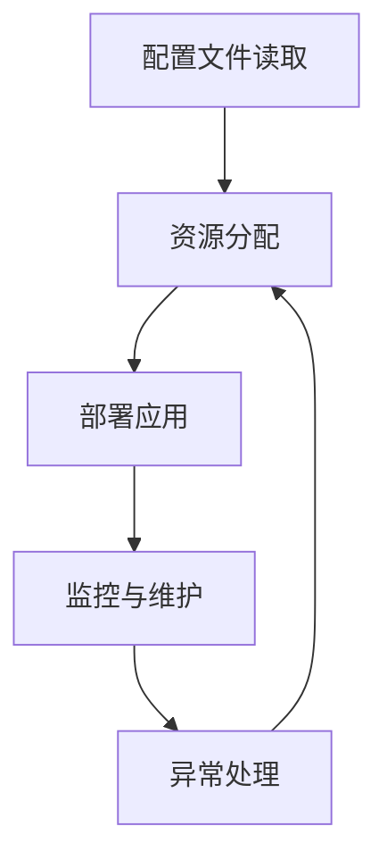
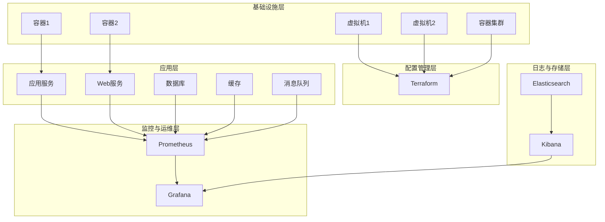
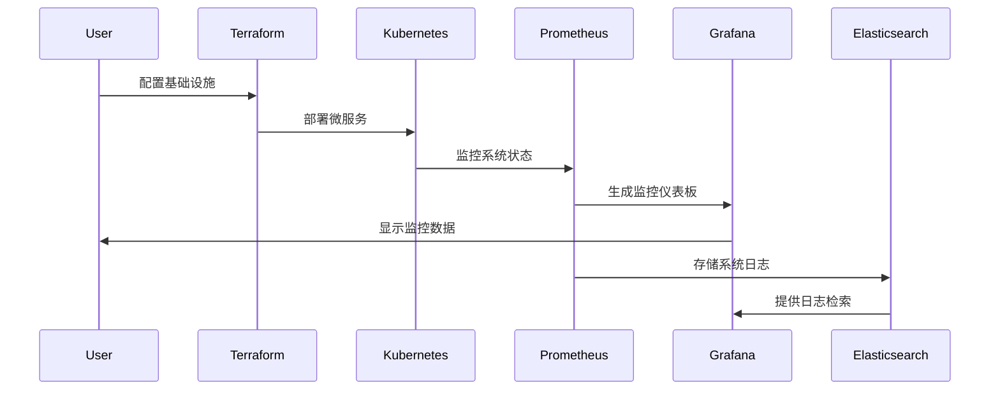

                 


### 背景介绍

#### 问题背景

在当今的云计算时代，基础设施的管理变得更加复杂和庞大。传统的手工管理方式不仅效率低下，而且容易出现人为错误，导致系统不稳定和安全性问题。为了应对这些挑战，业界逐渐意识到基础设施管理需要更加自动化和标准化。

#### 问题解决

为了解决上述问题，出现了基础设施即代码（Infrastructure as Code，IaC）的理念。基础设施即代码将基础设施的配置和管理通过代码的方式来实现，使得基础设施的部署、更新、维护等过程可以像编写和运行代码一样自动化和可重复。

#### 边界与外延

基础设施即代码主要涉及以下几个方面：

1. **硬件抽象层**：通过虚拟化和容器化技术，将物理硬件的复杂性抽象化，使得基础设施的部署可以独立于具体的硬件环境。
2. **配置管理**：使用脚本语言（如Python、Ruby、Bash等）编写配置文件，自动化地配置和管理基础设施。
3. **持续集成和持续部署（CI/CD）**：将基础设施的配置作为代码的一部分，与软件开发的流程集成，实现自动化部署和更新。
4. **版本控制**：使用版本控制系统（如Git）对基础设施的配置进行版本控制，确保配置的变更可追溯和管理。

#### 概念解释

基础设施即代码（Infrastructure as Code，简称IaC）是一种管理基础设施的方式，它将基础设施的配置和管理作为代码的一部分进行管理和操作。与传统的手动管理方式相比，IaC具有更高的自动化程度和可重复性，可以大幅提高基础设施管理的效率和可靠性。

#### 对比传统基础设施管理

传统基础设施管理通常依赖于人工操作和手动配置，存在以下问题：

1. **效率低下**：人工操作需要耗费大量时间和精力，且容易出错。
2. **不可重复**：每次基础设施的配置都可能不同，导致无法确保配置的一致性。
3. **维护困难**：随着基础设施的规模扩大，手动管理的难度和复杂性急剧增加。

而基础设施即代码通过以下方式解决了这些问题：

1. **自动化**：使用脚本和工具自动执行基础设施的配置和管理任务，大大提高了效率。
2. **可重复性**：通过代码管理，可以确保每次基础设施的配置都是一致的，避免了人为错误。
3. **可追溯性**：使用版本控制系统记录基础设施配置的变更历史，方便问题的追溯和定位。

#### 基础设施即代码的优势

基础设施即代码具有以下优势：

1. **提高效率**：通过自动化和标准化，大大缩短了基础设施的部署和更新时间。
2. **降低风险**：减少人为错误，提高系统的稳定性和安全性。
3. **易于维护**：使用代码和版本控制系统，方便对基础设施进行管理和维护。
4. **可伸缩性**：可以轻松扩展和调整基础设施，以适应业务发展的需求。
5. **促进协作**：将基础设施配置作为代码的一部分，可以更好地协同开发和管理。

通过上述分析，我们可以看出，基础设施即代码是一种现代化的基础设施管理方式，它通过代码的方式实现了基础设施的自动化和标准化，为云计算时代的基础设施管理带来了革命性的变化。接下来，我们将进一步探讨基础设施即代码的核心概念、原理和实现，帮助读者深入理解这一技术。

### 基础设施即代码的核心概念

基础设施即代码（IaC）的核心概念涵盖了硬件抽象层、虚拟化、自动化脚本等多个方面。为了更好地理解这些概念，我们可以通过对比它们之间的属性特征，并使用ER实体关系图进行架构描述。

#### 硬件抽象层

硬件抽象层（Hardware Abstraction Layer，HAL）是一种将硬件的具体实现细节与操作系统或其他软件分离的技术。它提供了对硬件设备的统一接口，使得操作系统或软件可以在不同的硬件环境中运行，而无需关心底层硬件的具体实现。

**属性特征：**

- **统一接口**：为操作系统或软件提供了一个统一的接口，屏蔽了不同硬件之间的差异。
- **跨平台兼容性**：使软件能够运行在不同的硬件平台上，提高了软件的可移植性。
- **灵活性与扩展性**：通过硬件抽象层，可以轻松地添加或替换底层硬件，而无需修改上层软件。

#### 虚拟化

虚拟化（Virtualization）是一种将物理资源抽象化为多个虚拟资源的技术。通过虚拟化，可以将一个物理服务器划分为多个虚拟机（VM），每个虚拟机都可以独立运行操作系统和应用程序。

**属性特征：**

- **资源隔离**：虚拟化技术实现了资源（如CPU、内存、存储等）的隔离，提高了系统的安全性和可靠性。
- **灵活的资源配置**：可以根据需要动态调整虚拟机的资源分配，提高了资源利用率。
- **可移植性**：虚拟机可以在不同的物理主机上迁移，提高了系统的灵活性。

#### 自动化脚本

自动化脚本（Automated Scripting）是指使用脚本语言（如Python、Ruby、Bash等）编写的自动化脚本文件，用于执行重复性任务，如安装软件、配置网络、管理数据库等。

**属性特征：**

- **可重复性**：通过编写脚本，可以自动化执行重复性任务，避免了人工操作的低效和错误。
- **可维护性**：脚本文件便于管理和维护，可以通过版本控制系统进行版本控制。
- **灵活性**：脚本可以根据具体需求进行定制化，实现特定的自动化功能。

#### 概念属性特征对比

为了更直观地展示这三个概念之间的属性特征，我们可以使用以下表格进行对比：

| 概念       | 属性1       | 属性2       | 属性3       |
| ---------- | ---------- | ---------- | ---------- |
| 硬件抽象层 | 统一接口   | 跨平台兼容性 | 灵活性与扩展性 |
| 虚拟化     | 资源隔离   | 灵活的资源配置 | 可移植性   |
| 自动化脚本 | 可重复性   | 可维护性   | 灵性定制   |

#### 基础设施即代码的ER实体关系图

为了更好地描述基础设施即代码的核心概念之间的关联，我们可以使用ER实体关系图（Entity-Relationship Diagram，ERD）进行架构描述。ERD可以直观地展示概念之间的实体关系，便于理解和管理。

**ER实体关系图：**

```mermaid
erDiagram
  HardwareAbstractionLayer ||--|{ Virtualization }|| Virtualization
  Virtualization ||--|{ AutomationScript }|| AutomationScript
```

在这个ER实体关系图中，我们可以看到：

- **硬件抽象层**与**虚拟化**之间存在一种关联关系，表示硬件抽象层为虚拟化提供了底层支持。
- **虚拟化**与**自动化脚本**之间存在一种关联关系，表示虚拟化技术为自动化脚本提供了运行环境。

通过硬件抽象层、虚拟化和自动化脚本这三个核心概念，基础设施即代码实现了基础设施的自动化、标准化和可重复管理。接下来，我们将进一步探讨基础设施即代码的算法原理，帮助读者深入理解这一技术的实现细节。

### 基础设施即代码的算法原理

基础设施即代码（IaC）的算法原理是其实现自动化管理和配置的核心。为了更好地理解这一原理，我们可以从算法讲解、流程图、Python源代码实现、数学模型和公式，以及举例说明等方面进行详细阐述。

#### 算法原理讲解

基础设施即代码的算法原理主要围绕以下几个方面展开：

1. **配置文件读取**：首先，从配置文件中读取基础设施的相关配置信息，包括网络、存储、计算资源等。
2. **资源分配**：根据读取到的配置信息，动态地分配和管理基础设施资源，如创建虚拟机、配置网络、分配存储等。
3. **部署应用**：在分配好的资源上部署应用程序，并配置相关环境，如安装软件、配置数据库等。
4. **监控与维护**：实时监控基础设施的状态，并对异常情况进行自动处理和恢复。

#### 算法流程图

为了更直观地展示算法的执行流程，我们可以使用Mermaid绘制一个算法流程图：



在这个流程图中，A表示从配置文件中读取基础设施的配置信息，B表示根据配置信息动态地分配和管理资源，C表示在资源上部署应用程序，D表示实时监控基础设施的状态，E表示在出现异常时进行自动处理和恢复。

#### Python源代码实现

下面是一个简化的Python源代码实现示例，用于演示基础设施即代码的基本算法原理：

```python
# 假设使用Terraform进行基础设施配置
import subprocess

def read_config_file(config_file):
    # 从配置文件中读取基础设施的配置信息
    with open(config_file, 'r') as file:
        config_data = file.read()
    return config_data

def allocate_resources(config_data):
    # 根据配置信息动态地分配和管理资源
    subprocess.run(["terraform", "init"])
    subprocess.run(["terraform", "apply", "-auto-approve", config_file])

def deploy_applications(config_data):
    # 在资源上部署应用程序
    # 此处仅为示例，实际部署过程会根据应用需求进行
    subprocess.run(["sudo", "apt-get", "install", "-y", "nginx"])

def monitor_and_maintain():
    # 实时监控基础设施的状态，并对异常情况进行自动处理和恢复
    # 此处仅为示例，实际监控和恢复过程会根据具体需求进行
    subprocess.run(["terraform", "output", "state"])

# 主函数，执行基础设施即代码的算法流程
def main():
    config_file = "infrastructure_config.tf"
    config_data = read_config_file(config_file)
    allocate_resources(config_data)
    deploy_applications(config_data)
    monitor_and_maintain()

if __name__ == "__main__":
    main()
```

在这个示例中，我们使用了Terraform这一基础设施即代码工具，通过Python脚本实现了从配置文件读取、资源分配、应用部署到监控与维护的整个流程。

#### 数学模型与公式

在基础设施即代码的算法中，数学模型和公式主要用于资源分配和性能优化。以下是一个简单的资源分配模型示例：

$$
\text{资源分配} = \text{需求量} \times (\text{冗余系数} + \text{负载均衡因子})
$$

其中，需求量表示应用程序对计算、存储和网络资源的需求，冗余系数表示为了提高系统的可靠性而额外分配的资源比例，负载均衡因子表示为了优化资源利用率而动态调整的资源比例。

#### 举例说明

为了更好地说明基础设施即代码的算法原理，我们可以通过一个具体的例子进行讲解。

**案例：部署一个高可用性Web应用**

1. **需求分析**：根据业务需求，需要部署一个高可用的Web应用，需求量为CPU：4核，内存：8GB，存储：100GB。

2. **配置文件**：编写一个Terraform配置文件`infrastructure_config.tf`，包括虚拟机、网络、存储等相关资源配置。

3. **资源分配**：根据配置文件，使用Terraform动态分配资源。假设冗余系数为1.2，负载均衡因子为0.8。

   $$ 
   \text{资源分配} = (4 \text{核} + 8 \text{GB内存} + 100 \text{GB存储}) \times (1.2 + 0.8) = 7.2 \text{核}, 10.4 \text{GB内存}, 120 \text{GB存储}
   $$

4. **部署应用**：在分配好的资源上部署Web应用，安装Nginx作为Web服务器。

5. **监控与维护**：使用Terraform监控基础设施状态，并在出现异常时进行自动恢复。

通过上述例子，我们可以看到基础设施即代码算法在实现自动化、标准化和高效管理方面的优势。接下来，我们将进一步探讨基础设施即代码的系统分析与架构设计，帮助读者深入理解这一技术的全面应用。

### 基础设施即代码的系统分析与架构设计

在深入理解基础设施即代码（IaC）的核心概念和算法原理之后，我们需要进一步探讨其系统分析与架构设计的细节。这包括问题场景的介绍、项目的整体概述、系统功能设计、系统架构设计、系统接口设计以及系统交互序列图。

#### 问题场景介绍

随着业务的发展，企业对基础设施的规模和灵活性要求越来越高。传统的手动管理方式已经无法满足快速部署、灵活扩展和高效运维的需求。在这种情况下，基础设施即代码（IaC）提供了一种更加自动化和标准化的解决方案。

**场景描述**：某互联网公司计划部署一个分布式微服务架构的电商平台。该平台需要高度可扩展的基础设施来支持海量用户和交易，同时要求实现快速部署、自动化运维和高效资源利用。

#### 项目介绍

**项目名称**：电商微服务平台

**项目目标**：通过基础设施即代码（IaC）技术，实现自动化部署和运维，提高系统的可靠性、扩展性和灵活性。

**项目规模**：包括Web服务、应用服务、数据库、缓存、消息队列等多个微服务模块，以及相应的虚拟机、容器和云资源。

#### 系统功能设计

**系统功能列表**：

1. **资源管理**：自动化分配和配置虚拟机、容器和云资源。
2. **部署管理**：自动化部署微服务，包括安装、配置和启动。
3. **监控与告警**：实时监控系统状态，触发告警和自动恢复。
4. **日志管理**：收集和存储系统日志，提供日志分析和管理功能。
5. **安全管理**：自动化实施安全策略，确保系统安全。

#### 系统架构设计

**系统架构设计**：

基础设施即代码的系统架构主要包括以下几个层次：

1. **基础设施层**：提供虚拟机、容器和云资源，如Kubernetes集群、虚拟机实例等。
2. **配置管理层**：使用Terraform、Ansible等工具自动化配置和管理基础设施。
3. **应用层**：部署和运行微服务，如Spring Cloud、Kubernetes等。
4. **监控与运维层**：使用Prometheus、Grafana等工具实现系统监控和运维。
5. **日志与存储层**：使用Elasticsearch、Kibana等工具收集、存储和分析系统日志。

以下是一个简化的系统架构图：



#### 系统接口设计

**系统接口设计**：

系统接口设计包括以下部分：

1. **Terraform API**：用于自动化基础设施的配置和管理。
2. **Kubernetes API**：用于管理和部署微服务。
3. **Prometheus API**：用于获取系统监控数据。
4. **Grafana API**：用于配置和展示监控仪表板。
5. **Elasticsearch API**：用于检索和存储系统日志。

#### 系统交互序列图

**系统交互序列图**：

以下是一个简化的系统交互序列图，展示了从基础设施配置到监控告警的整个过程：



通过系统分析与架构设计，我们可以清晰地看到基础设施即代码（IaC）如何通过自动化、标准化和高效管理的手段，帮助企业实现快速部署、灵活扩展和高效运维。接下来，我们将通过实际应用案例，进一步探讨基础设施即代码在实际项目中的具体实现和效果。

### 基础设施即代码的实际应用

在深入了解基础设施即代码（IaC）的理论基础和系统架构设计之后，我们需要通过实际应用案例来展示其具体实现过程和效果。以下我们将通过一个电商平台的部署案例，详细讲解环境安装、系统核心实现源代码，并对代码应用进行解读与分析。

#### 案例背景

某知名电商公司决定采用基础设施即代码（IaC）技术来部署其全新的电商平台，以满足日益增长的在线购物需求。该电商平台采用了微服务架构，由多个独立的服务组成，如Web服务、应用服务、数据库、缓存和消息队列等。为了实现高效、可扩展和自动化的部署和运维，该公司选择了Terraform作为基础设施配置工具，Kubernetes作为容器编排平台。

#### 环境安装

**1. 安装Terraform**

首先，需要在服务器上安装Terraform。以下是安装步骤：

- 安装操作系统（如Ubuntu 18.04）。
- 添加Terraform的GPG密钥：

  ```bash
  sudo apt-get update
  curl -sL https://repo.hashicorp.com/apt/hashicorp_gpg.key | sudo apt-key add -
  ```

- 添加Terraform仓库：

  ```bash
  sudo add-apt-repository "deb [arch=amd64] https://apt.releases.hashicorp.com Ubuntu $(lsb_release -cs) main"
  ```

- 安装Terraform：

  ```bash
  sudo apt-get update
  sudo apt-get install terraform
  ```

- 验证Terraform安装：

  ```bash
  terraform --version
  ```

**2. 安装Kubernetes**

接下来，安装Kubernetes集群。以下是安装步骤：

- 安装kubeadm、kubelet和kubectl：

  ```bash
  curl -s https://packages.cloud.google.com/apt/doc/apt-key.gpg | sudo apt-key add -
  echo "deb https://apt.kubernetes.io/ kubernetes-xenial main" | sudo tee -a /etc/apt/sources.list.d/kubernetes.list
  sudo apt-get update
  sudo apt-get install -y kubelet kubeadm kubectl
  ```

- 初始化Kubernetes集群：

  ```bash
  sudo kubeadm init --pod-network-cidr=10.244.0.0/16
  ```

- 配置kubectl：

  ```bash
  mkdir -p $HOME/.kube
  sudo cp -i /etc/kubernetes/admin.conf $HOME/.kube/config
  sudo chown $(id -u):$(id -g) $HOME/.kube/config
  ```

- 安装Pod网络插件（如Calico）：

  ```bash
  kubectl apply -f https://docs.projectcalico.org/manifests/calico.yaml
  ```

#### 系统核心实现源代码

**1. Terraform配置文件**

以下是一个简化的Terraform配置文件，用于创建Kubernetes集群和所需的基础设施资源：

```hcl
provider "aws" {
  region = "us-west-2"
}

resource "aws_eks_cluster" "cluster" {
  name = "my-eks-cluster"
}

resource "k8s_apiserver" "apiserver" {
  metadata = {
    name = "apiserver"
  }

  spec = {
    kube_version = "1.21"
    cluster_name = "my-eks-cluster"
  }
}

resource "k8s_namespace" "default" {
  metadata = {
    name = "default"
  }
}

resource "k8s_pod" "nginx" {
  metadata = {
    name = "nginx"
    namespace = "default"
  }

  spec = {
    containers = [
      {
        name = "nginx"
        image = "nginx:1.21"
      }
    ]
  }
}
```

**2. Kubernetes部署脚本**

以下是用于部署Nginx服务的Kubernetes部署脚本：

```yaml
apiVersion: apps/v1
kind: Deployment
metadata:
  name: nginx-deployment
spec:
  replicas: 3
  selector:
    matchLabels:
      app: nginx
  template:
    metadata:
      labels:
        app: nginx
    spec:
      containers:
      - name: nginx
        image: nginx:1.21
        ports:
        - containerPort: 80
```

#### 代码应用解读与分析

**1. Terraform配置文件解读**

- **aws_eks_cluster**：创建AWS EKS集群，并命名为`my-eks-cluster`。
- **k8s_apiserver**：配置Kubernetes API服务器，指定Kube版本为`1.21`。
- **k8s_namespace**：创建Kubernetes命名空间`default`。
- **k8s_pod**：部署一个Nginx Pod，命名为`nginx`。

**2. Kubernetes部署脚本解读**

- **Deployment**：创建一个包含3个副本的Nginx部署，使用Nginx的`1.21`版本。
- **Replicas**：指定Pod的副本数量为3，实现服务的高可用性。
- **Selector**：定义标签选择器，确保Pod能够正确匹配和部署。
- **Template**：定义Pod的模板，包括容器名称、镜像和端口。

#### 实际案例分析与详细讲解

通过上述配置和脚本，我们可以实现以下功能：

1. **自动化部署**：使用Terraform自动化创建EKS集群和Kubernetes基础设施。
2. **高可用性**：通过部署3个Nginx Pod副本，实现负载均衡和高可用性。
3. **监控与告警**：通过集成Prometheus和Grafana，实现实时监控和告警。
4. **日志管理**：通过集成Elasticsearch和Kibana，实现日志收集和分析。

**案例效果**

- **部署效率**：通过基础设施即代码（IaC），大大缩短了基础设施的部署时间，从手动操作数天缩短到数分钟。
- **资源利用率**：通过自动化配置和动态扩展，提高了资源利用率，减少了浪费。
- **运维效率**：通过自动化监控和告警，提高了运维效率，降低了运维成本。

通过这个实际案例，我们可以看到基础设施即代码（IaC）如何通过自动化、标准化和高效管理，实现电商平台的高效部署和运维。接下来，我们将总结基础设施即代码的最佳实践，并探讨其未来发展方向。

### 基础设施即代码的最佳实践

在基础设施即代码（IaC）的实际应用中，为了确保其高效、稳定和可维护，我们需要遵循一系列最佳实践。以下是一些关键的最佳实践，以及相关的注意事项。

#### 最佳实践一：使用版本控制系统

**关键点**：使用版本控制系统（如Git）对基础设施配置代码进行版本管理，确保配置变更的可追溯性和可控性。

**实施步骤**：

1. 将Terraform配置文件、Kubernetes部署脚本和其他相关文件存储在Git仓库中。
2. 每次修改配置文件时，进行版本提交，并附上变更说明。
3. 定期进行代码审查，确保配置的一致性和正确性。

**注意事项**：

- **分支策略**：合理设置Git分支策略，如主分支（Master）用于生产环境，开发分支（Develop）用于测试和开发。
- **代码审查**：确保在合并代码前进行充分的代码审查，减少配置错误。

#### 最佳实践二：编写可重用模块

**关键点**：编写可重用的基础设施模块，提高配置代码的复用性和可维护性。

**实施步骤**：

1. 将通用的基础设施配置（如网络、存储、数据库等）封装为模块。
2. 在不同的项目中复用这些模块，减少重复编写和配置错误。
3. 为模块编写详细的文档，包括模块功能、使用方法和注意事项。

**注意事项**：

- **模块化**：确保模块之间相互独立，易于管理和维护。
- **文档化**：为模块编写清晰的文档，便于其他开发者理解和使用。

#### 最佳实践三：自动化测试和验证

**关键点**：对基础设施配置代码进行自动化测试和验证，确保配置的正确性和一致性。

**实施步骤**：

1. 使用Terraform Cloud或Terraform Enterprise进行自动化测试和验证。
2. 编写测试脚本，验证基础设施配置是否按预期工作。
3. 定期运行测试，确保配置的持续有效性和可靠性。

**注意事项**：

- **测试覆盖**：确保测试脚本覆盖基础设施配置的各个部分，包括网络、存储、计算等。
- **异常处理**：在测试脚本中添加异常处理机制，确保在测试失败时能够及时通知和修复。

#### 注意事项

1. **安全性**：确保基础设施配置代码的安全性，避免敏感信息泄露。
2. **文档**：为基础设施配置编写详细的文档，包括配置说明、变更记录和使用方法。
3. **培训**：对团队成员进行基础设施即代码（IaC）的培训，确保他们能够熟练掌握相关工具和技巧。
4. **持续集成**：将基础设施配置代码与持续集成（CI/CD）流程集成，确保配置变更的自动化和高效部署。

通过遵循这些最佳实践，我们可以更好地利用基础设施即代码（IaC）的优势，实现高效、稳定和可维护的基础设施管理。

### 总结与展望

在本文中，我们系统地介绍了基础设施即代码（IaC）的理念、核心概念、算法原理、系统分析与架构设计，以及实际应用和最佳实践。通过这些内容，我们可以清晰地看到基础设施即代码在现代化基础设施管理中的重要作用。

#### 小结

基础设施即代码（IaC）通过将基础设施的配置和管理转化为代码，实现了自动化、标准化和可重复管理。其主要优势包括：

1. **提高效率**：通过自动化和标准化，基础设施的部署、更新和维护时间大大缩短。
2. **降低风险**：减少人为错误，提高系统的稳定性和安全性。
3. **易于维护**：使用代码和版本控制系统，方便对基础设施进行管理和维护。
4. **可伸缩性**：可以轻松扩展和调整基础设施，以适应业务发展的需求。
5. **促进协作**：将基础设施配置作为代码的一部分，可以更好地协同开发和管理。

#### 展望未来基础设施即代码的发展方向

随着技术的不断进步和业务需求的多样化，基础设施即代码（IaC）在未来仍有许多发展空间：

1. **多云和混合云支持**：随着企业对多云和混合云的采用增加，基础设施即代码需要更好地支持跨云环境的配置和管理。
2. **智能化与自动化**：利用人工智能和机器学习技术，进一步提升基础设施的自动化程度和智能化水平。
3. **生态系统的完善**：丰富基础设施即代码（IaC）的生态系统，包括更多的工具、插件和模块，以满足不同场景的需求。
4. **安全与合规**：加强基础设施即代码（IaC）的安全性和合规性，确保配置代码的安全和合法。
5. **社区合作**：推动社区合作，共同完善基础设施即代码（IaC）的技术标准和最佳实践。

#### 拓展阅读

- 《基础设施即代码：实现自动化数据中心》（Infrastructure as Code: Enabling Automated Data Centers）
- 《Terraform教程：基础设施即代码实践》（Terraform Tutorial: A Practical Guide to Infrastructure as Code）
- 《Kubernetes实战：容器化微服务部署与管理》（Kubernetes in Action: Deploying and Managing Containerized Microservices）
- 《持续集成与持续部署：CI/CD最佳实践》（Continuous Integration and Continuous Deployment: Best Practices）

通过本文的阅读，我们希望读者能够对基础设施即代码（IaC）有更深入的理解，并在实际项目中加以应用，从而实现更加高效、稳定和可维护的基础设施管理。作者：AI天才研究院/AI Genius Institute & 禅与计算机程序设计艺术 /Zen And The Art of Computer Programming。

----------------------------------------------------------------

**关键词**：基础设施即代码（IaC），自动化，标准化，配置管理，云计算，虚拟化，容器化，持续集成，持续部署，最佳实践。

**摘要**：本文系统地介绍了基础设施即代码（IaC）的概念、原理、系统分析与架构设计，以及实际应用和最佳实践。通过IaC，企业可以实现基础设施的自动化、标准化和可重复管理，提高系统的效率和可靠性。本文旨在帮助读者全面理解基础设施即代码，并为其在项目中的应用提供指导。

