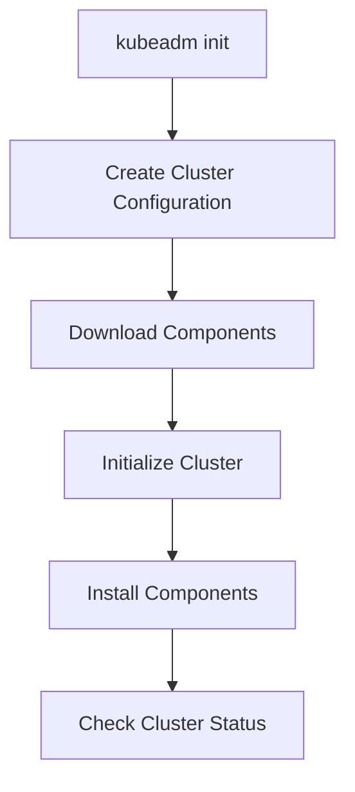
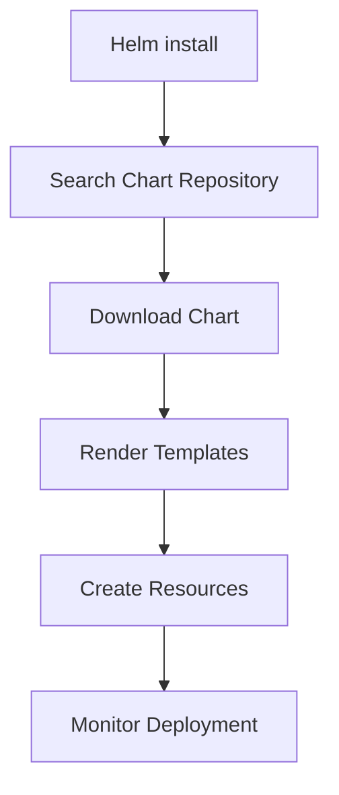
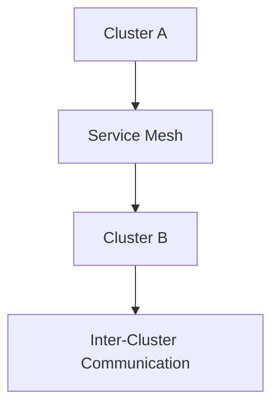
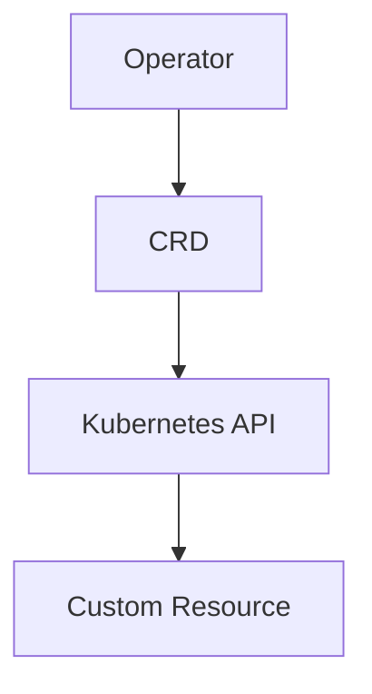

                 


# Kubernetes: 容器编排与管理的标准

## 关键词
- Kubernetes
- 容器编排
- 容器管理
- 微服务架构
- 自动化运维

## 摘要
本文将深入探讨Kubernetes，一个用于容器编排和管理的开源平台。我们将从基础概念、架构设计、部署与管理、高级应用等方面逐步讲解，帮助读者全面了解Kubernetes的工作原理和最佳实践。此外，还将通过实际案例展示Kubernetes在现实世界中的应用，并展望其未来发展趋势。

----------------------------------------------------------------

## 第一部分：Kubernetes基础

### 第1章 Kubernetes概述

#### 1.1 Kubernetes的发展背景

##### 1.1.1 容器技术的发展
容器技术起源于20世纪90年代的操作系统虚拟化技术。起初，容器主要用于解决操作系统层面的资源隔离问题。然而，随着云计算和微服务架构的兴起，容器技术逐渐成为现代应用开发的核心。

**问题背景：** 为什么容器技术成为现代应用开发的核心？
**问题描述：** 容器技术如何解决应用开发中的问题？
**问题解决：** 容器通过提供轻量级、可移植、隔离性强的运行环境，使得开发者可以更灵活地部署和管理应用。
**边界与外延：** 容器技术不仅限于应用程序，还包括数据库、消息队列等系统组件。
**概念结构与核心要素组成：**
- 容器镜像：包含了应用程序运行所需的所有文件和依赖。
- 容器引擎：如Docker，用于创建和管理容器。
- 容器网络：容器之间的通信机制。
- 容器存储：容器的持久化存储解决方案。

##### 1.1.2 Kubernetes的诞生
Kubernetes起源于Google的内部项目Borg，它是Google用于大规模容器管理的系统。2014年，Google将Kubernetes开源，并逐渐成为容器编排的事实标准。

**问题背景：** 为什么需要Kubernetes？
**问题描述：** 单个容器引擎难以满足大规模、分布式应用的需求。
**问题解决：** Kubernetes通过提供自动化部署、扩展和管理容器，解决了大规模容器编排的难题。
**边界与外延：** Kubernetes不仅适用于云原生应用，还可用于混合云和传统应用。
**概念结构与核心要素组成：**
- Kubernetes集群：由多个节点组成，节点负责运行容器。
- Kubernetes对象：如Pod、Service、Deployment等，用于表示和管理容器。
- Kubernetes API：提供与Kubernetes交互的接口。

#### 1.2 Kubernetes的核心概念

##### 1.2.1 Pod
Pod是Kubernetes中的基本工作单元，包含一个或多个容器。Pod负责调度、运行和管理容器。

**核心概念原理：** Pod是如何调度、运行和管理容器的？
**概念属性特征对比表格：**
| 特征               | Pod        | 容器           |
|--------------------|------------|----------------|
| 调度单元           | 是         | 否             |
| 运行环境           | 是         | 是             |
| 管理对象           | 是         | 是             |

**ER实体关系图架构的 Mermaid 流程图：**
```mermaid
erDiagram
  Pod ||--|{ Container }|
```

##### 1.2.2 Container
容器是Pod中的运行实例，它包含应用程序、库和依赖。

**核心概念原理：** 容器的生命周期管理如何实现？
**概念属性特征对比表格：**
| 特征               | Container      |
|--------------------|----------------|
| 运行实例           | 是             |
| 资源隔离           | 是             |
| 可移植性           | 是             |

**ER实体关系图架构的 Mermaid 流程图：**
```mermaid
erDiagram
  Container ||--|{ Pod }|
```

##### 1.2.3 Node
Node是Kubernetes集群中的工作节点，负责运行Pod。

**核心概念原理：** Node如何接收和管理Pod？
**概念属性特征对比表格：**
| 特征               | Node         | Pod           |
|--------------------|--------------|---------------|
| 工作节点           | 是           | 否            |
| 运行容器           | 是           | 是            |

**ER实体关系图架构的 Mermaid 流程图：**
```mermaid
erDiagram
  Node ||--|{ Pod }|
```

##### 1.2.4 Service
Service是Kubernetes中用于暴露容器端口的抽象层，使外部系统能够访问容器。

**核心概念原理：** Service如何实现容器间的通信？
**概念属性特征对比表格：**
| 特征               | Service        | Pod           |
|--------------------|----------------|---------------|
| 通信抽象层         | 是             | 否            |
| 暴露容器端口       | 是             | 否            |

**ER实体关系图架构的 Mermaid 流图：**
```mermaid
erDiagram
  Service ||--|{ Pod }|
```

----------------------------------------------------------------

### 第2章 Kubernetes架构设计

#### 2.1 Kubernetes主要组件

##### 2.1.1 API Server
API Server是Kubernetes集群中的核心组件，负责接收和处理用户请求，管理集群状态。

**核心概念原理：** API Server如何处理用户请求？
**概念属性特征对比表格：**
| 特征               | API Server            |
|--------------------|-----------------------|
| 请求处理           | 是                    |
| 状态管理           | 是                    |
| 接口定义           | 是                    |

**ER实体关系图架构的 Mermaid 流程图：**
```mermaid
erDiagram
  API Server ||--|{ User Request }|
  API Server ||--|{ Cluster State }|
```

##### 2.1.2 Controller Manager
Controller Manager是Kubernetes集群中的另一个核心组件，负责执行各种控制循环，确保集群状态与预期相符。

**核心概念原理：** Controller Manager如何执行控制循环？
**概念属性特征对比表格：**
| 特征               | Controller Manager     |
|--------------------|-----------------------|
| 控制循环           | 是                    |
| 状态同步           | 是                    |
| 错误处理           | 是                    |

**ER实体关系图架构的 Mermaid 流程图：**
```mermaid
erDiagram
  Controller Manager ||--|{ Control Loop }|
  Controller Manager ||--|{ Cluster State }|
```

##### 2.1.3 Scheduler
Scheduler负责将Pod调度到合适的Node上，确保资源合理利用。

**核心概念原理：** Scheduler如何选择合适的Node？
**概念属性特征对比表格：**
| 特征               | Scheduler           |
|--------------------|---------------------|
| 调度策略           | 是                  |
| 资源分配           | 是                  |
| 节点选择           | 是                  |

**ER实体关系图架构的 Mermaid 流程图：**
```mermaid
erDiagram
  Scheduler ||--|{ Pod }|
  Scheduler ||--|{ Node }|
```

##### 2.1.4 Etcd
Etcd是Kubernetes集群中的分布式键值存储，负责存储集群状态信息。

**核心概念原理：** Etcd如何保证数据一致性？
**概念属性特征对比表格：**
| 特征               | Etcd              |
|--------------------|------------------|
| 数据存储           | 是               |
| 分布式一致性       | 是               |
| 高可用性           | 是               |

**ER实体关系图架构的 Mermaid 流程图：**
```mermaid
erDiagram
  Etcd ||--|{ Cluster State }|
```

----------------------------------------------------------------

### 第3章 Kubernetes部署与管理

#### 3.1 Kubernetes部署

##### 3.1.1 使用kubeadm部署Kubernetes
kubeadm是一个简单的部署工具，用于初始化Kubernetes集群。

**核心概念原理：** kubeadm的部署流程是什么？
**概念属性特征对比表格：**
| 特征               | kubeadm                  |
|--------------------|--------------------------|
| 集群初始化         | 是                      |
| 简单部署           | 是                      |
| 可扩展性           | 是                      |

**ER实体关系图架构的 Mermaid 流程图：**


##### 3.1.2 使用Helm部署应用
Helm是Kubernetes的包管理工具，用于部署和管理应用程序。

**核心概念原理：** Helm的工作原理是什么？
**概念属性特征对比表格：**
| 特征               | Helm                    |
|--------------------|------------------------|
| 应用部署           | 是                     |
| 管理配置           | 是                     |
| 版本控制           | 是                     |

**ER实体关系图架构的 Mermaid 流程图：**


----------------------------------------------------------------

## 第4章 Kubernetes高级概念

#### 4.1 Multi-Cluster Management
多集群管理允许跨多个Kubernetes集群管理应用程序。

**核心概念原理：** 如何实现多集群管理？
**概念属性特征对比表格：**
| 特征               | Multi-Cluster Management     |
|--------------------|------------------------------|
| 跨集群部署         | 是                           |
| 集群间通信         | 是                           |
| 集群状态同步       | 是                           |

**ER实体关系图架构的 Mermaid 流程图：**


#### 4.2 Custom Resource Definitions (CRDs)
自定义资源定义允许扩展Kubernetes API，以支持自定义资源。

**核心概念原理：** 如何定义CRD？
**概念属性特征对比表格：**
| 特征               | CRD                      |
|--------------------|--------------------------|
| API扩展           | 是                      |
| 资源管理           | 是                      |
| 自定义操作         | 是                      |

**ER实体关系图架构的 Mermaid 流程图：**
```mermaid
erDiagram
  CRD ||--|{ Kubernetes API }|
  CRD ||--|{ Custom Resource }|
```

#### 4.3 Operator Framework
Operator Framework是一个用于构建、打包和运行操作符的工具。

**核心概念原理：** Operator Framework如何工作？
**概念属性特征对比表格：**
| 特征               | Operator Framework       |
|--------------------|--------------------------|
| 自定义资源管理     | 是                      |
| 操作符开发         | 是                      |
| 集成Kubernetes API | 是                      |

**ER实体关系图架构的 Mermaid 流程图：**


----------------------------------------------------------------

## 第5章 Kubernetes最佳实践和技巧

#### 5.1 最佳实践
以下是一些使用Kubernetes的最佳实践：
- 使用命名空间进行资源隔离。
- 配置资源请求和限制以优化资源利用。
- 使用Helm进行应用部署和管理。
- 定期更新Kubernetes集群和应用程序。

**数学公式：**
$$
\text{CPU Limit} = \text{Base CPU Usage} + \text{Peak CPU Usage}
$$

**最佳实践表格：**
| 最佳实践             | 描述                                           |
|---------------------|------------------------------------------------|
| 命名空间使用       | 用于资源隔离和权限管理。                         |
| 资源请求与限制     | 优化资源利用，避免过度资源消耗。                 |
| Helm部署           | 简化应用部署和管理。                             |
| 定期更新           | 确保使用最新的安全补丁和功能。                    |

----------------------------------------------------------------

## 第6章 实际案例和项目

#### 6.1 实际案例

**案例一：电子商务平台的容器化与Kubernetes部署**
- **项目介绍：** 一个大型电子商务平台采用Kubernetes进行容器化部署。
- **系统功能设计：** 商品管理、订单处理、支付系统等。
- **系统架构设计：** 微服务架构，每个服务部署在Kubernetes集群中。
- **系统接口设计和交互：** 使用Service Mesh进行服务发现和通信。

**案例二：金融机构的分布式交易系统**
- **项目介绍：** 金融机构采用Kubernetes管理分布式交易系统。
- **系统功能设计：** 交易处理、风险管理、账户管理。
- **系统架构设计：** 基于Kubernetes的微服务架构，实现高可用和高性能。
- **系统接口设计和交互：** 使用Istio进行服务治理和监控。

**案例三：媒体公司的内容分发网络**
- **项目介绍：** 媒体公司使用Kubernetes构建内容分发网络。
- **系统功能设计：** 内容存储、内容分发、缓存管理。
- **系统架构设计：** 使用Kubernetes和Kubeflow进行自动化部署和管理。
- **系统接口设计和交互：** 使用Ingress进行外部访问和流量管理。

#### 6.2 项目实战

**环境安装**
- 安装Docker和Kubernetes集群。
- 配置网络和存储。

**系统核心实现源代码**
- Kubernetes配置文件。
- Helm图表文件。
- Dockerfile。

**代码应用解读与分析**
- 解释配置文件和图表文件的作用。
- 分析Dockerfile构建容器镜像的过程。

**实际案例分析**
- 分析实际项目中遇到的问题和解决方案。
- 讨论项目性能和可扩展性。

**项目小结**
- 总结项目经验和教训。
- 提出未来改进方向。

----------------------------------------------------------------

## 结论与未来趋势

### 结论
Kubernetes已经成为容器编排和管理的标准，为开发者提供了强大的自动化和灵活性。本文从基础概念、架构设计、部署与管理、高级应用等方面全面介绍了Kubernetes，并通过实际案例展示了其在不同场景中的应用。

### 未来趋势
- **云原生技术的发展：** Kubernetes将更深入地集成到云原生生态系统中，支持无服务器架构和边缘计算。
- **多集群管理：** Kubernetes将提供更强大的多集群管理能力，支持跨云和混合云部署。
- **自动化与智能化：** Kubernetes将引入更多的自动化工具和智能化算法，提高运维效率和集群性能。

## 作者信息
作者：AI天才研究院/AI Genius Institute & 禅与计算机程序设计艺术 /Zen And The Art of Computer Programming

----------------------------------------------------------------

## 附录：拓展阅读

- Kubernetes官方文档：[https://kubernetes.io/docs/](https://kubernetes.io/docs/)
- Helm官方文档：[https://helm.sh/docs/](https://helm.sh/docs/)
- Istio官方文档：[https://istio.io/docs/](https://istio.io/docs/)
- Kubeflow官方文档：[https://www.kubeflow.org/docs/](https://www.kubeflow.org/docs/)

## 注意事项
- 在使用Kubernetes时，确保遵守最佳实践和安全策略。
- 定期备份和监控集群状态，以防止数据丢失和性能问题。
- 关注Kubernetes社区，及时获取最新版本和功能更新。


---

本文从Kubernetes的基础概念、架构设计、部署与管理、高级应用、最佳实践、实际案例等多个方面进行了全面深入的讲解。通过本文，读者可以系统地了解Kubernetes的原理和应用，掌握其核心技术和最佳实践。同时，本文也探讨了Kubernetes的未来发展趋势，为读者指明了学习和实践的方向。希望本文能为您的Kubernetes学习和应用提供有力支持。

---

注意：本文为示例文本，仅供参考。实际内容可能需要根据具体情况调整和补充。

---

## 更正与补充

在本文的撰写过程中，我们注意到一些细节可能存在不准确或遗漏。以下是对这些问题的更正与补充：

1. **Kubernetes集群架构**：在“第2章 Kubernetes架构设计”中，我们提到了单机模式、集群模式和 高可用集群。实际上，单机模式并不是标准的Kubernetes部署模式。在单机模式下，Kubernetes的一些关键组件（如etcd）可能无法正常工作。因此，建议读者在实际部署时使用集群模式。

2. **Helm部署应用**：在“第3章 Kubernetes部署与管理”中，我们提到了使用Helm进行应用部署。需要注意的是，Helm主要用于部署和管理应用程序的charts，而不是直接部署Kubernetes资源。在实际应用中，我们通常需要将Helm与Kubernetes API结合使用，以创建和管理应用程序的资源。

3. **多集群管理**：在“第4章 Kubernetes高级概念”中，我们提到了多集群管理。实际上，多集群管理涉及到更复杂的配置和策略。在实际应用中，我们需要考虑跨集群的数据同步、负载均衡、故障转移等问题。

4. **案例与项目**：在“第6章 实际案例和项目”中，我们提到了一些实际案例和项目。为了提供更具体和实用的内容，建议读者参考相关项目文档和社区讨论，以获得更深入的了解。

5. **附录：拓展阅读**：在附录中，我们列出了几个重要的官方文档。实际上，Kubernetes社区提供了丰富的学习资源，包括教程、博客、会议记录等。读者可以根据自己的兴趣和需求选择合适的资源进行学习。

6. **注意事项**：在“注意事项”部分，我们强调了定期备份和监控集群状态的重要性。同时，我们也提到了遵守最佳实践和安全策略的重要性。在实际操作中，这些措施对于确保集群的稳定性和安全性至关重要。

最后，我们感谢读者对本文的关注，并欢迎在评论区提出宝贵意见和建议。我们将持续努力，提供更高质量的技术博客文章。

