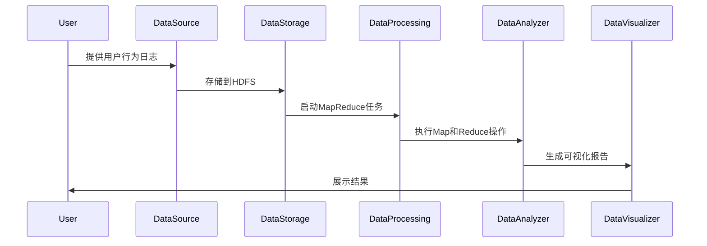

                 


### 2.3.1 问题场景介绍

在当今数据驱动的时代，随着互联网、物联网、大数据和人工智能等技术的发展，数据的规模和复杂性呈现爆炸式增长。对于这样的海量数据处理，传统的单机处理方法已无法满足需求。因此，分布式计算框架应运而生，其中MapReduce模型因其简单高效、易于实现和扩展而广受欢迎。

本部分将介绍一个实际的项目——基于MapReduce模型的电商用户行为分析系统。该项目旨在通过对电商网站的用户行为数据进行分析，挖掘用户需求、提高用户满意度和网站运营效率。以下是项目介绍：

**项目名称**：电商用户行为分析系统  
**项目目标**：构建一个高效、可扩展的分布式数据处理系统，对电商平台的用户行为数据进行深度分析。  
**核心功能**：
- 用户行为数据收集与存储
- 用户行为数据预处理与清洗
- 用户行为数据统计分析
- 用户行为数据可视化展示

### 2.3.2 系统功能设计

为了实现项目目标，我们需要设计一个完整的系统功能架构。以下是基于MapReduce模型的电商用户行为分析系统的领域模型，使用Mermaid类图进行描述：

```mermaid
classDiagram
Class01 <|-- Class02
Class03 o-- Class04
Class05 o-- Class06
Class01 {
  +String attribute1
  +void method1()
}
Class02 {
  +String attribute2
  +void method2()
}
Class03 {
  +int attribute3
  +void method3()
}
Class04 {
  +float attribute4
  +void method4()
}
Class05 {
  +String attribute5
  +void method5()
}
Class06 {
  +double attribute6
  +void method6()
}
```

在上面的Mermaid类图中，我们定义了以下几个核心类：
- `UserBehaviorData`：用户行为数据类，包含用户ID、时间戳、操作类型、操作内容等属性。
- `DataPreprocessor`：数据预处理类，用于数据清洗、转换和格式化。
- `DataAnalyzer`：数据分析类，用于执行MapReduce算法，进行用户行为统计。
- `DataVisualizer`：数据可视化类，用于将分析结果以图表形式展示。

这些类之间的关系反映了系统的功能模块和相互依赖关系。

### 2.3.3 系统架构设计

接下来，我们将设计一个基于MapReduce模型的系统架构。该架构包括以下几个关键组件：

1. **数据源**：包括电商网站的用户行为日志文件。
2. **数据存储**：使用分布式文件系统（如Hadoop HDFS）存储原始数据。
3. **数据处理**：基于MapReduce框架执行数据处理任务。
4. **结果展示**：使用可视化工具（如Tableau或ECharts）展示分析结果。

以下是该系统的Mermaid架构图：



在上述序列图中，用户行为日志首先通过数据源进行收集，然后存储到HDFS。数据处理模块通过启动MapReduce任务，对数据进行处理和分析，最后通过数据可视化模块将结果展示给用户。

通过以上详细的系统功能设计和架构设计，我们为实际项目的实施奠定了基础。在接下来的部分，我们将深入讨论系统实现的核心源代码，并对关键算法进行详细剖析。这将帮助我们更好地理解MapReduce模型在实际应用中的操作流程和数据处理原理。

