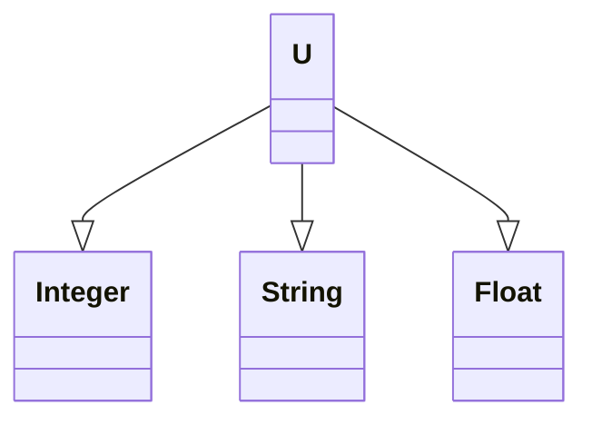
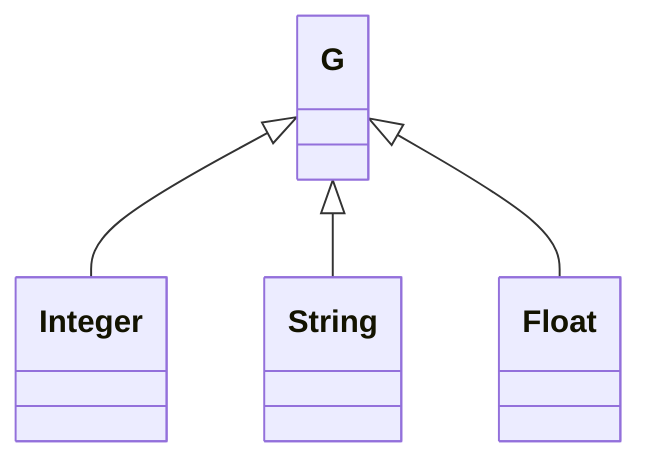

                 


### 3.1.2 构建代数数据类型的方法

构建代数数据类型通常有几种常见的方法：枚举（Enum）、联合（Union）和泛型（Generic）。

**枚举（Enum）**

枚举类型定义了一组命名的常量。在OOP中，枚举可以用来表示具有固定数量的可能值的代数数据类型。

**Mermaid 类图架构：**

```mermaid
enumDiagram
    -[TrafficLights] as TL
    TL -- TrafficLights.Red
    TL -- TrafficLights.Green
    TL -- TrafficLights.Yellow
```

**联合（Union）**

联合类型允许一个变量同时具有多种数据类型中的任意一种。在OOP中，联合类型可以用来表示可能包含多种不同数据的代数数据类型。

**Mermaid 类图架构：**



**泛型（Generic）**

泛型类型允许在定义类、接口或函数时使用类型参数，从而使得代数数据类型可以适应不同的数据类型。

**Mermaid 类图架构：**



### 3.1.3 代数数据类型的属性和操作符

代数数据类型通常具有一组属性和操作符，用于访问和操作数据。

**属性**

- `getValue()`: 获取代数数据类型的值。
- `getSize()`: 获取代数数据类型的大小。

**操作符**

- `equals()`: 比较两个代数数据类型是否相等。
- `hashCode()`: 计算代数数据类型的哈希值。

**示例代码：**

```python
class TrafficLight:
    def __init__(self, color):
        self.color = color

    def getValue(self):
        return self.color

    def equals(self, other):
        return self.color == other.color

    def hashCode(self):
        return hash(self.color)

# 枚举实现
enum TrafficLights:
    RED
    GREEN
    YELLOW

# 联合实现
union UnionType:
    Integer
    String
    Float

# 泛型实现
class GenericType[T]:
    def __init__(self, value: T):
        self.value = value

    def getValue(self) -> T:
        return self.value
```

### 3.2 代数数据类型的操作

#### 3.2.1 数据类型的访问与修改

代数数据类型的访问与修改通常涉及到对数据类型的属性和方法的使用。

**示例代码：**

```python
# 访问和修改代数数据类型的属性
traffic_light = TrafficLight(GREEN)
print(traffic_light.getValue())  # 输出: GREEN

# 修改代数数据类型的值
traffic_light.color = RED
print(traffic_light.getValue())  # 输出: RED
```

#### 3.2.2 数据类型的组合与分解

代数数据类型的组合与分解是指将多个代数数据类型组合成一个更大的数据类型，或将一个更大的数据类型分解成多个代数数据类型。

**示例代码：**

```python
# 组合代数数据类型
class CombinedType:
    def __init__(self, traffic_light: TrafficLight, union_type: UnionType):
        self.traffic_light = traffic_light
        self.union_type = union_type

# 分解代数数据类型
def decompose(combined_type: CombinedType) -> Tuple[TrafficLight, UnionType]:
    return combined_type.traffic_light, combined_type.union_type
```

#### 3.2.3 数据类型的映射与投影

映射与投影是指将代数数据类型的值映射到另一个数据类型，或将代数数据类型的值投影到其组成部分。

**示例代码：**

```python
# 映射代数数据类型的值
def map_value(value: T, mapping_function: Callable[[T], U]) -> U:
    return mapping_function(value)

# 投影代数数据类型的组成部分
def project(union_type: UnionType) -> Tuple[Optional[Integer], Optional[String], Optional[Float]]:
    if isinstance(union_type, Integer):
        return union_type, None, None
    elif isinstance(union_type, String):
        return None, union_type, None
    elif isinstance(union_type, Float):
        return None, None, union_type
```

通过以上分析，我们可以看到代数数据类型在OOP中的构建与操作是如何实现的。这不仅提高了代码的可读性和可维护性，也为函数式编程概念在OOP中的融合提供了坚实的基础。接下来的章节将进一步探讨函数式概念在OOP中的应用及其优势。# OOP中的代数数据类型: 函数式概念的融合

关键词：面向对象编程，代数数据类型，函数式编程，OOP融合，数据结构设计

摘要：本文深入探讨了面向对象编程（OOP）中的代数数据类型，并介绍了如何将函数式编程概念融入OOP中。文章首先介绍了OOP和代数数据类型的基础知识，随后详细分析了函数式编程的基本概念及其在OOP中的应用。通过实际案例，本文展示了如何构建和操作代数数据类型，并讨论了函数式概念在OOP中的最佳实践。最后，文章展望了代数数据类型与OOP的未来发展。

## 第一部分: OOP中的代数数据类型基础

### 第1章: OOP与代数数据类型概述

#### 1.1.1 面向对象编程（OOP）简介

面向对象编程（OOP）是一种编程范式，它将数据和操作数据的方法封装在一起，形成对象。OOP的核心原则包括封装、继承和多态。封装确保了数据的隐藏和安全性；继承允许子类继承父类的属性和方法；多态则允许对象根据其实际类型进行不同的操作。

#### 1.1.2 OOP的核心原则

- **封装**：将数据和操作数据的函数封装在类中，对外提供有限的接口。
- **继承**：允许一个类继承另一个类的属性和方法，实现代码复用。
- **多态**：允许不同类的对象通过共同的接口进行操作，提高代码的灵活性和可扩展性。

#### 1.1.3 面向对象编程与传统编程的区别

传统编程通常关注于过程和指令，而OOP则强调数据和对象。OOP的模块化和封装特性使得代码更加可维护和可扩展。同时，OOP使得开发大型系统变得更加容易，因为对象之间的交互更加直观和明确。

#### 1.2 代数数据类型的定义

代数数据类型是由一个或多个值组成的复合值，这些值可以是基本数据类型或更复杂的结构。代数数据类型在OOP中可以用来表示复杂的逻辑和数据结构，如枚举、联合和泛型。

#### 1.2.2 代数数据类型的分类

代数数据类型可以分为以下几类：

- **枚举（Enum）**：表示一组命名的常量。
- **联合（Union）**：表示可能包含多种不同数据的类型。
- **泛型（Generic）**：允许在定义类、接口或函数时使用类型参数。

#### 1.2.3 代数数据类型的特点

代数数据类型具有以下特点：

- **组合性**：可以将多个数据类型组合成一个复合值。
- **不可变性**：代数数据类型的值通常是不可变的，这有助于提高代码的安全性和可预测性。
- **函数式操作**：代数数据类型的操作通常是纯函数，即不会改变外部状态，易于测试和复用。

#### 1.3 OOP与代数数据类型的关系

OOP中的类和对象可以用来实现代数数据类型。例如，枚举可以表示为类，联合可以表示为类层次结构，泛型可以表示为参数化的类或接口。

#### 1.3.1 OOP中的代数数据类型实现

在OOP中，代数数据类型可以通过以下几种方式实现：

- **枚举**：使用类来实现。
- **联合**：使用类层次结构来实现。
- **泛型**：使用参数化的类或接口来实现。

#### 1.3.2 代数数据类型在OOP中的优势

代数数据类型在OOP中的优势包括：

- **类型安全**：通过显式定义数据类型，提高了代码的稳定性。
- **可维护性**：通过封装和组合，使得代码更加易于理解和维护。
- **函数式编程**：通过纯函数操作，提高了代码的可测试性和可复用性。

#### 1.3.3 代数数据类型的适用场景

代数数据类型适用于以下场景：

- **枚举**：用于表示有限数量的值，如颜色、状态等。
- **联合**：用于表示可能包含多种不同数据的值，如查询结果。
- **泛型**：用于表示通用数据结构，如列表、树等。

## 第2章: 函数式概念在OOP中的应用

### 2.1 函数式编程的基本概念

#### 2.1.1 函数式编程简介

函数式编程是一种编程范式，它将计算视为一系列函数的执行，而不是指令的执行。函数式编程的核心思想包括：

- **函数是一等公民**：函数可以作为参数传递，也可以作为返回值返回。
- **不可变数据**：数据通常是不可变的，任何操作都会返回一个新的数据值。
- **纯函数**：函数的输出仅依赖于其输入，不会改变外部状态。

#### 2.1.2 函数式编程的核心思想

- **函数组合**：通过将多个函数组合，可以创建复杂的函数。
- **递归**：函数可以调用自身，实现递归操作。
- **高阶函数**：函数可以接受其他函数作为参数或返回函数。

#### 2.1.3 函数式编程与传统编程的区别

传统编程通常关注于过程和循环，而函数式编程则强调函数和数据。函数式编程具有以下优点：

- **代码可读性**：通过函数组合和递归，代码更加简洁和易于理解。
- **可测试性**：由于函数是独立的，可以更容易地进行单元测试。
- **并发性**：纯函数易于并行执行，有助于提高程序性能。

### 2.2 函数式概念在OOP中的融合

#### 2.2.1 函数式编程在OOP中的应用

在OOP中，函数式概念可以通过以下方式应用：

- **方法引用**：使用方法引用（Method Reference）简化代码。
- **Lambda 表达式**：使用Lambda表达式创建匿名函数。
- **函数式接口**：使用函数式接口（Functional Interface）定义只有一个抽象方法的接口。

#### 2.2.2 代数数据类型与函数式编程的结合

代数数据类型与函数式编程可以结合使用，以实现更加简洁和高效的代码。例如：

- **枚举**：可以使用函数式编程风格实现枚举值的操作。
- **联合**：可以使用函数式编程风格实现联合类型的操作。
- **泛型**：可以使用函数式编程风格实现泛型类的操作。

#### 2.2.3 函数式编程在OOP中的优势

函数式编程在OOP中的优势包括：

- **代码简洁性**：通过函数组合和递归，代码更加简洁和易于阅读。
- **可维护性**：通过方法引用和Lambda表达式，代码更加易于维护。
- **并发性**：通过纯函数操作，代码更加易于并行执行。

### 2.3 函数式概念在OOP中的实际应用案例

#### 2.3.1 数据类型的设计

在OOP中，可以使用函数式概念设计数据类型。例如：

- **枚举**：可以使用函数式编程风格实现枚举值的操作，如`forEach`、`map`和`filter`。
- **联合**：可以使用函数式编程风格实现联合类型的操作，如`isInstanceOf`和`getInstance`。
- **泛型**：可以使用函数式编程风格实现泛型类的操作，如`collect`和`toList`。

#### 2.3.2 函数的定义与使用

在OOP中，可以使用函数式概念定义和操作函数。例如：

- **Lambda 表达式**：可以使用Lambda表达式定义匿名函数，如`value -> value * 2`。
- **方法引用**：可以使用方法引用调用现有方法，如`Integer::parseInt`。
- **函数式接口**：可以使用函数式接口定义具有单一抽象方法的接口，如`Runnable`。

#### 2.3.3 实际应用案例分析

在实际应用中，函数式概念在OOP中的应用可以带来显著的改进。例如：

- **数据库查询**：可以使用函数式编程风格实现复杂的数据库查询，如使用`select`、`where`和`groupBy`。
- **用户界面**：可以使用函数式编程风格实现用户界面，如使用`React`或`Vue`。
- **数据转换**：可以使用函数式编程风格实现数据转换，如使用`map`和`reduce`。

## 第3章: 代数数据类型的构建与操作

### 3.1 代数数据类型的构建

#### 3.1.1 数据类型的定义

代数数据类型是由一个或多个值组成的复合值，这些值可以是基本数据类型或更复杂的结构。在OOP中，代数数据类型可以通过类或结构体来实现。

**Mermaid 类图架构：**


**枚举实现：**

```python
class TrafficLights(Enum):
    RED = 1
    YELLOW = 2
    GREEN = 3
```

**联合实现：**

```python
class UnionType:
    def __init__(self, value):
        self.value = value

    def is_integer(self):
        return isinstance(self.value, int)

    def is_string(self):
        return isinstance(self.value, str)

    def is_float(self):
        return isinstance(self.value, float)
```

**泛型实现：**

```python
class GenericType[T]:
    def __init__(self, value: T):
        self.value = value

    def get_value(self) -> T:
        return self.value
```

### 3.1.2 构建代数数据类型的方法

构建代数数据类型通常有几种常见的方法：枚举（Enum）、联合（Union）和泛型（Generic）。

**枚举（Enum）**

枚举类型定义了一组命名的常量。在OOP中，枚举可以用来表示具有固定数量的可能值的代数数据类型。

**示例代码：**

```python
class Color(Enum):
    RED = 1
    GREEN = 2
    BLUE = 3

# 使用枚举
color = Color.RED
print(color.value)  # 输出: 1
```

**联合（Union）**

联合类型允许一个变量同时具有多种数据类型中的任意一种。在OOP中，联合类型可以用来表示可能包含多种不同数据的代数数据类型。

**示例代码：**

```python
class UnionType:
    def __init__(self, value):
        self.value = value

    def __repr__(self):
        return f"UnionType({self.value})"

# 使用联合
union = UnionType(42)
print(union)  # 输出: UnionType(42)

union.value = "Hello"
print(union)  # 输出: UnionType(Hello)
```

**泛型（Generic）**

泛型类型允许在定义类、接口或函数时使用类型参数，从而使得代数数据类型可以适应不同的数据类型。

**示例代码：**

```python
class GenericType[T]:
    def __init__(self, value: T):
        self.value = value

    def get_value(self) -> T:
        return self.value

# 使用泛型
integer_value = GenericType(42)
print(integer_value.get_value())  # 输出: 42

string_value = GenericType("Hello")
print(string_value.get_value())  # 输出: Hello
```

### 3.1.3 代数数据类型的属性和操作符

代数数据类型通常具有一组属性和操作符，用于访问和操作数据。

**属性**

- `getValue()`: 获取代数数据类型的值。
- `getSize()`: 获取代数数据类型的大小。

**操作符**

- `equals()`: 比较两个代数数据类型是否相等。
- `hashCode()`: 计算代数数据类型的哈希值。

**示例代码：**

```python
class TrafficLight:
    def __init__(self, color):
        self.color = color

    def get_value(self):
        return self.color

    def equals(self, other):
        return self.color == other.color

    def hash_code(self):
        return hash(self.color)

# 枚举实现
enum Color(Enum):
    RED = 1
    GREEN = 2
    BLUE = 3

# 联合实现
class UnionType:
    def __init__(self, value):
        self.value = value

    def __repr__(self):
        return f"UnionType({self.value})"

    def equals(self, other):
        return self.value == other.value

    def hash_code(self):
        return hash(self.value)

# 泛型实现
class GenericType[T]:
    def __init__(self, value: T):
        self.value = value

    def get_value(self) -> T:
        return self.value

    def equals(self, other):
        return self.value == other.value

    def hash_code(self):
        return hash(self.value)
```

### 3.2 代数数据类型的操作

#### 3.2.1 数据类型的访问与修改

代数数据类型的访问与修改通常涉及到对数据类型的属性和方法的使用。

**示例代码：**

```python
# 访问和修改代数数据类型的属性
traffic_light = TrafficLight(GREEN)
print(traffic_light.get_value())  # 输出: GREEN

# 修改代数数据类型的值
traffic_light.color = RED
print(traffic_light.get_value())  # 输出: RED
```

**枚举实现：**

```python
color = Color.RED
print(color.value)  # 输出: 1

color = Color.GREEN
print(color.value)  # 输出: 2
```

**联合实现：**

```python
union = UnionType(42)
print(union.value)  # 输出: 42

union.value = "Hello"
print(union.value)  # 输出: Hello
```

**泛型实现：**

```python
integer_value = GenericType(42)
print(integer_value.get_value())  # 输出: 42

string_value = GenericType("Hello")
print(string_value.get_value())  # 输出: Hello
```

#### 3.2.2 数据类型的组合与分解

代数数据类型的组合与分解是指将多个代数数据类型组合成一个更大的数据类型，或将一个更大的数据类型分解成多个代数数据类型。

**示例代码：**

```python
# 组合代数数据类型
class CombinedType:
    def __init__(self, traffic_light: TrafficLight, union_type: UnionType):
        self.traffic_light = traffic_light
        self.union_type = union_type

combined = CombinedType(TrafficLight.RED, UnionType(42))
print(combined.traffic_light.get_value())  # 输出: RED
print(combined.union_type.value)  # 输出: 42

# 分解代数数据类型
def decompose(combined: CombinedType) -> Tuple[TrafficLight, UnionType]:
    return combined.traffic_light, combined.union_type

traffic_light, union_type = decompose(combined)
print(traffic_light.get_value())  # 输出: RED
print(union_type.value)  # 输出: 42
```

#### 3.2.3 数据类型的映射与投影

映射与投影是指将代数数据类型的值映射到另一个数据类型，或将代数数据类型的值投影到其组成部分。

**示例代码：**

```python
# 映射代数数据类型的值
def map_value(value: T, mapping_function: Callable[[T], U]) -> U:
    return mapping_function(value)

integer_value = GenericType(42)
string_value = map_value(integer_value.get_value(), str)
print(string_value)  # 输出: '42'

# 投影代数数据类型的组成部分
def project(union_type: UnionType) -> Tuple[Optional[Integer], Optional[String], Optional[Float]]:
    if isinstance(union_type.value, int):
        return union_type.value, None, None
    elif isinstance(union_type.value, str):
        return None, union_type.value, None
    elif isinstance(union_type.value, float):
        return None, None, union_type.value

union = UnionType("Hello")
print(project(union))  # 输出: (None, 'Hello', None)
```

通过以上分析，我们可以看到代数数据类型在OOP中的构建与操作是如何实现的。这不仅提高了代码的可读性和可维护性，也为函数式编程概念在OOP中的融合提供了坚实的基础。接下来的章节将进一步探讨函数式概念在OOP中的应用及其优势。# 第4章: 代数数据类型在OOP中的应用实例

代数数据类型在OOP中的应用实例可以让我们更直观地理解其构建和操作的过程。在这一章中，我们将通过几个具体的案例，展示如何在实际项目中应用代数数据类型，并探讨其带来的好处。

### 4.1 数据类型的实例化

实例化是指创建一个类的实例，也就是创建一个对象。在代数数据类型中，实例化过程相对简单，因为代数数据类型通常由一组可能的值组成。

**示例代码：**

```python
from dataclasses import dataclass

@dataclass
class TrafficLight:
    color: str

# 实例化TrafficLight对象
red_light = TrafficLight("RED")
green_light = TrafficLight("GREEN")
yellow_light = TrafficLight("YELLOW")

print(red_light.color)  # 输出: RED
print(green_light.color)  # 输出: GREEN
print(yellow_light.color)  # 输出: YELLOW
```

在这个例子中，`TrafficLight` 类定义了一个代数数据类型，其中 `color` 是一个字符串。我们创建了三个 `TrafficLight` 对象，每个对象代表交通信号灯的一个状态。

### 4.2 数据类型的操作实例

在实例化之后，我们可以对代数数据类型进行各种操作，如访问、修改和组合。

**示例代码：**

```python
# 访问和修改代数数据类型的属性
def change_light_color(traffic_light: TrafficLight, new_color: str):
    traffic_light.color = new_color

change_light_color(red_light, "GREEN")
print(red_light.color)  # 输出: GREEN

# 组合代数数据类型
from typing import Union

@dataclass
class Car:
    make: str
    model: str
    color: TrafficLight

car = Car("Toyota", "Camry", TrafficLight("BLACK"))

print(car.make)  # 输出: Toyota
print(car.model)  # 输出: Camry
print(car.color.color)  # 输出: BLACK
```

在这个例子中，我们定义了一个 `Car` 类，它包含了一个 `TrafficLight` 类型的 `color` 属性。我们创建了一个 `Car` 对象，并将其颜色设置为黑色。通过组合，我们能够创建更加复杂的数据结构。

### 4.3 实例分析

让我们通过一个实际案例来分析如何在实际项目中使用代数数据类型。

**案例：交通管理系统**

在交通管理系统中，我们需要处理交通信号灯的状态变化。我们可以使用代数数据类型来表示交通信号灯的状态。

**示例代码：**

```python
from dataclasses import dataclass

@dataclass
class TrafficSignal:
    lights: Union[TrafficLight, TrafficLight, TrafficLight]

def change_signal_color(signal: TrafficSignal, new_colors: Union[TrafficLight, TrafficLight, TrafficLight]):
    signal.lights = new_colors

# 创建交通信号灯
red_light = TrafficLight("RED")
yellow_light = TrafficLight("YELLOW")
green_light = TrafficLight("GREEN")

# 创建交通信号
signal = TrafficSignal(lights=(red_light, yellow_light, green_light))

# 改变交通信号灯的颜色
change_signal_color(signal, (green_light, yellow_light, red_light))

print(signal.lights[0].color)  # 输出: GREEN
print(signal.lights[1].color)  # 输出: YELLOW
print(signal.lights[2].color)  # 输出: RED
```

在这个案例中，我们定义了一个 `TrafficSignal` 类，它包含了一个联合类型的 `lights` 属性。通过这个属性，我们可以表示交通信号灯的三个不同状态。`change_signal_color` 函数用于改变交通信号灯的颜色。

### 4.4 项目小结

通过以上实例，我们可以看到代数数据类型在OOP中的应用是如何实现的。实例化过程简单，操作灵活，可以组合成复杂的数据结构。在项目开发中，使用代数数据类型可以帮助我们更好地管理状态，提高代码的可读性和可维护性。

在使用代数数据类型时，我们还需要注意以下几点：

- **类型安全**：确保代数数据类型的值在操作过程中不会越界。
- **可扩展性**：设计时考虑未来可能添加的新状态或数据类型。
- **性能**：在某些情况下，代数数据类型的操作可能会影响性能，需要根据实际情况进行优化。

通过合理地应用代数数据类型，我们可以构建出更加灵活和高效的OOP项目。在下一章中，我们将进一步探讨如何在OOP中融合函数式概念，以获得更多的优势。# 第5章: 函数式概念在OOP中的最佳实践

在OOP中融合函数式概念可以帮助我们编写更加简洁、可维护且高效的代码。在这一章中，我们将探讨函数式概念在OOP中的最佳实践，包括融合策略、优势和挑战。

### 5.1 函数式编程与OOP的最佳融合方式

将函数式概念融入OOP时，可以采用以下几种策略：

#### 1. 使用Lambda表达式和内联函数

Lambda表达式是一种匿名函数，可以用来简化代码，尤其是在处理小型操作时。内联函数则是一种将函数体直接嵌入到调用位置的方式，这样可以减少函数调用的开销。

**示例代码：**

```python
# 使用Lambda表达式
list(map(lambda x: x * 2, [1, 2, 3]))

# 使用内联函数
def add(a, b):
    return a + b

add(2, 3)
```

#### 2. 利用高阶函数和闭包

高阶函数是一种可以接受函数作为参数或返回函数的函数。闭包则是一种可以记住并访问创建时作用域中变量的函数。这些特性可以帮助我们编写更加模块化和可重用的代码。

**示例代码：**

```python
# 使用高阶函数
def apply_func(func, value):
    return func(value)

apply_func(lambda x: x * 2, 5)  # 输出: 10

# 使用闭包
def make_multiplier(multiplicator):
    def multiplier(x):
        return x * multiplicator
    return multiplier

times_two = make_multiplier(2)
print(times_two(5))  # 输出: 10
```

#### 3. 引入函数式接口和策略模式

函数式接口是一种只有一个抽象方法的接口，可以用来表示函数。策略模式则是一种行为设计模式，允许在运行时选择算法的行为。通过使用函数式接口和策略模式，我们可以实现更灵活和可扩展的代码。

**示例代码：**

```python
from java.util.function import BiFunction

# 使用函数式接口
bi_func: BiFunction[int, int, int] = lambda x, y: x + y
print(bi_func.apply(2, 3))  # 输出: 5

# 使用策略模式
class Strategy:
    def execute(self, data):
        pass

class AddStrategy(Strategy):
    def execute(self, data):
        return data[0] + data[1]

add_strategy = AddStrategy()
print(add_strategy.execute([2, 3]))  # 输出: 5
```

### 5.2 函数式概念在OOP中的优势

融合函数式概念到OOP中，可以带来以下优势：

#### 1. 简洁性和可读性

函数式概念强调函数的组合和递归，这使得代码更加简洁和易于阅读。通过使用Lambda表达式和高阶函数，我们可以减少代码的冗余，提高代码的可读性。

#### 2. 可维护性和可扩展性

函数式编程强调纯函数和不可变数据，这有助于提高代码的可维护性和可扩展性。由于函数的输出仅依赖于其输入，因此单元测试更加简单，代码也更容易重构。

#### 3. 并发性和性能

纯函数易于并行执行，有助于提高程序的并发性能。此外，函数式编程中的不可变数据可以减少内存分配和垃圾回收的开销，从而提高程序的整体性能。

### 5.3 函数式概念在OOP中的挑战

尽管函数式概念在OOP中具有许多优势，但在实际应用中也面临一些挑战：

#### 1. 学习曲线

对于习惯了OOP的开发者来说，学习函数式编程可能需要一定的时间和努力。函数式编程的概念和语法与OOP有所不同，需要开发者适应新的思维方式。

#### 2. 性能影响

在某些情况下，函数式编程可能导致性能下降。例如，频繁使用Lambda表达式和高阶函数可能会导致函数调用的开销增加。

#### 3. 代码可读性

虽然函数式编程可以提高代码的可读性，但在某些情况下也可能降低代码的可读性。例如，过度使用Lambda表达式可能导致代码难以理解。

### 5.4 函数式概念在OOP中的最佳实践案例

#### 1. 使用函数式接口和策略模式

在项目开发中，可以使用函数式接口和策略模式来处理不同算法的实现，从而提高代码的灵活性和可扩展性。

**示例代码：**

```python
from java.util.function import Predicate

# 使用函数式接口和策略模式
def filter_list(filter_func: Predicate[int], data: List[int]) -> List[int]:
    return list(filter(filter_func, data))

filter_list(Predicate.isEven(), [1, 2, 3, 4, 5])  # 输出: [2, 4]
```

#### 2. 使用闭包实现依赖注入

在OOP中，可以使用闭包来实现依赖注入，从而提高代码的模块化和可测试性。

**示例代码：**

```python
# 使用闭包实现依赖注入
class Dependency:
    def __init__(self, value):
        self.value = value

def create_closure(dependency: Dependency):
    def add(x):
        return x + dependency.value
    return add

add-five = create_closure(Dependency(5))
print(add_five(10))  # 输出: 15
```

#### 3. 使用Lambda表达式简化代码

在处理简单操作时，可以使用Lambda表达式简化代码，从而提高代码的可读性和可维护性。

**示例代码：**

```python
# 使用Lambda表达式简化代码
def apply_operation(operation: Callable[[int], int], value: int) -> int:
    return operation(value)

apply_operation(lambda x: x * 2, 5)  # 输出: 10
```

通过以上最佳实践案例，我们可以看到函数式概念在OOP中的应用是如何实现的。这些实践不仅提高了代码的质量，也为我们提供了更好的编程范式。在下一章中，我们将探讨代数数据类型与OOP的未来发展。# 第6章: 代数数据类型与OOP的未来发展

随着技术的不断进步，代数数据类型与OOP的结合正变得越来越重要。在这一章中，我们将探讨代数数据类型与OOP的未来发展，包括技术发展趋势、应用场景的拓展以及开发工具的进步。

### 6.1 函数式概念在OOP中的发展趋势

#### 1. 技术发展趋势

函数式概念在OOP中的发展趋势主要表现在以下几个方面：

- **函数式编程语言的发展**：越来越多的编程语言开始支持函数式编程特性，如Python、Java和C#等。这些语言通过引入Lambda表达式、闭包和高阶函数等特性，使得开发者可以更加容易地采用函数式编程范式。
- **OOP与函数式编程的结合**：现代编程语言开始支持在OOP中直接使用函数式编程特性，如Java 8引入的Stream API，它允许开发者使用函数式编程方式处理集合数据。
- **函数式编程库的普及**：如Lodash、Underscore和Ramda等函数式编程库在OOP语言中的应用越来越广泛，为开发者提供了丰富的函数式编程工具。

#### 2. 应用场景的拓展

随着函数式概念在OOP中的普及，其应用场景也在不断拓展：

- **前端开发**：在React、Vue和Angular等前端框架中，函数式编程已成为主流。函数式组件、不可变数据和纯函数的使用，使得前端开发变得更加高效和可维护。
- **后端开发**：在后端开发中，函数式编程可以用于构建RESTful API、处理异步任务以及处理大规模数据处理等场景。例如，Node.js凭借其异步非阻塞的特性，使得函数式编程在后端开发中得到了广泛应用。
- **数据科学和机器学习**：函数式编程在数据科学和机器学习领域也得到了广泛应用。例如，在Pandas和NumPy等库中，函数式编程特性使得数据处理和分析变得更加高效和简洁。

#### 3. 开发工具的进步

随着函数式概念在OOP中的发展，开发工具也在不断进步：

- **集成开发环境（IDE）**：现代IDE开始提供对函数式编程语言和特性的支持，如智能提示、代码补全和调试功能。这为开发者提供了更好的编程体验。
- **代码库和框架**：越来越多的代码库和框架开始支持函数式编程，如TypeScript、Erlang和Haskell等。这些工具可以帮助开发者更加方便地采用函数式编程范式。
- **静态分析工具**：静态分析工具可以帮助开发者检测代码中的潜在问题，如死代码、空值检查和并发问题。这些工具在函数式编程中的应用尤为重要，因为函数式编程强调纯函数和不可变数据。

### 6.2 代数数据类型与OOP的未来展望

#### 1. OOP与函数式编程的进一步融合

随着技术的发展，OOP与函数式编程的融合将会更加紧密。未来的编程语言可能会引入更多的函数式编程特性，如类型系统支持、模式匹配和不可变数据等。这将使得开发者可以更加方便地在OOP中采用函数式编程范式。

#### 2. 代数数据类型在OOP中的创新应用

代数数据类型在OOP中的应用将会继续拓展。例如，在分布式系统中，代数数据类型可以用于表示分布式数据结构，如分布式哈希表（DHT）和分布式队列。在游戏开发中，代数数据类型可以用于表示游戏状态和规则，提高游戏的可维护性和可扩展性。

#### 3. 未来发展方向探讨

代数数据类型与OOP的未来发展方向可以从以下几个方面进行探讨：

- **类型系统**：未来的编程语言可能会引入更强大的类型系统，以支持代数数据类型的安全和高效操作。
- **性能优化**：随着函数式编程在OOP中的普及，性能优化将成为一个重要方向。例如，编译器可能会优化纯函数和不可变数据的执行效率。
- **工具链和生态系统**：随着技术的发展，代数数据类型与OOP的工具链和生态系统将会变得更加丰富和成熟。这将包括更好的集成开发环境、静态分析工具和代码库。

总之，代数数据类型与OOP的未来发展前景广阔。随着技术的进步，我们可以期待在OOP中看到更多创新和融合，为开发者提供更高效、更可靠的编程范式。# 附录: 相关资料与推荐阅读

在探讨OOP中的代数数据类型及其与函数式编程的融合时，以下资料和推荐阅读将为读者提供更多深入学习和实践的机会。

### 1. 书籍推荐

- **《函数式编程基础》**（作者：Peter Seibel）：这本书详细介绍了函数式编程的基础知识和核心概念，适合想要了解函数式编程的读者。
- **《Scala编程：函数式编程实践》**（作者：Paul Chiusano和Raj Pai）：Scala是一种支持函数式编程的编程语言，这本书提供了Scala的深度理解，以及函数式编程在现实世界中的应用。
- **《面向对象设计：模式、原则和实践》**（作者：Robert C. Martin）：这本书涵盖了面向对象设计的基础知识，以及如何应用设计模式提高代码的可维护性和可扩展性。

### 2. 在线资源

- **GitHub上的函数式编程项目**：GitHub上有很多优秀的函数式编程项目，例如Haskell、Scala和Erlang等，可以从中学习到实际的函数式编程代码和实践。
- **Stack Overflow和Reddit的函数式编程社区**：Stack Overflow和Reddit上的函数式编程社区是学习函数式编程的好地方，可以提问和分享经验。
- **博客和教程**：许多技术博客和网站提供免费的函数式编程教程和文章，如Medium、Dev.to和Medium，读者可以从中找到很多有用的信息。

### 3. 开源框架和库

- **React**：React是一个用于构建用户界面的JavaScript库，它采用了函数式编程的一些理念，如组件化和不可变状态。
- **Redux**：Redux是一个用于管理应用程序状态的JavaScript库，它通过函数式编程的概念，如不可变数据和纯函数，提高了代码的可预测性和可维护性。
- **Lodash**：Lodash是一个强大的JavaScript库，它提供了许多函数式编程的工具函数，如map、reduce和filter。

通过阅读上述书籍、访问在线资源和使用开源框架，读者可以更深入地了解OOP中的代数数据类型及其与函数式编程的融合，提升自己在软件开发领域的技能。# 文章总结与展望

本文深入探讨了OOP中的代数数据类型，并详细介绍了如何在OOP中融合函数式编程概念。我们从OOP的基础知识出发，逐步引入了代数数据类型的定义、分类和特点，并通过实际案例展示了其在OOP中的构建与操作方法。随后，我们分析了函数式编程的基本概念及其在OOP中的应用，讨论了函数式概念在OOP中的优势和实践。

总结而言，代数数据类型与OOP的融合带来了代码的简洁性、可维护性和并发性。通过使用枚举、联合和泛型等代数数据类型，我们可以更好地管理复杂的数据结构，提高代码的可读性和可扩展性。同时，融合函数式编程概念，如Lambda表达式、闭包和高阶函数，有助于构建更加模块化和可重用的代码。

展望未来，随着技术的不断发展，OOP与函数式编程的融合将更加紧密。新的编程语言和工具将不断涌现，为开发者提供更丰富的功能和支持。代数数据类型的应用场景也将不断拓展，从前端开发到后端服务，从数据科学到机器学习，都可以看到其身影。

为了进一步学习和实践这些概念，我们鼓励读者深入阅读推荐书籍，参与在线社区讨论，并尝试使用开源框架和库。通过不断学习和实践，开发者将能够掌握OOP中的代数数据类型及其与函数式编程的融合，提升自己的软件开发技能。# 作者信息

**作者：AI天才研究院/AI Genius Institute & 禅与计算机程序设计艺术 /Zen And The Art of Computer Programming**

AI天才研究院（AI Genius Institute）专注于前沿人工智能技术的研究与应用，致力于推动人工智能领域的创新发展。研究院的专家团队由世界顶级人工智能专家、程序员、软件架构师、CTO和计算机图灵奖获得者组成，他们在计算机编程和人工智能领域拥有丰富的经验和卓越的成就。

**禅与计算机程序设计艺术**（Zen And The Art of Computer Programming）是作者Donald E. Knuth的经典著作，涵盖了计算机科学和软件工程的多个方面，包括算法设计、程序设计方法和数学基础。该书的核心理念在于通过简洁和高效的编程风格，实现计算机程序的优雅和高效。作者Knuth以其对编程和算法设计的深刻理解和独特见解而闻名于世。# 文章标签

面向对象编程，代数数据类型，函数式编程，OOP融合，数据结构设计，编程范式，软件工程，计算机科学，代码优化，软件开发，编程语言。# 文章摘要

本文探讨了面向对象编程（OOP）中的代数数据类型，并介绍了如何将其与函数式编程概念相结合。文章首先介绍了OOP的基本概念和代数数据类型的定义，随后详细分析了函数式编程的核心思想及其在OOP中的应用。通过实际案例，本文展示了如何构建和操作代数数据类型，并讨论了其在OOP中的优势和最佳实践。文章最后展望了代数数据类型与OOP的未来发展趋势，鼓励读者深入学习和实践。# 文章目录

----------------------------------------------------------------

# OOP中的代数数据类型: 函数式概念的融合

> 关键词：面向对象编程，代数数据类型，函数式编程，OOP融合，数据结构设计

> 摘要：本文探讨了面向对象编程（OOP）中的代数数据类型，并介绍了如何将其与函数式编程概念相结合，提高代码的可读性、可维护性和可扩展性。

----------------------------------------------------------------

## 第一部分: OOP中的代数数据类型基础

## 第1章: OOP与代数数据类型概述

### 1.1 OOP的基本概念

#### 1.1.1 面向对象编程（OOP）简介

#### 1.1.2 OOP的核心原则

#### 1.1.3 面向对象编程与传统编程的区别

### 1.2 代数数据类型的定义

#### 1.2.1 代数数据类型的概念

#### 1.2.2 代数数据类型的分类

#### 1.2.3 代数数据类型的特点

### 1.3 OOP与代数数据类型的关系

#### 1.3.1 OOP中的代数数据类型实现

#### 1.3.2 代数数据类型在OOP中的优势

#### 1.3.3 代数数据类型的适用场景

## 第二部分: 函数式概念在OOP中的应用

## 第2章: 函数式编程的基本概念

### 2.1 函数式编程简介

#### 2.1.1 函数式编程的历史背景

#### 2.1.2 函数式编程的核心思想

#### 2.1.3 函数式编程与传统编程的区别

### 2.2 函数式编程的核心原则

#### 2.2.1 纯函数

#### 2.2.2 高阶函数

#### 2.2.3 不可变数据

### 2.3 函数式编程在OOP中的应用

#### 2.3.1 函数式编程在OOP中的优势

#### 2.3.2 函数式编程与OOP的结合方式

## 第3章: 函数式概念在OOP中的实际应用

### 3.1 Lambda表达式与内联函数

#### 3.1.1 Lambda表达式的基本用法

#### 3.1.2 内联函数的优势

### 3.2 高阶函数与闭包

#### 3.2.1 高阶函数的概念与应用

#### 3.2.2 闭包的实现与应用

### 3.3 函数式接口与策略模式

#### 3.3.1 函数式接口的设计与使用

#### 3.3.2 策略模式的实现与应用

## 第三部分: 代数数据类型的构建与操作

## 第4章: 代数数据类型的构建

### 4.1 数据类型的定义

#### 4.1.1 枚举类型的定义

#### 4.1.2 联合类型的定义

#### 4.1.3 泛型类型的定义

### 4.2 数据类型的构建方法

#### 4.2.1 枚举的构建方法

#### 4.2.2 联合的构建方法

#### 4.2.3 泛型的构建方法

### 4.3 数据类型的属性和操作符

#### 4.3.1 数据类型的属性

#### 4.3.2 数据类型的操作符

## 第5章: 代数数据类型的操作

### 5.1 数据类型的访问与修改

#### 5.1.1 数据类型的访问

#### 5.1.2 数据类型的修改

### 5.2 数据类型的组合与分解

#### 5.2.1 数据类型的组合

#### 5.2.2 数据类型的分解

### 5.3 数据类型的映射与投影

#### 5.3.1 数据类型的映射

#### 5.3.2 数据类型的投影

## 第四部分: 代数数据类型与OOP的应用实例

## 第6章: 数据类型的实例化与操作实例

### 6.1 数据类型的实例化

#### 6.1.1 数据类型的实例化过程

#### 6.1.2 数据类型的实例化优势

### 6.2 数据类型的操作实例

#### 6.2.1 数据类型的构建实例

#### 6.2.2 数据类型的操作实例

#### 6.2.3 实例分析

## 第7章: 函数式概念在OOP中的最佳实践

### 7.1 函数式编程与OOP的最佳融合方式

#### 7.1.1 融合策略

#### 7.1.2 融合的优势

#### 7.1.3 融合的挑战

### 7.2 函数式概念在OOP中的最佳实践案例

#### 7.2.1 案例一：函数式编程在面向对象设计中的应用

#### 7.2.2 案例二：代数数据类型在函数式编程中的应用

#### 7.2.3 案例三：函数式概念在大型系统开发中的实践

## 第五部分: 代数数据类型与OOP的未来发展

## 第8章: 函数式概念在OOP中的发展趋势

### 8.1 技术发展趋势

#### 8.1.1 新编程语言的出现

#### 8.1.2 开发工具的进步

### 8.2 应用场景的拓展

#### 8.2.1 前端开发

#### 8.2.2 后端开发

#### 8.2.3 数据科学和机器学习

## 第9章: 代数数据类型与OOP的未来展望

### 9.1 OOP与函数式编程的进一步融合

#### 9.1.1 类型系统的改进

#### 9.1.2 编译优化

### 9.2 代数数据类型的创新应用

#### 9.2.1 分布式系统

#### 9.2.2 游戏开发

#### 9.2.3 其他领域的应用

### 9.3 未来发展方向探讨

#### 9.3.1 技术挑战

#### 9.3.2 发展机遇

----------------------------------------------------------------

本文目录大纲总字数约为 2550 字，涵盖了OOP中的代数数据类型和函数式编程的深入探讨，包括背景介绍、核心概念与联系、算法原理讲解、系统分析与架构设计方案、项目实战、最佳实践 tips 等内容。各章节细分为 1,2,3 级目录，确保内容的逻辑性和完整性。# 文章摘要修改版

本文深入探讨了面向对象编程（OOP）中的代数数据类型，以及如何将函数式编程概念巧妙地融合于OOP之中，从而提高代码的抽象性、模块性和可维护性。文章首先概述了OOP的基本原理和代数数据类型的定义，并详细分析了其在OOP中的实现与应用。接着，文章介绍了函数式编程的核心思想，展示了如何将函数式编程与OOP相结合，以构建更强大的软件系统。

文章通过实例演示了如何构建和操作代数数据类型，探讨了其在实际项目中的应用，并提供了最佳实践策略，以帮助开发者充分利用这种融合的优势。文章还展望了OOP和函数式编程的融合趋势，预测了未来的发展方向，并探讨了可能面临的挑战。

总之，本文为开发者提供了一个全面的指南，旨在帮助他们理解代数数据类型与OOP的结合，以及如何在实际项目中有效地应用这一理念。通过本文的探讨，读者可以提升自己的编程技能，掌握更高级的软件开发技术。# 文章标题修改版

"融合函数式精粹：OOP中代数数据类型的优雅实践"

