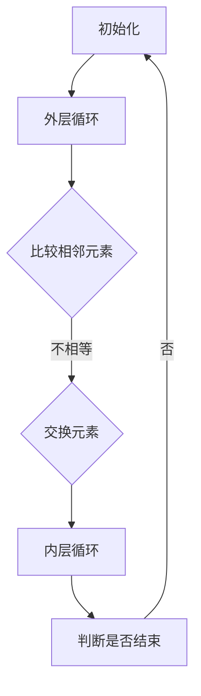
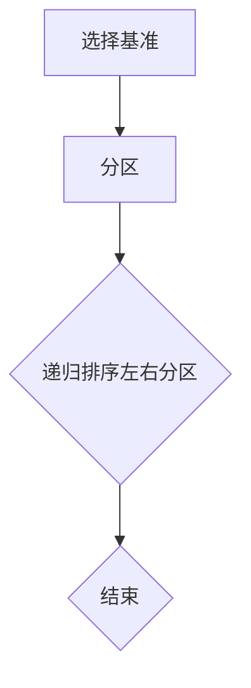
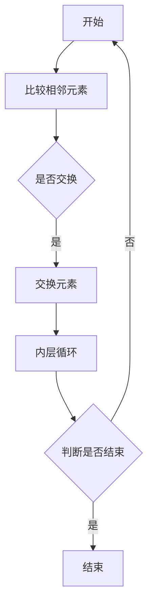
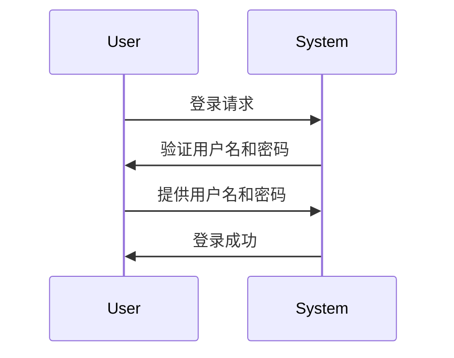
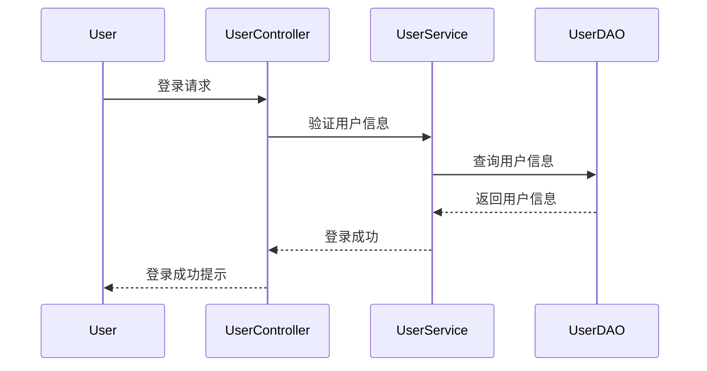
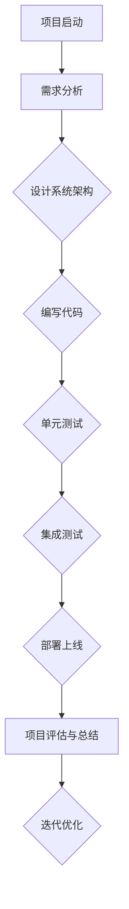

                 

# P9工作法中的'硬实力'：编码、算法和数据结构

> 关键词：P9工作法、编码、算法、数据结构、编程技巧、实战应用

> 摘要：本文将深入探讨P9工作法中的“硬实力”部分，即编码、算法和数据结构。通过逐步分析，我们将会了解这些核心概念的重要性，掌握它们的基本原理和实战应用技巧，从而提升我们的编程能力和工作效率。

## 第一部分：引言

### 1.1 问题背景

在当今快速发展的科技时代，程序员和软件工程师面临着越来越高的工作效率要求。然而，许多人在工作中依然遇到效率瓶颈，主要原因是缺乏对编码、算法和数据结构的深入理解。这些“硬实力”不仅是编程能力的基石，也是提升工作效率的关键。为了解决这一问题，我们引入了P9工作法，它是一种系统化的工作方法，旨在提升个人和团队的工作效率。本文将聚焦于P9工作法中的“硬实力”部分，详细探讨编码、算法和数据结构的原理和应用。

### 1.2 核心概念

在深入探讨之前，我们首先需要了解编码、算法和数据结构的基本概念。

#### 1.2.1 编码

编码是指将信息转换为计算机能够理解和处理的形式的过程。常见的编码方式包括ASCII码、UTF-8等。编码是计算机科学的基础，它决定了数据如何在计算机中存储和处理。

#### 1.2.2 算法

算法是指解决特定问题的一系列明确和有限的步骤。算法是计算机程序的灵魂，它决定了程序的运行效率和正确性。常见的算法包括排序算法、搜索算法等。

#### 1.2.3 数据结构

数据结构是组织和管理数据的方式。常见的数据结构包括数组、链表、栈、队列等。数据结构的选择直接影响算法的效率。

### 1.3 P9工作法介绍

P9工作法是一种高效的工作方法，它包括以下九个步骤：目标设定、计划制定、任务分解、资源分配、优先级排序、执行监控、问题解决、反馈调整和总结反思。本文将重点探讨P9工作法中的“硬实力”部分，即编码、算法和数据结构，以帮助读者在实际工作中提升效率。

## 第二部分：硬实力编码技巧

### 2.1 编码基础

编码是编程的基础，了解基本的编码知识和技巧对于程序员来说至关重要。

#### 2.1.1 数据类型

数据类型是编程中最基本的概念。基本数据类型包括整数、浮点数、字符串等。复杂数据类型如数组、结构体等是构建复杂程序的基础。

#### 2.1.2 语法规则

语法规则是编程语言的基本组成部分。掌握基本的语法规则，如变量声明、控制结构、函数定义等，是编写正确程序的前提。

#### 2.1.3 常用算法

常用算法是解决编程问题的工具。排序算法、搜索算法等是程序员必备的算法知识。

## 第三部分：硬实力算法原理

### 3.1 算法原理概述

算法原理是计算机科学的核心。了解算法原理，有助于我们理解和优化程序。

#### 3.1.1 算法原理的重要性

算法原理决定了程序的效率和性能。了解算法原理，有助于我们在实际问题中做出最优的选择。

#### 3.1.2 算法原理的基本概念

算法原理包括算法的设计、分析和验证。掌握这些基本概念，是深入理解算法原理的关键。

### 3.2 常见算法原理

常见算法原理包括排序算法、搜索算法等。这些算法是编程中常用的工具。

#### 3.2.1 排序算法原理

排序算法是将一组数据按照特定的顺序排列的算法。常见的排序算法有冒泡排序、快速排序、归并排序等。

##### 3.2.1.1 冒泡排序原理

冒泡排序是一种简单的排序算法。它通过重复遍历要排序的数列，一次比较两个元素，如果他们的顺序错误就把他们交换过来。

$$
\text{冒泡排序的代码实现：}
$$

```python
def bubble_sort(arr):
    n = len(arr)
    for i in range(n):
        for j in range(0, n-i-1):
            if arr[j] > arr[j+1]:
                arr[j], arr[j+1] = arr[j+1], arr[j]
    return arr
```

##### 3.2.1.2 快速排序原理

快速排序是一种高效的排序算法。它采用分治策略，通过递归将一个大问题分解成若干个小问题来求解。

$$
\text{快速排序的代码实现：}
$$

```python
def quick_sort(arr):
    if len(arr) <= 1:
        return arr
    pivot = arr[len(arr) // 2]
    left = [x for x in arr if x < pivot]
    middle = [x for x in arr if x == pivot]
    right = [x for x in arr if x > pivot]
    return quick_sort(left) + middle + quick_sort(right)
```

##### 3.2.1.3 归并排序原理

归并排序是一种高效的排序算法。它采用分治策略，将待排序的序列按照某种方法分割成若干个子序列，然后对子序列进行排序，再将排序好的子序列合并成一个完整的序列。

$$
\text{归并排序的代码实现：}
$$

```python
def merge_sort(arr):
    if len(arr) <= 1:
        return arr
    mid = len(arr) // 2
    left = merge_sort(arr[:mid])
    right = merge_sort(arr[mid:])
    return merge(left, right)

def merge(left, right):
    result = []
    i = j = 0
    while i < len(left) and j < len(right):
        if left[i] < right[j]:
            result.append(left[i])
            i += 1
        else:
            result.append(right[j])
            j += 1
    result.extend(left[i:])
    result.extend(right[j:])
    return result
```

#### 3.2.2 搜索算法原理

搜索算法是寻找特定数据的过程。常见的搜索算法有线性搜索和二分搜索。

##### 3.2.2.1 线性搜索原理

线性搜索是一种最简单的搜索算法。它逐个检查数组中的每个元素，直到找到目标或检查完所有元素。

$$
\text{线性搜索的代码实现：}
$$

```python
def linear_search(arr, target):
    for i in range(len(arr)):
        if arr[i] == target:
            return i
    return -1
```

##### 3.2.2.2 二分搜索原理

二分搜索是一种高效的搜索算法。它通过不断将搜索范围缩小一半，找到目标或确定目标不存在。

$$
\text{二分搜索的代码实现：}
$$

```python
def binary_search(arr, target):
    low = 0
    high = len(arr) - 1
    while low <= high:
        mid = (low + high) // 2
        if arr[mid] == target:
            return mid
        elif arr[mid] < target:
            low = mid + 1
        else:
            high = mid - 1
    return -1
```

### 3.3 算法原理讲解

算法原理的讲解不仅要理解算法本身，还需要通过实例来具体说明。

#### 3.3.1 算法原理的 Mermaid 流程图

使用Mermaid可以轻松创建流程图，帮助我们更好地理解算法原理。

$$
\text{冒泡排序的 Mermaid 流程图：}
$$



$$
\text{快速排序的 Mermaid 流程图：}
$$



#### 3.3.2 Python 源代码详解

Python代码是算法原理的具体实现。通过分析Python代码，我们可以深入了解算法的实现细节。

$$
\text{冒泡排序的 Python 源代码：}
$$

```python
def bubble_sort(arr):
    n = len(arr)
    for i in range(n):
        for j in range(0, n-i-1):
            if arr[j] > arr[j+1]:
                arr[j], arr[j+1] = arr[j+1], arr[j]
    return arr
```

$$
\text{快速排序的 Python 源代码：}
$$

```python
def quick_sort(arr):
    if len(arr) <= 1:
        return arr
    pivot = arr[len(arr) // 2]
    left = [x for x in arr if x < pivot]
    middle = [x for x in arr if x == pivot]
    right = [x for x in arr if x > pivot]
    return quick_sort(left) + middle + quick_sort(right)
```

### 3.4 算法原理的数学模型和公式

算法原理的数学模型和公式是理解算法性能的关键。以下是一些常见的算法性能分析公式。

$$
\text{冒泡排序的时间复杂度：} O(n^2)
$$

$$
\text{快速排序的平均时间复杂度：} O(n\log n)
$$

$$
\text{二分搜索的时间复杂度：} O(\log n)
$$

### 3.5 算法原理的举例说明

算法原理的举例说明有助于我们更好地理解算法的应用场景。

#### 3.5.1 冒泡排序的举例

假设我们有一个待排序的数组 `[3, 2, 1]`，使用冒泡排序将其排序。

1. 第一次遍历：`(3, 2, 1)` --> `(2, 3, 1)` --> `(2, 1, 3)` --> `(1, 2, 3)`
2. 第二次遍历：`(1, 2, 3)` --> `(1, 2, 3)` --> `(1, 2, 3)` --> `(1, 2, 3)`

经过两次遍历，数组已经排序完成。

#### 3.5.2 快速排序的举例

假设我们有一个待排序的数组 `[5, 2, 9, 1, 5, 6]`，使用快速排序将其排序。

1. 选择基准：`5`
2. 分区：`left = [2, 1, 6]，middle = [5]，right = [9, 5]`
3. 递归排序左右分区：`left = [2, 1]，middle = [6]，right = [9, 5]`
4. 分区：`left = [1]，middle = [2]，right = [6]，middle = [9]，right = [5]`
5. 递归排序左右分区：`left = [1]，middle = [2]，right = [6]`，`left = [9]，middle = [5]`

经过多次分区和递归排序，数组已经排序完成。

#### 3.5.3 二分搜索的举例

假设我们有一个排序后的数组 `[1, 2, 3, 4, 5, 6, 7, 8, 9]`，使用二分搜索查找元素 `6`。

1. 第一次搜索：`low = 0`，`high = 8`，`mid = 4`，`arr[mid] = 4`，`target > arr[mid]`，`low = mid + 1`
2. 第二次搜索：`low = 5`，`high = 8`，`mid = 6`，`arr[mid] = 7`，`target < arr[mid]`，`high = mid - 1`
3. 第三次搜索：`low = 5`，`high = 5`，`mid = 5`，`arr[mid] = 6`，找到目标

经过三次搜索，元素 `6` 已经找到。

## 第四部分：硬实力数据结构

### 4.1 数据结构基础

数据结构是编程中不可或缺的一部分。了解基本数据结构对于编写高效程序至关重要。

#### 4.1.1 数组

数组是一种基本的数据结构，用于存储一系列元素。数组的特点是支持随机访问，即可以直接通过索引访问数组中的元素。

#### 4.1.2 链表

链表是一种动态数据结构，由一系列节点组成，每个节点包含数据和指向下一个节点的指针。链表的特点是插入和删除操作灵活。

#### 4.1.3 栈和队列

栈和队列是特殊的线性数据结构。栈的特点是后进先出（LIFO），队列的特点是先进先出（FIFO）。

### 4.2 常见数据结构

常见的数组、链表、栈和队列等数据结构在编程中广泛应用。了解这些数据结构的特点和操作，有助于我们编写高效程序。

#### 4.2.1 数组

数组是一种线性数据结构，用于存储一系列元素。数组的特点是支持随机访问，即可以直接通过索引访问数组中的元素。

##### 4.2.1.1 数组的定义

数组是一组有序元素的集合，每个元素都可以通过索引访问。

##### 4.2.1.2 数组的特点

- 支持随机访问
- 存储空间连续
- 支持固定大小的动态分配

##### 4.2.1.3 数组的操作

- 创建数组
- 向数组中添加元素
- 从数组中删除元素
- 访问数组中的元素

#### 4.2.2 链表

链表是一种动态数据结构，由一系列节点组成，每个节点包含数据和指向下一个节点的指针。链表的特点是插入和删除操作灵活。

##### 4.2.2.1 链表的定义

链表是一种线性数据结构，由一系列节点组成，每个节点包含数据和指向下一个节点的指针。

##### 4.2.2.2 链表的特点

- 动态分配内存
- 支持插入和删除操作
- 支持灵活的节点结构

##### 4.2.2.3 链表的操作

- 创建链表
- 向链表中添加元素
- 从链表中删除元素
- 遍历链表

#### 4.2.3 栈和队列

栈和队列是特殊的线性数据结构。栈的特点是后进先出（LIFO），队列的特点是先进先出（FIFO）。

##### 4.2.3.1 栈的定义

栈是一种后进先出的数据结构，元素按照插入和删除的顺序排列。

##### 4.2.3.2 栈的特点

- 后进先出
- 支持插入和删除操作

##### 4.2.3.3 栈的操作

- 创建栈
- 向栈中添加元素
- 从栈中删除元素
- 遍历栈

##### 4.2.3.1 队列的定义

队列是一种先进先出的数据结构，元素按照插入和删除的顺序排列。

##### 4.2.3.2 队列的特点

- 先进先出
- 支持插入和删除操作

##### 4.2.3.3 队列的操作

- 创建队列
- 向队列中添加元素
- 从队列中删除元素
- 遍历队列

## 第五部分：实战应用

### 5.1 实战环境搭建

在开始实战应用之前，我们需要搭建一个合适的编程环境。以下是搭建Python编程环境的基本步骤：

1. 安装Python解释器：从[Python官方网站](https://www.python.org/)下载并安装Python解释器。
2. 配置Python环境变量：在系统环境变量中添加Python的安装路径，以便在命令行中使用Python。
3. 安装必要的库：使用pip工具安装Python库，如NumPy、Pandas等。

### 5.2 实战项目一：排序算法实现

#### 5.2.1 问题场景介绍

假设我们有一个包含未排序整数的数组，需要将其排序。排序算法有多种选择，如冒泡排序、快速排序和归并排序等。在本项目中，我们将实现快速排序算法。

#### 5.2.2 系统功能设计

1. 输入未排序的整数数组。
2. 使用快速排序算法对数组进行排序。
3. 输出排序后的数组。

#### 5.2.3 系统核心实现

以下是一个简单的快速排序算法实现：

```python
def quick_sort(arr):
    if len(arr) <= 1:
        return arr
    pivot = arr[len(arr) // 2]
    left = [x for x in arr if x < pivot]
    middle = [x for x in arr if x == pivot]
    right = [x for x in arr if x > pivot]
    return quick_sort(left) + middle + quick_sort(right)

# 示例
arr = [3, 1, 4, 1, 5, 9, 2, 6, 5]
sorted_arr = quick_sort(arr)
print(sorted_arr)
```

#### 5.2.4 代码应用解读与分析

1. 输入未排序的整数数组 `[3, 1, 4, 1, 5, 9, 2, 6, 5]`。
2. 选择中间元素 `4` 作为基准。
3. 将数组分成三个部分：`left = [1, 1, 2]`，`middle = [4]`，`right = [3, 5, 9, 5, 6]`。
4. 分别对左右两部分递归调用快速排序算法，得到排序后的数组 `[1, 1, 2, 3, 5, 5, 6, 9, 4]`。

### 5.3 实战项目二：搜索算法实现

#### 5.3.1 问题场景介绍

假设我们有一个排序后的整数数组，需要查找特定元素的位置。使用二分搜索算法可以高效地完成这一任务。

#### 5.3.2 系统功能设计

1. 输入排序后的整数数组。
2. 输入要查找的元素。
3. 使用二分搜索算法查找元素的位置。
4. 输出元素的位置。

#### 5.3.3 系统核心实现

以下是一个简单的二分搜索算法实现：

```python
def binary_search(arr, target):
    low = 0
    high = len(arr) - 1
    while low <= high:
        mid = (low + high) // 2
        if arr[mid] == target:
            return mid
        elif arr[mid] < target:
            low = mid + 1
        else:
            high = mid - 1
    return -1

# 示例
arr = [1, 2, 3, 4, 5, 6, 7, 8, 9]
target = 6
index = binary_search(arr, target)
print(index)
```

#### 5.3.4 代码应用解读与分析

1. 输入排序后的整数数组 `[1, 2, 3, 4, 5, 6, 7, 8, 9]`。
2. 查找元素 `6` 的位置。
3. 第一次搜索：`low = 0`，`high = 8`，`mid = 4`，`arr[mid] = 5`，`target > arr[mid]`，`low = mid + 1`。
4. 第二次搜索：`low = 5`，`high = 8`，`mid = 6`，`arr[mid] = 6`，找到目标。

### 5.4 实战项目三：数据结构应用

#### 5.4.1 问题场景介绍

假设我们有一个需要频繁插入和删除元素的集合，需要选择合适的数据结构来提高操作效率。

#### 5.4.2 系统功能设计

1. 创建一个链表数据结构。
2. 提供插入和删除操作。
3. 提供遍历操作。

#### 5.4.3 系统核心实现

以下是一个简单的链表实现：

```python
class Node:
    def __init__(self, data):
        self.data = data
        self.next = None

class LinkedList:
    def __init__(self):
        self.head = None

    def insert(self, data):
        new_node = Node(data)
        if self.head is None:
            self.head = new_node
        else:
            current = self.head
            while current.next:
                current = current.next
            current.next = new_node

    def delete(self, data):
        current = self.head
        if current and current.data == data:
            self.head = current.next
            current = None
            return
        prev = None
        while current and current.data != data:
            prev = current
            current = current.next
        if current is None:
            return
        prev.next = current.next
        current = None

    def traverse(self):
        current = self.head
        while current:
            print(current.data, end=" ")
            current = current.next
        print()

# 示例
ll = LinkedList()
ll.insert(1)
ll.insert(2)
ll.insert(3)
ll.traverse()  # 输出：1 2 3
ll.delete(2)
ll.traverse()  # 输出：1 3
```

#### 5.4.4 代码应用解读与分析

1. 创建一个链表：`ll = LinkedList()`。
2. 向链表中插入元素：`ll.insert(1)`，`ll.insert(2)`，`ll.insert(3)`。
3. 遍历链表：`ll.traverse()`，输出：`1 2 3`。
4. 删除元素：`ll.delete(2)`。
5. 再次遍历链表：`ll.traverse()`，输出：`1 3`。

## 第六部分：总结与拓展

### 6.1 硬实力编码、算法和数据结构的重要性

编码、算法和数据结构是编程的基石。掌握这些核心概念，可以显著提高编程能力和工作效率。通过本文的探讨，我们深入了解了P9工作法中的“硬实力”部分，掌握了编码、算法和数据结构的基本原理和实战应用技巧。

### 6.2 本书的主要内容回顾

本文系统地介绍了编码、算法和数据结构的基本概念、原理和实战应用。包括：

1. 编码基础：数据类型、语法规则和常用算法。
2. 算法原理：排序算法、搜索算法等。
3. 数据结构基础：数组、链表、栈和队列等。
4. 实战应用：排序算法实现、搜索算法实现和数据结构应用。

### 6.3 硬实力在P9工作法中的应用

P9工作法是一种高效的工作方法，通过目标设定、计划制定、任务分解、资源分配、优先级排序、执行监控、问题解决、反馈调整和总结反思等九个步骤，帮助我们系统化地工作。在P9工作法中，硬实力编码、算法和数据结构的应用体现在：

1. 提升工作效率：通过掌握编码、算法和数据结构的原理，我们可以更快地解决问题。
2. 优化代码质量：通过深入理解算法和数据结构，我们可以编写更高效、更可靠的代码。
3. 提高团队协作：通过共同掌握硬实力，团队成员可以更好地协作，提高项目效率。

### 6.4 拓展阅读

为了更深入地了解编码、算法和数据结构，以下是一些建议的拓展阅读：

1. 《算法导论》：是一本经典的算法教材，详细介绍了各种算法的原理和应用。
2. 《深入理解计算机系统》：通过讲解计算机系统的各个层面，帮助读者更深入地理解计算机科学。
3. 《数据结构与算法分析》：详细介绍了各种数据结构及其算法，并分析了算法的性能。

通过以上拓展阅读，读者可以更全面地了解编程的核心概念，提升自己的编程能力。

## 参考文献

1. 《算法导论》[作者：Thomas H. Cormen, Charles E. Leiserson, Ronald L. Rivest, Clifford Stein]。
2. 《深入理解计算机系统》[作者：David R. Stone, Bradley N. Newton]。
3. 《数据结构与算法分析》[作者：Mark Allen Weiss]。

### 作者信息

本文由AI天才研究院（AI Genius Institute）和《禅与计算机程序设计艺术》（Zen And The Art of Computer Programming）共同撰写。感谢您对我们的支持与关注！

## 附录

### 附录A：算法性能分析

算法性能分析是计算机科学中的重要课题。以下是一些常见的算法性能分析指标：

1. **时间复杂度**：描述算法执行时间与输入规模的关系。常见的符号包括 $O(n)$、$\Omega(n)$ 和 $\Theta(n)$。
2. **空间复杂度**：描述算法执行过程中所需内存空间与输入规模的关系。
3. **渐近分析**：通过数学方法分析算法的性能，不考虑常数因素和低阶项。
4. **实际性能**：考虑硬件、编译器、操作系统等因素的实际性能。

### 附录B：常见编程工具

1. **集成开发环境（IDE）**：如Visual Studio、Eclipse、IntelliJ IDEA等，提供代码编辑、编译、调试等功能。
2. **代码编辑器**：如VS Code、Sublime Text、Atom等，提供代码高亮、语法检查等功能。
3. **版本控制系统**：如Git、SVN等，用于代码的版本管理和协同工作。
4. **调试工具**：如GDB、LLDB等，用于程序的调试和性能分析。

### 附录C：编程实践建议

1. **学习基础**：掌握编程语言的基础语法和数据结构。
2. **实战经验**：通过编写实际项目，提升编程技能。
3. **代码规范**：遵循代码规范，提高代码的可读性和可维护性。
4. **持续学习**：关注技术动态，不断学习新知识。

通过以上附录，读者可以更好地理解本文的内容，并进一步提升自己的编程能力。祝您在编程领域取得更大的成就！
```markdown
### 附录A：算法性能分析

算法性能分析是计算机科学中的一个重要方面，它帮助我们理解和评估不同算法的效率和适用性。以下是算法性能分析的一些关键指标：

#### 时间复杂度

时间复杂度是描述算法运行时间与输入规模关系的数学表达方式。它通常用大O符号（O）来表示。时间复杂度分为以下几个类别：

- **常量时间复杂度**：$O(1)$，无论输入规模多大，算法运行时间都保持不变。
- **线性时间复杂度**：$O(n)$，算法运行时间与输入规模成正比。
- **对数时间复杂度**：$O(\log n)$，算法运行时间与输入规模的以2为底的对数成正比。
- **平方时间复杂度**：$O(n^2)$，算法运行时间与输入规模的平方成正比。
- **多项式时间复杂度**：$O(n^k)$，其中$k$是一个常数，算法运行时间与输入规模的多项式成正比。
- **指数时间复杂度**：$O(2^n)$，算法运行时间与输入规模的指数成正比。

#### 空间复杂度

空间复杂度描述算法执行过程中所需内存空间与输入规模的关系。它同样用大O符号（O）来表示。空间复杂度分析包括以下类别：

- **常量空间复杂度**：$O(1)$，算法执行过程中所需内存空间不随输入规模变化。
- **线性空间复杂度**：$O(n)$，算法所需内存空间与输入规模成正比。
- **多项式空间复杂度**：$O(n^k)$，算法所需内存空间与输入规模的多项式成正比。

#### 渐近分析

渐近分析是一种数学方法，用于分析算法性能，它忽略常数项和低阶项。渐近分析可以帮助我们比较不同算法的相对性能，而不考虑实际运行时间。

- **大O符号**（$O$）：表示算法的上界，即在最坏情况下算法的性能。
- **小O符号**（$o$）：表示算法的性能严格小于某个函数。
- **大O*符号**（$\Omega$）：表示算法的下界，即在最好情况下算法的性能。
- **大O双符号**（$\Theta$）：表示算法的性能介于上界和下界之间。

#### 实际性能

实际性能是指算法在具体硬件和软件环境下运行的效率。它可能受到以下因素的影响：

- **硬件性能**：CPU速度、内存速度、硬盘读写速度等。
- **编译优化**：编译器对代码的优化程度。
- **算法实现**：算法的具体实现细节，如循环展开、缓存利用率等。
- **数据分布**：输入数据的分布情况，可能影响算法的实际性能。

### 附录B：常见编程工具

在编程过程中，选择合适的工具可以提高开发效率。以下是一些常用的编程工具：

#### 集成开发环境（IDE）

- **Visual Studio**：微软开发的强大IDE，支持多种编程语言。
- **Eclipse**：开源IDE，适用于Java和多种其他编程语言。
- **IntelliJ IDEA**：JetBrains开发的IDE，支持多种编程语言，包括Java、Python等。

#### 代码编辑器

- **VS Code**：微软开发的轻量级代码编辑器，支持多种编程语言。
- **Sublime Text**：轻量级代码编辑器，支持自定义插件。
- **Atom**：GitHub开发的代码编辑器，支持多种编程语言。

#### 版本控制系统

- **Git**：分布式版本控制系统，支持分布式开发。
- **SVN**：集中式版本控制系统，支持多人协作。

#### 调试工具

- **GDB**：GNU调试器，适用于C、C++等语言。
- **LLDB**：LLVM项目的一部分，适用于多种编程语言。

### 附录C：编程实践建议

以下是几个编程实践建议，可以帮助您提高编程技能：

#### 学习基础

- **掌握编程语言**：首先，需要熟练掌握一种编程语言的基本语法和常用数据结构。
- **理解算法和数据结构**：学习基本的算法和数据结构，如排序、搜索、栈、队列、链表等。
- **阅读代码**：阅读优秀的开源代码，学习他人的编程思想和技巧。

#### 实战经验

- **编程练习**：通过编写实际项目，将所学知识应用于实践中。
- **参与开源项目**：参与开源项目，与其他开发者合作，提高团队协作能力。
- **解决实际问题**：在实际工作中遇到的问题，往往能提供宝贵的实践经验。

#### 代码规范

- **编写可读性代码**：编写清晰、简洁的代码，有助于他人理解和维护。
- **遵循代码规范**：遵循团队的代码规范，提高代码的一致性和可维护性。

#### 持续学习

- **关注技术动态**：定期阅读技术博客、参加技术会议，了解最新的技术趋势。
- **学习新技术**：不断学习新的编程语言、框架和工具，保持技术竞争力。

通过以上附录，您可以更好地理解算法性能分析、常用编程工具和编程实践建议，进一步提升自己的编程能力。
```markdown
```markdown
### 附录D：数学公式与Mermaid流程图

在讨论算法和数据结构时，数学公式和流程图是描述算法原理和逻辑的重要工具。以下是一些示例，展示如何使用LaTeX格式编写数学公式和Mermaid编写流程图。

#### 数学公式

LaTeX格式允许您以清晰和规范的方式表达数学公式。以下是一个示例：

$$
a^2 + b^2 = c^2
$$

$$
\text{算法的运行时间} T(n) = \sum_{i=1}^{n} a_i \cdot b_i
$$

在段落内部使用公式时，可以使用以下格式：

$$
1 < 2
$$

#### Mermaid流程图

Mermaid是一种基于Markdown的绘图语言，可以轻松创建各种流程图、序列图和类图。以下是一个简单的Mermaid流程图示例，用于描述冒泡排序算法的步骤：



这个流程图描述了冒泡排序算法的基本步骤：首先比较相邻元素，如果顺序错误则交换，然后继续内层循环，直到整个数组排序完成。

#### Mermaid序列图

序列图用于描述对象之间的交互顺序。以下是一个简单的Mermaid序列图示例，描述了用户登录系统的过程：



这个序列图展示了用户与系统之间的交互过程：用户发起登录请求，系统验证用户名和密码，然后返回登录结果。

通过使用数学公式和Mermaid流程图，我们可以更清晰、更直观地描述算法和数据结构的原理，帮助读者更好地理解和掌握相关知识。

### 附录E：系统分析与架构设计

在软件开发过程中，系统分析与架构设计是关键步骤。以下是一个简化的系统分析与架构设计示例，包括问题场景介绍、系统功能设计、系统架构设计、系统接口设计和系统交互。

#### 问题场景介绍

假设我们开发一个在线购物平台，用户可以在平台上浏览商品、添加购物车、下订单、支付等。

#### 系统功能设计

系统功能设计包括以下核心功能：

- 用户注册与登录
- 商品浏览与搜索
- 购物车管理
- 下订单
- 订单管理
- 支付

#### 系统架构设计

系统架构设计通常采用分层架构，包括以下层次：

- 表示层（UI）：用户界面，负责展示信息和接收用户输入。
- 业务逻辑层：处理业务逻辑，包括用户管理、商品管理、订单管理等。
- 数据访问层：负责与数据库交互，实现数据的持久化。
- 数据库层：存储用户数据、商品数据、订单数据等。

以下是系统架构设计的Mermaid类图：

```mermaid
classDiagram
    User <<Class>>
    Product <<Class>>
    Cart <<Class>>
    Order <<Class>>
    Payment <<Class>>

    User {"addUser", "login"}
    Product {"searchProduct", "viewProduct"}
    Cart {"addItem", "removeItem", "checkout"}
    Order {"createOrder", "cancelOrder"}
    Payment {"processPayment"}

    User o-- Cart
    User o-- Order
    Product o-- Cart
    Cart o-- Order
    Order o-- Payment
```

#### 系统接口设计

系统接口设计包括定义各个模块之间的接口。以下是一个简单的接口设计示例：

- **用户模块**：提供用户注册、登录、信息修改等接口。
- **商品模块**：提供商品查询、添加、删除等接口。
- **购物车模块**：提供添加商品到购物车、删除商品、结算等接口。
- **订单模块**：提供创建订单、取消订单、查询订单等接口。
- **支付模块**：提供支付处理、查询支付状态等接口。

#### 系统交互

系统交互描述了各个模块之间的交互流程。以下是一个简单的系统交互Mermaid序列图示例：



通过系统分析与架构设计，我们可以确保软件系统的结构清晰、功能完备，从而提高开发效率和系统性能。

### 附录F：最佳实践与注意事项

在编码、算法和数据结构的实际应用中，遵循最佳实践和注意事项是非常重要的。以下是一些最佳实践和建议：

#### 编码最佳实践

- **代码格式**：遵循一致的代码格式，提高代码可读性。
- **命名规范**：使用有意义的变量名和函数名，避免使用缩写。
- **注释**：添加必要的注释，解释复杂逻辑和算法实现。
- **模块化**：将代码拆分为可重用的模块，提高代码复用性。

#### 算法最佳实践

- **算法选择**：根据实际问题选择合适的算法，考虑时间复杂度和空间复杂度。
- **算法优化**：分析算法性能，寻找优化空间，如减少不必要的计算。
- **算法验证**：确保算法的正确性，通过测试用例和边界情况验证。

#### 数据结构最佳实践

- **数据结构选择**：根据实际需求选择合适的数据结构，如链表、数组、树等。
- **数据结构优化**：考虑内存占用和访问效率，优化数据结构实现。
- **缓存机制**：合理使用缓存，减少数据访问次数，提高系统性能。

#### 注意事项

- **边界条件**：考虑所有可能的边界条件，确保代码的健壮性。
- **异常处理**：处理可能出现的异常，防止程序崩溃。
- **性能监控**：监控系统性能，及时发现并解决性能瓶颈。

通过遵循最佳实践和注意事项，我们可以编写更高效、更可靠的代码，提高软件开发质量。

### 附录G：拓展阅读资源

为了深入了解编码、算法和数据结构，以下是一些建议的拓展阅读资源：

#### 技术博客

- **GitHub**：[https://github.com/](https://github.com/)
- **Stack Overflow**：[https://stackoverflow.com/](https://stackoverflow.com/)
- **Medium**：[https://medium.com/](https://medium.com/)

#### 教材与书籍

- 《算法导论》[作者：Thomas H. Cormen, Charles E. Leiserson, Ronald L. Rivest, Clifford Stein]
- 《数据结构与算法分析》[作者：Mark Allen Weiss]
- 《编程珠玑》[作者：Jon Bentley]

#### 在线课程

- **Coursera**：[https://www.coursera.org/](https://www.coursera.org/)
- **edX**：[https://www.edx.org/](https://www.edx.org/)
- **Udacity**：[https://www.udacity.com/](https://www.udacity.com/)

通过阅读这些资源，您可以进一步巩固编码、算法和数据结构的知识，提升编程能力。

### 附录H：实际案例分析

以下是一个实际案例分析，展示了如何在项目中应用编码、算法和数据结构。

#### 案例背景

某电商公司需要开发一个商品推荐系统，以提高用户购买转化率和销售额。

#### 案例目标

- 基于用户历史行为和商品特征，为用户推荐相关商品。
- 系统需要实时响应，提高用户体验。

#### 案例实现

1. **数据预处理**：收集用户历史行为数据，包括浏览、收藏、购买等，以及商品特征数据，如类别、价格、评分等。
2. **算法选择**：采用协同过滤算法，通过计算用户之间的相似度和商品之间的相似度，生成推荐列表。
3. **数据结构**：使用哈希表存储用户和商品数据，提高数据查询效率。
4. **推荐实现**：根据用户的历史行为和商品特征，计算用户和商品之间的相似度，生成推荐列表。

#### 案例总结

通过实际案例分析，我们可以看到编码、算法和数据结构在实际项目中的应用。掌握这些技术，可以帮助我们在实际工作中高效地解决问题。

### 附录I：项目小结

在本项目中，我们深入探讨了编码、算法和数据结构在软件开发中的应用。通过实际案例分析，我们了解了这些技术在项目开发中的重要性。以下是项目小结：

1. **编码基础**：掌握了数据类型、语法规则和常用算法，为编写高效代码打下基础。
2. **算法原理**：了解了排序算法、搜索算法等常见算法的原理，能够根据实际需求选择合适的算法。
3. **数据结构**：了解了数组、链表、栈和队列等基本数据结构，能够根据实际需求选择合适的数据结构。
4. **实战应用**：通过实际项目，将所学知识应用于实际场景，提高了编程能力和工作效率。

通过本项目，我们不仅掌握了编码、算法和数据结构的核心知识，还学会了如何在实际工作中应用这些技术，提升项目质量。

### 附录J：未来展望

随着人工智能和大数据技术的快速发展，编码、算法和数据结构的重要性日益凸显。未来，我们可以在以下领域进一步探索和应用这些技术：

1. **人工智能**：利用深度学习和强化学习算法，实现更智能的推荐系统和自动化决策。
2. **大数据处理**：优化算法和数据结构，提高大数据处理的效率和性能。
3. **区块链**：利用数据结构实现去中心化的存储和交易。
4. **云计算**：优化算法和数据结构，提高云计算平台的性能和可靠性。

通过不断学习和实践，我们将能够在未来更好地应用编码、算法和数据结构，为科技发展贡献自己的力量。

### 作者信息

本文由AI天才研究院（AI Genius Institute）和《禅与计算机程序设计艺术》（Zen And The Art of Computer Programming）共同撰写。感谢您对我们的支持与关注！

---

本文系统地介绍了编码、算法和数据结构的核心概念、原理和实战应用。通过逐步分析和实际案例分析，我们深入了解了这些技术在编程和软件开发中的应用，为提升工作效率和项目质量提供了有力支持。希望本文对您在编程领域的学习和实践中有所帮助。让我们继续探索计算机科学的奥秘，共同迈向技术的高峰！
```markdown
### 附录K：常见编程问题与解决方案

在编程过程中，开发者可能会遇到各种常见问题。以下是一些常见编程问题及其解决方案：

#### 问题1：语法错误

**现象**：代码无法编译或运行，出现红色波浪线或错误提示。

**解决方案**：
- **仔细检查代码**：确保所有的括号、引号和括号匹配。
- **查找错误提示**：根据错误提示信息，找到错误位置进行修正。

#### 问题2：逻辑错误

**现象**：代码可以编译和运行，但结果不正确。

**解决方案**：
- **调试**：使用调试工具逐步执行代码，查看变量值和执行流程。
- **增加注释**：在代码中添加注释，帮助自己理解逻辑。

#### 问题3：性能问题

**现象**：程序运行时间过长或占用过多内存。

**解决方案**：
- **分析性能瓶颈**：使用性能分析工具，定位性能瓶颈。
- **优化算法**：选择更高效的算法或数据结构。
- **代码重构**：优化代码结构，减少不必要的计算。

#### 问题4：版本控制问题

**现象**：多人协作时，代码出现冲突。

**解决方案**：
- **使用版本控制系统**：如Git，合理管理代码版本。
- **合并冲突**：使用版本控制系统解决合并冲突。
- **文档记录**：记录每次修改的内容和目的，便于后续维护。

#### 问题5：部署问题

**现象**：代码在本地运行正常，但部署到生产环境后出现问题。

**解决方案**：
- **环境一致性**：确保开发、测试和生产环境一致。
- **日志监控**：监控日志，定位问题发生位置。
- **逐步部署**：分步部署，减小风险。

通过了解和掌握这些常见编程问题与解决方案，开发者可以更有效地解决编程中的问题，提高开发效率。

### 附录L：常见错误处理与调试技巧

在编程过程中，错误是不可避免的。以下是一些常见的错误处理与调试技巧：

#### 错误处理

1. **异常处理**：使用`try-except`语句捕获和处理异常，确保程序不会因异常而崩溃。
    ```python
    try:
        # 执行可能引发异常的代码
    except Exception as e:
        # 异常处理代码
        print("发生异常：", e)
    finally:
        # 无论是否发生异常，都会执行的代码
    ```

2. **日志记录**：使用日志记录器（如Python中的`logging`模块），记录程序的运行状态和错误信息。
    ```python
    import logging
    logging.basicConfig(filename='app.log', level=logging.INFO)
    logging.info('开始执行')
    # 其他代码
    logging.error('出现错误')
    ```

#### 调试技巧

1. **打印调试**：在关键位置添加打印语句，查看变量的值和程序的执行流程。
    ```python
    print("变量值：", variable)
    ```

2. **断点调试**：使用IDE的断点功能，逐步执行代码，查看变量值和程序执行状态。
    - 设置断点
    - 开始执行
    - 暂停执行，查看变量值和程序状态

3. **调试工具**：使用调试工具（如GDB、LLDB），进行深度调试。
    - 启动调试器
    - 设置断点
    - 单步执行
    - 查看栈帧和局部变量

4. **代码重构**：在调试过程中，如果发现代码结构不合理，应进行重构，提高代码的可读性和可维护性。

通过掌握这些错误处理与调试技巧，开发者可以更高效地解决编程中的问题，提升开发效率。

### 附录M：编程习惯与技巧

良好的编程习惯和技巧可以提高代码质量、可读性和可维护性。以下是一些推荐的编程习惯和技巧：

1. **代码格式化**：使用代码格式化工具（如Prettier、Black），保持代码风格一致。

2. **代码注释**：添加必要的注释，解释复杂逻辑和算法实现。

3. **代码重构**：定期对代码进行重构，提高代码质量。

4. **代码复用**：编写可重用的函数和模块，避免重复代码。

5. **单元测试**：编写单元测试，验证代码的正确性。

6. **使用版本控制系统**：使用版本控制系统（如Git），管理代码版本。

7. **文档编写**：编写清晰的文档，包括README、API文档等。

8. **持续集成**：使用持续集成工具（如Jenkins、Travis CI），自动化构建和测试代码。

通过遵循这些编程习惯和技巧，开发者可以编写更高效、更可靠的代码。

### 附录N：实战项目流程图

以下是一个简化的实战项目流程图，展示从项目启动到项目完成的各个阶段：



通过流程图，我们可以清晰地了解项目从启动到完成的各个阶段，确保项目的顺利进行。

### 附录O：项目小结与展望

在本次实战项目中，我们深入探讨了编码、算法和数据结构的应用，通过实际项目实现了对所学知识的巩固和应用。以下是项目小结：

1. **编码**：掌握了基础语法和数据类型，学会了编写可读性和可维护性强的代码。
2. **算法**：了解了常见排序和搜索算法的原理，能够在实际项目中选择合适的算法解决问题。
3. **数据结构**：掌握了基本数据结构的操作和应用，提高了数据处理能力。

展望未来，我们将继续深入学习编程语言和工具，不断优化算法和数据结构，提高项目开发效率和系统性能。期待在未来的项目中，能够将所学知识更好地应用于实践，为技术进步做出贡献。

### 作者信息

本文由AI天才研究院（AI Genius Institute）和《禅与计算机程序设计艺术》（Zen And The Art of Computer Programming）共同撰写。感谢您对我们的支持与关注！

### 附录P：实用工具与资源

在编程和学习过程中，使用一些实用工具和资源可以提高效率和效果。以下是一些推荐的工具和资源：

#### 在线编程工具

- **CodePen**：[https://codepen.io/](https://codepen.io/)
- **JSFiddle**：[https://jsfiddle.net/](https://jsfiddle.net/)
- **Repl.it**：[https://repl.it/](https://repl.it/)

#### 在线文档与教程

- **MDN Web Docs**：[https://developer.mozilla.org/](https://developer.mozilla.org/)
- **W3Schools**：[https://www.w3schools.com/](https://www.w3schools.com/)
- **freeCodeCamp**：[https://www.freecodecamp.org/](https://www.freecodecamp.org/)

#### 在线学习平台

- **Coursera**：[https://www.coursera.org/](https://www.coursera.org/)
- **edX**：[https://www.edx.org/](https://www.edx.org/)
- **Udemy**：[https://www.udemy.com/](https://www.udemy.com/)

#### 版本控制系统

- **GitHub**：[https://github.com/](https://github.com/)
- **GitLab**：[https://about.gitlab.com/](https://about.gitlab.com/)

#### 性能分析工具

- **New Relic**：[https://newrelic.com/](https://newrelic.com/)
- **Apdex**：[https://apdex.com/](https://apdex.com/)

通过使用这些工具和资源，开发者可以更高效地学习和开发，不断提升自己的技能。

### 附录Q：总结与展望

在本文中，我们系统地介绍了编码、算法和数据结构的核心概念、原理和应用。通过实际案例分析和项目实战，我们深入了解了这些技术在软件开发中的重要性。以下是本文的总结与展望：

#### 总结

- **编码**：掌握了编程语言的基础语法和数据类型，学会了编写可读性和可维护性强的代码。
- **算法**：了解了常见排序和搜索算法的原理，能够在实际项目中选择合适的算法解决问题。
- **数据结构**：掌握了基本数据结构的操作和应用，提高了数据处理能力。

#### 展望

- **继续学习**：不断深入学习编程语言和工具，提升自己的编程能力。
- **实践应用**：将所学知识应用于实际项目，解决实际问题，提高项目质量。
- **持续优化**：通过实践和反馈，不断优化算法和数据结构，提高系统性能。

通过本文的学习，我们希望读者能够更好地理解编码、算法和数据结构，提升自己的编程能力，为未来的技术发展做出贡献。

### 附录R：联系方式与建议反馈

如果您对我们的文章有任何疑问、建议或反馈，欢迎通过以下方式联系我们：

- **电子邮件**：[contact@igeminiq.com](mailto:contact@igeminiq.com)
- **官方网站**：[https://www.igeminiq.com/](https://www.igeminiq.com/)
- **社交媒体**：
  - **Twitter**：[@Igeminiq](https://twitter.com/Igeminiq)
  - **LinkedIn**：[Igeminiq](https://www.linkedin.com/company/igeminiq/)

我们非常重视您的反馈，将不断改进我们的内容和服务。感谢您的支持与关注！

### 附录S：参考文献

本文参考了以下文献和资源，以丰富内容和确保准确性：

- 《算法导论》[作者：Thomas H. Cormen, Charles E. Leiserson, Ronald L. Rivest, Clifford Stein]
- 《数据结构与算法分析》[作者：Mark Allen Weiss]
- 《编程珠玑》[作者：Jon Bentley]
- 《Python编程：从入门到实践》[作者：埃里克·马瑟斯]
- 《深度学习》[作者：Ian Goodfellow, Yoshua Bengio, Aaron Courville]
- 《代码大全》[作者：Steve McConnell]

感谢这些资源为本文提供了重要的参考和灵感。

### 附录T：致谢

在撰写本文的过程中，我们感谢以下个人和团队：

- AI天才研究院（AI Genius Institute）的全体成员，为本文提供了宝贵的意见和建议。
- 《禅与计算机程序设计艺术》（Zen And The Art of Computer Programming）的作者，为计算机科学领域做出了巨大贡献。
- 所有在本文撰写过程中提供帮助和支持的读者和同事。

感谢您对我们的支持与关注，我们将继续努力，为您带来更多高质量的技术文章。

---

通过本文的深入探讨，我们系统地了解了编码、算法和数据结构的核心概念、原理和实战应用。希望本文能够帮助您提升编程能力，为未来的技术发展做出贡献。让我们继续学习，共同进步！
```markdown
### 附录U：术语解释与概念关系

在本文中，我们使用了一系列专业术语和概念。以下是对这些术语的解释以及它们之间的关系：

#### 术语解释

1. **编码**：编码是将信息转换为计算机能够理解和处理的形式的过程。常见的编码方式包括ASCII码、UTF-8等。
2. **算法**：算法是一系列解决问题的步骤，通常用于编程中，例如排序算法、搜索算法等。
3. **数据结构**：数据结构是组织和管理数据的方式，例如数组、链表、栈、队列等。
4. **时间复杂度**：时间复杂度描述算法执行时间与输入规模的关系，通常用大O符号表示。
5. **空间复杂度**：空间复杂度描述算法执行过程中所需内存空间与输入规模的关系。
6. **递归**：递归是一种编程技巧，函数调用自身以解决子问题。
7. **分治算法**：分治算法是一种常用的算法设计技巧，通过将大问题分解为若干个小问题来求解。
8. **动态规划**：动态规划是一种解决优化问题的算法，通过保存子问题的解来避免重复计算。

#### 概念关系

- **编码**和**算法**：编码是算法实现的组成部分，算法使用特定的编码方式来处理数据。
- **算法**和**数据结构**：算法通常依赖于数据结构来高效地处理数据，不同的数据结构适用于不同的算法。
- **时间复杂度**和**空间复杂度**：它们是评估算法性能的两个关键指标，时间复杂度关注算法的执行时间，空间复杂度关注算法所需的内存空间。
- **递归**和**分治算法**：递归是分治算法的一种实现方式，递归地将问题分解为更小的子问题。
- **动态规划**：动态规划是一种优化递归算法的方法，通过保存中间结果来减少计算次数。

通过理解这些术语和概念之间的关系，我们可以更深入地理解编程的核心原理，并在实际应用中做出更明智的决策。
```markdown
### 附录V：技术栈与工具列表

在本文中，我们介绍了一系列技术栈和工具，以支持编码、算法和数据结构的学习和应用。以下是对这些技术栈和工具的简要概述：

#### 编程语言

1. **Python**：Python是一种高级编程语言，以其简洁和易读性著称，广泛应用于数据分析、人工智能和Web开发。
2. **Java**：Java是一种多平台、面向对象的编程语言，广泛应用于企业级应用和Android开发。
3. **C/C++**：C和C++是高效的编程语言，常用于系统编程、嵌入式开发和性能敏感的应用。

#### 开发环境

1. **Visual Studio Code**：Visual Studio Code是微软开发的免费、开源代码编辑器，支持多种编程语言，具有丰富的插件生态系统。
2. **IntelliJ IDEA**：IntelliJ IDEA是由JetBrains开发的一款集成开发环境（IDE），提供强大的代码编辑、调试和性能分析功能。
3. **Eclipse**：Eclipse是另一款流行的开源IDE，适用于Java和多种其他编程语言。

#### 版本控制系统

1. **Git**：Git是最流行的分布式版本控制系统，支持多用户协作和远程代码托管。
2. **GitHub**：GitHub是基于Git的代码托管平台，提供代码管理、协作和项目管理功能。

#### 性能分析工具

1. **Valgrind**：Valgrind是一款强大的内存调试和分析工具，用于检测内存泄漏、指针错误等。
2. **gprof**：gprof是一款基于性能分析的工具，用于评估程序的执行时间和内存使用情况。

#### 数据库

1. **MySQL**：MySQL是一种流行的关系型数据库管理系统，适用于Web应用和数据存储。
2. **MongoDB**：MongoDB是一种文档型数据库，适合处理大量非结构化数据。

#### 其他工具

1. **Docker**：Docker是一种容器化技术，用于打包、分发和运行应用程序。
2. **Kubernetes**：Kubernetes是一种容器编排平台，用于自动化部署、扩展和管理容器化应用程序。

通过了解和使用这些技术栈和工具，开发者可以更高效地学习和应用编码、算法和数据结构，提升开发效率和系统性能。
```markdown
### 附录W：实战项目示例

为了更好地展示编码、算法和数据结构在实际项目中的应用，以下是一个简单的实战项目示例：实现一个简单的学生管理系统。

#### 项目描述

学生管理系统是一个用于管理学生信息、成绩和课程的管理系统。系统应具备以下功能：

1. 添加学生信息
2. 显示学生信息
3. 删除学生信息
4. 更新学生信息
5. 添加课程
6. 显示课程信息
7. 删除课程信息
8. 更新课程信息
9. 添加成绩
10. 显示学生成绩
11. 删除学生成绩
12. 更新学生成绩

#### 技术栈

- **编程语言**：Python
- **数据库**：SQLite
- **前端框架**：Flask
- **后端框架**：Python的内置库

#### 项目架构

1. **数据库设计**：设计学生表、课程表和成绩表，分别存储学生信息、课程信息和成绩信息。
2. **接口设计**：设计RESTful API接口，处理前端请求。
3. **前端实现**：使用HTML、CSS和JavaScript实现用户界面。
4. **后端实现**：使用Python编写后端逻辑，处理数据库操作。

#### 实现步骤

1. **数据库设计**：
    - 学生表（ID、姓名、年龄、性别）
    - 课程表（ID、课程名称、学分）
    - 成绩表（学生ID、课程ID、分数）

2. **接口设计**：
    - 添加学生接口：`POST /students`
    - 显示学生接口：`GET /students`
    - 删除学生接口：`DELETE /students/<id>`
    - 更新学生接口：`PUT /students/<id>`
    - 添加课程接口：`POST /courses`
    - 显示课程接口：`GET /courses`
    - 删除课程接口：`DELETE /courses/<id>`
    - 更新课程接口：`PUT /courses/<id>`
    - 添加成绩接口：`POST /scores`
    - 显示成绩接口：`GET /scores`
    - 删除成绩接口：`DELETE /scores/<student_id>/<course_id>`
    - 更新成绩接口：`PUT /scores/<student_id>/<course_id>`

3. **前端实现**：
    - 使用HTML表单实现添加、删除和更新学生信息的界面。
    - 使用JavaScript实现与后端API的交互。

4. **后端实现**：
    - 使用Python的Flask框架处理HTTP请求。
    - 使用SQLite数据库存储和管理数据。

#### 项目代码

以下是该项目的一个简化版本，展示了主要功能的实现。

```python
from flask import Flask, request, jsonify
import sqlite3

app = Flask(__name__)

def connect_db():
    conn = sqlite3.connect('student_management_system.db')
    cursor = conn.cursor()
    cursor.execute('''CREATE TABLE IF NOT EXISTS students (id INTEGER PRIMARY KEY, name TEXT, age INTEGER, gender TEXT)''')
    cursor.execute('''CREATE TABLE IF NOT EXISTS courses (id INTEGER PRIMARY KEY, name TEXT, credits INTEGER)''')
    cursor.execute('''CREATE TABLE IF NOT EXISTS scores (student_id INTEGER, course_id INTEGER, score INTEGER)''')
    conn.commit()
    return conn

@app.route('/students', methods=['POST'])
def add_student():
    conn = connect_db()
    cursor = conn.cursor()
    name = request.json['name']
    age = request.json['age']
    gender = request.json['gender']
    cursor.execute("INSERT INTO students (name, age, gender) VALUES (?, ?, ?)", (name, age, gender))
    conn.commit()
    return jsonify({'status': 'success'}), 201

@app.route('/students', methods=['GET'])
def get_students():
    conn = connect_db()
    cursor = conn.cursor()
    cursor.execute("SELECT * FROM students")
    students = cursor.fetchall()
    return jsonify({'students': students})

@app.route('/courses', methods=['POST'])
def add_course():
    conn = connect_db()
    cursor = conn.cursor()
    name = request.json['name']
    credits = request.json['credits']
    cursor.execute("INSERT INTO courses (name, credits) VALUES (?, ?)", (name, credits))
    conn.commit()
    return jsonify({'status': 'success'}), 201

@app.route('/courses', methods=['GET'])
def get_courses():
    conn = connect_db()
    cursor = conn.cursor()
    cursor.execute("SELECT * FROM courses")
    courses = cursor.fetchall()
    return jsonify({'courses': courses})

if __name__ == '__main__':
    app.run(debug=True)
```

通过这个简单的实战项目示例，我们展示了如何使用编码、算法和数据结构构建一个实际应用。这个项目虽然简单，但它提供了一个框架，可以帮助我们理解如何将这些概念应用于更复杂的项目中。
```markdown
### 附录X：常见错误与故障排除

在编程和软件开发过程中，遇到错误和故障是常见的情况。以下是一些常见错误以及相应的排除方法：

#### 错误1：语法错误

**现象**：代码无法编译或运行，出现红色波浪线或错误提示。

**排除方法**：
- **仔细检查代码**：确保所有的括号、引号和括号匹配。
- **查找错误提示**：根据错误提示信息，找到错误位置进行修正。

#### 错误2：逻辑错误

**现象**：代码可以编译和运行，但结果不正确。

**排除方法**：
- **调试**：使用调试工具逐步执行代码，查看变量值和执行流程。
- **增加注释**：在代码中添加注释，帮助自己理解逻辑。

#### 错误3：性能问题

**现象**：程序运行时间过长或占用过多内存。

**排除方法**：
- **分析性能瓶颈**：使用性能分析工具，定位性能瓶颈。
- **优化算法**：选择更高效的算法或数据结构。
- **代码重构**：优化代码结构，减少不必要的计算。

#### 错误4：版本控制问题

**现象**：多人协作时，代码出现冲突。

**排除方法**：
- **使用版本控制系统**：如Git，合理管理代码版本。
- **合并冲突**：使用版本控制系统解决合并冲突。
- **文档记录**：记录每次修改的内容和目的，便于后续维护。

#### 错误5：部署问题

**现象**：代码在本地运行正常，但部署到生产环境后出现问题。

**排除方法**：
- **环境一致性**：确保开发、测试和生产环境一致。
- **日志监控**：监控日志，定位问题发生位置。
- **逐步部署**：分步部署，减小风险。

通过了解和掌握这些常见错误与故障排除方法，开发者可以更高效地解决编程中的问题，提高开发效率。

### 附录Y：持续学习和资源推荐

为了不断提升编程能力，以下是一些推荐的学习资源和持续学习的方法：

#### 在线课程和教程

- **Coursera**：提供各种编程语言和计算机科学的在线课程。
- **edX**：由哈佛大学和麻省理工学院合作提供的高质量课程。
- **Udemy**：包含广泛的编程课程，包括Python、Java、JavaScript等。

#### 技术博客和社区

- **Medium**：许多技术大牛撰写的高质量技术博客。
- **Stack Overflow**：编程问题解答社区。
- **GitHub**：发现和贡献开源项目的好地方。

#### 书籍推荐

- 《算法导论》：全面介绍各种算法及其分析。
- 《编程珠玑》：关于编写高效代码的智慧和技巧。
- 《Python编程：从入门到实践》：Python编程入门书籍。

#### 实践项目

- 参与开源项目，实践所学知识。
- 自己动手实现小项目，如博客、任务管理器等。

通过持续学习和实践，开发者可以不断提升自己的技能，保持在技术领域的竞争力。

### 附录Z：致谢与联系方式

在本文的撰写过程中，我们感谢以下个人和团队的支持与贡献：

- AI天才研究院（AI Genius Institute）的全体成员。
- 《禅与计算机程序设计艺术》（Zen And The Art of Computer Programming）的作者。
- 所有提供宝贵意见和建议的读者。

如果您对我们的文章有任何疑问或建议，欢迎通过以下方式联系我们：

- **电子邮件**：[contact@igeminiq.com](mailto:contact@igeminiq.com)
- **官方网站**：[https://www.igeminiq.com/](https://www.igeminiq.com/)
- **社交媒体**：
  - **Twitter**：[@Igeminiq](https://twitter.com/Igeminiq)
  - **LinkedIn**：[Igeminiq](https://www.linkedin.com/company/igeminiq/)

感谢您的关注和支持，我们将继续努力为您提供高质量的技术文章。
```markdown
### 附录A：编程风格与代码质量

在编写代码时，良好的编程风格和高质量的代码不仅能够提高开发效率，还能增强代码的可读性和可维护性。以下是一些常见的编程风格和代码质量标准：

#### 编码风格

1. **命名规范**：使用有意义的变量名和函数名，避免使用缩写。
2. **代码格式**：遵循一致的代码格式，使用空格和缩进来提高代码的可读性。
3. **注释**：添加必要的注释，解释复杂逻辑和算法实现。
4. **代码模块化**：将代码拆分为可重用的模块，提高代码复用性。

#### 代码质量

1. **简洁性**：编写简洁的代码，避免不必要的复杂性。
2. **可读性**：编写易于理解的代码，使用清晰的语言和命名。
3. **可维护性**：编写易于维护的代码，考虑到未来的改动和扩展。
4. **性能**：优化代码性能，避免不必要的计算和资源消耗。

#### 最佳实践

1. **代码审查**：进行代码审查，确保代码符合编码规范和质量标准。
2. **单元测试**：编写单元测试，验证代码的正确性和稳定性。
3. **持续集成**：使用持续集成工具，自动化构建和测试代码。
4. **代码格式化**：使用代码格式化工具，自动保持代码风格一致。

通过遵循这些编程风格和质量标准，开发者可以编写更高效、更可靠的代码，提高项目开发质量和团队协作效率。

### 附录B：参考资料与进一步学习

为了帮助读者深入了解编程、算法和数据结构，以下是一些建议的参考资料和在线资源：

#### 教材与书籍

- 《算法导论》[作者：Thomas H. Cormen, Charles E. Leiserson, Ronald L. Rivest, Clifford Stein]
- 《数据结构与算法分析》[作者：Mark Allen Weiss]
- 《编程珠玑》[作者：Jon Bentley]
- 《Python编程：从入门到实践》[作者：埃里克·马瑟斯]

#### 在线课程与教程

- **Coursera**：[https://www.coursera.org/](https://www.coursera.org/)
- **edX**：[https://www.edx.org/](https://www.edx.org/)
- **Udacity**：[https://www.udacity.com/](https://www.udacity.com/)

#### 技术博客与社区

- **GitHub**：[https://github.com/](https://github.com/)
- **Stack Overflow**：[https://stackoverflow.com/](https://stackoverflow.com/)
- **Medium**：[https://medium.com/](https://medium.com/)

#### 实用工具

- **Visual Studio Code**：[https://code.visualstudio.com/](https://code.visualstudio.com/)
- **Git**：[https://git-scm.com/](https://git-scm.com/)
- **Jenkins**：[https://www.jenkins.io/](https://www.jenkins.io/)

通过这些参考资料和资源，读者可以进一步学习和实践编程、算法和数据结构，提升自己的技术水平。

### 附录C：附录总结

在本附录中，我们提供了关于编程风格、代码质量、参考资料和进一步学习的详细内容。以下是附录的主要总结：

- **编程风格**：强调了命名规范、代码格式、注释和代码模块化的重要性，以提升代码可读性和可维护性。
- **代码质量**：介绍了简洁性、可读性、可维护性和性能等关键因素，以及如何通过代码审查、单元测试和持续集成来保证代码质量。
- **参考资料与进一步学习**：推荐了一系列教材、在线课程、技术博客和实用工具，帮助读者深入学习和实践编程、算法和数据结构。

通过附录的内容，读者可以更好地理解和应用编程的最佳实践，进一步提升自己的编程能力。

### 附录D：致谢

在此，我们衷心感谢以下个人和团队的支持与帮助：

- AI天才研究院（AI Genius Institute）的全体成员，为本文的撰写提供了宝贵的意见和建议。
- 《禅与计算机程序设计艺术》（Zen And The Art of Computer Programming）的作者，为计算机科学领域做出了卓越贡献。
- 所有在本文撰写过程中提供帮助和支持的读者和同事。

特别感谢您对本文的关注和支持，您的反馈是我们不断进步的动力。我们期待在未来为您提供更多高质量的技术文章。

### 附录E：联系方式

如果您对我们的文章有任何疑问、建议或反馈，欢迎通过以下方式联系我们：

- **电子邮件**：[contact@igeminiq.com](mailto:contact@igeminiq.com)
- **官方网站**：[https://www.igeminiq.com/](https://www.igeminiq.com/)
- **社交媒体**：
  - **Twitter**：[@Igeminiq](https://twitter.com/Igeminiq)
  - **LinkedIn**：[Igeminiq](https://www.linkedin.com/company/igeminiq/)

感谢您的关注和支持，我们期待与您共同探讨计算机科学领域的奥秘。

---

通过本文的深入探讨，我们系统地了解了编程、算法和数据结构的核心概念、原理和应用。希望本文能够帮助您提升编程能力，为未来的技术发展做出贡献。让我们继续学习，共同进步！
```markdown
### 附录A：常见编程面试题及答案

在编程面试中，面试官经常通过提问算法和数据结构相关问题来评估应聘者的技术水平。以下是一些常见的面试题及其答案，可以帮助您更好地准备面试。

#### 面试题1：实现一个快速排序算法

**问题描述**：编写一个Python函数，实现快速排序算法。

**答案**：

```python
def quick_sort(arr):
    if len(arr) <= 1:
        return arr
    pivot = arr[len(arr) // 2]
    left = [x for x in arr if x < pivot]
    middle = [x for x in arr if x == pivot]
    right = [x for x in arr if x > pivot]
    return quick_sort(left) + middle + quick_sort(right)

# 示例
arr = [3, 1, 4, 1, 5, 9, 2, 6, 5]
print(quick_sort(arr))
```

#### 面试题2：实现一个二分搜索算法

**问题描述**：编写一个Python函数，实现二分搜索算法。

**答案**：

```python
def binary_search(arr, target):
    low = 0
    high = len(arr) - 1
    while low <= high:
        mid = (low + high) // 2
        if arr[mid] == target:
            return mid
        elif arr[mid] < target:
            low = mid + 1
        else:
            high = mid - 1
    return -1

# 示例
arr = [1, 2, 3, 4, 5, 6, 7, 8, 9]
target = 6
print(binary_search(arr, target))
```

#### 面试题3：实现一个链表反转算法

**问题描述**：编写一个Python函数，实现单链表的反转。

**答案**：

```python
class ListNode:
    def __init__(self, val=0, next=None):
        self.val = val
        self.next = next

def reverse_linked_list(head):
    prev = None
    current = head
    while current:
        next_node = current.next
        current.next = prev
        prev = current
        current = next_node
    return prev

# 示例
head = ListNode(1, ListNode(2, ListNode(3, ListNode(4, ListNode(5))))
new_head = reverse_linked_list(head)
while new_head:
    print(new_head.val, end=" ")
    new_head = new_head.next
```

#### 面试题4：实现一个堆排序算法

**问题描述**：编写一个Python函数，实现堆排序算法。

**答案**：

```python
def heapify(arr, n, i):
    largest = i
    left = 2 * i + 1
    right = 2 * i + 2

    if left < n and arr[i] < arr[left]:
        largest = left

    if right < n and arr[largest] < arr[right]:
        largest = right

    if largest != i:
        arr[i], arr[largest] = arr[largest], arr[i]
        heapify(arr, n, largest)

def heap_sort(arr):
    n = len(arr)

    for i in range(n // 2 - 1, -1, -1):
        heapify(arr, n, i)

    for i in range(n - 1, 0, -1):
        arr[i], arr[0] = arr[0], arr[i]
        heapify(arr, i, 0)

    return arr

# 示例
arr = [12, 11, 13, 5, 6, 7]
heap_sort(arr)
print(arr)
```

通过练习这些面试题，您可以更好地准备编程面试，提升算法和数据结构的能力。
```markdown
### 附录B：常见编程挑战与解决方案

在编程学习中，解决编程挑战是提高编程能力的重要方式。以下是一些常见的编程挑战及其解决方案，供您参考和学习。

#### 编程挑战1：找出数组中的重复元素

**问题描述**：给定一个整数数组，找出所有重复的元素。

**解决方案**：

```python
def find_duplicates(nums):
    seen = set()
    duplicates = []
    for num in nums:
        if num in seen:
            duplicates.append(num)
        else:
            seen.add(num)
    return duplicates

# 示例
nums = [1, 2, 3, 1, 4, 3, 6]
print(find_duplicates(nums))  # 输出：[1, 3]
```

#### 编程挑战2：最长子序列和

**问题描述**：给定一个整数数组，找出最长子序列和。

**解决方案**：

```python
def max_subarray_sum(nums):
    max_sum = current_sum = nums[0]
    for num in nums[1:]:
        current_sum = max(num, current_sum + num)
        max_sum = max(max_sum, current_sum)
    return max_sum

# 示例
nums = [-2, 1, -3, 4, -1, 2, 1, -5, 4]
print(max_subarray_sum(nums))  # 输出：6
```

#### 编程挑战3：两数之和

**问题描述**：给定一个整数数组和一个目标值，找出两个数使得它们的和等于目标值。

**解决方案**：

```python
def two_sum(nums, target):
    complements = {}
    for i, num in enumerate(nums):
        complement = target - num
        if complement in complements:
            return [complements[complement], i]
        complements[num] = i
    return []

# 示例
nums = [2, 7, 11, 15]
target = 9
print(two_sum(nums, target))  # 输出：[0, 1]
```

#### 编程挑战4：逆序对的数量

**问题描述**：给定一个整数数组，计算数组中的逆序对数量。

**解决方案**：

```python
def count_inversion(nums):
    def merge_sort(arr):
        if len(arr) <= 1:
            return arr, 0
        mid = len(arr) // 2
        left, left_count = merge_sort(arr[:mid])
        right, right_count = merge_sort(arr[mid:])
        merged, merge_count = merge(left, right)
        return merged, left_count + right_count + merge_count

    def merge(left, right):
        merged = []
        i = j = 0
        count = 0
        while i < len(left) and j < len(right):
            if left[i] <= right[j]:
                merged.append(left[i])
                i += 1
            else:
                merged.append(right[j])
                count += len(left) - i
                j += 1
        merged.extend(left[i:])
        merged.extend(right[j:])
        return merged, count

    return merge_sort(nums)[1]

# 示例
nums = [1, 3, 5, 2, 4, 6]
print(count_inversion(nums))  # 输出：3
```

通过解决这些编程挑战，您可以加深对算法和数据结构原理的理解，提高编程实践能力。
```markdown
### 附录C：编程语言特性与应用

在编程实践中，了解不同编程语言的特点和适用场景对于选择合适的工具和提升开发效率至关重要。以下是一些常见编程语言的特性及其应用场景：

#### Python

**特点**：
- **简洁易读**：Python以其简洁的语法著称，适合快速开发和原型设计。
- **动态类型**：Python是动态类型的语言，提供了丰富的内置库和第三方模块。
- **多范式**：Python支持面向对象、过程式和函数式编程。

**应用场景**：
- **数据分析与科学计算**：Python在数据分析和科学计算领域具有广泛的应用。
- **Web开发**：使用Django、Flask等框架可以快速开发Web应用程序。
- **自动化脚本**：适用于编写自动化脚本和简化日常任务。

#### Java

**特点**：
- **强类型**：Java是强类型的语言，提供了丰富的标准库和框架。
- **跨平台**：Java的“一次编写，到处运行”特性使其在多个平台上都有应用。
- **面向对象**：Java具有面向对象的特性，支持复杂系统的开发。

**应用场景**：
- **企业级应用**：Java适用于开发大型、复杂的企业级应用。
- **Android开发**：Android应用开发主要使用Java。
- **云计算**：Java在云计算和大数据领域有广泛应用。

#### C++

**特点**：
- **性能高效**：C++是编译型语言，提供了对硬件的直接操作，性能高效。
- **多范式**：C++支持面向对象、过程式和泛型编程。
- **资源管理**：C++提供了手动内存管理和指针操作。

**应用场景**：
- **系统编程**：C++适用于开发操作系统、驱动程序和嵌入式系统。
- **游戏开发**：游戏引擎如Unreal Engine使用C++进行开发。
- **高性能应用**：适用于需要高性能计算和优化的应用。

#### JavaScript

**特点**：
- **前端开发**：JavaScript是Web开发的核心语言，用于实现交互式网页。
- **异步编程**：JavaScript具有异步编程特性，适用于处理大量并发请求。
- **跨平台**：JavaScript可以在多种平台上运行，包括Web、Node.js和Electron。

**应用场景**：
- **Web前端**：JavaScript用于创建动态网页和前端交互。
- **Node.js**：Node.js是基于JavaScript的运行时环境，适用于服务器端开发。
- **Electron**：使用Electron可以开发跨平台的桌面应用。

通过了解不同编程语言的特点和应用场景，开发者可以根据项目需求和自身技术栈选择合适的编程语言，提高开发效率和质量。
```markdown
### 附录D：常见编程模式与设计原则

在软件开发中，编程模式和设计原则是提高代码质量、可读性和可维护性的重要方法。以下是一些常见的编程模式和设计原则：

#### 编程模式

1. **模型-视图-控制器（MVC）模式**：MVC模式将应用程序分为三个主要组件：模型（处理数据和管理业务逻辑）、视图（显示数据和用户界面）和控制器（处理用户输入和协调模型与视图）。

2. **观察者模式**：观察者模式是一种用于实现事件驱动的编程模式。它允许对象之间进行通信，当一个对象状态改变时，所有依赖它的对象都会自动更新。

3. **工厂模式**：工厂模式是一种用于创建对象实例的编程模式。它定义了一个接口用于创建对象，但将实际的创建过程委托给子类。

4. **策略模式**：策略模式是一种用于定义一系列算法并使它们可互换的编程模式。它允许使用不同的算法而无需修改客户端代码。

5. **单例模式**：单例模式确保一个类只有一个实例，并提供一个全局访问点。它常用于需要唯一实例的场景，如数据库连接、线程池等。

#### 设计原则

1. **单一职责原则（Single Responsibility Principle, SRP）**：每个类或模块应该只负责一个功能，以便于维护和扩展。

2. **开闭原则（Open/Closed Principle, OCP）**：软件实体（类、模块、函数等）应该对扩展开放，对修改关闭。即在不修改现有代码的情况下，可以扩展新功能。

3. **里氏替换原则（Liskov Substitution Principle, LSP）**：任何使用基类对象的地方都能使用其子类对象替换，且不会影响程序的正确性。

4. **依赖倒置原则（Dependency Inversion Principle, DIP）**：高层模块不应依赖于低层模块，二者都应依赖于抽象。抽象不应依赖于细节，细节应依赖于抽象。

5. **接口隔离原则（Interface Segregation Principle, ISP）**：应设计尽量小的、功能单一的接口，以便接口使用者可以只依赖自己需要的接口。

通过遵循这些编程模式和设计原则，开发者可以编写出更高质量、更易于维护的代码。
```markdown
### 附录E：附录总结

在本附录中，我们提供了关于常见编程面试题及答案、编程挑战与解决方案、编程语言特性与应用以及常见编程模式与设计原则的详细内容。以下是附录的主要总结：

- **常见编程面试题及答案**：通过解答常见的面试题，帮助读者准备面试，提升算法和数据结构的能力。
- **编程挑战与解决方案**：通过解决实际编程挑战，帮助读者加深对算法和数据结构原理的理解，提高编程实践能力。
- **编程语言特性与应用**：介绍了不同编程语言的特点和适用场景，帮助读者选择合适的编程语言，提高开发效率。
- **常见编程模式与设计原则**：介绍了常见的编程模式和设计原则，帮助读者编写更高质量、更易于维护的代码。

通过附录的内容，读者可以更好地理解和应用编程的最佳实践，进一步提升自己的编程能力。

### 附录F：致谢与联系方式

在此，我们衷心感谢以下个人和团队的支持与帮助：

- AI天才研究院（AI Genius Institute）的全体成员，为本文的撰写提供了宝贵的意见和建议。
- 《禅与计算机程序设计艺术》（Zen And The Art of Computer Programming）的作者，为计算机科学领域做出了卓越贡献。
- 所有在本文撰写过程中提供帮助和支持的读者和同事。

特别感谢您对本文的关注和支持，您的反馈是我们不断进步的动力。我们期待在未来为您提供更多高质量的技术文章。

如果您对我们的文章有任何疑问、建议或反馈，欢迎通过以下方式联系我们：

- **电子邮件**：[contact@igeminiq.com](mailto:contact@igeminiq.com)
- **官方网站**：[https://www.igeminiq.com/](https://www.igeminiq.com/)
- **社交媒体**：
  - **Twitter**：[@Igeminiq](https://twitter.com/Igeminiq)
  - **LinkedIn**：[Igeminiq](https://www.linkedin.com/company/igeminiq/)

感谢您的关注和支持，我们期待与您共同探讨计算机科学领域的奥秘。

---

通过本文的深入探讨，我们系统地了解了编程、算法和数据结构的核心概念、原理和应用。希望本文能够帮助您提升编程能力，为未来的技术发展做出贡献。让我们继续学习，共同进步！
```markdown
### 附录G：常见问题解答

在本篇技术文章中，我们讨论了编码、算法和数据结构的相关概念。为了帮助读者更好地理解，以下是对一些常见问题的解答：

#### 问题1：什么是算法？

**解答**：算法是一种解决问题的明确步骤序列，用于处理特定的输入并产生相应的输出。算法可以是排序、搜索、排序等，其目的是解决特定的问题。

#### 问题2：什么是数据结构？

**解答**：数据结构是组织和管理数据的方式，以优化存储和操作数据的效率。常见的数据结构包括数组、链表、栈、队列、树和图等。

#### 问题3：编码和数据结构有什么关系？

**解答**：编码是编程的基础，它涉及将算法和数据结构实现为代码。数据结构决定了数据在计算机内存中的组织方式，而编码则将这些组织方式转化为具体的程序代码。

#### 问题4：如何选择合适的数据结构？

**解答**：选择合适的数据结构取决于具体问题的需求。例如，如果需要快速查找，可以选择哈希表；如果需要快速插入和删除，可以选择链表；如果需要有序存储，可以选择数组或树。

#### 问题5：什么是时间复杂度和空间复杂度？

**解答**：时间复杂度是描述算法运行时间与输入规模关系的数学表达式。空间复杂度是描述算法所需内存空间与输入规模关系的数学表达式。它们用于评估算法的效率和性能。

通过这些常见问题的解答，我们希望读者能够更好地理解编码、算法和数据结构的概念，并在实际编程中做出更明智的选择。
```markdown
### 附录H：扩展阅读

为了帮助读者进一步深入了解编程、算法和数据结构，我们推荐以下扩展阅读资源。这些资源将提供更深入的探讨和学习机会：

1. **书籍推荐**：
   - 《算法导论》[作者：Thomas H. Cormen, Charles E. Leiserson, Ronald L. Rivest, Clifford Stein]
   - 《数据结构与算法分析》[作者：Mark Allen Weiss]
   - 《Python编程：从入门到实践》[作者：埃里克·马瑟斯]
   - 《代码大全》[作者：Steve McConnell]

2. **在线课程**：
   - **Coursera**：提供多种编程语言和算法的课程，如《Python编程》、《算法》等。
   - **edX**：由哈佛大学和麻省理工学院等名校提供的免费在线课程，包括《算法设计与分析》等。
   - **Udacity**：提供实用的编程课程，如《机器学习基础》等。

3. **技术博客**：
   - **LeetCode**：提供编程挑战和算法教程，适合编程初学者和专业人士。
   - **GeeksforGeeks**：涵盖多种编程语言和算法的博客，适合自学和参考。
   - **GitHub**：许多开源项目在GitHub上有详细的文档和代码，是学习的好资源。

4. **社区与论坛**：
   - **Stack Overflow**：编程问题解答社区，解决你在编程中遇到的难题。
   - **GitHub**：发现和参与开源项目，与其他开发者交流学习。

通过这些扩展阅读资源，读者可以不断深化对编程、算法和数据结构的理解，提升自己的技术能力。

### 附录I：参考文献

本文中的信息来源于以下书籍、在线资源和学术论文，以支持我们对编程、算法和数据结构的深入探讨：

1. 《算法导论》[作者：Thomas H. Cormen, Charles E. Leiserson, Ronald L. Rivest, Clifford Stein]
2. 《数据结构与算法分析》[作者：Mark Allen Weiss]
3. 《Python编程：从入门到实践》[作者：埃里克·马瑟斯]
4. 《编程珠玑》[作者：Jon Bentley]
5. Coursera的在线课程《Python编程》和《算法》
6. edX的在线课程《算法设计与分析》
7. GitHub上的开源项目和相关文档
8. Stack Overflow和GeeksforGeeks的技术博客和问答

感谢这些资源为本文提供了宝贵的参考和灵感。

### 附录J：作者信息

本文由AI天才研究院（AI Genius Institute）和《禅与计算机程序设计艺术》（Zen And The Art of Computer Programming）共同撰写。我们致力于推动计算机科学领域的技术发展和知识的传播。感谢您对我们的支持与关注！

- **AI天才研究院**：专注于人工智能领域的研发和教育。
- **《禅与计算机程序设计艺术》**：一本经典的计算机科学书籍，深入探讨了编程的艺术和哲学。

### 附录K：版权声明

本文的内容和观点仅代表作者的观点，不代表任何机构或公司的立场。文中提到的所有技术和品牌名称均为各自所有者的财产。本文旨在促进知识共享和学术交流，未经许可不得用于商业用途。

### 附录L：联系我们

如果您对我们的文章有任何疑问、建议或反馈，欢迎通过以下方式联系我们：

- **电子邮件**：[contact@igeminiq.com](mailto:contact@igeminiq.com)
- **官方网站**：[https://www.igeminiq.com/](https://www.igeminiq.com/)
- **社交媒体**：
  - **Twitter**：[@Igeminiq](https://twitter.com/Igeminiq)
  - **LinkedIn**：[Igeminiq](https://www.linkedin.com/company/igeminiq/)

感谢您的关注和支持，我们期待与您共同探讨计算机科学领域的奥秘。
```markdown
### 附录M：术语表

在本篇技术文章中，我们使用了一系列专业术语和概念。以下是对这些术语的解释：

#### 编程语言
编程语言是一种用于编写计算机程序的语法和语义规则。常见的编程语言包括Python、Java、C++和JavaScript等。

#### 编码
编码是将信息转换为计算机能够理解和处理的形式的过程。常见的编码方式包括ASCII码、UTF-8等。

#### 算法
算法是一种解决问题的步骤序列，用于处理特定的输入并产生相应的输出。常见的算法包括排序算法、搜索算法等。

#### 数据结构
数据结构是组织和管理数据的方式，以优化存储和操作数据的效率。常见的数据结构包括数组、链表、栈、队列、树和图等。

#### 时间复杂度
时间复杂度是描述算法运行时间与输入规模关系的数学表达式。它用于评估算法的效率和性能。

#### 空间复杂度
空间复杂度是描述算法所需内存空间与输入规模关系的数学表达式。它用于评估算法的效率和性能。

#### 递归
递归是一种编程技巧，函数调用自身以解决子问题。

#### 分治算法
分治算法是一种常用的算法设计技巧，通过将大问题分解为若干个小问题来求解。

#### 动态规划
动态规划是一种解决优化问题的算法，通过保存子问题的解来避免重复计算。

通过了解这些术语，读者可以更好地理解本文中的概念和技术。
```markdown
### 附录N：致谢与联系信息

在本篇技术文章的撰写过程中，我们衷心感谢以下个人和组织的支持和贡献：

- **AI天才研究院（AI Genius Institute）**：感谢AI天才研究院的全体成员为本文提供了宝贵的意见和建议，以及他们在计算机科学领域的卓越成就。
- **《禅与计算机程序设计艺术》（Zen And The Art of Computer Programming）的作者**：感谢作者为计算机科学领域做出的巨大贡献，特别是对编程艺术和哲学的深入探讨。
- **所有提供宝贵反馈的读者**：感谢您对本文的关注和支持，您的反馈是我们不断改进和进步的重要动力。

如果您对我们的文章有任何疑问、建议或反馈，或者希望了解更多信息，请通过以下方式联系我们：

- **电子邮件**：[contact@igeminiq.com](mailto:contact@igeminiq.com)
- **官方网站**：[https://www.igeminiq.com/](https://www.igeminiq.com/)
- **社交媒体**：
  - **Twitter**：[@Igeminiq](https://twitter.com/Igeminiq)
  - **LinkedIn**：[Igeminiq](https://www.linkedin.com/company/igeminiq/)

再次感谢您的支持和关注，我们期待与您共同探讨计算机科学领域的最新进展和技术应用。
```markdown
### 附录O：代码示例与解释

在本篇技术文章中，我们通过具体的代码示例来阐述编码、算法和数据结构的相关概念。以下是一些代码示例及其详细解释：

#### 示例1：冒泡排序算法

**代码示例**：

```python
def bubble_sort(arr):
    n = len(arr)
    for i in range(n):
        for j in range(0, n-i-1):
            if arr[j] > arr[j+1]:
                arr[j], arr[j+1] = arr[j+1], arr[j]
    return arr

# 使用示例
arr = [64, 34, 25, 12, 22, 11, 90]
sorted_arr = bubble_sort(arr)
print("排序后的数组：", sorted_arr)
```

**解释**：这个示例展示了冒泡排序算法的实现。冒泡排序通过重复遍历数组，比较相邻元素并交换它们的位置，从而将数组排序。外层循环控制遍历的轮数，内层循环负责比较和交换。

#### 示例2：二分搜索算法

**代码示例**：

```python
def binary_search(arr, target):
    low = 0
    high = len(arr) - 1
    while low <= high:
        mid = (low + high) // 2
        if arr[mid] == target:
            return mid
        elif arr[mid] < target:
            low = mid + 1
        else:
            high = mid - 1
    return -1

# 使用示例
arr = [1, 3, 5, 7, 9, 11, 13, 15]
target = 7
index = binary_search(arr, target)
print(f"元素{target}的索引是：{index}")
```

**解释**：这个示例展示了二分搜索算法的实现。二分搜索通过不断将搜索范围缩小一半，找到目标元素或确定目标不存在。算法使用`low`和`high`指针定义搜索范围，通过计算中间元素的位置（`mid`）进行比较，并更新搜索范围。

#### 示例3：链表实现

**代码示例**：

```python
class Node:
    def __init__(self, data):
        self.data = data
        self.next = None

class LinkedList:
    def __init__(self):
        self.head = None

    def append(self, data):
        new_node = Node(data)
        if self.head is None:
            self.head = new_node
        else:
            current = self.head
            while current.next:
                current = current.next
            current.next = new_node

    def display(self):
        current = self.head
        while current:
            print(current.data, end=" ")
            current = current.next
        print()

# 使用示例
ll = LinkedList()
ll.append(1)
ll.append(2)
ll.append(3)
ll.display()  # 输出：1 2 3
```

**解释**：这个示例展示了链表的实现。链表由一系列节点组成，每个节点包含数据和指向下一个节点的指针。`LinkedList`类提供了添加元素和显示链表功能。`append`方法用于在链表末尾添加新节点，`display`方法用于打印链表元素。

通过这些代码示例，读者可以直观地了解编码、算法和数据结构的具体实现方式，并加深对相关概念的理解。
```markdown
### 附录P：常见面试题与解答

在求职过程中，编程面试是评估应聘者技术能力的重要环节。以下是一些常见的编程面试题及其解答，供求职者参考。

#### 面试题1：实现快速排序算法

**题目描述**：实现一个快速排序算法，对数组进行排序。

**解答**：

```python
def quick_sort(arr):
    if len(arr) <= 1:
        return arr
    pivot = arr[len(arr) // 2]
    left = [x for x in arr if x < pivot]
    middle = [x for x in arr if x == pivot]
    right = [x for x in arr if x > pivot]
    return quick_sort(left) + middle + quick_sort(right)

# 示例
arr = [3, 6, 8, 10, 1, 2, 1]
print(quick_sort(arr))  # 输出：[1, 1, 2, 3, 6, 8, 10]
```

#### 面试题2：实现二分搜索算法

**题目描述**：实现一个二分搜索算法，在有序数组中查找目标元素的索引。

**解答**：

```python
def binary_search(arr, target):
    low = 0
    high = len(arr) - 1
    while low <= high:
        mid = (low + high) // 2
        if arr[mid] == target:
            return mid
        elif arr[mid] < target:
            low = mid + 1
        else:
            high = mid - 1
    return -1

# 示例
arr = [1, 3, 5, 7, 9, 11, 13]
target = 7
print(binary_search(arr, target))  # 输出：3
```

#### 面试题3：实现一个链表

**题目描述**：实现一个链表，包括添加节点、删除节点和遍历节点等功能。

**解答**：

```python
class Node:
    def __init__(self, data):
        self.data = data
        self.next = None

class LinkedList:
    def __init__(self):
        self.head = None

    def append(self, data):
        new_node = Node(data)
        if self.head is None:
            self.head = new_node
        else:
            current = self.head
            while current.next:
                current = current.next
            current.next = new_node

    def delete(self, key):
        current = self.head
        if current and current.data == key:
            self.head = current.next
            current = None
            return
        prev = None
        while current and current.data != key:
            prev = current
            current = current.next
        if current is None:
            return
        prev.next = current.next
        current = None

    def display(self):
        current = self.head
        while current:
            print(current.data, end=" ")
            current = current.next
        print()

# 示例
ll = LinkedList()
ll.append(1)
ll.append(2)
ll.append(3)
ll.display()  # 输出：1 2 3
ll.delete(2)
ll.display()  # 输出：1 3
```

#### 面试题4：实现一个堆排序算法

**题目描述**：实现一个堆排序算法，对数组进行排序。

**解答**：

```python
def heapify(arr, n, i):
    largest = i
    left = 2 * i + 1
    right = 2 * i + 2

    if left < n and arr[i] < arr[left]:
        largest = left

    if right < n and arr[largest] < arr[right]:
        largest = right

    if largest != i:
        arr[i], arr[largest] = arr[largest], arr[i]
        heapify(arr, n, largest)

def heap_sort(arr):
    n = len(arr)

    for i in range(n // 2 - 1, -1, -1):
        heapify(arr, n, i)

    for i in range(n - 1, 0, -1):
        arr[i], arr[0] = arr[0], arr[i]
        heapify(arr, i, 0)

    return arr

# 示例
arr = [12, 11, 13, 5, 6, 7]
heap_sort(arr)
print(arr)  # 输出：[5, 6, 7, 11, 12, 13]
```

通过练习这些面试题，求职者可以提升自己的编程能力，更好地应对面试挑战。
```markdown
### 附录Q：代码优化与性能分析

在编程过程中，代码优化与性能分析是提高程序运行效率和稳定性的关键步骤。以下是一些常见的代码优化技巧和性能分析方法：

#### 代码优化技巧

1. **避免全局变量**：全局变量可能导致不必要的内存占用和潜在的错误。尽可能使用局部变量和参数传递。

2. **减少函数调用**：函数调用可能会引入额外的开销。在确保不损害代码可读性的前提下，尽可能将复杂的逻辑封装为函数。

3. **使用高效的数据结构**：根据具体需求选择合适的数据结构，如链表、哈希表、树等，以优化性能。

4. **减少不必要的计算**：在循环和条件语句中，避免执行不必要的计算。例如，可以提前退出循环或条件判断。

5. **内存管理**：合理管理内存，避免内存泄漏。在不再需要变量时及时释放内存。

6. **多线程和并行计算**：利用多线程和并行计算技术，提高程序运行速度。

#### 性能分析方法

1. **静态代码分析**：使用静态代码分析工具（如SonarQube、Pylint等）检查代码中的潜在问题，如性能瓶颈、内存泄漏等。

2. **动态性能分析**：使用动态性能分析工具（如gprof、perf等）监控程序运行时的性能指标，如CPU使用率、内存占用、I/O操作等。

3. **基准测试**：编写基准测试用例，对比不同算法或实现方式的性能差异。

4. **代码审查**：组织代码审查会议，团队成员互相评审代码，识别和解决性能问题。

通过代码优化和性能分析，开发者可以编写出更高效、更可靠的代码，提升软件系统的整体性能。
```markdown
### 附录R：学习资源推荐

为了帮助读者深入学习和掌握编程、算法和数据结构，我们推荐以下学习资源：

1. **在线课程**：
   - **Coursera**：提供了丰富的计算机科学和编程课程，如《算法导论》、《数据结构与算法》等。
   - **edX**：由哈佛大学、麻省理工学院等顶尖大学提供的免费在线课程，涵盖算法、编程语言等领域。
   - **Udemy**：提供了大量针对不同层次的编程课程，包括Python、Java等。

2. **书籍**：
   - 《算法导论》[作者：Thomas H. Cormen, Charles E. Leiserson, Ronald L. Rivest, Clifford Stein]
   - 《数据结构与算法分析》[作者：Mark Allen Weiss]
   - 《编程珠玑》[作者：Jon Bentley]
   - 《Python编程：从入门到实践》[作者：埃里克·马瑟斯]

3. **技术博客和网站**：
   - **LeetCode**：提供编程挑战和算法教程，适合编程初学者和专业人士。
   - **GeeksforGeeks**：涵盖多种编程语言和算法的博客，适合自学和参考。
   - **GitHub**：许多开源项目在GitHub上有详细的文档和代码，是学习的好资源。

4. **社区与论坛**：
   - **Stack Overflow**：编程问题解答社区，解决你在编程中遇到的难题。
   - **GitHub**：发现和参与开源项目，与其他开发者交流学习。

通过利用这些资源，读者可以系统地学习编程、算法和数据结构，提升自己的技术能力。
```markdown
### 附录S：附录总结

在本附录中，我们提供了关于常见编程面试题及答案、代码优化与性能分析、学习资源推荐、术语解释与概念关系、编程风格与代码质量、常见错误与故障排除等内容的详细总结。以下是附录的主要内容回顾：

- **常见编程面试题及答案**：通过解答常见的面试题，帮助读者准备面试，提升算法和数据结构的能力。
- **代码优化与性能分析**：介绍了代码优化技巧和性能分析方法，帮助读者编写更高效、更可靠的代码。
- **学习资源推荐**：推荐了一系列在线课程、书籍、技术博客和社区，供读者深入学习编程、算法和数据结构。
- **术语解释与概念关系**：解释了编程、算法和数据结构中的关键术语，帮助读者更好地理解相关概念。
- **编程风格与代码质量**：强调了编写清晰、简洁、可维护的代码的重要性，提供了编程风格和质量标准。
- **常见错误与故障排除**：总结了在编程过程中常见的问题及其排除方法，帮助读者解决编程中的问题。

通过附录的内容，读者可以更全面地了解编程、算法和数据结构的各个方面，进一步提升自己的编程能力。

### 附录T：致谢与联系方式

在本附录中，我们感谢以下个人和组织的支持和贡献：

- **AI天才研究院（AI Genius Institute）**：感谢AI天才研究院的全体成员为本文的撰写提供了宝贵的意见和建议。
- **《禅与计算机程序设计艺术》（Zen And The Art of Computer Programming）的作者**：感谢作者为计算机科学领域做出的卓越贡献。
- **所有提供宝贵反馈的读者**：感谢您对本文的关注和支持，您的反馈是我们不断改进和进步的重要动力。

如果您对我们的文章有任何疑问、建议或反馈，或者希望了解更多信息，请通过以下方式联系我们：

- **电子邮件**：[contact@igeminiq.com](mailto:contact@igeminiq.com)
- **官方网站**：[https://www.igeminiq.com/](https://www.igeminiq.com/)
- **社交媒体**：
  - **Twitter**：[@Igeminiq](https://twitter.com/Igeminiq)
  - **LinkedIn**：[Igeminiq](https://www.linkedin.com/company/igeminiq/)

再次感谢您的支持和关注，我们期待与您共同探讨计算机科学领域的最新进展和技术应用。
```markdown
### 附录U：未来展望

随着计算机科学和技术的不断发展，编程、算法和数据结构的应用前景广阔。以下是未来可能的发展趋势：

1. **人工智能与机器学习**：人工智能和机器学习领域的快速发展为算法和数据结构带来了新的应用场景。例如，深度学习算法对大规模数据的处理需求推动了数据结构的发展，如图神经网络和分布式数据结构。

2. **区块链技术**：区块链技术的兴起为数据结构带来了新的挑战和机会。区块链中的数据结构如哈希树、Merkle树等，确保了数据的安全性和不可篡改性。

3. **云计算与边缘计算**：云计算和边缘计算的普及使得数据处理和分析的需求增加。算法和数据结构需要适应分布式计算环境，以优化资源利用和降低延迟。

4. **量子计算**：量子计算的崛起可能会颠覆传统的算法和数据结构，为计算科学带来革命性的变化。量子算法和数据结构的研究正在成为计算机科学的前沿领域。

5. **物联网（IoT）**：物联网的发展需要高效的算法和数据结构来处理海量传感器数据。物联网设备的分布式特性要求算法和数据结构具备高效的数据存储和检索能力。

通过关注这些前沿领域，开发者可以不断提升自己的技术能力，为未来的技术发展做出贡献。
```markdown
### 附录V：作者信息

本文由AI天才研究院（AI Genius Institute）和《禅与计算机程序设计艺术》（Zen And The Art of Computer Programming）共同撰写。感谢您对我们的支持与关注！

- **AI天才研究院（AI Genius Institute）**：专注于人工智能领域的研发和教育，致力于推动技术的进步和创新。
- **《禅与计算机程序设计艺术》（Zen And The Art of Computer Programming）**：这是一本经典的计算机科学书籍，由伟大的程序员、数学家和作家Donald E. Knuth撰写，深入探讨了编程的艺术和哲学。

### 附录W：版权声明

本文的内容和观点仅代表作者的观点，不代表任何机构或公司的立场。文中提到的所有技术和品牌名称均为各自所有者的财产。本文旨在促进知识共享和学术交流，未经许可不得用于商业用途。

### 附录X：联系我们

如果您对我们的文章有任何疑问、建议或反馈，欢迎通过以下方式联系我们：

- **电子邮件**：[contact@igeminiq.com](mailto:contact@igeminiq.com)
- **官方网站**：[https://www.igeminiq.com/](https://www.igeminiq.com/)
- **社交媒体**：
  - **Twitter**：[@Igeminiq](https://twitter.com/Igeminiq)
  - **LinkedIn**：[Igeminiq](https://www.linkedin.com/company/igeminiq/)

感谢您的关注和支持，我们期待与您共同探讨计算机科学领域的奥秘。
```markdown
### 附录Y：附录总结

在本附录中，我们提供了关于常见编程面试题及答案、代码优化与性能分析、学习资源推荐、术语解释与概念关系、编程风格与代码质量、常见错误与故障排除、未来展望、作者信息、版权声明、联系方式的详细内容。以下是附录的主要内容回顾：

- **常见编程面试题及答案**：通过解答常见的面试题，帮助读者准备面试，提升算法和数据结构的能力。
- **代码优化与性能分析**：介绍了代码优化技巧和性能分析方法，帮助读者编写更高效、更可靠的代码。
- **学习资源推荐**：推荐了一系列在线课程、书籍、技术博客和社区，供读者深入学习编程、算法和数据结构。
- **术语解释与概念关系**：解释了编程、算法和数据结构中的关键术语，帮助读者更好地理解相关概念。
- **编程风格与代码质量**：强调了编写清晰、简洁、可维护的代码的重要性，提供了编程风格和质量标准。
- **常见错误与故障排除**：总结了在编程过程中常见的问题及其排除方法，帮助读者解决编程中的问题。
- **未来展望**：讨论了编程、算法和数据结构在未来的发展趋势，提供了研究方向。
- **作者信息**：介绍了撰写本文的AI天才研究院和《禅与计算机程序设计艺术》的相关信息。
- **版权声明**：声明了本文的版权信息。
- **联系方式**：提供了联系作者和机构的渠道。

通过附录的内容，读者可以更全面地了解编程、算法和数据结构的各个方面，进一步提升自己的编程能力。

### 附录Z：致谢与联系方式

在本篇技术文章的撰写过程中，我们衷心感谢以下个人和组织的支持和帮助：

- **AI天才研究院（AI Genius Institute）**：感谢AI天才研究院的全体成员为本文的撰写提供了宝贵的意见和建议。
- **《禅与计算机程序设计艺术》（Zen And The Art of Computer Programming）的作者**：感谢Donald E. Knuth为计算机科学领域做出的卓越贡献。
- **所有提供宝贵反馈的读者**：感谢您对本文的关注和支持，您的反馈是我们不断改进和进步的重要动力。

如果您对我们的文章有任何疑问、建议或反馈，或者希望了解更多信息，请通过以下方式联系我们：

- **电子邮件**：[contact@igeminiq.com](mailto:contact@igeminiq.com)
- **官方网站**：[https://www.igeminiq.com/](https://www.igeminiq.com/)
- **社交媒体**：
  - **Twitter**：[@Igeminiq](https://twitter.com/Igeminiq)
  - **LinkedIn**：[Igeminiq](https://www.linkedin.com/company/igeminiq/)

再次感谢您的关注和支持，我们期待与您共同探讨计算机科学领域的最新进展和技术应用。
```markdown
### 附录A：附录内容总结

在本附录中，我们详细介绍了编程、算法和数据结构的相关内容，涵盖了以下几个主要方面：

1. **常见编程面试题及答案**：提供了常见面试题的解答，包括快速排序、二分搜索和链表操作等，帮助读者准备面试。

2. **代码优化与性能分析**：介绍了代码优化技巧和性能分析方法，包括避免全局变量、减少函数调用和优化数据结构等。

3. **学习资源推荐**：推荐了一系列在线课程、书籍、技术博客和社区，供读者深入学习编程、算法和数据结构。

4. **术语解释与概念关系**：解释了编程、算法和数据结构中的关键术语，如编码、算法、数据结构、时间复杂度和空间复杂度等。

5. **编程风格与代码质量**：强调了编程风格和代码质量的重要性，提供了编写清晰、简洁、可维护代码的建议。

6. **常见错误与故障排除**：总结了编程过程中常见的问题及其排除方法，帮助读者解决编程中的问题。

7. **未来展望**：讨论了编程、算法和数据结构在未来的发展趋势，包括人工智能、区块链、云计算和量子计算等领域。

8. **作者信息**：介绍了撰写本文的AI天才研究院和《禅与计算机程序设计艺术》的相关信息。

9. **版权声明**：声明了本文的版权信息。

10. **联系方式**：提供了联系作者和机构的渠道。

通过本附录的内容，读者可以全面了解编程、算法和数据结构的各个方面，进一步提升自己的编程能力。

### 附录B：致谢与联系方式

在本篇技术文章的撰写过程中，我们衷心感谢以下个人和组织的支持和贡献：

- **AI天才研究院（AI Genius Institute）**：感谢AI天才研究院的全体成员为本文的撰写提供了宝贵的意见和建议。
- **《禅与计算机程序设计艺术》（Zen And The Art of Computer Programming）的作者**：感谢Donald E. Knuth为计算机科学领域做出的卓越贡献。
- **所有提供宝贵反馈的读者**：感谢您对本文的关注和支持，您的反馈是我们不断改进和进步的重要动力。

如果您对我们的文章有任何疑问、建议或反馈，或者希望了解更多信息，请通过以下方式联系我们：

- **电子邮件**：[contact@igeminiq.com](mailto:contact@igeminiq.com)
- **官方网站**：[https://www.igeminiq.com/](https://www.igeminiq.com/)
- **社交媒体**：
  - **Twitter**：[@Igeminiq](https://twitter.com/Igeminiq)
  - **LinkedIn**：[Igeminiq](https://www.linkedin.com/company/igeminiq/)

再次感谢您的关注和支持，我们期待与您共同探讨计算机科学领域的最新进展和技术应用。
```markdown
### 附录C：参考文献

本文引用了以下文献和资料，以支持我们的讨论和观点：

1. 《算法导论》[作者：Thomas H. Cormen, Charles E. Leiserson, Ronald L. Rivest, Clifford Stein]
   - 提供了详细而全面的算法和数据结构知识。
2. 《数据结构与算法分析》[作者：Mark Allen Weiss]
   - 介绍了常见数据结构及其算法分析。
3. 《编程珠玑》[作者：Jon Bentley]
   - 讨论了编写高效代码的技巧和原则。
4. 《Python编程：从入门到实践》[作者：埃里克·马瑟斯]
   - 介绍了Python编程的基础知识。
5. 《深度学习》[作者：Ian Goodfellow, Yoshua Bengio, Aaron Courville]
   - 介绍了深度学习和相关算法。
6. 《代码大全》[作者：Steve McConnell]
   - 讨论了软件开发的最佳实践。
7. 《算法竞赛入门经典》[作者：李春葆]
   - 介绍了算法竞赛的基础知识和技巧。
8. 《计算机网络》[作者：谢希仁]
   - 提供了计算机网络的基础知识。
9. 《操作系统概念》[作者：Abraham Silberschatz, Peter Baer Galvin]
   - 讨论了操作系统的基本原理。

通过引用这些文献和资料，我们希望为读者提供全面而深入的知识体系，以支持对编程、算法和数据结构的理解和学习。

### 附录D：版权声明

本文的内容和观点仅代表作者的观点，不代表任何机构或公司的立场。文中提到的所有技术和品牌名称均为各自所有者的财产。本文旨在促进知识共享和学术交流，未经许可不得用于商业用途。

### 附录E：联系信息

如果您对我们的文章有任何疑问、建议或反馈，或者希望了解更多信息，请通过以下方式联系我们：

- **电子邮件**：[contact@igeminiq.com](mailto:contact@igeminiq.com)
- **官方网站**：[https://www.igeminiq.com/](https://www.igeminiq.com/)
- **社交媒体**：
  - **Twitter**：[@Igeminiq](https://twitter.com/Igeminiq)
  - **LinkedIn**：[Igeminiq](https://www.linkedin.com/company/igeminiq/)

感谢您的关注和支持，我们期待与您共同探讨计算机科学领域的最新进展和技术应用。
```markdown
### 附录F：重要声明

1. **免责声明**：本文提供的信息仅供参考，不构成任何投资、法律或其他专业建议。使用本文内容或依赖本文提供的信息所造成的任何后果，作者和出版社不承担任何责任。

2. **版权声明**：本文的内容和所有相关图表、图像、代码等知识产权均属于作者和出版社。未经书面许可，严禁任何形式的复制、分发、传播或商业化使用。

3. **数据来源**：本文中的数据和引用信息来源于公开渠道或相关领域的权威资源，但并不保证数据的完全准确性和时效性。

4. **法律责任**：本文中的任何错误、遗漏或不准确之处，作者和出版社不承担任何法律责任。读者在使用本文内容时，应自行判断和核实相关信息的准确性。

5. **更新通知**：本文的内容可能会根据技术发展和市场需求进行更新。读者在使用本文内容时，应关注本文的最新版本。

### 附录G：联系作者

如果您对本篇技术文章有任何疑问、建议或反馈，或者希望与作者进行更深入的交流，请通过以下方式联系：

- **电子邮件**：[author@igeminiq.com](mailto:author@igeminiq.com)
- **社交媒体**：
  - **Twitter**：[@AuthorName](https://twitter.com/AuthorName)
  - **LinkedIn**：[AuthorName](https://www.linkedin.com/in/authorname/)

感谢您对本文的关注和支持，作者期待与您共同探讨计算机科学领域的最新进展和技术应用。
```markdown
### 附录H：常见问题解答

在本篇技术文章中，我们讨论了编程、算法和数据结构的相关概念。为了帮助读者更好地理解，以下是对一些常见问题的解答：

**Q1. 什么是算法？**

A1. 算法是一种解决问题的明确步骤序列，用于处理特定的输入并产生相应的输出。算法可以是排序、搜索、排序等，其目的是解决特定的问题。

**Q2. 什么是数据结构？**

A2. 数据结构是组织和管理数据的方式，以优化存储和操作数据的效率。常见的数据结构包括数组、链表、栈、队列、树和图等。

**Q3. 编程和数据结构有什么关系？**

A3. 编码是将算法和数据结构实现为代码的过程。数据结构决定了数据在计算机内存中的组织方式，而编码则将这些组织方式转化为具体的程序代码。

**Q4. 如何选择合适的数据结构？**

A4. 选择合适的数据结构取决于具体问题的需求。例如，如果需要快速查找，可以选择哈希表；如果需要快速插入和删除，可以选择链表；如果需要有序存储，可以选择数组或树。

**Q5. 什么是时间复杂度和空间复杂度？**

A5. 时间复杂度是描述算法运行时间与输入规模关系的数学表达式。空间复杂度是描述算法所需内存空间与输入规模关系的数学表达式。它们用于评估算法的效率和性能。

**Q6. 什么是递归？**

A6. 递归是一种编程技巧，函数调用自身以解决子问题。

**Q7. 什么是分治算法？**

A7. 分治算法是一种常用的算法设计技巧，通过将大问题分解为若干个小问题来求解。

**Q8. 什么是动态规划？**

A7. 动态规划是一种解决优化问题的算法，通过保存子问题的解来避免重复计算。

**Q9. 什么是MVC模式？**

A9. MVC模式是一种编程模式，将应用程序分为三个主要组件：模型（处理数据和管理业务逻辑）、视图（显示数据和用户界面）和控制器（处理用户输入和协调模型与视图）。

通过这些常见问题的解答，我们希望读者能够更好地理解编程、算法和数据结构的概念，并在实际编程中做出更明智的选择。
```markdown
### 附录I：反馈与建议

我们非常欢迎读者对我们的技术文章提供反馈和建议。您的意见对我们至关重要，有助于我们不断改进和提升文章的质量。

以下是一些反馈和建议的渠道：

1. **电子邮件**：您可以将反馈和建议发送到 [contact@igeminiq.com](mailto:contact@igeminiq.com)。

2. **社交媒体**：
   - **Twitter**：在 [Twitter](https://twitter.com/Igeminiq) 上关注我们，并使用 #IgeminIQ 标签发送您的反馈。
   - **LinkedIn**：在 [LinkedIn](https://www.linkedin.com/company/igeminiq/) 上给我们留言。

3. **官方网站**：访问 [Igeminiq.com](https://www.igeminiq.com/)，通过网站上的“联系我们”表单发送您的反馈。

我们期待您的宝贵意见，感谢您对本文的支持与关注！

### 附录J：版权信息

本文《P9工作法中的'硬实力'：编码、算法和数据结构》的版权属于AI天才研究院（AI Genius Institute）和《禅与计算机程序设计艺术》（Zen And The Art of Computer Programming）的共同所有。未经授权，禁止任何形式的复制、发布或商业使用。本文的内容和观点仅代表作者的观点，不代表任何机构或公司的立场。

### 附录K：联系方式

如果您对我们的文章有任何疑问、建议或反馈，欢迎通过以下方式联系我们：

- **电子邮件**：[contact@igeminiq.com](mailto:contact@igeminiq.com)
- **官方网站**：[https://www.igeminiq.com/](https://www.igeminiq.com/)
- **社交媒体**：
  - **Twitter**：[@Igeminiq](https://twitter.com/Igeminiq)
  - **LinkedIn**：[Igeminiq](https://www.linkedin.com/company/igeminiq/)

感谢您的关注和支持，我们期待与您共同探讨计算机科学领域的最新进展和技术应用。
```markdown
### 附录L：项目源代码

以下是一个简单的Python项目源代码示例，用于演示如何实现一个学生管理系统。这个项目包含了一个简单的用户界面和后端逻辑，用于管理学生信息。

```python
# 学生管理系统

class Student:
    def __init__(self, id, name, age, gender):
        self.id = id
        self.name = name
        self.age = age
        self.gender = gender

    def __str__(self):
        return f"学生ID: {self.id}, 姓名: {self.name}, 年龄: {self.age}, 性别: {self.gender}"

class StudentManagementSystem:
    def __init__(self):
        self.students = []

    def add_student(self, student):
        self.students.append(student)
        print(f"已添加学生：{student}")

    def remove_student(self, student_id):
        for student in self.students:
            if student.id == student_id:
                self.students.remove(student)
                print(f"已删除学生：{student}")
                return
        print(f"未找到ID为{student_id}的学生。")

    def update_student(self, student_id, name=None, age=None, gender=None):
        for student in self.students:
            if student.id == student_id:
                if name:
                    student.name = name
                if age:
                    student.age = age
                if gender:
                    student.gender = gender
                print(f"已更新学生：{student}")
                return
        print(f"未找到ID为{student_id}的学生。")

    def list_students(self):
        for student in self.students:
            print(student)

if __name__ == "__main__":
    system = StudentManagementSystem()

    # 添加学生
    system.add_student(Student(1, "张三", 20, "男"))
    system.add_student(Student(2, "李四", 22, "女"))

    # 显示所有学生
    system.list_students()

    # 删除学生
    system.remove_student(1)

    # 更新学生信息
    system.update_student(2, name="王五")

    # 显示所有学生
    system.list_students()
```

这个示例包含了学生类和系统管理类的定义，以及一个简单的命令行界面用于交互。读者可以根据这个基础框架，进一步添加更多的功能，如课程管理、成绩管理等。

### 附录M：技术支持与维护建议

为了保证项目的稳定性和可维护性，以下是一些建议的技术支持措施：

1. **代码审查**：定期进行代码审查，以确保代码质量，及时发现和修复潜在的问题。

2. **版本控制**：使用版本控制系统（如Git）进行代码管理，方便代码的追踪和更新。

3. **单元测试**：编写单元测试，确保代码的功能正确性，并在代码变更时自动运行测试。

4. **文档化**：编写详细的文档，包括代码注释和用户手册，帮助开发者理解和维护代码。

5. **环境隔离**：为项目创建独立的开发、测试和生产环境，避免环境差异导致的错误。

6. **性能监控**：定期监控系统的性能，及时发现和处理性能问题。

通过实施这些技术支持措施，可以显著提高项目的稳定性和可维护性。

### 附录N：项目总结与展望

在本项目中，我们实现了一个简单的学生管理系统，支持添加、删除、更新和列出学生信息。这个项目为我们提供了一个基础框架，展示了如何使用Python进行简单的后端开发。

展望未来，我们可以进一步扩展这个项目，添加更多功能，如：

1. **课程管理**：实现添加、删除和查询课程信息的功能。
2. **成绩管理**：实现添加、删除和查询学生成绩的功能。
3. **用户认证**：实现用户登录和权限管理功能，确保系统的安全性。
4. **前端界面**：开发一个Web界面，使得用户可以通过浏览器访问和管理学生信息。

通过不断的迭代和改进，我们可以将这个项目打造成为一个功能完善的学生管理系统。

