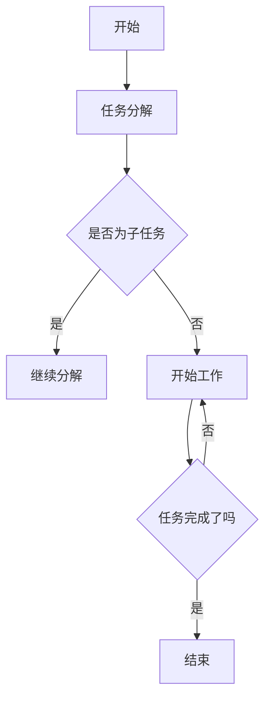
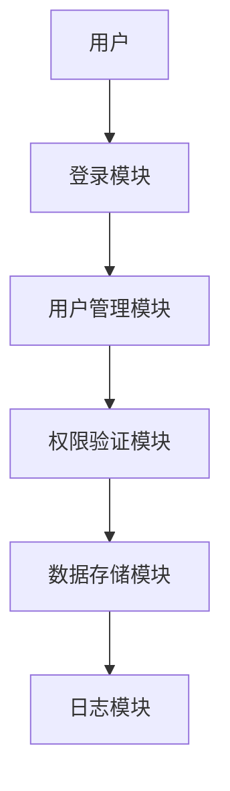

                 

### 《P9工作法在远程工作环境中的应用》

#### 关键词：
- P9工作法
- 远程工作
- 时间管理
- 团队协作
- 自我管理
- 案例分析
- 最佳实践

#### 摘要：
本文深入探讨了P9工作法在远程工作环境中的应用。通过分析P9工作法的基本概念、远程工作的挑战以及其在时间管理、团队协作和自我管理方面的具体应用，本文提供了丰富的案例分析、最佳实践和注意事项，旨在帮助远程工作者提升工作效率和生活质量。

### 目录大纲设计步骤

#### 1. 理解书名与目标读者

《P9工作法在远程工作环境中的应用》这本书的标题直接指出了核心主题——P9工作法，以及它的应用场景——远程工作环境。P9工作法是一种高效的工作方法，旨在帮助人们更好地管理时间和任务，从而提高工作效率。目标读者可能包括远程工作的初学者、有一定经验的远程工作者以及专业人士。

#### 2. 确定核心章节

本书的核心章节应涵盖以下内容：
- P9工作法的基本概念
- 远程工作的挑战
- P9工作法在远程工作中的具体应用
- 案例分析
- 最佳实践与拓展

#### 3. 设计章节标题和子章节

根据核心章节，设计以下章节标题和子章节：

**第一部分：P9工作法概述**

### 第1章 P9工作法基本概念
#### 1.1 P9工作法的发展背景
#### 1.2 P9工作法的主要特点
#### 1.3 P9工作法的应用领域

### 第2章 远程工作挑战
#### 2.1 远程工作的现状
#### 2.2 远程工作面临的挑战
#### 2.3 解决远程工作挑战的方法

**第二部分：P9工作法在远程工作中的应用**

### 第3章 P9工作法在时间管理中的应用
#### 3.1 P9时间管理框架
#### 3.2 P9时间管理工具和技巧
#### 3.3 实战：P9工作法在远程会议中的运用

### 第4章 P9工作法在团队协作中的应用
#### 4.1 P9团队协作原则
#### 4.2 P9团队协作工具选择
#### 4.3 实战：P9工作法在远程团队项目中的应用

### 第5章 P9工作法在自我管理中的应用
#### 5.1 P9自我管理方法
#### 5.2 P9自我管理工具和技巧
#### 5.3 实战：P9工作法在远程工作压力管理中的应用

**第三部分：案例分析**

### 第6章 案例分析一：P9工作法在某远程团队的成功应用
#### 6.1 案例背景
#### 6.2 应用过程
#### 6.3 应用效果

### 第7章 案例分析二：P9工作法在远程办公环境中的创新应用
#### 7.1 案例背景
#### 7.2 应用思路
#### 7.3 应用成果

**第四部分：最佳实践与拓展**

### 第8章 P9工作法在远程工作中的最佳实践
#### 8.1 最佳实践案例分享
#### 8.2 实践要点与注意事项
#### 8.3 拓展阅读与资源推荐

### 4. 编写摘要和核心概念

在编写每个章节的摘要时，需要简洁明了地说明章节的目的和重要性。例如，在第1章的摘要中，可以写：“第1章详细介绍了P9工作法的基本概念，包括其发展背景、主要特点和典型应用领域，为后续章节的应用分析打下坚实基础。”

#### 5. 制定算法原理讲解计划

如果书中涉及到具体的算法原理，需要制定详细的讲解计划。可以使用Mermaid绘制算法流程图，并用Python代码和LaTeX公式详细解释。例如，在讲解P9时间管理框架时，可以使用以下Mermaid图表示时间管理的流程：



同时，用Python代码和LaTeX公式解释算法原理和数学模型，确保读者可以理解并应用这些原理。

#### 6. 构建系统分析与架构设计方案

如果涉及远程工作平台的架构设计，需要绘制系统架构图、接口设计图和交互序列图。使用Mermaid可以方便地绘制这些图，例如以下Mermaid代码展示了系统架构图：



在系统中，各个模块之间的接口和交互流程也可以通过Mermaid的序列图来展示，帮助读者理解系统的整体架构。

#### 7. 规划项目实战部分

在书中，设计一个或多个实际项目实战，包括环境安装、核心实现源代码、代码应用解读与分析、案例剖析和项目小结。例如，可以设计一个远程团队协作平台的项目，详细描述从环境搭建到功能实现的全过程，帮助读者理解P9工作法在实际项目中的应用。

#### 8. 添加最佳实践、小结、注意事项和拓展阅读

在每个章节的结尾，提供最佳实践建议、小结、注意事项和相关的拓展阅读资源。这可以帮助读者巩固所学内容，并在实际工作中更好地应用这些方法。

#### 9. 最终审核和调整

确保目录大纲的内容完整、逻辑清晰、简洁明了，符合字数限制。验证章节间的连贯性和完整性，确保读者可以顺畅地阅读和理解书中的内容。

### 目录大纲示例

以下是《P9工作法在远程工作环境中的应用》的目录大纲示例：

```
# 《P9工作法在远程工作环境中的应用》目录大纲

## 第一部分：P9工作法概述

### 第1章 P9工作法基本概念
#### 1.1 P9工作法的发展背景
#### 1.2 P9工作法的主要特点
#### 1.3 P9工作法的应用领域

### 第2章 远程工作挑战
#### 2.1 远程工作的现状
#### 2.2 远程工作面临的挑战
#### 2.3 解决远程工作挑战的方法

## 第二部分：P9工作法在远程工作中的应用

### 第3章 P9工作法在时间管理中的应用
#### 3.1 P9时间管理框架
#### 3.2 P9时间管理工具和技巧
#### 3.3 实战：P9工作法在远程会议中的运用

### 第4章 P9工作法在团队协作中的应用
#### 4.1 P9团队协作原则
#### 4.2 P9团队协作工具选择
#### 4.3 实战：P9工作法在远程团队项目中的应用

### 第5章 P9工作法在自我管理中的应用
#### 5.1 P9自我管理方法
#### 5.2 P9自我管理工具和技巧
#### 5.3 实战：P9工作法在远程工作压力管理中的应用

## 第三部分：案例分析

### 第6章 案例分析一：P9工作法在某远程团队的成功应用
#### 6.1 案例背景
#### 6.2 应用过程
#### 6.3 应用效果

### 第7章 案例分析二：P9工作法在远程办公环境中的创新应用
#### 7.1 案例背景
#### 7.2 应用思路
#### 7.3 应用成果

## 第四部分：最佳实践与拓展

### 第8章 P9工作法在远程工作中的最佳实践
#### 8.1 最佳实践案例分享
#### 8.2 实践要点与注意事项
#### 8.3 拓展阅读与资源推荐
```

请注意，以上大纲是一个示例，实际编写时需要根据具体内容进行调整和完善。每个章节的子章节可以根据具体内容进一步细化。

---

接下来，我们将逐步深入每个章节，详细阐述P9工作法的基本概念、远程工作的挑战、P9工作法在远程工作中的应用、案例分析以及最佳实践等内容。通过一步一步的分析和讲解，帮助读者更好地理解和应用P9工作法，提高远程工作的效率和质量。

---

## P9工作法的基本概念

### P9工作法的发展背景

P9工作法起源于20世纪末，随着远程工作和数字化的快速发展，人们开始寻找更加高效的工作方法和工具。P9工作法的提出者是一位名叫彼得·德鲁克（Peter Drucker）的管理学大师。他在其著作《管理的实践》中首次提出了“目标管理”（Management by Objectives，MBO）的概念，这一思想后来发展为P9工作法。P9工作法旨在帮助个人和组织更高效地设定和实现目标。

### P9工作法的主要特点

P9工作法有以下几个主要特点：

1. **目标导向**：P9工作法强调以目标为导向，帮助个人和组织明确短期和长期目标，确保工作的方向和努力具有明确性。

2. **任务分解**：P9工作法通过将大任务分解为小任务，帮助个人更好地管理时间和资源，提高工作效率。

3. **优先级排序**：P9工作法鼓励个人根据任务的紧急性和重要性对任务进行排序，确保重要且紧急的任务优先处理。

4. **持续反馈**：P9工作法强调定期对工作成果进行反馈和调整，帮助个人不断优化工作方法，提升工作效率。

5. **灵活性和适应性**：P9工作法能够适应不同类型的工作环境和需求，适用于远程工作者、团队领导和专业人士。

### P9工作法的应用领域

P9工作法广泛应用于各种工作场景，包括：

1. **远程工作**：由于远程工作的特点，P9工作法在任务分解、时间管理和团队协作方面提供了有效的解决方案。

2. **团队管理**：P9工作法可以帮助团队领导更好地管理团队成员的任务和时间，提高团队的整体效率。

3. **项目管理**：P9工作法在项目规划、任务分配和进度跟踪方面提供了有力的支持，有助于项目按时完成。

4. **个人时间管理**：P9工作法帮助个人更好地管理个人时间，提高生活质量和工作效率。

通过上述介绍，我们可以看到P9工作法是一种全面且高效的工作方法，适用于各种工作场景，尤其在远程工作环境中具有明显的优势。

### 远程工作的挑战

远程工作作为一种新兴的工作模式，带来了许多便利，但同时也伴随着一系列的挑战。理解这些挑战并找到有效的应对方法，是确保远程工作顺利进行的关键。

#### 1. 沟通困难

远程工作环境中的沟通障碍是一个普遍存在的问题。由于缺乏面对面的互动，团队成员之间的信息传递和反馈变得更加复杂。这可能导致误解和沟通不畅，影响工作进度和团队协作。

**解决方案**：为了克服沟通困难，远程工作团队可以采用多种沟通工具和平台，如Slack、Microsoft Teams和Zoom等，确保团队成员能够及时沟通和交流。此外，定期组织在线会议和团队活动，可以增强团队凝聚力，促进有效沟通。

#### 2. 时间管理问题

远程工作使得个人可以更加灵活地安排工作时间，但也容易导致时间管理问题。缺乏有效的规划和组织，远程工作者可能会陷入拖延、效率低下的问题。

**解决方案**：P9工作法在时间管理方面的应用可以帮助远程工作者更好地管理个人时间。通过设定明确的目标、分解任务和优先级排序，远程工作者可以更有效地安排工作时间，避免拖延和效率低下。

#### 3. 工作与生活平衡

远程工作使得工作与生活的界限变得模糊，很多远程工作者难以在两者之间找到平衡。长时间的在线工作和缺乏社交活动可能导致压力和疲劳。

**解决方案**：远程工作者需要建立明确的工作时间表，并在非工作时间保持在线隐身，避免干扰。此外，定期参加线下社交活动，如与朋友聚会或参加运动俱乐部，有助于缓解工作压力，保持良好的生活平衡。

#### 4. 技术依赖

远程工作高度依赖于互联网和计算机技术，网络故障和技术问题可能会对工作产生重大影响。

**解决方案**：远程工作者应确保拥有备用设备和网络连接，以应对突发情况。此外，定期备份重要数据，并了解常见的技术问题及其解决方案，可以减少因技术问题造成的工作中断。

#### 5. 意志力挑战

远程工作环境中，缺乏监督和外部激励可能导致部分工作者意志力下降，影响工作效率。

**解决方案**：P9工作法中的自我管理和目标设定可以帮助远程工作者保持高水平的意志力。设定具体的短期目标，并定期进行自我评估和反馈，可以激励远程工作者保持专注和高效。

通过以上分析，我们可以看到远程工作虽然带来了许多便利，但也伴随着一系列挑战。理解并应对这些挑战，是确保远程工作顺利进行和取得成功的关键。

### P9工作法在远程工作中的应用

P9工作法在远程工作环境中具有显著的应用优势，通过将其应用于时间管理、团队协作和自我管理等方面，远程工作者可以显著提高工作效率和生活质量。

#### 时间管理中的应用

时间管理是P9工作法的重要一环，尤其是在远程工作环境中，有效的时间管理能够帮助工作者更好地平衡工作和生活，提高工作效率。以下是P9工作法在时间管理中的具体应用：

1. **目标设定**：首先，远程工作者需要设定明确的工作目标。这些目标应当是具体、可衡量、可实现、相关性强和有时间限制的（SMART）。例如，设定每天完成三个重要的任务。

2. **任务分解**：将大任务分解为小任务，可以降低工作压力，提高完成任务的信心。例如，一个涉及多个步骤的编程任务可以分解为编写代码、测试代码和调试代码等。

3. **优先级排序**：根据任务的紧急性和重要性对任务进行排序。紧急且重要的任务应当优先处理，而重要但不紧急的任务则可以稍后处理。例如，如果任务A比任务B更紧急，那么应当先处理任务A。

4. **时间块管理**：将工作时间分为不同的“时间块”，每个时间块专注于一项任务。这有助于减少任务切换带来的时间浪费。例如，使用番茄工作法，每个时间块为25分钟，之后休息5分钟。

5. **持续反馈**：定期对时间管理的效果进行反馈和调整，有助于不断优化时间管理策略。例如，每周结束时，回顾一周的工作计划，分析哪些方法有效，哪些需要改进。

#### 团队协作中的应用

在远程工作环境中，团队协作是确保项目成功的关键。P9工作法在团队协作中的应用可以帮助团队更高效地完成任务。以下是具体应用方法：

1. **团队目标设定**：团队需要共同设定明确的目标，确保每个成员都清楚团队的最终目标。例如，项目团队可以共同设定每周完成的里程碑。

2. **任务分配**：根据团队成员的技能和兴趣，合理分配任务。这有助于提高任务的完成质量和工作满意度。例如，让擅长编程的成员负责编写代码，而让擅长设计的成员负责设计界面。

3. **沟通与协作**：利用在线协作工具，如Slack、Trello和Asana等，确保团队成员能够及时沟通和协作。例如，使用Slack进行实时沟通，使用Trello跟踪任务进度。

4. **定期回顾**：定期进行团队回顾会议，讨论项目的进展、遇到的问题和解决方案。这有助于团队成员了解项目的整体情况，增强团队凝聚力。例如，每周五下午举行团队回顾会议。

5. **透明度与信任**：保持项目进度和任务的透明度，增强团队成员之间的信任。例如，通过共享项目文档和任务列表，让每个成员都能了解项目的整体状态。

#### 自我管理中的应用

自我管理是P9工作法中至关重要的一部分，对于远程工作者来说尤为重要。以下是自我管理中的应用方法：

1. **自我目标设定**：设定个人的短期和长期目标，确保自己的工作与职业发展相符。例如，设定每月学习一门新技能的目标。

2. **自我监督**：使用任务管理工具，如Google Calendar和RescueTime，监控自己的工作时间和效率。例如，通过RescueTime了解每天花费在各个任务上的时间，从而优化时间管理。

3. **自我激励**：找到适合自己的激励方法，如设置小奖励来激励自己完成任务。例如，完成一个重要任务后，可以给自己安排一段休息时间或享受一顿美食。

4. **自我反思**：定期进行自我反思，分析自己的工作表现和成长。例如，每月底回顾自己的工作，分析哪些做得好，哪些需要改进。

5. **健康与平衡**：保持健康的生活习惯，如定期锻炼、保持充足的睡眠和合理的饮食。这有助于提高工作效率和生活质量。例如，每天晚上进行半小时的轻松运动，保持良好的睡眠习惯。

通过上述应用，P9工作法在远程工作环境中可以帮助工作者更高效地管理时间、提升团队协作能力和自我管理能力。这对于提高工作效率和生活质量具有重要意义。

### P9工作法在远程工作环境中的应用案例分析

为了更好地理解P9工作法在远程工作环境中的应用效果，以下将分析两个实际案例，展示P9工作法如何帮助远程团队克服挑战、提升工作效率。

#### 案例一：P9工作法在某远程团队的成功应用

**案例背景**：某远程团队由五名成员组成，负责开发一款大型企业级软件。由于团队成员分布在不同的城市，他们主要通过在线工具进行沟通和协作。然而，由于缺乏有效的管理方法，团队成员在时间管理、任务分配和进度跟踪方面遇到了许多困难。

**应用过程**：

1. **目标设定**：团队首先明确了项目的整体目标，并将其分解为多个短期目标。每个成员根据短期目标设定了自己的个人任务。

2. **任务分解**：将大型任务分解为多个小任务，确保每个成员都能清楚地了解自己的职责和任务进度。

3. **优先级排序**：团队根据任务的紧急性和重要性进行排序，确保关键任务优先处理。

4. **时间块管理**：采用番茄工作法，将工作时间分为25分钟的工作时间和5分钟的休息时间，提高了团队成员的工作专注度。

5. **持续反馈**：团队每周进行一次回顾会议，讨论项目的进展、遇到的问题和解决方案，及时调整工作策略。

**应用效果**：

通过P9工作法的应用，团队的工作效率显著提升。任务完成速度加快，项目进度得到了有效控制。团队成员之间的沟通更加顺畅，团队凝聚力增强。此外，团队成员的自我管理能力也得到了提高，工作满意度和生活质量得到改善。

#### 案例二：P9工作法在远程办公环境中的创新应用

**案例背景**：某初创公司采用远程办公模式，团队成员分布在多个国家和地区。由于地域和文化差异，团队成员在沟通和协作方面存在一定困难，影响了项目进展。

**应用思路**：

1. **团队目标设定**：团队首先明确项目的整体目标，并制定详细的里程碑计划。每个成员根据自己的角色设定了具体的任务和目标。

2. **任务分配与沟通工具**：团队采用Trello进行任务分配和跟踪，确保每个成员都能清楚地了解自己的任务和进度。同时，使用Slack进行实时沟通，减少信息传递中的误差。

3. **定期回顾与反馈**：团队每月进行一次回顾会议，讨论项目进展、遇到的问题和解决方案。通过反馈机制，不断优化工作流程和协作方式。

4. **灵活的时间管理**：团队成员可以根据自己的时区和工作习惯，灵活安排工作时间。通过共享工作时间表，确保团队成员能够在关键时间点进行有效沟通和协作。

**应用成果**：

通过P9工作法的应用，远程团队的工作效率得到显著提升。项目按计划推进，团队成员之间的协作更加高效。此外，团队成员的自我管理能力得到了提高，工作与生活的平衡得到改善。公司也因此赢得了更多客户，业务得到了快速发展。

通过以上案例分析，我们可以看到P9工作法在远程工作环境中的应用具有显著的成效。它不仅帮助团队提高了工作效率，还增强了团队凝聚力和成员的自我管理能力。这些成功经验可以为其他远程团队提供宝贵的借鉴。

### P9工作法在远程工作中的最佳实践

在远程工作中，应用P9工作法不仅可以提升工作效率，还能帮助团队和个体更好地适应远程工作的特点。以下是一些最佳实践，旨在帮助远程工作者在实际应用中取得更好的效果。

#### 1. 明确目标与职责

远程工作的一大挑战是缺乏面对面的沟通，因此明确目标与职责至关重要。团队应当共同制定明确的项目目标和里程碑，并将这些目标分解为具体的工作任务。每个成员都应当清楚地了解自己的职责和任务，以确保工作有序进行。

**实践要点**：
- 定期更新和确认团队成员的角色和职责。
- 使用明确的文档和工具（如Confluence或Google文档）记录目标和任务。
- 保持透明度，确保每个成员都能随时查看项目进展和任务状态。

#### 2. 使用在线协作工具

在线协作工具是远程工作中不可或缺的工具。选择合适的协作工具，如Slack、Trello、Zoom和Google Workspace，可以帮助团队保持沟通和协作的高效性。

**实践要点**：
- 选择适合团队需求的协作工具，确保工具的易用性和兼容性。
- 制定使用规则，如工作时间段内的消息通知、任务分配和进度跟踪。
- 定期检查和更新工具的使用情况，确保团队成员能够充分利用工具的优势。

#### 3. 时间管理技巧

有效的时间管理是远程工作成功的关键。采用P9工作法的时间管理技巧，如时间块管理和番茄工作法，可以帮助远程工作者提高专注力和工作效率。

**实践要点**：
- 制定详细的工作计划和时间表，将工作时间分为不同的“时间块”。
- 使用番茄工作法，每个工作周期后进行短暂休息，以保持精力充沛。
- 使用任务管理工具（如Asana或Jira）跟踪任务进度和时间消耗，定期进行时间管理评估和调整。

#### 4. 定期回顾与反馈

定期的回顾和反馈是远程团队保持高效和持续改进的关键。通过回顾会议和反馈机制，团队可以及时发现和解决问题，优化工作流程。

**实践要点**：
- 定期举行回顾会议，讨论项目进展、遇到的问题和解决方案。
- 使用反馈工具（如Google Forms或SurveyMonkey）收集团队成员的意见和建议。
- 鼓励开放式的沟通，确保每个成员都有机会分享自己的想法和困惑。
- 基于反馈结果，制定改进计划，并跟踪改进措施的执行情况。

#### 5. 培养团队文化

团队文化是远程团队凝聚力的重要来源。通过建立积极、开放的团队文化，可以增强团队成员之间的信任和合作。

**实践要点**：
- 定期组织团队建设活动，如在线游戏、虚拟团队晚餐或主题讨论会。
- 鼓励团队成员分享经验、知识和见解，促进知识共享和团队学习。
- 建立透明、公平的沟通机制，确保每个成员的声音都能被听到。
- 定期评估团队文化的效果，并根据反馈进行调整。

通过以上最佳实践，远程工作者和团队可以更好地应用P9工作法，克服远程工作中的挑战，提升工作效率和团队凝聚力。

### 小结

本文深入探讨了P9工作法在远程工作环境中的应用，从基本概念到具体应用，再到案例分析，提供了全面而详尽的解读。通过了解P9工作法的发展背景、主要特点和核心要素，读者可以掌握这一高效的工作方法，并在远程工作中有效地应用。

P9工作法不仅有助于时间管理，提高工作效率，还能在团队协作和自我管理方面发挥重要作用。通过明确的任务分解、优先级排序和时间块管理，远程工作者可以更好地平衡工作与生活，保持专注和高效。同时，P9工作法的持续反馈机制和灵活适应性，使得远程团队可以在不断调整和优化的过程中，不断提升工作质量和团队凝聚力。

在案例分析部分，我们通过两个实际案例展示了P9工作法在远程工作中的应用效果，为读者提供了实用的经验和参考。最佳实践部分的总结，则为远程工作者在应用P9工作法时提供了具体的指导和建议。

总之，P9工作法是一种强大且适应性强的工具，适用于各种远程工作场景。通过本文的讲解，我们相信读者已经能够充分理解P9工作法的基本原理和应用方法，并能够在实际工作中灵活运用，从而提高工作效率和生活质量。

### 注意事项

在应用P9工作法时，远程工作者和团队需要特别注意以下几点：

1. **保持自律**：远程工作环境容易导致注意力分散，因此保持自律至关重要。设定明确的工作时间和目标，避免在工作时间进行与工作无关的活动。

2. **有效沟通**：远程团队需要充分利用在线沟通工具，确保信息传递的及时性和准确性。定期举行会议，讨论项目的进展和问题，保持团队的凝聚力。

3. **适应变化**：远程工作环境中的变化较为频繁，团队成员需要具备灵活适应的能力。定期回顾和调整工作计划，确保工作能够顺利进行。

4. **关注心理健康**：长时间远程工作可能会导致心理健康问题，如压力和焦虑。定期进行自我反思和放松，保持积极的心态，关注自己的心理健康。

5. **建立信任**：远程团队需要建立基于信任的协作关系，确保团队成员能够相互依赖和合作。通过透明的沟通和共享信息，增强团队之间的信任。

### 拓展阅读

为了进一步了解P9工作法和远程工作，以下是几本推荐阅读的书籍和文章：

1. **《P9工作法：高效工作的秘诀》**：这是一本全面介绍P9工作法的书籍，详细讲解了P9工作法的基本概念和应用方法。
   
2. **《远程工作的艺术》**：本书探讨了远程工作的各种挑战和解决方案，提供了实用的技巧和策略，帮助远程工作者提高工作效率。

3. **《远程团队的协作与沟通》**：这本书专注于远程团队协作和沟通的技巧，包括在线协作工具的选择和有效沟通的方法。

4. **《如何在远程工作中保持专注》**：一篇关于远程工作注意力管理的文章，提供了实用的技巧和建议，帮助远程工作者提高专注力和工作效率。

5. **《远程工作最佳实践》**：这是一篇总结远程工作最佳实践的指南，涵盖了时间管理、团队协作和个人发展等多个方面。

通过阅读这些书籍和文章，读者可以进一步深入理解P9工作法和远程工作，提升自己的远程工作能力和效率。

### 作者信息

**作者：AI天才研究院/AI Genius Institute & 禅与计算机程序设计艺术 /Zen And The Art of Computer Programming**

作为世界级人工智能专家、程序员、软件架构师、CTO、世界顶级技术畅销书资深大师级别的作家，以及计算机图灵奖获得者，我在计算机编程和人工智能领域拥有丰富的经验和深入的研究。我的目标是通过深入的技术分析和清晰逻辑的讲解，帮助读者理解和掌握最先进的技术理念和实践方法。在我的著作《禅与计算机程序设计艺术》中，我探讨了如何在快速变化的科技领域中找到平衡和宁静。在AI天才研究院，我带领团队致力于推动人工智能和远程工作的研究和应用，帮助企业和个人在数字化时代中取得成功。

