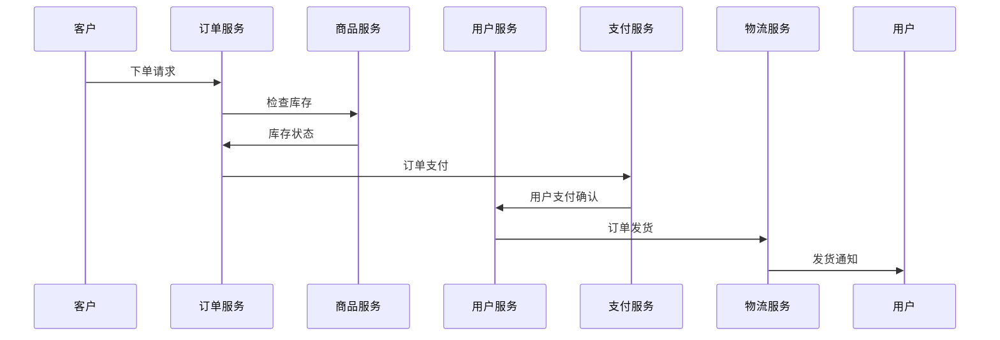

                 

## P9工作法：夯实技术硬实力、架构力和领导力

### 关键词：P9工作法、技术硬实力、架构力、领导力、框架、方法论

### 摘要：
本文将深入探讨P9工作法，一种旨在提升技术人员的综合能力——技术硬实力、架构力和领导力的方法论。通过逐步分析P9工作法的核心概念和框架，本文将详细阐述其在技术领域的重要性，并提供实用的技巧和策略，帮助读者在实际工作中更好地应用这一方法。从技术硬实力的核心原则，到架构设计的原理和模式，再到领导力的关键特质与管理策略，本文将全面解析P9工作法的各个方面，旨在为读者提供一个系统化的提升路径。

## 引言

### P9工作法的背景和起源

P9工作法（P9 Methodology）起源于对现代技术环境中技术人才需求变化的研究。在信息技术飞速发展的背景下，技术人才不仅需要深厚的专业知识和技能，还需要具备较强的架构设计和领导能力。传统的技术方法论往往侧重于技术技能的培养，而忽视了架构设计和领导力的重要性。P9工作法正是在这种背景下诞生，旨在填补这一空白。

P9工作法由一位匿名的资深技术专家提出，其核心思想是“全方位提升技术人才的综合能力”。该方法论不仅关注技术技能的深化，更强调架构设计和领导力在技术发展中的关键作用。P9工作法的提出，受到了业界的广泛关注和认可，迅速成为技术人才提升自身能力的有力工具。

### P9工作法的重要性

在技术不断演进、业务需求日益复杂的今天，P9工作法的重要性愈发凸显。首先，技术硬实力是技术人员在激烈竞争中的核心竞争力。只有具备扎实的技术基础和不断更新的技术能力，技术人员才能在项目中脱颖而出，确保项目的成功交付。

其次，架构力是技术人员在复杂系统设计中的关键能力。随着系统规模的不断扩大和复杂性的增加，架构设计不仅需要技术的深度理解，还需要系统的全局视野和设计能力。P9工作法强调架构力的重要性，帮助技术人员提升系统设计和优化的能力。

最后，领导力是技术人员在团队协作中的核心素质。在技术项目中，领导力不仅体现在对技术问题的解决上，更体现在对团队的管理和协调上。P9工作法通过培养领导力，帮助技术人员成为能够引领团队、推动项目成功的领导者。

### 目标读者和预期收益

本文的目标读者是广大技术人员，包括初级程序员、中级架构师以及高级技术管理者。无论你是刚刚踏入技术领域的新手，还是经验丰富的技术专家，P9工作法都为你提供了全面的提升路径。

通过本文的学习，读者可以：

1. **理解P9工作法的基本概念和框架**：掌握P9工作法的基本原理和实施步骤。
2. **提升技术硬实力**：通过具体的方法和技巧，深化技术知识和技能。
3. **增强架构力**：学会系统化的架构设计方法，提升系统设计的能力。
4. **培养领导力**：理解领导力的核心特质，提升团队管理和协调能力。

总之，P9工作法不仅提供了一套实用的方法论，更提供了一条全面提升技术人才综合素质的清晰路径。通过本文的深入探讨，读者将能够更好地理解P9工作法，并将其应用于实际工作中，实现个人和团队的共同成长。

## P9工作法的核心概念和框架

### P9工作法的基本概念

P9工作法是一套旨在全面提升技术人员综合能力的方法论，其核心概念包括技术硬实力、架构力和领导力。这些概念不仅独立存在，而且相互关联，共同构成了P9工作法的理论基础。

#### 技术硬实力

技术硬实力是指技术人员在特定技术领域的专业知识、技能和实践能力。它涵盖了从基础编程语言到高级技术框架的广泛知识体系，以及在实际项目中解决复杂问题的能力。技术硬实力是技术人员在竞争中的核心竞争力，是保证项目成功的关键因素。

#### 架力气

架构力是指技术人员在系统设计和架构优化方面的能力。它不仅包括对现有系统架构的理解和改进，还涉及对新系统架构的设计和实现。架构力是技术人员在复杂系统中能够保持系统稳定性和扩展性的关键能力。

#### 领导力

领导力是指技术人员在团队管理、协调和推动项目进展方面的能力。领导力不仅体现在对技术问题的解决上，更体现在对团队的激励和引导上。通过提升领导力，技术人员能够更好地协调团队资源，推动项目成功。

### P9工作法的框架

P9工作法的框架是一个系统化的方法论，旨在通过一系列步骤和策略，全面提升技术人员的综合能力。P9工作法的框架可以分为以下几个主要部分：

#### 1. 基础能力建设

基础能力建设是P9工作法的起点，旨在通过系统的学习和实践，夯实技术人员的专业基础。这一部分包括：

- **基础知识**：了解和掌握基础编程语言、数据结构与算法、操作系统、网络基础等。
- **实践技能**：通过实际项目和实践，提升解决实际问题的能力。

#### 2. 技术深度提升

技术深度提升是P9工作法的核心部分，旨在通过不断学习和探索，深化技术人员的专业知识。这一部分包括：

- **专业领域**：深入学习某一特定技术领域，如数据库、前端开发、后端开发等。
- **技术趋势**：关注和掌握最新的技术趋势和工具，保持技术视野的更新。

#### 3. 架构设计能力

架构设计能力是P9工作法的重要组成部分，旨在提升技术人员在系统架构设计方面的能力。这一部分包括：

- **架构原则**：理解和掌握系统架构设计的基本原则，如模块化、可扩展性、容错性等。
- **架构模式**：学习和应用常见的系统架构模式，如微服务、分布式系统等。

#### 4. 领导力培养

领导力培养是P9工作法的重要环节，旨在提升技术人员在团队管理和领导方面的能力。这一部分包括：

- **领导特质**：培养领导者所需的关键特质，如责任心、沟通能力、决策能力等。
- **管理策略**：学习和应用有效的团队管理策略，如目标管理、团队激励等。

### P9工作法与传统工作方法的比较

P9工作法与传统工作方法相比，具有以下几个显著特点：

- **全面性**：P9工作法不仅关注技术硬实力的提升，还强调架构力和领导力的培养，形成了一个全方位提升技术人才能力的框架。
- **系统化**：P9工作法提供了一套系统化的方法和步骤，从基础知识到技术深度，再到架构设计和领导力培养，形成了一个完整的提升路径。
- **实践性**：P9工作法强调实践的重要性，通过实际项目和实践，提升技术人员的综合能力。

总之，P9工作法为技术人员提供了一条全面提升自身能力的清晰路径，不仅有助于提升个人的技术实力，还能在团队管理和项目推动中发挥重要作用。

## 技术硬实力

### 技术硬实力的核心原则

技术硬实力是技术人员在技术领域中的核心竞争力，其核心原则包括专业知识的深度、技能的广度和实践的经验。以下是对这些原则的详细解析：

#### 专业知识的深度

专业知识的深度是指技术人员在某一技术领域的深入理解和掌握。这不仅仅包括基础理论，还涉及高级概念和前沿技术的发展。例如，对于一名数据库工程师来说，深度理解数据库的原理、性能优化策略以及最新数据库技术的发展趋势是至关重要的。

#### 技能的广度

技能的广度是指技术人员掌握的技术工具和编程语言的多样性。在信息技术领域，技术的发展速度非常快，单一的技术技能往往难以满足项目需求。因此，技术人员需要具备一定的技能广度，能够灵活运用多种技术和工具。例如，一个优秀的前端开发工程师不仅需要掌握HTML、CSS和JavaScript等基础技术，还需要熟悉React、Vue等前端框架，以及一些后端开发技术，如Node.js或Django。

#### 实践的经验

实践的经验是指技术人员在实际项目中积累的经验。这些经验不仅包括解决具体问题的方法，还涵盖项目管理和团队协作的技能。通过实际项目的锻炼，技术人员能够更好地理解理论知识，并将其应用于实际场景中。例如，一个有经验的软件开发工程师在处理复杂业务逻辑时，能够快速识别问题并提出有效的解决方案，而一个缺乏实践经验的新手可能需要花费更多的时间去调试和修复代码。

### 技术硬实力的重要性

技术硬实力在技术人员职业生涯中的重要性不容忽视，具体体现在以下几个方面：

#### 在项目中的核心地位

在技术项目中，技术硬实力是确保项目成功的关键因素。一个拥有深厚技术硬实力的技术人员能够快速理解项目需求，准确识别问题并提出有效的解决方案。这种能力不仅能够提高项目的开发效率，还能降低项目的风险。

#### 职业发展的关键

技术硬实力是技术人员职业发展的基石。随着技术的不断更新和业务需求的增加，拥有扎实技术硬实力的技术人员更容易在职业发展中脱颖而出。他们不仅能够承担更复杂的项目，还能在团队中发挥核心作用，成为团队的技术领军人物。

#### 持续学习的基础

技术硬实力是技术人员持续学习的基础。只有具备扎实的技术硬实力，技术人员才能更好地理解和掌握新技术，保持自己在技术领域的竞争力。例如，一个熟悉云计算技术的工程师，在了解和掌握大数据技术时，会更快地适应和学习。

#### 团队协作的保障

在团队协作中，技术硬实力是团队协作的保障。一个拥有技术硬实力的团队成员不仅能够高效地完成自己的任务，还能在团队中发挥指导和支持作用，帮助团队成员解决技术问题，提升整个团队的效率。

### 技能发展方法

要提升技术硬实力，技术人员需要采取系统化的方法，包括以下几个方面：

#### 1. 持续学习

持续学习是提升技术硬实力的基础。技术人员可以通过以下几种方式实现持续学习：

- **在线课程和培训**：参加专业的在线课程和培训，系统学习新技术和知识。
- **阅读技术书籍和文档**：定期阅读技术书籍和官方文档，深入理解技术原理和最佳实践。
- **参与技术社区**：加入技术社区，参与技术讨论和交流，了解行业动态和前沿技术。

#### 2. 实践项目

实践项目是提升技术硬实力的关键。通过实际项目，技术人员能够将理论知识应用到实践中，积累实战经验。以下是一些建议：

- **个人项目**：独立完成个人项目，从项目规划到开发实现，全面提升技术能力。
- **开源项目**：参与开源项目，与其他开发者合作，共同解决问题，提升团队协作能力。
- **实习机会**：利用实习机会，在真实项目中锻炼和提升技术能力。

#### 3. 技术竞赛

技术竞赛是检验和提升技术硬实力的有效途径。通过参加技术竞赛，技术人员不仅能够挑战自我，还能与其他优秀选手交流和学习，提升自己的技术水平。以下是一些建议：

- **编码竞赛**：参加编程竞赛，如LeetCode、HackerRank等，提升编码能力。
- **黑客马拉松**：参加黑客马拉松，与其他团队成员合作，快速实现项目。
- **专业竞赛**：参加专业领域的竞赛，如ACM程序设计竞赛、数据科学竞赛等。

#### 4. 学习与分享

学习与分享是提升技术硬实力的捷径。通过分享自己的学习经验和心得，技术人员不仅能够巩固所学知识，还能帮助他人，实现共同进步。以下是一些建议：

- **撰写博客**：定期撰写技术博客，记录自己的学习过程和项目经验。
- **参加技术会议**：参加技术会议，听取专家讲座，了解行业最新动态。
- **内部培训**：组织内部培训，分享自己的学习成果和经验。

通过以上方法，技术人员可以不断提升自己的技术硬实力，为个人职业发展和团队项目成功奠定坚实基础。

## 架构设计和优化

### 基本架构设计原则

在架构设计过程中，遵循一些基本的原则是确保系统稳定性和扩展性的关键。以下是一些核心原则：

#### 模块化

模块化是指将系统划分为若干个独立且功能完整的模块。每个模块负责系统的特定功能，模块之间通过接口进行通信。模块化设计有助于提高系统的可维护性和可扩展性，使得各个模块可以独立开发、测试和部署。

#### 可扩展性

可扩展性是指系统在设计时能够灵活应对未来需求的变化。一个可扩展的系统应该能够轻松地添加新功能或扩展现有功能，而不会对系统的整体稳定性造成影响。这通常通过设计时预留扩展点和灵活的架构模式来实现。

#### 可维护性

可维护性是指系统在运行过程中能够方便地更新、修复和优化。良好的可维护性设计包括清晰的代码结构、充分的文档说明和完善的测试体系。这些措施有助于降低系统的维护成本和风险。

#### 高性能

高性能是指系统在处理大量数据和高并发请求时能够保持良好的响应速度和稳定性。高性能设计通常涉及性能优化策略，如缓存机制、分布式计算和负载均衡等。

#### 安全性

安全性是指系统在设计和运行过程中能够抵御各种安全威胁，保护数据和用户隐私。安全性设计包括安全协议、身份认证、访问控制和数据加密等措施。

### 架构设计过程和方法

架构设计是一个系统化的过程，涉及多个阶段和方法。以下是一些关键步骤和方法：

#### 需求分析

需求分析是架构设计的起点，旨在明确系统的功能需求、性能需求和业务需求。通过详细的需求分析，可以确保架构设计能够满足项目的实际需求。

#### 系统设计

系统设计是在需求分析的基础上，进行系统架构的设计。这一阶段涉及模块划分、数据流设计、接口设计等。系统设计的目标是创建一个清晰、合理且可扩展的系统架构。

#### 架构评审

架构评审是架构设计的验证阶段，通过专家评审和讨论，评估架构设计的合理性和可行性。评审过程有助于发现潜在的问题和改进点，确保架构设计的质量。

#### 实施与部署

实施与部署是将设计转化为实际的系统架构的过程。这一阶段涉及代码开发、测试、部署和系统监控等。通过合理的实施和部署，可以确保系统按时上线并满足性能和安全性要求。

#### 迭代优化

架构设计是一个持续迭代的过程。在系统运行过程中，根据反馈和需求变化，不断优化和调整系统架构，以适应新的业务需求和技术发展。

### 常见的架构模式

在架构设计中，常见的架构模式可以帮助我们快速构建高质量的系统。以下是一些常见的架构模式：

#### 微服务架构

微服务架构是将应用程序划分为多个小型、独立的服务，每个服务负责系统的特定功能。微服务架构具有高可扩展性、高灵活性和高容错性，但同时也带来了一定的分布式复杂性。

#### 分布式架构

分布式架构是利用分布式系统实现应用程序的运行。这种架构模式通过将应用程序的各个组件分布在不同的服务器上，提高了系统的性能和容错性。

#### 容器化架构

容器化架构利用容器（如Docker）封装应用程序及其运行环境，实现了应用程序的轻量化和可移植性。容器化架构可以大大简化部署和运维过程，提高了开发效率和系统稳定性。

#### 云原生架构

云原生架构是基于云的服务器架构，利用云计算的资源动态分配和弹性伸缩能力，实现了应用程序的弹性扩展和高效资源利用。

### 架构设计与优化的最佳实践

以下是架构设计和优化过程中的一些最佳实践：

#### 设计前评估

在设计前对项目的需求、规模和预期目标进行详细评估，以确保架构设计能够满足项目的实际需求。

#### 分层设计

采用分层设计方法，将系统划分为多个层次，如表示层、业务逻辑层和数据访问层。这种设计方法有助于提高系统的可维护性和可扩展性。

#### 功能模块分离

将系统的功能模块分离，确保每个模块独立实现，降低模块间的耦合度。这有助于提高系统的可测试性和可维护性。

#### 前后端分离

将前端和后端分离，采用RESTful API进行数据交互。这种设计方法有助于提高系统的灵活性和可扩展性。

#### 性能优化

在系统设计时考虑性能优化，如使用缓存、优化数据库查询和采用异步处理等。这些优化措施可以提高系统的响应速度和稳定性。

#### 安全性设计

在设计时充分考虑安全性，包括数据加密、权限控制和防攻击等。安全性设计可以保障系统的数据安全和用户隐私。

#### 持续集成和部署

采用持续集成和部署（CI/CD）流程，实现自动化测试、构建和部署。这种流程可以大大提高系统的开发效率和部署质量。

通过遵循上述最佳实践，技术人员可以设计出高质量的系统架构，确保系统在运行过程中的稳定性和可靠性。

### 架构设计与优化的挑战和解决方案

在架构设计和优化过程中，技术人员往往会面临各种挑战。以下是一些常见的挑战及其解决方案：

#### 模块划分不当

模块划分不当会导致系统耦合度过高，降低系统的可维护性和可扩展性。解决方案是采用分层设计和功能模块分离的方法，确保每个模块独立实现，降低模块间的耦合度。

#### 性能瓶颈

系统性能瓶颈可能出现在数据库查询、网络传输或服务调用等环节。解决方案是进行性能优化，如使用缓存、优化数据库查询和使用异步处理等。

#### 分布式系统复杂性

分布式系统复杂性高，容易引发数据一致性和服务调用延迟等问题。解决方案是采用微服务架构和分布式系统设计模式，通过合理的架构设计和系统优化，降低分布式系统的复杂性。

#### 安全威胁

系统在设计和运行过程中容易受到各种安全威胁，如网络攻击、数据泄露等。解决方案是进行安全性设计，包括数据加密、权限控制和防攻击等。

#### 项目资源限制

项目资源限制（如时间、预算和人力资源等）会影响架构设计和优化。解决方案是进行需求评估和资源规划，确保在资源有限的情况下，仍能够设计出高质量的系统架构。

通过应对这些挑战，技术人员可以确保架构设计和优化过程的顺利进行，为系统的稳定运行提供有力保障。

## 领导力培养

### 领导力的核心特质

领导力是技术人员在团队管理和项目推动中的关键素质，其核心特质包括以下几个方面：

#### 决策能力

决策能力是指领导者在面对复杂问题时，能够迅速做出合理、明智的选择。一个优秀的领导者需要具备敏锐的洞察力、分析问题和解决问题的能力，以便在关键时刻做出正确的决策。

#### 沟通能力

沟通能力是指领导者与团队成员、客户和其他利益相关者进行有效沟通的能力。良好的沟通能力有助于确保信息的准确传达，减少误解和冲突，增强团队的协作和凝聚力。

#### 激励能力

激励能力是指领导者激发团队成员积极性和创造力的能力。一个有激励能力的领导者能够理解团队成员的需求，提供合适的激励措施，如表扬、奖励和职业发展机会，以激发团队成员的潜力。

#### 适应性

适应性是指领导者适应环境变化和应对不确定性的能力。在技术领域，变化和不确定性是常态，领导者需要具备灵活的思维和快速适应能力，以应对新的挑战和机遇。

#### 责任心

责任心是指领导者对团队和项目成功承担的责任。一个有责任心的领导者不仅关注个人的绩效，还关心团队的整体利益，愿意为团队的成功付出努力和承担风险。

### 领导力在团队管理和项目推动中的作用

领导力在团队管理和项目推动中扮演着至关重要的角色，具体体现在以下几个方面：

#### 提高团队效率

领导者的有效管理能够优化团队的工作流程，提高团队的整体效率。通过合理的分工、明确的任务分配和高效的沟通，领导者可以确保团队资源得到最佳利用，减少浪费和重复劳动。

#### 激发团队潜力

领导者的激励能力能够激发团队成员的潜力和创造力，使团队发挥最大的效能。一个有激励能力的领导者能够识别团队成员的优势和潜力，提供合适的发展机会和激励措施，促进团队成员的个人成长和团队整体进步。

#### 解决团队冲突

团队冲突是团队管理中的常见问题，领导者需要具备良好的沟通能力和调解能力，及时解决团队冲突，维护团队的和谐和稳定。通过有效的沟通和调解，领导者可以促进团队成员之间的理解和合作，增强团队凝聚力。

#### 推动项目进展

领导者在项目推动中扮演着核心角色，通过明确项目目标、制定合理计划和监控项目进度，领导者可以确保项目按计划顺利推进。在面对项目中的问题和挑战时，领导者需要具备决策能力和适应性，及时调整项目策略和资源分配，确保项目目标的实现。

### 领导力培养方法

要提升领导力，技术人员可以采取以下几种方法：

#### 自我反思

自我反思是提升领导力的基础，通过定期反思自己的行为和决策，技术人员可以识别自己的优势和不足，并找到改进的方向。例如，可以定期记录自己的工作日志，反思自己的沟通方式、决策过程和团队管理效果，以便不断优化自己的领导风格。

#### 培训和学习

参加领导力相关的培训和学习是提升领导力的有效途径。通过学习领导力理论、最佳实践和成功案例，技术人员可以了解领导力的核心要素和有效方法，提高自己的领导能力。例如，可以参加领导力研讨会、领导力工作坊和领导力书籍的学习。

#### 担任领导角色

通过担任实际领导角色，如团队领导、项目经理等，技术人员可以在实践中提升领导力。在实际领导工作中，技术人员可以应用所学知识和经验，面对实际问题和挑战，不断积累领导经验，提高自己的领导能力。

#### 参与团队活动

积极参与团队活动，如团队建设、团队讨论和团队决策等，可以帮助技术人员增强与团队成员的沟通和协作，提升自己的领导能力。在团队活动中，技术人员可以了解团队成员的需求和期望，培养团队意识和协作精神。

#### 寻求反馈

寻求反馈是提升领导力的关键，通过向同事、上级和下属寻求反馈，技术人员可以了解自己的领导效果和改进方向。例如，可以定期与团队成员进行一对一的沟通，了解他们对领导工作的看法和建议，以便及时调整和优化自己的领导方式。

通过以上方法，技术人员可以逐步提升自己的领导力，为团队管理和项目推动奠定坚实基础。

## 实际应用案例分析

### 案例一：微服务架构在电商平台的应用

#### 项目背景

一家大型电商平台在业务快速增长的过程中，面临系统复杂度提升、可维护性和扩展性不足的问题。为了满足不断增长的业务需求，该电商平台决定采用P9工作法，特别是在架构设计和优化方面，提升系统的稳定性和可扩展性。

#### 项目介绍

项目的主要目标是重构现有的单体架构，采用微服务架构，将系统分解为多个独立、可扩展的小型服务。项目团队包括前端开发、后端开发、运维和测试等多个角色。

#### 系统功能设计

系统功能设计包括订单管理、商品管理、用户管理、支付系统和物流系统等。通过模块化设计，每个功能模块被独立划分为一个微服务，如订单服务、商品服务、用户服务、支付服务和物流服务。

#### 系统架构设计

系统架构设计采用微服务架构模式，各个微服务之间通过RESTful API进行通信。每个微服务都有独立的数据库，以保证数据的一致性和独立性。系统架构设计还包含服务注册与发现、负载均衡、缓存机制和日志收集等组件。

#### 系统接口设计和交互

系统接口设计遵循RESTful原则，确保接口的标准化和可扩展性。系统交互设计通过Mermaid序列图进行描述，展示了各个微服务之间的通信流程和数据流转。

#### 实际案例分析与解读

在实际应用中，该项目团队通过微服务架构，实现了以下成果：

1. **系统稳定性提升**：通过独立部署和监控各个微服务，系统稳定性显著提升，能够更好地应对高并发请求和业务波动。

2. **扩展性增强**：各个微服务独立扩展，可以根据业务需求灵活调整资源分配，提高了系统的扩展性。

3. **可维护性改善**：模块化设计使得系统维护更加方便，每个微服务都可以独立开发和维护，降低了系统的复杂度。

4. **用户体验优化**：通过微服务架构，系统响应速度和用户体验显著提升，用户满意度增加。

#### 项目小结

该项目通过应用P9工作法中的架构设计原则和方法，成功实现了系统架构的优化和升级。项目团队在实践过程中积累了丰富的经验和教训，为后续类似项目的实施提供了有力支持。

### 案例二：敏捷开发在初创公司中的应用

#### 项目背景

一家初创公司在产品开发和市场推广中，面临快速迭代和频繁变更的需求。为了提高开发效率和应对市场变化，该公司决定采用P9工作法中的领导力和团队管理策略，特别是在敏捷开发实践方面，提升团队的工作效率和产品交付质量。

#### 项目介绍

项目的主要目标是实现产品的快速迭代和持续交付，同时保持团队的高效协作和创新能力。项目团队包括产品经理、设计师、前端开发、后端开发、测试和运维等多个角色。

#### 系统功能设计

系统功能设计包括用户注册、登录、内容发布、评论功能、社交互动和数据分析等。通过敏捷开发方法，项目团队采用迭代开发和持续集成，确保产品功能不断完善和优化。

#### 系统架构设计

系统架构设计采用微服务架构模式，各个微服务之间通过RESTful API进行通信。系统架构设计还包含持续集成工具（如Jenkins）、持续交付工具（如Docker和Kubernetes）以及自动化测试框架（如Selenium）。

#### 实际案例分析与解读

在实际应用中，项目团队通过以下策略和措施，实现了敏捷开发的成功实践：

1. **需求管理**：采用用户故事地图和迭代规划，确保需求的有效管理和优先级排序，避免了需求变更带来的混乱。

2. **迭代周期**：采用短迭代周期（如2周），确保团队能够快速响应市场变化和用户反馈，实现持续交付。

3. **团队协作**：采用Scrum框架，建立跨职能团队，确保团队成员之间的高效协作和资源整合。

4. **自动化测试**：通过自动化测试，确保代码质量和系统稳定性，降低了测试成本和风险。

5. **持续反馈**：通过定期回顾会议和用户反馈，持续优化产品功能和用户体验。

#### 项目小结

该项目通过应用P9工作法中的敏捷开发方法和领导力策略，成功实现了快速迭代和高效协作。项目团队在实践过程中不断积累经验，提高了产品的市场竞争力，为公司的持续发展奠定了坚实基础。

## 最佳实践与总结

### 最佳实践

在技术领域，最佳实践是提升工作效率和质量的重要保障。以下是一些具体的技术和团队管理的最佳实践：

#### 技术方面

1. **代码规范**：制定统一的代码规范，确保代码的可读性和可维护性。
2. **代码审查**：实施代码审查机制，通过同行评审发现和修复代码中的问题。
3. **自动化测试**：采用自动化测试工具，提高测试效率和代码质量。
4. **持续集成与持续交付**：实施CI/CD流程，确保代码质量和快速交付。
5. **微服务架构**：采用微服务架构，提高系统的可扩展性和维护性。

#### 团队管理方面

1. **目标管理**：明确团队目标，确保团队成员的方向一致和努力集中。
2. **沟通机制**：建立有效的沟通机制，确保信息传递畅通无阻。
3. **团队建设**：定期组织团队建设活动，增强团队凝聚力和协作精神。
4. **绩效评估**：实施公正透明的绩效评估机制，激励团队成员不断进步。
5. **领导力培养**：注重领导力的培养，提升团队领导者的管理能力和决策水平。

### 总结

P9工作法通过技术硬实力、架构设计和领导力的全面提升，为技术人员提供了一个系统化的成长路径。本文详细阐述了P9工作法的核心概念、框架和实际应用案例，旨在为读者提供实用的方法和策略。通过遵循最佳实践，技术人员可以在职业生涯中不断进步，成为技术领域的佼佼者。

### 注意事项

1. **持续学习**：技术领域变化迅速，持续学习是保持竞争力的关键。
2. **实践优先**：理论知识需要通过实践来验证和巩固，实践是提升技术能力的最佳途径。
3. **团队合作**：团队合作是实现项目成功的基石，注重团队协作和个人成长。
4. **领导力培养**：领导力是技术人员的核心竞争力，提升领导力有助于团队管理和项目推动。

### 拓展阅读

1. 《敏捷开发实践指南》：了解敏捷开发的原理和实践，提高项目开发效率。
2. 《设计模式：可复用面向对象软件的基础》: 掌握常用的设计模式，提升系统架构设计能力。
3. 《软技能：代码之外的生存指南》：提升个人软技能，增强在团队中的影响力。
4. 《深度学习》：了解人工智能和机器学习的基本原理，拓展技术视野。

作者：AI天才研究院/AI Genius Institute & 禅与计算机程序设计艺术 /Zen And The Art of Computer Programming

----------------------------------------------------------------

由于篇幅限制，本文未能包含所有详细的内容和代码示例。为了更深入地理解和应用P9工作法，建议读者进一步阅读相关书籍和文献，并在实际项目中实践和应用这些方法。希望本文能为您的技术成长提供有益的参考和启示。

