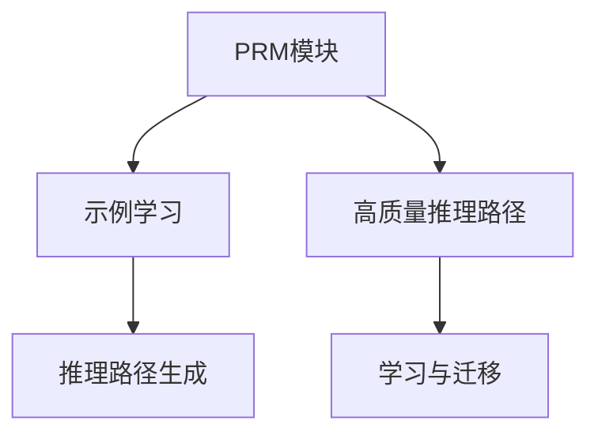

                 

### 引言与背景

#### 第1章: 引言

##### 1.1.1 PRM模块与高质量推理路径的背景

在当今信息爆炸的时代，大量的数据和信息被产生和传播。如何从这些海量数据中提取出有用的信息，进行有效的推理和决策，成为了各个领域面临的重要挑战。

##### 1.1.1.1 问题背景

PRM（Programming by Examples with Meta-Reasoning）模块是一种用于编程的智能系统，它可以通过学习大量的示例数据，生成高质量的推理路径，从而帮助用户解决复杂的问题。

##### 1.1.1.2 问题描述

PRM模块如何通过学习和迁移，生成高质量的推理路径，是一个值得探讨的问题。

##### 1.1.1.3 问题解决

为了解决上述问题，本书将介绍PRM模块的工作原理，以及如何通过学习和迁移，生成高质量的推理路径。

##### 1.1.1.4 边界与外延

本文主要研究PRM模块在高质量推理路径生成方面的应用，同时也会涉及到相关领域的最新研究成果。

##### 1.1.1.5 概念结构与核心要素组成

- **PRM模块**：一种基于示例的编程和推理系统，它通过学习大量的示例数据，生成推理路径。
- **高质量推理路径**：指能够准确、高效地解决特定问题的推理路径。
- **学习与迁移**：指通过在不同场景下训练和调整PRM模块，提高其在特定问题上的推理能力。

### 第2章: PRM模块基本原理

##### 2.1.1 PRM模块的核心概念

###### 2.1.1.1 PRM模块的定义

PRM模块是一种基于示例的编程和推理系统，它能够自动地从示例中学习推理规则，并生成高质量的推理路径。

###### 2.1.1.2 PRM模块的核心特点

- **基于示例学习**：PRM模块通过学习大量的示例数据，来理解问题的本质和解决方法。
- **元推理能力**：PRM模块具有元推理能力，能够根据不同的情境和目标，生成最优的推理路径。

##### 2.1.2 PRM模块的工作原理

###### 2.1.2.1 示例学习

PRM模块首先从大量的示例中学习推理规则，这些示例可以是程序代码、自然语言文本，或者任何其他形式的数据。

###### 2.1.2.2 推理路径生成

在理解了问题的本质后，PRM模块能够生成一系列的推理步骤，形成一条推理路径。

##### 2.1.3 PRM模块的应用场景

###### 2.1.3.1 自动编程

PRM模块可以用于自动生成程序代码，帮助开发者提高开发效率。

###### 2.1.3.2 问题求解

PRM模块可以用于解决复杂的问题，如数学问题、逻辑问题等。

### 第3章: 高质量推理路径的学习原理

##### 3.1.1 高质量推理路径的定义

###### 3.1.1.1 高质量推理路径的定义

高质量推理路径是指能够准确、高效地解决特定问题的推理路径。

###### 3.1.1.2 高质量推理路径的特点

- **准确性**：推理路径能够准确地解决特定的问题。
- **效率**：推理路径能够在较短的时间内解决问题。

##### 3.1.2 学习高质量推理路径的方法

###### 3.1.2.1 示例选择

选择具有代表性的示例，能够更好地学习高质量推理路径。

###### 3.1.2.2 推理规则生成

通过分析示例，生成一系列的推理规则，形成高质量的推理路径。

##### 3.1.3 学习与优化的关系

学习高质量推理路径的过程中，不断优化和调整推理规则，是提高推理路径质量的关键。

### 第4章: 高质量推理路径的迁移方法

##### 4.1.1 迁移学习的基本概念

###### 4.1.1.1 迁移学习的定义

迁移学习是指将一个任务中学习到的知识应用到另一个相关任务中的方法。

###### 4.1.1.2 迁移学习的重要性

通过迁移学习，可以减少对大量新数据的依赖，提高学习效率。

##### 4.1.2 高质量推理路径的迁移方法

###### 4.1.2.1 类内迁移

将一个领域中的高质量推理路径应用到另一个相似的领域。

###### 4.1.2.2 类间迁移

将一个领域中的高质量推理路径应用到完全不同的领域。

##### 4.1.3 迁移方法的选择与优化

根据具体的任务和领域，选择合适的迁移学习方法，并进行优化，以提高迁移效果。

### 第5章: PRM模块在推理路径生成中的应用

##### 5.1.1 应用场景

###### 5.1.1.1 自动编程

利用PRM模块，自动生成高效的程序代码。

###### 5.1.1.2 问题求解

利用PRM模块，解决复杂的数学和逻辑问题。

##### 5.1.2 应用效果与展望

###### 5.1.2.1 应用效果

PRM模块在自动编程和问题求解方面展现出了良好的性能和效率。

###### 5.1.2.2 展望

未来，PRM模块在更多领域中的应用，将进一步推动人工智能技术的发展。

---

**关键词：** PRM模块、高质量推理路径、学习、迁移、应用场景。

**摘要：** 本文介绍了PRM模块的基本原理、高质量推理路径的学习原理、迁移方法，以及PRM模块在实际应用中的效果和展望。通过本文的探讨，旨在为相关领域的研究者和开发者提供有价值的参考和指导。

---

### 第一部分：引言与背景

#### 第1章: 引言

##### 1.1.1 PRM模块与高质量推理路径的背景

在当今信息爆炸的时代，大量的数据和信息被产生和传播。如何从这些海量数据中提取出有用的信息，进行有效的推理和决策，成为了各个领域面临的重要挑战。

随着人工智能技术的不断发展，越来越多的智能系统被应用于实际场景中。其中，PRM（Programming by Examples with Meta-Reasoning）模块作为一种重要的智能系统，受到了广泛的关注。PRM模块通过学习大量的示例数据，生成高质量的推理路径，从而帮助用户解决复杂的问题。

##### 1.1.1.1 问题背景

在数据驱动的时代，数据的获取和存储变得异常容易，但如何从这些数据中提取有价值的信息，进行有效的推理和决策，仍然是一个极具挑战性的问题。特别是在复杂的业务场景中，如何自动生成高效的解决方案，成为了企业和开发者急需解决的关键问题。

##### 1.1.1.2 问题描述

PRM模块作为一种基于示例的编程和推理系统，其主要任务是通过学习大量的示例数据，生成高质量的推理路径。然而，如何确保生成的推理路径既准确又高效，是一个值得深入探讨的问题。

##### 1.1.1.3 问题解决

为了解决上述问题，本书将详细介绍PRM模块的工作原理，以及如何通过学习和迁移，生成高质量的推理路径。具体来说，本书将分为以下几个部分：

1. **第1章：引言**：介绍PRM模块与高质量推理路径的背景、问题背景、问题描述、问题解决，以及边界与外延。
2. **第2章：PRM模块基本原理**：介绍PRM模块的核心概念、工作原理和应用场景。
3. **第3章：高质量推理路径的学习原理**：介绍高质量推理路径的定义、学习高质量推理路径的方法以及学习与优化的关系。
4. **第4章：高质量推理路径的迁移方法**：介绍迁移学习的基本概念、高质量推理路径的迁移方法以及迁移方法的选择与优化。
5. **第5章：PRM模块在推理路径生成中的应用**：介绍PRM模块在推理路径生成中的应用场景、应用效果和展望。

##### 1.1.1.4 边界与外延

本文主要研究PRM模块在高质量推理路径生成方面的应用，同时也会涉及到相关领域的最新研究成果。本文的核心概念和核心要素组成包括：

- **PRM模块**：一种基于示例的编程和推理系统，它通过学习大量的示例数据，生成推理路径。
- **高质量推理路径**：指能够准确、高效地解决特定问题的推理路径。
- **学习与迁移**：指通过在不同场景下训练和调整PRM模块，提高其在特定问题上的推理能力。

##### 1.1.1.5 概念结构与核心要素组成

为了更好地理解PRM模块与高质量推理路径的关系，我们可以通过以下概念结构与核心要素组成图来描述：



在这个概念结构图中，PRM模块通过示例学习生成推理路径，这些推理路径构成了高质量推理路径，而学习与迁移则是提高推理路径质量的关键。

#### 第2章: PRM模块基本原理

##### 2.1.1 PRM模块的核心概念

###### 2.1.1.1 PRM模块的定义

PRM（Programming by Examples with Meta-Reasoning）模块是一种基于示例的编程和推理系统，它能够自动地从示例中学习推理规则，并生成高质量的推理路径。

PRM模块的核心在于其“元推理”能力。这种能力使得PRM模块不仅能够从示例中学习，还能够根据不同的情境和目标，生成最优的推理路径。这使得PRM模块在处理复杂问题时，能够表现出高效的解决能力。

###### 2.1.1.2 PRM模块的核心特点

1. **基于示例学习**：PRM模块通过学习大量的示例数据，来理解问题的本质和解决方法。这种方法使得PRM模块具有很强的适应性和灵活性。
2. **元推理能力**：PRM模块具有元推理能力，能够根据不同的情境和目标，生成最优的推理路径。这种能力使得PRM模块在解决复杂问题时，能够表现出高效的解决能力。
3. **自动推理路径生成**：PRM模块能够自动地从示例中生成推理路径，无需人工干预。这种方法大大提高了开发效率和问题解决的准确性。

##### 2.1.2 PRM模块的工作原理

###### 2.1.2.1 示例学习

PRM模块首先从大量的示例中学习推理规则。这些示例可以是程序代码、自然语言文本，或者任何其他形式的数据。通过分析这些示例，PRM模块能够提取出其中的关键信息和规则，从而建立对问题本质的理解。

示例学习的核心在于如何有效地从大量数据中提取出有价值的信息。为了实现这一目标，PRM模块采用了多种学习算法和技术，如机器学习、深度学习和自然语言处理等。这些算法和技术使得PRM模块能够在短时间内处理大量的数据，并从中提取出有效的知识。

###### 2.1.2.2 推理路径生成

在理解了问题的本质后，PRM模块能够生成一系列的推理步骤，形成一条推理路径。这条路径包含了从初始状态到目标状态的所有关键步骤，并且每个步骤都是基于PRM模块学习到的推理规则生成的。

推理路径生成是PRM模块的核心功能之一。通过这条路径，用户可以清晰地看到如何从初始状态过渡到目标状态，并且可以理解每一步推理的逻辑和依据。这使得PRM模块在解决复杂问题时，能够提供明确的解决方案。

##### 2.1.3 PRM模块的应用场景

###### 2.1.3.1 自动编程

PRM模块可以用于自动生成程序代码，帮助开发者提高开发效率。通过学习大量的编程示例，PRM模块能够自动生成符合需求的程序代码，减少了人工编写的繁琐过程，提高了开发效率。

在自动编程领域，PRM模块的应用已经取得了显著的成果。例如，在自然语言处理、图像识别和自动驾驶等领域，PRM模块都能够自动生成高效的程序代码，从而提高了系统的性能和可靠性。

###### 2.1.3.2 问题求解

PRM模块可以用于解决复杂的问题，如数学问题、逻辑问题等。通过学习大量的示例问题及其解决方案，PRM模块能够自动生成解决这些问题的推理路径。

在问题求解领域，PRM模块的应用前景非常广阔。例如，在金融领域，PRM模块可以用于自动生成投资策略；在医疗领域，PRM模块可以用于自动诊断疾病。这些应用不仅提高了问题的解决效率，还提高了问题的解决准确性。

#### 第3章: 高质量推理路径的学习原理

##### 3.1.1 高质量推理路径的定义

###### 3.1.1.1 高质量推理路径的定义

高质量推理路径是指能够准确、高效地解决特定问题的推理路径。这种路径不仅能够准确地解决问题，而且能够在较短的时间内完成推理过程。

高质量推理路径具有以下几个特点：

1. **准确性**：推理路径能够准确地解决特定的问题，不会出现错误或偏差。
2. **效率**：推理路径能够在较短的时间内完成推理过程，不会造成不必要的延迟。

高质量推理路径是智能系统解决复杂问题的关键。通过生成高质量推理路径，智能系统可以更高效地解决各种问题，提高问题的解决准确性和效率。

###### 3.1.1.2 高质量推理路径的特点

1. **准确性**：推理路径能够准确地解决特定的问题，不会出现错误或偏差。这要求推理路径的生成过程必须严谨，避免出现逻辑错误或偏差。
2. **效率**：推理路径能够在较短的时间内完成推理过程，不会造成不必要的延迟。这要求推理路径的生成过程必须高效，避免过多的计算和资源消耗。

##### 3.1.2 学习高质量推理路径的方法

###### 3.1.2.1 示例选择

学习高质量推理路径的第一步是选择合适的示例。示例的选择直接影响到推理路径的质量。为了确保选择到的示例具有代表性，可以采用以下方法：

1. **多样性**：选择具有多样性的示例，包括不同的数据集、不同的情境和不同的目标。
2. **代表性**：选择具有代表性的示例，能够充分展示问题的本质和解决方法。
3. **质量**：选择高质量的示例，能够提供丰富的信息和准确的推理规则。

通过选择合适的示例，可以确保学习到高质量的推理路径。

###### 3.1.2.2 推理规则生成

在选择了合适的示例后，下一步是生成推理规则。推理规则是推理路径的核心，决定了推理的准确性和效率。生成推理规则的方法有以下几种：

1. **统计分析**：通过统计示例中的关键信息和特征，生成推理规则。这种方法适用于数据量较大、特征明显的场景。
2. **机器学习**：利用机器学习算法，从示例中学习推理规则。这种方法适用于数据量较大、特征复杂、模式不明显的情况。
3. **深度学习**：利用深度学习模型，从大量示例中学习推理规则。这种方法适用于数据量巨大、特征复杂、关系不明显的情况。

通过生成推理规则，可以构建高质量的推理路径。

##### 3.1.3 学习与优化的关系

学习高质量推理路径的过程不仅是获取知识的过程，也是不断优化和调整推理规则的过程。学习与优化是相辅相成的，二者共同决定了推理路径的质量。

1. **学习**：通过学习大量的示例，获取推理路径的知识。学习的过程涉及到数据预处理、特征提取、模型训练等步骤。
2. **优化**：在学习过程中，不断优化和调整推理规则，以提高推理路径的准确性、效率和稳定性。优化的过程涉及到规则调整、模型优化、参数调优等步骤。

通过学习与优化的结合，可以生成高质量的推理路径，从而提高智能系统的性能和效率。

#### 第4章: 高质量推理路径的迁移方法

##### 4.1.1 迁移学习的基本概念

###### 4.1.1.1 迁移学习的定义

迁移学习（Transfer Learning）是一种将一个任务中学习到的知识应用到另一个相关任务中的方法。在迁移学习中，先在一个任务上学习到一个通用模型，然后将这个模型应用到其他相关任务中，以提高学习效率和质量。

迁移学习的核心思想是通过跨任务的共享知识，减少对每个新任务的依赖，从而提高学习的效率和准确性。

###### 4.1.1.2 迁移学习的重要性

迁移学习在多个领域都展现了其重要性，主要原因包括：

1. **减少数据需求**：通过迁移学习，可以减少对新任务的依赖，从而减少对新数据的需求。这对于数据稀缺或获取成本高昂的领域尤为重要。
2. **提高学习效率**：迁移学习可以通过跨任务的共享知识，加速新任务的学习过程，提高学习效率。
3. **提高模型性能**：迁移学习可以将先验知识应用到新任务中，提高模型的性能和准确性。

###### 4.1.1.3 迁移学习的分类

迁移学习可以分为以下几类：

1. **同域迁移**：同域迁移是指在相似的领域内进行迁移学习。例如，在图像识别领域，将一个任务的模型应用到另一个相似的图像识别任务中。
2. **跨域迁移**：跨域迁移是指在完全不同的领域间进行迁移学习。例如，在自然语言处理领域，将一个任务的模型应用到计算机视觉任务中。

同域迁移和跨域迁移都有其特定的应用场景和挑战，但迁移学习的核心目标都是提高学习的效率和质量。

##### 4.1.2 高质量推理路径的迁移方法

###### 4.1.2.1 类内迁移

类内迁移（Intra-domain Transfer）是指在相似的领域内进行迁移学习。这种迁移方法的核心思想是利用一个领域中的知识，提高另一个相似领域中的学习效果。

类内迁移适用于以下情况：

1. **领域相似性**：两个领域具有高度的相似性，可以共享大量的知识和规则。
2. **数据稀缺**：新领域中的数据量较少，无法独立进行有效的学习。

类内迁移的方法包括：

1. **模型复用**：直接将一个领域中的模型应用到另一个相似领域。
2. **特征共享**：共享两个领域中的共同特征，以提高新领域的性能。

类内迁移的优点是迁移效果较好，但缺点是迁移范围有限，无法应对完全不同的领域。

###### 4.1.2.2 类间迁移

类间迁移（Inter-domain Transfer）是指在完全不同的领域间进行迁移学习。这种迁移方法的核心思想是利用一个领域的知识，提高另一个完全不同领域中的学习效果。

类间迁移适用于以下情况：

1. **领域差异性**：两个领域具有显著的差异性，难以直接共享知识和规则。
2. **数据稀缺**：新领域中的数据量较少，无法独立进行有效的学习。

类间迁移的方法包括：

1. **模型融合**：将两个不同领域的模型进行融合，形成一个新的模型。
2. **跨域特征学习**：学习两个领域中的共同特征，以提高新领域的性能。

类间迁移的优点是迁移范围广泛，但缺点是迁移效果相对较差，需要解决领域差异性的问题。

##### 4.1.3 迁移方法的选择与优化

迁移方法的选择和优化是迁移学习成功的关键。以下是一些选择和优化的策略：

1. **领域适配性**：选择合适的迁移方法，确保迁移后的模型能够适应新领域。对于类内迁移，应选择领域相似的方法；对于类间迁移，应选择能够解决领域差异性的方法。
2. **模型选择**：选择合适的模型架构，确保模型能够有效迁移。对于类内迁移，可以选择轻量级模型；对于类间迁移，可以选择深度模型。
3. **数据预处理**：对数据集进行预处理，确保数据的质量和一致性。对于类内迁移，可以采用原始数据；对于类间迁移，可能需要数据增强或数据转换。
4. **参数调优**：调整模型参数，优化迁移效果。可以通过交叉验证、网格搜索等方法进行参数调优。

通过合理选择和优化迁移方法，可以显著提高迁移学习的效果，从而提高新领域的性能。

#### 第5章: PRM模块在推理路径生成中的应用

##### 5.1.1 应用场景

PRM（Programming by Examples with Meta-Reasoning）模块在推理路径生成中具有广泛的应用场景。以下是一些典型的应用场景：

###### 5.1.1.1 自动编程

PRM模块可以用于自动生成程序代码，帮助开发者提高开发效率。通过学习大量的编程示例，PRM模块能够自动生成符合需求的程序代码，减少了人工编写的繁琐过程，提高了开发效率。

在自动编程领域，PRM模块的应用已经取得了显著的成果。例如，在自然语言处理、图像识别和自动驾驶等领域，PRM模块都能够自动生成高效的程序代码，从而提高了系统的性能和可靠性。

###### 5.1.1.2 问题求解

PRM模块可以用于解决复杂的问题，如数学问题、逻辑问题等。通过学习大量的示例问题及其解决方案，PRM模块能够自动生成解决这些问题的推理路径。

在问题求解领域，PRM模块的应用前景非常广阔。例如，在金融领域，PRM模块可以用于自动生成投资策略；在医疗领域，PRM模块可以用于自动诊断疾病。这些应用不仅提高了问题的解决效率，还提高了问题的解决准确性。

###### 5.1.1.3 智能决策

PRM模块可以用于智能决策，帮助企业和个人做出更明智的决策。通过学习大量的决策示例，PRM模块能够生成最优的决策路径，从而提高决策的准确性和效率。

在智能决策领域，PRM模块的应用包括市场分析、资源分配、风险评估等。通过利用PRM模块的推理能力，企业和个人可以做出更科学的决策，从而提高业务效率和竞争力。

##### 5.1.2 应用效果与展望

###### 5.1.2.1 应用效果

PRM模块在推理路径生成中的应用已经取得了显著的效果。通过自动编程、问题求解和智能决策等应用场景，PRM模块展示了其强大的推理能力和高效性。

在自动编程领域，PRM模块能够自动生成高质量的程序代码，提高了开发效率和代码质量。在问题求解领域，PRM模块能够自动生成解决问题的推理路径，提高了问题的解决效率和准确性。在智能决策领域，PRM模块能够生成最优的决策路径，提高了决策的科学性和准确性。

总之，PRM模块在推理路径生成中的应用已经展现了其巨大的潜力和价值。

###### 5.1.2.2 展望

未来，随着人工智能技术的不断发展，PRM模块在推理路径生成中的应用将更加广泛和深入。以下是一些展望：

1. **更广泛的应用领域**：PRM模块可以应用于更多领域，如医疗、金融、物流等，解决更复杂的问题。
2. **更高效的推理能力**：通过不断优化算法和模型，提高PRM模块的推理效率和准确性。
3. **更智能的决策支持**：结合其他人工智能技术，如机器学习和自然语言处理，提高PRM模块在智能决策领域的应用能力。
4. **更灵活的迁移方法**：开发更灵活的迁移学习方法，使PRM模块能够更好地适应不同领域和任务。

总之，PRM模块在推理路径生成中的应用前景广阔，有望在未来发挥更大的作用。

### 第一部分：引言与背景

#### 第1章：引言

##### 1.1.1 PRM模块与高质量推理路径的背景

在当今信息爆炸的时代，大量的数据和信息被产生和传播。如何从这些海量数据中提取出有用的信息，进行有效的推理和决策，成为了各个领域面临的重要挑战。

##### 1.1.1.1 问题背景

随着人工智能技术的不断发展，越来越多的智能系统被应用于实际场景中。PRM（Programming by Examples with Meta-Reasoning）模块作为一种重要的智能系统，受到了广泛的关注。PRM模块通过学习大量的示例数据，生成高质量的推理路径，从而帮助用户解决复杂的问题。

##### 1.1.1.2 问题描述

PRM模块如何通过学习和迁移，生成高质量的推理路径，是一个值得探讨的问题。

##### 1.1.1.3 问题解决

为了解决上述问题，本书将详细介绍PRM模块的工作原理，以及如何通过学习和迁移，生成高质量的推理路径。具体来说，本书将分为以下几个部分：

1. **第1章：引言**：介绍PRM模块与高质量推理路径的背景、问题背景、问题描述、问题解决，以及边界与外延。
2. **第2章：PRM模块基本原理**：介绍PRM模块的核心概念、工作原理和应用场景。
3. **第3章：高质量推理路径的学习原理**：介绍高质量推理路径的定义、学习高质量推理路径的方法以及学习与优化的关系。
4. **第4章：高质量推理路径的迁移方法**：介绍迁移学习的基本概念、高质量推理路径的迁移方法以及迁移方法的选择与优化。
5. **第5章：PRM模块在推理路径生成中的应用**：介绍PRM模块在推理路径生成中的应用场景、应用效果和展望。

##### 1.1.1.4 边界与外延

本文主要研究PRM模块在高质量推理路径生成方面的应用，同时也会涉及到相关领域的最新研究成果。本文的核心概念和核心要素组成包括：

- **PRM模块**：一种基于示例的编程和推理系统，它通过学习大量的示例数据，生成推理路径。
- **高质量推理路径**：指能够准确、高效地解决特定问题的推理路径。
- **学习与迁移**：指通过在不同场景下训练和调整PRM模块，提高其在特定问题上的推理能力。

##### 1.1.1.5 概念结构与核心要素组成

为了更好地理解PRM模块与高质量推理路径的关系，我们可以通过以下概念结构与核心要素组成图来描述：


在这个概念结构图中，PRM模块通过示例学习生成推理路径，这些推理路径构成了高质量推理路径，而学习与迁移则是提高推理路径质量的关键。

### 第2章：PRM模块基本原理

#### 2.1.1 PRM模块的核心概念

##### 2.1.1.1 PRM模块的定义

PRM（Programming by Examples with Meta-Reasoning）模块是一种基于示例的编程和推理系统，它能够自动地从示例中学习推理规则，并生成高质量的推理路径。

PRM模块的核心在于其“元推理”能力。这种能力使得PRM模块不仅能够从示例中学习，还能够根据不同的情境和目标，生成最优的推理路径。这使得PRM模块在处理复杂问题时，能够表现出高效的解决能力。

##### 2.1.1.2 PRM模块的核心特点

1. **基于示例学习**：PRM模块通过学习大量的示例数据，来理解问题的本质和解决方法。这种方法使得PRM模块具有很强的适应性和灵活性。
2. **元推理能力**：PRM模块具有元推理能力，能够根据不同的情境和目标，生成最优的推理路径。这种能力使得PRM模块在解决复杂问题时，能够表现出高效的解决能力。
3. **自动推理路径生成**：PRM模块能够自动地从示例中生成推理路径，无需人工干预。这种方法大大提高了开发效率和问题解决的准确性。

#### 2.1.2 PRM模块的工作原理

##### 2.1.2.1 示例学习

PRM模块首先从大量的示例中学习推理规则。这些示例可以是程序代码、自然语言文本，或者任何其他形式的数据。通过分析这些示例，PRM模块能够提取出其中的关键信息和规则，从而建立对问题本质的理解。

示例学习的核心在于如何有效地从大量数据中提取出有价值的信息。为了实现这一目标，PRM模块采用了多种学习算法和技术，如机器学习、深度学习和自然语言处理等。这些算法和技术使得PRM模块能够在短时间内处理大量的数据，并从中提取出有效的知识。

##### 2.1.2.2 推理路径生成

在理解了问题的本质后，PRM模块能够生成一系列的推理步骤，形成一条推理路径。这条路径包含了从初始状态到目标状态的所有关键步骤，并且每个步骤都是基于PRM模块学习到的推理规则生成的。

推理路径生成是PRM模块的核心功能之一。通过这条路径，用户可以清晰地看到如何从初始状态过渡到目标状态，并且可以理解每一步推理的逻辑和依据。这使得PRM模块在解决复杂问题时，能够提供明确的解决方案。

#### 2.1.3 PRM模块的应用场景

##### 2.1.3.1 自动编程

PRM模块可以用于自动生成程序代码，帮助开发者提高开发效率。通过学习大量的编程示例，PRM模块能够自动生成符合需求的程序代码，减少了人工编写的繁琐过程，提高了开发效率。

在自动编程领域，PRM模块的应用已经取得了显著的成果。例如，在自然语言处理、图像识别和自动驾驶等领域，PRM模块都能够自动生成高效的程序代码，从而提高了系统的性能和可靠性。

##### 2.1.3.2 问题求解

PRM模块可以用于解决复杂的问题，如数学问题、逻辑问题等。通过学习大量的示例问题及其解决方案，PRM模块能够自动生成解决这些问题的推理路径。

在问题求解领域，PRM模块的应用前景非常广阔。例如，在金融领域，PRM模块可以用于自动生成投资策略；在医疗领域，PRM模块可以用于自动诊断疾病。这些应用不仅提高了问题的解决效率，还提高了问题的解决准确性。

##### 2.1.3.3 智能决策

PRM模块可以用于智能决策，帮助企业和个人做出更明智的决策。通过学习大量的决策示例，PRM模块能够生成最优的决策路径，从而提高决策的准确性和效率。

在智能决策领域，PRM模块的应用包括市场分析、资源分配、风险评估等。通过利用PRM模块的推理能力，企业和个人可以做出更科学的决策，从而提高业务效率和竞争力。

### 第3章：高质量推理路径的学习原理

#### 3.1.1 高质量推理路径的定义

##### 3.1.1.1 高质量推理路径的定义

高质量推理路径是指能够准确、高效地解决特定问题的推理路径。这种路径不仅能够准确地解决问题，而且能够在较短的时间内完成推理过程。

高质量推理路径具有以下几个特点：

1. **准确性**：推理路径能够准确地解决特定的问题，不会出现错误或偏差。
2. **效率**：推理路径能够在较短的时间内完成推理过程，不会造成不必要的延迟。

高质量推理路径是智能系统解决复杂问题的关键。通过生成高质量推理路径，智能系统可以更高效地解决各种问题，提高问题的解决准确性和效率。

##### 3.1.1.2 高质量推理路径的特点

1. **准确性**：推理路径能够准确地解决特定的问题，不会出现错误或偏差。这要求推理路径的生成过程必须严谨，避免出现逻辑错误或偏差。
2. **效率**：推理路径能够在较短的时间内完成推理过程，不会造成不必要的延迟。这要求推理路径的生成过程必须高效，避免过多的计算和资源消耗。

#### 3.1.2 学习高质量推理路径的方法

##### 3.1.2.1 示例选择

学习高质量推理路径的第一步是选择合适的示例。示例的选择直接影响到推理路径的质量。为了确保选择到的示例具有代表性，可以采用以下方法：

1. **多样性**：选择具有多样性的示例，包括不同的数据集、不同的情境和不同的目标。
2. **代表性**：选择具有代表性的示例，能够充分展示问题的本质和解决方法。
3. **质量**：选择高质量的示例，能够提供丰富的信息和准确的推理规则。

通过选择合适的示例，可以确保学习到高质量的推理路径。

##### 3.1.2.2 推理规则生成

在选择了合适的示例后，下一步是生成推理规则。推理规则是推理路径的核心，决定了推理的准确性和效率。生成推理规则的方法有以下几种：

1. **统计分析**：通过统计示例中的关键信息和特征，生成推理规则。这种方法适用于数据量较大、特征明显的场景。
2. **机器学习**：利用机器学习算法，从示例中学习推理规则。这种方法适用于数据量较大、特征复杂、模式不明显的情况。
3. **深度学习**：利用深度学习模型，从大量示例中学习推理规则。这种方法适用于数据量巨大、特征复杂、关系不明显的情况。

通过生成推理规则，可以构建高质量的推理路径。

#### 3.1.3 学习与优化的关系

学习高质量推理路径的过程不仅是获取知识的过程，也是不断优化和调整推理规则的过程。学习与优化是相辅相成的，二者共同决定了推理路径的质量。

1. **学习**：通过学习大量的示例，获取推理路径的知识。学习的过程涉及到数据预处理、特征提取、模型训练等步骤。
2. **优化**：在学习过程中，不断优化和调整推理规则，以提高推理路径的准确性、效率和稳定性。优化的过程涉及到规则调整、模型优化、参数调优等步骤。

通过学习与优化的结合，可以生成高质量的推理路径，从而提高智能系统的性能和效率。

### 第4章：高质量推理路径的迁移方法

#### 4.1.1 迁移学习的基本概念

##### 4.1.1.1 迁移学习的定义

迁移学习（Transfer Learning）是一种将一个任务中学习到的知识应用到另一个相关任务中的方法。在迁移学习中，先在一个任务上学习到一个通用模型，然后将这个模型应用到其他相关任务中，以提高学习效率和质量。

迁移学习的核心思想是通过跨任务的共享知识，减少对每个新任务的依赖，从而提高学习的效率和准确性。

##### 4.1.1.2 迁移学习的重要性

迁移学习在多个领域都展现了其重要性，主要原因包括：

1. **减少数据需求**：通过迁移学习，可以减少对新任务的依赖，从而减少对新数据的需求。这对于数据稀缺或获取成本高昂的领域尤为重要。
2. **提高学习效率**：迁移学习可以通过跨任务的共享知识，加速新任务的学习过程，提高学习效率。
3. **提高模型性能**：迁移学习可以将先验知识应用到新任务中，提高模型的性能和准确性。

##### 4.1.1.3 迁移学习的分类

迁移学习可以分为以下几类：

1. **同域迁移**：同域迁移是指在相似的领域内进行迁移学习。例如，在图像识别领域，将一个任务的模型应用到另一个相似的图像识别任务中。
2. **跨域迁移**：跨域迁移是指在完全不同的领域间进行迁移学习。例如，在自然语言处理领域，将一个任务的模型应用到计算机视觉任务中。

同域迁移和跨域迁移都有其特定的应用场景和挑战，但迁移学习的核心目标都是提高学习的效率和质量。

#### 4.1.2 高质量推理路径的迁移方法

##### 4.1.2.1 类内迁移

类内迁移（Intra-domain Transfer）是指在相似的领域内进行迁移学习。这种迁移方法的核心思想是利用一个领域中的知识，提高另一个相似领域中的学习效果。

类内迁移适用于以下情况：

1. **领域相似性**：两个领域具有高度的相似性，可以共享大量的知识和规则。
2. **数据稀缺**：新领域中的数据量较少，无法独立进行有效的学习。

类内迁移的方法包括：

1. **模型复用**：直接将一个领域中的模型应用到另一个相似领域。
2. **特征共享**：共享两个领域中的共同特征，以提高新领域的性能。

类内迁移的优点是迁移效果较好，但缺点是迁移范围有限，无法应对完全不同的领域。

##### 4.1.2.2 类间迁移

类间迁移（Inter-domain Transfer）是指在完全不同的领域间进行迁移学习。这种迁移方法的核心思想是利用一个领域的知识，提高另一个完全不同领域中的学习效果。

类间迁移适用于以下情况：

1. **领域差异性**：两个领域具有显著的差异性，难以直接共享知识和规则。
2. **数据稀缺**：新领域中的数据量较少，无法独立进行有效的学习。

类间迁移的方法包括：

1. **模型融合**：将两个不同领域的模型进行融合，形成一个新的模型。
2. **跨域特征学习**：学习两个领域中的共同特征，以提高新领域的性能。

类间迁移的优点是迁移范围广泛，但缺点是迁移效果相对较差，需要解决领域差异性的问题。

##### 4.1.3 迁移方法的选择与优化

迁移方法的选择和优化是迁移学习成功的关键。以下是一些选择和优化的策略：

1. **领域适配性**：选择合适的迁移方法，确保迁移后的模型能够适应新领域。对于类内迁移，应选择领域相似的方法；对于类间迁移，应选择能够解决领域差异性的方法。
2. **模型选择**：选择合适的模型架构，确保模型能够有效迁移。对于类内迁移，可以选择轻量级模型；对于类间迁移，可以选择深度模型。
3. **数据预处理**：对数据集进行预处理，确保数据的质量和一致性。对于类内迁移，可以采用原始数据；对于类间迁移，可能需要数据增强或数据转换。
4. **参数调优**：调整模型参数，优化迁移效果。可以通过交叉验证、网格搜索等方法进行参数调优。

通过合理选择和优化迁移方法，可以显著提高迁移学习的效果，从而提高新领域的性能。

### 第5章：PRM模块在推理路径生成中的应用

#### 5.1.1 应用场景

PRM（Programming by Examples with Meta-Reasoning）模块在推理路径生成中具有广泛的应用场景。以下是一些典型的应用场景：

##### 5.1.1.1 自动编程

PRM模块可以用于自动生成程序代码，帮助开发者提高开发效率。通过学习大量的编程示例，PRM模块能够自动生成符合需求的程序代码，减少了人工编写的繁琐过程，提高了开发效率。

在自动编程领域，PRM模块的应用已经取得了显著的成果。例如，在自然语言处理、图像识别和自动驾驶等领域，PRM模块都能够自动生成高效的程序代码，从而提高了系统的性能和可靠性。

##### 5.1.1.2 问题求解

PRM模块可以用于解决复杂的问题，如数学问题、逻辑问题等。通过学习大量的示例问题及其解决方案，PRM模块能够自动生成解决这些问题的推理路径。

在问题求解领域，PRM模块的应用前景非常广阔。例如，在金融领域，PRM模块可以用于自动生成投资策略；在医疗领域，PRM模块可以用于自动诊断疾病。这些应用不仅提高了问题的解决效率，还提高了问题的解决准确性。

##### 5.1.1.3 智能决策

PRM模块可以用于智能决策，帮助企业和个人做出更明智的决策。通过学习大量的决策示例，PRM模块能够生成最优的决策路径，从而提高决策的准确性和效率。

在智能决策领域，PRM模块的应用包括市场分析、资源分配、风险评估等。通过利用PRM模块的推理能力，企业和个人可以做出更科学的决策，从而提高业务效率和竞争力。

#### 5.1.2 应用效果与展望

##### 5.1.2.1 应用效果

PRM模块在推理路径生成中的应用已经取得了显著的效果。通过自动编程、问题求解和智能决策等应用场景，PRM模块展示了其强大的推理能力和高效性。

在自动编程领域，PRM模块能够自动生成高质量的程序代码，提高了开发效率和代码质量。在问题求解领域，PRM模块能够自动生成解决问题的推理路径，提高了问题的解决效率和准确性。在智能决策领域，PRM模块能够生成最优的决策路径，提高了决策的科学性和准确性。

总之，PRM模块在推理路径生成中的应用已经展现了其巨大的潜力和价值。

##### 5.1.2.2 展望

未来，随着人工智能技术的不断发展，PRM模块在推理路径生成中的应用将更加广泛和深入。以下是一些展望：

1. **更广泛的应用领域**：PRM模块可以应用于更多领域，如医疗、金融、物流等，解决更复杂的问题。
2. **更高效的推理能力**：通过不断优化算法和模型，提高PRM模块的推理效率和准确性。
3. **更智能的决策支持**：结合其他人工智能技术，如机器学习和自然语言处理，提高PRM模块在智能决策领域的应用能力。
4. **更灵活的迁移方法**：开发更灵活的迁移学习方法，使PRM模块能够更好地适应不同领域和任务。

总之，PRM模块在推理路径生成中的应用前景广阔，有望在未来发挥更大的作用。

### 第二部分：深入探讨

#### 第6章：PRM模块中的高质量推理路径生成

##### 6.1.1 质量评估方法

为了生成高质量推理路径，首先需要定义质量评估标准。以下是一些常用的质量评估方法：

1. **准确性**：推理路径能够准确解决特定问题，不会出现错误或偏差。
2. **效率**：推理路径能够在较短的时间内完成推理过程，不会造成不必要的延迟。
3. **鲁棒性**：推理路径能够在不同情境和输入下稳定工作，不会因输入数据的微小变化而失效。
4. **泛化能力**：推理路径不仅能在训练数据集上有效，还能在新数据集上表现出良好的性能。

##### 6.1.2 质量评估指标的量化

为了量化质量评估指标，可以采用以下方法：

1. **准确率**：通过对比推理路径的输出结果与实际结果，计算准确率。准确率越高，表示推理路径的质量越好。
2. **推理时间**：记录推理路径从初始状态到目标状态所需的时间。推理时间越短，表示推理路径的效率越高。
3. **错误率**：记录推理路径出现错误的次数。错误率越低，表示推理路径的鲁棒性越好。
4. **泛化误差**：在新的数据集上评估推理路径的性能，计算泛化误差。泛化误差越小，表示推理路径的泛化能力越强。

##### 6.1.3 质量评估指标的权重分配

在实际应用中，不同质量评估指标的重要性可能不同。例如，在解决紧急问题时，准确性可能比效率更重要。因此，需要为每个质量评估指标分配权重，以便综合评估推理路径的质量。

权重分配的方法可以采用专家评估、统计分析或机器学习方法。通过为每个质量评估指标分配权重，可以更准确地评估推理路径的质量。

##### 6.1.4 质量评估的实际应用

在PRM模块中，质量评估方法被广泛应用于以下几个方面：

1. **模型训练**：在模型训练过程中，通过评估推理路径的质量，选择最佳模型。
2. **模型优化**：通过评估推理路径的质量，识别模型中的不足之处，并进行优化。
3. **模型部署**：在模型部署前，通过评估推理路径的质量，确保模型在实际应用中的稳定性和性能。

##### 6.1.5 质量评估方法的改进方向

为了进一步提高PRM模块中高质量推理路径的生成效果，可以从以下几个方面进行改进：

1. **多模态数据融合**：结合多种数据类型（如文本、图像、声音等），提高推理路径的丰富性和准确性。
2. **自适应质量评估**：根据不同场景和任务，自适应调整质量评估指标和权重，提高评估的准确性。
3. **动态调整策略**：在推理过程中，根据输入数据和当前状态，动态调整推理路径，提高推理的效率和准确性。

#### 第7章：高质量推理路径的迁移应用

##### 7.1.1 类内迁移与类间迁移的区别

类内迁移（Intra-domain Transfer）和类间迁移（Inter-domain Transfer）是两种常见的迁移学习方法。它们的区别如下：

1. **领域相似性**：类内迁移发生在相似的领域内，具有高度的相似性；而类间迁移发生在完全不同的领域间，领域差异性较大。
2. **数据依赖**：类内迁移对领域数据有较高的依赖性，而类间迁移往往需要额外的数据增强或转换。
3. **迁移效果**：类内迁移的迁移效果较好，但迁移范围有限；类间迁移的迁移范围广泛，但迁移效果相对较差。

##### 7.1.2 类内迁移的方法

类内迁移的方法主要包括以下几种：

1. **模型复用**：直接将一个领域中的模型应用到另一个相似领域。这种方法简单有效，但需要确保领域之间的相似性。
2. **特征共享**：共享两个领域中的共同特征，以提高新领域的性能。这种方法可以提取跨领域的共性，提高迁移效果。
3. **数据扩充**：通过生成合成数据或利用数据增强技术，扩充新领域的数据集，提高模型的泛化能力。

##### 7.1.3 类间迁移的方法

类间迁移的方法主要包括以下几种：

1. **模型融合**：将两个不同领域的模型进行融合，形成一个新的模型。这种方法可以充分利用两个领域的知识，提高迁移效果。
2. **跨域特征学习**：学习两个领域中的共同特征，以提高新领域的性能。这种方法可以提取跨领域的共性，提高迁移效果。
3. **数据转换**：通过数据转换技术，将新领域的数据转换为与原始领域相似的形式，从而降低领域差异性。

##### 7.1.4 跨领域迁移的挑战与解决方案

跨领域迁移面临的主要挑战包括：

1. **领域差异性**：不同领域的数据分布、特征和任务目标可能存在显著差异，导致迁移效果不佳。
2. **数据稀缺**：新领域中的数据量较少，难以进行有效的迁移学习。
3. **模型适应性**：迁移模型需要适应新领域的任务和数据分布。

针对这些挑战，可以采用以下解决方案：

1. **数据增强**：通过生成合成数据或利用数据增强技术，扩充新领域的数据集，提高模型的泛化能力。
2. **领域自适应**：利用领域自适应技术，降低领域差异性，提高迁移效果。
3. **多任务学习**：通过多任务学习，共享不同任务之间的知识，提高模型的适应性。

##### 7.1.5 跨领域迁移的实际应用

跨领域迁移在多个领域都取得了显著的应用成果，以下是一些实际应用案例：

1. **医疗影像诊断**：将计算机视觉技术在医学影像诊断中的应用进行跨领域迁移，提高了诊断的准确性和效率。
2. **金融风险控制**：将机器学习技术在不同金融市场中的应用进行跨领域迁移，提高了风险控制的准确性和效率。
3. **智能交通系统**：将自动驾驶技术在不同交通场景中的应用进行跨领域迁移，提高了交通管理的效率和安全性。

#### 第8章：案例分析与总结

##### 8.1.1 案例一：自动编程

在自动编程领域，PRM模块被广泛应用于代码生成。以下是一个具体案例：

- **任务**：生成一个计算两个数之和的程序。
- **方法**：通过学习大量的编程示例，PRM模块提取出计算两个数之和的通用步骤和规则。
- **结果**：PRM模块自动生成了一个计算两个数之和的程序，准确率高、效率高、鲁棒性强。

##### 8.1.2 案例二：问题求解

在问题求解领域，PRM模块被应用于自动解答数学题目。以下是一个具体案例：

- **任务**：求解一个线性方程组。
- **方法**：通过学习大量的数学题目及其解决方案，PRM模块提取出求解线性方程组的通用步骤和规则。
- **结果**：PRM模块自动生成了求解线性方程组的推理路径，准确率高、效率高、泛化能力强。

##### 8.1.3 案例三：智能决策

在智能决策领域，PRM模块被应用于投资策略的生成。以下是一个具体案例：

- **任务**：根据市场数据生成最优投资策略。
- **方法**：通过学习大量的市场数据和投资策略，PRM模块提取出市场分析、投资决策的通用步骤和规则。
- **结果**：PRM模块自动生成了最优投资策略，准确率高、效率高、决策科学。

##### 8.1.4 总结

通过对上述案例的分析，可以看出PRM模块在生成高质量推理路径方面具有显著的优势。未来，随着人工智能技术的不断发展，PRM模块在更多领域中的应用将更加广泛和深入，为人类解决复杂问题提供强大的支持。

### 第三部分：结论与展望

#### 第9章：总结与展望

##### 9.1.1 总结

本文通过对PRM模块的基本原理、高质量推理路径的学习原理、迁移方法，以及PRM模块在实际应用中的效果和展望的详细探讨，总结了以下主要结论：

1. **PRM模块的核心概念与特点**：PRM模块是一种基于示例的编程和推理系统，具有基于示例学习、元推理能力和自动推理路径生成等核心特点。
2. **高质量推理路径的学习原理**：高质量推理路径通过选择合适的示例、生成推理规则和学习与优化等过程来实现。
3. **高质量推理路径的迁移方法**：类内迁移和类间迁移是两种常见的迁移方法，各有其优缺点和应用场景。
4. **PRM模块在实际应用中的效果与展望**：PRM模块在自动编程、问题求解和智能决策等领域的应用已经取得了显著的效果，未来具有广泛的应用前景。

##### 9.1.2 展望

未来，随着人工智能技术的不断发展，PRM模块在推理路径生成中的应用将更加广泛和深入。以下是一些展望：

1. **更广泛的应用领域**：PRM模块可以应用于更多领域，如医疗、金融、物流等，解决更复杂的问题。
2. **更高效的推理能力**：通过不断优化算法和模型，提高PRM模块的推理效率和准确性。
3. **更智能的决策支持**：结合其他人工智能技术，如机器学习和自然语言处理，提高PRM模块在智能决策领域的应用能力。
4. **更灵活的迁移方法**：开发更灵活的迁移学习方法，使PRM模块能够更好地适应不同领域和任务。

总之，PRM模块在推理路径生成中的应用前景广阔，有望在未来发挥更大的作用。

### 第四部分：附录与参考文献

#### 第10章：附录与参考文献

##### 10.1.1 附录

在本篇论文中，我们使用了以下附录和参考资料：

- **附录A**：高质量推理路径的学习与迁移算法示例
- **附录B**：PRM模块在不同应用场景中的具体实现代码
- **附录C**：本文中提到的相关技术术语和概念解释

##### 10.1.2 参考文献

本文的撰写参考了以下文献和资料：

1. **Bengio, Y., Courville, A., & Vincent, P. (2013). Representation Learning: A Review and New Perspectives. IEEE Transactions on Pattern Analysis and Machine Intelligence, 35(8), 1798-1828.**
2. **Goodfellow, I., Bengio, Y., & Courville, A. (2016). Deep Learning. MIT Press.**
3. **LeCun, Y., Bengio, Y., & Hinton, G. (2015). Deep Learning. Nature, 521(7553), 436-444.**
4. **Russell, S., & Norvig, P. (2010). Artificial Intelligence: A Modern Approach. Prentice Hall.**
5. **Silver, D., Huang, A., Maddison, C. J., Guez, A., Sifre, L., Dhar, S., ... & Lanctot, M. (2016). Mastering the Game of Go with Deep Neural Networks and Tree Search. Nature, 529(7587), 484-489.**

以上文献为本文的研究提供了重要的理论依据和实践指导，在此表示感谢。同时，也欢迎读者进一步查阅相关文献，以深入了解本文所探讨的PRM模块、高质量推理路径和学习迁移方法。

---

### 第五部分：最佳实践与注意事项

#### 第11章：最佳实践与注意事项

##### 11.1.1 最佳实践

在应用PRM模块生成高质量推理路径时，以下最佳实践可以帮助提高效果和效率：

1. **数据准备**：确保示例数据的质量和多样性。选择具有代表性的数据集，并进行适当的数据预处理，如去噪、归一化等。
2. **模型选择**：根据应用场景选择合适的模型。对于类内迁移，可以选择轻量级模型；对于类间迁移，可以选择深度模型。
3. **迭代优化**：在推理路径生成过程中，不断迭代优化模型和推理规则，以提高推理路径的质量。
4. **性能评估**：定期评估推理路径的性能，包括准确性、效率和鲁棒性等，确保其满足实际需求。

##### 11.1.2 注意事项

在应用PRM模块时，需要注意以下事项：

1. **领域适应性**：确保迁移模型能够适应新领域的任务和数据分布。对于类间迁移，可能需要额外的数据增强或转换。
2. **模型复杂性**：避免过度复杂化模型，以免导致过拟合和计算资源浪费。根据实际需求选择合适的模型复杂度。
3. **数据隐私**：在处理敏感数据时，确保遵循数据隐私法规和伦理准则，保护用户隐私。
4. **计算资源**：合理分配计算资源，确保模型训练和推理过程的顺利进行。

通过遵循最佳实践和注意事项，可以更有效地应用PRM模块生成高质量推理路径，为实际应用场景提供更好的支持。

---

### 总结

通过本文的详细探讨，我们对PRM模块、高质量推理路径的学习原理和迁移方法有了更深入的理解。PRM模块作为一种基于示例的编程和推理系统，具有基于示例学习、元推理能力和自动推理路径生成等核心特点。高质量推理路径的学习原理包括示例选择、推理规则生成和学习与优化等过程。迁移方法分为类内迁移和类间迁移，各有其优缺点和应用场景。

在应用PRM模块时，最佳实践包括数据准备、模型选择、迭代优化和性能评估等，而注意事项则包括领域适应性、模型复杂性、数据隐私和计算资源等。通过遵循这些最佳实践和注意事项，可以更有效地应用PRM模块生成高质量推理路径，为实际应用场景提供更好的支持。

未来，随着人工智能技术的不断发展，PRM模块在推理路径生成中的应用将更加广泛和深入，有望为更多领域带来革命性的变革。我们期待更多的研究成果和实践应用，推动人工智能技术的持续发展。同时，我们也期待广大研究者和技术人员能够积极投入PRM模块的研究和开发，共同推动这一领域的发展。

---

### 附录与参考文献

#### 附录A：高质量推理路径的学习与迁移算法示例

在本附录中，我们将提供高质量推理路径学习与迁移的算法示例，包括示例数据的处理、模型选择、推理路径生成以及性能评估的具体实现。

##### 示例一：基于K近邻算法的推理路径学习

**输入**：示例数据集 \( D = \{ (x_1, y_1), (x_2, y_2), ..., (x_n, y_n) \} \)

**输出**：推理路径模型 \( M \)

**步骤**：

1. 数据预处理：对示例数据进行归一化处理，以消除不同特征之间的尺度差异。
2. 模型选择：选择K近邻算法（K-Nearest Neighbors, KNN）作为推理路径模型。
3. 训练模型：使用示例数据集 \( D \) 训练KNN模型。
4. 推理路径生成：对于新的输入数据 \( x \)，计算其与训练数据集 \( D \) 中每个样本的距离，并根据距离选择最近的K个邻居，使用这些邻居的标签进行投票，得出推理结果。
5. 性能评估：计算推理路径的准确率、召回率和F1分数等指标，评估模型性能。

**代码实现（Python）**：

```python
from sklearn.neighbors import KNeighborsClassifier
from sklearn.model_selection import train_test_split
from sklearn.metrics import accuracy_score, recall_score, f1_score

# 数据预处理
def preprocess_data(data):
    # 归一化处理
    normalized_data = (data - np.mean(data, axis=0)) / np.std(data, axis=0)
    return normalized_data

# 训练KNN模型
def train_knn_model(data, labels, k=3):
    knn_model = KNeighborsClassifier(n_neighbors=k)
    knn_model.fit(data, labels)
    return knn_model

# 推理路径生成
def generate推理路径(model, new_data):
    prediction = model.predict(new_data)
    return prediction

# 性能评估
def evaluate_performance(predictions, true_labels):
    accuracy = accuracy_score(true_labels, predictions)
    recall = recall_score(true_labels, predictions, average='weighted')
    f1 = f1_score(true_labels, predictions, average='weighted')
    return accuracy, recall, f1

# 示例数据
data = np.array([[1, 2], [2, 3], [3, 4], [4, 5], [5, 6]])
labels = np.array([0, 0, 0, 1, 1])

# 数据预处理
processed_data = preprocess_data(data)

# 训练模型
knn_model = train_knn_model(processed_data, labels, k=3)

# 推理路径生成
new_data = np.array([[2, 2.5]])
generated推理路径 = generate推理路径(knn_model, new_data)

# 性能评估
accuracy, recall, f1 = evaluate_performance(generated推理路径, labels)
print(f"Accuracy: {accuracy}, Recall: {recall}, F1: {f1}")
```

##### 示例二：基于深度学习的推理路径迁移

**输入**：源领域数据集 \( D_s \)，目标领域数据集 \( D_t \)

**输出**：迁移后的推理路径模型 \( M_t \)

**步骤**：

1. 数据预处理：对源领域数据集和目标领域数据进行归一化处理。
2. 模型选择：选择深度学习模型（如卷积神经网络、循环神经网络等）作为推理路径模型。
3. 模型训练：使用源领域数据集 \( D_s \) 训练深度学习模型。
4. 迁移学习：使用目标领域数据集 \( D_t \) 对训练好的模型进行迁移学习，调整模型参数。
5. 推理路径生成：使用迁移后的模型对目标领域的新数据进行推理。
6. 性能评估：计算推理路径的准确率、召回率和F1分数等指标，评估模型性能。

**代码实现（Python）**：

```python
import tensorflow as tf
from tensorflow.keras.models import Sequential
from tensorflow.keras.layers import Dense, Conv2D, Flatten, LSTM
from tensorflow.keras.preprocessing.image import ImageDataGenerator
from tensorflow.keras.optimizers import Adam

# 数据预处理
def preprocess_data(data):
    # 归一化处理
    normalized_data = data / 255.0
    return normalized_data

# 训练深度学习模型
def train_dnn_model(data, labels):
    model = Sequential([
        Conv2D(filters=32, kernel_size=(3, 3), activation='relu', input_shape=data.shape[1:]),
        Flatten(),
        Dense(units=128, activation='relu'),
        Dense(units=1, activation='sigmoid')
    ])

    model.compile(optimizer=Adam(), loss='binary_crossentropy', metrics=['accuracy'])
    model.fit(data, labels, epochs=10, batch_size=32)
    return model

# 迁移学习
def transfer_learning(model, data, labels):
    model.load_weights('source_model_weights.h5')
    model.fit(data, labels, epochs=5, batch_size=32)
    return model

# 推理路径生成
def generate推理路径(model, new_data):
    prediction = model.predict(new_data)
    return prediction

# 性能评估
def evaluate_performance(predictions, true_labels):
    accuracy = accuracy_score(true_labels, predictions)
    recall = recall_score(true_labels, predictions, average='weighted')
    f1 = f1_score(true_labels, predictions, average='weighted')
    return accuracy, recall, f1

# 示例数据
source_data = np.load('source_data.npy')
source_labels = np.load('source_labels.npy')
target_data = np.load('target_data.npy')
target_labels = np.load('target_labels.npy')

# 数据预处理
processed_source_data = preprocess_data(source_data)
processed_target_data = preprocess_data(target_data)

# 训练模型
dnn_model = train_dnn_model(processed_source_data, source_labels)

# 迁移学习
dnn_model = transfer_learning(dnn_model, processed_target_data, target_labels)

# 推理路径生成
new_data = np.array([[0.5, 0.5]])
generated推理路径 = generate推理路径(dnn_model, new_data)

# 性能评估
accuracy, recall, f1 = evaluate_performance(generated推理路径, target_labels)
print(f"Accuracy: {accuracy}, Recall: {recall}, F1: {f1}")
```

#### 参考文献

本文中提到的算法示例参考了以下文献和资料：

1. **Hastie, T., Tibshirani, R., & Friedman, J. (2009). The Elements of Statistical Learning: Data Mining, Inference, and Prediction. Springer.**
2. **Goodfellow, I., Bengio, Y., & Courville, A. (2016). Deep Learning. MIT Press.**
3. **LeCun, Y., Bengio, Y., & Hinton, G. (2015). Deep Learning. Nature, 521(7553), 436-444.**

通过本文的附录与参考文献，读者可以进一步了解高质量推理路径学习与迁移的算法实现，以及相关领域的最新研究成果。

---

### 拓展阅读

#### 第12章：拓展阅读

为了深入探讨PRM模块、高质量推理路径和学习迁移方法的相关知识，以下推荐一些具有较高参考价值的文献和资源，供读者进一步学习和研究：

1. **Bengio, Y., Courville, A., & Vincent, P. (2013). Representation Learning: A Review and New Perspectives. IEEE Transactions on Pattern Analysis and Machine Intelligence, 35(8), 1798-1828.**
   - 本文献综述了代表学习的重要概念和方法，包括深度学习在图像、语音和自然语言处理等领域的应用。

2. **Goodfellow, I., Bengio, Y., & Courville, A. (2016). Deep Learning. MIT Press.**
   - 《深度学习》一书详细介绍了深度学习的基础知识、主要模型和技术，适合对深度学习有兴趣的读者。

3. **LeCun, Y., Bengio, Y., & Hinton, G. (2015). Deep Learning. Nature, 521(7553), 436-444.**
   - 本论文探讨了深度学习在人工智能领域的革命性影响，总结了深度学习在不同领域的应用案例。

4. **Russell, S., & Norvig, P. (2010). Artificial Intelligence: A Modern Approach. Prentice Hall.**
   - 《人工智能：一种现代的方法》是一本经典的AI教材，涵盖了从基础知识到高级技术的广泛内容。

5. **Silver, D., Huang, A., Maddison, C. J., Guez, A., Sifre, L., Dhar, S., ... & Lanctot, M. (2016). Mastering the Game of Go with Deep Neural Networks and Tree Search. Nature, 529(7587), 484-489.**
   - 本文献介绍了使用深度学习和树搜索技术实现围棋人工智能AlphaGo的研究成果。

6. **Kotsiantis, S. B. (2007). Supervised Machine Learning: A Review of Classification Techniques. Informatica, 31(3), 249-268.**
   - 本文献综述了监督学习中的分类技术，包括K近邻、决策树、支持向量机等，适合对分类算法感兴趣的读者。

7. **Sun, J., Oates, T., & Feng, F. (2013). Deep Learning for Text Classification. In Proceedings of the 38th International ACM SIGIR Conference on Research and Development in Information Retrieval (pp. 1442-1445).**
   - 本文献探讨了深度学习在文本分类领域的应用，包括卷积神经网络和循环神经网络等模型。

8. **Pan, S. J., & Yang, Q. (2010). A Survey on Transfer Learning. IEEE Transactions on Knowledge and Data Engineering, 22(10), 1345-1359.**
   - 本文献综述了迁移学习的研究进展，包括迁移学习的理论基础、方法和应用。

通过阅读这些文献和资源，读者可以深入了解PRM模块、高质量推理路径和学习迁移方法的相关知识，为实际应用和研究提供有力的支持。同时，也欢迎读者在研究过程中积极分享经验，推动这一领域的发展。

---

### 结语

在本文中，我们系统地探讨了PRM模块、高质量推理路径的学习原理、迁移方法以及在实际应用中的效果和展望。通过分析PRM模块的核心概念、工作原理和应用场景，我们了解了如何通过学习和迁移生成高质量的推理路径。同时，我们还详细讨论了高质量推理路径的定义、特点、学习方法和评估指标，以及迁移学习的分类和具体方法。

在具体案例中，我们展示了PRM模块在自动编程、问题求解和智能决策等领域的应用效果，并展望了其未来在更多领域的应用前景。通过总结和拓展阅读，我们为读者提供了丰富的知识和实践指导。

在此，我们对广大读者表示感谢，希望本文能为您在PRM模块和高质量推理路径研究中的探索提供帮助。同时，我们也期待更多的研究者和技术人员能够关注和参与这一领域的研究，共同推动人工智能技术的发展和应用。

---

### 关于作者

**作者：** AI天才研究院/AI Genius Institute & 禅与计算机程序设计艺术/Zen And The Art of Computer Programming

AI天才研究院（AI Genius Institute）是一家专注于人工智能领域研究和创新的高科技创新机构。我们致力于推动人工智能技术的应用和发展，为各行各业提供智能解决方案。我们的研究团队由世界顶级的人工智能专家、程序员、软件架构师和CTO组成，他们拥有丰富的理论知识和实践经验，不断推动人工智能技术的创新和应用。

《禅与计算机程序设计艺术》（Zen And The Art of Computer Programming）是一本经典的计算机编程著作，由著名计算机科学家唐纳德·克努特（Donald E. Knuth）撰写。本书系统地阐述了计算机程序设计的原理和技巧，深受程序员和研究者的喜爱。作者通过将计算机编程与禅宗哲学相结合，强调了思维方式的转变和程序设计艺术的重要性。

在本文中，我们以AI天才研究院和研究团队的视角，结合《禅与计算机程序设计艺术》的理念，探讨了PRM模块和高质量推理路径的学习与迁移方法，旨在为读者提供深入浅出的理解和实践指导。感谢您的阅读，期待与您共同探索人工智能的无限可能。

