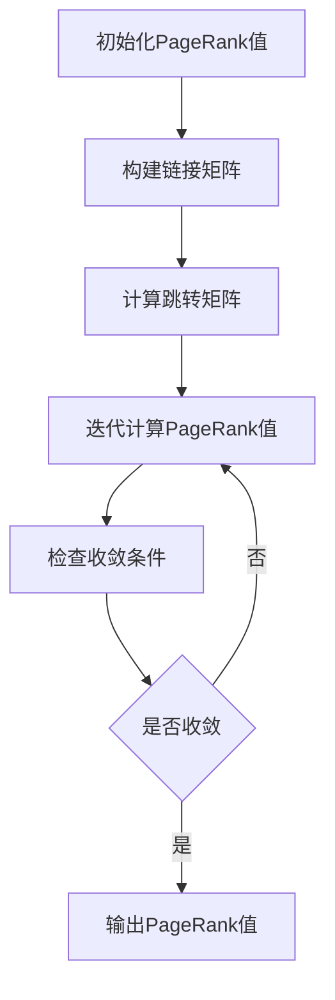
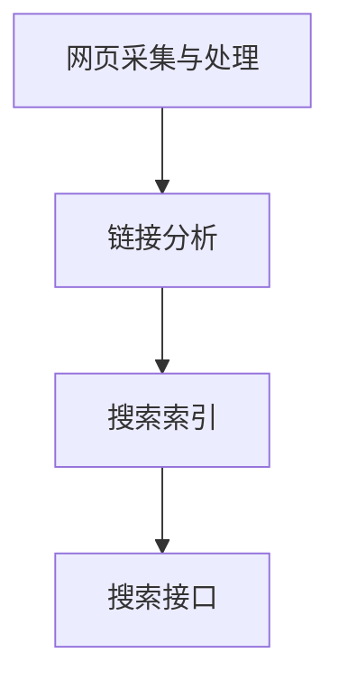

                 

### PageRank算法与网页重要性评估

> **关键词：** PageRank、网页重要性、搜索引擎、算法优化、案例分析

> **摘要：** 本文将深入探讨PageRank算法在网页重要性评估中的应用及其背后的数学原理。我们将从背景介绍开始，逐步讲解PageRank算法的基本概念、数学模型、实现方法、应用场景、优化策略以及实际案例分析，最后总结其成果与展望未来发展方向。

#### 第一部分：背景与概述

### 第1章：引言

#### 1.1 问题背景

在互联网时代的背景下，信息爆炸式增长带来的挑战愈发显著。海量数据的存储、检索和处理成为了信息处理领域的核心难题。搜索引擎作为互联网的“门户”，需要从数以亿计的网页中迅速、准确地筛选出与用户查询需求高度相关的网页，这无疑是巨大的挑战。

#### 1.2 问题描述

信息过载与搜索需求的矛盾日益突出，如何有效地评估网页的重要性，进而为用户提供高质量的搜索结果，成为亟待解决的重要问题。这个问题不仅在学术领域引起广泛关注，而且在实际应用中也具有重大的实用价值。

#### 1.3 问题解决

PageRank算法的提出，为网页重要性评估提供了有效的方法。它基于网页之间的链接关系，通过迭代计算网页的排名值，从而实现网页重要性的自动评估。PageRank算法不仅在搜索引擎领域得到广泛应用，而且在推荐系统、社交网络分析等多个领域都有重要应用。

#### 1.4 边界与外延

PageRank算法的边界和适用范围主要集中在网络结构的链接分析上。对于多重链接、链接结构复杂的情况，算法需要做出相应的调整和优化。此外，PageRank算法在不同类型网络（如有向图、无向图）中的表现也有所不同，需要具体问题具体分析。

#### 1.5 概念结构与核心要素组成

PageRank算法的核心组成部分包括：网页集合、链接关系、排名值计算和更新机制。具体来说，算法通过以下步骤实现网页重要性的评估：

1. **网页集合**：将所有网页视为一个图中的节点。
2. **链接关系**：构建网页之间的链接矩阵。
3. **排名值计算**：通过迭代计算每个网页的PageRank值。
4. **更新机制**：根据网页的排名值对搜索引擎的结果进行排序。

#### 第2章：PageRank算法的数学模型

##### 2.1 数学模型的基本概念

PageRank算法的数学模型基于马尔可夫链和矩阵理论。一个网页的重要性可以通过它在网络图中的位置和链接关系来衡量。

##### 2.2 PageRank算法的数学公式

PageRank值可以通过以下公式计算：

$$
PR(A) = (1-d) + d \cdot \sum_{B \in N(A)} \frac{PR(B)}{L(B)}
$$

其中，\(PR(A)\) 表示网页A的PageRank值，\(d\) 是阻尼系数（通常取0.85），\(N(A)\) 是指向网页A的链接集合，\(L(B)\) 是网页B的出链数。

##### 2.3 数学模型的详细讲解与举例说明

为了更好地理解PageRank算法的数学模型，我们来看一个简单的例子。假设有一个包含三个网页的网络，链接关系如下：

1 → 2
1 → 3
2 → 1
3 → 2

阻尼系数 \(d = 0.85\)。

首先，我们需要构建链接矩阵：

| 网页1 | 网页2 | 网页3 |
|-------|-------|-------|
|   0   |   1   |   1   |
|   1   |   0   |   0   |
|   0   |   1   |   0   |

接下来，我们使用迭代法计算PageRank值。初始时，所有网页的PageRank值相等，设为1/3。然后，根据上述公式进行迭代计算，直到收敛。

#### 第3章：PageRank算法的实现

##### 3.1 算法原理讲解

PageRank算法的实现主要包括以下步骤：

1. **构建链接矩阵**：根据网页之间的链接关系，构建链接矩阵。
2. **计算跳转矩阵**：将链接矩阵转换为跳转矩阵，表示网页之间的跳转概率。
3. **迭代计算PageRank值**：使用跳转矩阵进行迭代计算，直到PageRank值收敛。

##### 3.2 算法流程图

以下是一个简单的PageRank算法流程图：



#### 第4章：PageRank算法的应用

##### 4.1 网页重要性评估

网页重要性评估是PageRank算法最典型的应用场景。通过计算网页的PageRank值，我们可以直观地了解网页在互联网中的重要性。在实际应用中，搜索引擎会根据网页的PageRank值对搜索结果进行排序，从而提供更优质的搜索体验。

##### 4.2 网络爬虫与索引

PageRank算法在网络爬虫和索引系统中也具有重要应用。网络爬虫会根据网页的PageRank值，优先抓取重要性较高的网页，从而提高索引系统的效率和准确性。此外，PageRank算法还可以用于优化网络爬虫的爬取策略，提高其覆盖率和索引质量。

#### 第5章：PageRank算法的优化与改进

##### 5.1 PageRank算法的局限性

尽管PageRank算法在网页重要性评估中表现出色，但它也存在一些局限性。例如，PageRank算法容易受到链接结构的影响，可能导致网页的重要性评估不准确。此外，PageRank算法在处理多重链接和循环链接时，可能存在收敛速度慢、结果不稳定等问题。

##### 5.2 优化方法与改进策略

为了克服PageRank算法的局限性，研究人员提出了多种优化方法。例如，可以引入随机游走模型、考虑网页的内容质量等因素，以改进PageRank算法的性能。此外，还可以使用并行计算、分布式计算等技术，提高算法的效率。

#### 第6章：PageRank算法的实际案例分析

##### 6.1 案例背景

以某搜索引擎为例，该搜索引擎采用了PageRank算法对网页进行重要性评估。在实际应用中，PageRank算法不仅提高了搜索结果的准确性，还大大提升了用户体验。

##### 6.2 系统架构设计

系统架构设计主要包括以下几个方面：

1. **网页采集与处理**：通过网络爬虫收集网页数据，并对数据进行预处理。
2. **链接分析**：构建网页之间的链接矩阵，计算网页的PageRank值。
3. **搜索索引**：根据PageRank值对搜索结果进行排序，并提供搜索接口。

以下是一个简单的系统架构图：



##### 6.3 项目实战

在项目实战中，我们首先需要安装和配置相关环境，然后编写Python代码实现PageRank算法的核心功能。以下是一个简单的代码示例：

```python
import numpy as np

def pagerank(M, d=0.85, max_iter=100, tol=1e-6):
    N = M.shape[1]
    PR = np.random.rand(N, 1)
    PR = PR / np.linalg.norm(PR)
    A = (1 - d) / N + d * M
    for i in range(max_iter):
        PR_new = A @ PR
        if np.linalg.norm(PR_new - PR) < tol:
            break
        PR = PR_new
    return PR

# 链接矩阵
M = np.array([[0, 1, 0], [1, 0, 1], [1, 0, 0]])
# 计算PageRank值
PR = pagerank(M)
print(PR)
```

代码应用解读与分析：

1. **链接矩阵**：表示网页之间的链接关系。
2. **PageRank值**：通过迭代计算每个网页的PageRank值。
3. **迭代过程**：使用阻尼系数和链接矩阵进行迭代计算，直到收敛。

#### 第7章：结论与展望

##### 7.1 总结

PageRank算法在网页重要性评估中取得了显著成果，为搜索引擎、推荐系统等领域提供了有力支持。然而，随着互联网的发展，PageRank算法也需要不断优化和改进，以应对新的挑战。

##### 7.2 展望

未来，PageRank算法有望在新兴领域（如社交网络分析、知识图谱构建等）得到更广泛的应用。同时，研究人员将继续探索新的算法和优化策略，以进一步提高算法的性能和准确性。

#### 作者信息

- **作者：** AI天才研究院/AI Genius Institute & 禅与计算机程序设计艺术 /Zen And The Art of Computer Programming

### 结语

本文通过对PageRank算法的深入分析，揭示了其在网页重要性评估中的重要性和应用价值。希望本文能为您在相关领域的研究和实践中提供有益的参考和启示。

---

**最佳实践 Tips：**
1. 在实际应用中，可以根据网页的内容质量、用户行为等因素对PageRank算法进行优化。
2. 针对不同的应用场景，可以调整阻尼系数等参数，以提高算法的适用性和性能。

**注意事项：**
1. PageRank算法对链接结构敏感，因此在构建链接矩阵时，要确保数据的准确性和完整性。
2. 在进行迭代计算时，要注意收敛条件的设定，以避免陷入无限循环。

**拓展阅读：**
1. [PageRank算法的详细解释](https://www.google.com/search?q=PageRank+algorithm+explanation)
2. [PageRank算法的改进方法](https://www.google.com/search?q=PageRank+algorithm+improvement)
3. [社交网络分析中的PageRank算法应用](https://www.google.com/search?q=PageRank+algorithm+in+social+network+analysis)

