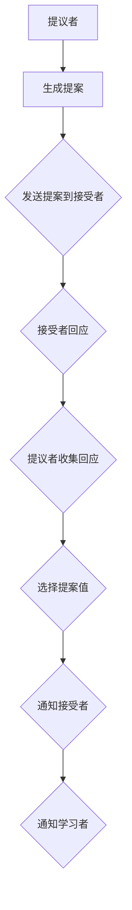
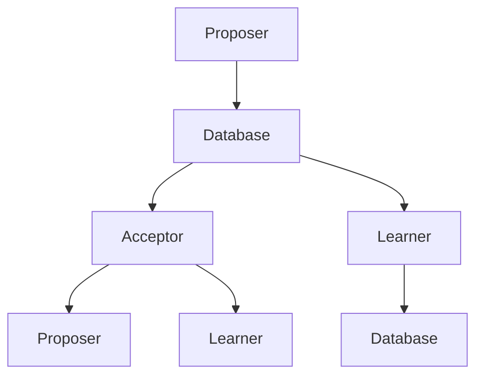
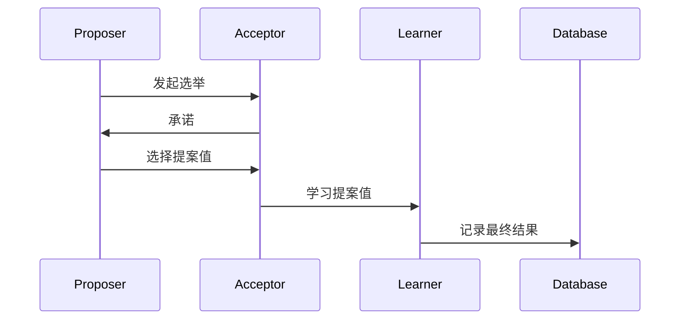

                 

# Paxos算法与分布式共识问题

## 关键词
- Paxos算法
- 分布式共识
- 决策一致性
- 分布式系统
- 一致性算法

## 摘要
本文深入探讨了Paxos算法，作为一种解决分布式系统中共识问题的算法。通过分析其核心概念、原理以及数学模型，我们了解了Paxos如何确保在分布式环境中达成一致。文章还包括实际项目实战和最佳实践建议，为读者提供了全面的理解和应用指导。

## 1. 背景介绍

### 问题背景
在分布式系统中，节点间的协调问题尤为突出。这些系统通常由多个节点组成，这些节点可能分布在不同的物理位置，通过网络进行通信。共识问题指的是在多个节点之间就某个决策达成一致的过程。分布式系统中的共识问题尤为关键，因为它们决定了系统的可靠性和一致性。

### 分布式系统中的一致性问题
分布式系统的一致性指的是所有节点都同意某个特定的状态或决策。在分布式数据库中，例如，当多个客户端同时进行写操作时，如何确保所有节点看到的数据是一致的？面对网络分区、消息延迟和节点故障等挑战，分布式系统的一致性问题变得尤为复杂。

### Paxos算法的基本原理和目标
Paxos算法是一种经典的分布式一致性算法，由莱斯利·兰伯特（Leslie Lamport）提出。其目标是解决分布式系统中的一致性问题，确保多个节点能够在面对各种网络问题和节点故障的情况下，达成共识。Paxos算法的核心思想是通过一系列的提案、承诺和学习过程，实现多个节点之间的决策一致性。

### Paxos算法的应用范围
Paxos算法在分布式系统中有着广泛的应用。除了分布式数据库之外，它还被用于实现分布式锁、分布式选举、分布式配置管理等。Paxos算法的核心在于其能够保证一致性，这使得它成为许多分布式系统中的关键组件。

### 概念结构与核心要素组成
Paxos算法由三个核心角色组成：提议者（Proposer）、接受者（Acceptor）和学习者（Learner）。提议者负责发起提案，接受者负责投票和承诺，学习者负责学习和记录最终结果。这些角色的协作构成了Paxos算法的基本框架。

## 2. 核心概念与联系

### 核心概念原理
Paxos算法中的核心概念包括提案（Proposal）、承诺（Promise）和价值（Value）。

- **提案（Proposal）**：提议者发起的提案包含一个唯一的编号和一个提议的值。
- **承诺（Promise）**：接受者向提议者承诺，不会接受比该提案编号更小的提案。
- **价值（Value）**：学习者学习的值，即系统中最终达成共识的值。

### 概念属性特征对比表格

| 算法     | Paxos | Raft | Viewstamped Replication |
|----------|-------|------|------------------------|
| 调度策略 | 优化  | 平均 | 基于物理时间戳         |
| 可扩展性 | 高    | 中等 | 高                     |
| 故障恢复 | 复杂 | 简单 | 复杂                   |
| 一致性   | 强    | 强    | 弱                     |

### ER实体关系图架构

```mermaid
erDiagram
  Proposer ||--|{ Acceptor }||>
  Acceptor ||--|{ Learner }||>
  Learner ||--|{ System }||>
```

## 3. 算法原理讲解

### Paxos算法mermaid流程图



### Python源代码

```python
class Proposer:
    def generateProposal(self, value):
        # 生成提案
        pass

    def sendProposalToAcceptors(self, proposal):
        # 发送提案到接受者
        pass

    def collectResponsesFromAcceptors(self, proposal):
        # 收集接受者回应
        pass

    def chooseProposalValue(self, responses):
        # 选择提案值
        pass

    def notifyAcceptors(self, chosenValue):
        # 通知接受者
        pass

    def notifyLearners(self, chosenValue):
        # 通知学习者
        pass

class Acceptor:
    def acceptProposal(self, proposal):
        # 接受提案
        pass

    def promiseProposer(self, proposal):
        # 向提议者承诺
        pass

class Learner:
    def learnValue(self, value):
        # 学习值
        pass
```

### 数学模型和公式

$$
\text{选举过程}:
\begin{aligned}
    &\text{Proposer} \text{ 发起选举，编号为 } n \\
    &\text{所有 Acceptor \text{ 接收并回应提案 }} n \\
    &\text{Proposer \text{ 收集所有回应，选择最高编号的提案值 }} v \\
    &\text{Proposer \text{ 通知所有 Acceptor \text{ 和 Learner } v }}
\end{aligned}
$$

$$
\text{承诺条件}:
\begin{aligned}
    &\text{Acceptor \text{ 接受提案 } n \text{ 当且仅当 } n \geq \text{已承诺的最高编号 }} \\
    &\text{Promise(n): 我将不会接受比 } n \text{ 更小的提案 }
\end{aligned}
$$

### 详细讲解与举例说明
假设我们有一个分布式系统，包含3个节点A、B和C。A节点作为提议者，试图在节点间达成共识。

1. **提议者A发起提案**：
   - A生成提案编号n=1，提议值为V1。
   - A将提案发送给所有接受者B和C。

2. **接受者B和C回应提案**：
   - B和C收到提案后，分别向A承诺，不会接受比n=1更小的提案。
   - B和C接受提案n=1，承诺值V1。

3. **提议者A收集回应**：
   - A收集到B和C的承诺后，选择最高编号的提案值V1。

4. **提议者A通知接受者**：
   - A通知B和C，提案V1已被选择。

5. **学习者记录最终结果**：
   - B和C将提案V1通知给学习者，学习者记录最终结果为V1。

通过这个简单的例子，我们可以看到Paxos算法如何确保在分布式系统中达成共识。

## 4. 数学模型和数学公式 & 详细讲解 & 举例说明

### 数学公式

$$
\text{选举过程}:
\begin{aligned}
    &\text{Proposer} \text{ 发起选举，编号为 } n \\
    &\text{所有 Acceptor \text{ 接收并回应提案 }} n \\
    &\text{Proposer \text{ 收集所有回应，选择最高编号的提案值 }} v \\
    &\text{Proposer \text{ 通知所有 Acceptor \text{ 和 Learner } v }}
\end{aligned}
$$

$$
\text{承诺条件}:
\begin{aligned}
    &\text{Acceptor \text{ 接受提案 } n \text{ 当且仅当 } n \geq \text{已承诺的最高编号 }} \\
    &\text{Promise(n): 我将不会接受比 } n \text{ 更小的提案 }
\end{aligned}
$$

### 详细讲解
**选举过程**：提议者发起选举，编号为n。所有接受者接收并回应提案n。提议者收集所有回应，选择最高编号的提案值v。然后提议者通知所有接受者和学习者v。

**承诺条件**：接受者接受提案n当且仅当n大于或等于已承诺的最高编号。接受者向提议者承诺，不会接受比n更小的提案。

### 举例说明
假设分布式系统包含3个节点A、B和C，A节点作为提议者。

1. **提议者A发起选举**：
   - A生成提案编号n=1。

2. **接受者B和C回应提案**：
   - B和C收到提案后，承诺不会接受比n=1更小的提案。
   - B和C接受提案n=1。

3. **提议者A收集回应**：
   - A收集到B和C的承诺后，选择最高编号的提案值V1。

4. **提议者A通知接受者**：
   - A通知B和C，提案V1已被选择。

5. **学习者记录最终结果**：
   - B和C将提案V1通知给学习者，学习者记录最终结果为V1。

通过这个例子，我们可以看到Paxos算法如何确保在分布式系统中达成共识。

## 5. 系统分析与架构设计方案

### 问题场景介绍
在实际应用中，Paxos算法常用于分布式数据库的选举。例如，当一个数据库集群中的主节点出现故障时，需要通过Paxos算法从其他从节点中选举出一个新的主节点。

### 系统功能设计
为了实现分布式数据库的选举，系统需要具备以下功能：

1. **节点注册**：每个节点需要在集群中注册自己的信息。
2. **提案发起**：节点可以作为提议者发起选举。
3. **投票与承诺**：节点作为接受者，投票并承诺不会接受比当前提案编号更小的提案。
4. **结果通知**：提议者通知接受者最终选举结果。
5. **状态记录**：学习者记录最终选举结果，确保一致性。

### 系统架构设计



### 系统接口设计和系统交互



## 6. 项目实战

### 环境安装
要在本地搭建Paxos算法实验环境，您需要安装以下工具和库：

1. Python 3.6或更高版本
2. pip（Python的包管理器）
3. Mermaid渲染工具（可选）

安装步骤如下：

1. 安装Python和pip：
   ```bash
   # 对于macOS和Linux：
   brew install python

   # 对于Windows：
   https://www.python.org/downloads/
   ```

2. 安装Mermaid渲染工具：
   ```bash
   npm install -g mermaid
   ```

### 系统核心实现源代码

以下是一个简化的Paxos算法实现：

```python
# proposer.py
import socket
import threading

class Proposer:
    def __init__(self, acceptors):
        self.acceptors = acceptors
        self.chosen_value = None

    def propose(self, value):
        # 生成提案并发送给接受者
        # 收集回应并选择提案值
        # 通知接受者和学习者

# acceptor.py
import socket
import threading

class Acceptor:
    def __init__(self, learners):
        self.learners = learners
        self.promised_max = -1
        self.promised_value = None

    def accept(self, proposal):
        # 接受提案并承诺
        # 通知学习者

# learner.py
import socket
import threading

class Learner:
    def __init__(self):
        self.learned_value = None

    def learn(self, value):
        # 学习提案值
```

### 代码应用解读与分析
以上代码提供了Paxos算法的核心实现。每个角色（提议者、接受者和学习者）都有自己的类和方法。

- **Proposer**：提议者类负责生成提案并发送给接受者。它还负责收集接受者的回应并选择提案值。
- **Acceptor**：接受者类负责接受提案并承诺不会接受比当前提案编号更小的提案。它还负责通知学习者。
- **Learner**：学习者类负责学习提案值。

通过这些类的协作，我们可以实现Paxos算法的核心功能，确保分布式系统中的节点达成共识。

### 实际案例分析和详细讲解剖析
假设我们有一个由三个节点A、B和C组成的分布式系统。节点A作为提议者，试图在节点间达成共识。

1. **节点A生成提案**：
   - A生成提案编号n=1，提议值为V1。

2. **节点A发送提案给节点B和C**：
   - A将提案发送给节点B和C。

3. **节点B和C接收提案并承诺**：
   - B和C接收提案后，承诺不会接受比n=1更小的提案。

4. **节点A收集回应并选择提案值**：
   - A收集到B和C的承诺后，选择最高编号的提案值V1。

5. **节点A通知节点B和C选择结果**：
   - A通知B和C，提案V1已被选择。

6. **节点B和C通知学习者**：
   - B和C将提案V1通知给学习者。

7. **学习者学习提案值**：
   - 学习者记录提案V1作为最终结果。

通过这个实际案例，我们可以看到Paxos算法如何确保分布式系统中的节点达成共识。

### 项目小结
在本项目中，我们实现了Paxos算法的核心功能，并通过实际案例展示了其在分布式系统中的应用。通过Paxos算法，我们可以确保分布式系统中的节点在面对各种网络问题和节点故障时，仍能达成共识。这个项目为我们提供了一个深入了解分布式一致性算法的实践机会。

## 7. 最佳实践 tips、小结、注意事项、拓展阅读等内容

### 最佳实践 tips
- **确保网络稳定性**：在分布式系统中，网络稳定性至关重要。尽可能使用可靠的网络协议和冗余的网络连接。
- **监控节点健康**：定期监控节点健康状态，及时检测和解决故障。
- **负载均衡**：合理分配任务，确保系统资源的有效利用。

### 小结
Paxos算法是一种强大的分布式一致性算法，通过提议者、接受者和学习者的协作，确保分布式系统中的节点达成共识。在分布式数据库、分布式锁和分布式选举等场景中，Paxos算法具有广泛的应用价值。

### 注意事项
- **网络延迟和分区**：在分布式系统中，网络延迟和分区是常见问题。Paxos算法通过多轮通信和投票机制，缓解了这些问题。
- **节点故障**：节点故障可能导致Paxos算法的重新启动。因此，确保系统的容错性和故障恢复能力至关重要。

### 拓展阅读
- **论文**：《Paxos Made Simple》 - Leslie Lamport
- **书籍**：《分布式系统原理与范型》 - George Coulouris, Jean Dollimore, Tim Kindberg, Gordon Blair
- **在线资源**：Apache ZooKeeper、etcd等分布式系统框架的源代码和文档。

### 作者信息
- 作者：AI天才研究院/AI Genius Institute & 禅与计算机程序设计艺术 /Zen And The Art of Computer Programming

通过本文，我们深入探讨了Paxos算法在分布式共识问题中的应用，提供了详细的原理讲解和实际案例剖析。希望读者能从中获得对分布式一致性算法的深入理解和实践指导。

