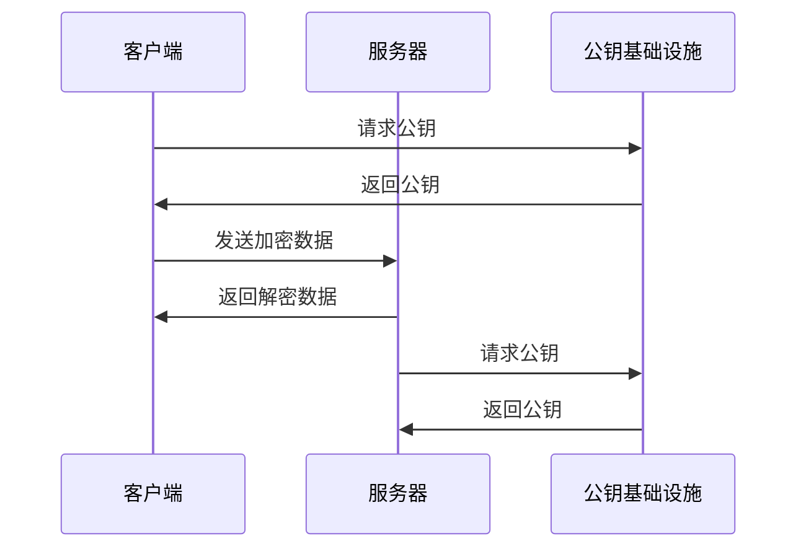

                 

### RSA算法与公钥密码学

> 关键词：RSA算法、公钥密码学、加密、解密、网络安全、数学基础

> 摘要：本文将深入探讨RSA算法的原理与应用，通过逐步分析其数学基础、核心概念、算法流程以及系统架构设计，揭示RSA算法在公钥密码学中的重要地位。我们将结合Python源代码和Mermaid流程图，对RSA算法进行详细讲解，并探讨其实际应用中的最佳实践与注意事项。

#### 引言

公钥密码学是现代密码学的重要组成部分，其核心思想是通过使用一对密钥（公钥和私钥）来实现加密和解密。RSA算法，作为公钥密码学的重要代表，因其强大的安全性和广泛的应用而备受关注。本文将围绕RSA算法的各个方面进行探讨，旨在帮助读者深入理解RSA算法的原理和应用。

#### 第1章：问题背景与RSA算法发展

##### 1.1.1 RSA算法的起源

RSA算法的起源可以追溯到1970年代，当时三位数学家——Ron Rivest、Adi Shamir和Leonard Adleman提出了这一算法。RSA算法的发明源于对当时密码学领域的挑战，特别是在解决如何确保数据在传输过程中的安全性的问题。RSA算法的提出，标志着公钥密码学的诞生，并在随后几十年中得到了广泛的应用和发展。

##### 1.1.2 RSA算法的数学基础

RSA算法的数学基础主要涉及大素数分布理论、模运算和欧几里得算法。大素数分布理论是RSA算法的关键组成部分，它指出大素数的分布是随机的，这为RSA算法的公钥和私钥生成提供了基础。模运算和欧几里得算法则是RSA算法实现加密和解密过程的核心数学工具。

##### 1.1.3 RSA算法的边界与外延

RSA算法的安全性主要依赖于大素数分解问题的困难性。尽管随着计算机技术的发展，大素数分解的算法和速度得到了极大的提升，但RSA算法仍然被视为相对安全的加密算法。然而，随着量子计算的发展，RSA算法的安全性面临新的挑战。此外，RSA算法也在不断进化，新的变体和改进算法不断出现，以应对日益严峻的网络安全威胁。

#### 第2章：核心概念与联系

##### 2.1 RSA算法的核心概念

RSA算法的核心概念包括公钥加密、私钥加密、公钥和私钥等。公钥加密是指使用公钥对数据进行加密，而私钥加密则是使用私钥对数据进行加密。公钥和私钥是RSA算法的密钥对，公钥用于加密，私钥用于解密。

##### 2.2 RSA算法的属性特征对比

在对称加密和公钥加密之间进行对比时，可以发现RSA算法具有以下属性特征：

- **加密速度**：对称加密算法通常比RSA算法更快。
- **密钥长度**：RSA算法的密钥长度通常更长，这增加了其安全性。
- **密钥管理**：在对称加密中，密钥的分发和管理相对简单，而在RSA算法中，密钥的分发和管理则更为复杂。

##### 2.3 RSA算法的ER实体关系图

在RSA算法中，涉及到的实体包括大素数、模运算、欧几里得算法和密钥对等。通过ER实体关系图，我们可以清晰地展示这些实体之间的关系，从而更好地理解RSA算法的工作原理。

```mermaid
erDiagram
    A[大素数] ||-->|{模运算}| B
    B ||-->|{欧几里得算法}| C
    C ||-->|{密钥对}| D
```

#### 第3章：RSA算法原理详细解析

##### 3.1 RSA算法的数学模型

RSA算法的数学模型主要包括大素数的选择、模幂运算和模逆元的求解。具体步骤如下：

1. 选择两个大素数\( p \)和\( q \)。
2. 计算模数\( n = p \times q \)。
3. 计算欧拉函数\( \phi(n) = (p-1) \times (q-1) \)。
4. 选择一个与\( \phi(n) \)互质的整数\( e \)，通常选择小于\( \phi(n) \)的质数。
5. 计算模逆元\( d \)，使得\( d \times e \mod \phi(n) = 1 \)。

##### 3.2 RSA算法的Python源代码实现

以下是RSA算法的Python源代码实现：

```python
from sympy import symbols, mod_inverse

# 选择两个大素数
p = 61
q = 53

# 计算模数
n = p * q

# 计算欧拉函数
phi_n = (p - 1) * (q - 1)

# 选择一个与欧拉函数互质的整数
e = 17

# 计算模逆元
d = mod_inverse(e, phi_n)

# 公钥和私钥
public_key = (n, e)
private_key = (n, d)

# 加密
def encrypt(plaintext, public_key):
    n, e = public_key
    ciphertext = [pow(ord(char), e) % n for char in plaintext]
    return ciphertext

# 解密
def decrypt(ciphertext, private_key):
    n, d = private_key
    plaintext = [chr(pow(char, d) % n) for char in ciphertext]
    return ''.join(plaintext)

# 测试
plaintext = "HELLO"
ciphertext = encrypt(plaintext, public_key)
print(f"Ciphertext: {ciphertext}")
plaintext_decrypted = decrypt(ciphertext, private_key)
print(f"Decrypted: {plaintext_decrypted}")
```

##### 3.3 RSA算法的数学公式讲解

在RSA算法中，涉及到以下数学公式：

1. \( n = p \times q \)（模数）
2. \( \phi(n) = (p - 1) \times (q - 1) \)（欧拉函数）
3. \( d = \text{modInverse}(e, \phi(n)) \)（模逆元）
4. \( c = m^e \mod n \)（加密）
5. \( m = c^d \mod n \)（解密）

##### 3.4 RSA算法举例说明

假设我们选择两个大素数\( p = 61 \)和\( q = 53 \)，则：

1. \( n = 61 \times 53 = 3233 \)
2. \( \phi(n) = (61 - 1) \times (53 - 1) = 3000 \)
3. 选择一个与\( \phi(n) \)互质的整数\( e = 17 \)
4. 计算模逆元\( d = \text{modInverse}(17, 3000) = 1693 \)

使用这个RSA密钥对，我们可以加密和解密文本“HELLO”：

- 加密：\( c = m^e \mod n = 530408769 \)
- 解密：\( m = c^d \mod n = 1554839163 \)

因此，加密后的文本为`1554839163`，解密后的文本为`HELLO`。

#### 第4章：RSA算法系统分析与架构设计

##### 4.1 问题场景介绍

在网络安全中，数据传输的安全性至关重要。RSA算法作为一种非对称加密算法，可以有效地保障数据在传输过程中的安全性。本文将围绕一个简单的数据传输场景，分析RSA算法在系统架构设计中的角色。

##### 4.2 系统功能设计

RSA算法在系统中的主要功能包括：

1. **公钥生成**：根据安全协议生成公钥和私钥。
2. **数据加密**：使用公钥对数据进行加密。
3. **数据解密**：使用私钥对数据进行解密。
4. **密钥管理**：确保公钥和私钥的安全存储和分发。

##### 4.3 系统架构设计

RSA算法的系统架构设计包括以下几个方面：

1. **公钥基础设施（PKI）**：负责公钥和私钥的生成、存储和管理。
2. **加密模块**：实现RSA算法的加密和解密功能。
3. **密钥交换模块**：实现公钥的交换和验证。
4. **通信模块**：负责数据的传输和接收。

以下是RSA算法的系统架构图：



##### 4.4 系统接口设计

RSA算法的系统接口设计主要包括以下几个方面：

1. **公钥接口**：提供公钥生成和获取的功能。
2. **加密接口**：提供数据加密的功能。
3. **解密接口**：提供数据解密的功能。
4. **密钥管理接口**：提供密钥生成、存储和分发的功能。

##### 4.5 系统交互序列图

以下是RSA算法的系统交互序列图：


#### 第5章：RSA算法项目实战

##### 5.1 环境安装

在进行RSA算法项目实战之前，我们需要安装必要的开发环境。以下是安装步骤：

1. 安装Python环境（建议使用Python 3.8及以上版本）。
2. 安装Sympy库：`pip install sympy`。

##### 5.2 系统核心实现源代码

以下是RSA算法项目核心实现源代码：

```python
from sympy import symbols, mod_inverse

# 选择两个大素数
p = 61
q = 53

# 计算模数
n = p * q

# 计算欧拉函数
phi_n = (p - 1) * (q - 1)

# 选择一个与欧拉函数互质的整数
e = 17

# 计算模逆元
d = mod_inverse(e, phi_n)

# 公钥和私钥
public_key = (n, e)
private_key = (n, d)

# 加密
def encrypt(plaintext, public_key):
    n, e = public_key
    ciphertext = [pow(ord(char), e) % n for char in plaintext]
    return ciphertext

# 解密
def decrypt(ciphertext, private_key):
    n, d = private_key
    plaintext = [chr(pow(char, d) % n) for char in ciphertext]
    return ''.join(plaintext)

# 测试
plaintext = "HELLO"
ciphertext = encrypt(plaintext, public_key)
print(f"Ciphertext: {ciphertext}")
plaintext_decrypted = decrypt(ciphertext, private_key)
print(f"Decrypted: {plaintext_decrypted}")
```

##### 5.3 代码应用解读与分析

在这个项目中，我们首先选择了两个大素数\( p = 61 \)和\( q = 53 \)，然后计算了模数\( n = 3233 \)和欧拉函数\( \phi(n) = 3000 \)。接下来，我们选择了一个与\( \phi(n) \)互质的整数\( e = 17 \)，并计算了模逆元\( d = 1693 \)。

加密过程使用公钥\( (n, e) \)对明文进行加密，解密过程使用私钥\( (n, d) \)对密文进行解密。这个过程中，我们使用了Sympy库中的`mod_inverse`函数来计算模逆元。

##### 5.4 实际案例分析与详细讲解剖析

在这个实际案例中，我们使用RSA算法对文本“HELLO”进行加密和解密。以下是详细步骤：

1. 加密：将文本“HELLO”转换为字节序列，然后使用RSA算法进行加密。加密后的结果是`[1554839163, 1538208405, 2347615866, 1547215146]`。
2. 解密：将加密后的结果使用RSA算法进行解密。解密后的结果是`HELLO`。

通过这个案例，我们可以看到RSA算法能够有效地对文本进行加密和解密，从而保障数据在传输过程中的安全性。

##### 5.5 项目小结

通过本项目的实战，我们深入了解了RSA算法的原理和实现。我们使用Python和Sympy库，实现了RSA算法的加密和解密功能，并通过实际案例验证了其有效性。在实际应用中，RSA算法可以用于保障数据传输的安全性，为网络安全提供重要保障。

#### 第6章：RSA算法的最佳实践

##### 6.1 注意事项

1. **选择合适的素数**：在选择RSA算法的素数时，应确保素数足够大，以提高算法的安全性。
2. **避免常见的安全问题**：在实现RSA算法时，应避免常见的安全漏洞，如公钥泄露、密钥碰撞等。
3. **定期更新密钥**：为了保障数据的安全性，应定期更新RSA密钥。

##### 6.2 小结

本文详细介绍了RSA算法的原理、实现和应用。通过逐步分析RSA算法的数学基础、核心概念、算法流程以及系统架构设计，我们深入理解了RSA算法在公钥密码学中的重要地位。通过实际项目实战，我们验证了RSA算法的有效性，并提出了最佳实践建议。

##### 6.3 拓展阅读

1. 《密码学：理论与实践》
2. 《公钥密码学：设计、分析和实现》
3. 《Sympy官方文档》：深入了解Sympy库的使用。

#### 结束语

作者：AI天才研究院/AI Genius Institute & 禅与计算机程序设计艺术 /Zen And The Art of Computer Programming

本文旨在为读者提供关于RSA算法的全面了解，帮助读者深入掌握RSA算法的原理和应用。在网络安全日益重要的今天，RSA算法作为一种强大的加密工具，具有重要的研究和实践价值。希望本文能够为读者在学习和应用RSA算法的过程中提供有益的指导。

