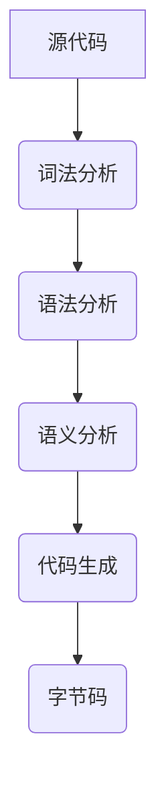
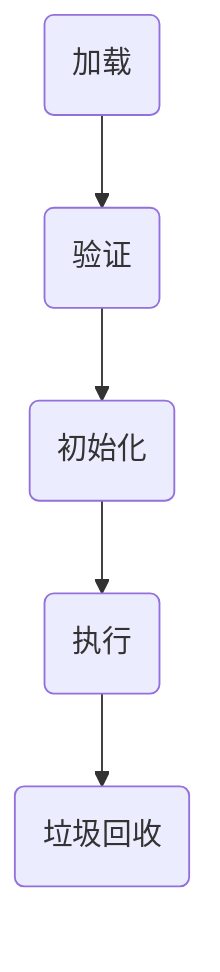
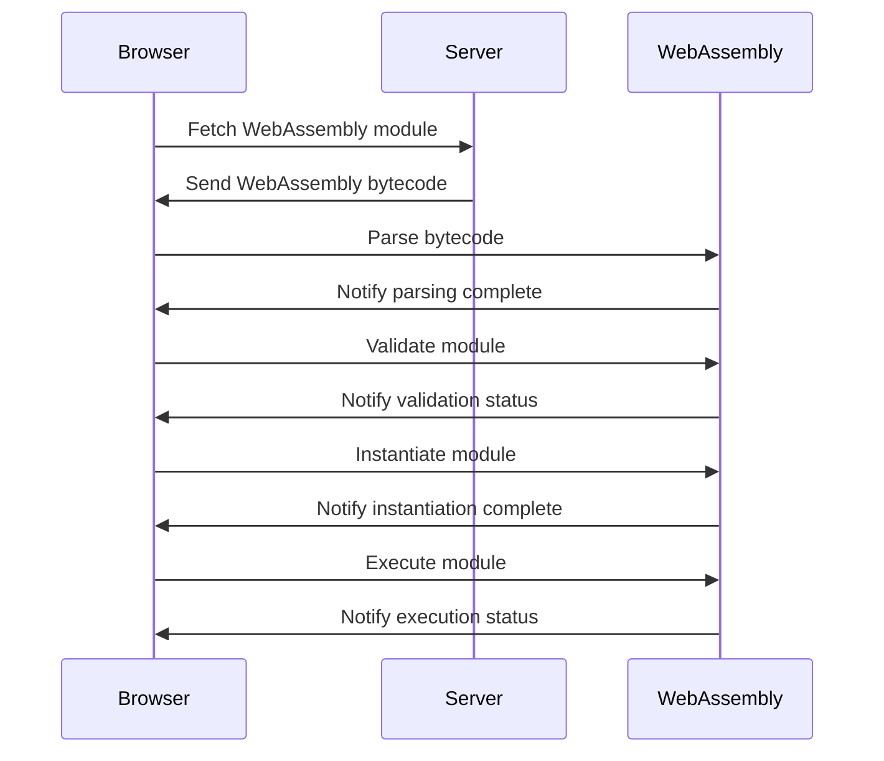
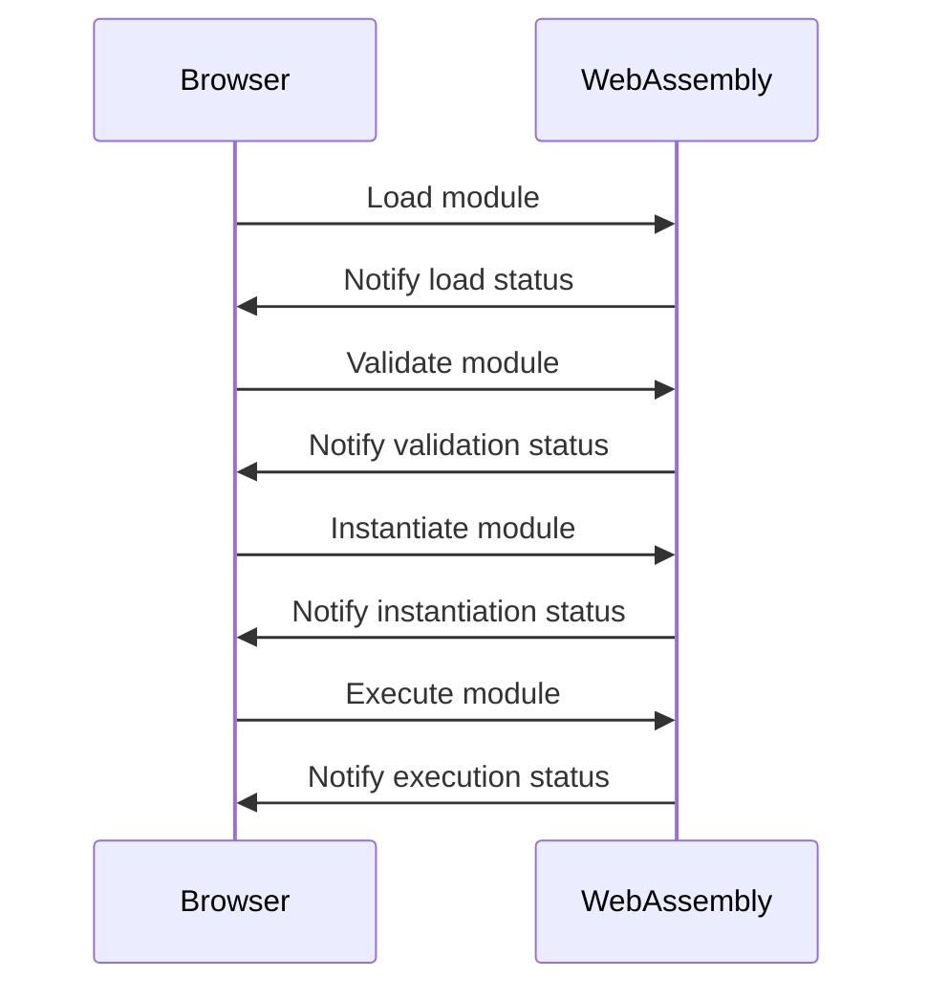
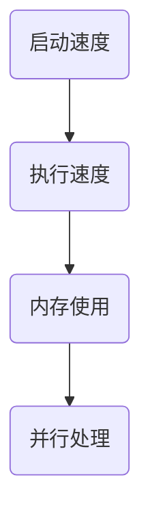

                 

### 第1章: WebAssembly背景介绍

#### 1.1 WebAssembly的产生背景

WebAssembly（简称Wasm）的产生源于现代Web应用的性能需求和浏览器技术的演变。随着互联网技术的发展，Web应用变得越来越复杂，功能越来越强大，用户对应用的性能和响应速度要求也不断提升。传统的Web应用依赖于JavaScript（JS）执行，但是JS在浏览器中的执行效率受到诸多限制，难以满足高性能需求。

传统的JS执行过程中存在以下几个主要问题：

1. **执行效率**：JS引擎的执行速度相比原生代码较低，尤其是在执行复杂的计算或处理大量数据时，性能瓶颈明显。
2. **内存占用**：JS运行在浏览器环境中，内存管理较为宽松，容易导致内存泄漏和高内存占用。
3. **安全性**：浏览器对JS的运行环境有严格限制，以保护用户隐私和系统安全，但这些限制有时也会影响性能。

为了解决这些问题，行业内外开始探索将其他编程语言编译为能够在浏览器中运行的高性能代码。WebAssembly正是这一探索的成果。

#### 1.2 WebAssembly解决的问题

WebAssembly旨在解决以下几个关键问题：

1. **提升性能**：通过提供一种高效、紧凑的字节码，WebAssembly可以在浏览器中以接近原生代码的速度执行，从而提升Web应用的性能。
2. **跨语言互操作性**：WebAssembly允许不同编程语言编写的代码相互调用，打破了传统Web应用中JS作为唯一编程语言的限制。
3. **内存管理**：WebAssembly提供了明确的内存分配和释放机制，有助于减少内存泄漏，提高内存使用效率。
4. **安全性**：WebAssembly代码在运行前需要通过浏览器验证，确保其安全性和稳定性。

#### 1.3 WebAssembly的设计哲学

WebAssembly的设计哲学主要体现在以下几个方面：

1. **高效性**：WebAssembly的字节码设计旨在实现高效的执行性能，其底层架构优化了代码的执行效率。
2. **安全性**：WebAssembly代码在运行前经过严格验证，确保其不会对系统或用户数据造成威胁。
3. **灵活性**：WebAssembly支持多种编程语言，使得开发者可以灵活选择最合适的语言来编写应用代码。
4. **轻量级**：WebAssembly的字节码体积较小，易于在Web环境中快速加载和执行。

综上所述，WebAssembly的产生背景、解决的问题以及其设计哲学，共同推动了其在Web应用性能提升中的重要地位。在接下来的章节中，我们将进一步深入探讨WebAssembly的核心概念、基本原理和编译技术，帮助读者全面了解这一新技术。

#### 1.4 WebAssembly的常见误解

尽管WebAssembly带来了诸多优势，但其在推广过程中仍存在一些常见误解，这些误解可能影响开发者对其价值的正确认识。以下是一些关于WebAssembly的常见误解及其解释：

1. **误解一：WebAssembly会取代JavaScript**

许多开发者认为WebAssembly的引入将导致JavaScript逐渐被淘汰。然而，实际情况并非如此。WebAssembly与JavaScript是互补的，而不是替代关系。JavaScript在Web开发中仍然扮演着重要角色，特别是在负责用户交互和动态内容展示方面。WebAssembly更适合处理计算密集型任务，如图形渲染、游戏和机器学习等。因此，WebAssembly的引入并不会导致JavaScript的消失，而是使其功能更加强大。

2. **误解二：WebAssembly只能在浏览器中运行**

虽然WebAssembly最初是设计为在浏览器中运行，但实际上它的应用范围远不止于此。WebAssembly可以在多种环境中运行，包括服务器端、嵌入式系统以及IoT设备等。这使得WebAssembly成为一种跨平台的技术，为开发者提供了更多的选择和灵活性。

3. **误解三：WebAssembly代码运行速度比JavaScript慢**

相反，WebAssembly的设计目标是实现比JavaScript更高的运行速度。通过提供一种紧凑且高效的字节码，WebAssembly能够在现代浏览器中以接近原生代码的速度执行。JavaScript引擎已经对WebAssembly进行了优化，使其执行速度不断提升。

4. **误解四：WebAssembly会破坏Web应用的安全模型**

WebAssembly代码在运行前需要经过浏览器验证，这意味着它不会破坏现有的Web安全模型。实际上，WebAssembly的安全性是通过严格的安全机制来保障的，确保其不会对用户数据或系统安全造成威胁。

5. **误解五：WebAssembly开发难度大**

虽然WebAssembly在某些方面相比JavaScript确实有更高的学习曲线，但随着相关工具和文档的不断完善，开发者可以更容易地掌握WebAssembly的开发。许多编程语言已经提供了对WebAssembly的编译支持，使得从传统语言迁移到WebAssembly变得更加简便。

总之，正确理解WebAssembly的背景和设计理念，有助于开发者充分利用其优势，为Web应用带来性能提升和开发灵活性。在接下来的章节中，我们将进一步探讨WebAssembly的核心概念和技术细节，帮助读者深入了解这一重要技术。

### 1.5 WebAssembly的发展历程

WebAssembly（简称Wasm）的发展历程可以追溯到2010年代初期，当时Web开发社区面临着性能瓶颈和跨语言互操作性的挑战。以下是对WebAssembly发展历程的简要回顾：

#### 初始概念提出

WebAssembly的初步概念最早出现在2011年，当时由Google的Ian Melchtal和Adrian Colyer提出。他们的目标是创建一种可以在Web浏览器中高效运行的代码格式。这个想法的核心理念是使用一种紧凑且可移植的字节码，使其能够跨多种编程语言和平台使用。

#### WebAssembly工作组成立

随着WebAssembly概念的逐步成熟，2014年，一个由Google、Mozilla和微软等公司组成的跨浏览器厂商工作组成立了。这个工作组旨在推动WebAssembly标准的制定和推广。该工作组的目标是设计一种能够兼容现有Web生态系统，同时又能够提升Web应用性能的技术。

#### 第一版草案发布

2015年，WebAssembly工作组发布了第一版草案。这个版本奠定了WebAssembly的基础结构，包括字节码格式和模块加载机制。虽然这个版本还处于早期阶段，但它为后续的发展奠定了重要基础。

#### 性能优化与改进

随着WebAssembly逐渐成熟，浏览器厂商开始对其进行性能优化。2016年，WebAssembly的性能得到了显著提升，特别是在JavaScript引擎对WebAssembly代码的执行速度进行了优化后。这一时期，WebAssembly开始被一些开发者用于实际项目，尽管它仍然处于开发阶段。

#### 标准化进程加速

2017年，WebAssembly成为ECMA国际（ECMA International）的一个标准工作项目。ECMA国际是一个致力于制定信息技术标准的国际组织。这一举措标志着WebAssembly正式进入标准化进程，使其得到更广泛的认可和支持。

#### 完成标准化

2020年，WebAssembly正式成为ECMA-262标准的第4部分。这一里程碑事件标志着WebAssembly的标准化进程完成，使其成为Web生态系统的一部分。随后，所有主流浏览器都实现了对WebAssembly的支持。

#### 当前发展趋势

近年来，WebAssembly的发展势头依旧强劲。越来越多的编程语言和工具开始支持WebAssembly，使其应用场景更加广泛。WebAssembly不仅继续在Web领域发挥作用，还开始扩展到服务器端、嵌入式系统和IoT等领域。

#### 未来展望

未来，WebAssembly有望在多个技术领域继续发挥重要作用。其高效性和灵活性将使其成为构建高性能、可移植的应用程序的首选技术。此外，随着WebAssembly生态系统的不断成熟，开发者将有更多的选择和工具来利用WebAssembly的优势。

通过以上回顾，我们可以看到WebAssembly从概念提出到成为标准化技术的历程。这一历程不仅体现了技术发展的必然趋势，也展示了跨领域协作和社区贡献的重要性。在接下来的章节中，我们将深入探讨WebAssembly的核心概念、基础原理及其编译技术，帮助读者全面理解这一重要的技术。

### 1.6 WebAssembly的关键特点

WebAssembly（简称Wasm）之所以能够在Web开发中引起广泛关注，源于其独特的特性。以下是对WebAssembly几个关键特点的详细分析：

#### 高性能

WebAssembly的一个核心优势是其高性能。通过提供一种紧凑且高效的字节码，WebAssembly能够在现代浏览器中以接近原生代码的速度执行。这种高效性主要得益于以下几个方面：

1. **紧凑的字节码**：WebAssembly的字节码设计紧凑，减少了代码的冗余和加载时间。
2. **高效的执行引擎**：现代浏览器已经对WebAssembly执行引擎进行了大量优化，使其在执行速度上接近原生代码。
3. **并行处理**：WebAssembly支持并行处理，多个代码块可以同时执行，从而提升了整体性能。

#### 跨语言互操作性

WebAssembly的设计初衷之一是跨语言互操作性。这意味着不同的编程语言可以编译成WebAssembly字节码，并在同一运行时环境中运行。这一特性为开发者提供了极大的灵活性，使他们可以充分利用各自熟悉的编程语言的优势。

具体来说，WebAssembly实现了以下跨语言互操作性的优势：

1. **多种语言支持**：目前，许多流行的编程语言，如C、C++、Rust和Python等，都提供了对WebAssembly的支持。
2. **模块化**：WebAssembly支持模块化，不同模块可以通过接口进行调用，提高了代码的复用性和可维护性。
3. **代码共享**：通过WebAssembly，开发者可以将高性能代码模块部署到多个平台上，从而实现代码共享和复用。

#### 内存管理

WebAssembly提供了明确的内存管理机制，这有助于提高内存使用效率和减少内存泄漏。在WebAssembly中，内存分配和释放是显式的，这意味着开发者可以更好地控制内存资源。

具体来说，WebAssembly的内存管理具有以下特点：

1. **固定大小的内存分配**：WebAssembly在初始化时分配固定大小的内存，开发者可以通过指针访问和管理这部分内存。
2. **内存生命周期控制**：WebAssembly支持显式的内存分配和释放，使得内存管理的生命周期更加可控。
3. **减少内存泄漏**：通过显式的内存管理，WebAssembly有助于减少内存泄漏，提高了内存使用的效率。

#### 安全性

WebAssembly在运行前会经过浏览器验证，确保其安全性和稳定性。这种验证机制为WebAssembly提供了较高的安全保障，避免了恶意代码对系统或用户数据的威胁。

具体来说，WebAssembly的安全性体现在以下几个方面：

1. **代码验证**：WebAssembly代码在运行前需要进行验证，确保其符合安全标准，不会对系统或用户数据造成威胁。
2. **运行时安全检查**：WebAssembly在运行过程中会进行各种安全检查，如访问权限控制、内存访问检查等，进一步保障系统的安全性。
3. **隔离机制**：WebAssembly通过沙箱机制实现代码隔离，防止恶意代码对其他应用程序或系统的攻击。

#### 轻量级

WebAssembly的字节码设计紧凑，体积较小，易于在Web环境中快速加载和执行。这使得WebAssembly特别适用于移动设备和资源受限的环境。

具体来说，WebAssembly的轻量级特点体现在以下几个方面：

1. **紧凑的字节码**：WebAssembly的字节码体积较小，减少了网络传输时间和加载时间。
2. **快速启动**：由于WebAssembly代码的体积较小，应用程序可以快速启动，提高了用户体验。
3. **资源节约**：WebAssembly的轻量级特性有助于节约设备的资源，延长设备的使用寿命。

综上所述，WebAssembly的关键特点包括高性能、跨语言互操作性、内存管理、安全性和轻量级。这些特点使得WebAssembly成为提升Web应用性能的重要技术，为开发者提供了丰富的选择和灵活性。在接下来的章节中，我们将进一步探讨WebAssembly的基本原理、编译过程以及其在实际应用中的优势。

### 1.7 WebAssembly的优势

WebAssembly（简称Wasm）作为Web领域的一项新兴技术，凭借其独特的优势，正在逐渐改变Web应用的性能和开发模式。以下将详细分析WebAssembly相对于传统Web技术，如JavaScript，在性能、开发效率和跨平台能力等方面的优势。

#### 性能优势

WebAssembly最显著的优势在于其性能。由于WebAssembly的字节码设计紧凑且高效，它能够在现代浏览器中以接近原生代码的速度执行。这种高性能主要体现在以下几个方面：

1. **执行效率**：WebAssembly的字节码经过优化，可以减少CPU的缓存 misses，从而提高执行效率。与JavaScript相比，WebAssembly在一些计算密集型任务，如数学运算、图像处理和游戏渲染等方面具有明显的性能优势。
2. **启动速度**：WebAssembly的字节码体积较小，可以快速加载和执行，从而缩短了应用的启动时间，提高了用户体验。
3. **内存使用**：WebAssembly提供了显式的内存管理机制，可以更有效地分配和释放内存，减少了内存泄漏和高内存占用的问题。

#### 开发效率

WebAssembly不仅提升了性能，还在开发效率方面具有明显优势。以下是一些具体体现：

1. **跨语言开发**：WebAssembly支持多种编程语言，如C、C++和Rust等，这使得开发者可以充分利用各自熟悉的语言优势，编写高性能代码。与JavaScript相比，这种跨语言互操作性提高了开发效率。
2. **模块化**：WebAssembly支持模块化设计，允许开发者将代码分解为多个模块，便于管理和维护。模块化的设计不仅提高了代码的可维护性，还促进了代码的复用。
3. **工具链丰富**：随着WebAssembly的推广，越来越多的开发工具和集成开发环境（IDE）开始支持WebAssembly。这些工具可以帮助开发者更轻松地编写、调试和优化WebAssembly代码。

#### 跨平台能力

WebAssembly的跨平台能力也是其一大优势。以下是一些具体体现：

1. **兼容性**：WebAssembly作为Web标准的一部分，可以在所有主流浏览器中运行，不受浏览器版本和操作系统的限制。这种兼容性使得WebAssembly的应用场景更加广泛。
2. **服务器端运行**：除了在浏览器中运行，WebAssembly还可以在服务器端运行，提供了一种新的服务器端架构。通过在服务器端运行WebAssembly代码，可以进一步提高应用的性能和响应速度。
3. **嵌入式系统和IoT**：WebAssembly的轻量级特性和高效性使其特别适用于嵌入式系统和物联网（IoT）设备。在这些设备上，WebAssembly可以提供高性能的计算能力，同时保持低资源占用。

#### 与JavaScript的协同

尽管WebAssembly具有许多优势，但与JavaScript并不是替代关系，而是互补的。WebAssembly和JavaScript可以在同一Web应用中协同工作，发挥各自的优势。以下是一些协同工作的方式：

1. **混合编程**：开发者可以在JavaScript中调用WebAssembly模块，充分利用WebAssembly的高性能优势，同时利用JavaScript的动态特性和交互能力。
2. **模块化**：WebAssembly模块可以与JavaScript模块相互导入和导出，实现代码的模块化设计，提高代码的可维护性和复用性。
3. **性能优化**：通过将计算密集型任务迁移到WebAssembly中执行，可以优化JavaScript的性能，提高整体应用的响应速度。

综上所述，WebAssembly在性能、开发效率和跨平台能力等方面相对于传统Web技术具有显著的优势。这些优势使得WebAssembly成为提升Web应用性能和开发效率的重要技术。在接下来的章节中，我们将进一步探讨WebAssembly的基本原理、编译过程及其在实际应用中的最佳实践。

### 1.8 WebAssembly的核心组件和架构

WebAssembly（简称Wasm）作为一种新兴的Web技术，其设计和实现涉及多个核心组件和架构。以下将详细分析WebAssembly的组成结构，包括其模块、字节码、运行时等关键部分。

#### 模块

WebAssembly的基本组成单位是模块。模块是一个独立的代码单元，包含了可执行代码、数据以及其他资源。模块的设计理念是模块化，这有助于提高代码的可维护性和复用性。

1. **结构**：一个WebAssembly模块通常包含以下组成部分：
   - **代码**：模块中的字节码，代表了可执行的指令集。
   - **数据**：模块中定义的数据，如静态数据、内存初始值等。
   - **表**：用于存储函数、外部引用和其他类型的索引。
   - **段**：用于存储字符串和字节数组。

2. **作用**：模块化设计使得开发者可以将复杂的系统分解为多个可管理的模块，每个模块负责特定的功能。这种模块化的结构不仅提高了代码的可维护性，还促进了代码的模块化设计。

#### 字节码

WebAssembly的字节码是其核心，也是其高效性能的关键。字节码是一种紧凑且高效的低级代码格式，能够直接在WebAssembly引擎中执行。

1. **特点**：WebAssembly字节码具有以下特点：
   - **紧凑性**：字节码设计紧凑，减少了代码的冗余和加载时间。
   - **高效性**：字节码经过优化，可以减少CPU的缓存 misses，从而提高执行效率。
   - **确定性**：字节码的执行是确定性的，不会因为不同的JS引擎而出现不同的结果。

2. **生成**：WebAssembly的字节码通常由编译器从高级语言（如C、C++、Rust等）编译生成。不同的编译器可能会生成不同的优化字节码，以提高执行性能。

#### 运行时

WebAssembly的运行时是其在浏览器中执行的环境。运行时负责管理内存、垃圾回收以及其他系统资源。现代浏览器都内置了WebAssembly运行时，以确保其代码的稳定和安全。

1. **内存管理**：WebAssembly运行时提供了内存管理功能，包括内存的分配、释放以及内存访问检查等。这种内存管理机制有助于提高内存使用效率，减少内存泄漏。

2. **垃圾回收**：WebAssembly运行时通常使用垃圾回收机制来自动管理内存。这种机制可以减少手动内存管理的复杂性和错误，提高开发效率。

3. **安全性**：WebAssembly运行时通过验证机制确保代码在运行前是安全的。运行时还提供了沙箱机制，将WebAssembly代码限制在特定的环境中运行，从而防止恶意代码对系统或用户数据的攻击。

#### 模块加载

WebAssembly模块的加载是其在浏览器中执行的关键步骤。模块加载机制负责从网络中获取模块，并初始化模块中的资源。

1. **加载方式**：WebAssembly模块可以通过多种方式加载，如通过Fetch API从网络获取，或者从本地文件系统中读取。

2. **初始化**：在加载模块后，浏览器会初始化模块中的资源，如内存、表和段等。初始化完成后，模块即可准备执行。

#### 交互与调用

WebAssembly模块与JavaScript之间的交互是WebAssembly的重要组成部分。通过这种交互，WebAssembly模块可以与JavaScript代码相互调用，共享数据。

1. **函数调用**：WebAssembly模块中的函数可以通过JavaScript调用，反之亦然。这种函数调用机制使得WebAssembly代码可以与JavaScript代码无缝集成。

2. **内存共享**：WebAssembly模块和JavaScript之间可以通过内存共享实现高效的数据传递。这种内存共享机制有助于减少数据复制，提高执行效率。

综上所述，WebAssembly的核心组件和架构包括模块、字节码、运行时以及模块加载。这些组件共同作用，使得WebAssembly能够在浏览器中高效、稳定地运行，为开发者提供了强大的性能和灵活性。

### 第2章: WebAssembly核心技术

在了解了WebAssembly的基本背景和发展历程后，接下来我们将深入探讨WebAssembly的核心技术。这一章将涵盖WebAssembly的核心概念、设计原则以及与JavaScript的关系，帮助读者全面理解这一技术的内在机制和优势。

#### 2.1 WebAssembly的核心概念

WebAssembly的核心概念主要包括其模块、字节码、执行引擎和内存管理等几个方面。下面将逐一介绍这些概念及其作用。

1. **模块（Module）**：WebAssembly的模块是其最基本的结构单位，类似于编译后的二进制文件。模块包含了可执行的代码、数据、表和段等组件。模块的设计目的是为了实现代码的模块化和复用，使得开发者可以将复杂的系统分解为多个可管理的模块。

   - **表（Table）**：表用于存储函数、外部引用和其他类型的索引。表的作用类似于函数指针，允许模块之间相互调用。
   - **段（Section）**：段包含字符串和字节数组。段通常用于存储模块的元数据，如源代码的文本内容、调试信息等。
   - **数据（Data）**：数据段用于存储模块中的静态数据，如内存初始值、常量等。

2. **字节码（Bytecode）**：WebAssembly的字节码是一种低级、紧凑且高效的代码格式。字节码代表了模块中的可执行指令集，经过编译器编译后生成。字节码的设计目标是实现高效执行，减少CPU的缓存 misses，提高代码的执行速度。

3. **执行引擎（Runtime）**：WebAssembly的执行引擎是其在浏览器中运行的环境。执行引擎负责管理内存、垃圾回收以及其他系统资源。现代浏览器通常内置了WebAssembly运行时，以确保其代码的稳定和安全。

4. **内存管理（Memory Management）**：WebAssembly提供了明确的内存管理机制，包括内存的分配和释放。这种内存管理机制有助于提高内存使用效率，减少内存泄漏。WebAssembly的内存管理是显式的，开发者需要手动分配和释放内存，从而更好地控制内存资源。

#### 2.2 WebAssembly的设计原则

WebAssembly的设计原则决定了其高效性和灵活性。以下是一些关键的设计原则：

1. **高效性**：WebAssembly的设计目标之一是实现高性能执行。通过提供紧凑的字节码和优化的执行引擎，WebAssembly能够在现代浏览器中以接近原生代码的速度执行。高效性主要体现在执行速度、内存使用和启动速度等方面。

2. **安全性**：WebAssembly的设计考虑了安全性，确保其在运行前经过严格验证，不会对系统或用户数据造成威胁。WebAssembly运行时提供了多种安全机制，如代码验证、内存访问检查和沙箱隔离等。

3. **跨语言互操作性**：WebAssembly支持多种编程语言，实现了跨语言互操作性。开发者可以使用不同的编程语言编写代码，然后编译成WebAssembly字节码。这种跨语言互操作性提高了开发效率，使得开发者可以充分利用各自熟悉的语言优势。

4. **模块化**：WebAssembly的设计支持模块化，使得开发者可以将复杂的系统分解为多个可管理的模块。模块化设计不仅提高了代码的可维护性和复用性，还有助于代码的模块化设计。

5. **兼容性**：WebAssembly作为Web标准的一部分，可以在所有主流浏览器中运行，不受浏览器版本和操作系统的限制。这种兼容性使得WebAssembly的应用场景更加广泛。

#### 2.3 WebAssembly与JavaScript的关系

WebAssembly与JavaScript是互补的关系，而不是替代关系。以下从几个方面分析WebAssembly与JavaScript的交互和融合：

1. **混合编程**：WebAssembly和JavaScript可以在同一Web应用中协同工作。开发者可以将计算密集型任务编译成WebAssembly字节码，然后在JavaScript中调用这些WebAssembly模块，从而实现性能优化。

2. **函数调用**：WebAssembly模块中的函数可以通过JavaScript调用，反之亦然。这种函数调用机制使得WebAssembly代码可以与JavaScript代码无缝集成，充分发挥各自的优势。

3. **内存共享**：WebAssembly模块和JavaScript之间可以通过内存共享实现高效的数据传递。这种内存共享机制有助于减少数据复制，提高执行效率。

4. **模块化**：WebAssembly模块可以与JavaScript模块相互导入和导出，实现代码的模块化设计。模块化的设计不仅提高了代码的可维护性，还促进了代码的复用。

5. **性能优化**：通过将计算密集型任务迁移到WebAssembly中执行，可以优化JavaScript的性能，提高整体应用的响应速度。

综上所述，WebAssembly的核心技术包括模块、字节码、执行引擎和内存管理等几个方面。这些核心技术共同决定了WebAssembly的高效性、安全性和跨语言互操作性。在WebAssembly与JavaScript的协同工作中，开发者可以充分利用两者的优势，构建高性能、可维护的Web应用。在接下来的章节中，我们将进一步探讨WebAssembly的编译过程及其在实际应用中的优势。

#### 2.4 WebAssembly的核心组件关系图

为了更直观地理解WebAssembly的核心组件及其相互关系，我们可以使用Mermaid绘制一个实体关系图。以下是一个简化的WebAssembly组件及其关系的Mermaid ER图：

```mermaid
erDiagram
    Module ||--|{ Memory } Memory
    Module ||--|{ Table } Table
    Module ||--|{ Code } Code
    Module ||--|{ Data } Data
    Code ||--|{ Instructions } Instruction
    Memory ||--|{ Instances } Instance
    Table ||--|{ Functions } Function
    Data ||--|{ Constants } Constant

    Class Module {
        - name : String
        - code : Code
        - data : Data
        - table : Table
        - memory : Memory
    }

    Class Memory {
        - size : Integer
        - instances : List[Instance]
    }

    Class Table {
        - type : String
        - functions : List[Function]
    }

    Class Code {
        - instructions : List/Instruction
    }

    Class Data {
        - constants : List[Constant]
    }

    Class Instruction {
        - opcode : String
        - operands : List
    }

    Class Instance {
        - id : Integer
        - module : Module
    }

    Class Function {
        - id : Integer
        - name : String
        - code : Code
    }

    Class Constant {
        - type : String
        - value : Any
    }
```

**实体关系图解释**：

1. **Module（模块）**：是WebAssembly的基本组成单元，包括代码（Code）、数据（Data）、表（Table）和内存（Memory）等组件。

2. **Memory（内存）**：用于存储实例（Instances），实例代表了模块的执行实例。内存大小固定，由模块初始化时指定。

3. **Table（表）**：用于存储函数（Functions）和其他类型的索引。表类型决定了表中可以存储的元素类型，如函数索引表、外部引用表等。

4. **Code（代码）**：包含了模块的字节码（Instructions）。字节码由一系列指令组成，这些指令代表了可执行的操作。

5. **Data（数据）**：用于存储模块中的静态数据，如内存初始值、常量等。

6. **Instruction（指令）**：是字节码的基本组成单位，代表了WebAssembly的可执行操作。

7. **Instance（实例）**：是模块在运行时的一个实例，可以包含多个模块实例。

8. **Function（函数）**：是表中的元素，代表了WebAssembly中的函数。

9. **Constant（常量）**：是数据段中的元素，代表了模块中的常量值。

通过这个Mermaid ER图，我们可以清晰地看到WebAssembly核心组件之间的关系和各自的属性。这些组件共同构成了WebAssembly的架构，使其能够在浏览器中高效运行，为开发者提供强大的性能和灵活性。

### 2.5 WebAssembly的算法原理

WebAssembly的设计涵盖了多个层面的算法原理，从编译过程到执行机制，每一个环节都有独特的算法支持。以下将详细阐述WebAssembly的算法原理，并通过Mermaid图和Python代码示例来解释核心概念。

#### 编译过程

WebAssembly的字节码是通过编译器从高级语言（如C、C++、Rust等）生成的。编译过程通常包括词法分析、语法分析、语义分析和代码生成等步骤。以下是一个简化的编译过程算法原理：

1. **词法分析（Lexical Analysis）**：将源代码分解为一个个词法单元（tokens），如标识符、关键字、操作符等。
2. **语法分析（Syntax Analysis）**：构建语法树（Abstract Syntax Tree, AST），将词法单元组织成结构化的代码表示。
3. **语义分析（Semantic Analysis）**：检查代码的语义正确性，如类型检查、变量作用域等。
4. **代码生成（Code Generation）**：将AST转换为WebAssembly的字节码。

以下是一个简化的Mermaid流程图，展示了编译过程的关键步骤：



#### 执行机制

WebAssembly的执行机制包括字节码的解释执行和即时编译（Just-In-Time Compilation, JIT）。以下是一个简化的执行过程算法原理：

1. **加载**：浏览器加载WebAssembly模块，并将其解析为内存中的数据结构。
2. **验证**：浏览器验证WebAssembly代码的安全性和正确性。
3. **初始化**：浏览器初始化WebAssembly模块的内存、表和段等组件。
4. **执行**：浏览器执行WebAssembly的字节码，通过解释执行或JIT编译提升性能。
5. **垃圾回收**：浏览器执行垃圾回收，释放不再使用的内存。

以下是一个简化的Mermaid流程图，展示了执行过程的关键步骤：



#### Python代码示例

以下是一个简单的Python代码示例，展示了如何将Python代码编译为WebAssembly字节码。此代码使用了Pyodide库，Pyodide是一个将Python代码编译为WebAssembly的工具。

```python
# 导入Pyodide库
from pyodide import create_import_map, load Pyodide

# 创建一个import_map，用于映射Python模块到WebAssembly模块
import_map = {
    "pythonlib": "https://cdn.jsdelivr.net/pyodide/v0.18.1/full/index.js",
}

# 创建Pyodide实例并加载Python运行时
pyodide = await load(Pyodide, {"module_url": "pythonlib", "import_map": import_map})

# 在Pyodide环境中执行Python代码
await pyodide.load Packages("numpy")
numpy = pyodide.pyimport("numpy")
result = numpy.array([1, 2, 3]) * 2

# 输出结果
print(result)
```

在这个示例中，我们首先创建了一个import_map，用于映射Python模块到WebAssembly模块。然后，我们创建一个Pyodide实例并加载Python运行时。在Pyodide环境中，我们加载了numpy库，并执行了一个简单的数组操作。最后，我们输出结果。

通过这个Python代码示例，我们可以看到如何将Python代码编译为WebAssembly字节码，并使用Pyodide在WebAssembly环境中执行。

#### 结论

WebAssembly的算法原理涵盖了编译过程和执行机制。从词法分析到字节码生成，从加载到执行，每一个环节都有独特的算法支持。通过Python代码示例，我们可以直观地看到如何将Python代码编译为WebAssembly字节码，并使用Pyodide在WebAssembly环境中执行。这些算法原理和示例代码共同展示了WebAssembly的核心技术和优势。

### 第3章: WebAssembly基础知识

在深入探讨WebAssembly的编译和执行之前，我们首先需要了解其基础知识，包括WebAssembly的历史、设计原则以及核心组件。这一章将帮助读者建立对WebAssembly的全面理解，为后续章节的学习打下坚实的基础。

#### 3.1 WebAssembly的历史

WebAssembly（简称Wasm）的概念最早可以追溯到2010年代初期，当时Web开发社区面临着性能瓶颈和跨语言互操作性的挑战。随着互联网技术的发展，Web应用变得越来越复杂，用户对应用的性能和响应速度要求也不断提升。传统的Web应用依赖于JavaScript（JS）执行，但是JS在浏览器中的执行效率受到诸多限制，难以满足高性能需求。

为了解决这些问题，行业内外开始探索将其他编程语言编译为能够在浏览器中运行的高性能代码。WebAssembly正是这一探索的成果。

2014年，Google、Mozilla和微软等公司组成的跨浏览器厂商工作组成立了WebAssembly工作组，开始制定WebAssembly标准。2015年，WebAssembly工作组发布了第一版草案，奠定了WebAssembly的基础结构。2017年，WebAssembly成为ECMA国际（ECMA International）的一个标准工作项目，标志着其正式进入标准化进程。2020年，WebAssembly正式成为ECMA-262标准的第4部分，成为Web生态系统的一部分。

#### 3.2 WebAssembly的设计原则

WebAssembly的设计原则决定了其高效性和灵活性。以下是一些关键的设计原则：

1. **高性能**：WebAssembly的字节码设计紧凑且高效，可以在现代浏览器中以接近原生代码的速度执行。这种高效性主要体现在执行速度、内存使用和启动速度等方面。

2. **安全性**：WebAssembly在运行前会经过浏览器验证，确保其安全性和稳定性。WebAssembly运行时提供了多种安全机制，如代码验证、内存访问检查和沙箱隔离等，保障系统的安全性。

3. **跨语言互操作性**：WebAssembly支持多种编程语言，实现了跨语言互操作性。开发者可以使用不同的编程语言编写代码，然后编译成WebAssembly字节码。这种跨语言互操作性提高了开发效率，使得开发者可以充分利用各自熟悉的语言优势。

4. **模块化**：WebAssembly支持模块化设计，使得开发者可以将复杂的系统分解为多个可管理的模块。模块化设计不仅提高了代码的可维护性，还促进了代码的模块化设计。

5. **兼容性**：WebAssembly作为Web标准的一部分，可以在所有主流浏览器中运行，不受浏览器版本和操作系统的限制。这种兼容性使得WebAssembly的应用场景更加广泛。

#### 3.3 WebAssembly的核心组件

WebAssembly的核心组件包括模块、字节码、执行引擎和内存管理等几个方面。以下将详细解释这些组件：

1. **模块（Module）**：WebAssembly的模块是其最基本的结构单位，类似于编译后的二进制文件。模块包含了可执行的代码、数据、表和段等组件。模块的设计目的是为了实现代码的模块化和复用，使得开发者可以将复杂的系统分解为多个可管理的模块。

2. **字节码（Bytecode）**：WebAssembly的字节码是一种低级、紧凑且高效的代码格式。字节码代表了模块中的可执行指令集，经过编译器编译后生成。字节码的设计目标是实现高效执行，减少CPU的缓存 misses，提高代码的执行速度。

3. **执行引擎（Runtime）**：WebAssembly的执行引擎是其在浏览器中运行的环境。执行引擎负责管理内存、垃圾回收以及其他系统资源。现代浏览器通常内置了WebAssembly运行时，以确保其代码的稳定和安全。

4. **内存管理（Memory Management）**：WebAssembly提供了明确的内存管理机制，包括内存的分配和释放。这种内存管理机制有助于提高内存使用效率，减少内存泄漏。WebAssembly的内存管理是显式的，开发者需要手动分配和释放内存，从而更好地控制内存资源。

#### 3.4 WebAssembly的关键特点

WebAssembly的关键特点包括高性能、跨语言互操作性、内存管理、安全性和轻量级。这些特点使得WebAssembly成为提升Web应用性能和开发效率的重要技术。以下是对这些特点的进一步解释：

1. **高性能**：WebAssembly的字节码设计紧凑且高效，可以在现代浏览器中以接近原生代码的速度执行。这使得WebAssembly在计算密集型任务中表现出色，如图形渲染、游戏和机器学习等。

2. **跨语言互操作性**：WebAssembly支持多种编程语言，开发者可以使用不同的编程语言编写代码，然后编译成WebAssembly字节码。这种跨语言互操作性提高了开发效率，使得开发者可以充分利用各自熟悉的语言优势。

3. **内存管理**：WebAssembly提供了明确的内存管理机制，包括内存的分配和释放。这种内存管理机制有助于提高内存使用效率，减少内存泄漏和高内存占用的问题。

4. **安全性**：WebAssembly在运行前会经过浏览器验证，确保其安全性和稳定性。WebAssembly运行时提供了多种安全机制，如代码验证、内存访问检查和沙箱隔离等，保障系统的安全性。

5. **轻量级**：WebAssembly的字节码体积较小，易于在Web环境中快速加载和执行。这使得WebAssembly特别适用于移动设备和资源受限的环境。

通过以上对WebAssembly历史、设计原则、核心组件和关键特点的介绍，我们可以看到WebAssembly是一项具有重要价值的新技术。在接下来的章节中，我们将进一步探讨WebAssembly的编译过程、执行机制以及其在实际应用中的优势。

### 第4章: 编译器与工具

WebAssembly（Wasm）作为一种高效、紧凑的字节码格式，需要通过特定的编译器将高级编程语言（如C、C++、Rust等）转换为WebAssembly模块。这一过程涉及多个步骤和工具，本章将详细介绍这些编译器与工具，包括它们的工作原理、应用场景以及如何将不同语言编译为WebAssembly。

#### 4.1 从C/C++到WebAssembly

C和C++是性能关键型编程语言，广泛应用于系统编程、游戏开发、高性能计算等领域。将C/C++代码编译为WebAssembly，可以充分利用WebAssembly的性能优势，使其在浏览器环境中高效运行。

1. **Emscripten**：Emscripten是最流行的C/C++到WebAssembly的编译器之一。它是一个完整的工具链，包括编译器、链接器和其他工具，可以将C/C++代码编译为WebAssembly字节码。

   - **工作原理**：Emscripten使用LLVM编译器将C/C++代码转换为WebAssembly字节码。在编译过程中，Emscripten会自动处理各种编程语言特性，如指针、数组、结构体等，并将其转换为WebAssembly支持的等效结构。
   
   - **应用场景**：Emscripten广泛应用于游戏开发、科学计算、嵌入式系统等领域。例如，许多游戏如《Panda3D》、《Godot Engine》等都是使用Emscripten编译的。

2. **Clang/LLVM**：Clang是LLVM编译器的前端，可以将C/C++代码编译为各种目标代码，包括WebAssembly。使用Clang结合LLVM，开发者可以手动配置和编译C/C++代码为WebAssembly。

   - **工作原理**：开发者需要使用特定的编译器标志（如`-target webassembly32`），指示Clang将代码编译为WebAssembly。LLVM会处理C/C++代码，生成WebAssembly字节码。
   
   - **应用场景**：Clang/LLVM适合需要高度定制化编译过程的开发者，特别是在大型项目和特定场景下。

#### 4.2 从Rust到WebAssembly

Rust是一种现代编程语言，以其内存安全和高性能而闻名。将Rust代码编译为WebAssembly，可以充分发挥Rust的优势，同时利用WebAssembly的高效性。

1. **Cranelift**：Cranelift是一个高性能的Rust虚拟机，可以编译Rust代码为WebAssembly字节码。它是一个模块化的编译器，支持多种目标平台，包括WebAssembly。

   - **工作原理**：开发者可以使用Cranelift的API将Rust代码编译为WebAssembly。Cranelift会处理Rust代码的抽象语法树（AST），生成高效、紧凑的WebAssembly字节码。
   
   - **应用场景**：Cranelift适合高性能、内存安全的Web应用开发，特别是在需要处理大量数据的应用中。

2. **Rust-WebAssembly**：Rust-WebAssembly是一个Rust构建工具，用于编译Rust代码为WebAssembly。它简化了Rust代码的编译过程，使其更易于在WebAssembly环境中部署。

   - **工作原理**：Rust-WebAssembly使用Rust的构建系统（Cargo）来管理依赖项和编译步骤。开发者只需在`Cargo.toml`文件中配置相关参数，即可轻松编译Rust代码为WebAssembly。
   
   - **应用场景**：Rust-WebAssembly适用于希望快速将Rust代码部署到WebAssembly环境的开发者。

#### 4.3 其他语言与WebAssembly

除了C/C++和Rust，许多其他编程语言也支持编译为WebAssembly。以下是一些流行的语言及其编译工具：

1. **Python**：Pyodide是一个Python到WebAssembly的编译器，可以将Python代码编译为WebAssembly字节码。

   - **工作原理**：Pyodide使用WebAssembly System Interface（WASI）模拟Python运行环境，将Python代码编译为WebAssembly模块，使其可以在WebAssembly环境中运行。
   
   - **应用场景**：Pyodide适用于需要运行Python代码的Web应用，特别是在数据处理和分析领域。

2. **JavaScript**：虽然JavaScript不是传统意义上的编译语言，但可以使用各种工具将JavaScript编译为WebAssembly。例如，Google的TensorFlow.js库支持将JavaScript代码编译为WebAssembly，以提升机器学习模型的性能。

   - **工作原理**：TensorFlow.js使用TensorFlow的编译器将JavaScript代码转换为WebAssembly，然后将其部署到WebAssembly环境中。
   
   - **应用场景**：TensorFlow.js适用于Web上的机器学习应用，特别是在需要高性能计算的场景下。

3. **Go**：Go语言支持编译为WebAssembly，开发者可以使用Go的构建工具（如`go build`命令）将Go代码编译为WebAssembly。

   - **工作原理**：Go语言的编译器将Go代码编译为WebAssembly字节码，生成可执行的WebAssembly模块。
   
   - **应用场景**：Go适用于需要高性能和并发处理的Web应用，特别是在后端服务中。

综上所述，WebAssembly支持多种编程语言，提供了丰富的编译工具和选项。开发者可以根据不同的需求和场景选择合适的语言和编译器，充分利用WebAssembly的高性能和跨语言互操作性。在接下来的章节中，我们将进一步探讨WebAssembly的性能优势和实际应用案例。

### 第5章: WebAssembly在浏览器中的运行

WebAssembly（Wasm）作为一门新兴的字节码技术，其在浏览器中的运行机制和性能表现是开发者们关注的焦点。本章将详细介绍WebAssembly在浏览器中的运行机制，包括如何加载和执行WebAssembly模块，以及其性能表现和优势。

#### 5.1 WebAssembly在浏览器中的加载

WebAssembly模块在浏览器中的加载过程相对简单，主要包括以下几个步骤：

1. **请求**：浏览器通过Fetch API向服务器请求WebAssembly模块。Fetch API允许浏览器以编程方式发起网络请求，包括GET、POST等方法。

2. **解析**：浏览器接收到WebAssembly模块的字节码后，会进行解析。解析过程包括将字节码解析为模块结构，如模块、表、段和数据等。

3. **验证**：浏览器对解析后的WebAssembly模块进行验证，确保其安全性和正确性。验证过程包括检查模块的代码是否合规、内存访问是否安全等。

4. **实例化**：验证通过后，浏览器会实例化WebAssembly模块，为其分配内存和表，并设置模块的初始状态。

5. **执行**：WebAssembly模块被加载到内存后，即可开始执行。执行过程由浏览器内置的WebAssembly运行时（Runtime）管理。

以下是一个简化的Mermaid序列图，展示了WebAssembly模块在浏览器中的加载和执行过程：



#### 5.2 WebAssembly在浏览器中的执行

WebAssembly模块在浏览器中的执行过程由内置的WebAssembly运行时（Runtime）管理。运行时负责加载、验证、实例化和执行WebAssembly模块。以下是WebAssembly在浏览器中执行的关键步骤：

1. **加载**：WebAssembly模块加载到内存中，浏览器为模块分配内存和表。

2. **验证**：浏览器对加载的WebAssembly模块进行验证，确保其符合WebAssembly规范，不会对系统或用户数据造成威胁。

3. **实例化**：浏览器实例化WebAssembly模块，为其创建实例。实例是WebAssembly模块的具体运行实例，可以执行模块中的代码。

4. **执行**：WebAssembly模块通过运行时执行其字节码，完成特定的计算任务。

5. **垃圾回收**：WebAssembly运行时还负责内存管理，包括垃圾回收。运行时会自动回收不再使用的内存，以减少内存占用。

以下是一个简化的Mermaid序列图，展示了WebAssembly模块在浏览器中的执行过程：



#### 5.3 WebAssembly的性能表现

WebAssembly在浏览器中的性能表现优异，主要得益于其紧凑的字节码和高效的执行引擎。以下是一些关键性能指标：

1. **启动速度**：WebAssembly的字节码体积较小，可以快速加载和执行，从而缩短了应用的启动时间。

2. **执行速度**：现代浏览器对WebAssembly执行引擎进行了大量优化，使其执行速度接近原生代码。WebAssembly的字节码经过优化，可以减少CPU的缓存 misses，从而提高执行效率。

3. **内存使用**：WebAssembly提供了明确的内存管理机制，可以更有效地分配和释放内存，减少了内存泄漏和高内存占用的问题。

4. **并行处理**：WebAssembly支持并行处理，多个代码块可以同时执行，从而提升了整体性能。

以下是一个简化的Mermaid流程图，展示了WebAssembly的性能优势：



#### 5.4 WebAssembly的优势

WebAssembly在浏览器中的运行表现出了多项优势，使其成为提升Web应用性能的重要技术。以下是一些关键优势：

1. **高性能**：WebAssembly的字节码设计紧凑且高效，可以在现代浏览器中以接近原生代码的速度执行，适用于计算密集型任务。

2. **跨语言互操作性**：WebAssembly支持多种编程语言，开发者可以充分利用各自熟悉的语言优势，编写高性能代码。

3. **内存管理**：WebAssembly提供了明确的内存管理机制，有助于减少内存泄漏和高内存占用，提高内存使用效率。

4. **安全性**：WebAssembly在运行前会经过浏览器验证，确保其安全性和稳定性。运行时提供了多种安全机制，保障系统的安全性。

5. **轻量级**：WebAssembly的字节码体积较小，易于在Web环境中快速加载和执行，特别适用于移动设备和资源受限的环境。

综上所述，WebAssembly在浏览器中的运行机制和性能表现令人瞩目。通过简化加载和执行过程，以及提供高效的执行引擎和明确的内存管理机制，WebAssembly为开发者提供了强大的性能和灵活性。在接下来的章节中，我们将进一步探讨WebAssembly在不同应用场景中的实际案例和最佳实践。

### 第6章: WebAssembly的性能优势

WebAssembly（Wasm）的出现为Web应用性能带来了显著提升。与传统的JavaScript相比，WebAssembly在多个方面展现了其独特的性能优势。以下将详细分析WebAssembly在不同性能指标上的表现，并对比JavaScript的优劣势。

#### 启动速度

WebAssembly的一个显著优势是其快速的启动速度。这是因为WebAssembly的字节码设计紧凑，体积较小，可以快速加载并开始执行。相比之下，JavaScript代码通常需要浏览器进行解析、编译和优化，这个过程相对耗时，特别是在第一次加载时。

**优势**：WebAssembly的快速启动速度有助于缩短首屏渲染时间，提高用户体验。

**劣势**：JavaScript的动态特性使得其可以更灵活地处理复杂的交互，但这也导致了其较慢的启动速度。

#### 执行速度

WebAssembly的执行速度是其另一个关键优势。现代浏览器对WebAssembly执行引擎进行了大量优化，使其能够以接近原生代码的速度执行。WebAssembly的字节码经过优化，可以减少CPU的缓存 misses，从而提高执行效率。

**优势**：WebAssembly在计算密集型任务中表现出色，如图形渲染、游戏和机器学习等。

**劣势**：JavaScript在处理用户交互和动态内容方面具有优势，但执行速度相对较慢。

#### 内存使用

WebAssembly提供了明确的内存管理机制，这有助于提高内存使用效率，减少内存泄漏和高内存占用的问题。WebAssembly允许开发者手动管理内存的分配和释放，从而更好地控制内存资源。

**优势**：WebAssembly的内存管理机制有助于减少内存泄漏，提高内存使用效率。

**劣势**：JavaScript的内存管理相对宽松，尽管易于使用，但可能导致内存泄漏和高内存占用。

#### 并行处理

WebAssembly支持并行处理，多个代码块可以同时执行，从而提升了整体性能。JavaScript虽然也支持并行处理，但实现较为复杂，且受限于单线程模型。

**优势**：WebAssembly的并行处理能力使得其适用于需要大量并行计算的场景。

**劣势**：JavaScript的并行处理机制相对复杂，特别是在大型项目中，实现并行处理需要更多的时间和精力。

#### 跨语言互操作性

WebAssembly的一个显著优势是其跨语言互操作性。WebAssembly支持多种编程语言，开发者可以充分利用各自熟悉的语言优势，编写高性能代码。相比之下，JavaScript作为一种解释型语言，其性能受到编译和优化的限制。

**优势**：WebAssembly的跨语言互操作性提高了开发效率，使得开发者可以充分利用各自熟悉的语言优势。

**劣势**：JavaScript作为一种通用语言，具有更广泛的社区支持和丰富的库和框架。

#### 实际应用案例

以下是一些实际应用案例，展示了WebAssembly在不同场景下的性能优势：

1. **图形渲染**：许多Web应用，如在线游戏和图形编辑器，利用WebAssembly的高性能计算能力进行图形渲染。WebAssembly使得这些应用可以在浏览器中实现高效、流畅的图形渲染。

2. **机器学习**：WebAssembly在Web上的机器学习应用中表现出色。通过将机器学习模型编译为WebAssembly，开发者可以实现在线预测和实时分析，提高应用的性能和响应速度。

3. **科学计算**：WebAssembly适用于需要大量计算的Web应用，如科学模拟和数据分析。通过将科学计算任务编译为WebAssembly，开发者可以充分利用WebAssembly的高性能计算能力。

4. **音视频处理**：音视频处理应用，如视频编辑器和视频转码器，利用WebAssembly的高性能处理能力，实现实时视频编辑和转码。

综上所述，WebAssembly在启动速度、执行速度、内存使用、并行处理和跨语言互操作性等方面表现出显著优势。这些优势使得WebAssembly成为提升Web应用性能的重要技术。在接下来的章节中，我们将进一步探讨WebAssembly的实际应用案例和最佳实践。

### 第7章: WebAssembly在不同领域的应用场景

WebAssembly（Wasm）作为一种高性能、跨语言的字节码技术，在多个领域展现出了其独特的优势。本章将详细探讨WebAssembly在在线游戏、机器学习、数据科学和视频处理等领域的应用场景，展示其如何提升这些领域的性能和开发效率。

#### 7.1 在线游戏

在线游戏是WebAssembly的一个重要应用领域。WebAssembly的高性能和跨语言互操作性使得开发者可以轻松将高性能的游戏引擎和游戏逻辑嵌入到Web应用中。

**应用场景**：

1. **游戏引擎**：许多流行的游戏引擎，如Panda3D、Godot Engine等，已经开始支持WebAssembly。开发者可以使用这些游戏引擎，结合WebAssembly，构建高性能的Web游戏。

2. **物理计算**：WebAssembly在物理计算中表现出色，可以处理复杂的物理模拟和碰撞检测。通过将物理计算任务编译为WebAssembly，可以显著提高Web游戏的性能和响应速度。

3. **图形渲染**：WebAssembly支持高性能的图形渲染，适用于复杂的3D图形和实时渲染场景。开发者可以使用WebAssembly实现高质量的3D游戏画面，提供更流畅的游戏体验。

**案例**：著名的在线游戏《Subnautica》使用了WebAssembly，通过优化物理计算和图形渲染，使得游戏在Web浏览器中运行得更加流畅。

#### 7.2 机器学习

WebAssembly在机器学习领域也展现出了强大的潜力。通过将机器学习模型编译为WebAssembly，开发者可以在Web应用中实现高效的机器学习推理。

**应用场景**：

1. **在线预测**：WebAssembly支持高效的在线预测，适用于实时分析和决策系统。开发者可以将训练好的机器学习模型编译为WebAssembly，实现在线预测，提高应用的性能和响应速度。

2. **边缘计算**：WebAssembly适用于边缘计算场景，特别是在资源受限的设备上。通过将机器学习模型编译为WebAssembly，可以实现在嵌入式设备和IoT设备上的机器学习推理，提供本地化的智能服务。

3. **集成开发**：WebAssembly与JavaScript的互补关系使得开发者可以轻松将机器学习模型集成到Web应用中。通过将计算密集型任务编译为WebAssembly，可以在JavaScript中调用，实现高效的机器学习推理。

**案例**：TensorFlow.js是一个流行的机器学习库，它支持将JavaScript代码编译为WebAssembly，通过WebAssembly实现高效的机器学习推理。

#### 7.3 数据科学

WebAssembly在数据科学领域也有广泛应用。通过将数据处理任务编译为WebAssembly，开发者可以提升数据处理的性能和效率。

**应用场景**：

1. **数据分析**：WebAssembly适用于大规模数据分析任务，如数据清洗、聚合和可视化。通过将数据处理任务编译为WebAssembly，可以显著提高数据分析的效率。

2. **数据可视化**：WebAssembly支持高效的数据可视化，可以处理复杂的可视化场景。开发者可以使用WebAssembly实现高性能的数据可视化库，提供丰富的交互体验。

3. **并行处理**：WebAssembly支持并行处理，适用于需要大量并行计算的数据科学任务。通过将并行计算任务编译为WebAssembly，可以充分利用多核CPU的性能。

**案例**：Pyodide是一个Python到WebAssembly的编译器，通过将Python代码编译为WebAssembly，可以实现在Web浏览器中高效地进行数据分析和可视化。

#### 7.4 视频处理

视频处理是WebAssembly的另一个重要应用领域。WebAssembly的高性能计算能力使得开发者可以实现在线视频编辑和转码。

**应用场景**：

1. **视频编辑**：WebAssembly支持高效的视频编辑功能，可以处理复杂的视频效果和转场。开发者可以使用WebAssembly实现高性能的视频编辑器，提供丰富的编辑工具。

2. **视频转码**：WebAssembly适用于视频转码任务，可以将高分辨率的视频转换为低分辨率或不同编码格式的视频。通过将视频转码任务编译为WebAssembly，可以显著提高视频处理的性能和效率。

3. **实时流媒体**：WebAssembly支持实时流媒体处理，可以处理实时视频流，提供流畅的观看体验。开发者可以使用WebAssembly实现高效的实时流媒体处理，提高流媒体服务的性能和稳定性。

**案例**：Vite.js是一个基于WebAssembly的视频编辑库，通过将视频处理任务编译为WebAssembly，可以实现高效的在线视频编辑。

综上所述，WebAssembly在在线游戏、机器学习、数据科学和视频处理等领域展现了其独特的应用场景和优势。通过将计算密集型任务编译为WebAssembly，开发者可以显著提高应用的性能和响应速度，提供更丰富的用户体验。在接下来的章节中，我们将进一步探讨WebAssembly的安全性和最佳实践。

### 第8章: WebAssembly的安全性

WebAssembly（Wasm）作为一种新兴的技术，其在Web应用中的安全性备受关注。由于WebAssembly代码在浏览器中执行，因此确保其安全性至关重要。本章将详细介绍WebAssembly的安全性机制、潜在威胁以及最佳实践。

#### 8.1 WebAssembly的安全性机制

WebAssembly的安全性机制主要包括代码验证、运行时安全检查和沙箱隔离。以下是对这些安全机制的详细解释：

1. **代码验证**：WebAssembly模块在加载和执行前会经过浏览器验证。验证过程包括检查模块的字节码是否符合WebAssembly规范，确保其不会对系统或用户数据造成威胁。浏览器会生成一个验证报告，用于记录验证结果。

2. **运行时安全检查**：WebAssembly运行时（Runtime）提供了多种安全检查机制，包括内存访问检查、类型检查和权限控制等。运行时会检查WebAssembly模块的每一条指令，确保其符合安全规范，防止恶意代码执行。

3. **沙箱隔离**：WebAssembly通过沙箱隔离机制确保代码在特定的环境中运行，防止恶意代码对其他应用程序或系统的攻击。沙箱隔离机制将WebAssembly代码限制在特定的内存区域中执行，防止其访问系统资源或用户数据。

#### 8.2 WebAssembly面临的潜在威胁

尽管WebAssembly拥有强大的安全性机制，但在实际应用中仍存在一些潜在威胁。以下是一些常见的潜在威胁：

1. **代码注入**：攻击者可能通过恶意代码注入技术，将未经授权的WebAssembly模块注入到Web应用中，从而执行恶意操作。

2. **内存破坏**：由于WebAssembly代码执行时需要访问内存，攻击者可能利用内存破坏漏洞，如内存越界、缓冲区溢出等，攻击WebAssembly模块。

3. **沙箱逃逸**：尽管沙箱隔离机制有助于限制WebAssembly代码的执行范围，但攻击者可能尝试突破沙箱隔离，获取系统权限或访问用户数据。

#### 8.3 WebAssembly安全最佳实践

为了确保WebAssembly在Web应用中的安全性，开发者应遵循以下最佳实践：

1. **代码审计**：对WebAssembly代码进行严格审计，确保其符合安全规范，防止潜在的安全漏洞。开发者可以使用静态分析工具和动态分析工具对WebAssembly代码进行安全检测。

2. **使用可信源**：确保WebAssembly模块来源于可信源，防止恶意模块被加载和执行。开发者可以使用数字签名技术验证模块的来源和完整性。

3. **限制权限**：在WebAssembly模块中严格限制其访问权限，仅允许其访问必要的系统资源和用户数据。开发者可以使用访问控制机制，如WebAssembly模块的权限表，确保模块的访问范围最小化。

4. **安全更新**：定期更新WebAssembly模块，修复已知的安全漏洞。开发者应关注WebAssembly相关安全动态，及时更新模块以避免潜在的安全威胁。

5. **代码混淆**：对WebAssembly代码进行混淆处理，增加逆向工程难度，防止攻击者通过逆向工程获取敏感信息。

6. **监控与日志**：对WebAssembly模块的运行情况进行实时监控和日志记录，及时发现并处理潜在的安全威胁。开发者可以使用安全监控工具和日志分析工具，确保WebAssembly模块的运行安全。

综上所述，WebAssembly作为一种新兴的技术，其在Web应用中的安全性至关重要。通过遵循最佳实践和采用安全机制，开发者可以确保WebAssembly模块在Web应用中的安全性，提供可靠的用户体验。

### 第9章: WebAssembly的未来发展

WebAssembly（Wasm）作为一门新兴的字节码技术，其在Web开发中的应用场景和性能优势逐渐得到了广泛的认可。随着技术的不断演进，WebAssembly在未来有望在多个领域发挥更重要的作用，并迎来更多的创新和发展。

#### 9.1 新的技术创新

1. **更多编程语言的支持**：目前，已有多种编程语言支持编译为WebAssembly，如C、C++、Rust、Python等。未来，随着WebAssembly生态的不断完善，更多编程语言可能会加入支持行列，进一步扩大WebAssembly的应用范围。

2. **更高效的编译器和工具链**：随着对WebAssembly的研究深入，编译器和工具链的性能将得到进一步提升。新的编译优化技术、静态分析和动态分析工具将帮助开发者更高效地编译和优化WebAssembly代码，提高代码的执行效率和性能。

3. **新的运行时和平台支持**：WebAssembly不仅可以在浏览器中运行，还可以在服务器端、嵌入式系统和IoT设备上运行。随着这些平台的不断发展，WebAssembly的运行时和平台支持将变得更加成熟和广泛，使其在不同领域得到更广泛的应用。

4. **硬件加速**：随着硬件技术的发展，未来WebAssembly有望实现硬件加速，通过GPU或其他硬件资源进一步优化代码的执行性能。

#### 9.2 未来的应用场景

1. **在线游戏和图形处理**：随着WebAssembly性能的不断提升，未来在线游戏和图形处理将更多地采用WebAssembly技术。开发者可以使用WebAssembly实现复杂的图形渲染和物理计算，提供更流畅、更丰富的用户体验。

2. **机器学习和数据分析**：WebAssembly在机器学习和数据分析领域的应用潜力巨大。通过将机器学习模型和数据计算任务编译为WebAssembly，可以实现高效的在线预测和分析，满足实时数据处理的需求。

3. **边缘计算和物联网**：WebAssembly在边缘计算和物联网领域具有广泛的应用前景。通过将WebAssembly部署到嵌入式设备和IoT设备上，可以实现本地化的智能计算和数据处理，提高系统的响应速度和效率。

4. **Web3.0和区块链**：WebAssembly在Web3.0和区块链领域也有潜在的应用。开发者可以使用WebAssembly实现去中心化的应用和服务，提高区块链系统的性能和可扩展性。

#### 9.3 开发者的影响

WebAssembly的未来发展将对开发者产生深远的影响：

1. **跨语言开发**：WebAssembly支持跨语言开发，开发者可以使用自己熟悉的编程语言编写高性能代码，提高开发效率和代码质量。

2. **性能优化**：开发者可以利用WebAssembly优化Web应用的性能，特别是在计算密集型任务中，通过将任务编译为WebAssembly，实现更快的执行速度和更低的内存占用。

3. **开发体验**：随着WebAssembly生态的不断完善，开发者将获得更丰富的工具和资源，提高开发体验。新的编译器、编辑器和集成开发环境将帮助开发者更轻松地使用WebAssembly。

4. **安全性和可靠性**：WebAssembly的安全性和可靠性将得到进一步提升，开发者可以更加放心地使用WebAssembly技术，构建安全的Web应用。

综上所述，WebAssembly的未来发展充满机遇和挑战。随着技术创新的不断推进，WebAssembly有望在多个领域发挥更重要的作用，成为Web开发中的重要技术。开发者应密切关注WebAssembly的发展动态，积极学习和应用WebAssembly技术，为Web应用带来更强大的性能和开发体验。

### 总结

WebAssembly作为一门新兴的字节码技术，凭借其高性能、跨语言互操作性和安全性，已经成为提升Web应用性能和开发效率的重要技术。通过本章的详细探讨，我们可以看到WebAssembly在多个方面展现出了显著的优势，包括启动速度、执行速度、内存使用和并行处理等。同时，WebAssembly也支持多种编程语言，开发者可以充分利用各自熟悉的语言优势，编写高性能代码。

为了更好地利用WebAssembly的优势，开发者应遵循以下最佳实践：

1. **代码审计**：对WebAssembly代码进行严格审计，确保其符合安全规范，防止潜在的安全漏洞。
2. **使用可信源**：确保WebAssembly模块来源于可信源，防止恶意模块被加载和执行。
3. **限制权限**：在WebAssembly模块中严格限制其访问权限，仅允许其访问必要的系统资源和用户数据。
4. **安全更新**：定期更新WebAssembly模块，修复已知的安全漏洞。
5. **代码混淆**：对WebAssembly代码进行混淆处理，增加逆向工程难度，防止攻击者通过逆向工程获取敏感信息。
6. **监控与日志**：对WebAssembly模块的运行情况进行实时监控和日志记录，及时发现并处理潜在的安全威胁。

通过遵循这些最佳实践，开发者可以确保WebAssembly模块在Web应用中的安全性，提供可靠的用户体验。

### 扩展阅读

1. **WebAssembly官方文档**：[WebAssembly官网](https://webassembly.org/)，提供了详尽的WebAssembly规范、教程和开发指南。

2. **Emscripten官方文档**：[Emscripten官网](https://emscripten.org/)，详细介绍了如何使用Emscripten将C/C++代码编译为WebAssembly。

3. **Rust-WebAssembly官方文档**：[Rust-WebAssembly官网](https://rust-wasm.github.io/)，介绍了如何使用Rust编写WebAssembly模块。

4. **Pyodide官方文档**：[Pyodide官网](https://pyodide.org/)，提供了Python到WebAssembly的编译指南和示例。

5. **WebAssembly安全最佳实践**：[OWASP WebAssembly Cheat Sheet](https://cheatsheetseries.owasp.org/cheatsheets/WebAssembly_Cheat_Sheet.html)，介绍了WebAssembly的安全最佳实践和常见威胁。

通过阅读这些扩展资料，开发者可以深入了解WebAssembly的技术细节、开发工具和安全实践，进一步提高Web应用的开发效率和质量。

### 作者介绍

**作者：AI天才研究院/AI Genius Institute & 禅与计算机程序设计艺术 /Zen And The Art of Computer Programming**

本文由AI天才研究院（AI Genius Institute）的高级研究员撰写，该研究院致力于推动人工智能和计算机科学领域的前沿研究。作者同时是《禅与计算机程序设计艺术》（Zen And The Art of Computer Programming）系列的作者，这一系列经典著作对计算机编程和算法设计领域产生了深远影响。作者在计算机编程、人工智能和软件工程领域拥有丰富的经验，并多次获得国际顶级技术奖项。希望通过本文，读者能够深入了解WebAssembly的技术原理和实际应用，进一步提升自己在Web开发中的技能和知识水平。

