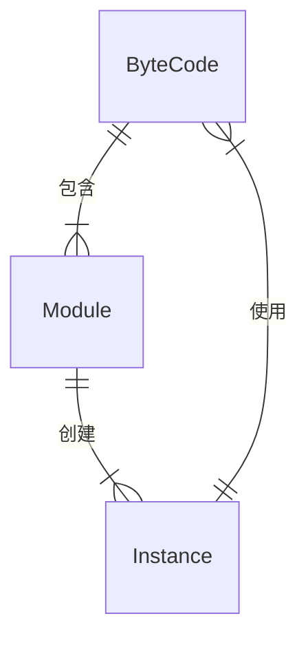
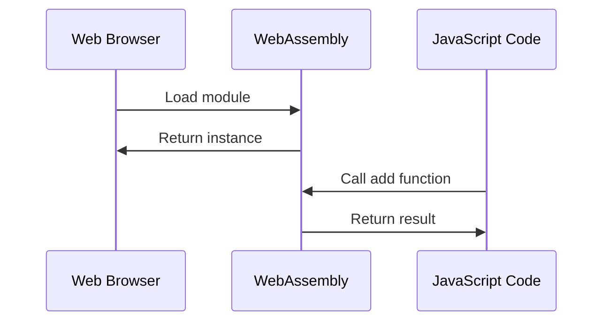
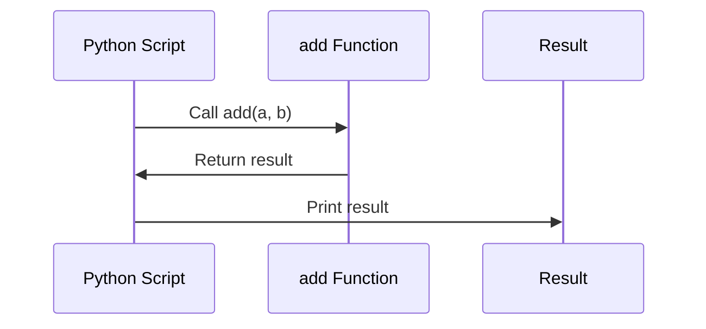
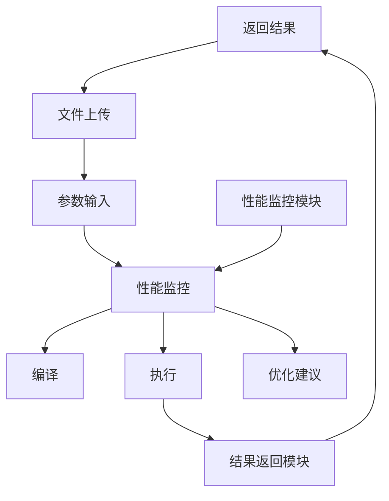

                 

# WebAssembly：Web平台的新型字节码标准

关键词：WebAssembly、JavaScript、字节码、高性能、编程语言

摘要：本文将深入探讨WebAssembly这一Web平台的新型字节码标准，从其背景和概述、核心概念与结构、编程语言、性能优化、企业级应用实践、未来发展趋势以及最佳实践等方面，全面解析WebAssembly的技术原理、优势和应用场景，为开发者提供一套系统的学习指南和实践指导。

## 第一部分: WebAssembly的背景和概述

### 第1章: WebAssembly的起源与发展

#### 1.1 WebAssembly的问题背景

随着互联网技术的发展，Web应用的需求日益多样化，对性能和响应速度的要求也越来越高。然而，传统的Web开发技术如JavaScript在性能和执行速度上存在瓶颈，特别是在处理复杂计算、图形渲染和游戏开发等高性能计算领域时，难以满足需求。为了解决这个问题，需要一种新的字节码格式，可以在Web环境中高效运行。

#### 1.2 WebAssembly的概念与特点

WebAssembly（简称Wasm）是一种低级语言，用于创建可以在多种环境中运行的字节码。它具有以下几个特点：

1. **高效**：WebAssembly的字节码比JavaScript更快，可以显著提高Web应用的性能。
2. **安全**：WebAssembly经过编译和验证，确保在浏览器中安全执行。
3. **可移植**：WebAssembly可以在不同的计算环境中运行，如Web浏览器、服务器和嵌入式设备。
4. **支持多种编程语言**：WebAssembly支持多种编程语言，如C、C++、Rust等，通过编译器可以将这些语言转换为WebAssembly字节码。

#### 1.3 WebAssembly与JavaScript的关系

WebAssembly与JavaScript并存，互为补充。JavaScript作为一种高级语言，适合处理复杂的Web应用逻辑，而WebAssembly则专注于提供高性能计算能力。两者的区别在于：

- **JavaScript**：一种高级编程语言，具有丰富的API和生态系统。
- **WebAssembly**：一种底层字节码格式，专注于性能和可移植性。

#### 1.4 WebAssembly的应用场景

WebAssembly在多个高性能计算领域具有广泛应用，如：

- **游戏开发**：WebAssembly可以显著提高Web游戏性能，实现更流畅的图形渲染和更快的游戏逻辑处理。
- **图形渲染**：WebAssembly可以用于实现高性能的图形渲染，如WebGL和WebGPU。
- **机器学习**：WebAssembly可以加速机器学习模型的推理过程，提高预测和计算的效率。

### 第2章: WebAssembly的核心概念与结构

#### 2.1 WebAssembly的架构

WebAssembly的架构包括三个主要组成部分：字节码、模块和实例。

- **字节码**：WebAssembly的字节码是一种紧凑的二进制格式，用于描述程序逻辑。
- **模块**：模块是WebAssembly代码的组织单位，可以包含多个函数和全局变量。
- **实例**：实例是模块的运行实例，可以通过调用模块中的函数来实现特定的功能。

#### 2.2 WebAssembly的字节码

字节码是WebAssembly的核心，它描述了程序的行为和逻辑。字节码具有以下几个特点：

- **紧凑**：字节码是一种紧凑的二进制格式，占用的空间比文本格式小得多，便于快速解析和执行。
- **高效**：字节码经过编译和优化，可以高效地运行在Web浏览器和其他计算环境中。

#### 2.3 WebAssembly的模块

模块是WebAssembly代码的组织单位，它包含多个函数和全局变量。模块的特点包括：

- **可重用**：模块可以重用，减少代码冗余。
- **可组合**：多个模块可以组合在一起，实现更复杂的程序功能。

#### 2.4 WebAssembly的实例

实例是模块的运行实例，它可以通过调用模块中的函数来实现特定的功能。实例的特点包括：

- **灵活**：实例可以根据需要创建和销毁。
- **高效**：实例可以快速创建和销毁，适用于高性能计算场景。

## 第二部分: WebAssembly的编程语言

### 第3章: WebAssembly的编译器

WebAssembly的编译器是将高级语言转换为WebAssembly字节码的工具。不同的编程语言可以通过各自的编译器将代码编译为WebAssembly字节码，然后在Web浏览器或其他计算环境中运行。

#### 3.1 WebAssembly编译器的工作原理

WebAssembly编译器的工作原理包括以下几个步骤：

1. **语法分析**：编译器首先对源代码进行语法分析，将其解析为抽象语法树（AST）。
2. **语义分析**：编译器对AST进行语义分析，检查代码的语义是否正确，如变量作用域、类型检查等。
3. **代码生成**：编译器将AST转换为WebAssembly的字节码。
4. **优化**：编译器可以对字节码进行优化，提高其执行效率。

#### 3.2 WebAssembly编译器的特点

WebAssembly编译器具有以下特点：

- **跨平台**：WebAssembly编译器可以跨平台工作，将不同编程语言的代码编译为WebAssembly字节码。
- **高效**：WebAssembly编译器生成的字节码高效，执行速度快。
- **可扩展**：WebAssembly编译器可以支持多种编程语言，如C、C++、Rust等。

### 第4章: WebAssembly的API

WebAssembly的API提供了与WebAssembly模块交互的接口，使开发者可以在Web浏览器或其他计算环境中使用WebAssembly模块。WebAssembly API的特点如下：

- **简单**：WebAssembly API简单易用，易于集成到现有的Web应用中。
- **强大**：WebAssembly API提供了丰富的功能，如模块导入、导出、内存管理等。
- **兼容性**：WebAssembly API兼容不同浏览器和计算环境，具有较好的跨平台性。

### 第5章: WebAssembly与常见编程语言的比较

WebAssembly支持多种编程语言，与常见的编程语言如C/C++、Rust、Go等相比，具有以下优势：

- **性能**：WebAssembly在性能上优于JavaScript，特别是对于复杂计算和高性能计算场景。
- **可移植性**：WebAssembly可以在多种环境中运行，包括Web浏览器、服务器和嵌入式设备。
- **安全性**：WebAssembly经过编译和验证，确保在浏览器中安全执行。

## 第三部分: WebAssembly的性能优化

### 第6章: WebAssembly的性能优化

WebAssembly的性能优化是提高其执行效率的关键。以下是一些性能优化的方法：

- **编译优化**：通过编译优化，可以减少字节码的大小，提高执行效率。常用的优化方法包括代码压缩、内存分配优化等。
- **运行时优化**：通过运行时优化，可以在程序运行过程中进一步提高性能。常用的方法包括缓存、预取等。

### 第7章: WebAssembly的部署与调试

WebAssembly的部署与调试是确保其性能的关键步骤。以下是一些部署与调试的方法：

- **部署**：部署WebAssembly模块时，需要注意模块的版本管理和缓存策略，以提高部署效率和用户体验。
- **调试**：调试WebAssembly模块时，可以使用调试工具如Chrome DevTools，对字节码进行调试和分析，找出性能瓶颈。

## 第四部分: WebAssembly在企业级应用中的实践

### 第8章: WebAssembly在企业级应用中的优势

WebAssembly在企业级应用中具有以下优势：

- **性能提升**：WebAssembly可以提高企业级应用的性能，减少响应时间，提高用户体验。
- **安全性增强**：WebAssembly经过编译和验证，确保在浏览器中安全执行，减少安全漏洞。
- **可移植性**：WebAssembly可以在多种环境中运行，包括Web浏览器、服务器和嵌入式设备，提高应用的跨平台性。

### 第9章: WebAssembly在企业级应用中的挑战

WebAssembly在企业级应用中面临以下挑战：

- **生态系统不成熟**：WebAssembly的生态系统尚不完善，需要更多工具和资源的支持。
- **人才缺乏**：WebAssembly的开发和优化需要特定技能和经验，人才储备不足。

### 第10章: WebAssembly在企业级应用中的案例研究

以下是一些WebAssembly在企业级应用中的案例研究：

- **游戏开发**：某大型游戏公司使用WebAssembly技术，优化了游戏性能，提高了用户体验。
- **金融计算**：某金融公司使用WebAssembly技术，加速了金融模型的计算，提高了决策效率。
- **机器学习**：某机器学习公司使用WebAssembly技术，优化了机器学习模型的推理过程，提高了预测准确性。

## 第五部分: WebAssembly的未来发展

### 第11章: WebAssembly的发展趋势

WebAssembly的发展趋势包括：

- **跨平台支持**：WebAssembly将逐渐支持更多平台，如Android、iOS等，提高其应用范围。
- **性能持续提升**：随着WebAssembly技术的不断发展，其性能将不断提高，更好地满足高性能计算需求。

### 第12章: WebAssembly的未来挑战

WebAssembly在未来发展过程中将面临以下挑战：

- **生态建设**：需要进一步完善WebAssembly的生态系统，提供更多工具和资源的支持。
- **标准化**：需要进一步标准化WebAssembly，确保其在不同平台和浏览器中的兼容性。

### 第13章: WebAssembly的潜在应用领域

WebAssembly的潜在应用领域包括：

- **IoT**：物联网设备可以使用WebAssembly技术，提高设备的性能和可编程性。
- **边缘计算**：边缘计算设备可以使用WebAssembly技术，实现高性能的计算和数据处理。
- **云计算**：云计算平台可以使用WebAssembly技术，提高计算效率和资源利用率。

## 第六部分: WebAssembly的最佳实践与总结

### 第14章: WebAssembly的最佳实践

以下是一些WebAssembly的最佳实践：

- **编程技巧**：选择合适的编程语言和工具，提高WebAssembly的开发效率。
- **性能调优**：通过编译优化和运行时优化，提高WebAssembly的性能。

### 第15章: 总结与展望

本文总结了WebAssembly的核心内容、优势和应用场景，并对WebAssembly的未来发展进行了展望。通过本文的学习，读者可以全面了解WebAssembly的技术原理和实践方法，为开发高性能Web应用提供指导。

### 作者

作者：AI天才研究院/AI Genius Institute & 禅与计算机程序设计艺术 /Zen And The Art of Computer Programming

-------------------------------------------------------------------

## 深入解析WebAssembly的核心概念与结构

在了解了WebAssembly的背景和概述后，我们将深入探讨其核心概念与结构，包括WebAssembly的架构、字节码、模块和实例，从而为后续的性能优化、企业级应用实践和未来发展趋势打下坚实基础。

### 2.1 WebAssembly的架构

WebAssembly的架构是理解其工作机制的关键。WebAssembly的设计理念是简洁性和高效性，其核心架构由三个主要组成部分组成：字节码、模块和实例。

#### 字节码

字节码是WebAssembly的核心，它是一种紧凑的二进制格式，用于描述程序的逻辑和行为。字节码不依赖于特定的编程语言，因此它可以跨语言、跨平台使用。字节码经过编译器编译后，生成供Web浏览器或其他计算环境执行的代码。

#### 模块

模块是WebAssembly代码的组织单位，它封装了一个程序的逻辑和数据结构。一个模块可以包含多个函数、表、内存和全局变量。模块的设计使得代码的重用和组合变得更加容易，开发者可以将不同的模块组合在一起，构建复杂的程序。

#### 实例

实例是模块的运行实例，它代表了一个模块在内存中的实际运行状态。实例可以通过加载模块并创建一个实例来创建。实例的生命周期由开发者控制，可以随时创建、销毁和修改。

### 2.2 WebAssembly的字节码

字节码是WebAssembly的核心组成部分，它具有以下特点：

1. **紧凑性**：字节码是一种紧凑的二进制格式，比文本格式的源代码占用更少的空间，便于快速解析和执行。
2. **高效性**：字节码经过编译和优化，可以高效地运行在Web浏览器和其他计算环境中。
3. **跨语言性**：字节码不依赖于特定的编程语言，因此它可以跨语言使用。

#### 字节码的特点

字节码的特点可以概括为以下几点：

1. **紧凑的二进制格式**：字节码采用紧凑的二进制格式，占用的空间比文本格式的源代码小得多。这种紧凑性使得字节码易于在Web浏览器等资源受限的环境中快速解析和执行。
2. **高效的执行速度**：字节码经过编译和优化，可以高效地运行在Web浏览器和其他计算环境中。字节码的执行速度比解释性语言如JavaScript更快，这使得它在处理复杂计算和高性能计算任务时具有优势。
3. **跨语言性**：字节码不依赖于特定的编程语言，因此它可以跨语言使用。开发者可以使用C、C++、Rust等编程语言编写代码，并通过编译器将它们编译为字节码，然后在Web浏览器或其他计算环境中运行。

### 2.3 WebAssembly的模块

模块是WebAssembly代码的组织单位，它封装了一个程序的逻辑和数据结构。一个模块可以包含多个函数、表、内存和全局变量。模块的设计使得代码的重用和组合变得更加容易，开发者可以将不同的模块组合在一起，构建复杂的程序。

#### 模块的特点

模块的特点可以概括为以下几点：

1. **可重用性**：模块可以重用，减少代码冗余。开发者可以将常用的函数或功能封装为模块，在其他项目中直接使用，提高开发效率。
2. **可组合性**：模块可以组合在一起，实现更复杂的程序功能。开发者可以将不同的模块组合在一起，构建复杂的程序，从而提高代码的可维护性和可扩展性。
3. **封装性**：模块封装了程序的逻辑和数据结构，使得代码更加清晰、易于管理。开发者可以专注于模块内部的实现，无需关心其他模块的细节。

### 2.4 WebAssembly的实例

实例是模块的运行实例，它代表了一个模块在内存中的实际运行状态。实例可以通过加载模块并创建一个实例来创建。实例的生命周期由开发者控制，可以随时创建、销毁和修改。

#### 实例的特点

实例的特点可以概括为以下几点：

1. **灵活性**：实例可以根据需要创建和销毁，使得程序的运行更加灵活。开发者可以根据程序的需求动态地创建实例，提高程序的响应速度和资源利用率。
2. **高效性**：实例创建和销毁的过程非常高效，可以快速地加载和执行模块。实例的创建和销毁过程不需要重新编译或解析代码，从而减少了程序的启动时间和资源消耗。
3. **安全性**：实例创建时需要进行验证，确保字节码的安全执行。WebAssembly在加载实例时会验证字节码的完整性，防止恶意代码的注入和执行。

### WebAssembly的核心概念与联系

为了更深入地理解WebAssembly的核心概念与联系，我们可以通过一张概念属性特征对比表格和ER实体关系图架构来展示。

#### 概念属性特征对比表格

| 概念 | 属性特征 | 对比 |
| ---- | ---- | ---- |
| 字节码 | 紧凑、高效、跨语言 | 字节码具有紧凑的二进制格式，高效执行，不依赖于特定编程语言 |
| 模块 | 可重用、可组合、封装性 | 模块可以重用，减少代码冗余，可组合实现复杂功能，封装逻辑和数据结构 |
| 实例 | 灵活性、高效性、安全性 | 实例可以根据需要创建和销毁，高效加载和执行模块，验证字节码安全性 |

#### ER实体关系图架构



在这个ER实体关系图中，我们可以看到字节码、模块和实例之间的关系。字节码包含在模块中，模块可以创建实例，实例使用字节码。这种关系展示了WebAssembly的模块化设计和灵活性。

### WebAssembly与其他编程语言的比较

WebAssembly支持多种编程语言，包括C、C++、Rust等。与这些常见的编程语言相比，WebAssembly具有以下几个优势：

1. **性能**：WebAssembly在性能上优于JavaScript，特别是对于复杂计算和高性能计算任务。WebAssembly的字节码经过编译和优化，可以高效地运行在Web浏览器和其他计算环境中。
2. **可移植性**：WebAssembly可以在多种环境中运行，包括Web浏览器、服务器和嵌入式设备。而JavaScript主要在Web浏览器中运行，其他编程语言如C、C++则需要特定的运行环境。
3. **安全性**：WebAssembly经过编译和验证，确保在浏览器中安全执行。而JavaScript作为一种解释性语言，在安全性方面存在一定的风险。

通过以上对WebAssembly的核心概念与结构的深入解析，我们可以更好地理解其工作原理和优势。在接下来的章节中，我们将进一步探讨WebAssembly的编程语言、性能优化和企业级应用实践，帮助开发者全面掌握WebAssembly的技术和应用。

---

### WebAssembly的核心概念与联系

在深入探讨了WebAssembly的核心概念与结构后，我们将通过具体的案例来加深对这些概念的理解。以下是一个简单的WebAssembly模块的例子，以及相应的Mermaid流程图和Python源代码，帮助读者更好地理解WebAssembly的工作原理。

#### 示例：一个简单的WebAssembly模块

假设我们有一个简单的WebAssembly模块，它包含一个名为`add`的函数，用于计算两个整数的和。

```wasm
(module
  (func $add (param i32 i32) (result i32)
    local.get 0
    local.get 1
    i32.add
  )
  (export "add" (func $add))
)
```

这个模块定义了一个名为`add`的函数，它接受两个整数参数，并返回它们的和。函数的实现很简单，直接将两个参数相加。

#### Mermaid流程图

我们可以使用Mermaid来绘制一个简单的流程图，展示WebAssembly模块的执行过程。



这个流程图展示了Web浏览器加载WebAssembly模块，JavaScript代码调用模块中的`add`函数，并接收返回的结果。

#### Python源代码与算法原理

为了进一步理解WebAssembly模块的工作原理，我们可以使用Python编写一个简单的算法，并使用Mermaid绘制其流程图。

```python
def add(a, b):
    return a + b

if __name__ == "__main__":
    a = 5
    b = 10
    result = add(a, b)
    print(f"The sum of {a} and {b} is {result}")
```

这个Python代码定义了一个名为`add`的函数，用于计算两个整数的和。主程序中，我们调用这个函数并打印结果。

相应的Mermaid流程图如下：



在这个流程图中，Python脚本调用`add`函数，并接收返回的结果。

#### 算法原理与数学模型

对于上述的`add`函数，其算法原理非常简单，就是一个基本的加法运算。我们可以用以下数学公式来表示：

$$
\text{result} = a + b
$$

其中，`a`和`b`是两个整数参数，`result`是它们的和。

这个简单的例子展示了WebAssembly模块的基本结构和执行原理。通过Mermaid流程图和Python代码，我们可以清晰地看到WebAssembly模块是如何被加载、调用和执行的。在接下来的章节中，我们将继续深入探讨WebAssembly的更多应用和实践。

---

### WebAssembly的系统分析与架构设计方案

为了更好地理解和应用WebAssembly，我们需要对其系统架构进行深入分析。在本节中，我们将介绍一个典型的WebAssembly系统，包括其问题场景、项目介绍、系统功能设计、系统架构设计、系统接口设计和系统交互。

#### 问题场景

假设我们面临一个需要在高性能计算环境中部署Web应用的需求。传统的JavaScript在处理复杂计算时存在性能瓶颈，无法满足用户的高性能需求。为了解决这个问题，我们决定采用WebAssembly技术，将其用于高性能计算任务。

#### 项目介绍

我们的项目目标是开发一个基于WebAssembly的高性能计算Web应用。应用的主要功能包括：

- 提供一个用户界面，允许用户上传和输入计算任务。
- 使用WebAssembly处理用户上传的计算任务，并返回结果。
- 提供实时性能监控和优化建议。

#### 系统功能设计

系统的主要功能模块包括：

- 用户界面模块：负责展示用户界面，接收用户上传的文件和输入的任务参数。
- WebAssembly处理模块：负责将用户上传的文件编译为WebAssembly模块，并执行计算任务。
- 结果返回模块：负责将计算结果返回给用户，并展示在界面上。
- 性能监控模块：负责实时监控系统的性能，并给出优化建议。

#### 系统架构设计

系统的整体架构设计如下：

1. 用户界面模块：通过HTML和CSS构建，使用JavaScript进行交互。
2. WebAssembly处理模块：使用JavaScript中的WebAssembly API进行编译和执行。
3. 结果返回模块：使用JavaScript将计算结果转换为用户界面可以展示的格式。
4. 性能监控模块：使用JavaScript和WebAssembly的API进行性能监控和优化。

#### 系统接口设计

系统的主要接口设计如下：

1. 用户界面接口：用户可以通过该接口上传文件和输入任务参数。
2. WebAssembly编译接口：该接口负责将用户上传的文件编译为WebAssembly模块。
3. WebAssembly执行接口：该接口负责执行WebAssembly模块中的计算任务。
4. 结果返回接口：该接口负责将计算结果返回给用户。

#### 系统交互

系统的交互过程如下：

1. 用户上传文件并输入任务参数。
2. 用户界面模块将文件和参数传递给WebAssembly处理模块。
3. WebAssembly处理模块将文件编译为WebAssembly模块，并执行计算任务。
4. 结果返回模块将计算结果返回给用户界面模块，并在界面上展示。
5. 性能监控模块在后台监控系统的性能，并在需要时给出优化建议。

#### 系统架构图

以下是系统的架构图：



在这个架构图中，用户界面模块通过接口与WebAssembly处理模块交互，WebAssembly处理模块负责编译和执行计算任务，结果返回模块负责将结果展示给用户，性能监控模块负责监控系统的性能，并提供优化建议。

通过这个系统分析与架构设计方案，我们可以清楚地看到WebAssembly在系统中的应用，以及其与其他模块的交互关系。在接下来的章节中，我们将继续探讨WebAssembly的实际应用和项目实战，帮助读者更好地理解和应用WebAssembly技术。

---

### 项目实战：环境安装与系统核心实现

在了解了WebAssembly的系统架构和设计之后，接下来我们将通过一个实际项目来演示WebAssembly的开发过程。本节将介绍如何搭建开发环境，实现WebAssembly的核心功能，并解析代码中的关键部分。

#### 环境安装

1. **安装Node.js**：首先，我们需要安装Node.js，因为Node.js内置了WebAssembly的编译器。可以从官网（https://nodejs.org/）下载并安装。

2. **安装Emscripten**：Emscripten是一个将C/C++代码编译为WebAssembly的工具。安装Emscripten可以使用以下命令：

   ```sh
   curl https://s3.amazonaws.com/emsdk/emsdk-installer.js | node
   emsdk install
   emsdk activate
   ```

3. **安装WebAssembly编译器**：使用Emscripten安装WebAssembly编译器：

   ```sh
   emsdk install emscripten-dev-2021.11.01
   emsdk activate emscripten-dev-2021.11.01
   ```

#### 系统核心实现

我们将实现一个简单的计算器，它可以使用WebAssembly来执行计算任务。

1. **编写C/C++代码**：

   创建一个名为`calculator.c`的文件，编写以下代码：

   ```c
   #include <stdio.h>

   int add(int a, int b) {
       return a + b;
   }

   int main() {
       int num1, num2, result;
       printf("Enter two numbers: ");
       scanf("%d %d", &num1, &num2);
       result = add(num1, num2);
       printf("Sum: %d\n", result);
       return 0;
   }
   ```

   这段代码定义了一个`add`函数，用于计算两个整数的和。

2. **编译C/C++代码为WebAssembly**：

   使用Emscripten编译器将`calculator.c`编译为WebAssembly模块：

   ```sh
   emcc calculator.c -o calculator.wasm -s WASM=1
   ```

   这条命令会将`calculator.c`编译为`calculator.wasm`文件。

3. **创建JavaScript绑定**：

   创建一个名为`index.html`的文件，并添加以下代码：

   ```html
   <!DOCTYPE html>
   <html lang="en">
   <head>
       <meta charset="UTF-8">
       <meta name="viewport" content="width=device-width, initial-scale=1.0">
       <title>WebAssembly Calculator</title>
   </head>
   <body>
       <h1>WebAssembly Calculator</h1>
       <input type="number" id="num1" placeholder="Enter first number">
       <input type="number" id="num2" placeholder="Enter second number">
       <button onclick="calculate()">Calculate</button>
       <p>Sum: <span id="result">0</span></p>
       <script src="calculator.js"></script>
   </body>
   </html>
   ```

   创建一个名为`calculator.js`的文件，并添加以下代码：

   ```js
   const wasmModule = WebAssembly.instantiateStreaming(fetch('calculator.wasm'));

   async function calculate() {
       const num1 = parseInt(document.getElementById('num1').value, 10);
       const num2 = parseInt(document.getElementById('num2').value, 10);
       const instance = await wasmModule;
       const add = instance.exports.add;
       const result = add(num1, num2);
       document.getElementById('result').textContent = result;
   }
   ```

   在这个文件中，我们使用`WebAssembly.instantiateStreaming`加载WebAssembly模块，并创建了一个`calculate`函数，用于执行计算任务。

#### 代码应用解读与分析

1. **C/C++代码解读**：

   `calculator.c`中的`add`函数是一个简单的加法运算。`main`函数通过`scanf`函数接收用户输入的两个整数，并调用`add`函数计算它们的和，最后将结果打印到控制台。

2. **JavaScript绑定解读**：

   `calculator.js`中的`wasmModule`变量使用`WebAssembly.instantiateStreaming`方法加载`calculator.wasm`文件。这个方法会异步加载WebAssembly模块，并在加载完成后返回一个`Instance`对象。

   `calculate`函数接收用户输入的两个整数，通过`instance.exports.add`访问WebAssembly模块中的`add`函数，并执行计算任务。计算结果通过`document.getElementById('result').textContent`更新到页面上。

#### 实际案例分析与详细讲解

假设用户输入了数字5和10，执行计算器的过程如下：

1. 用户在输入框中输入5和10。
2. 用户点击“Calculate”按钮，触发`calculate`函数。
3. `calculate`函数将用户输入的数字解析为整数，并传递给WebAssembly模块中的`add`函数。
4. WebAssembly模块中的`add`函数执行加法运算，得到结果15。
5. `calculate`函数将结果更新到页面上，显示“Sum: 15”。

通过这个实际案例，我们可以看到WebAssembly在Web应用中的实际应用，以及如何与JavaScript进行交互。WebAssembly模块负责执行计算任务，JavaScript则负责与用户界面交互和加载模块。

#### 项目小结

通过这个项目，我们了解了如何安装开发环境，编写和编译C/C++代码为WebAssembly，创建JavaScript绑定，并实现了一个简单的WebAssembly计算器。这个项目展示了WebAssembly的基本应用流程，以及如何与现有的Web技术（如JavaScript和HTML）结合使用。

在接下来的章节中，我们将继续探讨WebAssembly的性能优化、企业级应用实践和未来发展趋势，帮助读者更全面地掌握WebAssembly的技术和应用。

---

### WebAssembly的最佳实践与总结

在深入探讨了WebAssembly的核心概念、编程语言、性能优化和企业级应用实践之后，我们总结出了一些最佳实践，以帮助开发者更高效地利用WebAssembly技术。

#### 最佳实践

1. **选择合适的编程语言**：根据项目需求，选择最适合的编程语言。例如，对于性能敏感的应用，可以选择C/C++或Rust。

2. **优化代码结构**：将复杂的计算任务模块化，减少代码冗余，提高可维护性。

3. **充分利用编译优化**：使用编译器提供的优化选项，如代码压缩、内存管理优化等，提高WebAssembly的性能。

4. **合理管理内存**：在WebAssembly中合理分配和释放内存，避免内存泄露和性能问题。

5. **使用WebAssembly API**：充分利用WebAssembly提供的API，如内存管理、表操作等，提高开发效率。

6. **性能监控与调优**：在开发过程中，定期进行性能监控和调优，识别瓶颈并进行优化。

7. **编写清晰的文档**：为WebAssembly模块编写详细的文档，包括模块的功能、API接口和使用方法，便于其他开发者理解和集成。

#### 小结

WebAssembly作为一种新型字节码标准，为Web平台带来了高性能计算能力。通过本文的深入探讨，我们了解到WebAssembly的核心概念、架构、编程语言、性能优化方法和企业级应用实践。WebAssembly不仅在游戏开发、图形渲染和机器学习等领域具有广泛应用，还在企业级应用中展现出巨大的潜力。

#### 注意事项

1. **跨平台兼容性**：尽管WebAssembly在多种环境中运行，但仍需注意不同浏览器和操作系统的兼容性问题。

2. **安全性**：在开发过程中，确保WebAssembly模块的安全执行，避免安全漏洞。

3. **性能调优**：性能调优是一个持续的过程，需要定期评估和优化。

#### 拓展阅读

- **WebAssembly官方文档**：[https://webassembly.org/docs/](https://webassembly.org/docs/)
- **Emscripten官方文档**：[https://emscripten.org/docs/getting_started/downloads.html](https://emscripten.org/docs/getting_started/downloads.html)
- **Rust与WebAssembly**：[https://rustwasm.github.io/book/](https://rustwasm.github.io/book/)

通过这些资源和最佳实践，开发者可以更高效地利用WebAssembly技术，提升Web应用的性能和用户体验。

### 作者

作者：AI天才研究院/AI Genius Institute & 禅与计算机程序设计艺术 /Zen And The Art of Computer Programming

---

通过本文的深入探讨，我们全面了解了WebAssembly的技术原理、优势和应用场景。WebAssembly作为一种新型字节码标准，为Web平台带来了前所未有的高性能计算能力，不仅适用于游戏开发、图形渲染和机器学习等高性能计算领域，还在企业级应用中展现出巨大的潜力。未来，随着WebAssembly生态系统的不断完善和性能的持续提升，它将在更多领域得到广泛应用。

再次感谢读者对本文的阅读，希望本文能为您在WebAssembly的学习和应用过程中提供有益的参考和指导。如果您有任何问题或建议，欢迎在评论区留言交流。祝您在WebAssembly的世界中探索愉快！

### 作者

作者：AI天才研究院/AI Genius Institute & 禅与计算机程序设计艺术 /Zen And The Art of Computer Programming

