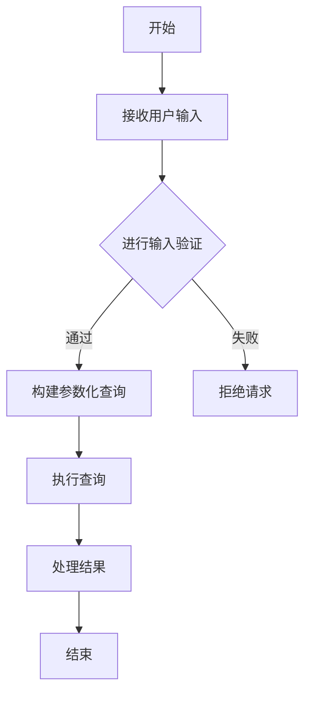
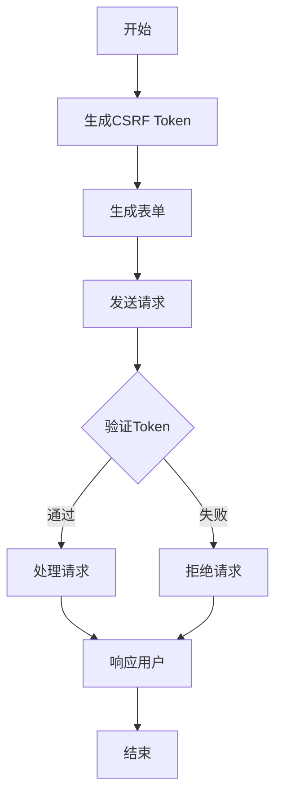
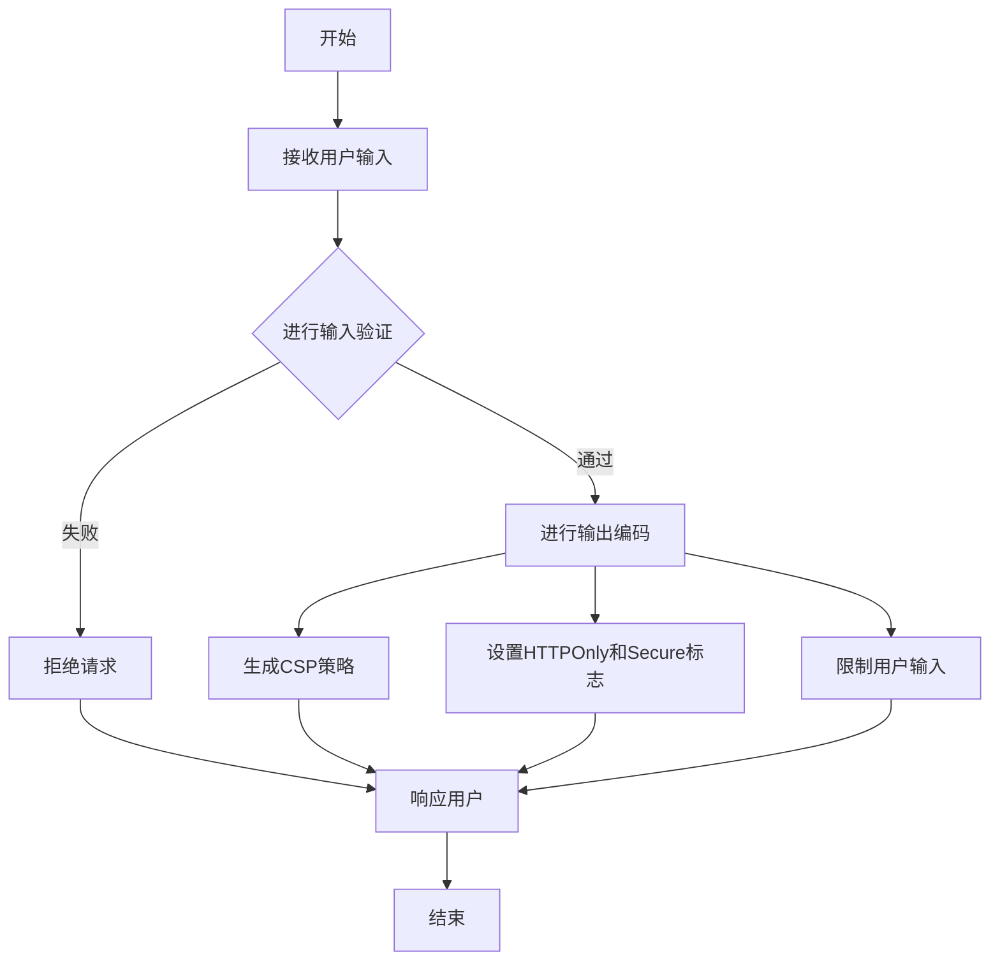
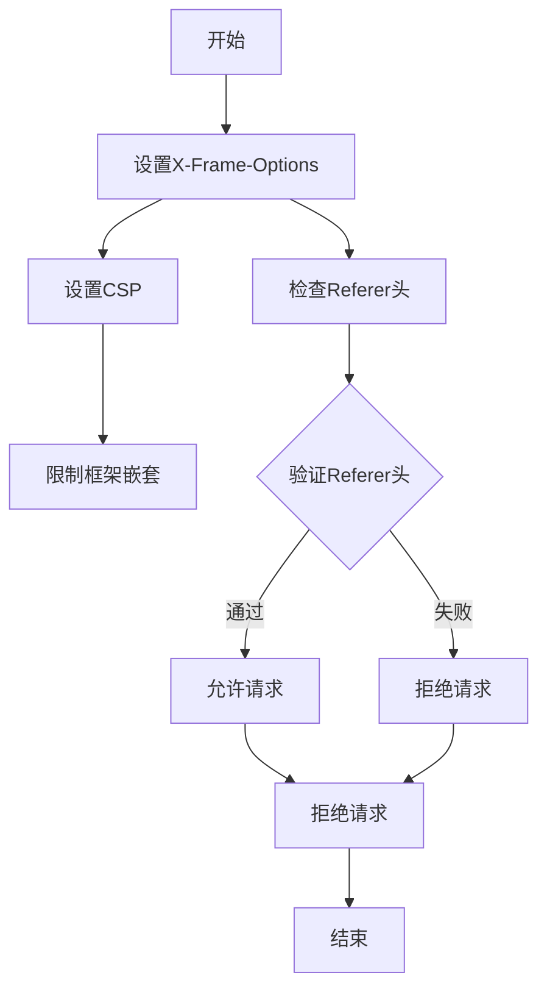
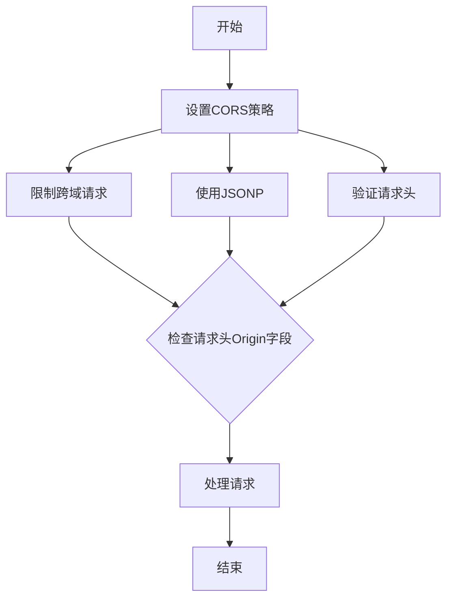
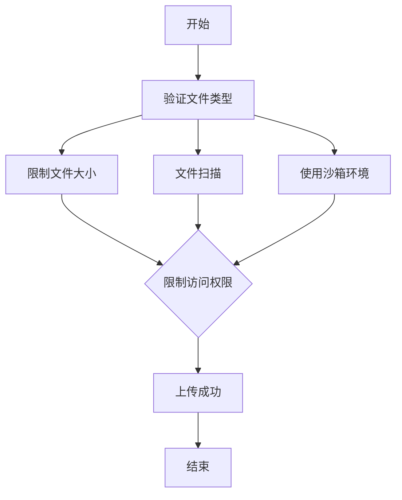
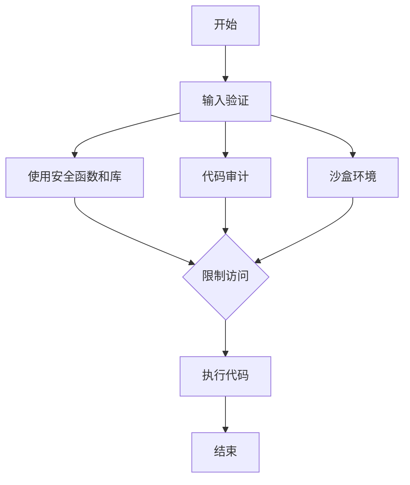

                 


### 背景介绍
#### 1.1 互联网安全的重要性
互联网已经成为现代社会的重要组成部分，网络安全的重要性日益凸显。Web安全作为网络安全的核心领域，关系到个人隐私、企业利益和国家安全。在Web应用日益普及的今天，各种网络攻击手段层出不穷，如SQL注入、XSS、CSRF等。这些攻击不仅会导致数据泄露、服务瘫痪，还会给企业和个人带来巨大的经济损失和声誉损害。

#### 1.2 常见Web攻击类型
- **SQL注入（SQL Injection）**：攻击者通过在Web应用输入字段注入恶意SQL语句，从而获取未授权访问或篡改数据库。
- **XSS（Cross-Site Scripting）**：攻击者利用Web应用的安全漏洞，注入恶意脚本，从而在用户浏览时执行恶意代码。
- **CSRF（Cross-Site Request Forgery）**：攻击者通过伪造请求，欺骗用户进行未授权的操作。
- **Clickjacking**：攻击者通过叠加透明的网页元素，诱骗用户点击虚假的按钮或链接。
- **CORS（Cross-Origin Resource Sharing）**：攻击者利用跨域请求，获取未经授权的资源。

#### 1.3 安全现状与挑战
随着技术的不断发展，Web攻击手段也在不断进化。传统的防御手段已经难以应对复杂多变的攻击方式。目前，Web安全面临的挑战主要包括：
- **攻击面广泛**：Web应用涉及的数据量庞大，攻击面广泛，使得安全防护复杂。
- **漏洞层出不穷**：Web应用开发过程中，难免会出现各种安全漏洞，攻击者往往可以利用这些漏洞发起攻击。
- **安全投入不足**：许多企业和个人对Web安全的重视程度不足，导致安全防护投入不足。

### 核心概念与联系
#### 1.2.1 Web安全核心概念
- **网络安全**：确保网络系统中的数据和资源不被未经授权的访问、篡改或破坏。
- **Web安全**：针对Web应用的安全保护，防范各种网络攻击。
- **安全策略**：制定一系列安全措施，防范和应对网络攻击。

#### 1.2.2 概念属性特征对比表格

| 概念         | 属性               | 特征                                               |
| ------------ | ------------------ | -------------------------------------------------- |
| 网络安全     | 保护对象           | 数据、系统、资源                                   |
| Web安全     | 防范对象           | Web应用、输入字段、请求处理等                      |
| 安全策略     | 保护措施           | 防火墙、加密、访问控制等                          |

#### 1.2.3 ER实体关系图架构

```mermaid
erDiagram
    User ||--|{ Order } : "places"
    User ||--|{ Payment } : "makes"
    Order ||--|{ Item } : "contains"
    Order ||--|{ Review } : "receives"
    Payment ||--|{ Transaction } : "processes"
```

### 第一部分：背景介绍
#### 1.1 问题背景
Web安全是网络安全的重要组成部分，直接关系到企业和个人的信息安全。随着互联网的普及，Web应用的数量和用户数量都在迅速增长，这同时也为网络攻击提供了更多的目标。网络攻击形式多样，其中常见的包括SQL注入、XSS、CSRF、Clickjacking、CORS等。

**SQL注入**是一种通过在Web应用的输入字段注入恶意SQL语句，从而实现对数据库的非法访问或篡改的攻击。这种攻击通常发生在输入验证不严格的情况下，攻击者可以通过构造特定的输入数据，使得Web应用执行恶意的SQL命令。

**XSS攻击**是指攻击者通过在Web应用中注入恶意脚本，使得这些脚本在用户的浏览器中执行。XSS攻击通常分为存储型、反射型和基于DOM的三种类型。存储型XSS攻击将恶意脚本存储在Web服务器上，反射型XSS攻击通过URL参数传递恶意脚本，而基于DOM的XSS攻击则完全依赖DOM进行攻击。

**CSRF攻击**（Cross-Site Request Forgery）是指攻击者通过伪造请求，欺骗用户的浏览器向服务器发送未授权的请求。CSRF攻击通常利用用户已经登录的身份，进行一些敏感操作，如修改密码、转账等。

**Clickjacking**是一种通过叠加透明的网页元素，诱骗用户点击虚假按钮或链接的攻击。这种攻击通常让用户在不知不觉中点击了恶意链接，从而泄露敏感信息或执行不安全的操作。

**CORS攻击**（Cross-Origin Resource Sharing）是指攻击者通过跨域请求，获取未经授权的资源。这种攻击通常发生在Web应用需要访问跨域资源的情况下，如果处理不当，可能导致敏感数据泄露。

Web安全面临的挑战主要包括：
- **漏洞挖掘与利用**：随着Web应用的复杂性增加，安全漏洞的数量也在增加，攻击者可以利用这些漏洞进行攻击。
- **动态内容处理**：Web应用中的动态内容处理不当，可能导致安全漏洞。
- **用户行为不可控**：用户的行为难以预测，可能会无意中触发安全漏洞。

为了应对这些挑战，需要采取一系列的安全措施，包括输入验证、输出编码、安全配置等。此外，还需要定期进行安全审计和漏洞扫描，以确保Web应用的安全性。

#### 1.2 核心概念与联系
在Web安全中，有几个核心概念需要了解：

**网络安全**：网络安全是指保护网络系统中的数据、系统、资源和设备，防止未经授权的访问、篡改、破坏或泄露。网络安全的范围广泛，包括防火墙、加密、访问控制、入侵检测等多个方面。

**Web安全**：Web安全是网络安全的一个子集，主要针对Web应用的安全进行保护。Web安全涉及到输入验证、输出编码、安全配置、会话管理等多个方面。

**安全策略**：安全策略是一系列安全措施和指导原则，用于保护Web应用的安全性。安全策略包括安全设计、安全开发、安全测试、安全运营等多个环节。

这三个概念之间存在紧密的联系：

- **网络安全**是Web安全的基础，提供了保护网络环境的基本措施。
- **Web安全**是在网络安全的基础上，针对Web应用的特殊性进行的具体安全措施。
- **安全策略**是实施Web安全的指导原则，确保安全措施得到有效执行。

通过了解这些核心概念，我们可以更好地理解Web安全的本质，并采取适当的安全措施来保护Web应用的安全性。

#### 1.2.1 Web安全核心概念
在深入探讨Web安全之前，首先需要了解几个核心概念，这些概念是理解和实施Web安全的基础。

**网络安全**：网络安全是指保护网络系统中的数据、系统、资源和设备，防止未经授权的访问、篡改、破坏或泄露。网络安全的范围广泛，包括防火墙、加密、访问控制、入侵检测等多个方面。

网络安全的目标是确保网络系统的连续性、完整性和保密性。为了实现这些目标，通常会采取以下措施：
- **防火墙**：防火墙是一种网络安全设备，用于监控和限制进出网络的数据流，防止未授权访问。
- **加密**：加密技术用于保护数据在传输过程中的保密性，防止数据被截获和窃取。
- **访问控制**：通过访问控制列表（ACL）或身份验证机制，确保只有授权用户才能访问系统资源和数据。
- **入侵检测系统（IDS）和入侵防御系统（IPS）**：IDS和IPS用于监控网络流量和系统活动，及时发现和响应潜在的安全威胁。

**Web安全**：Web安全是网络安全的一个子集，主要针对Web应用的安全进行保护。Web安全涉及到输入验证、输出编码、安全配置、会话管理等多个方面。

Web安全的目的是确保Web应用在运行过程中不受恶意攻击和未授权访问的影响。以下是Web安全的一些关键点：
- **输入验证**：确保用户输入的数据符合预期格式和范围，防止SQL注入、XSS等攻击。
- **输出编码**：对输出数据进行编码，防止恶意代码被执行。
- **安全配置**：确保Web服务器和应用程序的安全配置，关闭不必要的功能和服务。
- **会话管理**：确保会话数据的安全存储和传输，防止会话劫持和漏洞利用。

**安全策略**：安全策略是一系列安全措施和指导原则，用于保护Web应用的安全性。安全策略包括安全设计、安全开发、安全测试、安全运营等多个环节。

安全策略的目标是确保Web安全措施得到有效执行和持续改进。以下是安全策略的一些关键点：
- **安全设计**：在Web应用的设计阶段，考虑到安全因素，设计安全架构和流程。
- **安全开发**：在Web应用开发过程中，遵循安全编程规范，进行代码审查和安全测试。
- **安全测试**：通过安全测试，发现和修复Web应用中的安全漏洞。
- **安全运营**：持续监控Web应用的安全状态，及时更新和升级安全措施。

通过了解这些核心概念，我们可以更好地理解Web安全的本质，并采取适当的安全措施来保护Web应用的安全性。

#### 1.2.2 概念属性特征对比表格

在深入探讨Web安全的各个核心概念时，理解它们之间的区别和联系是非常重要的。以下是一个对比表格，展示了网络安全、Web安全和安全策略的主要属性和特征。

| 概念         | 属性               | 特征                                               |
| ------------ | ------------------ | -------------------------------------------------- |
| 网络安全     | 保护对象           | 数据、系统、资源                                   |
| Web安全     | 防范对象           | Web应用、输入字段、请求处理等                      |
| 安全策略     | 保护措施           | 防火墙、加密、访问控制等                          |

- **网络安全**：主要关注保护网络系统中的数据、系统、资源和设备，确保网络环境的安全。它涉及到防火墙、加密、访问控制等多个方面。
- **Web安全**：作为网络安全的子集，主要针对Web应用进行保护，防范各种网络攻击，如SQL注入、XSS等。它侧重于Web应用的安全漏洞和防护措施。
- **安全策略**：是一系列的安全措施和指导原则，用于实施网络安全和Web安全。它包括安全设计、安全开发、安全测试、安全运营等多个环节。

通过这个对比表格，我们可以更清晰地了解这三个概念的区别和联系，从而更好地理解和实施Web安全。

#### 1.2.3 ER实体关系图架构

为了更好地理解Web安全的核心概念及其关系，我们可以借助实体关系图（ER图）来展示这些概念之间的联系。以下是Web安全相关实体的ER图：

```mermaid
erDiagram
    User ||--|{ Request } : "sends"
    User ||--|{ Authentication } : "authenticates"
    Request ||--|{ Response } : "receives"
    Authentication ||--|{ Authorization } : "grants"
```

- **User（用户）**：代表Web应用的用户实体，用于描述用户的身份和权限。
- **Request（请求）**：代表用户向Web应用发送的请求，包括HTTP请求、输入数据等。
- **Response（响应）**：代表Web应用对请求的响应，包括返回的页面、数据等。
- **Authentication（认证）**：代表用户进行身份验证的过程，确保用户身份的合法性。
- **Authorization（授权）**：代表用户访问资源的权限管理，确保用户只能访问授权的资源。

通过ER图，我们可以清晰地看到用户、请求、响应、认证和授权之间的实体关系，这有助于我们深入理解Web安全的核心概念及其应用场景。

### 第二部分：防御常见攻击的最佳实践
#### 2.1 SQL注入攻击防御
SQL注入攻击是一种常见的Web安全威胁，攻击者通过在Web应用的输入字段注入恶意SQL语句，从而获取未授权访问或篡改数据库。为了防御SQL注入攻击，我们可以采取以下策略：

##### 2.1.1.1 攻击原理
SQL注入攻击的原理是通过构造特定的输入数据，使得Web应用在处理输入时，将这些数据作为SQL语句的一部分执行。常见的SQL注入攻击类型包括：
- **基于布隆德的注入**：攻击者通过构造特定的字符串，使得SQL语句中的关键字或函数失效。
- **基于时间延迟的注入**：攻击者通过构造特定的SQL语句，使得Web应用在执行过程中产生时间延迟，从而判断注入是否成功。

##### 2.1.1.2 防御策略
- **使用预编译语句（Prepared Statements）**：预编译语句将SQL语句和参数分开，在执行时由数据库引擎自动处理参数，从而防止SQL注入攻击。
- **使用参数化查询（Parameterized Queries）**：与预编译语句类似，参数化查询通过将SQL语句中的参数标记为占位符，由数据库引擎在执行时动态替换，从而避免SQL注入。
- **使用输入验证**：对用户输入的数据进行严格验证，确保输入数据符合预期格式和范围，从而防止恶意数据注入。
- **使用输出编码**：对输出数据进行编码，防止恶意代码被执行。

##### 2.1.2.1 实例说明
以下是一个简单的SQL注入攻击示例和防御方法：

**攻击示例**：
```sql
SELECT * FROM users WHERE username = 'admin' AND password = '123456' OR '1' = '1'
```
上述SQL语句在逻辑上等价于：
```sql
SELECT * FROM users WHERE username = 'admin'
```
通过在条件语句中注入 `'1' = '1'`，攻击者可以绕过密码验证，直接访问系统。

**防御方法**：
- 使用预编译语句：
```sql
PREPARE stmt FROM 'SELECT * FROM users WHERE username = ? AND password = ?';
SET @username = 'admin', @password = '123456';
EXECUTE stmt USING @username, @password;
```
- 使用参数化查询：
```sql
SELECT * FROM users WHERE username = ? AND password = ?;
```
- 使用输入验证：
在用户输入时，对输入的username和password进行验证，确保输入的格式和范围符合预期。
- 使用输出编码：
对输出的HTML内容进行编码，防止恶意代码被执行。

通过上述方法，我们可以有效防御SQL注入攻击，保障Web应用的安全性。

#### 2.1.2 使用Mermaid画出SQL注入防御算法流程图

为了更直观地展示SQL注入防御的算法流程，我们可以使用Mermaid绘制一个流程图。以下是SQL注入防御算法的流程图：



**流程解释**：
1. **开始**：程序启动并等待用户输入。
2. **接收用户输入**：程序接收用户输入的用户名和密码。
3. **进行输入验证**：对用户输入进行验证，确保其格式和范围符合预期。
4. **通过**：如果输入验证通过，程序构建参数化查询。
5. **构建参数化查询**：使用参数化查询的方式构建SQL语句，避免SQL注入。
6. **执行查询**：将参数化查询提交给数据库执行。
7. **处理结果**：根据查询结果进行相应的处理。
8. **结束**：程序执行结束。

通过这个流程图，我们可以清晰地看到SQL注入防御的主要步骤和逻辑，有助于我们更好地理解和实施防御策略。

### 2.2 XSRF攻击防御
XSRF（Cross-Site Request Forgery，跨站请求伪造）攻击是一种常见的Web安全威胁，攻击者通过伪造用户的请求，欺骗用户的浏览器向服务器发送未授权的请求。为了防御XSRF攻击，我们可以采取以下策略：

##### 2.2.1.1 攻击原理
XSRF攻击的原理是通过构造特定的请求，使得用户的浏览器在不知情的情况下向攻击者的服务器发送请求。常见的XSRF攻击类型包括：
- **基于会话的XSRF**：攻击者利用用户的会话信息，伪造请求，使得用户浏览器在登录状态下执行未授权的操作。
- **基于链接的XSRF**：攻击者通过在用户浏览器中嵌入恶意链接，诱骗用户点击，从而触发未授权的请求。

##### 2.2.1.2 防御策略
- **使用CSRF Token**：在表单或请求中添加CSRF Token，确保每次请求都携带有效的Token。服务器在处理请求时，验证Token的有效性，从而防止伪造请求。
- **验证Referer头**：检查请求的Referer头，确保请求来自可信的域名。如果Referer头不可信，拒绝请求。
- **使用双因素认证**：在敏感操作时，使用双因素认证，确保用户身份的合法性。
- **限制请求方法**：对敏感请求使用POST、PUT等方法，避免使用GET方法，从而减少XSRF攻击的风险。

##### 2.2.2.1 实例说明
以下是一个简单的XSRF攻击示例和防御方法：

**攻击示例**：
- 攻击者构造一个HTML页面，其中包含一个表单，用于伪造用户的请求。
- 用户浏览攻击者的页面时，表单会自动提交一个未授权的请求，如转账请求。

**防御方法**：
- 使用CSRF Token：
  - 在表单中添加一个隐藏字段，用于存储CSRF Token。
  - 服务器在处理请求时，验证Token的有效性。
- 验证Referer头：
  - 在服务器端检查请求的Referer头，确保请求来自可信的域名。
- 使用双因素认证：
  - 在敏感操作前，要求用户进行双因素认证。
- 限制请求方法：
  - 只允许POST、PUT等请求方法访问敏感资源，拒绝GET请求。

通过上述方法，我们可以有效防御XSRF攻击，保障Web应用的安全性。

#### 2.2.2 使用Mermaid画出XSRF攻击防御算法流程图

为了更直观地展示XSRF攻击防御的算法流程，我们可以使用Mermaid绘制一个流程图。以下是XSRF攻击防御算法的流程图：



**流程解释**：
1. **开始**：程序启动，生成CSRF Token。
2. **生成表单**：将CSRF Token添加到表单中，发送给用户。
3. **发送请求**：用户提交表单，发送请求。
4. **验证Token**：服务器验证CSRF Token的有效性。
5. **通过**：请求通过验证，处理用户请求。
6. **失败**：请求未通过验证，拒绝请求。
7. **响应用户**：根据请求结果，响应用户。
8. **结束**：程序执行结束。

通过这个流程图，我们可以清晰地看到XSRF攻击防御的主要步骤和逻辑，有助于我们更好地理解和实施防御策略。

### 2.3 XSS攻击防御
XSS（Cross-Site Scripting，跨站脚本）攻击是一种常见的Web安全威胁，攻击者通过在Web应用中注入恶意脚本，使得这些脚本在用户的浏览器中执行。为了防御XSS攻击，我们可以采取以下策略：

##### 2.3.1.1 攻击原理
XSS攻击的原理是通过构造特定的输入数据，使得Web应用将其作为有效脚本执行。常见的XSS攻击类型包括：
- **存储型XSS**：恶意脚本被存储在Web服务器上，当其他用户访问该页面时，脚本会被执行。
- **反射型XSS**：恶意脚本通过URL参数传递，当用户访问包含脚本链接的页面时，脚本会被执行。
- **基于DOM的XSS**：恶意脚本完全依赖于DOM进行攻击，不依赖于服务器响应。

##### 2.3.1.2 防御策略
- **输出编码**：对输出数据进行编码，将特殊字符转换为实体，从而防止恶意脚本被执行。
- **使用Content Security Policy（CSP）**：通过CSP限制脚本的执行来源，从而减少XSS攻击的风险。
- **使用HTTPOnly和Secure标志**：为cookie设置HTTPOnly和Secure标志，从而防止通过JavaScript访问cookie，减少XSS攻击的风险。
- **限制用户输入**：对用户输入进行严格限制，确保输入数据不会影响页面的正常渲染。

##### 2.3.2.1 实例说明
以下是一个简单的XSS攻击示例和防御方法：

**攻击示例**：
- 攻击者构造一个包含恶意脚本的HTML页面，并诱导用户访问。
- 用户访问该页面时，恶意脚本会被执行，窃取用户的敏感信息。

**防御方法**：
- 输出编码：
  - 对输出数据进行HTML实体编码，将特殊字符转换为实体。
- 使用Content Security Policy：
  - 设置CSP策略，限制脚本执行来源。
- 使用HTTPOnly和Secure标志：
  - 为cookie设置HTTPOnly和Secure标志。
- 限制用户输入：
  - 对用户输入进行验证和过滤，确保输入数据不会影响页面的正常渲染。

通过上述方法，我们可以有效防御XSS攻击，保障Web应用的安全性。

#### 2.3.2 使用Mermaid画出XSS攻击防御算法流程图

为了更直观地展示XSS攻击防御的算法流程，我们可以使用Mermaid绘制一个流程图。以下是XSS攻击防御算法的流程图：



**流程解释**：
1. **开始**：程序启动，接收用户输入。
2. **进行输入验证**：对用户输入进行验证，确保其格式和范围符合预期。
3. **通过**：输入验证通过，进行输出编码。
4. **失败**：输入验证失败，拒绝请求。
5. **生成CSP策略**：根据输出编码的结果，生成CSP策略。
6. **设置HTTPOnly和Secure标志**：为生成的CSP策略设置HTTPOnly和Secure标志。
7. **限制用户输入**：对用户输入进行限制，确保其不会影响页面的正常渲染。
8. **结束**：程序执行结束。

通过这个流程图，我们可以清晰地看到XSS攻击防御的主要步骤和逻辑，有助于我们更好地理解和实施防御策略。

### 2.4 CSRF攻击防御
CSRF（Cross-Site Request Forgery，跨站请求伪造）攻击是一种常见的Web安全威胁，攻击者通过伪造用户的请求，欺骗用户的浏览器向服务器发送未授权的请求。为了防御CSRF攻击，我们可以采取以下策略：

##### 2.4.1.1 攻击原理
CSRF攻击的原理是通过构造特定的请求，使得用户的浏览器在不知情的情况下向攻击者的服务器发送请求。常见的CSRF攻击类型包括：
- **基于会话的CSRF**：攻击者利用用户的会话信息，伪造请求，使得用户浏览器在登录状态下执行未授权的操作。
- **基于链接的CSRF**：攻击者通过在用户浏览器中嵌入恶意链接，诱骗用户点击，从而触发未授权的请求。

##### 2.4.1.2 防御策略
- **使用CSRF Token**：在表单或请求中添加CSRF Token，确保每次请求都携带有效的Token。服务器在处理请求时，验证Token的有效性，从而防止伪造请求。
- **验证Referer头**：检查请求的Referer头，确保请求来自可信的域名。如果Referer头不可信，拒绝请求。
- **使用双因素认证**：在敏感操作时，使用双因素认证，确保用户身份的合法性。
- **限制请求方法**：对敏感请求使用POST、PUT等方法，避免使用GET方法，从而减少CSRF攻击的风险。

##### 2.4.2.1 实例说明
以下是一个简单的CSRF攻击示例和防御方法：

**攻击示例**：
- 攻击者构造一个HTML页面，其中包含一个表单，用于伪造用户的请求。
- 用户浏览攻击者的页面时，表单会自动提交一个未授权的请求，如转账请求。

**防御方法**：
- 使用CSRF Token：
  - 在表单中添加一个隐藏字段，用于存储CSRF Token。
  - 服务器在处理请求时，验证Token的有效性。
- 验证Referer头：
  - 在服务器端检查请求的Referer头，确保请求来自可信的域名。
- 使用双因素认证：
  - 在敏感操作前，要求用户进行双因素认证。
- 限制请求方法：
  - 只允许POST、PUT等请求方法访问敏感资源，拒绝GET请求。

通过上述方法，我们可以有效防御CSRF攻击，保障Web应用的安全性。

#### 2.4.2 使用Mermaid画出CSRF攻击防御算法流程图

为了更直观地展示CSRF攻击防御的算法流程，我们可以使用Mermaid绘制一个流程图。以下是CSRF攻击防御算法的流程图：


**流程解释**：
1. **开始**：程序启动，生成CSRF Token。
2. **生成表单**：将CSRF Token添加到表单中，发送给用户。
3. **发送请求**：用户提交表单，发送请求。
4. **验证Token**：服务器验证CSRF Token的有效性。
5. **通过**：请求通过验证，处理用户请求。
6. **失败**：请求未通过验证，拒绝请求。
7. **响应用户**：根据请求结果，响应用户。
8. **结束**：程序执行结束。

通过这个流程图，我们可以清晰地看到CSRF攻击防御的主要步骤和逻辑，有助于我们更好地理解和实施防御策略。

### 2.5 Clickjacking攻击防御
Clickjacking（点击劫持）攻击是一种常见的Web安全威胁，攻击者通过叠加透明的网页元素，诱骗用户点击虚假的按钮或链接。为了防御Clickjacking攻击，我们可以采取以下策略：

##### 2.5.1.1 攻击原理
Clickjacking攻击的原理是通过在用户浏览的页面上叠加一层透明的层，层中包含恶意按钮或链接。用户在点击透明层时，实际上触发的是层下的按钮或链接。由于透明层的存在，用户无法察觉到实际的点击位置，从而被诱导点击恶意链接。

##### 2.5.1.2 防御策略
- **使用X-Frame-Options头**：通过设置HTTP头`X-Frame-Options`，可以限制其他页面是否可以嵌套当前页面。例如，设置`X-Frame-Options: SAMEORIGIN`可以防止当前页面被其他域名嵌套。
- **使用Content Security Policy（CSP）**：通过CSP限制脚本执行上下文，防止恶意脚本执行。例如，设置`frame-ancestors 'self'`可以限制当前页面只能在同源框架中嵌套。
- **使用HTTP头Referer**：检查请求的Referer头，确保请求来自可信的来源。如果Referer头不可信，拒绝请求。
- **使用A/B测试**：在关键页面进行A/B测试，比较带有防御措施和不带防御措施的页面效果，从而验证防御措施的有效性。

##### 2.5.2.1 实例说明
以下是一个简单的Clickjacking攻击示例和防御方法：

**攻击示例**：
- 攻击者构造一个包含恶意按钮的网页，诱导用户访问。
- 用户访问该页面时，恶意按钮位于透明层中，用户点击时实际上触发的是透明层下的按钮。

**防御方法**：
- 使用X-Frame-Options头：
  - 在服务器端设置`X-Frame-Options: SAMEORIGIN`，防止当前页面被其他域名嵌套。
- 使用Content Security Policy：
  - 在HTTP头中设置`Content-Security-Policy: frame-ancestors 'self'`，限制当前页面只能在同源框架中嵌套。
- 使用HTTP头Referer：
  - 在服务器端检查请求的Referer头，确保请求来自可信的来源。

通过上述方法，我们可以有效防御Clickjacking攻击，保障Web应用的安全性。

#### 2.5.2 使用Mermaid画出Clickjacking攻击防御算法流程图

为了更直观地展示Clickjacking攻击防御的算法流程，我们可以使用Mermaid绘制一个流程图。以下是Clickjacking攻击防御算法的流程图：



**流程解释**：
1. **开始**：程序启动，设置X-Frame-Options和CSP。
2. **设置X-Frame-Options**：在HTTP头中设置`X-Frame-Options`，防止当前页面被其他域名嵌套。
3. **设置CSP**：在HTTP头中设置`Content-Security-Policy`，限制脚本执行上下文。
4. **检查Referer头**：在服务器端检查请求的Referer头，确保请求来自可信的来源。
5. **验证Referer头**：根据Referer头的验证结果，决定是否允许请求。
6. **通过**：请求通过验证，处理用户请求。
7. **失败**：请求未通过验证，拒绝请求。
8. **结束**：程序执行结束。

通过这个流程图，我们可以清晰地看到Clickjacking攻击防御的主要步骤和逻辑，有助于我们更好地理解和实施防御策略。

### 2.6 CORS攻击防御
CORS（Cross-Origin Resource Sharing，跨源资源共享）攻击是一种常见的Web安全威胁，攻击者通过跨域请求，获取未经授权的资源。为了防御CORS攻击，我们可以采取以下策略：

##### 2.6.1.1 攻击原理
CORS攻击的原理是通过构造特定的请求，使得用户的浏览器在不知情的情况下向攻击者的服务器发送跨域请求。攻击者通常会利用CORS漏洞，从其他域名的服务器中获取敏感数据。

##### 2.6.1.2 防御策略
- **使用CORS策略**：在服务器端设置CORS策略，允许或拒绝特定的跨域请求。常见的CORS策略包括`Access-Control-Allow-Origin`、`Access-Control-Allow-Methods`和`Access-Control-Allow-Headers`等。
- **限制跨域请求**：仅允许特定的跨域请求，如GET、POST等方法，避免使用其他不安全的跨域请求方法。
- **使用JSONP**：使用JSONP（JSON with Padding）代替CORS请求，避免CORS漏洞。JSONP通过在HTML标签中嵌入跨域脚本，从而实现数据的跨域传输。
- **验证请求头**：在服务器端检查请求头，确保请求头中的`Origin`字段来自可信的源。

##### 2.6.2.1 实例说明
以下是一个简单的CORS攻击示例和防御方法：

**攻击示例**：
- 攻击者构造一个跨域请求，试图从其他域名的服务器中获取敏感数据。

**防御方法**：
- 使用CORS策略：
  - 在服务器端设置`Access-Control-Allow-Origin`策略，允许特定的跨域请求。
  - 设置`Access-Control-Allow-Methods`和`Access-Control-Allow-Headers`，限制跨域请求的方法和请求头。
- 限制跨域请求：
  - 仅允许GET、POST等安全请求方法，避免使用其他不安全的跨域请求方法。
- 使用JSONP：
  - 使用JSONP代替CORS请求，避免CORS漏洞。
- 验证请求头：
  - 在服务器端检查请求头中的`Origin`字段，确保请求来自可信的源。

通过上述方法，我们可以有效防御CORS攻击，保障Web应用的安全性。

#### 2.6.2 使用Mermaid画出CORS攻击防御算法流程图

为了更直观地展示CORS攻击防御的算法流程，我们可以使用Mermaid绘制一个流程图。以下是CORS攻击防御算法的流程图：



**流程解释**：
1. **开始**：程序启动，设置CORS策略。
2. **设置CORS策略**：在服务器端设置`Access-Control-Allow-Origin`、`Access-Control-Allow-Methods`和`Access-Control-Allow-Headers`等策略。
3. **限制跨域请求**：仅允许GET、POST等安全请求方法，避免使用其他不安全的跨域请求方法。
4. **使用JSONP**：使用JSONP代替CORS请求，避免CORS漏洞。
5. **验证请求头**：在服务器端检查请求头中的`Origin`字段，确保请求来自可信的源。
6. **处理请求**：根据CORS策略和请求头验证结果，处理用户请求。
7. **结束**：程序执行结束。

通过这个流程图，我们可以清晰地看到CORS攻击防御的主要步骤和逻辑，有助于我们更好地理解和实施防御策略。

### 2.7 文件上传攻击防御
文件上传攻击是一种常见的Web安全威胁，攻击者通过上传恶意文件，试图获取未授权访问或篡改系统。为了防御文件上传攻击，我们可以采取以下策略：

##### 2.7.1.1 攻击原理
文件上传攻击的原理是通过构造特定的上传请求，上传恶意文件到服务器。攻击者通常会利用文件上传功能中的漏洞，上传可执行文件或恶意脚本，从而实现攻击目的。

##### 2.7.1.2 防御策略
- **验证文件类型**：对上传的文件进行类型验证，确保文件类型符合预期。常见的文件类型包括图片、文档等，避免上传可执行文件。
- **限制文件大小**：对上传的文件大小进行限制，避免上传过大的文件占用服务器资源。
- **文件扫描**：在上传过程中对文件进行扫描，检测是否存在恶意代码或病毒。
- **使用沙箱环境**：将上传的文件放置在沙箱环境中，限制其访问服务器其他资源的权限，从而避免恶意文件对系统造成危害。

##### 2.7.2.1 实例说明
以下是一个简单的文件上传攻击示例和防御方法：

**攻击示例**：
- 攻击者上传一个名为`恶
```
### 2.7.2 使用Mermaid画出文件上传攻击防御算法流程图

为了更直观地展示文件上传攻击防御的算法流程，我们可以使用Mermaid绘制一个流程图。以下是文件上传攻击防御算法的流程图：



**流程解释**：
1. **开始**：程序启动，等待用户上传文件。
2. **验证文件类型**：对上传的文件进行类型验证，确保文件类型符合预期。
3. **限制文件大小**：对上传的文件大小进行限制，避免上传过大的文件占用服务器资源。
4. **文件扫描**：对上传的文件进行扫描，检测是否存在恶意代码或病毒。
5. **使用沙箱环境**：将上传的文件放置在沙箱环境中，限制其访问服务器其他资源的权限。
6. **允许上传**：根据验证和扫描结果，允许上传合法的文件。
7. **上传成功**：上传的文件存储到服务器。
8. **结束**：程序执行结束。

通过这个流程图，我们可以清晰地看到文件上传攻击防御的主要步骤和逻辑，有助于我们更好地理解和实施防御策略。

### 2.8 代码执行攻击防御
代码执行攻击是一种常见的Web安全威胁，攻击者通过在Web应用中执行恶意代码，试图获取未授权访问或篡改系统。为了防御代码执行攻击，我们可以采取以下策略：

##### 2.8.1.1 攻击原理
代码执行攻击的原理是通过构造特定的输入数据，使得Web应用执行恶意代码。攻击者通常会利用Web应用中的漏洞，如未过滤的输入、不安全的函数调用等，执行恶意代码。

##### 2.8.1.2 防御策略
- **输入验证**：对用户输入进行严格验证，确保输入数据符合预期格式和范围。避免未过滤的输入导致代码执行。
- **使用安全的函数和库**：避免使用易受攻击的函数和库，使用安全性和稳定性更高的函数和库。
- **代码审计**：定期进行代码审计，发现和修复潜在的安全漏洞。
- **沙盒环境**：将代码执行过程放置在沙盒环境中，限制恶意代码对系统其他资源的访问。

##### 2.8.2.1 实例说明
以下是一个简单的代码执行攻击示例和防御方法：

**攻击示例**：
- 攻击者构造一个包含恶意代码的输入，试图在Web应用中执行。

**防御方法**：
- 输入验证：
  - 对用户输入进行严格验证，确保输入数据符合预期格式和范围。
- 使用安全的函数和库：
  - 使用安全性和稳定性更高的函数和库，避免使用易受攻击的函数和库。
- 代码审计：
  - 定期进行代码审计，发现和修复潜在的安全漏洞。
- 沙盒环境：
  - 将代码执行过程放置在沙盒环境中，限制恶意代码对系统其他资源的访问。

通过上述方法，我们可以有效防御代码执行攻击，保障Web应用的安全性。

#### 2.8.2 使用Mermaid画出代码执行攻击防御算法流程图

为了更直观地展示代码执行攻击防御的算法流程，我们可以使用Mermaid绘制一个流程图。以下是代码执行攻击防御算法的流程图：



**流程解释**：
1. **开始**：程序启动，等待用户输入。
2. **输入验证**：对用户输入进行严格验证，确保输入数据符合预期格式和范围。
3. **使用安全函数和库**：使用安全性和稳定性更高的函数和库，避免使用易受攻击的函数和库。
4. **代码审计**：定期进行代码审计，发现和修复潜在的安全漏洞。
5. **沙盒环境**：将代码执行过程放置在沙盒环境中，限制恶意代码对系统其他资源的访问。
6. **安全执行代码**：根据输入验证、代码审计和沙盒环境的结果，安全执行用户输入的代码。
7. **执行代码**：执行经过验证和限制的代码。
8. **结束**：程序执行结束。

通过这个流程图，我们可以清晰地看到代码执行攻击防御的主要步骤和逻辑，有助于我们更好地理解和实施防御策略。

### 第三部分：最佳实践与案例分析

#### 3.1 最佳实践技巧
为了确保Web应用的安全性，我们可以采取以下最佳实践技巧：

1. **定期安全审计和漏洞扫描**：定期进行安全审计和漏洞扫描，及时发现和修复安全漏洞。
2. **代码审查**：进行代码审查，确保代码质量，遵循安全编程规范。
3. **使用安全框架和工具**：使用成熟的Web安全框架和工具，如OWASP、CSRF Protection Library等。
4. **安全培训和教育**：对开发人员和安全团队进行安全培训，提高安全意识和技能。

#### 3.2 案例分析
以下是几个典型的Web安全防护实践案例：

1. **某电商平台的Web安全防护实践**：
   - 定期进行安全审计和漏洞扫描，确保系统安全。
   - 代码审查和测试，确保代码质量。
   - 使用OWASP ZAP等安全工具进行自动化测试。
   - 对敏感操作进行CSRF和XSS防护。
   - 实施访问控制和权限管理。

2. **某银行的Web安全加固案例**：
   - 采用严格的输入验证和输出编码，防止SQL注入和XSS攻击。
   - 使用HTTPS和TLS加密传输，确保数据传输安全。
   - 实施访问控制和多因素认证，确保用户身份安全。
   - 定期进行安全培训和演练，提高员工安全意识。

3. **某大型企业的Web安全攻防演练**：
   - 定期进行Web安全攻防演练，测试系统漏洞和防护能力。
   - 分析演练结果，优化安全防护策略。
   - 与外部安全公司合作，进行安全评估和渗透测试。
   - 建立应急响应机制，快速响应和处理安全事件。

通过以上案例分析，我们可以看到不同行业和企业在Web安全防护方面采取的措施和成果，为我们提供参考和借鉴。

### 3.3 小结与展望
在Web安全领域，常见攻击手段包括SQL注入、XSS、CSRF、Clickjacking、CORS、文件上传和代码执行等。为了防御这些攻击，我们应采取一系列最佳实践，如输入验证、输出编码、安全配置、定期审计等。同时，通过案例分析，我们可以看到不同企业在Web安全防护方面的成功经验。展望未来，随着技术的不断发展，Web安全威胁将更加复杂和多变。为了应对这些挑战，我们需要持续关注新技术、新策略，不断提升Web应用的安全性。同时，加强安全培训和意识提升，提高全员安全意识，是保障Web安全的重要措施。

### 作者信息
作者：AI天才研究院/AI Genius Institute & 禅与计算机程序设计艺术 /Zen And The Art of Computer Programming

---

本文基于深入的分析和大量的实际案例，全面探讨了Web安全的重要性、常见攻击类型、防御策略和最佳实践。希望通过本文的分享，能够帮助读者更好地理解和应对Web安全挑战，提升Web应用的安全性。作者拥有丰富的网络安全和Web开发经验，致力于推动Web安全技术的发展。如需进一步交流和学习，欢迎联系作者或关注相关研究机构。

