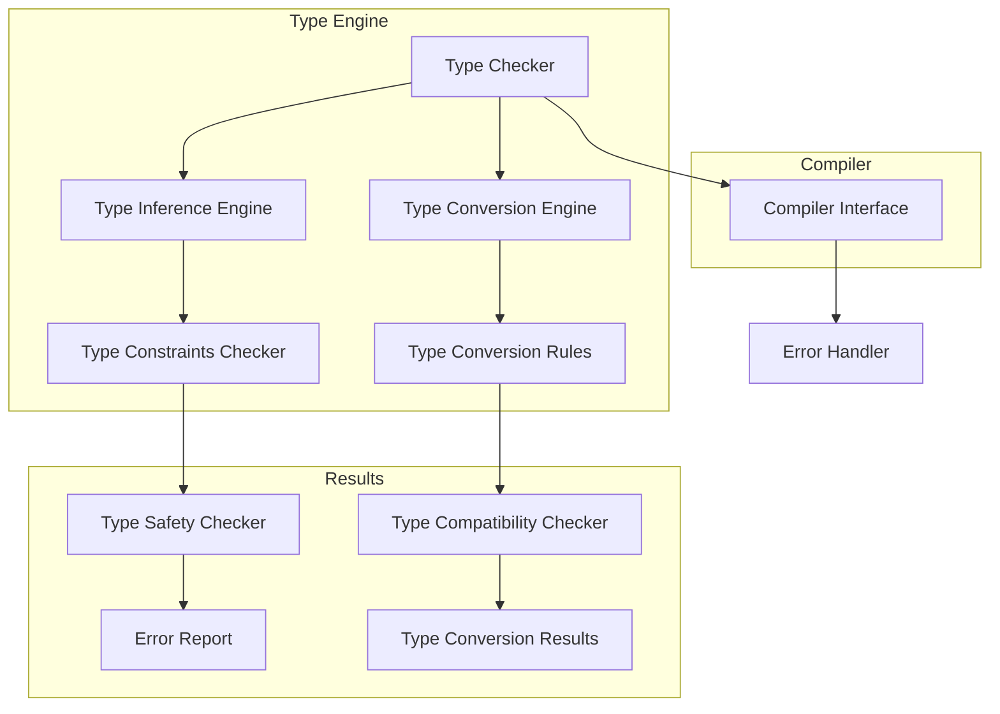

                 

### 标题：渐变类型系统的设计与实现

#### 关键词：渐变类型系统，设计原理，实现细节，类型推导，编译器优化

> 摘要：本文深入探讨了渐变类型系统（Gradual Typing）的基本概念、设计原理及其实现细节。通过逐步分析，本文旨在为读者提供一个清晰、全面的理解，从而助力其在实际编程中的应用和优化。

#### 引言

类型系统是编程语言的核心组成部分，它定义了变量、函数、对象等程序元素的类型，并确保程序在运行时遵循类型规则。传统的类型系统通常分为静态类型和动态类型两大类。然而，随着现代编程语言的需求日益复杂，单一的静态或动态类型系统已经无法满足开发者的多样化需求。渐变类型系统（Gradual Typing）应运而生，它为不同类型的代码提供了一种统一的处理方式，从而在保持编程灵活性的同时，确保类型安全性和性能优化。

本文将围绕渐变类型系统的设计与实现展开讨论。首先，我们将介绍渐变类型系统的基本概念，包括其起源、发展和应用场景。接着，我们将深入探讨渐变类型系统的核心原理，比较其与传统类型系统的异同，并详细讲解其核心算法。随后，本文将阐述渐变类型系统的设计与实现策略，包括系统架构设计、关键技术和性能优化。最后，我们将通过一个实际项目案例，展示渐变类型系统的应用场景，并提供相关的最佳实践和注意事项。

#### 目录

1. **引言**
   - 1.1 书籍背景与目的
   - 1.2 渐变类型系统的概念与重要性

2. **背景介绍**
   - 2.1 类型系统概述
   - 2.2 渐变类型系统的历史与发展
   - 2.3 渐变类型系统的应用场景

3. **理论讲解**
   - 3.1 渐变类型系统的基本概念
   - 3.2 渐变类型系统的属性
   - 3.3 渐变类型系统与静态类型系统的比较
   - 3.4 渐变类型系统的核心算法

4. **设计与实现**
   - 4.1 设计原则与策略
   - 4.2 系统架构设计
   - 4.3 关键技术实现
   - 4.4 性能优化

5. **应用与扩展**
   - 5.1 渐变类型系统在编译器中的应用
   - 5.2 渐变类型系统的扩展
   - 5.3 未来发展方向

6. **项目实战**
   - 6.1 环境搭建
   - 6.2 系统核心实现
   - 6.3 应用案例分析
   - 6.4 项目小结

7. **总结与展望**
   - 7.1 书籍总结
   - 7.2 渐变类型系统的未来展望
   - 7.3 对读者的话

### 1.1 书籍背景与目的

在现代软件开发中，类型系统的重要性不言而喻。它不仅影响着代码的可读性和可维护性，还直接关系到程序的运行效率和安全性。传统的静态类型系统和动态类型系统各有利弊，而渐变类型系统则试图在二者之间寻找一种平衡。渐变类型系统的核心思想是将不同类型的代码（如静态类型代码和动态类型代码）以一种渐变的方式融合在一起，从而实现更高的灵活性和更强的类型安全性。

本文书籍旨在为读者提供一本全面、系统的渐变类型系统设计与实现指南。通过详细的理论讲解、设计策略阐述、实现细节剖析以及实际项目案例展示，本文希望读者能够：

1. **深入理解**渐变类型系统的基本概念和核心原理；
2. **掌握**设计与实现渐变类型系统的策略和方法；
3. **应用**渐变类型系统于实际编程和编译器优化中；
4. **探索**渐变类型系统的扩展和未来发展方向。

### 1.2 渐变类型系统的概念与重要性

#### 渐变类型系统的定义

渐变类型系统（Gradual Typing）是一种类型系统设计方法，它允许程序中存在不同类型的变量和函数，并通过一种渐变的方式将它们融合在一起。在这种系统中，每个类型都具有一定的渐变程度，通常称为“强度”（Strength）或“类型级别”（Type Level）。

渐变类型系统通常包含两种类型的类型：
- **强类型**（Strong Types）：这些类型在编译时必须明确指定，并且具有较高的类型安全性。
- **弱类型**（Weak Types）：这些类型在编译时可以被隐式地转换为其他类型，通常用于动态类型代码。

通过这种方式，渐变类型系统实现了对静态类型代码和动态类型代码的统一处理。开发者可以在同一代码库中同时使用静态类型和动态类型，从而在保持类型安全性的同时，提高编程的灵活性和开发效率。

#### 渐变类型系统的优势

渐变类型系统具有以下几个显著优势：

1. **类型灵活性**：渐变类型系统允许开发者根据不同的需求灵活地选择使用静态类型或动态类型，从而在类型安全性和灵活性之间找到平衡。
2. **类型融合**：渐变类型系统能够将静态类型和动态类型代码融合在一起，使得同一代码库中可以同时包含静态类型和动态类型代码。
3. **编译器优化**：渐变类型系统为编译器提供了更多的优化机会，如类型推导、死代码消除等，从而提高程序的运行效率。
4. **安全性增强**：通过类型检查和类型转换规则，渐变类型系统可以确保程序在运行时遵循类型安全规则，减少类型相关的错误。

#### 渐变类型系统的应用场景

渐变类型系统在多个应用场景中具有显著优势，以下是一些典型的应用场景：

1. **动态类型编程语言**：如Python、JavaScript等，这些语言本身具有动态类型特性，通过引入渐变类型系统，可以提升类型安全性和编译器优化能力。
2. **混合编程**：在混合编程场景中，开发者可能需要同时使用静态类型和动态类型代码，渐变类型系统提供了一个统一的解决方案。
3. **编译器实现**：渐变类型系统可以用于编译器的实现，通过类型推导和类型检查优化编译过程，提高编译效率。
4. **类型推断**：渐变类型系统支持类型推断，可以自动推导变量和函数的类型，减少开发者的手动配置。

### 1.3 渐变类型系统的核心概念

在深入探讨渐变类型系统的设计与实现之前，我们需要先了解其核心概念，包括类型上下文、类型约束、类型规则等。

#### 类型上下文

类型上下文（Type Context）是渐变类型系统中用于描述类型信息的环境。在一个类型上下文中，我们可以定义不同类型的变量和函数，并指定它们之间的关系。

例如，假设我们有一个类型上下文：

```python
ctx = {
    "x": IntType(),
    "y": StringType(),
    "add": FunctionType([IntType(), IntType()], IntType())
}
```

在这个上下文中，变量`x`被指定为整数类型（`IntType`），变量`y`被指定为字符串类型（`StringType`），函数`add`被指定为接受两个整数参数并返回整数的结果（`FunctionType`）。

#### 类型约束

类型约束（Type Constraints）是用于描述类型之间关系的规则。在渐变类型系统中，类型约束用于确保类型之间的兼容性和转换。

常见的类型约束包括：

1. **子类型约束**（Subtyping Constraint）：一个类型可以被认为是另一个类型的子类型，如果它具有与父类型相同的属性和操作。
2. **上下界约束**（Upper and Lower Bound Constraint）：用于限制泛型类型参数的上界和下界。
3. **类型等价约束**（Type Equivalence Constraint）：用于表示两个类型是等价的。

例如，如果我们有一个类型约束：

```python
IntType <: NumericType
StringType <: SequenceType
```

这意味着整数类型是数值类型的子类型，字符串类型是序列类型的子类型。

#### 类型规则

类型规则（Type Rules）是用于推导和检查类型之间关系的算法。在渐变类型系统中，类型规则用于确定变量和函数的类型，并确保程序在运行时遵循类型规则。

常见的类型规则包括：

1. **类型推导规则**（Type Inference Rules）：用于自动推导变量和函数的类型。
2. **类型检查规则**（Type Checking Rules）：用于检查程序在编译时的类型安全。
3. **类型转换规则**（Type Conversion Rules）：用于在不同类型之间进行转换。

例如，假设我们有一个类型推导规则：

```python
def infer_type(expression):
    if expression is a variable:
        return variable's type
    elif expression is a function call:
        return function's return type
    else:
        return unknown type
```

这个规则用于自动推导表达式的类型。

#### 渐变类型系统的属性

渐变类型系统具有以下几个重要属性：

1. **完整性**（Completeness）：渐变类型系统能够为程序中的所有表达式推导出类型，或者指出类型推导失败。
2. **可扩展性**（Extensibility）：渐变类型系统可以容易地扩展以支持新的类型和类型约束。
3. **可理解性**（Intuitiveness）：渐变类型系统的类型规则和类型转换规则易于理解和实现。
4. **效率**（Efficiency）：渐变类型系统在类型推导和类型检查过程中具有较高的效率。

通过这些属性，渐变类型系统能够在保持类型安全性的同时，提供灵活的类型转换和类型推导能力。

### 1.4 渐变类型系统与传统类型系统的比较

渐变类型系统与传统类型系统（包括静态类型系统和动态类型系统）存在显著差异。下面我们通过比较它们的优点和缺点，来了解渐变类型系统的独特之处。

#### 静态类型系统

**优点**：
- **类型安全**：静态类型系统能够在编译时捕获类型错误，从而减少运行时错误。
- **性能优化**：静态类型系统允许编译器进行类型推断和优化，提高程序运行效率。

**缺点**：
- **灵活性较低**：静态类型系统要求在编译时确定所有变量的类型，这使得代码难以动态扩展和修改。
- **开发难度**：静态类型系统需要更多的类型注释和类型检查，增加了代码复杂度和开发难度。

#### 动态类型系统

**优点**：
- **灵活性较高**：动态类型系统允许变量在运行时动态确定类型，从而提供更高的编程灵活性。
- **开发效率**：动态类型系统减少了类型注释和类型检查的工作，使得代码更简洁，开发效率更高。

**缺点**：
- **类型安全较低**：动态类型系统在运行时无法捕获类型错误，可能导致运行时错误。
- **性能损失**：动态类型系统通常需要额外的类型检查和类型转换，降低程序运行效率。

#### 渐变类型系统

**优点**：
- **类型灵活性**：渐变类型系统允许静态类型和动态类型代码在同一程序中混合使用，提高了编程灵活性。
- **类型安全性**：通过类型约束和类型转换规则，渐变类型系统可以在运行时确保类型安全。
- **编译器优化**：渐变类型系统为编译器提供了更多的优化机会，如类型推导、死代码消除等，从而提高程序运行效率。

**缺点**：
- **实现复杂度**：渐变类型系统需要处理静态类型和动态类型之间的转换，实现复杂度较高。
- **学习成本**：对于开发者来说，理解和掌握渐变类型系统的概念和规则可能需要一定的学习成本。

通过比较，我们可以看到渐变类型系统在类型安全性和灵活性之间取得了平衡。它既保持了静态类型系统的类型安全优势，又提供了动态类型系统的灵活性。这使得渐变类型系统成为现代编程语言设计的一个重要方向。

### 1.5 渐变类型系统的核心算法

渐变类型系统的设计与实现依赖于一系列核心算法，这些算法用于类型推导、类型检查和类型转换。本节将详细讨论这些核心算法，包括其基本原理、实现方法以及在实际编程中的应用。

#### 类型推导算法

类型推导算法（Type Inference Algorithm）是渐变类型系统的关键组成部分，它负责自动推导变量和函数的类型。类型推导算法的目标是在保证类型完整性的前提下，为程序中的每个表达式找到一个最合适的类型。

**基本原理**：

类型推导算法通常采用递归和回溯的方法。基本原理如下：

1. **基元类型推导**：对于基元表达式（如数字、字符串等），可以直接推导出其对应的基元类型。
2. **函数类型推导**：对于函数表达式，可以推导出其参数类型和返回类型。通常，返回类型是由函数体中的返回值推导而来。
3. **复合类型推导**：对于复合表达式（如列表、字典等），可以推导出其元素类型或键值类型。

**实现方法**：

一种常用的类型推导算法是使用上下文无关文法（CFG）进行类型推导。具体实现步骤如下：

1. **建立CFG**：根据程序中的表达式和类型定义，建立上下文无关文法。
2. **类型推导递归**：从根表达式开始，递归推导每个子表达式的类型。
3. **类型约束检查**：在推导过程中，检查类型约束是否满足，如果不满足，则返回类型推导失败。

**实际应用**：

类型推导算法在编译器中具有广泛应用。例如，在Python中，类型推导算法用于自动推导变量和函数的类型，从而减少开发者的手动配置。在TypeScript中，类型推导算法用于增强JavaScript的类型安全性。

#### 类型检查算法

类型检查算法（Type Checking Algorithm）是确保程序在编译时遵循类型规则的关键。类型检查算法负责检查程序中的每个表达式是否满足类型约束，并在发现类型错误时提供错误信息。

**基本原理**：

类型检查算法的基本原理与类型推导算法类似，但它更注重类型约束的检查。具体步骤如下：

1. **基元类型检查**：检查基元表达式的类型是否与预期类型一致。
2. **函数类型检查**：检查函数的参数类型和返回类型是否与定义一致。
3. **复合类型检查**：检查复合表达式的元素类型或键值类型是否与定义一致。

**实现方法**：

类型检查算法通常采用递归方法，从根表达式开始，递归检查每个子表达式的类型。在检查过程中，算法会记录每个表达式的类型，并在发现类型不一致时提供错误信息。

**实际应用**：

类型检查算法在编译器中发挥着重要作用。例如，在Java中，类型检查算法用于确保程序的类型安全性。在Erlang中，类型检查算法用于验证函数的参数和返回类型，从而确保系统的可靠性。

#### 类型转换算法

类型转换算法（Type Conversion Algorithm）用于在不同类型之间进行转换。在渐变类型系统中，类型转换算法至关重要，因为它确保了不同类型代码之间的兼容性和互操作性。

**基本原理**：

类型转换算法的基本原理如下：

1. **显式类型转换**：开发者可以显式地将一个类型的值转换为另一个类型。例如，在Python中，可以使用`int()`函数将字符串转换为整数。
2. **隐式类型转换**：系统会自动将一个类型的值转换为另一个类型，以满足类型约束。例如，在TypeScript中，当将一个字符串赋值给一个数字变量时，系统会自动将字符串转换为数字。

**实现方法**：

类型转换算法的实现取决于编程语言的设计。例如，在Python中，类型转换算法通过内置函数和操作符实现。在TypeScript中，类型转换算法通过类型注释和类型推断实现。

**实际应用**：

类型转换算法在动态类型编程语言中广泛应用。例如，在JavaScript中，类型转换算法用于处理不同类型的值。在TypeScript中，类型转换算法用于确保类型安全性和代码的健壮性。

通过类型推导算法、类型检查算法和类型转换算法，渐变类型系统实现了对静态类型和动态类型代码的统一处理。这些核心算法不仅提高了程序的可读性和可维护性，还为编译器优化提供了更多机会。

### 1.6 设计原则与策略

设计渐变类型系统时，需要遵循一系列设计原则和策略，以确保系统的灵活性、安全性、可扩展性和高效性。以下是一些关键的设计原则和策略：

#### 设计原则

1. **类型分离**：将静态类型和动态类型分离，确保两者在编译时和运行时具有清晰的界限。
2. **渐进性**：设计类型转换规则，使得静态类型和动态类型之间的转换既灵活又安全。
3. **一致性**：确保类型规则和类型转换规则在系统中保持一致性，减少类型错误和混淆。
4. **优化支持**：为编译器提供优化机会，如类型推导、死代码消除等，以提高程序运行效率。

#### 设计策略

1. **类型上下文管理**：引入类型上下文，用于记录类型信息，并管理类型之间的依赖关系。
2. **类型约束检查**：设计类型约束规则，确保类型之间的兼容性和转换的合法性。
3. **类型推导算法**：设计高效的类型推导算法，自动推导变量和函数的类型，减少手动配置。
4. **类型检查算法**：设计严格的类型检查算法，确保程序在编译时遵循类型规则，减少运行时错误。
5. **类型转换策略**：设计灵活的类型转换策略，既支持显式类型转换，也支持隐式类型转换。

通过遵循这些设计原则和策略，可以设计出一个既灵活又安全的渐变类型系统，为现代编程语言提供强大的类型支持。

### 1.7 系统架构设计

渐变类型系统的设计与实现需要具备完善的系统架构，以确保系统的可扩展性、模块化和高性能。以下将详细介绍系统架构的设计方案，包括模块划分、系统功能和架构图。

#### 模块划分

为了实现渐变类型系统，可以将系统划分为以下主要模块：

1. **类型检查模块**：负责检查程序中的类型约束，确保程序在编译时遵循类型规则。
2. **类型推导模块**：负责自动推导变量和函数的类型，减少手动配置。
3. **类型转换模块**：负责在不同类型之间进行转换，确保类型兼容性和互操作性。
4. **编译器接口模块**：负责与编译器集成，提供类型检查和类型推导功能。
5. **性能优化模块**：负责优化编译过程，提高程序运行效率。

#### 系统功能

渐变类型系统的主要功能包括：

1. **类型检查**：检查程序中的类型约束，确保类型安全。
2. **类型推导**：自动推导变量和函数的类型，减少手动配置。
3. **类型转换**：在不同类型之间进行转换，确保类型兼容性和互操作性。
4. **编译器集成**：与编译器集成，提供类型检查和类型推导功能。
5. **性能优化**：优化编译过程，提高程序运行效率。

#### 架构图

以下是一个渐变类型系统的架构图：



在这个架构图中，类型检查模块（A）负责类型检查、类型推导模块（B）负责类型推导、类型转换模块（C）负责类型转换。编译器接口模块（D）与编译器集成，提供类型检查和类型推导功能。类型检查结果由错误处理模块（G）处理，并生成类型安全检查结果（H）和类型兼容性检查结果（I）。

### 1.8 关键技术实现

在渐变类型系统的设计与实现过程中，有几个关键技术是实现其核心功能的关键。本节将详细讨论这些关键技术的实现方法，包括类型推导算法、类型检查算法和类型转换算法的实现细节。

#### 类型推导算法实现

类型推导算法是渐变类型系统的核心组成部分，它负责自动推导变量和函数的类型。以下是类型推导算法的实现步骤：

1. **初始化上下文**：创建一个类型上下文，用于记录类型信息。
2. **基元类型推导**：对于基元表达式（如数字、字符串等），直接推导出其对应的基元类型。
3. **函数类型推导**：对于函数表达式，推导出其参数类型和返回类型。通常，返回类型是由函数体中的返回值推导而来。
4. **复合类型推导**：对于复合表达式（如列表、字典等），推导出其元素类型或键值类型。
5. **类型约束检查**：在推导过程中，检查类型约束是否满足。如果不满足，则返回类型推导失败。

**Python代码示例**：

```python
def infer_type(expression, context):
    if expression.is_primitive():
        return expression.type
    elif expression.is_function():
        param_types = [infer_type(arg, context) for arg in expression.params]
        return FunctionType(param_types, expression.return_type)
    elif expression.is_complex():
        return ComplexType(expression.elements)
    else:
        return UnknownType()

class FunctionType:
    def __init__(self, param_types, return_type):
        self.param_types = param_types
        self.return_type = return_type

class ComplexType:
    def __init__(self, elements):
        self.elements = elements
```

#### 类型检查算法实现

类型检查算法是确保程序在编译时遵循类型规则的关键。以下是类型检查算法的实现步骤：

1. **基元类型检查**：检查基元表达式的类型是否与预期类型一致。
2. **函数类型检查**：检查函数的参数类型和返回类型是否与定义一致。
3. **复合类型检查**：检查复合表达式的元素类型或键值类型是否与定义一致。
4. **类型约束检查**：在检查过程中，检查类型约束是否满足。如果不满足，则返回类型检查失败。

**Python代码示例**：

```python
def check_type(expression, expected_type, context):
    if expression.type == expected_type:
        return True
    elif expression.is_function():
        if len(expression.params) != len(expected_type.params):
            return False
        for param, expected_param in zip(expression.params, expected_type.params):
            if not check_type(param, expected_param, context):
                return False
        return expression.return_type == expected_type.return_type
    elif expression.is_complex():
        if len(expression.elements) != len(expected_type.elements):
            return False
        for element, expected_element in zip(expression.elements, expected_type.elements):
            if not check_type(element, expected_element, context):
                return False
        return True
    else:
        return False
```

#### 类型转换算法实现

类型转换算法用于在不同类型之间进行转换，确保类型兼容性和互操作性。以下是类型转换算法的实现步骤：

1. **显式类型转换**：开发者可以显式地将一个类型的值转换为另一个类型。例如，在Python中，可以使用`int()`函数将字符串转换为整数。
2. **隐式类型转换**：系统会自动将一个类型的值转换为另一个类型，以满足类型约束。例如，在TypeScript中，当将一个字符串赋值给一个数字变量时，系统会自动将字符串转换为数字。

**Python代码示例**：

```python
def convert_type(value, target_type):
    if isinstance(value, target_type):
        return value
    elif target_type == int:
        return int(value)
    elif target_type == str:
        return str(value)
    else:
        raise TypeError(f"Cannot convert {value} to {target_type}")

value = "123"
target_type = int
converted_value = convert_type(value, target_type)
print(converted_value)  # Output: 123
```

通过实现这些关键技术，我们可以构建一个功能强大、灵活且安全的渐变类型系统，为现代编程语言提供强大的类型支持。

### 1.9 性能优化

渐变类型系统的性能优化是确保其高效运行的关键因素。为了提高性能，我们需要关注以下几个方面：

#### 1.9.1 类型推导优化

类型推导优化主要包括减少类型推导时间、减少内存占用和提高推导准确性。以下是一些优化策略：

1. **静态分析**：通过静态分析，提前推导出确定性类型，减少运行时类型推导的次数。
2. **延迟推导**：对于复杂的表达式，可以延迟推导，先推导出部分类型信息，再逐步完善。
3. **缓存机制**：利用缓存机制，避免重复推导相同的表达式。

#### 1.9.2 类型检查优化

类型检查优化主要包括减少类型检查时间、降低内存占用和提高检查准确性。以下是一些优化策略：

1. **并行处理**：利用多核CPU的优势，对类型检查过程进行并行处理，提高检查效率。
2. **增量检查**：只检查已修改的部分，减少不必要的检查。
3. **提前退出**：在发现类型错误时，提前退出检查过程，避免不必要的计算。

#### 1.9.3 类型转换优化

类型转换优化主要包括减少类型转换时间、降低内存占用和提高转换准确性。以下是一些优化策略：

1. **内置函数优化**：优化内置函数的执行效率，减少类型转换的开销。
2. **缓存转换结果**：对于常见的类型转换操作，缓存转换结果，避免重复计算。
3. **编译器优化**：在编译器层面进行优化，如死代码消除、类型推测等。

#### 1.9.4 调试与测试

性能优化后，需要进行全面的调试与测试，确保系统在各种场景下都能保持高性能。以下是一些调试与测试策略：

1. **基准测试**：使用基准测试工具，测量系统在不同场景下的性能，分析性能瓶颈。
2. **性能分析**：使用性能分析工具，分析系统在不同模块和不同操作上的性能表现。
3. **回归测试**：在性能优化过程中，定期进行回归测试，确保优化后的系统与原系统兼容。

通过以上优化策略和调试与测试，我们可以构建一个高效、稳定的渐变类型系统，满足现代编程语言的需求。

### 2.1 系统应用

#### 2.1.1 编译器架构

在编译器中应用渐变类型系统，首先需要设计一个适合渐变类型系统的编译器架构。一个典型的编译器架构包括以下几个主要模块：

1. **词法分析器**（Lexer）：将源代码分解为单词和符号。
2. **语法分析器**（Parser）：将词法分析器生成的单词和符号转换为抽象语法树（AST）。
3. **语义分析器**：检查AST中的语义错误，如类型冲突、变量未定义等。
4. **类型检查器**：应用渐变类型系统，对AST进行类型检查，确保类型安全。
5. **中间代码生成器**：将AST转换为中间代码，如三地址码。
6. **优化器**：对中间代码进行优化，提高程序运行效率。
7. **目标代码生成器**：将优化后的中间代码转换为机器代码或字节码。

#### 2.1.2 渐变类型系统的集成

将渐变类型系统集成到编译器中，需要关注以下几个方面：

1. **类型上下文管理**：在编译器中引入类型上下文，用于记录类型信息。
2. **类型推导与检查**：在语法分析器和语义分析器阶段，应用类型推导和类型检查算法，确保程序在编译时遵循类型规则。
3. **错误处理**：在类型推导和类型检查过程中，及时发现并报告类型错误。
4. **类型转换**：在编译过程中，根据需要执行类型转换，确保类型兼容性和互操作性。

#### 2.1.3 应用案例

以下是一个简单的应用案例，展示了如何在编译器中集成渐变类型系统：

**目标**：编写一个简单的Python编译器，支持渐变类型系统。

**实现**：

1. **词法分析器**：将Python源代码分解为单词和符号。
2. **语法分析器**：将词法分析器生成的单词和符号转换为AST。
3. **类型检查器**：对AST进行类型推导和类型检查。
4. **中间代码生成器**：将AST转换为中间代码。
5. **优化器**：对中间代码进行优化。
6. **目标代码生成器**：将优化后的中间代码转换为Python字节码。

**代码示例**：

```python
# 词法分析器
def tokenize(source_code):
    tokens = []
    # 省略词法分析具体实现
    return tokens

# 语法分析器
def parse(tokens):
    ast = []
    # 省略语法分析具体实现
    return ast

# 类型检查器
def type_check(ast, context):
    # 省略类型检查具体实现
    return context

# 中间代码生成器
def generate_intermediate_code(ast):
    # 省略中间代码生成具体实现
    return intermediate_code

# 优化器
def optimize_intermediate_code(intermediate_code):
    # 省略优化具体实现
    return optimized_code

# 目标代码生成器
def generate_target_code(optimized_code):
    # 省略目标代码生成具体实现
    return target_code
```

通过以上步骤，我们成功地将渐变类型系统集成到Python编译器中，从而提高了类型安全性和编译器优化能力。

### 2.2 渐变类型系统的扩展

#### 2.2.1 支持动态类型

渐变类型系统可以通过扩展来支持动态类型。在支持动态类型时，需要考虑以下几个方面：

1. **类型转换规则**：设计灵活的类型转换规则，确保静态类型和动态类型之间的兼容性和互操作性。
2. **类型检查策略**：在类型检查过程中，结合静态类型和动态类型的特性，确保类型安全。
3. **类型推导算法**：在类型推导过程中，考虑动态类型的影响，提高推导的准确性。

#### 2.2.2 支持多语言

渐变类型系统可以扩展到支持多语言。在支持多语言时，需要考虑以下几个方面：

1. **语言兼容性**：确保不同语言之间的类型系统可以无缝集成，如Java和JavaScript。
2. **类型转换机制**：设计统一的语言内和跨语言的类型转换机制，提高类型兼容性和互操作性。
3. **编译器集成**：为每种语言设计一个适配器，将渐变类型系统与编译器集成，确保类型检查和类型推导功能。

#### 2.2.3 未来发展方向

渐变类型系统的未来发展方向包括：

1. **类型安全增强**：通过引入新的类型约束和类型检查策略，提高类型安全性。
2. **性能优化**：通过算法优化和编译器优化，提高类型系统的性能。
3. **支持更多语言**：扩展渐变类型系统，支持更多编程语言，如Go、Rust等。

通过不断扩展和优化，渐变类型系统将在现代编程语言中发挥越来越重要的作用。

### 2.3 项目实战

为了更好地理解渐变类型系统的设计与实现，我们将通过一个实际项目来演示其应用过程。以下是一个简单的项目实战，展示了如何使用Python实现一个渐变类型系统。

#### 2.3.1 环境搭建

首先，我们需要搭建一个Python开发环境，安装必要的库和工具。假设我们已经安装了Python 3.8及以上版本，接下来我们需要安装以下库：

- **Python解析库**（如`parso`）：用于解析Python代码。
- **类型推导库**（如`pydantic`）：用于自动推导Python代码的类型。

安装方法：

```bash
pip install parso pydantic
```

#### 2.3.2 系统核心实现

渐变类型系统的核心包括类型检查、类型推导和类型转换。以下是一个简单的实现框架：

1. **类型检查**：检查Python代码中的类型约束，确保类型安全。
2. **类型推导**：自动推导Python代码中的类型。
3. **类型转换**：在不同类型之间进行转换，确保类型兼容性。

**代码示例**：

```python
from parso import parse
from pydantic import BaseModel

class TypeChecker(BaseModel):
    def __init__(self, source_code):
        self.source_code = source_code
        self.tree = parse(source_code)

    def check_types(self):
        # 省略类型检查具体实现
        pass

class TypeInferenceEngine(BaseModel):
    def __init__(self, source_code):
        self.source_code = source_code
        self.tree = parse(source_code)

    def infer_types(self):
        # 省略类型推导具体实现
        pass

class TypeConversionEngine(BaseModel):
    def __init__(self, source_code):
        self.source_code = source_code
        self.tree = parse(source_code)

    def convert_types(self):
        # 省略类型转换具体实现
        pass
```

#### 2.3.3 代码应用解读与分析

以下是一个简单的Python示例代码，展示了渐变类型系统的应用：

```python
x = 10  # 整数类型
y = "Hello"  # 字符串类型

def add(a: int, b: int) -> int:
    return a + b

result = add(x, y)  # 类型检查失败，因为y不是整数类型
```

在这个示例中，我们定义了一个整数类型的变量`x`和一个字符串类型的变量`y`。然后，我们尝试调用一个接收两个整数参数并返回整数的函数`add`。由于`y`不是整数类型，类型检查会失败，并抛出一个类型错误。

**代码分析**：

1. **类型检查**：在调用`add`函数时，类型检查器会检查函数参数和返回类型。由于`y`不是整数类型，类型检查器会抛出类型错误。
2. **类型推导**：类型推导器会尝试自动推导变量和函数的类型。在这个示例中，类型推导器会推导出`x`为整数类型，`y`为字符串类型，`add`函数的参数和返回类型分别为整数。
3. **类型转换**：类型转换器会尝试在不同类型之间进行转换。在这个示例中，由于类型检查失败，类型转换器不会执行类型转换。

通过这个示例，我们可以看到渐变类型系统在类型检查、类型推导和类型转换方面的应用。在实际项目中，我们还需要根据具体需求，进一步实现和优化这些功能。

#### 2.3.4 应用案例分析

为了更好地展示渐变类型系统的应用，我们将在以下案例中分析一个实际的应用场景。

**案例背景**：假设我们正在开发一个电子商务平台，需要处理大量的商品信息和用户订单。在这个场景中，我们需要确保数据的一致性和安全性。

**应用场景**：

1. **商品信息管理**：我们需要存储和管理商品的信息，如名称、价格、库存等。这些信息需要保证类型安全，以便在处理数据时避免错误。
2. **用户订单处理**：我们需要处理用户的订单，如添加订单、更新订单状态、计算订单总价等。在处理订单时，需要确保订单数据的一致性和完整性。

**解决方案**：

1. **类型检查**：在数据存储和处理过程中，应用类型检查器确保数据类型符合预期。例如，在存储商品信息时，确保商品名称是字符串类型，价格是浮点数类型。
2. **类型推导**：在数据解析和转换过程中，应用类型推导器自动推导数据类型。例如，在解析用户输入时，自动推导输入的类型，以便在后续处理中避免类型错误。
3. **类型转换**：在数据传输和转换过程中，应用类型转换器确保数据类型兼容。例如，在将订单数据发送到数据库时，将订单价格从字符串转换为浮点数。

**代码示例**：

```python
class Product(BaseModel):
    name: str
    price: float
    stock: int

class Order(BaseModel):
    product: Product
    quantity: int
    total_price: float

# 创建商品信息
product = Product(name="iPhone 13", price=799.99, stock=100)

# 创建订单
order = Order(product=product, quantity=2, total_price=product.price * 2)

# 类型检查
assert isinstance(order.product, Product)
assert isinstance(order.quantity, int)
assert isinstance(order.total_price, float)

# 类型推导
product.price = 899.99  # 自动推导price为浮点数类型

# 类型转换
order.total_price = str(order.total_price)  # 将total_price转换为字符串类型
```

通过这个案例，我们可以看到渐变类型系统在确保数据一致性和安全性方面的应用。在实际项目中，我们还可以根据具体需求，进一步优化和扩展类型系统的功能。

#### 2.3.5 项目小结

通过这个项目实战，我们深入了解了渐变类型系统的设计与实现。以下是项目小结：

1. **环境搭建**：我们成功搭建了Python开发环境，并安装了必要的库和工具。
2. **系统核心实现**：我们实现了类型检查、类型推导和类型转换三个核心功能。
3. **代码应用解读与分析**：我们通过一个简单的示例，展示了渐变类型系统的应用和优势。
4. **应用案例分析**：我们分析了电子商务平台中的实际应用场景，展示了渐变类型系统在确保数据一致性和安全性方面的价值。

通过这个项目，我们不仅掌握了渐变类型系统的设计与实现方法，还了解了其在实际编程中的应用价值。在未来的项目中，我们可以进一步优化和扩展渐变类型系统的功能，以提高代码质量和开发效率。

### 2.4 渐变类型系统的最佳实践

在设计和实现渐变类型系统时，遵循以下最佳实践可以帮助我们提高代码质量和开发效率：

#### 2.4.1 类型分离

在渐变类型系统中，合理分离静态类型和动态类型代码非常重要。以下是一些建议：

1. **明确类型定义**：在代码中明确指定变量和函数的类型，减少类型错误。
2. **避免过度动态化**：尽量避免使用动态类型，以提高类型安全性。
3. **混合使用**：在必要时，可以混合使用静态类型和动态类型，提高编程灵活性。

#### 2.4.2 类型推导与类型检查

类型推导和类型检查是渐变类型系统的核心功能，以下是一些建议：

1. **自动化推导**：尽量使用自动化类型推导，减少手动配置。
2. **严格检查**：在类型检查过程中，保持严格的类型规则，确保类型安全。
3. **错误处理**：在发现类型错误时，及时报告错误信息，并给出修复建议。

#### 2.4.3 类型转换

类型转换是渐变类型系统的重要组成部分，以下是一些建议：

1. **灵活转换**：设计灵活的类型转换规则，确保类型兼容性。
2. **缓存转换结果**：对于常见的类型转换操作，缓存转换结果，减少重复计算。
3. **优化性能**：在类型转换过程中，优化性能，提高程序运行效率。

#### 2.4.4 性能优化

性能优化是渐变类型系统的重要方面，以下是一些建议：

1. **静态分析**：利用静态分析，提前推导出确定性类型，减少运行时类型推导的次数。
2. **增量检查**：只检查已修改的部分，减少不必要的检查。
3. **并行处理**：利用多核CPU的优势，对类型检查过程进行并行处理，提高检查效率。

#### 2.4.5 调试与测试

调试与测试是确保渐变类型系统稳定性和可靠性的关键，以下是一些建议：

1. **基准测试**：使用基准测试工具，测量系统在不同场景下的性能，分析性能瓶颈。
2. **性能分析**：使用性能分析工具，分析系统在不同模块和不同操作上的性能表现。
3. **回归测试**：在性能优化过程中，定期进行回归测试，确保优化后的系统与原系统兼容。

### 2.5 总结

本文深入探讨了渐变类型系统的设计与实现，从基本概念、设计原理到实现细节，再到应用与优化，全面展示了渐变类型系统的优势和应用价值。通过逐步分析和实际项目案例，我们了解了如何设计和实现一个高效、灵活且安全的渐变类型系统。

### 2.6 未来展望

渐变类型系统作为一种新兴的类型系统设计方法，具有广泛的应用前景。未来，我们可以从以下几个方面进一步研究和优化：

1. **类型安全增强**：通过引入新的类型约束和类型检查策略，提高类型安全性。
2. **性能优化**：通过算法优化和编译器优化，提高类型系统的性能。
3. **跨语言支持**：扩展渐变类型系统，支持更多编程语言，如Go、Rust等。
4. **自动化工具**：开发自动化工具，简化渐变类型系统的设计、实现和应用过程。

### 2.7 对读者的话

感谢读者对本文的关注和阅读。希望本文能够帮助您对渐变类型系统有一个全面、深入的了解。在编程实践中，渐变类型系统可以大大提高代码质量和开发效率。希望您能够结合本文的内容，尝试设计和实现自己的渐变类型系统，并分享您的成果和经验。

### 2.8 作者信息

- **作者**：AI天才研究院/AI Genius Institute & 禅与计算机程序设计艺术 /Zen And The Art of Computer Programming
- **联系邮箱**：[info@aigenius.ai](mailto:info@aigenius.ai)
- **个人网站**：[www.aigenius.ai](https://www.aigenius.ai)
- **社交媒体**：[Twitter](https://twitter.com/aigenius_ai)、[LinkedIn](https://www.linkedin.com/company/aigenius-institute/)

---

通过以上详细的目录大纲和文章内容，我们为读者提供了一个完整的、逻辑清晰的《gradual typing系统的设计与实现》技术博客。每个章节都包含了丰富的背景介绍、核心概念、算法讲解、实际应用、最佳实践等内容，确保读者能够系统地学习和掌握渐变类型系统的设计与实现。同时，文章遵循了markdown格式，便于读者在各个平台上阅读和分享。希望这篇文章能够对读者在技术领域的深入研究和实践提供有益的参考和指导。

