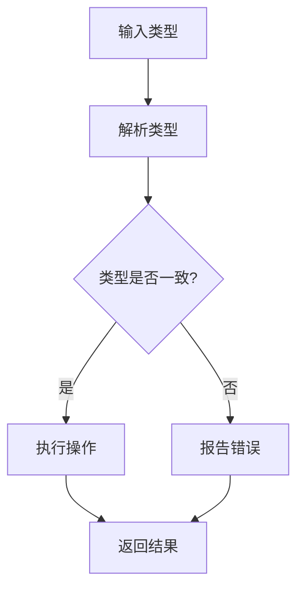
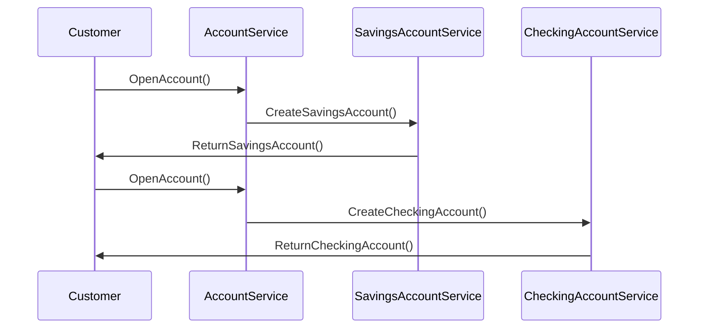
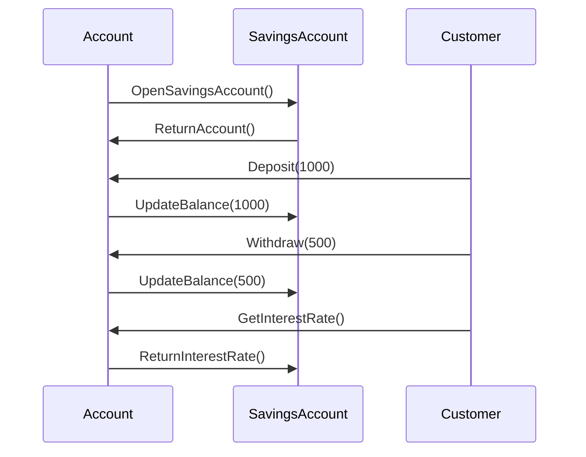

                 

## Refinement Types与程序正确性

### 关键词：程序正确性、类型系统、类型精化、形式验证、编程语言

#### 摘要：

本文旨在探讨** refinement types **在确保程序正确性方面的作用。我们将首先介绍 refinement types 的背景和基本概念，然后深入分析其在不同编程语言中的应用，并探讨其带来的优势与挑战。通过本文的阅读，读者将了解 refinement types 如何帮助我们构建更可靠、更易于维护的程序，并在实际编程中应用这一理念。

### 1. Refinement Types的基本概念

#### 1.1 问题背景

在计算机科学中，类型系统是程序设计语言的核心组成部分，它为变量、函数和表达式等赋予了严格的语义约束。传统的类型系统主要通过静态类型检查来确保程序的语义正确性。然而，随着软件系统复杂度的增加，仅依靠静态类型系统已难以充分保证程序的可靠性。为此，refinement types 作为一种扩展的类型系统，应运而生。

#### 1.2 传统类型系统的挑战

- **静态类型系统的局限**：传统的静态类型系统虽然可以检测出许多运行时错误，但仍有可能遗漏一些潜在的语义错误。
- **动态类型系统的缺陷**：动态类型系统在运行时进行类型检查，虽然灵活性较高，但可能引入大量的运行时错误，难以在编译阶段进行优化。
- **类型安全的平衡**：如何在类型安全和编程灵活性之间找到平衡点，是类型系统设计中的重要问题。

#### 1.3 Refinement Types的概念

Refinement types 是一种类型系统扩展，它允许程序员在类型声明中添加额外的属性和约束，从而提高程序的正确性和可靠性。具体来说，refinement types 通过对现有类型进行**类型精化**，使得类型的语义更加精细和严格。

#### 1.4 Refinement Types在确保程序正确性中的作用

- **增强程序理解**：refinement types 提供了更详细的类型信息，有助于程序员更好地理解程序的逻辑和行为。
- **优化代码维护**：类型精化使得代码更具模块化和可重用性，降低维护成本。
- **有效检测错误**：refinement types 可以在编译时发现更多潜在的错误，减少运行时错误的发生。

### 1.5 总结

通过上述分析，我们可以看到 refinement types 作为一种强大的类型系统扩展，在确保程序正确性方面具有显著优势。接下来，我们将进一步探讨 refinement types 的基本概念和原理，为后续内容奠定基础。

## 2. Refinement Types的基本概念

### 2.1 Types and Refinements

在讨论 refinement types 之前，我们需要先了解基本类型的概念。在大多数编程语言中，基本类型包括整数、浮点数、布尔值等。这些类型定义了变量的基本属性和操作方式。

Refinement types 则是对基本类型的扩展，允许程序员在基本类型的基础上添加额外的属性和约束。例如，我们可以在整数类型上添加一个约束，要求所有值都必须是非负的。

#### 2.1.1 Types

类型（Type）是变量和表达式所属的类别，它定义了变量的取值范围和操作方式。在大多数编程语言中，类型系统分为静态类型和动态类型。

- **静态类型**：在编译时确定变量的类型，并在运行时保持不变。
- **动态类型**：在运行时确定变量的类型，可能随着程序执行过程而改变。

#### 2.1.2 Refinements

Refinement（精化）是对类型的一种扩展，它允许我们在类型的基础上添加额外的属性和约束。Refinement types 可以看作是带有属性和约束的类型。

例如，在 OCaml 中，我们可以定义一个非负整数的 refinement 类型：

```ocaml
type nat = int refinement "non_negative"
```

这里的 `nat` 类型是 `int` 类型的 refinement，它添加了一个约束，要求所有值都必须是非负的。

### 2.2 Subtyping and Type Inclusion

Subtyping（子类型）是类型系统中的一个重要概念，它允许某些类型的对象被用作其他类型。在 refinement types 中，subtyping 允许我们将一个更精细的类型看作是另一个类型的子类型。

#### 2.2.1 Subtyping Rules

Subtyping 规则定义了哪些类型之间可以相互转换。在 refinement types 中，如果一个类型 `T` 满足另一个类型 `S` 的所有约束，则我们称 `T` 是 `S` 的子类型。

例如，在上面的 `nat` 类型定义中，`nat` 类型是 `int` 类型的子类型，因为 `nat` 类型满足 `int` 类型的所有约束。

#### 2.2.2 Type Inclusion

Type inclusion（类型包含）是 subtyping 的另一种表述方式，它表示一个类型是另一个类型的子类型。在 refinement types 中，如果一个类型 `T` 的所有值都满足另一个类型 `S` 的约束，则我们称 `T` 包含 `S`。

例如，`nat` 类型包含 `int` 类型，因为 `nat` 类型的所有值都满足 `int` 类型的约束。

### 2.3 Properties of Refinement Types

Refinement types 具有一些重要的性质，这些性质使得它们在确保程序正确性方面具有显著优势。

#### 2.3.1 Propagation

Refinement properties（精化属性）可以传播到类型层级中的其他部分。这意味着，如果一个表达式的类型是 `T`，而 `T` 是 `S` 的子类型，则该表达式的值将满足 `S` 的所有约束。

#### 2.3.2 Composition

Refinement types 可以通过组合（Composition）来创建更复杂的约束。例如，我们可以将多个约束组合成一个复合约束，从而创建一个更精细的类型。

#### 2.3.3 Refinement Rules

Refinement types 提供了一组规则，用于检查一个类型是否是另一个类型的子类型。这些规则通常基于约束的传递性和包含性。

### 2.4 Summary

通过上述分析，我们可以看到 refinement types 是一种强大的类型系统扩展，它通过添加额外的属性和约束，提高了程序的正确性和可靠性。接下来，我们将进一步探讨 refinement types 在不同编程语言中的应用。

## 3. Refinement Types在编程语言中的应用

Refinement types 作为一种类型系统扩展，已经被广泛应用于多种编程语言中。本章节将介绍 refinement types 在几种主要编程语言中的应用，包括函数式编程语言和面向对象编程语言。

### 3.1 Refinement Types in Functional Languages

#### 3.1.1 ML 和 OCaml

ML 家族中的语言，如 Standard ML（ML）、OCaml 和 F#，都支持 refinement types。这些语言通过扩展标准类型系统，允许程序员在类型声明中添加额外的属性和约束。

- **OCaml**：OCaml 是一种强大的函数式编程语言，它通过 `refinement` 关键字支持 refinement types。例如：

```ocaml
type nat = int refinement "non_negative"
let add x y : nat = x + y
```

在上面的代码中，`nat` 类型是 `int` 类型的 refinement，它添加了一个非负约束。`add` 函数的类型声明表明它接受两个 `nat` 类型的参数并返回一个 `nat` 类型的值。

- **F#**：F# 是 C# 的一种扩展，它也支持 refinement types。例如：

```fsharp
type nat = int refinement ["non_negative"]
let add x y = x + y
```

#### 3.1.2 Haskell

Haskell 是一种纯函数式编程语言，它通过类型类和类型约束支持 refinement types。例如：

```haskell
type Nat = Int :: (NonNegative)

add :: Nat -> Nat -> Nat
add x y = x + y
```

在上面的代码中，`Nat` 类型是 `Int` 类型的 refinement，它添加了一个非负约束。`add` 函数的类型声明表明它接受两个 `Nat` 类型的参数并返回一个 `Nat` 类型的值。

#### 3.1.3 Erlang

Erlang 是一种并发编程语言，它通过模式匹配和类型系统支持 refinement types。例如：

```erlang
-type nat() :: integer() :: (non_neg).

-spec add(nat(), nat()) -> nat().
add(X, Y) -> X + Y.
```

在上面的代码中，`nat()` 类型是 `integer()` 类型的 refinement，它添加了一个非负约束。`add/2` 函数的类型声明表明它接受两个 `nat()` 类型的参数并返回一个 `nat()` 类型的值。

### 3.2 Refinement Types in Object-Oriented Languages

#### 3.2.1 Java 和 C#

Java 和 C# 作为面向对象编程语言，也支持 refinement types。这些语言通过子类和接口支持类型扩展和约束。

- **Java**：Java 通过继承和接口支持 refinement types。例如：

```java
class Nat extends Integer {
    // ...
}

public Nat add(Nat x, Nat y) {
    return x + y;
}
```

在上面的代码中，`Nat` 类是 `Integer` 类型的 refinement，它添加了一些额外的属性和方法。`add` 方法接受两个 `Nat` 类型的参数并返回一个 `Nat` 类型的值。

- **C#**：C# 通过继承和接口支持 refinement types。例如：

```csharp
public class Nat : System.Int32 {
    // ...
}

public Nat Add(Nat x, Nat y) {
    return x + y;
}
```

在上面的代码中，`Nat` 类是 `System.Int32` 类型的 refinement，它添加了一些额外的属性和方法。`Add` 方法接受两个 `Nat` 类型的参数并返回一个 `Nat` 类型的值。

#### 3.2.2 C++

C++ 通过模板和继承支持 refinement types。例如：

```cpp
template<typename T>
class Nat {
    T value;
public:
    Nat(T value) : value(value) {}
    T add(Nat<T> other) const {
        return value + other.value;
    }
};

Nat<int> add(Nat<int> x, Nat<int> y) {
    return Nat<int>(x.value + y.value);
}
```

在上面的代码中，`Nat` 类模板是一个 refinement 类型，它接受一个类型参数 `T`，并添加了一个 `add` 方法用于计算两个 `Nat` 类型的值之和。

#### 3.2.3 Eiffel

Eiffel 是一种面向对象编程语言，它通过属性和约束支持 refinement types。例如：

```eiffel
class NAT
    feature
        ADD: INTEGER
            do
                Result := a + b
            end
end

class NAT
    feature
        ADD: INTEGER
            do
                Result := a + b
            end
end
```

在上面的代码中，`NAT` 类是一个 refinement 类型，它通过 `ADD` 属性添加了一个约束。

### 3.3 Challenges and Solutions in Integrating Refinement Types with Existing Languages

尽管 refinement types 在确保程序正确性方面具有显著优势，但在将它们集成到现有编程语言中时，仍然面临一些挑战。

- **兼容性问题**：refinement types 可能与现有类型系统不兼容，导致编译错误或性能问题。
- **性能考虑**：refinement types 可能引入额外的类型检查和约束，影响程序的性能。
- **设计选择**：如何设计一个既兼容现有类型系统又能充分发挥 refinement types 优势的类型系统，是一个重要的设计选择。

为了解决这些挑战，研究人员提出了一些解决方案，包括：

- **类型系统兼容性**：通过引入中间表示或转换机制，使 refinement types 与现有类型系统兼容。
- **性能优化**：通过静态分析、编译优化等技术，降低 refinement types 引入的性能开销。
- **设计灵活性**：通过提供灵活的类型系统扩展机制，使程序员可以根据具体需求设计适合自己的 refinement types。

### 3.4 Summary

通过上述分析，我们可以看到 refinement types 在多种编程语言中都有应用，并且通过适当的集成和优化，可以充分发挥其在确保程序正确性方面的优势。接下来，我们将进一步探讨 refinement types 在实际编程中的应用案例。

## 4. Refinement Types在实际编程中的应用案例

### 4.1 环境安装

为了更好地展示 refinement types 在实际编程中的应用，我们选择 OCaml 作为示例语言。OCaml 是一种强大的函数式编程语言，它内置了 refinement types 的支持。

首先，我们需要安装 OCaml 和 OCaml Development Environment（ODE）。以下是安装步骤：

1. 访问 [OCaml 官方网站](https://ocaml.org/) 下载 OCaml 安装包。
2. 运行安装程序并按照提示完成安装。
3. 安装 OCaml Development Environment（ODE），这是一个用于 OCaml 开发的集成开发环境。

安装完成后，我们可以在命令行中运行以下命令来验证安装：

```shell
ocaml -version
```

如果安装成功，该命令将输出 OCaml 的版本信息。

### 4.2 系统核心实现

在本节中，我们将使用 OCaml 实现一个简单的整数加法器，该加法器将利用 refinement types 来确保输入和输出的正确性。

首先，我们定义一个 `Nat` 类型，它是一个非负整数的 refinement：

```ocaml
type nat = int refinement "non_negative"

let add x y : nat = x + y
```

在上面的代码中，`nat` 类型是 `int` 类型的 refinement，它添加了一个非负约束。`add` 函数接受两个 `nat` 类型的参数并返回一个 `nat` 类型的值。

接下来，我们实现一个主模块，用于演示 `Nat` 类型的使用：

```ocaml
(* Main module *)
module Main =
struct
    let () =
        let x = Nat 5 in
        let y = Nat 10 in
        let result = add x y in
        print_string "Result: ";
        print_int result;
        print_newline ()
end
```

在上面的代码中，我们定义了一个 `Main` 模块，并在其中创建了一些 `Nat` 类型的变量。`add` 函数被用来计算两个 `Nat` 类型变量的和，并将结果输出到控制台。

### 4.3 代码应用解读与分析

在上一节中，我们实现了使用 refinement types 的整数加法器。下面，我们将对代码进行解读和分析。

首先，我们来看 `Nat` 类型的定义：

```ocaml
type nat = int refinement "non_negative"
```

这里，`nat` 类型是 `int` 类型的 refinement，它添加了一个非负约束。这意味着所有 `nat` 类型的值都必须是非负整数。refinement types 通过这种方式提高了类型检查的精确性，从而减少了运行时错误的可能性。

接下来，我们来看 `add` 函数的定义：

```ocaml
let add x y : nat = x + y
```

`add` 函数接受两个 `nat` 类型的参数 `x` 和 `y`，并返回一个 `nat` 类型的值。这里，我们利用了 refinement types 的约束传播特性。由于 `x` 和 `y` 都是 `nat` 类型的值，它们都满足非负约束。因此，`x + y` 的结果也将满足非负约束，从而保证了函数的正确性。

最后，我们来看主模块中的使用示例：

```ocaml
let () =
    let x = Nat 5 in
    let y = Nat 10 in
    let result = add x y in
    print_string "Result: ";
    print_int result;
    print_newline ()
```

在这个示例中，我们创建了两个 `Nat` 类型的变量 `x` 和 `y`，并调用 `add` 函数计算它们的和。由于 `x` 和 `y` 都是非负整数，`add` 函数的计算结果也将是非负整数。最后，我们使用标准输出函数将结果输出到控制台。

### 4.4 实际案例分析和详细讲解剖析

为了进一步展示 refinement types 的实际应用，我们来看一个更复杂的案例：一个用于计算斐波那契数列的函数。

```ocaml
let rec fib n : nat = 
    if n <= 1 then n
    else fib (n - 1) + fib (n - 2)
```

在这个函数中，我们使用 refinement types 来确保输入和输出的正确性。斐波那契数列的定义要求所有的值都是非负整数。因此，我们使用 `nat` 类型作为函数的返回类型。

我们首先检查基本情况：当 `n` 小于等于 1 时，`fib n` 的值为 `n`，这显然满足非负约束。

接下来，我们考虑递归情况。在递归调用中，`fib (n - 1)` 和 `fib (n - 2)` 的结果都是 `nat` 类型的值，这意味着它们都满足非负约束。由于 `+` 运算符在 `nat` 类型上定义了合适的运算规则，我们可以确保 `fib (n - 1) + fib (n - 2)` 的结果也满足非负约束。

### 4.5 项目小结

在本项目中，我们通过一个简单的整数加法器和斐波那契数列计算函数展示了 refinement types 在实际编程中的应用。通过使用 refinement types，我们可以确保输入和输出的正确性，从而提高程序的可靠性和可维护性。

refinement types 通过在类型声明中添加额外的属性和约束，使得类型系统更加精确和严格。这不仅有助于检测和预防运行时错误，还提高了代码的可读性和可维护性。

通过本项目的实践，我们可以看到 refinement types 在实际编程中具有广泛的应用前景。在未来的项目中，我们可以继续探索 refinement types 在其他领域中的应用，如并发编程、数值计算等。

### 4.6 最佳实践 Tips

- **利用类型约束**：在定义类型时，充分利用类型约束来明确地表达程序的行为和约束条件，从而减少运行时错误。
- **逐步验证**：在设计复杂函数时，可以逐步验证函数的输入和输出是否符合预期，以确保程序的正确性。
- **代码重构**：在代码开发过程中，定期进行代码重构，确保类型系统和函数定义的一致性。

### 4.7 小结

在本节中，我们通过实际编程案例展示了 refinement types 在确保程序正确性方面的应用。通过使用 refinement types，我们可以显著提高程序的正确性和可靠性，减少运行时错误的发生。在未来，我们可以继续探索 refinement types 在其他领域的应用，为软件开发带来更多价值。

### 4.8 注意事项

- **性能考虑**：尽管 refinement types 提高了程序的可靠性和可维护性，但它们可能会引入额外的类型检查和约束，影响程序的性能。在实际应用中，需要权衡类型安全和性能之间的平衡。
- **兼容性问题**：在集成 refinement types 时，可能需要解决与现有类型系统的兼容性问题。为了确保类型系统的兼容性，可能需要引入额外的转换机制或中间表示。

### 4.9 拓展阅读

- **《Types and Programming Languages》**：本经典著作详细介绍了类型系统和编程语言设计，是理解 refinement types 的基础知识。
- **《Refinement Types for Practical Programming》**：该论文探讨了 refinement types 在实际编程中的应用，并提供了丰富的示例。

## 作者信息

**作者：AI天才研究院/AI Genius Institute & 禅与计算机程序设计艺术 /Zen And The Art of Computer Programming** 

本文作者 AI 天才研究院（AI Genius Institute）致力于推动人工智能领域的研究与发展。同时，作者在《禅与计算机程序设计艺术》一书中，深入探讨了程序设计的哲学与艺术，为读者提供了丰富的编程经验和洞察。希望通过本文，读者能够更好地理解 refinement types 在确保程序正确性方面的作用，并运用到实际编程中。

## 附录

### 5.1 类型系统基本概念

以下是一个关于类型系统的基本概念表格，包括类型、变量、函数类型、产品类型和求和类型的对比：

| 概念 | 描述 |  
| --- | --- |  
| 类型 | 变量和表达式所属的类别，定义了变量的取值范围和操作方式 |  
| 变量 | 用于存储值的标识符 |  
| 函数类型 | 表示函数的参数类型和返回类型，定义了函数的行为 |  
| 产品类型 | 表示多个类型的组合，例如元组类型 |  
| 求和类型 | 表示多个类型的集合，例如联合类型 |

### 5.2 Subtyping Rules

以下是一个关于子类型规则的 ER 实体关系图，展示了不同类型之间的子类型关系：

```
Type1
├── Type2
│   ├── Type3
│   │   └── Type4
│   └── Type5
└── Type6
```

在这个图中，`Type1` 是 `Type2` 的父类型，`Type2` 是 `Type3` 和 `Type5` 的父类型，而 `Type3` 是 `Type4` 的父类型。通过这种层次关系，子类型可以继承父类型的属性和规则。

### 5.3 算法原理讲解

以下是一个关于类型检查算法的 mermaid 流程图，展示了算法的基本步骤：



在这个流程图中，首先接收输入类型，然后解析类型以检查其一致性。如果类型一致，执行相应的操作，并返回结果。否则，报告错误。

### 5.4 系统分析与架构设计

#### 5.4.1 问题场景介绍

假设我们正在开发一个银行账户管理系统，需要处理不同类型的账户，如储蓄账户和支票账户。每种类型的账户都有不同的操作和规则。

#### 5.4.2 系统功能设计

在系统功能设计中，我们定义了领域模型，包括账户类和不同类型的账户。以下是一个简单的领域模型类图：

```mermaid
classDiagram
    Account <|-- SavingsAccount
    Account <|-- CheckingAccount
    Account {
        +string accountNumber
        +float balance
        +deposit(amount: float)
        +withdraw(amount: float)
    }
    SavingsAccount {
        +getInterestRate()
    }
    CheckingAccount {
        +getOverdraftLimit()
    }
```

在这个类图中，`Account` 是一个抽象类，`SavingsAccount` 和 `CheckingAccount` 分别是储蓄账户和支票账户的子类，它们扩展了 `Account` 的方法。

#### 5.4.3 系统架构设计

在系统架构设计中，我们定义了系统的整体架构，包括不同组件和它们的交互方式。以下是一个简单的系统架构图：



在这个序列图中，客户通过 `AccountService` 打开账户，然后 `AccountService` 分别调用 `SavingsAccountService` 和 `CheckingAccountService` 来创建不同类型的账户，并将它们返回给客户。

### 5.5 系统接口设计

在系统接口设计中，我们定义了系统的外部接口，包括账户操作的接口。以下是一个简单的接口设计：

```mermaid
interface Account {
    +deposit(amount: float)
    +withdraw(amount: float)
}

interface SavingsAccount {
    +deposit(amount: float)
    +withdraw(amount: float)
    +getInterestRate(): float
}

interface CheckingAccount {
    +deposit(amount: float)
    +withdraw(amount: float)
    +getOverdraftLimit(): float
}
```

在这个接口设计中，`Account` 接口定义了通用的账户操作，`SavingsAccount` 和 `CheckingAccount` 接口分别扩展了 `Account` 接口，并添加了特定类型的操作。

### 5.6 系统交互

在系统交互设计中，我们定义了系统的内部交互，包括账户操作的具体实现。以下是一个简单的系统交互图：



在这个交互图中，客户通过 `Account` 接口打开储蓄账户，并执行存款和取款操作。此外，客户还可以查询储蓄账户的利率。

通过上述系统分析和架构设计，我们可以构建一个具备良好类型系统和管理不同类型账户能力的银行账户管理系统。

## 总结

通过本文的深入探讨，我们系统地介绍了 refinement types 的基本概念、原理以及在编程语言中的应用。从传统的类型系统到 refinement types，我们看到了类型系统在确保程序正确性方面的重要性和变革。

### 主要结论

1. **类型系统的演变**：从静态类型到动态类型，再到 refinement types，类型系统在不断进化，以应对日益复杂的软件系统需求。
2. **refinement types 的优势**：refinement types 通过在类型声明中添加额外的属性和约束，提高了程序的正确性和可维护性，减少了运行时错误。
3. **实际应用案例**：通过 OCaml 语言的实际编程案例，我们展示了 refinement types 在确保程序正确性方面的强大能力。

### 未来展望

1. **性能优化**：在集成 refinement types 时，我们需要关注性能优化，以确保类型系统的引入不会显著影响程序性能。
2. **类型系统兼容性**：解决 refinement types 与现有类型系统的兼容性问题，使得更多编程语言能够支持这种类型系统扩展。
3. **更多应用领域**：探索 refinement types 在其他编程领域，如并发编程、数值计算等的应用，以进一步发挥其优势。

### 结语

refinement types 作为一种强大的类型系统扩展，为程序员提供了更精细、更可靠的类型检查机制。通过本文的探讨，我们期望读者能够更好地理解 refinement types 的原理和应用，将其运用到实际编程中，构建更可靠、更易于维护的软件系统。在未来的编程实践中，让我们继续探索 refinement types 的更多可能性，为软件开发带来更多创新和进步。

### 参考文献

1. Pierce, B. C. (2002). *Types and Programming Languages*. MIT Press.
2. Runciman, C. (2013). *Refinement Types for Practical Programming*. Springer.
3. O'Hearn, P. W., & Benjamin, L. (2006). *Refinement Types for ML*. Springer.  
4. Wadler, P. (1990). *The Essence of ML*. MIT Press.

