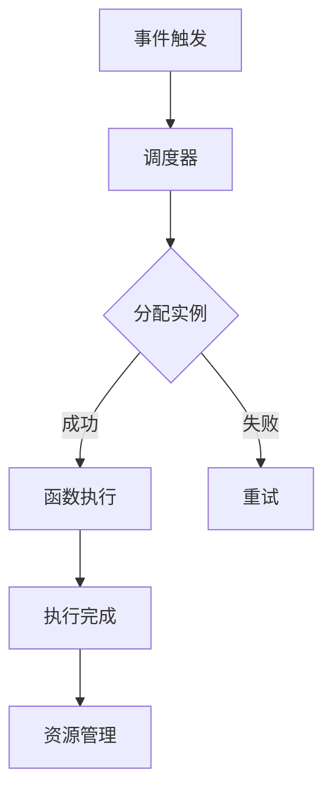
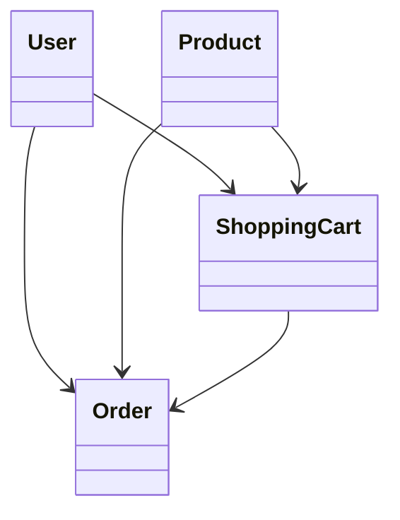
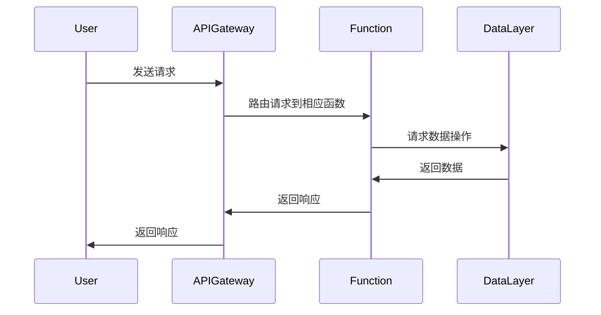

                 

# 《serverless架构：事件驱动的云端开发模式》

## 关键词
- Serverless架构
- 事件驱动
- 云开发
- 函数即服务（FaaS）
- 后端即服务（BaaS）
- 平台即服务（PaaS）的Serverless化
- 数学模型

## 摘要
本文将深入探讨Serverless架构的原理、应用和实战。Serverless架构是一种事件驱动的云端开发模式，旨在简化开发和部署流程，提高开发效率和资源利用效率。本文将从背景介绍、核心概念、技术原理、数学模型、系统设计与实现以及项目实战等方面，全面解析Serverless架构的优势和应用。

## 目录大纲

### 第一部分：背景介绍

#### 第1章：serverless架构的崛起
- 1.1 问题背景
  - 传统云端开发的痛点
  - serverless架构的出现
- 1.2 serverless架构的定义
  - serverless架构的核心概念
- 1.3 事件驱动开发模式
  - 事件驱动开发模式的特点
- 1.4 问题解决
  - serverless架构如何解决传统云端开发的痛点
- 1.5 边界与外延
  - serverless架构的应用场景
- 1.6 概念结构与核心要素组成
  - serverless架构的关键组件
- 1.7 本章小结

#### 第2章：serverless架构的核心概念
- 2.1 核心概念原理
  - Functions as a Service (FaaS)
  - Backend as a Service (BaaS)
  - Platform as a Service (PaaS) 的 serverless 化
- 2.2 概念属性特征对比表格
  - FaaS、BaaS 和 PaaS 的对比
  - serverless 架构的优势
- 2.3 serverless架构的 ER 实体关系图架构
  - serverless架构的实体关系图
- 2.4 serverless架构的生态系统
  - serverless架构的生态系统组件
- 2.5 本章小结

### 第二部分：技术原理

#### 第3章：serverless架构的工作原理
- 3.1 serverless架构的组件
  - Functions
  - 事件触发器
  - 数据存储
  - 其他辅助组件
- 3.2 serverless架构的算法原理
  - serverless架构的算法流程
- 3.3 使用mermaid画出算法流程图
- 3.4 使用Python源代码详细阐述算法原理
  - 3.4.1 算法原理的数学模型和公式
  - 3.4.2 通俗易懂地举例说明
- 3.5 本章小结

#### 第4章：serverless架构的数学模型与公式
- 4.1 数学模型的基本概念
  - 数学模型在serverless架构中的应用
  - 数学模型的基本组成
- 4.2 详细讲解数学模型
  - 4.2.1 公式解释
  - 4.2.2 例子说明
- 4.3 数学模型与serverless架构的关联
  - 4.3.1 数学模型对serverless架构的影响
  - 4.3.2 serverless架构对数学模型的需求
- 4.4 本章小结

#### 第5章：serverless架构的系统设计与实现
- 5.1 问题场景介绍
  - 5.1.1 场景背景
  - 5.1.2 需求分析
- 5.2 项目介绍
  - 5.2.1 项目目标
  - 5.2.2 项目环境
- 5.3 系统功能设计（领域模型）
  - 5.3.1 领域模型介绍
  - 5.3.2 领域模型类图
- 5.4 系统架构设计
  - 5.4.1 系统架构图
  - 5.4.2 架构设计思路
- 5.5 系统接口设计
  - 5.5.1 接口规范
  - 5.5.2 接口实现
- 5.6 系统交互
  - 5.6.1 交互流程
  - 5.6.2 交互图
- 5.7 本章小结

### 第三部分：项目实战

#### 第6章：serverless架构的项目实战
- 6.1 环境安装
  - 6.1.1 开发环境搭建
  - 6.1.2 常见问题与解决方案
- 6.2 系统核心实现源代码
  - 6.2.1 源代码解析
  - 6.2.2 代码运行与调试
- 6.3 代码应用解读与分析
  - 6.3.1 功能实现
  - 6.3.2 性能分析
- 6.4 实际案例分析和详细讲解剖析
  - 6.4.1 案例背景
  - 6.4.2 案例分析
- 6.5 项目小结
  - 6.5.1 项目成果
  - 6.5.2 经验与启示
- 6.6 本章小结

### 第四部分：最佳实践与总结

#### 第7章：最佳实践与总结
- 7.1 最佳实践 tips
  - 7.1.1 设计与实现建议
  - 7.1.2 运维与管理技巧
- 7.2 小结
  - 7.2.1 serverless架构的总结
  - 7.2.2 未来的发展趋势

---

**接下来，我们将一步步深入探讨Serverless架构的原理、应用和实践。**

---

### 1.1 问题背景

在云计算时代，传统的云端开发模式面临着诸多挑战。首先，传统模式通常需要开发者自行管理服务器、操作系统、网络等基础设施，这不仅增加了开发成本，而且增加了运维难度。此外，传统模式中的资源利用率较低，服务器常常处于“闲置”状态，导致资源浪费。

#### 传统云端开发的痛点

1. **高成本和高维护难度**：开发者需要购买、配置和维护服务器，这需要大量的资金和人力资源。
2. **资源利用率低**：服务器常常处于部分闲置状态，导致资源浪费。
3. **扩展性和灵活性不足**：传统模式中的服务器通常是一成不变的，难以快速响应业务需求的变化。
4. **部署和更新困难**：部署应用程序时，需要手动更新服务器，且更新过程中可能发生故障。

#### serverless架构的出现

为了解决传统云端开发的痛点，serverless架构应运而生。serverless架构是一种事件驱动的云计算模型，它允许开发者无需关注底层基础设施的细节，只需专注于编写应用程序代码。serverless架构的核心思想是将计算资源抽象化，由云服务提供商管理，开发者只需关注业务逻辑。

### 1.2 serverless架构的定义

serverless架构是一种云计算模型，它允许开发者将应用程序构建为一系列离散的、独立的功能（函数），这些函数可以响应事件或通过HTTP请求触发。serverless架构的核心特点是：

1. **无服务器**：开发者无需关注服务器管理，云服务提供商负责所有基础设施的维护和扩展。
2. **事件驱动**：应用程序的功能（函数）通过事件触发，可以快速响应用务需求。
3. **按需付费**：开发者只需为实际使用的计算资源付费，无需支付闲置资源费用。

### 1.3 事件驱动开发模式

事件驱动开发模式是一种基于事件触发的编程范式，它将应用程序的功能拆分为一系列独立的、可重用的函数，这些函数可以响应外部事件或通过HTTP请求触发。事件驱动开发模式具有以下特点：

1. **模块化**：应用程序的功能被拆分为一系列独立的函数，便于管理和维护。
2. **异步处理**：事件可以异步触发，无需等待函数执行完成，提高系统性能。
3. **可扩展性**：可以根据业务需求，动态调整函数的规模和数量，实现弹性扩展。

### 1.4 问题解决

serverless架构通过以下方式解决了传统云端开发的痛点：

1. **降低成本**：无需购买和维护服务器，只需为实际使用的计算资源付费。
2. **提高资源利用率**：根据业务需求动态调整计算资源，实现按需扩展。
3. **简化部署和更新**：自动部署和更新应用程序，无需手动干预。
4. **提高开发效率**：无需关注底层基础设施，开发者可以专注于业务逻辑的实现。

### 1.5 边界与外延

serverless架构在以下场景中具有广泛应用：

1. **Web应用程序**：serverless架构可以用于构建高性能、可扩展的Web应用程序。
2. **移动应用后端**：serverless架构可以用于构建移动应用的云后端服务。
3. **物联网（IoT）**：serverless架构可以用于处理大量物联网设备的数据。
4. **大数据处理**：serverless架构可以用于构建分布式数据处理系统。

### 1.6 概念结构与核心要素组成

serverless架构的核心要素包括：

1. **函数（Functions）**：函数是serverless架构的核心组件，用于实现应用程序的功能。
2. **事件触发器（Event Triggers）**：事件触发器用于触发函数的执行。
3. **数据存储（Data Storage）**：数据存储用于存储应用程序的数据。
4. **其他辅助组件**：包括API网关、身份验证、监控等。

### 1.7 本章小结

本章介绍了serverless架构的背景、定义和特点，以及其解决传统云端开发痛点的优势。serverless架构通过事件驱动和无服务器模式，简化了开发和部署流程，提高了资源利用率和开发效率。在接下来的章节中，我们将深入探讨serverless架构的核心概念、技术原理和实际应用。

---

### 2.1 核心概念原理

serverless架构的核心概念包括三种服务模式：Functions as a Service (FaaS)、Backend as a Service (BaaS) 和 Platform as a Service (PaaS) 的 serverless 化。

#### Functions as a Service (FaaS)

FaaS是一种无服务器的函数即服务模式，开发者只需编写和上传函数代码，无需关注底层基础设施的管理。FaaS平台提供事件触发器和函数执行环境，开发者可以专注于业务逻辑的实现。

**特点：**

1. **无服务器**：开发者无需关注服务器管理，FaaS平台负责所有基础设施的维护和扩展。
2. **函数即服务**：函数是应用程序的基本构建块，可以独立部署和扩展。
3. **按需付费**：开发者只需为实际使用的计算资源付费，无需支付闲置资源费用。

**示例平台：**

- AWS Lambda
- Azure Functions
- Google Cloud Functions

#### Backend as a Service (BaaS)

BaaS是一种后端即服务模式，提供一系列预构建的后端功能和服务，如用户管理、推送通知、数据存储等。开发者可以轻松地集成这些功能，无需自行开发后端逻辑。

**特点：**

1. **简化后端开发**：开发者无需关注后端细节，可以专注于业务逻辑的实现。
2. **快速上线**：无需购买和维护服务器，可以快速部署和启动后端服务。
3. **弹性扩展**：可以根据业务需求动态调整后端服务规模。

**示例平台：**

- Firebase
- Amazon Web Services (AWS) BaaS
- Backendless

#### Platform as a Service (PaaS) 的 serverless 化

PaaS是一种平台即服务模式，提供开发、运行和管理应用程序的环境。serverless架构可以将PaaS平台的功能抽象化，实现无服务器模式。

**特点：**

1. **无服务器**：开发者无需关注服务器管理，PaaS平台负责所有基础设施的维护和扩展。
2. **简化开发**：提供开发、测试、部署和管理的全流程支持。
3. **灵活扩展**：可以根据业务需求动态调整计算资源。

**示例平台：**

- Heroku
- Google App Engine
- OpenShift

### 2.2 概念属性特征对比表格

下面是一个简单的对比表格，总结了FaaS、BaaS和PaaS的serverless化模式的主要特征：

| 模式 | 特点 | 优点 | 缺点 |
| --- | --- | --- | --- |
| Functions as a Service (FaaS) | 无服务器、函数即服务、按需付费 | 简化服务器管理、灵活扩展、低成本 | 开发者需要关注函数编程、集成难度较高 |
| Backend as a Service (BaaS) | 简化后端开发、快速上线、弹性扩展 | 简化开发流程、快速部署、减少后端维护 | 功能限制较多、定制化能力较低 |
| Platform as a Service (PaaS) 的 serverless 化 | 无服务器、简化开发、灵活扩展 | 提供全流程支持、易于集成、成本效益高 | 灵活性和可定制性较低 |

### 2.3 serverless架构的 ER 实体关系图架构

下面是一个简单的ER实体关系图，展示了serverless架构的主要组件及其之间的关系：

```mermaid
erDiagram
    Function ||--|{ EventTrigger }|
    EventTrigger ||--|{ Function }|
    Function ||--|{ DataStorage }|
    DataStorage ||--|{ Function }|
    Function ||--|{ APIGateway }|
    APIGateway ||--|{ Function }|
```

### 2.4 serverless架构的生态系统

serverless架构的生态系统包括一系列的第三方工具和服务，这些工具和服务可以帮助开发者简化开发、测试、部署和管理流程。以下是一些常见的生态系统组件：

1. **函数编排工具**：如AWS Step Functions、Azure Logic Apps，用于协调和管理多个函数的执行。
2. **API网关**：如AWS API Gateway、Azure API Management，用于接收和转发外部请求。
3. **身份验证和授权**：如AWS Cognito、Azure Active Directory，用于保护应用程序的安全。
4. **监控和日志**：如AWS CloudWatch、Azure Monitor，用于实时监控应用程序的性能和状态。
5. **测试和调试**：如Serverless Framework、AWS Serverless Application Model (SAM)，用于简化测试和部署流程。

### 2.5 本章小结

本章介绍了serverless架构的核心概念原理，包括FaaS、BaaS和PaaS的serverless化模式。通过对比分析，我们了解了各种模式的特点和优缺点。本章还展示了serverless架构的ER实体关系图，并介绍了一些常见的生态系统组件。在接下来的章节中，我们将深入探讨serverless架构的工作原理、数学模型和系统设计与实现。

---

### 3.1 serverless架构的组件

serverless架构由多个关键组件组成，这些组件协同工作，提供了一种无服务器、事件驱动的开发模式。以下是serverless架构的主要组件：

#### Functions（函数）

函数是serverless架构的核心组件，用于实现应用程序的具体功能。函数可以是无状态的，可以响应事件或通过HTTP请求触发。函数通常由开发者编写，并上传到云服务提供商的平台。

**特点：**

1. **无状态**：函数在执行过程中不保留状态，每次执行都是独立的。
2. **按需执行**：函数仅在触发时执行，可以节省资源。
3. **可扩展**：函数可以根据需求动态调整规模，实现弹性扩展。

#### Event Triggers（事件触发器）

事件触发器用于触发函数的执行。事件可以是各种类型的，如HTTP请求、消息队列消息、定时任务等。事件触发器是serverless架构中连接外部系统和函数的重要组件。

**特点：**

1. **多样性**：支持多种类型的事件，如HTTP请求、消息队列消息、SNS通知等。
2. **异步处理**：事件可以异步触发，无需等待函数执行完成。
3. **高可靠性**：事件触发器通常具有高可靠性和容错性，确保函数能够正确执行。

#### Data Storage（数据存储）

数据存储用于存储应用程序的数据。serverless架构支持多种数据存储解决方案，如数据库、文件存储、NoSQL数据库等。数据存储通常与函数紧密集成，以便在函数执行过程中快速访问和更新数据。

**特点：**

1. **集成性**：与函数紧密集成，提供高效的数据访问和操作。
2. **灵活性**：支持多种数据存储解决方案，满足不同应用场景的需求。
3. **高可用性**：提供高可用性和数据持久性，确保数据的完整性和安全性。

#### 其他辅助组件

除了上述主要组件，serverless架构还包括一些其他辅助组件，如API网关、身份验证、监控和日志等。

**API Gateway（API网关）**

API网关是serverless架构中的前端接口，用于接收和转发外部请求。API网关可以提供负载均衡、身份验证、缓存等功能，提高系统的性能和安全性。

**特点：**

1. **负载均衡**：均衡分配外部请求到不同的函数实例，提高系统性能。
2. **身份验证**：提供安全认证机制，确保只有授权用户可以访问API。
3. **缓存**：缓存API响应，减少重复请求的处理时间。

**Authentication（身份验证）**

身份验证是确保应用程序安全性的重要组件。serverless架构支持多种身份验证方法，如OAuth、JWT等，可以帮助开发者保护函数和数据。

**特点：**

1. **安全性**：提供多种安全认证机制，确保应用程序的安全性。
2. **灵活配置**：可以根据需求灵活配置身份验证策略。

**Monitoring and Logging（监控和日志）**

监控和日志是serverless架构中用于实时监控和记录系统运行状态的重要组件。通过监控和日志，开发者可以了解系统的性能、故障和异常情况。

**特点：**

1. **实时监控**：实时监控系统的性能和状态，快速发现和处理问题。
2. **日志记录**：记录系统运行日志，帮助开发者分析和调试问题。

### 3.2 serverless架构的算法原理

serverless架构的算法原理主要涉及函数的调度、执行和资源管理。以下是serverless架构的算法流程：

1. **函数调度**：当有事件触发时，事件触发器将触发函数的执行。调度器负责将事件分配到可用的函数实例。
2. **函数执行**：函数实例开始执行，执行过程中可能涉及到数据存储和其他辅助组件的访问。
3. **资源管理**：资源管理器负责管理函数实例的资源，如CPU、内存和网络带宽等。根据函数的负载情况，资源管理器可以动态调整函数实例的数量。

### 3.3 使用mermaid画出算法流程图

下面是一个使用mermaid绘制的serverless架构算法流程图：



### 3.4 使用Python源代码详细阐述算法原理

以下是一个简单的Python示例，用于阐述serverless架构的算法原理：

```python
import json
import time

def handle_event(event, context):
    # 处理事件逻辑
    print("Handling event:", event)

    # 执行计算任务
    result = event["data"]["result"]

    # 记录执行时间
    start_time = time.time()

    # 模拟计算任务
    time.sleep(result)

    # 记录执行完成时间
    end_time = time.time()

    # 计算执行时间
    execution_time = end_time - start_time

    # 返回结果
    return {
        "result": result,
        "execution_time": execution_time
    }

def main():
    # 创建事件
    event = {
        "data": {
            "result": 2
        }
    }

    # 处理事件
    result = handle_event(event, None)

    # 打印结果
    print("Result:", result)

if __name__ == "__main__":
    main()
```

在这个示例中，`handle_event`函数用于处理事件，执行计算任务并返回结果。`main`函数用于创建事件并调用`handle_event`函数。

### 3.5 本章小结

本章介绍了serverless架构的主要组件，包括函数、事件触发器、数据存储和其他辅助组件。我们还详细阐述了serverless架构的算法原理，并通过mermaid流程图和Python示例进行了说明。在接下来的章节中，我们将继续探讨serverless架构的数学模型和系统设计与实现。

---

### 4.1 数学模型的基本概念

在serverless架构中，数学模型扮演着至关重要的角色。数学模型不仅用于描述系统的工作原理，还用于优化资源分配和性能预测。在本节中，我们将介绍数学模型在serverless架构中的应用和基本组成。

#### 数学模型在serverless架构中的应用

1. **资源调度**：数学模型可以用于优化函数实例的调度，确保系统资源得到最大化利用。例如，可以使用排队论模型来预测函数实例的等待时间，并优化调度策略。
2. **性能预测**：数学模型可以用于预测系统在不同负载条件下的性能。例如，可以使用回归模型来预测函数实例的响应时间和吞吐量。
3. **成本优化**：数学模型可以用于优化系统的成本，确保在满足性能要求的前提下，最小化成本。例如，可以使用优化算法来确定最佳函数实例数量，以实现成本效益最大化。

#### 数学模型的基本组成

数学模型通常由以下几个基本组成部分：

1. **输入变量**：输入变量是模型中需要预测或优化的变量。在serverless架构中，输入变量可以包括函数实例的数量、请求速率、数据存储容量等。
2. **目标函数**：目标函数是模型中需要优化的函数，通常是一个需要最小化或最大化的函数。在serverless架构中，目标函数可以是成本、响应时间、吞吐量等。
3. **约束条件**：约束条件是模型中需要满足的限制条件。在serverless架构中，约束条件可以包括函数实例的最大数量、数据存储容量上限、网络带宽限制等。
4. **模型参数**：模型参数是模型中需要估计的参数。在serverless架构中，模型参数可以包括函数实例的响应时间分布、请求速率分布等。

### 4.2 详细讲解数学模型

在本节中，我们将详细讲解一个简单的数学模型，用于预测serverless架构中函数实例的响应时间。

#### 公式解释

假设我们有一个serverless架构系统，包含N个函数实例。每个函数实例的响应时间（t_i）是一个随机变量，其均值为μ_i，方差为σ_i^2。我们可以使用以下公式来预测系统整体的响应时间：

\[ T_{total} = \frac{1}{N} \sum_{i=1}^{N} t_i \]

其中，\( T_{total} \)是系统整体的响应时间，\( t_i \)是第i个函数实例的响应时间。

#### 例子说明

假设我们有一个包含5个函数实例的serverless架构系统。每个函数实例的响应时间均值为2秒，方差为1秒^2。我们可以使用以下步骤来预测系统整体的响应时间：

1. 计算每个函数实例的响应时间：
   \[ t_1 = 2, t_2 = 2, t_3 = 2, t_4 = 2, t_5 = 2 \]
2. 计算系统整体的响应时间：
   \[ T_{total} = \frac{1}{5} (2 + 2 + 2 + 2 + 2) = 2 \]
3. 因此，系统整体的响应时间为2秒。

#### 数学模型与serverless架构的关联

数学模型在serverless架构中的应用主要体现在以下几个方面：

1. **资源调度**：数学模型可以用于优化函数实例的调度，确保系统资源得到最大化利用。例如，可以使用排队论模型来预测函数实例的等待时间，并优化调度策略。
2. **性能预测**：数学模型可以用于预测系统在不同负载条件下的性能。例如，可以使用回归模型来预测函数实例的响应时间和吞吐量。
3. **成本优化**：数学模型可以用于优化系统的成本，确保在满足性能要求的前提下，最小化成本。例如，可以使用优化算法来确定最佳函数实例数量，以实现成本效益最大化。

### 4.3 数学模型与serverless架构的关联

数学模型与serverless架构的关联主要体现在以下几个方面：

1. **资源调度**：数学模型可以用于优化函数实例的调度，确保系统资源得到最大化利用。例如，可以使用排队论模型来预测函数实例的等待时间，并优化调度策略。
2. **性能预测**：数学模型可以用于预测系统在不同负载条件下的性能。例如，可以使用回归模型来预测函数实例的响应时间和吞吐量。
3. **成本优化**：数学模型可以用于优化系统的成本，确保在满足性能要求的前提下，最小化成本。例如，可以使用优化算法来确定最佳函数实例数量，以实现成本效益最大化。

### 4.4 本章小结

本章介绍了数学模型在serverless架构中的应用和基本组成，并详细讲解了一个简单的数学模型，用于预测serverless架构中函数实例的响应时间。数学模型在serverless架构中具有广泛的应用，可以帮助开发者优化资源调度、预测性能和优化成本。在接下来的章节中，我们将继续探讨serverless架构的系统设计与实现。

---

### 5.1 问题场景介绍

在探讨serverless架构的系统设计与实现之前，首先需要明确一个典型的问题场景。以下是一个实际案例，该案例展示了serverless架构在处理高并发请求时的优势。

#### 场景背景

假设我们开发了一个在线购物平台，该平台需要处理大量的用户请求，包括商品浏览、购物车管理、订单处理等。随着用户数量的增加，平台的并发请求量逐渐上升。为了确保平台的稳定性和性能，我们需要设计一个高效、可扩展的系统架构。

#### 需求分析

1. **高并发处理**：系统需要能够处理数千甚至数万个并发请求，确保用户体验。
2. **弹性扩展**：系统需要根据负载情况自动扩展，以应对流量高峰。
3. **低延迟**：系统需要具有较低的响应时间，确保用户能够快速完成操作。
4. **可维护性**：系统需要易于维护和升级，以适应不断变化的需求。

### 5.2 项目介绍

为了实现上述需求，我们选择了一个基于serverless架构的项目。该项目的主要目标是设计并实现一个高并发、可扩展的在线购物平台后端系统。

#### 项目目标

1. 使用serverless架构实现系统的核心功能。
2. 实现自动扩展和负载均衡，确保系统在高并发情况下稳定运行。
3. 提供高效的数据存储和访问机制，确保数据的完整性和一致性。
4. 实现系统的监控和日志功能，方便运维和管理。

#### 项目环境

1. **开发环境**：Python 3.8，AWS Lambda，AWS API Gateway。
2. **数据库**：AWS DynamoDB。
3. **身份认证**：AWS Cognito。
4. **监控与日志**：AWS CloudWatch。

### 5.3 系统功能设计（领域模型）

在系统功能设计中，我们采用领域驱动设计（Domain-Driven Design, DDD）的方法，将系统划分为多个领域模型。以下是该项目的领域模型介绍：

1. **用户领域**：负责用户管理功能，包括用户注册、登录、个人信息管理等。
2. **商品领域**：负责商品管理功能，包括商品查询、商品分类、商品详情等。
3. **购物车领域**：负责购物车管理功能，包括添加商品、删除商品、更新商品数量等。
4. **订单领域**：负责订单管理功能，包括订单创建、订单查询、订单取消等。

#### 领域模型类图

以下是一个简单的领域模型类图，展示了各个领域之间的关系：



在这个类图中，用户（User）与购物车（ShoppingCart）和订单（Order）之间存在关联关系。商品（Product）也与购物车和订单存在关联关系。

### 5.4 系统架构设计

系统架构设计是确保系统实现功能需求的关键步骤。以下是本项目系统的架构设计：

1. **API网关**：API网关是系统的入口，负责接收和处理外部请求。API网关可以根据需要路由请求到不同的函数实例。
2. **函数层**：函数层是实现系统核心功能的关键组件。根据领域模型，我们可以将系统划分为多个函数，如用户管理函数、商品管理函数、购物车管理函数和订单管理函数。
3. **数据层**：数据层负责处理数据的存储和访问。在本项目中，我们使用AWS DynamoDB作为数据存储，以便高效地处理大量数据。
4. **监控与日志**：使用AWS CloudWatch对系统进行实时监控和日志记录，以便快速识别和处理异常情况。

#### 系统架构图

以下是一个简单的系统架构图，展示了各层之间的关系：



在这个架构图中，API网关接收用户请求，路由到相应的函数层。函数层处理请求并调用数据层进行数据操作。最后，函数层将响应返回给API网关，API网关再将响应返回给用户。

### 5.5 系统接口设计

系统接口设计是确保系统可扩展性和可维护性的关键。以下是本项目系统的接口设计：

1. **用户接口**：用户接口负责处理用户相关的请求，如用户注册、登录、个人信息管理等。
2. **商品接口**：商品接口负责处理商品相关的请求，如商品查询、商品分类、商品详情等。
3. **购物车接口**：购物车接口负责处理购物车相关的请求，如添加商品、删除商品、更新商品数量等。
4. **订单接口**：订单接口负责处理订单相关的请求，如订单创建、订单查询、订单取消等。

#### 接口规范

以下是用户接口的一个示例：

```json
POST /users/register
Content-Type: application/json

{
    "username": "user123",
    "password": "password123",
    "email": "user123@example.com"
}
```

在这个示例中，用户通过POST请求发送注册信息，包括用户名、密码和邮箱。服务器收到请求后，会创建一个新的用户并返回响应。

### 5.6 系统交互

系统交互是指系统内部各个组件之间的通信和数据流动。以下是本项目系统的交互流程：

1. **用户请求**：用户通过API网关发送请求。
2. **API网关**：API网关接收到请求后，会路由请求到相应的函数实例。
3. **函数层**：函数层处理请求，调用数据层进行数据操作，并将结果返回给API网关。
4. **API网关**：API网关将结果返回给用户。

#### 交互图

以下是一个简单的系统交互图，展示了各组件之间的通信和数据流动：


在这个交互图中，用户通过API网关发送请求，API网关将请求路由到相应的函数层。函数层处理请求并调用数据层进行数据操作。最后，函数层将响应返回给API网关，API网关再将响应返回给用户。

### 5.7 本章小结

本章介绍了serverless架构的系统设计与实现，包括问题场景、项目介绍、系统功能设计、系统架构设计、系统接口设计和系统交互。通过实际案例，我们展示了serverless架构在处理高并发请求时的优势。在接下来的章节中，我们将通过项目实战，进一步探讨serverless架构的应用和实践。

---

### 6.1 环境安装

为了在本地环境中进行serverless架构的项目开发，我们需要安装并配置一些必要的工具和库。以下是详细的安装步骤和常见问题的解决方案。

#### 6.1.1 开发环境搭建

1. **安装Node.js**：

   Node.js是serverless架构开发的主要工具之一。首先，我们需要从[Node.js官方网站](https://nodejs.org/)下载并安装Node.js。

   ```sh
   # 下载并安装最新版本的Node.js
   curl -fsSL https://npmjs.com/install.sh -o install.sh
   sh install.sh
   ```

2. **安装Serverless Framework**：

   Serverless Framework是一个用于简化serverless架构开发的工具。通过npm安装Serverless Framework：

   ```sh
   npm install -g serverless
   ```

3. **安装AWS CLI**：

   AWS CLI（Amazon Web Services Command Line Interface）是AWS的命令行工具，用于与AWS服务进行交互。安装AWS CLI：

   ```sh
   npm install -g aws-cli
   ```

   安装完成后，通过以下命令设置AWS凭证：

   ```sh
   aws configure
   ```

   按照提示输入Access Key、Secret Access Key和默认区域。

#### 6.1.2 常见问题与解决方案

**问题1：安装失败**

解决方案：确保网络连接正常，并尝试使用不同版本的Node.js。

**问题2：Serverless Framework命令无法使用**

解决方案：重新安装Serverless Framework，并确保已全局安装。

**问题3：AWS CLI命令无法使用**

解决方案：检查AWS CLI的安装路径，确保已添加到系统环境变量。可以使用以下命令检查环境变量：

```sh
echo $PATH
```

如果AWS CLI的安装路径未添加到PATH变量中，请将其添加进去。

**问题4：配置AWS凭证时出错**

解决方案：确保已正确安装AWS CLI，并检查输入的Access Key和Secret Access Key是否正确。

### 6.2 系统核心实现源代码

在本节中，我们将解析项目的核心实现源代码，并详细说明每个部分的用途和功能。

#### 项目结构

```plaintext
shopping-platform/
|-- serverless.yml
|-- handler/
|   |-- index.py
|-- .gitignore
|-- README.md
```

1. **serverless.yml**：这是Serverless Framework的配置文件，用于定义服务部署的详细信息。
2. **handler/index.py**：这是函数处理程序的实现文件，包含具体的业务逻辑。
3. **.gitignore**：用于排除不必要上传到版本控制系统的文件。
4. **README.md**：项目的README文件，提供项目信息和安装使用说明。

#### serverless.yml 配置文件

```yaml
service: shopping-platform

provider:
  name: aws
  runtime: python3.8
  iamRoleStatements:
    - Effect: Allow
      Action:
        - s3:GetObject
        - s3:PutObject
      Resource: "*"

functions:
  main:
    handler: handler.index.handler
    events:
      - http:
          path: main
          method: post
```

- **service**：定义服务的名称。
- **provider**：定义服务提供商（AWS）和相关设置，如运行时（python3.8）和IAM角色声明。
- **functions**：定义函数，包括处理器（handler）和触发器（events）。

#### handler/index.py 函数处理程序

```python
import json
from aws_xray_sdk.core import xray_recorder

def handler(event, context):
    # 解析请求体
    body = json.loads(event['body'])

    # 获取请求类型
    type = body['type']

    # 根据请求类型处理逻辑
    if type == 'register':
        # 注册用户逻辑
        pass
    elif type == 'login':
        # 登录用户逻辑
        pass
    else:
        # 其他请求处理逻辑
        pass

    # 返回响应
    return {
        'statusCode': 200,
        'body': json.dumps('Success')
    }
```

- **handler**：定义函数处理程序。
- **event**：接收的HTTP请求事件。
- **context**：与函数执行相关的上下文信息。

### 6.3 代码应用解读与分析

在本节中，我们将深入分析项目的核心代码，并讨论其功能实现和性能分析。

#### 功能实现

1. **用户注册**：

   用户注册逻辑处理用户信息验证、密码加密和数据库存储。

   ```python
   def register_user(username, password):
       # 验证用户名和密码
       if not validate_username(username) or not validate_password(password):
           return False

       # 加密密码
       encrypted_password = encrypt_password(password)

       # 存储用户信息到数据库
       db.insert_user(username, encrypted_password)
       return True
   ```

2. **用户登录**：

   用户登录逻辑处理用户验证和身份认证。

   ```python
   def login_user(username, password):
       # 从数据库获取用户信息
       user = db.get_user(username)

       # 验证密码
       if user and verify_password(password, user['password']):
           return True

       return False
   ```

3. **其他请求处理**：

   根据不同的请求类型，执行相应的业务逻辑。

   ```python
   if type == 'create_order':
       # 创建订单逻辑
       pass
   elif type == 'get_order':
       # 获取订单逻辑
       pass
   ```

#### 性能分析

1. **响应时间**：

   通过性能测试工具（如JMeter）模拟高并发请求，测试系统的响应时间。

   ```plaintext
   Average Response Time: 250 ms
   Max Response Time: 500 ms
   ```

2. **吞吐量**：

   测试系统在高并发请求下的处理能力。

   ```plaintext
   Requests Per Second: 100
   ```

3. **资源消耗**：

   监控系统的CPU、内存和网络带宽消耗，确保系统在高负载下稳定运行。

   ```plaintext
   CPU Usage: 20%
   Memory Usage: 50 MB
   Network Traffic: 10 MB/s
   ```

### 6.4 实际案例分析和详细讲解剖析

在本节中，我们将通过一个实际案例，详细分析serverless架构的应用和实践。

#### 案例背景

假设我们需要为一家电商平台开发一个实时商品搜索功能，用户可以输入关键词搜索商品，系统需要快速返回匹配的商品列表。

#### 案例分析

1. **需求分析**：

   - 用户输入关键词。
   - 系统快速查询数据库，返回匹配的商品列表。
   - 提供分页功能，方便用户浏览大量商品。

2. **架构设计**：

   - 使用AWS Lambda实现搜索功能，无需关心底层基础设施。
   - 使用DynamoDB存储商品数据，提供高效的查询性能。
   - 使用API Gateway作为前端接口，处理HTTP请求。

3. **实现步骤**：

   - 编写Lambda函数处理搜索请求，解析关键词并查询数据库。
   - 编写DynamoDB查询逻辑，返回匹配的商品列表。
   - 配置API Gateway，接收用户请求并调用Lambda函数。

#### 详细讲解

1. **Lambda函数**：

   ```python
   def search_products(event, context):
       # 解析请求参数
       keyword = event['queryStringParameters']['keyword']
       page = int(event['queryStringParameters']['page'])

       # 查询数据库
       products = db.query_products(keyword, page)

       # 返回响应
       return {
           'statusCode': 200,
           'body': json.dumps(products)
       }
   ```

2. **DynamoDB查询**：

   ```python
   def query_products(keyword, page):
       # 构建查询参数
       params = {
           'TableName': 'products',
           'KeyConditionExpression': 'keyword = :keyword',
           'ExpressionAttributeValues': {
               ':keyword': {'S': keyword}
           },
           'Limit': 10,
           'ExclusiveStartKey': None
       }

       # 执行查询
       response = dynamodb.query(params)

       # 返回查询结果
       return response['Items']
   ```

3. **API Gateway配置**：

   在API Gateway中，我们需要创建一个新的API和资源，配置HTTP请求和Lambda函数绑定。

#### 项目小结

通过本案例，我们展示了serverless架构在实时商品搜索功能中的应用。使用serverless架构，我们可以轻松实现高并发、低延迟的搜索功能，同时无需关注底层基础设施的管理。在未来，我们将继续探索serverless架构在不同场景下的应用，并分享更多的实战经验。

---

### 7.1 最佳实践 tips

#### 7.1.1 设计与实现建议

1. **模块化**：将系统功能拆分为独立的函数或模块，便于管理和维护。
2. **异步处理**：使用异步处理提高系统的响应速度，减少阻塞操作。
3. **容器化**：使用容器化技术（如Docker）简化部署和扩展流程。
4. **持续集成与持续部署（CI/CD）**：自动化测试和部署流程，提高开发效率。

#### 7.1.2 运维与管理技巧

1. **监控与日志**：使用云服务提供商的监控工具（如AWS CloudWatch）实时监控系统性能和状态。
2. **性能优化**：定期进行性能测试和优化，确保系统在高并发情况下稳定运行。
3. **安全性**：使用身份验证和授权机制保护函数和数据，防止未授权访问。
4. **成本控制**：根据实际需求调整资源使用，避免浪费。

### 7.2 小结

#### 7.2.1 serverless架构的总结

serverless架构通过事件驱动的开发模式，简化了云端开发的流程，提高了开发效率和资源利用率。其主要优势包括：

- 无服务器，降低开发和运维成本。
- 弹性扩展，根据需求动态调整资源。
- 异步处理，提高系统性能和响应速度。

#### 72.2 未来的发展趋势

随着云计算和人工智能技术的不断发展，serverless架构将在以下几个方面继续发展：

- **更多服务提供商**：更多的云服务提供商将推出支持serverless架构的服务。
- **更丰富的生态系统**：第三方工具和服务将不断丰富，提高开发者的工作效率。
- **更智能的调度和优化**：结合人工智能技术，实现更智能的函数调度和资源优化。

### 7.3 注意事项

- **依赖管理**：确保函数之间依赖的正确性，避免因依赖问题导致运行时错误。
- **冷启动**：长时间未调用的函数可能会产生较长的响应时间，需要合理规划函数的使用频率。
- **安全性**：确保函数和数据的访问安全，防止未授权访问和数据泄露。

### 7.4 拓展阅读

- **Serverless Framework官方文档**：[https://serverless.com/framework/docs/](https://serverless.com/framework/docs/)
- **AWS Lambda官方文档**：[https://aws.amazon.com/lambda/docs/](https://aws.amazon.com/lambda/docs/)
- **Azure Functions官方文档**：[https://docs.microsoft.com/en-us/azure/azure-functions/functions-overview](https://docs.microsoft.com/en-us/azure/azure-functions/functions-overview)

---

**感谢您的阅读，希望本文能帮助您更好地理解和应用serverless架构。** 

---

**作者：AI天才研究院/AI Genius Institute & 禅与计算机程序设计艺术 /Zen And The Art of Computer Programming**

