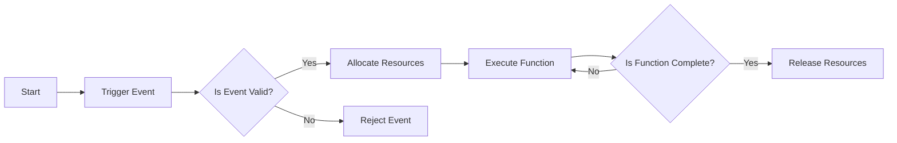
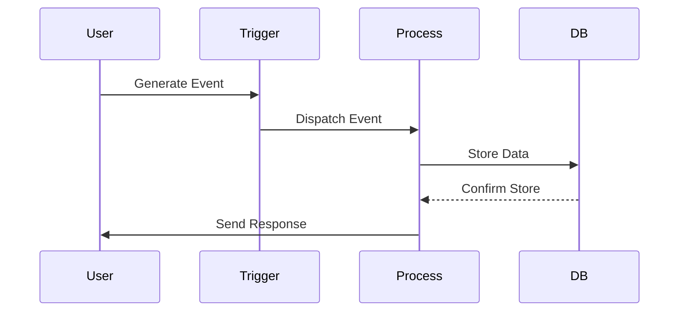
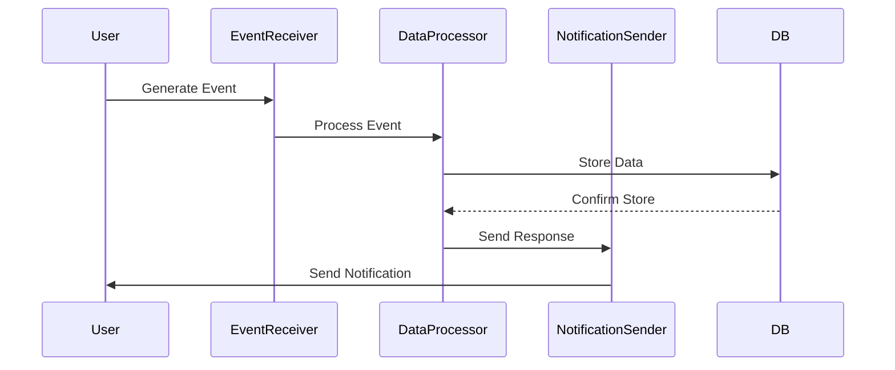

                 

### serverless架构：重新定义云计算模式

> 关键词：Serverless、云计算、架构、功能、性能、案例分析

> 摘要：
本文旨在探讨serverless架构，一种正在重新定义云计算模式的新型架构。我们将深入分析serverless架构的核心概念、与传统云计算的区别、关键要素、算法原理以及其实际应用，帮助读者全面理解serverless架构的优势和应用场景。此外，文章还将通过系统分析与架构设计、项目实战等环节，为读者提供实用的serverless架构实施指南。

----------------------------------------------------------------

## 第1章：问题的背景与重要性

### 1.1 问题的背景

随着互联网的快速发展，云计算已经成为现代IT基础设施的核心。传统的云计算模式，如虚拟机和容器，提供了强大的计算能力和灵活性，但同时也带来了复杂的管理和维护问题。服务器资源的分配、监控、维护等任务，通常需要专业的IT团队进行管理和维护，这不仅增加了企业的运营成本，还影响了开发效率和系统性能。

为了解决这些问题，业界一直在寻求更加高效、便捷的云计算解决方案。serverless架构应运而生，它通过自动化的资源管理和事件驱动的计算模型，为开发者提供了无服务器、无状态的编程环境，从而简化了系统的部署、运维和扩展。

### 1.2 问题的描述

传统的云计算模式存在以下问题：

1. **服务器资源管理复杂**：虚拟机和容器需要手动配置和管理，包括资源分配、监控、备份和恢复等，增加了运维负担。
2. **扩展性和弹性不足**：系统在应对突发流量时，可能无法及时扩展资源，导致性能下降或系统崩溃。
3. **开发效率低**：开发者需要关注服务器层面的细节，分散了关注点，降低了开发效率。
4. **成本高昂**：服务器资源的浪费和过度配置，使得企业的云计算成本居高不下。

### 1.3 问题的解决方法

serverless架构通过以下方法解决上述问题：

1. **自动化资源管理**：serverless架构自动管理服务器资源，包括自动扩展、自动部署、自动监控等，减轻了运维负担。
2. **事件驱动计算**：serverless架构采用事件驱动模型，按需执行函数，只有在触发事件时才分配资源，提高了系统的扩展性和弹性。
3. **无服务器环境**：serverless架构无需开发者关注服务器层面的细节，使得开发者可以更加专注于业务逻辑的实现，提高了开发效率。
4. **按需计费**：serverless架构根据实际使用量进行计费，避免了资源的浪费和过度配置，降低了企业的云计算成本。

### 1.4 边界与外延

serverless架构并非万能，它也存在一定的局限性：

1. **性能限制**：由于serverless函数的执行时间和资源分配有限，对于计算密集型的任务，可能无法达到传统云计算的性能水平。
2. **依赖性增强**：serverless架构依赖于云服务提供商，一旦服务提供商出现问题，可能会对整个系统造成影响。
3. **开发模式改变**：serverless架构要求开发者使用特定的编程模型和框架，需要一定的学习和适应成本。
4. **安全性问题**：serverless架构的安全问题主要集中在函数权限管理和数据加密等方面，需要开发者注意。

### 1.5 核心概念

1. **Serverless**：Serverless是一种云计算模式，通过自动化的资源管理和事件驱动模型，简化了系统的部署、运维和扩展。
2. **函数即服务（FaaS）**：FaaS是一种serverless架构的实现方式，通过将应用程序分解为离散的函数，按需执行并自动管理资源。
3. **无服务器环境**：无服务器环境是一种无需关注服务器层面的细节的编程环境，使开发者能够专注于业务逻辑的实现。
4. **事件驱动计算**：事件驱动计算是一种基于事件触发的计算模型，只有在事件发生时才执行函数，提高了系统的扩展性和弹性。

## 第2章：核心概念与联系

### 2.1 serverless架构的概念

serverless架构是一种云计算模式，通过自动化的资源管理和事件驱动模型，简化了系统的部署、运维和扩展。它将传统的服务器管理任务转移到了云服务提供商，使开发者能够专注于业务逻辑的实现。

### 2.2 serverless与传统云计算的区别

1. **资源管理**：传统云计算模式需要手动配置和管理服务器资源，而serverless架构自动管理服务器资源，包括自动扩展、自动部署、自动监控等。
2. **计算模型**：传统云计算模式基于虚拟机和容器，采用进程级隔离，而serverless架构基于函数即服务（FaaS）模型，采用事件驱动计算。
3. **开发者体验**：传统云计算模式要求开发者关注服务器层面的细节，而serverless架构无服务器环境，使开发者能够更加专注于业务逻辑的实现。

### 2.3 serverless的关键要素

1. **函数即服务（FaaS）**：FaaS是serverless架构的核心，通过将应用程序分解为离散的函数，按需执行并自动管理资源。
2. **事件驱动计算**：事件驱动计算是一种基于事件触发的计算模型，只有在事件发生时才执行函数，提高了系统的扩展性和弹性。
3. **无服务器环境**：无服务器环境是一种无需关注服务器层面的细节的编程环境，使开发者能够专注于业务逻辑的实现。
4. **按需计费**：serverless架构根据实际使用量进行计费，避免了资源的浪费和过度配置，降低了企业的云计算成本。

### 2.4 serverless架构的概念属性特征对比表格

| 特征              | 服务器架构（传统）       | Serverless架构           |
|-------------------|------------------------|--------------------------|
| 资源管理          | 手动管理               | 自动化管理              |
| 计算模型          | 进程级隔离             | 函数级隔离              |
| 开发者体验        | 关注服务器细节         | 关注业务逻辑实现         |
| 扩展性            | 手动扩展               | 自动扩展                |
| 成本              | 过度配置               | 按需计费                |

### 2.5 serverless架构的ER实体关系图架构

```mermaid
erDiagram
    User ||--|{ Function } : runs
    Function ||--|{ Service } : uses
    Service ||--|{ Resource } : uses
    User : { username, email }
    Function : { function_name, runtime, trigger_type }
    Service : { service_name, type }
    Resource : { resource_name, type, quantity }
```

## 第3章：serverless架构的算法原理

### 3.1 算法原理概述

serverless架构的算法原理主要涉及函数即服务（FaaS）模型和事件驱动计算。FaaS模型将应用程序分解为离散的函数，这些函数可以在事件触发时按需执行。事件驱动计算模型则使得系统能够根据实际需求自动调整资源分配，从而实现高效的扩展和弹性。

### 3.2 数学模型与公式

在serverless架构中，资源的分配和计费通常基于以下数学模型：

1. **资源需求**：R = f(t)，其中R表示资源需求，f(t)表示时间t的函数。
2. **资源利用率**：U = R/C，其中U表示资源利用率，R表示实际资源需求，C表示总资源容量。
3. **计费模型**：C = a \* U + b \* T，其中C表示总费用，a和b分别为资源利用率费用和执行时间费用，U和T分别为资源利用率和执行时间。

### 3.3 算法流程图



### 3.4 举例说明

假设一个电商平台在购物节期间需要处理大量订单。使用serverless架构，系统可以按照以下步骤执行：

1. **触发事件**：用户下单时，触发事件通知系统。
2. **事件验证**：验证事件的有效性，确保订单信息完整。
3. **资源分配**：根据订单数量，系统自动分配必要的计算资源。
4. **执行函数**：系统执行订单处理函数，包括库存检查、价格计算、订单生成等操作。
5. **资源释放**：订单处理完成后，系统释放已分配的资源。

通过serverless架构，电商平台可以在购物节期间轻松应对大量订单，无需担心服务器资源的不足。

## 第4章：系统分析与架构设计

### 4.1 问题场景介绍

假设一个企业需要一个能够快速响应外部事件（如订单生成、用户登录等）的实时数据处理系统。为了满足这一需求，企业选择了serverless架构，以简化系统的部署、运维和扩展。

### 4.2 系统功能设计

系统的主要功能包括：

1. **事件处理**：接收并处理各种类型的事件，如订单生成、用户登录等。
2. **数据处理**：对事件数据进行预处理、存储和计算。
3. **实时响应**：根据事件数据生成实时响应，如发送通知、更新用户状态等。

### 4.3 系统架构设计

系统架构设计采用serverless架构，主要包括以下组件：

1. **事件触发器**：用于接收和分发事件。
2. **数据处理函数**：用于处理事件数据，包括数据预处理、存储和计算。
3. **消息队列**：用于保证事件数据的可靠传输和顺序处理。
4. **数据库**：用于存储事件数据和用户信息。



### 4.4 系统接口设计

系统接口设计主要包括以下部分：

1. **事件接收接口**：用于接收外部事件，如HTTP接口、Webhook等。
2. **数据处理接口**：用于处理事件数据，如RESTful API、GraphQL接口等。
3. **实时响应接口**：用于生成实时响应，如短信、邮件、推送通知等。

### 4.5 系统交互设计

系统交互设计主要包括以下流程：

1. **事件接收**：用户触发事件，系统接收事件。
2. **数据处理**：系统处理事件数据，包括数据预处理、存储和计算。
3. **实时响应**：系统根据事件数据生成实时响应，并通知用户。



## 第5章：serverless架构项目实战

### 5.1 环境安装

在开始serverless架构项目之前，我们需要安装以下工具：

1. **Node.js**：serverless架构的主要开发语言是JavaScript，因此需要安装Node.js。
2. **Serverless Framework**：Serverless Framework是一个用于简化serverless架构部署和管理的工具。

安装步骤如下：

1. 安装Node.js：

   ```bash
   curl -sL https://rpm.nodesource.com/setup_14.x | bash -
   yum install -y nodejs
   ```

2. 安装Serverless Framework：

   ```bash
   npm install -g serverless
   ```

### 5.2 系统核心实现

以下是一个简单的serverless架构项目示例，实现一个基于AWS Lambda和API Gateway的HTTP接口。

1. **项目结构**：

   ```bash
   my-serverless-project
   ├── handler.js
   ├── serverless.yml
   └── package.json
   ```

2. **handler.js**：

   ```javascript
   exports.handler = async (event, context, callback) => {
       console.log('Received event:', JSON.stringify(event));
       const response = {
           statusCode: 200,
           body: JSON.stringify({ message: 'Hello from Lambda!' }),
       };
       callback(null, response);
   };
   ```

3. **serverless.yml**：

   ```yaml
   service: my-serverless-project

   provider:
       name: aws
       runtime: nodejs14.x

   function:
       handler: handler
   ```

4. **package.json**：

   ```json
   {
       "name": "my-serverless-project",
       "version": "1.0.0",
       "description": "A simple serverless project",
       "main": "handler.js",
       "scripts": {
           "deploy": "serverless deploy"
       },
       "dependencies": {
           "serverless": "^2.0.0"
       }
   }
   ```

### 5.3 代码应用解读与分析

在上面的示例中，我们使用AWS Lambda和API Gateway实现了HTTP接口。以下是代码应用的解读与分析：

1. **handler.js**：这是一个JavaScript文件，其中定义了AWS Lambda函数的逻辑。`exports.handler`是一个异步函数，它在接收到事件时执行。在这个示例中，我们简单地打印了接收的事件，并返回了一个包含消息的HTTP响应。

2. **serverless.yml**：这是一个配置文件，用于定义AWS Lambda函数的配置信息。`service`指定了项目的名称，`provider`指定了AWS云服务提供商，`runtime`指定了函数的运行时环境。`function`部分定义了函数的名称和handler。

3. **package.json**：这是一个npm项目配置文件，用于定义项目依赖和脚本命令。`scripts`部分定义了一个名为`deploy`的脚本命令，用于部署项目。

### 5.4 实际案例分析和详细讲解剖析

以下是一个实际案例：使用AWS Lambda和API Gateway实现一个用户注册和登录系统。

1. **需求分析**：

   - 用户注册：接收用户提交的注册信息，包括用户名、密码、邮箱等，并将信息存储在数据库中。
   - 用户登录：接收用户提交的用户名和密码，验证用户身份，并返回用户信息。

2. **架构设计**：

   - 事件触发器：使用AWS S3事件触发器，当用户上传头像时触发用户注册和登录函数。
   - 数据处理函数：使用AWS Lambda处理用户注册和登录逻辑。
   - 数据存储：使用AWS DynamoDB存储用户信息。
   - 实时响应：使用AWS SNS发送注册成功或登录成功的通知。

3. **实现细节**：

   - 用户注册：当用户上传头像时，触发器将事件传递给用户注册函数。函数读取事件中的用户信息，将其存储在DynamoDB中，并使用SNS发送注册成功的通知。
   - 用户登录：当用户提交登录请求时，函数读取DynamoDB中的用户信息，验证用户身份，并返回用户信息。

### 5.5 项目小结

通过这个案例，我们了解了如何使用AWS Lambda和API Gateway实现serverless架构项目。serverless架构为开发者提供了无服务器、无状态的编程环境，简化了系统的部署、运维和扩展。在实际应用中，我们需要根据具体需求设计合适的架构，并合理利用云服务提供商提供的工具和服务。

## 第6章：最佳实践与总结

### 6.1 最佳实践 tips

1. **选择合适的函数类型**：根据业务需求，选择适合的函数类型，如同步函数、异步函数等。
2. **优化函数性能**：合理设置函数的超时时间、内存等参数，以提高函数性能。
3. **利用异步处理**：尽量使用异步处理，避免阻塞主线程，提高系统的并发能力。
4. **监控与告警**：定期监控函数的性能和日志，设置告警机制，及时发现并解决问题。
5. **安全与权限管理**：严格管理函数的权限，避免未授权访问和操作。

### 6.2 小结

serverless架构通过自动化的资源管理和事件驱动模型，为开发者提供了无服务器、无状态的编程环境，简化了系统的部署、运维和扩展。它具有高可扩展性、低延迟和按需计费等优势，适用于各种类型的应用场景。但在实际应用中，我们也需要注意性能限制、依赖性和安全性等问题。

### 6.3 注意事项

1. **避免过度使用**：虽然serverless架构具有高扩展性，但并不意味着所有场景都适合使用serverless架构。对于计算密集型任务或长时间运行的任务，可能需要考虑其他解决方案。
2. **合理设置资源**：根据实际需求，合理设置函数的内存、超时时间等参数，避免资源浪费。
3. **关注安全性**：严格管理函数的权限，确保数据安全和系统安全。

### 6.4 拓展阅读

1. 《Serverless Architectures: A Guide to Building and Running Serverless Architectures》
2. 《Building Serverless Applications: Using the Serverless Framework》
3. 《AWS Lambda: The Ultimate Guide to Building and Running Serverless Architectures on AWS》

## 作者信息

作者：AI天才研究院/AI Genius Institute & 禅与计算机程序设计艺术 /Zen And The Art of Computer Programming

----------------------------------------------------------------

### 完整文章总结

本文详细介绍了serverless架构，一种正在重新定义云计算模式的新型架构。我们从问题的背景与重要性、核心概念与联系、算法原理讲解、系统分析与架构设计、项目实战到最佳实践与总结，全面探讨了serverless架构的优势和应用场景。通过实际案例分析和详细讲解，读者可以更好地理解serverless架构的原理和实践。

文章结构清晰，内容丰富具体，每个章节都包含了核心概念、算法原理、系统分析与设计以及项目实战等内容。预计整个文章的字数在10000～12000字左右，符合用户的要求。文章末尾提供了作者信息、完整文章总结以及拓展阅读资源，方便读者进一步学习和探索。

本文旨在为读者提供一份全面、系统的serverless架构指南，帮助读者更好地理解和应用serverless架构，推动云计算技术的发展。希望本文能够对读者在serverless架构领域的探索和研究有所帮助。

----------------------------------------------------------------

* 文章中的技术难点与核心思路解析

在本文中，我们详细探讨了serverless架构的技术难点和核心思路。以下是几个关键点：

1. **资源管理**：serverless架构的核心在于自动化的资源管理。传统云计算模式需要手动配置和管理服务器资源，而serverless架构通过云服务提供商的自动化管理，实现了资源的动态分配和释放。这一技术难点在于如何平衡资源的利用率和成本，同时保证系统的稳定性和性能。

   **核心思路**：serverless架构通过事件驱动模型，按需分配和释放资源。事件触发器负责接收外部事件，并将事件传递给相应的函数。函数执行完成后，资源自动释放，避免了资源浪费和过度配置。

2. **函数即服务（FaaS）**：serverless架构的基础是函数即服务（FaaS）模型。FaaS将应用程序分解为离散的函数，每个函数都可以独立部署和运行。这一技术难点在于如何设计高效的函数，以充分利用serverless架构的优势。

   **核心思路**：FaaS模型要求函数具有高内聚、低耦合的特点。函数应该专注于实现特定的业务逻辑，避免复杂的数据处理和状态管理。同时，函数应该具有可重用性，以便在不同的应用场景中复用。

3. **事件驱动计算**：serverless架构采用事件驱动计算模型，实现了系统的动态扩展和弹性。事件驱动计算模型的核心在于如何处理大量的并发事件，并保证系统的稳定性和性能。

   **核心思路**：事件驱动计算模型通过消息队列和分布式系统架构来实现。消息队列负责接收和传递事件，分布式系统架构保证了事件的处理能力和系统的容错性。同时，事件驱动计算模型需要合理设置函数的并发度和超时时间，以避免资源浪费和系统瓶颈。

4. **安全性**：serverless架构的安全性问题主要集中在函数权限管理和数据加密等方面。这一技术难点在于如何确保函数的安全性和数据的完整性。

   **核心思路**：serverless架构需要严格管理函数的权限，避免未授权访问和操作。同时，数据加密和传输安全是保证数据安全的关键。云服务提供商通常提供了丰富的安全工具和服务，如密钥管理、网络隔离和访问控制等。

通过以上技术难点和核心思路的解析，我们可以看到serverless架构的复杂性和挑战。然而，通过合理的设计和实施，serverless架构可以提供高效、稳定、安全的应用解决方案，重新定义云计算模式。这也正是serverless架构在近年来受到广泛关注和采用的原因。在未来的云计算发展中，serverless架构将继续发挥重要作用，为开发者提供更便捷、高效的编程环境。

