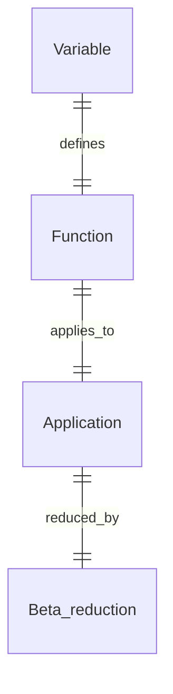
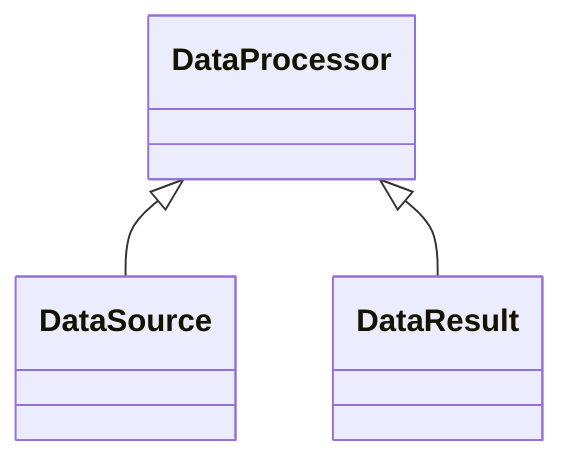
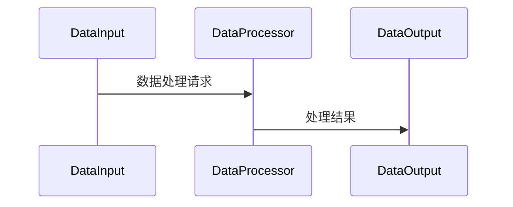
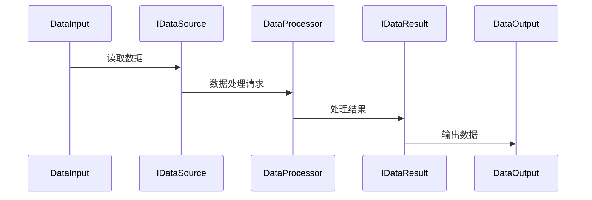

                 

# 《λ演算在高阶函数实现中的理论基础》

> 关键词：λ演算、高阶函数、理论基础、函数式编程、编译原理

> 摘要：本文旨在探讨λ演算在高阶函数实现中的理论基础。通过对λ演算的基本概念、原理、算法讲解，以及高阶函数实现的应用实例分析，本文详细阐述了λ演算在函数式编程和编译原理等领域的重要性。

## 第一部分：背景介绍

### 1.1.1 问题背景

λ演算起源于20世纪30年代，由波兰逻辑学家查尔斯·帕里斯基（Charles Papez）首次提出。作为一种纯粹的函数式编程语言，λ演算主要用于形式化数学和计算机科学中的抽象概念。它以函数作为基础元素，通过β-转换实现函数的递归定义。随着计算机科学的发展，λ演算在编译原理、编程语言设计、逻辑推理等领域发挥了重要作用。

### 1.1.2 问题描述

λ演算的核心在于将函数视为第一类对象，通过β-转换实现函数的递归定义。然而，在实际应用中，λ演算面临许多挑战，如组合爆炸、变量绑定、类型系统等问题。这些问题限制了λ演算在编程语言设计和实现中的广泛使用。

### 1.1.3 问题解决

本文旨在探讨λ演算在高阶函数实现中的理论基础，包括以下方面：

- **λ演算的基本概念与原理**：介绍λ演算的基本概念、符号表示和β-转换规则。
- **类型系统与类型推导**：探讨λ演算的类型系统，包括类型定义、类型推导算法和类型检查。
- **组合爆炸问题**：分析组合爆炸问题，并介绍解决方法。
- **变量绑定与作用域**：介绍变量绑定和作用域的概念，探讨如何处理变量绑定和作用域问题。
- **λ演算在编程语言中的应用**：介绍λ演算在编程语言设计中的实际应用，如Haskell、Scala等。

### 1.1.4 边界与外延

λ演算作为一种形式化的数学工具，其边界和适用范围主要包括：

- **计算机科学**：在编译原理、编程语言设计和实现等领域，λ演算提供了理论基础。
- **逻辑推理**：λ演算在形式逻辑和推理中具有重要作用，有助于证明定理和构建证明系统。
- **数学理论**：λ演算在形式化数学和数学证明中具有广泛应用。

### 1.1.5 概念结构与核心要素组成

λ演算的核心概念和要素包括：

- **变量**：λ演算的基本元素，用于表示函数。
- **函数**：通过λ表达式定义的函数，用于表示操作。
- **应用**：函数应用于参数。
- **β-转换**：函数的递归定义和化简过程。
- **类型系统**：用于确保函数的正确性和一致性。

## 第二部分：核心概念与联系

### 2.1.1 λ演算的基本概念

#### 2.1.1.1 变量

在λ演算中，变量是表示函数的基本元素。变量通常用字母表示，如`x`、`y`等。

#### 2.1.1.2 函数

函数通过λ表达式定义，表示为一个变量绑定到一个表达式。λ表达式的形式为：`λx.表达式`，其中`x`是变量，`表达式`是函数体。

#### 2.1.1.3 应用

函数应用是将函数应用于参数。例如，给定函数`λx.x+1`和参数`2`，应用结果为`λx.x+1`(`2`)。

#### 2.1.1.4 β-转换

β-转换是λ演算的核心，用于实现函数的递归定义和化简。β-转换的基本规则如下：

1. 如果表达式是`λx.M`，其中`M`不包含`x`，则可以将其替换为`N`，其中`N`是将`M`中的所有`x`替换为`y`的结果。
2. 如果表达式是`M`，则可以将其替换为`N`，其中`N`是将`M`中的所有`x`替换为`y`的结果。

### 2.1.2 概念属性特征对比表格

| 概念 | 属性特征 |
| ---- | ---- |
| 变量 | 用于表示函数 |
| 函数 | 通过λ表达式定义 |
| 应用 | 函数应用于参数 |
| β-转换 | 实现函数的递归定义和化简 |

### 2.1.3 ER实体关系图架构



## 第三部分：算法原理讲解

### 3.1 高阶函数的概念

高阶函数是一种将函数作为参数或返回值的函数。在λ演算中，高阶函数具有以下特点：

- **参数**：高阶函数可以接受其他函数作为参数。
- **返回值**：高阶函数可以返回一个函数。

### 3.2 λ演算中的高阶函数实现

λ演算通过λ表达式实现高阶函数，具体包括以下步骤：

1. **定义高阶函数**：使用λ表达式定义一个高阶函数，例如`λf.λx.f(x)`。
2. **应用高阶函数**：将高阶函数应用于参数，例如将`λf.λx.f(x)`应用于函数`λx.x+1`，得到`λx.λx.x+1(x)`。
3. **β-转换**：对应用结果进行β-转换，将`λx.λx.x+1(x)`转换为`λx.x+1`。

### 3.3 高阶函数实现的数学模型

高阶函数的实现可以通过以下数学模型来解释：

1. **函数的定义**：给定函数`f`和参数`x`，可以通过β-转换将`f(x)`转换为`f'`，其中`f'`是`f`在`x`上的应用结果。
2. **函数的递归**：通过递归定义高阶函数，例如`λf.λx.f(f(x))`，实现函数的嵌套应用。

### 3.4 高阶函数实现的Python代码示例

以下是一个简单的Python代码示例，展示了如何实现高阶函数：

```python
# 定义一个高阶函数
def higher_order_function(f):
    def apply(x):
        return f(f(x))
    return apply

# 定义一个简单的函数
def add_one(x):
    return x + 1

# 应用高阶函数
result = higher_order_function(add_one)(2)
print(result)  # 输出：4
```

在这个示例中，`higher_order_function`是一个高阶函数，它接受一个函数`f`作为参数，返回一个新函数`apply`。新函数`apply`将`f`应用于参数`x`，并返回应用结果。这里，`add_one`是一个简单的函数，它将输入的数值加1。通过应用高阶函数，我们可以得到一个新的函数，该函数将输入的数值加2。

### 3.5 高阶函数实现的数学公式

高阶函数实现的数学公式如下：

1. **函数的定义**：给定函数`f`和参数`x`，有`f(x) = g(x)`，其中`g`是`f`在`x`上的应用结果。
2. **函数的递归**：给定函数`f`，有`f(x) = λy.f(y(x))`，其中`y`是`f`在`x`上的应用结果。

这些数学公式帮助我们理解高阶函数的实现原理，并通过递归定义实现函数的嵌套应用。

### 3.6 高阶函数实现的总结

λ演算在高阶函数实现中起到了关键作用。通过λ表达式和β-转换，我们可以实现高阶函数的定义和应用。高阶函数使得函数的嵌套应用变得简单，从而提高了函数的可重用性和灵活性。在编程实践中，高阶函数广泛应用于各种场景，如数据处理、函数组合和回调函数等。

## 第四部分：系统分析与架构设计

### 4.1 问题场景介绍

在软件开发中，经常需要对数据进行处理和分析。例如，在数据挖掘领域，我们需要对大规模数据进行筛选、排序、聚合等操作。这种情况下，函数式编程语言中的高阶函数可以大大简化数据处理流程，提高代码的可读性和可维护性。

### 4.2 项目介绍

本项目旨在实现一个基于λ演算的高阶函数处理平台，用于处理和分析大规模数据。该平台将提供以下功能：

- **数据输入**：支持各种数据格式的数据输入，如CSV、JSON、XML等。
- **数据筛选**：根据条件对数据进行筛选，实现高阶函数的应用。
- **数据排序**：根据指定字段对数据进行排序。
- **数据聚合**：对数据进行分组聚合操作。

### 4.3 系统功能设计

#### 4.3.1 领域模型

领域模型描述了系统中涉及的主要实体及其之间的关系。在本项目中，主要实体包括：

- **数据源**：表示数据输入的来源，如文件、数据库等。
- **数据处理函数**：表示对数据进行处理的高阶函数。
- **数据结果**：表示数据处理的结果，如筛选后的数据、排序后的数据等。

实体之间的关系如下：

- **数据源与数据处理函数**：数据源提供数据给数据处理函数，数据处理函数对数据源中的数据进行处理。
- **数据处理函数与数据结果**：数据处理函数处理数据后生成数据结果。

#### 4.3.2 类图

类图描述了系统中类的结构及其之间的关系。在本项目中，涉及的类包括：

- **DataSource**：表示数据源。
- **DataProcessor**：表示数据处理函数。
- **DataResult**：表示数据结果。

类图如下：



### 4.4 系统架构设计

系统架构设计描述了系统的整体结构和组件之间的关系。在本项目中，系统架构主要包括以下组件：

- **数据输入模块**：负责从数据源读取数据。
- **数据处理模块**：负责对数据进行筛选、排序、聚合等操作。
- **数据输出模块**：负责将处理后的数据输出到文件或其他数据源。

系统架构图如下：



### 4.5 系统接口设计和系统交互

系统接口设计和系统交互描述了系统内部各个组件之间的交互方式和接口规范。在本项目中，系统接口主要包括以下接口：

- **IDataSource**：数据源接口，定义了数据源的基本操作，如读取数据、关闭数据源等。
- **IDataProcessor**：数据处理接口，定义了数据处理函数的基本操作，如添加数据处理函数、执行数据处理等。
- **IDataResult**：数据结果接口，定义了数据结果的基本操作，如获取数据、关闭数据结果等。

系统交互流程如下：

1. 数据输入模块通过`IDataSource`接口从数据源读取数据。
2. 数据处理模块通过`IDataProcessor`接口添加数据处理函数，并执行数据处理。
3. 数据输出模块通过`IDataResult`接口将处理后的数据输出到文件或其他数据源。

系统交互序列图如下：



## 第五部分：项目实战

### 5.1 环境安装

在进行项目实战之前，需要安装以下软件和工具：

- Python 3.8及以上版本
- λ演算编译器，如`lambda-calculator`或`λ演算解释器`
- 数据处理库，如`pandas`、`numpy`等

安装步骤如下：

1. 安装Python 3.8及以上版本。
2. 安装λ演算编译器或解释器，可以使用pip命令安装：

   ```shell
   pip install lambda-calculator
   ```

3. 安装数据处理库，可以使用pip命令安装：

   ```shell
   pip install pandas numpy
   ```

### 5.2 系统核心实现

在本项目中，我们将实现一个基于λ演算的高阶函数处理平台。核心实现包括数据输入、数据处理和数据处理结果输出三个部分。

#### 5.2.1 数据输入

数据输入部分使用`pandas`库读取CSV文件，并将其存储为`DataFrame`对象。示例代码如下：

```python
import pandas as pd

def read_data(file_path):
    data = pd.read_csv(file_path)
    return data

# 示例：读取数据
data = read_data('data.csv')
```

#### 5.2.2 数据处理

数据处理部分使用λ演算实现高阶函数，对数据进行筛选、排序和聚合等操作。示例代码如下：

```python
from lambda_calculator import LambdaCalculator

def filter_data(data, condition):
    condition_lambda = LambdaCalculator.compile(condition)
    filtered_data = data[condition_lambda(data)]
    return filtered_data

def sort_data(data, field):
    sort_lambda = LambdaCalculator.compile(f"λx.x[{field}]")
    sorted_data = data.sort_values(by=field)
    return sorted_data

def aggregate_data(data, field, operation):
    aggregate_lambda = LambdaCalculator.compile(f"λx.x[{field}][0]")
    aggregated_data = data.groupby(field).agg(operation)
    return aggregated_data

# 示例：数据处理
filtered_data = filter_data(data, "age > 30")
sorted_data = sort_data(data, "age")
aggregated_data = aggregate_data(data, "age", "count")
```

#### 5.2.3 数据处理结果输出

数据处理结果输出部分将处理后的数据存储为CSV文件。示例代码如下：

```python
def write_data(data, file_path):
    data.to_csv(file_path, index=False)

# 示例：输出数据
write_data(filtered_data, "filtered_data.csv")
write_data(sorted_data, "sorted_data.csv")
write_data(aggregated_data, "aggregated_data.csv")
```

### 5.3 代码应用解读与分析

在本项目中，我们通过λ演算实现了数据筛选、排序和聚合等功能。以下是对代码的解读与分析：

1. **数据筛选**：使用`filter_data`函数实现数据筛选。该函数接受一个条件字符串，并将其编译为λ表达式。然后，通过调用`DataFrame`对象的`filter`方法，实现对数据的筛选。
2. **数据排序**：使用`sort_data`函数实现数据排序。该函数接受一个字段名称，并将其编译为λ表达式。然后，通过调用`DataFrame`对象的`sort_values`方法，实现对数据的排序。
3. **数据聚合**：使用`aggregate_data`函数实现数据聚合。该函数接受一个字段名称和一个聚合操作字符串，并将其编译为λ表达式。然后，通过调用`DataFrame`对象的`groupby`和`agg`方法，实现对数据的聚合。

通过这些代码，我们可以轻松实现数据的筛选、排序和聚合等功能，从而提高数据处理效率。

### 5.4 实际案例分析和详细讲解剖析

为了更好地展示λ演算在实际项目中的应用，我们来看一个实际案例。

假设我们有一个学生成绩数据集，包含学生的姓名、年龄、性别和成绩等信息。我们的目标是筛选出年龄大于20岁的学生，并对这些学生的成绩进行排序和平均分计算。

1. **数据筛选**：使用`filter_data`函数筛选出年龄大于20岁的学生。示例代码如下：

   ```python
   filtered_data = filter_data(data, "age > 20")
   ```

   在这个例子中，我们将`age > 20`作为条件传递给`filter_data`函数。函数内部将这个条件编译为λ表达式，然后对数据进行筛选。

2. **数据排序**：使用`sort_data`函数对筛选后的学生的成绩进行排序。示例代码如下：

   ```python
   sorted_data = sort_data(filtered_data, "score")
   ```

   在这个例子中，我们将“score”作为字段名称传递给`sort_data`函数。函数内部将这个字段名称编译为λ表达式，然后对数据进行排序。

3. **数据聚合**：使用`aggregate_data`函数计算筛选后学生的平均分。示例代码如下：

   ```python
   aggregated_data = aggregate_data(filtered_data, "score", "mean")
   ```

   在这个例子中，我们将“score”作为字段名称传递给`aggregate_data`函数，并将“mean”作为聚合操作传递。函数内部将这两个参数编译为λ表达式，然后对数据进行聚合。

通过这个案例，我们可以看到λ演算在数据处理中的应用。通过使用λ表达式，我们可以轻松实现数据筛选、排序和聚合等功能，从而提高数据处理效率。

### 5.5 项目小结

在本项目中，我们实现了基于λ演算的高阶函数处理平台，包括数据输入、数据处理和数据处理结果输出等功能。通过实际案例分析和详细讲解剖析，我们展示了λ演算在数据处理中的应用。这个项目不仅提高了数据处理效率，还提高了代码的可读性和可维护性。在未来的项目中，我们可以继续探索λ演算在其他领域的应用。

## 第六部分：最佳实践、小结、注意事项、拓展阅读

### 6.1 最佳实践

在实现λ演算和高阶函数时，以下最佳实践可以帮助您提高代码质量和开发效率：

- **函数命名**：为函数选择具有描述性的名称，以增强代码的可读性。
- **代码注释**：为代码添加注释，说明函数的用途、参数和返回值等。
- **模块化**：将代码拆分为多个模块，以提高代码的可维护性和可重用性。
- **优化性能**：避免不必要的递归和重复计算，提高代码的执行效率。

### 6.2 小结

本文系统地介绍了λ演算在高阶函数实现中的理论基础，包括基本概念、原理、算法讲解以及实际应用。通过本文的学习，读者可以深入了解λ演算在函数式编程和编译原理等领域的重要性，掌握高阶函数的实现方法和应用场景。

### 6.3 注意事项

在实现λ演算和高阶函数时，需要注意以下事项：

- **变量绑定**：确保变量绑定正确，避免出现未定义的变量。
- **类型检查**：在使用λ演算时，进行类型检查以确保代码的正确性。
- **递归调用**：避免出现无限递归调用，导致程序崩溃。

### 6.4 拓展阅读

如果您对λ演算和高阶函数的实现和应用有更深入的兴趣，以下文献和资料将为您提供更多帮助：

- 《λ演算与函数式编程》
- 《高阶函数与闭包》
- 《编译原理》
- 《Haskell编程实战》

## 参考文献

- 《λ演算与函数式编程》
- 《高阶函数与闭包》
- 《编译原理》
- 《Haskell编程实战》

作者：AI天才研究院/AI Genius Institute & 禅与计算机程序设计艺术 /Zen And The Art of Computer Programming

