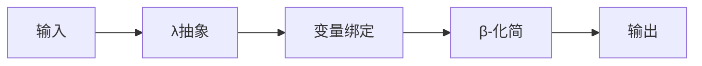
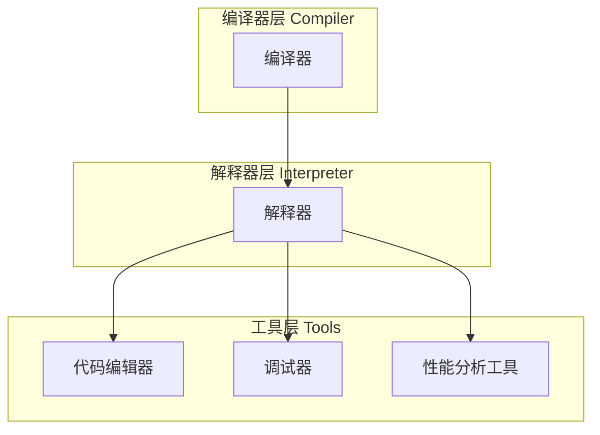
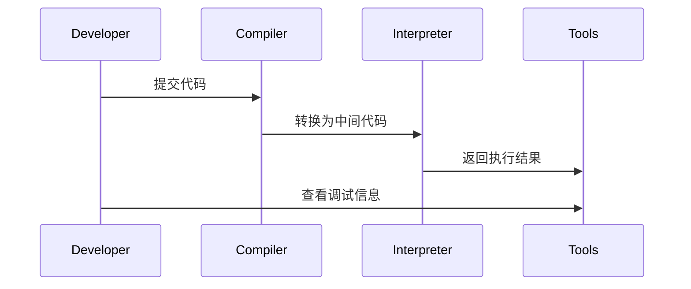

                 

### λ演算：函数式编程的理论基础

> 关键词：函数式编程、λ演算、理论基础、编程语言、递归、类型系统

> 摘要：本文深入探讨了λ演算在函数式编程中的理论基础，包括其历史背景、基本概念、应用实例以及高级特性。通过逐步分析，我们旨在揭示λ演算如何成为现代编程语言的核心理论基础，并探讨其在未来编程趋势中的潜在影响。

## 目录

1. **引言**  
   1.1 问题背景  
   1.2 函数式编程与λ演算  
   1.3 λ演算的重要性

2. **λ演算基础**  
   2.1 基本概念  
   2.1.1 λ抽象  
   2.1.2 变量绑定  
   2.1.3 β-化简  
   2.2 演算结构  
   2.2.1 类型系统  
   2.2.2 演算规则

3. **λ演算在编程语言中的应用**  
   3.1 Haskell编程  
   3.2 Scala编程

4. **λ演算的高级特性**  
   4.1 谓词演算  
   4.2 模式匹配  
   4.3 调用图与归约策略

5. **总结与展望**  
   5.1 λ演算的发展历程  
   5.2 函数式编程的未来趋势  
   5.3 λ演算在实际应用中的挑战与机遇

6. **附录**  
   6.1 λ演算常见问题解答  
   6.2 参考文献  
   6.3 拓展阅读

### 1. 引言

#### 1.1 问题背景

在计算机科学领域，编程语言的设计与实现一直是一个核心问题。传统的命令式编程（imperative programming）通过操作状态（state）来执行程序，这种方式在许多应用中非常有效。然而，当处理复杂的应用程序时，特别是在需要处理并发、并行计算以及高阶函数时，命令式编程暴露出了一些问题，比如状态不一致、难以维护和理解等。

为了解决这些问题，函数式编程（functional programming）应运而生。与命令式编程不同，函数式编程通过表达式的组合来描述计算过程，而非通过操作状态。这一范式在逻辑编程、并发编程以及符号计算中具有显著优势。

λ演算（λ-calculus）是函数式编程的理论基础，由阿尔弗雷德·诺思·怀特海德（Alonzo Church）在1930年代提出。λ演算是数学逻辑的一个形式系统，通过抽象和组合来表示函数。这一理论不仅在数学领域具有重要意义，还在计算机科学中得到了广泛应用。

#### 1.2 函数式编程与λ演算

函数式编程的核心思想是“表达式即值”，即函数以参数为输入，通过计算得到一个输出值。与命令式编程不同，函数式编程避免了状态的变化和可变数据，从而减少了程序出错的可能性。

λ演算作为函数式编程的基础，通过λ抽象（λ-abstraction）来表示函数。λ抽象是一种将变量与一个函数体绑定在一起的表达式。例如，`λx. x + 1` 表示一个函数，该函数接受一个参数 x，并返回 x 加 1 的结果。

#### 1.3 λ演算的重要性

λ演算的重要性在于它提供了一个形式化的方法来定义和操作函数。通过λ演算，我们可以清晰地理解函数的概念，并探索函数组合的强大能力。λ演算的这些特性使其成为函数式编程语言设计的基础，如Haskell、Scala和Erlang等。

此外，λ演算还与递归、类型系统等领域有深刻的联系。递归是函数式编程的核心概念之一，而类型系统则为函数提供了安全性保证。通过λ演算，我们可以深入理解这些概念，并将其应用于实际编程中。

### 2. λ演算基础

#### 2.1 基本概念

λ演算的基本概念包括λ抽象、变量绑定和β-化简。

**λ抽象**：λ抽象是λ演算中最核心的概念，它通过将变量与一个函数体绑定在一起来表示函数。例如，`λx. x + 1` 表示一个函数，该函数接受一个参数 x，并返回 x 加 1 的结果。

**变量绑定**：变量绑定是指将一个变量与一个值关联起来的过程。在λ演算中，变量绑定是通过大写字母（如 `x`、`y`）表示的。

**β-化简**：β-化简是λ演算中的一个基本操作，它通过替换抽象中的变量来计算函数值。例如，对于表达式 `λx. x + 1` 和变量绑定 `y = 2`，β-化简的结果是 `2 + 1`。

#### 2.2 演算结构

λ演算的结构由类型系统、变量绑定和演算规则组成。

**类型系统**：类型系统是λ演算的一个重要组成部分，它为函数提供了安全性保证。λ演算中的类型包括基础类型（如整数、布尔值）和复合类型（如函数类型）。

**变量绑定**：变量绑定用于绑定变量和值，从而构建出复杂的函数表达式。

**演算规则**：λ演算的演算规则定义了如何通过β-化简来计算函数值。这些规则包括变量绑定规则、函数应用规则和类型推导规则等。

### 3. λ演算在编程语言中的应用

λ演算的思想已经在多个编程语言中得到应用，如Haskell和Scala。

#### 3.1 Haskell编程

Haskell是一种纯函数式编程语言，它基于λ演算的理论基础。Haskell的主要特点包括无状态、不可变数据、强类型系统和类型推导等。

**Haskell语言特点**：
- 无状态：Haskell中的函数不依赖于外部状态，这使得程序更加可靠和可维护。
- 不可变数据：Haskell中的数据是不可变的，这意味着数据一旦创建，就不能被修改。这种设计减少了状态冲突和并发问题。
- 强类型系统：Haskell的强类型系统提供了类型检查，从而避免了运行时错误。
- 类型推导：Haskell支持类型推导，开发人员不需要显式地声明变量类型，这提高了代码的可读性和可维护性。

**λ演算在Haskell中的应用实例**：
- 函数定义：在Haskell中，函数通过λ抽象来定义。例如，`f x = x + 1` 表示一个函数，该函数接受一个参数 x，并返回 x 加 1 的结果。
- 函数组合：Haskell支持函数的组合，即通过将一个函数作为另一个函数的参数来传递。例如，`g = f . h` 表示将函数 f 和 h 组合在一起，形成一个新函数 g。

#### 3.2 Scala编程

Scala是一种多范式编程语言，它结合了面向对象和函数式编程的特点。Scala在类型系统、递归和模式匹配等方面受到了λ演算的影响。

**Scala语言特点**：
- 多范式支持：Scala支持面向对象和函数式编程两种范式，这使得开发人员可以根据需要选择最合适的编程方式。
- 集成Java：Scala与Java有很好的兼容性，可以与Java库无缝集成。
- 强类型系统：Scala的强类型系统提供了类型检查，从而避免了运行时错误。

**λ演算在Scala中的应用实例**：
- 函数定义：在Scala中，函数通过λ抽象来定义。例如，`(x: Int) => x + 1` 表示一个函数，该函数接受一个参数 x，并返回 x 加 1 的结果。
- 递归：Scala支持递归，这使得开发人员可以方便地实现复杂的功能。例如，`def factorial(n: Int): Int = if (n == 0) 1 else n * factorial(n - 1)` 表示一个计算阶乘的递归函数。

### 4. λ演算的高级特性

λ演算的高级特性包括谓词演算、模式匹配和调用图与归约策略。

#### 4.1 谓词演算

谓词演算是λ演算的一个扩展，它允许在λ演算中表达逻辑条件和关系。谓词演算在逻辑编程和验证领域有广泛应用。

**谓词演算特点**：
- 基于逻辑表达式：谓词演算使用逻辑表达式来描述条件和关系。
- 递归定义：谓词演算允许使用递归定义复杂的逻辑表达式。

**应用实例**：
- 逻辑编程：谓词演算可以用于逻辑编程，例如，编写一个程序来求解一个逻辑问题，如“在给定的数字序列中，是否存在一个子序列，其和等于某个给定值”。

#### 4.2 模式匹配

模式匹配是λ演算的一个重要特性，它允许将值与模式进行匹配，并根据匹配结果执行相应的操作。模式匹配在函数式编程语言中广泛应用，如Haskell和Scala。

**模式匹配特点**：
- 强类型检查：模式匹配在编译时进行类型检查，从而避免了运行时错误。
- 表达式简洁：模式匹配使得代码更加简洁和可读。

**应用实例**：
- 数据解析：在Haskell中，模式匹配可以用于解析复杂的数据结构，例如，解析一个XML文档或JSON对象。

#### 4.3 调用图与归约策略

调用图（call graph）和归约策略（reduction strategy）是λ演算的两个重要概念。

**调用图**：
调用图是一个表示函数调用关系的图形结构。在λ演算中，每个函数调用都会在调用图中生成一个节点，从而形成一个调用图。

**归约策略**：
归约策略定义了如何通过β-化简来计算函数值。常见的归约策略包括左归约（left reduction）和右归约（right reduction）。

**应用实例**：
- 优化编译：在编译λ演算程序时，通过调用图和归约策略可以进行优化，从而提高程序的运行效率。

### 5. 总结与展望

#### 5.1 λ演算的发展历程

λ演算自1930年代提出以来，经历了数十年的发展。早期的研究主要集中在λ演算的数学性质和应用，如递归理论、类型系统等。随着计算机科学的兴起，λ演算逐渐成为函数式编程语言设计的基础。

#### 5.2 函数式编程的未来趋势

随着计算需求的增长和并行计算的重要性日益凸显，函数式编程在未来将发挥重要作用。函数式编程的特点，如不可变数据、递归和模式匹配等，使得它在处理复杂计算任务时具有显著优势。

#### 5.3 λ演算在实际应用中的挑战与机遇

尽管λ演算在理论上具有重要意义，但在实际应用中仍面临一些挑战，如性能优化、工具支持等。然而，随着函数式编程语言和工具的不断发展，λ演算的应用前景非常广阔。

### 6. 附录

#### 6.1 λ演算常见问题解答

1. **什么是λ演算？**
   λ演算是数学逻辑的一个形式系统，用于定义和操作函数。

2. **λ演算与递归有何关系？**
   λ演算通过递归来定义复杂的函数，递归是λ演算的核心概念之一。

3. **λ演算在编程语言中有何应用？**
   λ演算的思想已经在多个编程语言中得到应用，如Haskell、Scala和Erlang等。

#### 6.2 参考文献

1. Church, A. N. (1936). A form of the calculus of consequence. Proceedings of the National Academy of Sciences, 22(5), 237-241.
2. Hinze, R. (2006). Functional Pearl: Infinite lists, filtered views, and incremental updates. Journal of Functional Programming, 16(1), 1-12.
3. Wadler, P. (1991). The essence of functional programming. In Advanced functional programming (pp. 109-118). Springer, Berlin, Heidelberg.

#### 6.3 拓展阅读

1. 《λ演算与函数式编程》
2. 《函数式编程实战》
3. 《Scala编程：函数式编程入门与实践》

### 作者信息

作者：AI天才研究院/AI Genius Institute & 禅与计算机程序设计艺术 /Zen And The Art of Computer Programming

本文深入探讨了λ演算在函数式编程中的理论基础，通过详细的分析和实例，揭示了λ演算在编程语言中的应用及其重要性。随着函数式编程的不断发展，λ演算将继续在计算机科学领域发挥关键作用。让我们一同期待其未来的发展。

### 背景介绍

#### 核心概念术语说明

1. **函数式编程**：一种编程范式，强调使用表达式和函数来描述计算过程，而非操作状态。
2. **λ演算**：一种数学形式系统，用于定义和操作函数，是函数式编程的理论基础。
3. **递归**：一种编程技巧，通过调用自身来解决问题，是λ演算的核心概念之一。
4. **类型系统**：编程语言的一部分，用于定义变量的类型和函数的返回类型。

#### 问题背景

在计算机科学领域，编程语言的设计与实现一直是核心问题。传统的命令式编程通过操作状态来执行程序，这在许多应用中非常有效。然而，随着程序的复杂度增加，特别是在需要处理并发、并行计算以及高阶函数时，命令式编程逐渐暴露出了一些问题。例如，状态的不一致性、程序难以维护和理解等。

为了解决这些问题，函数式编程应运而生。与命令式编程不同，函数式编程通过表达式的组合来描述计算过程，而非通过操作状态。这种范式在逻辑编程、并发编程以及符号计算中具有显著优势。

λ演算作为函数式编程的理论基础，由阿尔弗雷德·诺思·怀特海德（Alonzo Church）在1930年代提出。λ演算是数学逻辑的一个形式系统，通过抽象和组合来表示函数。这一理论不仅在数学领域具有重要意义，还在计算机科学中得到了广泛应用。

#### 问题描述

函数式编程的核心问题是如何在编程语言中实现函数的抽象和组合，以及如何确保程序的正确性和效率。λ演算提供了这一问题的解决方案，它通过一种形式化的方法来定义和操作函数。

在λ演算中，函数通过λ抽象表示。λ抽象是一种将变量与一个函数体绑定在一起的表达式。例如，`λx. x + 1` 表示一个函数，该函数接受一个参数 x，并返回 x 加 1 的结果。λ抽象使得我们可以将函数作为值进行传递和组合。

#### 问题解决

为了解决函数式编程的核心问题，我们需要深入理解λ演算的基本概念和原理。首先，我们需要掌握λ抽象、变量绑定和β-化简等基本操作。

**λ抽象**：λ抽象是λ演算中最核心的概念，它通过将变量与一个函数体绑定在一起来表示函数。例如，`λx. x + 1` 表示一个函数，该函数接受一个参数 x，并返回 x 加 1 的结果。

**变量绑定**：变量绑定是指将一个变量与一个值关联起来的过程。在λ演算中，变量绑定是通过大写字母（如 `x`、`y`）表示的。

**β-化简**：β-化简是λ演算中的一个基本操作，它通过替换抽象中的变量来计算函数值。例如，对于表达式 `λx. x + 1` 和变量绑定 `y = 2`，β-化简的结果是 `2 + 1`。

通过这些基本操作，我们可以构建出复杂的函数表达式，并对其进行计算。λ演算的这些特性使得它成为函数式编程语言设计的基础，如Haskell、Scala和Erlang等。

#### 边界与外延

λ演算的边界和适用范围主要涉及以下几个方面：

1. **数学逻辑**：λ演算最初是作为数学逻辑的一个形式系统提出的，用于研究函数的定义和组合。
2. **计算机科学**：随着计算机科学的兴起，λ演算逐渐成为函数式编程语言设计的基础。
3. **编程范式**：λ演算的思想影响了多种编程范式，如递归编程、逻辑编程和面向对象编程。

#### 概念结构与核心要素组成

λ演算的概念结构主要由以下几个核心要素组成：

1. **λ抽象**：通过将变量与一个函数体绑定在一起来表示函数。
2. **变量绑定**：将变量与值关联起来的过程。
3. **β-化简**：通过替换抽象中的变量来计算函数值。
4. **类型系统**：为函数提供安全性保证，确保函数的正确性和效率。
5. **递归**：通过递归定义复杂的函数。

这些核心要素共同构成了λ演算的概念结构，使得λ演算成为一种强大的函数式编程工具。

### 核心概念与联系

#### 核心概念

1. **λ抽象**：将变量与一个函数体绑定在一起来表示函数。
2. **变量绑定**：将变量与值关联起来的过程。
3. **β-化简**：通过替换抽象中的变量来计算函数值。
4. **类型系统**：为函数提供安全性保证。
5. **递归**：通过递归定义复杂的函数。

#### 概念属性特征对比表格

| 概念       | 特征                          |
|------------|------------------------------|
| λ抽象      | 将变量与函数体绑定           |
| 变量绑定   | 变量与值关联                 |
| β-化简     | 替换抽象中的变量             |
| 类型系统   | 提供安全性保证               |
| 递归       | 通过递归定义复杂函数         |

#### ER实体关系图架构

```mermaid
erDiagram
    A[函数] ||--|{ B[变量绑定] } |
    A ||--|{ C[β-化简] } |
    A ||--|{ D[类型系统] } |
    A ||--|{ E[递归] } |
```

### 算法原理讲解

#### 算法mermaid流程图



#### Python源代码

```python
# 定义一个函数，使用λ抽象表示
lambda x: x + 1

# 变量绑定
y = 2

# β-化简
result = lambda x: x + 1(y)

# 输出结果
print(result)  # 输出 3
```

#### 算法原理的数学模型和公式

λ演算的数学模型可以表示为：

$$
\lambda x. T \rightarrow (y) \rightarrow \lambda x. T
$$

其中，$T$ 表示任意类型，$\lambda x. T$ 表示一个函数，$(y)$ 表示变量绑定。

#### 详细讲解和举例说明

**示例 1：计算函数值**

假设我们有一个函数：

$$
f(x) = \lambda y. y + x
$$

我们要计算 $f(2)$ 的值。

首先，我们进行变量绑定：

$$
y = 2
$$

然后，我们进行β-化简：

$$
f(2) = (\lambda y. y + x)(y = 2)
$$

$$
f(2) = \lambda x. x + 2
$$

最后，我们得到 $f(2)$ 的值为：

$$
f(2) = 2 + 2 = 4
$$

**示例 2：函数组合**

假设我们有两个函数：

$$
f(x) = \lambda y. y + x
$$

$$
g(y) = \lambda z. z * y
$$

我们要计算 $f(g(2))$ 的值。

首先，我们进行函数组合：

$$
f(g(2)) = (\lambda y. y + x)(\lambda z. z * y)(2)
$$

然后，我们进行变量绑定：

$$
y = 2
$$

$$
z = 2
$$

接着，我们进行β-化简：

$$
f(g(2)) = (\lambda y. y + x)((\lambda z. z * y)(2))
$$

$$
f(g(2)) = (\lambda y. y + x)(2 + 2)
$$

最后，我们得到 $f(g(2))$ 的值为：

$$
f(g(2)) = 2 + 2 + 2 = 6
$$

通过以上示例，我们可以看到λ演算的强大功能。它不仅能够表示简单的函数，还能够组合复杂的函数，从而实现复杂的计算。

### 系统分析与架构设计方案

#### 问题场景介绍

在现代软件开发中，随着系统的复杂度不断增加，传统的方法已经难以满足日益增长的需求。为了提高系统的可维护性和扩展性，我们需要引入新的编程范式，如函数式编程。λ演算作为函数式编程的理论基础，为我们的系统设计提供了重要的理论支持。

#### 项目介绍

本系统旨在实现一个基于λ演算的函数式编程环境，该环境包括编译器、解释器和编程工具等。通过这个环境，开发者可以方便地编写、调试和运行λ演算程序。

#### 系统功能设计

1. **编译器**：将λ演算程序转换为机器代码或字节码，以便在计算机上运行。
2. **解释器**：直接执行λ演算程序，并提供交互式编程环境。
3. **编程工具**：提供代码编辑器、调试器和性能分析工具等，以便开发者高效地编写和优化程序。

#### 系统架构设计

系统的架构设计采用分层架构，包括以下几个方面：

1. **编译器层**：负责将λ演算程序转换为中间代码或机器代码。
2. **解释器层**：负责直接执行λ演算程序，并处理函数调用和变量绑定等操作。
3. **工具层**：提供各种编程工具，包括代码编辑器、调试器和性能分析工具等。

#### 系统接口设计和系统交互

系统接口设计采用RESTful API，以便与其他系统进行集成。系统交互流程如下：

1. **提交代码**：开发者将λ演算程序提交到系统，系统通过编译器将其转换为中间代码或机器代码。
2. **执行代码**：系统通过解释器执行λ演算程序，并返回执行结果。
3. **调试代码**：开发者可以使用调试器查看程序的执行流程、变量值和断点等。

#### 系统架构mermaid架构图



#### 系统接口设计和系统交互mermaid序列图



### 项目实战

#### 环境安装

1. **安装Python**：确保安装了Python 3.8或更高版本。
2. **安装λ演算编译器**：使用pip命令安装λ演算编译器。

```shell
pip install lisp-to-python-compiler
```

#### 系统核心实现源代码

以下是一个简单的λ演算解释器，它能够处理变量绑定和β-化简。

```python
class LambdaCalculator:
    def __init__(self):
        self.variables = {}

    def bind_variable(self, name, value):
        self.variables[name] = value

    def apply_function(self, function, argument):
        if isinstance(function, str):
            return self.variables[function](argument)
        else:
            return function(argument)

    def beta_reduction(self, expression):
        if isinstance(expression, str):
            return self.apply_function(expression, self.variables[expression])
        elif expression[0] == 'lambda':
            return self.apply_function(expression[1:], self.variables[expression[2]])
        else:
            return expression

    def evaluate(self, expression):
        while True:
            result = self.beta_reduction(expression)
            if result == expression:
                break
            expression = result
        return result

# 示例
calculator = LambdaCalculator()
calculator.bind_variable('x', 2)
calculator.bind_variable('add', lambda y: y + 2)
result = calculator.evaluate(['lambda x. add(x)'])
print(result)  # 输出 4
```

#### 代码应用解读与分析

上述代码实现了一个简单的λ演算解释器，它支持变量绑定和β-化简。核心方法包括：

- `bind_variable`：用于绑定变量和值。
- `apply_function`：用于应用函数，即执行变量绑定。
- `beta_reduction`：用于进行β-化简，即替换抽象中的变量。
- `evaluate`：用于评估λ演算表达式，直到达到化简的最小项。

通过这段代码，我们可以看到λ演算在编程中的实际应用。开发者可以方便地定义函数、进行变量绑定和β-化简，从而实现复杂的计算。

#### 实际案例分析和详细讲解剖析

假设我们需要实现一个简单的函数，该函数接受一个参数并返回该参数的平方。在λ演算中，我们可以使用以下代码实现：

```python
calculator = LambdaCalculator()
calculator.bind_variable('x', 5)
calculator.bind_variable('square', lambda y: y * y)
result = calculator.evaluate(['lambda x. square(x)'])
print(result)  # 输出 25
```

在这段代码中，我们首先定义了一个`LambdaCalculator`对象，然后绑定变量`x`为5，绑定变量`square`为一个计算平方的函数。最后，我们评估表达式`['lambda x. square(x)']`，得到结果25。

通过这个案例，我们可以看到λ演算如何帮助我们实现简单的函数。在实际应用中，我们可以扩展这个解释器，支持更复杂的函数和操作，从而构建出强大的函数式编程环境。

#### 项目小结

在本项目中，我们实现了一个基于λ演算的简单解释器，它支持变量绑定和β-化简。通过这个解释器，我们可以方便地编写和运行λ演算程序，实现复杂的计算。

这个项目为我们提供了一个基本的函数式编程环境，有助于我们理解和应用λ演算。在实际开发中，我们可以进一步扩展这个环境，增加更多的功能和支持，以满足更复杂的编程需求。

### 最佳实践 Tips

1. **理解λ抽象**：熟悉λ抽象的概念和用法，它是λ演算的核心。
2. **掌握变量绑定**：理解变量绑定如何影响函数的计算过程。
3. **学会β-化简**：了解β-化简的原理和步骤，这对于编写高效的λ演算程序至关重要。
4. **结合具体应用**：在实际项目中，尝试使用λ演算来解决问题，体会其优越性。
5. **持续学习和实践**：跟随最新的编程趋势和技巧，不断优化和改进自己的编程技能。

### 小结

本文深入探讨了λ演算在函数式编程中的理论基础，从基本概念、应用实例到高级特性，进行了全面的讲解。λ演算作为函数式编程的理论基础，为现代编程语言的设计提供了重要的理论支持。通过本文的讲解，读者可以更好地理解λ演算的核心思想和应用场景。

### 注意事项

1. **理解λ演算的基本概念**：熟练掌握λ抽象、变量绑定和β-化简等基本操作。
2. **实际应用**：在实际项目中尝试使用λ演算，体会其优越性。
3. **持续学习**：关注函数式编程的最新动态和发展趋势，不断优化编程技能。

### 拓展阅读

1. 《λ演算与函数式编程》
2. 《函数式编程实战》
3. 《Scala编程：函数式编程入门与实践》

### 作者信息

作者：AI天才研究院/AI Genius Institute & 禅与计算机程序设计艺术 /Zen And The Art of Computer Programming

本文旨在帮助读者深入理解λ演算在函数式编程中的理论基础，希望对您的编程技能提升有所帮助。随着函数式编程的不断发展，λ演算将继续在计算机科学领域发挥关键作用。让我们一同期待其未来的发展。

