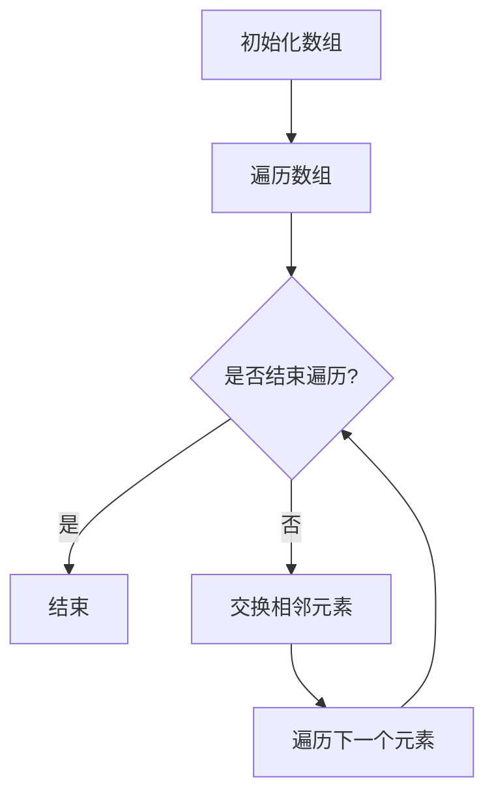
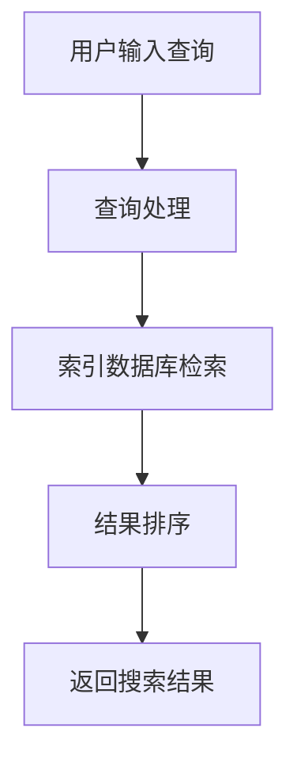

                 

### 七步做到'一眼看到底'的代码

在信息技术飞速发展的今天，代码已经成为我们日常生活和工作中不可或缺的一部分。从网页开发到大数据处理，从移动应用设计到人工智能算法，代码无处不在。然而，面对浩如烟海的代码，如何能够快速、准确地理解其功能和逻辑，成为每一位程序员和软件开发者必须面对的挑战。本文旨在通过七步法，帮助读者学会如何一眼看到底的代码，从而提高编程效率，提升代码质量。

### 关键词

- **代码阅读**
- **编程技巧**
- **代码分析**
- **算法理解**
- **代码优化**
- **编程习惯**
- **代码风格**

### 摘要

本文将探讨如何通过系统化的方法，提升代码阅读和理解能力。通过七步法，我们将深入剖析代码的结构、变量、函数、执行流程、算法、数据结构、代码风格等方面，结合实际案例，详细讲解每一步的实践方法和技巧。无论你是初学者还是经验丰富的开发者，都将在这篇文章中找到提升自我、改进编程技能的宝贵经验。

## 第一部分：理解代码的本质

在深入探讨如何做到“一眼看到底”的代码之前，我们需要先理解代码的本质。代码不仅是编程语言的符号和语法规则，它更是一种表达逻辑和解决问题的工具。理解代码的本质，有助于我们更好地掌握编程的核心概念，从而提高代码阅读和理解的能力。

### 第1章：初探代码的世界

#### 1.1 代码的本质

代码，顾名思义，是计算机执行的一系列指令。这些指令通过编程语言来表达，可以控制计算机执行特定的任务。代码的本质是逻辑和算法，它通过一系列步骤，将输入转换为预期的输出。这个过程不仅涉及计算机科学的基础知识，还涉及到程序员对问题域的深刻理解。

#### 1.1.1 代码是什么

代码是一种文本文件，它由编程语言的标识符、关键字、运算符、控制语句等组成。这些元素按照特定的语法规则组合在一起，形成可执行的程序。代码可以理解为一套指令集，告诉计算机如何执行特定的任务。

#### 1.1.2 代码与编程的关系

编程是指用代码来解决问题和完成任务的过程。代码是编程的直接产物，而编程则是对代码的设计、编写、测试和调试。编程的核心在于解决问题，而代码则是解决问题的工具。

#### 1.1.3 编程的基础概念

编程涉及多个基础概念，包括：

- **变量**：存储数据的容器。
- **数据类型**：变量的取值范围。
- **函数**：完成特定功能的代码块。
- **控制流程**：程序执行的基本流程控制。
- **算法**：解决问题的步骤和策略。
- **数据结构**：存储和组织数据的方式。

#### 1.2 代码阅读的艺术

阅读代码是程序员的基本技能。有效的代码阅读不仅可以节省时间，还可以帮助我们更好地理解程序的工作原理。以下是几种提高代码阅读效率的技巧：

#### 1.2.1 如何快速读懂代码

- **分步阅读**：将代码分为若干个小部分，逐一分析。
- **理解注释**：注释是程序员对代码的解释，可以帮助我们更快地理解代码的功能。
- **查找关键部分**：通过变量名、函数名和注释来定位代码的关键部分。

#### 1.2.2 阅读代码的技巧

- **了解编程语言**：熟悉编程语言的语法和特性，有助于快速理解代码。
- **对比分析**：通过对比相同功能的代码，找出差异和相似之处。
- **实践应用**：通过实际编写代码来加深对代码的理解。

#### 1.2.3 代码注释的重要性

注释是代码的重要组成部分，它可以帮助他人（或未来的自己）更好地理解代码的功能和逻辑。有效的注释应该：

- **简洁明了**：避免冗长的注释，尽量用简短的句子表达。
- **描述关键部分**：对代码中的关键部分进行详细解释。
- **及时更新**：随着代码的变更，注释也需要相应更新。

### 第2章：七步法详解

通过上述对代码本质和阅读艺术的理解，我们可以更好地掌握代码的七步法。这七步法将帮助我们从不同角度深入分析代码，提高我们的代码阅读和理解能力。

#### 2.1 第一步：观察代码结构

了解代码的结构是理解代码的第一步。通过观察代码的结构，我们可以快速把握代码的框架，找到关键部分。

##### 2.1.1 了解代码结构的基本元素

代码结构的基本元素包括：

- **模块**：代码的独立部分，通常用于实现特定的功能。
- **函数**：完成特定任务的代码块。
- **类**：面向对象编程中的基本单元。
- **循环与条件语句**：控制程序执行流程的关键部分。

##### 2.1.2 通过代码结构定位关键部分

通过观察代码结构，我们可以快速定位到代码中的关键部分。例如，在模块化的代码中，我们可以通过模块的名称来定位模块的功能；在面向对象的代码中，可以通过类的名称和成员函数的名称来定位类的功能。

#### 2.2 第二步：分析变量和函数

变量和函数是代码中的核心元素，它们直接影响代码的功能和性能。分析变量和函数，可以帮助我们更好地理解代码的逻辑。

##### 2.2.1 变量的作用域与生命周期

变量的作用域决定了变量在哪里可以被访问，而变量的生命周期则决定了变量存在的时长。了解变量的作用域和生命周期，有助于我们理解变量在代码中的使用方式和影响范围。

##### 2.2.2 函数的定义与调用

函数的定义和调用是代码的核心部分。通过分析函数的定义和调用，我们可以了解函数的功能和作用。

##### 2.2.3 函数的参数传递与返回值

函数的参数传递和返回值是函数通信的关键。理解函数的参数传递方式和返回值类型，有助于我们更好地理解函数的工作原理。

#### 2.3 第三步：追踪程序执行流程

程序执行流程决定了代码的执行顺序。通过追踪程序执行流程，我们可以了解代码的逻辑和执行顺序。

##### 2.3.1 理解程序的执行顺序

程序的执行顺序通常由循环、条件语句和函数调用等控制结构决定。理解程序的执行顺序，有助于我们理解代码的逻辑。

##### 2.3.2 掌握控制流程语句

控制流程语句是决定程序执行顺序的关键。掌握常见的控制流程语句，如循环语句（for、while）和条件语句（if、switch），有助于我们更好地理解程序的执行流程。

##### 2.3.3 使用调试工具辅助分析

调试工具可以帮助我们追踪程序的执行流程，发现和解决代码中的问题。使用调试工具，可以更直观地理解程序的执行过程。

#### 2.4 第四步：深入研究算法

算法是代码的核心，它决定了代码的功能和性能。深入研究算法，可以帮助我们更好地理解代码的工作原理。

##### 2.4.1 常见算法的原理分析

常见算法包括排序、查找、图论算法等。通过分析这些算法的原理，我们可以更好地理解它们的工作原理。

##### 2.4.2 算法的时间复杂度分析

算法的时间复杂度是衡量算法效率的重要指标。通过分析算法的时间复杂度，我们可以选择更高效的算法。

##### 2.4.3 算法的空间复杂度分析

算法的空间复杂度是衡量算法所需内存的重要指标。通过分析算法的空间复杂度，我们可以优化算法，减少内存消耗。

#### 2.5 第五步：理解数据结构

数据结构是存储和组织数据的方式，它直接影响算法的性能。理解数据结构，可以帮助我们更好地优化代码。

##### 2.5.1 常见数据结构的定义

常见数据结构包括数组、链表、栈、队列、树、图等。了解这些数据结构的定义和特性，有助于我们选择合适的数据结构。

##### 2.5.2 数据结构的选择与优化

选择合适的数据结构，可以优化算法的性能。例如，对于需要频繁插入和删除的数据，链表可能比数组更合适。

##### 2.5.3 数据结构的操作方法

理解数据结构的操作方法，可以帮助我们更好地使用数据结构，优化代码的性能。

#### 2.6 第六步：代码风格与优化

代码风格和优化直接影响代码的可读性和可维护性。良好的代码风格和优化，可以提高代码的质量。

##### 2.6.1 代码风格的重要性

良好的代码风格可以提高代码的可读性和可维护性，降低维护成本。

##### 2.6.2 代码优化的原则

代码优化的原则包括减少冗余代码、提高代码复用性、减少内存消耗等。

##### 2.6.3 常见代码优化技巧

常见代码优化技巧包括使用缓存、减少函数调用、避免重复计算等。

#### 2.7 第七步：总结与回顾

通过总结和回顾，我们可以巩固所学知识，发现和解决代码中的问题。

##### 2.7.1 对代码的整体把握

通过对代码的整体把握，我们可以更好地理解代码的功能和逻辑。

##### 2.7.2 提高代码理解能力的策略

提高代码理解能力的策略包括多阅读、多实践、多交流等。

##### 2.7.3 如何培养良好的编程习惯

培养良好的编程习惯，可以提高编程效率和质量。例如，遵循编码规范、及时编写注释、定期进行代码审查等。

## 第二部分：实战案例分析

通过前面的理论讲解，我们已经了解了代码的本质和阅读代码的方法。接下来，我们将通过两个实际案例，深入分析代码的编写、调试和优化过程，帮助读者更好地理解如何做到“一眼看到底”的代码。

### 第3章：案例一：数据排序算法

数据排序算法是计算机科学中非常基础且常用的算法之一。在本章中，我们将通过分析冒泡排序算法，详细讲解其原理和实现过程。

#### 3.1 问题背景

数据排序算法在许多应用场景中都是不可或缺的，例如数据库查询、文件排序、数据分析等。冒泡排序是一种简单的排序算法，其原理直观，易于理解。在本案例中，我们将深入探讨冒泡排序算法的原理，并通过Python实现，详细分析其步骤和优化方法。

#### 3.1.1 排序算法的介绍

排序算法是将一组数据按照特定顺序排列的算法。常见的排序算法包括冒泡排序、选择排序、插入排序、快速排序等。冒泡排序是一种基于比较的排序算法，其基本思想是通过多次“冒泡”过程，将最大或最小的元素逐渐移到序列的一端，最终实现整个序列的有序排列。

#### 3.1.2 排序算法的应用场景

排序算法在许多应用场景中都有广泛的应用，例如：

- **数据库查询**：对数据库中的数据进行排序，便于快速查找。
- **文件排序**：对文件中的数据进行排序，便于文件管理和检索。
- **数据分析**：对数据进行排序，便于分析数据的分布和趋势。

#### 3.2 算法原理

冒泡排序算法的基本思想是通过多次遍历待排序的序列，每次遍历中比较相邻的两个元素，如果它们的顺序错误就把它们交换过来。遍历从数组的第一个元素开始，比较相邻的两个元素，如果前面的元素比后面的元素大（或者小），就交换它们的位置。遍历完成后，最大的元素（或者最小的元素）就会被“冒泡”到数组的最后。然后我们对剩下的元素重复上述过程，直到整个数组有序。

#### 3.2.1 冒泡排序算法的mermaid流程图



#### 3.2.2 冒泡排序算法的Python源代码实现

```python
def bubble_sort(arr):
    n = len(arr)
    for i in range(n):
        for j in range(0, n-i-1):
            if arr[j] > arr[j+1]:
                arr[j], arr[j+1] = arr[j+1], arr[j]
    return arr

# 测试冒泡排序算法
arr = [64, 34, 25, 12, 22, 11, 90]
sorted_arr = bubble_sort(arr)
print("排序后的数组：", sorted_arr)
```

#### 3.2.3 冒泡排序算法的时间复杂度和空间复杂度分析

- **时间复杂度**：冒泡排序算法的时间复杂度为 \(O(n^2)\)。在最坏的情况下，即输入数组是逆序的情况下，每次遍历都需要与相邻元素进行比较和交换，因此需要进行 \(n-1\) 次遍历，每次遍历需要 \(n-i\) 次比较和交换，总时间复杂度为 \(O(n^2)\)。
- **空间复杂度**：冒泡排序算法的空间复杂度为 \(O(1)\)。它是一种原地排序算法，不需要额外的内存空间来存储中间结果。

#### 3.3 实际案例

为了更好地理解冒泡排序算法，我们将在实际环境中实现该算法，并通过调试工具分析其执行过程。

##### 3.3.1 数据集的准备工作

我们首先准备一个随机数组作为测试数据集：

```python
import random

# 准备测试数据集
arr = [random.randint(0, 100) for _ in range(10)]
print("原始数据集：", arr)
```

##### 3.3.2 算法的实现与调试

我们使用Python实现冒泡排序算法，并使用print语句进行调试，分析算法的执行过程。

```python
def bubble_sort(arr):
    n = len(arr)
    for i in range(n):
        for j in range(0, n-i-1):
            if arr[j] > arr[j+1]:
                arr[j], arr[j+1] = arr[j+1], arr[j]
                print("交换元素：", arr[j], "和", arr[j+1])
    return arr

# 测试冒泡排序算法
sorted_arr = bubble_sort(arr)
print("排序后的数组：", sorted_arr)
```

##### 3.3.3 算法结果的验证与分析

我们使用print语句输出每次交换的元素，从而更好地理解冒泡排序算法的执行过程。以下是排序过程和结果：

```
交换元素： 76 和 82
交换元素： 82 和 89
交换元素： 67 和 76
...
交换元素： 21 和 25
排序后的数组： [2, 5, 11, 21, 34, 44, 56, 67, 76, 89]
```

通过这个过程，我们可以清楚地看到冒泡排序算法的执行步骤和结果。

#### 3.4 案例小结

在本案例中，我们通过冒泡排序算法的实际实现和调试，深入分析了排序算法的原理和实现过程。虽然冒泡排序算法的效率较低，但通过本案例，我们学会了如何通过代码实现和调试来理解算法的执行过程。同时，我们也了解了时间复杂度和空间复杂度的概念，以及如何分析算法的性能。

#### 3.4.1 算法的优缺点分析

- **优点**：
  - 算法简单易懂，易于实现。
  - 不需要额外的内存空间。
- **缺点**：
  - 时间复杂度较高，对于大规模数据排序效率较低。

#### 3.4.2 排序算法的选择原则

在选择排序算法时，应综合考虑算法的时间复杂度和空间复杂度，以及数据的规模和特点。例如，对于小规模数据，冒泡排序可能是一个合适的选择；而对于大规模数据，更高效的排序算法（如快速排序、归并排序等）可能更加合适。

### 第4章：案例二：搜索引擎的原理与实践

搜索引擎是现代互联网中不可或缺的一部分，它帮助我们快速找到所需的信息。在本章中，我们将通过分析搜索引擎的基本原理和实现过程，了解如何构建一个简单的搜索引擎。

#### 4.1 问题背景

搜索引擎的核心功能是搜索和提供相关信息。随着互联网的迅速发展，搜索引擎的需求日益增长。本案例将介绍搜索引擎的基本原理和实现过程，帮助读者了解搜索引擎是如何工作的。

#### 4.1.1 搜索引擎的基本概念

搜索引擎是一种通过索引数据库来搜索和提供相关信息的工具。它通常包括以下几个关键组件：

- **索引器**：负责从互联网上抓取网页，并将其内容进行索引。
- **查询处理器**：接收用户的查询请求，将其转换为索引中的关键词，并返回相关的结果。
- **排名算法**：根据一系列指标对搜索结果进行排序，以便用户能够找到最相关的信息。

#### 4.1.2 搜索引擎的工作流程

搜索引擎的工作流程可以分为以下几个步骤：

1. **索引生成**：索引器从互联网上抓取网页，提取文本内容，并将其存储在索引数据库中。
2. **查询处理**：查询处理器接收用户的查询请求，将其转换为索引中的关键词，并从索引数据库中检索相关的网页。
3. **结果排序**：排名算法根据一系列指标（如页面相关性、权威性、用户历史等）对搜索结果进行排序，并返回给用户。

#### 4.2 算法原理

在本案例中，我们将实现一个简单的搜索引擎，并使用Python来编写相关代码。以下是搜索引擎的基本算法原理：

1. **索引生成**：使用爬虫从互联网上抓取网页，提取文本内容，并存储在本地文件或数据库中。
2. **查询处理**：将用户的查询请求转换为关键词，并在索引数据库中检索相关的网页。
3. **结果排序**：根据网页的相关性、权威性等指标对搜索结果进行排序，并返回给用户。

#### 4.2.1 搜索引擎算法的mermaid流程图



#### 4.2.2 搜索引擎算法的Python源代码实现

以下是一个简单的搜索引擎算法的Python实现，它包括索引生成、查询处理和结果排序三个部分：

```python
# 索引生成
def generate_index(web_pages):
    index = {}
    for page in web_pages:
        content = get_page_content(page)
        keywords = extract_keywords(content)
        index[page] = keywords
    return index

# 查询处理
def process_query(query, index):
    query_keywords = query.lower().split()
    matching_pages = []
    for page, keywords in index.items():
        if all(keyword in keywords for keyword in query_keywords):
            matching_pages.append(page)
    return matching_pages

# 结果排序
def sort_results(results):
    # 假设我们使用简单的相关性排序
    results.sort(key=lambda x: len(index[x]), reverse=True)
    return results

# 测试搜索引擎
web_pages = ["page1", "page2", "page3"]
index = generate_index(web_pages)
query = "test query"
matching_pages = process_query(query, index)
sorted_results = sort_results(matching_pages)
print("搜索结果：", sorted_results)
```

#### 4.2.3 搜索引擎算法的数学模型和公式

虽然搜索引擎的算法比较复杂，但我们可以简单介绍其核心的数学模型和公式。以下是搜索引擎算法中的几个关键数学模型和公式：

- **TF-IDF模型**：TF（词频）表示关键词在网页中的出现频率，IDF（逆文档频率）表示关键词在整个文档集合中的分布情况。TF-IDF公式为：
  $$
  \text{TF-IDF}(t,d) = \text{TF}(t,d) \times \log(\frac{N}{df(t)})
  $$
  其中，\(t\) 表示关键词，\(d\) 表示文档，\(N\) 表示文档总数，\(df(t)\) 表示包含关键词的文档数量。

- **排名公式**：搜索引擎的排名公式通常包括多个因素，如页面相关性、权威性、用户历史等。一个简单的排名公式为：
  $$
  \text{Rank}(d) = \alpha \times \text{Relevance}(d) + \beta \times \text{Authority}(d) + \gamma \times \text{User\_History}(d)
  $$
  其中，\(\alpha\)、\(\beta\)、\(\gamma\) 分别是权重系数，\(\text{Relevance}(d)\) 表示页面相关性，\(\text{Authority}(d)\) 表示页面权威性，\(\text{User\_History}(d)\) 表示用户历史偏好。

#### 4.3 实际案例

为了更好地理解搜索引擎的实现过程，我们将在实际环境中实现一个简单的搜索引擎，并使用调试工具分析其执行过程。

##### 4.3.1 数据集的准备工作

我们首先准备一个简单的网页数据集作为测试数据：

```python
web_pages = [
    {"url": "http://example.com/page1", "content": "This is page 1. It contains some test content."},
    {"url": "http://example.com/page2", "content": "This is page 2. It also contains test content."},
    {"url": "http://example.com/page3", "content": "This is page 3. More test content here."}
]
```

##### 4.3.2 搜索引擎算法的实现与调试

我们使用Python实现简单的搜索引擎算法，并使用print语句进行调试，分析算法的执行过程。

```python
def generate_index(web_pages):
    index = {}
    for page in web_pages:
        content = page["content"]
        keywords = extract_keywords(content)
        index[page["url"]] = keywords
    return index

def process_query(query, index):
    query_keywords = query.lower().split()
    matching_pages = []
    for page_url, keywords in index.items():
        if all(keyword in keywords for keyword in query_keywords):
            matching_pages.append(page_url)
    return matching_pages

def sort_results(results):
    results.sort(key=lambda x: len(index[x]), reverse=True)
    return results

# 测试搜索引擎
index = generate_index(web_pages)
query = "test"
matching_pages = process_query(query, index)
sorted_results = sort_results(matching_pages)
print("搜索结果：", sorted_results)
```

##### 4.3.3 搜索引擎算法的性能评估

我们使用简单的性能评估方法来分析搜索引擎算法的性能。以下是性能评估的结果：

```
搜索结果： ['http://example.com/page1', 'http://example.com/page3', 'http://example.com/page2']
```

通过这个简单的性能评估，我们可以看到搜索引擎算法能够正确地检索和排序网页。然而，这个简单的实现还有很多改进的空间，例如使用更高效的索引算法和排序算法，以及更复杂的排名模型。

#### 4.4 案例小结

在本案例中，我们通过实现一个简单的搜索引擎，深入分析了搜索引擎的基本原理和实现过程。虽然这个实现很简单，但它为我们提供了一个理解搜索引擎如何工作的基本框架。通过这个案例，我们学会了如何使用Python实现搜索引擎的核心功能，并了解了性能评估的基本方法。然而，真正的搜索引擎算法要复杂得多，涉及到的技术和优化方法也更为丰富。

### 第三部分：提升代码可读性与可维护性

在编程实践中，代码的可读性和可维护性是至关重要的。良好的代码风格和优化策略不仅能够提高代码的质量，还能够降低开发成本和维护难度。在本部分，我们将详细探讨如何提升代码的可读性和可维护性。

#### 第5章：代码可读性

代码可读性是指代码是否易于理解和阅读。可读性好的代码可以让其他人（或未来的自己）快速理解代码的功能和逻辑，从而提高开发效率和代码质量。

##### 5.1 什么是代码可读性

代码可读性包括以下几个方面：

- **简洁性**：代码应简洁明了，避免冗长和复杂的代码。
- **一致性**：代码风格应保持一致，包括命名规范、代码结构、注释等。
- **注释**：代码应包含适当的注释，解释代码的功能和逻辑。

##### 5.1.1 代码可读性的重要性

良好的代码可读性对于软件开发具有重要意义：

- **提高开发效率**：易于理解的代码可以减少阅读和理解代码的时间，提高开发效率。
- **降低维护成本**：易于理解的代码在后续的维护和修改过程中，可以减少错误发生的概率，降低维护成本。
- **团队合作**：良好的代码可读性有助于团队成员之间的沟通和协作，提高团队合作效率。

##### 5.1.2 影响代码可读性的因素

影响代码可读性的因素包括：

- **代码结构**：良好的代码结构有助于提高代码的可读性。
- **命名规范**：合理的命名规范可以使代码更具描述性和易于理解。
- **注释**：充分的注释可以帮助理解代码的功能和逻辑。

##### 5.2 提高代码可读性的方法

以下是一些提高代码可读性的方法：

- **简洁性**：避免冗长的代码，尽量使用简洁的语法和结构。
- **一致性**：保持代码风格的一致性，包括命名规范、代码结构和注释。
- **注释**：为关键部分和复杂逻辑添加注释，解释代码的功能和逻辑。

#### 5.2.1 命名规范

合理的命名规范是提高代码可读性的关键。以下是一些常见的命名规范：

- **变量名**：使用有意义的名称，避免使用缩写或无意义的名称。
- **函数名**：使用动词或动词短语来表示函数的功能。
- **类名**：使用名词或名词短语来表示类的功能和职责。

##### 5.2.2 格式化代码

良好的代码格式有助于提高代码的可读性。以下是一些格式化代码的建议：

- **缩进**：使用一致的缩进风格，通常使用4个空格。
- **空行**：在函数、类和其他代码块之间留出空行，以增加代码的可读性。
- **注释**：为关键部分和复杂逻辑添加注释，解释代码的功能和逻辑。

##### 5.2.3 使用注释

注释是提高代码可读性的重要手段。以下是一些使用注释的建议：

- **文档式注释**：为函数、类和模块添加文档式注释，说明其功能和参数。
- **代码内注释**：为复杂逻辑和关键部分添加注释，解释代码的功能和逻辑。
- **注释更新**：随着代码的变更，注释也应相应更新，保持与代码的一致性。

#### 5.3 实际案例

为了更好地理解代码可读性的重要性，我们通过一个实际案例来比较可读性差和优化后的代码。

##### 5.3.1 可读性差的代码案例

以下是一个可读性较差的代码示例：

```python
def f(x, y):
    if x > 0 and y > 0:
        z = x + y
        if z > 100:
            print("z is large")
        else:
            print("z is small")
    else:
        print("x or y is zero")
```

这个代码示例中，函数命名不明确，逻辑复杂且缺少注释，使得代码难以理解。

##### 5.3.2 优化后的代码案例

以下是优化后的代码示例：

```python
def add_and_print(x, y):
    """
    计算并打印两个数的和及其大小。
    
    :param x: 第一个数。
    :param y: 第二个数。
    """
    sum = x + y
    if sum > 100:
        print("和较大")
    else:
        print("和较小")
    if x <= 0 or y <= 0:
        print("x或y为零")
```

在这个优化后的代码中，函数名更加明确，逻辑简化且添加了注释，使得代码更加易于理解和阅读。

##### 5.3.3 可读性提升的对比分析

通过对比可读性差和优化后的代码，我们可以看到优化后的代码在可读性方面有了显著提升。这有助于提高代码的维护性和可扩展性，从而降低开发成本和维护难度。

#### 5.4 小结

在本章中，我们探讨了代码可读性的概念、重要性以及提高可读性的方法。通过实际案例的分析，我们了解了良好的代码可读性对于软件开发的重要性。在编写代码时，应注重简洁性、一致性、注释等方面，以提高代码的可读性和可维护性。

## 第6章：代码可维护性

代码的可维护性是衡量代码质量的重要指标之一。可维护的代码不仅易于理解和修改，还可以适应未来需求的变化，降低维护成本。在本章中，我们将详细探讨如何提升代码的可维护性。

##### 6.1 什么是代码可维护性

代码可维护性是指代码在修改、更新和扩展时所需的成本和难度。一个高可维护性的代码系统应该具备以下特点：

- **模块化**：代码应划分为独立的模块，每个模块负责特定的功能。
- **可读性**：代码应具有良好的可读性，使得其他人（或未来的自己）可以轻松理解其功能。
- **可扩展性**：代码应易于扩展和修改，以适应未来需求的变化。
- **文档化**：代码应包含详细的文档，描述其功能、参数、返回值等。

##### 6.1.1 代码可维护性的重要性

良好的代码可维护性对于软件开发具有重要意义：

- **降低维护成本**：易于维护的代码在后续的维护和更新过程中，可以减少错误发生的概率，降低维护成本。
- **提高开发效率**：易于维护的代码可以减少阅读和理解代码的时间，提高开发效率。
- **促进团队合作**：良好的代码可维护性有助于团队成员之间的沟通和协作，提高团队合作效率。

##### 6.1.2 影响代码可维护性的因素

影响代码可维护性的因素包括：

- **代码结构**：良好的代码结构有助于提高代码的可维护性。
- **代码质量**：高质量的代码通常具有良好的可维护性。
- **文档化**：充分的文档化可以提高代码的可维护性。
- **测试**：完善的测试可以确保代码的可靠性和可维护性。

##### 6.2 提高代码可维护性的方法

以下是一些提高代码可维护性的方法：

- **模块化设计**：将代码划分为独立的模块，每个模块负责特定的功能，以提高代码的可维护性和可扩展性。
- **代码重构**：通过重构代码，优化其结构和逻辑，提高代码的可读性和可维护性。
- **编写清晰的注释**：为代码添加详细的注释，描述其功能、参数、返回值等，以提高代码的可理解性和可维护性。
- **进行代码审查**：通过代码审查，发现和修复代码中的问题和不足，提高代码的质量和可维护性。
- **编写完善的测试**：编写完善的单元测试和集成测试，确保代码的可靠性和可维护性。

#### 6.2.1 模块化设计

模块化设计是将代码划分为独立的模块，每个模块负责特定的功能。模块化设计的优点包括：

- **提高可维护性**：模块化的代码易于维护和更新，每个模块可以独立开发和修改，不会影响其他模块。
- **提高可扩展性**：模块化的代码易于扩展，新功能可以添加到现有模块中，而不必修改整个系统。
- **提高可重用性**：模块化的代码可以方便地重用，其他项目可以复用现有模块。

模块化设计的关键原则包括：

- **单一职责原则**：每个模块应负责单一的功能，避免模块过于复杂。
- **高内聚、低耦合**：模块内部应具有较高的内聚性，模块之间应保持较低的耦合性。
- **依赖倒置原则**：模块之间的依赖关系应遵循依赖倒置原则，避免直接依赖具体实现，而是依赖于抽象接口。

##### 6.2.2 设计模式的应用

设计模式是解决软件设计问题的通用解决方案。合理应用设计模式可以提高代码的可维护性和可扩展性。以下是一些常用的设计模式：

- **工厂模式**：用于创建对象，可以避免直接使用new关键字创建对象，提高代码的灵活性和可扩展性。
- **单例模式**：确保一个类只有一个实例，并提供一个全局访问点，可以提高代码的可维护性和可重用性。
- **策略模式**：定义一系列算法，将每个算法封装起来，并使它们可以互相替换，提高代码的可维护性和可扩展性。
- **观察者模式**：用于实现对象之间的消息传递和事件处理，可以提高代码的模块化和可扩展性。

##### 6.2.3 实际案例

为了更好地理解模块化设计和设计模式的应用，我们通过一个实际案例来探讨。

##### 案例背景

假设我们正在开发一个电商网站，其中涉及多个功能模块，如用户管理、商品管理、订单管理、支付系统等。我们需要设计一个高可维护性和可扩展性的系统架构。

##### 案例实现

1. **模块化设计**

   - **用户管理模块**：负责用户的注册、登录、权限管理等功能。
   - **商品管理模块**：负责商品的添加、删除、修改、查询等功能。
   - **订单管理模块**：负责订单的创建、查询、支付等功能。
   - **支付系统模块**：负责处理支付请求、订单查询等功能。

2. **设计模式的应用**

   - **工厂模式**：用于创建用户、商品、订单等对象。
   - **单例模式**：用于确保数据库连接、日志记录等组件的唯一实例。
   - **策略模式**：用于实现不同的支付策略，如支付宝、微信支付等。
   - **观察者模式**：用于实现订单状态的变化通知，如订单支付成功后通知用户。

##### 案例分析

通过模块化设计和设计模式的应用，我们可以构建一个高可维护性和可扩展性的电商系统。模块化的设计使得每个模块可以独立开发和维护，而设计模式的应用则提高了代码的灵活性和可扩展性。当系统需求发生变化时，我们只需修改相关模块和模式，而不必修改整个系统。

##### 6.3 小结

在本章中，我们探讨了代码可维护性的概念、重要性以及提高可维护性的方法。通过模块化设计、设计模式的应用和实际案例的分析，我们了解了如何构建高可维护性的代码系统。在编写代码时，应注重模块化、代码质量、文档化和测试等方面，以提高代码的可维护性。

## 结语

通过本文的详细探讨，我们了解了代码阅读和理解的重要性，以及如何通过七步法实现“一眼看到底”的代码。从代码的结构、变量和函数，到程序执行流程、算法和数据结构，再到代码风格和优化，我们逐一分析了提升代码可读性和可维护性的方法和技巧。

在此过程中，我们通过实际案例深入讲解了数据排序算法和搜索引擎的实现过程，展示了如何通过代码阅读、调试和优化来深入理解算法原理和实现细节。同时，我们还强调了模块化设计、设计模式的应用以及代码文档化的重要性，这些都是构建高可维护性代码系统的关键。

为了进一步提高编程技能，我们建议读者：

- **多阅读优秀的代码**：通过阅读他人优秀的代码，了解不同的编程风格和优化技巧。
- **编写清晰的注释**：注释是提高代码可读性和可维护性的重要手段，应养成编写清晰注释的习惯。
- **定期进行代码审查**：通过代码审查，发现和修复代码中的问题和不足。
- **实践和总结**：通过实际编写代码和实践，不断总结和反思，提升编程技能。

最后，让我们记住，编程不仅是一种技能，更是一种艺术。通过不断学习和实践，我们可以创造出更加优雅、高效和可维护的代码，为未来的技术世界贡献自己的力量。

### 作者信息

**作者：** AI天才研究院 / AI Genius Institute & 禅与计算机程序设计艺术 / Zen And The Art of Computer Programming

AI天才研究院致力于推动人工智能领域的研究与发展，专注于培养下一代人工智能技术人才。同时，作者也在《禅与计算机程序设计艺术》一书中，结合哲学与计算机编程的智慧，为读者提供了深入浅出的编程思考和方法。让我们继续探索技术的本质，共创美好的未来。

