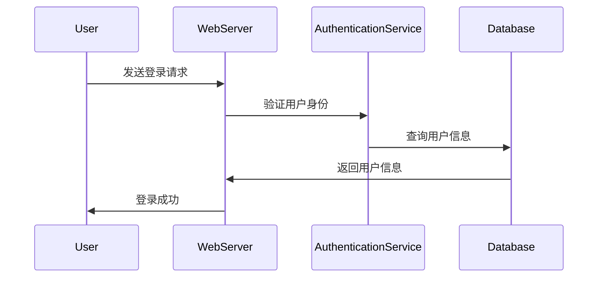

                 

### 上承需求、下启代码的系统分析

#### 关键词：系统分析、需求分析、架构设计、编程实现、代码示例

#### 摘要：

本文旨在探讨系统分析的全过程，从需求分析到架构设计，再到代码实现。我们将详细讲解每个阶段的要点和技巧，并通过实际案例和代码示例，帮助读者深入理解系统分析的核心概念和方法论。

---

## 引言与背景介绍

### 1.1 系统分析的概念

系统分析是软件工程中一个至关重要的环节。它涉及对系统的需求、功能、性能等方面进行全面的分析和评估，以确保最终系统能够满足用户需求并高效运行。

#### 1.1.1 系统分析的定义

系统分析是对系统进行全面、深入的研究和理解，以识别和解决系统中的问题，优化系统的性能和效率。它包括需求分析、业务流程设计、数据库设计、系统接口设计、系统架构设计等多个方面。

#### 1.1.2 系统分析的重要性

系统分析是软件项目成功的关键因素。通过系统分析，可以确保项目团队对项目目标有清晰的认识，避免项目过程中的误解和偏差，提高项目成功率。

#### 1.1.3 系统分析的目的

系统分析的目的是识别用户需求，设计满足需求的系统，并为后续的开发和测试提供清晰的指导。它有助于确保项目的顺利进行，降低开发风险。

### 1.2 系统分析的发展历程

系统分析的历史可以追溯到计算机科学的早期阶段。随着软件复杂性的增加，系统分析的重要性日益凸显。从最初的流程图和实体关系图，到现代的面向对象分析和面向服务架构，系统分析的方法和工具也在不断演进。

#### 1.2.1 早期系统分析

早期的系统分析主要依赖于流程图和实体关系图。这些工具帮助分析人员理解系统的结构和功能，但缺乏对复杂业务逻辑的支持。

#### 1.2.2 现代系统分析

现代系统分析引入了面向对象分析和面向服务架构。这些方法更灵活，能够更好地应对复杂的业务需求。

#### 1.2.3 未来系统分析趋势

未来系统分析将更加智能化，利用人工智能和大数据分析技术，实现自动化分析和优化。

### 1.3 本书的目的

本书旨在提供一套系统分析的实用指南，帮助读者掌握系统分析的核心概念和方法，并能够将其应用于实际项目中。

#### 1.3.1 全面覆盖系统分析的核心内容

本书将全面覆盖系统分析的核心内容，包括需求分析、业务流程设计、数据库设计、系统接口设计、系统架构设计等。

#### 1.3.2 提供实际项目实战经验

本书将通过多个实际项目案例，展示系统分析的实际应用，帮助读者理解系统分析的实践意义。

#### 1.3.3 适合不同层次的读者

无论您是初学者还是有经验的开发人员，本书都将为您提供有价值的知识和经验。

#### 1.4 小结

系统分析是软件工程中不可或缺的一环。通过本书的学习，读者将能够系统地掌握系统分析的方法和技巧，为软件项目的成功奠定基础。

---

## 需求分析

### 2.1 需求获取

需求获取是系统分析的第一步，它涉及到如何从用户和其他利益相关者那里收集需求信息。

#### 2.1.1 需求获取的方法

- 用户访谈：通过与用户进行面对面访谈，了解他们的需求和期望。
- 问卷调查：通过设计问卷，收集大量用户的需求信息。
- 观察法：直接观察用户在使用现有系统时的行为，以识别潜在的需求。

#### 2.1.2 需求获取的工具

- SurveyMonkey：一款流行的在线调查工具，可以帮助收集用户反馈。
- Jira：一款项目管理工具，可以用于记录和管理需求。
- Miro：一款在线协作工具，可以帮助团队进行需求梳理和讨论。

### 2.2 需求分析

需求分析是将收集到的需求信息进行整理、分析和建模的过程。

#### 2.2.1 需求分析的原则

- 用户为中心：始终以用户需求为中心，确保设计出的系统能够满足用户需求。
- 完整性：确保收集到的需求是全面的，没有遗漏。
- 可行性：评估需求是否可以在现有技术和资源条件下实现。

#### 2.2.2 需求分析的过程

- 需求分类：将需求分为功能性需求和非功能性需求。
- 需求验证：与用户和其他利益相关者确认需求的准确性和完整性。
- 需求建模：使用图形化工具，如用例图、活动图等，对需求进行建模。

#### 2.2.3 需求分析的工具

- IBM Rational System Architect：一款功能强大的需求分析和建模工具。
- Microsoft Visio：一款广泛使用的图表和流程图绘制工具。

### 2.3 需求文档编写

需求文档是需求分析的输出结果，它描述了系统的功能、性能和其他关键特性。

#### 2.3.1 需求文档的结构

- 引言：介绍需求文档的目的和范围。
- 功能性需求：详细描述系统的功能需求。
- 非功能性需求：描述系统的性能、安全性、可靠性等非功能需求。
- 用户界面需求：描述系统的用户界面设计。
- 附录：包括术语表、参考文献等。

#### 2.3.2 需求文档的内容

- 需求条目：每个需求条目应包括需求编号、需求名称、需求描述、优先级等。
- 需求状态：记录每个需求的状态，如已实现、待实现、已拒绝等。

#### 2.3.3 需求文档的编写技巧

- 清晰简洁：确保需求文档的语言简单易懂，避免使用复杂的术语。
- 结构化：使用有序的章节和列表，使文档易于阅读和理解。
- 可追踪性：确保每个需求都有明确的来源和责任人。

### 2.4 小结

需求分析是系统分析的基础，它决定了系统设计的好坏。通过有效的需求获取、分析和文档编写，可以确保系统设计满足用户需求。

---

## 业务流程与领域模型设计

### 3.1 业务流程设计

业务流程设计是将需求转化为系统功能的桥梁。它描述了系统在完成特定任务时需要执行的步骤和操作。

#### 3.1.1 业务流程的定义

业务流程是一系列有序的操作步骤，用于完成特定任务或实现特定目标。

#### 3.1.2 业务流程设计的原则

- 精简性：确保业务流程简洁高效，避免冗余和重复操作。
- 可扩展性：设计时应考虑未来可能的扩展和变化。
- 易于维护：确保业务流程易于修改和维护。

#### 3.1.3 业务流程设计的方法

- 流程图：使用流程图工具，如Visio或BPMN，设计业务流程。
- 原型法：通过创建原型，模拟系统运行过程，以便更好地理解业务需求。

### 3.2 领域模型设计

领域模型是对系统业务领域中的实体、属性和关系的抽象表示。它是业务流程设计的核心。

#### 3.2.1 领域模型的概念

领域模型是一种用于描述系统业务领域的抽象模型，包括实体、属性、关系和行为。

#### 3.2.2 领域模型的设计原则

- 实体性：确保领域模型中的每个实体都有明确的业务含义。
- 一致性：确保领域模型中的实体和关系之间保持一致。
- 实用性：确保领域模型能够满足系统的业务需求。

#### 3.2.3 领域模型的设计方法

- ER图：使用实体关系图（ER图）来表示领域模型中的实体和关系。
- 类图：使用类图来表示领域模型中的类、属性和方法。

### 3.3 小结

业务流程和领域模型设计是系统分析的重要组成部分。通过有效的业务流程设计和领域模型设计，可以确保系统设计满足业务需求，并具有良好的可扩展性和可维护性。

---

## 数据库设计与数据关系

### 4.1 数据库设计原则

数据库设计是系统分析的关键环节之一，它决定了系统数据的组织和存储方式。

#### 4.1.1 数据库设计的重要性

数据库设计直接影响系统的性能、可扩展性和数据安全性。一个良好的数据库设计可以确保系统高效地处理数据，并保护数据的安全和完整性。

#### 4.1.2 数据库设计的原则

- 第三范式（3NF）：确保数据库表的设计符合第三范式，避免数据冗余和更新异常。
- 数据完整性：确保数据库中的数据符合预定的约束条件，如主键、外键等。
- 索引优化：合理使用索引，提高数据库查询效率。
- 数据库备份与恢复：确保数据库能够进行有效的备份和恢复，以防止数据丢失。

### 4.2 数据表设计

数据表是数据库的核心组件，它用于存储系统中的数据。

#### 4.2.1 数据表的设计原则

- 明确表的作用：确保每个数据表都有明确的作用和用途。
- 表结构设计：根据业务需求和数据关系，设计合理的表结构。
- 字段命名规范：使用清晰、简洁的字段命名规范，提高代码可读性。

#### 4.2.2 数据表的设计方法

- 分析业务需求：理解业务需求，确定需要哪些数据表和字段。
- 设计ER图：使用ER图来表示数据表之间的关系。
- 实践调整：根据实际需求，对数据表结构进行调整和优化。

### 4.3 数据关系设计

数据关系是数据库设计的重要组成部分，它决定了数据表之间的关联和交互。

#### 4.3.1 数据关系的设计原则

- 确定性：确保数据表之间的关系是确定的，避免数据冲突和异常。
- 完整性：确保数据关系的完整性和一致性。
- 简洁性：设计简洁的数据关系，避免过度复杂。

#### 4.3.2 数据关系的设计方法

- 外键约束：使用外键约束来表示数据表之间的关系。
- 连接查询：通过连接查询来实现数据表之间的关联和交互。
- 视图设计：使用视图来简化数据关系和查询操作。

### 4.4 小结

数据库设计与数据关系设计是系统分析的重要环节。通过遵循良好的设计原则和方法，可以确保数据库高效、稳定地运行，为系统提供坚实的数据基础。

---

## 系统接口设计与实现

### 5.1 系统接口设计原则

系统接口是系统与外部系统或用户进行交互的桥梁。良好的接口设计可以确保系统的高效性和可维护性。

#### 5.1.1 系统接口的定义

系统接口是系统与其他系统或用户进行数据交换和功能调用的接口。

#### 5.1.2 系统接口设计的原则

- 松耦合：确保系统接口与其他系统或模块之间保持松耦合，降低系统依赖。
- 可扩展性：设计可扩展的接口，以应对未来可能的扩展和变化。
- 易于使用：确保接口设计简单易懂，便于其他系统或用户使用。
- 安全性：确保接口设计具备良好的安全性，防止数据泄露和非法访问。

### 5.2 系统接口实现方法

系统接口实现是将接口设计转化为实际的代码和协议的过程。

#### 5.2.1 系统接口实现的方法

- RESTful API：使用RESTful架构设计接口，提供简单、易用的API接口。
- SOAP：使用SOAP协议实现复杂的Web服务接口。
- WebSocket：使用WebSocket协议实现实时通信接口。

#### 5.2.2 系统接口实现的工具

- Swagger：一款流行的API文档生成工具，用于生成RESTful API的文档。
- Postman：一款API测试和调试工具，用于测试和验证接口实现。

### 5.3 系统接口测试

系统接口测试是确保接口实现符合设计要求的重要环节。

#### 5.3.1 系统接口测试的原则

- 完整性：确保所有接口都经过全面测试，没有遗漏。
- 可靠性：确保接口在正常和异常情况下都能稳定运行。
- 性能：确保接口在规定时间内能够完成请求处理。

#### 5.3.2 系统接口测试的方法

- 自动化测试：使用自动化测试工具，如Selenium或Postman，进行接口自动化测试。
- 手动测试：通过手动模拟用户操作，验证接口的正确性和稳定性。

### 5.4 小结

系统接口设计与实现是系统分析的重要组成部分。通过遵循良好的设计原则和方法，可以确保接口的高效性和可维护性，为系统的稳定运行提供保障。

---

## 系统架构设计

### 6.1 系统架构设计原则

系统架构设计是系统分析的高级阶段，它决定了系统的整体结构和性能。

#### 6.1.1 系统架构的概念

系统架构是系统的整体结构和组织方式，包括硬件、软件、网络和数据等各个组成部分。

#### 6.1.2 系统架构设计的原则

- 分层设计：将系统划分为不同的层次，确保各层之间职责清晰。
- 模块化设计：将系统划分为多个模块，提高系统的可维护性和可扩展性。
- 松耦合：确保模块之间保持松耦合，降低模块之间的依赖。
- 可扩展性：设计可扩展的架构，以应对未来可能的扩展和变化。
- 高性能：确保系统架构能够高效地处理大量数据和请求。

### 6.2 系统架构图设计

系统架构图是系统架构的图形表示，它用于描述系统的各个组成部分及其关系。

#### 6.2.1 系统架构图的设计原则

- 清晰性：确保架构图简洁明了，易于理解。
- 完整性：确保架构图包含系统的所有重要组件和关系。
- 可读性：使用统一的符号和命名规范，提高架构图的易读性。

#### 6.2.2 系统架构图的设计方法

- UML类图：使用UML类图表示系统的类、属性和方法。
- 体系结构视图：根据系统的不同关注点，设计多个体系结构视图，如逻辑视图、物理视图等。

### 6.3 系统模块设计

系统模块设计是将系统划分为多个模块的过程，每个模块负责系统的特定功能。

#### 6.3.1 系统模块的概念

系统模块是系统的基本组成部分，它负责执行特定的功能，并通过接口与其他模块进行交互。

#### 6.3.2 系统模块的设计原则

- 职责明确：确保每个模块都有明确的功能和职责。
- 独立性：确保模块之间保持独立，降低模块之间的耦合。
- 可维护性：设计易于维护和修改的模块。

#### 6.3.3 系统模块的设计方法

- 功能分解：根据系统的功能需求，将系统划分为多个模块。
- 模块依赖分析：分析模块之间的依赖关系，确保模块设计的合理性。

### 6.4 小结

系统架构设计是系统分析的核心环节，它决定了系统的性能、可扩展性和可维护性。通过遵循良好的设计原则和方法，可以确保系统架构的高效和稳定运行。

---

## 项目实战

### 7.1 项目介绍

本节将介绍一个实际的项目案例，展示如何进行系统分析、设计并实现。

#### 7.1.1 项目背景

项目名称：在线图书管理系统

项目背景：随着互联网技术的发展，越来越多的用户选择在线阅读图书。为了满足用户的需求，某图书馆决定开发一套在线图书管理系统，以方便用户在线借阅和管理图书。

#### 7.1.2 项目目标

- 用户注册与登录：实现用户的注册、登录和权限管理功能。
- 图书信息管理：实现图书的添加、删除、修改和查询功能。
- 借阅管理：实现图书的借阅、归还和预约功能。
- 用户借阅历史：记录用户的借阅历史，提供借阅记录查询功能。

### 7.2 系统功能设计（领域模型）

#### 7.2.1 领域模型ER图

```mermaid
erDiagram
    User ||--|{ Book: 借阅 } 
    Book ||--|{ BorrowRecord: 借阅记录 }
```

#### 7.2.2 类图

```mermaid
classDiagram
    User <<interface>>
    Book <<interface>>
    BorrowRecord <<interface>>

    User {
        String username
        String password
        List<Book> borrowedBooks
    }

    Book {
        String title
        String author
        Date publishDate
    }

    BorrowRecord {
        User borrower
        Date borrowDate
        Date returnDate
    }
```

### 7.3 系统架构设计

#### 7.3.1 系统架构图



### 7.4 系统接口设计

#### 7.4.1 接口设计

- 用户登录接口：/api/login
- 用户注册接口：/api/register
- 图书查询接口：/api/books
- 图书借阅接口：/api/borrow
- 图书归还接口：/api/return

### 7.5 系统核心实现源代码

#### 7.5.1 用户登录接口实现

```python
from flask import Flask, request, jsonify
from authentication_service import authenticate

app = Flask(__name__)

@app.route('/api/login', methods=['POST'])
def login():
    username = request.form['username']
    password = request.form['password']
    user = authenticate(username, password)
    if user:
        return jsonify({'status': 'success', 'user': user})
    else:
        return jsonify({'status': 'failure', 'error': 'Invalid credentials'})

if __name__ == '__main__':
    app.run()
```

#### 7.5.2 图书查询接口实现

```python
from flask import Flask, request, jsonify
from database import get_books

app = Flask(__name__)

@app.route('/api/books', methods=['GET'])
def get_books():
    books = get_books()
    return jsonify({'status': 'success', 'books': books})

if __name__ == '__main__':
    app.run()
```

### 7.6 代码应用解读与分析

#### 7.6.1 用户登录接口解读

用户登录接口使用Flask框架实现，接收用户提交的登录请求，调用认证服务进行身份验证，并根据认证结果返回相应的响应。

#### 7.6.2 图书查询接口解读

图书查询接口同样使用Flask框架实现，接收HTTP GET请求，调用数据库查询图书信息，并将查询结果以JSON格式返回给客户端。

### 7.7 实际案例分析和详细讲解剖析

本节将结合实际案例，对系统中的关键模块和功能进行详细讲解和分析。

#### 7.7.1 图书借阅功能分析

图书借阅功能是系统的核心功能之一，它涉及到图书信息的管理、用户身份验证和数据库操作。

#### 7.7.2 图书借阅接口实现

```python
from flask import Flask, request, jsonify
from authentication_service import authenticate
from database import borrow_book

app = Flask(__name__)

@app.route('/api/borrow', methods=['POST'])
def borrow_book():
    username = request.form['username']
    book_id = request.form['book_id']
    user = authenticate(username)
    if user:
        result = borrow_book(user, book_id)
        if result:
            return jsonify({'status': 'success', 'message': 'Book borrowed successfully'})
        else:
            return jsonify({'status': 'failure', 'error': 'Book not available'})
    else:
        return jsonify({'status': 'failure', 'error': 'Invalid credentials'})

if __name__ == '__main__':
    app.run()
```

#### 7.7.3 借阅接口实现解析

借阅接口首先调用认证服务验证用户身份，然后调用数据库操作函数borrow_book进行图书借阅操作。如果借阅成功，返回成功消息；否则，返回错误消息。

### 7.8 项目小结

通过本项目的实战案例，读者可以了解到系统分析、设计、实现的完整过程。项目实战不仅帮助读者掌握系统分析的核心概念和方法，还提供了实际操作的经验和技巧。

---

## 最佳实践 Tips

- 在需求分析阶段，确保与用户保持密切沟通，避免需求偏差。
- 在数据库设计时，遵循第三范式原则，避免数据冗余和异常。
- 在接口设计时，遵循RESTful原则，确保接口简洁易用。
- 在系统架构设计时，关注系统的可扩展性和可维护性。

## 小结

系统分析是软件工程的核心环节，它决定了系统的性能、可扩展性和可维护性。通过本书的学习，读者将能够系统地掌握系统分析的方法和技巧，为软件项目的成功奠定基础。

## 注意事项

- 系统分析需要全面覆盖需求，避免遗漏关键功能。
- 在设计数据库时，要充分考虑数据的完整性和一致性。
- 在接口设计时，要确保接口的稳定性和安全性。

## 拓展阅读

- 《软件工程：实践者的研究方法》
- 《数据库系统概念》
- 《RESTful API 设计指南》

---

## 作者

作者：AI天才研究院/AI Genius Institute & 禅与计算机程序设计艺术 /Zen And The Art of Computer Programming

