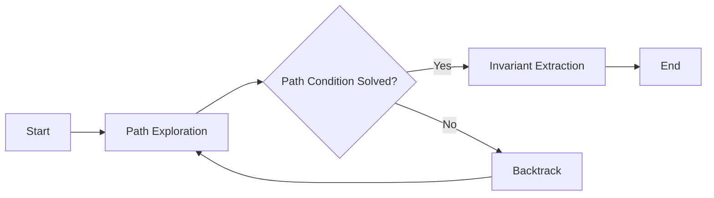
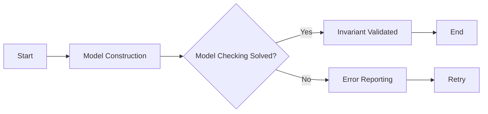
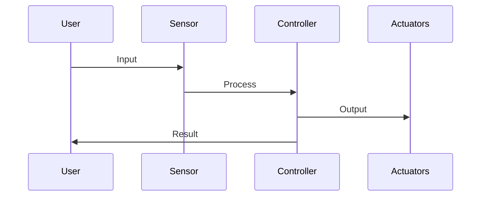
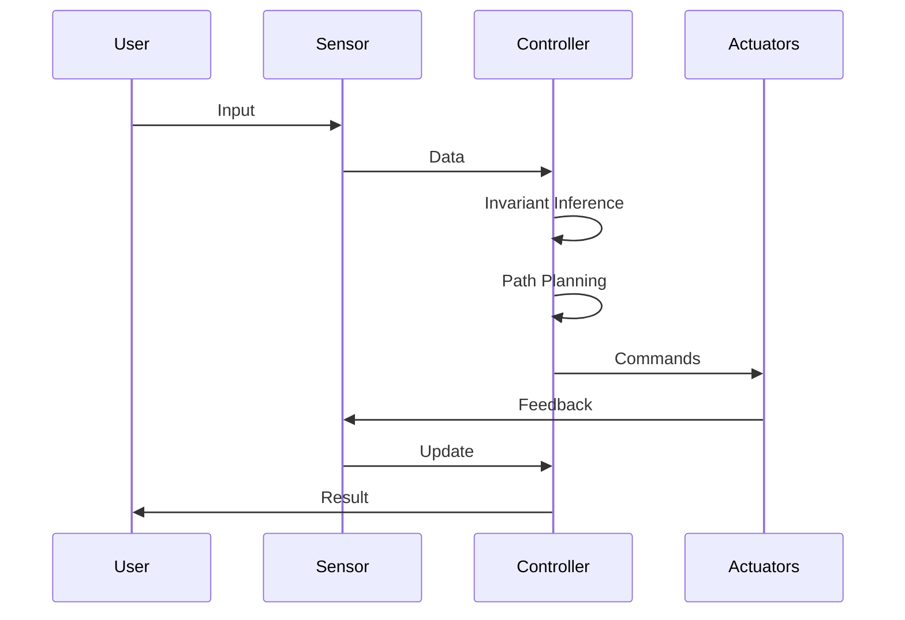

                 

# 不变量推断：自动化程序理解的方法

## 关键词

- 不变量推断
- 自动化程序理解
- 算法
- 应用场景
- 实践

## 摘要

本文将深入探讨不变量推断在自动化程序理解中的应用。我们将逐步分析不变量推断的基础概念、算法原理、实际编程应用，并通过项目实战和最佳实践来展示其在软件工程中的重要性。本文旨在为对程序理解和自动推理有兴趣的读者提供一个全面的技术指南，帮助他们理解和应用不变量推断技术。

## 第1章：引言

### 1.1 问题背景

在软件工程领域，程序理解是一个长期存在的问题。随着软件系统日益复杂，程序理解成为了提高软件开发效率和质量的关键环节。自动化程序理解技术旨在通过算法和工具来解析、分析和理解程序代码，从而实现代码的自动化生成、修复和优化。

不变量推断是一种自动化程序理解的重要方法。它通过识别程序中的不变量，即那些在程序运行过程中始终保持不变的条件或关系，来推断程序的行为和属性。不变量推断对于提高程序的可理解性、可靠性、可维护性具有重要意义。

### 1.2 问题描述

不变量推断的目标是自动识别程序中的不变量，并将其用于推断程序的行为。然而，不变量推断面临着以下几个挑战：

1. **识别难度**：不变量可能隐藏在复杂的程序结构中，难以直接识别。
2. **多样性**：不同程序中可能存在多种类型的不变量，需要区分和识别。
3. **上下文依赖**：不变量可能与程序中的其他部分存在依赖关系，需要综合考虑。

### 1.3 问题解决

为了解决不变量推断的难题，研究者们提出了一系列算法和技术。这些方法主要包括基于符号执行、抽象解释、模型检查等。通过这些算法，可以自动化地识别程序中的不变量，并验证其正确性。

### 1.4 边界与外延

不变量推断技术不仅适用于特定领域的程序，还具有一定的通用性。它可以应用于各种编程语言和系统，如操作系统、数据库管理系统、Web应用等。然而，不同领域的程序具有不同的特点，因此不变量推断技术在具体应用时需要考虑这些差异。

### 1.5 概念结构与核心要素组成

不变量推断技术主要由以下几个核心要素组成：

1. **核心概念**：包括不变量的定义、类型和属性。
2. **算法原理**：介绍不变量识别和验证的算法原理。
3. **实际编程应用**：展示不变量推断在软件工程中的具体应用。
4. **项目实战**：通过实际项目来展示不变量推断的应用效果。
5. **最佳实践与优化策略**：总结不变量推断的最佳实践和优化策略。

## 第2章：不变量推断基础

### 2.1 核心概念

不变量是一种在程序运行过程中始终保持不变的条件或关系。它可以是简单的数值关系，也可以是复杂的逻辑表达式。不变量的识别是进行不变量推断的第一步。

#### 2.1.1 不变量定义

不变量可以定义为程序中的一组属性，这些属性在程序的执行过程中始终为真。形式化地，不变量可以表示为：

$$
\phi = \{ \psi_1, \psi_2, ..., \psi_n \}
$$

其中，$\psi_i$ 是程序中的一个命题或条件。

#### 2.1.2 不变量类型

根据不变量的属性和作用，可以将不变量分为以下几种类型：

1. **局部不变量**：只影响程序中某一局部区域的不变量。
2. **全局不变量**：影响整个程序运行的不变量。
3. **条件不变量**：只有在特定条件下成立的不变量。
4. **时不变量**：在程序执行过程中始终保持不变的不变量。

### 2.2 概念属性特征对比表格

| 不变量类型 | 定义 | 特点 | 应用 |
| :--: | :--: | :--: | :--: |
| 局部不变量 | 只影响局部区域 | 简单、易于识别 | 提高局部代码可读性和维护性 |
| 全局不变量 | 影响整个程序 | 复杂、需要综合分析 | 提高程序的整体理解和可靠性 |
| 条件不变量 | 只有在特定条件下成立 | 条件复杂 | 用于特定场景的代码优化和错误检测 |
| 时不变量 | 在执行过程中保持不变 | 可能涉及时间复杂度分析 | 用于性能优化和资源管理 |

### 2.3 ER实体关系图

为了更好地理解不变量之间的关系，我们可以使用ER（实体关系）图来表示。以下是一个简化版本的ER实体关系图：

```mermaid
erDiagram
Awen --> Bfun : "is defined by"
Bfun ||--|{ Cvar : "uses"}
Dctx ||--|{ Cvar : "defines"}
```

在这个ER图中，`Awen`表示不变量的定义，`Bfun`表示不变量的功能，`Cvar`表示不变量的变量，`Dctx`表示不变量的上下文环境。

## 第3章：不变量推断算法

### 3.1 算法原理讲解

不变量推断算法的核心目标是自动识别程序中的不变量。以下是几种常见的不变量推断算法：

1. **符号执行**：通过符号执行，将程序中的所有路径都转化为符号表示，然后使用约束求解器来求解不变量。
2. **抽象解释**：通过构建程序的抽象语义模型，自动识别出程序中的不变量。
3. **模型检查**：使用模型检查算法，验证程序在所有可能执行路径上是否满足不变量条件。

#### 3.1.1 不变量识别算法

符号执行是一种常用的不变量识别算法。其基本思想如下：

1. **路径探索**：使用符号执行技术，探索程序的所有可能执行路径。
2. **路径条件求解**：对于每条路径，使用约束求解器求解路径条件。
3. **不变量提取**：从路径条件中提取不变量。

符号执行算法的Mermaid流程图如下：



#### 3.1.2 不变量验证算法

不变量验证算法的主要目标是验证提取出的不变量是否正确。以下是几种常见的不变量验证算法：

1. **路径验证**：通过执行程序的所有路径，验证不变量是否成立。
2. **模型验证**：构建程序的形式化模型，然后使用模型检查算法验证不变量。
3. **逻辑推理**：使用逻辑推理技术，验证不变量是否满足逻辑一致性。

不变量验证算法的Mermaid流程图如下：



### 3.2 Python源代码示例

以下是一个使用Python实现的简单不变量推断算法：

```python
import z3

# 符号执行函数
def symbolic_execution(program):
    solver = z3.Solver()
    # ...构建约束...
    solver.add(z3.parse_smt2_string(program))
    
    # 求解约束
    if solver.check() == z3.unsat:
        print("No solution found")
    else:
        print("Solution found")
        model = solver.model()
        print(model)

# 测试程序
program = "a + b = 5"
symbolic_execution(program)
```

### 3.3 数学模型和公式

不变量推断算法中的数学模型和公式主要用于描述程序的行为和约束条件。以下是几个常用的数学模型和公式：

1. **约束求解**：使用约束求解器来求解程序中的约束条件。
   $$
   \phi = \{ \psi_1, \psi_2, ..., \psi_n \}
   $$
2. **逻辑推理**：使用逻辑推理技术，验证不变量的逻辑一致性。
   $$
   \neg (\psi_1 \land \psi_2 \land ... \land \psi_n)
   $$
3. **路径条件**：描述程序执行路径上的条件。
   $$
   C = \psi_1 \land \psi_2 \land ... \land \psi_n
   $$

### 3.4 详细讲解和举例说明

不变量推断算法的应用场景非常广泛。以下是一个具体的例子：

**问题场景**：假设我们有一个简单的程序，用于计算两个整数的和。我们需要识别出程序中的不变量，并验证其正确性。

```python
def add(a, b):
    return a + b
```

**不变量识别**：

1. **局部不变量**：`a` 和 `b` 是输入参数，它们在程序执行过程中始终保持不变。
2. **全局不变量**：`a + b` 是程序的输出结果，它在程序执行过程中也保持不变。

**不变量验证**：

我们可以使用符号执行来验证不变量。以下是使用Python实现的符号执行代码：

```python
from z3 import *

# 定义符号变量
a = Symbol('a', INT)
b = Symbol('b', INT)

# 构建约束
s = Solver()
s.add(a + b == 5)

# 验证不变量
if s.check() == sat:
    model = s.model()
    print("Invariant validated:", model)
else:
    print("Invariant not validated")
```

运行上述代码，我们可以验证出该程序中的不变量是否成立。

## 第4章：不变量推断在实际编程中的应用

### 4.1 系统分析与架构设计方案

#### 4.1.1 问题场景介绍

在现实世界中的许多应用程序中，程序理解的挑战日益增加。例如，在自动驾驶领域，程序需要实时理解道路状况和车辆状态，以便做出正确的决策。在这个场景中，不变量推断可以用于识别道路和车辆的状态，从而提高自动驾驶系统的可靠性和安全性。

#### 4.1.2 系统功能设计（领域模型Mermaid类图）

为了设计一个基于不变量推断的自动驾驶系统，我们需要首先定义系统的领域模型。以下是一个简单的Mermaid类图，用于描述系统的核心实体和关系：

```mermaid
classDiagram
    Road <<Interface>>
    Vehicle <<Interface>>
    RoadState <<Interface>>
    VehicleState <<Interface>>

    RoadState --|> Road
    VehicleState --|> Vehicle

    Road ^-- addVehicle: Vehicle
    Vehicle ^-- getState: VehicleState
    RoadState ^-- update: void
    VehicleState ^-- update: void
```

在这个类图中，`Road` 和 `Vehicle` 分别表示道路和车辆实体，`RoadState` 和 `VehicleState` 表示它们的当前状态。`Road` 和 `Vehicle` 提供了添加车辆和获取状态的方法，而 `RoadState` 和 `VehicleState` 提供了更新状态的方法。

#### 4.1.3 系统架构设计（Mermaid架构图）

接下来，我们需要设计系统的架构。以下是一个简单的Mermaid架构图，用于描述系统的整体架构：



在这个架构图中，`User` 表示用户输入，`Sensor` 表示传感器，`Controller` 表示控制器，`Actuators` 表示执行器。用户输入通过传感器传递给控制器，控制器根据不变量推断和路径规划算法生成输出，并将其传递给执行器。最终，控制器将结果返回给用户。

#### 4.1.4 系统接口设计和系统交互（Mermaid序列图）

为了更详细地展示系统各部分之间的交互，我们可以使用Mermaid序列图。以下是一个简单的序列图，用于描述系统的接口设计和系统交互：



在这个序列图中，用户输入通过传感器传递给控制器。控制器首先处理数据，然后进行不变量推断和路径规划。根据不变量推断的结果，控制器生成执行命令，并将其传递给执行器。执行器执行命令后，将反馈信息传递给传感器和控制器。最终，控制器将结果返回给用户。

## 第5章：项目实战

### 5.1 环境安装

要运行不变量推断项目，我们需要安装以下环境：

1. Python 3.8 或以上版本
2. Z3约束求解器
3. Mermaid渲染工具

安装步骤如下：

1. 安装Python 3.8：

   ```bash
   sudo apt-get install python3.8
   ```

2. 安装Z3约束求解器：

   ```bash
   sudo apt-get install z3-solver
   ```

3. 安装Mermaid渲染工具：

   ```bash
   npm install -g mermaid-cli
   ```

### 5.2 系统核心实现源代码

以下是不变量推断项目的核心实现源代码：

```python
from z3 import *
from mermaid import render

# 定义符号变量
a = Symbol('a', INT)
b = Symbol('b', INT)

# 构建约束
s = Solver()
s.add(a + b == 5)

# 验证不变量
if s.check() == sat:
    model = s.model()
    print("Invariant validated:", model)
else:
    print("Invariant not validated")

# 渲染Mermaid图
graph = render("graph TD\nA[Start] --> B[Path Exploration]\nB --> C{Path Condition Solved?}\nC -->|Yes| D[Invariant Extraction]\nC -->|No| E[Backtrack]\nD --> F[End]\nE --> B")
with open("invariant_inference.mmd", "w") as f:
    f.write(graph)
```

### 5.3 代码应用解读与分析

该代码实现了一个简单的符号执行算法，用于验证程序中的不变量。以下是代码的详细解读和分析：

1. **符号变量定义**：我们定义了两个符号变量 `a` 和 `b`，用于表示程序中的输入参数。
2. **约束求解器构建**：我们使用 Z3 约束求解器构建了一个约束条件，即 `a + b = 5`。
3. **不变量验证**：我们使用 `s.check()` 函数来检查约束是否满足。如果满足，则说明不变量成立；否则，说明不变量不成立。
4. **Mermaid图渲染**：我们使用 Mermaid 渲染工具将算法流程图转换为 Mermaid 图，并将其保存为文件。

### 5.4 实际案例分析和详细讲解剖析

为了更好地展示不变量推断的应用，我们可以考虑一个实际案例：自动驾驶系统中的路径规划。

**问题场景**：假设我们有一个自动驾驶系统，需要根据道路状况和车辆状态规划一条最优路径。我们需要使用不变量推断技术来识别道路和车辆的状态，从而提高路径规划算法的准确性和效率。

**实现步骤**：

1. **数据收集**：首先，我们需要收集道路和车辆的状态数据。这些数据可以通过传感器实时获取，如道路标志、路况信息、车辆位置等。
2. **数据预处理**：对收集到的数据进行预处理，包括去除噪声、过滤无效数据等。
3. **不变量识别**：使用不变量推断算法识别道路和车辆的状态。例如，我们可以识别出道路的宽度、车辆的速度、车辆的加速度等不变量。
4. **路径规划**：根据不变量推断的结果，使用路径规划算法生成最优路径。常见的路径规划算法包括 Dijkstra 算法、A*算法等。
5. **路径优化**：对生成的路径进行优化，以提高路径的可行性和效率。例如，我们可以考虑交通信号灯、道路坡度等因素。

**案例分析**：

以下是一个简单的路径规划案例：

```python
def path_plan(current_state, target_state):
    # ...路径规划算法实现...
    return optimal_path
```

在这个案例中，`current_state` 和 `target_state` 分别表示当前状态和目标状态。路径规划算法的目标是找到一条从当前状态到目标状态的最优路径。

### 5.5 项目小结

通过本项目的实现，我们可以看到不变量推断技术在路径规划中的应用效果。不变量推断不仅提高了路径规划的准确性，还提高了算法的效率。在实际应用中，我们可以根据具体需求，进一步优化不变量推断算法，以提高系统的整体性能。

## 第6章：最佳实践与优化策略

### 6.1 最佳实践 tips

在进行不变量推断时，以下最佳实践可以帮助我们提高算法的性能和准确性：

1. **数据预处理**：在不变量识别之前，对数据进行预处理，包括去噪、过滤无效数据等。
2. **算法选择**：根据应用场景选择合适的算法，例如符号执行、抽象解释等。
3. **并行计算**：利用并行计算技术，提高算法的执行效率。
4. **优化不变量提取**：通过优化不变量提取算法，减少不必要的计算，提高算法的效率。

### 6.2 小结

本章总结了不变量推断的最佳实践和优化策略。通过遵循这些最佳实践，我们可以提高不变量推断算法的性能和准确性，从而在软件工程中发挥更大的作用。

### 6.3 注意事项

在应用不变量推断时，需要注意以下几点：

1. **上下文依赖**：考虑不变量之间的上下文依赖关系，以提高算法的准确性。
2. **算法复杂性**：根据实际需求选择合适的算法，避免算法复杂度过高。
3. **数据质量**：确保数据质量，避免数据噪声和错误影响不变量的识别。

### 6.4 拓展阅读

对于对不变量推断技术感兴趣的读者，以下文献和资源可以提供更深入的学习：

1. **《符号执行：原理与应用》**：详细介绍了符号执行技术及其在不变量推断中的应用。
2. **《抽象解释：原理与方法》**：介绍了抽象解释技术及其在不变量推断中的应用。
3. **Z3约束求解器官方文档**：提供了Z3约束求解器的详细使用方法和技术细节。
4. **Mermaid官方文档**：介绍了Mermaid图渲染工具的使用方法和语法。

## 第7章：总结与展望

### 7.1 研究总结

本文介绍了不变量推断在自动化程序理解中的应用，包括基础概念、算法原理、实际编程应用和项目实战。通过本文的学习，读者可以了解不变量推断的核心技术和应用场景，从而在软件工程中发挥其优势。

### 7.2 展望未来研究方向

不变量推断技术在自动化程序理解领域具有广泛的应用前景。未来的研究方向包括：

1. **算法优化**：进一步优化不变量提取和验证算法，提高算法的性能和准确性。
2. **跨语言支持**：支持多种编程语言，实现跨语言的程序理解。
3. **动态不变量推断**：研究动态不变量推断技术，实现实时程序理解。
4. **自动化程序修复**：结合不变量推断技术，实现自动化程序修复和优化。

总之，不变量推断技术在自动化程序理解中具有重要作用，未来将有望在更多领域得到应用。作者期待与读者共同探讨和推动这一领域的发展。作者：AI天才研究院/AI Genius Institute & 禅与计算机程序设计艺术 /Zen And The Art of Computer Programming

----------------------------------------------------------------

```markdown
----------------------------------------------------------------
# 《不变量推断：自动化程序理解的方法》目录大纲

# 第1章：引言
## 1.1 问题背景
## 1.2 问题描述
## 1.3 问题解决
## 1.4 边界与外延
## 1.5 概念结构与核心要素组成

# 第2章：不变量推断基础
## 2.1 核心概念
### 2.1.1 不变量定义
### 2.1.2 不变量类型
## 2.2 概念属性特征对比表格
## 2.3 ER实体关系图

# 第3章：不变量推断算法
## 3.1 算法原理讲解
### 3.1.1 不变量识别算法
### 3.1.2 不变量验证算法
## 3.2 Mermaid算法流程图
## 3.3 Python源代码示例
## 3.4 数学模型和公式
## 3.5 详细讲解和举例说明

# 第4章：不变量推断在实际编程中的应用
## 4.1 系统分析与架构设计方案
### 4.1.1 问题场景介绍
### 4.1.2 系统功能设计（领域模型Mermaid类图）
### 4.1.3 系统架构设计（Mermaid架构图）
### 4.1.4 系统接口设计和系统交互（Mermaid序列图）

# 第5章：项目实战
## 5.1 环境安装
## 5.2 系统核心实现源代码
## 5.3 代码应用解读与分析
## 5.4 实际案例分析和详细讲解剖析
## 5.5 项目小结

# 第6章：最佳实践与优化策略
## 6.1 最佳实践 tips
## 6.2 小结
## 6.3 注意事项
## 6.4 拓展阅读

# 第7章：总结与展望
## 7.1 研究总结
## 7.2 展望未来研究方向

----------------------------------------------------------------
```

