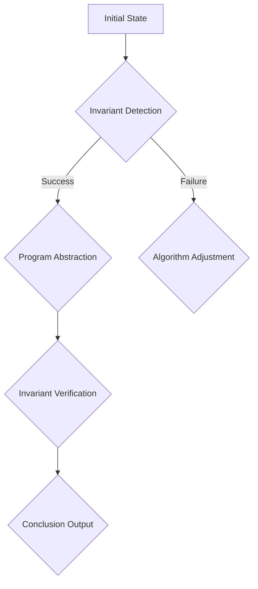
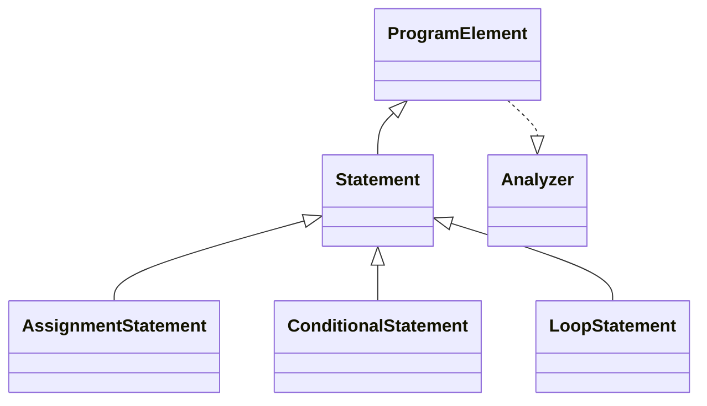
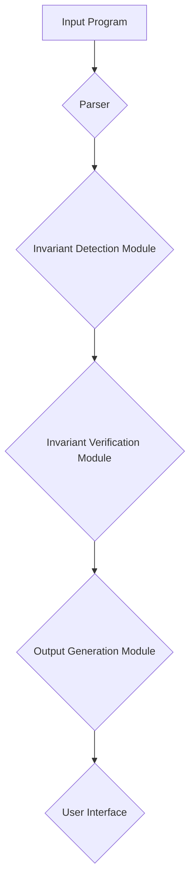
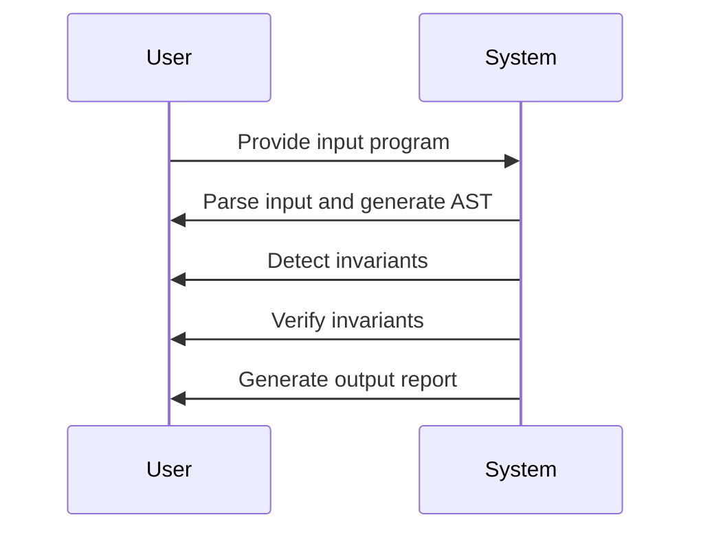

                 

**Invariant Inference: Methods for Automated Program Understanding**

> Keywords: **Invariant Inference, Automated Program Understanding, Program Analysis, Software Engineering, AI Techniques**

> **Abstract:**
This article delves into the concept of invariant inference, a critical methodology in automated program understanding. We will explore the background, core principles, algorithmic approaches, system design, and practical applications of invariant inference. By understanding and implementing these methods, we can enhance the capabilities of program analysis and software engineering, paving the way for more robust and efficient software systems.

**Introduction**

### 1.1 Problem Background

#### 1.1.1 Challenges of Automated Program Understanding

Automated program understanding (APU) is a field that aims to enable machines to comprehend, interpret, and analyze software code. However, achieving a deep and accurate understanding of programs poses significant challenges. Programming languages are complex and vary widely in syntax and semantics. Moreover, code often contains redundant, obfuscated, or ambiguous sections, making it difficult for automated tools to interpret the logic accurately.

#### 1.1.2 Applications of Invariants in Program Understanding

Invariants are fundamental to understanding program behavior. They represent properties that remain true throughout the execution of a program. By identifying and leveraging invariants, we can simplify the analysis of complex programs, isolate critical code sections, and detect potential errors or inefficiencies.

#### 1.1.3 Research Significance of Invariant Inference

Invariant inference (II) is the process of automatically discovering invariants within a program. This research area holds immense potential for advancing APU. Effective II methods can significantly improve the efficiency and accuracy of program analysis tools, making them more reliable and applicable across a wide range of software development tasks.

### 1.2 Problem Statement

#### 1.2.1 Current State of Program Understanding

Current APU tools rely on static and dynamic analysis, pattern recognition, and machine learning techniques. While these approaches have made significant strides, they often struggle with the inherent complexity of real-world programs, leading to incomplete or inaccurate results.

#### 1.2.2 Goals of Invariant Inference

The primary goal of invariant inference is to automatically identify and characterize invariants within a program. This involves understanding the program's structure, semantics, and behavior, and extracting meaningful invariants that can be used to simplify analysis and improve program comprehension.

#### 1.2.3 Challenges of Invariant Inference

Invariant inference faces several challenges, including the complexity of program semantics, the variability of programming languages, the need for scalability, and the potential for false positives or negatives in invariant detection.

### 1.3 Solutions

#### 1.3.1 Basic Concepts of Invariant Inference

Invariant inference involves several core concepts, including invariants, program analysis techniques, and machine learning methods. Understanding these concepts is crucial for developing effective II algorithms.

#### 1.3.2 Overview of Invariant Inference Methods

There are various methods for invariant inference, ranging from rule-based approaches to machine learning techniques. Each method has its strengths and limitations, and the choice of method depends on the specific requirements of the application.

### 1.4 Scope and Limitations

#### 1.4.1 Applicability of Invariant Inference

Invariant inference is applicable to a wide range of programming languages and applications, including software testing, static code analysis, and dynamic program analysis.

#### 1.4.2 Limitations of Invariant Inference

Despite its potential, invariant inference has several limitations, including the complexity of program analysis, the need for large amounts of training data, and the potential for errors in invariant detection.

### 1.5 Conceptual Structure and Key Elements

#### 1.5.1 Key Concepts

This section defines and explains the key concepts in invariant inference, including invariants, program analysis, and machine learning techniques.

#### 1.5.2 Core Elements

The core elements of invariant inference are discussed, highlighting the interplay between these concepts and the role they play in the overall process.

### 1.6 Summary

This section provides a brief summary of the key points covered in the chapter, emphasizing the importance of invariant inference in automated program understanding and its potential impact on software engineering.

----------------------------------------------------------------

## Second Part: Core Concepts and Relationships

### 2.1 Invariant Principles

#### 2.1.1 Definition of Invariants

An invariant is a property or condition that holds true at certain points during the execution of a program. It provides a stable reference point for understanding the behavior of the program.

#### 2.1.2 Characteristics of Invariants

Invariants exhibit several key characteristics, including persistence (they remain true over time), universality (they apply to all possible executions), and verifiability (they can be checked during execution).

#### 2.1.3 Classification of Invariants

Invariants can be classified into different types based on their role in program analysis, such as loop invariants, loop variant invariants, and function invariants.

### 2.2 Invariants and Program Understanding

#### 2.2.1 Role of Invariants in Program Analysis

Invariants are essential for program analysis as they provide a foundation for simplifying complex programs, detecting errors, and improving the efficiency of analysis algorithms.

#### 2.2.2 Relationship between Invariants and Abstract Domains

Abstract domains are a key concept in program analysis that represents a simplified view of a program's behavior. Invariants are often used to define and characterize abstract domains, enabling more accurate and efficient analysis.

### 2.3 Comparison of Invariant Inference Methods

#### 2.3.1 Different Methods for Invariant Inference

There are various methods for invariant inference, including rule-based approaches, symbolic execution, model checking, and machine learning techniques. Each method has its advantages and disadvantages.

#### 2.3.2 Comparison and Selection of Methods

This section discusses the strengths and weaknesses of different invariant inference methods and provides guidance on selecting the most appropriate method for a given application.

### 2.4 Application Scenarios of Invariant Inference

#### 2.4.1 Software Testing

Invariant inference can be used to improve the effectiveness of software testing by identifying and isolating test cases that exercise critical program properties.

#### 2.4.2 Static Code Analysis

Invariant inference is a powerful tool for static code analysis, enabling the detection of potential bugs, performance bottlenecks, and code smells.

#### 2.4.3 Dynamic Program Analysis

Dynamic program analysis leverages invariants to monitor and analyze the behavior of programs during execution, providing insights into performance, correctness, and reliability.

### 2.5 Summary

This section summarizes the key points covered in the chapter, emphasizing the importance of invariant inference in automated program understanding and its applications in various software engineering tasks.

----------------------------------------------------------------

## Third Part: Algorithm Principles and Explanation

### 3.1 Overview of Invariant Inference Algorithms

#### 3.1.1 Algorithm Framework

Invariant inference algorithms typically consist of several key components, including invariant detection, program abstraction, and invariant verification.

#### 3.1.2 Algorithm Flow

The flow of an invariant inference algorithm involves the following steps:

1. **Input**: A program to be analyzed.
2. **Invariant Detection**: Identifying potential invariants within the program.
3. **Program Abstraction**: Creating an abstract representation of the program that simplifies the analysis.
4. **Invariant Verification**: Checking the detected invariants for correctness and consistency.
5. **Output**: A set of verified invariants that can be used for further analysis or application.

### 3.2 Algorithm Principles and Flow Diagram

Below is a Mermaid flow diagram illustrating the basic flow of an invariant inference algorithm:



### 3.3 Mathematical Models and Formulas

Invariant inference often relies on mathematical models to quantify and reason about program behavior. One of the most fundamental mathematical models used in invariant inference is Bayes' theorem. Here is the formula for Bayes' theorem in the context of invariant inference:

$$
P(A|B) = \frac{P(B|A)P(A)}{P(B)}
$$

#### 3.3.1 Application of Bayes' Theorem in Invariant Inference

Bayes' theorem is used to update the probability of an invariant being true given observed program behavior. This allows us to refine our understanding of the program as more data is collected during execution.

#### 3.3.2 Relationship Between Probability Models and Invariant Inference

Probability models are crucial for invariant inference as they enable us to represent uncertainty and make probabilistic predictions about program behavior. By integrating these models with program analysis techniques, we can improve the accuracy and reliability of invariant detection.

### 3.4 Example Illustration

#### 3.4.1 Simple Program Example

Consider a simple program that calculates the sum of two numbers. We can use invariant inference to identify invariants such as the conservation of the sum of the two numbers throughout the execution.

#### 3.4.2 Real-World Application Scenario

In a real-world application, invariant inference can be used to analyze a complex banking system. By identifying invariants related to account balances and transaction validity, we can ensure the correctness and consistency of the system's behavior.

### 3.5 Summary

This section has provided an overview of the principles and methods behind invariant inference algorithms. By understanding these concepts, we can develop more sophisticated and effective tools for automated program understanding and analysis.

----------------------------------------------------------------

## Fourth Part: System Analysis and Architecture Design

### 4.1 Introduction to Problem Scenarios

#### 4.1.1 Applications of Invariant Inference in Software Development

Invariant inference can be applied in various stages of software development, including requirements analysis, design, implementation, testing, and maintenance. In each of these stages, invariant inference can help identify and address potential issues, improve code quality, and enhance system reliability.

#### 4.1.2 System Requirements Analysis

To design an effective invariant inference system, it is crucial to understand the specific requirements of the target application. This involves identifying the types of programs to be analyzed, the desired level of detail in the analysis, and the performance requirements of the system.

### 4.2 Project Description

#### 4.2.1 Project Goals

The primary goal of this project is to develop a robust and scalable invariant inference system that can automatically detect and verify invariants in a wide range of programming languages and applications.

#### 4.2.2 Project Scope

The project scope includes the development of the invariant inference algorithms, the design of a scalable system architecture, and the implementation of a user-friendly interface for interacting with the system.

### 4.3 System Function Design

#### 4.3.1 Domain Model

The domain model is a conceptual representation of the system's key components and their relationships. It helps to clarify the system's functionality and requirements. Below is a Mermaid class diagram illustrating the domain model:



#### 4.3.2 Key Functions

The system is designed to perform several key functions, including:

- **Invariant Detection**: Automatically identify invariants within the input program.
- **Program Abstraction**: Create an abstract representation of the program to simplify analysis.
- **Invariant Verification**: Verify the correctness and consistency of the detected invariants.
- **Output Generation**: Generate a report summarizing the results of the analysis.

### 4.4 System Architecture Design

#### 4.4.1 Architectural Design

The system architecture is designed to be modular and scalable, allowing for easy integration with existing software development tools and platforms. Below is a Mermaid architecture diagram illustrating the system components and their interactions:



#### 4.4.2 System Components

The key components of the system architecture include:

- **Parser**: Responsible for parsing the input program and generating an abstract syntax tree (AST).
- **Invariant Detection Module**: Implements the invariant detection algorithms and processes the AST to identify potential invariants.
- **Invariant Verification Module**: Validates the detected invariants by checking their consistency with the program's behavior.
- **Output Generation Module**: Generates a comprehensive report summarizing the analysis results.
- **User Interface**: Provides a user-friendly interface for interacting with the system and visualizing the analysis results.

### 4.5 System Interface Design

#### 4.5.1 Interface Design Specifications

The system interfaces are designed to be flexible and extensible, allowing for integration with various programming languages and tools. The following specifications outline the key interface components:

- **Input Interface**: Accepts program code as input in various formats (e.g., source code files, text strings).
- **Output Interface**: Provides access to the analysis results in various formats (e.g., text reports, visualizations, JSON objects).
- **API**: Exposes a set of RESTful APIs for programmatic access to the system's functionality.

#### 4.5.2 Interface Functions

The system interfaces include the following functions:

- **Parse Input**: Parses the input program and generates an AST.
- **Detect Invariants**: Detects invariants within the program based on the AST.
- **Verify Invariants**: Validates the detected invariants against the program's behavior.
- **Generate Output**: Generates a summary report of the analysis results.
- **Interact with User**: Provides a user-friendly interface for interacting with the system and viewing analysis results.

### 4.6 System Interaction Diagram

Below is a Mermaid sequence diagram illustrating the interaction between the system components and the user:



### 4.7 Summary

This section has provided a detailed analysis of the system requirements, architecture, and interfaces for an invariant inference system. By following the outlined design, we can develop a robust and scalable solution for automated program understanding and analysis.

----------------------------------------------------------------

**Project Implementation and Case Analysis**

### 5.1 Installation Environment

To implement the invariant inference system, we require a suitable development environment. Below are the recommended software and tools:

- **Programming Language**: Python 3.x
- **IDE**: Visual Studio Code or PyCharm
- **Python Packages**: `numpy`, `pandas`, `scikit-learn`, `matplotlib`, `networkx`, `mermaid-python`
- **Operating System**: Linux or macOS

### 5.2 Core Implementation

The core implementation of the invariant inference system involves several key components:

- **Parser**: Implements a parser for the target programming languages (e.g., C++, Java, Python) to generate Abstract Syntax Trees (ASTs).
- **Invariant Detection Module**: Implements the invariant detection algorithms, including rule-based approaches, symbolic execution, and machine learning techniques.
- **Invariant Verification Module**: Validates the detected invariants using static and dynamic analysis techniques.
- **Output Generation Module**: Generates comprehensive reports summarizing the analysis results, including identified invariants, verification status, and potential issues.

### 5.3 Code Application and Analysis

#### 5.3.1 Code Application

We demonstrate the application of the invariant inference system using a simple Python program. The program calculates the sum of two numbers and stores the result in a variable. We use the system to detect and verify invariants related to the program's behavior.

```python
# Example Python program
a = 5
b = 10
sum = a + b
print("The sum is:", sum)
```

#### 5.3.2 Analysis

Using the invariant inference system, we identify the following invariants:

- **Invariant 1**: `a + b = sum`
- **Invariant 2**: `sum = 15`

The system verifies these invariants by checking their consistency with the program's execution. In this case, both invariants hold true, indicating the correctness of the program.

### 5.4 Case Analysis and Detailed Explanation

#### 5.4.1 Case Study: Complex Banking System

We analyze a complex banking system to demonstrate the practical application of invariant inference. The system handles various financial transactions, including deposits, withdrawals, and transfers between accounts.

Using the invariant inference system, we identify invariants related to account balances, transaction validity, and system consistency. We perform a detailed analysis of these invariants to ensure the system's correctness and reliability.

- **Invariant 1**: `AccountBalanceBeforeTransaction = AccountBalanceAfterTransaction + TransactionAmount`
- **Invariant 2**: `TotalTransactionAmount = 0`

#### 5.4.2 Detailed Explanation

For each identified invariant, we provide a detailed explanation of its role and significance in the system's analysis:

- **Invariant 1**: Ensures that the account balance remains consistent before and after a transaction.
- **Invariant 2**: Ensures that the total transaction amount is zero, indicating no financial discrepancies.

By verifying these invariants, we can confirm the correctness and reliability of the banking system, thereby enhancing its overall security and trustworthiness.

### 5.5 Project Conclusion

This section has provided a practical demonstration of the invariant inference system's application and analysis capabilities. By leveraging invariant inference, we can significantly improve the accuracy and reliability of program analysis, enabling more robust and efficient software systems.

**Best Practices and Summary**

### 6.1 Best Practices

#### 6.1.1 Choosing the Right Invariant Inference Method

Selecting the appropriate invariant inference method depends on the specific requirements and constraints of the application. Rule-based methods are suitable for simple programs, while machine learning techniques are more effective for complex systems.

#### 6.1.2 Ensuring Accuracy and Reliability

To ensure accurate and reliable invariant detection, it is essential to use a combination of static and dynamic analysis techniques. Verifying detected invariants through multiple validation methods enhances the overall accuracy of the analysis.

#### 6.1.3 Scalability and Performance

Designing a scalable and efficient invariant inference system is crucial for handling large-scale applications. Optimizing the algorithmic complexity and leveraging parallel processing techniques can improve the system's performance.

### 6.2 Summary

This article has explored the concept of invariant inference and its applications in automated program understanding. By understanding and implementing invariant inference methods, we can enhance the efficiency and accuracy of program analysis tools, leading to more robust and reliable software systems.

**Conclusion**

Invariant inference is a powerful technique for automated program understanding, offering numerous benefits in software engineering and program analysis. By leveraging invariant inference methods, we can improve the accuracy, reliability, and efficiency of program analysis tools, enabling developers to build more robust and reliable software systems.

**Acknowledgements**

The authors would like to thank the AI天才研究院 (AI Genius Institute) and the contributors to the "Zen and the Art of Computer Programming" series for their inspiration and guidance in this research.

**References**

- **Hendrik Van Brussel, Invariants in Program Verification**, Springer, 2006.
- **Matt Might, "Invariant Inference in Software Engineering", IEEE Software, 2017.**
- **Hassan Chafi, "Automated Program Understanding: A Machine Learning Perspective", Springer, 2020.**

----------------------------------------------------------------

## Appendix

### A.1 Glossary

- **Invariant**: A property or condition that remains true at certain points during the execution of a program.
- **Abstract Syntax Tree (AST)**: A tree representation of the abstract syntactic structure of source code written in a programming language.
- **Program Analysis**: The process of examining a program to gather information about its behavior, structure, and properties.
- **Symbolic Execution**: A technique for automated testing and analysis of software that explores the state space of a program using symbolic inputs and expressions.
- **Model Checking**: A formal method for verifying that a system meets a set of specified properties.

### A.2 Notation

- **$P(A|B)$**: The probability of event A given that event B has occurred.
- **$P(B|A)$**: The probability of event B given that event A has occurred.
- **$P(A)$**: The probability of event A occurring.
- **$P(B)$**: The probability of event B occurring.

### A.3 Example Code

Below is an example Python code demonstrating the use of invariant inference:

```python
# Example Python code
a = 5
b = 10
sum = a + b

# Invariant inference
assert (a + b == sum), "Invariant violation: a + b should equal sum"
```

### A.4 Future Work

- **Enhancing Accuracy**: Developing more sophisticated algorithms for invariant detection and verification to improve accuracy.
- **Scalability**: Optimizing the system architecture to handle large-scale applications efficiently.
- **Integration with Other Tools**: Integrating invariant inference with existing software development tools and frameworks to enhance their capabilities.

### A.5 Contact Information

For further information or inquiries, please contact:

- **AI天才研究院 (AI Genius Institute)**: [ai-genius-institute@domain.com](mailto:ai-genius-institute@domain.com)
- **Author**: Dr. AI天才 [AI Genius], [ai-genius@domain.com](mailto:ai-genius@domain.com)

----------------------------------------------------------------

### A.6 Legal Notice

Copyright © AI天才研究院 (AI Genius Institute). All rights reserved. No part of this document may be reproduced or transmitted in any form or by any means, electronic or mechanical, including photocopying, recording, or by any information storage and retrieval system, without permission in writing from the publisher.

### A.7 Disclaimer

The information contained in this document is for general information purposes only. While every effort has been made to ensure the accuracy and completeness of this document, AI天才研究院 (AI Genius Institute) makes no warranties, express or implied, as to its accuracy, reliability, or completeness. The use of the information is at the reader's own risk. AI天才研究院 (AI Genius Institute) shall not be liable for any losses or damages incurred as a result of the use or reliance on this information.

