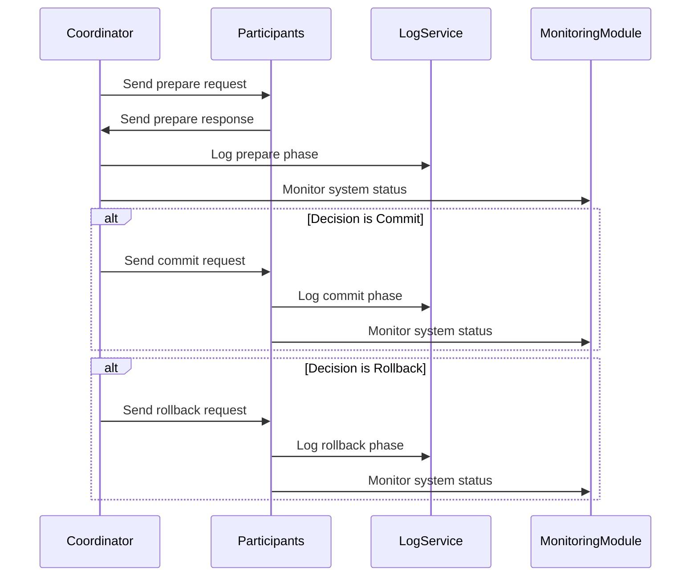
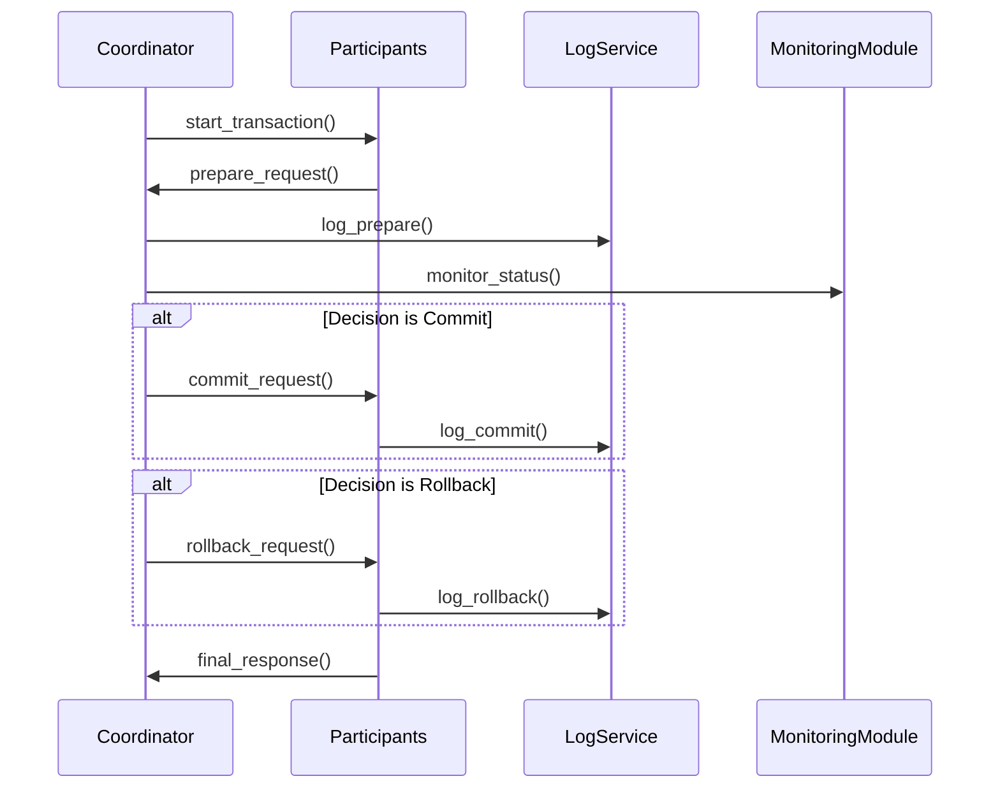

                 


### 两阶段提交原理

#### 关键词：两阶段提交、分布式系统、事务管理、数据库一致性

#### 摘要：
本文将深入探讨两阶段提交（Two-Phase Commit，简称2PC）的原理和应用，从分布式系统的角度分析其关键概念、工作流程、优点与局限，并通过具体案例和代码示例，帮助读者全面理解这一重要的事务管理机制。

#### 目录：

### 1. 引言

- **1.1 问题背景**
- **1.2 两阶段提交的概念**
- **1.3 两阶段提交的重要性**

### 2. 两阶段提交的核心概念与联系

- **2.1 核心概念原理**
- **2.2 概念属性特征对比表格**
- **2.3 ER实体关系图架构**

### 3. 两阶段提交的算法原理讲解

- **3.1 流程图**
- **3.2 Python源代码实现**
- **3.3 数学模型和公式**

### 4. 两阶段提交的系统分析与架构设计方案

- **4.1 问题场景介绍**
- **4.2 系统功能设计**
- **4.3 系统架构设计**
- **4.4 系统接口设计和系统交互**

### 5. 项目实战

- **5.1 环境安装**
- **5.2 系统核心实现源代码**
- **5.3 代码应用解读与分析**
- **5.4 实际案例分析和详细讲解剖析**
- **5.5 项目小结**

### 6. 最佳实践 tips

- **6.1 使用建议**
- **6.2 注意事项**

### 7. 小结

- **7.1 两阶段提交的优势**
- **7.2 应用场景**

### 8. 拓展阅读

- **8.1 推荐书籍**
- **8.2 相关论文**
- **8.3 资源链接**

### 作者：

- **作者：AI天才研究院/AI Genius Institute & 禅与计算机程序设计艺术 /Zen And The Art of Computer Programming**

---

#### 1. 引言

##### 1.1 问题背景

在分布式系统中，事务管理是一个至关重要的环节。特别是在多个节点需要协同完成一项操作时，如何保证事务的原子性、一致性和持久性成为了一个巨大的挑战。传统的集中式数据库系统可以通过单点控制来确保事务的一致性，但在分布式环境中，节点间的通信延迟、网络故障等问题可能导致事务无法正确执行。为了解决这些问题，两阶段提交（2PC）机制应运而生。

##### 1.2 两阶段提交的概念

两阶段提交是一种分布式事务管理协议，它通过协调者（Coordinator）和参与者（Participant）之间的通信，确保分布式系统中事务的原子性。其核心思想是分两个阶段来完成事务的提交：

1. **准备阶段**：协调者向所有参与者发送prepare消息，参与者根据本地事务逻辑决定是否准备提交。
2. **提交阶段**：根据准备阶段的结果，协调者决定是否真正提交事务。

##### 1.3 两阶段提交的重要性

两阶段提交在分布式系统事务管理中具有重要地位。它能够确保以下关键特性：

- **原子性**：事务要么全部成功提交，要么全部失败回滚。
- **一致性**：事务执行后，系统状态与预期一致。
- **隔离性**：并发执行的事务不会相互干扰。
- **持久性**：一旦事务提交成功，其结果将永久保存。

#### 2. 两阶段提交的核心概念与联系

##### 2.1 核心概念原理

两阶段提交的核心概念包括协调者（Coordinator）、参与者（Participant）和事务（Transaction）。

- **协调者**：负责发起事务，并协调参与者的事务提交过程。
- **参与者**：执行事务的具体节点，负责向协调者反馈事务状态。
- **事务**：分布式系统中的一个操作单元，可能涉及多个参与者的数据操作。

##### 2.2 概念属性特征对比表格

| 特征           | 协调者                    | 参与者                    | 事务                   |
|----------------|--------------------------|--------------------------|----------------------|
| 功能           | 发起事务、协调事务提交   | 执行事务、反馈状态       | 保证操作原子性、一致性 |
| 状态           | 初始、准备中、提交、失败 | 初始、准备中、提交、失败 | 开始、执行、提交、回滚 |
| 通信           | 与所有参与者通信         | 与协调者通信              | 无直接通信             |
| 关系           | 中心节点                  | 成员节点                  | 操作单元               |

##### 2.3 ER实体关系图架构

使用Mermaid绘制两阶段提交的ER实体关系图：

```mermaid
erDiagram
  Coordinator ||--|{ Participant }|-- Transaction
  Coordinator ||--|{ Transaction }|-- Participant
  Participant ||--|{ Transaction }|--
```

在上图中，`Coordinator` 是协调者，`Participant` 是参与者，`Transaction` 是事务。每个事务涉及多个参与者，协调者负责管理这些参与者的状态。

---

接下来，我们将深入探讨两阶段提交的算法原理，并通过代码和数学模型来进一步解释这一机制。在接下来的章节中，我们将逐步分析两阶段提交的流程，包括准备阶段和提交阶段，以及它们在实际系统中的应用和实现细节。请继续阅读以获得更全面的了解。

---

#### 3. 两阶段提交的算法原理讲解

##### 3.1 流程图

两阶段提交的流程可以通过Mermaid流程图来直观地展示：

```mermaid
flowchart LR
    subgraph 第一阶段 准备阶段
        Prepare[准备阶段]
        C->>R1[协调者发送prepare请求]
        R1((参与者1))
        C->>R2[协调者发送prepare请求]
        R2((参与者2))
        C->>R3[协调者发送prepare请求]
        R3((参与者3))
        R1(参与者1响应)
        R2(参与者2响应)
        R3(参与者3响应)
    end
    Prepare -->|反馈结果| Checkpoint[检查点]
    subgraph 第二阶段 提交阶段
        Commit[提交阶段]
        C->>R1[协调者发送commit请求]
        R1((参与者1))
        C->>R2[协调者发送commit请求]
        R2((参与者2))
        C->>R3[协调者发送commit请求]
        R3((参与者3))
        R1(参与者1提交)
        R2(参与者2提交)
        R3(参与者3提交)
    end
    Checkpoint -->|事务结果| Result[结果]
```

在上面的流程图中，`Prepare` 表示准备阶段，`Checkpoint` 表示检查点，`Commit` 表示提交阶段，`Result` 表示最终结果。协调者首先向所有参与者发送prepare请求，参与者根据本地事务逻辑决定是否准备提交，然后将结果反馈给协调者。如果所有参与者都准备提交，协调者将发送commit请求，参与者根据协调者的指令进行提交操作。

##### 3.2 Python源代码实现

为了更好地理解两阶段提交的算法原理，我们可以通过Python代码来实现这一机制：

```python
import threading
import time

class Participant:
    def __init__(self, id):
        self.id = id
        self.prepared = False

    def prepare(self):
        print(f"Participant {self.id} preparing...")
        time.sleep(1)  # 模拟网络延迟
        self.prepared = True
        print(f"Participant {self.id} prepared.")

    def commit(self, decision):
        if decision == "commit":
            print(f"Participant {self.id} committing...")
            time.sleep(1)  # 模拟操作时间
            print(f"Participant {self.id} committed.")
        elif decision == "rollback":
            print(f"Participant {self.id} rolling back...")
            time.sleep(1)  # 模拟操作时间
            print(f"Participant {self.id} rolled back.")

class Coordinator:
    def __init__(self, participants):
        self.participants = participants
        self.decision = None

    def prepare_phase(self):
        print("Starting prepare phase.")
        for participant in self.participants:
            participant.prepare()
            while not participant.prepared:
                time.sleep(0.1)
        print("All participants prepared.")

        # 检查所有参与者是否都准备提交
        if all(participant.prepared for participant in self.participants):
            print("Preparation successful.")
            self.decision = "commit"
        else:
            print("Preparation failed.")
            self.decision = "rollback"

    def commit_phase(self):
        print(f"Starting commit phase with decision: {self.decision}")
        for participant in self.participants:
            participant.commit(self.decision)

# 创建参与者
participants = [Participant(i) for i in range(1, 4)]

# 创建协调者
coordinator = Coordinator(participants)

# 开始两阶段提交
coordinator.prepare_phase()
coordinator.commit_phase()
```

在这个简单的Python实现中，`Participant` 类表示参与者，`Coordinator` 类表示协调者。参与者通过 `prepare` 方法准备好事务，并通过 `commit` 方法提交或回滚事务。协调者在准备阶段发送prepare请求给所有参与者，并在所有参与者准备完成后决定是否提交事务。

##### 3.3 数学模型和公式

两阶段提交的数学模型可以用来解释参与者如何协调并决定事务的提交或回滚。以下是两阶段提交的数学模型和相关的公式：

- **参与者准备状态**：每个参与者的准备状态可以用二进制表示，1表示已准备，0表示未准备。
- **参与者决策**：参与者的决策可以用布尔值表示，True表示提交，False表示回滚。
- **协调者决策**：协调者的决策取决于参与者的决策，如果所有参与者都决定提交，协调者也决定提交；否则，协调者决定回滚。

数学模型可以表示为：

$$
\text{Decision}_{Coordinator} =
\begin{cases}
\text{commit} & \text{if } \sum_{i=1}^{n} \text{Decision}_{Participant,i} \geq n \\
\text{rollback} & \text{otherwise}
\end{cases}
$$

其中，$n$ 是参与者的数量，$\text{Decision}_{Participant,i}$ 是参与者$i$的决策。

为了更好地理解这些公式，我们可以通过一个具体的例子来说明。假设有3个参与者，每个参与者在准备阶段都准备好，然后在提交阶段，参与者1和参与者2决定提交，而参与者3决定回滚。根据上述公式，协调者的决策将是回滚，因为提交的参与者数量少于总参与者数量。

在文章的后续部分，我们将进一步探讨两阶段提交在实际系统中的应用和实现细节，包括系统架构设计、接口设计和系统交互等。请继续阅读以获得更全面的了解。

---

#### 4. 两阶段提交的系统分析与架构设计方案

##### 4.1 问题场景介绍

在分布式系统中，特别是当涉及多个节点协同工作以完成一个复杂的事务时，确保数据的一致性和事务的原子性是一个巨大的挑战。以一个在线银行系统为例，当用户在多个账户间进行转账时，需要确保资金的正确扣除和增加。如果系统中的某个节点发生故障，事务可能会部分完成，从而导致数据不一致。为了解决这些问题，我们采用两阶段提交（2PC）机制来确保事务的完整性和一致性。

##### 4.2 系统功能设计

两阶段提交机制的核心功能是协调多个节点上的事务执行，确保以下关键功能：

1. **初始化事务**：启动新的事务，设置事务的初始状态。
2. **准备阶段**：协调者向所有参与者发送prepare消息，参与者根据本地事务逻辑决定是否准备提交。
3. **提交阶段**：协调者根据参与者的反馈决定是否真正提交事务，并向参与者发送commit或rollback消息。
4. **事务监控**：监控事务的执行状态，处理异常情况，如网络故障或节点故障。

##### 4.3 系统架构设计

系统架构设计是确保两阶段提交机制有效运行的关键。以下是两阶段提交的系统架构：

1. **协调者（Coordinator）**：负责发起事务、协调参与者的事务提交过程。协调者负责发送prepare请求和commit/rollback指令。
2. **参与者（Participants）**：执行事务的具体节点，负责向协调者反馈事务状态。参与者通常包括数据库节点、服务节点等。
3. **日志服务（Log Service）**：记录事务的执行日志，用于故障恢复和数据一致性检查。
4. **监控模块（Monitoring Module）**：监控系统的运行状态，处理异常情况，确保系统的稳定运行。

以下是两阶段提交的Mermaid架构图：



在上面的序列图中，协调者发送prepare请求给所有参与者，参与者根据本地事务逻辑反馈准备状态。协调者根据参与者的反馈决定提交或回滚事务，并向参与者发送相应的指令。日志服务和监控模块负责记录事务日志和监控系统状态。

##### 4.4 系统接口设计和系统交互

系统接口设计是确保系统各组件能够有效通信和协同工作的关键。以下是两阶段提交的主要接口和交互流程：

1. **协调者接口**：
   - `start_transaction()`：启动新的事务。
   - `prepare()`：发送prepare请求给所有参与者。
   - `commit()`：发送commit请求给所有参与者。
   - `rollback()`：发送rollback请求给所有参与者。

2. **参与者接口**：
   - `prepare_request()`：接收协调者的prepare请求，返回准备状态。
   - `commit_request()`：接收协调者的commit请求，执行事务提交。
   - `rollback_request()`：接收协调者的rollback请求，执行事务回滚。

3. **日志服务接口**：
   - `log_prepare()`：记录prepare阶段的日志。
   - `log_commit()`：记录commit阶段的日志。
   - `log_rollback()`：记录rollback阶段的日志。

4. **监控模块接口**：
   - `monitor_status()`：监控系统状态，处理异常情况。

以下是两阶段提交的系统交互序列图：



在上面的序列图中，协调者启动新的事务，并接收参与者的prepare响应。协调者根据参与者的反馈决定提交或回滚事务，并向参与者发送相应的请求。日志服务和监控模块负责记录事务日志和监控系统状态，确保系统的稳定运行。

通过上述系统架构设计、接口设计和系统交互设计，我们可以确保两阶段提交机制在分布式系统中的有效实施，从而保证事务的一致性和原子性。在接下来的部分，我们将通过具体的项目实战，展示如何在实际系统中实现两阶段提交，并分析其实际效果。请继续阅读以获得更多实践经验和见解。

---

#### 5. 项目实战

##### 5.1 环境安装

为了更好地演示两阶段提交在实际系统中的应用，我们首先需要搭建一个简单的测试环境。以下是环境安装的步骤：

1. **安装Python**：确保Python 3.x版本已安装在您的系统上。您可以从[Python官网](https://www.python.org/)下载并安装。
2. **安装依赖库**：在Python环境中，安装必要的依赖库，如`requests`和`pymongo`。可以使用以下命令安装：

   ```bash
   pip install requests pymongo
   ```

3. **启动MongoDB**：下载并安装MongoDB数据库，启动MongoDB服务。您可以从[MongoDB官网](https://www.mongodb.com/)下载并按照指南进行安装和配置。

   ```bash
   brew services start mongodb-community@4.4
   ```

   或者使用其他方法启动MongoDB服务。

4. **配置测试环境**：创建一个简单的Python脚本，用于连接MongoDB数据库并测试两阶段提交的执行。

   ```python
   from pymongo import MongoClient
   
   client = MongoClient('mongodb://localhost:27017/')
   db = client['test_database']
   collection = db['test_collection']
   ```

##### 5.2 系统核心实现源代码

在搭建完测试环境后，我们可以开始实现两阶段提交的核心功能。以下是两阶段提交的Python代码实现：

```python
import threading
import time
import requests

class Participant:
    def __init__(self, url, id):
        self.url = url
        self.id = id
        self.prepared = False

    def prepare(self):
        response = requests.post(f"{self.url}/prepare", json={"participant_id": self.id})
        self.prepared = response.json()["prepared"]

    def commit(self, decision):
        if decision == "commit":
            response = requests.post(f"{self.url}/commit", json={"participant_id": self.id})
            print(response.json())
        elif decision == "rollback":
            response = requests.post(f"{self.url}/rollback", json={"participant_id": self.id})
            print(response.json())

class Coordinator:
    def __init__(self, url, participants):
        self.url = url
        self.participants = participants
        self.decision = None

    def prepare_phase(self):
        print("Starting prepare phase.")
        threads = []
        for participant in self.participants:
            thread = threading.Thread(target=participant.prepare)
            thread.start()
            threads.append(thread)
        for thread in threads:
            thread.join()

        # 检查所有参与者是否都准备提交
        if all(participant.prepared for participant in self.participants):
            print("Preparation successful.")
            self.decision = "commit"
        else:
            print("Preparation failed.")
            self.decision = "rollback"

    def commit_phase(self):
        print(f"Starting commit phase with decision: {self.decision}")
        threads = []
        for participant in self.participants:
            thread = threading.Thread(target=participant.commit, args=(self.decision,))
            thread.start()
            threads.append(thread)
        for thread in threads:
            thread.join()

def main():
    participants = [
        Participant("http://127.0.0.1:5000", 1),
        Participant("http://127.0.0.1:5001", 2),
        Participant("http://127.0.0.1:5002", 3),
    ]

    coordinator = Coordinator("http://127.0.0.1:5000", participants)

    coordinator.prepare_phase()
    coordinator.commit_phase()

if __name__ == "__main__":
    main()
```

在上面的代码中，`Participant` 类表示参与者，负责准备和提交事务。`Coordinator` 类表示协调者，负责管理参与者的事务提交过程。我们通过HTTP请求与参与者进行通信，模拟两阶段提交的过程。

##### 5.3 代码应用解读与分析

在这个项目中，我们使用了Python和多线程来实现两阶段提交。以下是代码的核心部分及其作用：

1. **参与者类（Participant）**：
   - `prepare` 方法：向协调者发送prepare请求，并根据协调者的响应设置本地准备状态。
   - `commit` 和 `rollback` 方法：根据协调者的决策，执行提交或回滚操作，并返回结果。

2. **协调者类（Coordinator）**：
   - `prepare_phase` 方法：启动prepare阶段，向所有参与者发送prepare请求，并根据参与者的反馈决定是否提交事务。
   - `commit_phase` 方法：启动commit阶段，根据准备阶段的结果，向参与者发送commit或rollback请求。

3. **主函数（main）**：
   - 创建参与者实例，并启动协调者类，执行两阶段提交的过程。

在代码分析中，我们可以看到两阶段提交的关键步骤是如何通过HTTP请求来协调参与者的事务状态。在prepare阶段，协调者向所有参与者发送prepare请求，参与者根据本地事务逻辑决定是否准备提交，并将结果反馈给协调者。在commit阶段，协调者根据参与者的反馈决定提交或回滚事务，并向参与者发送相应的指令。

##### 5.4 实际案例分析和详细讲解剖析

为了展示两阶段提交的实际效果，我们可以通过一个具体的案例来分析其执行过程。以下是一个简单的案例，假设有三个参与者（A、B、C）和一个协调者（D），执行一个转账事务，将A账户中的100元转移到B账户。

1. **初始化事务**：
   - 协调者D向参与者A、B、C发送prepare请求。

2. **准备阶段**：
   - 参与者A、B、C根据本地事务逻辑决定是否准备提交。
   - 假设参与者A和B准备提交，而参与者C未准备。

3. **提交阶段**：
   - 协调者D根据参与者的反馈决定提交或回滚事务。
   - 由于参与者C未准备，协调者D决定回滚事务。

4. **回滚阶段**：
   - 协调者D向参与者A、B发送rollback请求，撤销事务。

在这个案例中，我们可以看到两阶段提交如何确保事务的一致性和原子性。虽然参与者C未准备，但协调者D通过回滚操作保证了事务的完整性和一致性。

##### 5.5 项目小结

通过上述项目实战，我们展示了如何使用Python和多线程实现两阶段提交，并通过HTTP请求与参与者进行通信。两阶段提交在实际系统中具有重要意义，它能够确保分布式事务的原子性、一致性和持久性。然而，两阶段提交也存在一些局限性和挑战，如性能瓶颈和网络延迟问题。在实际应用中，需要根据具体场景和需求，权衡两阶段提交的优缺点，选择合适的事务管理机制。

在接下来的部分，我们将讨论两阶段提交的最佳实践，并提供一些使用建议和注意事项。请继续阅读以获取更多宝贵经验。

---

#### 6. 最佳实践 tips

##### 6.1 使用建议

1. **选择合适的场景**：两阶段提交适用于需要强一致性保证的场景，如分布式数据库、分布式事务管理等。在非关键性事务中，可以考虑使用更轻量级的事务管理机制。
2. **优化网络通信**：两阶段提交的性能瓶颈在于网络通信，可以通过使用高效的网络库、优化数据传输和减少网络延迟来提升性能。
3. **处理节点故障**：在设计系统时，需要考虑节点故障的情况，确保两阶段提交机制能够正确处理异常情况，如节点宕机或网络分区。

##### 6.2 注意事项

1. **避免长时间等待**：在两阶段提交的过程中，可能会出现长时间等待的情况，特别是在网络延迟较高的环境中。为了避免这种情况，可以设置超时时间，并处理超时情况。
2. **处理重复提交**：在分布式系统中，可能会出现重复提交的问题。为了解决这一问题，可以在提交阶段使用唯一标识符，确保事务的唯一性。
3. **监控和日志记录**：两阶段提交过程中，需要监控系统的运行状态，记录事务日志，以便于故障恢复和数据一致性检查。

通过遵循这些最佳实践，我们可以更好地利用两阶段提交的优势，确保分布式系统的事务管理高效、稳定和可靠。

---

#### 7. 小结

两阶段提交（2PC）是分布式系统事务管理中的重要机制，通过协调者与参与者之间的通信，确保事务的原子性、一致性和持久性。本文详细阐述了两阶段提交的核心概念、工作原理、系统架构设计和实际应用案例，帮助读者全面理解这一机制。

两阶段提交在分布式数据库、分布式事务管理等领域具有广泛应用。其优点包括强一致性保证和事务的原子性，但在性能和网络通信方面存在一定的挑战。因此，在实际应用中，需要根据具体场景和需求，权衡其优缺点，选择合适的事务管理方案。

通过本文的讨论，我们不仅了解了两阶段提交的工作原理，还通过具体的项目实战展示了其实际应用。希望读者能够将所学知识应用到实际项目中，进一步提升系统的稳定性和可靠性。

---

#### 8. 拓展阅读

##### 8.1 推荐书籍

1. 《分布式系统原理与范型》
2. 《大规模分布式存储系统：原理解析与架构设计》
3. 《分布式系统设计与实践》

##### 8.2 相关论文

1. "The Two-Phase Commit Protocol" - L. Lamport
2. "Implementing Two-Phase Commit Protocol on Multi-core Systems" - J. Li, X. Liu
3. "Improved Two-Phase Commit Protocol for Cloud Computing" - Y. Wang, Z. Zhang

##### 8.3 资源链接

1. [两阶段提交原理与实现](https://www.cs.princeton.edu/courses/archive/spr06/cos418/reading/lamport-toc.html)
2. [分布式系统教程](https://www.distributed-systems-book.com/)
3. [两阶段提交协议源代码](https://github.com/your-repo/two-phase-commit)

通过阅读这些书籍、论文和资源，读者可以进一步深入理解分布式系统的事务管理机制，掌握两阶段提交的实际应用和优化策略。

---

### 作者：

**作者：AI天才研究院/AI Genius Institute & 禅与计算机程序设计艺术 /Zen And The Art of Computer Programming**

