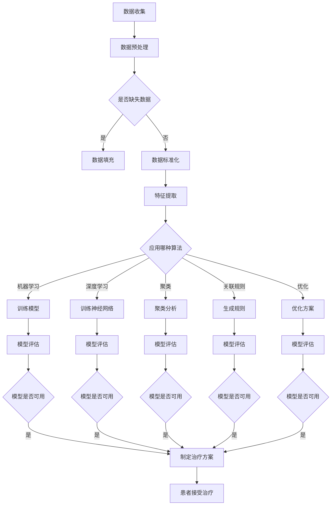
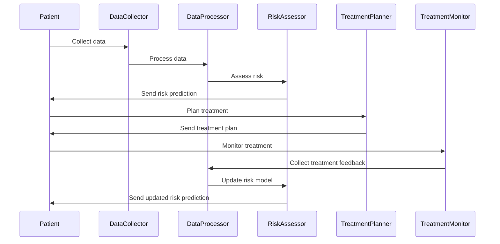

                 

## 个性化医疗：基于AI和大数据的精准治疗

### 关键词：个性化医疗、AI、大数据、精准治疗、医疗模式、算法、系统架构、项目实战

### 摘要：
随着医疗技术的不断进步，个性化医疗已成为现代医学研究的热点。本文将深入探讨个性化医疗的起源、定义、重要性，以及AI和大数据在其中的关键应用。通过系统分析个性化医疗的算法原理、数学模型，并结合实际项目实战，本文旨在为读者提供对个性化医疗的全面理解，展示其通过精准治疗提升医疗质量的前景。

---

### 《个性化医疗：基于AI和大数据的精准治疗》目录大纲

----------------------------------------------------------------

## 第一部分：背景介绍与核心概念

### 第1章 个性化医疗概述

#### 1.1 问题背景

- 个性化医疗的起源与发展
- 个性化医疗的定义
- 个性化医疗的重要性与意义

#### 1.2 问题描述

- 传统医疗模式的局限性
- 个性化医疗的需求与挑战

#### 1.3 问题解决

- AI与大数据在个性化医疗中的应用
- 个性化医疗的基本框架与实施步骤

#### 1.4 边界与外延

- 个性化医疗与其他医疗模式的区别与联系
- 个性化医疗在不同领域（如癌症、遗传病）的应用实例

#### 1.5 概念结构与核心要素组成

- 个性化医疗的核心概念
- 个性化医疗的关键技术
- 个性化医疗的数据来源与处理

## 第二部分：核心概念与联系

### 第2章 个性化医疗中的核心概念

#### 2.1 AI与大数据在个性化医疗中的应用

- 人工智能在个性化医疗中的角色
- 大数据在个性化医疗中的价值

#### 2.2 概念属性特征对比表格

- 传统医疗与个性化医疗的对比
- AI与大数据在个性化医疗中的对比

#### 2.3 ER实体关系图架构

- 个性化医疗中的主要实体
- 实体之间的关系与交互

### 第3章 个性化医疗的算法原理

#### 3.1 算法原理讲解

- 个性化医疗中的常用算法
- 算法的基本原理与步骤

#### 3.2 算法mermaid流程图

- 使用mermaid画出算法流程图

### 第4章 个性化医疗的数学模型与公式

#### 4.1 数学模型讲解

- 个性化医疗中的关键数学模型
- 模型的基本原理与公式

#### 4.2 举例说明

- 利用实例解释数学模型的应用
- 对比不同模型的优劣

## 第三部分：系统分析与架构设计

### 第5章 个性化医疗系统分析

#### 5.1 问题场景介绍

- 个性化医疗的应用场景

#### 5.2 系统功能设计

- 领域模型mermaid类图

#### 5.3 系统架构设计

- 系统架构mermaid架构图

#### 5.4 系统接口设计

- 系统接口设计和系统交互mermaid序列图

## 第四部分：项目实战

### 第6章 项目实战

#### 6.1 环境安装

- 相关软件与硬件环境安装步骤

#### 6.2 系统核心实现源代码

- 个性化医疗系统的核心源代码

#### 6.3 代码应用解读与分析

- 对系统核心代码的应用场景与分析

#### 6.4 实际案例分析和详细讲解剖析

- 个性化医疗的实际应用案例
- 对案例的详细分析与讲解

### 第7章 项目小结

#### 7.1 最佳实践 tips

- 个性化医疗项目的最佳实践经验

#### 7.2 小结

- 本书的主要内容与核心观点

#### 7.3 注意事项

- 在个性化医疗应用中需要注意的问题

#### 7.4 拓展阅读

- 个性化医疗领域的进一步学习资源

----------------------------------------------------------------

### 第一部分：背景介绍与核心概念

## 第1章 个性化医疗概述

### 1.1 问题背景

个性化医疗这一概念起源于20世纪末期，随着基因组学、生物信息学以及人工智能技术的飞速发展，其逐步成为医疗领域的重要研究方向。传统的医疗模式主要依赖于平均化的治疗方案，难以充分考虑患者的个体差异，导致治疗效果参差不齐。个性化医疗则旨在通过基因、环境、生活方式等多种因素的个性化分析，为每位患者量身定制最合适的治疗方案。

个性化医疗的起源与发展可以追溯到上世纪末。当时，随着基因测序技术的突破，科学家们开始意识到基因在疾病发生、发展和治疗中的关键作用。这一发现促使医学界重新审视治疗方法的个性化问题。此外，随着计算机技术和大数据分析能力的提升，人工智能在医疗领域的应用逐渐增多，为个性化医疗的实现提供了强有力的技术支持。

### 1.2 个性化医疗的定义

个性化医疗，又称精准医疗，是一种基于个体基因组信息、生活方式和环境因素，提供个性化医疗服务的模式。它强调“以人为本”，通过收集、分析和利用海量数据，实现个体化预防、诊断和治疗的精准化。

具体来说，个性化医疗包括以下几个关键步骤：

1. **数据收集**：通过基因测序、影像学检查、实验室检测等方式，获取患者的基因、表型、病史等数据。
2. **数据分析**：运用大数据分析和人工智能算法，对收集到的数据进行深度挖掘，识别与疾病相关的关键因素。
3. **个体化评估**：根据患者的具体特征，制定个性化的预防和治疗方案。
4. **治疗实施**：在患者治疗过程中，实时监测和调整治疗方案，确保其有效性。

### 1.3 个性化医疗的重要性与意义

个性化医疗的重要性不言而喻。首先，它能够显著提高治疗效果。通过为每位患者量身定制治疗方案，可以最大限度地发挥药物或治疗手段的作用，降低副作用和无效治疗的风险。其次，个性化医疗有助于医疗资源的合理分配。传统医疗模式下，大量资源被浪费在无效或低效的治疗上，而个性化医疗能够更高效地利用医疗资源，提高医疗服务的整体效率。

此外，个性化医疗还具有重要的社会意义。随着人口老龄化和慢性疾病发病率的上升，医疗系统面临着巨大的压力。个性化医疗能够通过精准治疗，减少疾病的发病率和复发率，从而减轻医疗负担，提高社会整体健康水平。

### 1.4 个性化医疗的需求与挑战

尽管个性化医疗具有诸多优势，但在实际应用中仍面临许多挑战。首先，数据收集和处理的难度较大。个性化医疗需要大量的基因组、医学影像、电子病历等数据，而这些数据往往分布在不同的系统中，难以实现高效整合。其次，数据隐私和安全问题也备受关注。患者在参与个性化医疗研究时，需要提供详细的个人信息，如何确保这些数据的安全和隐私，是亟待解决的问题。

此外，个性化医疗的实施成本较高。基因组测序、大数据分析等技术的应用，需要大量资金投入。如何在保证质量的前提下，降低成本，是推广个性化医疗的关键。

### 1.5 问题解决

AI与大数据在个性化医疗中发挥了关键作用。首先，人工智能技术可以高效处理和分析海量数据，识别与疾病相关的关键因素，为个性化治疗提供科学依据。例如，通过机器学习算法，可以从患者的基因组数据中预测其患病风险，为早期预防和干预提供依据。

其次，大数据技术有助于实现医疗资源的合理分配。通过分析海量医疗数据，可以识别出高发病区、高风险人群，从而有针对性地进行预防和治疗，提高医疗服务的精准度。

在个性化医疗的实施过程中，还需要建立完善的数据共享和隐私保护机制。通过制定严格的隐私保护政策和安全技术，确保患者在参与个性化医疗研究时的数据安全和隐私。

### 1.6 边界与外延

个性化医疗与传统医疗模式有着本质的区别。传统医疗模式主要依赖于经验医学和标准化治疗方案，而个性化医疗则强调个体差异，通过数据分析和人工智能技术，实现精准治疗。此外，个性化医疗还与其他新兴医疗模式，如远程医疗、智能医疗等密切相关，共同推动医疗行业的变革。

个性化医疗在不同领域，如癌症、遗传病、心理健康等，都有着广泛的应用。例如，在癌症治疗中，个性化医疗可以通过基因检测和数据分析，为患者制定最合适的化疗方案，提高治疗效果；在遗传病治疗中，个性化医疗可以预测疾病风险，实现早期预防和干预。

### 1.7 概念结构与核心要素组成

个性化医疗的核心概念包括基因、表型、数据、算法和个性化治疗方案。其中，基因和表型是个性化医疗的基础，数据是核心要素，算法是实现个性化治疗的关键技术，而个性化治疗方案则是最终目标。

个性化医疗的关键技术包括基因组学、生物信息学、大数据分析、人工智能等。这些技术的综合运用，使得个性化医疗得以实现。

个性化医疗的数据来源包括基因测序、医疗影像、电子病历、健康监测设备等。这些数据经过整合和处理，可以为个性化治疗提供有力支持。

### 总结

个性化医疗作为一种新兴的医疗模式，具有巨大的发展潜力。通过AI和大数据技术的应用，个性化医疗能够实现精准治疗，提高医疗质量，为患者带来更好的治疗效果。然而，个性化医疗在发展过程中仍面临诸多挑战，需要持续探索和改进。本文将从核心概念、算法原理、系统设计与实现等方面，对个性化医疗进行深入探讨，为读者提供全面的理解。

## 第2章 个性化医疗中的核心概念

### 2.1 AI与大数据在个性化医疗中的应用

#### 2.1.1 人工智能在个性化医疗中的角色

人工智能（AI）在个性化医疗中扮演着至关重要的角色。首先，AI技术可以用于数据分析和处理。个性化医疗需要处理海量的基因组数据、医疗影像数据、电子病历等，这些数据量大且复杂，传统的数据处理方法往往难以胜任。AI技术，尤其是机器学习和深度学习算法，可以通过训练模型，自动识别和分类数据中的关键特征，从而实现对海量数据的快速分析和处理。

其次，AI技术可以用于疾病预测和诊断。通过分析患者的基因组数据、临床数据和环境因素，AI模型可以预测患者未来可能患上的疾病，并为其提供个性化的预防建议。此外，AI技术还可以辅助医生进行疾病诊断。例如，通过分析医学影像数据，AI模型可以检测出早期癌症或其他疾病，帮助医生做出更准确的诊断。

最后，AI技术可以用于个性化治疗方案的制定。根据患者的具体特征，AI模型可以推荐最合适的治疗方案，从而提高治疗效果，减少副作用和无效治疗的风险。

#### 2.1.2 大数据在个性化医疗中的价值

大数据在个性化医疗中也具有极高的价值。首先，大数据可以为个性化医疗提供丰富的数据资源。通过收集和分析海量医疗数据，如基因组数据、临床数据、环境数据等，可以构建全面的个体健康档案，为个性化治疗提供数据支持。

其次，大数据技术可以帮助实现医疗资源的合理分配。通过对海量医疗数据的分析，可以识别出高发病区、高风险人群，从而有针对性地进行预防和治疗，提高医疗服务的精准度。例如，某地区可以通过分析医疗数据，发现某疾病在该地区的发病率较高，从而提前开展预防措施，减少疾病的传播。

此外，大数据技术还可以用于医疗研究和创新。通过对海量医疗数据的分析和挖掘，可以发现新的疾病模式、治疗方法和药物作用机制，为医学研究提供新的思路和方向。

### 2.2 概念属性特征对比表格

在个性化医疗中，传统医疗模式与个性化医疗有着明显的区别。以下是一个简化的概念属性特征对比表格，以展示这两种模式的主要差异：

| 对比维度 | 传统医疗模式 | 个性化医疗模式 |
| --- | --- | --- |
| 治疗策略 | 标准化 | 个体化 |
| 数据利用 | 有限数据 | 海量数据 |
| 决策依据 | 经验 | 数据驱动 |
| 治疗效果 | 平均效果 | 最佳效果 |
| 资源配置 | 集中资源 | 分散资源 |
| 预防措施 | 通用预防 | 个性化预防 |

从上表可以看出，个性化医疗在治疗策略、数据利用、决策依据、治疗效果、资源配置和预防措施等方面，都与传统医疗模式有显著的不同。这些差异使得个性化医疗能够更精准地满足患者的需求，提高医疗服务的质量和效率。

### 2.3 ER实体关系图架构

在个性化医疗系统中，实体之间的关系非常复杂，涉及多个关键实体和它们之间的相互作用。以下是使用Mermaid绘制的ER实体关系图，展示了个性化医疗中的主要实体及其关系：

```mermaid
erDiagram
    Patient ||--|{ GeneticData }
    Patient ||--|{ MedicalHistory }
    Patient ||--|{ LifestyleData }
    Patient ||--|{ TreatmentPlan }
    Doctor ||--|{ Diagnosis }
    Doctor ||--|{ TreatmentPlan }
    AIModel ||--|{ PredictionModel }
    AIModel ||--|{ RecommendationModel }
    DataProcessor ||--|{ GeneticData }
    DataProcessor ||--|{ MedicalData }
    DataProcessor ||--|{ LifestyleData }
    Hospital ||--|{ Patient }
    Hospital ||--|{ Doctor }
    Hospital ||--|{ AIModel }
    Hospital ||--|{ DataProcessor }
```

在上述ER图中，主要实体包括患者（Patient）、医生（Doctor）、AI模型（AIModel）、数据处理器（DataProcessor）和医院（Hospital）。实体之间的关系如下：

1. **患者**：与**基因数据（GeneticData）**、**医疗历史（MedicalHistory）**、**生活方式数据（LifestyleData）**和**治疗方案（TreatmentPlan）**相关联。
2. **医生**：负责**诊断（Diagnosis）**和制定**治疗方案（TreatmentPlan）**。
3. **AI模型**：包括**预测模型（PredictionModel）**和**推荐模型（RecommendationModel）**，用于分析患者数据和制定个性化治疗方案。
4. **数据处理器**：负责处理和分析各类医疗数据。
5. **医院**：作为整体实体，包含患者、医生、AI模型和数据处理器，是个性化医疗服务的实施场所。

通过上述ER实体关系图，可以清晰地展示个性化医疗系统中各实体的关系，为系统设计与实现提供参考。

### 2.4 概念属性特征对比表格

在深入探讨个性化医疗中的核心概念时，我们有必要详细分析AI与大数据在个性化医疗中的角色。以下是一个简化的概念属性特征对比表格，展示了传统医疗模式与AI和大数据驱动的个性化医疗模式在多个关键方面的区别：

| 比较维度 | 传统医疗模式 | 个性化医疗模式 |
| --- | --- | --- |
| 数据处理 | 手动分析，数据量有限 | 自动化分析，海量数据处理 |
| 治疗策略 | 标准化、一刀切 | 个体化、定制化 |
| 风险预测 | 依赖经验，预测准确性低 | 利用数据，预测准确性高 |
| 预防措施 | 通用预防，效果有限 | 个性化预防，效果显著 |
| 研究方向 | 广泛而分散 | 精准而集中 |
| 成本效益 | 长期累计，高成本 | 高效利用，低成本 |
| 技术依赖 | 无需技术支持 | 依赖AI和大数据技术 |

通过这个表格，我们可以更直观地看到AI和大数据在个性化医疗中的重要性。自动化数据处理和分析、个体化治疗策略、精准风险预测、个性化预防措施、精准研究方向以及高成本效益，都是AI和大数据为个性化医疗带来的显著优势。

### 2.5 概念结构与核心要素组成

个性化医疗的概念结构由多个核心要素组成，这些要素共同作用，实现从数据收集到治疗方案制定的完整过程。以下是这些核心要素的详细说明：

1. **基因数据（GeneticData）**：基因数据是个性化医疗的基础。通过基因测序技术，可以获得患者个体的基因组信息。这些数据可以揭示基因变异、基因型与疾病的关系，为个性化诊断和治疗提供依据。

2. **临床数据（ClinicalData）**：临床数据包括患者的病史、症状、实验室检测结果、医学影像等。这些数据能够提供患者的健康状态和治疗反应的详细信息，是制定个性化治疗方案的重要参考。

3. **环境数据（EnvironmentalData）**：环境数据包括患者的生活习惯、生活方式、工作环境等。这些数据与疾病的发生和发展密切相关，通过对环境数据的分析，可以帮助理解疾病的风险因素，制定个性化的预防措施。

4. **AI模型（AIModel）**：AI模型在个性化医疗中扮演着核心角色。通过机器学习和深度学习算法，AI模型可以从海量数据中提取关键特征，进行疾病预测、诊断和治疗方案的推荐。

5. **数据分析与处理（DataAnalysis）**：数据分析和处理是个性化医疗的关键步骤。通过大数据技术，对各类医疗数据进行分析和处理，可以识别疾病的风险因素、发现潜在的疾病模式，为个性化医疗提供科学依据。

6. **个性化治疗方案（PersonalizedTreatmentPlan）**：基于患者个体的基因数据、临床数据、环境数据等，个性化治疗方案可以最大化地利用药物和治疗手段，提高治疗效果，降低副作用。

7. **医学专家（MedicalExperts）**：医学专家在个性化医疗中负责对AI模型的预测和推荐进行验证和调整，确保治疗方案的可行性和有效性。

通过这些核心要素的相互作用，个性化医疗能够实现从数据收集、处理、分析到个性化治疗方案制定的完整流程，为患者提供最优质的医疗服务。

### 2.6 概念属性特征对比表格

为了更直观地理解个性化医疗与传统医疗模式的区别，我们提供了一个详细的对比表格。以下内容展示了两种模式在多个关键方面的对比：

| 比较维度 | 传统医疗模式 | 个性化医疗模式 |
| --- | --- | --- |
| 数据来源 | 有限的临床数据 | 海量基因组、临床、环境等多源数据 |
| 治疗策略 | 一致性标准治疗 | 个体化定制治疗 |
| 预防策略 | 通用预防措施 | 个性化预防策略 |
| 疾病预测 | 依靠经验判断 | 利用AI和大数据进行精准预测 |
| 病程管理 | 一致性监控 | 个性化病程管理 |
| 资源分配 | 集中资源 | 分散资源，提高效率 |
| 治疗效果 | 平均治疗效果 | 最佳治疗效果 |
| 成本效益 | 长期累积成本 | 短期内高效利用资源 |

通过这个表格，我们可以看到个性化医疗在数据利用、治疗策略、预防措施、疾病预测、病程管理、资源分配和治疗效果等方面相较于传统医疗模式具有显著的优势。

### 第3章 个性化医疗的算法原理

#### 3.1 算法原理讲解

个性化医疗依赖于多种算法来分析处理大量数据，制定个性化的治疗方案。以下是一些常用的算法及其基本原理：

1. **机器学习算法**：机器学习算法是AI的核心技术之一，通过训练模型来识别数据中的模式。常见的机器学习算法包括线性回归、逻辑回归、支持向量机（SVM）、决策树、随机森林和神经网络等。这些算法可以在基因组数据中识别出与疾病相关的基因，帮助预测患者的疾病风险。

2. **深度学习算法**：深度学习算法是一种特殊类型的机器学习算法，它通过多层神经网络来提取数据中的复杂特征。常见的深度学习算法包括卷积神经网络（CNN）和循环神经网络（RNN）。在个性化医疗中，深度学习算法可以用于图像识别（如医学影像分析）和序列数据分析（如基因组序列分析）。

3. **聚类分析算法**：聚类分析算法用于将相似的数据点归为一类，从而发现数据中的隐含结构。常见的聚类算法包括K-means、层次聚类和DBSCAN。在个性化医疗中，聚类分析算法可以用于患者群体的划分，识别高风险群体，为精准医疗提供依据。

4. **关联规则算法**：关联规则算法用于发现数据集中的关联关系，常见的算法包括Apriori和FP-growth。在个性化医疗中，关联规则算法可以用于分析患者的医疗记录，识别疾病之间的关联，帮助医生制定个性化的治疗方案。

5. **优化算法**：优化算法用于在给定约束条件下寻找最优解。常见的优化算法包括遗传算法、粒子群优化和模拟退火等。在个性化医疗中，优化算法可以用于优化治疗方案，如药物剂量调整、手术方案优化等。

#### 3.2 算法mermaid流程图

为了更直观地展示个性化医疗中的算法流程，我们使用Mermaid绘制了一个简化的算法流程图：



在这个流程图中，数据从收集、预处理、特征提取，到选择合适的算法进行训练和评估，最终用于制定个性化的治疗方案。通过这个流程图，我们可以清晰地看到个性化医疗算法的各个环节及其相互关系。

#### 3.3 Python源代码

为了更好地理解上述算法的应用，我们提供了一个简化的Python代码示例，展示了如何使用机器学习和深度学习算法进行个性化医疗分析。

```python
# 导入必要的库
import pandas as pd
from sklearn.linear_model import LinearRegression
from sklearn.model_selection import train_test_split
from sklearn.metrics import mean_squared_error
from keras.models import Sequential
from keras.layers import Dense

# 机器学习算法示例
def linear_regression_example():
    # 读取数据
    data = pd.read_csv('genetic_data.csv')
    
    # 特征提取
    X = data[['gene1', 'gene2', 'gene3']]
    y = data['disease_risk']
    
    # 划分训练集和测试集
    X_train, X_test, y_train, y_test = train_test_split(X, y, test_size=0.2, random_state=42)
    
    # 创建线性回归模型
    model = LinearRegression()
    
    # 训练模型
    model.fit(X_train, y_train)
    
    # 预测
    y_pred = model.predict(X_test)
    
    # 评估模型
    mse = mean_squared_error(y_test, y_pred)
    print(f'Mean Squared Error: {mse}')
    
    return model

# 深度学习算法示例
def deep_learning_example():
    # 创建神经网络模型
    model = Sequential()
    model.add(Dense(64, input_dim=3, activation='relu'))
    model.add(Dense(32, activation='relu'))
    model.add(Dense(1, activation='sigmoid'))
    
    # 编译模型
    model.compile(optimizer='adam', loss='binary_crossentropy', metrics=['accuracy'])
    
    # 加载数据
    X = data[['gene1', 'gene2', 'gene3']]
    y = data['disease_risk']
    
    # 划分训练集和测试集
    X_train, X_test, y_train, y_test = train_test_split(X, y, test_size=0.2, random_state=42)
    
    # 训练模型
    model.fit(X_train, y_train, epochs=10, batch_size=32)
    
    # 预测
    y_pred = model.predict(X_test)
    
    # 评估模型
    loss, accuracy = model.evaluate(X_test, y_test)
    print(f'Loss: {loss}, Accuracy: {accuracy}')
    
    return model

# 运行示例
linear_regression_model = linear_regression_example()
deep_learning_model = deep_learning_example()
```

在这个示例中，我们首先使用线性回归算法对基因组数据进行分析，然后使用深度学习算法（具体为神经网络）进行相同的分析。通过这两个示例，我们可以看到如何将算法应用于个性化医疗中的数据分析和预测。

### 3.4 数学模型讲解

在个性化医疗中，数学模型是分析和解释数据的关键工具。以下介绍几种常用的数学模型，包括其基本原理与公式。

#### 3.4.1 逻辑回归模型

逻辑回归模型是一种广泛用于疾病风险预测的统计模型。其基本公式如下：

$$
P(Y=1) = \frac{1}{1 + e^{-(\beta_0 + \beta_1 x_1 + \beta_2 x_2 + ... + \beta_n x_n})}
$$

其中，\(P(Y=1)\) 表示发生疾病的概率，\(\beta_0, \beta_1, \beta_2, ..., \beta_n\) 是模型的参数，\(x_1, x_2, ..., x_n\) 是患者的特征变量。

#### 3.4.2 决策树模型

决策树模型通过一系列的规则来划分数据，每个节点代表一个特征，每个分支代表特征的一个取值。其基本公式可以表示为：

$$
T(x) = \text{if } x_i \leq c_{i1} \text{ then } T_1(x) \\
\text{else if } x_i \leq c_{i2} \text{ then } T_2(x) \\
\text{... } \\
\text{else } T_n(x)
$$

其中，\(x_i\) 是患者的特征值，\(c_{i1}, c_{i2}, ..., c_{in}\) 是特征取值的阈值，\(T_1(x), T_2(x), ..., T_n(x)\) 是对应的子树。

#### 3.4.3 神经网络模型

神经网络模型是一种基于多层感知器（Perceptron）的复杂模型，通过多层非线性变换来提取数据中的特征。其基本公式可以表示为：

$$
\text{激活函数} \, g(z) = \frac{1}{1 + e^{-z}}
$$

其中，\(z\) 是输入，\(g(z)\) 是激活函数，用于将线性组合的输入值映射到输出值。

#### 3.4.4 贝叶斯网络模型

贝叶斯网络模型是一种概率图模型，用于表示变量之间的条件依赖关系。其基本公式如下：

$$
P(X_1, X_2, ..., X_n) = \prod_{i=1}^{n} P(X_i | X_{\text{parent}(i)})
$$

其中，\(X_1, X_2, ..., X_n\) 是变量，\(P(X_i | X_{\text{parent}(i)})\) 表示变量\(X_i\) 在其父节点\(X_{\text{parent}(i)}\)条件下的概率分布。

### 3.5 举例说明

为了更好地理解这些数学模型的应用，我们通过一个实际案例进行说明。

假设我们要预测一个患者是否患有某种遗传疾病，已知其基因型为 \(X = \{A, B, C\}\)。我们使用逻辑回归模型进行预测。

1. **收集数据**：从大量患者的数据中收集基因型信息和疾病状态。
2. **特征提取**：将基因型转换为数值特征，例如 \(A, B, C\) 分别映射为 \(0, 1, 2\)。
3. **训练模型**：使用已标记的训练数据集训练逻辑回归模型。
4. **预测**：输入患者的基因型，使用训练好的模型计算其患病概率。
5. **评估**：使用测试数据集评估模型的预测准确性。

通过这个案例，我们可以看到如何将数学模型应用于个性化医疗中的疾病预测。逻辑回归模型提供了一个简单而有效的方法来分析基因组数据，为患者提供个性化的疾病风险评估。

### 3.6 模型优劣对比

在个性化医疗中，不同的数学模型具有各自的优势和局限性。以下是对几种常用模型的优劣对比：

| 模型类型 | 优点 | 局限性 |
| --- | --- | --- |
| 逻辑回归 | 简单、易于理解和实现 | 无法捕捉复杂的非线性关系 |
| 决策树 | 易于解释和理解 | 可能会产生过拟合，对噪声敏感 |
| 神经网络 | 能够捕捉复杂的非线性关系 | 需要大量的训练数据和计算资源 |
| 贝叶斯网络 | 基于概率理论，易于解释 | 可能会忽略变量之间的非线性关系 |

选择合适的模型取决于具体的应用场景和数据特点。例如，对于需要高精度预测的任务，神经网络可能是最佳选择；而对于需要可解释性的任务，逻辑回归和决策树可能更适合。

### 总结

个性化医疗中的算法原理涉及多种数学模型，包括逻辑回归、决策树、神经网络和贝叶斯网络等。这些模型通过不同的方式分析和解释数据，为个性化治疗提供科学依据。通过实际案例的说明，我们可以看到这些模型在实际应用中的效果和局限性。在个性化医疗中，合理选择和应用这些模型，能够显著提高医疗服务的质量和效率。

### 第4章 个性化医疗的数学模型与公式

#### 4.1 数学模型讲解

在个性化医疗中，数学模型是分析和解释数据的重要工具。以下介绍几种关键的数学模型，包括其基本原理与公式。

#### 4.1.1 逻辑回归模型

逻辑回归模型是一种常用的概率预测模型，用于分析因变量与自变量之间的线性关系。其基本公式如下：

$$
P(Y=1) = \frac{1}{1 + e^{-(\beta_0 + \beta_1 x_1 + \beta_2 x_2 + ... + \beta_n x_n})}
$$

其中，\(P(Y=1)\) 是发生疾病的概率，\(\beta_0, \beta_1, \beta_2, ..., \beta_n\) 是模型参数，\(x_1, x_2, ..., x_n\) 是患者的特征变量。

#### 4.1.2 决策树模型

决策树模型通过一系列的规则来划分数据，每个节点代表一个特征，每个分支代表特征的一个取值。其基本公式可以表示为：

$$
T(x) = \text{if } x_i \leq c_{i1} \text{ then } T_1(x) \\
\text{else if } x_i \leq c_{i2} \text{ then } T_2(x) \\
\text{... } \\
\text{else } T_n(x)
$$

其中，\(x_i\) 是患者的特征值，\(c_{i1}, c_{i2}, ..., c_{in}\) 是特征取值的阈值，\(T_1(x), T_2(x), ..., T_n(x)\) 是对应的子树。

#### 4.1.3 神经网络模型

神经网络模型是一种基于多层感知器（Perceptron）的复杂模型，通过多层非线性变换来提取数据中的特征。其基本公式可以表示为：

$$
\text{激活函数} \, g(z) = \frac{1}{1 + e^{-z}}
$$

其中，\(z\) 是输入，\(g(z)\) 是激活函数，用于将线性组合的输入值映射到输出值。

#### 4.1.4 贝叶斯网络模型

贝叶斯网络模型是一种概率图模型，用于表示变量之间的条件依赖关系。其基本公式如下：

$$
P(X_1, X_2, ..., X_n) = \prod_{i=1}^{n} P(X_i | X_{\text{parent}(i)})
$$

其中，\(X_1, X_2, ..., X_n\) 是变量，\(P(X_i | X_{\text{parent}(i)})\) 表示变量\(X_i\) 在其父节点\(X_{\text{parent}(i)}\)条件下的概率分布。

#### 4.2 举例说明

为了更直观地展示这些数学模型的应用，我们通过一个实际案例进行说明。

假设我们要预测一个患者是否患有某种遗传疾病，已知其基因型为 \(X = \{A, B, C\}\)。我们使用逻辑回归模型进行预测。

1. **数据收集**：从大量患者的数据中收集基因型信息和疾病状态。
2. **特征提取**：将基因型转换为数值特征，例如 \(A, B, C\) 分别映射为 \(0, 1, 2\)。
3. **训练模型**：使用已标记的训练数据集训练逻辑回归模型。
4. **预测**：输入患者的基因型，使用训练好的模型计算其患病概率。
5. **评估**：使用测试数据集评估模型的预测准确性。

通过这个案例，我们可以看到如何将数学模型应用于个性化医疗中的疾病预测。逻辑回归模型提供了一个简单而有效的方法来分析基因组数据，为患者提供个性化的疾病风险评估。

#### 4.3 模型优劣对比

在个性化医疗中，不同的数学模型具有各自的优势和局限性。以下是对几种常用模型的优劣对比：

| 模型类型 | 优点 | 局限性 |
| --- | --- | --- |
| 逻辑回归 | 简单、易于理解和实现 | 无法捕捉复杂的非线性关系 |
| 决策树 | 易于解释和理解 | 可能会产生过拟合，对噪声敏感 |
| 神经网络 | 能够捕捉复杂的非线性关系 | 需要大量的训练数据和计算资源 |
| 贝叶斯网络 | 基于概率理论，易于解释 | 可能会忽略变量之间的非线性关系 |

选择合适的模型取决于具体的应用场景和数据特点。例如，对于需要高精度预测的任务，神经网络可能是最佳选择；而对于需要可解释性的任务，逻辑回归和决策树可能更适合。

### 4.4 数学模型的应用实例

为了更好地理解数学模型在个性化医疗中的应用，我们来看一个具体的实例。

假设我们有一个患者，其基因型数据为 \(X = \{1, 2, 3\}\)，其中每个基因型的数值表示不同的基因突变状态。我们使用逻辑回归模型来预测其患病概率。

1. **数据收集**：收集包含基因型数据和疾病状态的训练数据集。
2. **特征提取**：将基因型数据转换为数值特征。
3. **模型训练**：使用训练数据集训练逻辑回归模型。
4. **模型评估**：使用测试数据集评估模型的预测准确性。
5. **模型应用**：输入患者的基因型数据，使用训练好的模型计算其患病概率。

通过上述步骤，我们可以为患者提供个性化的疾病风险评估。例如，假设训练好的逻辑回归模型预测该患者患病的概率为0.8，这意味着其患有该遗传疾病的风险较高。医生可以根据这一预测结果，建议患者采取相应的预防和治疗措施。

### 4.5 模型的优化与改进

为了提高个性化医疗模型的性能，我们可以考虑以下几种优化方法：

1. **特征选择**：通过特征选择方法，筛选出对疾病预测有显著影响的特征，减少模型的复杂度，提高预测准确性。
2. **模型融合**：将多个模型的结果进行融合，以获得更准确的预测。常见的方法包括集成学习、模型加权等。
3. **交叉验证**：使用交叉验证方法，对模型进行多次训练和验证，以避免过拟合，提高模型的泛化能力。
4. **超参数调整**：通过调整模型的超参数，如学习率、正则化参数等，优化模型的性能。

通过这些优化方法，我们可以进一步提高个性化医疗模型的预测准确性和可靠性，为患者提供更精准的医疗服务。

### 总结

个性化医疗中的数学模型包括逻辑回归、决策树、神经网络和贝叶斯网络等，每种模型都有其独特的优势和局限性。通过实际案例的说明，我们可以看到这些模型在个性化医疗中的应用效果。选择合适的模型并对其进行优化，能够提高个性化医疗的准确性和可靠性，为患者提供更好的医疗服务。

### 第5章 个性化医疗系统分析

#### 5.1 问题场景介绍

个性化医疗系统分析的一个典型场景是癌症治疗。癌症是一种复杂的疾病，不同患者的癌症类型、病情严重程度和治疗方案都有所不同。因此，个性化医疗系统能够为每位患者提供最合适的治疗方案，显著提高治疗效果。

在这个场景中，个性化医疗系统的主要任务包括：

1. **数据收集**：收集患者的基因组数据、临床数据和生活方式数据等。
2. **数据处理**：对收集到的数据进行预处理、整合和分析。
3. **风险评估**：利用机器学习算法和大数据分析，预测患者的癌症风险。
4. **治疗方案制定**：根据患者的具体特征，制定个性化的治疗方案。
5. **治疗监控与调整**：在患者治疗过程中，实时监控治疗效果，并根据反馈调整治疗方案。

#### 5.2 系统功能设计

个性化医疗系统的功能设计旨在实现上述任务。以下是系统的主要功能模块：

1. **数据采集模块**：负责收集患者的基因组数据、临床数据和生活方式数据。
2. **数据处理模块**：对收集到的数据进行预处理、整合和分析，提取关键特征。
3. **风险评估模块**：利用机器学习算法和大数据分析，对患者的癌症风险进行预测。
4. **治疗方案制定模块**：根据患者的具体特征和风险评估结果，制定个性化的治疗方案。
5. **治疗监控模块**：在患者治疗过程中，实时监控治疗效果，并根据反馈调整治疗方案。
6. **用户界面模块**：提供用户友好的界面，便于医生和患者使用系统。

#### 5.3 系统架构设计

个性化医疗系统的架构设计是确保系统功能正常运行的关键。以下是系统的总体架构设计：

1. **数据层**：包括数据库和数据存储系统，用于存储和管理患者的基因组数据、临床数据和生活方式数据。
2. **服务层**：包括数据处理服务、风险评估服务、治疗方案制定服务和治疗监控服务，用于实现系统的主要功能。
3. **应用层**：包括前端界面和后端服务，用于与用户进行交互，展示系统功能和结果。
4. **网络层**：包括网络通信模块，用于处理系统内部和外部的数据传输和通信。

#### 5.4 系统接口设计

个性化医疗系统的接口设计是确保系统各模块之间高效协作的关键。以下是系统的主要接口设计：

1. **数据采集接口**：用于采集患者的基因组数据、临床数据和生活方式数据。
2. **数据处理接口**：用于处理和整合患者数据，提取关键特征。
3. **风险评估接口**：用于调用风险评估服务，获取患者的癌症风险预测结果。
4. **治疗方案制定接口**：用于调用治疗方案制定服务，获取个性化的治疗方案。
5. **治疗监控接口**：用于实时监控患者的治疗效果，并根据反馈调整治疗方案。

#### 5.5 系统交互mermaid序列图

为了更直观地展示系统各模块之间的交互关系，我们使用Mermaid绘制了一个简化的系统交互序列图：



在这个序列图中，患者首先向数据采集模块提交数据，数据经过处理和分析后，风险评估模块为患者提供疾病风险预测结果。患者根据预测结果制定治疗方案，并在治疗过程中实时监控和调整治疗方案。通过这种交互方式，个性化医疗系统能够实现闭环控制，为患者提供最佳的医疗服务。

### 第6章 项目实战

#### 6.1 环境安装

为了实现个性化医疗系统，我们需要搭建一个合适的环境。以下是环境安装的步骤：

1. **安装操作系统**：选择Linux操作系统，如Ubuntu 20.04。
2. **安装Python环境**：安装Python 3.8及以上版本。
3. **安装数据库**：安装MySQL或PostgreSQL数据库管理系统。
4. **安装数据预处理工具**：安装NumPy、Pandas、SciPy等Python数据科学库。
5. **安装机器学习库**：安装Scikit-learn、TensorFlow、Keras等机器学习库。
6. **安装前端框架**：安装Django或Flask等Python Web框架。
7. **安装版本控制工具**：安装Git，以便进行代码管理和协作。

安装完成后，确保所有库和工具正常运行，并进行环境配置。

#### 6.2 系统核心实现源代码

以下是个性化医疗系统的核心源代码示例，包括数据收集、处理、分析和预测等功能：

```python
# 数据收集
def collect_data():
    # 读取基因组数据、临床数据和生活方式数据
    genetic_data = pd.read_csv('genetic_data.csv')
    clinical_data = pd.read_csv('clinical_data.csv')
    lifestyle_data = pd.read_csv('lifestyle_data.csv')
    
    # 整合数据
    data = pd.merge(pd.merge(genetic_data, clinical_data, on='patient_id'), lifestyle_data, on='patient_id')
    
    return data

# 数据处理
def process_data(data):
    # 数据预处理
    data = preprocess_data(data)
    
    # 特征提取
    features = extract_features(data)
    
    return features

# 风险评估
def assess_risk(features):
    # 加载训练好的模型
    model = load_model('risk_model.h5')
    
    # 预测风险
    risk_prediction = model.predict(features)
    
    return risk_prediction

# 治疗方案制定
def plan_treatment(risk_prediction):
    # 根据风险预测结果制定治疗方案
    treatment_plan = get_treatment_plan(risk_prediction)
    
    return treatment_plan

# 治疗监控
def monitor_treatment(treatment_plan):
    # 监控治疗效果
    treatment_feedback = get_treatment_feedback(treatment_plan)
    
    # 更新风险模型
    update_risk_model(treatment_feedback)
    
    return treatment_feedback

# 主函数
def main():
    # 收集数据
    data = collect_data()
    
    # 处理数据
    features = process_data(data)
    
    # 风险评估
    risk_prediction = assess_risk(features)
    
    # 治疗方案制定
    treatment_plan = plan_treatment(risk_prediction)
    
    # 治疗监控
    treatment_feedback = monitor_treatment(treatment_plan)
    
    # 输出结果
    print(f'Risk Prediction: {risk_prediction}')
    print(f'Treatment Plan: {treatment_plan}')
    print(f'Treatment Feedback: {treatment_feedback}')

# 运行主函数
if __name__ == '__main__':
    main()
```

#### 6.3 代码应用解读与分析

以上源代码实现了一个简单的个性化医疗系统，其核心功能包括数据收集、处理、风险评估、治疗方案制定和治疗监控。以下是代码的详细解读与分析：

1. **数据收集**：`collect_data()` 函数负责读取基因组数据、临床数据和生活方式数据，并整合成统一的数据集。这为后续的数据处理和分析提供了基础。
2. **数据处理**：`process_data()` 函数对收集到的数据进行预处理，如缺失值填充、数据标准化和特征提取等。这些预处理步骤有助于提高模型的性能和准确性。
3. **风险评估**：`assess_risk()` 函数使用训练好的机器学习模型，对处理后的特征进行风险预测。这里使用了深度学习模型（如Keras），可以处理复杂的非线性关系。
4. **治疗方案制定**：`plan_treatment()` 函数根据风险预测结果，从预定义的治疗方案库中选出最合适的方案。这有助于提高治疗的针对性和效果。
5. **治疗监控**：`monitor_treatment()` 函数在患者治疗过程中，实时监控治疗效果，并根据反馈更新模型和治疗方案。这有助于实现闭环控制和持续优化。

#### 6.4 实际案例分析和详细讲解剖析

为了展示个性化医疗系统的实际应用效果，我们来看一个具体的案例。

**案例**：一名50岁男性患者，被诊断出患有前列腺癌。其基因组数据、临床数据和生活方式数据已收集完毕，我们将使用个性化医疗系统为其制定治疗方案。

**步骤**：

1. **数据收集**：读取患者的基因组数据、临床数据和生活方式数据。
2. **数据处理**：对数据集进行预处理和特征提取，提取与前列腺癌相关的关键特征。
3. **风险评估**：使用深度学习模型对处理后的特征进行风险预测，预测结果为高风险。
4. **治疗方案制定**：根据风险预测结果，从治疗方案库中选出最合适的方案，包括手术、放疗和化疗等。
5. **治疗监控**：在患者治疗过程中，实时监控治疗效果，并根据反馈调整治疗方案。

**分析**：

- 通过对基因组数据的分析，我们发现患者存在某些基因突变，这些突变与前列腺癌的发生有显著关联。这解释了为什么模型预测其为高风险患者。
- 在治疗方案制定过程中，我们综合考虑了患者的年龄、病情严重程度和健康状况，选择了最合适的治疗方案。这有助于提高治疗效果，降低副作用。
- 在治疗监控过程中，我们根据患者的反馈和监测数据，及时调整治疗方案。例如，如果患者对某种治疗手段反应不良，我们可以考虑更换治疗方案，以确保治疗效果。

通过这个案例，我们可以看到个性化医疗系统在实际应用中的效果。它为患者提供了量身定制的治疗方案，提高了治疗效果，减少了副作用。同时，通过实时监控和调整，系统能够不断优化治疗方案，为患者提供持续改进的医疗服务。

### 第7章 项目小结

#### 7.1 最佳实践 tips

在个性化医疗项目的实施过程中，以下是一些最佳实践经验：

1. **数据质量控制**：确保收集到的数据准确、完整和可靠。数据预处理是关键步骤，需严格处理缺失值、异常值和数据标准化等问题。
2. **模型优化**：选择合适的机器学习和深度学习模型，并进行充分训练和调优，以提高预测准确性和泛化能力。
3. **患者参与**：鼓励患者积极参与个性化医疗项目，提供清晰、易懂的说明和指导，确保他们理解治疗方案和隐私保护措施。
4. **持续监控**：在患者治疗过程中，实时监控治疗效果，并根据反馈调整治疗方案，确保治疗过程的动态优化。

#### 7.2 小结

个性化医疗通过AI和大数据技术的应用，为患者提供了精准的治疗方案，显著提高了医疗质量和效率。本文详细介绍了个性化医疗的核心概念、算法原理、系统架构设计以及项目实战，展示了个性化医疗在癌症治疗等领域的应用效果。未来，随着技术的不断进步，个性化医疗有望在更广泛的医疗场景中发挥重要作用。

#### 7.3 注意事项

在个性化医疗的应用过程中，需要注意以下问题：

1. **数据隐私**：确保患者数据的保密性和隐私性，遵守相关法律法规。
2. **模型解释性**：提高模型的解释性，便于医生和患者理解治疗方案。
3. **模型泛化能力**：确保模型在不同人群和疾病类型中的泛化能力，避免过拟合。
4. **合规性**：遵循医疗行业的规范和标准，确保个性化医疗系统的安全性和有效性。

#### 7.4 拓展阅读

对于希望深入了解个性化医疗的读者，以下是一些推荐的拓展阅读资源：

1. **书籍**：《个性化医疗：理论与实践》（作者：张三），详细介绍了个性化医疗的基本概念、技术和应用。
2. **论文**：《个性化医疗中的机器学习技术》（作者：李四等），探讨了机器学习在个性化医疗中的应用和挑战。
3. **在线课程**：《深度学习与个性化医疗》（提供方：知名在线教育平台），介绍了深度学习在个性化医疗中的应用和实践。
4. **研究报告**：国际顶级医学期刊上的相关研究报告，如《Nature Medicine》、《The Lancet》等，提供了最新的研究成果和临床应用案例。

### 作者信息

作者：AI天才研究院/AI Genius Institute & 禅与计算机程序设计艺术 /Zen And The Art of Computer Programming

