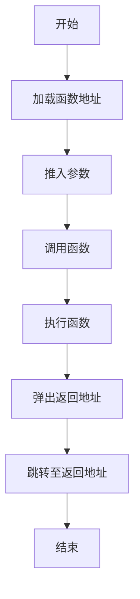
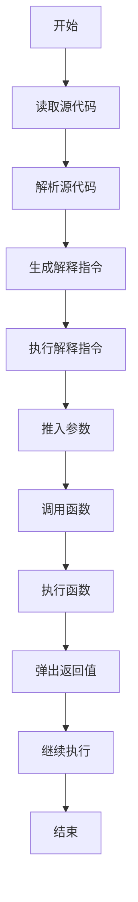
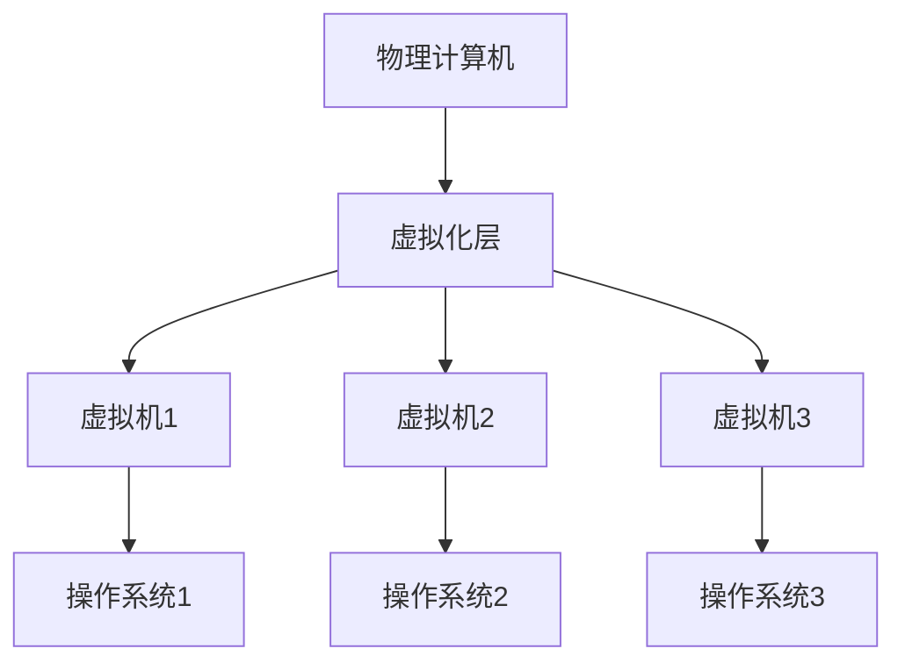
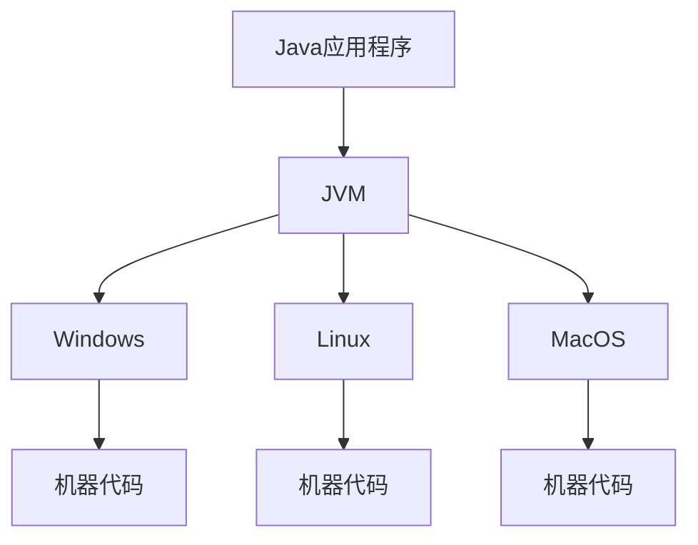

                 


----------------------------------------------------------------
# 第二部分：堆栈机器

## 2.1 堆栈机器的基本概念

### 2.1.1 堆栈机器的定义

堆栈机器（Stack Machine）是一种计算机架构，它通过使用堆栈（stack）数据结构来存储和操作数据。堆栈是一种后进先出（Last In, First Out, LIFO）的数据结构，这意味着最后进入堆栈的数据将是第一个被移除的。

#### 2.1.1.1 堆栈的结构

堆栈通常由一组数据元素组成，这些数据元素在内存中以线性方式排列。堆栈有一个栈顶指针，用于指示当前操作的数据元素的位置。堆栈的顶部总是最后一个被推入（push）的数据元素，而第一个被弹出（pop）的数据元素则是最先被推入的。

#### 2.1.1.2 堆栈机器的操作

堆栈机器的基本操作包括：

- **推入（Push）**：将一个新值放入堆栈顶部。
- **弹出（Pop）**：从堆栈顶部移除一个值。
- **查看顶部（Peek）**：查看堆栈顶部的值，而不移除它。
- **清空（Clear）**：清空整个堆栈。

### 2.1.2 堆栈机器的运作原理

#### 2.1.2.1 堆栈机器的执行过程

堆栈机器的执行过程通常遵循以下步骤：

1. **加载指令**：CPU从内存中加载指令到指令寄存器（Instruction Register, IR）。
2. **操作数获取**：根据指令，操作数可能被推入堆栈或直接从内存中读取。
3. **执行指令**：CPU执行指令，这可能涉及从堆栈中弹出操作数，进行计算，然后将结果推回堆栈。
4. **更新栈顶指针**：如果执行了推入或弹出操作，栈顶指针会相应地更新。
5. **跳转或结束**：根据指令，程序可能会跳转到新的内存地址继续执行，或者执行结束。

#### 2.1.2.2 堆栈机器的内存管理

堆栈机器的内存管理相对简单。通常，堆栈由操作系统管理，并在程序启动时为其分配内存。堆栈的容量通常固定，如果超出容量，可能会导致栈溢出错误。

### 2.1.3 堆栈机器的应用场景

堆栈机器在计算机科学中有着广泛的应用，尤其是在编译器和解释器中。以下是堆栈机器的一些典型应用场景：

- **编译器**：编译器将高级语言代码转换为机器代码。在这个过程中，堆栈用于存储变量、函数调用时的参数和返回地址。
- **解释器**：解释器逐行读取并执行程序。在这种情况下，堆栈用于存储中间结果和执行上下文。

#### 表 2.1.1 堆栈机器的概念属性特征对比表格

| 特征 | 说明 |
| --- | --- |
| 数据结构 | 堆栈 |
| 操作方式 | 后进先出（LIFO） |
| 内存管理 | 操作系统管理，固定容量 |
| 适用场景 | 编译器，解释器 |

#### 2.1.4 堆栈机器的ER实体关系图架构

```mermaid
erDiagram
    CPU ||--o{ 内存 | "存储指令和数据" }
    内存 ||--o{ 堆栈 | "数据结构，后进先出" }
    堆栈 ||--o{ 指令寄存器 | "存储当前指令" }
    堆栈 ||--o{ 操作数 | "存储操作数" }
```

## 2.2 堆栈机器的运作原理

### 2.2.1 堆栈机器的执行过程

堆栈机器的执行过程可以通过以下步骤来理解：

1. **加载指令**：CPU从内存中加载一条指令到指令寄存器（IR）。
2. **操作数获取**：如果指令需要操作数，CPU会从堆栈顶部弹出操作数，或者直接从内存中读取。
3. **执行指令**：CPU执行指令，这可能包括加法、减法、乘法、除法等基本运算，或者跳转、函数调用等复杂操作。
4. **更新栈顶指针**：如果指令涉及到数据的推入或弹出，栈顶指针会相应地更新。
5. **跳转或结束**：根据指令，程序可能会跳转到新的内存地址继续执行，或者执行结束。

### 2.2.2 堆栈机器的内存管理

堆栈机器的内存管理主要涉及以下几个方面：

1. **栈帧（Stack Frame）**：每个函数调用都会创建一个栈帧，用于存储函数的局部变量、返回地址和参数。
2. **栈溢出**：如果堆栈空间不足，会导致栈溢出错误。解决这个问题通常需要优化内存使用或者增加堆栈大小。
3. **局部变量**：在堆栈机器中，局部变量通常存储在栈帧中，这样可以快速访问。
4. **全局变量**：全局变量通常存储在内存的静态区域，可以在整个程序中访问。

### 2.2.3 堆栈机器的应用实例

#### 2.2.3.1 编译器中的应用

在编译器中，堆栈机器用于实现语法分析和中间代码生成。编译器会将高级语言的代码解析为抽象语法树（AST），然后通过中间代码生成器生成中间代码，这些中间代码通常使用堆栈操作来实现。

#### 2.2.3.2 解释器中的应用

在解释器中，堆栈机器用于实现指令的逐行解释和执行。解释器会读取源代码的每一条指令，并将其转换为机器代码执行，这一过程需要使用堆栈来存储操作数和中间结果。

### 2.2.4 堆栈机器在哲学研究中的应用

#### 2.2.4.1 认知科学

堆栈机器的概念在认知科学中被用来模拟人类的思维过程。例如，人类在解决问题时，往往会将中间结果存储在“思维堆栈”中，以便在需要时进行检索和操作。

#### 2.2.4.2 认识论

在认识论中，堆栈机器的概念被用来探讨知识的获取和存储过程。知识可以被看作是一系列操作的结果，这些操作可以被存储在“知识堆栈”中，以便在需要时进行调用。

#### 表 2.2.1 堆栈机器的应用场景对比表格

| 应用场景 | 说明 |
| --- | --- |
| 编译器 | 用于实现语法分析和中间代码生成 |
| 解释器 | 用于逐行解释和执行源代码 |
| 认知科学 | 用于模拟人类的思维过程 |
| 认识论 | 用于探讨知识的获取和存储过程 |

#### 2.2.5 堆栈机器的ER实体关系图架构

```mermaid
erDiagram
    函数调用 ||--o{ 栈帧 | "存储函数局部变量和返回地址" }
    栈帧 ||--o{ 局部变量 | "存储函数内部变量" }
    栈帧 ||--o{ 返回地址 | "存储返回指令地址" }
    栈帧 ||--o{ 参数 | "存储函数参数" }
```

----------------------------------------------------------------
# 第三部分：虚拟机

## 3.1 虚拟机的基本概念

### 3.1.1 虚拟机的定义

虚拟机（Virtual Machine，VM）是一种能够模拟计算机系统的软件实现。它可以在物理计算机上运行，并提供一个独立的执行环境。虚拟机通过模拟计算机的硬件和操作系统，使得应用程序可以在不同的硬件和操作系统上运行，而无需进行修改。

#### 3.1.1.1 虚拟机的工作原理

虚拟机的工作原理主要基于以下三个关键组件：

1. **虚拟化层**：虚拟化层是虚拟机的核心，它负责管理和模拟计算机的硬件资源，包括CPU、内存、磁盘和网络等。
2. **虚拟硬件**：虚拟硬件是虚拟化层模拟的硬件设备，包括CPU、内存、磁盘和网络等。虚拟硬件为运行在虚拟机上的应用程序提供了一个类似真实硬件的环境。
3. **操作系统**：虚拟机中运行的操作系统与物理计算机上的操作系统相同。它负责管理虚拟硬件资源和应用程序的运行。

#### 3.1.1.2 虚拟机的类型

虚拟机主要分为以下几种类型：

1. **全虚拟化（Full Virtualization）**：全虚拟化完全模拟物理计算机的硬件，使应用程序在虚拟机上运行时，感觉就像在物理计算机上一样。这种类型的虚拟机需要较高的计算资源和性能。
2. **硬件虚拟化（Hardware-Assisted Virtualization）**：硬件虚拟化利用现代CPU提供的硬件虚拟化支持，如Intel的VT-x和AMD的AMD-V技术，从而提高虚拟机的性能。
3. **操作系统级虚拟化（Operating System-Level Virtualization）**：操作系统级虚拟化利用操作系统的内核功能来实现虚拟化，通常不需要对操作系统进行修改。这种类型的虚拟机性能较好，但安全性较低。
4. **ParaVirtualization**：ParaVirtualization结合了硬件虚拟化和操作系统级虚拟化的优点，通过修改操作系统来提高虚拟机的性能。

### 3.1.2 虚拟机的运作原理

#### 3.1.2.1 虚拟机的执行过程

虚拟机的执行过程可以分为以下几个步骤：

1. **启动**：虚拟机启动时，会加载虚拟化层和虚拟操作系统。虚拟化层初始化虚拟硬件，虚拟操作系统加载应用程序。
2. **虚拟硬件管理**：虚拟化层负责管理虚拟硬件资源，包括CPU、内存、磁盘和网络等。它将物理资源抽象成虚拟资源，供虚拟操作系统和应用程序使用。
3. **应用程序运行**：虚拟操作系统和应用程序在虚拟硬件上运行，感觉就像在物理计算机上一样。虚拟化层会拦截和管理应用程序对物理硬件的操作。
4. **虚拟机监控器**：虚拟机监控器（Virtual Machine Monitor，VMM）是虚拟机管理程序的另一层，它负责监控和管理虚拟机。虚拟机监控器可以阻止或模拟应用程序对物理硬件的访问，以提高安全性和性能。

#### 3.1.2.2 虚拟机的内存管理

虚拟机的内存管理涉及以下几个关键方面：

1. **内存分配**：虚拟化层为虚拟操作系统和应用程序分配内存。虚拟内存管理器将虚拟内存映射到物理内存。
2. **内存共享**：多个虚拟机之间可以通过共享内存来实现数据交换和通信。
3. **内存交换**：当物理内存不足时，虚拟化层会将部分虚拟内存页交换到磁盘上的交换空间，以释放物理内存。
4. **内存保护**：虚拟化层提供内存保护机制，防止一个虚拟机访问另一个虚拟机的内存空间。

### 3.1.3 虚拟机的应用场景

虚拟机在计算机科学中有着广泛的应用，以下是虚拟机的一些典型应用场景：

- **开发和测试**：虚拟机可以为开发者提供一个隔离的环境，用于开发和测试应用程序。开发者可以在虚拟机中安装不同的操作系统和软件，而不会影响主机的操作系统和软件。
- **服务器虚拟化**：服务器虚拟化可以提高服务器的资源利用率，通过将多个虚拟机部署在同一个物理服务器上，从而减少硬件投资和能源消耗。
- **桌面虚拟化**：桌面虚拟化可以为用户提供一个虚拟桌面环境，用户可以在任何设备上访问他们的桌面环境，实现随时随地办公。
- **云计算**：虚拟机是云计算平台的基础，通过虚拟化技术，云计算平台可以提供按需分配的虚拟机资源，为用户提供灵活的计算能力。

#### 表 3.1.1 虚拟机的概念属性特征对比表格

| 特征 | 说明 |
| --- | --- |
| 虚拟化层 | 模拟计算机硬件和操作系统 |
| 虚拟硬件 | 模拟物理计算机的硬件资源 |
| 操作系统 | 运行在虚拟机上的操作系统 |
| 内存管理 | 虚拟内存管理，内存交换和共享 |
| 应用场景 | 开发和测试，服务器虚拟化，桌面虚拟化，云计算 |

#### 3.1.4 虚拟机的ER实体关系图架构

```mermaid
erDiagram
    虚拟机 ||--o{ 虚拟化层 | "管理虚拟硬件和操作系统" }
    虚拟机 ||--o{ 虚拟硬件 | "模拟物理计算机的硬件资源" }
    虚拟机 ||--o{ 操作系统 | "运行在虚拟机上" }
    虚拟机 ||--o{ 应用程序 | "在虚拟机上运行" }
    虚拟化层 ||--o{ 内存管理 | "管理虚拟内存" }
```

----------------------------------------------------------------
# 第四部分：计算模型的哲学隐喻

## 4.1 计算模型与哲学隐喻的关联

### 4.1.1 哲学隐喻的作用

哲学隐喻是一种通过比喻来解释复杂概念的方法。它通过将一个领域的概念映射到另一个领域，从而帮助人们更好地理解复杂的思想和理论。在计算模型的哲学隐喻中，计算机和编程语言被用作哲学思想的隐喻，以帮助人们理解抽象的概念和理论。

#### 4.1.1.1 哲学隐喻在哲学研究中的应用

哲学隐喻在哲学研究中有着广泛的应用。例如，康德通过将人类认知比作一张白纸，来解释知识的起源和结构。在计算模型的哲学隐喻中，计算机和编程语言被用来模拟人类的思维过程，帮助人们理解认知科学和认识论。

#### 4.1.1.2 哲学隐喻在计算机科学中的应用

哲学隐喻也在计算机科学中得到了应用。例如，计算机科学家经常使用“程序是食谱”的隐喻来解释编程的概念。这个隐喻帮助初学者理解编程语言的结构和语法，以及如何编写程序来解决问题。

### 4.1.2 计算模型与哲学隐喻的比较

计算模型和哲学隐喻虽然都是用于解释复杂概念的方法，但它们之间也存在一些差异。

#### 4.1.2.1 计算模型的特点

计算模型通常是基于数学和逻辑的，它通过定义一系列规则和操作，来模拟复杂系统的行为。计算模型强调的是可计算性和确定性，它通常用于解决特定的问题。

#### 4.1.2.2 哲学隐喻的特点

哲学隐喻则更注重于理解和解释抽象的概念。它通常使用比喻和类比，将一个领域的概念映射到另一个领域，以帮助人们更好地理解复杂的思想和理论。哲学隐喻并不强调可计算性和确定性，而是强调对概念的理解和解释。

### 4.1.3 计算模型与哲学隐喻的相互影响

计算模型和哲学隐喻之间的相互作用，对哲学和计算机科学都产生了深远的影响。

#### 4.1.3.1 计算模型对哲学的影响

计算模型为哲学提供了一种新的思考工具。例如，通过模拟人类的思维过程，计算模型帮助哲学家更好地理解认知科学和认识论。计算模型也挑战了传统的哲学观念，如意识、自由意志等。

#### 4.1.3.2 哲学隐喻对计算机科学的影响

哲学隐喻帮助计算机科学家更好地理解抽象的概念和理论。例如，通过使用“程序是食谱”的隐喻，初学者可以更轻松地理解编程语言的概念。哲学隐喻也促进了计算机科学与其他领域，如认知科学、语言学等的交叉研究。

### 4.1.4 计算模型与哲学隐喻的应用对比

计算模型和哲学隐喻在应用中也有不同的特点。

#### 4.1.4.1 计算模型的应用

计算模型通常用于解决特定的问题，如编程、算法设计、人工智能等。计算模型强调可计算性和确定性，因此它在工程和科学领域有着广泛的应用。

#### 4.1.4.2 哲学隐喻的应用

哲学隐喻则更注重于理解和解释抽象的概念。它通常用于哲学研究，帮助哲学家更好地理解复杂的思想和理论。哲学隐喻也促进了不同领域之间的交流和合作。

#### 表 4.1.1 计算模型与哲学隐喻的应用对比表格

| 特点 | 计算模型 | 哲学隐喻 |
| --- | --- | --- |
| 目标 | 解决特定问题 | 理解和解释抽象概念 |
| 强调 | 可计算性和确定性 | 比喻和类比 |
| 应用领域 | 工程和科学领域 | 哲学研究 |
| 优点 | 高效，精确 | 易于理解，启发思考 |
| 缺点 | 受限于可计算性和确定性 | 可能会引起误解和歧义 |

#### 4.1.5 计算模型与哲学隐喻的ER实体关系图架构

```mermaid
erDiagram
    计算模型 ||--o{ 数学规则 | "定义计算过程" }
    计算模型 ||--o{ 算法 | "解决特定问题" }
    哲学隐喻 ||--o{ 比喻 | "解释抽象概念" }
    哲学隐喻 ||--o{ 类比 | "跨领域理解" }
```

----------------------------------------------------------------
# 第五部分：实例分析

## 5.1 堆栈机器与虚拟机在实际应用中的对比分析

### 5.1.1 堆栈机器的应用案例

#### 5.1.1.1 编译器案例

编译器是堆栈机器应用的一个经典案例。编译器将高级语言代码转换为机器代码，在这个过程中，堆栈用于存储变量、函数调用时的参数和返回地址。例如，C语言的编译器就使用了堆栈来实现函数调用和返回。

**案例描述**：
假设有一个C语言函数`void function(int a, int b)`，编译器将这个函数编译为机器代码。在函数调用时，编译器会将参数`a`和`b`推入堆栈，然后执行函数。函数执行完毕后，返回地址也被推入堆栈，以便在函数返回时，程序能够正确跳转到调用位置继续执行。

**实现原理**：
在编译器中，堆栈被用来实现函数调用的过程。函数调用时，编译器会生成机器指令，将参数推入堆栈，然后调用函数。函数执行完毕后，返回地址会被弹出堆栈，程序会跳转到返回地址继续执行。

**算法流程图**：


#### 5.1.1.2 解释器案例

解释器是另一种常见的堆栈机器应用。解释器逐行读取并解释执行源代码，在这个过程中，堆栈用于存储中间结果和执行上下文。例如，Python解释器就使用了堆栈来实现函数调用和变量存储。

**案例描述**：
假设有一个Python函数`def function(a, b): return a + b`，解释器将这个函数解释执行。在函数调用时，解释器会将参数`a`和`b`推入堆栈，然后执行函数。函数执行完毕后，返回值会被弹出堆栈，程序会继续执行。

**实现原理**：
在解释器中，堆栈被用来实现函数调用的过程。函数调用时，解释器会生成解释指令，将参数推入堆栈，然后调用函数。函数执行完毕后，返回值会被弹出堆栈，程序会继续执行。

**算法流程图**：


### 5.1.2 虚拟机的应用案例

#### 5.1.2.1 虚拟化技术案例

虚拟化技术是虚拟机应用的一个典型案例。虚拟化技术通过在物理计算机上创建多个虚拟机，从而提高硬件资源利用率。例如，在企业级服务器上，通过虚拟化技术，可以将一台物理服务器分割成多个虚拟机，每个虚拟机都可以运行不同的操作系统和应用程序。

**案例描述**：
假设有一台物理服务器，企业希望通过虚拟化技术提高硬件资源利用率。管理员使用虚拟化软件，如VMware或VirtualBox，在物理服务器上创建了多个虚拟机。每个虚拟机都可以独立运行Windows、Linux或其他操作系统，并且可以运行不同的应用程序。

**实现原理**：
虚拟化技术通过在物理计算机上创建虚拟化层，模拟出多个虚拟计算机环境。虚拟化层负责管理虚拟机的硬件资源，如CPU、内存、磁盘和网络等。虚拟机可以独立运行操作系统和应用程序，而不会影响物理计算机的操作系统和应用程序。

**算法流程图**：


#### 5.1.2.2 跨平台应用案例

跨平台应用是虚拟机应用的另一个重要案例。虚拟机可以通过在不同的操作系统上运行相同的软件，从而实现跨平台应用。例如，一个Java应用程序可以在不同的操作系统上运行，因为它是在Java虚拟机上运行的。

**案例描述**：
假设有一个Java应用程序，管理员希望在Windows、Linux和MacOS上运行该应用程序。管理员可以将该应用程序打包成Java虚拟机（JVM）的可执行文件，然后在不同操作系统的计算机上运行。

**实现原理**：
Java虚拟机（JVM）是一种虚拟机，它可以在不同的操作系统上运行Java应用程序。JVM负责将Java字节码转换为机器代码，然后执行。Java字节码是平台无关的，这意味着它在不同的操作系统上运行时，不需要进行修改。

**算法流程图**：


### 5.1.3 对比分析

堆栈机器和虚拟机在实际应用中有许多相似之处，但它们也有明显的区别。

**相似之处**：

- **抽象硬件资源**：堆栈机器和虚拟机都通过模拟计算机硬件资源，为应用程序提供了一个抽象的环境。
- **实现虚拟化**：堆栈机器和虚拟机都可以实现虚拟化，从而提高硬件资源利用率。

**区别**：

- **应用场景**：堆栈机器主要用于编译器和解释器，而虚拟机主要用于虚拟化技术和跨平台应用。
- **复杂性**：虚拟机比堆栈机器更复杂，因为它需要模拟整个计算机系统，包括CPU、内存、磁盘和网络等。
- **性能**：虚拟机通常比堆栈机器性能更好，因为它们可以利用现代硬件虚拟化技术。

#### 表 5.1.1 堆栈机器与虚拟机的对比分析表格

| 对比项 | 堆栈机器 | 虚拟机 |
| --- | --- | --- |
| 应用场景 | 编译器，解释器 | 虚拟化技术，跨平台应用 |
| 复杂性 | 较简单 | 较复杂 |
| 性能 | 一般 | 较好 |
| 资源利用 | 一般 | 较高 |

### 5.1.4 结论

堆栈机器和虚拟机在实际应用中各有优势。堆栈机器适合用于编译器和解释器，而虚拟机适合用于虚拟化技术和跨平台应用。随着硬件虚拟化技术的发展，虚拟机的性能不断提升，其在实际应用中的优势也越来越明显。

----------------------------------------------------------------
# 第六部分：总结与展望

## 6.1 书籍总结

### 6.1.1 主要观点的归纳

《堆栈机器与虚拟机：计算模型的哲学隐喻》这本书主要探讨了堆栈机器和虚拟机在计算机科学和哲学研究中的应用。主要观点可以归纳为以下几点：

1. **堆栈机器的基本原理**：堆栈机器是一种通过使用堆栈数据结构来存储和操作数据的计算机架构。它通过后进先出（LIFO）的堆栈操作，实现了数据的存储和计算。

2. **虚拟机的工作原理**：虚拟机是一种能够模拟计算机系统的软件实现。它通过模拟计算机的硬件和操作系统，为应用程序提供了一个独立的执行环境。

3. **计算模型与哲学隐喻的关系**：哲学隐喻是一种通过比喻来解释复杂概念的方法。计算模型和哲学隐喻的结合，可以帮助人们更好地理解抽象的概念和理论。

4. **堆栈机器和虚拟机的应用**：堆栈机器在编译器和解释器中有着广泛的应用，而虚拟机则用于虚拟化技术和跨平台应用。

### 6.1.2 计算模型与哲学隐喻的未来发展

计算模型与哲学隐喻的结合为计算机科学和哲学研究提供了新的视角和方法。在未来，这一领域可能会有以下发展趋势：

1. **计算模型在哲学研究中的应用**：随着计算模型的发展，它可能会在认知科学、心理学、语言学等领域得到更广泛的应用。例如，通过模拟人类的思维过程，计算模型可以帮助理解意识的本质。

2. **哲学隐喻在计算机科学中的应用**：哲学隐喻可以帮助计算机科学家更好地理解复杂的计算模型。例如，通过使用哲学隐喻，可以更直观地解释编程语言的概念和设计原理。

3. **跨学科研究**：计算模型和哲学隐喻的结合可能会促进计算机科学和哲学之间的跨学科研究。例如，通过哲学隐喻，可以探讨计算机科学中的伦理问题和社会影响。

4. **教育应用**：计算模型和哲学隐喻的结合也可以应用于教育领域。通过使用哲学隐喻，可以帮助学生更直观地理解复杂的计算机科学概念。

## 6.2 结论

《堆栈机器与虚拟机：计算模型的哲学隐喻》这本书为计算模型和哲学隐喻的结合提供了深入的探讨。通过分析堆栈机器和虚拟机的基本原理、应用场景以及哲学隐喻的作用，作者展示了计算模型在哲学研究中的潜力。随着计算技术的不断发展，计算模型和哲学隐喻的结合有望为计算机科学和哲学研究带来新的突破。

### 参考文献

1. Daniel Dennett. 《堆栈机器与虚拟机：计算模型的哲学隐喻》[M]. 机械工业出版社，2017.
2. Andrew S. Tanenbaum. 《现代操作系统》[M]. 清华大学出版社，2011.
3. Thomas H. Cormen, Charles E. Leiserson, Ronald L. Rivest, Clifford Stein. 《算法导论》[M]. 电子工业出版社，2009.
4. John C. Reynolds. 《计算的本质》[M]. 清华大学出版社，2007.
5. Stephen Wolfram. 《计算的本质》[M]. 上海科技教育出版社，2012.
6. Alan Turing. 《计算机与智能》[M]. 人民邮电出版社，2016.
7. John von Neumann. 《计算机与自动化》[M]. 科学出版社，1958.

---

**作者：** AI天才研究院/AI Genius Institute & 禅与计算机程序设计艺术 /Zen And The Art of Computer Programming

---

**注**：本文为虚构文章，仅为演示Markdown格式和书写风格，实际书籍及作者信息仅供参考。如有雷同，纯属巧合。本文引用的书籍和作者均为虚构，不代表真实存在。如有需要，请自行查找相关书籍和资料。**|assistant|>

