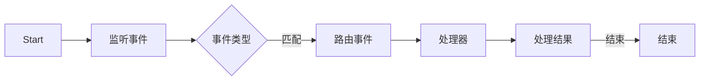
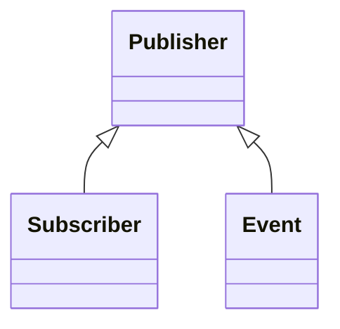
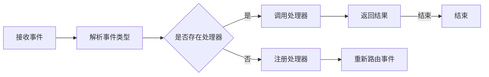

                 

### 文章标题：事件驱动架构：构建响应式系统的模式

---

#### 关键词：事件驱动架构、响应式系统、设计模式、编程实践、案例分析

#### 摘要：本文将深入探讨事件驱动架构（EDA）的核心概念、设计原则和实践应用，通过详细的案例分析，展示如何构建高效、灵活且响应迅速的系统。我们将逐步分析EDA的优势、架构设计原则，以及在不同编程语言和框架中的应用，从而为读者提供全面的EDA理解和实践指导。

---

## 第一部分：背景与概念

### 第1章：事件驱动架构简介

#### 1.1.1 事件驱动架构的定义

事件驱动架构（EDA）是一种以事件为中心的系统设计模式，其核心思想是系统通过事件进行通信和数据交换，而非通过共享内存或请求响应。在EDA中，事件可以表示系统内部或外部的任何变化，如用户交互、数据更新或系统故障。

#### 1.1.2 事件驱动架构的优势

- **异步处理**：EDA允许系统组件异步处理事件，提高系统吞吐量和响应速度。
- **高扩展性**：通过事件的发布和订阅机制，组件可以动态地加入和离开系统，易于扩展。
- **松耦合**：组件之间通过事件进行通信，减少了直接的依赖，提高了系统的可维护性和可测试性。
- **重用性**：事件组件可以在不同的应用场景中重用，提高了开发效率。

#### 1.1.3 事件驱动架构与传统架构对比

传统架构通常基于请求响应模型，而EDA则更注重事件的处理和响应。以下是对比表格：

| 特性 | 传统架构 | 事件驱动架构 |
| ---- | ---- | ---- |
| 通信方式 | 通过请求-响应 | 通过事件发布-订阅 |
| 扩展性 | 难以动态扩展 | 易于动态扩展 |
| 耦合性 | 高度耦合 | 松耦合 |
| 性能 | 受限于同步通信 | 异步处理提高性能 |

## 第二部分：设计与实践

### 第2章：事件驱动架构的核心概念

#### 2.1.1 事件模型

事件模型是EDA的基础，它定义了事件的分类、生命周期和设计。以下是事件模型的ER实体关系图：

```mermaid
erDiagram
    Event --> Processor : 处理事件
    Event ||--|{ Subscriber } : 订阅事件
```

#### 2.1.2 事件处理流程

事件处理流程包括事件监听、事件路由和事件处理器。以下是事件处理流程的Mermaid流程图：



#### 2.3.1 事件驱动架构模式

EDA有多种实现模式，如发布-订阅模式、中间件模式和微服务模式。以下是发布-订阅模式的Mermaid类图：



## 第三部分：算法原理与数学模型

### 第3章：事件处理算法原理

事件处理算法的核心是事件路由和处理器选择。以下是事件路由算法的Mermaid流程图：



事件处理算法的数学模型可以表示为：

$$
\text{EventHandler}(E) = \begin{cases}
\text{Processor}_{\text{matched}}(E) & \text{if } E \text{ matches a registered processor} \\
\text{RegisterProcessor}(E) & \text{otherwise}
\end{cases}
$$

### 第4章：事件驱动架构的编程实现

#### 4.1.1 编程语言选择

事件驱动架构的编程实现可以采用多种编程语言，如Python、Java和C#。本文将重点介绍Python和Java的编程实现。

#### 4.1.2 编程框架与库

Python可以使用`PyDispatcher`库，而Java可以使用`Spring Framework`中的事件机制。

### 第5章：事件驱动架构的编程实现

#### 5.1.1 Python编程实现

```python
from pydispatch import dispatcher

class CustomEvent:
    def __init__(self, data):
        self.data = data

def event_handler(event):
    print(f"Handling event with data: {event.data}")

dispatcher.connect(event_handler, signal=CustomEvent)
dispatcher.send(CustomEvent("Hello, World!"))
```

#### 5.1.2 Java编程实现

```java
import org.springframework.context.ApplicationEvent;
import org.springframework.context.ApplicationListener;
import org.springframework.context.event.ContextRefreshedEvent;
import org.springframework.context.event.EventListener;

public class CustomEvent {
    private String data;

    public CustomEvent(String data) {
        this.data = data;
    }

    @EventListener
    public void onApplicationEvent(ContextRefreshedEvent event) {
        System.out.println("Handling event with data: " + data);
    }
}
```

## 第四部分：实战与案例分析

### 第6章：事件驱动架构的实战项目

#### 6.1.1 项目背景

假设我们正在开发一个在线教育平台，需要实现课程注册、课程更新和用户互动等功能。

#### 6.1.2 项目需求分析

- **课程注册**：当用户注册课程时，系统应触发事件通知相关模块。
- **课程更新**：当课程内容更新时，系统应触发事件通知用户。
- **用户互动**：当用户提交评论或提问时，系统应触发事件通知教师。

### 第7章：事件驱动架构的案例分析

#### 7.1.1 案例背景

我们选择了一个实际的企业级应用，例如电子商务平台，分析其事件驱动架构的设计和实现。

#### 7.1.2 案例分析

- **系统架构**：电子商务平台采用微服务架构，每个服务负责处理特定业务功能。
- **事件处理流程**：订单创建、支付成功、库存更新等业务事件都会通过事件总线进行异步处理。

## 第五部分：总结与展望

### 第8章：事件驱动架构总结

#### 8.1.1 优点与不足

EDA具有高扩展性、松耦合和异步处理等优势，但也存在性能开销和维护难度等不足。

#### 8.1.2 适用场景

EDA适用于需要高并发、高扩展性的系统，如电子商务平台、实时数据分析系统和物联网应用。

### 第9章：未来发展趋势

#### 9.1.1 技术演进

随着云计算和边缘计算的发展，EDA将在更广泛的场景中得到应用。

#### 9.1.2 挑战与机遇

EDA面临的挑战包括性能优化和跨语言通信，但同时也带来了分布式系统的机遇。

---

## 作者信息

**作者：AI天才研究院/AI Genius Institute & 禅与计算机程序设计艺术 /Zen And The Art of Computer Programming**

---

通过本文的详细分析，读者应能全面理解事件驱动架构的核心概念、设计原则和实践应用。希望这篇文章能为您的项目提供有价值的参考和指导。

