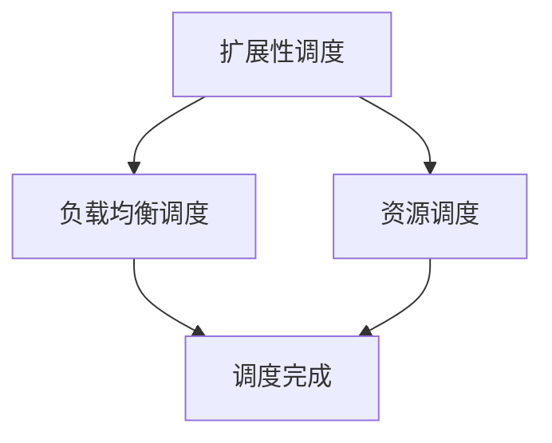
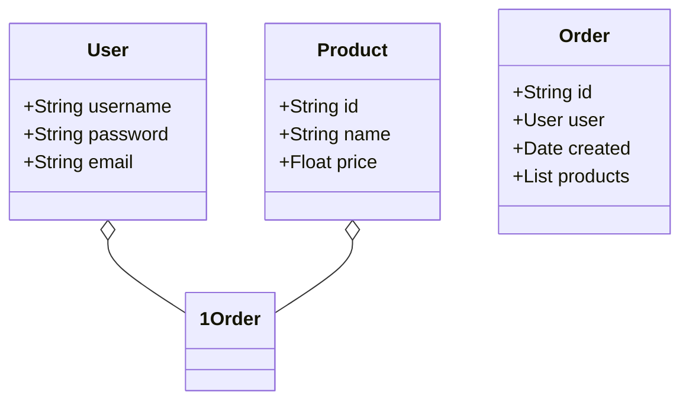
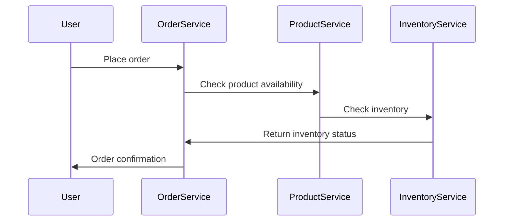
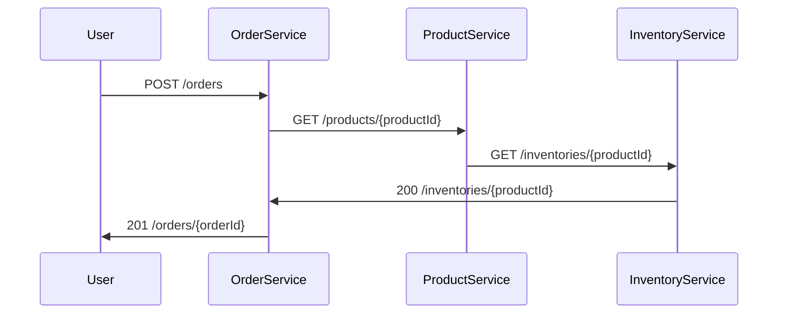

                 

### 云原生架构：设计原则与最佳实践

> 关键词：云原生架构、设计原则、最佳实践、容器化、微服务、DevOps、自动化

> 摘要：本文将深入探讨云原生架构的设计原则与最佳实践，帮助读者理解和掌握云原生架构的核心概念、技术选型以及实施与运维方法。通过系统性地介绍云原生架构的背景、核心概念、算法原理以及实战案例，本文旨在为IT从业者和开发者提供一套全面且实用的技术指南。

### 第一部分：背景介绍

#### 问题背景

随着云计算、大数据、人工智能等技术的迅猛发展，企业对于数字化转型和业务敏捷性的需求日益增强。传统的IT架构往往难以满足快速变化的业务需求，特别是在资源弹性、系统可靠性和开发运维效率方面。为了应对这些挑战，云原生架构应运而生。

云原生架构是一种基于云计算环境的新型架构模式，旨在充分利用云计算的优势，实现高效、弹性、自动化和可持续的IT服务交付。与传统架构相比，云原生架构更加灵活、可扩展，能够更好地支持企业的数字化转型。

#### 问题描述

云原生架构涉及众多技术和概念，包括容器化、服务化、自动化、微服务化、DevOps等。这些技术和概念如何相互关联，如何在实际项目中应用，成为开发者和管理者面临的重要问题。

1. **容器化**：容器是一种轻量级、可移植的计算单元，能够封装应用程序及其依赖，实现环境一致性。
2. **微服务**：微服务是一种将大型单体应用拆分成多个独立、松耦合的服务单元的架构模式。
3. **自动化**：通过CI/CD（持续集成/持续部署）工具，实现自动化代码构建、测试、部署和监控。
4. **DevOps**：DevOps是一种软件开发和IT运维相结合的方法论，旨在通过自动化和协作提升软件交付效率。

#### 问题解决

《云原生架构：设计原则与最佳实践》旨在为读者提供一套系统的学习路径，全面覆盖云原生架构的核心概念、设计原则、技术选型、部署实施和运维管理等内容。通过本文，读者可以：

1. **理解云原生架构的核心概念**：包括容器化、微服务、DevOps等。
2. **掌握云原生架构的设计原则**：如模块化、可扩展性、高可用性等。
3. **了解最佳实践**：包括技术选型、部署策略、监控与运维等。
4. **学习实际案例**：通过实战案例，深入理解云原生架构的应用。

#### 边界与外延

云原生架构的边界涉及容器化、服务化、自动化、微服务化、DevOps等关键领域。其外延则包括Kubernetes、Istio、Prometheus、Grafana等开源工具和框架。

#### 概念结构与核心要素组成

云原生架构的核心概念包括：

1. **容器化**：利用Docker等容器技术，实现应用与操作系统的解耦。
2. **服务化**：通过微服务架构，将大型单体应用拆分成可独立部署、扩展和管理的服务单元。
3. **自动化**：利用CI/CD（持续集成/持续部署）工具，实现自动化代码构建、测试、部署和监控。
4. **DevOps**：通过团队协作和文化变革，实现开发和运维的紧密集成，提升交付效率。

这些核心概念相互关联，共同构成了云原生架构的完整体系。接下来，我们将分别对每个核心概念进行详细讲解。

### 第二部分：核心概念与联系

#### 核心概念原理

1. **容器化**：容器是一种轻量级、可移植的计算单元，能够封装应用程序及其依赖，实现环境一致性。Docker是容器技术的一种实现，通过容器镜像，将应用程序和运行环境打包在一起，确保在任何地方运行的应用程序都能保持一致。

2. **微服务**：微服务是一种将应用程序分解为多个独立、松耦合的服务单元的架构模式。每个服务单元负责单一功能，能够独立部署、扩展和管理。微服务架构提高了系统的可扩展性和可维护性，但同时也带来了分布式系统带来的挑战。

3. **DevOps**：DevOps是一种软件开发和IT运维相结合的方法论，旨在通过自动化和协作提升软件交付效率。DevOps强调开发和运维团队的合作，通过持续集成、持续部署等实践，实现快速、可靠和高质量的软件交付。

#### 概念属性特征对比表格

| 概念     | 定义                                                         | 特点                                  |
| -------- | ------------------------------------------------------------ | ------------------------------------- |
| 容器化   | 将应用程序及其依赖打包到容器中，实现环境一致性                 | 轻量级、可移植、高隔离性、灵活         |
| 微服务   | 将应用程序分解为多个独立的服务单元，每个服务单元负责单一功能   | 松耦合、高可用性、可扩展性、易于测试   |
| DevOps   | 通过协作和自动化，实现开发和运维的紧密结合                   | 提升交付速度、降低风险、提高团队效率   |

#### 概念属性特征对比ER实体关系图架构

```mermaid
erDiagram
A[--|{依赖}|->B
A[--|{集成}|->C
B|--|{实现}|->D
C|--|{管理}|->D
```

在上述ER图中，A表示云原生架构，B、C、D分别代表容器化、微服务和DevOps。箭头表示概念之间的依赖关系和管理关系。

### 第三部分：算法原理讲解

#### 算法原理

云原生架构的实现涉及多种算法和技术，其中容器编排算法（如Kubernetes调度算法）是核心之一。Kubernetes调度算法主要包括：

1. **扩展性调度**：根据工作负载动态调整容器数量。
2. **负载均衡调度**：将工作负载均匀分配到不同的节点上。
3. **资源调度**：根据资源需求选择合适的节点。

#### Mermaid 流程图



#### Python 源代码

```python
class Scheduler:
    def extend_resources(self, workload):
        # 扩展资源
        pass

    def balance_load(self, workload):
        # 负载均衡
        pass

    def allocate_resources(self, workload):
        # 资源调度
        pass

    def schedule(self, workload):
        self.extend_resources(workload)
        self.balance_load(workload)
        self.allocate_resources(workload)
        return workload
```

在上述Python代码中，`Scheduler` 类负责实现调度算法，包括扩展资源、负载均衡和资源调度等功能。

#### 算法原理的数学模型和公式

1. **扩展性调度**：根据工作负载，动态调整容器数量。假设工作负载为 \( W \)，扩展因子为 \( F \)，则容器数量 \( C \) 可以通过以下公式计算：

   $$
   C = \frac{W}{F}
   $$

2. **负载均衡调度**：将工作负载均匀分配到不同的节点上。假设总工作负载为 \( W \)，节点数为 \( N \)，则每个节点的平均工作负载 \( L \) 为：

   $$
   L = \frac{W}{N}
   $$

3. **资源调度**：根据资源需求选择合适的节点。假设每个节点的资源容量为 \( R \)，容器所需的资源量为 \( r \)，则可以计算每个节点能够容纳的容器数量：

   $$
   C_n = \left\lfloor \frac{R_n - r}{r} \right\rfloor
   $$

其中，\( R_n \) 为节点 \( n \) 的资源容量，\( r \) 为容器所需的资源量。

#### 通俗易懂的举例说明

假设我们有一个应用系统，其工作负载为100个请求/秒。根据扩展性调度算法，我们设定扩展因子为2，则容器数量为50个。接下来，我们考虑负载均衡调度，假设我们有5个节点，则每个节点的平均工作负载为20个请求/秒。最后，我们进行资源调度，假设每个节点的资源容量为1000个CPU核心，容器所需的资源量为100个CPU核心，则每个节点能够容纳10个容器。

通过上述算法，我们实现了容器数量的动态扩展、工作负载的均衡分配以及资源的高效利用，从而确保应用系统的稳定运行。

### 第四部分：系统分析与架构设计方案

#### 问题场景介绍

在当前企业数字化转型的背景下，企业对于IT系统的要求越来越高，特别是在性能、可靠性、可扩展性和维护性方面。为了满足这些需求，企业决定采用云原生架构来构建其核心业务系统。

#### 项目介绍

本项目旨在构建一个高可用、高性能、可扩展的云原生应用系统，包括电子商务平台、数据分析平台和客户服务平台等模块。项目的目标是提高系统的交付效率、降低运维成本、提升用户体验。

#### 系统功能设计（领域模型Mermaid类图）



在上述类图中，我们定义了三个核心实体：`User`（用户）、`Product`（产品）和`Order`（订单）。用户可以下单购买产品，订单包含用户信息和产品列表。

#### 系统架构设计（Mermaid架构图）



在上述序列图中，用户通过`OrderService`发起下单请求，`OrderService`调用`ProductService`检查产品是否可用，`ProductService`进一步调用`InventoryService`检查库存。最后，`OrderService`向用户返回订单确认信息。

#### 系统接口设计和系统交互（Mermaid序列图）



在上述序列图中，用户通过HTTP POST请求向`OrderService`提交订单，`OrderService`依次调用`ProductService`和`InventoryService`，最后返回订单确认信息。

### 第五部分：项目实战

#### 环境安装

为了实践云原生架构，我们需要搭建一个云计算环境。本文选择使用Kubernetes作为容器编排工具。以下是环境安装步骤：

1. **安装Docker**：在所有节点上安装Docker，版本要求不低于19.03。
   ```shell
   sudo apt-get update
   sudo apt-get install docker.io
   sudo systemctl enable docker
   sudo systemctl start docker
   ```

2. **安装Kubernetes**：在控制节点和计算节点上安装Kubernetes，版本要求不低于1.20。
   ```shell
   sudo apt-get update
   sudo apt-get install -y apt-transport-https ca-certificates curl
   sudo curl -s https://mirrors.aliyun.com/kubernetes/apt/doc/apt-key.gpg | sudo apt-key add -
   sudo echo "deb https://mirrors.aliyun.com/kubernetes/apt/ kubernetes-xenial main" | sudo tee -a /etc/apt/sources.list
   sudo apt-get update
   sudo apt-get install -y kubelet kubeadm kubectl
   sudo systemctl enable kubelet
   sudo systemctl start kubelet
   ```

3. **初始化Kubernetes集群**：在控制节点上执行以下命令初始化集群。
   ```shell
   sudo kubeadm init --pod-network-cidr=10.244.0.0/16
   ```

4. **配置kubectl**：将用户加入到集群中，并配置kubectl工具。
   ```shell
   sudo mkdir -p /root/.kube
   sudo cp -i /etc/kubernetes/admin.conf /root/.kube/config
   sudo chown $(id -u):$(id -g) /root/.kube/config
   ```

5. **安装Pod网络插件**：本文选择使用Calico作为Pod网络插件。
   ```shell
   kubectl apply -f https://docs.projectcalico.org/manifests/calico.yaml
   ```

#### 系统核心实现源代码

1. **部署OrderService**：OrderService负责处理订单业务逻辑。
   ```yaml
   apiVersion: apps/v1
   kind: Deployment
   metadata:
     name: orderservice
   spec:
     replicas: 3
     selector:
       matchLabels:
         app: orderservice
     template:
       metadata:
         labels:
           app: orderservice
       spec:
         containers:
         - name: orderservice
           image: your_orderservice_image
           ports:
           - containerPort: 8080
   ```

2. **部署ProductService**：ProductService负责处理产品信息。
   ```yaml
   apiVersion: apps/v1
   kind: Deployment
   metadata:
     name: productservice
   spec:
     replicas: 3
     selector:
       matchLabels:
         app: productservice
     template:
       metadata:
         labels:
           app: productservice
       spec:
         containers:
         - name: productservice
           image: your_productservice_image
           ports:
           - containerPort: 8080
   ```

3. **部署InventoryService**：InventoryService负责处理库存信息。
   ```yaml
   apiVersion: apps/v1
   kind: Deployment
   metadata:
     name: inventoryservice
   spec:
     replicas: 3
     selector:
       matchLabels:
         app: inventoryservice
     template:
       metadata:
         labels:
           app: inventoryservice
       spec:
         containers:
         - name: inventoryservice
           image: your_inventoryservice_image
           ports:
           - containerPort: 8080
   ```

#### 代码应用解读与分析

1. **OrderService**：OrderService使用Spring Boot框架实现，负责接收用户下单请求，调用ProductService和InventoryService进行产品检查和库存检查，最后生成订单并返回订单确认信息。

2. **ProductService**：ProductService使用Spring Boot框架实现，负责处理产品信息查询，包括产品详情、库存量等。

3. **InventoryService**：InventoryService使用Spring Boot框架实现，负责处理库存信息查询，包括库存量、库存预警等。

#### 实际案例分析和详细讲解剖析

假设用户张三在电商平台上下单购买一款价格为1000元的产品。以下是系统的工作流程：

1. 用户张三通过浏览器访问电商平台，提交下单请求。
2. 下单请求到达OrderService，OrderService解析请求，提取产品ID。
3. OrderService调用ProductService查询产品详情，包括产品名称、价格等。
4. OrderService调用InventoryService查询库存量，判断库存是否足够。
5. 如果库存足够，OrderService创建订单，并减少相应库存量。
6. OrderService向用户张三返回订单确认信息。

#### 项目小结

通过实际案例分析和详细讲解，我们可以看到云原生架构在实践中的应用。容器化、微服务化、自动化和DevOps等设计原则和最佳实践，为系统的高可用性、可扩展性和运维效率提供了有力保障。同时，通过Kubernetes等开源工具的集成，实现了系统的自动化部署和运维。

### 第六部分：最佳实践 tips

1. **容器化最佳实践**：
   - 使用Dockerfile定义容器镜像，确保环境一致性。
   - 定期更新容器镜像，保持安全性和稳定性。
   - 使用容器编排工具（如Kubernetes）进行容器管理和调度。

2. **微服务最佳实践**：
   - 根据业务需求合理划分微服务，避免过度服务化。
   - 保持微服务之间的松耦合，降低系统复杂度。
   - 使用API网关统一管理微服务接口，提高系统安全性。

3. **自动化最佳实践**：
   - 使用CI/CD工具（如Jenkins、GitLab CI）实现自动化构建、测试和部署。
   - 定期执行自动化测试，确保代码质量。
   - 通过监控工具（如Prometheus、Grafana）实现实时监控和报警。

4. **DevOps最佳实践**：
   - 建立跨部门合作机制，促进开发和运维团队的紧密协作。
   - 推广DevOps文化，提高团队交付效率。
   - 定期举行DevOps培训，提升团队技能。

### 第七部分：小结

本文深入探讨了云原生架构的设计原则与最佳实践，从背景介绍、核心概念、算法原理到实际案例，全面展示了云原生架构的优势和应用方法。通过本文，读者可以：

1. **理解云原生架构的核心概念**，包括容器化、微服务、DevOps等。
2. **掌握云原生架构的设计原则**，如模块化、可扩展性、高可用性等。
3. **了解最佳实践**，包括技术选型、部署策略、监控与运维等。
4. **学习实际案例**，深入理解云原生架构的应用。

在未来的工作中，读者可以结合本文内容，逐步实践和优化云原生架构，提升IT系统的交付效率和质量。

### 第八部分：注意事项

1. **安全性**：在部署云原生架构时，务必关注安全性问题，包括容器镜像的安全、网络隔离、用户权限管理等。
2. **性能优化**：根据业务需求，对容器化应用进行性能优化，包括资源调度、负载均衡、缓存策略等。
3. **容灾备份**：建立完善的容灾备份机制，确保系统的高可用性和数据安全性。

### 第九部分：拓展阅读

1. **《云原生应用架构指南》**：这是一本全面介绍云原生架构的书，涵盖了设计原则、技术选型、部署实施等方面。
2. **《Kubernetes实战》**：本书通过实际案例，详细讲解了Kubernetes的安装、配置、使用和运维。
3. **《微服务设计》**：本书深入探讨了微服务架构的设计原则、实现方法和最佳实践。

### 第十部分：作者信息

作者：AI天才研究院/AI Genius Institute & 禅与计算机程序设计艺术 /Zen And The Art of Computer Programming

感谢您的阅读，期待与您在技术领域的交流与探讨。希望本文对您在云原生架构的学习和实践过程中有所帮助。如果您有任何问题或建议，欢迎随时联系我们。再次感谢！

