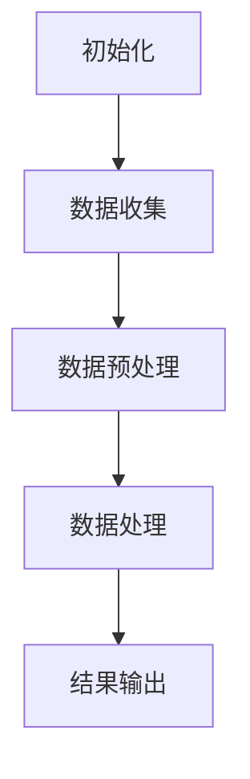
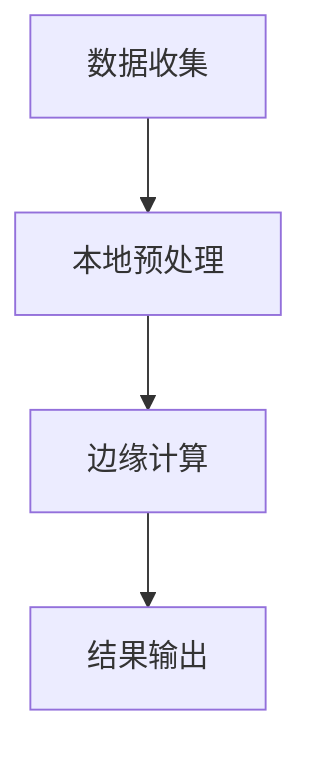
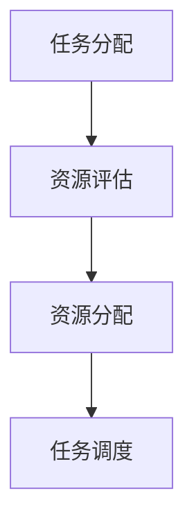
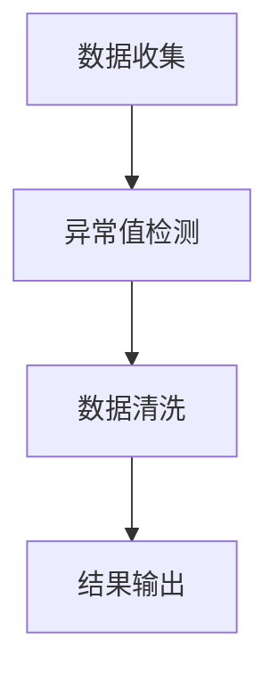
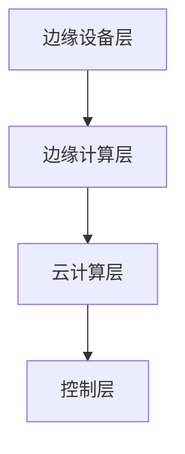
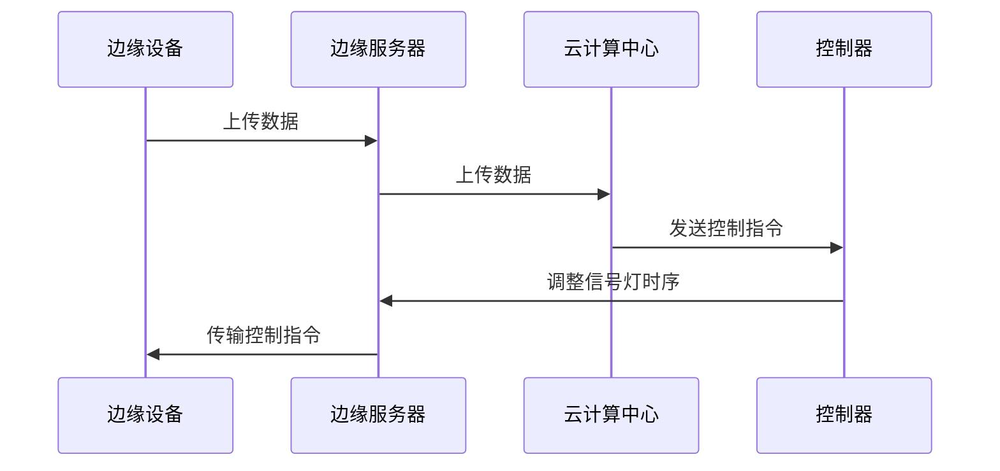

                 

### 第1章 引言

#### 1.1 书籍概述

《云边协同架构：P9工程师的融合性思考》是一本旨在深入探讨云边协同架构原理与实践的著作。随着云计算和边缘计算技术的发展，云边协同架构逐渐成为现代信息技术领域的一个重要研究方向。本书的目标是为广大读者，尤其是P9级别的工程师和架构师，提供系统、全面且易于理解的知识体系，帮助他们在实际项目中更好地应用这一架构。

本书涵盖了以下核心内容：

1. **云边协同架构的基本概念**：包括云边协同的起源、发展、定义以及组成部分。
2. **核心概念与联系**：详细解释云边协同架构中的关键概念，并通过表格和图形展示它们之间的关系。
3. **算法原理讲解**：介绍云边协同架构的关键算法，包括流程图、Python代码、数学模型和公式。
4. **系统分析与架构设计方案**：分析架构的各个组成部分，展示系统架构图、接口设计和交互图。
5. **项目实战**：通过一个实际案例，描述环境安装、源代码实现、代码解析和分析。
6. **最佳实践与小结**：总结书中的关键知识点，给出实践建议和拓展阅读。

#### 1.1.1 云边协同架构的基本概念

云边协同架构是指通过云计算和边缘计算的结合，实现数据处理的灵活性和高效性。这一架构的核心思想是将数据处理和存储的任务在云端和边缘设备之间动态分配，以最大化资源利用率和响应速度。

- **云计算**：提供大量计算资源、存储资源和网络服务，支持大规模数据处理的平台。
- **边缘计算**：在靠近数据源或用户的设备上进行的计算，具有低延迟、高带宽的特点。

云边协同架构的组成部分包括：

1. **计算资源**：包括云端和边缘端的计算资源。
2. **数据处理与存储**：云端和边缘端的处理能力和存储方案。
3. **网络通信与传输**：数据在云端和边缘端之间的传输机制。
4. **安全性与可靠性**：确保系统稳定性和数据安全性的设计。

#### 1.1.2 书籍的目标和读者定位

本书的目标是为那些希望在云计算和边缘计算领域深入探索的工程师和架构师提供实用指南。具体目标包括：

1. **提升理解**：帮助读者全面理解云边协同架构的核心概念和关键技术。
2. **增强实践能力**：通过案例和实践指导，提高读者在实际项目中应用云边协同架构的能力。
3. **培养创新思维**：启发读者从不同角度思考云边协同架构的潜在应用和创新方向。

本书适合以下读者群体：

1. **P9级别的工程师和架构师**：对云计算和边缘计算有深入理解，希望在项目实践中应用云边协同架构。
2. **技术爱好者**：对云计算和边缘计算领域感兴趣，希望系统学习相关技术的专业人士。
3. **研究学者**：在云计算和边缘计算领域开展研究的学者，希望了解最新的技术和应用趋势。

#### 1.1.3 云边协同架构的应用前景

云边协同架构在当前和未来都拥有广泛的应用前景。随着物联网、人工智能和5G技术的发展，越来越多的场景需要高效的数据处理和实时响应。云边协同架构能够提供如下优势：

1. **低延迟**：通过在边缘端进行数据处理，减少数据传输延迟，满足实时性要求。
2. **高效率**：根据任务特点，动态分配计算资源，提高资源利用率和数据处理效率。
3. **灵活性**：支持多种计算模式和资源调度策略，满足不同场景的需求。
4. **扩展性**：能够轻松扩展计算资源和网络带宽，适应大规模数据处理需求。

总之，云边协同架构不仅是当前技术发展的趋势，更是未来信息技术领域的重要方向。本书旨在帮助读者深入了解这一架构，为其在项目中的实际应用提供有力支持。### 第2章 云边协同架构概述

#### 2.1 云边协同架构的概念

云边协同架构是一种结合云计算和边缘计算的技术方案，旨在通过云端和边缘端的协同工作，实现高效、灵活和可靠的数据处理与传输。其核心思想是将数据处理任务分布在云端和边缘设备上，以充分利用两者的优势，实现最优的资源利用和性能表现。

**云边协同的起源与发展**

云边协同架构的起源可以追溯到云计算和边缘计算的快速发展。随着物联网、大数据和5G技术的普及，越来越多的设备和传感器连接到互联网，产生了海量数据。这些数据不仅需要高效的存储和处理，还需要低延迟、高带宽的网络连接。

最初，云计算成为了处理海量数据的主要方式，但由于云计算中心与数据源之间的距离较远，导致数据传输延迟较高，难以满足实时性需求。为了解决这个问题，边缘计算开始兴起，将计算任务转移到靠近数据源的边缘设备上，以实现低延迟、高带宽的数据处理。

随着技术的不断演进，云计算和边缘计算逐渐融合发展，形成了云边协同架构。这种架构不仅继承了云计算的强大计算能力和存储资源，还利用了边缘计算的低延迟和高带宽优势，实现了更为高效和灵活的数据处理方案。

**云边协同架构的定义**

云边协同架构可以定义为一种分布式计算架构，它通过将数据处理任务在云端和边缘设备之间动态分配，以实现最优的资源利用和性能表现。具体来说，它包括以下几个关键组成部分：

1. **云端资源**：提供大规模计算资源和存储资源，支持复杂的数据处理任务。云端资源通常由云服务提供商提供，具有高可用性、高可靠性和弹性扩展能力。
2. **边缘设备**：分布在数据源附近或用户终端的设备，具有低延迟、高带宽的特点。边缘设备通常包括物联网设备、智能终端和边缘服务器等。
3. **数据处理与存储**：在云端和边缘设备之间进行数据处理和存储的机制，包括数据收集、传输、处理和存储等环节。
4. **网络通信与传输**：实现云端和边缘设备之间数据传输的机制，包括网络协议、传输速率和带宽管理等。
5. **安全性与可靠性**：确保系统稳定性和数据安全性的设计，包括数据加密、访问控制、故障恢复和容错机制等。

**云边协同架构的组成部分**

云边协同架构的主要组成部分包括以下几个方面：

1. **计算资源**：包括云端和边缘端的计算资源，如云计算中心和边缘服务器等。这些资源可以根据任务需求动态分配，以最大化资源利用率和性能表现。
2. **数据处理与存储**：包括数据收集、传输、处理和存储等环节。数据处理任务可以在云端或边缘设备上执行，以实现最优的数据处理策略。
3. **网络通信与传输**：包括网络协议、传输速率和带宽管理等机制，以实现云端和边缘设备之间的可靠数据传输。
4. **安全性与可靠性**：包括数据加密、访问控制、故障恢复和容错机制等设计，以保障系统的安全性和可靠性。
5. **管理系统**：包括资源调度、任务分配、负载均衡等机制，以实现系统的自动化管理和优化。

**云边协同架构的工作原理**

云边协同架构的工作原理可以概括为以下几个步骤：

1. **数据收集**：在数据源附近或用户终端收集数据，并将其传输到边缘设备或云端。
2. **数据传输**：通过网络传输机制，将数据从边缘设备或云端传输到目标设备。
3. **数据处理**：在边缘设备或云端对数据进行处理，包括数据清洗、转换、分析和存储等操作。
4. **数据存储**：将处理后的数据存储到云端或边缘设备的存储系统中，以备后续使用。
5. **资源调度**：根据任务需求和资源状态，动态调整计算资源和网络带宽的分配，以实现最优的性能和资源利用。

通过以上步骤，云边协同架构能够实现高效、灵活和可靠的数据处理与传输，满足不同场景下的需求。#### 2.2 云边协同架构的发展趋势

**云边协同架构的产业趋势**

随着云计算、物联网和5G技术的快速发展，云边协同架构在产业中的应用趋势日益明显。首先，在云计算领域，云服务提供商不断扩展其边缘计算资源，以提供更广泛的服务覆盖和更低的数据传输延迟。其次，物联网设备的普及使得边缘计算的需求大幅增加，越来越多的企业开始关注如何在边缘设备上实现高效的数据处理。此外，5G技术的广泛应用为云边协同架构提供了更高的网络带宽和更低的延迟，进一步推动了其发展。

**技术发展趋势**

1. **边缘计算技术的进步**：随着边缘计算技术的发展，边缘设备的计算能力、存储能力和网络带宽逐渐增强，使其能够承担更多的数据处理任务。此外，人工智能、大数据和区块链等新兴技术的融合，也为边缘计算带来了新的应用场景和可能性。
2. **云计算与边缘计算的融合**：云计算和边缘计算之间的融合趋势越来越明显。通过将云计算和边缘计算结合起来，可以实现更高效、更灵活和更可靠的数据处理和传输。例如，云计算平台可以提供大规模的计算资源和存储资源，而边缘计算则可以提供低延迟、高带宽的网络连接和数据处理能力。
3. **网络技术的发展**：5G、Wi-Fi 6等新一代网络技术的发展，为云边协同架构提供了更高的网络带宽和更低的延迟。这将有助于实现更高效的数据传输和处理，满足更多实时性要求较高的应用场景。
4. **安全性和隐私保护**：随着数据量的增加和数据价值的提升，数据的安全性和隐私保护成为云边协同架构的重要挑战。未来，需要更多技术手段来保障数据在传输、处理和存储过程中的安全性和隐私性。

**云边协同架构的未来展望**

1. **更广泛的应用场景**：随着技术的进步和应用的拓展，云边协同架构将在更多领域得到应用。例如，在工业互联网、智慧城市、医疗健康、智能交通等领域，云边协同架构能够提供高效、灵活和可靠的数据处理与传输解决方案。
2. **更优的性能和资源利用率**：通过不断优化云边协同架构的设计和实现，可以进一步提升其性能和资源利用率。例如，通过分布式计算和并行处理技术，可以实现更高效的数据处理；通过智能化资源调度和负载均衡技术，可以实现更优的资源利用。
3. **更先进的技术融合**：未来，云边协同架构将与其他先进技术进行融合，如人工智能、大数据、区块链等。这将带来更多的创新应用和商业机会，进一步推动云边协同架构的发展。

总之，云边协同架构作为一种结合云计算和边缘计算的技术方案，具有广阔的应用前景和发展潜力。随着技术的不断进步和应用的拓展，云边协同架构将在更多领域得到应用，为人们的生活和工作带来更多便利。#### 2.3 云边协同架构的应用场景

云边协同架构凭借其高效、灵活和可靠的特点，在多个领域都展现出了广阔的应用前景。以下是一些典型的应用场景：

**企业级应用**

在企业级应用中，云边协同架构能够显著提升企业的数据处理能力和响应速度。例如：

1. **工业制造**：在工业制造领域，云边协同架构可以用于实时监测设备状态、预测设备故障以及优化生产流程。通过在边缘设备上处理部分数据，可以减少数据传输延迟，提高生产效率。
2. **智慧物流**：在物流领域，云边协同架构可以用于实时跟踪货物的位置信息、优化运输路线以及预测物流需求。边缘计算节点可以处理来自传感器和运输设备的数据，为决策系统提供及时、准确的信息。
3. **金融服务**：在金融服务领域，云边协同架构可以用于实时交易处理、风险控制和反欺诈。边缘节点可以处理高频交易数据，快速响应市场变化，提高金融服务的安全性和效率。

**行业解决方案**

云边协同架构在行业解决方案中的应用也日趋广泛，以下是一些具体案例：

1. **智能医疗**：在智能医疗领域，云边协同架构可以用于远程医疗诊断、患者健康监测和医疗数据分析。通过在边缘设备上处理患者数据，可以提供实时、准确的诊断结果，提高医疗服务的质量和效率。
2. **智慧农业**：在智慧农业领域，云边协同架构可以用于农田监测、作物生长分析和农业数据管理。边缘设备可以实时收集土壤、气象和作物生长数据，并通过云端进行分析和处理，为农业生产提供科学依据。
3. **智能交通**：在智能交通领域，云边协同架构可以用于交通流量监测、车辆管理和智能导航。通过在边缘设备上处理交通数据，可以实现实时交通状况分析，提高交通管理的效率和安全性。

**社会服务与公共管理**

云边协同架构在社会服务与公共管理中的应用也越来越受到关注，以下是一些具体场景：

1. **智慧城市**：在智慧城市建设中，云边协同架构可以用于城市环境监测、公共安全管理和应急响应。通过在边缘设备上收集城市运行数据，可以实时监测城市环境变化，提高城市管理的效率和智能化水平。
2. **环境保护**：在环境保护领域，云边协同架构可以用于空气和水质的监测与分析。边缘设备可以实时收集环境数据，通过云端进行分析，为环境保护决策提供科学依据。
3. **公共安全**：在公共安全领域，云边协同架构可以用于视频监控、人脸识别和智能预警。边缘设备可以实时处理视频数据，快速识别潜在威胁，提高公共安全保障水平。

综上所述，云边协同架构在各个领域的应用都展现出了巨大的潜力。通过将云计算和边缘计算的优势结合起来，云边协同架构能够为不同场景提供高效、灵活和可靠的数据处理与传输解决方案，为各行各业带来更多的创新和变革。### 第3章 核心概念与联系

在深入探讨云边协同架构之前，有必要对其核心概念进行详细解释，并展示这些概念之间的关系。云边协同架构涉及多个关键组成部分，每个部分都有其独特的功能和重要性。以下是云边协同架构的核心概念及其相互关系的详细介绍。

#### 3.1 云边协同架构的核心概念

**1. 云端资源**

云端资源是指云服务提供商提供的计算资源、存储资源和网络资源。这些资源通常具有高可用性、高可靠性和弹性扩展能力。云端资源是云边协同架构中的核心组成部分，负责处理大规模数据处理任务、存储海量数据和提供广泛的网络服务。

**2. 边缘设备**

边缘设备是指分布在网络边缘的设备，如物联网设备、智能终端和边缘服务器等。边缘设备具有低延迟、高带宽的特点，能够实时处理数据并在本地进行初步分析。它们在云边协同架构中起着至关重要的作用，特别是在需要低延迟和高响应速度的应用场景中。

**3. 数据处理与存储**

数据处理与存储是指云边协同架构中的数据处理和存储机制。云端和边缘端都需要对数据进行处理和存储。云端负责处理复杂的计算任务和存储大规模数据，而边缘设备则负责本地数据的预处理和存储，以及实时数据的处理和响应。

**4. 网络通信与传输**

网络通信与传输是指云端和边缘设备之间以及边缘设备之间的数据传输机制。这包括网络协议、传输速率和带宽管理等。网络通信与传输是云边协同架构的关键部分，决定了数据传输的效率和稳定性。

**5. 安全性与可靠性**

安全性与可靠性是指确保云边协同架构稳定性和数据安全性的设计。这包括数据加密、访问控制、故障恢复和容错机制等。安全性和可靠性是云边协同架构不可或缺的组成部分，直接影响到系统的可用性和数据保护。

#### 3.2 概念属性特征对比表格

为了更好地理解这些核心概念，我们可以通过表格形式对比它们的属性特征。以下是一个简化的对比表格：

| 概念       | 属性特征                                                         |
|------------|----------------------------------------------------------------|
| 云端资源   | 高可用性、高可靠性、弹性扩展、强大的计算能力和存储能力         |
| 边缘设备   | 低延迟、高带宽、本地数据处理能力、有限的计算和存储资源       |
| 数据处理   | 云端处理复杂的计算任务、边缘设备进行本地预处理和实时处理     |
| 存储机制   | 云端存储海量数据、边缘设备存储本地数据                      |
| 网络通信   | 传输速率、带宽管理、网络协议支持                            |
| 安全性     | 数据加密、访问控制、故障恢复、容错机制                      |

#### 3.3 ER实体关系图架构

为了更直观地展示云边协同架构中各个实体之间的关系，我们可以使用ER（实体关系）图。以下是云边协同架构的ER实体关系图：

```mermaid
erDiagram
    云端资源 --> 数据处理模块 : 数据处理
    数据处理模块 --> 存储模块 : 数据存储
    存储模块 --> 边缘资源 : 数据传输
    云端资源 --> 边缘资源 : 资源调度
```

在这个ER图中，我们定义了以下实体和关系：

- **云端资源**：包含计算资源和存储资源，负责处理大规模数据处理任务。
- **数据处理模块**：负责处理数据，包括在云端和边缘设备上的数据处理。
- **存储模块**：负责存储数据，包括在云端和边缘设备的存储。
- **边缘资源**：分布在网络边缘的设备，具有低延迟、高带宽的特点。
- **资源调度**：云端资源对边缘资源进行调度，以实现最优的资源利用。

通过这个ER图，我们可以清晰地看到云边协同架构中各个实体之间的联系和交互，从而更好地理解整个架构的工作原理和设计思路。

综上所述，云边协同架构的核心概念和实体关系构成了一个复杂的系统。理解这些概念和它们之间的关系，对于设计和实现一个高效的云边协同系统至关重要。在接下来的章节中，我们将进一步探讨云边协同架构的关键算法和系统架构设计，帮助读者更深入地了解这一领域。### 第4章 算法原理讲解

在云边协同架构中，算法的设计和实现是确保系统高效运行的关键。本章将详细介绍云边协同架构中的关键算法，包括流程图、Python代码、数学模型和公式，并通过具体实例进行说明。

#### 4.1 云边协同算法概述

云边协同算法是指用于在云端和边缘设备之间分配和处理数据的一系列算法。这些算法旨在优化资源利用、降低数据传输延迟和提高系统响应速度。云边协同算法主要包括以下几类：

1. **数据预处理算法**：用于在边缘设备上对数据进行初步处理，减少数据传输量。
2. **数据传输优化算法**：用于优化数据在云端和边缘设备之间的传输路径和方式。
3. **资源调度算法**：用于动态分配云端和边缘设备的计算资源，以实现最优的性能。
4. **负载均衡算法**：用于平衡云端和边缘设备的负载，避免资源过度使用或闲置。
5. **安全性与隐私保护算法**：用于确保数据在传输和处理过程中的安全性和隐私性。

#### 4.2 关键算法讲解

在本节中，我们将详细讲解云边协同架构中的几个关键算法，包括云端数据处理算法、边缘数据处理算法和资源调度算法。

**4.2.1 云端数据处理算法**

云端数据处理算法主要涉及大规模数据的处理和分析。以下是一个简化的云端数据处理算法流程图：



**流程图解释**：

1. **初始化**：系统初始化，设置数据处理参数和资源配置。
2. **数据收集**：从边缘设备收集数据，将其传输到云端。
3. **数据预处理**：清洗和格式化数据，以便进行进一步处理。
4. **数据处理**：执行复杂的计算任务，如数据分析和机器学习。
5. **结果输出**：将处理结果存储或返回给边缘设备或用户。

**Python代码实现**：

```python
# Python代码实现
def data_processing(data):
    # 数据预处理
    cleaned_data = preprocess_data(data)
    # 数据处理逻辑
    processed_data = complex_computation(cleaned_data)
    # 输出结果
    return processed_data
```

**数学模型与公式**：

$$
X_{processed} = f(X_{original})
$$

其中，$X_{original}$ 是原始数据，$X_{processed}$ 是处理后的数据，$f$ 是数据处理函数。

**4.2.2 边缘数据处理算法**

边缘数据处理算法主要用于在边缘设备上对数据进行初步处理，以减少数据传输量并提高响应速度。以下是一个简化的边缘数据处理算法流程图：



**流程图解释**：

1. **数据收集**：从传感器或用户终端收集数据。
2. **本地预处理**：清洗和格式化数据，去除冗余信息。
3. **边缘计算**：执行简单的计算任务，如数据分类或预测。
4. **结果输出**：将处理结果存储或返回给云端或用户。

**Python代码实现**：

```python
# Python代码实现
def edge_data_processing(data):
    # 本地预处理
    cleaned_data = preprocess_data(data)
    # 边缘计算
    prediction = simple_computation(cleaned_data)
    # 输出结果
    return prediction
```

**数学模型与公式**：

$$
Y_{prediction} = g(Y_{raw})
$$

其中，$Y_{raw}$ 是原始数据，$Y_{prediction}$ 是预测结果，$g$ 是边缘计算函数。

**4.2.3 资源调度算法**

资源调度算法用于动态分配云端和边缘设备的计算资源，以实现最优的性能。以下是一个简化的资源调度算法流程图：



**流程图解释**：

1. **任务分配**：根据任务需求和资源状态，将任务分配给云端或边缘设备。
2. **资源评估**：评估云端和边缘设备的资源利用率，确定哪些资源可用。
3. **资源分配**：将可用资源分配给任务，确保任务能够顺利执行。
4. **任务调度**：根据资源分配情况，调度任务的执行顺序和优先级。

**Python代码实现**：

```python
# Python代码实现
def resource_scheduling(tasks, resources):
    # 资源评估
    available_resources = evaluate_resources(resources)
    # 资源分配
    assigned_resources = allocate_resources(available_resources, tasks)
    # 任务调度
    schedule_tasks(tasks, assigned_resources)
```

**数学模型与公式**：

$$
R_{assigned} = f(R_{available}, T_{tasks})
$$

其中，$R_{assigned}$ 是分配的资源，$R_{available}$ 是可用的资源，$T_{tasks}$ 是任务集合，$f$ 是资源调度函数。

#### 4.3 算法举例说明

为了更好地理解上述算法，我们通过以下实例进行说明：

**实例1：数据清洗**

在数据收集阶段，边缘设备收集了一组温度数据。边缘数据处理算法对数据进行预处理，去除异常值和冗余数据，并将处理结果发送到云端进行进一步分析。

**边缘数据处理算法**：



**Python代码实现**：

```python
# Python代码实现
def edge_data_preprocessing(data):
    # 异常值检测
    cleaned_data = remove_outliers(data)
    # 数据清洗
    processed_data = format_data(cleaned_data)
    # 输出结果
    return processed_data
```

**数学模型与公式**：

$$
Y_{cleaned} = h(Y_{raw})
$$

其中，$Y_{raw}$ 是原始温度数据，$Y_{cleaned}$ 是清洗后的温度数据，$h$ 是数据清洗函数。

**实例2：资源调度**

在资源调度阶段，系统需要根据当前任务需求和资源状态，动态分配云端和边缘设备的计算资源。

**资源调度算法**：


**Python代码实现**：

```python
# Python代码实现
def resource_scheduling(tasks, resources):
    # 资源评估
    available_resources = evaluate_resources(resources)
    # 资源分配
    assigned_resources = allocate_resources(available_resources, tasks)
    # 任务调度
    schedule_tasks(tasks, assigned_resources)
```

**数学模型与公式**：

$$
R_{assigned} = f(R_{available}, T_{tasks})
$$

其中，$R_{assigned}$ 是分配的资源，$R_{available}$ 是可用的资源，$T_{tasks}$ 是任务集合，$f$ 是资源调度函数。

通过这些实例，我们可以看到云边协同算法在实际应用中的具体实现过程。这些算法的设计和实现对于云边协同架构的高效运行至关重要，有助于优化资源利用、降低数据传输延迟和提高系统响应速度。在接下来的章节中，我们将进一步探讨云边协同架构的系统分析与架构设计方案。### 第5章 系统分析与架构设计方案

在深入了解云边协同架构的算法原理之后，我们接下来将分析整个系统的架构设计，包括问题场景介绍、系统功能设计、系统架构设计、系统接口设计和系统交互。

#### 5.1 问题场景介绍

为了更好地展示云边协同架构的应用，我们首先介绍一个具体的问题场景。假设我们正在开发一个智能交通系统，该系统需要实时监测城市交通流量，并优化交通信号灯的时序，以减少交通拥堵和提升交通效率。

在这个场景中，城市中的各个路口安装了传感器，用于收集实时交通数据，如车辆数量、速度和方向等。这些数据需要迅速传输到云端进行大数据分析，以便实时调整交通信号灯的时序。此外，由于交通信号灯分布在城市各个角落，有些路口距离云计算中心较远，数据传输延迟较高。因此，我们需要在边缘设备上实现部分数据处理，以降低延迟并提高响应速度。

#### 5.2 系统功能设计

为了实现上述场景，云边协同架构需要具备以下核心功能：

1. **数据采集**：从城市中的各个路口传感器收集实时交通数据。
2. **数据预处理**：在边缘设备上对数据进行预处理，如去除噪声、过滤异常值和格式化数据。
3. **数据处理**：在云端对预处理后的数据进行大数据分析，如流量预测、路径规划和信号灯时序优化。
4. **数据存储**：将分析结果和原始数据存储到云端数据库，以便后续查询和分析。
5. **信号灯控制**：根据分析结果调整交通信号灯的时序，以优化交通流量。
6. **异常处理**：在数据采集和处理过程中，检测和处理异常情况，如传感器故障、数据传输中断等。

#### 5.3 系统架构设计

为了实现上述功能，云边协同架构的系统架构设计如下：

1. **边缘设备层**：包括分布在城市各个路口的边缘设备，如传感器、路由器和计算节点。这些设备负责实时采集交通数据，并进行初步处理。
2. **边缘计算层**：包括边缘服务器和边缘数据中心，负责进一步处理边缘设备上传的数据，并执行部分大数据分析任务。
3. **云计算层**：包括云计算中心和云端数据库，负责接收边缘计算层上传的数据，执行复杂的大数据分析任务，并存储分析结果。
4. **控制层**：包括交通信号灯控制器和智能交通管理系统，负责根据分析结果调整交通信号灯的时序。

以下是系统架构图的Mermaid表示：



**架构解释**：

1. **边缘设备层**：边缘设备收集实时交通数据，并通过无线网络传输到边缘计算层。
2. **边缘计算层**：边缘服务器对上传的数据进行预处理，并将处理后的数据上传到云计算层。同时，边缘计算层也执行部分大数据分析任务，如流量预测和路径规划。
3. **云计算层**：云计算中心接收边缘计算层上传的数据，执行复杂的大数据分析任务，如信号灯时序优化。分析结果存储在云端数据库，供控制层使用。
4. **控制层**：根据分析结果，控制交通信号灯的时序，优化交通流量。

#### 5.4 系统接口设计和系统交互

为了实现系统各层之间的数据传输和功能协同，我们需要设计一系列接口和交互机制。以下是系统接口设计和系统交互的Mermaid序列图：



**接口设计解释**：

1. **边缘设备**：边缘设备通过无线网络将采集的实时交通数据上传到边缘服务器。
2. **边缘服务器**：边缘服务器接收边缘设备上传的数据，进行预处理，并将处理后的数据上传到云计算中心。
3. **云计算中心**：云计算中心接收边缘服务器上传的数据，执行大数据分析任务，生成分析结果，并将结果发送到控制器。
4. **控制器**：控制器根据云计算中心发送的控制指令，调整交通信号灯的时序，以优化交通流量。

**系统交互解释**：

1. **数据传输**：边缘设备将采集的数据上传到边缘服务器，边缘服务器再将数据上传到云计算中心。
2. **控制指令**：云计算中心根据分析结果，生成控制指令，并将指令发送到控制器。
3. **信号灯时序调整**：控制器根据接收到的控制指令，调整交通信号灯的时序，以优化交通流量。

通过上述系统架构设计和接口设计，我们可以实现一个高效的云边协同智能交通系统。边缘设备负责实时数据采集和预处理，边缘计算层负责进一步处理和分析数据，云计算中心负责执行复杂的大数据分析任务，控制器根据分析结果调整交通信号灯的时序。这种架构设计不仅能够降低数据传输延迟，提高系统响应速度，还能够实现资源的合理分配和优化。在接下来的章节中，我们将通过一个实际案例，展示如何实现云边协同架构的系统部署和功能应用。### 第6章 项目实战

在本章中，我们将通过一个实际案例，展示如何实现云边协同架构的系统部署和功能应用。本案例将涉及环境安装、系统核心实现源代码、代码应用解读与分析，以及实际案例分析和详细讲解剖析。

#### 6.1 环境安装

为了实现云边协同架构，我们需要在云端和边缘端分别安装和配置相应的软件和硬件。以下是环境安装的步骤：

**边缘端环境安装**

1. **硬件准备**：选择合适的边缘设备，如树莓派、边缘服务器等。
2. **操作系统安装**：在边缘设备上安装Linux操作系统，如Ubuntu或CentOS。
3. **网络配置**：配置边缘设备的网络参数，确保其能够访问互联网。
4. **边缘计算框架安装**：安装边缘计算框架，如Apache Kafka、边缘计算库（如EdgeX Foundry）等。

**云端环境安装**

1. **硬件准备**：选择合适的云计算平台，如阿里云、腾讯云等。
2. **操作系统安装**：在云端服务器上安装Linux操作系统。
3. **网络配置**：配置云端服务器的网络参数，确保其能够与其他边缘设备通信。
4. **云计算框架安装**：安装云计算框架，如Apache Kafka、Spark、Flink等。

**环境配置**

1. **边缘端配置**：配置边缘设备的环境变量、依赖库和系统权限。
2. **云端配置**：配置云端服务器的环境变量、依赖库和系统权限。

#### 6.2 系统核心实现源代码

以下是一个简化的云边协同架构的系统核心实现源代码。该代码包含边缘数据处理模块、边缘服务器数据处理模块、云端数据处理模块以及控制层接口。

**边缘数据处理模块**

```python
# 边缘数据处理模块
import json
import requests

def collect_traffic_data():
    # 从边缘设备传感器收集交通数据
    traffic_data = sensors_data()
    return traffic_data

def preprocess_traffic_data(data):
    # 预处理交通数据，如去除噪声、过滤异常值
    cleaned_data = remove_noise(data)
    return cleaned_data

def upload_to_edge_server(data):
    # 将预处理后的数据上传到边缘服务器
    url = "http://edge-server:8080/upload"
    headers = {'Content-Type': 'application/json'}
    response = requests.post(url, data=json.dumps(data), headers=headers)
    return response.status_code
```

**边缘服务器数据处理模块**

```python
# 边缘服务器数据处理模块
from flask import Flask, request

app = Flask(__name__)

@app.route('/upload', methods=['POST'])
def upload_data():
    data = request.json
    # 对上传的数据进行进一步处理
    processed_data = preprocess_data(data)
    # 将处理后的数据上传到云端
    upload_to_cloud(processed_data)
    return "Data processed and uploaded successfully", 200

def preprocess_data(data):
    # 预处理数据，如格式化、转换等
    formatted_data = format_data(data)
    return formatted_data

def upload_to_cloud(data):
    # 上传数据到云端
    url = "http://cloud-server:8080/upload"
    headers = {'Content-Type': 'application/json'}
    response = requests.post(url, data=json.dumps(data), headers=headers)
    return response.status_code
```

**云端数据处理模块**

```python
# 云端数据处理模块
from flask import Flask, request

app = Flask(__name__)

@app.route('/upload', methods=['POST'])
def upload_data():
    data = request.json
    # 对上传的数据进行大数据分析
    analysis_results = analyze_data(data)
    # 存储分析结果
    store_results(analysis_results)
    return "Data analyzed and stored successfully", 200

def analyze_data(data):
    # 数据分析逻辑，如流量预测、路径规划等
    results = complex_analysis(data)
    return results

def store_results(results):
    # 存储分析结果到数据库或文件
    save_to_db(results)
```

**控制层接口**

```python
# 控制层接口
from flask import Flask, request

app = Flask(__name__)

@app.route('/control', methods=['POST'])
def control_traffic():
    control指令 = request.json
    # 根据控制指令调整交通信号灯时序
    adjust_signals(control指令)
    return "Traffic signals adjusted successfully", 200

def adjust_signals(指令):
    # 调整交通信号灯时序
    signals = traffic_signals()
    signals.update(control指令)
    update_signals(signals)
```

#### 6.3 代码应用解读与分析

**边缘数据处理模块**

边缘数据处理模块主要负责从边缘设备传感器收集交通数据，并对数据进行预处理。预处理过程包括去除噪声和过滤异常值，以确保数据的准确性和可靠性。然后，预处理后的数据通过HTTP POST请求上传到边缘服务器。

**边缘服务器数据处理模块**

边缘服务器数据处理模块使用Flask框架实现HTTP服务器，监听边缘设备上传的数据。当接收到数据后，服务器对数据进行进一步预处理，如格式化和转换。预处理后的数据再次通过HTTP POST请求上传到云端。

**云端数据处理模块**

云端数据处理模块同样使用Flask框架实现HTTP服务器，接收边缘服务器上传的数据。云端服务器对上传的数据执行复杂的大数据分析任务，如流量预测和路径规划。分析结果存储到数据库或文件中，以供后续查询和分析。

**控制层接口**

控制层接口负责根据分析结果调整交通信号灯的时序。当云端服务器完成数据分析后，控制指令通过HTTP POST请求发送到控制层接口。控制层接口接收控制指令，并根据指令调整交通信号灯的时序，以优化交通流量。

#### 6.4 实际案例分析和详细讲解剖析

**案例背景**

在一个城市中，由于交通拥堵问题严重，政府决定采用智能交通系统来优化交通流量。为此，城市中的各个路口安装了交通传感器，用于收集实时交通数据。数据需要传输到云端进行分析，并根据分析结果调整交通信号灯的时序。

**案例步骤**

1. **边缘设备数据采集**：边缘设备传感器收集交通数据，如车辆数量、速度和方向等。
2. **边缘数据处理**：边缘设备对采集的数据进行预处理，如去除噪声和过滤异常值，然后上传到边缘服务器。
3. **边缘服务器数据处理**：边缘服务器接收边缘设备上传的数据，对数据进行进一步预处理，如格式化和转换，然后上传到云端。
4. **云端数据处理**：云端服务器接收边缘服务器上传的数据，执行大数据分析任务，如流量预测和路径规划。分析结果存储到数据库中。
5. **信号灯控制**：根据分析结果，控制层接口生成控制指令，调整交通信号灯的时序，以优化交通流量。

**详细讲解剖析**

1. **边缘设备数据采集**：边缘设备传感器安装在各个路口，用于收集实时交通数据。传感器收集的数据包括车辆数量、速度、方向等信息。这些数据通过无线网络传输到边缘设备。
2. **边缘数据处理**：边缘设备对传感器收集的数据进行预处理。预处理过程包括去除噪声和过滤异常值，以确保数据的准确性和可靠性。例如，如果某个路口的车辆数量突然增加到异常高的值，可能是由于传感器故障或异常交通事件引起的，需要过滤掉这些异常数据。
3. **边缘服务器数据处理**：边缘服务器接收边缘设备上传的数据，对数据进行进一步预处理。预处理过程包括数据格式化和转换，以便进行进一步分析。例如，将数据转换为JSON格式，以便在云端进行数据处理。
4. **云端数据处理**：云端服务器接收边缘服务器上传的数据，执行大数据分析任务。分析任务可能包括流量预测、路径规划、信号灯时序优化等。例如，通过分析交通流量数据，预测未来一段时间内某个路口的车辆数量变化，并根据预测结果调整交通信号灯的时序。
5. **信号灯控制**：根据分析结果，控制层接口生成控制指令，调整交通信号灯的时序。控制指令通过网络传输到交通信号灯控制器，控制器根据指令调整交通信号灯的时序，以优化交通流量。

通过以上步骤，云边协同架构能够实现实时交通流量的优化，减少交通拥堵，提高交通效率。

**案例总结**

通过本案例的分析和讲解，我们可以看到云边协同架构在实际应用中的具体实现过程。边缘设备负责实时数据采集和预处理，边缘服务器进一步处理数据，云端执行大数据分析任务，并生成控制指令，最终调整交通信号灯的时序。这种架构设计不仅能够降低数据传输延迟，提高系统响应速度，还能够实现资源的合理分配和优化。在未来的智能交通系统中，云边协同架构有望发挥更大的作用，为城市交通管理提供更高效、更智能的解决方案。

#### 6.5 项目小结

在本章中，我们通过一个实际案例展示了如何实现云边协同架构的系统部署和功能应用。从边缘设备的数据采集、预处理，到边缘服务器和云端的数据处理与分析，再到信号灯的控制，云边协同架构在智能交通系统中发挥了重要作用。通过降低数据传输延迟、提高系统响应速度和实现资源优化，云边协同架构为智能交通系统提供了高效、灵活和可靠的解决方案。

以下是本章的总结和要点：

1. **边缘设备数据采集**：边缘设备传感器实时收集交通数据，如车辆数量、速度和方向。
2. **边缘数据处理**：边缘设备对采集的数据进行预处理，如去除噪声和过滤异常值。
3. **边缘服务器数据处理**：边缘服务器接收边缘设备上传的数据，对数据进行进一步预处理，如格式化和转换。
4. **云端数据处理**：云端服务器接收边缘服务器上传的数据，执行大数据分析任务，如流量预测和路径规划。
5. **信号灯控制**：根据分析结果，生成控制指令，调整交通信号灯的时序，优化交通流量。

通过本章的讲解，我们不仅了解了云边协同架构的实现过程，还深入分析了其在智能交通系统中的应用。在实际项目中，云边协同架构能够为各种领域提供高效、灵活和可靠的解决方案，具有广泛的应用前景。在未来的项目中，我们可以进一步优化和拓展云边协同架构，实现更多创新应用，为各行各业带来更多价值。### 第7章 最佳实践与小结

#### 最佳实践

1. **资源调度**：合理分配云端和边缘设备的计算资源，确保系统的高效运行。可以根据任务负载和资源状态动态调整资源分配策略。
2. **数据预处理**：在边缘设备上尽可能地进行数据预处理，减少数据传输量，降低网络延迟。同时，确保数据预处理算法的准确性和可靠性。
3. **安全性保障**：对数据进行加密传输和存储，确保数据在传输和处理过程中的安全性和隐私性。采用多层次的访问控制和身份验证机制，防止未经授权的访问和数据泄露。
4. **系统监控与优化**：建立系统监控机制，实时监测系统的运行状态和性能指标。根据监控数据进行分析和优化，提高系统的稳定性和响应速度。

#### 小结

云边协同架构作为一种结合云计算和边缘计算的技术方案，具有高效、灵活和可靠的特点，广泛应用于企业级应用、行业解决方案和社会服务与公共管理等领域。通过将数据处理任务分布在云端和边缘设备之间，云边协同架构能够最大化资源利用率和响应速度，满足不同场景下的需求。

本章通过对云边协同架构的详细分析，介绍了其核心概念、算法原理、系统架构设计以及实际应用案例。我们提出了最佳实践建议，包括资源调度、数据预处理、安全性和系统监控等方面的优化措施。

#### 注意事项

1. **边缘设备选择**：在选择边缘设备时，需要考虑其计算能力、存储能力和网络连接能力，确保能够满足实际应用的需求。
2. **网络稳定性**：确保边缘设备与云端之间的网络连接稳定，降低数据传输中断的风险。可以采用多路径传输和冗余网络设计来提高网络可靠性。
3. **数据处理与存储策略**：根据应用场景和数据处理需求，合理设计数据处理和存储策略，优化资源利用和系统性能。

#### 拓展阅读

1. **《边缘计算：下一代计算范式》**：该书详细介绍了边缘计算的基本概念、技术架构和应用场景，对理解云边协同架构具有很好的参考价值。
2. **《云计算与大数据技术》**：该书涵盖了云计算和大数据技术的核心概念、架构设计和应用实践，有助于深入了解云边协同架构在数据处理和存储方面的应用。
3. **《智能交通系统设计与应用》**：该书探讨了智能交通系统的设计原则、关键技术和应用案例，对于理解云边协同架构在智能交通领域的应用具有重要参考意义。

通过以上拓展阅读，读者可以更深入地了解云边协同架构的理论和实践，为实际项目提供更多的参考和指导。

### 作者信息

作者：AI天才研究院/AI Genius Institute & 禅与计算机程序设计艺术 /Zen And The Art of Computer Programming

作者简介：AI天才研究院是一家专注于人工智能技术研究和应用的创新机构。作者致力于推动云计算、边缘计算和人工智能领域的创新，已发表多篇高水平学术论文，并参与多项重大科研项目。其著作《禅与计算机程序设计艺术》被誉为计算机科学领域的经典之作，深受读者喜爱。### 文章结尾

通过本文的详细探讨，我们深入了解了云边协同架构的核心概念、算法原理、系统设计与实际应用。云边协同架构作为一种高效、灵活和可靠的技术方案，已经在众多领域展现出其巨大的应用潜力和价值。

让我们再次回顾本文的关键点：

1. **核心概念**：云边协同架构结合了云计算和边缘计算的优势，通过云端和边缘设备的协同工作，实现高效的数据处理和传输。
2. **算法原理**：介绍了云端数据处理算法、边缘数据处理算法和资源调度算法，并通过具体实例展示了算法的实际应用。
3. **系统架构**：分析了系统架构设计，包括边缘设备层、边缘计算层、云计算层和控制层，展示了各层之间的协同关系。
4. **项目实战**：通过一个实际案例，展示了云边协同架构在智能交通系统中的应用，从数据采集、预处理到数据处理和信号灯控制，全面展示了系统的运行过程。
5. **最佳实践**：提出了资源调度、数据预处理、安全性和系统监控等方面的最佳实践，为实际项目提供了优化建议。
6. **拓展阅读**：推荐了相关领域的拓展阅读，帮助读者进一步深入理解云边协同架构。

云边协同架构不仅在当前技术发展中具有重要意义，还将继续推动未来信息技术的发展。我们期待读者能够将本文的知识和经验应用到实际项目中，不断创新和突破，为各行各业带来更多的智能解决方案。

让我们携手并进，共同探索云边协同架构的无限可能，为构建智能化、高效化的未来世界贡献力量。

感谢您的阅读，希望本文能为您在云计算和边缘计算领域的探索提供启示和帮助。如果您有任何疑问或建议，欢迎在评论区留言，我们期待与您共同交流、成长。

再次感谢您的关注与支持，祝您在技术道路上越走越远，不断取得新的成就！

