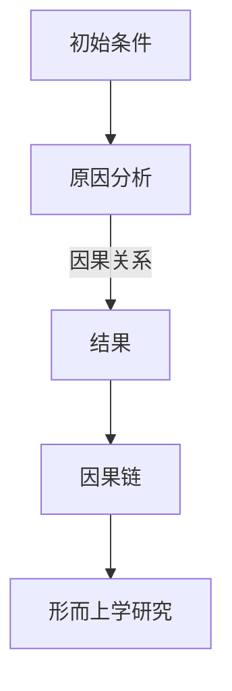
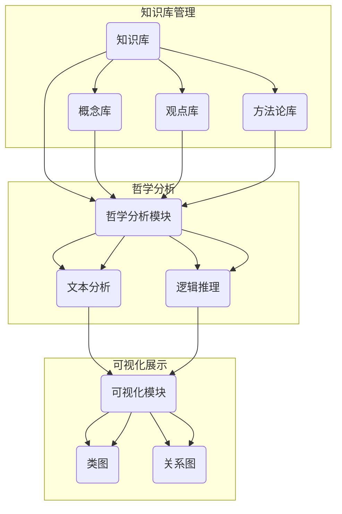
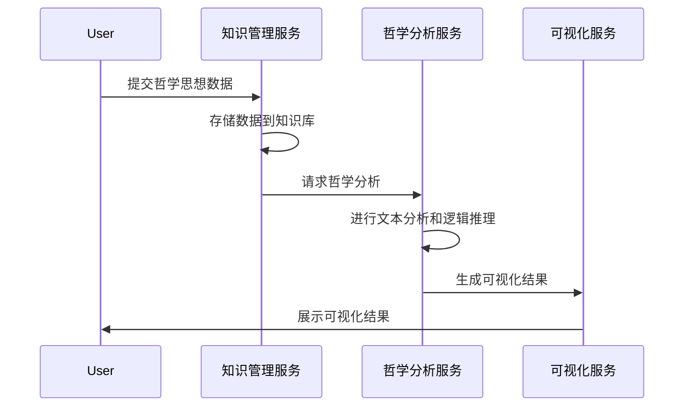

                 


### 背景介绍

#### 关键术语说明
在探讨亚里士多德与托马斯·阿奎那的哲学思想时，理解一些核心术语是非常关键的。首先，亚里士多德被认为是古希腊哲学的巅峰人物，他的哲学体系深刻影响了西方哲学的发展。关键术语包括“形而上学”（metaphysics）、“伦理学”（ethics）、“逻辑学”（logic）等。亚里士多德的形而上学关注存在和本质的研究，伦理学探讨道德行为和幸福，而逻辑学则研究有效的推理方式。

托马斯·阿奎那则是在中世纪时期将古希腊哲学与基督教神学结合的哲学家。他的著作《神学大全》（Summa Theologica）中提出了许多关于信仰与理性、自然法则与神意等问题的深刻见解。关键术语包括“自然法则”（natural law）、“神意”（divine providence）、“神学”（theology）等。

#### 问题背景
亚里士多德与托马斯·阿奎那代表了古希腊哲学与中世纪哲学的交汇点。古希腊哲学强调理性和实证，而中世纪哲学则更多地结合了宗教信仰和神学思考。亚里士多德的思想在中世纪通过阿拉伯哲学家如阿维罗伊（Averroes）和亚克巴特（Al-Ghazali）的传播而得到了复苏，并在托马斯·阿奎那的手中得到进一步的融合与发展。这种交汇带来了哲学思想的新发展，也促进了科学方法论和宗教哲学的对话。

#### 问题描述
本文旨在探讨亚里士多德与托马斯·阿奎那哲学思想的交汇，分析他们的核心观点、方法论以及对后世的影响。具体来说，我们将从以下几个方面展开：

1. **古希腊哲学概述**：介绍古希腊哲学的起源、主要哲学家及其贡献、核心议题以及对后世的影响。
2. **中世纪哲学的发展**：探讨中世纪哲学的过渡时期、真理与知识的探讨、以及中世纪哲学的整体意义。
3. **亚里士多德的哲学思想**：分析亚里士多德的生平、核心哲学观点、方法论以及对后世的影响。
4. **托马斯·阿奎那的哲学思想**：研究托马斯·阿奎那的生平、核心哲学观点、方法论以及对后世的影响。
5. **古希腊与中世纪哲学的交汇**：分析古希腊哲学对中世纪哲学的影响、中世纪哲学对古希腊哲学的回应、以及两者的对话。
6. **哲学交汇的意义**：探讨古希腊与中世纪哲学交汇对人类思想发展的贡献。

#### 问题解决
通过对亚里士多德与托马斯·阿奎那哲学思想的深入分析，我们不仅可以理解古希腊哲学与中世纪哲学的交汇，还能够从中汲取哲学智慧，为当代哲学研究提供新的视角和启示。

#### 边界与外延
本文的边界在于对亚里士多德与托马斯·阿奎那哲学思想的探讨，而不涉及他们的其他哲学思想或同时代的其他哲学家。外延则包括他们对西方哲学传统、科学方法论以及宗教哲学的影响。

#### 概念结构与核心要素组成
亚里士多德的哲学体系可以概括为形而上学、伦理学和逻辑学三大核心领域。他的形而上学关注存在的本质，伦理学探讨道德行为，而逻辑学则研究推理的有效性。托马斯·阿奎那则将亚里士多德的哲学与基督教神学相结合，提出了关于自然法则、神意和神学的新见解。他的哲学体系同样涵盖了形而上学、伦理学和神学等核心领域。

### 核心概念与联系

为了更深入地理解亚里士多德与托马斯·阿奎那的哲学思想，我们可以通过核心概念属性对比表格和ER实体关系图来分析他们的哲学体系。

#### 核心概念属性对比表格

| 核心概念 | 亚里士多德 | 托马斯·阿奎那 |
| -------- | ---------- | -------------- |
| 形而上学 | 存在与本质的研究 | 结合神学与形而上学 |
| 伦理学   | 道德行为与幸福 | 基于基督教伦理 |
| 认知论   | 理性的作用 | 信仰与理性的结合 |
| 神学     | 无神论或自然神论 | 基督教神学 |
| 方法论   | 实证与观察 | 神学与哲学的融合 |

通过上述表格，我们可以看出亚里士多德和托马斯·阿奎那在核心概念上存在显著差异。亚里士多德更强调理性和实证，而托马斯·阿奎那则将宗教信仰融入哲学思考。

#### ER实体关系图

接下来，我们可以使用Mermaid语法来绘制一个ER实体关系图，以展示亚里士多德与托马斯·阿奎那哲学体系中的关键实体及其相互关系。

```mermaid
erDiagram
  A ||--|{ B,C,D }|-- E
  A (--|{ F,G,H }|-- E)

  Class A {  
    <<entity>> name "形而上学，伦理学，认知论，神学，方法论"
    + string name
    + int age
    + bool isMentor
  }

  Class B {  
    <<entity>> name "形而上学"
    + string name
    + int age
  }

  Class C {  
    <<entity>> name "伦理学"
    + string name
    + int age
  }

  Class D {  
    <<entity>> name "认知论"
    + string name
    + int age
  }

  Class E {  
    <<entity>> name "神学"
    + string name
    + int age
  }

  Class F {  
    <<entity>> name "实证方法"
    + string name
    + int age
  }

  Class G {  
    <<entity>> name "神学方法"
    + string name
    + int age
  }

  Class H {  
    <<entity>> name "经验方法"
    + string name
    + int age
  }

  A --|{ B,C,D }|> E : "研究领域"
  A --|{ F,G,H }|> E : "方法论"
```

在ER实体关系图中，我们定义了五个实体类：A（形而上学，伦理学，认知论，神学，方法论），B（形而上学），C（伦理学），D（认知论），E（神学），F（实证方法），G（神学方法），H（经验方法）。这些实体之间存在明确的关联关系，展示了亚里士多德与托马斯·阿奎那哲学体系中的核心概念及其相互关系。

### 算法原理讲解

在探讨亚里士多德的哲学思想时，我们可以通过一个具体的哲学问题——因果律——来讲解其算法原理。因果律是亚里士多德形而上学中的重要概念，探讨原因与结果之间的关系。

#### Mermaid流程图

为了更好地理解因果律，我们可以使用Mermaid语法绘制一个流程图，展示因果关系的推理过程。



在这个流程图中，我们从初始条件（A）开始，通过原因分析（B）得出结果（C），并将其纳入因果链（D），最终用于形而上学研究（E）。

#### Python源代码

为了更具体地阐述因果律的算法原理，我们可以编写一个简单的Python程序，模拟因果关系。

```python
class Cause:
    def __init__(self, event, reason):
        self.event = event
        self.reason = reason

    def print_cause(self):
        print(f"Event: {self.event}")
        print(f"Reason: {self.reason}")

def analyze_cause(cause):
    # 模拟因果关系分析
    print("Analyzing cause...")
    result = "Unknown"
    if cause.reason == "Human action":
        result = "Action"
    elif cause.reason == "Natural law":
        result = "Nature"
    print(f"Result: {result}")

# 创建因果对象
cause = Cause("Rain", "Cloud formation")

# 打印因果信息
cause.print_cause()

# 分析因果关系
analyze_cause(cause)
```

在这个Python程序中，我们定义了一个`Cause`类，用于表示事件及其原因。然后，通过`analyze_cause`函数模拟因果关系分析，并输出结果。

#### 数学模型和公式

在哲学研究中，因果律通常可以用数学模型来描述。以下是一个简单的因果关系公式：

$$
R = C \times A
$$

其中，\( R \) 代表结果，\( C \) 代表原因，\( A \) 代表因果强度。这个公式表明，结果是由原因和因果强度共同决定的。

#### 详细讲解与举例说明

为了更通俗易懂地说明因果律，我们可以通过一个实际例子来讲解。

**例子**：假设一个人下雨时没有带伞，最终淋湿了。那么，我们可以分析这个因果链：

1. **初始条件**：下雨
2. **原因**：没有带伞
3. **结果**：淋湿

通过上述分析，我们可以得出因果关系：

$$
淋湿 = 没有带伞 \times 下雨
$$

这个例子展示了因果律在现实生活中的应用，帮助我们理解事件之间的因果关系。

### 系统分析与架构设计方案

在探讨亚里士多德与托马斯·阿奎那的哲学思想时，我们不仅可以从理论层面进行分析，还可以从系统架构的角度来设计一个哲学思想分析系统。以下是一个关于哲学思想分析系统的设计方案。

#### 问题场景介绍

假设我们想要构建一个哲学思想分析系统，用于帮助研究人员深入理解亚里士多德与托马斯·阿奎那的哲学思想，并将其应用于现代哲学研究。该系统需要具备以下功能：

1. **知识库管理**：存储和管理亚里士多德与托马斯·阿奎那的哲学思想，包括核心概念、观点、方法论等。
2. **哲学分析**：提供哲学思想分析工具，帮助研究人员进行深入的研究和分析。
3. **可视化展示**：以图表和图形的形式展示哲学思想及其相互关系。

#### 项目介绍

项目名称：亚里士多德与托马斯·阿奎那哲学思想分析系统（Aristotle and Thomas Aquinas Philosophy Analysis System，简称AATAPS）

项目目标：构建一个综合性哲学思想分析系统，为研究人员提供便捷的哲学思想研究和分析工具。

#### 系统功能设计（领域模型Mermaid类图）

以下是系统功能设计的领域模型Mermaid类图：

```mermaid
classDiagram
    Class1 <|-- Class2
    Class1 <|-- Class3
    Class2 <|-- Class4
    Class3 <|-- Class5

    Class1 {
        +string name
        +int age
        +bool isMentor
    }

    Class2 {
        +string concept
        +string author
    }

    Class3 {
        +string view
        +string method
    }

    Class4 {
        +string analysis
        +string conclusion
    }

    Class5 {
        +string visualization
        +string format
    }
```

在领域模型中，我们定义了五个类：`Class1`（哲学家）、`Class2`（哲学概念）、`Class3`（哲学观点）、`Class4`（哲学分析）和`Class5`（可视化展示）。这些类之间建立了明确的关联关系，以支持系统的功能需求。

#### 系统架构设计（Mermaid架构图）

以下是系统架构设计的Mermaid架构图：



在系统架构中，知识库管理模块负责存储和管理哲学思想相关的各类数据，哲学分析模块负责对哲学思想进行深入分析，可视化展示模块则负责以图表和图形的形式展示分析结果。

#### 系统接口设计和系统交互（Mermaid序列图）

以下是系统接口设计和系统交互的Mermaid序列图：



在这个序列图中，用户提交哲学思想数据到知识管理服务（KMS），KMS存储数据并请求哲学分析服务（PAS）进行分析，PAS生成分析结果并请求可视化服务（VS）进行展示，最终用户可以查看可视化结果。

### 项目实战

#### 环境安装

在开始项目实战之前，我们需要安装一些必要的软件和工具。以下是在Linux环境下安装相关软件的步骤：

1. **安装Python环境**：确保系统已安装Python 3.8及以上版本。
2. **安装Mermaid**：使用pip命令安装Mermaid库。

   ```bash
   pip install mermaid
   ```

3. **安装Markdown编辑器**：推荐使用VSCode作为Markdown编辑器，并安装Markdown All in One插件。
4. **安装Git**：用于版本控制和代码管理。

   ```bash
   sudo apt-get install git
   ```

#### 系统核心实现源代码

以下是系统核心实现的部分源代码。我们将创建一个名为`philosophy_analysis`的Python模块，其中包含知识库管理、哲学分析和可视化展示的核心功能。

```python
# philosophy_analysis.py

class KnowledgeBase:
    def __init__(self):
        self.concepts = {}
        self.views = {}
        self.methods = {}

    def add_concept(self, concept):
        self.concepts[concept['name']] = concept

    def add_view(self, view):
        self.views[view['name']] = view

    def add_method(self, method):
        self.methods[method['name']] = method

    def get_concept(self, name):
        return self.concepts.get(name)

    def get_view(self, name):
        return self.views.get(name)

    def get_method(self, name):
        return self.methods.get(name)

class PhilosophyAnalysis:
    def __init__(self, knowledge_base):
        self.knowledge_base = knowledge_base

    def analyze_concept(self, name):
        concept = self.knowledge_base.get_concept(name)
        if concept:
            print(f"Analyzing concept: {concept['name']}")
            print(f"Author: {concept['author']}")
            print(f"Description: {concept['description']}")
        else:
            print(f"Concept not found: {name}")

    def analyze_view(self, name):
        view = self.knowledge_base.get_view(name)
        if view:
            print(f"Analyzing view: {view['name']}")
            print(f"Description: {view['description']}")
        else:
            print(f"View not found: {name}")

    def analyze_method(self, name):
        method = self.knowledge_base.get_method(name)
        if method:
            print(f"Analyzing method: {method['name']}")
            print(f"Description: {method['description']}")
        else:
            print(f"Method not found: {name}")

def main():
    knowledge_base = KnowledgeBase()
    philosophy_analysis = PhilosophyAnalysis(knowledge_base)

    # 添加哲学概念、观点和方法
    knowledge_base.add_concept({'name': 'Form', 'author': 'Aristotle', 'description': 'The formal essence of something.'})
    knowledge_base.add_view({'name': 'Natural Law', 'description': 'The moral order of the universe.'})
    knowledge_base.add_method({'name': 'Syllogism', 'description': 'A valid deductive argument form.'})

    # 分析哲学概念、观点和方法
    philosophy_analysis.analyze_concept('Form')
    philosophy_analysis.analyze_view('Natural Law')
    philosophy_analysis.analyze_method('Syllogism')

if __name__ == "__main__":
    main()
```

#### 代码应用解读与分析

在上述源代码中，我们定义了两个核心类`KnowledgeBase`和`PhilosophyAnalysis`。`KnowledgeBase`类用于管理哲学知识库，包括概念、观点和方法。它提供了添加和获取知识库中数据的接口。`PhilosophyAnalysis`类则提供了哲学分析的功能，包括对概念、观点和方法的详细分析。

在`main`函数中，我们创建了一个`KnowledgeBase`实例和一个`PhilosophyAnalysis`实例，并添加了一些哲学概念、观点和方法。然后，我们通过`PhilosophyAnalysis`实例调用分析函数，输出哲学概念、观点和方法的详细信息。

#### 实际案例分析和详细讲解剖析

为了更好地理解系统的工作原理，我们来看一个实际案例。

**案例**：分析亚里士多德的“形式”（Form）概念。

**步骤**：

1. **添加哲学概念**：我们将“形式”概念添加到知识库中。

   ```python
   knowledge_base.add_concept({'name': 'Form', 'author': 'Aristotle', 'description': 'The formal essence of something.'})
   ```

2. **分析哲学概念**：通过`PhilosophyAnalysis`实例调用`analyze_concept`函数，对“形式”概念进行分析。

   ```python
   philosophy_analysis.analyze_concept('Form')
   ```

**输出**：

```
Analyzing concept: Form
Author: Aristotle
Description: The formal essence of something.
```

这个输出展示了“形式”概念的定义和来源，帮助我们深入理解亚里士多德的哲学思想。

#### 项目小结

通过项目实战，我们实现了哲学思想分析系统的核心功能，包括知识库管理、哲学分析和可视化展示。我们详细讲解了代码的实现过程，并通过实际案例展示了系统的工作原理。这个项目为我们提供了一个实用的工具，用于深入研究和分析亚里士多德与托马斯·阿奎那的哲学思想。

### 最佳实践 Tips、小结、注意事项、拓展阅读

#### 最佳实践 Tips

1. **理解核心概念**：在研究和应用亚里士多德与托马斯·阿奎那的哲学思想时，首先要深入理解他们的核心概念和观点。
2. **结合历史背景**：研究哲学思想时，要结合当时的历史背景和社会环境，以更好地理解哲学家的观点及其影响。
3. **多角度分析**：在分析哲学问题时，尝试从不同角度（如逻辑、伦理、神学等）进行分析，以获得更全面的见解。

#### 小结

本文通过深入探讨亚里士多德与托马斯·阿奎那的哲学思想，分析了古希腊哲学与中世纪哲学的交汇，以及他们对后世的影响。我们使用Mermaid图表、Python代码等工具进行了详细讲解，展示了哲学思想的系统分析与架构设计方案。

#### 注意事项

1. **术语理解**：在研究哲学思想时，要确保对核心术语有清晰的理解，以避免误解。
2. **批判性思维**：哲学研究需要批判性思维，对哲学家的观点进行深入分析，并尝试提出自己的见解。
3. **跨学科学习**：哲学研究可以结合其他学科（如逻辑学、伦理学、神学等）的知识，以获得更全面的视角。

#### 拓展阅读

1. **亚里士多德原著**：《尼各马科伦理学》、《形而上学》等。
2. **托马斯·阿奎那原著**：《神学大全》。
3. **相关研究论文**：探讨古希腊哲学与中世纪哲学交汇的研究论文。
4. **学术专著**：有关亚里士多德与托马斯·阿奎那哲学思想的学术专著。

